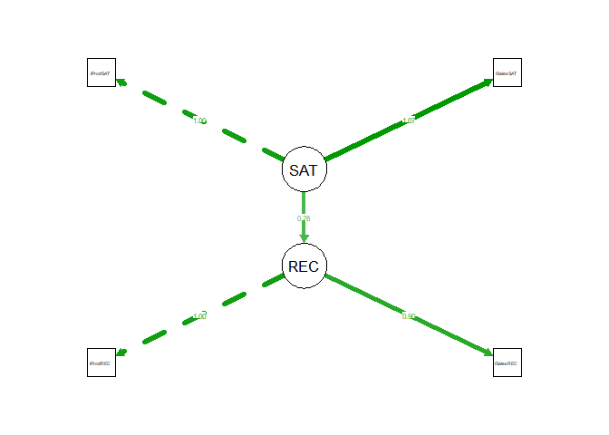

Ch 2. The R Language
================

### 2.2 A Quick Tour of R's Capabilities Using ANOVA, SEM on Consumer Survey Data

**Assignment** uses the assignment operator "&lt;-" to create a named object that comprises of other objects.

**c()** denotes a vector

``` r
# Testing
x <- c(2,4,6,8)
x
```

    ## [1] 2 4 6 8

Install some add-on packages that we will need

``` r
#install.packages(c("lavaan","semPlot","corrplot","multcomp"))
```

This data set contains observations from sales and product satisfaction survey.

-   It has 500 consumers' answers
-   **iProdSAT:** satisfaction with a product
-   **iSalesSAT:** satisfaction with sales experience
-   **iProdREC:** likelihood to recommend the product
-   **iSalesREC:** likelihood to recommend the salesperson
-   **Segement:** numerically-coded segment

The function **`factor`** is used to encode a vector as a factor/category. For this data set, we set `Segment` to be a categorical factor variable. Observe Segment is now a factor data type:

``` r
satData <- read.csv("http://goo.gl/UDv12g")
satData$Segment <- factor(satData$Segment)
head(satData)
```

    ##   iProdSAT iSalesSAT Segment iProdREC iSalesREC
    ## 1        6         2       1        4         3
    ## 2        4         5       3        4         4
    ## 3        5         3       4        5         4
    ## 4        3         3       2        4         4
    ## 5        3         3       3        2         2
    ## 6        4         4       4        5         4

Next we can plot the corr matrix excluding the categorical `Segment` variable in column 3 by specifying -3 in our slice of `satData`.

`corrplot.mixed(corr)`: Using mixed methods to visualize a correlation matrix.

`cor(x,y = NULL)`: computes the correlation of x and y if these are vectors.

``` r
library(corrplot)  # In order to use package
corrplot.mixed(cor(satData[,-3]))
```

 *Observations*:

-   All variables are positively correlated
-   Satisfaction metrics are strongly correlated with one another (0.41)
-   Recommendation metrics are strongly correlated with one another (0.46)

#### Q. Does product satisfaction differ by segment?

We compute a mean satisfaction for each segment using the `aggregate()` function to observe sample means of product satisfaction per segment

`aggregate(x, by, data, function..)` splits the data into subsets and computes summary stats for each subset

``` r
aggregate(iProdSAT ~ Segment, satData, mean)
```

    ##   Segment iProdSAT
    ## 1       1 3.462963
    ## 2       2 3.725191
    ## 3       3 4.103896
    ## 4       4 4.708075

*Observe*: Segment 4 has the highest level of satisfaciton while Segment 1 has the lowest level of satisfaction

#### Q. Are the differences in satisfaction statistically significant?

Perform a one-way ANOVA across the segments:

`aov(formula, data=NULL)`: fits a balanced-design anova model. Formula specifies the model

``` r
satData.anova <- aov(iProdSAT ~ -1 + Segment, satData)  # why is there a -1?
summary(satData.anova)
```

    ##            Df Sum Sq Mean Sq F value Pr(>F)    
    ## Segment     4   8628    2157    2161 <2e-16 ***
    ## Residuals 496    495       1                   
    ## ---
    ## Signif. codes:  0 '***' 0.001 '**' 0.01 '*' 0.05 '.' 0.1 ' ' 1

*Observe*: There are significant differences between the sample means

We plot the ANOVA model to visualize confidence intervals for mean product satisfaction per segment:

`par(..)` can be used to set or query graphical parameters. Parameters are set by specifying them as arguments to par in `tag = value` form

`mar` A numerical vector of the form `c(bottom, left, top, right)` which gives the number of lines of margin to be specified on the four sides of the plot. The default is c(5, 4, 4, 2) + 0.1.

'glht(model)\`: General linear hypotheses and multiple comparisons for parametric models, including generalized linear models, linear mixed effects models, and survival models.

`model`: a fitted model, for example an object returned by lm, glm, or aov etc. It is assumed that coef and vcov methods are available for model.

``` r
#install.packages("zoo")
library(multcomp)
```

    ## Loading required package: mvtnorm

    ## Loading required package: survival

    ## Loading required package: TH.data

    ## Loading required package: MASS

    ## 
    ## Attaching package: 'TH.data'

    ## The following object is masked from 'package:MASS':
    ## 
    ##     geyser

``` r
par(mar=c(4,8,4,2)) # setting margin parameters for plot
plot(glht(satData.anova))
```

 *Observe*:

-   Seg 1, 2 and 3 differ modestly while Seg 4 is much more satisfied than the others
-   Seg 1 has a wider confidence interval than the other segments

##### Likert Rating Scales:

X-axis represents a **Likert rating scale** ranging from 1 to 7 for product satisfaction. "Likert scales are survey questions that offer a range of answer options — from one extreme attitude to another, like “extremely likely” to “not at all likely.” Typically, they include a moderate or neutral midpoint.

Likert scales (named after their creator, American social scientist Rensis Likert) are quite popular because they are one of the most reliable ways to measure opinions, perceptions, and behaviors.""

Src: <https://www.surveymonkey.com/mp/likert-scale/>

##### Structural Equation Models

Many marketing analysts are interested in SEM's and R has multiple pkgs to fit SEMs. "Attitudes, opinions and personality traits are important drivers of consumer behavior, but they are latent constructs and marketing researchers cannot actually observe them or measure them directly. We can only make inferences about them from what we can observe, responses to questionnaire items, for example. Measuring latent constructs is challenging and we must also incorporate estimates of measurement error into our models. SEM excels at both of these tasks."

SEM is suited for causal analysis especially when there's MTC in the data set. It can be used on social media data, transactional data, economic data, and etc. SEM helps us observe latent segments of consumers with different perceptions or attributes (aka Driver Segmentation) or latent variables within the data set

Src: <http://www.kdnuggets.com/2017/03/structural-equation-modeling.html>

"SEM, is a very general, chiefly linear, chiefly cross-sectional statistical modeling technique. Factor analysis, path analysis and regression all represent special cases of SEM. In SEM, interest usually focuses on latent constructs--abstract psychological variables like "intelligence" or "attitude toward the brand"--rather than on the manifest variables used to measure these constructs. Measurement is recognized as difficult and error-prone. By explicitly modeling measurement error, SEM users seek to derive unbiased estimates for the relations between latent constructs. To this end, SEM allows multiple measures to be associated with a single latent construct." Src 2: <http://www2.gsu.edu/~mkteer/sem.html>

#### Q. Do latent variables affect satisfaction or likelihood-to-recommend?

By fitting an SEM to the satisfaction data, we can define a model with latent vars for both satisfaction and recommendation. The SAT latent var is manifested in the two satisfaction metrics while the REC latent var is manifested in the two recommendation metrics.

As marketers, we wish to understand, is the latent REC var affected by the latent SAT var?

``` r
satModel <- "SAT =~ iProdSAT + iSalesSAT 
             REC =~ iProdREC + iSalesREC
             REC ~ SAT "
# line 1: Latent SAT var is observed as items iProdSAT and iSalesSAT
# line 2: Latent REC var is observated as items iProdREC and iSalesREC
# line 3: RECommendation varies with SATisfaction
```

Now we fit the model to the data using `lavaan` package:

``` r
library(lavaan)
```

    ## This is lavaan 0.5-23.1097

    ## lavaan is BETA software! Please report any bugs.

``` r
sat.fit <- cfa(satModel, data=satData)
summary(sat.fit, fit.m=TRUE)
```

    ## lavaan (0.5-23.1097) converged normally after  31 iterations
    ## 
    ##   Number of observations                           500
    ## 
    ##   Estimator                                         ML
    ##   Minimum Function Test Statistic                2.319
    ##   Degrees of freedom                                 1
    ##   P-value (Chi-square)                           0.128
    ## 
    ## Model test baseline model:
    ## 
    ##   Minimum Function Test Statistic              278.557
    ##   Degrees of freedom                                 6
    ##   P-value                                        0.000
    ## 
    ## User model versus baseline model:
    ## 
    ##   Comparative Fit Index (CFI)                    0.995
    ##   Tucker-Lewis Index (TLI)                       0.971
    ## 
    ## Loglikelihood and Information Criteria:
    ## 
    ##   Loglikelihood user model (H0)              -3040.385
    ##   Loglikelihood unrestricted model (H1)      -3039.225
    ## 
    ##   Number of free parameters                          9
    ##   Akaike (AIC)                                6098.769
    ##   Bayesian (BIC)                              6136.701
    ##   Sample-size adjusted Bayesian (BIC)         6108.134
    ## 
    ## Root Mean Square Error of Approximation:
    ## 
    ##   RMSEA                                          0.051
    ##   90 Percent Confidence Interval          0.000  0.142
    ##   P-value RMSEA <= 0.05                          0.347
    ## 
    ## Standardized Root Mean Square Residual:
    ## 
    ##   SRMR                                           0.012
    ## 
    ## Parameter Estimates:
    ## 
    ##   Information                                 Expected
    ##   Standard Errors                             Standard
    ## 
    ## Latent Variables:
    ##                    Estimate  Std.Err  z-value  P(>|z|)
    ##   SAT =~                                              
    ##     iProdSAT          1.000                           
    ##     iSalesSAT         1.067    0.173    6.154    0.000
    ##   REC =~                                              
    ##     iProdREC          1.000                           
    ##     iSalesREC         0.900    0.138    6.528    0.000
    ## 
    ## Regressions:
    ##                    Estimate  Std.Err  z-value  P(>|z|)
    ##   REC ~                                               
    ##     SAT               0.758    0.131    5.804    0.000
    ## 
    ## Variances:
    ##                    Estimate  Std.Err  z-value  P(>|z|)
    ##    .iProdSAT          0.706    0.088    7.994    0.000
    ##    .iSalesSAT         0.793    0.100    7.918    0.000
    ##    .iProdREC          0.892    0.129    6.890    0.000
    ##    .iSalesREC         0.808    0.107    7.533    0.000
    ##     SAT               0.483    0.097    4.970    0.000
    ##    .REC               0.516    0.115    4.505    0.000

*Observe*: the model fits the data well with a Comparative Fit Index (CFI) ~ 1 . See Ch. 10

We can visualize the SEM using the `semPlot` package in order to create a structural model. A **structural model** includes path loadings for a model and the estimated coefficient between latent vars.

``` r
#install.packages(c("lme4","car","psych", "ggplot2","htmlwidgets","data.table","pkgconfig"))
```

``` r
library(semPlot)
semPaths(sat.fit, what="est",
         residuals=FALSE, intercepts=FALSE, nCharNodes=9)
```

    ## Warning in qgraph(Edgelist, labels = nLab, bidirectional = Bidir, directed
    ## = Directed, : The following arguments are not documented and likely not
    ## arguments of qgraph and thus ignored: loopRotation; residuals; residScale;
    ## residEdge; CircleEdgeEnd

 *Observe*:

-   Each proposed latent var is highly loaded (contingent) on its observed (manifested) survey items. (1.0 and 1.7 for SAT, 1.0 and .90 for REC)
-   Customers' latent satisfaction (SAT) is shown to have a strong association or relationship with their likelihood to recommend (REC) with an estimated coefficient of 0.76. See Ch. 10 FMI.

### 2.4 Basic Objects in R

The 3 most important data types are vectors, lists, and data frames.

#### Vectors

A 1D collection of data points of the same type.

-   The command `c()` indicates to R that we are entering the elements of a vector.
-   `summary()` provides an overall summary of the object. For vectors of numerics, range and central tendency stats are given. For vectors of strings, it reports the length of vector and type of elements
-   Indexing denotes particular elements of a data structure
-   Vectors are indexed with square brackets `[#]`

``` r
# Vector assignment
x <- c(2,4,6,8)
x
```

    ## [1] 2 4 6 8

``` r
xNum <- c(1, 3.1453, 5, 7)
xLog <- c(TRUE, FALSE, TRUE, TRUE)
xChar <- c("foo", "bar", "boo", "far")
xMix <- c(1, TRUE, 3, "Hello, World!")  # special characters within quotations are included as part of char

xNum
```

    ## [1] 1.0000 3.1453 5.0000 7.0000

``` r
# Vectors may be appended/combined using c():

x2 <- c(x,x)
x2
```

    ## [1] 2 4 6 8 2 4 6 8

``` r
# Summary function
print(summary(xNum))
```

    ##    Min. 1st Qu.  Median    Mean 3rd Qu.    Max. 
    ##   1.000   2.609   4.073   4.036   5.500   7.000

``` r
cat("\n")
```

``` r
print(summary(xMix))
```

    ##             1             3 Hello, World!          TRUE 
    ##             1             1             1             1

``` r
cat("\n")
```

``` r
print(summary(xLog))  # Provides True False counts
```

    ##    Mode   FALSE    TRUE 
    ## logical       1       3

``` r
# Indexing
xNum[2]
```

    ## [1] 3.1453

``` r
# Arithmetic operations
x2 +1
```

    ## [1] 3 5 7 9 3 5 7 9

``` r
x2 * 2
```

    ## [1]  4  8 12 16  4  8 12 16

``` r
x2 * pi
```

    ## [1]  6.283185 12.566371 18.849556 25.132741  6.283185 12.566371 18.849556
    ## [8] 25.132741

``` r
# Recycling: Reusing the vector of shortest length if lengths do not match

x + x2
```

    ## [1]  4  8 12 16  4  8 12 16

``` r
length(x)
```

    ## [1] 4

``` r
length(x2)
```

    ## [1] 8

When creating a vector, R automatically assigns a data type or class to all elements in the most *generalized* format. For example, c(1,2,3.4) would be *coerced* to type `double` because of the real number 3.5 is more *general* than the integer 1.

``` r
c(1,2,3.5)
```

    ## [1] 1.0 2.0 3.5

``` r
c(1.30, 2.3958, 3)
```

    ## [1] 1.3000 2.3958 3.0000

The most generalized format for `xMix` is `char`:

``` r
str(xMix)  # str for structure
```

    ##  chr [1:4] "1" "TRUE" "3" "Hello, World!"

``` r
# Arithmetic operations based on matching/non-matching data types

xNum[1]
```

    ## [1] 1

``` r
xMix[1]
```

    ## [1] "1"

``` r
xNum[1] + 1
```

    ## [1] 2

``` r
# xMix[1] + 1  # throws an error due to char + numtype
```

To explicity coerce a char type to numeric, use `as.numeric()` function

``` r
as.numeric(xMix[1]) + 1
```

    ## [1] 2

``` r
# browseVignettes()  # A helpful function for providing info on all installed packages
```

``` r
# To create integer sequences, use ":"
xSeq <- 1:10
xSeq
```

    ##  [1]  1  2  3  4  5  6  7  8  9 10

``` r
str(xSeq)
```

    ##  int [1:10] 1 2 3 4 5 6 7 8 9 10

``` r
# When applying math to int sequences, be careful of order of operation. ":" is applied first before any other operation
1:5*2
```

    ## [1]  2  4  6  8 10

``` r
1:(5*2)
```

    ##  [1]  1  2  3  4  5  6  7  8  9 10

Sequences are useful for indexing and you can use sequences inside indexing \[ \]:

``` r
xNum
```

    ## [1] 1.0000 3.1453 5.0000 7.0000

``` r
xNum[2:4]
```

    ## [1] 3.1453 5.0000 7.0000

``` r
myStart <- 2
xNum[myStart:sqrt(myStart + 7)] # Evals to xNum[2:3]
```

    ## [1] 3.1453 5.0000

For more sophisticated sequences, use `seq()` for sequence and `rep()` for replicated sequences. In the last example below, we look at the inner expression sequence `[-3, 1,...13]`. Each ELEMENT of that vector will be replicated n-times as specified in the 2nd argument to `rep()`. Replicate, not multiply!

We can also exclude items by using negative indices `xSeq[-1]` i.e. exclude first element

``` r
seq(from=-5, to=28, by=4) # start from -5 to 28 and step -4
```

    ## [1] -5 -1  3  7 11 15 19 23 27

``` r
rep(c(1,2,3), each=3)  # replicate the vector 3 times
```

    ## [1] 1 1 1 2 2 2 3 3 3

``` r
seq(from=-3, to=13, by=4)
```

    ## [1] -3  1  5  9 13

``` r
rep(seq(from=-3, to=13, by=4), c(1,2,3,2,1))
```

    ## [1] -3  1  1  5  5  5  9  9 13

``` r
# Exclude items
xSeq
```

    ##  [1]  1  2  3  4  5  6  7  8  9 10

``` r
xSeq[-1] # Excluding 1st element
```

    ## [1]  2  3  4  5  6  7  8  9 10

``` r
xSeq[c(-1,-10)]  # Excluding more than one element requires a vector argument
```

    ## [1] 2 3 4 5 6 7 8 9

``` r
# 1 is the start of the row. It indicates the vector position index of the 1st item printed on each row of output
1:300
```

    ##   [1]   1   2   3   4   5   6   7   8   9  10  11  12  13  14  15  16  17
    ##  [18]  18  19  20  21  22  23  24  25  26  27  28  29  30  31  32  33  34
    ##  [35]  35  36  37  38  39  40  41  42  43  44  45  46  47  48  49  50  51
    ##  [52]  52  53  54  55  56  57  58  59  60  61  62  63  64  65  66  67  68
    ##  [69]  69  70  71  72  73  74  75  76  77  78  79  80  81  82  83  84  85
    ##  [86]  86  87  88  89  90  91  92  93  94  95  96  97  98  99 100 101 102
    ## [103] 103 104 105 106 107 108 109 110 111 112 113 114 115 116 117 118 119
    ## [120] 120 121 122 123 124 125 126 127 128 129 130 131 132 133 134 135 136
    ## [137] 137 138 139 140 141 142 143 144 145 146 147 148 149 150 151 152 153
    ## [154] 154 155 156 157 158 159 160 161 162 163 164 165 166 167 168 169 170
    ## [171] 171 172 173 174 175 176 177 178 179 180 181 182 183 184 185 186 187
    ## [188] 188 189 190 191 192 193 194 195 196 197 198 199 200 201 202 203 204
    ## [205] 205 206 207 208 209 210 211 212 213 214 215 216 217 218 219 220 221
    ## [222] 222 223 224 225 226 227 228 229 230 231 232 233 234 235 236 237 238
    ## [239] 239 240 241 242 243 244 245 246 247 248 249 250 251 252 253 254 255
    ## [256] 256 257 258 259 260 261 262 263 264 265 266 267 268 269 270 271 272
    ## [273] 273 274 275 276 277 278 279 280 281 282 283 284 285 286 287 288 289
    ## [290] 290 291 292 293 294 295 296 297 298 299 300

``` r
xNum[2:4]
```

    ## [1] 3.1453 5.0000 7.0000

``` r
xSub <- xNum[2:4]
xSub
```

    ## [1] 3.1453 5.0000 7.0000

``` r
# Indexing also works with logical values
xNum
```

    ## [1] 1.0000 3.1453 5.0000 7.0000

``` r
xNum[c(TRUE, TRUE, FALSE, FALSE)]
```

    ## [1] 1.0000 3.1453

``` r
# We can also index based on conditions 
xNum[xNum >= 5]
```

    ## [1] 5 7

##### Missing, Undefined, and Infinity Values

Missing values are denoted as `NA` which is a special dtype for missing values. Any math performed on a `NA` becomes `NA`.

1.  We can override this behavior by telling R to ignore `NA` data rather than calculating on it. Many commands include argument `na.rm=TRUE` to ignore NA values.

2.  Another way is to remove NA values before calculating on them. This is done most eaisly with `na.omit()` on the data.

3.  We can also test for NA values using the `is.na()` function and then index data on that function for values that are *not* NA by adding the `!` for "not" operator

``` r
my.test.scores <- c(91, NA, NA, 100)

mean(my.test.scores)
```

    ## [1] NA

``` r
max(my.test.scores)
```

    ## [1] NA

``` r
# Method 1: Using na.rm=TRUE
mean(my.test.scores, na.rm=TRUE)
```

    ## [1] 95.5

``` r
# Method 2: Using na.omit()
mean(na.omit(my.test.scores))
```

    ## [1] 95.5

``` r
# Method 3: Indexing on !is.na()
is.na(my.test.scores)
```

    ## [1] FALSE  TRUE  TRUE FALSE

``` r
mean(my.test.scores[!is.na(my.test.scores)])
```

    ## [1] 95.5

When importing data, be careful of numeric values such as "-9999" to denote missing data. We will need to replace those values with NA using indices. The third command below tells R to select `my.test.scores` where the value is lower than -9000 and replace those elements with NA:

``` r
my.test.scores <- c(91,-9999, 100, -9999)
my.test.scores[my.test.scores < -9000] <- NA
my.test.scores
```

    ## [1]  91  NA 100  NA

``` r
mean(my.test.scores, na.rm=TRUE)
```

    ## [1] 95.5

R handles infinity and undefined numbers as `Inf` and `NaN`:

``` r
log(-1)
```

    ## Warning in log(-1): NaNs produced

    ## [1] NaN

``` r
log(0)
```

    ## [1] -Inf

##### Lists

Lists, unlike vectors, are collections of objects of any type (i.e more than 1 data type). All elements in a vector must be the same type. We can combine vectors of different dtypes in a list using `list()`. Using `str()` we see that objects inside the list retain the types that they have as separate vectors

Lists are indexed with double backeds (\[\[ and \]\]) instead of the single brackets that vectors use. For example, `xList` comprises of 2 objects that are indexed as \[\[1\]\] and \[\[2\]\]. We can index the objects and find summary info on each object.

``` r
str(xNum)
```

    ##  num [1:4] 1 3.15 5 7

``` r
str(xChar)
```

    ##  chr [1:4] "foo" "bar" "boo" "far"

``` r
xList <- list(xNum, xChar)
xList
```

    ## [[1]]
    ## [1] 1.0000 3.1453 5.0000 7.0000
    ## 
    ## [[2]]
    ## [1] "foo" "bar" "boo" "far"

``` r
str(xList)
```

    ## List of 2
    ##  $ : num [1:4] 1 3.15 5 7
    ##  $ : chr [1:4] "foo" "bar" "boo" "far"

``` r
summary(xList[[1]])
```

    ##    Min. 1st Qu.  Median    Mean 3rd Qu.    Max. 
    ##   1.000   2.609   4.073   4.036   5.500   7.000

``` r
summary(xList[[2]])
```

    ## bar boo far foo 
    ##   1   1   1   1

It's easier to run command on all memebers of the list at once using `lapply(OBJECT,FUNCTION)` or "list apply" command. The function is applied to each object. `xList` is separated into separate list elements then it ran `summary()` on each element:

``` r
lapply(xList, summary)
```

    ## [[1]]
    ##    Min. 1st Qu.  Median    Mean 3rd Qu.    Max. 
    ##   1.000   2.609   4.073   4.036   5.500   7.000 
    ## 
    ## [[2]]
    ## bar boo far foo 
    ##   1   1   1   1

###### Naming List Elments

Each elmeent in a list may be assigned a name which you can call via indexing or `names()`. To assign names to objects in a list, use the `names(OBJECT)` and a vector with the names. Another way is to create and name at the same time by assigning a name to the objects within `list()`:

``` r
# Method 1: Create list, then names()
xList <- list(xNum, xChar)
names(xList) <- c("Numbers", "Characters")
xList
```

    ## $Numbers
    ## [1] 1.0000 3.1453 5.0000 7.0000
    ## 
    ## $Characters
    ## [1] "foo" "bar" "boo" "far"

``` r
names(xList)
```

    ## [1] "Numbers"    "Characters"

``` r
# Method 2: Create and name as once using list()
xList <- list(Numbers=xNum, Characters=xChar)
xList
```

    ## $Numbers
    ## [1] 1.0000 3.1453 5.0000 7.0000
    ## 
    ## $Characters
    ## [1] "foo" "bar" "boo" "far"

``` r
names(xList)
```

    ## [1] "Numbers"    "Characters"

``` r
# List indexing
xList[[1]] # indexing using position
```

    ## [1] 1.0000 3.1453 5.0000 7.0000

``` r
xList$Numbers # indexing using $
```

    ## [1] 1.0000 3.1453 5.0000 7.0000

``` r
xList[["Numbers"]] # indexing using [[""]]
```

    ## [1] 1.0000 3.1453 5.0000 7.0000

#### Data Frames

Learning to work with data frames is perhaps the most important set of skills in R. Data frames include columns as **variables** and rows as **observationas**. We can construct a data frame using `data.frame()` function which takes an input of set of vectors with same length.

In this code, we use *dot notation* with a suffix.`.df` to remind us it is a data frame. Column names are inherited from vectors and each row is numbered sequentially starting at 1.

``` r
(x.df <- data.frame(xNum, xLog, xChar)) 
```

    ##     xNum  xLog xChar
    ## 1 1.0000  TRUE   foo
    ## 2 3.1453 FALSE   bar
    ## 3 5.0000  TRUE   boo
    ## 4 7.0000  TRUE   far

``` r
# putting parenthess around the whole expression tells R to evalute the resulting object. This saves typing. 
```

``` r
x.df[2,1] # Select row 2, col 1
```

    ## [1] 3.1453

``` r
x.df[1,3] # Select row 1, col 3.... this is a factor variable
```

    ## [1] foo
    ## Levels: bar boo far foo

###### Nominal Factors

By default, R converts char data to nominal factors. For ex, when xChar was added to the df, its values were added as levels of a **categorical (nominal) data type**. Internally, R stores factor vars as a vector of integers and a seperate list of labels naming the categories. Categories are called **levels** and can be accessed with `levels()` function.

We can override this behavior by calling `stringsAsFractors = F` in our `data.frame()` function, since there can be char vars that aren't really factors such as addresses, names, etc.. in survey data.

``` r
(x.df <- data.frame(xNum, xLog, xChar, stringsAsFactors=F))  # xChar is now of char type
```

    ##     xNum  xLog xChar
    ## 1 1.0000  TRUE   foo
    ## 2 3.1453 FALSE   bar
    ## 3 5.0000  TRUE   boo
    ## 4 7.0000  TRUE   far

``` r
print(x.df[,3]) # select all rows in col 3
```

    ## [1] "foo" "bar" "boo" "far"

``` r
x.df[2:3,]
```

    ##     xNum  xLog xChar
    ## 2 3.1453 FALSE   bar
    ## 3 5.0000  TRUE   boo

``` r
x.df[-3:-4,] #excl row 3 and 4
```

    ##     xNum  xLog xChar
    ## 1 1.0000  TRUE   foo
    ## 2 3.1453 FALSE   bar

Indexing a data frame returns an object. The object type depends on the selected objects:

-   choosing a single element outputs a vector of length 1
-   choose a column or row outputs a vector
-   choosing rows and columns outputs a data frame

``` r
str(x.df[2,1])
```

    ##  num 3.15

``` r
str(x.df[,2])
```

    ##  logi [1:4] TRUE FALSE TRUE TRUE

``` r
str(x.df[1,2:3])
```

    ## 'data.frame':    1 obs. of  2 variables:
    ##  $ xLog : logi TRUE
    ##  $ xChar: chr "foo"

``` r
str(x.df$xNum)
```

    ##  num [1:4] 1 3.15 5 7

Let's create a mock marketing research data set by cleaning up our workspace then creating new data. Notice below, we specified that store number is a **nominal factor** (telling R isn't not really a number but a factor).

We can get a get a list of our store managers by selcting that column using $ notation.

`rm()` removes objects

``` r
# delete all objects using rm(list=ls())
rm(list=ls())

# store values within each column
store.num <- factor(c(3,14,21,32,54))
store.rev <- c(545, 654, 345, 678, 234)
store.visits <- c(45,78,32,56,34)
store.manager <- c("Annie", "Bert", "Carla","Dave","Ella")

# create df
(store.df <- data.frame(store.num, store.rev, store.visits, store.manager, stringsAsFactors=F))  
```

    ##   store.num store.rev store.visits store.manager
    ## 1         3       545           45         Annie
    ## 2        14       654           78          Bert
    ## 3        21       345           32         Carla
    ## 4        32       678           56          Dave
    ## 5        54       234           34          Ella

``` r
# Unless we've explicitly declared a var as a factor, all char vars should not be considered Factors
```

``` r
store.df$store.manager
```

    ## [1] "Annie" "Bert"  "Carla" "Dave"  "Ella"

``` r
mean(store.df$store.rev)
```

    ## [1] 491.2

We can also pass columns from the df to statistical functions like `mean()` Similarly, we can use the `cor()` function to compute the Pearson product-moment correlation coefficient (Pearson's R), to gauge the association between store visits and revenue in our data

``` r
cor(store.df$store.rev, store.df$store.visits) # Pearson's R
```

    ## [1] 0.8279793

For `summary()`:

-   Factor vars: frequency counts
-   numeric vars: arithmetic summaries
-   char vars: simple descr. of the char var

``` r
# Obtain basic stats

summary(store.df) 
```

    ##  store.num   store.rev      store.visits store.manager
    ##  3 :1      Min.   :234.0   Min.   :32    NULL:Annie   
    ##  14:1      1st Qu.:345.0   1st Qu.:34    NULL:Bert    
    ##  21:1      Median :545.0   Median :45    NULL:Carla   
    ##  32:1      Mean   :491.2   Mean   :49    NULL:Dave    
    ##  54:1      3rd Qu.:654.0   3rd Qu.:56    NULL:Ella    
    ##            Max.   :678.0   Max.   :78

##### 2.6 Loading and Saving Data

Covers:

-   How to save and read native R objects
-   How to save entire R sessions
-   How to read and write CSV formats

**Native/Binary R objects** are representations of objects in an R-specific format. If we need to save an object exclusively for R, this format will be useful to us. Use `save()` to write a binary object to disk and `load()` to read it.

`save(OBJECT, FILE)` saves the object in current working directory as the FILE name. It can also take a group of objects as an argument by using `list=c()` and filling in `c()` with a char vector. FILE is the file name of saves object. `.RData` is the native data file type for R.

`load(FILE)`: loads a file and reads it. It's objects are placed into memory. When a file is loaded, its objects will overwite any other objects in memory with the same names.

`getwd()`: reports the working directory

`setwd(PATH)`: sets working directory path

``` r
getwd()
```

    ## [1] "C:/Users/sonya/Documents/git/r-for-marketing-research-and-analytics"

``` r
#save(store.df, file="store-df-backup.RData") #saving it to wd

#rm(store.df) # deleting it from memory. Only use if after save() gives no error

#mean(store.df) # Provides an error since we removed store.df from memory

#load("store-df-backup.RData")
#mean(store.df$store.rev)
```

``` r
# illustration of overwriting behavior from load()
store.df <- 5
#load("store-df-backup.RData")
store.df
```

    ## [1] 5

###### Filenames and Workspace Image Files

Note, paths need to be specified with '/' instead of '' as in Windows. We can use tilde ~ to specify current working directory path in our path.

`list.files()` : lists the files in a working directory

`save.image(FILE)` saves the image of an entire working session. If FILE is excluded, it defaults to a file named ".RData". Base R and R Studio will prompt us to save a memory image upon closing, but we can also do it ourselves using save.image()

`file.remove()` removes files from working directory. The status returned by this function is a vector indicating whether each file was removed (TRUE) or not (FALSE).

``` r
save.image() # saves file ".RData"
list.files()
```

    ## [1] "Ch-2-The-R-Language.nb.html"                 
    ## [2] "Ch-2-The-R-Language.Rmd"                     
    ## [3] "Plots"                                       
    ## [4] "r-for-marketing-research-and-analytics.Rproj"
    ## [5] "README.md"                                   
    ## [6] "store-df-backup.RData"                       
    ## [7] "store-df.csv"

Loading an image will overwite current memory objects that have the same names. It does not restore memory to a snapshot of a previous state, but rather adds those contents to current memory.

###### CSV Files

Many analysts save data in delimited files such as CSV files and tab-separated value files (TSV) to move data between tools like R, db's, MS Excel.

`write.csv(OBJECT, file=)` writes data to a CSV file. It's highly recommended to add `row.names = F` option to eliminate an unnamed column containing labels for each row.

`read.csv(FILE)`: reads data from a CSV file formatted as a data frame.

One of the disadvantages with CSV files is that they lose var dtype distinctions because they are read out in plain text:

``` r
write.csv(store.df, row.names=F)
```

    ## "x"
    ## 5

``` r
write.csv(store.df, file="store-df.csv", row.names=F)
```

``` r
read.csv("store-df.csv")
```

    ##   x
    ## 1 5

``` r
store.df2 <- read.csv("store-df.csv", stringsAsFactors = F)
store.df2 
```

    ##   x
    ## 1 5

``` r
#store.df2$store.num <- factor(store.df2$store.num)
#str(store.df2$store.num)
```

``` r
store.df == store.df2
```

    ##         x
    ## [1,] TRUE

Using \`all.equal(x,y)\`\` is more useful to compare differences between objects since it ignores binary rounding errors. Also, the output is more compact:

``` r
all.equal(store.df, store.df2)
```

    ## [1] "Modes: numeric, list"                           
    ## [2] "names for current but not for target"           
    ## [3] "Attributes: < target is NULL, current is list >"
    ## [4] "target is numeric, current is data.frame"

A more general overview of options for data exchange is provided by the *R Data Import/Export* manual

##### 2.7 Writing Your Own Functions

Many analyses in R are repetitive i.e. compute statistics across slices of data such as different sales regions, produce analyses from new data sets every quarter, etc. R provides functions to let us write a set of commands and reuse it on different data.

A schematic for a new function is: `FUNC NAME <- function(INPUTS) {EXPR}` where EXPR is usually a set of multiple lines that operate on the inputs. By default, the return value of the function is the output of the last command in the function declaration.

For inputs, we can name them with any legal variable name in R. *Arguments* are inputs in a function while *parameters* are inputs in a statistical model. An argument has meaning only within its function (scoped to function). Outside the function, they don't exist.

When writing a function, it's recommended to:

-   Put braces around the body using { and } even it's a one-liner
-   Create temporary values to hold results along the way inside the function
-   Comment regularly
-   Use `return()` to show the explicit value returned by the function

``` r
#se <- function(x) {sd(x) / sqrt(length(x))}
#se(store.df$store.visits)

# Provide standard error per deviation
```

For example, to compute the upper-bound 95% CI as, we calculate the mean + 1.96 SE

``` r
#mean(store.df$store.visits) + 1.96 * se(store.df$store.visits)
```

*Observe*: If the data is a representative sample from a larger population, we expect the mean of samples to be 65.51 or less in 97.5% of the samples (97.5% because the 9% confidence interval is symmetric around 50%, extending from 2.5 to 97.5%). We can be very confident from this data that the mean number of store visits is less than 65.52.

``` r
# se() function rewritten

se <- function(x) {
  tmp.sd <- sd(x)  #tmp is just another named variable to help us remember
  tmp.N <- length(x)
  tmp.se <- tmp.sd / sqrt(tmp.N) 
  return(tmp.se)
}

se  # For more info on a function simply type in function name without parentheses
```

    ## function(x) {
    ##   tmp.sd <- sd(x)  #tmp is just another named variable to help us remember
    ##   tmp.N <- length(x)
    ##   tmp.se <- tmp.sd / sqrt(tmp.N) 
    ##   return(tmp.se)
    ## }

##### If/While/For Control Structures

``` r
# if (TEST) {EXPR} [else EXPR.B]  # do EXPR if Test is true, else EXPR.b

#se(store.df$store.visits)

#if (se(store.df$store.visits) > 5) {
#  print("SE is greater than 5")
#  } else {
#  print("SE is less than 5")
#  }
```

``` r
# For expressions

for (i in 1:10) {
  print(paste("The number is", i))
}
```

    ## [1] "The number is 1"
    ## [1] "The number is 2"
    ## [1] "The number is 3"
    ## [1] "The number is 4"
    ## [1] "The number is 5"
    ## [1] "The number is 6"
    ## [1] "The number is 7"
    ## [1] "The number is 8"
    ## [1] "The number is 9"
    ## [1] "The number is 10"

``` r
# While expressions
i = 0
while (i<=10) {
  i = i + 1
  print(paste("The number is", i))
}
```

    ## [1] "The number is 1"
    ## [1] "The number is 2"
    ## [1] "The number is 3"
    ## [1] "The number is 4"
    ## [1] "The number is 5"
    ## [1] "The number is 6"
    ## [1] "The number is 7"
    ## [1] "The number is 8"
    ## [1] "The number is 9"
    ## [1] "The number is 10"
    ## [1] "The number is 11"

##### Lambda Functions (Anonoymous Functions)

Can substitute for a general expression and does not need to be declared as a named function. We use `apply/lapply()`

``` r
my.data <- matrix(runif(100), ncol=5)

# Without lambda functions
apply(my.data, 2, median) / 2
```

    ## [1] 0.3072567 0.2400730 0.2190853 0.2698080 0.2698717

``` r
# Another way
halfmedian <- function(x){median(x) / 2}
apply(my.data,MARGIN=2, FUN=halfmedian)
```

    ## [1] 0.3072567 0.2400730 0.2190853 0.2698080 0.2698717

``` r
# Using lambda functions
apply(my.data, 2, function(x){ median(x) / 2})
```

    ## [1] 0.3072567 0.2400730 0.2190853 0.2698080 0.2698717

##### Cleaning Up Memory

R keeps everying in memory by default.

`ls()` to list objects stored in memory `rm()` to remove objects from memory `rm(list=c(LIST)` to remove several objects in character vector of names `rm(list=ls(pattern="STRING"))` to remove objects following a pattern `rm(list=ls())` delects all visible objects in memory

``` r
ls()
```

    ##  [1] "halfmedian"    "i"             "my.data"       "se"           
    ##  [5] "store.df"      "store.df2"     "store.manager" "store.num"    
    ##  [9] "store.rev"     "store.visits"

``` r
rm(i)
ls()
```

    ## [1] "halfmedian"    "my.data"       "se"            "store.df"     
    ## [5] "store.df2"     "store.manager" "store.num"     "store.rev"    
    ## [9] "store.visits"
