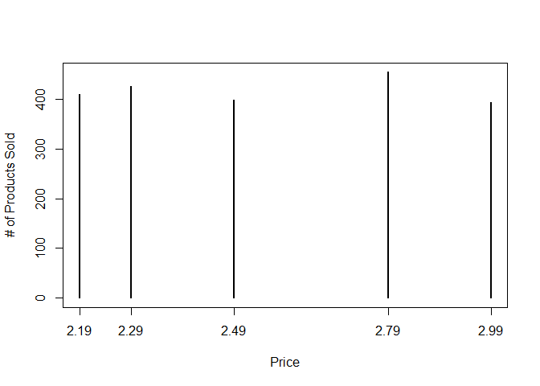
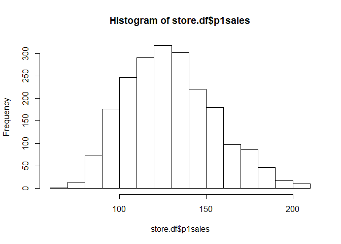
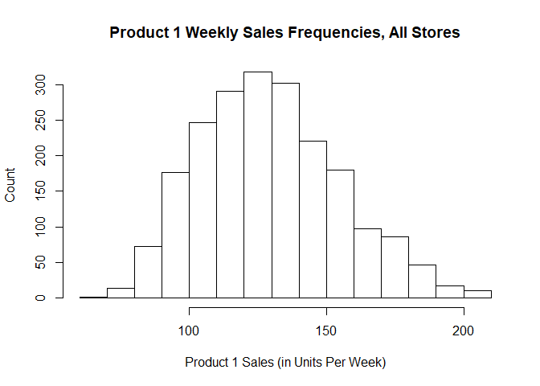
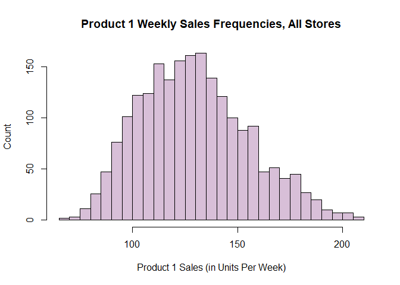

Ch 3. Describing Data
================
Sonya Hua
September 1, 2017

3.1 Simulating Data
-------------------

It's important to describe and explore any data set before moving on to more complex analysis. We will be created data to be analyzed in later parts of the chapter. The process of creating data lets us practice and deepen R skills from Ch. 2. It also lets us manipulate synthetic dat, run analyses again, and examine how the results can change. R analysts often use simulated data to prove that their methods are working as expected.

Our 1st data set is composed of observations of total sales by week for 2 products at a chain of stores around the world (20 stores total) over 2 years, with price and promotion status.

### 3.1.1 Store Data & Setting Up the Data Structure

``` r
k.stores <- 20
k.weeks <- 104

# create a data frame of initially missing values to hold the data
store.df <- data.frame(matrix(NA, ncol=10, nrow=k.stores * k.weeks))
names(store.df) <- c("storeNum", "Year", "Week", "p1sales", "p2sales", 
                     "p1price", "p2price", "p1prom", "p2prom", "country")  # Assign Var Names to df
str(store.df)
```

    ## 'data.frame':    2080 obs. of  10 variables:
    ##  $ storeNum: logi  NA NA NA NA NA NA ...
    ##  $ Year    : logi  NA NA NA NA NA NA ...
    ##  $ Week    : logi  NA NA NA NA NA NA ...
    ##  $ p1sales : logi  NA NA NA NA NA NA ...
    ##  $ p2sales : logi  NA NA NA NA NA NA ...
    ##  $ p1price : logi  NA NA NA NA NA NA ...
    ##  $ p2price : logi  NA NA NA NA NA NA ...
    ##  $ p1prom  : logi  NA NA NA NA NA NA ...
    ##  $ p2prom  : logi  NA NA NA NA NA NA ...
    ##  $ country : logi  NA NA NA NA NA NA ...

``` r
dim(store.df) # get dimensions of df
```

    ## [1] 2080   10

Create 2 vectors that will represent the store number and country per observation:

``` r
(store.num <- 101:(100+k.stores))
```

    ##  [1] 101 102 103 104 105 106 107 108 109 110 111 112 113 114 115 116 117
    ## [18] 118 119 120

``` r
(store.cty <- c(rep("US",3), rep("DE",5), rep("GB", 3), rep("BR",2),
                rep("JP",4), rep("AU",1), rep("CN",2)))  # Store's country location
```

    ##  [1] "US" "US" "US" "DE" "DE" "DE" "DE" "DE" "GB" "GB" "GB" "BR" "BR" "JP"
    ## [15] "JP" "JP" "JP" "AU" "CN" "CN"

``` r
length(store.cty)
```

    ## [1] 20

Now we replace the appropriate cols in the df with those values using `rep()` to expand the vectors to match the \# of stores and weeks

``` r
store.df$storeNum <- rep(store.num, each=k.weeks) # each = # of times each element is repeated
# This is different from "times=" which repeats the whole vector n-times
store.df$country <- rep(store.cty, each =k.weeks) 
rm(store.num, store.cty) # clean up memory
```

Do the same process for the Week and Year columns:

``` r
store.df$Week <- rep(c(1:52),times=k.stores * 2) # Replicate 52 weeks 40 times so that there will be 2 years per store
store.df$Year <- rep(c(1,2), each=52, times=k.stores)  # Replicate Year 1 and 2-  52x per store
```

Let's check the overall data structure:

``` r
str(store.df)
```

    ## 'data.frame':    2080 obs. of  10 variables:
    ##  $ storeNum: int  101 101 101 101 101 101 101 101 101 101 ...
    ##  $ Year    : num  1 1 1 1 1 1 1 1 1 1 ...
    ##  $ Week    : int  1 2 3 4 5 6 7 8 9 10 ...
    ##  $ p1sales : logi  NA NA NA NA NA NA ...
    ##  $ p2sales : logi  NA NA NA NA NA NA ...
    ##  $ p1price : logi  NA NA NA NA NA NA ...
    ##  $ p2price : logi  NA NA NA NA NA NA ...
    ##  $ p1prom  : logi  NA NA NA NA NA NA ...
    ##  $ p2prom  : logi  NA NA NA NA NA NA ...
    ##  $ country : chr  "US" "US" "US" "US" ...

*Observe*

-   Data values populated as expected, with proper col names
-   `country` has a char type when it should be factor var since it is a categorical value
-   `storeNum` has a int type when it should be factor var since we will be categorizing by store number and it is a label from something else

By converting `country` and `storeNum` to factors, R will know to tream them as categorical inputs in subsequent analyses i.e. regression models. It's best practice to set var types correctly early on as they are created to avoid errors later:

``` r
store.df$storeNum <- factor(store.df$storeNum)
store.df$country <- factor(store.df$country)
store.df$Week <- as.integer(store.df$Week)
store.df$Year <- as.integer(store.df$Year)
str(store.df)
```

    ## 'data.frame':    2080 obs. of  10 variables:
    ##  $ storeNum: Factor w/ 20 levels "101","102","103",..: 1 1 1 1 1 1 1 1 1 1 ...
    ##  $ Year    : int  1 1 1 1 1 1 1 1 1 1 ...
    ##  $ Week    : int  1 2 3 4 5 6 7 8 9 10 ...
    ##  $ p1sales : logi  NA NA NA NA NA NA ...
    ##  $ p2sales : logi  NA NA NA NA NA NA ...
    ##  $ p1price : logi  NA NA NA NA NA NA ...
    ##  $ p2price : logi  NA NA NA NA NA NA ...
    ##  $ p1prom  : logi  NA NA NA NA NA NA ...
    ##  $ p2prom  : logi  NA NA NA NA NA NA ...
    ##  $ country : Factor w/ 7 levels "AU","BR","CN",..: 7 7 7 7 7 7 7 7 7 7 ...

*Observe* storeNum (with 20 levels) and country (with 7 levels) has been converted to factors.

``` r
# check first and last rows for mistakes
head(store.df, 120)
```

    ##     storeNum Year Week p1sales p2sales p1price p2price p1prom p2prom
    ## 1        101    1    1      NA      NA      NA      NA     NA     NA
    ## 2        101    1    2      NA      NA      NA      NA     NA     NA
    ## 3        101    1    3      NA      NA      NA      NA     NA     NA
    ## 4        101    1    4      NA      NA      NA      NA     NA     NA
    ## 5        101    1    5      NA      NA      NA      NA     NA     NA
    ## 6        101    1    6      NA      NA      NA      NA     NA     NA
    ## 7        101    1    7      NA      NA      NA      NA     NA     NA
    ## 8        101    1    8      NA      NA      NA      NA     NA     NA
    ## 9        101    1    9      NA      NA      NA      NA     NA     NA
    ## 10       101    1   10      NA      NA      NA      NA     NA     NA
    ## 11       101    1   11      NA      NA      NA      NA     NA     NA
    ## 12       101    1   12      NA      NA      NA      NA     NA     NA
    ## 13       101    1   13      NA      NA      NA      NA     NA     NA
    ## 14       101    1   14      NA      NA      NA      NA     NA     NA
    ## 15       101    1   15      NA      NA      NA      NA     NA     NA
    ## 16       101    1   16      NA      NA      NA      NA     NA     NA
    ## 17       101    1   17      NA      NA      NA      NA     NA     NA
    ## 18       101    1   18      NA      NA      NA      NA     NA     NA
    ## 19       101    1   19      NA      NA      NA      NA     NA     NA
    ## 20       101    1   20      NA      NA      NA      NA     NA     NA
    ## 21       101    1   21      NA      NA      NA      NA     NA     NA
    ## 22       101    1   22      NA      NA      NA      NA     NA     NA
    ## 23       101    1   23      NA      NA      NA      NA     NA     NA
    ## 24       101    1   24      NA      NA      NA      NA     NA     NA
    ## 25       101    1   25      NA      NA      NA      NA     NA     NA
    ## 26       101    1   26      NA      NA      NA      NA     NA     NA
    ## 27       101    1   27      NA      NA      NA      NA     NA     NA
    ## 28       101    1   28      NA      NA      NA      NA     NA     NA
    ## 29       101    1   29      NA      NA      NA      NA     NA     NA
    ## 30       101    1   30      NA      NA      NA      NA     NA     NA
    ## 31       101    1   31      NA      NA      NA      NA     NA     NA
    ## 32       101    1   32      NA      NA      NA      NA     NA     NA
    ## 33       101    1   33      NA      NA      NA      NA     NA     NA
    ## 34       101    1   34      NA      NA      NA      NA     NA     NA
    ## 35       101    1   35      NA      NA      NA      NA     NA     NA
    ## 36       101    1   36      NA      NA      NA      NA     NA     NA
    ## 37       101    1   37      NA      NA      NA      NA     NA     NA
    ## 38       101    1   38      NA      NA      NA      NA     NA     NA
    ## 39       101    1   39      NA      NA      NA      NA     NA     NA
    ## 40       101    1   40      NA      NA      NA      NA     NA     NA
    ## 41       101    1   41      NA      NA      NA      NA     NA     NA
    ## 42       101    1   42      NA      NA      NA      NA     NA     NA
    ## 43       101    1   43      NA      NA      NA      NA     NA     NA
    ## 44       101    1   44      NA      NA      NA      NA     NA     NA
    ## 45       101    1   45      NA      NA      NA      NA     NA     NA
    ## 46       101    1   46      NA      NA      NA      NA     NA     NA
    ## 47       101    1   47      NA      NA      NA      NA     NA     NA
    ## 48       101    1   48      NA      NA      NA      NA     NA     NA
    ## 49       101    1   49      NA      NA      NA      NA     NA     NA
    ## 50       101    1   50      NA      NA      NA      NA     NA     NA
    ## 51       101    1   51      NA      NA      NA      NA     NA     NA
    ## 52       101    1   52      NA      NA      NA      NA     NA     NA
    ## 53       101    2    1      NA      NA      NA      NA     NA     NA
    ## 54       101    2    2      NA      NA      NA      NA     NA     NA
    ## 55       101    2    3      NA      NA      NA      NA     NA     NA
    ## 56       101    2    4      NA      NA      NA      NA     NA     NA
    ## 57       101    2    5      NA      NA      NA      NA     NA     NA
    ## 58       101    2    6      NA      NA      NA      NA     NA     NA
    ## 59       101    2    7      NA      NA      NA      NA     NA     NA
    ## 60       101    2    8      NA      NA      NA      NA     NA     NA
    ## 61       101    2    9      NA      NA      NA      NA     NA     NA
    ## 62       101    2   10      NA      NA      NA      NA     NA     NA
    ## 63       101    2   11      NA      NA      NA      NA     NA     NA
    ## 64       101    2   12      NA      NA      NA      NA     NA     NA
    ## 65       101    2   13      NA      NA      NA      NA     NA     NA
    ## 66       101    2   14      NA      NA      NA      NA     NA     NA
    ## 67       101    2   15      NA      NA      NA      NA     NA     NA
    ## 68       101    2   16      NA      NA      NA      NA     NA     NA
    ## 69       101    2   17      NA      NA      NA      NA     NA     NA
    ## 70       101    2   18      NA      NA      NA      NA     NA     NA
    ## 71       101    2   19      NA      NA      NA      NA     NA     NA
    ## 72       101    2   20      NA      NA      NA      NA     NA     NA
    ## 73       101    2   21      NA      NA      NA      NA     NA     NA
    ## 74       101    2   22      NA      NA      NA      NA     NA     NA
    ## 75       101    2   23      NA      NA      NA      NA     NA     NA
    ## 76       101    2   24      NA      NA      NA      NA     NA     NA
    ## 77       101    2   25      NA      NA      NA      NA     NA     NA
    ## 78       101    2   26      NA      NA      NA      NA     NA     NA
    ## 79       101    2   27      NA      NA      NA      NA     NA     NA
    ## 80       101    2   28      NA      NA      NA      NA     NA     NA
    ## 81       101    2   29      NA      NA      NA      NA     NA     NA
    ## 82       101    2   30      NA      NA      NA      NA     NA     NA
    ## 83       101    2   31      NA      NA      NA      NA     NA     NA
    ## 84       101    2   32      NA      NA      NA      NA     NA     NA
    ## 85       101    2   33      NA      NA      NA      NA     NA     NA
    ## 86       101    2   34      NA      NA      NA      NA     NA     NA
    ## 87       101    2   35      NA      NA      NA      NA     NA     NA
    ## 88       101    2   36      NA      NA      NA      NA     NA     NA
    ## 89       101    2   37      NA      NA      NA      NA     NA     NA
    ## 90       101    2   38      NA      NA      NA      NA     NA     NA
    ## 91       101    2   39      NA      NA      NA      NA     NA     NA
    ## 92       101    2   40      NA      NA      NA      NA     NA     NA
    ## 93       101    2   41      NA      NA      NA      NA     NA     NA
    ## 94       101    2   42      NA      NA      NA      NA     NA     NA
    ## 95       101    2   43      NA      NA      NA      NA     NA     NA
    ## 96       101    2   44      NA      NA      NA      NA     NA     NA
    ## 97       101    2   45      NA      NA      NA      NA     NA     NA
    ## 98       101    2   46      NA      NA      NA      NA     NA     NA
    ## 99       101    2   47      NA      NA      NA      NA     NA     NA
    ## 100      101    2   48      NA      NA      NA      NA     NA     NA
    ## 101      101    2   49      NA      NA      NA      NA     NA     NA
    ## 102      101    2   50      NA      NA      NA      NA     NA     NA
    ## 103      101    2   51      NA      NA      NA      NA     NA     NA
    ## 104      101    2   52      NA      NA      NA      NA     NA     NA
    ## 105      102    1    1      NA      NA      NA      NA     NA     NA
    ## 106      102    1    2      NA      NA      NA      NA     NA     NA
    ## 107      102    1    3      NA      NA      NA      NA     NA     NA
    ## 108      102    1    4      NA      NA      NA      NA     NA     NA
    ## 109      102    1    5      NA      NA      NA      NA     NA     NA
    ## 110      102    1    6      NA      NA      NA      NA     NA     NA
    ## 111      102    1    7      NA      NA      NA      NA     NA     NA
    ## 112      102    1    8      NA      NA      NA      NA     NA     NA
    ## 113      102    1    9      NA      NA      NA      NA     NA     NA
    ## 114      102    1   10      NA      NA      NA      NA     NA     NA
    ## 115      102    1   11      NA      NA      NA      NA     NA     NA
    ## 116      102    1   12      NA      NA      NA      NA     NA     NA
    ## 117      102    1   13      NA      NA      NA      NA     NA     NA
    ## 118      102    1   14      NA      NA      NA      NA     NA     NA
    ## 119      102    1   15      NA      NA      NA      NA     NA     NA
    ## 120      102    1   16      NA      NA      NA      NA     NA     NA
    ##     country
    ## 1        US
    ## 2        US
    ## 3        US
    ## 4        US
    ## 5        US
    ## 6        US
    ## 7        US
    ## 8        US
    ## 9        US
    ## 10       US
    ## 11       US
    ## 12       US
    ## 13       US
    ## 14       US
    ## 15       US
    ## 16       US
    ## 17       US
    ## 18       US
    ## 19       US
    ## 20       US
    ## 21       US
    ## 22       US
    ## 23       US
    ## 24       US
    ## 25       US
    ## 26       US
    ## 27       US
    ## 28       US
    ## 29       US
    ## 30       US
    ## 31       US
    ## 32       US
    ## 33       US
    ## 34       US
    ## 35       US
    ## 36       US
    ## 37       US
    ## 38       US
    ## 39       US
    ## 40       US
    ## 41       US
    ## 42       US
    ## 43       US
    ## 44       US
    ## 45       US
    ## 46       US
    ## 47       US
    ## 48       US
    ## 49       US
    ## 50       US
    ## 51       US
    ## 52       US
    ## 53       US
    ## 54       US
    ## 55       US
    ## 56       US
    ## 57       US
    ## 58       US
    ## 59       US
    ## 60       US
    ## 61       US
    ## 62       US
    ## 63       US
    ## 64       US
    ## 65       US
    ## 66       US
    ## 67       US
    ## 68       US
    ## 69       US
    ## 70       US
    ## 71       US
    ## 72       US
    ## 73       US
    ## 74       US
    ## 75       US
    ## 76       US
    ## 77       US
    ## 78       US
    ## 79       US
    ## 80       US
    ## 81       US
    ## 82       US
    ## 83       US
    ## 84       US
    ## 85       US
    ## 86       US
    ## 87       US
    ## 88       US
    ## 89       US
    ## 90       US
    ## 91       US
    ## 92       US
    ## 93       US
    ## 94       US
    ## 95       US
    ## 96       US
    ## 97       US
    ## 98       US
    ## 99       US
    ## 100      US
    ## 101      US
    ## 102      US
    ## 103      US
    ## 104      US
    ## 105      US
    ## 106      US
    ## 107      US
    ## 108      US
    ## 109      US
    ## 110      US
    ## 111      US
    ## 112      US
    ## 113      US
    ## 114      US
    ## 115      US
    ## 116      US
    ## 117      US
    ## 118      US
    ## 119      US
    ## 120      US

``` r
tail(store.df, 120)
```

    ##      storeNum Year Week p1sales p2sales p1price p2price p1prom p2prom
    ## 1961      119    2   37      NA      NA      NA      NA     NA     NA
    ## 1962      119    2   38      NA      NA      NA      NA     NA     NA
    ## 1963      119    2   39      NA      NA      NA      NA     NA     NA
    ## 1964      119    2   40      NA      NA      NA      NA     NA     NA
    ## 1965      119    2   41      NA      NA      NA      NA     NA     NA
    ## 1966      119    2   42      NA      NA      NA      NA     NA     NA
    ## 1967      119    2   43      NA      NA      NA      NA     NA     NA
    ## 1968      119    2   44      NA      NA      NA      NA     NA     NA
    ## 1969      119    2   45      NA      NA      NA      NA     NA     NA
    ## 1970      119    2   46      NA      NA      NA      NA     NA     NA
    ## 1971      119    2   47      NA      NA      NA      NA     NA     NA
    ## 1972      119    2   48      NA      NA      NA      NA     NA     NA
    ## 1973      119    2   49      NA      NA      NA      NA     NA     NA
    ## 1974      119    2   50      NA      NA      NA      NA     NA     NA
    ## 1975      119    2   51      NA      NA      NA      NA     NA     NA
    ## 1976      119    2   52      NA      NA      NA      NA     NA     NA
    ## 1977      120    1    1      NA      NA      NA      NA     NA     NA
    ## 1978      120    1    2      NA      NA      NA      NA     NA     NA
    ## 1979      120    1    3      NA      NA      NA      NA     NA     NA
    ## 1980      120    1    4      NA      NA      NA      NA     NA     NA
    ## 1981      120    1    5      NA      NA      NA      NA     NA     NA
    ## 1982      120    1    6      NA      NA      NA      NA     NA     NA
    ## 1983      120    1    7      NA      NA      NA      NA     NA     NA
    ## 1984      120    1    8      NA      NA      NA      NA     NA     NA
    ## 1985      120    1    9      NA      NA      NA      NA     NA     NA
    ## 1986      120    1   10      NA      NA      NA      NA     NA     NA
    ## 1987      120    1   11      NA      NA      NA      NA     NA     NA
    ## 1988      120    1   12      NA      NA      NA      NA     NA     NA
    ## 1989      120    1   13      NA      NA      NA      NA     NA     NA
    ## 1990      120    1   14      NA      NA      NA      NA     NA     NA
    ## 1991      120    1   15      NA      NA      NA      NA     NA     NA
    ## 1992      120    1   16      NA      NA      NA      NA     NA     NA
    ## 1993      120    1   17      NA      NA      NA      NA     NA     NA
    ## 1994      120    1   18      NA      NA      NA      NA     NA     NA
    ## 1995      120    1   19      NA      NA      NA      NA     NA     NA
    ## 1996      120    1   20      NA      NA      NA      NA     NA     NA
    ## 1997      120    1   21      NA      NA      NA      NA     NA     NA
    ## 1998      120    1   22      NA      NA      NA      NA     NA     NA
    ## 1999      120    1   23      NA      NA      NA      NA     NA     NA
    ## 2000      120    1   24      NA      NA      NA      NA     NA     NA
    ## 2001      120    1   25      NA      NA      NA      NA     NA     NA
    ## 2002      120    1   26      NA      NA      NA      NA     NA     NA
    ## 2003      120    1   27      NA      NA      NA      NA     NA     NA
    ## 2004      120    1   28      NA      NA      NA      NA     NA     NA
    ## 2005      120    1   29      NA      NA      NA      NA     NA     NA
    ## 2006      120    1   30      NA      NA      NA      NA     NA     NA
    ## 2007      120    1   31      NA      NA      NA      NA     NA     NA
    ## 2008      120    1   32      NA      NA      NA      NA     NA     NA
    ## 2009      120    1   33      NA      NA      NA      NA     NA     NA
    ## 2010      120    1   34      NA      NA      NA      NA     NA     NA
    ## 2011      120    1   35      NA      NA      NA      NA     NA     NA
    ## 2012      120    1   36      NA      NA      NA      NA     NA     NA
    ## 2013      120    1   37      NA      NA      NA      NA     NA     NA
    ## 2014      120    1   38      NA      NA      NA      NA     NA     NA
    ## 2015      120    1   39      NA      NA      NA      NA     NA     NA
    ## 2016      120    1   40      NA      NA      NA      NA     NA     NA
    ## 2017      120    1   41      NA      NA      NA      NA     NA     NA
    ## 2018      120    1   42      NA      NA      NA      NA     NA     NA
    ## 2019      120    1   43      NA      NA      NA      NA     NA     NA
    ## 2020      120    1   44      NA      NA      NA      NA     NA     NA
    ## 2021      120    1   45      NA      NA      NA      NA     NA     NA
    ## 2022      120    1   46      NA      NA      NA      NA     NA     NA
    ## 2023      120    1   47      NA      NA      NA      NA     NA     NA
    ## 2024      120    1   48      NA      NA      NA      NA     NA     NA
    ## 2025      120    1   49      NA      NA      NA      NA     NA     NA
    ## 2026      120    1   50      NA      NA      NA      NA     NA     NA
    ## 2027      120    1   51      NA      NA      NA      NA     NA     NA
    ## 2028      120    1   52      NA      NA      NA      NA     NA     NA
    ## 2029      120    2    1      NA      NA      NA      NA     NA     NA
    ## 2030      120    2    2      NA      NA      NA      NA     NA     NA
    ## 2031      120    2    3      NA      NA      NA      NA     NA     NA
    ## 2032      120    2    4      NA      NA      NA      NA     NA     NA
    ## 2033      120    2    5      NA      NA      NA      NA     NA     NA
    ## 2034      120    2    6      NA      NA      NA      NA     NA     NA
    ## 2035      120    2    7      NA      NA      NA      NA     NA     NA
    ## 2036      120    2    8      NA      NA      NA      NA     NA     NA
    ## 2037      120    2    9      NA      NA      NA      NA     NA     NA
    ## 2038      120    2   10      NA      NA      NA      NA     NA     NA
    ## 2039      120    2   11      NA      NA      NA      NA     NA     NA
    ## 2040      120    2   12      NA      NA      NA      NA     NA     NA
    ## 2041      120    2   13      NA      NA      NA      NA     NA     NA
    ## 2042      120    2   14      NA      NA      NA      NA     NA     NA
    ## 2043      120    2   15      NA      NA      NA      NA     NA     NA
    ## 2044      120    2   16      NA      NA      NA      NA     NA     NA
    ## 2045      120    2   17      NA      NA      NA      NA     NA     NA
    ## 2046      120    2   18      NA      NA      NA      NA     NA     NA
    ## 2047      120    2   19      NA      NA      NA      NA     NA     NA
    ## 2048      120    2   20      NA      NA      NA      NA     NA     NA
    ## 2049      120    2   21      NA      NA      NA      NA     NA     NA
    ## 2050      120    2   22      NA      NA      NA      NA     NA     NA
    ## 2051      120    2   23      NA      NA      NA      NA     NA     NA
    ## 2052      120    2   24      NA      NA      NA      NA     NA     NA
    ## 2053      120    2   25      NA      NA      NA      NA     NA     NA
    ## 2054      120    2   26      NA      NA      NA      NA     NA     NA
    ## 2055      120    2   27      NA      NA      NA      NA     NA     NA
    ## 2056      120    2   28      NA      NA      NA      NA     NA     NA
    ## 2057      120    2   29      NA      NA      NA      NA     NA     NA
    ## 2058      120    2   30      NA      NA      NA      NA     NA     NA
    ## 2059      120    2   31      NA      NA      NA      NA     NA     NA
    ## 2060      120    2   32      NA      NA      NA      NA     NA     NA
    ## 2061      120    2   33      NA      NA      NA      NA     NA     NA
    ## 2062      120    2   34      NA      NA      NA      NA     NA     NA
    ## 2063      120    2   35      NA      NA      NA      NA     NA     NA
    ## 2064      120    2   36      NA      NA      NA      NA     NA     NA
    ## 2065      120    2   37      NA      NA      NA      NA     NA     NA
    ## 2066      120    2   38      NA      NA      NA      NA     NA     NA
    ## 2067      120    2   39      NA      NA      NA      NA     NA     NA
    ## 2068      120    2   40      NA      NA      NA      NA     NA     NA
    ## 2069      120    2   41      NA      NA      NA      NA     NA     NA
    ## 2070      120    2   42      NA      NA      NA      NA     NA     NA
    ## 2071      120    2   43      NA      NA      NA      NA     NA     NA
    ## 2072      120    2   44      NA      NA      NA      NA     NA     NA
    ## 2073      120    2   45      NA      NA      NA      NA     NA     NA
    ## 2074      120    2   46      NA      NA      NA      NA     NA     NA
    ## 2075      120    2   47      NA      NA      NA      NA     NA     NA
    ## 2076      120    2   48      NA      NA      NA      NA     NA     NA
    ## 2077      120    2   49      NA      NA      NA      NA     NA     NA
    ## 2078      120    2   50      NA      NA      NA      NA     NA     NA
    ## 2079      120    2   51      NA      NA      NA      NA     NA     NA
    ## 2080      120    2   52      NA      NA      NA      NA     NA     NA
    ##      country
    ## 1961      CN
    ## 1962      CN
    ## 1963      CN
    ## 1964      CN
    ## 1965      CN
    ## 1966      CN
    ## 1967      CN
    ## 1968      CN
    ## 1969      CN
    ## 1970      CN
    ## 1971      CN
    ## 1972      CN
    ## 1973      CN
    ## 1974      CN
    ## 1975      CN
    ## 1976      CN
    ## 1977      CN
    ## 1978      CN
    ## 1979      CN
    ## 1980      CN
    ## 1981      CN
    ## 1982      CN
    ## 1983      CN
    ## 1984      CN
    ## 1985      CN
    ## 1986      CN
    ## 1987      CN
    ## 1988      CN
    ## 1989      CN
    ## 1990      CN
    ## 1991      CN
    ## 1992      CN
    ## 1993      CN
    ## 1994      CN
    ## 1995      CN
    ## 1996      CN
    ## 1997      CN
    ## 1998      CN
    ## 1999      CN
    ## 2000      CN
    ## 2001      CN
    ## 2002      CN
    ## 2003      CN
    ## 2004      CN
    ## 2005      CN
    ## 2006      CN
    ## 2007      CN
    ## 2008      CN
    ## 2009      CN
    ## 2010      CN
    ## 2011      CN
    ## 2012      CN
    ## 2013      CN
    ## 2014      CN
    ## 2015      CN
    ## 2016      CN
    ## 2017      CN
    ## 2018      CN
    ## 2019      CN
    ## 2020      CN
    ## 2021      CN
    ## 2022      CN
    ## 2023      CN
    ## 2024      CN
    ## 2025      CN
    ## 2026      CN
    ## 2027      CN
    ## 2028      CN
    ## 2029      CN
    ## 2030      CN
    ## 2031      CN
    ## 2032      CN
    ## 2033      CN
    ## 2034      CN
    ## 2035      CN
    ## 2036      CN
    ## 2037      CN
    ## 2038      CN
    ## 2039      CN
    ## 2040      CN
    ## 2041      CN
    ## 2042      CN
    ## 2043      CN
    ## 2044      CN
    ## 2045      CN
    ## 2046      CN
    ## 2047      CN
    ## 2048      CN
    ## 2049      CN
    ## 2050      CN
    ## 2051      CN
    ## 2052      CN
    ## 2053      CN
    ## 2054      CN
    ## 2055      CN
    ## 2056      CN
    ## 2057      CN
    ## 2058      CN
    ## 2059      CN
    ## 2060      CN
    ## 2061      CN
    ## 2062      CN
    ## 2063      CN
    ## 2064      CN
    ## 2065      CN
    ## 2066      CN
    ## 2067      CN
    ## 2068      CN
    ## 2069      CN
    ## 2070      CN
    ## 2071      CN
    ## 2072      CN
    ## 2073      CN
    ## 2074      CN
    ## 2075      CN
    ## 2076      CN
    ## 2077      CN
    ## 2078      CN
    ## 2079      CN
    ## 2080      CN

*Obs*: The data seemed to have been inputted correctly

We can now move on to filling in the rest of the data points, namely the specific measures like sales, price, promotion (Y/N)

### 3.1.2 Simulating Measurement Data Points

We'll complete store.df with random data for *store-by\_week* observations of the sales, price, and promotional status of 2 products.

##### On Randomizing Data

It's best practice to set the random number generation **seed** to make the data replicable. When setting a seed, we draw random samples in the same sequence again and get **pseudo-random** numbers via \*\*Pseudorandom number generators (PRNGs) using `set.seed()`.

`p1prom, p2prom`: Per observation (or week), we will set the status of whether each product was promoted (1 = Yes, 0 = No), by drawing randomly from a binomial distirbution that counts the number of "heads" in a collection of coin tosses where the coin can have a specified proportion of heads). To do this, we use `rbinom(n, size, p)` for random binomial function. For every row, we draw from this distribution with specified number of heads in a single toss `n=nrow(store.df), size=1`.

-   *Assume p1 has a `p=0.1` probability and p2 has a `p=0.2` probability of being promoted *

``` r
store.df$p1prom <- rbinom(n=nrow(store.df), size=1, p=0.10) # product 1 is promoted 10% of time
store.df$p2prom <- rbinom(n=nrow(store.df), size=1, p=0.15) # product 2 is promoted 15% of time
```

`p1price, p2price` : Assume each product is sold at 1:5 distinct price points ranging from $2.19 to $3.19 overall. We will randomly draw a price for each week by defining a vector with the price points and using `sample(x, size, replace)` to draw from it as many times as we have rows of data `size=nrow(store.df)`. We want to sample with replacement so random prices is reflected in the data with `replace=TRUE`.

``` r
store.df$p1price <- sample(x=c(2.19, 2.29, 2.49, 2.79, 2.99), size=nrow(store.df), replace=TRUE)
store.df$p2price <- sample(x=c(2.29, 2.49, 2.59, 2.99, 3.19), size=nrow(store.df), replace=TRUE) # slightly more expensive that product 1

# check progress
head(store.df)
```

    ##   storeNum Year Week p1sales p2sales p1price p2price p1prom p2prom country
    ## 1      101    1    1      NA      NA    2.19    2.29      0      0      US
    ## 2      101    1    2      NA      NA    2.99    2.49      0      0      US
    ## 3      101    1    3      NA      NA    2.19    3.19      0      0      US
    ## 4      101    1    4      NA      NA    2.19    2.49      0      0      US
    ## 5      101    1    5      NA      NA    2.79    2.29      0      0      US
    ## 6      101    1    6      NA      NA    2.49    3.19      0      0      US

`p1sales, p2sales` (in Units): We can calculate sales as a relative function between *price* and *promotional status* of each. Since item sales are in unit counts, we use the [Poisson Distribution](https://www.umass.edu/wsp/resources/poisson/) to generate count data `rpois(n, lambda)` where `n=` \# of draws and `lambda=` mean value of units per week. For each row `(nrow=store.df)` we draw from this random poisson count. Assume product 1 mean sales (lambda=120) is higher than product 2 (lambda=100).

-   Price effects - often follow a logarithmic relationship vs. linear so we should scale these counts up/down according to the relative prices using `log(price)`. For price effects, we assume that sales vary inversely with prices between p1 and p2. The customer will select p1 if it's cheaper than p2. E.g. sales of product 1 go up when `log(price)` of product 1 is lower than \`log(price) of product 2.

-   Promo effects - Assume sales get a 30% or 40% lift when each product is promoted in store. Simply multiply promotional status x 0.3 or 0.4 respectively, then multiple sales vector by that.

Use `floor()` function to drop fractional values and ensure integer counts for weekly unit sales.

``` r
# first, create default sales without promotion
tmp.sales1 <- rpois(nrow(store.df),lambda=120) # p1 mean sales is slightly higher than p2
tmp.sales2 <- rpois(nrow(store.df),lambda=100)

#second, scale counts up/down based on the RATIO OF LOG(PRICE)
tmp.sales1 <- tmp.sales1 * log(store.df$p2price) / log(store.df$p1price) # when p1 is cheaper, sales go up as part of the denominator
tmp.sales2 <- tmp.sales2 * log(store.df$p1price) / log(store.df$p2price)

# third, p1 sales get a 30% lift when promoted and p2 sales get a 40% lift when promoted
store.df$p1sales = floor(tmp.sales1 * 1 + store.df$p1prom * 0.3)
store.df$p2sales = floor(tmp.sales2 * 1 + store.df$p2prom * 0.4)

# inspect data frame and check for errors
head(store.df)
```

    ##   storeNum Year Week p1sales p2sales p1price p2price p1prom p2prom country
    ## 1      101    1    1     131      80    2.19    2.29      0      0      US
    ## 2      101    1    2      96     130    2.99    2.49      0      0      US
    ## 3      101    1    3     171      64    2.19    3.19      0      0      US
    ## 4      101    1    4     133      73    2.19    2.49      0      0      US
    ## 5      101    1    5      94     113    2.79    2.29      0      0      US
    ## 6      101    1    6     150      77    2.49    3.19      0      0      US

``` r
# use some() to further inspect from random sampling
library("car")
some(store.df)
```

    ##      storeNum Year Week p1sales p2sales p1price p2price p1prom p2prom
    ## 68        101    2   16     118     103    2.19    2.29      0      1
    ## 566       106    1   46     132      66    2.29    2.49      0      0
    ## 643       107    1   19     128      83    2.49    2.99      0      0
    ## 976       110    1   40     146      79    2.49    3.19      1      0
    ## 1117      111    2   25     128     116    2.79    2.99      0      0
    ## 1260      113    1   12     130     105    2.19    2.29      0      0
    ## 1336      113    2   36     170      72    2.19    3.19      0      0
    ## 1361      114    1    9     146     104    2.19    2.29      0      0
    ## 1841      118    2   21     111      88    2.49    2.49      0      0
    ## 2058      120    2   30     112      90    2.49    2.59      0      0
    ##      country
    ## 68        US
    ## 566       DE
    ## 643       DE
    ## 976       GB
    ## 1117      GB
    ## 1260      BR
    ## 1336      BR
    ## 1361      JP
    ## 1841      AU
    ## 2058      CN

*Obs*: sales seem to have been calculated correctly based on price ratios and promotional lifts.

### 3.2 Functions to Summarize a Variable

Obs may comprise of discrete data that occurs at specific levels or continuous data with many possible values within an interval.

#### Discrete Variables

A basic way to describe discrete data is with frequency counts. The `table()` function will count the observed prevalence of each value that occurs in a variable.

One of the most useful features of R is that most functions produce an object that can be stored as a var and re-used. The `str()` command shows us that the object produced by `table()` is a special type called table object.

An analyst might want to know how often each product was promoted at each price point. The `table()` command produces 2-way cross tabs when a 2nd variable.

``` r
# frequency count table using table()
table(store.df$p1price)
```

    ## 
    ## 2.19 2.29 2.49 2.79 2.99 
    ##  433  426  387  425  409

``` r
# store the table in a var
(p1.table <- table(store.df$p1price))
```

    ## 
    ## 2.19 2.29 2.49 2.79 2.99 
    ##  433  426  387  425  409

``` r
str(p1.table)
```

    ##  'table' int [1:5(1d)] 433 426 387 425 409
    ##  - attr(*, "dimnames")=List of 1
    ##   ..$ : chr [1:5] "2.19" "2.29" "2.49" "2.79" ...

``` r
table(store.df$p1price, store.df$p1prom)
```

    ##       
    ##          0   1
    ##   2.19 384  49
    ##   2.29 388  38
    ##   2.49 345  42
    ##   2.79 388  37
    ##   2.99 368  41

*Obs*: Product 1 is promoted approximately 10% of the time as our data intended.

Using `plot()` we can pass the table for a quick bar plot. By default, R chooses a type of plot suitable for the object type.

``` r
plot(p1.table, xlab="Price", ylab="# of Products Sold")
```



We can compute the exact percentage of times p1 is on promotion at each price point if we 1) assign the table to a var and then 2) divide the 2nd col of the table by the sum of the 1st and 2nd col.

``` r
(p1.table2 <-table(store.df$p1price, store.df$p1prom))
```

    ##       
    ##          0   1
    ##   2.19 384  49
    ##   2.29 388  38
    ##   2.49 345  42
    ##   2.79 388  37
    ##   2.99 368  41

``` r
# Get percentage of products promoted at each price point
p1.table2[,2] / (p1.table2[,1] + p1.table2[,2])
```

    ##       2.19       2.29       2.49       2.79       2.99 
    ## 0.11316397 0.08920188 0.10852713 0.08705882 0.10024450

#### Continuous Variables

It's helpful to summarize continuous data in terms of its distribution, extremes, central tendency (mean, median, skewness), dispersion ( the degree to which it's concentrated or dispersed), and quantile (points at specific percentiles) measures.

-   Extremes: `min(x), max(x)`
-   Central Tendency: `mean(x), median(x)`
-   Dispersion: `var(x), sd(x), IQR(x), mad(x)` or [median absolute deviation](http://www.statisticshowto.com/median-absolute-deviation/) ( a robust variance estimator)
-   Points: `quantile(x, probs = c(....))` or Percentiles

``` r
min(store.df$p1sales)
```

    ## [1] 67

``` r
max(store.df$p2sales)
```

    ## [1] 163

``` r
mean(store.df$p1prom)
```

    ## [1] 0.09951923

``` r
median(store.df$p2sales)
```

    ## [1] 92

``` r
var(store.df$p1sales)
```

    ## [1] 659.2205

``` r
sd(store.df$p1sales)
```

    ## [1] 25.67529

``` r
IQR(store.df$p1sales)
```

    ## [1] 35.25

``` r
mad(store.df$p1sales)
```

    ## [1] 26.6868

``` r
quantile(store.df$p1sales, prob=c(0.25,0.5,0.75))
```

    ##    25%    50%    75% 
    ## 111.00 128.00 146.25

``` r
# central 90% of data
quantile(store.df$p1sales, probs=c(0.05,0.95))
```

    ##  5% 95% 
    ##  92 177

We can also use sequences to get every 10% percentile:

``` r
quantile(store.df$p1sales, c(1:10/10))
```

    ##   10%   20%   30%   40%   50%   60%   70%   80%   90%  100% 
    ##  98.0 106.8 114.0 122.0 128.0 134.0 142.0 152.0 166.0 208.0

``` r
# equivalent
quantile(store.df$p1sales, probs=seq(from=0, to =1, by = 0.1))
```

    ##    0%   10%   20%   30%   40%   50%   60%   70%   80%   90%  100% 
    ##  67.0  98.0 106.8 114.0 122.0 128.0 134.0 142.0 152.0 166.0 208.0

Suppose we want a summary of the sales for p1 and p2 basesd on their median and IQR. We can store this summary in a df that's easier to read. We 1) create a df shell to hold our summary statistics and then 2) populate it using above functions. We'll name our columns and rows, then fill in the cells with function sales.

``` r
summary.df <- data.frame(matrix(NA, nrow=2, ncol=2))
names(summary.df) <- c("Median Sales", "IQR")
rownames(summary.df) <- c("Product 1", "Product 2")
summary.df["Product 1", "Median Sales"] <- median(store.df$p1sales)
summary.df["Product 2", "Median Sales"] <- median(store.df$p2sales)
summary.df["Product 1", "IQR"] <- IQR(store.df$p1sales)
summary.df["Product 2", "IQR"] <- IQR(store.df$p2sales)

summary.df
```

    ##           Median Sales   IQR
    ## Product 1          128 35.25
    ## Product 2           92 27.00

*Observe*:

-   Median sales are higher for product 1
-   Variation in sales of product 1 is higher than product 2 (the IQR is also higher)

### 3.3 Summarizing Data Frames

3 common approaches: \* `summary()` command for preliminary descriptive inspection of a data frame or object. As best practice, always check summary reports after importing data for a quick quality check \* `describe()` command from the `psych` package reports a variety of stats for each variable in a data set including *n, range, trimmed mean, skew, kurtoses, and standard error* \* `apply()` command runs any function we specify on each of the rows AND/OR columns of an object

#### 3.3.1 `summary()`

`summary()` works similarly for single vectors with a horizontal display rather than vertical. The `digits=` argument if helpful to specify significant digits regardless of absolute magnitutde or the decimal position. i.e. `digits=3` means 3 significant positions.

``` r
summary(store.df)
```

    ##     storeNum         Year          Week          p1sales     
    ##  101    : 104   Min.   :1.0   Min.   : 1.00   Min.   : 67.0  
    ##  102    : 104   1st Qu.:1.0   1st Qu.:13.75   1st Qu.:111.0  
    ##  103    : 104   Median :1.5   Median :26.50   Median :128.0  
    ##  104    : 104   Mean   :1.5   Mean   :26.50   Mean   :129.9  
    ##  105    : 104   3rd Qu.:2.0   3rd Qu.:39.25   3rd Qu.:146.2  
    ##  106    : 104   Max.   :2.0   Max.   :52.00   Max.   :208.0  
    ##  (Other):1456                                                
    ##     p2sales          p1price         p2price          p1prom       
    ##  Min.   : 51.00   Min.   :2.190   Min.   :2.290   Min.   :0.00000  
    ##  1st Qu.: 80.00   1st Qu.:2.290   1st Qu.:2.490   1st Qu.:0.00000  
    ##  Median : 92.00   Median :2.490   Median :2.590   Median :0.00000  
    ##  Mean   : 94.58   Mean   :2.546   Mean   :2.708   Mean   :0.09952  
    ##  3rd Qu.:107.00   3rd Qu.:2.790   3rd Qu.:2.990   3rd Qu.:0.00000  
    ##  Max.   :163.00   Max.   :2.990   Max.   :3.190   Max.   :1.00000  
    ##                                                                    
    ##      p2prom       country 
    ##  Min.   :0.0000   AU:104  
    ##  1st Qu.:0.0000   BR:208  
    ##  Median :0.0000   CN:208  
    ##  Mean   :0.1548   DE:520  
    ##  3rd Qu.:0.0000   GB:312  
    ##  Max.   :1.0000   JP:416  
    ##                   US:312

``` r
summary(store.df$p1sales)
```

    ##    Min. 1st Qu.  Median    Mean 3rd Qu.    Max. 
    ##    67.0   111.0   128.0   129.9   146.2   208.0

#### 3.3.2 `describe()`

-   trimmed mean: the mean after dropping a small % of extreme values. If the trimmed mean is significantly different from the overall mean, it means outliers are skewing the mean with extreme values.

Note below, that there is an \* next to the labels for `storeNum` and `country` in the output. This is a warning that they are factors and these summary statistics many not make sense. When data includes char strings or non-numerical data, `describe()` gives an error so selecting only numeric vars will solve the issue.

``` r
library(psych)
```

    ## 
    ## Attaching package: 'psych'

    ## The following object is masked from 'package:car':
    ## 
    ##     logit

``` r
describe(store.df)
```

    ##           vars    n   mean    sd median trimmed   mad   min    max range
    ## storeNum*    1 2080  10.50  5.77  10.50   10.50  7.41  1.00  20.00  19.0
    ## Year         2 2080   1.50  0.50   1.50    1.50  0.74  1.00   2.00   1.0
    ## Week         3 2080  26.50 15.01  26.50   26.50 19.27  1.00  52.00  51.0
    ## p1sales      4 2080 129.88 25.68 128.00  128.70 26.69 67.00 208.00 141.0
    ## p2sales      5 2080  94.58 19.84  92.00   93.54 19.27 51.00 163.00 112.0
    ## p1price      6 2080   2.55  0.30   2.49    2.54  0.44  2.19   2.99   0.8
    ## p2price      7 2080   2.71  0.33   2.59    2.70  0.44  2.29   3.19   0.9
    ## p1prom       8 2080   0.10  0.30   0.00    0.00  0.00  0.00   1.00   1.0
    ## p2prom       9 2080   0.15  0.36   0.00    0.07  0.00  0.00   1.00   1.0
    ## country*    10 2080   4.55  1.72   4.50    4.62  2.22  1.00   7.00   6.0
    ##            skew kurtosis   se
    ## storeNum*  0.00    -1.21 0.13
    ## Year       0.00    -2.00 0.01
    ## Week       0.00    -1.20 0.33
    ## p1sales    0.38    -0.28 0.56
    ## p2sales    0.46    -0.22 0.43
    ## p1price    0.26    -1.49 0.01
    ## p2price    0.26    -1.46 0.01
    ## p1prom     2.67     5.15 0.01
    ## p2prom     1.91     1.64 0.01
    ## country*  -0.29    -0.81 0.04

For example, we many only want to describe columns 2 and 4:9:

``` r
describe(store.df[,c(2,4:9)]) # remember indexing uses brackets
```

    ##         vars    n   mean    sd median trimmed   mad   min    max range
    ## Year       1 2080   1.50  0.50   1.50    1.50  0.74  1.00   2.00   1.0
    ## p1sales    2 2080 129.88 25.68 128.00  128.70 26.69 67.00 208.00 141.0
    ## p2sales    3 2080  94.58 19.84  92.00   93.54 19.27 51.00 163.00 112.0
    ## p1price    4 2080   2.55  0.30   2.49    2.54  0.44  2.19   2.99   0.8
    ## p2price    5 2080   2.71  0.33   2.59    2.70  0.44  2.29   3.19   0.9
    ## p1prom     6 2080   0.10  0.30   0.00    0.00  0.00  0.00   1.00   1.0
    ## p2prom     7 2080   0.15  0.36   0.00    0.07  0.00  0.00   1.00   1.0
    ##         skew kurtosis   se
    ## Year    0.00    -2.00 0.01
    ## p1sales 0.38    -0.28 0.56
    ## p2sales 0.46    -0.22 0.43
    ## p1price 0.26    -1.49 0.01
    ## p2price 0.26    -1.46 0.01
    ## p1prom  2.67     5.15 0.01
    ## p2prom  1.91     1.64 0.01

#### 3.3.3 Best Practice Approach to Inspecting Data

1.  Import your data with `read.csv()` or another appropriate function and check that the importation process gives no errors.

2.  Convert it to a dat frame if needed `(my.data <- data.frame(DATA))` and set column names if needed `names(my.data) <- c(...)`

3.  Examine `dim()` to check that the data farme has the expected number of rows and columns

4.  Use `head()` and `tail()` to check the first few and last few rows for errors. Use `some()` from the `car` package to examine a few sets of random rows.

5.  Check the data frame structure with `str()` to ensure that variable types and values are appropriate. If not, change the type of vars especially for `factor` variables

6.  Run `summary()` and look for any unexpected values, espeically `min/max`

7.  Use `describe()` from psych library. Reconfirm the obs counts and check trimmed mean/skew (if relevant).

#### 3.3.4 `apply()`

`apply(x=DATA, MARGIN=MARGIN, FUN=FUNCTION)` runs any function that we specify on either each row (margin = 1) or column (margin ==2). FYI, all caps for MARGIN and FUN

For example, suppose we want to find the mean of every column of store.df except for store.df$Store which is a factor. We can `apply()` the `mean()` function to the column margin of the data.

``` r
apply(store.df[,2:9], MARGIN=2, FUN=mean)
```

    ##         Year         Week      p1sales      p2sales      p1price 
    ##   1.50000000  26.50000000 129.87884615  94.57548077   2.54620192 
    ##      p2price       p1prom       p2prom 
    ##   2.70841346   0.09951923   0.15480769

We can even use lambda functions within `apply()`. For example, we may want to find the difference between mean and meidan of each variable to flag skew within the data.

``` r
apply(store.df[,2:9], MARGIN=2, FUN = function(x){mean(x) - median(x)})
```

    ##       Year       Week    p1sales    p2sales    p1price    p2price 
    ## 0.00000000 0.00000000 1.87884615 2.57548077 0.05620192 0.11841346 
    ##     p1prom     p2prom 
    ## 0.09951923 0.15480769

*Observe* : sales has a larger mean than a median which means the data is somewhat right skewed with a longer right tail in its distribution. This analysis shows that p1 sales is roughly larger than the median by 1 sale per week while the p2 sales is roughly larger than the median by 2 sales per week. There are some weeks with very high sales that pull the mean up.

There are specialized versions of `apply()` that work similarly with lists and other objects such as `lapply()` and `tapply()`.

``` r
# Previous example with apply used instead

mysummary2.df <- data.frame(matrix(NA, nrow=2, ncol=2)) # Must specify matrix to add r x c matrix
names(mysummary2.df) <- c("Median Sales", "IQR")
rownames(mysummary2.df) <- names(store.df)[4:5]
mysummary2.df[, "Median Sales"] <- apply(store.df[,c("p1sales", "p2sales")], 2, median)
mysummary2.df[, "IQR"] <- apply(store.df[,c("p1sales", "p2sales")], MARGIN=2, FUN=IQR)
mysummary2.df
```

    ##         Median Sales   IQR
    ## p1sales          128 35.25
    ## p2sales           92 27.00

### 3.4 Single Variable Visualization

R has many options for graphics dedicated to plotting such as `ggplot2` and `lattice` package, and specialized plots optimized for particular data such as correlation analysis.

4 things to keep in mind about graphics in R:

-   R graphics are produced through commands that often seem tedious and requires trial+error
-   Always use a text editor or save the code when working on plot commands as they grow large in code size and we may wight to try slight variants and to copy and paste them for reuse
-   Despite the tediousness, R graphics can be very high quality
-   Once we have code for useful graphics, we can reuse it with modifications

#### 3.4.1 Historgrams using `hist()`

An important plot for a single continuous var is the histogram, which can be produced with the `hist()` function. Some graphic options:

-   `main=` sets the main title
-   `xlab=` sets the x-axis label
-   `ylab=` set the y-axis label
-   `breaks=NUM` sets the number of bins or breaks in the plot
-   `col=` color of the bars. See [`colors()`](http://www.stat.columbia.edu/~tzheng/files/Rcolor.pdf) command for a list of built-in color names
-   `freq=F` uses relative frequencies (or density estimates) instead of counts on the y-axis
-   `xaxt="n"` X axis test is set to "none"/ removes your axis

``` r
hist(store.df$p1sales)
```



``` r
# add labels and title
hist(store.df$p1sales,
     main = "Product 1 Weekly Sales Frequencies, All Stores",
     xlab="Product 1 Sales (in Units Per Week)",
     ylab="Count")
```



``` r
# add more granularity in the data as the bins are too wide. Also color the bars
hist(store.df$p1sales,
     main = "Product 1 Weekly Sales Frequencies, All Stores",
     xlab="Product 1 Sales (in Units Per Week)",
     ylab="Count",
     breaks=30,
     col="thistle")
```


