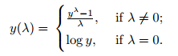

```{r}

# set global display parameters
library(knitr)
knitr::opts_chunk$set(fig.width=8, fig.height=6, echo = TRUE, fig.align="center") 
opts_chunk$set(out.width='750px', dpi=200)
```

The most important insights in marketing analysis often come from undrstanding relationships between variables. Identifying these kinds of relationships helps marketers understand how to reach customers more effectively. For example, if people who live closer to a store visit more frequently and buy more, then an obvious strategy would be to send adivertisements to people who live in the area. 

In this chapter we focus on understanding pair-wise relationships between variables in multivariate data, and examine how to visualize the relationships and compute statistics that describe their associations. These are the most important ways to assess relationships between continuous variables. The first step in any analylsis is to exploer the data and its basic properties including the relationships among pairs of variables before model-building. 

### 4.1 Simulating Customer Data (Retailer Data with Online/In-store sales, Survey responses)

We simulate a data set that describes each customer of a multi-channel retailer (Online & In-store) and their transactions for 1 year. This data also includes a subset of custoemrs for whom we have survey data on product satisfaction. It contains a data set of 1000 customers. This data is typical of what one might sample from a company's CRM system. 

```{r}
set.seed(21821)
ncust <- 1000 
cust.df <- data.frame(cust.id=as.factor(c(1:ncust))) # customer id's are factors


```


**Customer Id**- unique identifier per customer

**Age** - sampling from a random normal distribution with mean 35 and sd =5

**Credit Score** - sampling from a rnorm where its mean of the distribution is related to the customer's age, with older customers having higher credit scores on average

**Email**-  (Y/N) indicating whether the customer has an email on file using the sample() function

**Distance to Store (Miles) **- follows expontential of the normal distribution. This gives distances that are all positive with many distances that are relatively close to the nearest store and fewer that are far from a store. aka. lognormal distribution using `rlnorm()`
```{r}
cust.df$age <- rnorm(n=ncust, mean=35, sd=5)
cust.df$credit.score <- rnorm(n=ncust, mean=3*cust.df$age + 620, sd=50)

cust.df$email <- factor(sample(c("yes","no"), size=ncust, replace=TRUE, prob=c(0.8,0.2))) # Factor var with yes, no

cust.df$distance.to.store <- rlnorm(n=ncust, meanlog=2, sdlog=1.2)

summary(cust.df)

```

**/# of Online visits** - follow a negative binomial distribution - a discrete distribution often used to model counts of events over time. Like the log normal distribution, the negative binomial distribution generates positive values and a long right-hand tail, meaning that most customers make relatively few visits and a few customers make many visits. We use `rnbinom()` function.

* The `size` argument sets the degree of dispersion (variation) for the samples
* We add ~15 online visits for customers who have an email on file using `ifelse()` to generate a vector 0 or 15 based on whether they have an email on file
* We add/subtract visits from the target mean based on the customer's age relative to the sample median since customers who are younger tend to make more online visits

**/# of Online Transactions **- Per online visit, we assume there's a 30% probability of placicng an order (1) vs. not (0). 

**Online spend** - We assume that amount spent in those orders are lognormally distributed (`exp(rnorm())`). The random value for amount spent per transaction (follows lognormal distribution with mean 3, sd=0.1) is multiplied by the # of online transactions in order to get the total amount spent. 
```{r}
cust.df$online.visits <-rnbinom(ncust, size=0.3, mu=15 + ifelse(cust.df$email=="yes",15,0) - 0.7 * (cust.df$age-median(cust.df$age)))

cust.df$online.trans <- rbinom(ncust, size=cust.df$online.visits, prob=0.3)
cust.df$online.spend <- rlnorm(ncust, meanlog=3, sdlog=0.1) * cust.df$online.trans

#Best practice to check data along the way
summary(cust.df)
```


**Store Transactions (In-store)** - We assume that transcations follow a negative binomial distribution with lower average number of visits for customers who live farther away

**Store Spend (In-store)** - lognormally distributed simply multiplied by the number of transactions

```{r}
cust.df$store.trans <- rnbinom(ncust, size=5,
                               mu=3 / sqrt(cust.df$distance.to.store))

cust.df$store.spend <- rlnorm(ncust, mean=3.5, sd=0.4) * cust.df$store.trans

summary(cust.df)
```


**Overall Satisfaction** - It's common for reatilers to survey their customers and record responses in the CRM system. To simulate survey responses, we assume that each customer has an unobserved or pyschological construct of overall satisfaction with the brand. We generate this overall satisfaction from a normal distribution (m=3.1, sd=0.7). It's not directly observable. Instead the survey collects info on 2 items: service satisfaction and selection of products satisfaction. We assume that customers' responses to the survey items are based on unobserved levels of satisfaction overall (aka "halo" in survey response) + the specific levels of satisfaction with the service and product selection

* To create such a score from a halo variable, we add `sat.overall` (the halo) to a random value specifci to the item, drawn using `rnorm()`. Because the survey responese are on a discrete, ordinal scale (i.e. "Very Satisfied" to "Very Unsatisfied"), we convert our continous random values to discrete integers using `floor()`. 

* We use `cbind()` in our summary() function to temporarily combine our two vectors of data into a *matrix* so that we can get a combined summary with a single line of code. 

```{r}
# create temporary variables to be assigned to data frame vars later
sat.overall <- rnorm(ncust, mean=3.1, sd=0.7)
sat.service <- floor(sat.overall + rnorm(ncust, mean=0.5, sd=0.4))
sat.selection <- floor(sat.overall + rnorm(ncust, mean=-0.2, sd=0.6))

summary(cbind(sat.overall, sat.service, sat.selection))
```
*Observe* We have min/max values we need to adjust

We will replace values that are greater than 5 with 5, values that are < 1 with 1. This enforces the *floor* and *ceiling* effects often noted in survey response literature. 
```{r}
sat.service[sat.service > 5] <- 5
sat.service[sat.service < 1] <- 1
sat.selection[sat.selection <1] <- 1
sat.selection[sat.selection >5] <- 5

# check
summary(cbind(sat.service, sat.selection))
```

**No Response (T/F)** - Some customers do not respond to surveys.We will eliminate the simulated answers for a subset of responedents who are modeled as "not answering". We do this by create a var of T/F values called `no.response` and then assign a value of NA for the survey response for customers whose `no.response` is TRUE. We model non.response as a function of age, with higher probability of not responding to the survey for *older customers*. 

```{r}
no.response <- as.logical(rbinom(ncust, size=1, prob=cust.df$age/100))
summary(no.response)

# use the T/F in no.response to clear some of the survey satisfaction values for some customers
sat.selection[no.response] <- NA
sat.service[no.response] <- NA

# check
summary(cbind(sat.service, sat.selection))
```
*Observe* There are 324 NA's according to summary.

```{r}
# Add the survery responses to cust.df

cust.df$sat.service <- sat.service
cust.df$sat.selection <- sat.selection

summary(cust.df)
```
*Observe* the data set is now complete and ready for analysis 

### 4.2 Exploring Associations b/w Variables via Scatterplots

Let's begin by exploring the relationship between each customer's age and credit score using `plot(x,y)`.

##### Is there a relationship between customer's age and credit score?

```{r}
plot(x=cust.df$age, cust.df$credit.score)
```
*Observe*: 

* There is a large mass of customers in the center of the plot at ~35 y.o and credit score ~725
* There are fewer customers at the margins. There's not many younger customers with very high credit scores, nor older customers with very low scores. This suggests an association between age and credit score

The default settings in `plot()` produces a quick-and-dirty plot that's useful when exploring data by ourselves. R looks at what data types you're trying to plot, and based on the data type, produce a lower-level plotting function known as a *method*. For example, if we plot a data frame, R will use `plot.data.frame()` instead of `plot.default()` in the backend. Hence, it's important to correct for our data types before plotting to avoid any unhelpful plots. 

For more info, type `methods(plot)
```{r}

# types of plots based on data types
methods(plot)
```


If we present the plot to others, best practice is to provide more informative labels for the axes and chart titles as well as legends, coloring, etc: 

`xlim and ylim` sets a range for each axis. 
`abline(v=)` sets a vertical line based on a function or number
`abline(h=)` sets a horizontal line based on a function or number
`points()` adds specific points
`lines()` adds a set of lines by coordinates
`legend()` adds a legend

```{r}
# enhance our plot with titles, labels, ablines

plot(cust.df$age, cust.df$credit.score,
     col="blue",
     xlim=c(15,55), ylim=c(500,900),
     main="Active Customers as of June 2014",
     xlab="Customer Age (years)",
     ylab="Customer Credit Score")

abline(h=mean(cust.df$credit.score), col="dark blue", lty="dotted")
abline(h=mean(cust.df$age), col="dark blue", lty="dotted")

```

##### Do customers who buy more online, buy less in-stores?

We start by plotting online sales ~ in-store sales. We'll use `cex` option which scales down the plotted points to 0.7 of their default size so that we can see the points a bit more clearly.

```{r}
plot(cust.df$store.spend, cust.df$online.spend,
     main="Customers as of June 2014",
     xlab="Prior 12 months in-store sales ($)",
     ylab="Prior 12 months online sales ($)",
     cex=0.7)
```
*Observe* 

* The distribution is skewed which is common in behavioural data such as sales or transaction counts; most customers purchase rarely so the data is dense near zero. 
* A lot of points along the axes meaning there are a large number of customers who din't buy anything on one of the two channels
* A smaller number of customers who purchase fairly large amounts per channel

Because of the skewed data, we do not have a good answer to our question about the relationship between online and in-store sales. Let's investigate further with a histograpm of only in-store sales:

```{r}
hist(cust.df$store.spend,
     breaks=(0:ceiling(max(cust.df$store.spend/10)))*10,
             main="Customers as of June 2014",
             xlab="Prior 12 months in-store sales ($)",
             ylab="Count of customers")
```
*Observe* 

* A large number of customers bought nothing in-store (about 400 customers out of 1000)
* The distribution of sales among those who buy has a mode ~$20
* There is a long right tail with a few customers whose annual spend was high (to $500)

Such distributions are typical of spending and transaction counts in customer data

##### Is the propensity to buy online vs. in-store related to our email efforts?

(as reflected by whether or not a customer has an email address on file) 

We will add the `email` dimension to the plot by coloring in the points for customers with email=Y. To do this, we use `plot()` arguments that allows us to draw different colors `col=` and sympbols for the points `pch=`. 

1) We first declare vectors for the color and point types

2) Convert the variable `email` to numeric values or directly index

3) Use the numeric values to select colors from the color vector by indexing the color vector based on the numeric values

4) Pass the new color vector to the `col` option in `plot()`. Note the vector must be the same length as the data else R will recylce the color vector. This can be difficult to get right in practice, so practice! 

```{r}
#Step 1
my.col <- c("black","green3")
my.pch <- c(1,19) # R's sympbols for solid and open circles. FMI, see ?points.

#Step 2 & 3
my.col2 <- my.col[cust.df$email]
head(my.col2) # Preview
```
```{r}
#Step 4

plot(cust.df$store.spend, cust.df$online.spend,
     cex=0.7,
     col=my.col2, pch=my.pch,
     main="Customers as of June 2014",
     xlab="Prior 12 months in-store sales($)",
     ylab="Prior 12 months online sales ($)")


```

#### 4.2.3 Adding a Legend to the Plot using `legend()`

`legend`(): `x=LOCATION` sets the location of the legend on the plot, `legend` argument is a vector of labels that we want to include in the legend, `col=` specifies color in legend, `pch=` specifies symbols

Although the code to create the legend is compact, it's a hassle to track the deails of labels, colors, and sympbols. Best practice is to define the argument values in a reusable way (declared variables). An alternative mthod would be to invest in learning a specialized graphics package such as `lattice` or `ggplot2`.

```{r}
plot(cust.df$store.spend, cust.df$online.spend,
     cex=0.7,
     col=my.col2, pch=my.pch,
     main="Customers as of June 2014",
     xlab="Prior 12 months in-store sales($)",
     ylab="Prior 12 months online sales ($)")

legend( x="topright",
        legend=paste("email on file:", levels(cust.df$email)),
        col=my.col,
        pch=my.pch)

```
*Observe* It's still difficult to see whether there is a different relatiopnsihp between instore vs. online purchases for those with/without emails on file due to the heavy skew in sales figures. 

A common solution for such scatterplots with skewed data is to plot the dat aon a *logarithmic scale* with the `log=` argument of `plot()`. Set `log="x"` to plot the x-axis on the log scale, `log="y"` for the y-axis, or `log="xy"` for both axes

Caution: log(0) is undefined. To circumvent this issue, plot `*...spend + 1*` to avoid error message. The axes are now logarithmic. i.e. the distance from 1 to 10 is the same as 10-100. 

```{r}
plot(cust.df$store.spend + 1, cust.df$online.spend + 1,
     cex=0.7,
     col=my.col2, pch=my.pch,
     main="Customers as of June 2014",
     xlab="Prior 12 months in-store sales($)",
     ylab="Prior 12 months online sales ($)",
     log="xy")

legend( x="topright",
        legend=paste("email on file:", levels(cust.df$email)),
        col=my.col,
        pch=my.pch)

```
*Observe*: 
* There is little or no association between online and instore sales as the points seem to be random with no clear patterns
* Thus, there is no eveidence here to suggest that online sales cannibalized in-store sales. 
* Customers with no email address on file show slighly lower online sales than those with addresses; there's somewaht more black circles in the lower half othe plot than the upper half. If we've been sending email promotions to customers, then this usggests that the promotions might be working.
*An experiment to confirm that hypothesis could be an appropriate next step

### 4.3 Combining Plots in a Single Graphics Object

R an produce a single graphic that consists of multiple plots. We do this by telling R that we want multiple plots in a single graphical object with the `par(mfrow=...` command, then plot each one with `plot()` as usual:

```{r, fig.width=8, fig.height=8}
par(mfrow=c(2,2)) # set of query graphical parameters

plot(cust.df$distance.to.store, cust.df$store.spend,
     main="Store Spend vs. Distance to Store")
plot(cust.df$distance.to.store, cust.df$online.spend,
      main="Online Spend vs. Distance to Store")

plot(cust.df$distance.to.store+1, cust.df$store.spend+1,
     main="Store Spend vs. Distance to Store (Log)", log="xy")
plot(cust.df$distance.to.store+1, cust.df$online.spend+1,
      main="Online Spend vs. Distance to Store (Log)", log="xy")
```
*Observe*: 

* There may be a negative relationship between customers' distances to the nearest store and in-store spending. 
* There doesn't appear to be a relationship between distance to store and online spend

We can return to a single plot layour by setting `par(mfrow=c(1,1))`

### 4.4 Scatterplot Matrices using `pairs(), scatterplotMatrix(), and gpairs()`

It's best practice to examine scatterplots between all pairs of variables before moving on to more complex analyses. R provides the `pairs(formula, data)` which makes a scatter plot matrix for every combination of variables. We might want to select quantitative variables only else it will throw an error 

`pair()`: the `formula=` argument is composed with a tilde "~" followed by the variables to include, separated by "+". If we want to transform a variable, include the math in the formula. For example, `log(online.spend)`.

We can see relationships between variables quickly in a scatterplot matrix:

```{r, fig.width=7, fig.height=7}
pairs(formula = ~age+credit.score+email+distance.to.store+online.visits+online.trans+online.spend+store.trans+store.spend,
      data=cust.df)
```
*Observe*

* There is a strong linear association between online.visits and online.trans. Customers who visit the website more frequently make more online transactions.
* Customers with a higher number of online transacations have higher total online spending
* Customers with more in-store transactions also spend more in-store

In addition to the formula notation above, we can also pass a dat aframe directly to `pairs()` and when we do that, `pairs()` creates a scatter plot matrix including all the columns in our df.  

```{r}
pairs(cust.df[,c(2:10)])
```

Best practice is to creat R code that might be re-used in the futre. 

#### 4.4.2 `scatterplotMatrix()`

`scatterplotMatrix()` adds additional features to the matrix such as sincluding smoothed lines on scatter plots and univariate histograms on the diagonal which shows us the distribution per variable. The *green lines* show linear fit lines. The *red lines* show smoothed fit lines. the *dashed red lines* show the confidence interval band.

`suppressWarnings`: Suppresses warning signs of a function
```{r, fig.width=8, fig.height=8}
library(car) # for "companion to applied regression"

suppressWarnings(scatterplotMatrix(formula= ~age+credit.score+email+distance.to.store+online.visits+
                    online.spend+online.trans+store.trans+store.spend,
                  data=cust.df, 
                  diagonal="histogram",
                  cex.main="1.5",
                  cex.labels=1  # Increase label size
                  ))


```
*Observe*: 

* The smoothed lines on the bivariate scatter plots suggest the extent to which associations are linear.
* The smoothed line on the plot of age vs. distance to store is nearly flat and shows that there's no linear association between those vars
* All of the vars execept age and credit score are highly left skewed (median in the left).
* Email is a binary factor and is not suitable for a scatterplot. We will need another way to plot email (pref. boxplot)


#### `gpairs()`

For Generalized Pair Plots, part of the gpairs package, produces a scatterplot matrix that includes better visualizations for both discrete and continuous vars. It does not accept formula input, so we select the columns to include by positional indeexing. 


For ex, if we want to look more closely at the relationship between email, and online vsitis, online trans, online spend, we can use `gpairs()`:
```{r, fig.width=7, fig.height=7}
library(gpairs)
gpairs(cust.df[,c(2:10)])  # For some reason, it's not working

```


### 4.5 Correlation Coefficients

Although scatterplots provide a lot of visual information, correlation coefficients can assess the relationship between each pair with a single number. *Covariance* measures the relationship between 2 variables. *Correlation Coefficient* is standardized covariance in the data's units by scaling the covaraince by the standard derviation. Aka *Pearson product-moment correlation coefficient*. 

`cov(x,y)` measures covariance between x and y
`cor(x,y)` measures correlation coefficient between -1 and 1

In marketing, we'll often use *Cohen's Rules of Thumb* to decide whether *r* signifies an important correlation between two vars. Cohen's interpretation of a large effect was such that an association would be easily noticed by casual observers. A small effect would require careful measuremnets to detect yet might be inmportant to our understanding and statistical models. 

* r <= 0.1 should be considered a small or weak association
* r <= 0.3 is medium association
* r >=0.5 is strong or large association.

Interpetation of *r* depends on the assumpation that vars are *normally distributed. If vars are not normal, then these thresholds do not apply. In such cases when data is skewed, it's helpful to transform our vars to normal distributions BEFORE interpreting. 

```{r}

# Covariance
cov(cust.df$age, cust.df$credit.score)

# Correlation
cor(cust.df$age, cust.df$credit.score)

# Equivalent
cov(cust.df$age, cust.df$credit.score) / (sd(cust.df$age)*sd(cust.df$credit.score))
```

####4.5.1 Correlation Tests

#### Is the correlation between age and credit score (r=0.25) statistically significant? 

We can use cor.test() to find out: 
```{r}
cor.test(cust.df$age, cust.df$credit.score)
```
*Observe*: The 95% confidence interval is r=0.196 to 0.312. Because the CI does not include 0 (and thus has pvalue < 0.05), the association is statistically signifciant. Such a correlation showing a medium-sized effect and sttaistical significance should not be ignored in subsequent analyses

####4.5.2 Correlation Matrix

We can compute correlations between all pairs x, y at once as a *correlation matrix*. Such a matrix shows r=1 on the diagonal because cor(x,x) = 1. It's also symmetric because cor(x,y) = cor(y,x). We compute a correlation matrix by passing multiple vars to `cor()`

Note: `cor()` will not compute vars with NA's so we can use `use="complete.obs"` to ignore NA's and compute the var. 
```{r}
cor(cust.df[,c(2,3,5:12)], use="complete.obs")
```
To visualize, use `corrplot()` or `corrplot.matrix()` from the `corrpolot` package to visualize correlation matrices.

`corrplot.mixed()`:

*`use="complete.obs"` to ignore NA's
* `upper="ellipes"` to display ellipses in the upper triangle of hte matrix. For larger r, the ellipses are itghter and closer to being lines. For r's near 0, they are more like circles. 
* `col= colorpanel(50,"red","gray60","blue4")` The circles are shaded blue for positive direction, red for negative, and grey for near 0.

```{r, fig.width=8, fig.height=8}
library(corrplot)
library(gplots) # for color panel
corrplot.mixed(corr=cor(cust.df[,c(2,3,5:12)],use="complete.obs"),
               upper="ellipse",
               tl.pos = "lt",  # where to position title of axes (left top)
               col= colorpanel(50,"red","gray60","blue4"))
```
*Observe* 

* age is positively correlated with credit.score
* distance to store is negatively correlated with store transactions and spend
* online visits and online trans is strongly correlated with online spend
* satisfaction of service is positively corelated with satisfaction of selction

Finding large correlations should inform subsequent analysis or suggest hypotheses to test

####4.5.3 Before Computing Correlations, Tranform Variables

Correlation coefficient *r* measures the *linear* assocation between 2 vars. If the relationship between 2 vars is not linear, it would be mimsleading to interpret r. 

For example, if we create a random variable that falls in the range [-10,10] using `runif()` to sample random uniform values - and then compute the correlation between x and x^2, we will get a correlation close to 0.
```{r}
set.seed(49931)
x <- runif(1000,min=-10,max=10)
cor(x,x^2)
plot(x,x^2)
```
r is near zero even tho the fact that there is a perfectly *nonlinear* relations (quadratic) between x and x^2. So, best practice is to evaluate whether vars needs transformations or not before assessing the correlation. 

Many relationships in marketing data are nonlinear. 

For example, when we cor( distance to store, store spend), we get a medium negative correlation. But when we transform distance to store (x-var) to its *inverse* (1/distance), there appears a much stronger association. In fact, the inverse square root (1/sqrt(x)) shows an even stronger association:
```{r}
# inverse transformation
cor(1/cust.df$distance.to.store, cust.df$store.spend )

# inverse square root
cor(1/sqrt(cust.df$distance.to.store), cust.df$store.spend )

```
To visualize our transformations in stages:

```{r, fig.width=15, fig.height=5}
par(mfrow=c(1,3))
plot(cust.df$distance.to.store, cust.df$store.spend)
plot(1/cust.df$distance.to.store, cust.df$store.spend)
plot(1/sqrt(cust.df$distance.to.store), cust.df$store.spend)

```
*Observe*: Because of the inverse *square root* relationship, someone who lives 1 mile from the nearest store will spend quite a bit more than someone who lives 5 miles away, yet someone who lives 20 miles away will only buy a little bit more than someone who lives 30 miles away. The association between distance and spending is much clearer with the transformed data as shown in the right-hand panel. 

Typical data transformations for marketing data include: 

**Unit Sales, revenue, household income, price**- `log(x)`

**distance** - `1/x, 1/x^2, log(x)`

**market or prefreence share based on a utility value** - ` e^x/(1+e^x)`

**right-tailed distributions (generally)** - `sqrt(x), log(x)`

**left-tailed distributions (generally)** - `x^2`

When these transformations don't work or we want the very best transformation, there's a general-purpose transformation function that can be used instead:

####4.5.5 Box-Cox Transformations

Many of the above transformations require taking a power of x: x^2, x^-1, x^0.5, x^-0.5. The *[Box-Cox Transformation](http://www.statisticshowto.com/box-cox-transformation/)* generalizes this use of power functions by automatically finding the optimal value of lambda (power) that would make the distribution best fit the normal distribution. Note the variable has to be positive else Box-Cox transformation is not appropriate. Box-Cox Transformation is defined as:



where lamba can take any value and log is the natural logarithm (ln). 

`powerTransform(DATA)` to find the best Box-Cox transformation for DATA. It will tell us the value of lambda to make distances as similar as possible to a normal distribution. 

`coef()` extracts the value of lambda from `powerTransform(DATA)`. In practice, lambda is rounded to an integer before being used to transform the outcome, so that we get a nice power.

`bcPower(U=DATA, lamba)`: provides the transformed data using lambda var

```{r}
powerTransform(cust.df$distance.to.store)
(lambda_round <- coef(powerTransform(1/cust.df$distance.to.store),round=T))  # For distance, we'll employ 1/x^lambda. Lambda is rounded
(lambda <- coef(powerTransform(1/cust.df$distance.to.store),round=F)) # Testing results when lambda is not rounded
head(bcPower(cust.df$distance.to.store, lambda_round))
head(bcPower(cust.df$distance.to.store, lambda))


```
Observe before and after transformation of `cust.df$distance.to.store`:
```{r, fig.width=8, fig.height=5}
layout(matrix(c(1,1,2,3), 2,2,byrow=T)) # Plot 1 in Row 1, Col 1 & 2
hist(cust.df$distance.to.store, main="Untransformed",  ylab="Customers Count")
hist(bcPower(cust.df$distance.to.store, lambda), main="Transformed using Lambda", ylab="Customers Count")
hist(bcPower(cust.df$distance.to.store, lambda_round), main="Transformed using Rounded Lambda",  ylab="Customers Count")
```
*Observe* There's not too much a difference between rounded and unrounded lambda. Feel free to use either. The transformation is close to normal. 

If we attempt to transform a var that's already close to normal, Box-Cox transformation will report out on a lambda ~1 which brings us back to our original number *y*. This means a transformation is not required since the values will not change much after the transformation: 
```{r}
powerTransform(cust.df$age)
```

Now we can compute correlations for the transformed vars. These correlations will often be larger in magnitude than correlations among raw, untransformed data points. For ex, we'll check *r* between distance and in-store spending, transforming both first:
```{r}
powerTransform(cust.df$store.spend + 1) #  the Box-Cox Power transformation only works if all the data is positive and greater than 0. This, however, can usually be achieved easily by adding a constant (c) to all data such that it all becomes positive before it is transformed. 

l.dist <-coef(powerTransform(1/cust.df$distance.to.store))
l.spend <-coef(powerTransform(cust.df$store.spend+1)) # since spend is left tailed, transformation is x^lambda. Remember to add spend +1 

cor(bcPower(cust.df$distance.to.store, l.dist),
    bcPower(cust.df$store.spend+1, l.spend)) # Remember to add spend  + 1 
```
```{r}
0^0.34 # 0 raised to any power is 0
```

In practice, we can consider Box-Cox transformations on all vars with skewed distirbutions before computing correlations or creating scatterplots. This increases the chance that we will find and interpret important assocations between vars. 

#### Plot layout: `layout(mat,w,h, byrow=)` 

Can be used in place of `par(mfrow=)`. It divides the device up into as many rows and columns are there are in matrix `mat`. `mat` is a matrix object *specifying the location of the next N figures* on the output device. Each value in the matrix must be 0 or a positive integer.

### 4.6 Exploring Associations between Ordinal (Ranked), Discrete Vars (Suvery Responses)

Many marketing data sets include variables where customers provide ratings on a discrete scale. These are *ordinal (ranked)* variables and it can be tricky to assess associations among them. The issue is the values only take on a few values which becomes a problem in assessing the strenght of association. 

For example, `sat.service` and `sat.product` only takes on integer values between 1 to 5. When plotted using `plot()`, it is not clear the associations. One way to make a plot of ordinal values more informative is to *jitter()* each variable, adding a small amount of random noise to each response so that we can see how many responses occur per combination of (x,y) values:

```{r, fig.width=10, fig.height=5} 
# changed output width and height of figure


par(mfrow=c(1,2))
plot(cust.df$sat.service, cust.df$sat.selection,
     xlab="Customer Satisfaction with Service",
     ylab="Customer Satisfaction with Selection",
     main="Customers as of June 2014")


plot(jitter(cust.df$sat.service), jitter(cust.df$sat.selection),
     xlab="Customer Satisfaction with Service",
     ylab="Customer Satisfaction with Selection",
     main="Customers as of June 2014")
```
*Observe*: 

* It's easy to see that the ratings (3,2), (3,3), and (4,3) are the most common responses. 
* There is a positive relationship between the 2 satisfaction variables. People who are more satisfied with service tend to be more satisied with service as well

#### 4.6.2 Polychoric Correlation Coefficient for Ordinal Responses

The constrained values from rating scales affect assessment of correlation with metrics such as *Pearson's r* because the number of avail scale points constrains the potential range and *specificity* of r. Instead, we use the *[polychoric correlation coefficient](http://www.john-uebersax.com/stat/tetra.htm)* which is designed specifically for ordinal responses such as personality tests, survey responses, 

For polychoric correlation, it's assumed that respondents have continuous values in mind when answering on a rating scale. However, because scales are limited to a few points, respondents are forced to select discrete values and choose points that are closest to their latent  ( or unobserved) continuous values. The polychoric estimate tries to recover the correlations between the estimated latent continous variables.

`polychoric()` part of the psych package reports the *polychoric correlation matrix* which includes value range [-1,1] and is interpreted in the same way as Pearson's *r* because they are Pearson's r values between the estimated latent continuous vars. 

The second output of `polychoric()` includes "with a tau of" which describesthe *estimated latent scores'* mapping to the discrete item values. For each variable (sat.service, sat.product), there are 4 *cut points*: if a customer's latent satisfaction is < first cut point, the survey response is assigned first value on the scale (1). For latent scores between 1st and 2nd cut points, the survey response is the 2nd value (2), and etc. 

Reviewing the cut points can be informative about *how the scale is performing... Is there adequate discrimination of responses vs. the estimated latent scores?*