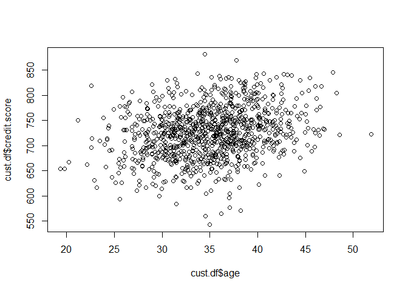
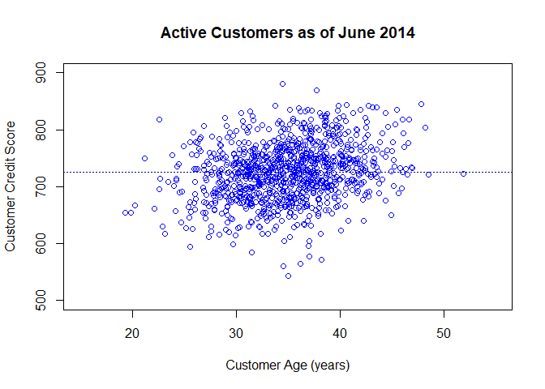
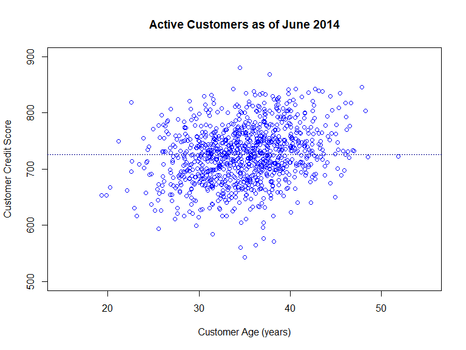
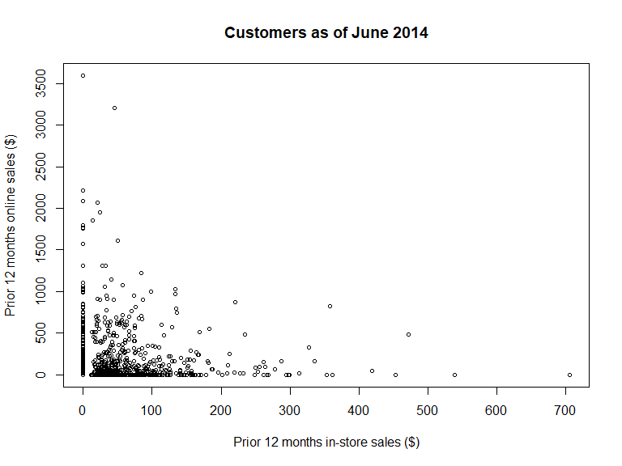
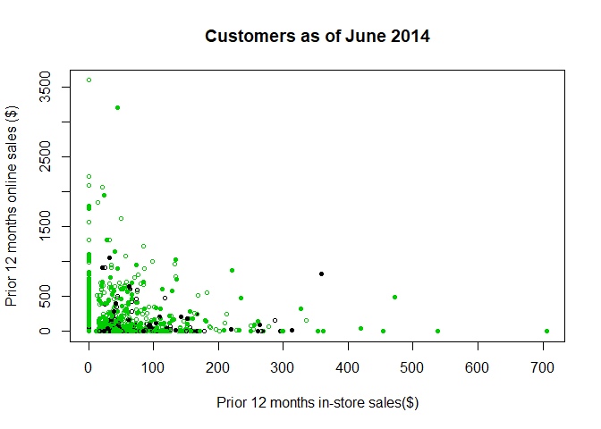
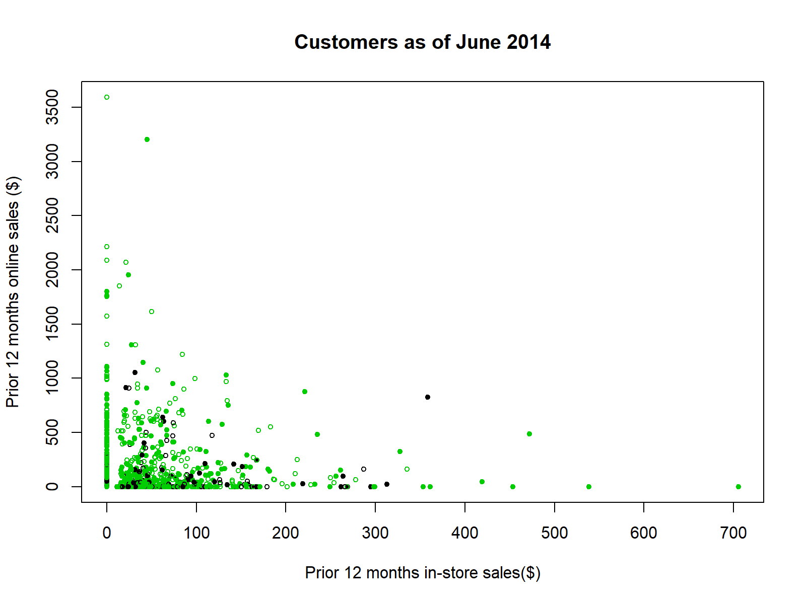

ch-4-relationships-between-continuous-variables
================
Sonya Hua
September 4, 2017

The most important insights in marketing analysis often come from undrstanding relationships between variables. Identifying these kinds of relationships helps marketers understand how to reach customers more effectively. For example, if people who live closer to a store visit more frequently and buy more, then an obvious strategy would be to send adivertisements to people who live in the area.

In this chapter we focus on understanding pair-wise relationships between variables in multivariate data, and examine how to visualize the relationships and compute statistics that describe their associations. These are the most important ways to assess relationships between continuous variables. The first step in any analylsis is to exploer the data and its basic properties including the relationships among pairs of variables before model-building.

### 4.1 Simulating Customer Data (Retailer Data with Online/In-store sales, Survey responses)

We simulate a data set that describes each customer of a multi-channel retailer (Online & In-store) and their transactions for 1 year. This data also includes a subset of custoemrs for whom we have survey data on product satisfaction. It contains a data set of 1000 customers. This data is typical of what one might sample from a company's CRM system.

``` r
set.seed(21821)
ncust <- 1000 
cust.df <- data.frame(cust.id=as.factor(c(1:ncust))) # customer id's are factors
```

**Customer Id**- unique identifier per customer

**Age** - sampling from a random normal distribution with mean 35 and sd =5

**Credit Score** - sampling from a rnorm where its mean of the distribution is related to the customer's age, with older customers having higher credit scores on average

**Email**- (Y/N) indicating whether the customer has an email on file using the sample() function

**Distance to Store (Miles) **- follows expontential of the normal distribution. This gives distances that are all positive with many distances that are relatively close to the nearest store and fewer that are far from a store. aka. lognormal distribution using `rlnorm()`

``` r
cust.df$age <- rnorm(n=ncust, mean=35, sd=5)
cust.df$credit.score <- rnorm(n=ncust, mean=3*cust.df$age + 620, sd=50)

cust.df$email <- factor(sample(c("yes","no"), size=ncust, replace=TRUE, prob=c(0.8,0.2))) # Factor var with yes, no

cust.df$distance.to.store <- rlnorm(n=ncust, meanlog=2, sdlog=1.2)

summary(cust.df)
```

    ##     cust.id         age         credit.score   email    
    ##  1      :  1   Min.   :19.34   Min.   :543.0   no :186  
    ##  2      :  1   1st Qu.:31.43   1st Qu.:691.7   yes:814  
    ##  3      :  1   Median :35.10   Median :725.5            
    ##  4      :  1   Mean   :34.92   Mean   :725.5            
    ##  5      :  1   3rd Qu.:38.20   3rd Qu.:757.2            
    ##  6      :  1   Max.   :51.86   Max.   :880.8            
    ##  (Other):994                                            
    ##  distance.to.store 
    ##  Min.   :  0.2136  
    ##  1st Qu.:  3.3383  
    ##  Median :  7.1317  
    ##  Mean   : 14.6553  
    ##  3rd Qu.: 16.6589  
    ##  Max.   :267.0864  
    ## 

**/\# of Online visits** - follow a negative binomial distribution - a discrete distribution often used to model counts of events over time. Like the log normal distribution, the negative binomial distribution generates positive values and a long right-hand tail, meaning that most customers make relatively few visits and a few customers make many visits. We use `rnbinom()` function.

-   The `size` argument sets the degree of dispersion (variation) for the samples
-   We add ~15 online visits for customers who have an email on file using `ifelse()` to generate a vector 0 or 15 based on whether they have an email on file
-   We add/subtract visits from the target mean based on the customer's age relative to the sample median since customers who are younger tend to make more online visits

**/\# of Online Transactions **- Per online visit, we assume there's a 30% probability of placicng an order (1) vs. not (0).

**Online spend** - We assume that amount spent in those orders are lognormally distributed (`exp(rnorm())`). The random value for amount spent per transaction (follows lognormal distribution with mean 3, sd=0.1) is multiplied by the \# of online transactions in order to get the total amount spent.

``` r
cust.df$online.visits <-rnbinom(ncust, size=0.3, mu=15 + ifelse(cust.df$email=="yes",15,0) - 0.7 * (cust.df$age-median(cust.df$age)))

cust.df$online.trans <- rbinom(ncust, size=cust.df$online.visits, prob=0.3)
cust.df$online.spend <- rlnorm(ncust, meanlog=3, sdlog=0.1) * cust.df$online.trans

#Best practice to check data along the way
summary(cust.df)
```

    ##     cust.id         age         credit.score   email    
    ##  1      :  1   Min.   :19.34   Min.   :543.0   no :186  
    ##  2      :  1   1st Qu.:31.43   1st Qu.:691.7   yes:814  
    ##  3      :  1   Median :35.10   Median :725.5            
    ##  4      :  1   Mean   :34.92   Mean   :725.5            
    ##  5      :  1   3rd Qu.:38.20   3rd Qu.:757.2            
    ##  6      :  1   Max.   :51.86   Max.   :880.8            
    ##  (Other):994                                            
    ##  distance.to.store  online.visits     online.trans      online.spend    
    ##  Min.   :  0.2136   Min.   :  0.00   Min.   :  0.000   Min.   :   0.00  
    ##  1st Qu.:  3.3383   1st Qu.:  0.00   1st Qu.:  0.000   1st Qu.:   0.00  
    ##  Median :  7.1317   Median :  6.00   Median :  2.000   Median :  37.03  
    ##  Mean   : 14.6553   Mean   : 28.29   Mean   :  8.385   Mean   : 170.32  
    ##  3rd Qu.: 16.6589   3rd Qu.: 31.00   3rd Qu.:  9.000   3rd Qu.: 177.89  
    ##  Max.   :267.0864   Max.   :606.00   Max.   :169.000   Max.   :3593.03  
    ## 

**Store Transactions (In-store)** - We assume that transcations follow a negative binomial distribution with lower average number of visits for customers who live farther away

**Store Spend (In-store)** - lognormally distributed simply multiplied by the number of transactions

``` r
cust.df$store.trans <- rnbinom(ncust, size=5,
                               mu=3 / sqrt(cust.df$distance.to.store))

cust.df$store.spend <- rlnorm(ncust, mean=3.5, sd=0.4) * cust.df$store.trans

summary(cust.df)
```

    ##     cust.id         age         credit.score   email    
    ##  1      :  1   Min.   :19.34   Min.   :543.0   no :186  
    ##  2      :  1   1st Qu.:31.43   1st Qu.:691.7   yes:814  
    ##  3      :  1   Median :35.10   Median :725.5            
    ##  4      :  1   Mean   :34.92   Mean   :725.5            
    ##  5      :  1   3rd Qu.:38.20   3rd Qu.:757.2            
    ##  6      :  1   Max.   :51.86   Max.   :880.8            
    ##  (Other):994                                            
    ##  distance.to.store  online.visits     online.trans      online.spend    
    ##  Min.   :  0.2136   Min.   :  0.00   Min.   :  0.000   Min.   :   0.00  
    ##  1st Qu.:  3.3383   1st Qu.:  0.00   1st Qu.:  0.000   1st Qu.:   0.00  
    ##  Median :  7.1317   Median :  6.00   Median :  2.000   Median :  37.03  
    ##  Mean   : 14.6553   Mean   : 28.29   Mean   :  8.385   Mean   : 170.32  
    ##  3rd Qu.: 16.6589   3rd Qu.: 31.00   3rd Qu.:  9.000   3rd Qu.: 177.89  
    ##  Max.   :267.0864   Max.   :606.00   Max.   :169.000   Max.   :3593.03  
    ##                                                                         
    ##   store.trans      store.spend    
    ##  Min.   : 0.000   Min.   :  0.00  
    ##  1st Qu.: 0.000   1st Qu.:  0.00  
    ##  Median : 1.000   Median : 30.05  
    ##  Mean   : 1.323   Mean   : 47.58  
    ##  3rd Qu.: 2.000   3rd Qu.: 66.49  
    ##  Max.   :12.000   Max.   :705.66  
    ## 

**Overall Satisfaction** - It's common for reatilers to survey their customers and record responses in the CRM system. To simulate survey responses, we assume that each customer has an unobserved or pyschological construct of overall satisfaction with the brand. We generate this overall satisfaction from a normal distribution (m=3.1, sd=0.7). It's not directly observable. Instead the survey collects info on 2 items: service satisfaction and selection of products satisfaction. We assume that customers' responses to the survey items are based on unobserved levels of satisfaction overall (aka "halo" in survey response) + the specific levels of satisfaction with the service and product selection

-   To create such a score from a halo variable, we add `sat.overall` (the halo) to a random value specifci to the item, drawn using `rnorm()`. Because the survey responese are on a discrete, ordinal scale (i.e. "Very Satisfied" to "Very Unsatisfied"), we convert our continous random values to discrete integers using `floor()`.

-   We use `cbind()` in our summary() function to temporarily combine our two vectors of data into a *matrix* so that we can get a combined summary with a single line of code.

``` r
# create temporary variables to be assigned to data frame vars later
sat.overall <- rnorm(ncust, mean=3.1, sd=0.7)
sat.service <- floor(sat.overall + rnorm(ncust, mean=0.5, sd=0.4))
sat.selection <- floor(sat.overall + rnorm(ncust, mean=-0.2, sd=0.6))

summary(cbind(sat.overall, sat.service, sat.selection))
```

    ##   sat.overall     sat.service    sat.selection   
    ##  Min.   :0.617   Min.   :0.000   Min.   :-1.000  
    ##  1st Qu.:2.632   1st Qu.:3.000   1st Qu.: 2.000  
    ##  Median :3.087   Median :3.000   Median : 2.000  
    ##  Mean   :3.100   Mean   :3.106   Mean   : 2.404  
    ##  3rd Qu.:3.569   3rd Qu.:4.000   3rd Qu.: 3.000  
    ##  Max.   :5.293   Max.   :6.000   Max.   : 5.000

*Observe* We have min/max values we need to adjust

We will replace values that are greater than 5 with 5, values that are &lt; 1 with 1. This enforces the *floor* and *ceiling* effects often noted in survey response literature.

``` r
sat.service[sat.service > 5] <- 5
sat.service[sat.service < 1] <- 1
sat.selection[sat.selection <1] <- 1
sat.selection[sat.selection >5] <- 5

# check
summary(cbind(sat.service, sat.selection))
```

    ##   sat.service    sat.selection  
    ##  Min.   :1.000   Min.   :1.000  
    ##  1st Qu.:3.000   1st Qu.:2.000  
    ##  Median :3.000   Median :2.000  
    ##  Mean   :3.106   Mean   :2.426  
    ##  3rd Qu.:4.000   3rd Qu.:3.000  
    ##  Max.   :5.000   Max.   :5.000

**No Response (T/F)** - Some customers do not respond to surveys.We will eliminate the simulated answers for a subset of responedents who are modeled as "not answering". We do this by create a var of T/F values called `no.response` and then assign a value of NA for the survey response for customers whose `no.response` is TRUE. We model non.response as a function of age, with higher probability of not responding to the survey for *older customers*.

``` r
no.response <- as.logical(rbinom(ncust, size=1, prob=cust.df$age/100))
summary(no.response)
```

    ##    Mode   FALSE    TRUE 
    ## logical     659     341

``` r
# use the T/F in no.response to clear some of the survey satisfaction values for some customers
sat.selection[no.response] <- NA
sat.service[no.response] <- NA

# check
summary(cbind(sat.service, sat.selection))
```

    ##   sat.service   sat.selection  
    ##  Min.   :1.00   Min.   :1.000  
    ##  1st Qu.:3.00   1st Qu.:2.000  
    ##  Median :3.00   Median :2.000  
    ##  Mean   :3.07   Mean   :2.401  
    ##  3rd Qu.:4.00   3rd Qu.:3.000  
    ##  Max.   :5.00   Max.   :5.000  
    ##  NA's   :341    NA's   :341

*Observe* There are 324 NA's according to summary.

``` r
# Add the survery responses to cust.df

cust.df$sat.service <- sat.service
cust.df$sat.selection <- sat.selection

summary(cust.df)
```

    ##     cust.id         age         credit.score   email    
    ##  1      :  1   Min.   :19.34   Min.   :543.0   no :186  
    ##  2      :  1   1st Qu.:31.43   1st Qu.:691.7   yes:814  
    ##  3      :  1   Median :35.10   Median :725.5            
    ##  4      :  1   Mean   :34.92   Mean   :725.5            
    ##  5      :  1   3rd Qu.:38.20   3rd Qu.:757.2            
    ##  6      :  1   Max.   :51.86   Max.   :880.8            
    ##  (Other):994                                            
    ##  distance.to.store  online.visits     online.trans      online.spend    
    ##  Min.   :  0.2136   Min.   :  0.00   Min.   :  0.000   Min.   :   0.00  
    ##  1st Qu.:  3.3383   1st Qu.:  0.00   1st Qu.:  0.000   1st Qu.:   0.00  
    ##  Median :  7.1317   Median :  6.00   Median :  2.000   Median :  37.03  
    ##  Mean   : 14.6553   Mean   : 28.29   Mean   :  8.385   Mean   : 170.32  
    ##  3rd Qu.: 16.6589   3rd Qu.: 31.00   3rd Qu.:  9.000   3rd Qu.: 177.89  
    ##  Max.   :267.0864   Max.   :606.00   Max.   :169.000   Max.   :3593.03  
    ##                                                                         
    ##   store.trans      store.spend      sat.service   sat.selection  
    ##  Min.   : 0.000   Min.   :  0.00   Min.   :1.00   Min.   :1.000  
    ##  1st Qu.: 0.000   1st Qu.:  0.00   1st Qu.:3.00   1st Qu.:2.000  
    ##  Median : 1.000   Median : 30.05   Median :3.00   Median :2.000  
    ##  Mean   : 1.323   Mean   : 47.58   Mean   :3.07   Mean   :2.401  
    ##  3rd Qu.: 2.000   3rd Qu.: 66.49   3rd Qu.:4.00   3rd Qu.:3.000  
    ##  Max.   :12.000   Max.   :705.66   Max.   :5.00   Max.   :5.000  
    ##                                    NA's   :341    NA's   :341

*Observe* the data set is now complete and ready for analysis

### 4.2 Exploring Associations b/w Variables via Scatterplots

Let's begin by exploring the relationship between each customer's age and credit score using `plot(x,y)`.

##### Is there a relationship between customer's age and credit score?

``` r
plot(x=cust.df$age, cust.df$credit.score)
```

 *Observe*:

-   There is a large mass of customers in the center of the plot at ~35 y.o and credit score ~725
-   There are fewer customers at the margins. There's not many younger customers with very high credit scores, nor older customers with very low scores. This suggests an association between age and credit score

The default settings in `plot()` produces a quick-and-dirty plot that's useful when exploring data by ourselves. R looks at what data types you're trying to plot, and based on the data type, produce a lower-level plotting function known as a *method*. For example, if we plot a data frame, R will use `plot.data.frame()` instead of `plot.default()` in the backend. Hence, it's important to correct for our data types before plotting to avoid any unhelpful plots.

For more info, type \`methods(plot)

``` r
# types of plots based on data types
methods(plot)
```

    ##  [1] plot.acf*           plot.data.frame*    plot.decomposed.ts*
    ##  [4] plot.default        plot.dendrogram*    plot.density*      
    ##  [7] plot.ecdf           plot.factor*        plot.formula*      
    ## [10] plot.function       plot.hclust*        plot.histogram*    
    ## [13] plot.HoltWinters*   plot.isoreg*        plot.lm*           
    ## [16] plot.medpolish*     plot.mlm*           plot.ppr*          
    ## [19] plot.prcomp*        plot.princomp*      plot.profile.nls*  
    ## [22] plot.raster*        plot.spec*          plot.stepfun       
    ## [25] plot.stl*           plot.table*         plot.ts            
    ## [28] plot.tskernel*      plot.TukeyHSD*     
    ## see '?methods' for accessing help and source code

If we present the plot to others, best practice is to provide more informative labels for the axes and chart titles as well as legends, coloring, etc:

`xlim and ylim` sets a range for each axis. `abline(v=)` sets a vertical line based on a function or number `abline(h=)` sets a horizontal line based on a function or number `points()` adds specific points `lines()` adds a set of lines by coordinates `legend()` adds a legend

``` r
# enhance our plot with titles, labels, ablines

plot(cust.df$age, cust.df$credit.score,
     col="blue",
     xlim=c(15,55), ylim=c(500,900),
     main="Active Customers as of June 2014",
     xlab="Customer Age (years)",
     ylab="Customer Credit Score")

abline(h=mean(cust.df$credit.score), col="dark blue", lty="dotted")
abline(h=mean(cust.df$age), col="dark blue", lty="dotted")
```



##### Do customers who buy more online, buy less in-stores?

We start by plotting online sales ~ in-store sales. We'll use `cex` option which scales down the plotted points to 0.7 of their default size so that we can see the points a bit more clearly.

``` r
plot(cust.df$store.spend, cust.df$online.spend,
     main="Customers as of June 2014",
     xlab="Prior 12 months in-store sales ($)",
     ylab="Prior 12 months online sales ($)",
     cex=0.7)
```

 *Observe*

-   The distribution is skewed which is common in behavioural data such as sales or transaction counts; most customers purchase rarely so the data is dense near zero.
-   A lot of points along the axes meaning there are a large number of customers who din't buy anything on one of the two channels
-   A smaller number of customers who purchase fairly large amounts per channel

Because of the skewed data, we do not have a good answer to our question about the relationship between online and in-store sales. Let's investigate further with a histograpm of only in-store sales:

``` r
hist(cust.df$store.spend,
     breaks=(0:ceiling(max(cust.df$store.spend/10)))*10,
             main="Customers as of June 2014",
             xlab="Prior 12 months in-store sales ($)",
             ylab="Count of customers")
```

 *Observe*

-   A large number of customers bought nothing in-store (about 400 customers out of 1000)
-   The distribution of sales among those who buy has a mode ~$20
-   There is a long right tail with a few customers whose annual spend was high (to $500)

Such distributions are typical of spending and transaction counts in customer data

##### Is the propensity to buy online vs. in-store related to our email efforts?

(as reflected by whether or not a customer has an email address on file)

We will add the `email` dimension to the plot by coloring in the points for customers with email=Y. To do this, we use `plot()` arguments that allows us to draw different colors `col=` and sympbols for the points `pch=`.

1.  We first declare vectors for the color and point types

2.  Convert the variable `email` to numeric values or directly index

3.  Use the numeric values to select colors from the color vector by indexing the color vector based on the numeric values

4.  Pass the new color vector to the `col` option in `plot()`. Note the vector must be the same length as the data else R will recylce the color vector. This can be difficult to get right in practice, so practice!

``` r
#Step 1
my.col <- c("black","green3")
my.pch <- c(1,19) # R's sympbols for solid and open circles. FMI, see ?points.

#Step 2 & 3
my.col2 <- my.col[cust.df$email]
head(my.col2) # Preview
```

    ## [1] "green3" "green3" "green3" "green3" "black"  "green3"

``` r
#Step 4

plot(cust.df$store.spend, cust.df$online.spend,
     cex=0.7,
     col=my.col2, pch=my.pch,
     main="Customers as of June 2014",
     xlab="Prior 12 months in-store sales($)",
     ylab="Prior 12 months online sales ($)")
```



#### 4.2.3 Adding a Legend to the Plot using `legend()`

`legend`(): `x=LOCATION` sets the location of the legend on the plot, `legend` argument is a vector of labels that we want to include in the legend, `col=` specifies color in legend, `pch=` specifies symbols

Although the code to create the legend is compact, it's a hassle to track the deails of labels, colors, and sympbols. Best practice is to define the argument values in a reusable way (declared variables). An alternative mthod would be to invest in learning a specialized graphics package such as `lattice` or `ggplot2`.

``` r
plot(cust.df$store.spend, cust.df$online.spend,
     cex=0.7,
     col=my.col2, pch=my.pch,
     main="Customers as of June 2014",
     xlab="Prior 12 months in-store sales($)",
     ylab="Prior 12 months online sales ($)")

legend( x="topright",
        legend=paste("email on file:", levels(cust.df$email)),
        col=my.col,
        pch=my.pch)
```

 *Observe* It's still difficult to see whether there is a different relatiopnsihp between instore vs. online purchases for those with/without emails on file due to the heavy skew in sales figures.

A common solution for such scatterplots with skewed data is to plot the dat aon a *logarithmic scale* with the `log=` argument of `plot()`. Set `log="x"` to plot the x-axis on the log scale, `log="y"` for the y-axis, or `log="xy"` for both axes
