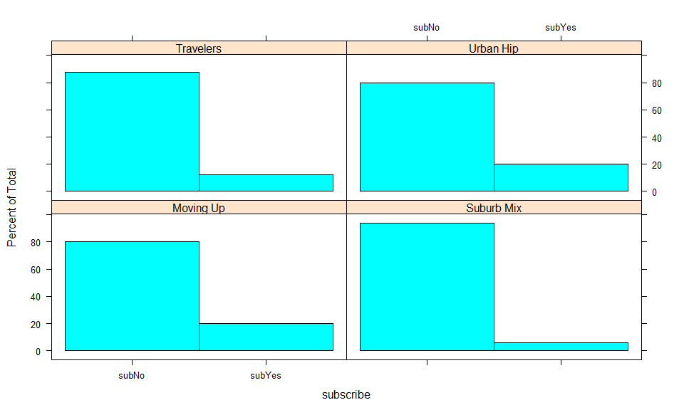
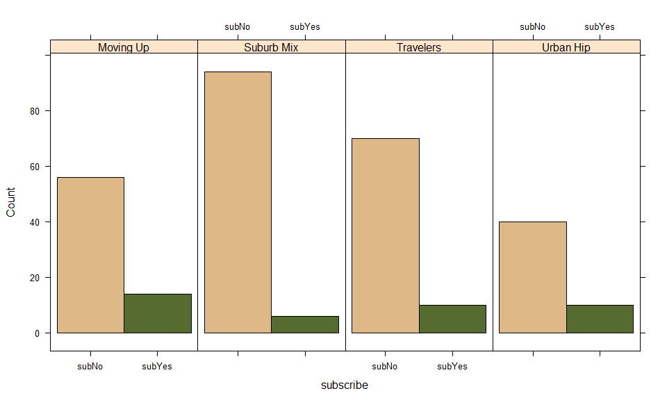

ch-5-comparing-groups
================
Sonya Hua
September 7, 2017

Comparing Groups: Tables and Visualizations
-------------------------------------------

One might be interested in group data by segment, region, time period, test groups, etc... In all such cases, we're comparing one group of data to another in order to identify an effect.

### Data Simulation (Consumer Segmentation Data)

We simulate a data set representative of a consumer segmentation project. The scenario is a subscription-based service (such as cable TV or mag subsription), and we collect data from N= 300 respondents on \*age, gender, income, \# of children, whether they rent (Y,N), subscribe (Y,N).

Each respondent has been assigned to 1:4 customer segments: "Suburb Mix", "Urban Hip", "Travelers", or "Moving Up"

Segmentation data is moderately complex and we separate our code into 3 steps:

1.  Define the data structure: demographic vars, segment names, and sizes

2.  Parametrize the distributions of the demographic vars (i.e. mean, variance, sd, probabilities)

3.  Code that iterates over the segments and vars to draw random values depending on the definitions and parameters

#### Define the data structure

First step is to define the variable names, data types, segment names, and sample size of each seg

``` r
# Variables of segments
segVars <- c("age","gender","income","kids","ownHome", "subscribe")

# Distributions of each variable
segVarType <- c("norm","binom","norm","pois","binom","binom")

# Segment names
segNames <- c("Suburb Mix", "Urban Hip", "Travelers", "Moving Up")

# Size or # of obs per segment
segSize <- c(100,50,80,70)
```

Distributions:

-   normal (continuous variables)
-   binomial (yes/no variables)
-   poisson (count variables)

To help us generate the values per segment and variable, we'll create a *look up tables* of distribution parameters. By storing values this way, we can easily make quick modifications for future purposes without digging through the code. It's best practice to separate data definitions vs. procedural code by declaring the appropriate variables and reusing it in procedural code.

We're going to create 2 lookup tables: 1 for means (including mean probabilities), and another for standard deviations for normally distributed vars. Since there's 4 segments and 6 variables, we create 4x6 matrices per table. Each row will represent Seg1, Seg2, etc... Each column will represent a different var. In the case of binom, we specify the mean probabilities. In poiss vars, since we're using a random poisson distribution, we specify the mean number of kids.

``` r
segMeans <- matrix(c(
  40, 0.5, 55000, 2, 0.5, 0.1,
  24, 0.7, 21000, 1, 0.2, 0.2,
  58, 0.5, 64000, 0, 0.7, 0.05,
  36, 0.3, 52000, 2, 0.3, 0.2 ), 
  ncol=length(segVars), byrow=T, dimnames= list(segNames, segVars))  
# dimnames: takes on a list of length 2 with row and column names
# byrow= T: filled by rows, not columns

segMeans
```

    ##            age gender income kids ownHome subscribe
    ## Suburb Mix  40    0.5  55000    2     0.5      0.10
    ## Urban Hip   24    0.7  21000    1     0.2      0.20
    ## Travelers   58    0.5  64000    0     0.7      0.05
    ## Moving Up   36    0.3  52000    2     0.3      0.20

``` r
segSDs <- matrix( c(
  5, NA, 12000, NA, NA, NA,
  2, NA, 5000, NA, NA, NA,
  8, NA, 21000, NA, NA, NA,
  4, NA, 10000, NA, NA, NA),
   ncol=length(segVars), byrow=T, dimnames= list(segNames, segVars))

segSDs
```

    ##            age gender income kids ownHome subscribe
    ## Suburb Mix   5     NA  12000   NA      NA        NA
    ## Urban Hip    2     NA   5000   NA      NA        NA
    ## Travelers    8     NA  21000   NA      NA        NA
    ## Moving Up    4     NA  10000   NA      NA        NA

We have now fully defined the distribution parameters of each segment.

#### Iterate over each segment and var to fill in values

Let's plan out our code in pseudocode (sentences organized like code). This helps us conceptualize the requirements of our code and we can easily debug concepts before actual coding:

    Set up data frame "seg.df" and set a seed for replicating random numbers
    For each SEGMENT i in "segNames" {
      Set up a temporary df "this.seg" for this SEGMENT's data
      For each var j in "segVars" {
        Use nested if() conditions on "segVarType[j]" to determine data type for VARIABLE
        If it's a certain distribution, use segMeans[i,j and segSDs[i,j] to draw random data 
        for VARIABLE (within SEGMENT) "segSize[i]" times
      }
      Add this SEGMENT's data ("this.seg") to the first data frame ("seg.df")
    }
      }
    }

``` r
# Translating the pseudocode into R:

seg.df <- NULL
set.seed(02554)

# Iterate over each segment
for (i in seq_along(segNames)) {
  cat(i, segNames[i], "\n")
  this.seg <- data.frame(matrix(NA, nrow=segSize[i], ncol=length(segVars)))
  
  for (j in seq_along(segVars)) {
    if (segVarType[j] == "norm") {
      this.seg[,j] = rnorm(segSize[i], mean=segMeans[i,j], sd=segSDs[i,j])
    } else if (segVarType[j] =="pois") {
      this.seg[,j] = rpois(segSize[i], lambda=segMeans[i,j])
    } else if (segVarType[j]=="binom") {
      this.seg[,j] = rbinom(segSize[i],size=1, prob=segMeans[i,j])  # size = 1 for 1 trial per value
    } else {
      stop("Bad segment data type: ", segVarType[j])
    }
  }
  seg.df <- rbind(seg.df, this.seg) # combines R objects by Rows
}
```

    ## 1 Suburb Mix 
    ## 2 Urban Hip 
    ## 3 Travelers 
    ## 4 Moving Up

``` r
# Add in the labels, names, and types
(names(seg.df) <- segVars)
```

    ## [1] "age"       "gender"    "income"    "kids"      "ownHome"   "subscribe"

``` r
head(seg.df)
```

    ##        age gender   income kids ownHome subscribe
    ## 1 47.31613      1 49482.81    2       0         0
    ## 2 31.38684      1 35546.29    1       1         0
    ## 3 43.20034      1 44169.19    0       1         0
    ## 4 37.31700      0 81041.99    1       0         0
    ## 5 40.95439      0 79353.01    3       1         0
    ## 6 43.03387      1 58143.36    4       1         0

``` r
# Factorize the appropriate variables
seg.df$Segment <- factor(rep(segNames, times=segSize)) # Within each elmeent of segNames, replicate it SegSize times
seg.df$ownHome <- factor(seg.df$ownHome, labels= c("ownNO", "ownYes")) # ownNo = 0, ownYes = 1
seg.df$gender <- factor(seg.df$gender, labels=c("Female", "Male"))   # Female = 0, Male = 1
seg.df$subscribe <- factor(seg.df$subscribe, labels = c("subNo", "subYes")) # subNo = 0, subYes = 1

# Check Data
head(seg.df)
```

    ##        age gender   income kids ownHome subscribe    Segment
    ## 1 47.31613   Male 49482.81    2   ownNO     subNo Suburb Mix
    ## 2 31.38684   Male 35546.29    1  ownYes     subNo Suburb Mix
    ## 3 43.20034   Male 44169.19    0  ownYes     subNo Suburb Mix
    ## 4 37.31700 Female 81041.99    1   ownNO     subNo Suburb Mix
    ## 5 40.95439 Female 79353.01    3  ownYes     subNo Suburb Mix
    ## 6 43.03387   Male 58143.36    4  ownYes     subNo Suburb Mix

``` r
library(psych)
library(car)
```

    ## 
    ## Attaching package: 'car'

    ## The following object is masked from 'package:psych':
    ## 
    ##     logit

``` r
some(seg.df)
```

    ##          age gender   income kids ownHome subscribe    Segment
    ## 58  34.46528   Male 60971.76    2   ownNO     subNo Suburb Mix
    ## 79  42.31337   Male 49674.79    0  ownYes     subNo Suburb Mix
    ## 124 22.30333 Female 24541.24    1   ownNO     subNo  Urban Hip
    ## 136 23.08861   Male 33909.50    3   ownNO     subNo  Urban Hip
    ## 158 43.35230   Male 51787.88    0   ownNO     subNo  Travelers
    ## 186 48.84991 Female 59075.12    0   ownNO     subNo  Travelers
    ## 232 37.85733   Male 50980.48    5  ownYes     subNo  Moving Up
    ## 243 36.97339 Female 53792.40    0   ownNO     subNo  Moving Up
    ## 257 43.30929 Female 69549.93    3   ownNO    subYes  Moving Up
    ## 288 35.82586 Female 41766.29    2   ownNO    subYes  Moving Up

``` r
tail(seg.df)
```

    ##          age gender   income kids ownHome subscribe   Segment
    ## 295 36.14964   Male 40522.39    0  ownYes     subNo Moving Up
    ## 296 32.95227 Female 43882.43    0  ownYes     subNo Moving Up
    ## 297 40.96255 Female 64197.09    2   ownNO     subNo Moving Up
    ## 298 38.22980   Male 47580.93    0   ownNO    subYes Moving Up
    ## 299 33.17036   Male 60747.34    1   ownNO     subNo Moving Up
    ## 300 34.38388   Male 53674.93    5  ownYes     subNo Moving Up

``` r
summary(seg.df)
```

    ##       age           gender        income            kids        ownHome   
    ##  Min.   :19.26   Female:157   Min.   : -5183   Min.   :0.00   ownNO :159  
    ##  1st Qu.:33.01   Male  :143   1st Qu.: 39656   1st Qu.:0.00   ownYes:141  
    ##  Median :39.49                Median : 52014   Median :1.00               
    ##  Mean   :41.20                Mean   : 50937   Mean   :1.27               
    ##  3rd Qu.:47.90                3rd Qu.: 61403   3rd Qu.:2.00               
    ##  Max.   :80.49                Max.   :114278   Max.   :7.00               
    ##   subscribe         Segment   
    ##  subNo :260   Moving Up : 70  
    ##  subYes: 40   Suburb Mix:100  
    ##               Travelers : 80  
    ##               Urban Hip : 50  
    ##                               
    ## 

``` r
str(seg.df)
```

    ## 'data.frame':    300 obs. of  7 variables:
    ##  $ age      : num  47.3 31.4 43.2 37.3 41 ...
    ##  $ gender   : Factor w/ 2 levels "Female","Male": 2 2 2 1 1 2 2 2 1 1 ...
    ##  $ income   : num  49483 35546 44169 81042 79353 ...
    ##  $ kids     : int  2 1 0 1 3 4 3 0 1 0 ...
    ##  $ ownHome  : Factor w/ 2 levels "ownNO","ownYes": 1 2 2 1 2 2 1 1 1 2 ...
    ##  $ subscribe: Factor w/ 2 levels "subNo","subYes": 1 1 1 1 1 1 1 1 1 1 ...
    ##  $ Segment  : Factor w/ 4 levels "Moving Up","Suburb Mix",..: 2 2 2 2 2 2 2 2 2 2 ...

``` r
library(psych)
describe(seg.df)
```

    ##            vars   n     mean       sd   median  trimmed      mad      min
    ## age           1 300    41.20    12.71    39.49    40.40    10.43    19.26
    ## gender*       2 300     1.48     0.50     1.00     1.47     0.00     1.00
    ## income        3 300 50936.54 20137.55 52014.35 50661.88 16186.80 -5183.35
    ## kids          4 300     1.27     1.41     1.00     1.07     1.48     0.00
    ## ownHome*      5 300     1.47     0.50     1.00     1.46     0.00     1.00
    ## subscribe*    6 300     1.13     0.34     1.00     1.04     0.00     1.00
    ## Segment*      7 300     2.37     1.02     2.00     2.33     1.48     1.00
    ##                  max     range skew kurtosis      se
    ## age            80.49     61.23 0.56    -0.17    0.73
    ## gender*         2.00      1.00 0.09    -2.00    0.03
    ## income     114278.26 119461.61 0.14     0.36 1162.64
    ## kids            7.00      7.00 1.11     0.91    0.08
    ## ownHome*        2.00      1.00 0.12    -1.99    0.03
    ## subscribe*      2.00      1.00 2.15     2.62    0.02
    ## Segment*        4.00      3.00 0.17    -1.09    0.06

As a final step, let's save the data frame as a backup so we can use it again in later chapters. Use "/" for path in windows:

``` r
setwd("c:/users/sonya/documents/git/r-for-marketing-research-and-analytics")
save(seg.df, file="segdf-Rintro-Ch5.RData")
```

### 4.6 Finding Descriptives By Group

With insights about segments, we can engage or tailor offers in different ways in order to reach them.

##### How does income and gender vary across segments?

An ad hoc way to do this is with df indexing. For example, to find the mean income for "Moving Up":

``` r
# mean income for Moving Up segment
mean(seg.df$income[seg.df$Segment == "Moving Up"])
```

    ## [1] 53090.97

``` r
# mean income for Moving Up segment who do not subscribe
mean(seg.df$income[seg.df$Segment == "Moving Up" & seg.df$subscribe == "subNo"])
```

    ## [1] 53633.73

This is tedious to do all the time when we want to evaluate a function by conditions. A more general way to do this is with `by(data, INDICES, FUN)`, which divides `data` into groups for each of the unique values in `INDICES` and then apply the `FUN` function to each group

``` r
# mean income by segment
by(seg.df$income, seg.df$Segment, mean)
```

    ## seg.df$Segment: Moving Up
    ## [1] 53090.97
    ## -------------------------------------------------------- 
    ## seg.df$Segment: Suburb Mix
    ## [1] 55033.82
    ## -------------------------------------------------------- 
    ## seg.df$Segment: Travelers
    ## [1] 62213.94
    ## -------------------------------------------------------- 
    ## seg.df$Segment: Urban Hip
    ## [1] 21681.93

``` r
# mean income by segment and subscription status
by(seg.df$income, list(seg.df$Segment, seg.df$subscribe), mean)
```

    ## : Moving Up
    ## : subNo
    ## [1] 53633.73
    ## -------------------------------------------------------- 
    ## : Suburb Mix
    ## : subNo
    ## [1] 54942.69
    ## -------------------------------------------------------- 
    ## : Travelers
    ## : subNo
    ## [1] 62746.11
    ## -------------------------------------------------------- 
    ## : Urban Hip
    ## : subNo
    ## [1] 22082.11
    ## -------------------------------------------------------- 
    ## : Moving Up
    ## : subYes
    ## [1] 50919.89
    ## -------------------------------------------------------- 
    ## : Suburb Mix
    ## : subYes
    ## [1] 56461.41
    ## -------------------------------------------------------- 
    ## : Travelers
    ## : subYes
    ## [1] 58488.77
    ## -------------------------------------------------------- 
    ## : Urban Hip
    ## : subYes
    ## [1] 20081.19

However, the output is stringy and not user-friendly. Use `aggregate()` instead which works almost the same as `by` in its list form except we need to include `list()` even if we are grouping by 1 variable. The result is a dataframe where we can save results to an object, which we can then index, write to a file, manipulate in other ways.

``` r
aggregate(seg.df$income, list(seg.df$Segment), mean)
```

    ##      Group.1        x
    ## 1  Moving Up 53090.97
    ## 2 Suburb Mix 55033.82
    ## 3  Travelers 62213.94
    ## 4  Urban Hip 21681.93

``` r
aggregate(seg.df$income, list(seg.df$Segment, seg.df$subscribe), mean)
```

    ##      Group.1 Group.2        x
    ## 1  Moving Up   subNo 53633.73
    ## 2 Suburb Mix   subNo 54942.69
    ## 3  Travelers   subNo 62746.11
    ## 4  Urban Hip   subNo 22082.11
    ## 5  Moving Up  subYes 50919.89
    ## 6 Suburb Mix  subYes 56461.41
    ## 7  Travelers  subYes 58488.77
    ## 8  Urban Hip  subYes 20081.19

``` r
seg.income.mean <- aggregate(seg.df$income, list(seg.df$Segment), mean)
head(seg.df$Segment)
```

    ## [1] Suburb Mix Suburb Mix Suburb Mix Suburb Mix Suburb Mix Suburb Mix
    ## Levels: Moving Up Suburb Mix Travelers Urban Hip

``` r
seg.df$segIncome <- seg.income.mean[seg.df$Segment, 2]  #  Indexed mean by segment to look up the appropriate value per row of seg.df

# since seg.df$Segment includes all of the segment rows, we are indexing seg.income.mean by its mean so the return output is seg.df$segment with its mean
```

``` r
head(seg.income.mean)
```

    ##      Group.1        x
    ## 1  Moving Up 53090.97
    ## 2 Suburb Mix 55033.82
    ## 3  Travelers 62213.94
    ## 4  Urban Hip 21681.93

``` r
head(seg.df$segIncome)
```

    ## [1] 55033.82 55033.82 55033.82 55033.82 55033.82 55033.82

``` r
tail(seg.df$segIncome)
```

    ## [1] 53090.97 53090.97 53090.97 53090.97 53090.97 53090.97

When we check the `seg.df` data frame, we see that each row of obs matches its segment mean

``` r
some(seg.df)
```

    ##          age gender    income kids ownHome subscribe    Segment segIncome
    ## 71  36.22376 Female  53428.06    1   ownNO     subNo Suburb Mix  55033.82
    ## 84  34.28161   Male  49346.70    2  ownYes    subYes Suburb Mix  55033.82
    ## 86  35.87205   Male  39442.72    1   ownNO     subNo Suburb Mix  55033.82
    ## 91  45.19053   Male  68937.20    5  ownYes     subNo Suburb Mix  55033.82
    ## 171 64.85144 Female  78231.33    0  ownYes     subNo  Travelers  62213.94
    ## 173 64.70641   Male  45517.15    0   ownNO    subYes  Travelers  62213.94
    ## 184 68.05148   Male 104312.45    0  ownYes     subNo  Travelers  62213.94
    ## 185 50.50749 Female  48946.07    0  ownYes    subYes  Travelers  62213.94
    ## 202 64.63338   Male 113456.80    0   ownNO     subNo  Travelers  62213.94
    ## 290 42.40763   Male  53520.36    1   ownNO     subNo  Moving Up  53090.97

Caution: This is bad practice since it can lead to erroneous computations. Let's remove that column by setting its value to `NULL`

``` r
seg.df$segIncome <- NULL
str(seg.df)
```

    ## 'data.frame':    300 obs. of  7 variables:
    ##  $ age      : num  47.3 31.4 43.2 37.3 41 ...
    ##  $ gender   : Factor w/ 2 levels "Female","Male": 2 2 2 1 1 2 2 2 1 1 ...
    ##  $ income   : num  49483 35546 44169 81042 79353 ...
    ##  $ kids     : int  2 1 0 1 3 4 3 0 1 0 ...
    ##  $ ownHome  : Factor w/ 2 levels "ownNO","ownYes": 1 2 2 1 2 2 1 1 1 2 ...
    ##  $ subscribe: Factor w/ 2 levels "subNo","subYes": 1 1 1 1 1 1 1 1 1 1 ...
    ##  $ Segment  : Factor w/ 4 levels "Moving Up","Suburb Mix",..: 2 2 2 2 2 2 2 2 2 2 ...

#### 5.2.1 Formula Syntax

*Formula specification* provides a standard way to desribe relationships among vars. A formula uses the tilde ~ to separate *response vars* from *explanatory vars* y~x. It can also be interpreted as "y in response to x" or "y is modeled by x" depending on the context

``` r
aggregate(income ~ Segment, data=seg.df, mean)
```

    ##      Segment   income
    ## 1  Moving Up 53090.97
    ## 2 Suburb Mix 55033.82
    ## 3  Travelers 62213.94
    ## 4  Urban Hip 21681.93

#### 5.2.2 Descriptives for Two-Way Groups

A common task in marketing is cross-tabulating, separating customers into groups according to 2+ factors. Formula syntax makes it easy to compute a cross tab just by specifying multiple explanatory variables in the form `y~x1+x2....`. For example:

``` r
aggregate(income~ Segment + ownHome, data=seg.df, mean)
```

    ##      Segment ownHome   income
    ## 1  Moving Up   ownNO 54497.68
    ## 2 Suburb Mix   ownNO 54932.83
    ## 3  Travelers   ownNO 63188.42
    ## 4  Urban Hip   ownNO 21337.59
    ## 5  Moving Up  ownYes 50216.37
    ## 6 Suburb Mix  ownYes 55143.21
    ## 7  Travelers  ownYes 61889.12
    ## 8  Urban Hip  ownYes 23059.27

We now have a separate group for each combination of `Segment` and `ownHome`.

A formula can be extended to include as many grouping vars as needed. This data frame can also be saved for reuse:

``` r
agg.data <- aggregate(income~Segment+income+ownHome+subscribe, data=seg.df, mean)
agg.data[2,]
```

    ##      Segment ownHome subscribe   income
    ## 2 Suburb Mix   ownNO     subNo 54579.99

##### How frequent do people own homes per segment?

This calls for combinations of `Segment` and `ownHome` with frequency values. We can compute frequencies using `table(factor1, factor2,...)` to obtain 1-way or 2-way count tables

`with(data, expr, ....)` Evaluate an R *expression* in an environment constructed from *data*, possibly modifying (a copy of) the original data.

``` r
with(seg.df, table(Segment, ownHome))
```

    ##             ownHome
    ## Segment      ownNO ownYes
    ##   Moving Up     47     23
    ##   Suburb Mix    52     48
    ##   Travelers     20     60
    ##   Urban Hip     40     10

*Observe*: There are 10 observed customers in the "Urban Hip" segment who own homes and 60 in the "Travelers" segment

##### What is the number of kids in each household by segment?

``` r
with(seg.df, table(kids, Segment))
```

    ##     Segment
    ## kids Moving Up Suburb Mix Travelers Urban Hip
    ##    0        13         11        80        17
    ##    1        17         36         0        17
    ##    2        18         22         0        11
    ##    3        13         19         0         4
    ##    4         5          7         0         1
    ##    5         3          3         0         0
    ##    6         0          2         0         0
    ##    7         1          0         0         0

*Observe*: 80 "Travelers" have no kids. Very few households have more than 4 kids.

`xtabs(formula = y~x, data=)` creates a contingency table (optionally a sparse matrix) from cross-classifying factors, usually contained in a data frame, using a formula interface. The y variable must be a *numeric variable* and not a factor

We can add together the counts of kids to get the total number of children per segment

``` r
xtabs(kids~Segment, data=seg.df)
```

    ## Segment
    ##  Moving Up Suburb Mix  Travelers  Urban Hip 
    ##        134        192          0         55

``` r
xtabs(income~Segment, data=seg.df)
```

    ## Segment
    ##  Moving Up Suburb Mix  Travelers  Urban Hip 
    ##    3716368    5503382    4977115    1084096

#### 5.2.3 Visualizations by Group: Frequencies and Proportions

The `lattice` package provides a way of plotting cross tabs with frequencies and proportions. `histogram(formula, data, type)` is similar to `hists()` but understands formula notation including conditioning on factors by separating the plot into multiple panes based on that factor. Conditioning is indicated by the symbol "|". `histogram()` automatically assumes by default percent of total counts (proportions) within each group as our response variable unless a response var is specified in the formula notation.

``` r
library(lattice)
histogram(~subscribe | Segment, data=seg.df, layout=c(2,2))
```

 *Observe*

-   The "Suburban Mix" segment is least likely to subscribe. It suggests that the company might investigate or improve the product to make it more appealing to this group or else stop marketing to them.

If we want actual counts rather than proportions, we could include the argument `type="count"`.

``` r
histogram(~subscribe | Segment, data=seg.df, type="count",
           layout=c(4,1), col=c("burlywood","darkolivegreen"))  # Layout includes 4 columns, 1 row
```



``` r
# layout is a numeric vector of length 2 or 3 giving the number of columns, rows, and pages (optional) in a multipanel display. By default, the number of columns is the number of levels of the first conditioning variable and the number of rows is the number of levels of the second conditioning variable.
```
