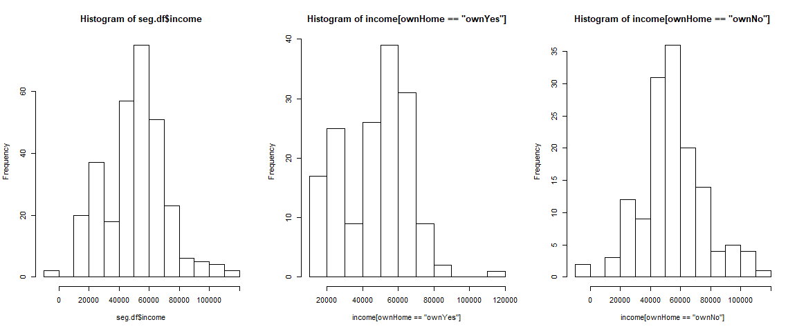
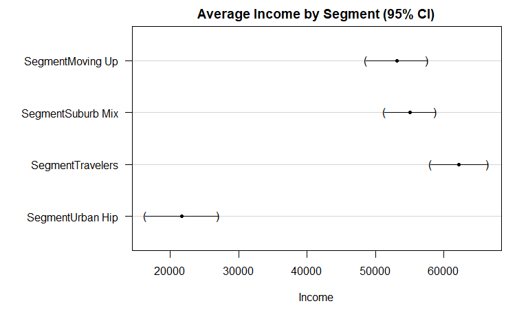
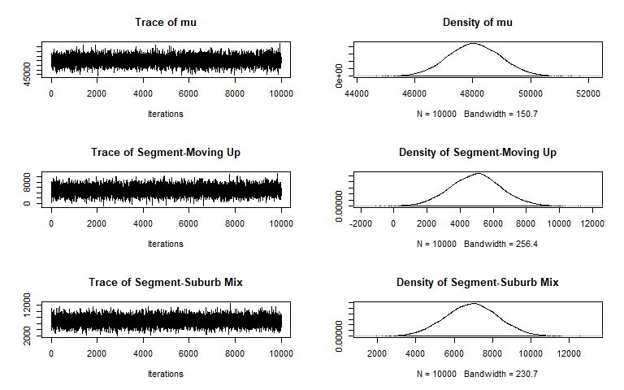
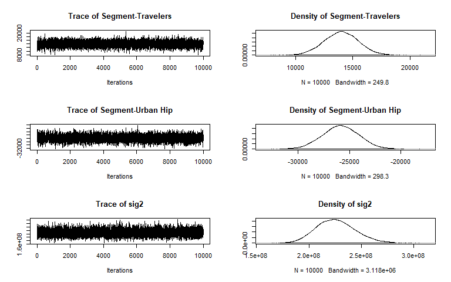

ch-6-comparing-groups-tests
================
Sonya Hua
September 8, 2017

"It looks different but is it really different?" The answer involves our first [inferential statistical](https://statistics.laerd.com/statistical-guides/descriptive-inferential-statistics.php) procedures: *chi-square, t-tests, and ANOVA*.

It's all about estimating parameters and testing hypotheses. Before applying any stat test or model, it's impotant to examine the data and check for 1) missing values 2) outliers 3) Skewness 4) Normal Distributions. Since more tests assume a normal distribution or some other smooth continuous distribution.

### 6.1 Data for Comparing Groups

``` r
load("C:/Users/sonya/Documents/git/r-for-marketing-research-and-analytics/segdf-Rintro-Ch5.RData")
summary(seg.df)
```

    ##       age           gender        income            kids        ownHome   
    ##  Min.   :19.26   Female:157   Min.   : -5183   Min.   :0.00   ownNO :159  
    ##  1st Qu.:33.01   Male  :143   1st Qu.: 39656   1st Qu.:0.00   ownYes:141  
    ##  Median :39.49                Median : 52014   Median :1.00               
    ##  Mean   :41.20                Mean   : 50937   Mean   :1.27               
    ##  3rd Qu.:47.90                3rd Qu.: 61403   3rd Qu.:2.00               
    ##  Max.   :80.49                Max.   :114278   Max.   :7.00               
    ##   subscribe         Segment   
    ##  subNo :260   Moving Up : 70  
    ##  subYes: 40   Suburb Mix:100  
    ##               Travelers : 80  
    ##               Urban Hip : 50  
    ##                               
    ## 

### 6.2 Chi-Square Test: Testing differences between Group Frequencies

Most of the work in marketing analytics and marketing research involves summarizing the differences between groups using group averages and cross tabs. However, best practice is to be able to use *statistical tests* to determine whether the differences are real or might instead be due to noise in the data.

One of the simplest tests is the *[chi-square test](https://onlinecourses.science.psu.edu/statprogram/node/158)*, which is used with frequency count tables. \*A chi-square test determines whether the frequencies in cells are significantly different from what one would expect on the basis of their total counts if data was randomly sampled from a large population where groups are equally distributed given a sample size. For example, knowing var A will not help inform var B. There are not related or are independent of each other

H0: Variable A and Variable B are independent. Ha: Variable A and Variable B are not independent (dependent)

`chisq.test()` operates on a `table()`

``` r
# Chi-square test # 1
example.data <- rep(c(1:4), times= c(25,25,25,20))
tmp.tab <- table(example.data)
tmp.tab
```

    ## example.data
    ##  1  2  3  4 
    ## 25 25 25 20

``` r
chisq.test(tmp.tab)
```

    ## 
    ##  Chi-squared test for given probabilities
    ## 
    ## data:  tmp.tab
    ## X-squared = 0.78947, df = 3, p-value = 0.852

*Observe*:

-   we generated 95 observations of 1:4, compile those in a table, and then test that table for *chi-square independence*.
-   Test evaluates the likelihood of seeing such a result under the null hypothesis that the data is randomly sampled from a population where the values 1 to 4 are equally distributed, given a marginal count of N=95 observations.
-   The p-value of 0.852: Under null hypothesis, there is an 85.2% chance of seeing a data set with differences similar to or greater than those in our table.
-   Under the asssumptions of the chi-square test, our table does not suggest significant differences in frequency between the 4 cells
-   The data shows no evidence that the groups in the population are of unequal size if it was randomly sampled from an equal distribution
-   1:4 are indepndent of each other.

``` r
tmp.tab <- table(rep(c(1:4), times=c(25,25,25,10)))
tmp.tab
```

    ## 
    ##  1  2  3  4 
    ## 25 25 25 10

``` r
chisq.test(tmp.tab)
```

    ## 
    ##  Chi-squared test for given probabilities
    ## 
    ## data:  tmp.tab
    ## X-squared = 7.9412, df = 3, p-value = 0.04724

*Observe*:

-   p=0.047: We can reject the null hypothesis with 95% confidence that there is no difference between the cells
-   The data in this sample suggests that the distribution of the values 1 to 4 is likely to be unequal in the *larger population*, assuming the data is randomly sampled.

If we have a smaller sample, we would not get the same results even if the relative proportions of customers in each group are the same. Significance tests are sensitive to both the observed difference and sample size:

``` r
tmp.tab <-tmp.tab/5
tmp.tab
```

    ## 
    ## 1 2 3 4 
    ## 5 5 5 2

``` r
chisq.test(tmp.tab)
```

    ## Warning in chisq.test(tmp.tab): Chi-squared approximation may be incorrect

    ## 
    ##  Chi-squared test for given probabilities
    ## 
    ## data:  tmp.tab
    ## X-squared = 1.5882, df = 3, p-value = 0.6621

*Observe*:

-   The results are not significant and there is no evidence of a real difference in group sizes even though the proportion of people in group 4 is the same as in larger sample above where results were significant.

That's one of the cautions about statistical significance testing: *it's dependent on sample size as well as on the real effect*

Another example, let's return to our simulated segment data (N=300 obs).

##### Are the segment sizes significantly different from one another?

Assuming that the 300 customers are *random sample of a larger population*, we can use the chi-square test. We'll combine `chisq.test()` and `table()` into one command:

``` r
table(seg.df$Segment)
```

    ## 
    ##  Moving Up Suburb Mix  Travelers  Urban Hip 
    ##         70        100         80         50

``` r
chisq.test(table(seg.df$Segment))
```

    ## 
    ##  Chi-squared test for given probabilities
    ## 
    ## data:  table(seg.df$Segment)
    ## X-squared = 17.333, df = 3, p-value = 0.0006035

*Observe*

-   With p=0.0006, there are significant differences in segment size
-   Our sample does not support the hypothesis that there is an idenditcal number of custommers in each segment.

##### Is subscription status independent from home ownership?

In other words, are respondents just as likely to subscribe or not subscribe, regardless of home ownership status? Are customers just as likely to own a home or not, independent of subscription status? The null hypothesis is that home ownership and subscription status is independent i.e. that the counts in the cells are as one might expect from marginal proportions.

There's 2 optionos for chi-square test:

1.  For 2x2 contingency tables, chi-square test defaults to using *Yates' correction* which adjusts the chi-square statistic since data is not continuous (comes from a lumpy binomial distribution). To turn this off, use `correct=F` option.

2.  Chi-square tests can calculate confidence intervals based on simulation, whereby it compares the observed table to thousands of simulated tables wit hteh same marginal counts. The p-value indicates the proportion of those simulations with differences between the cell counts nad marginal proportions at least as large as the ones in the observed table using the `sim=T` and `B=SIMULATIONS` arguments

``` r
table(seg.df$subscribe, seg.df$ownHome)
```

    ##         
    ##          ownNO ownYes
    ##   subNo    137    123
    ##   subYes    22     18

``` r
# Using's Yates' correction
chisq.test(table(seg.df$subscribe, seg.df$ownHome))
```

    ## 
    ##  Pearson's Chi-squared test with Yates' continuity correction
    ## 
    ## data:  table(seg.df$subscribe, seg.df$ownHome)
    ## X-squared = 0.010422, df = 1, p-value = 0.9187

``` r
# Using traditional values without Yates' correction
chisq.test(table(seg.df$subscribe, seg.df$ownHome), correct=F)
```

    ## 
    ##  Pearson's Chi-squared test
    ## 
    ## data:  table(seg.df$subscribe, seg.df$ownHome)
    ## X-squared = 0.074113, df = 1, p-value = 0.7854

``` r
# Using simulation method of 10000 trials
chisq.test(table(seg.df$subscribe, seg.df$ownHome), sim=T, B=10000)
```

    ## 
    ##  Pearson's Chi-squared test with simulated p-value (based on 10000
    ##  replicates)
    ## 
    ## data:  table(seg.df$subscribe, seg.df$ownHome)
    ## X-squared = 0.074113, df = NA, p-value = 0.8697

*Observe*

-   Based on high p-value, we fail to reject null hypothesis and conclude that the factors are unrelated. Home ownership is independent of subscription status in our data. There is no relationship between subscriiption rate and home ownership. The factors are independent.

### 6.3 Testing Observed Proportions: `binom.test()`

**Binomial variables** are variables that have only 2 types of values ("Y/N" "0,1").

For example, Chris took a walk in Manhattan and observed 12 groups of Seattle fans and 8 groups of Denver fans. Assuming the observations are a random sample of a binomial value (either Seattle or Denver fans). Is the observed value of 60% Seattle fans significantly different from equal representation (which would be 50% each)?

We use `binom.test(successes, trials, probability)` to test what's the likelihood of randomly observing 12 groups out of 20 in one direction, if the true likelhood is 50%?

``` r
binom.test(12,20,p=0.5)
```

    ## 
    ##  Exact binomial test
    ## 
    ## data:  12 and 20
    ## number of successes = 12, number of trials = 20, p-value = 0.5034
    ## alternative hypothesis: true probability of success is not equal to 0.5
    ## 95 percent confidence interval:
    ##  0.3605426 0.8088099
    ## sample estimates:
    ## probability of success 
    ##                    0.6

*Observe*:

-   The 95% CI is 36-81% which includes the null hypothesis value of 50% probability.
-   We conclude that observing 60% seattle fans in a sample of 20 does not conclusively demonstate that there are more Seattle fans in the larger group of fans roaming New York.
-   The p-value=0.5034 is not significant - we fail to support the idea that the results are different from the null hypothesis

#### 6.4.1 Interpreting Confidence Intervals

The definition of a 95% CI: *It's the range of possible sample estimates that we would expect to see 95% of the time if we repeatedly estimate the statistic using random samples of the same sample size under the assumption that the true value in an infinite or very large population is the same as our current estimate*

It's the best guess of possible answers we would expect with repeated random sampling.

When the CI excludes null hypothesis, the result is statistically significant.

CI's DO NOT express our degree of confidence in our results since they don't reflect the confidence elvel in the assumptinos made.

CI's are often misunderstood to imply that "the true value lies in the CI range" when it's the other way around "if the true value is what we obtained then we would expect additional esitmates to fall within this CI 95% of the time with random sampling."

The CI is about sample estimates, not about the true value of a population.

Before interpreting a result, make surue it's statitically significant. If not, then the evidence for our result is weak and we should not intepret it. Best pracice is to chart the confifdence intervals when available and always report out on confidence intervals for a more complete and accurate description to stakeholders.

`confint()` determines the CIs for a statistical model

#### What's the probability we would observe 8:12 Seattle fans out of 20, if the true rate is 50%?

Use the *density estimate* for a binomial distribution across the range of interest and sum the point probabilities:

``` r
sum(dbinom(8:12, 20, 0.5))
```

    ## [1] 0.736824

*Observe* If we observe 20 fans and the true split is 50%, there's a 73.7% chance that would would observe between 8 to 12 fans.

An *exact* binomial test may be too conservative (wide CI) in its estimation of CI's. Another method is to use the *[agresti-coull](http://www.stat.ufl.edu/~aa/articles/agresti_coull_1998.pdf)* method to get a slightly smaller CI but still includes 50%. Use `binom.confint(method="ac")`

``` r
library(binom)
binom.confint(12, 20, method="ac")
```

    ##          method  x  n mean     lower     upper
    ## 1 agresti-coull 12 20  0.6 0.3860304 0.7817446

*Observe* The CI bound using approximate (0.39 to 0.78) is smaller compared to exact binomial test (0.36 to 0.81)

##### What if we observed 120 out of 200 people to be Seattle fans? (The same proportion as before but in a larger sample)

``` r
binom.test(120,200,.5)
```

    ## 
    ##  Exact binomial test
    ## 
    ## data:  120 and 200
    ## number of successes = 120, number of trials = 200, p-value =
    ## 0.005685
    ## alternative hypothesis: true probability of success is not equal to 0.5
    ## 95 percent confidence interval:
    ##  0.5285357 0.6684537
    ## sample estimates:
    ## probability of success 
    ##                    0.6

*Observe*:

-   The CI no longer includes 50%. The p-value &lt; 0.05, indicating there is a statistically signifciant difference.

#### Among the 20 groups, 0 groups had a mixture of Seattle and Denver fans based on their team clothing. What's the most likely proportion of groups that comprise of mixed fans?

We need to use the *Agresti-Coull* method because exact tests have no confidence intervals for 0% or 100% observations:

``` r
binom.confint(0,20, method="ac")
```

    ##          method x  n mean      lower     upper
    ## 1 agresti-coull 0 20    0 -0.0286844 0.1898096

*Observe*: The negative bound may be ignored as an artifact. We conclude that althouogh Chris observed 0 cases, the occurrence of mixed fandom groups is likely to be between 0 to 19% of the time.

The `binom` package also computes several other varients of the binomial test including a Bayesian version.

### 6.4 T-test: Testing Group Means

A *[t-test](http://www.stat.columbia.edu/~martin/W2024/R2.pdf)* compares the mean of one sample against mean of another sample or against a specific valie i.e. 0. It compares means for exactly 2 data sets.

#### Is the household income different among those who own a home and those who do not?

Let's check for normality before doing a t-test:

``` r
# Fix the levels first

levels(seg.df$ownHome) <- c(levels(seg.df$ownHome), "ownNo")
seg.df$ownHome[is.na(seg.df$ownHome)] <- "ownNo"
summary(seg.df$ownHome)
```

    ##  ownNO ownYes  ownNo 
    ##    159    141      0

``` r
seg.df$ownHome <- droplevels(seg.df$ownHome)
levels(seg.df$ownHome) <- c("ownYes","ownNo")
summary(seg.df$ownHome)
```

    ## ownYes  ownNo 
    ##    159    141

``` r
par(mfrow=c(1,3))
hist(seg.df$income)
with(seg.df, hist(income[ownHome=="ownYes"]))
with(seg.df, hist(income[ownHome=="ownNo"]))
```



``` r
# boxplot

#bwplot(ownHome ~ income, data=seg.df, horizontal = T, xlab="Income $", layout=c(1,2))
```

*Observe* Based on the histograms and boxplots, income is ~ normally distributed.

Test whether home ownership overall is related to differences in income, across all segments, using `t.test(formula,data)` where `income` is the y var and `ownHome` is the x var.

``` r
t.test(income ~ ownHome, data=seg.df)
```

    ## 
    ##  Welch Two Sample t-test
    ## 
    ## data:  income by ownHome
    ## t = -3.2731, df = 285.25, p-value = 0.001195
    ## alternative hypothesis: true difference in means is not equal to 0
    ## 95 percent confidence interval:
    ##  -12080.155  -3007.193
    ## sample estimates:
    ## mean in group ownYes  mean in group ownNo 
    ##             47391.01             54934.68

*Observe*

*The 95% CI does not include 0, so we can conclude there is significant difference in income between home ownership. *The data suggests that people who own their houses have a higher income. *We have 95% confidence that the group difference is between $3007 and $12,080. *The mean income for renters is $47K while homeowners $55K

#### Is there a difference income between homeownrship within the Travelers segment?

We use the filter `data=subset(data, condition)` to select just Travelers and repeat the test:

``` r
t.test(income~ ownHome, data=subset(seg.df, Segment=="Travelers"))
```

    ## 
    ##  Welch Two Sample t-test
    ## 
    ## data:  income by ownHome
    ## t = 0.26561, df = 53.833, p-value = 0.7916
    ## alternative hypothesis: true difference in means is not equal to 0
    ## 95 percent confidence interval:
    ##  -8508.993 11107.604
    ## sample estimates:
    ## mean in group ownYes  mean in group ownNo 
    ##             63188.42             61889.12

*Observe*

-   The CI of -$8,508 to $11,107 include 0 which means there is not a significant difference in mean income among those Travelers in our data who own homes and who don't.
-   P-Value = 0.7916 deems not significant
-   We noticed earlier that the first t-test is significant across all segments, but this test is not significant. This suggests that any significant difference must lie largely outside the "Travelers" segment

### 6.5 ANOVA: Testing Multiple Group Means (vs. t-test which tests 2 groups)

ANOVA compares means of multiple groups by comparing the degree to which groups differ as measured by variance in their means from one another, relative to the variance of abervations around each mean within each group. It tests for difference among multiple means with the assumption that the groups have similar variance.

*One-way ANOVA: Includes 1 factor *Two-way ANOVA: Includes 2 factors

`aov(formula,data)`: basic command to set up the ANOVA model `anova(model)`: to display standard ANOVA summary from `aov()`

##### Which factors are related to differences in mean income? Is income related to home ownership, to segment membership, or both?

1.  We run `aov(income ~ ownHome)` and assign the `aov()` model to an object so we can use it in our next step
2.  `anova()` on the aov model object

``` r
seg.aov.own <- aov(income ~ ownHome, data=seg.df)
anova(seg.aov.own)
```

    ## Analysis of Variance Table
    ## 
    ## Response: income
    ##            Df     Sum Sq    Mean Sq F value   Pr(>F)   
    ## ownHome     1 4.2527e+09 4252661211  10.832 0.001118 **
    ## Residuals 298 1.1700e+11  392611030                    
    ## ---
    ## Signif. codes:  0 '***' 0.001 '**' 0.01 '*' 0.05 '.' 0.1 ' ' 1

*Observe*:

-   There's significant variation between home ownership status and income (p-value &lt; 0.05)

##### Is there a difference in income by segments?

``` r
aov.inc.segments <- aov(income ~ Segment, data=seg.df)
anova(aov.inc.segments)
```

    ## Analysis of Variance Table
    ## 
    ## Response: income
    ##            Df     Sum Sq    Mean Sq F value    Pr(>F)    
    ## Segment     3 5.4970e+10 1.8323e+10  81.828 < 2.2e-16 ***
    ## Residuals 296 6.6281e+10 2.2392e+08                      
    ## ---
    ## Signif. codes:  0 '***' 0.001 '**' 0.01 '*' 0.05 '.' 0.1 ' ' 1

*Observe*:

-   Income varies significantly by segment.

##### If income varies by both home ownership and segment, does that mean that a more complete model should include both?

We add both factors into the two-way ANOVA model to test this:

``` r
anova(aov(income ~ Segment + ownHome, data=seg.df))
```

    ## Analysis of Variance Table
    ## 
    ## Response: income
    ##            Df     Sum Sq    Mean Sq F value Pr(>F)    
    ## Segment     3 5.4970e+10 1.8323e+10 81.6381 <2e-16 ***
    ## ownHome     1 6.9918e+07 6.9918e+07  0.3115 0.5772    
    ## Residuals 295 6.6211e+10 2.2444e+08                   
    ## ---
    ## Signif. codes:  0 '***' 0.001 '**' 0.01 '*' 0.05 '.' 0.1 ' ' 1

*Observe*: Results indicate that when we try to explain income differences by both Segment and home ownership, segment is a significant predictor, but not home ownership. Why? Because segment and homeownership are dependent, and the variation is captured sufficiently by segment membership alone. We can test this further using chi-square test to validate if this is true.

``` r
table(seg.df$ownHome, seg.df$Segment)
```

    ##         
    ##          Moving Up Suburb Mix Travelers Urban Hip
    ##   ownYes        47         52        20        40
    ##   ownNo         23         48        60        10

``` r
chisq.test(table(seg.df$ownHome, seg.df$Segment))
```

    ## 
    ##  Pearson's Chi-squared test
    ## 
    ## data:  table(seg.df$ownHome, seg.df$Segment)
    ## X-squared = 45.472, df = 3, p-value = 7.343e-10

*Observe* Yes, there is a significant difference between Segments and Home ownership.

##### Could it be that home ownership is related to income in some segments but not in others?

This would be represented in our model by an *interaction effect*. In a model,

"+" indicates vars should be modeled for main effects only. ":" model for interaction effect "\*" model for both main effect and interaction

We'll test main effects and interaction of home ownership and segment

``` r
anova(aov(income ~ Segment * ownHome, data=seg.df))
```

    ## Analysis of Variance Table
    ## 
    ## Response: income
    ##                  Df     Sum Sq    Mean Sq F value Pr(>F)    
    ## Segment           3 5.4970e+10 1.8323e+10 81.1305 <2e-16 ***
    ## ownHome           1 6.9918e+07 6.9918e+07  0.3096 0.5784    
    ## Segment:ownHome   3 2.6329e+08 8.7762e+07  0.3886 0.7613    
    ## Residuals       292 6.5948e+10 2.2585e+08                   
    ## ---
    ## Signif. codes:  0 '***' 0.001 '**' 0.01 '*' 0.05 '.' 0.1 ' ' 1

*Observe*

-   Segment is a significant predictor while the rest are not. Segment membership is again the best predictor on its own.

#### 6.5.1 Model Comparison in ANOVA

Another capability of `anova()` command is to compare 2+ models so we can analyze which model performs better in fitting the data according to RSS (Residual Sum of Squares). NOTE: model comparison performed by `anova()` onlyl makes sense for nested models where we can perform likelihood comparisons. Other methods should be used such as the AIC and BIC criterion.

##### Which model has a better fit? ANOVA model with segment alone vs. the model with both segment + homeownership?

``` r
anova(aov(income ~ Segment, data=seg.df),
      aov(income ~ Segment + ownHome, data=seg.df))
```

    ## Analysis of Variance Table
    ## 
    ## Model 1: income ~ Segment
    ## Model 2: income ~ Segment + ownHome
    ##   Res.Df        RSS Df Sum of Sq      F Pr(>F)
    ## 1    296 6.6281e+10                           
    ## 2    295 6.6211e+10  1  69918004 0.3115 0.5772

*Observe*:

-   Model 2 is not significantly different in overall fit from Model 1.
-   We fail to reject the null hypothesis of no difference in the 2nd model

#### 6.5.2 Visualizing Group CI's

Best practice is to visualize the results of an ANOVA by plotting confidence intervals for the group means. This tells us whether the differences are substantial in magnitude or not.

`glht(model)` is a general linear hypothesi stest part of the `multcomp` package (multiple comparison)

``` r
library(multcomp)
```

    ## Loading required package: mvtnorm

    ## Loading required package: survival

    ## Loading required package: TH.data

    ## Loading required package: MASS

    ## 
    ## Attaching package: 'TH.data'

    ## The following object is masked from 'package:MASS':
    ## 
    ##     geyser

``` r
seg.aov <- aov(income ~ Segment, data=seg.df)
glht(seg.aov)
```

    ## 
    ##   General Linear Hypotheses
    ## 
    ## Linear Hypotheses:
    ##                        Estimate
    ## (Intercept) == 0          53091
    ## SegmentSuburb Mix == 0     1943
    ## SegmentTravelers == 0      9123
    ## SegmentUrban Hip == 0    -31409

*Observe*: The intercept become the Moving Up segment and all results are relative to the intercept (see the positive/negative numbers)

This may be confusing to understand, so let's remove the intercept by adding "-1" to the model formula.

``` r
seg.aov <- aov(income ~ -1 + Segment, data=seg.df)
glht(seg.aov)
```

    ## 
    ##   General Linear Hypotheses
    ## 
    ## Linear Hypotheses:
    ##                        Estimate
    ## SegmentMoving Up == 0     53091
    ## SegmentSuburb Mix == 0    55034
    ## SegmentTravelers == 0     62214
    ## SegmentUrban Hip == 0     21682

*Observe* Mean value for each segment is provided.

``` r
par(mar=c(6,10,2,2))
plot(glht(seg.aov),
     xlab="Income", main="Average Income by Segment (95% CI)")
```

 *Observe*:

-   The average income of Urban Hip segment is substantially lower than the other three groups
-   Confidence intervals for income by segment is provided.
-   We see Urban Hip segment has a larger CI than other segments. Suburb Mix has a smaller CI.

#### 6.5.3 Stepwise Modeling: Variable Selection for ANOVA

With stepwise modeling, we can aotmate the iterative process of bulding models by adding/removing variables from the model based on some threshold/improvement criterion.

-   Backward stepwise: starting with a larger set of vars and progressing cutting them. This is the default direction of `step()`
-   Forward stepwise: adding variables

`step()` uses the AIC to compare models on the basis of overall fit and model complexity. Use `response ~ .` to model all main effects in the model where "." is short for "all other variables except the response var. By default, this model tests all main effects without interactions. To test higher order effects (i.e. quadratic), use superscript notation i.e. "`.^2`" for two-way interactions, but it's usually good to avoid such interaction modeling.

``` r
seg.aov.step <- step(aov(income ~., data=seg.df))
```

    ## Start:  AIC=5779.17
    ## income ~ age + gender + kids + ownHome + subscribe + Segment
    ## 
    ##             Df  Sum of Sq        RSS    AIC
    ## - age        1 4.7669e+06 6.5661e+10 5777.2
    ## - ownHome    1 1.0337e+08 6.5759e+10 5777.6
    ## - kids       1 1.3408e+08 6.5790e+10 5777.8
    ## - subscribe  1 1.5970e+08 6.5816e+10 5777.9
    ## - gender     1 2.6894e+08 6.5925e+10 5778.4
    ## <none>                    6.5656e+10 5779.2
    ## - Segment    3 1.9303e+10 8.4959e+10 5850.5
    ## 
    ## Step:  AIC=5777.19
    ## income ~ gender + kids + ownHome + subscribe + Segment
    ## 
    ##             Df  Sum of Sq        RSS    AIC
    ## - ownHome    1 1.0159e+08 6.5762e+10 5775.7
    ## - kids       1 1.3205e+08 6.5793e+10 5775.8
    ## - subscribe  1 1.5794e+08 6.5819e+10 5775.9
    ## - gender     1 2.7009e+08 6.5931e+10 5776.4
    ## <none>                    6.5661e+10 5777.2
    ## - Segment    3 4.9044e+10 1.1470e+11 5938.6
    ## 
    ## Step:  AIC=5775.66
    ## income ~ gender + kids + subscribe + Segment
    ## 
    ##             Df  Sum of Sq        RSS    AIC
    ## - kids       1 1.0707e+08 6.5869e+10 5774.1
    ## - subscribe  1 1.6370e+08 6.5926e+10 5774.4
    ## - gender     1 2.5520e+08 6.6017e+10 5774.8
    ## <none>                    6.5762e+10 5775.7
    ## - Segment    3 5.2897e+10 1.1866e+11 5946.7
    ## 
    ## Step:  AIC=5774.15
    ## income ~ gender + subscribe + Segment
    ## 
    ##             Df  Sum of Sq        RSS    AIC
    ## - subscribe  1 1.6226e+08 6.6032e+10 5772.9
    ## - gender     1 2.4390e+08 6.6113e+10 5773.3
    ## <none>                    6.5869e+10 5774.1
    ## - Segment    3 5.3005e+10 1.1887e+11 5945.3
    ## 
    ## Step:  AIC=5772.88
    ## income ~ gender + Segment
    ## 
    ##           Df  Sum of Sq        RSS    AIC
    ## - gender   1 2.4949e+08 6.6281e+10 5772.0
    ## <none>                  6.6032e+10 5772.9
    ## - Segment  3 5.4001e+10 1.2003e+11 5946.2
    ## 
    ## Step:  AIC=5772.02
    ## income ~ Segment
    ## 
    ##           Df Sum of Sq        RSS    AIC
    ## <none>                 6.6281e+10 5772.0
    ## - Segment  3 5.497e+10 1.2125e+11 5947.2

*Observe* Stepwise modeling included all 6 vars at first, went through several steps of removing vars, and concluded with the "best" model as `income ~ Segment`.

We can exampine the result of stepwise modeling using `anova()` on the model object

``` r
anova(seg.aov.step)
```

    ## Analysis of Variance Table
    ## 
    ## Response: income
    ##            Df     Sum Sq    Mean Sq F value    Pr(>F)    
    ## Segment     3 5.4970e+10 1.8323e+10  81.828 < 2.2e-16 ***
    ## Residuals 296 6.6281e+10 2.2392e+08                      
    ## ---
    ## Signif. codes:  0 '***' 0.001 '**' 0.01 '*' 0.05 '.' 0.1 ' ' 1

In cases where there's dozens, hundreds or thousands of vars, it's better to use other procedures like lasso, random forect, or a machine learning algorithm (SGD, Decision Trees, Regression etc.)

### 6.6 Bayesian ANOVA

It's preferred to consider Bayesian Analyses instead of traditional, frequentist statistics whenever possible.

Upsides: \* It's a more direct way to tackle the questions we usually want to know such as "Is this hypothesis likely to be true, given the data?", "How much confidence do I have?", "What are the most likely values?", "Given this data, how likely is the difference?" \* There is no null hypothesis

Downsides:

-   There are fewer Bayesian teachers, resources, and practitioners.
-   Many Bayesian references are dense with formulas
-   There are ambiguities
-   Avail software packages are designed to make frequentist models easy to run. It's not so easy for Bayesian.

#### 6.6.2 Basics of Bayesian ANOVA

Bayesian packages:

-   `[MCMCpack](http://mcmcpack.berkeley.edu/)` (Markov Chain Monte Carlo) is a robust, fast, powerful Bayesian kit. Contains functions to perform Bayesian inference using posterior simulation for a number of statistical models include *linear regression (with Gaussian errors), Quinn's dynamic ecological inference model, Wakefield's hierarchial ecological inference model, a probit model, a logistic regression model, a one-dimensional item response theory model, a K-dimensional item response theory model, a robust k-dimensional item response theory model, a Normal theory factor analysis model, a mixed response factor analysis model, an ordinal item response theory model, a Poisson regression, a Poisson changepoint model, a tobit regression, a multinomial logit model, an SVD regression model, and an ordered probit model*

-   `[BayesFactor](http://bayesfactorpcl.r-forge.r-project.org/)` enables the computation of Bayes factors in standard designs, such as one- and two- sample designs, ANOVA designs, and regression. Another [good read here](https://thewinnower.com/papers/using-bayes-factors-to-get-the-most-out-of-linear-regression-a-practical-guide-using-r)

A common way to estimate a Bayesian model is to do repeated trial assessments of how well a model fits the data. Common Bayesian models select random values for model parameters (such as the mean) and retains the parameter based on the likelihood that it fits the data and prior expectation (an estimated starting point). This process is repeated thousands/millions of times. The retained estimates are the *draws* from the posterior distribution for the parameters. The final estimated distribution of each estimate is the posterior distribution. In the end, we get a large sample of possible parameters and their likelihoods i.e. an outline of the most likely parameters for a given model.

We'll use `lmBF(formula, data)` to specify our ANOVA model as a Bayesian linear model for `income` modeled by `Segment`. We'll set a pseudorandom number seed b/c this function will take *draws* from the *posterior distribution*. Before we directly interpet this model though, it's best practice to have a sense that it is an adequate model. We'll compare it to the alternative model we considered earlier `income ~ Segment + ownHome`. We should interpet whichever model fits the data better.

Model comparison in `BayesFactor` is performed by usnig the '/' operator to find the ratio of the models' Bayes Factor.

``` r
#install.packages("MCMCpack")
#install.packages("BayesFactor")

library(MCMCpack)
```

    ## Loading required package: coda

    ## ##
    ## ## Markov Chain Monte Carlo Package (MCMCpack)

    ## ## Copyright (C) 2003-2017 Andrew D. Martin, Kevin M. Quinn, and Jong Hee Park

    ## ##
    ## ## Support provided by the U.S. National Science Foundation

    ## ## (Grants SES-0350646 and SES-0350613)
    ## ##

``` r
library(BayesFactor)
```

    ## Loading required package: Matrix

    ## ************
    ## Welcome to BayesFactor 0.9.12-2. If you have questions, please contact Richard Morey (richarddmorey@gmail.com).
    ## 
    ## Type BFManual() to open the manual.
    ## ************

``` r
# BFManual() for Manual to BayesFactor

# Set a psedurandom number seed to take draws from a posterior distrib.
set.seed(96761)

# First Bayes ANOVA Model
seg.bf1 <- lmBF(income ~ Segment, data=seg.df)

# 2nd Bayes ANOVA Model
seg.bf2 <- lmBF(income ~ Segment + ownHome, data=seg.df)

# Model Comparison based on Bayes Factor ratio
seg.bf1 / seg.bf2
```

    ## Bayes factor analysis
    ## --------------
    ## [1] Segment : 6.579729 ±1.62%
    ## 
    ## Against denominator:
    ##   income ~ Segment + ownHome 
    ## ---
    ## Bayes factor type: BFlinearModel, JZS

*Observe*:

-   The Bayes Factor ratio for Model 1 is ~6.58. Model 1 is the preferable model by a factor of 6.58.

`posterior(model, index, iterations=)` to find the model parameters, and their *credible ranges* based on *n* draws/iterations and \# of numberators (index)

The draws from this posterior distribution are called a *chain* since they're estimated by a **[Markov chain process](http://setosa.io/ev/markov-chains/)**. This is a [good video](https://www.khanacademy.org/computing/computer-science/informationtheory/moderninfotheory/v/markov_chains) on Markov chain process and here's another [article](http://techeffigytutorials.blogspot.com/2015/01/markov-chains-explained.html).

``` r
(seg.bf.chain <- posterior(seg.bf1, 1, iterations=10000))
```

    ## Object of class "mcmc"
    ## Markov Chain Monte Carlo (MCMC) output:
    ## Start = 1 
    ## End = 10000 
    ## Thinning interval = 1 
    ##                mu Segment-Moving Up Segment-Suburb Mix Segment-Travelers
    ##     [1,] 48055.75        4964.31046           6909.032         13983.205
    ##     [2,] 47706.52        6478.14974           7816.873         12160.317
    ##     [3,] 48362.90        5228.07179           6654.030         12565.871
    ##     [4,] 49417.43        5300.95428           7249.228         12218.895
    ##     [5,] 48177.21        6150.63391           6025.763         15589.031
    ##     [6,] 49440.51         186.62330           6259.676         14172.760
    ##     [7,] 46650.93        3530.41882           6921.267         14348.781
    ##     [8,] 48230.32        7732.30860           8865.269         10023.890
    ##     [9,] 48799.88        4780.71568           6771.064         11257.182
    ##    [10,] 47926.33        5291.60574           6495.996         14329.682
    ##    [11,] 47637.98        3609.38397           4977.740         13778.272
    ##    [12,] 47407.24        6587.94513           4471.528         13538.047
    ##    [13,] 48479.32        2680.81388           7534.418         12583.012
    ##    [14,] 47879.38        1317.39521          10919.092         13877.550
    ##    [15,] 47154.74        3720.93021           6027.843         13379.319
    ##    [16,] 48208.24        3764.11381           7046.134         12347.169
    ##    [17,] 48567.24        3057.06482           7151.667         15093.755
    ##    [18,] 47827.89        5933.62395           3891.665         14529.089
    ##    [19,] 48420.88        6111.51084           6219.958         13302.949
    ##    [20,] 48711.75        4054.75395           7765.576         14025.146
    ##    [21,] 49612.77        4649.49807           6419.251         15328.181
    ##    [22,] 48031.58        2870.10224           7989.317         14540.795
    ##    [23,] 46788.32        2877.21062           8485.038         14836.526
    ##    [24,] 47715.74        4890.38543           7201.649         14933.896
    ##    [25,] 48525.82        8069.60653           6234.542         13836.940
    ##    [26,] 47139.11        6786.79500           7676.354         12866.014
    ##    [27,] 49238.86        5093.78005           5343.127         15725.563
    ##    [28,] 47974.37        8010.95120           5049.945         15522.091
    ##    [29,] 48122.71        5125.12078           6463.480         14787.550
    ##    [30,] 48186.01        6196.79876           5545.558         15181.962
    ##    [31,] 47907.71        3260.05404           7095.167         15663.108
    ##    [32,] 48207.67        5417.44498           6799.122         14257.364
    ##    [33,] 48384.12        4433.56292           8126.747         10653.800
    ##    [34,] 49002.04        3836.20621           9029.626         13125.038
    ##    [35,] 47185.39        7293.00349           7676.423         15235.538
    ##    [36,] 47680.34        2538.20404           7232.723         16554.341
    ##    [37,] 48834.60        5761.17555           8014.410         10562.621
    ##    [38,] 48400.61        5109.88112           9248.237         10544.233
    ##    [39,] 46040.83        3354.51668           7615.699         13806.576
    ##    [40,] 47770.15        6597.09038           6934.443         13517.871
    ##    [41,] 47585.63        3884.93092           6524.536         12484.173
    ##    [42,] 47544.16        4853.17148           6673.078         13731.368
    ##    [43,] 48665.70        5698.02983           6102.168         16768.952
    ##    [44,] 47187.69        5374.25688           7044.917         14242.192
    ##    [45,] 48310.90        6403.47103           5317.590         13973.171
    ##    [46,] 47459.11        3918.92983           6136.845         13496.381
    ##    [47,] 48843.55        3693.91549           8233.266         13753.435
    ##    [48,] 48550.73        4731.47251           6400.610         14729.318
    ##    [49,] 47799.00        3747.24785           9798.063         14732.384
    ##    [50,] 47866.35        6066.22933           5196.323         14124.907
    ##    [51,] 47014.37        5194.71557           7567.259         14469.258
    ##    [52,] 48470.87        6734.74438           8444.403         13138.099
    ##    [53,] 47006.00        2576.08633           5095.241         13020.673
    ##    [54,] 46714.18        5888.45644           5939.966         14878.967
    ##    [55,] 47114.83        5615.00188           6547.844         15934.779
    ##    [56,] 47540.62        4946.48450           6215.253         17652.534
    ##    [57,] 47880.24        4533.25709           7767.036         14643.281
    ##    [58,] 47030.02        4452.43543           5925.532         13648.989
    ##    [59,] 48442.99        7095.69917           5289.433         11963.712
    ##    [60,] 48744.22        4841.15196           7506.270         13240.333
    ##    [61,] 47236.77        3675.04234           6655.693         15456.595
    ##    [62,] 47680.72        4454.29265           7746.695         12612.274
    ##    [63,] 47132.27        5979.11993           5439.988         15875.884
    ##    [64,] 48071.60        6403.03465           8024.656         14264.379
    ##    [65,] 47597.97        3403.50628           5103.766         14705.732
    ##    [66,] 48209.22        5736.31425           8209.160         10390.856
    ##    [67,] 48331.45        3176.14517           6468.347         12586.403
    ##    [68,] 46733.52        4261.02749           8947.652         14543.527
    ##    [69,] 49012.86        6906.91841           4543.610         15763.548
    ##    [70,] 48755.85        6299.01612           5751.367         16408.582
    ##    [71,] 49003.48        4316.53689           7006.284         15195.276
    ##    [72,] 47845.06        1914.75327           8398.872         14805.202
    ##    [73,] 47076.76        9570.32298           6275.517         15306.385
    ##    [74,] 48502.81        6530.02691           8182.668         11250.837
    ##    [75,] 46914.67        2815.54036           8312.477         11414.711
    ##    [76,] 47988.92        6284.65318           5885.938         12698.325
    ##    [77,] 46527.44        6330.33993           5992.364         15189.273
    ##    [78,] 48152.60         839.65613           6730.722         18108.216
    ##    [79,] 47945.20        6336.93133           4059.625         12749.352
    ##    [80,] 48321.30        5613.66155           7302.293         12198.807
    ##    [81,] 49753.85        3829.90336           7099.174         15808.292
    ##    [82,] 47362.08        4329.53362           7302.662         13367.836
    ##    [83,] 45942.75        5999.45393           9524.743         15768.179
    ##    [84,] 47345.86        3578.64761           8266.346         12942.963
    ##    [85,] 47630.69        6752.54428           8624.320         16048.791
    ##    [86,] 47987.70        2900.54598          10106.744         16454.145
    ##    [87,] 47338.21        7403.67319           7201.740         14102.103
    ##    [88,] 47886.62        2058.34689           6840.663         13560.517
    ##    [89,] 48213.16        7684.57820           6588.970         13137.690
    ##    [90,] 48661.74        4497.01551           3980.538         16405.687
    ##    [91,] 46744.21        1560.28869           8492.627         15782.860
    ##    [92,] 48128.94        2146.64636           5846.330         15068.012
    ##    [93,] 47784.28        4754.15631           6415.494         14446.452
    ##    [94,] 49059.00        5832.43405           6505.491         14577.822
    ##    [95,] 47513.75        5247.81839           7439.612         14236.337
    ##    [96,] 48000.69        5995.43991           7035.386         13486.072
    ##    [97,] 48579.09        5918.20526           5742.758         13305.578
    ##    [98,] 47910.73        6436.15040           8156.513         14198.516
    ##    [99,] 49428.70        5860.14005           4514.847         13549.781
    ##   [100,] 48361.32        9230.34423           5200.969         11695.435
    ##   [101,] 47929.74        3269.13100           6557.973         15044.456
    ##   [102,] 48770.09        6674.35631           6172.845         10684.722
    ##   [103,] 48234.77        5115.51425           6831.337         14095.515
    ##   [104,] 47287.67        2942.37825           7351.376         13804.342
    ##   [105,] 48277.38        7043.11551           6388.967         11021.068
    ##   [106,] 46963.74        6087.37499           6760.167         14704.639
    ##   [107,] 50565.28        8651.74590           4639.451         14010.448
    ##   [108,] 47562.37        6240.94897           5324.247         13364.356
    ##   [109,] 49713.13        8955.84751           6299.424         10486.702
    ##   [110,] 48154.10        3916.24510           6726.336         13499.369
    ##   [111,] 46776.29        5042.60544           7863.889         12536.712
    ##   [112,] 48810.94        3174.00110           9244.536         13217.598
    ##   [113,] 49457.40        6778.88389           6653.405         15017.924
    ##   [114,] 48406.02        3757.11196           9716.134         13578.876
    ##   [115,] 47531.30        6814.54263           5449.646         14178.232
    ##   [116,] 49848.36        7277.24772           5686.941         14633.290
    ##   [117,] 48910.58        2249.30567           6035.284         15424.319
    ##   [118,] 49005.01        3661.80921           7047.704         12484.423
    ##   [119,] 49693.26        5060.27533           7320.360         14949.515
    ##   [120,] 48805.77        5027.03710           8274.078         14543.127
    ##   [121,] 47441.31        4291.31585           7032.571         14082.430
    ##   [122,] 47046.50        4194.05150           6843.585         12453.717
    ##   [123,] 48284.79        4903.45240           7558.570         10987.224
    ##   [124,] 48846.96        5685.95213           4526.341         14094.152
    ##   [125,] 48943.46        4583.38310           6085.932         15620.306
    ##   [126,] 48898.05        6917.28936           6661.665         14972.381
    ##   [127,] 48551.32        3437.88037           5765.884         15556.468
    ##   [128,] 48550.04        2636.31872           7332.346         12402.420
    ##   [129,] 48630.06        5239.97939           6503.596         13994.520
    ##   [130,] 48141.90        4012.29871           7592.656         13610.105
    ##   [131,] 47995.32        2542.04862          10408.431         12662.662
    ##   [132,] 48218.30        8038.05365           6319.725         13576.135
    ##   [133,] 48938.47        5682.99681           5602.236         14364.603
    ##   [134,] 49460.18        1997.23769           5204.749         13742.742
    ##   [135,] 49478.30        4764.20975           6970.609         12210.433
    ##   [136,] 46939.01        7183.99858           3133.981         16715.631
    ##   [137,] 49000.10        6090.02860           5827.272         13196.221
    ##   [138,] 48384.25        5092.17860           5562.161         14532.738
    ##   [139,] 48887.51        3893.91920           5066.145         14880.694
    ##   [140,] 46901.05        3766.23092           7105.914         15416.426
    ##   [141,] 49494.71        4766.59663           6582.127         17687.958
    ##   [142,] 46837.98        5247.85688           6430.257         12477.709
    ##   [143,] 47547.67        2204.98280           7586.507         15596.590
    ##   [144,] 48151.37        5358.08796           6521.089         11381.509
    ##   [145,] 49306.42        5036.14682           6502.417         13595.119
    ##   [146,] 48908.40        5556.74118           8562.213         13277.558
    ##   [147,] 47488.57        6454.60908           8022.984         13904.914
    ##   [148,] 47980.11        6495.87580           7944.953         13197.655
    ##   [149,] 48886.62        5411.93830           6102.297         12888.979
    ##   [150,] 49233.65        6857.27547           7286.906         13057.209
    ##   [151,] 47642.35        4340.05706           6999.912         13822.435
    ##   [152,] 49129.24        5507.04406           7792.107         12592.470
    ##   [153,] 48909.06        5491.31424           6862.259         13257.624
    ##   [154,] 47396.49        4272.76946           4474.741         15206.032
    ##   [155,] 49099.55        3161.31680           6457.677         14769.181
    ##   [156,] 48256.49        8072.96182           5323.875         12863.049
    ##   [157,] 49065.81        5585.41885           8075.123         11219.867
    ##   [158,] 47989.02        2270.74925           8506.906         16089.651
    ##   [159,] 48510.75        5935.63214           8577.759         13580.135
    ##   [160,] 48767.39        1701.57458           6617.825         13264.194
    ##   [161,] 47699.62        4303.26019           7778.835         16015.629
    ##   [162,] 49600.61        4672.94597           7873.785         13736.116
    ##   [163,] 49252.96        4578.49313           4242.555         16110.967
    ##   [164,] 46618.91        4613.93473           6313.439         17521.815
    ##   [165,] 48595.27        7800.63278           6398.708         13341.635
    ##   [166,] 46858.26        6261.60679           6448.999         11762.609
    ##   [167,] 48812.39        4961.87954           8846.892         15184.355
    ##   [168,] 47706.42        6010.22619           7304.443          9941.306
    ##   [169,] 48806.90        6096.89561           6693.210         13801.187
    ##   [170,] 48790.65        4583.35685           7761.679         13111.776
    ##   [171,] 47946.48        4721.88563           6420.971         12930.808
    ##   [172,] 48585.48        5813.35452           5398.742         13185.125
    ##   [173,] 48954.45        7611.52285           5716.813         13109.469
    ##   [174,] 49275.49        2812.59427           8145.604         11836.555
    ##   [175,] 46507.28        5675.05974           6523.409         14116.807
    ##   [176,] 48680.72        4941.45271           7913.953         13660.785
    ##   [177,] 47299.24        6515.88607           8420.827         11454.193
    ##   [178,] 47696.28        4067.59320           6297.558         14379.791
    ##   [179,] 48770.07        4954.47188           6171.491         15183.087
    ##   [180,] 48474.43        4025.59800           8646.862         15382.840
    ##   [181,] 48878.66        6629.36600           5984.371         10888.077
    ##   [182,] 47829.46        1813.14613           8344.474         13671.864
    ##   [183,] 47236.33        7678.81959           6684.134         14133.619
    ##   [184,] 47991.35        5568.29503           6832.154         11256.534
    ##   [185,] 48291.12        5080.87896           5470.960         14196.789
    ##   [186,] 49052.66        6545.26059           8279.163         10896.685
    ##   [187,] 47183.25        6333.14481           8289.275         14247.569
    ##   [188,] 45692.74        4086.36695           8371.146         15153.927
    ##   [189,] 48462.49        5461.31458           7878.509         15255.444
    ##   [190,] 47986.91        4453.07630           2696.867         16586.061
    ##   [191,] 47676.32        3994.99485           5492.300         17032.809
    ##   [192,] 46861.31        1012.65081           6191.795         15926.126
    ##   [193,] 46339.64        3465.44873           6547.078         15261.173
    ##   [194,] 46668.39        8335.18009           6968.298         15626.796
    ##   [195,] 47185.85        3663.27195           7193.354         15477.726
    ##   [196,] 48104.98        5115.44736           8571.332         13076.994
    ##   [197,] 47915.80        6760.42329           8710.084         10600.466
    ##   [198,] 49642.99        7179.32110           4638.579         13373.455
    ##   [199,] 48858.42        4701.37756           6327.695         15476.769
    ##   [200,] 48068.02        5294.25678           6756.964         12931.350
    ##   [201,] 47010.57        5461.05549           7263.486         15899.401
    ##   [202,] 47190.86        5140.51888           5585.115         15335.999
    ##   [203,] 49420.25        6273.21568           5866.472         13380.000
    ##   [204,] 47414.17        4485.90730           8469.772         13548.670
    ##   [205,] 48550.16        3405.57533           7087.784         15190.724
    ##   [206,] 46779.28        4318.30774           8046.210         18418.736
    ##   [207,] 47083.91        7351.01672           5376.590         14241.614
    ##   [208,] 47227.59        3682.89119           9437.451         13043.765
    ##   [209,] 48880.73        4876.57889           7372.288         14239.959
    ##   [210,] 47887.63        5265.07318           8373.687         13813.940
    ##   [211,] 46602.53        5047.23572           8311.503         13397.454
    ##   [212,] 47698.29        3170.97907           5953.533         14342.360
    ##   [213,] 47864.77        4985.42252           8500.768         13795.904
    ##   [214,] 49302.61        5648.81920           7152.650         13471.539
    ##   [215,] 47465.32        7001.90323           5421.039         16119.193
    ##   [216,] 48064.23        3141.82318           7660.910         14511.770
    ##   [217,] 48525.25        3327.61382           7262.790         13725.594
    ##   [218,] 49585.43        5030.76271           6412.501         11915.886
    ##   [219,] 48217.79        4189.27007           8269.137         13769.335
    ##   [220,] 48960.98         838.51279           7680.957         12955.207
    ##   [221,] 49723.25        3576.87192           8064.854         14861.369
    ##   [222,] 47537.83        6051.43867           7474.675         13953.534
    ##   [223,] 49122.81        9995.74129           4028.762         12622.159
    ##   [224,] 47229.86        2046.07773          11011.134         14142.690
    ##   [225,] 48953.11        7685.42861           5311.476         12986.127
    ##   [226,] 49874.18        3992.78648           5438.681         13125.863
    ##   [227,] 48711.12        5200.80111           9021.996         14585.313
    ##   [228,] 45299.09        4389.84418           7008.375         15189.850
    ##   [229,] 49263.46        5809.39073           4919.140         14098.221
    ##   [230,] 48780.82        3091.35213           5816.993         14721.076
    ##   [231,] 47006.16        6527.08814           5482.612         15354.893
    ##   [232,] 48439.33        6036.97152           4153.721         12580.514
    ##   [233,] 49882.15        6333.50002          10319.301         11423.981
    ##   [234,] 49708.26        3173.95269           6259.267         14461.401
    ##   [235,] 48161.96        3932.48267           8557.309         14039.490
    ##   [236,] 48204.31        4745.92034           6180.989         14650.789
    ##   [237,] 46648.14        3893.61383           7203.817         13163.528
    ##   [238,] 47972.60        6948.74901           7204.721         13048.445
    ##   [239,] 48182.15        3333.19618           7181.286         12901.290
    ##   [240,] 47763.84        7435.26981           6079.821         13126.220
    ##   [241,] 48721.98        5526.80650           6848.884         12568.079
    ##   [242,] 47155.61        5875.21804           5375.627         14868.958
    ##   [243,] 49093.71        3024.69386           7769.885         12912.443
    ##   [244,] 47823.15        3535.54637           8510.501         13187.126
    ##   [245,] 47885.98        4167.71821           5785.575         15100.402
    ##   [246,] 48563.29        5409.83352           5729.307         15197.068
    ##   [247,] 49216.12        5944.45542           5202.014         15059.462
    ##   [248,] 50074.14        4365.74310           8132.711         12535.221
    ##   [249,] 47012.90        5495.80470           8705.458         15047.049
    ##   [250,] 47054.64        1061.43075           9315.564         13860.540
    ##   [251,] 49088.98        6235.94457           5953.277         15515.484
    ##   [252,] 49696.50        2653.56251           8326.983         17126.042
    ##   [253,] 47578.06        7252.10685           5475.667         16044.182
    ##   [254,] 49331.17        3664.81738           7532.680         14480.486
    ##   [255,] 48202.81        4164.88090           6356.457         14570.238
    ##   [256,] 47924.81        4964.13359           7897.950         12285.861
    ##   [257,] 47796.95        6568.96196           6525.611         13296.761
    ##   [258,] 48673.57        7156.85678           6637.620         10707.518
    ##   [259,] 47486.20        3935.44531           8454.276         12818.400
    ##   [260,] 47149.18        2469.29713           8174.869         13424.426
    ##   [261,] 48659.72        4828.06372           8111.646         11933.084
    ##   [262,] 48543.58        4372.35593           6424.954         13546.328
    ##   [263,] 49099.74        4768.63804           5987.637         15620.122
    ##   [264,] 47867.08        4885.74088           7177.055         14302.542
    ##   [265,] 45521.26        3778.37814           9457.406         15812.541
    ##   [266,] 46986.55        2303.32901           6406.972         13962.842
    ##   [267,] 48630.54        8622.10574           7996.681         12874.840
    ##   [268,] 49652.43        5908.09197           7510.309         12088.584
    ##   [269,] 50103.25        4671.47043           7963.446         14114.437
    ##   [270,] 47808.90        6903.48835           6096.541         13483.340
    ##   [271,] 48784.47        2408.07806           6140.038         13040.375
    ##   [272,] 47383.55        4138.16637           7550.252         12761.575
    ##   [273,] 47023.10        3845.08201           7462.465         16815.559
    ##   [274,] 49327.63        5609.90904           7041.801         12870.418
    ##   [275,] 48753.32        5563.36425           6321.223         14193.827
    ##   [276,] 47525.20        7330.87497           7598.112         12890.997
    ##   [277,] 46133.23        6254.26033           7197.437         14957.327
    ##   [278,] 48121.92        1630.11250           6921.440         13835.538
    ##   [279,] 47946.88        4319.25793           8917.531         13692.382
    ##   [280,] 48330.74        6066.51871           6282.812         15015.598
    ##   [281,] 47815.20        5202.61507           4928.741         15066.012
    ##   [282,] 46665.12        4852.05887           9007.722         14115.646
    ##   [283,] 47549.44        6194.61268           5192.087         14098.402
    ##   [284,] 48936.01        1827.13394           6072.535         14980.352
    ##   [285,] 47817.61        6665.18741           7260.747         11161.813
    ##   [286,] 47838.83        6652.67376           9197.658         13657.276
    ##   [287,] 48916.07        4833.58720           7754.798         12743.823
    ##   [288,] 48000.38        4431.83081           5387.245         11455.982
    ##   [289,] 47724.07        6325.63776           7387.115         14068.693
    ##   [290,] 46368.00        4639.61763           8481.342         12726.350
    ##   [291,] 48098.27        4956.49959          11130.109         13996.452
    ##   [292,] 48861.35        4149.88967           7482.347         13475.307
    ##   [293,] 47679.15        4467.18478           4410.264         15674.972
    ##   [294,] 48372.74        5044.90057           6184.846         15367.003
    ##   [295,] 46878.93        3403.11410           7136.106         14186.100
    ##   [296,] 47800.08        6089.87292           6053.695         14099.386
    ##   [297,] 49135.66        5234.29685           5025.812         14816.582
    ##   [298,] 48984.89        6213.77974           8201.397         11112.884
    ##   [299,] 49120.31        4137.14249           6627.746         13586.375
    ##   [300,] 46657.90        6238.40384           5969.150         10010.551
    ##   [301,] 48169.23        4534.77826           7582.915         14201.807
    ##   [302,] 47214.63        5227.22194           8852.262         12479.722
    ##   [303,] 49101.41        4454.20712           7937.952         14666.505
    ##   [304,] 46456.38        3815.07642           9154.518         13205.161
    ##   [305,] 49410.81        5001.43812           7056.603          9377.092
    ##   [306,] 48412.02        6415.14357           5387.105         13027.589
    ##   [307,] 46530.35        5249.14357           9480.542         13409.990
    ##   [308,] 48356.54        2019.19004           9659.545         14215.441
    ##   [309,] 48164.35        8151.55619           7146.343          9685.996
    ##   [310,] 49482.31        5168.15633           5431.255         14579.723
    ##   [311,] 46393.01        3819.47238           7896.743         14745.189
    ##   [312,] 48434.86        5875.26532           6461.816         14680.875
    ##   [313,] 48470.92        4828.38466           5645.911         14044.334
    ##   [314,] 47606.22        4859.15018           5311.121         15323.050
    ##   [315,] 48093.54        5540.17999           8087.663         13092.391
    ##   [316,] 46093.98        6255.43813           9438.628         15639.484
    ##   [317,] 48698.95        4171.83588           7393.858         16119.874
    ##   [318,] 48416.04        5205.97574           6533.565         14961.976
    ##   [319,] 48910.96        3511.54437           7313.693         13896.547
    ##   [320,] 48029.02        5390.09054           5732.165         12622.619
    ##   [321,] 49432.30        1529.77234           6756.099         12658.457
    ##   [322,] 47953.38        6609.83034           6678.188         11242.839
    ##   [323,] 47506.19        2888.44332           6715.400         13737.923
    ##   [324,] 46845.92        4691.45183           7294.796         12809.307
    ##   [325,] 47509.29        7638.42738           7328.742         13240.762
    ##   [326,] 47720.45        4498.17664           7268.383         13224.088
    ##   [327,] 48592.73        2117.07226           6565.527         14091.880
    ##   [328,] 48527.93        5546.07990           5072.700         12948.296
    ##   [329,] 48753.60        5367.80144           8721.742         14581.082
    ##   [330,] 47545.92        4253.82104           6980.130         15179.495
    ##   [331,] 48350.18        4008.26588           8348.673         12631.717
    ##   [332,] 49071.10        5214.65723           4883.935         14930.731
    ##   [333,] 46976.16        1422.58737           8805.147         14561.812
    ##   [334,] 47883.27        4192.35846           5670.287         14576.438
    ##   [335,] 48285.10        6625.43860           5428.824         14032.917
    ##   [336,] 48962.83        5139.39656           7538.178         13350.397
    ##   [337,] 49668.70        5182.10361           4557.049         15773.726
    ##   [338,] 48966.16        8683.85221           6716.440         12055.564
    ##   [339,] 46279.30        2574.26618           7812.504         13388.409
    ##   [340,] 47684.00        4545.27090           7617.288         14389.191
    ##   [341,] 48000.96        6271.66319           7781.885         16252.194
    ##   [342,] 47309.25        4232.46976           6245.464         14307.230
    ##   [343,] 47010.25        6868.23167           7723.636         14187.895
    ##   [344,] 48447.32        3194.55695           4904.040         13937.913
    ##   [345,] 47552.92        4832.22120           3573.861         13816.846
    ##   [346,] 48895.39        5249.27172           6406.337         14875.955
    ##   [347,] 49007.96        3498.76837           5185.389         14213.640
    ##   [348,] 48228.54        2931.60142           8931.399         17237.196
    ##   [349,] 48260.14        3163.31646           7729.021         12525.582
    ##   [350,] 48078.22        7240.70303           5770.994         12235.357
    ##   [351,] 48487.17        3264.40352           3671.592         15685.747
    ##   [352,] 47553.22        4590.20604           6720.461         14550.280
    ##   [353,] 48269.97        2594.21628           8037.833         12932.140
    ##   [354,] 47044.28        3432.41883          10022.830         12343.665
    ##   [355,] 48604.60        5186.15690           7023.613         13635.591
    ##   [356,] 47523.15        3650.10228          10855.663         14332.591
    ##   [357,] 48032.26        5227.95431           6938.771         13766.607
    ##   [358,] 47072.01        5611.91582           7561.389         14703.075
    ##   [359,] 45699.99        8750.97455           6823.278         13304.189
    ##   [360,] 47018.18        5137.50466           8196.088         15514.227
    ##   [361,] 47479.57        7337.24376           6292.213         13431.232
    ##   [362,] 48886.58        4561.77110           6886.136         14508.712
    ##   [363,] 47035.31        5554.21333          11453.770         12946.295
    ##   [364,] 48650.31        3061.37161           8649.582         13491.125
    ##   [365,] 47413.01        3095.65813           8160.233         11639.726
    ##   [366,] 46738.60        3675.45201           7079.158         14747.833
    ##   [367,] 46120.05        7232.81380           6379.586         13270.629
    ##   [368,] 47146.37        5260.95406           7950.885         12819.059
    ##   [369,] 49770.15        3108.84927           8029.041         14976.337
    ##   [370,] 47888.95        6162.47212           5018.189         15685.490
    ##   [371,] 48484.30        5565.98290           7318.966         15008.736
    ##   [372,] 47029.98        7524.74864           7786.839         11473.600
    ##   [373,] 47642.40        3302.71206           7418.210         12847.178
    ##   [374,] 48423.67        7811.42576           8481.377         13056.686
    ##   [375,] 49229.55        3312.06243           8359.627         14185.987
    ##   [376,] 49157.34        4126.26148           7191.240         12807.810
    ##   [377,] 49278.45        6028.83406           4711.663         13980.359
    ##   [378,] 49720.19        4306.54013           6586.263         15104.885
    ##   [379,] 47310.28        3910.12639           6598.385         13794.907
    ##   [380,] 47196.27        5030.62695           7662.376         13946.616
    ##   [381,] 46285.52        6039.92574           6013.313         14576.590
    ##   [382,] 48908.35        4162.86748           6380.373         13673.536
    ##   [383,] 47083.51        5306.56050           7017.281         12910.841
    ##   [384,] 47893.87        5865.08147           5647.246         14720.572
    ##   [385,] 48752.71        4897.18697           5964.828         14446.892
    ##   [386,] 47338.45        5598.94551           7091.109         13226.940
    ##   [387,] 48997.29        2966.28192           8510.772         14840.927
    ##   [388,] 47135.65        4476.99033           6744.919         13647.508
    ##   [389,] 48310.39        6875.47557           7520.807         14019.024
    ##   [390,] 48550.15        4608.56049           8857.176         14264.865
    ##   [391,] 48518.98        6675.27436           4883.252         12121.693
    ##   [392,] 49219.25        5641.46227           5288.631         14346.618
    ##   [393,] 46658.55        5884.07879           6274.740         14724.519
    ##   [394,] 47742.02        5933.66648           6735.026         14385.501
    ##   [395,] 48826.11        4747.55075           5761.568         11091.068
    ##   [396,] 46789.26        1370.63060           8176.711         14520.824
    ##   [397,] 47946.82        3881.65344           6208.382         16512.372
    ##   [398,] 47537.24        3256.21074           9657.115         13687.089
    ##   [399,] 49288.72        4425.10568           7068.333         12554.222
    ##   [400,] 47935.55        4552.48985           8973.645         14991.637
    ##   [401,] 48943.65        3170.54950           6281.268         15757.121
    ##   [402,] 49177.81        6736.03903           5559.379         12936.510
    ##   [403,] 47286.08        5183.24008           7232.245         12358.276
    ##   [404,] 48386.54        2875.07368           7741.703         12128.787
    ##   [405,] 47687.24        4367.55767           8207.039         12812.113
    ##   [406,] 48201.33        2330.57317           7797.190         12975.288
    ##   [407,] 49118.02        5432.80662           8088.534         14299.649
    ##   [408,] 48544.01        4806.55964           6980.852         13280.629
    ##   [409,] 46378.65        5678.84214           7739.836         15501.502
    ##   [410,] 48467.72        4450.93882           5545.627         16011.012
    ##   [411,] 49226.31        2282.26648           8372.588         13367.871
    ##   [412,] 48080.92        5574.86793           9483.718         11666.633
    ##   [413,] 48140.31        5223.45503           6769.848         16370.031
    ##   [414,] 47294.94        5701.52985           6453.825         14940.855
    ##   [415,] 48355.10        6444.52814           6260.793         14249.454
    ##   [416,] 48558.46        3873.09897           7364.202         15529.518
    ##   [417,] 49111.45        3590.31594           9208.882         16944.196
    ##   [418,] 47673.98        5135.23286           6923.907         13909.232
    ##   [419,] 48551.97        5593.22374           6155.873         12600.099
    ##   [420,] 46917.23        6264.56485           5574.125         16069.638
    ##   [421,] 48153.03        2324.74057           4449.676         17544.977
    ##   [422,] 49160.44        5600.80035           8317.082         13273.301
    ##   [423,] 48893.07        7306.68472           8669.249         10004.939
    ##   [424,] 47646.07        6226.83412           4634.535         15608.677
    ##   [425,] 48616.84        6170.35683           8394.439         14935.287
    ##   [426,] 47985.74        2858.20666           7633.908         15148.014
    ##   [427,] 47480.59        5067.41881           7660.395         10120.540
    ##   [428,] 48028.65        6358.87843           6153.256         12163.191
    ##   [429,] 47807.71        8062.28890           6307.336         14531.684
    ##   [430,] 48188.35        3745.01534           7086.379         14680.334
    ##   [431,] 48622.61        3101.55835           7184.669         14705.038
    ##   [432,] 48254.26        6727.05412           4997.848         14678.093
    ##   [433,] 48453.71        6080.49326           5666.335         16309.560
    ##   [434,] 48590.47        2857.33936           7044.341         11238.124
    ##   [435,] 49914.53        4279.76821           6564.499         13438.923
    ##   [436,] 48877.71        5548.97933           5718.015         14572.236
    ##   [437,] 46300.82        4225.08001           8480.861         12898.373
    ##   [438,] 48354.12        3869.22731           8475.089         12230.392
    ##   [439,] 47860.02        3021.48290           6867.164         14131.295
    ##   [440,] 47362.49        2726.08891           7804.447         14642.564
    ##   [441,] 47792.05        5627.17968           4602.991         14639.899
    ##   [442,] 47754.39        5769.86560           6102.301         13846.114
    ##   [443,] 46633.52        4552.96306           9019.658         10569.167
    ##   [444,] 47563.30        2072.17545          10017.741         13281.054
    ##   [445,] 49816.70        5668.88156           6726.798         12532.170
    ##   [446,] 46546.48        6611.80647           8328.019         12315.003
    ##   [447,] 48177.22        4413.88880           5667.464         16739.889
    ##   [448,] 47990.78        4554.43472           6841.951         13435.798
    ##   [449,] 48476.16        3775.35531           9881.660         11771.213
    ##   [450,] 47897.98        6427.67379           8436.420         11502.674
    ##   [451,] 47326.02        4023.24860           6570.732         14453.643
    ##   [452,] 46877.60        3645.50767           8378.890         11886.553
    ##   [453,] 47792.86        5309.80887           8398.256         13330.672
    ##   [454,] 47870.45        4955.33073           7603.031         11569.856
    ##   [455,] 49195.61        6257.65516           7515.969         13369.476
    ##   [456,] 47933.93        4085.92860           6736.669         14526.138
    ##   [457,] 46000.83        5346.28018           9996.229          8576.745
    ##   [458,] 48744.99        5197.02141           7181.186         14045.510
    ##   [459,] 49532.10        4193.78831           6736.306         12647.198
    ##   [460,] 49424.44        3435.46384           6304.217         13721.062
    ##   [461,] 46439.52        3384.15885           3916.637         19640.749
    ##   [462,] 48316.94        4857.92952           6016.111         13283.840
    ##   [463,] 45878.22        5146.29094           6958.468         14377.113
    ##   [464,] 48841.00        6534.87524           6112.183         13265.664
    ##   [465,] 47248.14        3667.35722           5160.588         17171.153
    ##   [466,] 48851.04        4139.06703           7617.929         12308.487
    ##   [467,] 47177.02        4648.02393           8903.233         12203.123
    ##   [468,] 47786.57        3412.45053           7250.066         12474.009
    ##   [469,] 47939.93        5874.03489           6431.390         15784.359
    ##   [470,] 47004.72        4806.91318           7700.819         14257.085
    ##   [471,] 46984.93        2079.92332           8399.632         15521.690
    ##   [472,] 47918.97        5764.57728           7114.771         13984.071
    ##   [473,] 48955.02        3291.08988           5688.747         16026.815
    ##   [474,] 48391.27        4557.46853           7792.949         13525.088
    ##   [475,] 47888.64        2670.88828           6321.391         15145.150
    ##   [476,] 48196.16        3771.79190           6562.957         15646.697
    ##   [477,] 48802.36        3999.91377           5981.626         14347.350
    ##   [478,] 48899.04        5390.68749           6659.465         14688.770
    ##   [479,] 47614.51        5308.36208           6406.037         16041.580
    ##   [480,] 46958.74        3749.99878           8129.703         16326.093
    ##   [481,] 47657.01        6087.23535           6403.952         14632.485
    ##   [482,] 48685.82        5232.89256           7620.091         12650.634
    ##   [483,] 48702.79        5030.15681           5868.693         11639.363
    ##   [484,] 48388.34        3647.02476           5954.203         13931.193
    ##   [485,] 48835.56        3765.05504           6176.483         13507.979
    ##   [486,] 47897.46        6357.63281           8597.649         10883.205
    ##   [487,] 48202.38        8624.03440           6616.005         12786.181
    ##   [488,] 46467.94        8969.15774           5904.149         13544.932
    ##   [489,] 48358.31        5658.10307           6417.393         15287.872
    ##   [490,] 48181.60        2860.78949           6628.110         14677.717
    ##   [491,] 48498.25        5001.99450           6816.846         13941.477
    ##   [492,] 48176.80        5351.56095           8913.142         14836.228
    ##   [493,] 47906.37        3582.06213           6581.537         15699.531
    ##   [494,] 47708.07        5289.22600           6849.300         13146.993
    ##   [495,] 47243.74        4042.69538           8156.834         12133.471
    ##   [496,] 47678.46        3901.38721           6779.579         13915.643
    ##   [497,] 48090.86        4303.21457           6795.652         13042.070
    ##   [498,] 47211.30        4913.45432           8084.603         14009.116
    ##   [499,] 47023.63        4552.98974           7691.452         13410.929
    ##   [500,] 47796.73        4861.83025           8822.560         12936.999
    ##   [501,] 48390.77        7012.43384           7234.472         12114.859
    ##   [502,] 47552.41        6471.31718           8166.410         14570.166
    ##   [503,] 48184.64        5707.12055           7509.459         13662.365
    ##   [504,] 48503.22        5281.78930           6066.287         15247.915
    ##   [505,] 46621.30        4779.06718           5418.423         16043.534
    ##   [506,] 48816.36        6485.81903           7870.259         12589.162
    ##   [507,] 47887.20        6158.09330           8956.661         14290.628
    ##   [508,] 48584.59        3775.52502           7108.310         16623.519
    ##   [509,] 47083.58        5859.26165           8194.305         14083.025
    ##   [510,] 47916.28        4444.69035           9031.980         16192.059
    ##   [511,] 46742.49        6259.88083           8275.753         12651.499
    ##   [512,] 49093.40        4764.18500           7355.250         13152.588
    ##   [513,] 48110.10        6364.18734           7744.568         12426.150
    ##   [514,] 46932.68        5588.72736           7593.042         14212.786
    ##   [515,] 47730.18        2494.21366           8226.600         15156.099
    ##   [516,] 48072.35        7350.30516           7273.177         16442.429
    ##   [517,] 47265.64        5200.20282           7864.009         16638.981
    ##   [518,] 48455.64        3665.16344           6502.917         14308.684
    ##   [519,] 47714.88        4174.54851           6928.231         15628.879
    ##   [520,] 48230.69        5356.12125           4476.808         15163.360
    ##   [521,] 49237.21        2717.71979           8037.049         14307.528
    ##   [522,] 46510.83        3229.69248           8120.735         16910.053
    ##   [523,] 47566.79        7308.36553           4973.390         15591.869
    ##   [524,] 48782.15        2915.91652           6000.923         15657.431
    ##   [525,] 47865.90        6230.47337           6211.081         15499.428
    ##   [526,] 46970.90        4813.78801           7857.184         13679.702
    ##   [527,] 48939.79        4009.57626           4445.777         16093.702
    ##   [528,] 47817.72        6415.92560           6392.069         15983.106
    ##   [529,] 46905.72        4779.35673          10000.181         12400.638
    ##   [530,] 49633.71        7414.76149           5096.736         13346.477
    ##   [531,] 47122.11        6029.93455           4156.134         14621.417
    ##   [532,] 46628.01        4037.35166          10623.400         13119.329
    ##   [533,] 47262.64        3889.66161           5183.740         15237.091
    ##   [534,] 47848.84        2702.51512           5212.277         15208.943
    ##   [535,] 49140.96        6865.33519           4316.876         14193.986
    ##   [536,] 49412.19        2456.95439           7613.236         12867.864
    ##   [537,] 46807.29        5560.84347           6363.197         14266.965
    ##   [538,] 47132.20        2772.16231           7244.584         16254.435
    ##   [539,] 49501.09        4883.10330           5871.716         12265.866
    ##   [540,] 48164.44        3835.19854           6319.147         13925.321
    ##   [541,] 48144.11        5423.95162           6853.421         13037.553
    ##   [542,] 47101.36        5329.56753           6567.907         13943.438
    ##   [543,] 47355.03        4231.18382           7133.334         13848.639
    ##   [544,] 46763.70        7511.19703           4869.177         11769.859
    ##   [545,] 48205.11        7375.89306           5441.538         13431.370
    ##   [546,] 48099.26        5991.28862           6573.415         13036.562
    ##   [547,] 46662.47        5023.22775           6144.740         13865.718
    ##   [548,] 48695.73        5564.18897           6919.809         14793.925
    ##   [549,] 48286.11        5016.09242           8419.943         12846.152
    ##   [550,] 48105.53        5477.77929           7070.026         14867.006
    ##   [551,] 48066.28        3803.21002           7822.926         13499.420
    ##   [552,] 47913.07        5195.67201           7552.225         13775.807
    ##   [553,] 47690.44        5600.27706           7258.192         13934.529
    ##   [554,] 48060.61        7663.13525           5799.642         12146.589
    ##   [555,] 47643.53        4596.65294           7575.600         14367.204
    ##   [556,] 48167.12        7653.56347           3838.817         13802.103
    ##   [557,] 47999.15        5372.33849           6835.579         13871.916
    ##   [558,] 48422.52        6298.17092           7107.967         13365.577
    ##   [559,] 49527.37        4202.34984           5893.106         13632.422
    ##   [560,] 46842.02        3599.23363           7416.287         15260.088
    ##   [561,] 46739.17        3143.10047           7187.052         14988.956
    ##   [562,] 48244.92        5439.62425           5445.422         13588.837
    ##   [563,] 47577.53        4849.52892           9711.578         13609.093
    ##   [564,] 47900.40        4914.55895           5536.306         15589.116
    ##   [565,] 47153.63        6903.81119           7767.123         12850.073
    ##   [566,] 47444.06        5351.12436           8089.883         11141.364
    ##   [567,] 48456.34        7179.98054           6513.157         14457.789
    ##   [568,] 46346.72        7223.24613           8596.289         12927.131
    ##   [569,] 48155.94        5782.12116           6781.713         10878.647
    ##   [570,] 49228.93        3768.49184           8186.823         11858.707
    ##   [571,] 47970.12        5490.45691           4179.583         11613.983
    ##   [572,] 47410.98        6543.04138           5084.764         14191.263
    ##   [573,] 47971.56        6074.83493           8999.465         12290.949
    ##   [574,] 48439.33        5127.41248           6784.638         13143.478
    ##   [575,] 46932.31        1114.26520          10536.075         13939.236
    ##   [576,] 46900.57        4049.20613           8277.361         11999.815
    ##   [577,] 47508.44        5188.96687           8372.406         13018.667
    ##   [578,] 47349.03        6305.65618           6886.739         12329.465
    ##   [579,] 48933.33        6849.73274           8401.255         11523.711
    ##   [580,] 47775.49        4332.42143           8176.465         14101.996
    ##   [581,] 47049.99        5780.18241           7284.734         14869.950
    ##   [582,] 49872.67        7656.37615           5681.095         12613.024
    ##   [583,] 48659.65        2531.19519           7274.154         14048.555
    ##   [584,] 47387.93        3659.23429           7530.676         13541.532
    ##   [585,] 48302.66        2820.53702           7582.286         15612.102
    ##   [586,] 48496.01        3764.78152           6818.307         14127.554
    ##   [587,] 45732.39        4798.82311           4909.296         13635.181
    ##   [588,] 46865.88        3946.41343           6072.741         14848.491
    ##   [589,] 47715.34        4794.83058           7454.244         12415.649
    ##   [590,] 47342.44        4739.95596           5837.656         14182.974
    ##   [591,] 47913.13        5132.36393           4150.110         15589.639
    ##   [592,] 48115.12        5051.64614           8627.297         14006.733
    ##   [593,] 49470.28        4037.53508           9343.681         14652.825
    ##   [594,] 47993.45        5932.62393           6988.221         12345.865
    ##   [595,] 48608.59        5114.91287           7966.154         13289.494
    ##   [596,] 47334.13        2554.00590           8671.384         12291.604
    ##   [597,] 46996.39        4246.23889           8449.552         15140.214
    ##   [598,] 47652.92        3773.37496           9624.923         12268.167
    ##   [599,] 46683.19        5919.20611           4490.619         14567.466
    ##   [600,] 48648.40        5775.80422           7137.686         14669.065
    ##   [601,] 48262.15        2045.53291           8560.432         15784.946
    ##   [602,] 46704.55        5097.55253           7623.808         14622.776
    ##   [603,] 47070.15        3405.40861           5558.362         13673.198
    ##   [604,] 47609.80        4019.08053           7966.597         16278.516
    ##   [605,] 47402.77        5696.83757           7062.290         12459.332
    ##   [606,] 48385.21        7682.09612           4966.968         14098.943
    ##   [607,] 47274.81        6567.27052           5675.329         12231.489
    ##   [608,] 46520.90        3162.61732           6039.093         13920.243
    ##   [609,] 48436.99        3396.82885           8372.896         12105.385
    ##   [610,] 47338.17         561.23001           7195.269         15572.367
    ##   [611,] 48785.74        3551.46964           7187.706         15099.553
    ##   [612,] 47867.65        3895.18949           7639.891         15112.076
    ##   [613,] 47651.23        4063.59961          10203.419         14049.532
    ##   [614,] 48132.92        7293.97688           8186.416         11137.303
    ##   [615,] 48253.20        6165.21255           6388.095         16087.705
    ##   [616,] 48704.10        5423.42954           5891.532         12581.491
    ##   [617,] 47648.36        6312.91771           7436.005         14757.753
    ##   [618,] 47469.76        5388.64965           5289.584         14543.113
    ##   [619,] 47654.69        5762.33969           6281.616         11588.473
    ##   [620,] 49024.83        5459.13886           6640.579         15025.439
    ##   [621,] 47241.25        3428.80511           5872.505         14730.486
    ##   [622,] 47375.87        5690.18590           6173.479         13269.031
    ##   [623,] 48007.04        2616.48606          10320.948         13665.080
    ##   [624,] 47696.91        4257.20294           7712.930         13867.424
    ##   [625,] 49437.90        4067.62991           6621.503         16214.156
    ##   [626,] 46863.45        4221.79385           7647.558         16795.316
    ##   [627,] 47776.88        6723.07049           5279.097         14379.228
    ##   [628,] 46788.28        4533.74233           8404.610         13581.613
    ##   [629,] 48845.95        7917.71578           5926.472         11044.388
    ##   [630,] 47950.48        4018.62791           8692.602         13296.305
    ##   [631,] 47327.31        5961.02058           7760.372         13972.475
    ##   [632,] 46568.57        5688.04833           5880.959         12343.722
    ##   [633,] 48910.42        3816.23970           6150.841         12446.992
    ##   [634,] 48863.04        5359.83511           5732.454         15197.484
    ##   [635,] 48880.56        4059.05437           5936.076         15196.532
    ##   [636,] 48370.21        6352.83975           6390.797         13119.785
    ##   [637,] 46597.71        6415.99913           6960.218         12359.819
    ##   [638,] 49686.58        7523.39251           7379.926         11832.918
    ##   [639,] 50248.75        5012.81180           5447.827         14429.524
    ##   [640,] 47959.28        5183.30440           5099.477         15026.484
    ##   [641,] 47764.20        6027.05489           5046.623         15744.409
    ##   [642,] 48981.47        3915.83445           5290.021         15581.876
    ##   [643,] 48136.44        5298.12893           6764.547         12822.671
    ##   [644,] 47421.30        2437.17641           7255.562         13858.167
    ##   [645,] 48840.61        6793.22132           4847.875         14052.317
    ##   [646,] 48199.34        2729.02581           7160.475         15323.594
    ##   [647,] 48497.81        2015.83182           4600.150         13566.601
    ##   [648,] 48034.22        6352.34714           9082.098         12663.683
    ##   [649,] 47465.62        5476.95473           8638.917         12838.380
    ##   [650,] 47097.82        4595.94301           5934.156         16483.725
    ##   [651,] 48609.97        2470.12426           7128.755         15482.536
    ##   [652,] 48266.24        4796.68788           5226.640         16225.711
    ##   [653,] 48211.83        1502.63322           7779.257         16328.751
    ##   [654,] 47232.68        4041.91144           7710.046         15347.399
    ##   [655,] 47959.30        3738.57766           6613.777         14128.872
    ##   [656,] 47951.30        3907.35108           6924.790         15554.151
    ##   [657,] 48944.45        4225.74113           9603.950         12209.938
    ##   [658,] 47511.52        3741.98412           7858.089         14094.695
    ##   [659,] 48410.77        5145.81930           5507.081         15509.754
    ##   [660,] 48521.06        5887.05518           3506.436         13444.314
    ##   [661,] 47735.04        4017.93616           7635.270         13945.370
    ##   [662,] 47562.04        7507.58351           7118.001         13499.664
    ##   [663,] 49607.09        5432.54818           6894.397         14316.053
    ##   [664,] 48280.93        7394.39031           6428.499         11303.526
    ##   [665,] 48338.74        4482.58311           7680.756         14241.290
    ##   [666,] 48591.36        4109.53372           8557.539         14330.575
    ##   [667,] 48675.10        5031.55589           4882.721         12507.792
    ##   [668,] 48928.94        2152.94320           7683.898         15222.278
    ##   [669,] 48643.00        3640.76060           6806.586         15576.454
    ##   [670,] 47343.44        6217.75428           8350.461         11988.315
    ##   [671,] 48619.68        6664.20191           6757.784         12738.617
    ##   [672,] 47224.54        1780.68372           9340.017         15469.300
    ##   [673,] 49421.80        2976.41451           9040.761         13035.798
    ##   [674,] 48938.50        4836.42778           6793.151         12610.705
    ##   [675,] 50132.20        6967.95310           7237.418         10628.746
    ##   [676,] 48307.18        8260.51187           4450.919         13598.504
    ##   [677,] 49814.59        6053.55358           5175.515         14032.988
    ##   [678,] 48637.96        6197.70599           5233.163         14172.526
    ##   [679,] 46523.85        3129.69727           9128.842         14347.429
    ##   [680,] 47786.69        6011.07233           5845.183         13699.124
    ##   [681,] 48068.60        6608.70803           7143.378         12047.550
    ##   [682,] 47576.19        6660.38249           4948.294         14886.466
    ##   [683,] 48276.86        2815.02474           6915.266         17279.843
    ##   [684,] 47974.76        4109.27112           7568.873         13317.772
    ##   [685,] 47867.99        4834.75213           5882.858         15515.541
    ##   [686,] 47592.35        4848.99232           8128.725         12515.847
    ##   [687,] 49705.65        5248.89516           6062.899         13221.341
    ##   [688,] 49517.94        3335.62605           3222.268         14756.140
    ##   [689,] 46516.22        6280.42395           7435.445         10376.063
    ##   [690,] 48958.77        4835.14510           7417.554         13631.065
    ##   [691,] 46653.73        3748.70357           7757.222         15455.966
    ##   [692,] 49072.86        3662.71925           8049.921         11531.132
    ##   [693,] 49814.59        6610.06181           3881.743         13852.905
    ##   [694,] 46811.32        4773.44399           6771.099         12837.097
    ##   [695,] 48392.85        4576.98776           5779.667         15727.408
    ##   [696,] 47424.90        3965.12225           7562.322         13579.344
    ##   [697,] 47576.80        3762.87721           7836.638         12929.480
    ##   [698,] 47170.58        5809.48875           6673.333         12656.544
    ##   [699,] 47231.24        5839.30130           7312.000         12565.072
    ##   [700,] 48716.90        5325.64861           4083.202         15526.552
    ##   [701,] 50059.75        2704.54077           6405.690         14500.924
    ##   [702,] 47635.04        4511.37758           7336.198         11418.263
    ##   [703,] 47366.48        6456.84488           6793.855         11924.027
    ##   [704,] 48308.50        2755.51456           7510.775         17212.542
    ##   [705,] 47946.42        7251.08262           6328.663         15384.463
    ##   [706,] 47836.86        5118.48600           7300.055         16139.438
    ##   [707,] 48835.93        1601.26000           7504.526         14215.681
    ##   [708,] 46544.50        3798.68051           8326.800         14435.804
    ##   [709,] 48845.74        5508.67688           5248.206         13861.565
    ##   [710,] 48064.81        4610.60129           4103.375         16872.659
    ##   [711,] 48037.53        3706.42699           8154.301         13879.604
    ##   [712,] 49766.23        4182.76028           5941.421         14390.440
    ##   [713,] 47367.30        2482.71954           7479.644         17322.808
    ##   [714,] 46342.01        5039.26737           5514.573         15142.425
    ##   [715,] 49237.91        5942.17057           6595.266         12537.236
    ##   [716,] 49342.94        5745.32273           3494.463         15555.566
    ##   [717,] 48399.31        4582.77722           7642.852         13382.384
    ##   [718,] 48703.09        5459.57758           7208.971         12791.477
    ##   [719,] 48810.95        6154.63401           6635.255         14628.943
    ##   [720,] 47330.59        4215.13660           4774.758         14206.815
    ##   [721,] 48421.04        6210.78890           6488.595         11484.746
    ##   [722,] 46902.66        5287.92126           8411.650         12347.716
    ##   [723,] 49831.37        4991.99754           5837.590         11220.582
    ##   [724,] 47894.20        4402.60245           8192.905         13658.716
    ##   [725,] 49134.17        2780.07635           9325.321         13215.560
    ##   [726,] 48957.09        5467.15210           5189.440         15605.220
    ##   [727,] 48415.04        5191.98961           8207.141         12055.793
    ##   [728,] 47368.79        3604.84163           7502.308         15587.029
    ##   [729,] 48007.34        5133.22515           9262.410         13501.046
    ##   [730,] 48160.57        6133.58694           6914.803         12959.563
    ##   [731,] 48476.23        4837.39359           8071.762         14462.926
    ##   [732,] 47689.69        6028.03545           7453.876         12460.441
    ##   [733,] 48366.91        5883.23927           6919.205         13068.013
    ##   [734,] 46281.42        4420.58850           6598.705         16459.843
    ##   [735,] 47880.30        8089.33959           7368.548         13031.228
    ##   [736,] 47933.75        7095.62474           6138.694         14445.786
    ##   [737,] 46689.03        7946.26258           5370.331         13843.572
    ##   [738,] 47878.40        1965.86470           5752.350         17240.117
    ##   [739,] 48486.47        7179.08049           6727.163         11881.973
    ##   [740,] 49175.82        3527.00853           6289.216         14905.477
    ##   [741,] 47622.70        4762.78840           6597.570         15760.938
    ##   [742,] 49257.66        7286.18547           7570.076         14184.400
    ##   [743,] 49187.53        5957.07187           5097.156         12560.358
    ##   [744,] 46869.54        4591.97929           7659.900         12947.298
    ##   [745,] 47092.43        3239.24645           5402.584         15729.103
    ##   [746,] 47447.60        6068.80824           5753.814         14492.830
    ##   [747,] 48311.27        3142.74150           7160.508         14608.613
    ##   [748,] 47633.37        3839.44642           6222.331         15075.827
    ##   [749,] 47384.70        5718.58136           7152.848         13531.456
    ##   [750,] 47796.26        4939.91895           9058.755         12617.619
    ##   [751,] 48037.01        3674.99997           7085.280         12612.829
    ##   [752,] 50098.58        2918.31589           7096.702         16275.314
    ##   [753,] 47908.45        3611.90827           5259.479         15444.878
    ##   [754,] 49029.47        4838.94665           7330.434         14488.857
    ##   [755,] 48311.29        4256.11732           5786.627         14507.306
    ##   [756,] 48885.04        5210.11214           6783.890         14154.395
    ##   [757,] 48165.71        2853.59676           8305.650         14352.388
    ##   [758,] 48541.08        6328.17711           4247.461         14912.311
    ##   [759,] 49895.48        4614.31293           8738.221         14742.241
    ##   [760,] 47667.14        5439.80298           5290.538         14101.658
    ##   [761,] 46758.35        4166.59966           6950.803         13786.471
    ##   [762,] 47622.85        9413.29597           3801.608         12642.076
    ##   [763,] 48004.45        5259.18136           6448.441         14089.075
    ##   [764,] 48574.65        5053.99499           8078.777         14351.159
    ##   [765,] 47911.96        7377.92454           6183.572         11975.263
    ##   [766,] 48146.83        6641.30467           6185.002         11780.824
    ##   [767,] 46707.54        4489.22013           8341.399         11789.652
    ##   [768,] 47045.35        8187.91920           5678.210         13752.686
    ##   [769,] 49307.69        4419.00924           7590.090         15792.883
    ##   [770,] 46991.55        5245.80924           6153.401         13782.902
    ##   [771,] 49206.63        4290.08029           6684.683         14798.112
    ##   [772,] 46311.63        3866.78213           7123.092         15050.675
    ##   [773,] 48118.34        1828.10171           5659.284         17197.035
    ##   [774,] 48934.56        4883.99799           9268.690         10995.306
    ##   [775,] 47518.58        1542.81050           7502.255         14041.252
    ##   [776,] 48446.06        3168.63680           7536.945         14399.849
    ##   [777,] 47188.69        3627.36086          10613.844         15276.015
    ##   [778,] 47756.43        5432.83250           8335.813         13147.224
    ##   [779,] 48715.70        5663.50769           5906.274         13634.041
    ##   [780,] 48702.96        5435.57183           5941.541         14773.186
    ##   [781,] 48287.20        5958.17173           4069.740         12561.125
    ##   [782,] 46516.25        6073.86445           6378.606         14141.452
    ##   [783,] 47392.57        5762.10782           6928.556         13560.922
    ##   [784,] 48519.88        5772.84705           9226.984         12894.728
    ##   [785,] 46687.97        5554.05415           6852.309         13371.077
    ##   [786,] 48723.26        3404.45530           5784.222         12188.963
    ##   [787,] 49134.35        2498.53157           7463.809         14864.753
    ##   [788,] 47838.77        6101.47866           5230.360         13720.554
    ##   [789,] 46830.41        3166.18513           8770.196         11612.463
    ##   [790,] 48809.23        4459.41637           6068.795         12599.093
    ##   [791,] 47461.94        4824.13649           5632.561         16417.002
    ##   [792,] 46590.94        9397.41890           8459.626         11420.105
    ##   [793,] 46425.87        5115.99589           9181.828         12568.384
    ##   [794,] 48744.46        5709.64057           7014.487         14922.425
    ##   [795,] 47039.79        8590.00504           6286.530          9619.022
    ##   [796,] 46847.24        4912.68607           8339.043         16347.917
    ##   [797,] 48259.37        5539.29433           5832.811         12185.519
    ##   [798,] 48042.63        5348.91465           3680.425         15090.525
    ##   [799,] 48818.68        7076.39143           9116.361         11903.260
    ##   [800,] 48759.19        1681.05158           7009.570         13374.206
    ##   [801,] 47523.58        2971.97262           5692.218         16556.442
    ##   [802,] 49391.97        5053.02901           5015.479         12505.698
    ##   [803,] 48241.29        3961.07486           9335.643         12335.691
    ##   [804,] 47244.20        7953.59604           7849.397         10837.700
    ##   [805,] 47760.64        1281.21979           9379.731         14461.765
    ##   [806,] 48957.70        5553.72539           6985.521         13148.961
    ##   [807,] 45849.27        3701.26587           6367.388         15414.246
    ##   [808,] 48078.22        6058.00445           7480.734         14478.177
    ##   [809,] 46051.64        4795.48690           5311.261         15159.323
    ##   [810,] 50187.63        2955.57169           7660.142         13550.206
    ##   [811,] 48594.66        5560.87520           6922.193         14905.008
    ##   [812,] 47293.86        7632.34004           6234.738         13237.813
    ##   [813,] 49544.40        1613.66749           5298.221         15411.986
    ##   [814,] 49225.14        1838.08785           7532.284         13796.511
    ##   [815,] 47584.93        5106.98077           5880.219         14595.518
    ##   [816,] 49078.85        4321.87735           7773.128         12960.725
    ##   [817,] 47211.16        6366.00055           5658.999         13853.535
    ##   [818,] 46309.31        5103.28546           6990.125         11791.659
    ##   [819,] 47783.13        4305.29902           7759.980         14107.474
    ##   [820,] 47016.94        6634.64329           7194.540         13863.767
    ##   [821,] 47320.14        4188.53122           9215.832         14011.672
    ##   [822,] 48333.71        6234.71487           6493.525         15881.611
    ##   [823,] 49105.16        3775.69340           7458.893         14553.504
    ##   [824,] 48280.36        4893.29889           7316.702         14200.975
    ##   [825,] 49445.54        5743.82217           6163.232         14820.082
    ##   [826,] 48400.86        3857.64419           6933.899         13787.400
    ##   [827,] 48652.27        6388.45491           5514.773         12996.247
    ##   [828,] 48519.77        5346.30374           5748.259         12949.857
    ##   [829,] 46094.80        7029.34512           5198.662         15619.421
    ##   [830,] 47565.71        4948.36823           8762.971         11749.453
    ##   [831,] 47334.73        5162.77746           7045.495         13598.488
    ##   [832,] 50323.34        5009.49770           7093.993         12323.952
    ##   [833,] 47107.94        6497.40256           4412.467         16656.928
    ##   [834,] 48185.13        5320.30581           7330.070         11972.360
    ##   [835,] 49094.20        5242.28435           6542.162         14986.474
    ##   [836,] 48485.10        6315.90220           5305.161         11017.552
    ##   [837,] 50070.57        5185.05147           6991.348         13386.425
    ##   [838,] 48612.83        5140.72526           7624.276         14883.379
    ##   [839,] 47531.41        5776.91377           7132.378         13851.496
    ##   [840,] 47668.66        5858.67273           7356.184          8202.625
    ##   [841,] 47752.98        4878.01375           5142.251         14783.783
    ##   [842,] 48130.99        5038.29330           6044.849         16169.353
    ##   [843,] 48577.10         994.09824           7661.281         15053.234
    ##   [844,] 49773.44        3203.15284           6090.479         15775.018
    ##   [845,] 47479.81        3698.00231           8327.810         14927.361
    ##   [846,] 48293.89        5344.99942           8067.881         13206.463
    ##   [847,] 47624.65        5357.30330           5266.932         15197.272
    ##   [848,] 47253.19        7191.41565           6896.976         14921.517
    ##   [849,] 47868.80        6098.12212           6194.627         13715.630
    ##   [850,] 48379.92        6584.67905           5903.727         13786.213
    ##   [851,] 46764.73        5364.18737           7517.431         12636.590
    ##   [852,] 46925.83        8260.65119           7294.884         13845.783
    ##   [853,] 49360.39        3821.08603           7463.469         13945.534
    ##   [854,] 47860.69        3320.23785           6753.295         15975.864
    ##   [855,] 46186.40        4860.32858           5712.979         15636.338
    ##   [856,] 48266.66        5765.12908           4982.651         16236.419
    ##   [857,] 47423.31        6572.59832           8149.606         13728.244
    ##   [858,] 48360.51        3360.62544           8805.313         13531.944
    ##   [859,] 48493.51        6742.17590           4820.281         13960.991
    ##   [860,] 46711.30        6392.63569           4496.882         13409.334
    ##   [861,] 47611.27        3123.59039           6939.066         14586.859
    ##   [862,] 47324.62        5167.83645           6747.652         13682.974
    ##   [863,] 48654.80        8294.20148           3561.754         15181.370
    ##   [864,] 46528.84        6358.39507           6899.812         14183.734
    ##   [865,] 47693.86        2880.27491           5955.510         15823.318
    ##   [866,] 47406.16        6189.69082           7984.755         11664.183
    ##   [867,] 49353.66        3293.95297           7632.572         12703.155
    ##   [868,] 47755.03        2954.81048           8572.761         13644.644
    ##   [869,] 47704.42        4106.00139           8545.592         15031.196
    ##   [870,] 47649.09        4080.67010           7232.179         12943.826
    ##   [871,] 47381.88        1738.31750           7942.582         16985.814
    ##   [872,] 49610.97        3873.49928           6156.723         12977.081
    ##   [873,] 46793.54        8148.67730           7366.645         12486.191
    ##   [874,] 47191.09        6389.15574           6093.117         17554.546
    ##   [875,] 47701.01        3777.93366           6926.033         14608.024
    ##   [876,] 47941.21        1586.12501           7198.286         16312.696
    ##   [877,] 47474.87        4928.65820           7047.059         14140.625
    ##   [878,] 47510.93        5639.44032           7786.427         15328.255
    ##   [879,] 49081.26        1204.31877           4766.442         16687.596
    ##   [880,] 47499.41        6302.34045           7753.259         13917.236
    ##   [881,] 47860.97        4809.04799           9036.961         14771.071
    ##   [882,] 48389.05         -91.65774           7952.188         16088.313
    ##   [883,] 46095.24        4218.41942           5588.070         15411.448
    ##   [884,] 49334.95        5205.36040           5663.774         14702.363
    ##   [885,] 48130.42        4904.77721           6785.425         12677.522
    ##   [886,] 47992.19        4998.55301           7788.346         15601.336
    ##   [887,] 46476.69        8676.81965           8321.466         13071.040
    ##   [888,] 45400.15        3692.86535           8344.615         14907.121
    ##   [889,] 47083.38        3536.22307           7983.446         12289.506
    ##   [890,] 48689.90        4079.78754           9762.269         12402.779
    ##   [891,] 48191.64        6808.85549           5721.929         13960.310
    ##   [892,] 49029.17        4951.71088           6963.304         15197.248
    ##   [893,] 49317.51        4944.52324           8289.393         11947.377
    ##   [894,] 48046.40        1244.15340           5482.494         17614.082
    ##   [895,] 47982.24        2066.10962           6517.739         14244.323
    ##   [896,] 48525.53        7373.48719           4882.027         12939.769
    ##   [897,] 50366.14        7083.58045           7236.620         11733.690
    ##   [898,] 48761.31        3890.09592           5457.009         14838.207
    ##   [899,] 48955.81        5154.74218           6784.744         14793.789
    ##   [900,] 47703.68        3354.89742           8155.195         14679.458
    ##   [901,] 50453.41        7606.65676           5281.173         12323.917
    ##   [902,] 48072.37        4814.00722           7483.941         16716.694
    ##   [903,] 49378.23        5900.35034           6408.413         13534.062
    ##   [904,] 48353.22        3398.29804           7864.065         14430.426
    ##   [905,] 48959.83        4813.24345           6776.242         15986.477
    ##   [906,] 46808.26        5350.12163           7857.817         11636.671
    ##   [907,] 49103.10        7367.96373           5370.374         16814.592
    ##   [908,] 48180.23        4161.18051           8080.536         12264.626
    ##   [909,] 48090.48        4441.53279           5731.129         16131.663
    ##   [910,] 49284.74        3834.96210           6067.402         16427.910
    ##   [911,] 46962.96        5359.26038           7891.444         11039.575
    ##   [912,] 48961.32        6890.20167           6821.636         12174.812
    ##   [913,] 49046.67        1809.92737           6444.005         14882.785
    ##   [914,] 47704.16        6930.02478           8948.904         11898.040
    ##   [915,] 46984.93        6579.54955           9183.365         13166.454
    ##   [916,] 48189.36        5722.14013           7995.311         12059.982
    ##   [917,] 46657.65        3266.11319           7035.763         15498.455
    ##   [918,] 48981.44        2982.38184           7595.582         13981.626
    ##   [919,] 45440.29        4194.18597           6633.271         15155.069
    ##   [920,] 47881.54        6747.49243           3802.497         11713.535
    ##   [921,] 47596.30        4754.91451           7281.629         14423.795
    ##   [922,] 47914.76        5093.22548           7064.432         14604.251
    ##   [923,] 50194.13        4565.46903           6540.421         13676.331
    ##   [924,] 46173.31        5511.20783           8293.451         13862.369
    ##   [925,] 49198.96        6321.82247           6740.269         13481.864
    ##   [926,] 48024.28        3439.50807           8098.837         14246.194
    ##   [927,] 48027.15        5327.56053           6586.925         14292.661
    ##   [928,] 47846.08        5624.99956           8630.546         13758.294
    ##   [929,] 47853.85        2051.57417           6506.067         13102.793
    ##   [930,] 46868.62        2809.54217           7344.969         15152.319
    ##   [931,] 48140.18        7481.96866           7922.493         10559.375
    ##   [932,] 47523.81        6832.98409           7767.650         13781.120
    ##   [933,] 49905.01        3290.89904           6572.438         13831.343
    ##   [934,] 48777.66        7697.08252           4291.137         13267.964
    ##   [935,] 47880.01        4839.40878           8407.497         13989.418
    ##   [936,] 49232.31        4252.71563           5632.993         16563.744
    ##   [937,] 47539.44        2915.91278           8229.885         17212.303
    ##   [938,] 48398.83        6632.17428           5379.944         12044.261
    ##   [939,] 48283.96        4376.65839           7831.506         13761.941
    ##   [940,] 46647.58        3515.16290           8453.409         14946.881
    ##   [941,] 47903.81        3702.60220           8297.193         12291.966
    ##   [942,] 47343.03        2603.65671           7930.065         15376.190
    ##   [943,] 46966.88        3810.78049           5812.696         15992.076
    ##   [944,] 47139.55        3759.10814           7840.631         15172.611
    ##   [945,] 49438.39        6156.18410           6204.098         14600.717
    ##   [946,] 48630.94        5384.22480           7151.166         12445.588
    ##   [947,] 47080.92        4806.39572           9116.474         13771.422
    ##   [948,] 49388.83        4575.37695           6127.175         13060.499
    ##   [949,] 49923.69        5224.48506           6075.418          9648.784
    ##   [950,] 47015.44        3826.78093           5864.662         15971.924
    ##   [951,] 48003.33        6108.28122           5447.450         12245.987
    ##   [952,] 46925.00        3434.25800           6149.530         13476.538
    ##   [953,] 48346.73        3043.03018           7354.290         13400.545
    ##   [954,] 46441.53        4554.25019           6629.419         13782.619
    ##   [955,] 47515.27        6780.49244           8191.429         11128.897
    ##   [956,] 48408.50        6487.93998           8314.075         12175.139
    ##   [957,] 46894.38        5493.32372           4777.910         15536.306
    ##   [958,] 46184.42        8073.88892           6378.075         13188.956
    ##   [959,] 48434.95         948.81273           7639.537         17183.884
    ##   [960,] 47375.95        5123.84529           7920.090         12596.038
    ##   [961,] 47129.47        2514.70352           9288.217         17588.672
    ##   [962,] 48398.90        5048.43318           7184.198         14481.032
    ##   [963,] 47434.30        4251.18994           6167.241         16669.971
    ##   [964,] 47410.73        5988.02069           7837.229         15362.740
    ##   [965,] 47991.66        6721.38558           7747.406         13662.282
    ##   [966,] 48437.56        4479.60187           7070.727         12406.599
    ##   [967,] 48145.04        4432.57168           6477.951         15184.721
    ##   [968,] 46552.51        5472.97050           9122.003         12802.175
    ##   [969,] 48903.07        3107.05137           5263.246         15170.588
    ##   [970,] 46908.15        2700.93224           9514.828         15113.066
    ##   [971,] 48136.58        2834.69648           5675.813         15027.598
    ##   [972,] 48574.59        6143.37867           5425.648         13207.564
    ##   [973,] 48315.69        4947.70035           6911.597         11956.663
    ##   [974,] 46820.60        4221.49369           8003.000         11924.171
    ##   [975,] 46673.78        2761.98412           6801.810         14384.479
    ##   [976,] 47509.08        4553.45572           9579.304         14744.194
    ##   [977,] 48426.82        4857.30345           6170.440         17525.603
    ##   [978,] 48553.50        3949.48819           5089.935         15621.764
    ##   [979,] 47377.91        3393.00039           9192.398         15128.839
    ##   [980,] 47446.93        5199.31493           7964.943         13400.518
    ##   [981,] 47315.00        6690.87296           7836.703         12038.925
    ##   [982,] 47528.61        4057.64101           6860.526         16441.798
    ##   [983,] 49229.07        3397.30150           9587.006         13954.852
    ##   [984,] 46431.81        4851.97205           7439.103         11348.728
    ##   [985,] 49539.32        4441.36336           7740.786         13302.180
    ##   [986,] 47863.73        3482.45925           7144.932         14239.239
    ##   [987,] 47083.02        7288.52877           5526.701         14402.519
    ##   [988,] 49996.58        3958.41405           7160.782         14644.310
    ##   [989,] 50160.38        3727.66179           6090.881         14310.285
    ##   [990,] 48167.72        3757.93492           9919.999         13247.300
    ##   [991,] 47005.71        4155.33789           8539.048         14070.462
    ##   [992,] 50014.06        3404.75603           5805.611         15859.134
    ##   [993,] 47166.09        4254.97085           6424.990         14285.786
    ##   [994,] 48010.26        3364.91057           8980.761         13366.309
    ##   [995,] 47321.43        3695.73209           6783.414         14517.858
    ##   [996,] 47272.88        3672.56240           7940.243         14838.831
    ##   [997,] 47290.15        4089.86782           6742.791         15327.753
    ##   [998,] 47351.76        4054.42810           7734.581         13494.068
    ##   [999,] 48291.12        6514.16285           7980.394         14567.861
    ##  [1000,] 48160.50        6497.75542           3191.218         14342.850
    ##  [1001,] 46997.69        5451.49569           6171.395         13563.350
    ##  [1002,] 48333.20        4019.82760           6943.457         14851.499
    ##  [1003,] 47728.88        5893.38308           7095.942         13212.329
    ##  [1004,] 47879.72        6022.09774           6127.977         11562.728
    ##  [1005,] 46302.07        6976.49916           5885.217         15309.971
    ##  [1006,] 48853.14        4252.67972           8659.400         15399.901
    ##  [1007,] 48679.17        3671.60290           7969.901         13870.347
    ##  [1008,] 47695.62        5860.49938           5546.375         15011.116
    ##  [1009,] 48661.00        3708.68216           7654.547         13153.653
    ##  [1010,] 45629.67        5306.33017           7041.829         12436.545
    ##  [1011,] 45995.84        6599.79857           6348.975         14370.380
    ##  [1012,] 48976.33        3898.94344           8159.264         13000.156
    ##  [1013,] 46850.98        4113.77926           5930.039         14169.706
    ##  [1014,] 47446.10         916.11200           8852.573         15667.635
    ##  [1015,] 46777.32        3609.37633           5666.730         14710.664
    ##  [1016,] 49499.90        6922.04349           5490.518         13076.593
    ##  [1017,] 49714.59        5320.93250           7782.036         13909.069
    ##  [1018,] 47294.82        6672.20452           6104.095         14296.687
    ##  [1019,] 48960.18        4102.36484           5851.512         15824.995
    ##  [1020,] 48494.11        4299.02833           5526.925         14523.332
    ##  [1021,] 48126.58        3047.99314           5026.937         14906.296
    ##  [1022,] 48204.27        5726.15542           8537.251         11400.212
    ##  [1023,] 47552.38        3737.92677           6868.860         12690.763
    ##  [1024,] 47319.87        4041.39898           7967.690         13495.500
    ##  [1025,] 47402.00        5286.95202           9538.800         11500.200
    ##  [1026,] 49023.30        2979.29937           6795.076         17184.160
    ##  [1027,] 48398.06        4575.91546           7301.162         14937.711
    ##  [1028,] 48374.52        4492.31733           5867.218         12814.490
    ##  [1029,] 47867.48        4968.09385           6659.721         12537.936
    ##  [1030,] 48622.19        4426.26236           5103.559         17058.824
    ##  [1031,] 46640.56        5887.27141           7562.066         11496.273
    ##  [1032,] 48169.53        5679.42731           7424.748         15009.791
    ##  [1033,] 48789.92        4649.34975           7408.112         15005.643
    ##  [1034,] 49159.98        3362.83512           7757.821         13688.389
    ##  [1035,] 48464.75        5583.75370           7717.801         13185.157
    ##  [1036,] 48735.23        4173.45263           8400.957         10277.641
    ##  [1037,] 47263.17        6326.82506           5438.980         14819.027
    ##  [1038,] 48017.66        5504.92666           5375.058         13893.987
    ##  [1039,] 49367.20        3615.88983           6151.405         14229.225
    ##  [1040,] 48446.92        3038.16229           8568.758         12884.725
    ##  [1041,] 48204.26        4127.42316           6268.402         13754.254
    ##  [1042,] 47048.37        6916.07824           7860.009         11959.451
    ##  [1043,] 47289.79        4723.12503           6170.285         12152.957
    ##  [1044,] 46237.66        5040.41119           5335.530         15272.330
    ##  [1045,] 48822.15        6898.04062           4988.921         14037.764
    ##  [1046,] 48237.09        4480.22240           9047.441         12859.369
    ##  [1047,] 49717.78        5680.68045           6637.014         12976.403
    ##  [1048,] 48993.09        8709.56703           4123.918         11400.649
    ##  [1049,] 48967.05        8124.88315           7534.920         12802.319
    ##  [1050,] 47583.05        4645.49226           5779.453         14572.241
    ##  [1051,] 47065.61        2960.19494           6519.536         16198.960
    ##  [1052,] 48365.74        3829.69343           5795.925         15809.200
    ##  [1053,] 47193.24        5624.90765           7772.503         15677.945
    ##  [1054,] 47832.67        3338.68722           7849.430         13738.211
    ##  [1055,] 47187.35        3825.01274           5661.479         15597.585
    ##  [1056,] 47215.14        5486.44105           7787.000         14125.768
    ##  [1057,] 49391.13        4603.85239           5533.135         15246.555
    ##  [1058,] 47686.04        3620.45663           7711.613         14239.466
    ##  [1059,] 50379.06         598.77297           6966.420         14351.434
    ##  [1060,] 47902.71        6259.74737           6209.862         13867.136
    ##  [1061,] 48621.12        3842.30350           5840.836         15424.794
    ##  [1062,] 48736.51        6948.87824           8535.886         12584.851
    ##  [1063,] 48274.42        3722.57719           5939.837         14718.513
    ##  [1064,] 48845.15        3986.69047           6162.837         13314.323
    ##  [1065,] 47551.42        5066.25597           6740.854         14970.659
    ##  [1066,] 48088.01        2535.15474           5230.345         16572.947
    ##  [1067,] 49565.90        4724.94397           5478.647         12233.056
    ##  [1068,] 48359.60        6817.59560           7686.474         15787.843
    ##  [1069,] 48692.57        6305.81779           4423.192         13109.493
    ##  [1070,] 47056.72        2925.96246           6023.527         16360.844
    ##  [1071,] 47910.64        4312.83986           7004.015         13736.379
    ##  [1072,] 48051.86        3122.73627           7349.596         14065.058
    ##  [1073,] 47745.02        5250.71995           6560.867          8024.614
    ##  [1074,] 48373.75        2970.63180           8439.546         10735.759
    ##  [1075,] 47770.74        4620.53981           5059.071         14351.646
    ##  [1076,] 48026.78        3750.94392           8057.263         13431.108
    ##  [1077,] 47324.55        4573.39765           8509.202         14521.939
    ##  [1078,] 47454.62        4424.85955           8956.806         14571.561
    ##  [1079,] 46937.75        4231.62188           4223.086         17558.106
    ##  [1080,] 47222.62        5890.46232           7731.759         12119.607
    ##  [1081,] 48972.70        6499.84030           5020.021         14650.320
    ##  [1082,] 46992.85        4829.26445           6730.648         13426.776
    ##  [1083,] 50015.25        4219.20128           5605.431         11728.732
    ##  [1084,] 48430.71        7605.20487           5131.400         13610.025
    ##  [1085,] 47859.33        5155.97140           7386.805         11145.322
    ##  [1086,] 48965.56        7337.74759           4431.752         14863.352
    ##  [1087,] 49321.43        5577.76582           3022.818         14054.378
    ##  [1088,] 46910.91        3437.31764           6845.715         15203.766
    ##  [1089,] 48073.53        5503.46208           7491.475         12942.005
    ##  [1090,] 48621.14        3901.65585           7605.630         17798.020
    ##  [1091,] 49073.17        3681.60436           7813.577         14546.001
    ##  [1092,] 50954.82        4449.56116           5288.803         12221.169
    ##  [1093,] 49135.96        3438.75439           8414.438         12929.052
    ##  [1094,] 45718.77        8092.40473          10242.251         14192.449
    ##  [1095,] 49572.00        7482.09088           4609.256         12476.351
    ##  [1096,] 48657.67        5652.37872           5014.743         15763.837
    ##  [1097,] 48198.66        7938.54219           5627.017         14591.174
    ##  [1098,] 48554.97         828.74382           4885.202         16500.954
    ##  [1099,] 49125.94        4213.12026           6396.651         16743.933
    ##  [1100,] 48388.08        5967.69716           7389.771         12645.044
    ##  [1101,] 47645.15        5462.92269           7916.782         13357.071
    ##  [1102,] 47039.90        5781.84797           5843.257         15015.072
    ##  [1103,] 48052.95        6727.54474           7990.027         13354.016
    ##  [1104,] 47928.94        6861.77673           5449.782         14235.155
    ##  [1105,] 47849.06        6039.76898           7516.131         14898.724
    ##  [1106,] 47940.30        6322.79335           7446.008         12732.900
    ##  [1107,] 49661.01        7850.11233           7122.896         12906.624
    ##  [1108,] 46227.31        3148.60407           8661.677         16372.585
    ##  [1109,] 47922.37        5592.37795           3549.138         13985.116
    ##  [1110,] 48503.35        3639.30996           7152.645         16253.418
    ##  [1111,] 48612.53        4165.70587           6273.098         12182.936
    ##  [1112,] 48165.66        5701.00246           5160.473         13822.534
    ##  [1113,] 47799.38        3419.27394           7815.077         13412.091
    ##  [1114,] 47544.28        6214.90731           5952.860         14963.737
    ##  [1115,] 48823.27        6181.82020           4653.622         14635.124
    ##  [1116,] 48384.93        4902.41911           6432.423         15313.118
    ##  [1117,] 48515.13        3597.36096           6359.343         14558.843
    ##  [1118,] 50406.68        3718.33336           6958.819         10412.030
    ##  [1119,] 47138.58        5081.58547           8414.622         13558.566
    ##  [1120,] 47790.14        2002.31154           6900.192         15101.642
    ##  [1121,] 49406.03        5552.11738           4240.730         15056.319
    ##  [1122,] 46871.58        6752.35608           7289.423         13363.626
    ##  [1123,] 46014.98        6061.34783           9555.016         13671.669
    ##  [1124,] 48639.80        4884.36288           5989.367         17653.201
    ##  [1125,] 47593.95        4362.00339           7814.482         14016.400
    ##  [1126,] 48227.07        3855.08903           5528.805         13503.822
    ##  [1127,] 47726.21        3161.75606           8946.874         13443.905
    ##  [1128,] 48361.04        4517.89300           7308.324         14968.086
    ##  [1129,] 48644.50        8137.72234           4346.195         12632.738
    ##  [1130,] 47403.88        6115.85258           6774.102         11440.035
    ##  [1131,] 46555.11        8623.24919           6095.152         15123.785
    ##  [1132,] 48416.21        6029.39978           7300.510         11610.726
    ##  [1133,] 49662.38        3296.16905           5736.809         14639.360
    ##  [1134,] 48217.57        7653.90116           7584.678         12306.148
    ##  [1135,] 48497.90        4472.92705           9160.300         13978.986
    ##  [1136,] 47531.12        5847.31470           6480.466         11836.479
    ##  [1137,] 47660.54        2532.13029           5628.835         14983.813
    ##  [1138,] 48903.41        5989.11443           3696.087         13488.903
    ##  [1139,] 45907.58        1907.15925           8175.651         15884.867
    ##  [1140,] 48998.37        5780.19398           5534.802         11281.551
    ##  [1141,] 47207.21        7250.60661           6381.731         12859.367
    ##  [1142,] 47285.68        6686.85099           6779.002         13983.434
    ##  [1143,] 47423.24        6658.01547           5581.120         12023.846
    ##  [1144,] 48366.74        6368.97534           8111.054         13842.513
    ##  [1145,] 47041.63        5049.03647           7004.627         15582.177
    ##  [1146,] 47950.49        5809.33574           6665.810         13603.477
    ##  [1147,] 47308.53        5329.36683           9200.012         12936.325
    ##  [1148,] 49000.07        7802.44638           3863.348         14932.222
    ##  [1149,] 47508.87        4590.46833           6705.623         16928.180
    ##  [1150,] 46823.22        5330.24560           4689.639         12124.086
    ##  [1151,] 47552.54        3576.25754           8495.714         13621.107
    ##  [1152,] 47692.77        3184.20781           8005.650         14938.415
    ##  [1153,] 47724.46        6454.44298           5370.305         12622.222
    ##  [1154,] 48566.87        4210.72587           6023.384         13582.804
    ##  [1155,] 47639.71        4824.18096           5800.913         13593.261
    ##  [1156,] 48049.62        8785.92881           5744.355         15214.848
    ##  [1157,] 47641.33        4413.08707           6394.298         13813.777
    ##  [1158,] 48231.96        3579.96864           7248.076         14438.164
    ##  [1159,] 48424.25        5820.71039           5529.562         14714.590
    ##  [1160,] 50288.77        4424.74254           6470.923         14358.376
    ##  [1161,] 49602.86        5572.58650           5390.406         15111.801
    ##  [1162,] 47445.69        3026.29744           8056.592         14163.345
    ##  [1163,] 48788.55        5647.96742           6095.209         14098.016
    ##  [1164,] 47818.65        5285.87983           7392.333         14371.646
    ##  [1165,] 46591.44        4906.36522           6687.669         16020.635
    ##  [1166,] 49242.22        5412.70025           7115.280         12113.709
    ##  [1167,] 49070.59        4159.88523           7148.179         12649.233
    ##  [1168,] 47829.79        3826.15229           7777.613         13148.468
    ##  [1169,] 46911.66        4435.78820           7053.944         15020.216
    ##  [1170,] 48198.17        6474.74574           6746.143         14965.894
    ##  [1171,] 48107.87        5802.94088           4589.193         16362.889
    ##  [1172,] 47107.32        6712.67060           5823.943         14482.471
    ##  [1173,] 45819.99        3896.05856           7867.066         13396.430
    ##  [1174,] 49216.21        6189.33096           6216.929         16130.038
    ##  [1175,] 47872.48        4921.19983           3936.784         12993.616
    ##  [1176,] 46842.40        5097.58600           7905.526         12816.627
    ##  [1177,] 47210.98        4576.84940           6045.651         17070.260
    ##  [1178,] 48034.00        3273.49025           7837.015         13160.831
    ##  [1179,] 48786.27        4639.13315           5568.798         11808.162
    ##  [1180,] 48331.62        2832.96635           7839.694         12808.118
    ##  [1181,] 46850.15        7289.70246           6972.498         14539.515
    ##  [1182,] 48385.96        7393.55844           7107.915         14001.265
    ##  [1183,] 49512.91        6538.64830           4420.252         14047.464
    ##  [1184,] 49669.57        6196.79304           7151.284         15200.772
    ##  [1185,] 45925.94        4267.68299           9339.264         13152.241
    ##  [1186,] 48750.95        3135.39998           7717.911         16846.368
    ##  [1187,] 47342.79        5316.71461           7114.019         14668.208
    ##  [1188,] 48829.90        6114.92211           6447.826         13508.862
    ##  [1189,] 46745.97        4937.52867           8470.693         14214.813
    ##  [1190,] 49362.47        6189.62797           4686.690         12732.171
    ##  [1191,] 47969.94        6580.43397           5761.688         14653.367
    ##  [1192,] 47208.33        3937.10382           9325.829         13217.068
    ##  [1193,] 48289.54        5835.17947           5313.681         12371.531
    ##  [1194,] 47966.38        2731.91041           7352.739         13410.375
    ##  [1195,] 50475.80        3383.26634           4331.355         17611.488
    ##  [1196,] 49318.89        5688.76357           6778.380         15258.354
    ##  [1197,] 47946.48        4800.36531           8775.432         14069.262
    ##  [1198,] 48511.87        5422.93636           7855.856         12346.251
    ##  [1199,] 47590.28        4086.36506           6451.488         12774.165
    ##  [1200,] 48939.39        7179.38421           4982.694         14561.765
    ##  [1201,] 47331.78        4854.31222           7713.076         12050.212
    ##  [1202,] 48505.80        3301.98029           5808.157         17013.434
    ##  [1203,] 48191.37        3701.03680           6014.296         15172.743
    ##  [1204,] 48372.63        3553.75222           9241.317         15161.290
    ##  [1205,] 48415.21        2056.05376           7552.153         15214.506
    ##  [1206,] 48233.70        5064.71862           8360.747         15036.776
    ##  [1207,] 49916.75        3157.88028           6379.312         14730.573
    ##  [1208,] 47036.78        7072.22213           5132.743         15348.624
    ##  [1209,] 47550.71        5057.09682           7960.580         12438.605
    ##  [1210,] 46922.21        6061.47664           4838.723         14454.765
    ##  [1211,] 46131.19        4179.92274           7086.057         15943.062
    ##  [1212,] 48716.01        3862.54130           6220.749         15958.440
    ##  [1213,] 49447.63        5813.78243           5822.709         13726.831
    ##  [1214,] 49004.95        3983.06449           8872.137         14914.617
    ##  [1215,] 47484.68        4105.15742           8517.370         13091.220
    ##  [1216,] 46297.78        6208.69383           6282.280         12609.610
    ##  [1217,] 48346.10        4731.02597           6636.859         10356.758
    ##  [1218,] 47108.44        6628.30208           8864.736         12117.585
    ##  [1219,] 47418.51        6203.42280           5687.748         13626.084
    ##  [1220,] 47569.67        5074.10410           9236.872         13511.576
    ##  [1221,] 48702.28        5990.72877           6640.852         13879.984
    ##  [1222,] 48591.73        5165.37843           5289.835         12668.042
    ##  [1223,] 47747.87        7275.79603           5059.632         13219.995
    ##  [1224,] 49698.21        4292.57752           6925.030         15003.445
    ##  [1225,] 47422.45        5813.84720           8559.452         12038.472
    ##  [1226,] 48228.78        4586.37933           5574.796         16894.212
    ##  [1227,] 48027.28        2438.87954           6717.263         15499.062
    ##  [1228,] 48347.32        4422.44394           8577.007         13732.305
    ##  [1229,] 48726.65        5686.25824           6007.327         13547.171
    ##  [1230,] 47801.79        4734.91344           6224.954         13850.443
    ##  [1231,] 47939.34        5612.77481           7506.492         13839.066
    ##  [1232,] 47573.51        4462.45975           7711.301         16935.614
    ##  [1233,] 47316.84        7854.39635           6030.218         14501.393
    ##  [1234,] 48549.59        5538.70456           6322.010         12729.952
    ##  [1235,] 50002.63        5950.00767           8685.413         11746.203
    ##  [1236,] 46810.75        3438.74536          10251.320         15148.648
    ##  [1237,] 44998.61        6062.80451           7756.738         16503.949
    ##  [1238,] 46550.44        6598.48966           9580.407         13269.054
    ##  [1239,] 49668.93        3687.14344           8659.681         13982.283
    ##  [1240,] 47429.87        8009.46629           6651.522         15646.320
    ##  [1241,] 47793.79        8460.91909           4874.006         15667.585
    ##  [1242,] 46034.40        6068.58885           7229.677         13436.493
    ##  [1243,] 45601.33        5921.20725           8460.220         12340.529
    ##  [1244,] 48635.29        7533.21067           7197.028         11960.338
    ##  [1245,] 47777.47        6204.23725           6644.435         13718.217
    ##  [1246,] 48349.41        6421.30074           7699.359         13487.499
    ##  [1247,] 47410.22        4947.58176           9710.986         13261.401
    ##  [1248,] 48376.98        3595.67236           6546.342         14196.181
    ##  [1249,] 47908.70        2491.78277           8067.313         14129.063
    ##  [1250,] 48487.85        5770.45746           8490.079         14294.590
    ##  [1251,] 47068.10        4367.10086           7009.739         15683.220
    ##  [1252,] 46872.50        7400.73516           6432.298         12707.737
    ##  [1253,] 47310.26        5546.94476           6006.332         13057.324
    ##  [1254,] 46893.45        4372.73550           7258.651         15453.375
    ##  [1255,] 48280.87        8673.28480           6949.014         11725.446
    ##  [1256,] 47389.23        6657.60903           6872.066         12979.057
    ##  [1257,] 47062.39        4741.27203           8876.466         15670.302
    ##  [1258,] 47862.33        4669.52917           9514.254         12126.067
    ##  [1259,] 47848.42        4722.05564           7074.816         11985.842
    ##  [1260,] 47343.52        4070.40692          11026.295         12055.493
    ##  [1261,] 49382.23        6498.91498           4828.068         14484.585
    ##  [1262,] 49021.10        5644.02115           5833.506         14056.158
    ##  [1263,] 48502.40        4504.92101           8641.251         15253.479
    ##  [1264,] 48016.50        4659.69099           5754.237         15532.303
    ##  [1265,] 47537.44        3468.04303           6014.577         17070.360
    ##  [1266,] 47638.83        5307.09749           7180.270         15118.183
    ##  [1267,] 46924.20        5916.55961           5876.393         13226.167
    ##  [1268,] 47812.20        3396.81507          10626.643         12364.708
    ##  [1269,] 48144.23        5903.01538           7611.003         13160.905
    ##  [1270,] 48795.90        5049.87017           7046.186         15478.007
    ##  [1271,] 48268.60        4173.73676           7182.737         14567.934
    ##  [1272,] 47929.78        5106.71250           6023.807         14802.692
    ##  [1273,] 47220.27        5217.98218           8852.879         11977.491
    ##  [1274,] 47430.90        5742.16361           6655.585         13514.924
    ##  [1275,] 45766.12        4592.83008           7392.261         13890.017
    ##  [1276,] 46130.72        6293.03837           6834.945         14390.133
    ##  [1277,] 46237.74        5472.33811           5284.354         14350.701
    ##  [1278,] 49454.47        7543.74862           7843.496         13568.813
    ##  [1279,] 48619.96        4358.60084           6984.536         13564.085
    ##  [1280,] 49366.52        8145.29921           6644.670         13928.235
    ##  [1281,] 47658.31        4809.37635           7794.680         11300.266
    ##  [1282,] 47669.49        7703.21210           5642.430         13893.634
    ##  [1283,] 47106.48        3843.99058           8950.579         12779.950
    ##  [1284,] 48254.74        6553.52193           7166.411         13343.704
    ##  [1285,] 49403.97        5839.84231           5160.113         14949.797
    ##  [1286,] 48580.12        5707.31569           7226.477         12666.071
    ##  [1287,] 47812.97        5125.06988           7870.992         11696.416
    ##  [1288,] 48704.96        4877.69621           7515.320         12016.927
    ##  [1289,] 48028.70        6415.91728           7068.830         13883.962
    ##  [1290,] 47946.81        2854.38948           6605.552         16649.156
    ##  [1291,] 47812.59        6283.33212           7022.790         13031.481
    ##  [1292,] 46018.13        4565.97767           8456.101         11909.389
    ##  [1293,] 48666.15        4944.41101           6142.142         14224.526
    ##  [1294,] 47283.59        7731.25423           6842.096         13744.786
    ##  [1295,] 47999.96        5982.99378           5846.231         14454.581
    ##  [1296,] 48241.70        3514.83869           6506.495         13002.444
    ##  [1297,] 47605.73        3745.64098           7071.859         14945.877
    ##  [1298,] 48623.36        2279.91012           6458.524         14565.259
    ##  [1299,] 48136.42        7132.05762           7387.223         12748.936
    ##  [1300,] 48978.16        5907.06395           7913.014         12155.901
    ##  [1301,] 47552.11        4982.79533           7894.437         13949.191
    ##  [1302,] 48485.37        4172.97143           8461.665         11605.638
    ##  [1303,] 46584.86        4468.73407           7424.458         15582.413
    ##  [1304,] 49115.93        2952.52173           6089.841         13461.353
    ##  [1305,] 49055.11        5454.16823           6984.637         16137.370
    ##  [1306,] 47643.44        6133.37974           4382.895         16409.538
    ##  [1307,] 49760.72        5223.51920           9233.423         13541.009
    ##  [1308,] 47668.50        7173.36685           7787.074         11896.553
    ##  [1309,] 46807.76        7320.22027           6617.523         12053.430
    ##  [1310,] 46902.38        5080.63191           7152.076         13864.722
    ##  [1311,] 49187.05        6320.10645           6442.065          9974.701
    ##  [1312,] 49000.39        6077.79456           5591.510         14053.651
    ##  [1313,] 49249.94        7371.94534           5171.505         13454.675
    ##  [1314,] 48785.25        4692.62552           6042.245         15060.111
    ##  [1315,] 48479.14        2870.84205           4367.768         16056.151
    ##  [1316,] 46758.67        5281.59139           5092.161         15054.565
    ##  [1317,] 48032.61        5136.02484           6986.536         12896.078
    ##  [1318,] 47232.82        6845.31276           4804.393         11264.595
    ##  [1319,] 48539.70        6137.97102           4954.476         14675.910
    ##  [1320,] 48206.73        5294.14022           7146.164         14329.177
    ##  [1321,] 47689.02        5593.91122           4847.405         15688.001
    ##  [1322,] 47298.52        5337.40405           9719.134         12716.893
    ##  [1323,] 47371.49        5845.98265           8028.920         15712.413
    ##  [1324,] 47578.89        6332.13655           6083.873         13143.171
    ##  [1325,] 46568.23        7057.33110           4857.667         13071.716
    ##  [1326,] 49636.80        5678.79803           7397.306         13255.900
    ##  [1327,] 48678.73        7145.00110           5972.681         11993.110
    ##  [1328,] 48527.07        3352.50515           5655.189         13898.436
    ##  [1329,] 47968.70        4195.24923           5557.387         14714.769
    ##  [1330,] 48648.76        1841.43581           6954.979         13728.847
    ##  [1331,] 49009.23        7600.33470           6552.959         12932.997
    ##  [1332,] 48441.00        4119.99347           6951.445         13478.812
    ##  [1333,] 47870.22        5706.91317           8833.782         11839.032
    ##  [1334,] 48595.36        5532.77660           7130.731         14953.447
    ##  [1335,] 47976.91        6210.52321           6773.993         11580.623
    ##  [1336,] 47940.90        3439.15331           5946.584         14476.155
    ##  [1337,] 48957.54        3881.13739           8587.120         11787.373
    ##  [1338,] 47412.67        3717.17089           5988.636         15300.216
    ##  [1339,] 47518.70        7571.08671           7355.286         11482.354
    ##  [1340,] 47550.20        4677.89938           7655.329         14064.784
    ##  [1341,] 48417.18        5297.30884           5710.857         15183.536
    ##  [1342,] 48112.66        3907.54760           7652.698         13839.766
    ##  [1343,] 46565.08        5923.53965           4338.991         14699.638
    ##  [1344,] 48180.17        4338.04009           7085.686         15362.780
    ##  [1345,] 48256.42        6071.81439           6113.341         12897.537
    ##  [1346,] 47209.69        3081.56064           7008.976         14563.891
    ##  [1347,] 48819.06        4596.23961           8142.591         13945.339
    ##  [1348,] 46533.95        4080.98375           8304.016         14045.511
    ##  [1349,] 48588.50        6117.55955           5454.942         15654.735
    ##  [1350,] 48368.49        8245.49886           6801.877         10628.301
    ##  [1351,] 49657.66        4350.88304           5611.056         14889.432
    ##  [1352,] 48338.61        4907.66228           6011.106         14454.815
    ##  [1353,] 47443.93        6677.55864           2854.900         15807.103
    ##  [1354,] 47042.67        1686.70695           6235.543         15859.601
    ##  [1355,] 47361.67        5622.98480           6183.472         14644.932
    ##  [1356,] 48030.87        5601.05229           5556.771         14010.822
    ##  [1357,] 47564.49        5147.44170           4093.697         11402.313
    ##  [1358,] 47414.07        6655.51866           6570.780         14196.829
    ##  [1359,] 49010.93        4903.44300           7546.942         14557.530
    ##  [1360,] 48582.64        4587.81465           6362.534         13619.640
    ##  [1361,] 47592.34        7024.43530           5424.358         13136.831
    ##  [1362,] 47132.71        3858.80791           8045.134         14308.960
    ##  [1363,] 47685.66        3459.79603           8221.502         15590.703
    ##  [1364,] 47009.38        2225.36038           3945.569         13753.255
    ##  [1365,] 48235.00        5137.64781           7201.388         14681.405
    ##  [1366,] 49597.24        4179.70879           7728.579         16380.333
    ##  [1367,] 47413.85        8270.19604           8001.160         13848.825
    ##  [1368,] 48006.39        5597.18470           9441.804         11275.020
    ##  [1369,] 49412.84        5286.69895           6735.872         10901.389
    ##  [1370,] 49069.72        5070.57286           6907.368         12694.732
    ##  [1371,] 48314.23        3419.92625           6450.139         14834.325
    ##  [1372,] 48763.46        5435.84980           7500.869         12851.905
    ##  [1373,] 46663.61        4469.76334           4866.300         15107.724
    ##  [1374,] 49733.75        3511.75665           6833.959         14457.490
    ##  [1375,] 48822.82        5612.91558           6383.629         12163.144
    ##  [1376,] 47481.43        6205.86447           4806.905         12940.833
    ##  [1377,] 48023.44        4758.03730           8075.193         11933.845
    ##  [1378,] 47213.73        4939.35850           8146.643         13700.091
    ##  [1379,] 49932.26        5191.61139           4579.853         15148.544
    ##  [1380,] 49010.05        3969.99364           7712.010         13378.806
    ##  [1381,] 48624.13        6867.71640           6665.278         14745.423
    ##  [1382,] 47830.03        2735.04799           7517.330         15429.013
    ##  [1383,] 48582.23        5026.74791           3533.952         14248.398
    ##  [1384,] 46979.09        3992.93172           8604.596         15284.073
    ##  [1385,] 47951.67        5757.59686           6360.185         14511.261
    ##  [1386,] 46540.39        2503.33219           8874.776         15138.988
    ##  [1387,] 46572.23        5567.19220           8326.186         12743.392
    ##  [1388,] 47528.14        2454.92103           6513.122         15638.800
    ##  [1389,] 47675.60        5066.44703           4925.855         14803.471
    ##  [1390,] 47378.71        3743.35379           7240.428         13412.945
    ##  [1391,] 48201.47        6136.77225           6019.114         15425.761
    ##  [1392,] 48445.53        5658.23022           6357.365         15722.187
    ##  [1393,] 48486.32        1527.59144           7471.810         16657.144
    ##  [1394,] 47857.13        4688.17175           7793.523         12748.044
    ##  [1395,] 48572.32        4774.31441           6519.555         14504.619
    ##  [1396,] 47382.04        5627.98342           7361.944         15704.696
    ##  [1397,] 48991.03        6540.81736           5227.330         13223.330
    ##  [1398,] 47424.53        5239.80023           9511.118         14542.860
    ##  [1399,] 47796.93        6857.63088           5488.395         11379.394
    ##  [1400,] 48862.42        4087.36744           8472.478         14318.037
    ##  [1401,] 49484.73        2779.39889           7939.388         12945.026
    ##  [1402,] 47678.91        7452.01061           4720.898         11738.741
    ##  [1403,] 51284.09        5771.39180           5962.057         13515.663
    ##  [1404,] 47269.76        4465.38521           4930.366         12798.921
    ##  [1405,] 47537.58        2961.38028           8842.944         14109.372
    ##  [1406,] 47119.40        3178.61566           7581.115         12712.721
    ##  [1407,] 47286.35        4449.42546           7607.447         12287.154
    ##  [1408,] 47466.23        5529.85028           4219.235         13386.054
    ##  [1409,] 47397.26        2118.79027           8293.723         15010.884
    ##  [1410,] 48749.83        2457.20381           7027.496         15376.799
    ##  [1411,] 47581.68        3357.80180           6975.667         12287.778
    ##  [1412,] 48871.54        4266.30748           5881.660         13986.570
    ##  [1413,] 48315.08        4686.15968           8478.985         13133.138
    ##  [1414,] 49420.49        7566.80837           6159.148         14293.711
    ##  [1415,] 47967.05        6596.52350           4882.730         14684.114
    ##  [1416,] 49713.55        5934.87634           6611.063         13422.867
    ##  [1417,] 46206.83        4469.11077           7771.059         16984.624
    ##  [1418,] 47818.16        3822.23695           7138.750         14653.792
    ##  [1419,] 49810.62        8525.31904           4549.890         12367.485
    ##  [1420,] 49069.40        4144.72828           6525.529         15177.892
    ##  [1421,] 46778.17        3555.10815           7952.707         15906.231
    ##  [1422,] 48112.16        5223.49610           7061.950         13998.052
    ##  [1423,] 47286.50        3257.68398           6379.836         11999.760
    ##  [1424,] 49899.35        3555.19321           4592.005         17113.993
    ##  [1425,] 48125.06        5345.94607           6657.896         13595.598
    ##  [1426,] 49632.70        4710.24439           5451.377         13904.505
    ##  [1427,] 48417.14        6895.28820           4712.411         16741.343
    ##  [1428,] 46004.97        3377.78614           7165.183         15202.825
    ##  [1429,] 46728.96        4956.90985           6953.941         16211.189
    ##  [1430,] 48536.90        6008.30577           9322.360         12192.201
    ##  [1431,] 46892.47        5133.99193           8048.306         12871.534
    ##  [1432,] 47466.74        3925.90578           7244.010         15716.600
    ##  [1433,] 48436.71        5877.41937           6494.963         15119.593
    ##  [1434,] 47492.92        4049.55650           8244.494         12921.327
    ##  [1435,] 47867.28        3613.14381           6993.148         14196.048
    ##  [1436,] 47300.47        4848.27970           9628.592         13038.980
    ##  [1437,] 48982.68        3653.17113           8754.606         10953.761
    ##  [1438,] 47818.18        4552.02382           6861.112         13309.306
    ##  [1439,] 48275.63        3673.78367           6390.199         15872.897
    ##  [1440,] 47318.30        5507.23713           7384.807         16215.478
    ##  [1441,] 47702.26        8621.22486           7923.260         12711.992
    ##  [1442,] 47711.53        2766.20195           6539.585         14075.439
    ##  [1443,] 47962.27        2568.97975           8295.865         14555.782
    ##  [1444,] 48110.86         688.45720           5269.370         17510.778
    ##  [1445,] 49357.13        4850.42994           7920.035         11737.340
    ##  [1446,] 48236.46        4688.28760           7100.626         15679.558
    ##  [1447,] 48277.46        5347.13183           6003.772         16584.368
    ##  [1448,] 47869.20        3431.29851           8206.986         14650.050
    ##  [1449,] 48459.08        5518.33110           5777.367         15839.750
    ##  [1450,] 47865.58        3320.83973           8059.704         12270.180
    ##  [1451,] 46580.94        5186.92896           4615.400         15897.183
    ##  [1452,] 46566.59        4012.27227           6362.603         14002.693
    ##  [1453,] 47978.89        6873.33527           5245.288         15981.264
    ##  [1454,] 48300.30        2443.17328           6591.975         15088.140
    ##  [1455,] 47119.81        5834.33589           7802.069         14315.894
    ##  [1456,] 46929.46        3729.51714           7012.052         16557.958
    ##  [1457,] 46450.25        5573.39633           5306.787         14928.298
    ##  [1458,] 47792.16        4996.02483           6343.954         15470.171
    ##  [1459,] 47493.10        5420.72411           7280.376         16135.129
    ##  [1460,] 47761.92        6092.48594           7423.600         11450.480
    ##  [1461,] 47701.19        3193.28115           8785.364         13348.731
    ##  [1462,] 48532.75        6484.39492           7053.559         11589.166
    ##  [1463,] 47403.67        4342.35947           7652.674         13140.886
    ##  [1464,] 49766.17        5773.38265           9726.591         11530.865
    ##  [1465,] 48572.19        5135.85076           7665.331         13709.963
    ##  [1466,] 47820.39        4056.69250           6904.794         14351.675
    ##  [1467,] 48215.27        3615.69467           9192.789         14008.646
    ##  [1468,] 47680.11        4727.22402           7570.303         14793.763
    ##  [1469,] 48401.94        1621.45729           4064.405         18112.006
    ##  [1470,] 48685.03        5195.60886           7312.832         15737.169
    ##  [1471,] 48104.70        5015.73009           5905.889         14112.597
    ##  [1472,] 47606.07        5066.48533           7658.682         13093.534
    ##  [1473,] 48143.33        4714.94713           4715.778         15208.792
    ##  [1474,] 48455.93        5918.95263           6525.498         11908.492
    ##  [1475,] 47821.92        4559.87374           6608.854         15770.179
    ##  [1476,] 48666.38        7200.87809           7201.588         10351.337
    ##  [1477,] 48898.56        4665.79461           7172.339         14670.914
    ##  [1478,] 48704.53        6503.14849           7308.663         10502.281
    ##  [1479,] 46938.90        1850.41116           9031.380         13104.379
    ##  [1480,] 48843.02        4555.36192           8100.768         14505.887
    ##  [1481,] 47076.92        7771.76273           3008.000         14247.076
    ##  [1482,] 48152.25        2789.60699           6893.058         17572.521
    ##  [1483,] 47777.31        6129.48729           6558.361         12874.251
    ##  [1484,] 47975.97        5711.48135           8810.448         13292.534
    ##  [1485,] 47235.75        5367.21794           8794.536         10675.567
    ##  [1486,] 49273.77        3469.30760           6889.025         14021.271
    ##  [1487,] 47446.67        4068.83523           4303.360         15732.865
    ##  [1488,] 48516.66        5402.96242           7030.612         13988.385
    ##  [1489,] 47038.82        5656.53934           8117.491         12116.680
    ##  [1490,] 46622.95        8753.26684           7181.318         13788.735
    ##  [1491,] 47837.56        4157.36175           9491.326         15024.622
    ##  [1492,] 47440.99        5659.44215           4874.629         14662.130
    ##  [1493,] 47568.07        6741.01640           6709.726         15034.441
    ##  [1494,] 48770.06        3106.34981           7348.650         14146.974
    ##  [1495,] 46951.38        5798.72969           5862.061         15639.595
    ##  [1496,] 48616.02        4432.93490           4251.505         15126.983
    ##  [1497,] 47847.56        4036.64897           6602.107         12289.039
    ##  [1498,] 48435.57        5069.13633           8425.725         14960.063
    ##  [1499,] 47562.79        5808.35650           5806.591         17317.369
    ##  [1500,] 47791.61        3654.35856           8769.702         13139.990
    ##  [1501,] 47999.20        5213.75372           6881.755         12043.394
    ##  [1502,] 47629.34        4583.13685           5979.126         14302.905
    ##  [1503,] 47508.85        6117.83696           6493.782         14421.630
    ##  [1504,] 47739.60        5883.35934           8124.475         11962.727
    ##  [1505,] 47662.70        5486.56087           4986.329         13566.159
    ##  [1506,] 46628.58        3842.31403           5324.320         16068.123
    ##  [1507,] 47331.24        4557.36298           5665.131         14333.572
    ##  [1508,] 48306.41        6092.31476           7831.867         13718.082
    ##  [1509,] 47897.53        3224.92343           5900.156         14062.662
    ##  [1510,] 49420.61        5579.39764           7150.527         12271.434
    ##  [1511,] 47144.43        6967.74050           6145.035         13910.642
    ##  [1512,] 49212.91        4893.42957           6527.467         13574.987
    ##  [1513,] 46809.63        4944.94924           9590.750         14125.685
    ##  [1514,] 47406.83        6265.02788           2228.994         16093.316
    ##  [1515,] 48770.35          52.70904           8153.005         15505.886
    ##  [1516,] 48190.68        8964.26900           5598.022         12305.092
    ##  [1517,] 49573.62        9276.64009           5515.241         11724.840
    ##  [1518,] 46903.93        4942.87959           7159.019         12499.813
    ##  [1519,] 48252.55         785.04361           7669.568         13687.236
    ##  [1520,] 49473.32        6995.44209           4279.516         15528.181
    ##  [1521,] 47662.00        6883.87475           4713.373         14232.199
    ##  [1522,] 47866.57        2150.79466           7942.876         13751.714
    ##  [1523,] 48468.11        5316.59221           6517.562         14165.876
    ##  [1524,] 48558.90        6052.42033           7671.338         12021.599
    ##  [1525,] 47865.65        4297.01032           8234.770         13814.316
    ##  [1526,] 47766.21        3817.54281           6847.344         14901.231
    ##  [1527,] 48427.16        5310.88663           6638.800         14668.002
    ##  [1528,] 47491.87        6061.03988           7435.055         15440.227
    ##  [1529,] 48461.09        5993.42382           6606.609         12282.834
    ##  [1530,] 46773.37        3639.06561           9474.013         13747.631
    ##  [1531,] 47781.68        6626.57214           5297.289         14334.339
    ##  [1532,] 48327.93        7267.24674           4428.041         14410.508
    ##  [1533,] 48814.47        2636.78731           7670.924         15613.636
    ##  [1534,] 47658.77        5112.23075           8911.342         14880.494
    ##  [1535,] 48932.91        7363.07755           7405.972         13324.752
    ##  [1536,] 48422.28        5781.84218           4571.512         14887.350
    ##  [1537,] 48425.42        6879.79462           4588.813         13311.661
    ##  [1538,] 48645.31        6329.92686           7537.304         12824.503
    ##  [1539,] 49281.74        7031.19178           5445.860         14131.523
    ##  [1540,] 48255.53        6061.79284           7834.000         11493.169
    ##  [1541,] 47145.42        3299.20139           9131.784         13647.506
    ##  [1542,] 47891.78        3943.28833           7270.714         12031.888
    ##  [1543,] 47121.03        3496.23916           7218.834         16074.260
    ##  [1544,] 46962.42        3530.73124          10406.201         15174.586
    ##  [1545,] 48354.58        7072.72008           6500.149         15152.689
    ##  [1546,] 48605.70        2777.94118           7960.583         15299.342
    ##  [1547,] 48513.53        6842.73488           7304.601         17463.931
    ##  [1548,] 48201.24        6428.51389           8042.448         12168.864
    ##  [1549,] 45647.40        8666.90205           7910.192         12401.870
    ##  [1550,] 49401.41        7328.05307           6421.177         12406.620
    ##  [1551,] 47073.84        4395.23706           8949.291         12744.722
    ##  [1552,] 49102.81        4716.42727           8902.025         12445.045
    ##  [1553,] 48309.39        5127.22054           7906.091         13838.497
    ##  [1554,] 48705.63        3613.71234           6854.635         13304.672
    ##  [1555,] 47701.40        4691.69409           9878.458         12541.291
    ##  [1556,] 47368.94        6710.02186           5427.622         12851.026
    ##  [1557,] 49136.14        5741.18145           6740.340         13664.957
    ##  [1558,] 46982.31        6103.65270           6357.575         15277.535
    ##  [1559,] 48360.85        5734.25207           5064.231         14421.537
    ##  [1560,] 47414.48        6425.05680           8960.134          9970.324
    ##  [1561,] 47201.23        5145.33886           8220.774         12124.450
    ##  [1562,] 49119.55        7639.46633           5556.418         13831.806
    ##  [1563,] 48204.28        7406.92472           4793.056         16037.035
    ##  [1564,] 48804.23        6471.40987           7490.370         11351.373
    ##  [1565,] 49619.40        6369.20108           5001.016         13702.766
    ##  [1566,] 47966.23        4594.92823           6079.994         13964.482
    ##  [1567,] 48806.06        7667.44231           6759.084         13420.184
    ##  [1568,] 49871.59        3779.25402           6548.388         15761.903
    ##  [1569,] 47554.43        5892.60655           5903.646         13246.999
    ##  [1570,] 47698.03        2227.24346           5821.781         14451.663
    ##  [1571,] 47133.28        4435.44555           7563.230         13780.056
    ##  [1572,] 47607.27        3661.27021           7330.453         13930.166
    ##  [1573,] 47722.41        8506.85808           8274.788         14669.237
    ##  [1574,] 49367.13        5068.98174           8758.004         13311.455
    ##  [1575,] 47860.58        3486.11655           4790.748         16116.432
    ##  [1576,] 47716.30        5070.90798           8900.152         12587.081
    ##  [1577,] 48645.93        5175.94234           7674.864         13196.841
    ##  [1578,] 48116.96        5956.52686           5452.486         11380.895
    ##  [1579,] 48094.72        4438.94122           7034.439         14095.358
    ##  [1580,] 48130.64        5157.59397           5990.948         15403.545
    ##  [1581,] 48366.15        5038.43424           7711.186         10013.320
    ##  [1582,] 47712.76        4138.95182           6509.091         13521.323
    ##  [1583,] 47544.26        3811.85559           7320.978         12846.737
    ##  [1584,] 47834.25        7686.37537           6690.478         11891.100
    ##  [1585,] 46959.14        3797.98410           8817.038         14162.542
    ##  [1586,] 48413.41        3712.49410           5276.359         15748.069
    ##  [1587,] 47352.31        3619.70090           8224.392         14211.572
    ##  [1588,] 48503.93        3955.31524           7401.293         12215.717
    ##  [1589,] 48238.36        3195.55219           8882.455         14316.249
    ##  [1590,] 47047.43        5867.05190           7059.209         14844.256
    ##  [1591,] 48435.32        5391.72180           6939.175         12596.847
    ##  [1592,] 49765.59        6946.53741           4763.661         13683.477
    ##  [1593,] 47415.94        1618.21021           9801.969         15129.582
    ##  [1594,] 47969.80        3998.40461           6902.773         13587.065
    ##  [1595,] 47963.20        3960.99526           5891.825         14665.213
    ##  [1596,] 46810.68        1326.13489           7658.286         15671.475
    ##  [1597,] 47218.35        3439.01114           7141.822         13697.917
    ##  [1598,] 47764.18        6574.03650           5848.348         13492.414
    ##  [1599,] 48244.21        7388.18645           5667.503         13351.010
    ##  [1600,] 47151.29        5609.21837           4974.413         13348.874
    ##  [1601,] 47099.15        4653.36876           9200.702         14174.036
    ##  [1602,] 47744.88        3723.77222           5980.350         13975.101
    ##  [1603,] 47434.22        2595.94829           6644.917         15206.322
    ##  [1604,] 47857.09        4156.83127           7305.579         16964.435
    ##  [1605,] 47110.70        5229.99087           6058.769         16084.850
    ##  [1606,] 46679.00        6628.51256           6292.060         12284.834
    ##  [1607,] 48751.63        5525.96918           6227.040         14420.176
    ##  [1608,] 47536.02        5985.75695           6983.645         11030.379
    ##  [1609,] 48177.42        3843.06814           6768.930         13721.599
    ##  [1610,] 48170.79        3908.97764           6846.556         13775.533
    ##  [1611,] 49980.12        5293.94448           5622.022         13319.992
    ##  [1612,] 47812.74        4713.33280           8499.855         12551.478
    ##  [1613,] 48001.76        6062.41541           8573.986         11298.861
    ##  [1614,] 49292.95        6201.78186           6702.832         13066.009
    ##  [1615,] 48200.88        4900.85926           9140.362         12902.300
    ##  [1616,] 46766.37        5158.15337           5112.836         16115.320
    ##  [1617,] 47079.67        4582.28971           7969.166         15523.258
    ##  [1618,] 47744.89        4857.68199           5746.392         16706.091
    ##  [1619,] 49651.89        5804.53489           4834.407         13696.792
    ##  [1620,] 46111.89        6296.25861           7818.533         12833.531
    ##  [1621,] 48438.57        6479.50172           6180.682         13525.141
    ##  [1622,] 49350.79        7352.17148           8381.845         13923.426
    ##  [1623,] 47886.04        4861.15494           6172.757         14945.660
    ##  [1624,] 46549.08        4361.61272           9276.405         15041.605
    ##  [1625,] 48294.20        5120.56757           6120.656         13898.466
    ##  [1626,] 46543.94        7658.46878           9632.573         13670.194
    ##  [1627,] 47687.25        4494.00271           6926.924         15096.459
    ##  [1628,] 49264.10        6081.97156           4773.332         13615.376
    ##  [1629,] 48339.85        5239.22751          10949.397         13586.251
    ##  [1630,] 47876.16        5679.05629           4934.659         16947.828
    ##  [1631,] 48417.69        3866.37392           7363.959         14978.474
    ##  [1632,] 47282.76        5540.65751           5763.789         15065.666
    ##  [1633,] 48580.83        5100.04883           6181.915         13237.291
    ##  [1634,] 48096.63        8290.84286           8129.762         13274.624
    ##  [1635,] 49381.07        4872.39748           6769.760         11979.011
    ##  [1636,] 49425.37        5602.46637           6947.405         14015.612
    ##  [1637,] 48310.89        6079.92141           5906.579         14341.267
    ##  [1638,] 48414.97        2342.06334           6628.765         16475.045
    ##  [1639,] 48915.98        4399.14886           7779.053         12451.324
    ##  [1640,] 49314.21        2965.15894           6858.441         12971.622
    ##  [1641,] 47713.67        4730.08561           5030.561         15764.024
    ##  [1642,] 47492.06        3222.16030           7224.944         14765.248
    ##  [1643,] 48438.49        9377.97830           6792.959         10578.457
    ##  [1644,] 48347.49        4415.94984           6370.187         12448.124
    ##  [1645,] 48963.43        5459.02811           3891.815         14104.798
    ##  [1646,] 48032.48        4099.14241           7810.766         14370.835
    ##  [1647,] 47945.26        4406.89295           9271.559         15068.657
    ##  [1648,] 47872.74        6720.53598           6093.376         15028.867
    ##  [1649,] 47494.98        6005.71990           7629.058         12153.691
    ##  [1650,] 47851.04        5987.03079           4419.884         13898.158
    ##  [1651,] 48409.63        5277.06790           6055.117         13742.003
    ##  [1652,] 47859.38        5530.86995           7334.832         12239.720
    ##  [1653,] 49553.18        4056.46049           5256.685         13434.931
    ##  [1654,] 48357.91        6137.89000           5454.593         13261.289
    ##  [1655,] 49556.86        3524.12315           6821.407         16667.889
    ##  [1656,] 48279.55        5642.27167           6159.390         14181.302
    ##  [1657,] 46792.94        4731.15691           5012.374         14178.882
    ##  [1658,] 49266.81        6007.37267           6498.053         13100.462
    ##  [1659,] 47021.14        5178.33193           7982.297         14346.250
    ##  [1660,] 48331.28        4393.75624           8146.855         13032.811
    ##  [1661,] 47551.37        5843.52986           6514.010         15212.600
    ##  [1662,] 48834.02        3881.69885           8483.428         15350.749
    ##  [1663,] 47970.31        7326.02891           8482.681         12957.451
    ##  [1664,] 48310.30        5297.90751           6790.656         14627.060
    ##  [1665,] 48180.90        5569.90035           8524.486         16620.135
    ##  [1666,] 49062.04        3285.40814           6825.080         13775.429
    ##  [1667,] 46618.77        1112.60542           9400.652         15719.347
    ##  [1668,] 48106.70        5549.93874           7040.048         14781.129
    ##  [1669,] 47375.78        2987.74056           5088.662         15812.914
    ##  [1670,] 47563.89        6531.14896           6810.599         10494.369
    ##  [1671,] 48940.85        2449.03561           5350.365         17517.089
    ##  [1672,] 47898.90        2195.64593           6994.051         15086.514
    ##  [1673,] 47055.89        6952.51609           5328.759         14867.234
    ##  [1674,] 47917.66        1425.04720           9236.231         12470.137
    ##  [1675,] 49504.90        7571.08292           5028.954         13937.567
    ##  [1676,] 48336.17        4702.10186           6357.030         13383.150
    ##  [1677,] 49187.89        7066.35341           8320.914         12864.039
    ##  [1678,] 48746.22        3427.67201           7211.582         13737.548
    ##  [1679,] 48760.05        4267.46626          10219.038         12474.799
    ##  [1680,] 48131.34        4024.50241           9523.329         17267.513
    ##  [1681,] 46503.16        5181.80910           9839.313         13659.946
    ##  [1682,] 47909.20        7094.27817           7478.577         15450.290
    ##  [1683,] 47629.96        4126.80071           5309.603         12888.543
    ##  [1684,] 48760.28        5382.07834           4663.932         13875.194
    ##  [1685,] 47666.80        4617.87207           7825.643         12998.356
    ##  [1686,] 48679.45        5539.46396           5417.282         12865.554
    ##  [1687,] 49425.32        3950.50378           7021.454         12747.644
    ##  [1688,] 48077.23        6109.67326           6850.329         12263.259
    ##  [1689,] 48681.60        2888.94123           7007.046         15688.499
    ##  [1690,] 49965.45        4782.58496           6039.677         13011.511
    ##  [1691,] 46639.75        3818.00085           6057.025         17360.971
    ##  [1692,] 48777.45        5713.84229           6152.066         15371.599
    ##  [1693,] 47503.13        4266.78905           8025.669         12674.041
    ##  [1694,] 48704.42        5950.73108           6540.892         12213.832
    ##  [1695,] 47776.84        4256.18979           6340.795         15050.809
    ##  [1696,] 48939.85        3863.56412           7314.313         14029.808
    ##  [1697,] 46519.24        7734.07962           4475.776         17335.831
    ##  [1698,] 48358.40        4057.19116           6963.803         14946.156
    ##  [1699,] 49641.20        5062.64469           6675.275         13775.682
    ##  [1700,] 47947.88        5294.80088           6740.668         12440.467
    ##  [1701,] 46963.00        7194.79203           6380.807         16722.690
    ##  [1702,] 48098.03        5591.32288           7991.401         12195.049
    ##  [1703,] 47077.94        6739.68621           8286.747         12606.423
    ##  [1704,] 48025.71        4079.77978           6796.975         14610.538
    ##  [1705,] 47868.80        6319.07388           5097.848         14536.880
    ##  [1706,] 48439.57        4374.18074           7625.052         11697.293
    ##  [1707,] 47789.61        3057.39916           7445.697         14357.996
    ##  [1708,] 49618.68        6362.65747           5528.904         14392.618
    ##  [1709,] 46705.08        4681.69350           8569.336         14161.213
    ##  [1710,] 48174.14        3481.08110           8362.562         13583.854
    ##  [1711,] 46453.67        6495.54838           6252.778         14840.753
    ##  [1712,] 48190.09        7466.40265           5992.458         11397.786
    ##  [1713,] 46402.83        6970.82178           6020.630         16521.176
    ##  [1714,] 48088.29        3436.21214           9201.732         13324.871
    ##  [1715,] 47573.15        5323.88000           6806.833         12741.805
    ##  [1716,] 47709.82        6592.57465           6343.692         13063.967
    ##  [1717,] 47023.37        4994.12247           8201.309         11724.116
    ##  [1718,] 46509.87        5315.92264           6680.482         15877.010
    ##  [1719,] 48306.92        5931.28478           6257.648         13050.537
    ##  [1720,] 46325.49        3102.87123           8310.704         15091.589
    ##  [1721,] 48513.10        5753.63505           6987.614         11934.289
    ##  [1722,] 47786.81        4949.92958           8174.857         14954.053
    ##  [1723,] 47933.30        5707.94627           4877.324         14337.637
    ##  [1724,] 47080.16        2904.07137           7730.757         12294.226
    ##  [1725,] 46298.01        6032.71857           9448.831         12853.125
    ##  [1726,] 46856.07        4881.24975           5713.196         16466.320
    ##  [1727,] 48229.31        5539.10202           7521.746         12379.400
    ##  [1728,] 48714.20        6787.76641           7863.391         13013.859
    ##  [1729,] 47512.79        4331.17177           8253.528         12887.941
    ##  [1730,] 47910.77        4826.31796           8512.794         14731.358
    ##  [1731,] 47436.51         937.90859           8845.194         15309.488
    ##  [1732,] 46360.51        6595.62496           8684.401         14767.035
    ##  [1733,] 48194.49        7197.89939           6760.098         11932.596
    ##  [1734,] 49344.48        5495.15111           6452.397         12990.150
    ##  [1735,] 47861.86        4586.94062           5032.081         13595.616
    ##  [1736,] 47054.00        5146.49842           6540.586         16719.924
    ##  [1737,] 48187.01        3417.77904           6113.482         12999.070
    ##  [1738,] 47340.68        6586.92523           7797.404         13014.409
    ##  [1739,] 47508.04        2036.63866           9607.643         15910.627
    ##  [1740,] 48048.40        3823.19703           8825.671         14047.182
    ##  [1741,] 47016.74        6249.72237           7189.735         15241.017
    ##  [1742,] 49326.04        5260.21176           6331.098         13919.025
    ##  [1743,] 47286.85        4969.26501           7462.025         15850.086
    ##  [1744,] 47933.56        3091.44586           8917.598         14844.575
    ##  [1745,] 47598.03        3464.49452           9015.562         14501.749
    ##  [1746,] 47273.43        4969.84809           8155.133         15417.207
    ##  [1747,] 50914.27        4225.84103           7242.187         12536.043
    ##  [1748,] 48647.27        3841.97457           6367.271         15376.146
    ##  [1749,] 47778.91        5905.82933           7900.800         13804.817
    ##  [1750,] 47880.00        6382.04539           5954.009         15095.711
    ##  [1751,] 49677.98        4141.38890           5788.483         14852.514
    ##  [1752,] 47599.58        4815.55038           5808.363         17465.624
    ##  [1753,] 49500.45        6539.51772           7309.808         12315.781
    ##  [1754,] 47724.15        4389.42772           6025.358         15858.834
    ##  [1755,] 50067.99        4197.03534           5046.117         15532.901
    ##  [1756,] 48650.28        4765.31479           5361.242         13715.654
    ##  [1757,] 48693.86        4909.57102           7518.462         17655.680
    ##  [1758,] 50298.09        5977.12864           6301.878         13714.304
    ##  [1759,] 49660.44        5087.94893           5452.933         11760.817
    ##  [1760,] 49474.21        6570.35483           6195.122         13833.491
    ##  [1761,] 49048.44        6044.34240           5970.274         13925.381
    ##  [1762,] 48031.44        5413.97978           6720.357         13382.360
    ##  [1763,] 49714.29        4838.10163           5444.748         12495.958
    ##  [1764,] 47688.30         713.11000           6581.568         17184.301
    ##  [1765,] 47767.89        4245.18616           6825.164         15246.694
    ##  [1766,] 46467.00        7921.39483           5933.396         13261.381
    ##  [1767,] 49566.63        5141.89465           8123.189         12735.561
    ##  [1768,] 48045.72        4357.92848           8415.866         15431.879
    ##  [1769,] 49021.56        2221.80826           8645.242         16735.665
    ##  [1770,] 49073.62        7686.15536           6429.832         13873.580
    ##  [1771,] 49096.55        8201.02311           6932.372         12128.389
    ##  [1772,] 48998.74        7846.74713           5525.574         11564.109
    ##  [1773,] 48504.71        5138.15481           7051.783         13139.568
    ##  [1774,] 47901.02        6199.95596           4507.689         14637.758
    ##  [1775,] 46446.38        4305.16821           9550.572         13807.040
    ##  [1776,] 50325.89        3985.98978           7937.637         15453.400
    ##  [1777,] 46487.22        3366.89639           6587.751         14302.538
    ##  [1778,] 45757.84        5924.98472          10079.735         12318.664
    ##  [1779,] 45387.75        3140.07190           7904.407         14809.910
    ##  [1780,] 48052.29        2845.62509           8452.660         14281.168
    ##  [1781,] 49616.44        7005.87354           7155.572         12597.102
    ##  [1782,] 46897.36        5481.54621           6487.728         13674.792
    ##  [1783,] 46396.19        6206.90166           7186.668         12687.343
    ##  [1784,] 49617.64        3946.55691           3618.054         15380.777
    ##  [1785,] 47982.01        5723.47797           7408.694         14076.329
    ##  [1786,] 48981.39        4900.63828           5814.727         14816.576
    ##  [1787,] 48595.24        6817.11470           3579.768         14009.605
    ##  [1788,] 47865.75        4561.92879           9727.928         13704.866
    ##  [1789,] 49962.29        1045.40470           7845.361         15742.909
    ##  [1790,] 49721.51        7831.94093           4254.408         14622.463
    ##  [1791,] 47184.43        2103.61223           7330.656         14958.905
    ##  [1792,] 47132.95        7426.65889           5609.887         14834.361
    ##  [1793,] 48879.80        2042.74281           6955.212         13789.627
    ##  [1794,] 48355.97        5347.24635           5398.578         15135.899
    ##  [1795,] 47604.68        5949.98341           8275.405         14268.803
    ##  [1796,] 47679.82        5934.37743           5223.989         15469.770
    ##  [1797,] 46761.35        3973.96625          11409.641         13428.489
    ##  [1798,] 47810.45        5237.03685           5529.574         16592.670
    ##  [1799,] 48855.92        2414.26855           7316.103         15396.056
    ##  [1800,] 46849.78        2985.26671           7651.278         14013.213
    ##  [1801,] 48224.40        6017.39088           6375.311         14377.838
    ##  [1802,] 47821.48        5154.11430           6818.565         15232.836
    ##  [1803,] 47812.31        4851.83304           3947.001         14079.617
    ##  [1804,] 49864.37        2646.84904           5062.958         14497.710
    ##  [1805,] 49728.86        5507.96578           4659.953         13397.371
    ##  [1806,] 48355.13        5266.21765           6491.958         13728.366
    ##  [1807,] 48219.04        3266.16294           6322.814         14990.326
    ##  [1808,] 47439.02        7043.21612           5565.026         11400.152
    ##  [1809,] 48269.70        4963.13988           7774.009         16311.438
    ##  [1810,] 47881.36        4083.38072           5245.934         15835.026
    ##  [1811,] 48992.01        4584.45105           7229.410         14149.222
    ##  [1812,] 47980.76        5839.25085           6160.463         13066.834
    ##  [1813,] 48212.11        5405.33670           4305.111         15725.318
    ##  [1814,] 47426.44        4775.27920           6685.858         15303.473
    ##  [1815,] 48651.19        7909.89780           8361.959         12944.179
    ##  [1816,] 47960.28        6406.61562           8288.940         13183.685
    ##  [1817,] 49244.49        2162.72676           5406.869         15090.556
    ##  [1818,] 49618.60        4417.74942           5720.022         16080.735
    ##  [1819,] 47262.45        4338.00464           6913.758         14109.323
    ##  [1820,] 47790.59        3942.43155           6101.291         14862.856
    ##  [1821,] 47953.46        6305.06749           6206.199         12278.233
    ##  [1822,] 47377.50        4457.29244           6170.161         15629.621
    ##  [1823,] 49560.67        6961.24623           5853.794         12578.177
    ##  [1824,] 47385.85        8313.55548           8942.635         12348.663
    ##  [1825,] 50206.23        5449.14239           6445.148         13818.140
    ##  [1826,] 49643.82        4700.76584           5795.472         14482.161
    ##  [1827,] 48252.64        4831.33055           7994.407         11561.296
    ##  [1828,] 47875.68        7764.59428           6049.793         13737.296
    ##  [1829,] 48399.39        6473.84950           7940.446         14253.099
    ##  [1830,] 49054.10        5173.56988           8639.817         11955.155
    ##  [1831,] 49168.87        2298.01612           6823.093         15374.984
    ##  [1832,] 47020.26        4330.44567           7443.227         13332.328
    ##  [1833,] 47924.31        2973.21062           6083.344         15845.134
    ##  [1834,] 48863.37        4790.60139           4024.995         15425.577
    ##  [1835,] 48819.65        4768.56073           4074.275         13338.112
    ##  [1836,] 46551.17        7434.20487           5778.873         12045.210
    ##  [1837,] 47000.65        5838.25746           7652.353         11012.998
    ##  [1838,] 48185.86        3930.41627          10240.966         11487.321
    ##  [1839,] 48681.21        7766.16073           7178.799         13383.021
    ##  [1840,] 47505.44        4779.46975           7898.447         15117.703
    ##  [1841,] 47931.02        4165.99408           6404.434         14296.914
    ##  [1842,] 46388.80        4706.70316           8828.377         12794.658
    ##  [1843,] 48156.00        6102.28875           7554.236         13413.076
    ##  [1844,] 49057.34        7154.64624           7426.576         14254.356
    ##  [1845,] 47597.14        3800.28315           7266.677         14586.855
    ##  [1846,] 49221.25        2730.55638           7017.885         13884.354
    ##  [1847,] 46760.68        5526.20146           7854.682         13304.099
    ##  [1848,] 49000.96        3430.25488           6026.307         15702.069
    ##  [1849,] 48456.82        1912.46802           5736.568         17944.611
    ##  [1850,] 47624.55        4762.72161           6961.080         13245.199
    ##  [1851,] 47803.26        4862.29808           7674.382         12198.572
    ##  [1852,] 47169.89        5884.59367           7857.852         13871.334
    ##  [1853,] 48332.40        6598.67954           4790.836         13430.585
    ##  [1854,] 48756.44        7096.61268           6733.942         11333.161
    ##  [1855,] 47483.34        6980.75884           7500.242         16381.626
    ##  [1856,] 47225.25        6882.11542          10195.483         13199.966
    ##  [1857,] 47533.37        2881.73858           8302.415         13780.874
    ##  [1858,] 47511.74        5791.41223           9100.877         15266.531
    ##  [1859,] 49931.67        4902.90690           6184.419         12222.926
    ##  [1860,] 48614.03        2289.57034           7145.575         13371.304
    ##  [1861,] 48522.52        5896.17648           5612.753         13973.934
    ##  [1862,] 46985.23        3753.77253           8013.788         12705.622
    ##  [1863,] 48771.32        5291.78193           6073.827         12254.495
    ##  [1864,] 47179.41        2863.32493           8691.015         15810.318
    ##  [1865,] 48362.49        6534.86732           6347.355         13591.195
    ##  [1866,] 47441.62        3353.97986           6392.630         14418.147
    ##  [1867,] 47676.79        3396.04305           7138.757         12279.885
    ##  [1868,] 47780.33        2140.86699           8948.656         13089.635
    ##  [1869,] 47438.05        4451.83878           4419.333         15789.535
    ##  [1870,] 49190.65        6933.60342           6714.429         13641.823
    ##  [1871,] 48687.40        4939.63096           6603.563         14982.766
    ##  [1872,] 48202.21        7783.70668           7296.327         13721.612
    ##  [1873,] 48312.30        3606.77970           6427.605         18163.232
    ##  [1874,] 46653.87        1716.55819           8923.573         13035.124
    ##  [1875,] 48551.63        4929.79154           7174.950         13515.287
    ##  [1876,] 47123.69        3838.03692           7966.847         14960.228
    ##  [1877,] 48213.46        4651.21063           6100.464         14182.079
    ##  [1878,] 49546.67        4843.37916           6198.977         14847.032
    ##  [1879,] 48707.39        6458.32849           5791.964         14566.638
    ##  [1880,] 47859.04        4718.64705           5862.533         13806.875
    ##  [1881,] 47999.49        6770.34288           7352.197         11822.028
    ##  [1882,] 48088.17        5125.27725           9100.804         13167.818
    ##  [1883,] 47061.45        4151.06158           7358.652         14271.384
    ##  [1884,] 47754.97        4986.99055           7245.769         11620.344
    ##  [1885,] 46173.50         528.27987           5784.337         15871.043
    ##  [1886,] 46895.39        6577.22720           4074.846         17729.051
    ##  [1887,] 48719.82        4026.99093          10006.014         13277.714
    ##  [1888,] 49259.64        7347.55818           5974.548         12158.822
    ##  [1889,] 48457.52        6321.59904           6616.089         15018.926
    ##  [1890,] 47507.80        6636.75958           7791.546         12978.985
    ##  [1891,] 48141.35        6222.35004           7130.864         13284.602
    ##  [1892,] 48477.69        4032.19721           8958.655         14149.440
    ##  [1893,] 46048.95        5994.36796           6374.983         13185.417
    ##  [1894,] 47891.56        7788.44192           7247.336         14664.583
    ##  [1895,] 48784.67        3028.32183           6382.247         14392.242
    ##  [1896,] 48665.63        6531.09609           8184.017         11719.704
    ##  [1897,] 47627.48        6724.68534           8403.730         10691.381
    ##  [1898,] 46781.78        5487.25909           6101.241         14186.663
    ##  [1899,] 48231.69        2727.64580           9879.543         14847.527
    ##  [1900,] 47811.44        4237.16376           6826.249         13487.287
    ##  [1901,] 48328.81        1849.69964           9099.221         13981.142
    ##  [1902,] 49464.45        3985.78097           7245.181         12824.817
    ##  [1903,] 47801.96        5566.65759           5528.514         14831.235
    ##  [1904,] 48436.94        4256.10882           6815.845         15988.571
    ##  [1905,] 47244.89        4458.02470           7006.474         13482.918
    ##  [1906,] 48360.16        4261.14939           7358.247         12305.167
    ##  [1907,] 46902.27        5183.96067           5575.710         13769.456
    ##  [1908,] 48642.93        3980.76246           5901.368         14083.029
    ##  [1909,] 47462.40        5023.72580           7180.819         13432.580
    ##  [1910,] 46940.40        6257.77470           7293.601         16673.836
    ##  [1911,] 48325.38        4216.75967           3806.313         14885.136
    ##  [1912,] 48012.89        6208.04979           6977.857         13429.777
    ##  [1913,] 48825.06        5158.41263           6475.589         12766.855
    ##  [1914,] 48778.72        5260.58109           4570.983         16476.845
    ##  [1915,] 51415.36        5584.81514           6213.429         12872.168
    ##  [1916,] 48141.04        3994.80474           8042.370         14203.124
    ##  [1917,] 47882.79        1910.67443           9468.445         15439.572
    ##  [1918,] 47170.01        7598.24888           4052.137         13927.327
    ##  [1919,] 46558.24        5048.34933           4921.054         14950.821
    ##  [1920,] 47590.59        3796.54333           5677.895         16129.511
    ##  [1921,] 49323.81        5405.64521           5823.995         13237.501
    ##  [1922,] 47820.54        5574.11158           8672.370         12728.037
    ##  [1923,] 47450.81        5078.43794           7252.169         14706.325
    ##  [1924,] 47824.17        4683.87711           6292.828         14235.376
    ##  [1925,] 47093.09        5684.62201           6891.195         13875.104
    ##  [1926,] 47681.56        6277.83404           4014.545         16151.960
    ##  [1927,] 47520.52        7251.09931           6024.385         13043.412
    ##  [1928,] 49253.81        5372.75373           5273.662         16491.020
    ##  [1929,] 47471.90        5195.79040           6465.461         13676.253
    ##  [1930,] 47204.66        3373.81200           6798.045         13814.099
    ##  [1931,] 48643.35        3424.18313           7833.825         13056.519
    ##  [1932,] 48590.81        2946.62505           7912.665         15883.062
    ##  [1933,] 49014.68        6861.28019           7666.477         12047.203
    ##  [1934,] 48067.81        5098.97945           9064.890         12364.707
    ##  [1935,] 49133.26        2814.91889           6822.903         15798.265
    ##  [1936,] 48446.51        4267.62882           6934.870         13789.157
    ##  [1937,] 48059.05        3740.59644           7101.959         13306.072
    ##  [1938,] 47971.23        3619.84633           5688.845         15222.126
    ##  [1939,] 46716.61        4467.82423           8540.369         15242.058
    ##  [1940,] 47944.06        3140.66669           6621.920         12018.289
    ##  [1941,] 47969.09        4852.36047           7198.239         13096.953
    ##  [1942,] 47382.15        7359.58867           6034.237         14888.140
    ##  [1943,] 48234.69        3710.61185           6436.383         14927.761
    ##  [1944,] 48166.60        5850.67828           4272.084         14947.073
    ##  [1945,] 46268.21        3274.16191          10758.271         13707.186
    ##  [1946,] 46910.50        2730.95280           8161.996         13905.135
    ##  [1947,] 48542.04        2208.12013           6375.262         15353.226
    ##  [1948,] 47500.60        4989.59979           4532.818         17628.674
    ##  [1949,] 48200.55        1716.64349           9843.052         13449.834
    ##  [1950,] 48154.97        6322.50026           5961.172         15287.657
    ##  [1951,] 48816.10        5780.41363           7615.299         12255.567
    ##  [1952,] 49004.25        6182.84369           7922.432         12087.424
    ##  [1953,] 48281.77        5057.03311           5507.490         15322.624
    ##  [1954,] 48466.59        4699.09506           6232.955         13544.849
    ##  [1955,] 48880.32        4423.84343           5970.023         15883.406
    ##  [1956,] 48603.68        5572.04165           5828.084         14349.514
    ##  [1957,] 48400.55        5738.71608           6573.671         11303.279
    ##  [1958,] 47590.04       10074.32440           5683.866         13916.292
    ##  [1959,] 49809.09        6040.00677           6162.126         13693.269
    ##  [1960,] 48338.98        4753.80048           7795.364         13684.192
    ##  [1961,] 49293.09        2982.11539           6677.404         16191.560
    ##  [1962,] 47632.45        2869.85383           9649.925         14073.499
    ##  [1963,] 48567.39        5936.23699           5122.296         14850.113
    ##  [1964,] 47336.87        7074.07285           5946.395         11257.220
    ##  [1965,] 48845.64        5935.53800           5775.609         12675.770
    ##  [1966,] 47643.89        7081.23911           6534.739         11355.826
    ##  [1967,] 48070.50        4148.61238           8972.121         13448.843
    ##  [1968,] 47282.29        4500.13997           9147.109         12613.781
    ##  [1969,] 48314.80        3595.85333           7898.089         12986.272
    ##  [1970,] 48946.57        3309.41755           5453.921         14830.929
    ##  [1971,] 48789.48        4853.11925           7382.466         13902.253
    ##  [1972,] 49381.70        4390.73396           7521.750         15395.461
    ##  [1973,] 48897.82        4147.60771           5145.677         15638.213
    ##  [1974,] 48091.31        5761.73104           8029.599         13194.113
    ##  [1975,] 48236.10        2626.52471           7243.186         16735.393
    ##  [1976,] 48351.07        4951.80784           7623.349         16300.350
    ##  [1977,] 48934.02        5206.88161           3670.354         16637.130
    ##  [1978,] 46317.39        5985.29058           6634.876         13539.689
    ##  [1979,] 48782.30        5135.25929           5665.948         14948.598
    ##  [1980,] 47567.16        5680.23035           8024.620         13679.932
    ##  [1981,] 48216.96        4790.20691           7707.085         15355.670
    ##  [1982,] 48352.38        6262.33532           5509.536         14022.745
    ##  [1983,] 47594.52        5755.54903           7122.737         15841.457
    ##  [1984,] 48246.21        6430.67171           6210.056         13307.439
    ##  [1985,] 48888.65        6952.65052           7218.055         12734.926
    ##  [1986,] 47597.07        2617.22938           7570.625         14623.801
    ##  [1987,] 49753.30        6004.04605           4780.454         13243.002
    ##  [1988,] 49691.17        5694.72761           6912.476         15582.627
    ##  [1989,] 49012.82        3348.81225           7317.109         11212.972
    ##  [1990,] 50272.99        4210.89869           3606.889         14239.113
    ##  [1991,] 47867.68        5079.81418           4264.534         15682.270
    ##  [1992,] 49095.49        1398.58187           8477.141         14152.556
    ##  [1993,] 47918.72        4367.45670           7785.816         14855.467
    ##  [1994,] 47803.19        5482.40878           8879.334         11584.301
    ##  [1995,] 47426.16        2539.39546           7495.660         15842.329
    ##  [1996,] 47198.57        5354.05159           5147.707         16807.404
    ##  [1997,] 47817.43        4977.44232           6083.912         14700.625
    ##  [1998,] 49727.58        6406.29346           7110.993         12672.321
    ##  [1999,] 46889.99        3516.33579           5450.797         14583.815
    ##  [2000,] 47961.85        4691.19776           7644.290         14482.538
    ##  [2001,] 46723.26        6046.72175           4554.833         14633.748
    ##  [2002,] 48552.33        6364.38475           6177.683         16919.008
    ##  [2003,] 48555.68        3137.83238           7472.324         15485.882
    ##  [2004,] 48206.45        3821.62574           6083.636         14028.624
    ##  [2005,] 48447.96        7928.05821           6159.503         13907.561
    ##  [2006,] 48460.81        5066.03891           7151.565         13227.302
    ##  [2007,] 48493.87        6176.65228           6221.934         13314.546
    ##  [2008,] 48222.57        2957.27605           8082.749         12039.710
    ##  [2009,] 47076.63        5823.76182           7743.489         13800.556
    ##  [2010,] 48716.46        6110.27951           5540.131         12580.966
    ##  [2011,] 49236.44        4880.61785           4394.619         15189.168
    ##  [2012,] 48026.22        4176.00005           9687.673         13898.940
    ##  [2013,] 49087.11        3011.13563           6723.510         13233.843
    ##  [2014,] 47615.50        4261.23432           7269.010         16058.381
    ##  [2015,] 47541.37        4485.51206           5641.380         14538.130
    ##  [2016,] 48416.59        4006.23122           4702.357         12890.254
    ##  [2017,] 47175.33        4131.72205           9247.769         13467.414
    ##  [2018,] 46962.23        3058.12291           6647.344         14275.516
    ##  [2019,] 49302.12        6299.02460           6868.761         14253.578
    ##  [2020,] 47876.53        8569.39485           5450.552         14694.947
    ##  [2021,] 47663.27        7959.49479           5930.631         15831.172
    ##  [2022,] 47370.59        3524.21655           7901.462         16383.110
    ##  [2023,] 46731.79        4490.67274           7111.357         15544.897
    ##  [2024,] 48880.18        4233.29256           5362.292         14737.409
    ##  [2025,] 47252.54        5164.64208           6009.355         14336.502
    ##  [2026,] 48046.85        3620.40720           8025.270         17336.210
    ##  [2027,] 48352.90        4337.03595           6982.015         14602.239
    ##  [2028,] 47750.70        5090.03373           8493.048         14393.617
    ##  [2029,] 44682.81        8440.27769           6295.043         14377.164
    ##  [2030,] 47179.58        3672.04964           5742.774         15515.740
    ##  [2031,] 49257.71        2292.71917           7159.686         14017.491
    ##  [2032,] 48663.76        6774.93090           8429.315         10524.833
    ##  [2033,] 47078.78        3412.03124           6202.395         12242.934
    ##  [2034,] 48554.73        7278.34925           8398.706         11138.742
    ##  [2035,] 47154.38        3910.90305           5150.323         14040.980
    ##  [2036,] 49006.30        5714.85565           6260.280         14090.957
    ##  [2037,] 48056.10        7657.90784           6332.413         14507.744
    ##  [2038,] 49258.35        3995.55204           6768.004         12322.966
    ##  [2039,] 48424.47        6466.73105           7973.640         14351.959
    ##  [2040,] 47398.68        4838.10574           8732.389         12552.057
    ##  [2041,] 47752.54        4941.46704           7478.587         12526.750
    ##  [2042,] 47923.79        5107.71146           5832.611         15074.141
    ##  [2043,] 48408.01        2403.70736           8886.989         14188.378
    ##  [2044,] 48201.36        2969.84360           6792.900         16357.351
    ##  [2045,] 49889.81        4542.42867           6933.787         14458.520
    ##  [2046,] 48075.94        5947.28860           7718.116         12934.326
    ##  [2047,] 48365.76        4825.23687           7260.455         12273.393
    ##  [2048,] 48406.02        5756.40065           6181.405         12089.809
    ##  [2049,] 48165.54        5709.11667           6080.144         15643.775
    ##  [2050,] 48347.38        5731.38910           5848.648         14238.603
    ##  [2051,] 48237.22        3275.80407           7650.086         15671.358
    ##  [2052,] 48142.95        6100.50911           8025.706         12922.780
    ##  [2053,] 47964.90        4854.45955           6592.329         14999.185
    ##  [2054,] 46792.77        4817.00638           9813.791         15120.417
    ##  [2055,] 48173.02        3128.12162           6727.762         14582.173
    ##  [2056,] 46845.73        3197.75970           4365.848         15453.284
    ##  [2057,] 48600.24        3054.65361           7841.816         12521.435
    ##  [2058,] 48178.30        3496.34530           7713.663         12264.068
    ##  [2059,] 48658.35        4135.85542           8167.759         14287.421
    ##  [2060,] 46310.32        6852.58286           7325.228         14919.938
    ##  [2061,] 48018.19        3967.12738           8356.394         14969.978
    ##  [2062,] 49069.99        6431.81687           5717.048         14433.322
    ##  [2063,] 48904.83        2805.88331           6216.708         16843.226
    ##  [2064,] 48586.23        6480.82081           6979.924         15373.369
    ##  [2065,] 46530.52        4012.08421           7980.661         14318.869
    ##  [2066,] 48038.91        2897.34409           8914.923         12128.446
    ##  [2067,] 49153.01        7045.15567           7401.686         12366.240
    ##  [2068,] 47876.95        3654.52557           7063.372         14429.490
    ##  [2069,] 48267.63        3584.91855           5864.764         15897.470
    ##  [2070,] 48512.05        7917.51562           4901.465         12558.948
    ##  [2071,] 47841.49        3242.46420           7298.477         12930.247
    ##  [2072,] 48977.08        6478.29940           4904.590         12194.846
    ##  [2073,] 48774.95        4160.02410           3996.360         15540.241
    ##  [2074,] 46687.89        4912.78104           7472.808         14033.591
    ##  [2075,] 48481.66        6267.16716           5598.704         13161.136
    ##  [2076,] 48254.33        2949.51072           6354.093         15053.077
    ##  [2077,] 48076.39        6380.39055           5907.576         12381.134
    ##  [2078,] 48450.80        4929.67448           6100.843         14273.062
    ##  [2079,] 47908.19        4667.70229           7901.249         13718.810
    ##  [2080,] 48729.95        5803.84318           8436.840         15186.938
    ##  [2081,] 47754.33        5430.00564           9849.205         11505.577
    ##  [2082,] 48545.87        1987.32891           7350.029         15064.049
    ##  [2083,] 48985.77        3378.07109           5801.057         14404.285
    ##  [2084,] 47329.53         951.11073           8170.398         14787.362
    ##  [2085,] 49477.13        4651.63957           7398.120         15442.830
    ##  [2086,] 48061.70        5753.74999           6514.456         15143.639
    ##  [2087,] 47035.86        3813.63753           6237.775         15075.188
    ##  [2088,] 48507.81        6322.32306           5198.942         13680.525
    ##  [2089,] 46827.07        6228.68189           7594.662         11879.311
    ##  [2090,] 47676.92        3525.85849           8374.053         14597.769
    ##  [2091,] 50045.62        5563.82107           4433.357         14392.714
    ##  [2092,] 48673.16        3949.35824           5088.934         15115.338
    ##  [2093,] 48109.11        4427.35937           6944.691         15120.085
    ##  [2094,] 48934.05        5294.06708           7209.912         14963.665
    ##  [2095,] 48798.26        2478.84795           9314.384         14744.205
    ##  [2096,] 47324.81        5758.44875           5866.910         16143.338
    ##  [2097,] 47638.49        3940.97460           8247.547         15331.966
    ##  [2098,] 48453.00        5468.02006           5487.854         16284.726
    ##  [2099,] 48591.61        6702.53818           6798.390         15553.033
    ##  [2100,] 48385.51        2945.87485           6314.938         16080.148
    ##  [2101,] 46791.29        4774.27774           7269.403         16031.302
    ##  [2102,] 46978.55        5347.84169           6241.883         17918.451
    ##  [2103,] 49506.46        3333.38479           8980.398         12715.815
    ##  [2104,] 48108.98        6327.32107           6824.086         12287.751
    ##  [2105,] 47601.44        4236.66690           6737.819         14284.099
    ##  [2106,] 48700.11        5761.33961           5802.201         14754.502
    ##  [2107,] 48159.48        3715.33156           5874.353         15291.406
    ##  [2108,] 48364.28        3804.54517           6394.682         12106.493
    ##  [2109,] 48576.17        5589.13667           7782.649         13077.107
    ##  [2110,] 47906.04        4411.10838           5170.450         16922.741
    ##  [2111,] 47960.12        5281.16833           6119.625         14961.536
    ##  [2112,] 48026.78        5802.56986           6453.444         15397.691
    ##  [2113,] 47172.59        3019.99396           7972.155         12005.963
    ##  [2114,] 49007.17        6357.81558           6638.245         13255.150
    ##  [2115,] 47872.26        5353.14230           2560.194         16608.412
    ##  [2116,] 47065.64        4094.67889           8119.464         14627.465
    ##  [2117,] 48089.26        8052.15622           6153.365         10869.290
    ##  [2118,] 48673.25        4099.38797           7015.006         15144.130
    ##  [2119,] 47612.58        3661.05279           7121.790         15947.562
    ##  [2120,] 48738.45        5346.72181           8118.758         11547.232
    ##  [2121,] 47968.15        4853.15281           6127.321         16166.363
    ##  [2122,] 48151.19        4667.75291           8177.219         12933.928
    ##  [2123,] 47530.51        3980.45421           5578.207         15010.058
    ##  [2124,] 47894.51        4304.37924           8085.507         13387.323
    ##  [2125,] 49344.82        4821.99801           6159.009         15078.814
    ##  [2126,] 46889.90        5595.25838           6659.128         14926.335
    ##  [2127,] 49005.08        6951.02429           6272.454         13651.351
    ##  [2128,] 48599.48        4016.52152           5854.160         15191.415
    ##  [2129,] 48866.89        4521.98575           6818.118         16474.246
    ##  [2130,] 47332.25        4920.09370           7436.485         13503.656
    ##  [2131,] 46903.38        2980.86503           6697.582         14313.619
    ##  [2132,] 47959.52        4136.44367           7265.493         11996.109
    ##  [2133,] 49610.32        6148.73834           5939.544         12099.464
    ##  [2134,] 46694.27        8462.11189           5078.693         11383.467
    ##  [2135,] 49067.93        4897.49712           5702.768         15721.163
    ##  [2136,] 47822.20        6444.06620           5920.449         15899.185
    ##  [2137,] 48273.44        5986.55780           4518.805         14612.303
    ##  [2138,] 47203.05        3059.31330           5987.861         14773.533
    ##  [2139,] 46824.36        6926.24180           8108.525         12199.692
    ##  [2140,] 47793.86        5109.74225           5541.908         12181.202
    ##  [2141,] 46952.81        5804.76407           7046.598         12823.684
    ##  [2142,] 47076.12        3354.05918           8966.374         14245.522
    ##  [2143,] 46468.75        6382.20440           5914.104         11885.535
    ##  [2144,] 48939.13        5191.82885           6370.877         11905.993
    ##  [2145,] 47583.10        2565.45589           9371.675         17226.309
    ##  [2146,] 48970.77        5179.51959           7696.711         13947.667
    ##  [2147,] 48924.31        4224.97735           5904.991         13004.919
    ##  [2148,] 48433.88        3526.34442           7612.741         16203.490
    ##  [2149,] 47110.22        6133.48407           5627.597         14020.775
    ##  [2150,] 49573.92        4620.84613           7664.263         14800.196
    ##  [2151,] 46742.64        5812.78628           7584.051         13450.817
    ##  [2152,] 47220.92        5264.03422           6713.771         14040.749
    ##  [2153,] 48049.73        4372.05570           7580.155         11679.738
    ##  [2154,] 46492.59        5267.19025           7566.981         13101.325
    ##  [2155,] 48129.32        4746.54895           6299.980         16016.957
    ##  [2156,] 47471.55        6106.31579           7721.588         12812.633
    ##  [2157,] 48132.57        2699.40593           6213.168         16746.269
    ##  [2158,] 47362.64        5906.93055           7515.315         15212.384
    ##  [2159,] 47546.76        3813.55793           6774.331         14817.186
    ##  [2160,] 47532.54        5893.68176           6308.555         12683.818
    ##  [2161,] 49213.37        2493.99626           7342.555         13457.419
    ##  [2162,] 48712.42        5482.08796           8128.527         11226.685
    ##  [2163,] 48815.08        3382.42123           6799.239         14889.008
    ##  [2164,] 49862.85        6058.62949           5881.256         13899.800
    ##  [2165,] 47554.29        3462.97248           6562.748         16113.501
    ##  [2166,] 47601.42        5337.82274           5527.306         14358.341
    ##  [2167,] 47142.70        5861.28579           8151.332         12611.659
    ##  [2168,] 48283.99        6324.80777           7151.018         11855.360
    ##  [2169,] 48618.43        5660.99566           6206.234         12776.776
    ##  [2170,] 49070.07        7128.45567           7014.039         13119.029
    ##  [2171,] 48290.71        4491.68498           7637.047         13810.095
    ##  [2172,] 48878.66        4451.31082           4576.752         14479.494
    ##  [2173,] 47385.01        4482.58642           7829.550         14064.054
    ##  [2174,] 48031.53        8467.55161           3963.401         16196.229
    ##  [2175,] 48952.72         615.90936           8727.903         17058.052
    ##  [2176,] 49699.26        6332.65397           4201.997         16524.035
    ##  [2177,] 48884.31        5335.81459           5460.605         15036.202
    ##  [2178,] 47551.24        4802.16046           7460.436         12464.068
    ##  [2179,] 48564.94        2842.45871           6727.552         15321.183
    ##  [2180,] 48132.27        6281.87320           6859.373         13644.762
    ##  [2181,] 48541.19        6286.25904           5616.738         12965.299
    ##  [2182,] 48014.76        5160.04882           5586.000         15767.123
    ##  [2183,] 50011.43        4585.42252           6102.915         11775.451
    ##  [2184,] 47788.14        7261.83125           3584.471         11230.981
    ##  [2185,] 47356.38        4613.32146           6934.305         13602.009
    ##  [2186,] 50050.52        4910.46758           6087.870         16398.629
    ##  [2187,] 49867.70        4500.05134           6361.912         16314.645
    ##  [2188,] 47531.89        2009.99171           6422.373         13600.873
    ##  [2189,] 47245.96        6234.35912           6999.948         15057.471
    ##  [2190,] 46993.04        1901.46484           7985.297         16125.147
    ##  [2191,] 48261.30        5462.67811           6555.683         14514.420
    ##  [2192,] 47883.08        6097.78982           7140.889         12647.831
    ##  [2193,] 47810.75        4432.52232           7269.680         14989.394
    ##  [2194,] 47042.57        5596.06262           4626.222         15309.330
    ##  [2195,] 47073.98        3382.22642           7730.700         15312.494
    ##  [2196,] 47383.34        4278.71283           6813.673         14205.203
    ##  [2197,] 49089.50        5907.25633           4792.052         14450.825
    ##  [2198,] 47365.24        1751.50406           5599.827         14700.871
    ##  [2199,] 48252.95        7097.26492           6760.672         12818.748
    ##  [2200,] 48507.34        7510.47119           7592.458         11852.933
    ##  [2201,] 47544.01        5223.49423           9244.477         14480.530
    ##  [2202,] 48045.63        7479.62581           4286.569         13771.586
    ##  [2203,] 47928.90        6295.70831          10020.027         11736.495
    ##  [2204,] 48059.41        7038.48753           6059.808         14308.311
    ##  [2205,] 48879.31        3091.85386           4344.535         12365.802
    ##  [2206,] 48353.51        5729.82456           8014.093         15476.753
    ##  [2207,] 48090.44        5594.25065           5335.864         12551.442
    ##  [2208,] 50234.54        6521.52064           6943.069         12618.926
    ##  [2209,] 47613.09        3568.47858           6893.387         15093.638
    ##  [2210,] 47025.13        7496.81033           7808.344         10503.211
    ##  [2211,] 49790.60        4687.90158          10615.314         10935.594
    ##  [2212,] 49052.75        5600.62694           5586.766         13008.502
    ##  [2213,] 48213.82        6727.78760           5644.775         13362.281
    ##  [2214,] 48153.18        5485.95206           6520.175         13149.840
    ##  [2215,] 48640.83        4665.36466           6764.389         12544.455
    ##  [2216,] 47680.30        7231.54146           6203.035         12473.915
    ##  [2217,] 48782.62        3662.22949           7153.550         13192.034
    ##  [2218,] 47777.44        6089.50302           7806.180         13511.708
    ##  [2219,] 47273.39        6202.71722           6411.655         12538.020
    ##  [2220,] 46065.29        5115.13574           8375.917         15633.264
    ##  [2221,] 49406.22        5353.73966           5946.209         15826.817
    ##  [2222,] 49392.25        5004.26892           6316.164         15380.910
    ##  [2223,] 47869.45        5355.28845           6114.747         13238.628
    ##  [2224,] 49018.60        6379.11274           6262.902         13342.459
    ##  [2225,] 48269.86        4749.44443           9055.313         13144.947
    ##  [2226,] 48646.62        1495.99741           8293.895         15075.603
    ##  [2227,] 49085.25        6967.83289           8010.328         13318.547
    ##  [2228,] 47680.38        3712.77193           6131.026         15113.716
    ##  [2229,] 47812.60        5943.01715           7636.218         13747.950
    ##  [2230,] 48153.49        5192.74637           5575.019         13339.073
    ##  [2231,] 47851.17        4371.88741           8086.128         12917.802
    ##  [2232,] 49546.36        6247.07802           5921.697         14337.294
    ##  [2233,] 49730.84        3303.08344           7058.609         11947.973
    ##  [2234,] 47678.19        3375.72142           5699.334         14723.243
    ##  [2235,] 46351.35        7380.03873           5478.273         15163.691
    ##  [2236,] 48232.49        5145.48938           6815.988         13224.434
    ##  [2237,] 47209.25        3440.99212          10594.944         14731.193
    ##  [2238,] 47691.25        3694.43423           6346.728         15005.413
    ##  [2239,] 48566.55        4596.13901           4724.970         14162.885
    ##  [2240,] 48606.63        3885.25221           6518.170         13303.785
    ##  [2241,] 49459.36        3230.82163           6788.375         10821.570
    ##  [2242,] 46983.11        3839.55193           7745.072         17389.663
    ##  [2243,] 47536.01        1872.71743           8071.388         16005.664
    ##  [2244,] 47465.20        5261.64879           7626.568         11339.002
    ##  [2245,] 48821.50        3733.06946           8654.279         14187.496
    ##  [2246,] 47240.40        5181.21117           6733.956         15156.052
    ##  [2247,] 47612.51        6940.50472           9807.058         12594.806
    ##  [2248,] 48870.16        6873.31306           8042.839         11220.946
    ##  [2249,] 47844.75        3059.70159           5706.468         13651.971
    ##  [2250,] 47725.40        7055.78476           9761.794         14643.809
    ##  [2251,] 47523.55        4999.43723           6542.222         12100.551
    ##  [2252,] 48394.87        3686.07954           7977.714         12206.486
    ##  [2253,] 47783.63        5319.73994           7550.842         14866.645
    ##  [2254,] 48334.77        7011.40253           7022.047         13813.104
    ##  [2255,] 49012.79        5253.48939           6260.913         15597.358
    ##  [2256,] 50369.94        6988.07903           5045.518         14088.789
    ##  [2257,] 47200.50        6944.85187           7883.316         10701.487
    ##  [2258,] 47945.39        6149.90860           5472.249         13492.235
    ##  [2259,] 48022.84        4736.68435           6688.672         14361.930
    ##  [2260,] 48268.41        4737.43048           6816.633         12672.553
    ##  [2261,] 46143.45        3896.63339           5136.944         14658.589
    ##  [2262,] 47482.13        3310.99836           8848.797         13458.618
    ##  [2263,] 48761.95        5919.86231           7044.963         13014.869
    ##  [2264,] 46702.84        1945.56753           9499.645         14110.373
    ##  [2265,] 48036.98        4794.76105           7853.385         13721.681
    ##  [2266,] 48784.68        4195.51026           7706.700         15836.491
    ##  [2267,] 48028.66        6911.62176           7893.642         11987.383
    ##  [2268,] 47165.88        4775.16547           7450.949         13812.424
    ##  [2269,] 48117.34        4557.97683           7931.041         14337.958
    ##  [2270,] 47683.62        4240.25571           6821.818         13806.942
    ##  [2271,] 48618.45        2821.25023           7857.860         14778.835
    ##  [2272,] 47232.91        6296.68626           5485.779         14565.817
    ##  [2273,] 48154.80        9363.08117           4876.410         14731.074
    ##  [2274,] 49238.33       -1072.34215           8901.254         17603.533
    ##  [2275,] 46373.38        5147.45832           6651.891         13934.565
    ##  [2276,] 48174.54        5379.17088           8657.336         12437.250
    ##  [2277,] 46321.04        7056.17602           6813.848         13841.490
    ##  [2278,] 49109.04        2412.95834           5695.690         12473.749
    ##  [2279,] 46435.80        5038.74680           7567.809         15405.656
    ##  [2280,] 47716.81        6448.75965           5254.359         13330.993
    ##  [2281,] 48756.59        5437.89213           7219.608         12346.649
    ##  [2282,] 48190.96        5540.92797           6361.212         12669.739
    ##  [2283,] 47369.95        2980.37588           8846.157         15002.046
    ##  [2284,] 48784.57        3500.20664           5835.016         16352.475
    ##  [2285,] 49261.30        3683.53099           7872.815         15667.284
    ##  [2286,] 47892.35        6453.47161           5456.924         12335.064
    ##  [2287,] 47361.14        3864.66556           6714.722         13268.897
    ##  [2288,] 48442.94        2810.80264           7490.117         14762.923
    ##  [2289,] 47145.78        1780.51558           8203.461         12976.141
    ##  [2290,] 48140.91        6172.85304           7781.559         11660.105
    ##  [2291,] 48421.27        5614.32005           5698.173         12245.670
    ##  [2292,] 49071.80        5746.73308           5667.467         13216.753
    ##  [2293,] 46937.21        3287.44628           8418.391         15171.880
    ##  [2294,] 48537.63        3068.92624           7627.495         13757.230
    ##  [2295,] 47743.01        2762.80712           7794.352         14491.356
    ##  [2296,] 48736.64        2299.38476           5435.029         14146.205
    ##  [2297,] 47987.27        4939.20123           4607.259         15086.879
    ##  [2298,] 47775.78        4760.82707           8837.230         12838.447
    ##  [2299,] 49016.25        1871.80130           7874.119         15920.385
    ##  [2300,] 47735.22        7512.18613           5098.298         15914.303
    ##  [2301,] 45918.89        3563.09746          10463.798         15124.585
    ##  [2302,] 49303.94        2507.54176           6420.487         16522.208
    ##  [2303,] 48646.17        3583.78425           4308.896         16502.085
    ##  [2304,] 47785.08        2093.77619           8971.190         14483.053
    ##  [2305,] 48759.74        1926.08442           7228.464         16262.647
    ##  [2306,] 48297.68        4269.41394           6596.622         14360.942
    ##  [2307,] 48600.79        5114.65916           3658.924         16297.009
    ##  [2308,] 47756.29        5064.31640           7041.448         14392.762
    ##  [2309,] 47501.05        6935.75474           5828.930         12901.225
    ##  [2310,] 48746.60        1408.71282           6831.634         12632.156
    ##  [2311,] 46429.44        5976.84106           7622.769         14936.642
    ##  [2312,] 47637.65        5192.05659           6274.819         12841.781
    ##  [2313,] 48357.87        4832.98607           5646.456         15616.609
    ##  [2314,] 47280.38        4438.49964           7781.115         14031.256
    ##  [2315,] 47685.16        3809.01187           7224.857         14185.024
    ##  [2316,] 47351.37        5575.13718           7173.882         15005.321
    ##  [2317,] 48816.37        7375.83922           4845.300         13463.975
    ##  [2318,] 48550.53        4032.12778           9314.954         14081.675
    ##  [2319,] 48232.09        7934.07760           7830.056         12571.518
    ##  [2320,] 49015.54        4139.62415           6724.872         12222.708
    ##  [2321,] 49156.50        4219.70593           6921.278         14138.307
    ##  [2322,] 48070.24        5899.05540           5731.834         12249.605
    ##  [2323,] 47201.55        6064.85494           6540.801         13811.176
    ##  [2324,] 49333.21        4899.23166           8772.815         13616.770
    ##  [2325,] 48158.06        5159.77102           5015.039         14716.812
    ##  [2326,] 48026.88        4700.78004           5338.301         14547.949
    ##  [2327,] 48874.11        4870.46608           5537.056         14059.861
    ##  [2328,] 48687.99        4123.03854           8128.291         13312.765
    ##  [2329,] 48452.88        6419.16028           6955.990         12650.067
    ##  [2330,] 48570.34        4807.49631           5710.785         13826.234
    ##  [2331,] 47217.72        4709.56300           9260.017         13341.302
    ##  [2332,] 47316.29        4885.18139           6416.420         14820.174
    ##  [2333,] 47584.15        4403.92686           6782.234         13984.854
    ##  [2334,] 48255.10        5591.83305           6453.590         15820.520
    ##  [2335,] 47662.80        7140.25244           6743.502         14718.516
    ##  [2336,] 47128.57        2912.40624           7244.446         14905.976
    ##  [2337,] 48389.14        3746.75324           6639.789         15100.429
    ##  [2338,] 50581.25        4404.44402           7410.037         11134.617
    ##  [2339,] 47752.81        6961.64811           7737.973         13384.560
    ##  [2340,] 48606.55        5878.35457           7852.421         14702.813
    ##  [2341,] 47973.94        3150.30855           9697.274         14538.264
    ##  [2342,] 48549.39        5943.48377           4990.979         14859.628
    ##  [2343,] 48466.20        3155.69197           6084.587         15112.304
    ##  [2344,] 48911.78        7852.98589           6152.781         14676.172
    ##  [2345,] 47735.53        4771.83596           5271.097         11371.262
    ##  [2346,] 48426.66        3260.86207           7327.956         13125.495
    ##  [2347,] 48836.69        7407.04561           7012.260         14317.832
    ##  [2348,] 48085.91        6096.67666           5589.176         12038.568
    ##  [2349,] 47457.83        3332.92700           6911.553         16760.600
    ##  [2350,] 48945.00        5144.43169           6908.092         13841.616
    ##  [2351,] 48107.82        4614.57031           6764.597         14234.847
    ##  [2352,] 46131.64        6119.46340           4362.904         13975.289
    ##  [2353,] 48062.33        5648.75022           7088.129         13434.447
    ##  [2354,] 48363.92        4206.40762           9941.384         12773.346
    ##  [2355,] 49419.99        2593.31454           6929.741         17022.774
    ##  [2356,] 47312.09        5529.43075           6164.267         14151.840
    ##  [2357,] 46476.08        2920.82501           7321.529         14316.934
    ##  [2358,] 49245.15        2945.69048           8057.443         12964.035
    ##  [2359,] 47368.13        4600.15660           5606.442         13412.361
    ##  [2360,] 50135.01        4333.70317           8260.270         10207.744
    ##  [2361,] 47473.67        5757.88518           5148.947         14812.629
    ##  [2362,] 46937.43        8078.90847           8786.904         12153.908
    ##  [2363,] 47963.48        6087.38062           5970.046         12039.694
    ##  [2364,] 49292.28        4910.09253           7259.811         12931.886
    ##  [2365,] 48087.93        3893.10445           9028.847         13577.888
    ##  [2366,] 47106.64        6967.24327           7101.365         13014.741
    ##  [2367,] 47016.56        4733.68064           9135.608         13036.436
    ##  [2368,] 48448.61        4394.98392           6969.998         12342.880
    ##  [2369,] 48272.31        6114.17157           7320.483         15423.386
    ##  [2370,] 48198.06        1673.33335           9503.309         14401.462
    ##  [2371,] 48665.21        6892.38237           7956.259         13639.980
    ##  [2372,] 47673.61        5628.36527           8946.225         14640.971
    ##  [2373,] 47657.14        7867.92596           5113.271         14306.809
    ##  [2374,] 47289.05        6644.96450           9777.651         12733.884
    ##  [2375,] 46578.86        5680.78842           7440.806         14551.547
    ##  [2376,] 47048.79        7640.17872           8135.874         12613.791
    ##  [2377,] 47888.13        3487.67461           6842.087         14879.081
    ##  [2378,] 48478.38        5426.72321           7796.047         12581.006
    ##  [2379,] 48666.74        3115.79925          10129.061         14447.170
    ##  [2380,] 47691.26        6347.01067           6286.417         11791.055
    ##  [2381,] 48375.26        6862.13461           8178.703         12382.639
    ##  [2382,] 49268.82        6295.27628           3300.265         14442.081
    ##  [2383,] 47466.45        4344.51149           8208.256         13176.059
    ##  [2384,] 47461.49        2115.80921          10405.986         13249.500
    ##  [2385,] 47759.77        4670.54890           5548.488         13351.298
    ##  [2386,] 49154.68        4598.46615           7013.735         13915.001
    ##  [2387,] 48401.91        6519.26062           7313.737         11255.462
    ##  [2388,] 49557.14        7373.03738           4252.580         13011.017
    ##  [2389,] 48174.59        4722.57992           5253.088         15416.758
    ##  [2390,] 48885.81        3105.75990           9102.180         12968.556
    ##  [2391,] 48547.54        4798.70561           6570.828         13864.430
    ##  [2392,] 47854.36        4374.25541           4575.807         13112.358
    ##  [2393,] 47472.24        5673.30748           7552.888         15609.193
    ##  [2394,] 48079.66        5858.60781           4627.181         16697.575
    ##  [2395,] 46625.54        3965.00100           5786.691         16561.957
    ##  [2396,] 47811.47        3688.23518          10161.334         11502.186
    ##  [2397,] 48102.17        1330.25882           7442.263         14390.195
    ##  [2398,] 49197.28        7869.73388           4971.916         13862.646
    ##  [2399,] 47608.81        2728.34160           7928.092         13218.451
    ##  [2400,] 48562.49        5096.81345           5933.523         15985.090
    ##  [2401,] 47906.64        2577.79158           9623.960         12747.595
    ##  [2402,] 46218.15        6917.07719           7048.508         13849.585
    ##  [2403,] 48059.91        4156.95100           5509.570         16715.449
    ##  [2404,] 46936.92        5729.05748           6894.312         13300.028
    ##  [2405,] 46723.58        5068.54898           3711.127         16030.788
    ##  [2406,] 46907.88        3655.52499           6125.771         13468.434
    ##  [2407,] 47973.60        5737.24644           6151.899         15052.733
    ##  [2408,] 47773.69        3063.47281           8215.236         12906.626
    ##  [2409,] 46604.16        6459.08891           6794.848         15270.825
    ##  [2410,] 47889.04        3250.21050           7262.318         12875.041
    ##  [2411,] 46600.09        6484.05714           3400.465         14725.860
    ##  [2412,] 48984.44        4941.07586           5224.032         15144.381
    ##  [2413,] 49487.46        6550.87279           7541.829         12028.434
    ##  [2414,] 47907.53        5686.89627           4874.686         14063.829
    ##  [2415,] 48990.38        6461.83362          10148.102         11048.122
    ##  [2416,] 49188.21        4572.01176           5860.150         14143.442
    ##  [2417,] 47235.93        2979.33665           5919.281         16606.005
    ##  [2418,] 46638.10        3233.01072           5973.565         12919.297
    ##  [2419,] 48188.97        1957.44451           9198.798         14115.431
    ##  [2420,] 49538.82        1054.71770           8450.339         15516.335
    ##  [2421,] 47983.35        5226.02778           5587.353         12888.764
    ##  [2422,] 48334.65        6587.67723           6804.455         16194.232
    ##  [2423,] 48300.08        3703.61838           5972.242         15049.144
    ##  [2424,] 47732.93        4815.56697           4848.807         15229.977
    ##  [2425,] 48216.54        5390.84336           8158.047         12432.497
    ##  [2426,] 48472.05        9232.06788           4507.282         10996.627
    ##  [2427,] 47557.91        4068.22289           4231.183         14582.900
    ##  [2428,] 48073.83        3857.65605           7276.188         13273.532
    ##  [2429,] 48989.52        5251.23621           6491.675         14511.207
    ##  [2430,] 47860.77        4971.52459           8723.254         11357.971
    ##  [2431,] 47136.89        7866.63890           6577.434         10933.547
    ##  [2432,] 47442.40        3094.73969           5499.368         15755.108
    ##  [2433,] 48713.54        5358.97568           5493.043         15191.255
    ##  [2434,] 48860.45        6914.95287           5237.214         16306.080
    ##  [2435,] 47338.48        5277.90649           5815.140         17395.600
    ##  [2436,] 46739.61        3823.26478           7784.335         16168.114
    ##  [2437,] 46455.39        4723.55209           6166.577         13865.756
    ##  [2438,] 48967.07        6125.59626           6328.695         16459.848
    ##  [2439,] 48431.76        5411.62756           5371.624         14892.938
    ##  [2440,] 48201.88        5109.36021           6855.160         15147.798
    ##  [2441,] 49895.14        5202.44192           5509.887         14050.726
    ##  [2442,] 49659.92        4804.21138           6168.287         14410.601
    ##  [2443,] 46317.24        5068.69353           7713.591         14695.933
    ##  [2444,] 48703.13        4901.29799           6273.393         13885.239
    ##  [2445,] 48936.44        5215.12677           6176.607         13600.042
    ##  [2446,] 46925.28        5688.51230           9915.008         14843.797
    ##  [2447,] 47811.08        3944.04388           8842.330         14042.078
    ##  [2448,] 48962.87        4864.48501           7050.301         13903.372
    ##  [2449,] 46125.58        2608.45145           9678.718         14147.374
    ##  [2450,] 50169.83        3819.80923           5695.025         13487.729
    ##  [2451,] 47977.50        3162.57905           7632.354         15681.827
    ##  [2452,] 48821.75        4266.78092           7194.662         12803.304
    ##  [2453,] 48687.94        5842.07203           6072.819         11755.222
    ##  [2454,] 48591.99        4018.87143           4422.913         16924.236
    ##  [2455,] 48320.35        4052.21781           4819.568         17288.271
    ##  [2456,] 49019.87        7728.18433           7181.836         14888.722
    ##  [2457,] 48752.17        2831.90933           6330.173         15806.065
    ##  [2458,] 47601.41        5373.35599           6723.005         13926.386
    ##  [2459,] 48796.09        4548.83514           5400.270         14264.786
    ##  [2460,] 48976.61        3260.87478           6979.638         14355.142
    ##  [2461,] 47569.32        4618.00053           5034.407         14113.354
    ##  [2462,] 47405.07        5183.28848           5539.807         15963.062
    ##  [2463,] 48354.45        2639.42110           8829.210         14824.735
    ##  [2464,] 47112.54        4549.63839           7668.099         16373.359
    ##  [2465,] 48044.18        3983.42696           5239.884         17490.340
    ##  [2466,] 49102.22        4152.21763           7082.106         10956.217
    ##  [2467,] 48677.90        7490.27094           5144.216         12946.905
    ##  [2468,] 47209.90        6312.81138           6118.014         13162.467
    ##  [2469,] 49635.28        6621.27871           7270.201         13317.349
    ##  [2470,] 48246.82        3446.26528           6401.517         13220.474
    ##  [2471,] 47894.90        3189.70886           6342.176         14604.933
    ##  [2472,] 47255.95        2247.88026           7749.260         14185.118
    ##  [2473,] 48103.49        3356.12277           8010.430         14156.814
    ##  [2474,] 49078.89        4823.80110           7653.667         13692.378
    ##  [2475,] 46561.77        4648.55360           7817.482         12624.315
    ##  [2476,] 47328.05        6096.69592           6246.321         15576.679
    ##  [2477,] 50088.06        4005.06254           4701.949         13968.401
    ##  [2478,] 49188.48        2639.22576           7385.421         14370.896
    ##  [2479,] 47947.16        4733.23787           5478.981         15681.446
    ##  [2480,] 48227.12        3779.03634           7228.502         15011.494
    ##  [2481,] 46703.84        4546.85507           8575.818         12612.224
    ##  [2482,] 47672.90        2501.38475           7879.874         13089.132
    ##  [2483,] 48873.45        6863.87550           6861.889         12979.073
    ##  [2484,] 48542.61        4910.46382           3036.718         16796.797
    ##  [2485,] 48363.09        8525.89362           4091.390         12718.132
    ##  [2486,] 49059.08        4869.72083           7720.665         12487.459
    ##  [2487,] 48194.62        5223.42143           5668.043         15146.220
    ##  [2488,] 49820.97        5674.97682           4686.321         15507.301
    ##  [2489,] 48201.81        2102.08314           9342.126         12319.847
    ##  [2490,] 46612.33        5517.94758           7333.087         14226.494
    ##  [2491,] 46619.98        6917.75555           6143.478         12883.954
    ##  [2492,] 46809.22        3587.98769           5450.748         14855.264
    ##  [2493,] 46839.17        3349.66787           8658.313         13831.549
    ##  [2494,] 48276.39        3835.08746           8105.662         13812.355
    ##  [2495,] 48717.88        6428.52299           7074.944         15533.481
    ##  [2496,] 48793.69        5436.19257           7284.998         14178.265
    ##  [2497,] 48824.83        2133.74136           5224.555         16257.549
    ##  [2498,] 47625.31        7317.64439           4731.215         13403.243
    ##  [2499,] 47095.74        4781.53771           7066.398         14475.556
    ##  [2500,] 46369.14        4337.37391           6725.617         14242.105
    ##  [2501,] 47811.20        4956.86857           8348.698         11883.457
    ##  [2502,] 47546.40        2779.55487           7844.685         15038.282
    ##  [2503,] 47245.63        3530.83375           8403.058         14498.774
    ##  [2504,] 47721.95        2167.40450           9519.843         13746.131
    ##  [2505,] 48387.63        5799.79253           5885.573         13116.119
    ##  [2506,] 47982.42        5298.01419           8150.388         13703.719
    ##  [2507,] 48298.93        5748.44143           5982.442         14799.969
    ##  [2508,] 47064.48        6773.74573           5089.318         12226.331
    ##  [2509,] 48934.27        3058.26608           7129.598         13707.768
    ##  [2510,] 47641.78        4369.18514           7384.137         11834.470
    ##  [2511,] 49232.02        4724.71939           8702.281         12653.247
    ##  [2512,] 48684.81        3201.48216           6475.404         12606.421
    ##  [2513,] 48398.39        4391.15584           5489.571         12792.757
    ##  [2514,] 48286.26        6431.11961           6664.081         11806.845
    ##  [2515,] 46658.03        2399.59325           6875.214         13684.278
    ##  [2516,] 48048.18        3761.77945           8327.974         15126.903
    ##  [2517,] 47585.61        8786.38832           8594.129         12377.441
    ##  [2518,] 48595.73        5758.28669           5437.472         14423.685
    ##  [2519,] 47968.39        2963.93429           7331.347         13117.379
    ##  [2520,] 48636.00        4863.89515           5914.193         13534.481
    ##  [2521,] 49217.39        5042.94773           6104.610         13716.184
    ##  [2522,] 48929.01        7283.51041           6505.979         12234.865
    ##  [2523,] 48052.41        4619.06131           7155.120         13651.600
    ##  [2524,] 48691.10        5835.00694           7798.194         10939.586
    ##  [2525,] 48568.07        6461.14047           5115.580         11663.593
    ##  [2526,] 47795.05        5183.85082           6811.631         12712.844
    ##  [2527,] 47657.22        2683.76286           9774.072         16857.944
    ##  [2528,] 47905.81        5038.87809           7847.741         14086.498
    ##  [2529,] 49023.87        3496.35757           5550.618         15323.176
    ##  [2530,] 47181.51        4377.64541           8193.137         15326.391
    ##  [2531,] 47682.82        6883.05894           7459.955         12083.176
    ##  [2532,] 47044.07        3798.72719           8386.976         14205.273
    ##  [2533,] 47651.52        6945.82624           6651.435         12360.705
    ##  [2534,] 48734.66        2990.50423           7813.326         12145.480
    ##  [2535,] 48152.73        5202.93619           7308.651         15508.925
    ##  [2536,] 46875.06        1127.05683           9850.067         16078.675
    ##  [2537,] 50111.78        2743.23421           7915.841         13114.960
    ##  [2538,] 46230.21        1036.77293           7400.685         16837.672
    ##  [2539,] 49445.34        3637.93933           3133.677         14118.753
    ##  [2540,] 49037.38        2611.75692           9159.908         12712.931
    ##  [2541,] 47648.74        7909.15954           4217.576         13076.863
    ##  [2542,] 47911.46        3582.69666           9041.456         12677.563
    ##  [2543,] 47816.79        4833.44216           6839.699         13887.140
    ##  [2544,] 49215.60        5164.92525           5085.341         12802.265
    ##  [2545,] 48425.80        3928.98571           7755.241         12956.133
    ##  [2546,] 46540.40        4040.81272           7905.240         14459.154
    ##  [2547,] 47153.50        6705.21533           7417.297         13454.411
    ##  [2548,] 47834.67        6820.25375           4826.488         14686.301
    ##  [2549,] 48067.09        2165.29669           6593.055         15678.788
    ##  [2550,] 49095.62        4542.62821           5525.982         13487.143
    ##  [2551,] 48780.38        6236.99066           6102.402         12697.531
    ##  [2552,] 47455.00        4391.01662           6892.945         13138.956
    ##  [2553,] 46916.77        5026.08292           5055.151         13237.943
    ##  [2554,] 49730.38        8978.49897           5840.075         11595.716
    ##  [2555,] 47993.44        3570.41039           6793.241         16221.191
    ##  [2556,] 48583.97        4496.57282           6183.368         13672.227
    ##  [2557,] 47066.89        7059.02382           8684.029         12122.805
    ##  [2558,] 48190.02        7194.71867           5991.160         13844.114
    ##  [2559,] 48376.99        5216.31157           5460.981         13700.986
    ##  [2560,] 47325.99        3019.14870           5059.810         17192.484
    ##  [2561,] 48555.50        5101.59026           6661.291         13984.715
    ##  [2562,] 47590.13        5262.29751           5492.054         11167.948
    ##  [2563,] 50087.49        2053.11024           7889.004         16126.604
    ##  [2564,] 48375.84        4902.41894           8209.990         14261.271
    ##  [2565,] 50030.50        2314.69053           5069.715         14722.791
    ##  [2566,] 49429.05        4478.04030           7280.380         13114.068
    ##  [2567,] 48749.28        4668.50093           5962.459         14129.930
    ##  [2568,] 46414.57        5664.70232           9105.708         13003.348
    ##  [2569,] 47757.42        2805.59342           5291.177         16601.650
    ##  [2570,] 48882.99        4890.97201           6431.801         12998.234
    ##  [2571,] 49487.00        5539.68400           5809.830         14409.991
    ##  [2572,] 48503.29        4204.72692           9069.563         13163.807
    ##  [2573,] 48075.79        6023.43551           6377.883         14370.940
    ##  [2574,] 48295.61        6182.76197           9422.800         13301.423
    ##  [2575,] 48072.38        5005.93551           6257.399         15511.624
    ##  [2576,] 46534.05        3438.80983           7335.134         15824.928
    ##  [2577,] 49087.76        5909.12803           6635.911         14506.271
    ##  [2578,] 46867.31        4831.66043           7893.000         12107.277
    ##  [2579,] 48412.30        6180.40775           6382.203         12882.745
    ##  [2580,] 48783.92        5923.44639           6615.532         15201.941
    ##  [2581,] 50520.76        5545.21165           4784.597         13678.995
    ##  [2582,] 47249.77        7087.36947           6776.677         13613.749
    ##  [2583,] 49065.00        6074.27988           8072.601         14128.620
    ##  [2584,] 49389.43        7855.35247           5318.436         12487.589
    ##  [2585,] 49436.71        6655.19657           5619.627         12867.962
    ##  [2586,] 46705.72        4256.81616           7726.206         13683.024
    ##  [2587,] 47661.21        6879.10475           5171.798         14905.085
    ##  [2588,] 48843.65        6092.40371           5994.894         14185.014
    ##  [2589,] 48975.29        5456.30948           5488.712         12105.241
    ##  [2590,] 46820.06        2657.27339           8970.946         13098.088
    ##  [2591,] 49265.90        5744.15809           8657.640         12225.444
    ##  [2592,] 47752.46        5155.08436           7009.720         14031.563
    ##  [2593,] 47287.26        4912.84598           8736.620         13812.696
    ##  [2594,] 47259.25        1934.54471          11156.135         11975.969
    ##  [2595,] 47790.00        4139.15827           7456.031         13187.286
    ##  [2596,] 49831.85        6491.44773           5896.752         13885.070
    ##  [2597,] 48315.06        4217.24095           9067.454         12636.527
    ##  [2598,] 48307.17        6139.94369           7168.170         10554.134
    ##  [2599,] 48054.23        6557.22616           4619.237         12623.677
    ##  [2600,] 48159.69        4608.68139           7484.777         15056.736
    ##  [2601,] 47219.07        3735.89646           7526.001         16421.507
    ##  [2602,] 49571.04        6289.86355           6614.236         13864.770
    ##  [2603,] 48724.03        6394.09012           8213.353         14104.993
    ##  [2604,] 48230.23        2860.97613           9639.285         12097.153
    ##  [2605,] 48149.24        6481.43670           8146.241         15430.772
    ##  [2606,] 48918.59        5519.06982           5990.714         14169.419
    ##  [2607,] 47939.26        5779.37538           7094.030         12383.703
    ##  [2608,] 47880.89        5865.35533           9443.451         11933.367
    ##  [2609,] 49029.88        7562.56871           6728.417         13181.607
    ##  [2610,] 47276.65        4643.77911           4172.631         13920.663
    ##  [2611,] 47937.40        4967.69470           8262.985         14023.813
    ##  [2612,] 47495.14        3836.19547           4346.468         14267.880
    ##  [2613,] 47414.79        4650.50703           5801.829         13163.372
    ##  [2614,] 48259.16        5804.78748           4689.183         14113.875
    ##  [2615,] 48918.86        5740.34903           7472.818         13689.374
    ##  [2616,] 47051.01        6530.91356           7375.926         13368.296
    ##  [2617,] 48909.30        8463.93285           5655.010         11182.477
    ##  [2618,] 47698.34        7377.69070           6111.091         14335.858
    ##  [2619,] 46700.63        4947.45059           7899.788         14007.242
    ##  [2620,] 47446.60        3643.42232           6594.200         15678.515
    ##  [2621,] 47924.97        6207.88602           5282.905         13559.888
    ##  [2622,] 48980.96        3394.03487           4113.326         13765.921
    ##  [2623,] 48131.34        4985.22878           7948.142         13606.854
    ##  [2624,] 48448.79        6049.81378           6387.278         11989.798
    ##  [2625,] 48610.52        4745.86914           7923.769         15851.465
    ##  [2626,] 48515.47        6847.51614           4980.202         13730.227
    ##  [2627,] 47752.85        4012.13579           9286.756         13070.144
    ##  [2628,] 48415.63        6682.50999           5727.098         14740.159
    ##  [2629,] 47850.81        6146.67685           6940.674         14120.858
    ##  [2630,] 47791.73        5479.83755           8330.032         14484.831
    ##  [2631,] 48375.95        6271.33038           7919.502         13398.447
    ##  [2632,] 46460.54        3475.14564           8119.809         14941.312
    ##  [2633,] 46977.85        5248.00176           6390.040         18788.765
    ##  [2634,] 49447.68        4396.49457           6926.167         14544.353
    ##  [2635,] 47999.29        3439.64486           6840.052         15020.483
    ##  [2636,] 48169.24        7390.60642           6626.669         15061.664
    ##  [2637,] 48929.61        3884.58081           8149.954         15080.221
    ##  [2638,] 47216.38        5698.06823           5244.994         14673.878
    ##  [2639,] 47571.30        6198.51090           7137.124         13943.300
    ##  [2640,] 47266.00        5099.99466           7341.975         14374.959
    ##  [2641,] 47448.96        4409.67349           5462.758         14126.828
    ##  [2642,] 48275.72        6664.67992           4498.251         14200.162
    ##  [2643,] 46345.42        5955.95073           7565.212         14270.406
    ##  [2644,] 47725.89        9458.74189           5826.440          9981.895
    ##  [2645,] 47929.49        3754.87617           6773.017         16320.557
    ##  [2646,] 47607.72        5540.73120           8243.738         11201.272
    ##  [2647,] 48296.27        1260.35449           8364.637         15606.316
    ##  [2648,] 48972.62        5095.57995           6583.747         13732.593
    ##  [2649,] 47150.37        2464.58908           6843.566         16618.942
    ##  [2650,] 47923.76        4884.98449           7588.067         14144.490
    ##  [2651,] 48565.98        3633.14913           8253.928         14772.514
    ##  [2652,] 47612.87        3133.62517           6130.702         13985.263
    ##  [2653,] 47853.63        4320.67502           7816.372         14280.775
    ##  [2654,] 48012.66        7171.33798           2961.174         13565.997
    ##  [2655,] 48330.18        5607.00454           6981.733         14189.071
    ##  [2656,] 46849.20        5076.24761           5804.839         13028.932
    ##  [2657,] 47304.08        8385.41027           5651.540         14781.687
    ##  [2658,] 48871.65        6126.13456           7297.723         13284.960
    ##  [2659,] 48496.96        4859.03422           6709.242         11103.172
    ##  [2660,] 47665.57        2692.89330           8325.707         15158.550
    ##  [2661,] 48103.95        3216.10379           7373.172         13930.258
    ##  [2662,] 48759.74        8006.72741           5432.127         13319.742
    ##  [2663,] 47247.10        3488.61638           7439.218         16625.311
    ##  [2664,] 47526.74        6884.41651           5818.585         13077.594
    ##  [2665,] 47963.30        4170.57004           5031.708         13513.155
    ##  [2666,] 46977.49        6152.25861           5913.120         13152.874
    ##  [2667,] 47635.93        4069.81045           7313.832         14144.536
    ##  [2668,] 48590.20        2723.88654           6845.428         13270.343
    ##  [2669,] 48333.60        4653.27435           6944.153         12492.306
    ##  [2670,] 48571.73        4422.64776           8830.244         13714.752
    ##  [2671,] 49001.91        2807.67162           6497.931         14707.136
    ##  [2672,] 47368.92        6205.99883           7792.095         11628.508
    ##  [2673,] 48071.88        5184.50975           6372.705         14769.050
    ##  [2674,] 46989.94        5070.22817           8874.338         11366.723
    ##  [2675,] 47835.93        4624.86848          10294.676         14937.136
    ##  [2676,] 48609.87        1625.62953           9771.597         12455.716
    ##  [2677,] 48096.83        7916.78347           5345.710         12217.467
    ##  [2678,] 48740.14        6760.08777           7284.529         12934.221
    ##  [2679,] 48724.18        4712.11557           6565.400         11163.243
    ##  [2680,] 48885.66        4871.18675           8471.158         11777.746
    ##  [2681,] 46828.46        5855.76826           8608.112         13501.832
    ##  [2682,] 49048.92        3635.72937           7400.377         13912.348
    ##  [2683,] 47153.69        7194.81784           6625.597         13710.588
    ##  [2684,] 48391.48        5294.61790           8577.744         14391.053
    ##  [2685,] 48374.76        4390.51063           7640.889         16163.778
    ##  [2686,] 47072.98        2492.95982           7164.965         17083.838
    ##  [2687,] 47680.70        6049.08220           7359.939         14127.135
    ##  [2688,] 47411.49        5308.59813           5007.601         14186.851
    ##  [2689,] 47635.02        5135.09992           6354.651         15158.812
    ##  [2690,] 48169.04        4709.62364           3954.909         18547.960
    ##  [2691,] 47886.41        5662.50921           7084.624         15968.459
    ##  [2692,] 48895.37        5828.84201           5105.881         15430.826
    ##  [2693,] 48489.49        3747.10156           5898.547         13591.640
    ##  [2694,] 47376.27        4648.24202           5879.826         12848.916
    ##  [2695,] 46925.52        3058.62185           8030.915         11519.512
    ##  [2696,] 48823.56        5323.07393           8066.508         11481.542
    ##  [2697,] 47842.02        3337.14144           8433.515         14701.489
    ##  [2698,] 47494.16        5685.47195           8099.623         13350.453
    ##  [2699,] 48055.68        6301.06810           4240.983         14678.271
    ##  [2700,] 49295.04        5990.36728           4962.770         12075.428
    ##  [2701,] 48641.33        3742.98456           7753.317         12766.056
    ##  [2702,] 47411.97        5317.60276           9054.068         12390.065
    ##  [2703,] 48315.49        2144.10870           7083.476         15679.732
    ##  [2704,] 47373.60        4474.76011           5259.544         14642.363
    ##  [2705,] 49221.39        5074.20231           7294.121         13999.598
    ##  [2706,] 48998.60        3585.94600           6470.979         13721.576
    ##  [2707,] 47464.16        3313.88941           8036.121         12993.781
    ##  [2708,] 48634.41        3765.21159           7654.730         15491.896
    ##  [2709,] 47280.06        5337.34779           5648.632         14150.173
    ##  [2710,] 46848.18        2598.88084          10720.289         15001.806
    ##  [2711,] 49159.66        4929.05794           3790.165         15763.353
    ##  [2712,] 49689.50        3985.91299           8191.167         14585.628
    ##  [2713,] 48813.01        5935.13824           7102.798         12910.149
    ##  [2714,] 47951.11        3198.19314           6129.924         12667.697
    ##  [2715,] 48730.05        8067.20757           6635.425         11244.971
    ##  [2716,] 48064.62        5933.02703           6422.984         12783.242
    ##  [2717,] 49077.00        6726.42712           8977.278         10958.349
    ##  [2718,] 48862.56        4779.57382           6064.747         13505.281
    ##  [2719,] 46675.46        4251.40891           8941.206         14080.315
    ##  [2720,] 47609.75        5041.44011           7466.311         14230.061
    ##  [2721,] 47698.62        3590.13396           7371.329         13028.645
    ##  [2722,] 49237.59        2929.80512          10365.270         11488.470
    ##  [2723,] 48421.40        5190.60662           7084.862         13297.635
    ##  [2724,] 46709.22        3019.05625           6949.320         15070.082
    ##  [2725,] 46330.46        4457.37253           9322.513         15884.912
    ##  [2726,] 47502.20        5979.99798           6873.827         14195.775
    ##  [2727,] 47831.52        5843.18973           8044.948         11089.617
    ##  [2728,] 47449.38        2647.51845           7749.548         15310.818
    ##  [2729,] 47116.35        3676.13759           7919.903         14071.444
    ##  [2730,] 50235.71        5520.80954           6498.711         15921.600
    ##  [2731,] 47017.39        4191.55520           6686.667         15917.276
    ##  [2732,] 47741.13        7698.48742           5076.682         15237.660
    ##  [2733,] 47872.63        2003.67336           8019.965         14297.949
    ##  [2734,] 48580.65        1620.79245           8151.971         15032.693
    ##  [2735,] 48778.24        5212.28057           6436.950         11908.705
    ##  [2736,] 47578.25        4816.45623           8050.234         12750.322
    ##  [2737,] 47446.49        6436.04646           7049.813         14273.876
    ##  [2738,] 47159.00        4481.19556           6997.827         12649.424
    ##  [2739,] 47203.66        4093.21582           6199.517         15638.941
    ##  [2740,] 49113.18        6249.14018           8344.904         11265.398
    ##  [2741,] 49499.87        6932.66170           4713.867         14131.950
    ##  [2742,] 46493.22        2423.40529           7293.755         15707.171
    ##  [2743,] 48441.97        5082.65012           8614.299         11266.913
    ##  [2744,] 48133.79        7050.40888           8093.184         10983.799
    ##  [2745,] 48536.06        5096.06093           6950.609         14164.877
    ##  [2746,] 48910.15        5942.07511           5174.048         15074.127
    ##  [2747,] 45491.48        7752.59788           6394.784         16487.694
    ##  [2748,] 47965.28        2579.52761           8315.187         12349.082
    ##  [2749,] 49208.73        3221.79848           9607.343         13522.665
    ##  [2750,] 47730.43        7609.90086           6468.240         13395.155
    ##  [2751,] 49400.87        4952.94136           6320.036         15979.579
    ##  [2752,] 48692.88        6343.96574           7774.992         12512.882
    ##  [2753,] 48109.02        7206.10707           3893.860         12773.041
    ##  [2754,] 49142.25        5518.19218           4937.888         15324.382
    ##  [2755,] 47137.44        5777.46108           7467.010         15198.212
    ##  [2756,] 47602.44        2800.90723           5450.140         18055.568
    ##  [2757,] 47566.46        2978.28152           7798.508         14900.427
    ##  [2758,] 48828.28          18.46000           6536.489         15054.217
    ##  [2759,] 48100.11        5840.53007           6219.127         13397.560
    ##  [2760,] 47491.71        4118.69222           9794.419         12270.341
    ##  [2761,] 47569.97        7239.94611           3768.822         16184.027
    ##  [2762,] 46459.97        4087.11040           7248.502         13161.883
    ##  [2763,] 47275.99        4673.81930           6932.022         16221.936
    ##  [2764,] 48565.25        3997.17966           6750.151         13344.933
    ##  [2765,] 47934.74        3391.88561           6502.383         12517.612
    ##  [2766,] 48233.89        6723.01104           6768.142         13778.809
    ##  [2767,] 48562.54        5632.90053           6952.669         12895.408
    ##  [2768,] 48628.63        2847.32745           7633.774         12971.422
    ##  [2769,] 48629.28        4662.09255           7661.890         13016.307
    ##  [2770,] 47262.71        5956.50272           8191.629         13457.307
    ##  [2771,] 48211.19        5913.65834           6596.795         13125.261
    ##  [2772,] 46910.54        4146.60839           7513.936         14249.637
    ##  [2773,] 48654.46        4511.37341           6948.007         13636.446
    ##  [2774,] 49246.34        3588.88037           6001.996         16389.405
    ##  [2775,] 47834.89        7441.55610           6977.582         13765.257
    ##  [2776,] 47414.27        2218.72112           7486.183         15870.182
    ##  [2777,] 48475.55        5420.32636           6995.922         12868.640
    ##  [2778,] 48407.03        6473.13534           5352.926         14137.271
    ##  [2779,] 48745.63        2181.74175           7332.788         12403.877
    ##  [2780,] 47244.09        5317.43906           8779.266         12118.358
    ##  [2781,] 47528.87        3283.52540           8719.718         13887.905
    ##  [2782,] 47019.85        5474.44891           5558.894         14633.059
    ##  [2783,] 47378.94        4226.39499           7775.723         14124.986
    ##  [2784,] 48786.55        1748.85306           5426.942         17791.542
    ##  [2785,] 48898.41        4957.90933           6535.959         14113.893
    ##  [2786,] 48110.85        4195.06287           6848.171         13013.828
    ##  [2787,] 48442.05        5529.49098           7193.816         13936.286
    ##  [2788,] 48579.42        5010.46155           6766.439         13613.496
    ##  [2789,] 46755.60        2667.75744           5003.567         13042.352
    ##  [2790,] 49673.14        2806.51726           3430.453         15092.676
    ##  [2791,] 47823.18        8488.90817           8478.329         14670.054
    ##  [2792,] 48895.26        2889.77879           9811.589         15177.908
    ##  [2793,] 46443.96        4155.86945           8354.576         11650.146
    ##  [2794,] 47795.04        2928.10823           6369.256         15488.871
    ##  [2795,] 48764.97        3714.30885           7569.400         14680.590
    ##  [2796,] 48221.85        6991.30372           6712.616         12727.016
    ##  [2797,] 47708.52        4246.41668           7266.970         15638.722
    ##  [2798,] 47978.23        5147.42794           6507.468         13666.948
    ##  [2799,] 49001.28        6824.94242           5768.115         13140.602
    ##  [2800,] 47945.59        1507.19779           8571.146         14266.054
    ##  [2801,] 48834.01        5620.17310           5726.376         13447.043
    ##  [2802,] 48260.47        6115.45583           6570.148         12821.330
    ##  [2803,] 48064.99        5358.11549           5637.127         13906.925
    ##  [2804,] 48296.95        4881.05292           7922.290         11012.357
    ##  [2805,] 47936.46        3782.22105           9738.035         12705.737
    ##  [2806,] 46508.22        1980.13889           9488.836         13926.973
    ##  [2807,] 46706.84        3694.10909           7466.091         15790.860
    ##  [2808,] 48586.49       10026.86787           6697.431         12337.328
    ##  [2809,] 48119.44        5255.87963           8062.395         13588.445
    ##  [2810,] 47070.32        7281.74991           8030.424         13387.588
    ##  [2811,] 46977.56        5948.10458           8341.754         11719.377
    ##  [2812,] 48076.39        5307.04792           5330.985         16096.966
    ##  [2813,] 47625.18        6298.64291           6616.797         13355.994
    ##  [2814,] 48140.24        4380.80328           6396.235         14763.819
    ##  [2815,] 49043.19        4206.22683           5353.265         16546.793
    ##  [2816,] 48719.50        4437.31392           7956.290         12164.632
    ##  [2817,] 48615.05        3970.23044           9554.649         12274.461
    ##  [2818,] 46971.22        5032.11197           5639.906         11610.809
    ##  [2819,] 47118.39        6429.42206           6916.557         10647.621
    ##  [2820,] 49837.11        4774.04753           7671.798         13141.330
    ##  [2821,] 48246.12        7509.72799           8233.198         11769.293
    ##  [2822,] 48775.97        4670.62324           6754.849         12310.143
    ##  [2823,] 48569.06        1670.34892           7905.678         15342.506
    ##  [2824,] 47725.63        6314.21737           6405.609         14844.682
    ##  [2825,] 49207.33        3426.91906           7810.177         13350.117
    ##  [2826,] 48685.95        6524.38927           7326.918         13222.023
    ##  [2827,] 47899.15        2311.63374           8107.275         14868.714
    ##  [2828,] 46932.45        3300.85748           7870.386         15211.982
    ##  [2829,] 47706.34        5660.65244           7179.980         15639.233
    ##  [2830,] 49175.55        3254.20419           5408.470         15379.926
    ##  [2831,] 48258.55        7495.21448           4643.679         14247.662
    ##  [2832,] 47361.54        3810.49591           6881.613         14425.186
    ##  [2833,] 46590.91        5053.93879           8865.975         13072.480
    ##  [2834,] 46944.49        5246.92027           6948.288         15771.671
    ##  [2835,] 48692.19        4262.47029           6028.176         16803.224
    ##  [2836,] 47145.01        5751.52336           5042.689         13887.461
    ##  [2837,] 47446.01        2256.92808           8441.862         14264.000
    ##  [2838,] 48420.17        6075.55690           7884.626         11435.790
    ##  [2839,] 48572.83        9913.40002           3574.474         11714.500
    ##  [2840,] 47570.42        4336.05088           8367.216         13191.777
    ##  [2841,] 49193.66        7050.06864           6282.154         12261.174
    ##  [2842,] 47906.32        4718.13656           7141.894         14270.056
    ##  [2843,] 49398.36        5167.63755           6159.274         11930.238
    ##  [2844,] 47745.08        4041.27881           7528.184         15826.500
    ##  [2845,] 47246.65        5017.13175           7434.440         12737.491
    ##  [2846,] 47162.93        4406.70597           8001.710         11429.640
    ##  [2847,] 47065.07        2811.25286           8978.962         14447.679
    ##  [2848,] 46697.94        3457.02949           7238.350         13487.301
    ##  [2849,] 46958.83        4658.28962           6467.614         14664.299
    ##  [2850,] 47034.34        7149.24939           2931.435         16765.826
    ##  [2851,] 47348.06        5088.11837           6618.994         16007.460
    ##  [2852,] 48610.78        7329.91891           7486.551         13985.131
    ##  [2853,] 47892.78        3284.73058           8561.656         15775.548
    ##  [2854,] 48713.80        5077.54772           7127.599         12883.907
    ##  [2855,] 48475.12        4130.47106           7256.854         15219.892
    ##  [2856,] 48107.03        5658.48197           4893.213         15418.451
    ##  [2857,] 48647.08        6177.30047           1944.522         15719.058
    ##  [2858,] 47160.80        5096.05884           6176.414         15227.614
    ##  [2859,] 48136.52        5265.95440           9022.827         11330.660
    ##  [2860,] 47291.57        7204.92903           7579.743         14685.419
    ##  [2861,] 47158.35        2285.66254          10138.386         12138.526
    ##  [2862,] 45897.09        8252.93986           7240.379         12833.703
    ##  [2863,] 47144.19        4746.53357           7404.037         14386.808
    ##  [2864,] 47573.55        3071.25322           8109.305         15766.446
    ##  [2865,] 48936.45        3863.63075           7151.914         11380.594
    ##  [2866,] 48976.30        4795.09221           6574.551         14397.317
    ##  [2867,] 47185.16        2993.39177           5061.941         15115.046
    ##  [2868,] 47359.89        4144.11128           5501.621         13680.081
    ##  [2869,] 47294.40        6483.00660           6659.786         13966.140
    ##  [2870,] 48972.26        3499.22426           4357.305         14840.356
    ##  [2871,] 47273.84        4729.19469           5606.583         15252.155
    ##  [2872,] 47618.95        5326.05772           8735.644         15279.434
    ##  [2873,] 47114.91        5926.72425           8938.283         13165.047
    ##  [2874,] 47926.55        2902.14921           7887.303         16018.957
    ##  [2875,] 48560.17        6135.89300           5944.952         11920.987
    ##  [2876,] 47252.85        6413.08226           6650.104         14081.178
    ##  [2877,] 48207.02        3164.42962           8627.212         13796.521
    ##  [2878,] 48657.34        5157.17518           7291.769         13777.741
    ##  [2879,] 50410.70        6013.77259           5086.194         12944.742
    ##  [2880,] 48399.86        3318.52771           5444.686         14426.816
    ##  [2881,] 49058.52        3455.28103           6760.912         13284.864
    ##  [2882,] 47780.80        5810.54938           9054.601         13750.054
    ##  [2883,] 48471.69        2442.26758           7445.015         12462.490
    ##  [2884,] 47552.94        3041.94920           3744.069         16842.709
    ##  [2885,] 48526.28        6829.22536           6235.325         15748.474
    ##  [2886,] 48166.67        6137.21422           9184.885         12795.277
    ##  [2887,] 47560.62        4687.48586           8025.966         14072.772
    ##  [2888,] 48598.87        4562.56675           6243.303         17210.977
    ##  [2889,] 48170.18        6884.12711           5395.740         13900.687
    ##  [2890,] 48703.50        5260.11072           5696.020         11262.355
    ##  [2891,] 48123.47        3852.68713           6000.676         14170.141
    ##  [2892,] 48502.52        6096.81601           5808.842         15063.268
    ##  [2893,] 47933.75        4232.28088           6956.290         14483.188
    ##  [2894,] 48504.61        7354.40157           6160.473         13855.153
    ##  [2895,] 48504.91        7495.87943           8992.907         11680.748
    ##  [2896,] 47944.91        6501.94027           7754.230         12289.052
    ##  [2897,] 49294.15        2123.73602           5709.044         15386.851
    ##  [2898,] 47136.52        7997.46407           6789.248         13236.712
    ##  [2899,] 46883.54        4583.29183           8379.720         14131.980
    ##  [2900,] 48423.04        6760.62542           4435.486         14134.277
    ##  [2901,] 48866.55        5900.24160           8119.121         11697.269
    ##  [2902,] 48868.50        4365.97725           6791.134         13388.203
    ##  [2903,] 47366.28        8143.92827           5659.482         13809.332
    ##  [2904,] 49027.09        7247.70731           4833.711         13962.698
    ##  [2905,] 48156.34        3557.86929           9098.928         13531.339
    ##  [2906,] 47978.27        5786.39365           8422.584         16029.577
    ##  [2907,] 49566.34        7133.66306           4959.147         11269.589
    ##  [2908,] 48198.60        1498.80852           7969.911         15472.482
    ##  [2909,] 48339.38        4688.49616           6439.589         16071.512
    ##  [2910,] 47378.64        7190.74797           7693.074         13431.192
    ##  [2911,] 48108.34        4673.26717           7193.714         15254.949
    ##  [2912,] 48950.84        4583.43508           6431.312         13498.567
    ##  [2913,] 49251.20        7663.95273           8200.281         12206.646
    ##  [2914,] 47870.02        3503.71789           8099.854         15484.871
    ##  [2915,] 48351.00        4662.90284           6767.126         14926.471
    ##  [2916,] 48219.37        4770.45900           6641.640         12162.022
    ##  [2917,] 47818.95        5973.28918           7390.800         12840.406
    ##  [2918,] 47066.09        6509.90798           7602.665         12056.257
    ##  [2919,] 48504.36        1246.86972           7314.847         13664.373
    ##  [2920,] 48489.52        2591.42573           7331.869         11997.806
    ##  [2921,] 49524.10        4563.04027           5964.731         12437.188
    ##  [2922,] 47867.36        2854.54426           6835.882         14191.482
    ##  [2923,] 48633.81        3849.20990           5130.732         15451.223
    ##  [2924,] 46595.57        4900.32460          10653.571         12777.299
    ##  [2925,] 47389.40        6968.08410           7915.025         11637.555
    ##  [2926,] 47955.34        5728.92920           9183.287         12971.683
    ##  [2927,] 46863.93        5829.98893           6988.453         12914.545
    ##  [2928,] 48790.06        5019.17400           8105.455         14785.411
    ##  [2929,] 49044.29        4057.58960           7535.446         15818.682
    ##  [2930,] 48380.73        1971.07421           5271.572         16085.075
    ##  [2931,] 49735.24        5676.15245           7060.203         13727.558
    ##  [2932,] 47556.30        4185.99948           8232.574         14425.728
    ##  [2933,] 47520.10        3428.38418           7265.419         13792.037
    ##  [2934,] 48749.74        5246.26564           6694.902         12092.889
    ##  [2935,] 48221.86        6034.11172           6506.692         13250.252
    ##  [2936,] 48671.55        5331.82837           7402.632         12518.098
    ##  [2937,] 47520.03        7959.64377           4104.067         15346.460
    ##  [2938,] 46929.93        7963.13328           5227.301         12813.311
    ##  [2939,] 46966.97        6434.50227           8616.795         16259.261
    ##  [2940,] 48409.71        3881.53783           8093.716         15510.351
    ##  [2941,] 48045.76        4212.06948           7047.250         13164.498
    ##  [2942,] 48118.70        7247.05132           6109.886         12295.316
    ##  [2943,] 48432.04        4223.03691           8445.060         15227.949
    ##  [2944,] 49362.06        5585.43334           6502.706         15974.487
    ##  [2945,] 46088.54        7163.32009           7999.959         13148.188
    ##  [2946,] 49055.31        3523.30421           8312.185         14076.161
    ##  [2947,] 47537.23        6352.36393           7402.999         12665.279
    ##  [2948,] 48033.46        3626.13461           7825.178         17157.320
    ##  [2949,] 48317.07        5267.21157           5405.075         15607.722
    ##  [2950,] 46665.16        6513.14463           6527.970         13737.557
    ##  [2951,] 47333.53        6299.63394           6558.332         12542.542
    ##  [2952,] 48064.29        7349.31668           7196.844         15188.660
    ##  [2953,] 48537.43        3859.74906           8070.189         13267.570
    ##  [2954,] 47286.43        3158.59380           9350.496         12537.894
    ##  [2955,] 48617.94        1640.29367           8820.591         14905.365
    ##  [2956,] 49168.42        4642.72060           4560.088         12709.691
    ##  [2957,] 47842.44        5063.88990           8341.171         15173.283
    ##  [2958,] 48053.86        6606.23614           7728.597         10721.542
    ##  [2959,] 47640.90        5920.00290           7182.769         12697.397
    ##  [2960,] 49528.98        2120.31674           7075.821         13893.628
    ##  [2961,] 48364.86        8497.31004           7221.215         11398.826
    ##  [2962,] 46463.47        3069.34895           8975.425         13976.103
    ##  [2963,] 47201.83        4801.86132           8173.057         12483.681
    ##  [2964,] 47719.38        6567.12939           6239.285         13642.035
    ##  [2965,] 49476.62        5147.12398           7111.802         15056.902
    ##  [2966,] 47594.94        5677.47584           5545.607         14129.486
    ##  [2967,] 47098.98        5723.00990           8547.276         13133.351
    ##  [2968,] 47209.41        6019.19642           5960.718         13486.643
    ##  [2969,] 48420.28        3462.58843           8445.006         10974.611
    ##  [2970,] 48475.91        3788.77987           6805.252         16171.749
    ##  [2971,] 47297.26        6161.28774           6299.996         11715.832
    ##  [2972,] 48717.43        6196.93770           7395.714         12506.606
    ##  [2973,] 48658.54        4247.92098           7535.886         15135.348
    ##  [2974,] 47017.10        5086.22324           7281.979         13193.531
    ##  [2975,] 47056.06        3944.28767           8538.006         15480.868
    ##  [2976,] 49185.62        5482.44361           5712.063         15986.075
    ##  [2977,] 47423.84        4432.75156           7717.295         14669.378
    ##  [2978,] 47935.21        3916.30628           7116.800         15621.140
    ##  [2979,] 48666.66        4527.21112           6978.781         15048.893
    ##  [2980,] 50017.87        4104.15535           5538.737         14743.907
    ##  [2981,] 48045.20        7262.04419           6581.700         14007.384
    ##  [2982,] 48650.08        4991.30639           6438.730         14717.908
    ##  [2983,] 48206.43        1697.88752           8812.617         13384.153
    ##  [2984,] 50259.83        5370.78856           4147.563         13798.393
    ##  [2985,] 47445.27        4145.33088           4861.203         16565.117
    ##  [2986,] 48286.21        5361.06725           7847.184         13499.699
    ##  [2987,] 47027.87        5796.32012           4883.839         12860.101
    ##  [2988,] 47911.65        5460.99527           7084.787         15147.411
    ##  [2989,] 48246.48        3510.21397           7183.905         16038.919
    ##  [2990,] 48079.97        6738.00945           8442.453         12627.622
    ##  [2991,] 47666.06        5593.19363           6214.360         13048.059
    ##  [2992,] 47783.76        3584.63718           8606.726         13222.127
    ##  [2993,] 48532.87        2412.61564           6840.869         14583.938
    ##  [2994,] 46875.08        6389.98295           5683.531         16123.319
    ##  [2995,] 48443.34        2629.56354           7172.303         14287.619
    ##  [2996,] 48550.78        1806.32540           6191.673         15092.644
    ##  [2997,] 47937.53        3632.43423           6110.892         14582.682
    ##  [2998,] 48728.24        4695.75205           6698.418         14628.529
    ##  [2999,] 47425.33        4390.14824           7388.703         13396.206
    ##  [3000,] 47896.30        5406.20057           5995.429         11427.648
    ##  [3001,] 48523.99        7352.95093           6452.404         13870.110
    ##  [3002,] 48058.79        5796.00718           4873.329         17111.326
    ##  [3003,] 47630.34        2583.63614           7437.121         14638.075
    ##  [3004,] 48002.44        4824.41709           6329.039         13267.671
    ##  [3005,] 47959.00        3049.85080           9384.122         14611.517
    ##  [3006,] 49764.10        4095.84373           6195.217         16707.281
    ##  [3007,] 47563.86        5002.47515           6627.474         14379.040
    ##  [3008,] 46977.71        4865.32336          10250.212         12504.230
    ##  [3009,] 48634.43        6097.90933           6344.359         13234.068
    ##  [3010,] 46411.04        8292.92189           4428.232         13764.595
    ##  [3011,] 47430.69        5529.90989           5654.138         15234.327
    ##  [3012,] 47751.20        4335.71896           7996.491         12694.618
    ##  [3013,] 49108.31        5666.95835           4487.412         15939.434
    ##  [3014,] 48840.59        7093.43175           7291.452         15129.437
    ##  [3015,] 48460.18        2548.83609           6321.802         15532.718
    ##  [3016,] 47928.21        4646.98120           7558.480         11792.338
    ##  [3017,] 48662.22        5483.51624           7868.496         13865.501
    ##  [3018,] 48404.36        7572.44378           7147.629         13433.660
    ##  [3019,] 47354.47        5860.61775           5703.929         14729.136
    ##  [3020,] 48247.88        5806.24997           6922.282         10652.261
    ##  [3021,] 46995.04        6648.08375           4234.100         13245.310
    ##  [3022,] 48184.19        1029.07711           8398.060         16977.851
    ##  [3023,] 47428.58        4264.13753           6804.400         13622.123
    ##  [3024,] 48660.69        2815.49998           5206.506         13533.768
    ##  [3025,] 47669.14        5613.35015           5481.490         12370.888
    ##  [3026,] 48201.85        5175.69138           6748.149         12861.190
    ##  [3027,] 48699.43        3389.80243           8583.198         13930.972
    ##  [3028,] 47696.90        6198.02010           7235.098         13400.850
    ##  [3029,] 48993.29        2037.70457          10003.964         13352.324
    ##  [3030,] 48171.54        4903.39298           7907.221         13268.705
    ##  [3031,] 46846.35        4593.49243           8136.335         16070.588
    ##  [3032,] 48628.21        4728.21614           6435.861         14303.669
    ##  [3033,] 47975.76        4398.89241           8087.797         12660.146
    ##  [3034,] 47715.16        5941.32911           7544.082         13174.794
    ##  [3035,] 46235.62        4182.70431           6275.747         13720.759
    ##  [3036,] 46964.77        4762.49341           6917.397         13943.030
    ##  [3037,] 48341.29        2922.37219           6926.058         16284.333
    ##  [3038,] 49288.80        1920.80428           7457.680         14839.901
    ##  [3039,] 48917.97        7580.55728           7130.037         13998.124
    ##  [3040,] 48285.04        8191.47229           3722.144         13871.134
    ##  [3041,] 47849.05        5422.44727           7236.284         11790.310
    ##  [3042,] 49030.06        5571.19743           6639.103         12884.246
    ##  [3043,] 47963.08        6985.20025           8124.092         12368.976
    ##  [3044,] 48632.11        7738.83005           6331.580         12304.352
    ##  [3045,] 49408.14        6052.25292           5316.909         14110.944
    ##  [3046,] 48024.24        5720.29207           9649.619         12817.222
    ##  [3047,] 49003.38        2064.39922           6116.742         17169.295
    ##  [3048,] 49003.54        5329.28730           7654.266         13678.504
    ##  [3049,] 47808.75        1963.78072           8683.418         14762.957
    ##  [3050,] 46618.02        4550.60903           6531.268         11960.190
    ##  [3051,] 49155.29        3373.42546           7397.671         13631.122
    ##  [3052,] 47809.36        6144.54680           7048.073         11961.055
    ##  [3053,] 49552.44        4596.60979           7979.593         13120.380
    ##  [3054,] 46953.95        5838.94137           8203.501         13959.681
    ##  [3055,] 46963.64        7214.95161           8744.900         11870.869
    ##  [3056,] 48858.26        3346.11017           8798.051         12224.399
    ##  [3057,] 48657.95        5311.07383           7459.266         14577.577
    ##  [3058,] 46717.34        4644.23270           8429.817         16618.171
    ##  [3059,] 49294.94        5140.49843           7175.606         13405.886
    ##  [3060,] 46238.02        5876.31158           5712.551         13145.029
    ##  [3061,] 50202.91        6605.52705           4362.124         14105.750
    ##  [3062,] 48177.12        5055.81078           6094.395         13186.001
    ##  [3063,] 47610.38        4067.47578           8333.878         13565.056
    ##  [3064,] 49198.56        5387.65668           7721.501         14300.264
    ##  [3065,] 46918.49        5916.11347           5749.711         14531.299
    ##  [3066,] 46555.97        5452.86672           7482.693         14379.318
    ##  [3067,] 47675.73        7937.10700           6266.463         12956.925
    ##  [3068,] 47572.60        6267.77354           8319.219         11279.919
    ##  [3069,] 48058.74        4596.62090           7261.832         12641.024
    ##  [3070,] 47330.59        7240.17714           6399.713         14169.779
    ##  [3071,] 48432.00        7166.39148           4968.418         13451.923
    ##  [3072,] 47235.09        5902.54204           6981.359         13538.872
    ##  [3073,] 47801.49        5541.92944           7010.585         12109.811
    ##  [3074,] 47827.82        4041.31960           8426.695         14110.267
    ##  [3075,] 49238.23        4584.36894           7094.355         12234.601
    ##  [3076,] 48421.34        6354.01357           5669.023         14941.623
    ##  [3077,] 46542.97        7572.02160           7797.622         13916.662
    ##  [3078,] 48282.05        5155.85732           8248.333         15861.752
    ##  [3079,] 47506.77        7181.74978           5355.175         14157.173
    ##  [3080,] 47721.42        4725.32178           7512.300         13672.513
    ##  [3081,] 48627.69         748.18335           7941.414         14564.257
    ##  [3082,] 47663.67        4286.75894           7342.673         12354.138
    ##  [3083,] 49481.91        3362.03317           5165.308         16506.750
    ##  [3084,] 48251.74        4963.04672           8019.251         13746.987
    ##  [3085,] 46922.86        3549.39495           9376.056         15443.062
    ##  [3086,] 48438.91        6807.54603           5627.546         14705.922
    ##  [3087,] 46192.99        5242.77861           7610.697         15164.185
    ##  [3088,] 46981.95        5359.77767           5955.217         13897.439
    ##  [3089,] 48707.86        4237.91410           7284.709         14502.998
    ##  [3090,] 48673.26        2879.71915           6849.386         14817.555
    ##  [3091,] 47757.81        4933.15044           9417.926         15069.427
    ##  [3092,] 49015.30        5406.36095           5668.878         13176.879
    ##  [3093,] 47373.19        3938.65049           9106.968         14467.263
    ##  [3094,] 47852.78        5725.47859           4864.107         14318.503
    ##  [3095,] 49340.75        4293.39226           7685.084         13708.245
    ##  [3096,] 49316.64        6317.15564           8620.943          9413.845
    ##  [3097,] 49474.42        3722.97697           6588.082         12495.801
    ##  [3098,] 48313.87        6034.15946           7419.628         14373.484
    ##  [3099,] 47584.36        4320.43037           7832.288         15351.210
    ##  [3100,] 47761.08        4250.87650           6682.353         16376.744
    ##  [3101,] 48098.11        6526.68721           6582.163         14727.952
    ##  [3102,] 47900.43        4626.26168           6073.665         15429.481
    ##  [3103,] 48147.26        2863.40154           8007.960         13453.795
    ##  [3104,] 46372.77        5463.23849           7100.961         13432.063
    ##  [3105,] 48191.21        3672.56322           7249.360         15039.794
    ##  [3106,] 47556.44        5663.43302           6633.652         13766.385
    ##  [3107,] 47098.57        4439.91292           7750.546         12153.007
    ##  [3108,] 46329.15        5354.21790           7035.925         14162.005
    ##  [3109,] 47938.03        5502.74116           7578.388         14251.706
    ##  [3110,] 48160.11        5111.49862           7514.572         13964.528
    ##  [3111,] 48142.33        3374.30239           6848.204         15403.520
    ##  [3112,] 46698.99        5659.48584           9445.035         13491.965
    ##  [3113,] 49506.61        5616.85639           6991.170         12945.674
    ##  [3114,] 48699.27        5991.26564           9082.005         15186.734
    ##  [3115,] 47596.79        4110.31542           6033.248         14188.492
    ##  [3116,] 47872.93        5983.71486           6561.811         14956.525
    ##  [3117,] 48697.64         662.66597           5635.897         14693.206
    ##  [3118,] 47257.86        3767.07755           7382.239         14025.184
    ##  [3119,] 47334.52        3471.41057           7247.107         12816.621
    ##  [3120,] 49635.73        3205.59483           5252.404         15064.680
    ##  [3121,] 48596.03        5439.83667           5699.618         16957.155
    ##  [3122,] 47633.18        5411.83087           5863.922         12738.038
    ##  [3123,] 48131.77        5455.33106           7236.893         13604.753
    ##  [3124,] 48877.24        4332.94490           5658.938         15946.600
    ##  [3125,] 49372.05        4740.66171           6102.591         12894.751
    ##  [3126,] 47106.29        4747.84605           5556.702         13281.479
    ##  [3127,] 47247.22        5365.34057           7947.187         11266.633
    ##  [3128,] 48067.51        1583.96985           7738.589         16803.686
    ##  [3129,] 48427.08        4793.95429           8302.031         13547.598
    ##  [3130,] 48327.08        2850.17823           9594.364         12092.331
    ##  [3131,] 47947.22        5952.43433           5637.128         13598.403
    ##  [3132,] 48037.31        6065.97442           7367.552         13050.007
    ##  [3133,] 49155.60        5830.39761           6256.516         14306.453
    ##  [3134,] 46992.42        4982.14052           9691.162         12284.647
    ##  [3135,] 47047.08        4989.93167           6093.186         13014.866
    ##  [3136,] 48902.09        2206.39054           5976.055         15550.930
    ##  [3137,] 48713.89        3158.31513           5544.048         12790.876
    ##  [3138,] 47534.37        2591.58821           4509.075         16732.514
    ##  [3139,] 47407.24        4585.62473           8423.652         13297.697
    ##  [3140,] 49395.19        4968.74506           6403.184         14125.852
    ##  [3141,] 50317.17        3673.97513           9053.200         14957.042
    ##  [3142,] 48822.20        6108.64818           7227.053         11527.750
    ##  [3143,] 48349.51        4212.94647           7507.984         12947.356
    ##  [3144,] 47398.41        5850.49692           6048.353         11529.714
    ##  [3145,] 49409.09        3085.05234           5176.339         15322.166
    ##  [3146,] 48362.03        4818.54443           7696.370         14509.698
    ##  [3147,] 48852.13        5905.80678           6666.078         15788.865
    ##  [3148,] 49588.86        5642.47333           5167.016         14598.879
    ##  [3149,] 47876.61        3652.64758           7869.496         14144.405
    ##  [3150,] 47898.61        4702.58494           8901.331         14978.364
    ##  [3151,] 48165.90        7095.62877           6884.964         12833.471
    ##  [3152,] 48696.27        5806.88753           4654.382         14587.860
    ##  [3153,] 48154.68        6789.05357           5421.762         14139.621
    ##  [3154,] 48798.25        8727.16259           8118.975         13751.796
    ##  [3155,] 46657.20        4931.20052           6617.919         13571.709
    ##  [3156,] 47488.00        3674.62537           9535.272         15929.824
    ##  [3157,] 48259.73        7924.69371           6334.138         12649.536
    ##  [3158,] 47938.03        4758.69746           6753.271         13726.446
    ##  [3159,] 46840.88        2764.54684           7398.442         15316.514
    ##  [3160,] 47086.63        6525.72383           5463.792         13097.908
    ##  [3161,] 47186.35        3327.45462           7970.918         15472.658
    ##  [3162,] 48247.17        4491.44375           5233.039         15714.633
    ##  [3163,] 47921.26        6003.70313           8526.586         12599.837
    ##  [3164,] 46643.21        4226.45979           6683.659         13774.798
    ##  [3165,] 48381.99        5413.81066           7728.855         12475.567
    ##  [3166,] 47973.72        3712.86356           5424.354         14435.277
    ##  [3167,] 48051.52        4483.54849           5909.057         13829.265
    ##  [3168,] 46832.63        6716.18357           5970.873         12231.488
    ##  [3169,] 47885.58        4897.59777           7903.337         14722.361
    ##  [3170,] 49077.67        6352.75478           5692.027         14587.047
    ##  [3171,] 46538.44        3083.38296           5730.845         15753.813
    ##  [3172,] 48369.31        3923.40770           5059.387         17087.354
    ##  [3173,] 49181.64        4469.02788           5351.282         14517.313
    ##  [3174,] 48271.33        6606.59884           7406.313         13063.470
    ##  [3175,] 47677.61        7634.55694           4540.916         13680.657
    ##  [3176,] 48205.01        1375.32568           5909.647         17072.262
    ##  [3177,] 49042.76        5091.93547           6622.258         14303.674
    ##  [3178,] 48104.33        5811.63325           6240.777         14842.915
    ##  [3179,] 47807.00        2276.62923           7149.471         15336.456
    ##  [3180,] 48258.48        4825.90371           6881.285         14655.758
    ##  [3181,] 49312.15        6681.33595           5507.186         13406.830
    ##  [3182,] 45850.87        4457.17008           7799.177         11792.819
    ##  [3183,] 49848.04        6256.51352           5907.380         12110.539
    ##  [3184,] 47931.16        2761.83688           6657.907         15539.167
    ##  [3185,] 47566.01        1263.88363           7695.607         15364.790
    ##  [3186,] 48518.02        4577.77271           5987.200         15285.998
    ##  [3187,] 47046.41        3427.53846           8335.102         13835.319
    ##  [3188,] 47376.48        4482.71889           6712.727         13185.539
    ##  [3189,] 48033.54        5221.54372           4971.736         14542.484
    ##  [3190,] 47131.10        3211.42537           8270.035         12703.194
    ##  [3191,] 48467.15        5173.79297           6416.403         15330.588
    ##  [3192,] 48589.99        3876.99584           6286.930         11697.121
    ##  [3193,] 48215.71        3436.75289           8111.111         14214.161
    ##  [3194,] 49480.79        4866.86017           6516.221         14680.803
    ##  [3195,] 45770.84        4641.09332           9011.260         14833.419
    ##  [3196,] 47900.65        5894.08981           6697.145         13713.173
    ##  [3197,] 49056.91        3142.51287           7845.114         14551.569
    ##  [3198,] 49158.02        6214.93848           7237.576         14424.229
    ##  [3199,] 48880.30        5840.63922           4447.773         14108.153
    ##  [3200,] 48567.47        5266.46971           4435.064         11738.344
    ##  [3201,] 48489.21        5959.77365           3472.678         15615.457
    ##  [3202,] 48102.30        7410.61066           5074.458         13057.854
    ##  [3203,] 46496.14        4272.91864           4835.333         15482.769
    ##  [3204,] 48624.59        7515.13591           7703.285         10695.147
    ##  [3205,] 47962.86        4709.62130           7883.773         13168.072
    ##  [3206,] 48253.30        4876.66432           6780.782         14494.125
    ##  [3207,] 47930.32        4430.78772           6777.006         12840.072
    ##  [3208,] 47974.98        4455.51057           5884.534         14310.329
    ##  [3209,] 48285.87        6986.71758           6754.132         11697.925
    ##  [3210,] 49159.92        2512.71245           7967.029         13124.210
    ##  [3211,] 47563.49        6966.55299           8351.722         14895.153
    ##  [3212,] 48573.81        5971.92965           7039.335         13513.631
    ##  [3213,] 47896.22        7017.30784           7351.358         14181.648
    ##  [3214,] 48389.90        6751.50000           6435.668         12716.641
    ##  [3215,] 47401.52        5791.90757           7921.543         15421.370
    ##  [3216,] 47681.95        3815.85239           8050.924         16366.728
    ##  [3217,] 49261.21        4524.98203           7085.489         13472.584
    ##  [3218,] 47295.62        6407.42025           6178.357         16406.103
    ##  [3219,] 48691.11        5326.64621           7103.205         14956.681
    ##  [3220,] 49968.87        6752.30595           4887.436         15872.403
    ##  [3221,] 46410.45        2618.42385           7634.962         14180.278
    ##  [3222,] 47363.71        5971.45225           5631.798         11419.237
    ##  [3223,] 47234.60        6007.82284           5805.212         13237.475
    ##  [3224,] 47965.16        6384.25570           6338.940         14413.746
    ##  [3225,] 48128.24        5733.65573           6332.101         16896.588
    ##  [3226,] 47895.54        3190.56002           7647.598         14048.272
    ##  [3227,] 47706.31        2892.42221           6100.886         14880.634
    ##  [3228,] 47206.77        3926.45825           7341.719         13268.954
    ##  [3229,] 47778.97        5310.35271           7890.407         11429.097
    ##  [3230,] 48714.65        3324.71539           8131.808         14951.058
    ##  [3231,] 48934.38         665.43154           7860.094         12356.500
    ##  [3232,] 47273.67        2283.93501           6675.488         15875.646
    ##  [3233,] 47582.09        5313.75166           8322.698         13044.932
    ##  [3234,] 49617.24        6901.13901           4322.085         14660.517
    ##  [3235,] 48448.54        6318.62908           8849.673         11491.845
    ##  [3236,] 47909.50        3904.77887           7257.118         15252.660
    ##  [3237,] 49277.22        6562.71628           5817.326         11179.277
    ##  [3238,] 47463.12        5685.53267           6607.984         14511.527
    ##  [3239,] 48044.48        4692.19721           8409.173         14214.354
    ##  [3240,] 47764.98        7162.21237           6497.844         13839.680
    ##  [3241,] 47757.26        3657.28261           7055.572         15601.720
    ##  [3242,] 47720.11        5861.20211           7035.263         14513.339
    ##  [3243,] 48076.14        5111.00081           6152.041         11350.639
    ##  [3244,] 47944.50        4278.87996           5464.429         14603.024
    ##  [3245,] 48192.88        6856.82087           6645.449         12610.733
    ##  [3246,] 48589.03        6490.89216           6085.218         13566.611
    ##  [3247,] 48390.35        7026.17637           5738.684         12379.592
    ##  [3248,] 47066.20        4398.65272           7296.193         15159.445
    ##  [3249,] 46049.16        2062.30149           7317.907         14360.606
    ##  [3250,] 50090.70        3510.69024           6167.260         15383.369
    ##  [3251,] 47745.66        3204.49779           9475.939         13464.544
    ##  [3252,] 47854.46        6834.79745           5630.767         15568.785
    ##  [3253,] 48040.18        2080.22979           7507.006         15000.482
    ##  [3254,] 48926.66        6312.57790           5014.141         15594.060
    ##  [3255,] 49346.49        7224.19585           7829.291         11188.711
    ##  [3256,] 48719.40        4327.88128           8131.754         15160.618
    ##  [3257,] 48418.15        3873.62840           6447.545         13407.643
    ##  [3258,] 48608.88        4614.65684           9579.887         12096.680
    ##  [3259,] 49598.43        2764.73222           7024.293         14674.269
    ##  [3260,] 47928.01        3898.94565           7554.101         13703.860
    ##  [3261,] 47888.22        4980.90203           6536.885         13647.605
    ##  [3262,] 47926.17        7842.42125           8800.206         10916.077
    ##  [3263,] 47743.31        5506.01244           6850.460         14580.403
    ##  [3264,] 46658.10        5108.21527           7842.890         12619.721
    ##  [3265,] 47867.39        8308.74890           6332.520         15200.472
    ##  [3266,] 48943.52        2406.95461           7994.206         12907.047
    ##  [3267,] 47938.61        4263.64072           7534.210         13737.528
    ##  [3268,] 49829.85        2663.03504           7217.330         11222.563
    ##  [3269,] 47904.81        4143.25072           4909.878         16127.967
    ##  [3270,] 46584.66        8480.89141           5667.038         14011.572
    ##  [3271,] 48698.40        6066.71122           4570.871         12790.568
    ##  [3272,] 48047.91        3684.76667           7538.035         14309.671
    ##  [3273,] 47478.57        4643.56128           7898.175         13544.029
    ##  [3274,] 47171.54        4425.41846           7774.558         13364.788
    ##  [3275,] 47199.25        2414.37391           8815.295         14827.703
    ##  [3276,] 47705.56        1395.21206           8382.782         15955.618
    ##  [3277,] 47371.30        2673.83384           6326.934         16752.246
    ##  [3278,] 47416.15        3052.66397           4768.398         14995.012
    ##  [3279,] 48116.42        3673.19850           7834.726         14638.476
    ##  [3280,] 46998.38        5320.50976           7380.190         15288.331
    ##  [3281,] 49458.76        2841.74238           8110.534         15357.753
    ##  [3282,] 46459.36        7618.73943           6918.803         12954.586
    ##  [3283,] 48014.50        5648.29993           6536.010         13972.506
    ##  [3284,] 48523.94        5593.70859           6943.310         12265.900
    ##  [3285,] 48752.32        7273.38964           7779.938         14488.356
    ##  [3286,] 47127.17        6477.28475           8615.103         14043.701
    ##  [3287,] 46460.89        4380.90287           6467.944         17678.489
    ##  [3288,] 48246.56        3318.16649           7738.970         15733.719
    ##  [3289,] 48158.69        3342.48384           9177.612         11241.252
    ##  [3290,] 48007.28        5570.75804           6342.821         14392.228
    ##  [3291,] 46837.39        4652.30669           5240.464         15981.316
    ##  [3292,] 48360.02        4595.17182           9425.890         12427.593
    ##  [3293,] 48091.50        2852.00223           6374.828         13720.142
    ##  [3294,] 48038.69        5340.50207           5574.876         13317.075
    ##  [3295,] 46523.40        4829.65682           7283.153         12434.040
    ##  [3296,] 48045.65        7214.45585           8010.671         11810.320
    ##  [3297,] 49476.99        5794.73748           6955.147         13149.216
    ##  [3298,] 46075.26        6708.60923           7311.700         13839.319
    ##  [3299,] 49427.26        7297.09355           4924.412         14469.910
    ##  [3300,] 48332.94        2891.36335           6062.787         13369.376
    ##  [3301,] 46862.54        5189.67154           8496.375         13878.103
    ##  [3302,] 48199.04        8820.68099           6137.498         12968.016
    ##  [3303,] 48035.83        4535.40030           8560.141         11734.056
    ##  [3304,] 48236.09        6752.41091           6251.293         12143.228
    ##  [3305,] 46131.69        3680.93623           7295.024         14922.705
    ##  [3306,] 48752.94        4666.19232           7383.378         12112.000
    ##  [3307,] 48236.37        2146.67821           8262.647         12264.007
    ##  [3308,] 47312.66        7169.55773           7919.085         15900.458
    ##  [3309,] 48219.25        5552.32712           7117.895         13083.543
    ##  [3310,] 48856.08        4562.94423           7438.327         13424.196
    ##  [3311,] 48172.51        5176.19811           6952.769         13488.455
    ##  [3312,] 48523.79        4597.78764           6404.577         13086.275
    ##  [3313,] 47690.64        4540.62237           4988.924         15276.003
    ##  [3314,] 47592.05        2790.64455           5786.998         14495.377
    ##  [3315,] 47894.90        3082.22913           7452.628         16534.858
    ##  [3316,] 47580.37        6132.64237           4751.739         15822.155
    ##  [3317,] 47966.91        4524.80024           5010.604         15314.659
    ##  [3318,] 49254.16        5816.11565           5447.009         15624.642
    ##  [3319,] 46849.44        6986.03782           7866.283         13249.918
    ##  [3320,] 47433.67        6652.39484           7493.049         12130.993
    ##  [3321,] 47794.02        5603.10301           4514.651         15055.631
    ##  [3322,] 48178.16        6116.98678           6489.878         14569.698
    ##  [3323,] 47161.09        5291.64443           6405.227         16618.892
    ##  [3324,] 47748.14        3956.21538           6168.560         15592.205
    ##  [3325,] 49316.30        5048.83889           7019.510         12633.261
    ##  [3326,] 45900.93        4062.45850           9040.494         14065.689
    ##  [3327,] 49452.38        5038.31055           6481.317         13485.848
    ##  [3328,] 47640.30        2199.51264           4708.760         17541.964
    ##  [3329,] 47133.27        6526.11924           4999.265         13946.381
    ##  [3330,] 47399.43        5829.83215           7908.552         12715.560
    ##  [3331,] 47300.78        6963.53362           3880.680         14592.463
    ##  [3332,] 50300.02        5468.88970           9085.165         11198.865
    ##  [3333,] 48120.98        5800.00005           4985.762         14306.441
    ##  [3334,] 48769.57        3478.55800           4896.502         15021.159
    ##  [3335,] 45957.43        5047.04376           6833.412         13690.570
    ##  [3336,] 48529.03        5296.29769           8019.243         14835.878
    ##  [3337,] 48572.94        5538.86638           5379.937         15491.173
    ##  [3338,] 48321.36        5321.14823           7400.312         14344.397
    ##  [3339,] 47503.30        5976.03563           8000.904         13954.806
    ##  [3340,] 47673.88        6757.75933           7624.763         12948.411
    ##  [3341,] 47908.82        7914.27557           6079.646         13828.004
    ##  [3342,] 48386.86        5432.41208           7296.117         15882.272
    ##  [3343,] 48377.68        5094.74742           6570.958         15821.433
    ##  [3344,] 48400.96        6427.31235           7116.470         12838.433
    ##  [3345,] 47607.98        6241.53133           5916.787         14517.512
    ##  [3346,] 47468.55        7409.78805           5621.672         12494.239
    ##  [3347,] 47266.56        6173.07767           6608.566         14778.607
    ##  [3348,] 47600.20        2648.81143           7000.778         15853.734
    ##  [3349,] 47111.22        5171.88814           6205.106         14404.919
    ##  [3350,] 47652.62        4389.24454           6744.863         14446.476
    ##  [3351,] 48061.73        5468.95879           9177.728         13676.452
    ##  [3352,] 47973.61        5276.27906           9737.528         10910.586
    ##  [3353,] 48269.91        6441.82249           6849.446         12570.892
    ##  [3354,] 48309.31        4445.33980           7556.500         11518.680
    ##  [3355,] 46355.34        4994.09319           7824.706         16368.636
    ##  [3356,] 46956.94        6122.49657           8447.392         12883.929
    ##  [3357,] 47825.48        5597.77944           6999.123         15986.608
    ##  [3358,] 47493.74        5423.47402           8215.602         13327.685
    ##  [3359,] 48640.83        3918.73967           5619.884         15285.612
    ##  [3360,] 47924.47        5742.44539           5775.395         15317.744
    ##  [3361,] 47441.94        3634.93296           8077.981         13473.431
    ##  [3362,] 49377.35        6180.12428           7653.462         10974.258
    ##  [3363,] 48192.12        2162.04875           8119.757         14183.673
    ##  [3364,] 46867.73        4063.40946           6094.741         13871.101
    ##  [3365,] 49723.35        3285.87887           7422.988         12156.712
    ##  [3366,] 48746.80        6270.64545           6840.476         14185.041
    ##  [3367,] 48084.51        6002.72690           7908.719         15412.358
    ##  [3368,] 47523.48        5283.29843           8698.674         13619.523
    ##  [3369,] 48677.20        5550.22555           8093.708         13455.953
    ##  [3370,] 48238.72        5988.79474           8440.724         12362.905
    ##  [3371,] 48313.80        5888.85218           2912.439         13811.846
    ##  [3372,] 47067.10        5320.75269           7867.811         11548.497
    ##  [3373,] 48801.77        5034.64907           7481.935         16559.428
    ##  [3374,] 49879.96        6290.87640           5678.595         15243.718
    ##  [3375,] 47692.52        5808.52338           7692.728         13409.057
    ##  [3376,] 48268.74        4841.40307           7428.082         14693.726
    ##  [3377,] 49476.85        4399.68249           5688.650         14274.964
    ##  [3378,] 47265.67        6290.96821           5694.244         13890.709
    ##  [3379,] 47735.64        3625.83962           8203.743         15961.610
    ##  [3380,] 48373.06        5130.22724           5440.284         14231.039
    ##  [3381,] 47761.72        4138.98245           6232.937         14909.728
    ##  [3382,] 47066.03        4421.04732           6176.082         16075.827
    ##  [3383,] 47416.65        3305.62948           8900.708         13803.145
    ##  [3384,] 48869.93        1156.02449           6922.747         14911.993
    ##  [3385,] 47015.28        5438.02406           6513.421         15621.954
    ##  [3386,] 46811.76        4563.53946           6743.809         16188.399
    ##  [3387,] 48781.76        7314.74201           7161.741         14237.819
    ##  [3388,] 48324.57        5862.50000           6405.832         13976.850
    ##  [3389,] 49415.93        4933.09469           7152.256         13610.887
    ##  [3390,] 49185.49        4964.82105           3849.806         15632.897
    ##  [3391,] 46900.55        5987.89508           4972.573         14643.382
    ##  [3392,] 47171.02        8016.31700           8390.671         12215.348
    ##  [3393,] 48522.64        4085.65593           6743.705         12234.502
    ##  [3394,] 49308.44        5969.86373           4454.009         16559.295
    ##  [3395,] 46879.52        2104.76809           6313.698         16489.356
    ##  [3396,] 47414.61        5929.60953           8821.333         14752.473
    ##  [3397,] 47208.57        2598.59646           6929.960         16913.896
    ##  [3398,] 47178.95        4949.70695           7166.086         12296.868
    ##  [3399,] 46720.29        3299.41751           8868.634         14292.906
    ##  [3400,] 49372.67        6580.45179           5445.846         12415.243
    ##  [3401,] 48774.69        4756.37422           6815.648         13870.833
    ##  [3402,] 47267.64        3712.22275           7911.543         16114.353
    ##  [3403,] 49227.32        3455.82177           7171.305         12452.360
    ##  [3404,] 47558.09        4044.33257           9166.847         13473.635
    ##  [3405,] 47522.07        3676.79578           6997.565         10702.855
    ##  [3406,] 49028.22        3784.33268           7074.085         12821.214
    ##  [3407,] 48479.06        5072.45731           5814.645         13879.764
    ##  [3408,] 47823.97        2993.05610           6020.082         15179.520
    ##  [3409,] 49369.54        6170.50577           4463.890         12190.810
    ##  [3410,] 47760.66         294.71247           6890.189         15896.971
    ##  [3411,] 49490.64        7122.35906           7378.347         13571.605
    ##  [3412,] 46950.17        5612.26542           7348.337         14366.945
    ##  [3413,] 49170.27        2764.06347           7196.023         15092.656
    ##  [3414,] 48082.35        1245.69785           7961.529         14721.268
    ##  [3415,] 48111.34        5943.14287           6084.283         14658.590
    ##  [3416,] 49704.94        7409.97686           5348.688         15456.007
    ##  [3417,] 48311.79        6791.59107           6399.572         12354.078
    ##  [3418,] 47825.13        2883.77279           6662.482         11728.255
    ##  [3419,] 48794.39        4425.22742           7299.874         13604.120
    ##  [3420,] 47081.02        5585.30291           6606.147         14044.524
    ##  [3421,] 49290.64        1263.41465           8186.122         10555.757
    ##  [3422,] 47472.13        5873.99124           7089.582         12224.160
    ##  [3423,] 46653.96        4348.34674           5528.564         13151.252
    ##  [3424,] 47307.47        6313.35906           6393.330         13025.880
    ##  [3425,] 47395.80        4274.07357           8520.401         15187.763
    ##  [3426,] 46135.74        4825.58386           7034.400         13708.306
    ##  [3427,] 47494.55        5240.22816           7094.818         14225.992
    ##  [3428,] 47240.73        3981.07681           6802.952         17152.477
    ##  [3429,] 48825.89        8227.78074           6835.671         12417.187
    ##  [3430,] 49401.62        3261.90590           9314.280         13335.156
    ##  [3431,] 46727.82        4853.01520           7352.463         11902.804
    ##  [3432,] 47887.91        4857.95431           5910.834         13966.713
    ##  [3433,] 48150.91        2809.56390           8148.201         14188.442
    ##  [3434,] 47723.15        4938.95084           6055.766         13764.921
    ##  [3435,] 47350.24        5065.10927           6432.923         13305.302
    ##  [3436,] 48115.84        6437.72980           4976.540         14812.207
    ##  [3437,] 47243.04        6782.14398           6410.918         12211.225
    ##  [3438,] 47230.27         988.19941           9292.216         14692.497
    ##  [3439,] 49339.29        3060.14409           7233.167         15579.539
    ##  [3440,] 47187.72        3609.31139           6515.345         17321.850
    ##  [3441,] 48025.67        6285.48953           7278.452         13088.088
    ##  [3442,] 48084.16        4258.04044           4380.526         14604.842
    ##  [3443,] 48787.19        6651.45902           5954.825         11517.704
    ##  [3444,] 47254.00        4742.00854           4024.230         16138.483
    ##  [3445,] 48748.50        3345.36878           7233.049         13098.681
    ##  [3446,] 46361.59        5093.84521           8418.046         14315.373
    ##  [3447,] 49190.78        4095.87326           5978.289         14796.785
    ##  [3448,] 49429.13        4334.14121           5892.036         13765.871
    ##  [3449,] 48773.67        1800.33193           7840.317         15154.687
    ##  [3450,] 49297.00        4696.20050           5847.321         14958.683
    ##  [3451,] 49097.64        6388.33656           5163.754         14351.433
    ##  [3452,] 48680.03        4351.53448           9668.565         13280.893
    ##  [3453,] 46717.96        6595.64508           6708.662         13885.159
    ##  [3454,] 48679.90        3844.73003           4883.258         12691.389
    ##  [3455,] 48015.57        3483.94539           8212.463         14842.440
    ##  [3456,] 47467.11        2309.05872          10404.622         14861.534
    ##  [3457,] 49913.22        4016.15315           6000.581         12436.441
    ##  [3458,] 48795.47        5709.45021           6669.153         12412.129
    ##  [3459,] 47256.26        5089.52972           7857.067         14518.520
    ##  [3460,] 46116.15        6061.66911           5702.938         14968.191
    ##  [3461,] 49674.43        6524.12256           6925.357         11083.753
    ##  [3462,] 48076.45        5824.41146           8503.677         10924.792
    ##  [3463,] 47747.55        5363.26256           6232.195         13737.643
    ##  [3464,] 49616.50        3742.60433           5011.372         17299.278
    ##  [3465,] 48723.24        4011.05628           6937.606         12554.959
    ##  [3466,] 48286.29        7731.03704           5182.336         14494.555
    ##  [3467,] 47554.03        5242.80704           7637.107         15893.819
    ##  [3468,] 48763.75        5585.46424           8044.966         14662.163
    ##  [3469,] 48050.99        6117.89341           7404.021         14075.467
    ##  [3470,] 47696.17        6393.89930           7431.637         13674.486
    ##  [3471,] 50028.02        4983.82217           6713.201         12935.354
    ##  [3472,] 46135.58        6401.69602           8027.798         12180.211
    ##  [3473,] 49526.32        4701.33671           5251.792         16279.644
    ##  [3474,] 47092.86        2538.76469           8236.155         15468.525
    ##  [3475,] 47728.40        5738.03333           7364.930         15335.882
    ##  [3476,] 48210.51        4215.01958           8938.331         13601.430
    ##  [3477,] 47966.48        8092.70655           5309.795         15782.351
    ##  [3478,] 49609.83        6903.70564           4935.015         13702.497
    ##  [3479,] 48170.39        4532.25751           6351.972         13489.254
    ##  [3480,] 50201.92        5581.86434           6809.026         10781.826
    ##  [3481,] 47763.12        2866.90409           5968.392         15201.405
    ##  [3482,] 49569.79        3036.71107           3892.351         17131.640
    ##  [3483,] 47550.55        2385.73202           7258.005         13623.379
    ##  [3484,] 46953.16        5209.37457           8806.424         12827.004
    ##  [3485,] 48239.09        4244.87852           9631.551         10343.861
    ##  [3486,] 48600.14        3799.02705           9552.658         15321.739
    ##  [3487,] 48758.70        5830.91825           5402.384         12256.058
    ##  [3488,] 48646.15        3859.36648           6280.005         15982.914
    ##  [3489,] 49924.01        4299.17907           5410.473         14948.869
    ##  [3490,] 48873.90        4546.99814           6629.969         14740.821
    ##  [3491,] 47339.98        5059.43959           8145.347         12716.644
    ##  [3492,] 48594.14        4548.95588           5184.118         11969.936
    ##  [3493,] 49877.00        5526.79167           6620.856         14400.778
    ##  [3494,] 48428.56        4577.16251           6028.767         15993.004
    ##  [3495,] 49079.64        6024.38764           6389.690         12977.515
    ##  [3496,] 48072.10        5548.17783           7978.320         13235.000
    ##  [3497,] 46143.74        7286.06591           6475.488         15849.055
    ##  [3498,] 48898.10        6106.78785           4497.809         14035.136
    ##  [3499,] 49402.80        5287.51321           7824.942         12924.865
    ##  [3500,] 48388.51        5543.24951           6283.989         12746.839
    ##  [3501,] 48473.84        4321.82439           5827.276         15329.547
    ##  [3502,] 47471.69        5376.55100           6884.467         12142.345
    ##  [3503,] 48779.47        6773.97398           6511.707         15818.174
    ##  [3504,] 48915.69        6313.46218           6692.916         13854.218
    ##  [3505,] 47128.76        6984.43405           6587.026         12144.865
    ##  [3506,] 49865.64        3699.97748           8104.289         13786.282
    ##  [3507,] 47816.17        5180.31938           5274.069         15057.007
    ##  [3508,] 48998.22        3683.15837           7162.612         12283.625
    ##  [3509,] 47146.10        3638.16672           7575.314         16146.394
    ##  [3510,] 48204.89        3085.51030           8024.704         13662.739
    ##  [3511,] 46187.56        5950.06502           8193.869         12426.522
    ##  [3512,] 47217.83        2855.94986           8257.964         15164.139
    ##  [3513,] 48341.82        4358.99862           6197.286         14457.636
    ##  [3514,] 47947.45        3264.26883           7362.652         13635.227
    ##  [3515,] 47742.06        4114.17343           6438.979         16556.528
    ##  [3516,] 47534.11        5463.92559           5162.239         17095.614
    ##  [3517,] 49155.45        3037.41125           6506.882         17095.484
    ##  [3518,] 47149.19        3071.39619           8158.628         14172.690
    ##  [3519,] 47064.07        9276.55065           4861.851         13685.246
    ##  [3520,] 47505.95        7029.26033           4562.514         15386.526
    ##  [3521,] 48622.07        4669.96109           8720.430         13649.475
    ##  [3522,] 48342.79        8220.86073           4794.232         13274.874
    ##  [3523,] 49285.84        6164.31314           4246.856         12866.141
    ##  [3524,] 48403.86        5710.73821           7451.612         13722.745
    ##  [3525,] 49475.80        6005.12105           6498.999         13406.645
    ##  [3526,] 47004.16        5648.55800           6691.287         11885.019
    ##  [3527,] 47610.01        -248.82897           8425.630         17966.979
    ##  [3528,] 48158.18        5483.33888           6509.301         15477.176
    ##  [3529,] 49502.54        4849.47261           4810.686         15439.654
    ##  [3530,] 47307.39        4524.33830           8483.489         13812.134
    ##  [3531,] 48786.72        4265.59977           6971.023         15555.209
    ##  [3532,] 47970.37        4936.50690           5340.198         13595.830
    ##  [3533,] 49553.88        4981.59575           4977.135         13761.805
    ##  [3534,] 49814.41        4374.66883           5329.519         15112.499
    ##  [3535,] 47742.42        6045.69540           6639.280         13559.355
    ##  [3536,] 48106.40        3192.33312           7500.176         13897.527
    ##  [3537,] 47786.52        5406.93885           5417.102         12926.875
    ##  [3538,] 46891.80        6724.66301           8026.409         12994.398
    ##  [3539,] 48898.22        4735.40204           5555.641         15677.121
    ##  [3540,] 47858.83        3626.50457           8056.963         14991.057
    ##  [3541,] 49638.62        5759.72583           5978.335         13485.982
    ##  [3542,] 47720.60        6393.07653           6310.243         15068.893
    ##  [3543,] 49510.34        6971.37639           5376.263         12305.574
    ##  [3544,] 47781.55        8213.61213           4414.791         13364.325
    ##  [3545,] 49694.01        4709.12180           6397.797         14648.504
    ##  [3546,] 47749.12        4732.24419           8516.216         12727.765
    ##  [3547,] 48221.86        6031.89970           6797.757         15942.793
    ##  [3548,] 48206.47        7226.47970           3687.760         14410.560
    ##  [3549,] 46532.47        5831.71092           6410.289         13093.220
    ##  [3550,] 48335.57        6055.78739           3959.213         13121.362
    ##  [3551,] 47332.33        5425.44663           8186.618         15041.866
    ##  [3552,] 47828.73        3987.80837           7843.970         15297.139
    ##  [3553,] 46520.73        3304.98157           9068.662         14267.686
    ##  [3554,] 49768.93        2238.49544           6229.970         18448.170
    ##  [3555,] 46935.90        4692.87582          10027.495         13490.087
    ##  [3556,] 48162.10        7578.05123           7185.417         13023.005
    ##  [3557,] 47428.70        3786.30238           8550.675         12710.514
    ##  [3558,] 46992.16        3023.87692           9308.590         13957.465
    ##  [3559,] 47735.86        3878.51913           7414.197         13747.651
    ##  [3560,] 47604.35        4827.41785           5581.002         16274.719
    ##  [3561,] 49011.55        5244.45501           6041.349         11070.408
    ##  [3562,] 49467.67        4644.04525           5783.070         12745.781
    ##  [3563,] 48874.74        6693.95212           4690.390         14886.602
    ##  [3564,] 49211.20        5165.24790           6215.953         11683.690
    ##  [3565,] 46711.36        7161.06238           7654.511         10865.737
    ##  [3566,] 48628.26        4550.75964           7377.813         15599.352
    ##  [3567,] 47892.92        3975.14391           8946.352         14241.677
    ##  [3568,] 47892.79        7738.73967           6539.559         12554.185
    ##  [3569,] 47831.53        2485.15763           7062.793         14586.855
    ##  [3570,] 47388.06        4203.20423           6699.194         16025.201
    ##  [3571,] 49233.13        5079.42128           4332.137         14633.133
    ##  [3572,] 48646.54        4208.76865           6029.873         13755.164
    ##  [3573,] 48166.38        4094.96626           7064.124         15447.147
    ##  [3574,] 47723.73        6253.96161           5705.441         12668.602
    ##  [3575,] 47726.32        4549.59605           5923.595         13432.616
    ##  [3576,] 49953.34        3745.18581           7285.238         13132.921
    ##  [3577,] 48552.31        2581.32857           7774.815         13902.809
    ##  [3578,] 48001.79        5070.85410           5518.642         13186.486
    ##  [3579,] 47912.69        2315.75872           6947.074         11993.693
    ##  [3580,] 48350.43        4513.81998           4568.378         16912.583
    ##  [3581,] 49180.90        6412.64072           4863.083         13442.419
    ##  [3582,] 48290.16        4331.68349           8066.309         13833.999
    ##  [3583,] 48533.25        4492.18809           7717.851         13506.406
    ##  [3584,] 49161.65        4041.05224           7203.207         11833.624
    ##  [3585,] 47842.89        6395.35383           7910.065         14772.733
    ##  [3586,] 48762.84        5767.81084           6781.745         14373.672
    ##  [3587,] 47337.66        4527.61346           5073.708         14141.051
    ##  [3588,] 47192.74        4729.43310           8002.269         14688.636
    ##  [3589,] 49301.41        5370.84553           6630.028         15425.776
    ##  [3590,] 46734.40        3894.35781           7163.967         16527.202
    ##  [3591,] 47149.34        5831.22024           5430.213         13414.647
    ##  [3592,] 49293.25        8270.27469           4795.306         15469.957
    ##  [3593,] 48004.39        2617.09287           6904.776         17105.709
    ##  [3594,] 48906.66        5648.69927           8940.755         13715.928
    ##  [3595,] 48581.84        5299.60417           7773.286         13257.264
    ##  [3596,] 48959.74        8069.71871           3896.578         14597.102
    ##  [3597,] 46392.29        3325.80699           5498.278         15070.885
    ##  [3598,] 49733.43        5036.48265           7488.167         14729.685
    ##  [3599,] 48371.00        4438.95642           4898.315         15531.219
    ##  [3600,] 47124.10        3113.42848           6368.295         16906.743
    ##  [3601,] 47543.24        6032.23641           6079.396         14515.774
    ##  [3602,] 47729.62        4456.03158           8874.715         12746.933
    ##  [3603,] 46565.64        3527.14155           9079.964         15703.839
    ##  [3604,] 48053.29        4373.81913           5825.963         14487.686
    ##  [3605,] 47572.01        4700.14560           6285.055         17323.530
    ##  [3606,] 47171.74        6175.73443           7662.417         14069.875
    ##  [3607,] 48982.79        3569.98925           5209.090         16322.826
    ##  [3608,] 49837.43        3785.20519           6769.366         13591.104
    ##  [3609,] 48438.83        8446.64017           6329.002         12836.629
    ##  [3610,] 47734.12        6935.33291           4662.439         12262.310
    ##  [3611,] 47481.35        4678.26404           6663.417         16878.773
    ##  [3612,] 49051.36        1946.98609           6415.630         16555.654
    ##  [3613,] 47657.88        5152.34569           5178.646         14903.862
    ##  [3614,] 48646.29        7019.04854           6092.743         16258.091
    ##  [3615,] 48539.71        5024.74438           6050.134         15520.829
    ##  [3616,] 49417.49        7288.65248           5817.655         13191.201
    ##  [3617,] 48733.51        4354.80410           8382.724         15239.349
    ##  [3618,] 47792.15        4838.12309           5887.865         15083.799
    ##  [3619,] 49549.06        5997.42427           6988.512         14361.936
    ##  [3620,] 47984.06        4646.01477           8902.542         13160.973
    ##  [3621,] 48366.31        5487.26449           6213.047         14879.439
    ##  [3622,] 47846.38        7964.75938           6194.783         11694.929
    ##  [3623,] 49133.33        4510.67583           5971.473         11625.327
    ##  [3624,] 47078.68        6508.78573           6925.967         10937.713
    ##  [3625,] 47614.20        5481.44683           6327.478         14626.357
    ##  [3626,] 49429.82        4044.93066           8602.613         13797.930
    ##  [3627,] 48300.66        6511.24058           7384.862         14554.736
    ##  [3628,] 47308.80        5938.96721           5604.603         11772.561
    ##  [3629,] 46809.13        5050.40445           6009.493         14829.193
    ##  [3630,] 46855.57        3233.00895           6787.864         13994.970
    ##  [3631,] 47398.20        8213.54092           6221.400         12351.931
    ##  [3632,] 47184.42        2547.90724           7798.925         14698.286
    ##  [3633,] 46934.68        6673.36692           6598.482         14885.581
    ##  [3634,] 48496.18        5400.59685           6809.199         13511.481
    ##  [3635,] 47272.74        6416.02747           7061.760         13297.438
    ##  [3636,] 48408.44        3485.86767           5644.804         16085.489
    ##  [3637,] 48212.64        5175.53326           7621.224         10838.773
    ##  [3638,] 48582.20        2508.66609           4511.853         17425.661
    ##  [3639,] 49395.16        3748.80865           6589.215         14144.831
    ##  [3640,] 48221.35        5045.51188           4520.574         15743.418
    ##  [3641,] 47869.35        7012.66520           3728.508         12714.129
    ##  [3642,] 48972.51        7641.54814           6381.685         13244.451
    ##  [3643,] 48753.71        3416.51494           9365.707         14879.343
    ##  [3644,] 47032.63        2763.92791           6206.589         16443.758
    ##  [3645,] 48975.37        2339.36857           7597.378         11780.500
    ##  [3646,] 49329.72        3880.52879           4617.299         16898.473
    ##  [3647,] 46446.05        5561.64242           6385.892         13411.423
    ##  [3648,] 47923.15        4364.07410           3801.361         16188.061
    ##  [3649,] 48763.08        5357.55370           4707.656         14860.733
    ##  [3650,] 48116.88        5417.09703           6498.287         15534.322
    ##  [3651,] 48621.64        3745.62307           6843.530         14173.181
    ##  [3652,] 46895.44        4313.14085           7765.274         14393.465
    ##  [3653,] 47784.17        3063.02921           8387.544         14568.854
    ##  [3654,] 48264.95        3815.17677           7561.129         13707.922
    ##  [3655,] 46509.26        2987.28486           6120.044         17020.088
    ##  [3656,] 46324.00        5116.98276           5671.368         15184.409
    ##  [3657,] 47385.34        6121.01475           5589.973         16318.759
    ##  [3658,] 47050.45        6960.78917           8451.278         13645.507
    ##  [3659,] 47687.78        4958.41503           7806.326         15880.790
    ##  [3660,] 48549.52        7692.99245           7709.565         13169.384
    ##  [3661,] 48579.02        3969.49235           9046.518         15515.221
    ##  [3662,] 49202.41        8653.34774           5952.600         11809.580
    ##  [3663,] 47748.37        2074.47446           8162.892         14762.584
    ##  [3664,] 48934.19        3468.97129           4974.396         15077.212
    ##  [3665,] 47614.66        6066.80617           6129.399         13030.933
    ##  [3666,] 47905.45        2969.83348           8736.518         12508.354
    ##  [3667,] 50408.61        7968.34350           6264.307         12605.288
    ##  [3668,] 48148.83        4556.82725           8211.876         14993.857
    ##  [3669,] 47573.33        8408.55494           5201.583         15863.155
    ##  [3670,] 46109.41        5451.42477           9638.897         12746.383
    ##  [3671,] 47780.56        3083.02519           5974.350         15999.251
    ##  [3672,] 48133.73        3521.83910           8088.501         12670.042
    ##  [3673,] 46242.91        5064.26874           8391.774         14802.672
    ##  [3674,] 47467.53        6484.06666           5935.528         14905.680
    ##  [3675,] 47451.73        5189.64144           8596.967         15174.174
    ##  [3676,] 47479.41        4373.71800           9292.123         13620.641
    ##  [3677,] 47747.87        1848.04217           8502.387         18384.738
    ##  [3678,] 47460.43        2656.63775           9798.429         13520.951
    ##  [3679,] 49424.20        4505.68324           5861.680         17609.792
    ##  [3680,] 48499.70        5119.33371           7530.750         13507.876
    ##  [3681,] 47742.52        3464.21621           7967.923         14067.244
    ##  [3682,] 47225.03        4305.78966           7603.190         13958.491
    ##  [3683,] 48102.22        4514.36704           7066.976         13014.494
    ##  [3684,] 47938.03        4682.45913           5596.862         13765.983
    ##  [3685,] 47003.80        1784.41828           6222.996         15362.711
    ##  [3686,] 49173.94        3599.60794           7450.222         15409.858
    ##  [3687,] 47204.74        3886.21183           8298.512         15224.676
    ##  [3688,] 48973.48        4305.50372           7670.634         13456.837
    ##  [3689,] 48444.19        4757.40142          10091.994         13203.494
    ##  [3690,] 47176.76        2615.61962           7531.316         13291.451
    ##  [3691,] 48087.50        4551.54766           9182.374         12037.899
    ##  [3692,] 48761.46        4271.40090           8461.170         13393.656
    ##  [3693,] 47031.90        2410.71416           9326.109         11850.015
    ##  [3694,] 51018.78        4760.79717           9414.317         14059.459
    ##  [3695,] 48938.26        3661.56802           4746.882         13716.103
    ##  [3696,] 48215.62        4601.96820           6214.374         14904.418
    ##  [3697,] 50374.19        4424.52737           5915.212         13497.141
    ##  [3698,] 48790.98        6369.04390           6926.043         13062.015
    ##  [3699,] 46339.68        5292.82786           4732.679         15388.700
    ##  [3700,] 49653.09       10167.74592           7143.114         11907.929
    ##  [3701,] 48421.13        5800.34980           7270.736         12500.081
    ##  [3702,] 48208.52        4079.99715           7743.558         16297.866
    ##  [3703,] 47782.73        3446.37906           8171.693         11675.813
    ##  [3704,] 48729.34        2666.77464           8335.856         16023.053
    ##  [3705,] 49252.56        5590.00310           3734.477         16601.548
    ##  [3706,] 49799.62        7014.13546           4467.384         10952.135
    ##  [3707,] 49188.94        4514.67647           8480.654         15876.423
    ##  [3708,] 47326.67        6309.29983           7616.661         14894.633
    ##  [3709,] 49119.57        5113.26063           7288.231         14155.622
    ##  [3710,] 47533.69        5472.54883           7663.551         12795.985
    ##  [3711,] 48490.44        5080.90040           6488.266         13375.565
    ##  [3712,] 47530.84        5135.35589           8101.736         12016.036
    ##  [3713,] 47081.33        7240.66390           7163.009         12721.815
    ##  [3714,] 48311.36        4042.56670           6145.518         12635.438
    ##  [3715,] 48750.29        4922.22574           7831.204         15554.671
    ##  [3716,] 48224.85        3190.98936           7333.910         14948.961
    ##  [3717,] 48092.52        3999.41775           5680.357         13974.692
    ##  [3718,] 47759.47        6085.88912           6001.330         12928.292
    ##  [3719,] 49101.33        5018.08993           7612.298         11686.969
    ##  [3720,] 47485.72        2112.61262          10385.317         13218.681
    ##  [3721,] 47194.69        7445.01701           7471.836         14947.695
    ##  [3722,] 46991.99        2605.94171           7859.139         15388.011
    ##  [3723,] 47766.76        4045.72631           7860.336         17228.529
    ##  [3724,] 47193.10        8053.86769           6289.781         13930.209
    ##  [3725,] 45558.87        6895.24844           6639.114         12697.520
    ##  [3726,] 47495.87        5348.17837           8836.184         14173.551
    ##  [3727,] 49021.77        3169.02808           7541.547         16034.278
    ##  [3728,] 49513.75        4127.45151           7079.107         13855.510
    ##  [3729,] 47988.35        6590.98299           7511.733         16409.288
    ##  [3730,] 48785.14        5550.35575           5466.055         13493.042
    ##  [3731,] 46819.11        1706.25946           9184.034         15326.089
    ##  [3732,] 48337.70        4471.74848           5479.066         13466.385
    ##  [3733,] 49852.69        5130.42081           3934.062         12364.189
    ##  [3734,] 47257.35        2348.26259           6030.559         15853.401
    ##  [3735,] 49377.86        3953.57777           3937.358         14211.690
    ##  [3736,] 48556.79        5124.91965           7641.577         13890.806
    ##  [3737,] 47655.67        8070.50499           7506.443         13250.057
    ##  [3738,] 50089.36        2904.23614           6211.599         14656.683
    ##  [3739,] 48686.00        4578.28837           7338.117         10695.065
    ##  [3740,] 48297.56        6116.63943           6540.337         14298.985
    ##  [3741,] 48343.79        2753.21287           6594.925         14503.818
    ##  [3742,] 49614.29        7148.19926           6741.819         15197.529
    ##  [3743,] 48289.39        3337.70970           6532.184         14511.382
    ##  [3744,] 49635.89        5711.66583           9262.048         14069.124
    ##  [3745,] 47760.59        5577.37438           5501.857         14337.608
    ##  [3746,] 48079.25        5624.36296           6648.962         14239.755
    ##  [3747,] 47790.43        6015.62803           5248.831         14275.453
    ##  [3748,] 48896.24        7473.14826           6866.331         12208.656
    ##  [3749,] 46878.27        3512.62160           8548.216         14791.972
    ##  [3750,] 48774.07        4678.73390           5234.836         13989.204
    ##  [3751,] 48429.54        7594.01509           4745.160         14437.973
    ##  [3752,] 48856.25        4096.41654           7892.612         12005.908
    ##  [3753,] 48312.35        6350.80473           9206.186         12768.947
    ##  [3754,] 48206.63        4274.37705           6861.566         13892.435
    ##  [3755,] 47895.23        4831.35606           6558.470         13369.653
    ##  [3756,] 48097.17        2958.85961           6504.649         12832.421
    ##  [3757,] 47469.55        4024.27454           7498.759         15322.833
    ##  [3758,] 47432.88        6354.24488           3863.697         17432.915
    ##  [3759,] 47821.07        4356.44972           7129.037         14220.462
    ##  [3760,] 48107.28        4629.92232           7643.792         14347.799
    ##  [3761,] 49980.81        3835.22171           7092.452         17089.245
    ##  [3762,] 48546.66        6136.46332           4085.658         14125.967
    ##  [3763,] 48711.17        4573.29304           6897.911         14159.660
    ##  [3764,] 47577.32        6315.87064           5397.380         13596.999
    ##  [3765,] 48994.82        6911.51373           6085.414         13570.805
    ##  [3766,] 48666.03        5610.25999           9222.942         11606.132
    ##  [3767,] 49669.50        5361.20788           6134.952         14791.157
    ##  [3768,] 47272.83        5177.23025           7567.962         14801.176
    ##  [3769,] 47539.42        4739.98809           5322.734         15308.036
    ##  [3770,] 47678.23        4107.53600           7749.721         13542.462
    ##  [3771,] 48614.01        4532.83756           5911.868         15996.575
    ##  [3772,] 48544.73        7814.61840           7062.768         11912.763
    ##  [3773,] 49058.33        5157.82018           8174.940         11425.425
    ##  [3774,] 46889.15        4357.01259           8109.675         13970.666
    ##  [3775,] 48079.58        5293.65240           7105.998         13319.328
    ##  [3776,] 46317.55        4587.97318           8939.024         12665.040
    ##  [3777,] 48574.83        3397.16177           5904.016         16525.313
    ##  [3778,] 47835.35        1606.96245           9056.467         13818.836
    ##  [3779,] 48806.11        5730.47979           7158.351         13131.167
    ##  [3780,] 47126.71        5649.07251           6700.959         12216.732
    ##  [3781,] 48193.79        4407.91995           8654.481         14583.258
    ##  [3782,] 48349.34        4423.32108           9626.002         14085.620
    ##  [3783,] 48240.91        7270.05509           7762.029         13906.939
    ##  [3784,] 47969.86        5240.64648           6781.369         13681.024
    ##  [3785,] 47825.45        6187.23546           7019.297         11025.850
    ##  [3786,] 48119.45        5451.05111           5448.158         13870.161
    ##  [3787,] 47729.37        6623.00463           6005.964         11670.195
    ##  [3788,] 47511.23        2116.49357           8037.017         15426.511
    ##  [3789,] 47136.69        5228.22557           5767.757         14455.319
    ##  [3790,] 46852.50        3923.35184           6996.755         17554.050
    ##  [3791,] 47813.94        4919.02127           4304.248         13387.873
    ##  [3792,] 48663.77        4428.32574           8476.005         16104.986
    ##  [3793,] 48328.55        5480.82355           7638.498         12951.955
    ##  [3794,] 46983.72        4228.13417           7338.338         11463.658
    ##  [3795,] 47833.98        4429.37732           8320.639         15980.364
    ##  [3796,] 47510.17        3907.17291           7285.149         15316.387
    ##  [3797,] 49180.29        4107.78362           7457.887         12154.850
    ##  [3798,] 47895.36        5104.13938           9568.686         12937.943
    ##  [3799,] 48562.80        6425.07922           7744.506         12436.033
    ##  [3800,] 48407.86        2719.51273           8113.816         14890.719
    ##  [3801,] 49094.41        4778.52296           6565.410         13932.360
    ##  [3802,] 47972.86        4011.57011           5891.403         14169.274
    ##  [3803,] 47420.81        4435.27065           9181.391         12972.467
    ##  [3804,] 49423.63        6028.42084           6102.406         14257.399
    ##  [3805,] 49084.58        6326.00501           7556.242         14355.815
    ##  [3806,] 48337.73        6299.20873           3951.674         13342.928
    ##  [3807,] 48837.52        6769.42541           8202.341         13945.289
    ##  [3808,] 47552.81        8422.69416           8564.429         11491.342
    ##  [3809,] 49658.32        4963.68411           6215.762         14848.417
    ##  [3810,] 48915.82        1024.35478           7533.076         15187.721
    ##  [3811,] 49442.56        1334.49483           3041.162         17724.692
    ##  [3812,] 47233.05        5938.44321           3946.710         16846.373
    ##  [3813,] 49258.74        1338.50137           6936.830         15714.528
    ##  [3814,] 46795.07        3778.02411           8665.302         15555.836
    ##  [3815,] 48823.11        4149.11671           7852.737         12368.938
    ##  [3816,] 50043.24        3377.67903           7961.576         12727.244
    ##  [3817,] 48280.23        6094.26238           5274.552         13532.084
    ##  [3818,] 48180.06        6556.10903           6835.555         12204.373
    ##  [3819,] 48309.56        8192.46458           6473.461         14273.325
    ##  [3820,] 48303.67        6934.09029           5189.175         16176.709
    ##  [3821,] 45609.81        4159.73141          10320.582         13517.751
    ##  [3822,] 46902.71        7196.78373           5391.920         11093.798
    ##  [3823,] 46832.21        5837.86851           7593.344         14011.481
    ##  [3824,] 46724.46        3806.20518           6528.974         15801.575
    ##  [3825,] 47095.08        5043.87004           9284.183         15045.909
    ##  [3826,] 47809.35        5795.19930           6144.373         12735.143
    ##  [3827,] 48829.41        2695.88111           7228.972         14907.142
    ##  [3828,] 48028.45        4141.78038           5632.522         16291.418
    ##  [3829,] 48337.28        2134.97787           8933.616         12286.475
    ##  [3830,] 48514.06        3280.17811           9112.947         12681.253
    ##  [3831,] 47473.25        5758.26824           6440.642         13104.831
    ##  [3832,] 49049.39        3717.11659           7911.283         13288.299
    ##  [3833,] 47824.19        3081.48943           8781.269         13769.380
    ##  [3834,] 49144.66        2156.91753           8145.841         13256.133
    ##  [3835,] 49408.54        3666.76701           6634.239         16847.610
    ##  [3836,] 48977.58        4737.33428           6553.127         12687.064
    ##  [3837,] 47929.06        5258.15410           7926.134         12726.448
    ##  [3838,] 49373.91        7146.88403           5780.585         12026.038
    ##  [3839,] 46839.60        1667.17032           8912.862         15108.434
    ##  [3840,] 49241.64        8594.55340           4197.173         13629.729
    ##  [3841,] 47801.31        5445.47650           5733.323         14082.289
    ##  [3842,] 47751.12        5856.42582           7860.788         13363.790
    ##  [3843,] 48706.72        4935.49271           4210.132         14028.007
    ##  [3844,] 48493.88        7381.32922           6864.794         13964.095
    ##  [3845,] 47855.19        4961.62507           6506.716         12522.289
    ##  [3846,] 47306.42        5671.73112           7722.287         12588.431
    ##  [3847,] 47485.83        2850.06449          10220.567         12126.922
    ##  [3848,] 48425.27        5306.57461           6585.446         12254.414
    ##  [3849,] 48994.08        6623.12666           4024.828         15319.235
    ##  [3850,] 46069.26        4931.13867           7228.461         13747.421
    ##  [3851,] 47148.93        2226.02482           5855.059         14965.017
    ##  [3852,] 48713.20        5572.47057           6099.166         14365.221
    ##  [3853,] 48719.74        6843.46383           3905.921         14420.327
    ##  [3854,] 46874.06        1683.04313           9982.379         15055.693
    ##  [3855,] 47364.46         886.87540           7388.424         15113.505
    ##  [3856,] 48568.49        5290.39688           7302.028         12958.529
    ##  [3857,] 48308.78        2316.36294           6800.801         15026.328
    ##  [3858,] 47858.07        1716.98963           6487.007         13269.970
    ##  [3859,] 49638.53        5661.23395           4606.640         14599.022
    ##  [3860,] 49586.23        5406.68852           6854.739         11706.194
    ##  [3861,] 48047.36        4789.68689           5382.079         12634.759
    ##  [3862,] 48937.25        5675.77249           5777.191         15831.176
    ##  [3863,] 48503.76        4133.83711           7599.342         14101.967
    ##  [3864,] 46948.60        7160.50293           7404.872         10940.500
    ##  [3865,] 48715.76        4280.25602           5858.655         13395.794
    ##  [3866,] 49174.70        5796.97615           4955.876         15260.077
    ##  [3867,] 47912.82        6280.95887           9149.308         11317.464
    ##  [3868,] 50434.71        5911.75415           7138.754         14706.942
    ##  [3869,] 47119.71        6372.89061           6788.892         12797.695
    ##  [3870,] 49287.02        5163.97475           5197.211          9932.789
    ##  [3871,] 48180.60        3313.20402           6745.000         15581.110
    ##  [3872,] 48120.73        2722.06857           7999.651         13270.248
    ##  [3873,] 48654.94        6387.60798           5383.795         15083.290
    ##  [3874,] 48938.92        6699.33517           6868.405         13067.802
    ##  [3875,] 48872.39        5621.92935           7384.430         13293.824
    ##  [3876,] 48082.70        6591.49669           6451.611         15926.552
    ##  [3877,] 47483.87        4339.27169           6595.285         13883.255
    ##  [3878,] 49726.33        6862.14102           7755.600         12578.451
    ##  [3879,] 47529.05        5657.69919           5202.995         13654.909
    ##  [3880,] 50564.84        3819.16571           7640.146         12846.914
    ##  [3881,] 47145.84        5272.34086           8471.193         14500.187
    ##  [3882,] 47782.95        4944.88141           5744.915         16281.198
    ##  [3883,] 49509.83        3876.50139           5928.437         14388.246
    ##  [3884,] 47604.03        3570.73988           8451.753         14333.959
    ##  [3885,] 48243.32        7929.24281           5295.799         14345.018
    ##  [3886,] 48216.61        5074.29943           9161.824         13736.315
    ##  [3887,] 47904.90        6381.41715           7298.409         14179.574
    ##  [3888,] 49007.66        5884.81325           5744.299         12334.899
    ##  [3889,] 47195.00        5211.52306           9285.503         12773.790
    ##  [3890,] 48628.68        5986.36898           5913.240         13673.528
    ##  [3891,] 48279.50        6963.79454           8020.454         13895.287
    ##  [3892,] 48292.36        4081.12908           7492.084         15159.323
    ##  [3893,] 47143.36        2145.64872           7275.152         15184.475
    ##  [3894,] 49101.29        7067.28855           7676.461         12223.430
    ##  [3895,] 46659.35        4864.25681           5871.819         15223.723
    ##  [3896,] 49276.79        8078.78497           4945.208         13018.455
    ##  [3897,] 48666.18        5666.01817           7302.216         12222.763
    ##  [3898,] 48121.22        5838.31423           5506.154         12681.047
    ##  [3899,] 47011.74        5429.48798           8084.336         13384.603
    ##  [3900,] 46804.94        7085.37054           6180.917         11876.173
    ##  [3901,] 47280.45        6262.49330           7254.991         11573.698
    ##  [3902,] 48756.47        3793.80934           7364.258         15555.045
    ##  [3903,] 47941.69        2901.57929           7729.968         16538.347
    ##  [3904,] 49314.88        4791.13020           7608.438         15521.741
    ##  [3905,] 49268.91        3741.68567           8484.429         13001.456
    ##  [3906,] 47848.79        6555.61529           5932.294         15063.500
    ##  [3907,] 48731.87        7427.22518           7564.338         12249.640
    ##  [3908,] 47515.48        6031.23027           7236.523         12255.806
    ##  [3909,] 47197.09        6115.15863           3520.810         14096.646
    ##  [3910,] 47603.76        2669.44884           7216.518         15315.217
    ##  [3911,] 46840.21        3511.59200           7935.364         14246.573
    ##  [3912,] 48139.39        2199.23571           9452.040         13782.015
    ##  [3913,] 47923.48        3258.87000           7283.504         14870.486
    ##  [3914,] 48127.17        4226.20971           6896.473         15314.651
    ##  [3915,] 49262.09        2024.64532           6985.459         15318.286
    ##  [3916,] 47918.88        4487.82522           7838.957         12838.372
    ##  [3917,] 46023.81        5910.36327           9175.655         13417.758
    ##  [3918,] 48224.55        3267.69755           7193.992         16909.338
    ##  [3919,] 46776.35        4175.43563           7646.821         11545.891
    ##  [3920,] 48005.94        3961.87630           7415.080         13383.394
    ##  [3921,] 48692.81        2622.03047           7612.900         13416.820
    ##  [3922,] 48093.43        4723.75296           5219.033         14904.413
    ##  [3923,] 49099.65        4306.07777           6455.881         13993.837
    ##  [3924,] 47900.43        5325.99957           5990.816         13494.700
    ##  [3925,] 47417.17        5821.82280           8053.766         10774.622
    ##  [3926,] 47150.38        5662.98071           8011.972         11451.445
    ##  [3927,] 48233.53        5279.25613           7917.143         11233.817
    ##  [3928,] 47696.64        4836.48661           8461.191         13813.138
    ##  [3929,] 47805.07        2638.05299           9021.817         16200.779
    ##  [3930,] 47582.02        6836.22398           7025.038         10781.096
    ##  [3931,] 48203.18        4923.33635           5008.591         14492.081
    ##  [3932,] 47529.23        7632.74627           5805.386         12501.006
    ##  [3933,] 47836.23        5429.47581           6344.607         11582.980
    ##  [3934,] 48075.58        6882.83008           7149.229         12820.527
    ##  [3935,] 47204.97        3028.67517           6515.003         14371.285
    ##  [3936,] 48676.92        5198.16705           8707.995         11264.099
    ##  [3937,] 47807.39        4449.69478           9649.543         15027.235
    ##  [3938,] 47426.40        5077.39436           8147.670         14058.725
    ##  [3939,] 50077.87        2618.84377           6140.103         15153.009
    ##  [3940,] 46944.76        8578.70564           6146.372         10954.568
    ##  [3941,] 46240.51        5524.78162           7917.542         13278.508
    ##  [3942,] 47548.01        5085.85035          10652.618         13751.928
    ##  [3943,] 49431.90        4407.98543           7233.211         14216.923
    ##  [3944,] 48152.92        3440.85387          10053.546         14336.016
    ##  [3945,] 48932.69        5099.16264           7817.790         15323.729
    ##  [3946,] 47480.83        7306.54047           6344.638         15115.718
    ##  [3947,] 49642.89        6305.30047           8877.620         11800.740
    ##  [3948,] 47044.57        5773.97106           7350.537         13158.472
    ##  [3949,] 49465.07        2427.89937           5899.318         14199.609
    ##  [3950,] 48110.42        5258.08416           6953.996         15491.770
    ##  [3951,] 49001.36        7682.72847           5272.969         16180.552
    ##  [3952,] 46646.74        5888.99648           6444.661         13670.377
    ##  [3953,] 47078.76        5611.97009           5771.339         16164.896
    ##  [3954,] 49030.59        4556.90394           6067.119         15447.512
    ##  [3955,] 45939.99        3131.52485           8725.133         14905.990
    ##  [3956,] 45932.68        4124.77269           7030.670         16478.392
    ##  [3957,] 47591.06        5816.57748           7283.122         15638.012
    ##  [3958,] 48749.24        5439.58952           5956.720         14159.774
    ##  [3959,] 47643.15        5471.62635           7128.615         14527.091
    ##  [3960,] 49050.01        3978.74453           7836.819         14001.408
    ##  [3961,] 47778.68        1357.43292           5413.322         14557.382
    ##  [3962,] 49280.20        4056.67506           5542.358         15331.632
    ##  [3963,] 47746.37        6885.50830           7122.329         14132.154
    ##  [3964,] 48554.20        6067.38008           6173.648         10867.982
    ##  [3965,] 48182.16        5747.36593           7335.737         14184.095
    ##  [3966,] 49213.35        5724.16218           3340.573         14609.695
    ##  [3967,] 47938.38        3120.30951           7713.048         16208.753
    ##  [3968,] 47731.85        4265.72354           7797.739         16116.540
    ##  [3969,] 47720.44        3954.55961           7671.052         13662.584
    ##  [3970,] 47332.53        6275.52606           6700.883         11867.155
    ##  [3971,] 48479.93        6830.47198           4959.125         13488.830
    ##  [3972,] 47802.16        4351.68042           7377.848         15379.476
    ##  [3973,] 46206.77        4381.97268           5554.730         13007.577
    ##  [3974,] 46831.64        1885.96639          10662.811         12987.959
    ##  [3975,] 48000.78        4764.38616           6092.220         15269.233
    ##  [3976,] 49417.31        3346.19209           8160.425         14566.880
    ##  [3977,] 48925.25        4200.07638           7205.411         16035.100
    ##  [3978,] 46128.31        3641.06304           9298.705         12924.764
    ##  [3979,] 48948.52        4675.49178           7927.165         14858.748
    ##  [3980,] 48195.23        4430.42354           6496.195         12833.704
    ##  [3981,] 48998.84        6244.22821           4854.099         15237.241
    ##  [3982,] 48450.66        3789.41774           7947.520         12872.462
    ##  [3983,] 48916.08        3600.71591           6365.177         14401.942
    ##  [3984,] 48179.12        2996.28858           7120.744         14171.300
    ##  [3985,] 48151.54        4882.79622           9328.961         11216.904
    ##  [3986,] 48834.11        7327.25942           6675.163         12846.175
    ##  [3987,] 48630.08        5254.55051           8520.285         12321.246
    ##  [3988,] 48259.17        6222.01120           8048.851         12217.676
    ##  [3989,] 47760.40        4190.90753           6936.295         14226.019
    ##  [3990,] 49470.44        3949.89714           6147.844         12678.744
    ##  [3991,] 47546.88        4977.83887           5611.105         13912.142
    ##  [3992,] 47227.90        7752.02294           7469.502         12345.475
    ##  [3993,] 47777.57        3648.84136           6236.142         14744.354
    ##  [3994,] 47186.81        5667.75063           5996.843         14871.527
    ##  [3995,] 48292.09        5465.97790           5048.279         15258.759
    ##  [3996,] 48341.59        4239.24824           8058.055         12939.467
    ##  [3997,] 48177.07        6408.96687           5468.683         14338.603
    ##  [3998,] 47688.00        5845.65499           9535.149         12151.220
    ##  [3999,] 46973.62        6776.43188           4432.932         14179.261
    ##  [4000,] 49558.32        5762.07779           8408.391         12803.785
    ##  [4001,] 48492.63        6057.56910           6991.943         14019.250
    ##  [4002,] 47424.81        3690.99453           7330.291         16690.992
    ##  [4003,] 47787.38        3226.32019           7386.221         14506.481
    ##  [4004,] 48970.29        7245.91447           6320.362         10180.769
    ##  [4005,] 48234.75        3325.23508           6278.349         17198.005
    ##  [4006,] 49291.93        4456.15755           6210.831         13829.560
    ##  [4007,] 48719.97        2265.28713           7410.999         13003.214
    ##  [4008,] 46264.10        6653.55856           6569.963         11458.591
    ##  [4009,] 47110.89        5031.75291           9950.815         13375.052
    ##  [4010,] 48443.15        6156.97335           7045.490         12042.089
    ##  [4011,] 48264.89        4994.76677           4218.296         14985.552
    ##  [4012,] 49829.02        7119.17932           4152.680         12720.372
    ##  [4013,] 48474.67        3424.30704           5018.796         15127.172
    ##  [4014,] 47033.63        3725.71918           7256.353         10928.480
    ##  [4015,] 48335.25        6005.45282           4637.337         11503.628
    ##  [4016,] 47906.01        4052.86609           9188.872         14433.456
    ##  [4017,] 47459.48        2824.59644           3809.092         15752.512
    ##  [4018,] 47737.61        4549.67885           4093.540         15626.281
    ##  [4019,] 47468.48        4700.52371           5241.651         15739.035
    ##  [4020,] 48229.25        4690.20256           7191.943         12161.847
    ##  [4021,] 46783.57        2993.14184          10386.744         14837.453
    ##  [4022,] 47217.00        6173.28073           6073.166         13038.396
    ##  [4023,] 47302.52        4205.69048           5667.269         12942.286
    ##  [4024,] 47942.20        7110.39908           8215.054         11089.025
    ##  [4025,] 47884.21        6249.93939           5595.842         14011.340
    ##  [4026,] 47445.83        2827.34321           6259.871         15790.881
    ##  [4027,] 48959.92        3716.82414           6467.950         13840.775
    ##  [4028,] 47854.21        6510.00446           4861.502         14259.650
    ##  [4029,] 47642.56        6703.26173           3798.634         13616.386
    ##  [4030,] 46418.62        5617.83844           6906.175         14222.550
    ##  [4031,] 48768.95        5933.38030           3608.785         14498.076
    ##  [4032,] 48198.59        1768.56906           7641.261         15228.185
    ##  [4033,] 49084.66        5412.94851           6785.686         14582.236
    ##  [4034,] 49219.48        3655.05527           6690.094         15367.363
    ##  [4035,] 48742.98        6272.93781           6101.006         13398.173
    ##  [4036,] 48773.61        4361.77036           6182.795         14477.156
    ##  [4037,] 48643.39        5353.49165           6955.318         13208.265
    ##  [4038,] 49356.18        5053.27085           7807.699         12735.088
    ##  [4039,] 47806.06        6154.34413           7225.256         11917.411
    ##  [4040,] 48151.59        6920.36899           6581.735         14970.998
    ##  [4041,] 47321.07        5325.29543           7491.051         12494.633
    ##  [4042,] 49020.07        4772.93271           4316.074         13910.718
    ##  [4043,] 47742.48        7802.77746           6536.090         13493.907
    ##  [4044,] 47176.80        4033.77946           8514.469         12621.522
    ##  [4045,] 47793.67        5258.02514           7472.908         16226.697
    ##  [4046,] 47999.04        4268.96461           6258.479         14893.202
    ##  [4047,] 47572.81        4026.38003           6694.007         14834.065
    ##  [4048,] 46481.83        6138.47484           6878.521         13570.530
    ##  [4049,] 47977.76        5209.62253           7539.756         14087.360
    ##  [4050,] 47131.94        4908.86601           8363.998         14088.259
    ##  [4051,] 49441.64        3336.39900           6835.242         14656.577
    ##  [4052,] 48331.67        7322.07225           4190.433         12477.572
    ##  [4053,] 47674.91        4592.21456           6872.658         12559.353
    ##  [4054,] 47752.92        4272.73173           6011.333         14515.350
    ##  [4055,] 48746.23        6182.57062           2816.699         15960.486
    ##  [4056,] 46821.55        2170.39553           6585.032         14227.185
    ##  [4057,] 48972.82        6282.04202           7400.011         15439.507
    ##  [4058,] 48289.01        2307.60263           5928.223         15110.015
    ##  [4059,] 49512.90        8791.79325           4952.931         12301.344
    ##  [4060,] 49353.71        5990.03409           2943.273         15405.026
    ##  [4061,] 48369.97        4800.97001           6508.490         15065.356
    ##  [4062,] 47161.52        3969.50590           8050.392         15474.601
    ##  [4063,] 47362.70        6962.34015           8418.052         13261.599
    ##  [4064,] 47882.51        5466.09453           6732.949         16308.914
    ##  [4065,] 48206.01        5115.00394           6235.901         15198.567
    ##  [4066,] 48220.36        4814.32973           8066.429         13851.438
    ##  [4067,] 47710.35        6941.10949           6162.216         13921.574
    ##  [4068,] 48824.64        6581.13911           5272.278         15196.980
    ##  [4069,] 47064.77        6716.19161           6223.086         12208.741
    ##  [4070,] 47785.53        5529.70212           6424.651         15095.246
    ##  [4071,] 48957.90        6195.27754           5145.414         15072.088
    ##  [4072,] 48161.42        7636.13620           7101.475         13436.799
    ##  [4073,] 47449.97        9197.16730           4237.890         13934.173
    ##  [4074,] 46821.83        6006.02900           6331.788         15310.881
    ##  [4075,] 48793.60        3842.02650           6688.072         15757.768
    ##  [4076,] 47973.41        6175.57061           7120.670         13218.541
    ##  [4077,] 47009.76        6347.29590           8135.972         13529.482
    ##  [4078,] 47570.17        8045.40787           5908.400         12989.555
    ##  [4079,] 48617.67        6341.58694           8982.308          9392.465
    ##  [4080,] 47247.35        4537.96138           7731.516         14113.504
    ##  [4081,] 48006.71        4926.38505           6109.745         14864.509
    ##  [4082,] 48188.90        2826.52485           8513.594         12708.321
    ##  [4083,] 48239.71        7114.66227           6410.121         12560.519
    ##  [4084,] 46284.72        6473.17608           5993.550         13567.870
    ##  [4085,] 48188.13        2714.04529           6812.932         12970.815
    ##  [4086,] 47894.13        3512.63580           6519.571         13623.569
    ##  [4087,] 49809.17        2573.67566           6591.340         13442.891
    ##  [4088,] 48984.87        6261.86753           6964.601         12668.403
    ##  [4089,] 47728.86        3762.70942           7624.218         15994.862
    ##  [4090,] 47651.97        6014.50814           4807.588         12585.814
    ##  [4091,] 49070.23        5776.17203           7391.450         13408.568
    ##  [4092,] 46444.17        6011.45733           6839.639         12817.005
    ##  [4093,] 47071.99        5412.89203           7941.677         10594.851
    ##  [4094,] 46441.87        6774.75073           6222.974         14340.112
    ##  [4095,] 48251.06        3697.83055           7748.673         14366.556
    ##  [4096,] 47213.85        6221.56879           6082.437         15103.961
    ##  [4097,] 47604.81        6170.73071           6713.934         15194.263
    ##  [4098,] 48322.46        7334.89484           6135.570         13546.232
    ##  [4099,] 48143.55        4827.13364           8408.640         15525.429
    ##  [4100,] 48236.83        4722.48164           5152.898         16659.434
    ##  [4101,] 49445.27        4562.18906           6549.285         13437.603
    ##  [4102,] 47858.20        6117.48141           6551.599         13661.198
    ##  [4103,] 46785.60        4685.19106           8332.298         14046.582
    ##  [4104,] 47901.49        4680.39317           6181.747         15816.405
    ##  [4105,] 48619.14        4985.15591           5311.008         14716.095
    ##  [4106,] 47264.94        5188.91994           4110.783         14826.753
    ##  [4107,] 47538.24        3908.74822           9107.345         14642.566
    ##  [4108,] 48647.40        5869.25465           8038.742         15069.820
    ##  [4109,] 48823.81        2853.53626           8359.474         15277.640
    ##  [4110,] 47287.43        5978.22174           7275.313         13189.004
    ##  [4111,] 47540.75        5061.22550           9263.662         12387.436
    ##  [4112,] 47020.41        5196.05906           7051.941         13968.190
    ##  [4113,] 49226.03        3696.39043           5588.603         13570.209
    ##  [4114,] 49209.79        7005.52768           6508.971         15170.090
    ##  [4115,] 48969.32        4560.67222           8058.066         14826.179
    ##  [4116,] 48701.88        3531.86604           7578.832         15059.671
    ##  [4117,] 48156.64        5553.27966           5624.496         13151.963
    ##  [4118,] 47992.72        1947.18790          10978.013         14167.837
    ##  [4119,] 49474.84        4386.36069           5721.351         13259.333
    ##  [4120,] 49043.58        4471.06206           5250.011         13532.602
    ##  [4121,] 47575.74        6151.39797           7549.138         11841.114
    ##  [4122,] 46839.84        5155.09505           7062.386         13674.039
    ##  [4123,] 47211.95        2369.98084           7718.659         11564.652
    ##  [4124,] 47380.37        4957.44398           8232.141         13036.420
    ##  [4125,] 47990.16        4646.40663           7422.892         12363.739
    ##  [4126,] 48453.22        4060.56976           6483.737         14715.467
    ##  [4127,] 47140.68        6710.73619           5541.989         15642.518
    ##  [4128,] 48373.54        4311.55227           7495.589         12841.286
    ##  [4129,] 48945.25        3491.49401           7483.340         15010.784
    ##  [4130,] 48520.30        4510.15736           4878.968         14839.535
    ##  [4131,] 48432.50        4077.82221           7931.267         16703.312
    ##  [4132,] 47878.49        6513.23015           5323.598         12427.053
    ##  [4133,] 47730.39        -313.84937          10152.436         14525.452
    ##  [4134,] 48186.33        4227.43057           5301.754         15547.328
    ##  [4135,] 47470.13        3643.26044           6735.154         16633.159
    ##  [4136,] 47528.96        3415.73873           6627.495         14512.914
    ##  [4137,] 48802.94        4549.46029           6382.377         14228.014
    ##  [4138,] 47582.71        3257.50241           6545.907         12844.771
    ##  [4139,] 47994.64        5502.42092           4824.859         14256.912
    ##  [4140,] 47963.99        4827.39615           5885.439         15992.902
    ##  [4141,] 48445.99        3765.01993           7719.519         16016.169
    ##  [4142,] 48078.09        3178.79282           8191.308         15496.918
    ##  [4143,] 46261.40        2534.75794           7565.696         16481.901
    ##  [4144,] 48740.61        7240.84329           5308.736         11368.357
    ##  [4145,] 46313.99        6786.19154           6458.073         15334.491
    ##  [4146,] 46240.01        4666.59102           8318.641         11015.977
    ##  [4147,] 48532.67        5953.71631           5787.367         16621.433
    ##  [4148,] 49143.07        5330.87143           7129.332         13074.927
    ##  [4149,] 48677.34        7512.47192           5540.292         12831.320
    ##  [4150,] 48522.50        6296.55178           7223.576         12328.237
    ##  [4151,] 46420.99        6700.36935           7758.094         12374.520
    ##  [4152,] 49701.11        4682.59549           6434.658         13743.503
    ##  [4153,] 47102.73        7229.28077           8429.632         12311.030
    ##  [4154,] 47278.09        4682.93694           5899.844         15291.103
    ##  [4155,] 48725.24        4152.09836           7126.572         12332.653
    ##  [4156,] 47563.57        5735.13366           6651.906         10920.344
    ##  [4157,] 48311.42        5306.75039           6496.153         13492.622
    ##  [4158,] 49205.24        4105.93240           5044.763         16234.267
    ##  [4159,] 49038.64        5636.48503           7066.406         15086.357
    ##  [4160,] 48466.59        5401.40204           8050.997         14070.465
    ##  [4161,] 47599.69        7145.11468           7067.724         13918.428
    ##  [4162,] 48021.42        2480.49170           7792.306         13296.228
    ##  [4163,] 47722.15        6759.11545           8215.660         13815.988
    ##  [4164,] 48506.10        4111.30148           7490.426         11632.130
    ##  [4165,] 48442.19        4706.98458           5753.895         15217.450
    ##  [4166,] 47484.74        7715.98389           7070.342         12987.146
    ##  [4167,] 48195.90        2987.87348           8098.312         14057.903
    ##  [4168,] 49383.07        5080.72586           7087.342         12263.419
    ##  [4169,] 48780.87        5343.38516           7762.269         13731.991
    ##  [4170,] 46584.18        5347.80834           7014.552         15286.974
    ##  [4171,] 47164.89        5475.13095           5602.369         12421.972
    ##  [4172,] 47253.67        3712.76245           4164.222         13843.147
    ##  [4173,] 46509.08        5131.76191           6793.016         11812.323
    ##  [4174,] 48442.90        5005.87138           4582.524         15249.300
    ##  [4175,] 47926.50        3480.32255           8197.515         12866.087
    ##  [4176,] 48674.57        5280.13190           8530.093         11457.356
    ##  [4177,] 48863.22        5281.94710           6369.708         14748.656
    ##  [4178,] 48565.92        5290.82765           5061.472         13753.175
    ##  [4179,] 47793.18        4312.09430           9504.956         12719.474
    ##  [4180,] 47105.99        6050.18679           4753.949         13922.272
    ##  [4181,] 49045.57        3323.49800           6773.645         12450.520
    ##  [4182,] 48484.41        3278.80287           7782.309         15175.786
    ##  [4183,] 48008.16        4968.90781           7755.806         15412.365
    ##  [4184,] 47058.06        4868.88009           9227.779         13012.745
    ##  [4185,] 48577.69        6097.04452           6212.150         13907.982
    ##  [4186,] 48358.28        3418.20790           6498.977         14617.090
    ##  [4187,] 49680.52        5920.05297           4220.678         13591.221
    ##  [4188,] 50389.87        3430.62862           7463.359         12972.145
    ##  [4189,] 48009.66        3957.33698           6499.297         15757.091
    ##  [4190,] 48676.58        4167.78050           6878.100         13335.439
    ##  [4191,] 48066.82        7185.31349           7893.602         13134.343
    ##  [4192,] 48428.85        2679.24370           6653.414         13238.774
    ##  [4193,] 45830.67        3905.21475           6977.082         16197.383
    ##  [4194,] 47977.61        8263.16855           7354.570         11551.161
    ##  [4195,] 46847.27        5408.06489           6827.259         12917.739
    ##  [4196,] 48214.87        5243.16545           5536.344         14723.533
    ##  [4197,] 50245.48        3748.68236           7468.312         12557.415
    ##  [4198,] 48934.93        7321.41288           4696.386         14152.105
    ##  [4199,] 47925.98        4155.71586           7093.805         13410.755
    ##  [4200,] 49138.27        2890.94928           6527.026         15200.600
    ##  [4201,] 46528.10        8549.49894           7170.328         14634.026
    ##  [4202,] 49110.20        4844.80381           8240.385         13191.547
    ##  [4203,] 49807.70        3895.25101           5898.597         13248.654
    ##  [4204,] 49611.28        4596.25313           7234.306         15388.884
    ##  [4205,] 48196.74        5491.15243          10596.052         13060.180
    ##  [4206,] 48452.69        3656.11520           4193.514         15362.183
    ##  [4207,] 48578.01        5146.45276           3830.340         15306.287
    ##  [4208,] 48810.46        3639.55456           6770.674         12571.537
    ##  [4209,] 47183.15        5520.56877           5979.652         12310.874
    ##  [4210,] 46829.59        5762.86173           9012.349         14615.490
    ##  [4211,] 47843.61        3648.70862           8080.416         12958.354
    ##  [4212,] 47854.06        4620.66620           8108.355         12977.219
    ##  [4213,] 48509.43        4729.59619           6694.558         13075.342
    ##  [4214,] 47994.39        2881.70786           9456.493         15654.926
    ##  [4215,] 47436.96        3872.27644           5317.277         15116.722
    ##  [4216,] 49176.15        5074.87968           7374.863         14487.030
    ##  [4217,] 47622.03        6154.93378           7113.179         15574.307
    ##  [4218,] 47558.02        2218.10288           8024.610         12114.625
    ##  [4219,] 47565.18        4734.73040           9243.540         14796.937
    ##  [4220,] 48449.48        4393.55765           6048.763         12842.055
    ##  [4221,] 48580.33        4563.37319           4678.903         12991.798
    ##  [4222,] 47511.96        8506.20856           5977.368         13413.416
    ##  [4223,] 48833.35        2261.10172           4052.694         17163.475
    ##  [4224,] 46612.49        3373.04455          10446.218         12892.593
    ##  [4225,] 47875.13        2972.39864          11511.928         14646.002
    ##  [4226,] 48355.77        3903.48273           8399.579         13665.442
    ##  [4227,] 48312.85        4644.89583           7682.480         14262.736
    ##  [4228,] 48044.64        4102.80820           6180.124         13502.840
    ##  [4229,] 47680.74        6793.26367           6815.521          9506.961
    ##  [4230,] 48549.85        6886.76698           5413.339         13701.644
    ##  [4231,] 48900.99        4492.49212           5763.436         13458.498
    ##  [4232,] 47949.46        5517.13824           8095.068         13551.091
    ##  [4233,] 48184.27        4554.93663           8315.079         12415.765
    ##  [4234,] 48843.47        2164.87301           7693.822         12480.668
    ##  [4235,] 48792.05        1565.63117           7356.193         12122.641
    ##  [4236,] 48402.10        5085.79212           5215.376         12223.621
    ##  [4237,] 47850.18        2856.31595           7081.979         14673.581
    ##  [4238,] 49141.38        4755.94318           7518.033         13342.635
    ##  [4239,] 46888.45        5232.90752           7838.832         14431.245
    ##  [4240,] 48866.65        5558.11728           7661.989         17253.745
    ##  [4241,] 47696.55        3067.20351           7973.744         12611.774
    ##  [4242,] 48018.95        5004.55180           5654.993         14976.320
    ##  [4243,] 47251.65        4102.08298           8063.188         14034.355
    ##  [4244,] 48542.93        5733.11926           5189.257         14079.211
    ##  [4245,] 48091.08        5248.36905           6876.498         14322.656
    ##  [4246,] 47759.01        6923.10481           6468.274         15571.314
    ##  [4247,] 46714.13        4691.62781           7741.864         14209.782
    ##  [4248,] 47786.39        4068.58033           9022.819         15384.177
    ##  [4249,] 47486.36        4704.60871           9047.135         15133.960
    ##  [4250,] 47395.95        5941.19468           5469.412         14348.939
    ##  [4251,] 47655.62        3448.11422           7334.226         14074.046
    ##  [4252,] 48217.12        7132.80914           7057.208         14430.375
    ##  [4253,] 47633.60        4252.58281           4900.352         13899.143
    ##  [4254,] 48002.87        4618.90975           8374.003         14289.330
    ##  [4255,] 49577.38        5502.01379           6943.743         14913.858
    ##  [4256,] 47254.59        5317.89120           7182.556         14268.124
    ##  [4257,] 47060.91        2678.68624           6350.470         15149.448
    ##  [4258,] 48290.43        2893.17379           7352.164         14173.698
    ##  [4259,] 48361.26        5821.55051           7033.230         13901.423
    ##  [4260,] 47609.15        4181.07111           5808.314         17435.263
    ##  [4261,] 48397.20        6946.03006           5473.775         14720.697
    ##  [4262,] 49000.18        4393.57448           9841.615         12281.155
    ##  [4263,] 47209.44        1483.78579           9081.967         12885.638
    ##  [4264,] 47042.35        5523.24236           6851.937         15523.997
    ##  [4265,] 47270.73        5707.69485           5622.297         14759.821
    ##  [4266,] 47036.31        6015.79274           7763.602         12197.970
    ##  [4267,] 48139.47        5115.28234           6375.978         12349.688
    ##  [4268,] 48366.19        5632.29392           7851.284         12220.626
    ##  [4269,] 48726.12        7763.29953           5922.421         12294.728
    ##  [4270,] 47810.38        6027.41650           8520.080         12362.192
    ##  [4271,] 48108.98        4641.19649           8394.303         14543.684
    ##  [4272,] 48329.34        4276.24977           8598.940         13043.972
    ##  [4273,] 47777.65        5075.50546           7636.061         15156.404
    ##  [4274,] 47834.12        4106.85930           8367.067         12222.200
    ##  [4275,] 48280.70         848.35327           7722.807         16374.639
    ##  [4276,] 47057.59        7782.66402           6239.994         12577.087
    ##  [4277,] 47356.99        8453.25490           4387.845         12817.636
    ##  [4278,] 47400.72        4608.41303           6430.124         16122.408
    ##  [4279,] 47500.13        3626.56230           7716.853         14289.548
    ##  [4280,] 47121.48        5358.52040           7539.199         12426.612
    ##  [4281,] 48519.57        5091.13237           5262.567         14599.720
    ##  [4282,] 47426.48        5496.55725          10301.690         11547.033
    ##  [4283,] 48817.46        3770.30674           7449.106         14038.934
    ##  [4284,] 49619.19        6977.66171           6183.215         12926.649
    ##  [4285,] 48742.34        4712.95795           6694.751         12917.451
    ##  [4286,] 47252.99        3873.58481           9247.728         15077.319
    ##  [4287,] 47600.17        5120.44016           7388.624         12927.887
    ##  [4288,] 48024.23        6432.29090           7412.959         15119.998
    ##  [4289,] 49133.41        3764.95975           7338.380         15000.937
    ##  [4290,] 47441.65        6652.86833           5790.962         13528.037
    ##  [4291,] 49212.37        7839.92277           6298.930         13978.753
    ##  [4292,] 47658.99        3523.34297           5967.811         15653.251
    ##  [4293,] 47550.39        5221.68744           8135.199         12931.978
    ##  [4294,] 48801.74        6758.66454           4613.670         14630.361
    ##  [4295,] 48367.36        4807.96263           7289.485         15036.264
    ##  [4296,] 47782.97        3635.38501           6150.427         15797.231
    ##  [4297,] 47345.97        4490.12101           9406.965         13144.264
    ##  [4298,] 47685.96        3410.08056           5796.154         14360.607
    ##  [4299,] 48676.24        5934.80651           6659.932         13317.799
    ##  [4300,] 49069.37        6389.24749           3683.157         13490.981
    ##  [4301,] 48516.49        6358.46744           7422.689         10601.753
    ##  [4302,] 48325.34        4822.35276           8180.280         13335.233
    ##  [4303,] 47617.18        5068.06868           6495.227         14209.433
    ##  [4304,] 49489.38        2474.63661           6560.105         14672.104
    ##  [4305,] 47707.07        6594.40908           8310.696         11573.605
    ##  [4306,] 47432.75        5355.88035           7159.225         13775.511
    ##  [4307,] 48928.07        5608.19417           4149.176         13499.865
    ##  [4308,] 47697.24        2703.74983           8518.862         14551.529
    ##  [4309,] 49324.08        3562.71843           7069.485         14103.804
    ##  [4310,] 47972.92        2578.82695           8454.371         13821.737
    ##  [4311,] 47747.96        5913.41416           8578.130         15124.325
    ##  [4312,] 47650.70        2602.23938           6518.955         13283.886
    ##  [4313,] 49221.11        5876.36065           6371.216         14520.813
    ##  [4314,] 47158.95        5117.81253           6765.653         13673.240
    ##  [4315,] 46217.78        4205.87319           7052.710         15103.234
    ##  [4316,] 47171.77        3954.47672           7569.081         12832.028
    ##  [4317,] 47787.17        4430.22881           7200.874         14478.570
    ##  [4318,] 50251.09        5091.17202           7050.028         14268.843
    ##  [4319,] 48845.56        4115.97282           8162.211         15527.380
    ##  [4320,] 47690.24        5662.57848           5946.361         12310.796
    ##  [4321,] 48146.83        5676.92696           4210.756         14902.491
    ##  [4322,] 47914.68        4879.19760           7285.680         15519.888
    ##  [4323,] 48964.56        5815.12536           8284.935         10685.462
    ##  [4324,] 48165.09        7036.86905           5190.451         12214.435
    ##  [4325,] 47896.92        8359.47243           7339.933         11032.231
    ##  [4326,] 47145.56        6030.11831           7279.001         12476.179
    ##  [4327,] 48521.25        3557.72756           5136.206         15217.600
    ##  [4328,] 48523.24        5670.59739           8734.570         12153.084
    ##  [4329,] 48257.62        4677.02072           7205.458         16747.248
    ##  [4330,] 47309.61        4024.74876           6566.287         14257.208
    ##  [4331,] 49173.25        8781.52024           2388.421         13807.929
    ##  [4332,] 47152.10        8218.35348           7298.137         11861.436
    ##  [4333,] 48054.59        6509.24235           8698.507         11953.584
    ##  [4334,] 48079.99        4000.15263           6475.939         14488.139
    ##  [4335,] 47067.32        4179.91398           9895.242         12515.081
    ##  [4336,] 48029.03        4972.59658           6404.734         16117.117
    ##  [4337,] 47504.04        4362.94182           6952.045         16278.466
    ##  [4338,] 49184.54        5337.27089           5225.529         12604.272
    ##  [4339,] 47403.64        5274.87872           5093.304         13435.261
    ##  [4340,] 48168.99        3866.18248           5245.183         14297.368
    ##  [4341,] 46942.19        6645.30688           8928.424         13185.594
    ##  [4342,] 48175.20        3857.44453           9308.630         13993.875
    ##  [4343,] 48667.02        3729.58382           8678.265         14330.157
    ##  [4344,] 49480.87        2441.11817           6135.103         14304.420
    ##  [4345,] 47356.83        3105.14632          10240.484         13125.629
    ##  [4346,] 47790.71        5282.98937           7012.505         14347.911
    ##  [4347,] 47231.67        3360.26362           8251.989         15438.074
    ##  [4348,] 47455.94        3924.65118           8658.851         13443.971
    ##  [4349,] 46826.82        3227.77008           7832.803         13309.308
    ##  [4350,] 49383.82        8288.93404           6580.838         10608.562
    ##  [4351,] 48929.55        7290.45702           6681.431         14552.005
    ##  [4352,] 49245.43        5267.40452           5562.163         11576.541
    ##  [4353,] 47676.59        6023.83180           7259.640         15648.461
    ##  [4354,] 48191.61        7257.96434           7134.437         15033.767
    ##  [4355,] 48640.23        4090.24036           8253.234         14203.702
    ##  [4356,] 48021.34        5322.98121           7379.183         14586.415
    ##  [4357,] 48316.81        5064.45940           6300.688         14097.625
    ##  [4358,] 47904.20        6996.16162           3716.139         14403.531
    ##  [4359,] 48872.89        4079.04588           6083.428         12105.667
    ##  [4360,] 48275.72        8158.34921           4806.527         13509.751
    ##  [4361,] 48215.95        4467.65357           7776.119         13260.318
    ##  [4362,] 47595.92        4146.47727           9062.897         12152.401
    ##  [4363,] 47508.02        5489.02199           5542.945         14195.178
    ##  [4364,] 47264.82        3980.46128           5866.087         16471.833
    ##  [4365,] 47865.74        3744.33373           6299.807         16428.343
    ##  [4366,] 49005.67        4966.97662           4557.668         12049.323
    ##  [4367,] 48645.37        5326.49337           7109.809         15108.716
    ##  [4368,] 46509.03        7332.11498           8311.397         11600.807
    ##  [4369,] 48209.99        5705.47248           7436.472         11509.003
    ##  [4370,] 47392.09        4174.95034           9205.149         13981.753
    ##  [4371,] 48790.71        5556.67512           7229.019         13168.277
    ##  [4372,] 47700.61        4158.17382           4866.302         15213.127
    ##  [4373,] 48256.91        4177.41768           4956.595         13362.949
    ##  [4374,] 48294.90        5387.82968           6670.834         12259.891
    ##  [4375,] 47878.63        4375.24481           5212.481         14504.637
    ##  [4376,] 48703.56        5571.23475           6956.128         12319.618
    ##  [4377,] 48943.18        4937.68535           6346.520         15916.625
    ##  [4378,] 46685.64        7469.24528           7881.343         11865.243
    ##  [4379,] 48369.77        4433.49425           6095.176         12427.067
    ##  [4380,] 47047.63        6331.49488           6183.452         13130.618
    ##  [4381,] 48569.76        4102.94390           7051.840         14331.776
    ##  [4382,] 47503.24        5993.87764           7587.735         14357.704
    ##  [4383,] 49286.30        4745.26487           4752.410         15134.366
    ##  [4384,] 47258.83        4415.08344           6907.013         12782.103
    ##  [4385,] 48936.28        1842.93265           6207.140         14397.510
    ##  [4386,] 48458.68        4717.66125           7016.985         16625.279
    ##  [4387,] 46177.83        4663.58135           7478.596         12708.024
    ##  [4388,] 48205.58        6690.59083           6300.824         13134.790
    ##  [4389,] 48255.62        5968.66643           8067.803         12812.618
    ##  [4390,] 50592.33        4423.56891           5457.852         14755.548
    ##  [4391,] 48378.76        -569.21034          10174.672         15290.122
    ##  [4392,] 49086.05        4973.17362           8762.342         12863.356
    ##  [4393,] 48010.60        6148.50289           7937.968         12515.880
    ##  [4394,] 48712.33        6994.21994           5733.624         11657.185
    ##  [4395,] 48693.65        3878.06095           6954.229         12337.152
    ##  [4396,] 46871.81        4755.68035           5681.005         15965.646
    ##  [4397,] 49033.89        5450.79927           6474.762         13449.391
    ##  [4398,] 47293.26        5012.59607           7220.747         14101.075
    ##  [4399,] 49244.07        3181.83063           8498.874         14562.319
    ##  [4400,] 47162.26        6525.17304           6846.434         13472.481
    ##  [4401,] 48659.14        1358.42235           7142.781         15873.158
    ##  [4402,] 48715.03        4208.51866           6539.834         16899.436
    ##  [4403,] 47954.32        6355.68916           5539.939         13269.019
    ##  [4404,] 48564.42        2906.17954           8373.557         15441.172
    ##  [4405,] 48126.01        3939.89750           9231.735         14603.187
    ##  [4406,] 47624.45        7644.00666           7295.158         11812.668
    ##  [4407,] 47153.82        3857.43568           6818.359         16298.727
    ##  [4408,] 48280.30        5021.08313           8606.776         13685.492
    ##  [4409,] 48658.83        1968.65286           6691.632         14286.499
    ##  [4410,] 47815.53        7393.55983           7893.053         14790.250
    ##  [4411,] 47863.79        3731.58320           7271.050         14957.660
    ##  [4412,] 48128.35        3571.51034           9209.633         12604.150
    ##  [4413,] 49184.56        3195.05361           9169.432         14648.495
    ##  [4414,] 49163.43        3606.72373           7343.452         12900.020
    ##  [4415,] 49372.86        3148.37979           7123.753         14628.905
    ##  [4416,] 48140.67        5267.03170           5194.145         14893.584
    ##  [4417,] 47383.57        6030.53264           6250.831         15922.211
    ##  [4418,] 47262.07        8271.99103           4524.748         14202.471
    ##  [4419,] 48687.44        4733.66834           7809.268         13715.047
    ##  [4420,] 46938.64        6281.01107           7100.722         13414.039
    ##  [4421,] 47257.40        6539.33483           7512.411         14521.232
    ##  [4422,] 47022.69        6051.20750           6655.251         14421.369
    ##  [4423,] 46871.91        5283.02694           7914.416         14321.031
    ##  [4424,] 47683.76        5249.45143           7993.815         15669.655
    ##  [4425,] 49068.52        9629.28615           5478.523         10039.647
    ##  [4426,] 47691.16        4763.99003           5347.760         14762.857
    ##  [4427,] 48824.35        5543.91947           7056.918         14212.624
    ##  [4428,] 48945.67        5017.48976           7398.495         13946.111
    ##  [4429,] 47876.47        6687.13249           8184.708         12921.547
    ##  [4430,] 47945.38        6537.15343           5034.089         13743.384
    ##  [4431,] 47283.04        4053.50802           6079.057         15208.067
    ##  [4432,] 48285.07        5053.04087           6361.344         14210.574
    ##  [4433,] 49229.28        5976.26900           7104.081         11663.682
    ##  [4434,] 49464.36        4199.21118           5708.967         11640.498
    ##  [4435,] 48850.44        5028.27886           4273.017         14142.871
    ##  [4436,] 48894.15        8456.82433           4451.762         13400.731
    ##  [4437,] 48873.20        4630.69358           7471.970         14256.463
    ##  [4438,] 47559.83        4803.59583           8557.423         14805.489
    ##  [4439,] 49643.90        5248.87952           6087.051         12573.978
    ##  [4440,] 50611.90        5398.97638           6894.643         14123.270
    ##  [4441,] 46902.07        5912.49468           7202.228         14070.115
    ##  [4442,] 47558.98        5671.51053           7757.968         13763.801
    ##  [4443,] 46326.27        5279.11575           6838.752         15466.075
    ##  [4444,] 47269.07        6636.36448           6753.716         13939.252
    ##  [4445,] 47626.39        3311.12773           7476.733         12855.053
    ##  [4446,] 47812.94        2390.29027           7184.894         13660.405
    ##  [4447,] 48870.50        3548.00742           7251.870         15613.217
    ##  [4448,] 48157.39        3321.51849           8155.599         13526.756
    ##  [4449,] 47550.55        3214.67990           7845.237         12691.234
    ##  [4450,] 48849.80        4754.27262           7227.447         13462.540
    ##  [4451,] 48636.00        6578.07711           5614.512         16166.295
    ##  [4452,] 48044.63        3377.12486           8737.086         15876.144
    ##  [4453,] 49248.51        6576.69129           6260.301         14554.390
    ##  [4454,] 46907.30        3927.83285           6559.534         16427.117
    ##  [4455,] 47715.54        7306.20520           5684.581         12309.078
    ##  [4456,] 46785.59        3423.07019           6032.859         13115.125
    ##  [4457,] 47166.95        2039.24366           8365.079         15317.913
    ##  [4458,] 47868.95        4263.13184           6312.100         14400.236
    ##  [4459,] 48611.13        5362.49149           6618.491         15046.806
    ##  [4460,] 48395.57        5712.55198           5106.863         14497.733
    ##  [4461,] 48045.55        5250.57854           6931.004         14151.335
    ##  [4462,] 47973.29        5954.30657           5400.003         14704.357
    ##  [4463,] 46589.34        4434.85432           6271.774         17483.917
    ##  [4464,] 48122.69        3209.70903           9204.711         14354.105
    ##  [4465,] 48310.56        4327.26866           8004.860         12988.225
    ##  [4466,] 49719.57        3919.30434           7278.016         13854.489
    ##  [4467,] 49584.51        8447.79981           7568.951         12419.545
    ##  [4468,] 47947.20        2951.27117           4865.963         15825.360
    ##  [4469,] 48963.15        4040.51193           4837.845         17028.316
    ##  [4470,] 48208.06        3391.68745           5025.233         16980.026
    ##  [4471,] 47998.49        4933.50713           4161.197         15039.540
    ##  [4472,] 48867.68        4198.90755           7458.650         12733.975
    ##  [4473,] 47767.53        2641.84611           8781.022         13109.822
    ##  [4474,] 48041.06        5157.78437           6475.666         15216.798
    ##  [4475,] 48707.43        5347.98654           6853.508         16584.434
    ##  [4476,] 48452.02        6927.52911           7535.876         14048.691
    ##  [4477,] 47582.52        5442.50247           7222.988         13189.622
    ##  [4478,] 47998.90        2321.30174           7649.541         14560.263
    ##  [4479,] 47375.58        6008.64620           6427.123         11744.004
    ##  [4480,] 49508.31        5044.53787           7071.350         13965.172
    ##  [4481,] 47625.26        7848.32187           2956.258         13825.814
    ##  [4482,] 50194.96        3718.21713           7557.014         13694.976
    ##  [4483,] 47783.65        4586.61636           9154.461         11829.635
    ##  [4484,] 49203.86        2769.80326           6099.534         16760.562
    ##  [4485,] 47830.91        7877.85474           7135.643         13016.172
    ##  [4486,] 47924.50        3438.15032           9547.372         16298.355
    ##  [4487,] 49397.84        6906.60996           6288.921         16101.869
    ##  [4488,] 46661.32        4519.52050           9892.124         13878.439
    ##  [4489,] 48594.34        3353.91241           5380.082         16381.613
    ##  [4490,] 46705.29        6424.34836           7330.794         16563.586
    ##  [4491,] 48942.55        3701.90301           6482.075         14578.746
    ##  [4492,] 46397.51        2759.54299           9937.538         15680.969
    ##  [4493,] 47320.75        6403.55667           5527.061         13297.080
    ##  [4494,] 47570.60        4621.16760           6681.885         15928.488
    ##  [4495,] 48943.54        6275.99305           4497.792         16500.764
    ##  [4496,] 48348.68        6518.28030           4803.708         15226.678
    ##  [4497,] 49133.60        2514.86942           8061.570         13829.441
    ##  [4498,] 49561.94        5745.74074           4839.101         16755.304
    ##  [4499,] 48445.52        5107.94691           8604.031         14202.244
    ##  [4500,] 47713.70        5987.98775           4797.628         15280.353
    ##  [4501,] 47560.69        9532.17736           4260.676         13803.810
    ##  [4502,] 47615.34        5318.16334           6841.758         12336.601
    ##  [4503,] 46207.48        3068.15462           8965.223         13482.860
    ##  [4504,] 46928.70        2476.64852           8964.395         13988.495
    ##  [4505,] 46819.15        4300.29348           8615.132         14803.820
    ##  [4506,] 48452.51        1905.07559           6533.464         16428.416
    ##  [4507,] 48392.73        3748.40398           8508.158         14252.519
    ##  [4508,] 48149.47        4375.61516           8871.939         12895.176
    ##  [4509,] 47253.12        6052.81801           7131.586         13526.403
    ##  [4510,] 47199.34        3625.06582           6380.556         15447.183
    ##  [4511,] 49234.51        6088.04214           5175.722         13597.805
    ##  [4512,] 49765.02        6119.59539           5134.986         15032.473
    ##  [4513,] 48221.28        5587.49589           8056.200         12307.797
    ##  [4514,] 47477.01        7126.23753           7240.248         13400.968
    ##  [4515,] 48051.23        5125.01878           9266.616         12087.855
    ##  [4516,] 47924.86        4235.32771           6720.848         14539.580
    ##  [4517,] 48293.46        3331.02253           9221.152         14765.914
    ##  [4518,] 47293.59        5897.48702           7643.145         14876.776
    ##  [4519,] 47338.48        4207.52056           6186.868         14874.830
    ##  [4520,] 47928.39        5744.63089           9267.647         12595.740
    ##  [4521,] 48950.49        4535.97613           6925.092         14472.769
    ##  [4522,] 47604.21        5427.17130           8699.445         13694.489
    ##  [4523,] 48575.11        5926.11020           5919.890         15107.858
    ##  [4524,] 48206.59        6308.54947           6208.974         13231.173
    ##  [4525,] 47962.30        5145.93445           5524.527         15649.667
    ##  [4526,] 48745.08        5303.37697           5605.021         13726.063
    ##  [4527,] 48159.33        2453.36078           5869.364         14792.125
    ##  [4528,] 51388.82        7003.26304           4625.650         14423.675
    ##  [4529,] 48804.25        3861.29070           7708.403         13380.527
    ##  [4530,] 49011.81        3545.86107           7318.497         14022.660
    ##  [4531,] 48033.62        3329.04107           5920.830         16653.781
    ##  [4532,] 47462.67        1893.42751           8632.382         15679.857
    ##  [4533,] 50327.63        3797.95441           3847.928         14975.312
    ##  [4534,] 48777.75        3198.95529           6549.271         12564.046
    ##  [4535,] 50127.01        6069.72869           3685.280         15611.877
    ##  [4536,] 48447.85        4556.38774           7234.213         12582.448
    ##  [4537,] 48614.88        3064.85109           7960.264         10912.056
    ##  [4538,] 47716.80        6663.21924           6768.005         12226.929
    ##  [4539,] 49957.11        5461.79208           5545.185         16441.176
    ##  [4540,] 48089.83        4814.61538           8348.260         13255.991
    ##  [4541,] 48034.47        3224.97051           6619.123         14256.947
    ##  [4542,] 48762.74        2990.15204           7489.608         13940.411
    ##  [4543,] 47694.93        5517.11246           5914.837         14932.360
    ##  [4544,] 47208.38        3270.09025           8659.701         14111.006
    ##  [4545,] 47908.20        2301.96542           8530.408         14287.696
    ##  [4546,] 47674.50        6670.15576           7485.178         12650.814
    ##  [4547,] 47160.87        4623.65237           8000.932         13740.778
    ##  [4548,] 48120.69        2565.40939           8743.860         15184.042
    ##  [4549,] 49567.95        2266.74292           7667.466         15059.440
    ##  [4550,] 49741.68        3906.32000           7240.928         14501.267
    ##  [4551,] 47649.95        5182.38495          10237.302         14006.465
    ##  [4552,] 48215.15        4884.36900           7366.193         13889.636
    ##  [4553,] 47322.24        5375.93328           4966.525         13860.102
    ##  [4554,] 47244.32        6456.96412           8427.706         12988.398
    ##  [4555,] 48101.03        5178.48476           6860.107         15403.459
    ##  [4556,] 47752.24        5651.43929           7809.168         14003.637
    ##  [4557,] 48224.60        7624.86401           9103.648         11542.315
    ##  [4558,] 47572.70        3513.22083           9619.080         15573.331
    ##  [4559,] 47067.68        5314.22980           6849.349         13112.290
    ##  [4560,] 48532.47        5623.49294           6229.635         14128.863
    ##  [4561,] 48377.67        5489.32700           4987.202         14847.137
    ##  [4562,] 47513.18        4992.47190           7150.376         13475.510
    ##  [4563,] 48382.58        5455.06547           6930.874         15614.231
    ##  [4564,] 47275.49        6053.73651           6860.167         12483.829
    ##  [4565,] 47745.17        3907.61811           6321.487         14230.661
    ##  [4566,] 48326.40        6618.64661           6866.824         13007.099
    ##  [4567,] 48996.82        7688.37039           7199.455         13365.378
    ##  [4568,] 49053.98        7195.79302           6280.557         14326.094
    ##  [4569,] 46682.79        5899.95744           8642.647         12368.119
    ##  [4570,] 48293.71        5695.33208           5323.493         12355.374
    ##  [4571,] 46838.00        6409.62457           7682.526         12440.137
    ##  [4572,] 48530.96        5167.27456           7896.912         13940.940
    ##  [4573,] 47561.69        5813.48334           6629.148         16044.898
    ##  [4574,] 47710.54        4723.74490           7876.626         13564.534
    ##  [4575,] 47078.87        8041.86075           5053.389         15584.747
    ##  [4576,] 49577.87        3788.05600           6047.511         16315.531
    ##  [4577,] 47544.72        5245.68940           7295.963         13258.872
    ##  [4578,] 47763.33        4713.06231           7998.364         13526.763
    ##  [4579,] 48013.60        6903.99608           8062.816         13358.422
    ##  [4580,] 47732.98        2298.90332           4163.178         17040.409
    ##  [4581,] 48327.18        5968.72282           5863.260         12577.213
    ##  [4582,] 47152.82        5145.25701           6864.623         14478.511
    ##  [4583,] 46053.05        6544.67290           6768.017         14033.993
    ##  [4584,] 46492.54        5958.81477           6536.605         13125.962
    ##  [4585,] 47709.47        7200.92843           7419.654         13064.813
    ##  [4586,] 48134.69        4370.19939           6528.974         11732.050
    ##  [4587,] 48125.57        8135.41541           5052.835         12350.991
    ##  [4588,] 48890.38        7119.02616           6243.047         14543.135
    ##  [4589,] 47839.04        5723.16316           6983.009         14288.765
    ##  [4590,] 47431.32        4394.01921           7901.687         13337.601
    ##  [4591,] 48448.66        5821.94125           6222.760         12050.369
    ##  [4592,] 47886.29        5353.91676           6627.486         11874.526
    ##  [4593,] 47526.09        3791.88439           8959.577         12650.218
    ##  [4594,] 48652.93        5303.31849           7793.884         13658.134
    ##  [4595,] 46288.57        3620.24361           6956.709         15981.921
    ##  [4596,] 48065.94        6086.32335           5872.499         14909.620
    ##  [4597,] 49882.34        4238.71951           7490.680         13513.696
    ##  [4598,] 47357.47        5905.47283          10591.584         12161.630
    ##  [4599,] 47866.59        4194.98586           5719.949         16368.074
    ##  [4600,] 48169.48        4744.87918           6340.450         14599.788
    ##  [4601,] 49627.97        7776.40844           5456.563         13006.794
    ##  [4602,] 48088.16        4667.47369           6409.183         15153.783
    ##  [4603,] 48814.18        5710.08982           5898.851         13561.345
    ##  [4604,] 48329.88        3670.54598           7096.417         12173.225
    ##  [4605,] 48184.37        3521.42797           6690.718         15962.984
    ##  [4606,] 48675.47        8343.67141           7173.591         13031.678
    ##  [4607,] 48857.04        8081.69124           9324.972         12936.276
    ##  [4608,] 48628.57        5569.25074           6337.770         13340.106
    ##  [4609,] 48842.15        1962.33747           7264.557         17284.256
    ##  [4610,] 50626.76        6235.60546           5445.800         14859.908
    ##  [4611,] 49093.19        3930.87550           8337.824         16464.172
    ##  [4612,] 48453.17        1765.66301           7077.916         15917.336
    ##  [4613,] 48347.56        6162.03121           6678.619         12284.332
    ##  [4614,] 45839.14        6945.26413           8464.191         13724.092
    ##  [4615,] 48635.49        4371.79169           7709.995         14609.615
    ##  [4616,] 47142.02        6340.70027           5393.045         13544.629
    ##  [4617,] 49916.65        3854.44648           7660.911         12384.075
    ##  [4618,] 48695.05        3298.08771           9636.932         13186.882
    ##  [4619,] 47501.32        6683.55213           6980.858         16635.957
    ##  [4620,] 47483.11        4952.74003           8006.503         11211.655
    ##  [4621,] 48929.30        6733.00873           5763.764         13742.169
    ##  [4622,] 49260.37        5715.10922           7677.656         13298.002
    ##  [4623,] 46819.07        6762.08749           7846.570         13321.861
    ##  [4624,] 48132.85        1699.96318           7336.942         18167.321
    ##  [4625,] 48145.14        6242.23496           6754.019         11245.267
    ##  [4626,] 46692.16        5219.53493           8469.960         14958.756
    ##  [4627,] 48633.24        4397.93281           5560.517         14922.000
    ##  [4628,] 48549.09        2900.14224          10577.109         14939.266
    ##  [4629,] 49121.08        4483.28330           5227.249         13964.650
    ##  [4630,] 47815.51        4433.39022           7275.590         11943.451
    ##  [4631,] 46728.48        8238.21457           7686.124         12453.049
    ##  [4632,] 47474.47        4062.36199           8199.865         15104.452
    ##  [4633,] 48876.70        5594.88703           6524.796         14138.169
    ##  [4634,] 47996.58        5306.98925           7651.249         12881.642
    ##  [4635,] 49371.94        3924.46421           4564.249         12773.030
    ##  [4636,] 47904.18        4350.82704           6683.052         15273.534
    ##  [4637,] 46673.59        1168.36719           7719.161         15849.164
    ##  [4638,] 47668.19        5567.96654           8337.506         13413.247
    ##  [4639,] 47605.58        4806.69498           8937.399         16545.013
    ##  [4640,] 47463.66        6530.13046           6447.151         15650.890
    ##  [4641,] 48594.23        4360.68679           9992.377         14801.218
    ##  [4642,] 47791.06        3601.92098           5002.035         15526.664
    ##  [4643,] 47291.18        2459.97243          10792.242         12389.290
    ##  [4644,] 46833.55        3237.15567           9948.366         13898.471
    ##  [4645,] 48501.70        6532.06905           4036.826         14013.403
    ##  [4646,] 46399.87        5427.08944           9800.385         12820.851
    ##  [4647,] 48487.49        6370.48255           7702.575         11706.748
    ##  [4648,] 47046.75        7421.92571           8676.145          9600.345
    ##  [4649,] 47155.59        4607.32697           6268.639         15188.339
    ##  [4650,] 47186.23        6931.58998           7438.590         11918.831
    ##  [4651,] 49497.39        8625.14743           7949.135         11636.328
    ##  [4652,] 47742.63        3929.75716           8043.497         13942.998
    ##  [4653,] 48641.69        5629.30694           5814.465         15537.848
    ##  [4654,] 46415.45        4714.61942           9926.735         12393.197
    ##  [4655,] 47368.99        3217.46312           6196.465         19075.937
    ##  [4656,] 47920.47        3948.51116           6544.684         13254.887
    ##  [4657,] 46522.57        7536.04515           6836.185         15171.502
    ##  [4658,] 47680.86        2288.07248           6279.667         14935.282
    ##  [4659,] 47465.95         466.30550           7738.236         17089.316
    ##  [4660,] 47389.26        3868.46460           8215.321         15177.294
    ##  [4661,] 47108.60        4581.54073           7429.847         16124.571
    ##  [4662,] 47362.82        5873.57831           5719.849         15083.436
    ##  [4663,] 47714.76        5181.35471           5643.620         13530.314
    ##  [4664,] 47977.26        5133.37347           6620.174         14837.354
    ##  [4665,] 48185.31        4794.59945           8392.936         13525.660
    ##  [4666,] 48511.84        5288.39442           7442.097         13944.662
    ##  [4667,] 47692.64        1931.91544           8948.155         14410.493
    ##  [4668,] 50113.51        4590.18118           7190.717         15595.988
    ##  [4669,] 49549.21        4126.38340           5432.683         13082.577
    ##  [4670,] 47996.16        4087.37293           6916.563         13919.518
    ##  [4671,] 47609.16        5742.78006           8512.219         11838.203
    ##  [4672,] 46953.53        4589.40072           7946.978         16424.990
    ##  [4673,] 48846.43        4393.27403           9775.903         12265.138
    ##  [4674,] 48474.26        4387.18194           6704.866         12770.624
    ##  [4675,] 47867.27        5103.55556           6937.957         15207.957
    ##  [4676,] 47889.68        2704.96377           8408.321         11750.028
    ##  [4677,] 49383.00        2416.94580          10560.160         13944.528
    ##  [4678,] 49682.97        5491.51220           7826.879         12024.947
    ##  [4679,] 49048.70        6941.59883           5029.064         15053.213
    ##  [4680,] 47259.10        3146.51858           5708.387         16518.834
    ##  [4681,] 46973.02        3125.57446           4941.484         15338.757
    ##  [4682,] 46906.51        4463.61023           8115.035         14295.255
    ##  [4683,] 48751.19        8095.26469           5675.469         14961.515
    ##  [4684,] 47561.77        3616.31402           7908.333         14071.577
    ##  [4685,] 48289.28        2675.69002           6596.271         16286.040
    ##  [4686,] 47712.34        5672.61836           5353.100         15086.184
    ##  [4687,] 48274.61        5691.97920           6574.836         14131.015
    ##  [4688,] 49188.23         349.03342           7534.120         14518.465
    ##  [4689,] 48644.66        5622.56933           5925.445         15760.746
    ##  [4690,] 48547.63        5113.05576           4663.982         14882.556
    ##  [4691,] 47147.75        2440.48533           8172.610         13679.226
    ##  [4692,] 47732.43        2541.90510           8303.650         13858.722
    ##  [4693,] 48294.02        8022.49619           5813.968         15116.930
    ##  [4694,] 47624.23        3730.12798           7091.506         13316.199
    ##  [4695,] 48152.96        5149.88987           7367.909         14749.318
    ##  [4696,] 48109.94        3910.21373           8464.782         13812.320
    ##  [4697,] 47388.04        5692.88550           9517.008         14020.025
    ##  [4698,] 48585.10        5917.90196           5037.804         15123.895
    ##  [4699,] 46074.22        6049.20412           5855.976         15971.458
    ##  [4700,] 48971.31        5963.47048           7725.814         11809.487
    ##  [4701,] 48861.95        2554.54384           7069.414         14166.256
    ##  [4702,] 48424.77        6073.89221           6243.380         10517.904
    ##  [4703,] 47747.49        5031.13304           7072.569         15013.531
    ##  [4704,] 47993.52        6577.58404           7830.625         12693.776
    ##  [4705,] 49017.87        3712.96428           8107.880         14397.895
    ##  [4706,] 48569.37        3906.69472           6747.800         14700.824
    ##  [4707,] 48909.30        3812.44402           7952.043         15079.517
    ##  [4708,] 49422.22        6377.52177           6406.339         12131.931
    ##  [4709,] 47706.32        5942.14381           6734.968         15235.152
    ##  [4710,] 48521.39        6093.12408           4343.849         13789.705
    ##  [4711,] 48107.81        6230.53626           8798.752         12462.635
    ##  [4712,] 48713.21        5663.22514           7283.048         12211.298
    ##  [4713,] 48223.61        5298.10316           6341.823         14342.700
    ##  [4714,] 49259.17        2180.02272           8794.650         16232.936
    ##  [4715,] 47365.57        4504.35087           9776.308         11803.443
    ##  [4716,] 47748.27        5687.73319           6985.553         11752.569
    ##  [4717,] 47210.00        6618.51005           7972.018         12566.291
    ##  [4718,] 49637.70        3911.94145           6751.097         12386.399
    ##  [4719,] 50163.87        4471.65780           5695.099         16199.434
    ##  [4720,] 49588.17        4746.18479           3726.952         16198.041
    ##  [4721,] 47908.04        5204.82737           7638.015         11446.115
    ##  [4722,] 48725.44        6190.85458           7229.159         12074.517
    ##  [4723,] 50046.18        7049.00424           3909.679         15459.106
    ##  [4724,] 47418.24        3480.99506           5952.842         14671.038
    ##  [4725,] 46815.16        8033.39316           9858.033         12757.947
    ##  [4726,] 47159.19        5818.30549           7654.183         14710.464
    ##  [4727,] 47288.59        6610.55270           5881.578         14083.290
    ##  [4728,] 46574.10        5223.29589           7803.578         14038.658
    ##  [4729,] 47542.07        2590.48071           9299.858         13520.089
    ##  [4730,] 47014.89        8897.06245           7923.134         12111.820
    ##  [4731,] 47305.95        5163.53848           5560.564         13849.431
    ##  [4732,] 48136.96        7161.61637           5735.812         13838.242
    ##  [4733,] 47753.39        3893.54261           4828.369         14811.136
    ##  [4734,] 47167.37        3897.36461           6848.660         16210.207
    ##  [4735,] 48665.15        3772.16925           9132.719         14760.439
    ##  [4736,] 48338.24        6883.51465           7364.984         13388.069
    ##  [4737,] 48830.02        4794.67545           3416.004         14158.093
    ##  [4738,] 47540.76        4100.15944           7467.588         12397.264
    ##  [4739,] 48092.85        4643.93150           6550.062         15305.664
    ##  [4740,] 47067.27        2495.47627           6560.825         11620.111
    ##  [4741,] 48955.01        8993.33117           6756.604         10996.579
    ##  [4742,] 47295.49        4801.17801           6808.138         13903.380
    ##  [4743,] 48397.44        7481.08048           5791.929         13182.538
    ##  [4744,] 49239.29        4330.08632           7245.709         11705.984
    ##  [4745,] 47359.35        5689.29342           6236.317         14422.630
    ##  [4746,] 48518.97        2216.72755           9144.048         16332.506
    ##  [4747,] 47562.89        4136.15963           7698.328         14223.531
    ##  [4748,] 49155.58        4097.50144           5501.603         12772.250
    ##  [4749,] 47870.23        3268.33113           6586.033         14514.009
    ##  [4750,] 49359.37        4437.12856           4061.498         14016.057
    ##  [4751,] 47999.56        6017.81525           6061.073         13376.097
    ##  [4752,] 49434.24        4985.08666           6336.640         11637.017
    ##  [4753,] 46155.32        2833.32348           7772.033         17264.611
    ##  [4754,] 48380.75        8823.34693           4189.420         12928.920
    ##  [4755,] 46796.06        2518.92156           8228.235         11653.722
    ##  [4756,] 46129.42        5247.22241           5838.575         14645.867
    ##  [4757,] 48512.58        5639.02630           7724.099         12013.414
    ##  [4758,] 48315.15        2273.42566           5790.233         15664.333
    ##  [4759,] 47602.54        5038.82798           6293.643         12828.119
    ##  [4760,] 47769.27        1749.02118           7882.817         16506.254
    ##  [4761,] 46034.39        3345.50812           5097.941         15223.390
    ##  [4762,] 48362.79        6883.80788           5921.437         11734.532
    ##  [4763,] 47193.52        4377.55231           7137.409         13411.368
    ##  [4764,] 48893.87        5208.15667           8232.953         13414.776
    ##  [4765,] 47900.74        4275.08091          10681.707         12786.476
    ##  [4766,] 48517.13        4814.01088           6047.994         14600.043
    ##  [4767,] 47545.73        6266.14381           4682.185         13462.204
    ##  [4768,] 48688.95        4649.72162           5171.190         13145.751
    ##  [4769,] 48213.23        5647.28762           6491.684         12732.286
    ##  [4770,] 49340.41        8212.85526           6768.881         15173.283
    ##  [4771,] 45293.91        4321.39667           8778.663         13989.913
    ##  [4772,] 45661.39        6681.44174           8229.687         14829.255
    ##  [4773,] 49153.00        3530.12812           6690.864         16448.506
    ##  [4774,] 46503.70        3588.78220           7171.879         12947.083
    ##  [4775,] 48014.35        3082.16412           9069.192         13822.180
    ##  [4776,] 48460.10        4989.84526           6418.477         13483.463
    ##  [4777,] 49104.17        5363.11056           7005.347         12712.827
    ##  [4778,] 47784.66        2313.28368           7897.270         17921.187
    ##  [4779,] 47898.32        5036.95523           5503.502         14148.657
    ##  [4780,] 47437.85        4748.26149           8490.301         11455.240
    ##  [4781,] 47932.48        3966.33570           5617.316         15597.975
    ##  [4782,] 48094.36        4264.38131           6669.757         12915.890
    ##  [4783,] 48633.07        8503.07129           4774.380         12516.802
    ##  [4784,] 46985.67        1996.77214           4975.018         14669.168
    ##  [4785,] 48589.05        5286.33245           4938.573         13346.423
    ##  [4786,] 47840.17        4644.90493           8143.944         13921.714
    ##  [4787,] 49195.02        4463.70698           6876.393         12725.597
    ##  [4788,] 46913.73        8173.29707           7436.503         15601.472
    ##  [4789,] 48568.78        2422.07442           5872.953         13565.308
    ##  [4790,] 47742.67        2825.79733           6824.580         17467.804
    ##  [4791,] 48639.04        4756.86910           8918.410         11903.367
    ##  [4792,] 47668.56        4575.97687           7864.823         14340.784
    ##  [4793,] 48703.04        5865.18719           6798.454         12802.835
    ##  [4794,] 48284.66        1568.86895           6601.735         15319.392
    ##  [4795,] 49434.47        2181.68726           8162.390         13647.569
    ##  [4796,] 46866.61        7603.96268           5593.025         14422.936
    ##  [4797,] 48766.43        3820.89083           7042.831         14165.306
    ##  [4798,] 47633.19        1938.90765           8752.593         13577.629
    ##  [4799,] 49108.20        4489.51120           7545.649         15571.832
    ##  [4800,] 47779.02        3130.72735           8646.547         13644.014
    ##  [4801,] 47263.72        3585.45215           8662.926         14097.108
    ##  [4802,] 46925.76        3184.20842           6565.462         12550.654
    ##  [4803,] 46881.07        6833.54214           6862.550         12915.256
    ##  [4804,] 47169.99        4359.90210           7398.836         14816.524
    ##  [4805,] 48648.84        5865.99552           6192.876         13989.499
    ##  [4806,] 48475.28        4703.20394           7192.285         13745.087
    ##  [4807,] 47637.74        2455.41547           7610.566         16591.419
    ##  [4808,] 47903.20        4644.14251           6419.105         14019.610
    ##  [4809,] 49735.28        1956.15915           8366.271         13455.810
    ##  [4810,] 49549.35        4658.17403           6230.376         14626.985
    ##  [4811,] 47263.92        5984.13928           5961.632         14576.380
    ##  [4812,] 46720.87        5092.49998           8104.974         14233.062
    ##  [4813,] 47742.45        3753.24298           6237.349         15810.135
    ##  [4814,] 48437.72        5526.66203           5468.444         13795.786
    ##  [4815,] 49177.06        4067.75510           6429.159         13485.200
    ##  [4816,] 46962.02        5795.35655           7353.947         12631.244
    ##  [4817,] 47919.76        4581.92579           6727.677         13411.441
    ##  [4818,] 46111.39        4664.07652           9722.124         14104.305
    ##  [4819,] 47286.64        6241.39052           8048.967         10299.808
    ##  [4820,] 47842.78        7670.63806           6765.048         13896.445
    ##  [4821,] 49420.88        2218.12967           7864.126         14345.450
    ##  [4822,] 49817.85        7598.75897           6219.183         12462.226
    ##  [4823,] 48038.13        5199.08269           8456.235         14733.997
    ##  [4824,] 49450.22        2710.03841           8276.273         13482.984
    ##  [4825,] 47716.19        5824.42119           5444.293         13918.309
    ##  [4826,] 49353.22        4908.04057           7580.151         12817.490
    ##  [4827,] 47038.80        5662.33559           6370.040         14632.205
    ##  [4828,] 48497.59        4851.92018           4635.536         14905.835
    ##  [4829,] 46991.74        3668.35969           5942.334         14324.117
    ##  [4830,] 47970.38        5615.66516           8216.439         13750.127
    ##  [4831,] 48503.20        7904.66788           5696.018         16161.756
    ##  [4832,] 47569.64        6763.51042           5741.454         13148.971
    ##  [4833,] 46795.80        2231.14090           8041.506         14350.324
    ##  [4834,] 50007.72        3994.48549           5530.225         14396.556
    ##  [4835,] 47960.96        3151.18091           7586.920         15501.763
    ##  [4836,] 47156.87        5059.13482           6982.628         16997.417
    ##  [4837,] 48611.67        1983.75037           8583.343         14176.964
    ##  [4838,] 47240.57        6200.75712           7463.516         12541.682
    ##  [4839,] 50489.23        4554.70080           6969.996         15610.207
    ##  [4840,] 48163.33        5782.19497           7054.141         15950.637
    ##  [4841,] 49290.05        4796.59314           8194.633         15702.098
    ##  [4842,] 48407.41        6434.08774           5017.209         15871.508
    ##  [4843,] 46958.23        6317.01068           8315.754         15349.605
    ##  [4844,] 47712.57        8147.18601           5847.204         15198.853
    ##  [4845,] 48160.40        4600.08903           5690.504         15456.417
    ##  [4846,] 47356.79        4870.11180           8484.009         15832.328
    ##  [4847,] 47121.65        3366.46252           7458.480         13744.319
    ##  [4848,] 49519.05        5213.58969           6421.038         14008.553
    ##  [4849,] 47912.88        3979.60264           7117.752         13184.230
    ##  [4850,] 47310.17        4523.46180           7112.160         12677.468
    ##  [4851,] 49555.29        3535.67953           6733.528         14464.255
    ##  [4852,] 46145.79        2248.20431           8267.066         15104.052
    ##  [4853,] 49339.63        4209.92322           7874.859         13718.725
    ##  [4854,] 47942.20        8336.86766           7476.350         14561.532
    ##  [4855,] 47995.10        3921.78314           7028.275         14460.874
    ##  [4856,] 46935.41        3446.89971           6326.620         15690.103
    ##  [4857,] 50155.25        5415.31153           7696.423         13689.005
    ##  [4858,] 47104.73        5335.53817           6677.196         14699.141
    ##  [4859,] 48903.40        1187.75001           7213.304         16179.131
    ##  [4860,] 48881.69        6485.88214           5796.107         13245.742
    ##  [4861,] 48143.61        7131.07946           5049.715         13962.848
    ##  [4862,] 49507.59        5333.04284           6600.758         11757.246
    ##  [4863,] 48945.37        4979.15152           5391.640         14573.068
    ##  [4864,] 48254.44        2607.82772           6432.321         18588.146
    ##  [4865,] 47579.95        6758.39822           5650.628         13675.820
    ##  [4866,] 47101.71        6198.24990           5256.988         14925.022
    ##  [4867,] 48047.72        9215.92453           4961.703         13706.655
    ##  [4868,] 47307.16        3383.43543           7354.611         15160.337
    ##  [4869,] 49063.01        3214.77644           8126.404         12812.846
    ##  [4870,] 48683.97        4158.57706           6605.308         15168.405
    ##  [4871,] 46953.97        6291.63951           8060.342         14632.442
    ##  [4872,] 47662.14        5183.76716           6692.149         16928.463
    ##  [4873,] 47441.37        4331.24787           8444.179         14426.946
    ##  [4874,] 47960.25        5124.30305           7614.982         12123.711
    ##  [4875,] 47466.44        8985.38305           7411.906         14087.676
    ##  [4876,] 47350.25        4906.29743           7759.970         14598.115
    ##  [4877,] 47465.80        5538.83546           7442.407         15385.618
    ##  [4878,] 49272.47       10065.04526           3757.043         12996.935
    ##  [4879,] 49187.47        1249.26241           9279.599         13872.392
    ##  [4880,] 47840.65        5624.81891           8071.943         14444.543
    ##  [4881,] 47993.96        3302.86626           6846.918         15889.362
    ##  [4882,] 47229.54        5109.27930           9514.321         13167.769
    ##  [4883,] 47184.20        4593.26560           6700.182         15037.982
    ##  [4884,] 49498.47        6858.90657           6968.067         10401.062
    ##  [4885,] 47404.45        3915.76141           7327.451         12168.668
    ##  [4886,] 47619.25        3642.68761           6953.076         14155.426
    ##  [4887,] 48928.91        3521.66061           7112.834         14524.062
    ##  [4888,] 48086.18        5866.12489           5566.212         15591.345
    ##  [4889,] 49250.35        4225.19631           8461.339         13845.673
    ##  [4890,] 46533.88        7034.10357           6474.801         14433.960
    ##  [4891,] 47481.69        6660.21684           7645.815         12092.465
    ##  [4892,] 48702.05        5129.71793           9517.254         14740.451
    ##  [4893,] 47251.24        2953.37998          10495.296         12077.254
    ##  [4894,] 47986.77        4135.16454           7983.833         12438.476
    ##  [4895,] 47426.74        5247.83209           8117.016         16045.516
    ##  [4896,] 47781.52        6409.27745           5623.383         13990.953
    ##  [4897,] 49470.77        3905.98001           8187.166         11393.084
    ##  [4898,] 48762.98        4149.80635           5558.431         14394.647
    ##  [4899,] 48683.12        4945.98613           6153.577         12710.896
    ##  [4900,] 49163.13        6685.08714           6857.405         10419.357
    ##  [4901,] 47042.81        4437.40964           8631.028         13296.181
    ##  [4902,] 47444.04        6166.90890           6722.776         14143.591
    ##  [4903,] 46692.96        4232.21846           6175.205         15068.986
    ##  [4904,] 47332.61        5440.86764           7417.725          9738.652
    ##  [4905,] 48682.73        4830.58701           4198.120         17306.151
    ##  [4906,] 47967.87        4492.13933           7188.470         15708.019
    ##  [4907,] 47835.69        5064.71787           4258.476         14646.226
    ##  [4908,] 46838.37        9312.08997           6541.050         12478.272
    ##  [4909,] 48150.10        3668.57038           4602.267         16909.213
    ##  [4910,] 48383.70        6695.09078           7526.316         13124.633
    ##  [4911,] 48800.96        6083.05648           4631.147         14624.768
    ##  [4912,] 48324.53        5312.43321           9330.397         12957.980
    ##  [4913,] 47655.92        4862.17622           7505.773         15059.709
    ##  [4914,] 47435.68        6517.78641           5078.976         15308.710
    ##  [4915,] 48465.18        7764.56628           6475.513         13412.617
    ##  [4916,] 47056.42        7286.17890           7512.225         13567.930
    ##  [4917,] 48459.82        4469.67005           4634.540         16298.942
    ##  [4918,] 48966.53        5694.81580           6380.427         14858.880
    ##  [4919,] 46565.52        5091.95070           7125.124         16452.135
    ##  [4920,] 48475.12        6276.02083           8039.141         14971.300
    ##  [4921,] 46018.08        6497.35096           9193.459         12739.886
    ##  [4922,] 47949.15        3052.27661           7682.804         16425.801
    ##  [4923,] 49981.53        5532.10907           6509.469         13464.503
    ##  [4924,] 47874.25        2618.16647           7340.537         15810.809
    ##  [4925,] 46522.16        3480.87146           8121.226         14993.762
    ##  [4926,] 47601.09        6340.95825           4073.650         14210.612
    ##  [4927,] 47328.28        4168.41086           7052.300         15576.618
    ##  [4928,] 48508.16        6797.22787           6160.232         12701.808
    ##  [4929,] 48617.81        8199.46161           4462.423         13188.635
    ##  [4930,] 47239.91        5646.80740           8535.273         13543.967
    ##  [4931,] 48599.63        4482.80120           6971.720         13564.449
    ##  [4932,] 48955.66        4146.52482           7047.317         16167.950
    ##  [4933,] 47531.62        2838.73875           5989.407         14297.167
    ##  [4934,] 50047.97        6210.74470           7592.657         11763.598
    ##  [4935,] 47980.73        3473.93639           8064.154         15076.492
    ##  [4936,] 49115.78        6249.87061           7495.381         12854.216
    ##  [4937,] 48498.65        5590.17570           6959.034         14013.691
    ##  [4938,] 48910.67        6872.49185           6371.270         11941.874
    ##  [4939,] 48759.15       10317.22549           6249.839          9229.209
    ##  [4940,] 46091.53        5932.35841           7380.222         13249.276
    ##  [4941,] 47143.08        2743.02857           6823.907         16090.233
    ##  [4942,] 46908.93        1717.75981           6352.453         13552.548
    ##  [4943,] 47305.96        3693.06872           8321.962         14638.677
    ##  [4944,] 48429.64        4336.93459           7352.535         11690.118
    ##  [4945,] 48180.07        3792.93147           8436.104         12560.719
    ##  [4946,] 47382.83        3438.08447          10168.053         13177.586
    ##  [4947,] 48389.51        2705.30943           7349.017         13724.307
    ##  [4948,] 46206.62        4407.54327           9592.549         12942.431
    ##  [4949,] 48581.24        2566.52554           7210.538         13439.566
    ##  [4950,] 48685.39        4024.42228           7469.245         13839.229
    ##  [4951,] 47291.65        5248.34367           4372.767         16147.846
    ##  [4952,] 48539.61        5774.97513           7736.868         13702.263
    ##  [4953,] 48281.84        5342.22451           7314.423         13980.995
    ##  [4954,] 49150.70        4283.87963           4659.031         15292.534
    ##  [4955,] 49007.83        2897.76222           7115.409         16068.883
    ##  [4956,] 49022.66        6904.15053           5738.511         12076.831
    ##  [4957,] 48623.73        8156.13282           4543.452         14312.794
    ##  [4958,] 47672.27        3876.30245           9376.250         14718.011
    ##  [4959,] 48150.35        5138.98167           8042.023         14367.947
    ##  [4960,] 48259.05        4861.31031           6573.931         15311.220
    ##  [4961,] 47011.27        6286.73588           7667.437         13458.083
    ##  [4962,] 47766.26        5245.51468           6606.469         12789.519
    ##  [4963,] 47747.35        2807.31734           6551.939         18536.546
    ##  [4964,] 48412.98        3424.84868           6137.190         14208.451
    ##  [4965,] 48740.93        6067.47539           6221.383         14196.770
    ##  [4966,] 48503.97        6329.49469           5099.464         14625.380
    ##  [4967,] 47009.18        3666.14942           7490.336         15170.459
    ##  [4968,] 48289.25        4078.54725           7512.751         12888.886
    ##  [4969,] 46019.10        3566.80967           8146.386         16411.486
    ##  [4970,] 48923.08        3981.01199           6974.446         13553.759
    ##  [4971,] 49110.95        3922.15927           6990.886         15719.625
    ##  [4972,] 46432.14        5037.61627           8304.256         12813.010
    ##  [4973,] 47474.51        3980.05384           5377.571         13311.698
    ##  [4974,] 46890.90        4843.77651           6233.368         14028.069
    ##  [4975,] 48193.73        5095.26142           4779.145         14827.488
    ##  [4976,] 48578.00        6410.73158           6753.752         14820.386
    ##  [4977,] 47561.83        6600.71027           6190.720         11404.261
    ##  [4978,] 48712.71        5828.90061           6207.775         12633.574
    ##  [4979,] 46785.19        -786.54335           7291.311         16175.347
    ##  [4980,] 47615.13        5105.07730           6505.775         12104.960
    ##  [4981,] 47988.24        4778.37551           9662.739         12038.301
    ##  [4982,] 47843.66        5397.55082           5430.603         14723.111
    ##  [4983,] 47585.79        4040.99632           7791.276         13536.443
    ##  [4984,] 48647.16        4130.64772           9324.744         13360.369
    ##  [4985,] 46489.03        2705.14589          10316.133         13231.519
    ##  [4986,] 49343.84        5755.24550           5989.881         11980.063
    ##  [4987,] 47359.28        6034.48049           7019.506         15669.355
    ##  [4988,] 47114.67        5242.92558           6716.314         14725.528
    ##  [4989,] 47551.81        4678.86789           5922.917         14253.857
    ##  [4990,] 47775.36        4111.17497           8707.101         16003.702
    ##  [4991,] 47854.62        7200.03756           6967.681         13398.135
    ##  [4992,] 48580.81        5929.74196           5186.898         12819.959
    ##  [4993,] 49315.64        4527.36114           6724.030         16556.029
    ##  [4994,] 47330.94        5099.61105           6694.433         16955.191
    ##  [4995,] 47211.16        6536.66240           5844.734         16236.374
    ##  [4996,] 47723.74        6257.70406           4900.010         13680.606
    ##  [4997,] 47404.58        4551.93956           8265.191         12291.430
    ##  [4998,] 48144.83        4079.94808           6858.831         13411.585
    ##  [4999,] 49440.63        5388.18465           6209.160         12587.462
    ##  [5000,] 48495.76        7275.60409           4462.425         14484.922
    ##  [5001,] 47894.26        3714.66783           5695.415         14260.708
    ##  [5002,] 47461.01        8195.77842           4286.890         12765.395
    ##  [5003,] 47030.37        5474.87180           6121.477         13164.578
    ##  [5004,] 48327.17        5077.53333           8590.283         12201.590
    ##  [5005,] 49159.82        3451.22442           5298.393         15264.713
    ##  [5006,] 45817.25        4686.95256           6299.923         14556.369
    ##  [5007,] 47321.00        4291.18294           7749.037         13621.574
    ##  [5008,] 47224.71        2509.30104           7581.994         13344.164
    ##  [5009,] 48609.41        3861.37176           8377.751         15658.941
    ##  [5010,] 47456.59        5035.51238           6122.231         16812.129
    ##  [5011,] 46451.62        6121.02966           6873.080         12742.504
    ##  [5012,] 48696.34        4019.63022           7438.414         14093.356
    ##  [5013,] 48311.26        3081.80417           8936.229         13360.468
    ##  [5014,] 49006.16        3176.63781           8333.871         14531.673
    ##  [5015,] 46967.18        4522.22044           8152.172         13872.232
    ##  [5016,] 48995.09        2952.29369           7081.791         14505.197
    ##  [5017,] 48891.94        4827.97588           5583.688         12314.589
    ##  [5018,] 48446.04        4448.33978           7960.340         14770.430
    ##  [5019,] 48820.30        5379.41719           5514.140         14511.247
    ##  [5020,] 48452.23        4532.45898           6234.761         14857.611
    ##  [5021,] 47526.68        3295.04378           7844.063         13524.713
    ##  [5022,] 48141.84        7641.25764           6238.081         13620.659
    ##  [5023,] 48942.58        3571.53493           5979.706         15521.357
    ##  [5024,] 48701.73        6071.87499           6903.114         15336.140
    ##  [5025,] 48359.55        6284.51313           5622.736         12356.761
    ##  [5026,] 48326.81        3904.48426           8178.082         10859.334
    ##  [5027,] 48145.64        8005.81534           6186.274         12884.094
    ##  [5028,] 48973.96        6333.51261           6100.463         15487.700
    ##  [5029,] 48854.44        5282.68207           5907.450         11466.423
    ##  [5030,] 48468.22        6597.35269           7267.062         10386.375
    ##  [5031,] 47802.98        4682.36441           6478.941         13080.956
    ##  [5032,] 46830.81        4200.69714           4804.083         16084.143
    ##  [5033,] 48316.29        7503.63393           7193.246         11575.683
    ##  [5034,] 48479.03        5656.55889           7299.098         13302.588
    ##  [5035,] 49081.08        2739.41733           5869.372         13103.515
    ##  [5036,] 47038.24        3817.19826           7919.763         13031.904
    ##  [5037,] 48465.14        6349.69194           6781.553         13995.858
    ##  [5038,] 48290.50        4972.19356           6074.786         14479.790
    ##  [5039,] 48204.06        4482.21880           7107.665         13969.106
    ##  [5040,] 48195.39        4172.85834           7545.084         12581.697
    ##  [5041,] 48130.04        4181.65258           8940.368         13407.609
    ##  [5042,] 47171.01        7604.48054           5939.266         14699.749
    ##  [5043,] 47744.59        3692.98304           7694.813         11741.042
    ##  [5044,] 47984.02        2882.14036           6821.123         13836.188
    ##  [5045,] 48021.98        7645.92278           6587.560         12115.118
    ##  [5046,] 49511.86        4950.74620           4753.730         13816.024
    ##  [5047,] 49294.51        3722.89274           3713.234         16302.543
    ##  [5048,] 47230.45        5443.30437           7061.012         12473.475
    ##  [5049,] 50289.62        4164.83856           6007.815         12339.264
    ##  [5050,] 48698.65        5140.21064           5927.277         13978.824
    ##  [5051,] 47581.23        8300.17390           7103.331         13540.571
    ##  [5052,] 48065.57        1677.35439           6347.681         15211.376
    ##  [5053,] 48417.23        7510.63494           4778.385         13848.102
    ##  [5054,] 47075.47        7495.55288           6079.074         13956.461
    ##  [5055,] 48483.57        5903.05642           9439.016         11688.900
    ##  [5056,] 48087.32        4681.65335           6852.697         12524.339
    ##  [5057,] 48079.92        3086.23507           8186.268         13954.993
    ##  [5058,] 48631.45        4768.05585           3367.248         16737.079
    ##  [5059,] 50048.57        3969.09856           7236.793         14068.874
    ##  [5060,] 47140.05        4664.18891           7050.573         14441.411
    ##  [5061,] 47606.57        4500.67513           8838.463         13868.747
    ##  [5062,] 48749.79        5650.66875           6651.364         13546.215
    ##  [5063,] 46826.70        5501.23170           7473.147         15558.002
    ##  [5064,] 48257.20        4931.90123           5926.987         15328.754
    ##  [5065,] 49293.95        2434.18349           5108.660         14795.239
    ##  [5066,] 46697.26        6097.76857           4901.299         17629.741
    ##  [5067,] 47726.15        4691.57551           6208.992         13591.379
    ##  [5068,] 48468.90        3448.55845           7435.957         14358.904
    ##  [5069,] 48957.64        7852.38525           6345.925         13912.123
    ##  [5070,] 49637.10        6973.71645           6300.995         12629.741
    ##  [5071,] 47507.93        3663.84478           7969.025         14233.572
    ##  [5072,] 48193.85        4444.98791           3927.314         15379.700
    ##  [5073,] 49163.21        5568.35148           6847.256         13976.823
    ##  [5074,] 48023.13        5326.21562           6491.330         14609.754
    ##  [5075,] 48048.78        6328.83146           6467.425         12995.729
    ##  [5076,] 48376.17        6157.92155           4293.491         16671.036
    ##  [5077,] 48362.54        5265.22777           8732.950         13808.752
    ##  [5078,] 47491.48        4414.14508           6462.769         16523.173
    ##  [5079,] 48064.86        4944.02873           8355.003         14524.686
    ##  [5080,] 48265.42        7079.10265           6687.936         13563.220
    ##  [5081,] 47536.22        7549.25187           6100.563         12652.794
    ##  [5082,] 49199.80        5819.33287           4817.505         17300.138
    ##  [5083,] 48117.24        4941.59264           8137.180         11468.779
    ##  [5084,] 46526.65        5855.91193           7472.212         14345.715
    ##  [5085,] 48531.83        2968.69806           4984.701         17323.474
    ##  [5086,] 47595.31        5379.77123           7650.634         13059.024
    ##  [5087,] 47950.57        4519.13694           7676.392         12729.635
    ##  [5088,] 48660.19        2382.22386           8147.719         12402.715
    ##  [5089,] 46603.14        1644.85405           9668.038         13787.562
    ##  [5090,] 48116.97        5577.53099           7298.240         13196.155
    ##  [5091,] 47483.49        3706.30862           4622.114         16360.600
    ##  [5092,] 48076.31        4718.41349           6198.016         13610.744
    ##  [5093,] 49657.49        5043.89228           5320.716         12390.517
    ##  [5094,] 47211.14        5404.16340           7681.466         12638.563
    ##  [5095,] 47212.52        6035.19970           5643.334         14762.825
    ##  [5096,] 48990.39        5316.39655           6903.355         14647.135
    ##  [5097,] 46984.05        4422.78389           5859.377         12629.393
    ##  [5098,] 48535.00        2695.97333           8574.771         13483.813
    ##  [5099,] 48502.14        5150.28745           6299.485         14238.405
    ##  [5100,] 48069.68        7156.26595           7786.879         12157.778
    ##  [5101,] 47775.03        5103.37353           5543.845         15304.262
    ##  [5102,] 48202.40        5192.68148           9486.935         11019.870
    ##  [5103,] 49159.80        5093.85264           6135.672         15358.111
    ##  [5104,] 47410.34        2813.96545           5838.392         15665.156
    ##  [5105,] 47878.78        3059.70728           6949.543         13702.055
    ##  [5106,] 47978.45        4789.27867           6990.197         13844.801
    ##  [5107,] 48565.42        4053.44949           8090.755         14118.952
    ##  [5108,] 46186.24        3615.87538           8589.281         14905.909
    ##  [5109,] 48184.89        6252.21839           9258.029         12033.318
    ##  [5110,] 48477.04        4684.04746           6925.771         15882.226
    ##  [5111,] 49014.35        4990.64602           7757.214         12353.834
    ##  [5112,] 47891.68        6834.86226           6740.049         14075.798
    ##  [5113,] 48390.86        5472.85833           8575.434         12420.766
    ##  [5114,] 48874.04        4902.42923           7425.874         14464.938
    ##  [5115,] 48418.84        6568.93068           7066.765         12186.094
    ##  [5116,] 47182.55        5461.03799           8028.867         15071.028
    ##  [5117,] 48418.55        5656.48436           9377.553         12261.105
    ##  [5118,] 46849.82        6066.65914           7793.024         13369.251
    ##  [5119,] 48448.71        2985.58975           6421.768         14121.440
    ##  [5120,] 48843.40        1711.78122           7770.057         16533.389
    ##  [5121,] 47895.66        6648.18052           6768.997         13627.485
    ##  [5122,] 47562.83        5958.59313           6490.205         12561.903
    ##  [5123,] 48937.54        3738.36400           7255.731         13148.647
    ##  [5124,] 48161.76        9043.38313           4568.352         10943.820
    ##  [5125,] 48393.07        1669.78913           9065.599         12134.912
    ##  [5126,] 47358.94        8266.90249           4577.237         14157.013
    ##  [5127,] 47525.85        5410.04037           7237.115         13551.685
    ##  [5128,] 48574.70        3753.18497           6836.640         15554.971
    ##  [5129,] 47816.66        6384.11777           5376.680         14505.190
    ##  [5130,] 47915.85        4901.03577           5027.952         13428.208
    ##  [5131,] 47784.94        6552.20046           6587.055         14512.357
    ##  [5132,] 48142.12        6179.30823           5419.865         14520.760
    ##  [5133,] 47630.47        5524.39150           5179.951         14502.347
    ##  [5134,] 47523.10        2508.32322           7120.676         14324.474
    ##  [5135,] 49146.92        6843.64528           4437.286         12733.591
    ##  [5136,] 46970.26        4208.93926           7443.702         14911.282
    ##  [5137,] 47850.66        3924.82363           6463.711         15027.178
    ##  [5138,] 48579.32        5993.57443           7055.673         12324.446
    ##  [5139,] 49127.60        3394.29927           6252.375         14226.995
    ##  [5140,] 48141.90        7598.22749           8740.706         11027.507
    ##  [5141,] 47340.24        3664.47216           7618.479         12493.609
    ##  [5142,] 48457.70        3865.73844           7096.509         10085.076
    ##  [5143,] 48571.63        3746.76081           6420.694         15574.519
    ##  [5144,] 49647.98        3933.22145           6455.270         13335.032
    ##  [5145,] 49258.78        3230.73858           7360.937         12868.701
    ##  [5146,] 48709.27        6069.83940           5009.608         14960.551
    ##  [5147,] 47769.94        4797.04789           6370.188         12772.234
    ##  [5148,] 48526.08        4881.02550           7591.703         14049.431
    ##  [5149,] 48763.59        6875.05712           7107.114         15181.935
    ##  [5150,] 48227.79        6788.81860           5775.209         14551.847
    ##  [5151,] 47938.98        3289.40863           4974.663         15269.947
    ##  [5152,] 47455.75        3361.03162           7494.414         13069.220
    ##  [5153,] 51102.12        1945.04746           5773.596         12940.574
    ##  [5154,] 47085.04        4489.24735           9966.753         11948.698
    ##  [5155,] 49089.54        2223.98524           6476.174         15285.058
    ##  [5156,] 47123.99        3507.59076           6929.188         15390.793
    ##  [5157,] 49779.19        5664.68646           7407.003         13602.088
    ##  [5158,] 48081.57        5855.08978           7557.191         11541.219
    ##  [5159,] 47024.48        7043.42225           6554.344         12867.987
    ##  [5160,] 46239.40        3479.59971          10045.735         13078.043
    ##  [5161,] 47691.95        5080.67860           5941.558         14918.543
    ##  [5162,] 47448.11        4307.10027           7268.143         11656.904
    ##  [5163,] 49101.97        4891.04327           6401.694         14694.211
    ##  [5164,] 49114.24        3585.99249           5853.027         14802.597
    ##  [5165,] 46831.35        1363.31669           8174.619         14029.222
    ##  [5166,] 47002.51        1875.59177           6447.590         16059.716
    ##  [5167,] 49827.32        3165.85851           7732.542         10977.989
    ##  [5168,] 49493.99        5851.18109           5644.074         12503.367
    ##  [5169,] 49396.84        4383.15798           5478.346         14895.138
    ##  [5170,] 48740.47        2187.69708           8775.634         14859.070
    ##  [5171,] 47388.67        7984.48422           5900.735         14102.491
    ##  [5172,] 47598.23        5713.63154           6819.533         13499.087
    ##  [5173,] 47702.73        5646.54688           8338.778         14390.361
    ##  [5174,] 47401.07        5740.74958           7745.973         12340.865
    ##  [5175,] 47956.32        3582.33394           7236.709         14351.544
    ##  [5176,] 48070.33        6515.10831           5717.800         14950.072
    ##  [5177,] 48387.60        5502.12279           4831.704         16211.876
    ##  [5178,] 49392.37        5202.19150           6947.391         12300.403
    ##  [5179,] 47776.47        5001.39311           7246.979         15917.927
    ##  [5180,] 46738.55        5812.09562           6738.470         14276.695
    ##  [5181,] 47514.51        3082.58320           5621.554         15437.347
    ##  [5182,] 47780.64        4097.23029           7516.036         16019.788
    ##  [5183,] 47522.28        3095.15677           6930.327         14924.006
    ##  [5184,] 48124.57        8181.67485           5724.541         13342.865
    ##  [5185,] 48250.45        1605.79610           4929.101         15829.380
    ##  [5186,] 47052.45        3290.68322           7826.951         13787.641
    ##  [5187,] 47641.51        5161.49902           4951.001         15068.441
    ##  [5188,] 47350.99        5985.69388           4517.108         16152.189
    ##  [5189,] 49937.09        4521.02573           4458.248         15036.701
    ##  [5190,] 47418.17        5991.24645           6698.658         14565.682
    ##  [5191,] 46674.75        4271.12491           5370.698         15204.914
    ##  [5192,] 48738.17        5257.49290           8516.753         13905.388
    ##  [5193,] 48764.02        3585.21270           6344.461         15075.266
    ##  [5194,] 47842.45        5884.02540           8653.715         13670.342
    ##  [5195,] 47775.69        5134.70451           8836.474         10758.216
    ##  [5196,] 47498.08        5305.25250           6031.904         15670.774
    ##  [5197,] 46740.82        6801.54569           7503.555         13077.639
    ##  [5198,] 46962.59        6191.37747           6709.618         15833.453
    ##  [5199,] 47670.56        7898.57924           5652.421         11553.480
    ##  [5200,] 48006.72        4614.02128           6838.547         12023.815
    ##  [5201,] 47847.90        2692.72434           6847.183         16833.527
    ##  [5202,] 47899.45        3345.64105           5581.009         15598.434
    ##  [5203,] 48083.97        5692.07587           8278.486         12357.897
    ##  [5204,] 51046.26        3010.15395           4221.828         15655.168
    ##  [5205,] 48715.33        4216.65707           8970.291         11041.916
    ##  [5206,] 46477.81        4815.75870           5382.982         15023.360
    ##  [5207,] 46874.99        4061.30725           7292.280         14939.907
    ##  [5208,] 47612.12        3754.47066           9715.128         14746.029
    ##  [5209,] 47136.79        5665.51113           7217.920         13147.402
    ##  [5210,] 48356.81        6574.60252           5483.317         12702.541
    ##  [5211,] 48382.29        3674.74405           8156.661         14135.722
    ##  [5212,] 47886.58        2778.69957          10149.353         13609.414
    ##  [5213,] 47876.23        5520.58617           4978.395         15675.713
    ##  [5214,] 47945.77        4562.90964           8492.458         12406.634
    ##  [5215,] 48740.60        7185.23134           7360.123         11522.922
    ##  [5216,] 47247.14        6524.88693           6258.912         14158.693
    ##  [5217,] 48894.04        2538.33609           5389.537         17514.311
    ##  [5218,] 48705.43        6140.87142           6659.089         14955.554
    ##  [5219,] 48992.03        4325.03984           8517.686         16849.484
    ##  [5220,] 46391.85        4574.04261          11262.114         12107.789
    ##  [5221,] 49215.83        3859.06258           6191.558         13583.226
    ##  [5222,] 47716.19        6634.32315           3406.180         11825.196
    ##  [5223,] 48965.18        5850.42524           8517.148         11575.376
    ##  [5224,] 49030.16        3402.31336           7940.057         14891.122
    ##  [5225,] 47815.61        4184.34231          10123.852         12719.456
    ##  [5226,] 47552.15        7364.88423           5668.591         12614.826
    ##  [5227,] 50012.89        5900.09514           6876.408         12624.255
    ##  [5228,] 47741.58        6426.02630           7897.748         15546.782
    ##  [5229,] 48439.69        7719.83737           7332.291         13806.088
    ##  [5230,] 48307.27        4133.10689           8582.776         11602.215
    ##  [5231,] 47904.03        4135.30125           6971.133         14465.212
    ##  [5232,] 47101.04        9797.73901           6693.952         12702.698
    ##  [5233,] 49067.17        6067.85837           6445.356         11569.876
    ##  [5234,] 47914.83        4864.39052           5323.815         14975.420
    ##  [5235,] 47927.95        5956.49937           9454.461         13666.054
    ##  [5236,] 47894.64        6328.36103           5326.582         13827.817
    ##  [5237,] 48416.51        5822.74013           6738.679         13427.070
    ##  [5238,] 47521.47        4986.17414           5031.218         16836.590
    ##  [5239,] 47303.50        4746.28338           6960.595         11100.008
    ##  [5240,] 48449.89        2703.60177           6189.420         13440.905
    ##  [5241,] 50043.94        4502.85876           6478.299         14509.926
    ##  [5242,] 47568.60        3802.70120           6937.791         15699.247
    ##  [5243,] 48129.80        6746.06741           4275.289         14725.979
    ##  [5244,] 46952.27        6617.93507           7844.484         10869.616
    ##  [5245,] 49467.59        4961.32562           7422.138         13018.313
    ##  [5246,] 46761.33        7200.14946           7773.686         15694.716
    ##  [5247,] 49271.03        5114.41575           6064.652         13964.794
    ##  [5248,] 48845.82        7109.60149           7432.500          9150.514
    ##  [5249,] 49895.85        6195.35363           8100.752         13511.931
    ##  [5250,] 47471.53        4364.11361           6318.204         15006.502
    ##  [5251,] 46664.03        7322.39634           8114.413         11822.349
    ##  [5252,] 48721.50        3103.92489           5247.956         14839.714
    ##  [5253,] 48500.88        4477.53299           5309.064         12734.589
    ##  [5254,] 48358.22        6254.42948           5620.662         13481.978
    ##  [5255,] 45982.17        3623.60519           7135.681         13673.301
    ##  [5256,] 49113.68        6785.94103           5680.309         12902.283
    ##  [5257,] 48333.98        6820.84272           5984.697         12796.308
    ##  [5258,] 47878.02        6608.76427           6338.890         10579.724
    ##  [5259,] 49339.02        3776.54187           7649.359         12863.057
    ##  [5260,] 48873.24        6279.20226           4707.185         14022.250
    ##  [5261,] 49178.70        5263.20481           6520.723         13331.732
    ##  [5262,] 46551.53        5297.29619           6531.481         14942.689
    ##  [5263,] 48585.44        4593.63386           6265.637         14287.720
    ##  [5264,] 48679.00        6624.56556           5442.610         12310.590
    ##  [5265,] 49916.76        5978.33581           6864.177         13980.844
    ##  [5266,] 47183.78        5410.91730           7721.481         14786.809
    ##  [5267,] 48757.05        5389.95357           5922.547         15097.486
    ##  [5268,] 47548.15        5314.24769           7873.715         12574.320
    ##  [5269,] 47650.80        7086.82956           6449.591         14345.953
    ##  [5270,] 48259.46        4863.56086           5815.518         15666.973
    ##  [5271,] 48162.49        6321.47269           6856.225         14097.113
    ##  [5272,] 46568.13        4855.84311           6869.107         15476.009
    ##  [5273,] 48048.71        1907.30220           6923.605         14920.469
    ##  [5274,] 49083.87        3463.02729           7959.223         14042.219
    ##  [5275,] 47401.61        6592.05125           5866.372         12676.202
    ##  [5276,] 46431.11        3794.71171           7147.717         12231.151
    ##  [5277,] 48261.30        4090.89296           7173.808         15135.716
    ##  [5278,] 47074.96        5702.98760           9699.459         10720.378
    ##  [5279,] 49324.34        3958.23171           8222.524         14843.749
    ##  [5280,] 47849.90        4061.04456           6289.650         15310.001
    ##  [5281,] 47125.77        5444.44517           6948.990         15282.303
    ##  [5282,] 48614.14        4181.68540           7948.487         15175.323
    ##  [5283,] 47724.46        5769.45658           5711.713         17500.995
    ##  [5284,] 47480.87        5223.61628           9165.087         13928.868
    ##  [5285,] 48547.17        3387.56061           6999.950         14286.820
    ##  [5286,] 45321.16        4112.52603           8427.200         13796.854
    ##  [5287,] 48659.05        4363.61407           7207.571         13624.711
    ##  [5288,] 46259.02        5651.77184           7417.220         14495.074
    ##  [5289,] 47191.99        2380.89653           6983.640         16403.788
    ##  [5290,] 49025.26        5928.04881           7246.396         13396.343
    ##  [5291,] 48113.51        5705.37690           7158.093         12553.865
    ##  [5292,] 47292.44        3858.29253           8617.889         14583.585
    ##  [5293,] 48417.66        7226.01677           7850.257         11206.878
    ##  [5294,] 46342.85        4735.38849           5500.582         14841.241
    ##  [5295,] 47909.28        2541.34668           6088.993         14357.441
    ##  [5296,] 46553.46        6399.75176           8345.790         13433.958
    ##  [5297,] 47154.64        2323.32126           8853.831         15325.404
    ##  [5298,] 47355.74        5019.98241           7711.432         15364.291
    ##  [5299,] 48274.61        2626.02252           6356.474         15822.294
    ##  [5300,] 47461.79        3221.24643           7994.400         15322.959
    ##  [5301,] 47490.81        5272.56220           4437.529         14873.292
    ##  [5302,] 47666.06        4549.58461           5998.101         12147.077
    ##  [5303,] 48162.96        4157.23515           8905.000         12780.996
    ##  [5304,] 47596.44        3476.05416           6409.403         15695.267
    ##  [5305,] 47589.78        4124.69386           9915.725         12964.418
    ##  [5306,] 46257.60        3339.76227           8163.316         16414.843
    ##  [5307,] 50664.85        2915.42646           8625.008         12273.682
    ##  [5308,] 49165.66        5345.72107           5371.002         14512.085
    ##  [5309,] 47130.38        4727.83819           6482.278         18287.943
    ##  [5310,] 47802.57        4913.01236           8304.132         16572.372
    ##  [5311,] 48052.32        2873.84347           7827.028         12886.029
    ##  [5312,] 48495.36        4344.74816           5397.796         13806.612
    ##  [5313,] 47611.01        5701.85104           7171.546         12663.027
    ##  [5314,] 47992.61        5159.98528           7991.807         13001.003
    ##  [5315,] 48296.65        4214.66491           7392.896         15033.437
    ##  [5316,] 47114.47        4617.03666           8137.426         16084.984
    ##  [5317,] 49744.13        3725.95384           8525.414         12584.698
    ##  [5318,] 47495.35        6848.21442           7286.007         12972.648
    ##  [5319,] 48049.22        4970.49172           7439.479         12924.399
    ##  [5320,] 49230.84        2582.05185           4499.018         15466.742
    ##  [5321,] 47214.62        7846.28901           6640.014         17032.422
    ##  [5322,] 48907.45        4595.90882           5109.419         14725.692
    ##  [5323,] 47399.60        4667.44572           7132.280         17116.102
    ##  [5324,] 49751.57        4022.94821           5865.238         15170.400
    ##  [5325,] 48197.22        4986.09985           5139.341         15249.030
    ##  [5326,] 47779.15        3019.91304          10088.137         13254.186
    ##  [5327,] 48775.13        4749.48250           5887.079         14488.271
    ##  [5328,] 47417.43        6586.00392           7712.682         12911.906
    ##  [5329,] 48767.08        3574.21809           4230.154         15493.425
    ##  [5330,] 46852.75        6514.80953           8956.451         11704.161
    ##  [5331,] 46679.31        5514.80466           7716.410         12550.497
    ##  [5332,] 49438.31        3704.47674           6230.800         14395.942
    ##  [5333,] 48334.04        5875.81458           6822.200         15324.349
    ##  [5334,] 48915.83        5933.06486           7421.147         13891.975
    ##  [5335,] 49473.77        4580.38301           6452.944         14358.158
    ##  [5336,] 48859.41        4694.96318           9721.804         13792.795
    ##  [5337,] 47127.65        5494.62499           7027.811         13797.358
    ##  [5338,] 48089.99        2480.31939           4527.377         14835.842
    ##  [5339,] 49367.84        6192.20668           4611.926         14259.369
    ##  [5340,] 47816.11        5106.10908           8099.220         13746.184
    ##  [5341,] 47595.67        7053.96655           5837.339         15059.318
    ##  [5342,] 48724.27        5752.47008           6116.379         14427.276
    ##  [5343,] 47850.81        3477.89692           4836.253         20880.038
    ##  [5344,] 48665.09        5463.76808           5562.684         14877.113
    ##  [5345,] 49947.06        5290.25797           5898.408         14985.137
    ##  [5346,] 47594.24        4435.22386           8053.180         15340.015
    ##  [5347,] 46992.24        4581.25748           8587.360         13502.238
    ##  [5348,] 47740.65        4055.54155           8724.255         13820.424
    ##  [5349,] 48171.16        5916.14006           7656.320         13520.172
    ##  [5350,] 48018.82        5666.34514           5027.489         17722.723
    ##  [5351,] 47688.63        6414.82503           6349.457         13489.789
    ##  [5352,] 49315.89         679.62199           6443.149         18493.364
    ##  [5353,] 47378.62        5165.14576           8887.042         12451.024
    ##  [5354,] 48838.29        4403.25616           7395.923         14265.489
    ##  [5355,] 49365.45        4865.14610           5748.623         15381.047
    ##  [5356,] 49214.63        5026.34125           7900.190         12377.684
    ##  [5357,] 47866.39        3340.92458           4504.491         11912.235
    ##  [5358,] 48065.99        1547.53782           6860.897         19032.255
    ##  [5359,] 46898.99        4225.04701           6299.840         13962.443
    ##  [5360,] 48847.53        5781.11084           6163.809         14460.765
    ##  [5361,] 47943.93        3651.43455           8069.979         13300.662
    ##  [5362,] 47417.20        2933.56407           8659.481         14357.851
    ##  [5363,] 49014.50        4733.41386           6652.990         15446.980
    ##  [5364,] 47231.26        4011.05678           7378.631         12127.502
    ##  [5365,] 48829.87        5643.75971           6510.957         14145.282
    ##  [5366,] 47102.77        4065.94112           4557.058         14142.999
    ##  [5367,] 48437.15        3324.92421           8116.027         14902.907
    ##  [5368,] 48696.93        5624.72335           8708.291         11556.490
    ##  [5369,] 48692.94        6775.82203           7796.487         12515.505
    ##  [5370,] 49590.78        6664.13086           5720.111         13874.719
    ##  [5371,] 47850.42         605.23233           5450.072         17406.515
    ##  [5372,] 48269.86        3309.60192           5872.394         15795.666
    ##  [5373,] 47650.49        7087.13913           5989.831         15475.119
    ##  [5374,] 48870.49        5326.63247           7508.398         13343.293
    ##  [5375,] 48104.47        5093.68599           6815.720         12460.126
    ##  [5376,] 48574.09        4520.66957           4268.646         13631.659
    ##  [5377,] 48459.36        7609.85584           5244.582         12411.478
    ##  [5378,] 48452.67        5112.49435           9456.976          8929.072
    ##  [5379,] 47538.95        3274.52029           6611.487         15240.670
    ##  [5380,] 48700.49        7125.20393           5913.266         13359.969
    ##  [5381,] 47750.64        6037.85282           7240.616         15362.545
    ##  [5382,] 47842.67        4361.02303           7036.459         13706.291
    ##  [5383,] 47957.97        6327.87378           8140.752         12641.439
    ##  [5384,] 48675.26        5139.00062           7766.368         13695.914
    ##  [5385,] 48906.86        2731.09950           7769.206         13061.497
    ##  [5386,] 50367.67        5036.72725           6346.629         12498.098
    ##  [5387,] 49247.32        3504.39990           8158.409         15032.734
    ##  [5388,] 48628.78        5377.51072           5112.089         16814.297
    ##  [5389,] 48462.02        2523.93302           5996.443         14919.219
    ##  [5390,] 47057.65        2371.41452           9388.030         14317.870
    ##  [5391,] 47901.80        5917.69274           7328.910         14276.801
    ##  [5392,] 48038.94        5362.29321           7717.859         12236.068
    ##  [5393,] 50357.14        4425.74614           5667.320         15246.912
    ##  [5394,] 46727.64        8005.35024           7139.999         11561.001
    ##  [5395,] 48460.86        5956.74078           7387.911         14160.976
    ##  [5396,] 48765.14        5343.54349           4956.393         14775.458
    ##  [5397,] 48661.64        6078.09212           8031.762         10537.935
    ##  [5398,] 48051.12        5097.47049           6621.188         14872.088
    ##  [5399,] 47986.77        5739.08053           7773.475         16757.427
    ##  [5400,] 47296.70        4185.07343           7438.555         13588.217
    ##  [5401,] 48251.12        4637.75082           8182.315         12743.376
    ##  [5402,] 48608.26        4529.21526           4843.874         16632.919
    ##  [5403,] 47722.79        4951.67618           7301.038         13096.759
    ##  [5404,] 47758.32        8596.89203           4741.416         14065.711
    ##  [5405,] 47899.38        4016.70550           5637.042         16137.291
    ##  [5406,] 48859.22        4903.57798           9095.445         10969.610
    ##  [5407,] 48927.57        4270.75293           7655.688         15630.764
    ##  [5408,] 47757.77        4014.96238           7254.411         14047.365
    ##  [5409,] 48753.61        4152.14583           8217.124         12845.369
    ##  [5410,] 48090.73        3715.27314           7661.891         16353.060
    ##  [5411,] 46768.76        5741.79440           6266.450         15710.002
    ##  [5412,] 47492.56        3061.28302           6296.376         16380.235
    ##  [5413,] 45994.05        4111.31157           8691.385         12805.324
    ##  [5414,] 48747.31        4239.52219           8018.485         13642.689
    ##  [5415,] 46261.71        2649.80617           7767.431         13787.481
    ##  [5416,] 48173.09        3260.98757           6418.846         15088.044
    ##  [5417,] 49396.19        4886.79877           7863.887         11200.651
    ##  [5418,] 48044.28        7250.13494           6137.642         14554.234
    ##  [5419,] 47560.37        5195.84882           9456.797         14344.158
    ##  [5420,] 46637.38        7726.17365           8312.994         13923.112
    ##  [5421,] 47794.72        2016.55931          10325.184         15036.046
    ##  [5422,] 48331.21        4314.93848           9529.233         15295.755
    ##  [5423,] 48908.16        4930.97108           6413.581         14628.979
    ##  [5424,] 48108.39        5156.82775           2891.833         16039.234
    ##  [5425,] 48330.24        2187.69702           7626.437         15138.194
    ##  [5426,] 46915.02        2542.19847           6933.655         13867.812
    ##  [5427,] 48469.00        6079.21376           8749.611         12397.738
    ##  [5428,] 47277.04        5901.40593           6127.984         15166.457
    ##  [5429,] 49313.28        5237.83157           5674.870         13929.771
    ##  [5430,] 48178.51        5685.71371           7977.947         12365.060
    ##  [5431,] 48551.33        4944.58358           5884.273         14149.119
    ##  [5432,] 48474.66        5448.11893           8063.477         10645.708
    ##  [5433,] 47951.38        7265.77744           8588.115         11217.023
    ##  [5434,] 48384.18        5886.31337           3822.727         14652.010
    ##  [5435,] 47929.84        6041.09926           6822.007         12283.562
    ##  [5436,] 48125.85        2305.19855           5883.839         14988.224
    ##  [5437,] 46446.32        5492.82007           6736.003         15711.514
    ##  [5438,] 47403.02        5423.99050           7867.433         13705.720
    ##  [5439,] 47685.12        4085.84513           6876.991         15287.182
    ##  [5440,] 46953.86        5010.19551           5688.683         14272.222
    ##  [5441,] 47479.98        4446.68800           6701.620         14170.715
    ##  [5442,] 47347.93        6834.73622           6612.061         12912.186
    ##  [5443,] 48588.21        4252.10627           9394.670         13340.456
    ##  [5444,] 48078.87        5997.16031           7505.110         12190.611
    ##  [5445,] 47998.91        2711.31253           8061.367         16137.074
    ##  [5446,] 47866.79         748.05678           7714.488         14364.486
    ##  [5447,] 47617.44        3707.57394           7217.847         13942.933
    ##  [5448,] 48005.78        5332.57320           7480.677         12404.041
    ##  [5449,] 47547.48        5262.99262           7520.989         12011.603
    ##  [5450,] 47368.48        2968.97501           8450.753         12120.880
    ##  [5451,] 47953.55        6968.16444           7346.732         12833.685
    ##  [5452,] 48322.05        7228.39161           7640.040         13677.050
    ##  [5453,] 48129.49        7560.95988           8293.477         14177.905
    ##  [5454,] 48815.08        5966.95151           8518.888         12753.872
    ##  [5455,] 46648.60        6193.34739          10407.051         13717.647
    ##  [5456,] 47949.60        2526.49536           8183.754         13359.868
    ##  [5457,] 48312.71        2178.52569           6138.577         13871.389
    ##  [5458,] 48071.82        4761.52546           6500.398         12582.143
    ##  [5459,] 48848.02        7055.69514           3848.777         13976.149
    ##  [5460,] 47898.22        6055.02933           7295.676         13102.521
    ##  [5461,] 48373.76        3097.37005           7163.242         13782.253
    ##  [5462,] 48557.11        3608.97494           6472.337         12154.648
    ##  [5463,] 46846.83        7441.23692           7532.072         15239.165
    ##  [5464,] 47531.13        3369.09152           5322.210         16107.731
    ##  [5465,] 48345.69        6615.56692           7682.132         10874.995
    ##  [5466,] 48019.52        7605.37807           6100.091         13791.346
    ##  [5467,] 48108.30        5421.57006           6647.144         13958.593
    ##  [5468,] 46788.18        1822.20864           8040.303         15073.119
    ##  [5469,] 48496.82        4685.38861           8318.159         13820.189
    ##  [5470,] 47856.60        5055.10818           5531.303         15474.244
    ##  [5471,] 45743.40        4568.08829           8612.155         14195.767
    ##  [5472,] 47539.31        6238.55870           6991.566         12594.233
    ##  [5473,] 48593.86        5216.51873           6183.575         13864.467
    ##  [5474,] 46744.09        4081.78036           7912.608         14903.717
    ##  [5475,] 47851.70        8149.33001           4861.634         17497.146
    ##  [5476,] 48801.81        7206.53967           4751.669         14136.746
    ##  [5477,] 49758.86        7952.55270           4891.895         12250.017
    ##  [5478,] 48327.47        4954.08990           4464.384         14339.359
    ##  [5479,] 47713.11        7876.34029           6557.072         14858.828
    ##  [5480,] 47590.98        5165.07359           8958.991         11627.023
    ##  [5481,] 46437.18        7127.55441           6388.882         14200.257
    ##  [5482,] 47518.76        4996.21943           8988.120         11606.255
    ##  [5483,] 47755.67        5051.39818           5532.364         14636.376
    ##  [5484,] 49041.25        7559.38360           6897.482         12479.079
    ##  [5485,] 48042.16        4836.41968           7092.023         13215.182
    ##  [5486,] 48513.08        5954.33895           7859.292         12011.557
    ##  [5487,] 46487.25        7686.33011           6826.655         10250.383
    ##  [5488,] 48549.04        4057.85629           5462.906         14387.730
    ##  [5489,] 47496.79        3314.12352           5792.719         14050.572
    ##  [5490,] 47430.35        1581.84083           8676.344         14789.382
    ##  [5491,] 49050.01        5687.12681           8074.751         13040.328
    ##  [5492,] 48273.96        4571.47760           7149.247         11835.388
    ##  [5493,] 47421.56        3443.98391           6239.313         14736.226
    ##  [5494,] 47264.62        5863.00008           6088.786         13326.848
    ##  [5495,] 47833.70        4476.57693           8773.698         13048.806
    ##  [5496,] 47710.91        4502.22196           8096.429         14359.062
    ##  [5497,] 47425.80        3770.92994           5972.372         14017.258
    ##  [5498,] 47728.02        4744.00247           6435.048         15392.198
    ##  [5499,] 48219.03        6671.06458           6322.954         13680.304
    ##  [5500,] 49077.09        1846.11541           7082.341         14852.015
    ##  [5501,] 48980.38        7101.43184           6136.762         13442.156
    ##  [5502,] 47396.48        4823.32464           7108.186         12722.715
    ##  [5503,] 49294.34        4608.71482           5977.827         16510.771
    ##  [5504,] 48703.33        8043.30334           7274.137         12219.045
    ##  [5505,] 48721.14        3821.42726           6223.791         14273.606
    ##  [5506,] 47663.49        4393.55208          11214.555         12990.827
    ##  [5507,] 47477.45        6147.17200           8534.270         12473.910
    ##  [5508,] 46683.08        4993.15434           7986.016         15200.155
    ##  [5509,] 49065.62        6703.74845           2961.591         16265.280
    ##  [5510,] 46982.11        1641.72348          11280.737         13221.229
    ##  [5511,] 49051.77        2385.56018           7763.708         14052.353
    ##  [5512,] 47004.77        4517.08612           5934.904         14152.455
    ##  [5513,] 48984.91        4195.33320           6488.691         16211.299
    ##  [5514,] 49231.61        1992.98514           5816.988         15214.332
    ##  [5515,] 47862.70        3213.57824           7562.349         13650.598
    ##  [5516,] 47297.88        5661.09311           8359.675         11394.260
    ##  [5517,] 48074.34        4442.99743           7373.323         12940.478
    ##  [5518,] 46829.62        6104.13338           5821.016         13925.937
    ##  [5519,] 49010.23        5282.64270           6025.260         12797.036
    ##  [5520,] 49260.52        3135.22341           6331.147         15794.128
    ##  [5521,] 48240.17        5288.81077           6543.614         15455.268
    ##  [5522,] 46985.67        4425.32201           5839.777         13799.955
    ##  [5523,] 48159.76        3494.29928           6599.555         12249.362
    ##  [5524,] 47388.14        5275.65199           7065.620         14272.335
    ##  [5525,] 47415.02        4588.63041           6820.260         12441.055
    ##  [5526,] 47574.01        5793.61957           5610.885         15427.391
    ##  [5527,] 46856.25        4112.25818           7069.643         14066.750
    ##  [5528,] 46910.47        6715.44869           8435.541         13255.440
    ##  [5529,] 47044.18        3380.73670           5435.913         13904.902
    ##  [5530,] 47643.92        5482.38560           7342.070         16448.867
    ##  [5531,] 47708.43        5605.82229           7078.245         14620.567
    ##  [5532,] 49616.64        5706.34039           7149.038         12804.759
    ##  [5533,] 47551.94        3943.54707           6919.556         14197.994
    ##  [5534,] 50014.40        5335.92145           3021.330         13819.886
    ##  [5535,] 48847.54        5627.33855           7528.945         10958.595
    ##  [5536,] 46968.04        5668.74430           7292.934         17278.106
    ##  [5537,] 47226.80        4565.51615           7771.914         15526.403
    ##  [5538,] 48176.84        7762.03403           7416.192         12343.249
    ##  [5539,] 48606.43        6296.97260           6993.737         13616.966
    ##  [5540,] 50110.13        8205.41847           6965.157         12748.770
    ##  [5541,] 46789.85        6630.22157           4414.437         12915.523
    ##  [5542,] 48245.71        3882.85597           8172.352         11707.533
    ##  [5543,] 48143.02        4435.04808           6567.836         15547.539
    ##  [5544,] 49121.66        7359.60833           7710.534         12894.784
    ##  [5545,] 47702.99        6260.36230           8246.418         11677.781
    ##  [5546,] 46907.91        5000.38215           9461.893         13682.201
    ##  [5547,] 50045.10        6850.81049           4359.204         12048.735
    ##  [5548,] 47408.12        5785.93863           5151.669         15898.532
    ##  [5549,] 47451.41        4729.60669           6688.175         14777.430
    ##  [5550,] 47181.32        2430.92182           7962.101         14405.748
    ##  [5551,] 48057.61        5697.85227           7092.549         12349.936
    ##  [5552,] 49466.95        5800.19805           6300.895         13579.999
    ##  [5553,] 47022.72        5511.45909           8099.453         14840.087
    ##  [5554,] 48304.34        4312.16302           6429.845         13793.083
    ##  [5555,] 47937.24        6823.41998           5833.759         11806.156
    ##  [5556,] 47572.03        6902.22754           4755.537         11607.561
    ##  [5557,] 47437.07        1710.12371           7502.685         16104.028
    ##  [5558,] 48605.11        3620.67260           6473.526         11575.188
    ##  [5559,] 49163.49        7830.95649           7460.510         10792.598
    ##  [5560,] 47609.54        2753.32081           9401.860         13359.622
    ##  [5561,] 49577.33        4058.44601           7669.492         15754.011
    ##  [5562,] 47617.05        5520.77149           7920.946         13583.931
    ##  [5563,] 49606.54        6114.13746           7113.448          8632.518
    ##  [5564,] 48559.91        5511.02877           7423.199          9294.326
    ##  [5565,] 48501.41        6383.17114           5991.840         13437.708
    ##  [5566,] 49788.98        4205.62220           6407.365         13512.593
    ##  [5567,] 48149.30        5157.79320           5182.675         15031.944
    ##  [5568,] 48865.42        4794.19764           7720.509         12447.354
    ##  [5569,] 47181.31        4806.61888           5621.418         13394.052
    ##  [5570,] 48379.44        3200.34959           5823.047         14661.560
    ##  [5571,] 47100.39        3481.77461           6982.322         15679.433
    ##  [5572,] 48662.93        6560.63456           6932.041         12603.326
    ##  [5573,] 47577.39        3784.41201           7764.290         15395.984
    ##  [5574,] 47934.38        6120.53547           8315.963         12632.895
    ##  [5575,] 48552.61        6917.55492           8559.412         10565.993
    ##  [5576,] 47725.20        4831.30797           6156.950         15178.866
    ##  [5577,] 47756.60        3331.21045           8528.214         13915.778
    ##  [5578,] 47499.61        5536.99826           7182.070         13026.683
    ##  [5579,] 48685.83        4463.36933           4922.070         15407.904
    ##  [5580,] 49438.31        5517.97945           7685.261         11015.054
    ##  [5581,] 49070.33        5462.53310           7795.904         12132.728
    ##  [5582,] 47640.61        6461.99363           6832.711         13652.948
    ##  [5583,] 46446.16        3442.06033           8403.706         15530.619
    ##  [5584,] 47056.49        4159.96378           8315.244         13561.761
    ##  [5585,] 47524.07        3583.20536           6833.603         11632.684
    ##  [5586,] 49315.35        5911.81349           8544.115         12051.312
    ##  [5587,] 47421.72        5805.58576           7476.102         15478.926
    ##  [5588,] 47520.81        7670.27298           7866.329         11658.637
    ##  [5589,] 48820.92        6076.79869           5334.370         16888.045
    ##  [5590,] 48827.19        5312.34136           7481.588         14675.988
    ##  [5591,] 49452.75        7213.66894           6703.501         13488.864
    ##  [5592,] 48495.84        8219.02752           5830.196         12268.716
    ##  [5593,] 46980.56        4764.04352           8496.981         13468.942
    ##  [5594,] 47089.34        5661.65018           7356.322         13746.011
    ##  [5595,] 48527.88        8100.21808           4681.997         14763.974
    ##  [5596,] 46751.12        3421.15529           8413.894         13768.357
    ##  [5597,] 47539.90        5084.26869           7024.123         13262.758
    ##  [5598,] 47462.14        4182.12800           7499.694         13998.956
    ##  [5599,] 48132.49        3094.79335           5339.247         15549.361
    ##  [5600,] 48445.30        5497.67501           4918.534         15061.639
    ##  [5601,] 48557.94        2564.46413          10294.391         13207.362
    ##  [5602,] 48779.08        2971.48875           6788.813         12402.685
    ##  [5603,] 48188.14        3714.12080           8092.166         12324.461
    ##  [5604,] 48364.33        4620.18094           4204.627         14512.325
    ##  [5605,] 47694.92        5279.95772           5507.496         14760.332
    ##  [5606,] 46427.08        4078.46783           5845.930         14745.795
    ##  [5607,] 49401.12        5542.63955           8085.894         12711.184
    ##  [5608,] 48180.36        5012.98365           4795.423         14353.493
    ##  [5609,] 47682.64        5447.99466           4900.006         14273.007
    ##  [5610,] 48305.63        6127.63988           7291.535         12538.261
    ##  [5611,] 46862.03        5400.04236           4100.808         16442.024
    ##  [5612,] 47710.60        5662.71870           7246.148         11494.426
    ##  [5613,] 48293.88        2616.99140           7462.831         14750.941
    ##  [5614,] 48877.99        3264.80539           7288.555         12118.420
    ##  [5615,] 47344.79        5266.87624           7299.102         13804.250
    ##  [5616,] 47175.93        3047.54943           8265.402         14941.526
    ##  [5617,] 47455.94        5967.01127           8523.413         13156.194
    ##  [5618,] 48786.19        6051.76121           7556.539         12941.826
    ##  [5619,] 50311.77        6368.35030           6387.210         12340.772
    ##  [5620,] 47622.15        5779.71379           6174.891         14583.741
    ##  [5621,] 47155.00        5456.92152           7064.020         12646.593
    ##  [5622,] 48015.57        3703.86145           7060.920         14098.573
    ##  [5623,] 47812.61        7413.97008           7347.543         13625.897
    ##  [5624,] 48593.20        4523.94955           7066.059         15087.968
    ##  [5625,] 49332.38        6042.28548           6287.601         14649.252
    ##  [5626,] 48255.57        2841.35422           7724.346         14428.152
    ##  [5627,] 47558.70        4708.92264           6668.326         13967.110
    ##  [5628,] 46594.16        3659.03570           4771.060         15151.624
    ##  [5629,] 47996.69        4123.94649           6612.871         14129.369
    ##  [5630,] 49433.06        6428.32112           6427.112         11340.636
    ##  [5631,] 47187.37        4798.84336           9052.443         14063.497
    ##  [5632,] 49028.51         829.56663           7669.143         16764.314
    ##  [5633,] 49123.13        4402.59039           5464.172         14561.293
    ##  [5634,] 47477.26        4452.55566           7625.322         12897.514
    ##  [5635,] 47953.03        4434.84068           8331.379         14386.804
    ##  [5636,] 48167.40        4672.46527           6885.538         12289.220
    ##  [5637,] 47090.40        3232.82792           8861.537         15683.852
    ##  [5638,] 48355.03        4313.01466           6819.164         15468.858
    ##  [5639,] 47611.58        4473.62438           6442.884         14048.398
    ##  [5640,] 48085.06        5292.65404           5622.465         14089.763
    ##  [5641,] 47844.10        5660.24799           9333.148         13346.411
    ##  [5642,] 48493.54        2518.19634           6572.097         16277.158
    ##  [5643,] 49371.67        5403.31510           7445.082         13407.468
    ##  [5644,] 48332.69        4868.23103           9911.218         12345.661
    ##  [5645,] 48246.96        5323.18345           8612.355         11600.940
    ##  [5646,] 47028.52        6440.12357           7251.743         14878.186
    ##  [5647,] 49923.44        4753.82996           5821.865         17109.481
    ##  [5648,] 48701.56        5128.80797           7934.835         11097.714
    ##  [5649,] 47543.99        5645.10822           4375.637         15781.162
    ##  [5650,] 48045.06        8859.24536           5489.284         14126.293
    ##  [5651,] 47239.56        2485.17608           7700.635         15745.603
    ##  [5652,] 46588.89        1648.29518           9361.602         15324.730
    ##  [5653,] 49479.07        5761.28841           4339.662         14415.941
    ##  [5654,] 48241.93        3968.53133           7246.442         12927.194
    ##  [5655,] 49213.69        7057.14863           4488.200         14757.782
    ##  [5656,] 48298.83        3050.55038           7047.756         14830.371
    ##  [5657,] 46210.35        4278.98749           8887.091         12916.478
    ##  [5658,] 48820.01        3652.92764           9018.278         13856.455
    ##  [5659,] 48818.12        4376.38190           4153.891         13896.962
    ##  [5660,] 44935.16        4005.22207           7120.295         17775.254
    ##  [5661,] 47523.49        5843.58023           6974.866         15361.794
    ##  [5662,] 46694.45        4106.81403           5277.874         13273.629
    ##  [5663,] 49590.64        5316.32019           6264.470         12519.084
    ##  [5664,] 48664.22        3610.68901           8046.478         14124.467
    ##  [5665,] 47755.19        5781.23468           8941.614         13889.859
    ##  [5666,] 49325.99        6188.74217           4975.205         14037.542
    ##  [5667,] 46129.75        3864.43028           7247.099         15997.997
    ##  [5668,] 47841.93        4822.27332           6938.039         13788.622
    ##  [5669,] 48328.07        4745.99010           7355.254         13097.102
    ##  [5670,] 48846.27        5946.03765           8577.378         14417.440
    ##  [5671,] 47246.78        4075.99744           8280.348         14878.365
    ##  [5672,] 48280.72        9475.01747           7551.888         13460.979
    ##  [5673,] 47067.83        7305.46167           6975.967         15177.848
    ##  [5674,] 48771.82        5589.10446           5360.558         13618.672
    ##  [5675,] 47330.65        4684.40158           8608.827         15360.792
    ##  [5676,] 47017.29        3663.04877           9317.864         13959.171
    ##  [5677,] 48267.41        5428.42084           7123.463         14030.332
    ##  [5678,] 47252.94        4556.74690           8479.176         17817.160
    ##  [5679,] 47066.18        3471.97453           6201.066         15252.748
    ##  [5680,] 47879.28        4401.94863           6903.962         15645.206
    ##  [5681,] 47928.71        2962.87927           8191.258         14672.698
    ##  [5682,] 48194.74        3674.72130           7301.372         15498.413
    ##  [5683,] 47358.02        5091.59138           7310.596         14165.631
    ##  [5684,] 48789.03        3341.33212           5609.149         15192.241
    ##  [5685,] 49422.50        2378.11097           5915.989         11682.732
    ##  [5686,] 46025.82        4987.90951           7197.088         14944.564
    ##  [5687,] 49304.52        5402.64964           4265.937         14592.997
    ##  [5688,] 46742.12        6489.52560           7841.734         12587.865
    ##  [5689,] 48054.22        6244.07460           9000.577         13670.682
    ##  [5690,] 47661.20        3479.07354           6157.303         14097.408
    ##  [5691,] 47690.42        3063.41296           6917.499         17103.961
    ##  [5692,] 47427.02        4461.06156           5473.244         15582.100
    ##  [5693,] 47777.92        5852.91350           4180.035         16509.377
    ##  [5694,] 47799.62        6218.18255           6442.812         13597.170
    ##  [5695,] 48423.86        2563.39879           9931.800         12695.359
    ##  [5696,] 47223.86        6753.65590           7828.098         14254.616
    ##  [5697,] 47398.84        3345.59308          10115.978         15259.464
    ##  [5698,] 48349.23        5304.22473           4861.675         13294.845
    ##  [5699,] 49543.06        4448.36230           9124.595         13041.834
    ##  [5700,] 45706.96        5010.52217           6836.626         15304.540
    ##  [5701,] 47967.78        5049.61181           5613.182         15792.719
    ##  [5702,] 47583.87        4342.98332           6166.105         16317.101
    ##  [5703,] 48338.52        3819.65531           7851.389         15030.763
    ##  [5704,] 48259.89        6209.04461           7074.605         12758.190
    ##  [5705,] 47458.78        4907.66000           6336.606         14650.208
    ##  [5706,] 48094.51        6744.43688           4851.941         13965.214
    ##  [5707,] 48717.79        2717.86662           5046.219         16327.356
    ##  [5708,] 48758.03        3516.76834           6125.371         15933.372
    ##  [5709,] 47145.20        4894.28611           6052.360         15318.550
    ##  [5710,] 49330.68        6575.91139           9133.564         12527.597
    ##  [5711,] 46309.31        2120.60389           9917.490         12894.963
    ##  [5712,] 46347.54        8904.26907           4276.959         13089.069
    ##  [5713,] 49960.13        5363.15094           7516.203         15395.445
    ##  [5714,] 48298.13        3110.94401           6795.936         14475.080
    ##  [5715,] 47206.10        3078.99157           7029.795         16094.678
    ##  [5716,] 49182.74        4861.05781           7284.186         13372.886
    ##  [5717,] 47106.33        6104.98282           8042.633         12707.541
    ##  [5718,] 48316.46        6789.99745           6065.647         12241.588
    ##  [5719,] 47718.56        3789.42383           9297.214         12941.670
    ##  [5720,] 46897.07        4756.04194           6510.142         12685.090
    ##  [5721,] 47378.15        7524.67488           4919.308         15440.630
    ##  [5722,] 49027.60        3972.53881           7789.004         13873.931
    ##  [5723,] 47262.46        5497.34042           6848.943         11989.886
    ##  [5724,] 48165.55        3249.96416           6555.601         15926.027
    ##  [5725,] 46793.38        3473.30819           4399.086         14709.717
    ##  [5726,] 46578.77        3815.27952           7323.928         14848.884
    ##  [5727,] 49262.38        5762.11770           6035.500         14894.456
    ##  [5728,] 49044.92        3827.28401           9817.835         13215.485
    ##  [5729,] 47492.81        5236.71773           6560.130         14651.181
    ##  [5730,] 48720.33        5765.89683           5729.396         12696.940
    ##  [5731,] 47541.81        2093.89356           7739.683         14141.535
    ##  [5732,] 47158.66        5093.87540           6790.928         14453.616
    ##  [5733,] 49473.79        5240.77609           5984.184         15288.786
    ##  [5734,] 48232.56        2636.91226           7180.326         14316.931
    ##  [5735,] 49643.21        6261.90120           4150.765         16969.279
    ##  [5736,] 47216.20        6210.54899           8233.054         12044.871
    ##  [5737,] 46997.91        4954.24535           8671.153         13801.485
    ##  [5738,] 47902.34        7373.41929           5905.097         10542.686
    ##  [5739,] 47770.23        3384.27643           8277.453         15992.105
    ##  [5740,] 48083.88        6574.67041           8233.786         14580.844
    ##  [5741,] 47821.48        7133.49447           5320.228         12771.707
    ##  [5742,] 47805.73        5351.91470           6935.542         11531.268
    ##  [5743,] 46890.23        4168.59539           6933.586         16059.172
    ##  [5744,] 46639.37        4811.00683           8142.335         13263.458
    ##  [5745,] 47097.05        3560.27914           6977.656         11570.815
    ##  [5746,] 48489.69        7001.49425           9256.839         10802.519
    ##  [5747,] 49256.35        4109.51761           8798.480         11591.545
    ##  [5748,] 50263.14        4392.25510           5901.310         14491.216
    ##  [5749,] 46008.41        4530.94077           6454.917         16060.175
    ##  [5750,] 48282.69        5419.70855           8299.111         13457.526
    ##  [5751,] 47348.28        3711.79778           6777.774         14678.687
    ##  [5752,] 47660.91        3175.72016           7003.548         14505.689
    ##  [5753,] 46020.04        3297.13027           5945.770         14648.236
    ##  [5754,] 47003.24        4116.75731           9189.886         14764.536
    ##  [5755,] 47786.51        4699.03780           7736.528         12410.344
    ##  [5756,] 48669.64        3620.15769           8579.399         15968.824
    ##  [5757,] 50506.20        5321.04629           6647.777         13655.091
    ##  [5758,] 46708.20        4664.09404           7669.906         13564.946
    ##  [5759,] 49427.10        2773.19570           8301.878         16629.857
    ##  [5760,] 48020.31        2096.37930           8050.414         14235.171
    ##  [5761,] 45982.42        2822.66324           8735.538         13989.759
    ##  [5762,] 48949.86        3165.91779           6104.103         14654.750
    ##  [5763,] 48119.88        4967.48330           5983.614         14565.494
    ##  [5764,] 48287.62        5397.56207           6781.952         12064.204
    ##  [5765,] 49942.58        4486.29230           4700.844         12469.568
    ##  [5766,] 48033.53        3391.49568           8137.557         13648.063
    ##  [5767,] 48842.66        4453.33282           7970.379         14592.298
    ##  [5768,] 48389.57        1310.27412           6608.441         15136.825
    ##  [5769,] 47976.63        5775.91878           5662.607         15730.177
    ##  [5770,] 47943.62        5056.00626           5916.991         13369.322
    ##  [5771,] 49189.55        5671.26364           5897.987         11346.680
    ##  [5772,] 48658.97        4997.93866           4050.548         15819.924
    ##  [5773,] 46988.35        4995.96133           7167.588         13658.165
    ##  [5774,] 48461.57        3275.50855           7644.491         14329.951
    ##  [5775,] 48196.59        4781.00004           5858.326         15882.313
    ##  [5776,] 48426.23        3250.01436           5695.592         14099.557
    ##  [5777,] 47549.96        4084.72076           9260.087         12616.773
    ##  [5778,] 47281.89        6214.19742           7002.039         11725.777
    ##  [5779,] 47223.04        5604.57135           7111.113         11441.661
    ##  [5780,] 47885.47        3056.23398           7482.924         16310.278
    ##  [5781,] 48496.95        5185.47335           6364.860         14876.633
    ##  [5782,] 48889.67        4511.04220           5134.472         12334.413
    ##  [5783,] 47552.88        4402.30388           7614.013         13724.399
    ##  [5784,] 48447.90        6271.53197           4127.061         14134.958
    ##  [5785,] 46118.63        6050.13816           9472.775         10472.932
    ##  [5786,] 46702.75        4406.33347           6381.590         12606.481
    ##  [5787,] 48411.88        9525.55103           5752.789         11932.878
    ##  [5788,] 47522.82        6714.40661           7189.158         12747.404
    ##  [5789,] 48555.72        3800.38329           7155.853         13597.251
    ##  [5790,] 48723.98        3014.87490           9536.793         15026.039
    ##  [5791,] 46097.21        7186.00799          10765.349         11805.857
    ##  [5792,] 48276.26        6111.48587           6174.368         15163.024
    ##  [5793,] 47655.90        5406.75112           5763.379         13732.752
    ##  [5794,] 49637.12        5082.74293           6583.320         13678.894
    ##  [5795,] 48139.34        4052.78770           7958.211         15145.058
    ##  [5796,] 48128.28        6818.84883           6968.313         11809.785
    ##  [5797,] 48282.87        4511.98834           5848.070         16368.822
    ##  [5798,] 47817.93        8877.72257           6699.201         12224.480
    ##  [5799,] 46609.13        7319.21130           7877.794         13793.447
    ##  [5800,] 47865.07        5343.01241           6720.546         16896.039
    ##  [5801,] 47338.22        3916.19603           6997.729         14958.128
    ##  [5802,] 47863.79        2900.50632           8955.012         13995.823
    ##  [5803,] 48131.31        4676.14214           7216.404         14163.613
    ##  [5804,] 48504.30        8408.63295           7934.814         11733.579
    ##  [5805,] 47323.51        5513.90391           6639.683         13717.203
    ##  [5806,] 47759.69        4970.60958           6654.835         14453.885
    ##  [5807,] 47488.99        8831.38076           7182.860         13161.289
    ##  [5808,] 48140.85        3068.64243           7221.663         14954.952
    ##  [5809,] 48473.27        3661.94210           6847.170         11236.559
    ##  [5810,] 48600.14        4343.27276           6678.584         13513.181
    ##  [5811,] 48291.91        5245.90637           7073.245         14226.466
    ##  [5812,] 48227.24        8014.18429           7675.578         15158.125
    ##  [5813,] 49272.55        5777.75420           7413.221         14027.529
    ##  [5814,] 48942.27        5240.77502           7598.481         10969.860
    ##  [5815,] 46979.29        3805.62025           8529.524         14085.239
    ##  [5816,] 46354.58        3751.39346           8613.898         14632.302
    ##  [5817,] 48548.60        5310.33555           7811.699         13710.353
    ##  [5818,] 48436.61        3217.20770           5319.386         16577.871
    ##  [5819,] 48156.49        4644.74388           7578.128         11903.972
    ##  [5820,] 49082.50        5635.11158           9325.096         13147.687
    ##  [5821,] 50215.31        4200.37232           8166.694         10919.262
    ##  [5822,] 48362.15        4215.31896           6771.370         12689.695
    ##  [5823,] 47474.88        6447.40873           9208.441         12246.759
    ##  [5824,] 48873.63        5616.31330           7835.409         13086.597
    ##  [5825,] 47757.05        5123.27730           5459.958         15851.996
    ##  [5826,] 47796.85        6372.91498           5716.905         15368.842
    ##  [5827,] 47794.30        2724.07218           8118.078         17756.348
    ##  [5828,] 47864.51        4131.17348           9144.943         17514.026
    ##  [5829,] 47118.96        5368.35697           8490.803         15480.201
    ##  [5830,] 46606.61        5286.54882           8589.698         13924.228
    ##  [5831,] 48366.82        5082.26291           7044.121         15085.235
    ##  [5832,] 46912.51        4776.24148           8231.480         13687.298
    ##  [5833,] 48139.17        4299.48704           7678.680         13904.325
    ##  [5834,] 47113.26        8227.54773           7191.501         10454.139
    ##  [5835,] 47254.07        3430.70039           7248.164         14391.226
    ##  [5836,] 47423.99        3073.99910           6341.086         17581.856
    ##  [5837,] 49128.36        6816.44698           8841.845         11339.347
    ##  [5838,] 47936.35        5103.43977           7077.714         12411.505
    ##  [5839,] 46984.96        5808.69223           7267.377         14171.441
    ##  [5840,] 46994.74        3068.32577           8578.404         15469.743
    ##  [5841,] 49468.47        2901.20662           6504.803         13647.417
    ##  [5842,] 48166.89        3230.28179           8105.473         15121.618
    ##  [5843,] 48585.46        4055.61451           6382.328         18415.533
    ##  [5844,] 48242.66        4713.94601           8899.633         13764.429
    ##  [5845,] 48025.57        6857.94149           9018.121         11795.974
    ##  [5846,] 46921.92        6246.59027           8176.899         10519.887
    ##  [5847,] 48837.54        6408.95333           5100.593         14403.376
    ##  [5848,] 47652.57        6249.06470           5967.501         15140.877
    ##  [5849,] 47523.82        4267.67001           8473.644         12934.532
    ##  [5850,] 48478.61        4451.07426           7612.737         11268.011
    ##  [5851,] 48252.76        3521.59506           8882.667         12540.931
    ##  [5852,] 48232.56        6912.89397           5321.557         14314.645
    ##  [5853,] 48798.02        5644.31053           5940.252         12648.886
    ##  [5854,] 48306.23        6446.81258           6773.762         11887.694
    ##  [5855,] 47789.61        3484.60104           7440.708         16287.144
    ##  [5856,] 47937.57        4931.39569           6458.237         11499.512
    ##  [5857,] 46934.05        5462.19860           6486.848         15668.295
    ##  [5858,] 49067.81        2050.35126           7554.526         14742.158
    ##  [5859,] 47826.06        6448.89551           6051.312         13974.935
    ##  [5860,] 49049.00        5049.84817           6866.666         13901.515
    ##  [5861,] 47555.96        5617.33189           7778.477         14861.021
    ##  [5862,] 48500.38        5346.90907           6232.179         14017.030
    ##  [5863,] 48858.81        4911.47403           6840.410         15051.339
    ##  [5864,] 46451.43        4337.44708           6608.987         13453.038
    ##  [5865,] 48331.55        5940.47870           9207.591         13760.949
    ##  [5866,] 46564.89        3084.07892           9338.833         15253.735
    ##  [5867,] 48131.39        6184.64597           7287.205         14975.387
    ##  [5868,] 48146.83        4132.05966           6032.660         14723.737
    ##  [5869,] 49762.78        4941.83325           5354.077         12269.915
    ##  [5870,] 48992.68        5025.29867           9767.798         10588.715
    ##  [5871,] 48217.71        2782.41953          10613.784         13709.485
    ##  [5872,] 48008.79        4443.56603           6854.843         15467.430
    ##  [5873,] 48308.75        5863.41637           7442.099         12059.322
    ##  [5874,] 46055.78        5148.74463           5727.952         14907.047
    ##  [5875,] 49175.72        7134.05699           6054.345         12254.029
    ##  [5876,] 47252.33        5978.83257           7416.545         14467.162
    ##  [5877,] 47629.68        4365.80560           7328.417         14930.471
    ##  [5878,] 47315.72        6880.20480           8680.916         13902.079
    ##  [5879,] 47938.03        5672.97273           5212.370         14618.293
    ##  [5880,] 49034.73        4183.04183           7191.130         13825.751
    ##  [5881,] 48265.06        4835.72133           6937.639         14677.004
    ##  [5882,] 47833.17        3978.86416           9525.320         14724.201
    ##  [5883,] 48397.01         449.59060           7429.376         15183.205
    ##  [5884,] 46206.53        2646.14968           7808.160         14345.427
    ##  [5885,] 47703.09        6854.34896           6933.556         14044.625
    ##  [5886,] 47982.36        4223.50197           4419.497         13527.508
    ##  [5887,] 48885.92        5946.21807           6727.386         13194.166
    ##  [5888,] 48030.35        5032.38554           5200.492         14688.661
    ##  [5889,] 48835.12        3132.77429           6450.947         17223.918
    ##  [5890,] 48798.19        5040.06348           8901.669         11887.055
    ##  [5891,] 47579.41        5968.99023           6327.254         14130.839
    ##  [5892,] 48230.98        5928.87922           8602.097         11668.665
    ##  [5893,] 47850.25        4005.93084           8265.138         15754.332
    ##  [5894,] 47948.19        5269.28702           7644.423         12497.586
    ##  [5895,] 47028.61        4603.03099           7643.756         13549.817
    ##  [5896,] 47704.46        5138.22971           8424.397         12326.286
    ##  [5897,] 47524.88        5485.07034           6990.910         13014.623
    ##  [5898,] 48405.07        8116.06122           7892.222         13297.486
    ##  [5899,] 48362.56        5966.84670           5536.225         11358.783
    ##  [5900,] 48030.29        3621.44045           6904.287         13519.176
    ##  [5901,] 49182.11        2924.78106           6433.519         15442.444
    ##  [5902,] 48127.89        5434.22468           9245.991         14199.824
    ##  [5903,] 48814.42        4749.54619           7147.861         12962.563
    ##  [5904,] 49237.79        4830.51744           6665.367         13541.755
    ##  [5905,] 46222.51        5627.73040           6666.949         13107.777
    ##  [5906,] 47092.06        5264.98369           9183.849         13459.519
    ##  [5907,] 48383.91        4718.33939           7454.602         11997.895
    ##  [5908,] 48118.24        3735.56562           5015.327         14270.433
    ##  [5909,] 46874.18        5548.57375           7309.477         12893.381
    ##  [5910,] 49749.81        3623.45296           6353.051         14825.636
    ##  [5911,] 47468.42        3209.89842           8252.948         12158.300
    ##  [5912,] 48974.63        6182.77425           5902.672         13674.929
    ##  [5913,] 47686.58        4143.47336           6954.715         12981.325
    ##  [5914,] 47644.17        3501.81663           4767.859         14025.545
    ##  [5915,] 49268.19        3745.49673           4836.080         14581.661
    ##  [5916,] 46649.85        5020.63230           7935.973         12960.454
    ##  [5917,] 48246.87        2943.43299           6611.590         13921.444
    ##  [5918,] 46677.37        6260.29080           8050.690         11636.123
    ##  [5919,] 49460.92        4435.46502           5905.573         15684.299
    ##  [5920,] 48953.25        4738.73801           7210.446         13672.122
    ##  [5921,] 47975.99        4877.16726           8028.044         11536.884
    ##  [5922,] 48375.39        5366.62998           3882.749         15874.209
    ##  [5923,] 46826.04        1937.56998           5488.008         16327.140
    ##  [5924,] 49674.69        5163.23660           5353.590         14007.016
    ##  [5925,] 47237.34        6046.22119           7230.116         15029.538
    ##  [5926,] 48013.46        6635.20435           5780.115         14684.217
    ##  [5927,] 48330.10        6082.01074           4847.317         14694.371
    ##  [5928,] 48876.64        6262.57606           6247.526         13913.465
    ##  [5929,] 47398.96        3967.96811           8446.114         15589.997
    ##  [5930,] 47860.14        5877.97571           8438.082         13723.857
    ##  [5931,] 48149.74        4195.74219           3999.546         12695.577
    ##  [5932,] 48483.68        3269.89843           7921.249         15025.132
    ##  [5933,] 46327.53        6458.59584           5069.169         14024.562
    ##  [5934,] 48097.62        7297.10150           6893.465         12549.143
    ##  [5935,] 48746.47        5157.27400           7214.623         16186.405
    ##  [5936,] 46883.95        7392.50778           6221.011         13096.091
    ##  [5937,] 48856.12        5946.37277           4439.964         14101.878
    ##  [5938,] 49737.05        4370.70786           5756.625         14531.024
    ##  [5939,] 45415.45        7719.26386           5607.436         15183.322
    ##  [5940,] 48214.81        3721.05117           7637.602         13481.067
    ##  [5941,] 46878.79        4731.16749           8547.261         15090.551
    ##  [5942,] 49267.93        3494.60809           8126.324         13778.480
    ##  [5943,] 47747.08        5754.91713           6591.073         14204.784
    ##  [5944,] 48830.18        4195.01672           7035.243         11312.270
    ##  [5945,] 47938.20        4194.02911           7445.906         12672.637
    ##  [5946,] 48215.32        1303.78356           8468.585         14985.394
    ##  [5947,] 49111.91        6011.89572           6009.208         14707.947
    ##  [5948,] 48350.94        2265.11981           9060.301         15415.490
    ##  [5949,] 46469.44        2930.84585           9222.885         13108.983
    ##  [5950,] 48542.27        5252.37438           5735.568         12930.225
    ##  [5951,] 48434.61        4847.27033           7252.753         12678.576
    ##  [5952,] 46682.38        5536.96413           8673.351         13258.188
    ##  [5953,] 48318.69        4865.11020           6544.037         13466.320
    ##  [5954,] 47239.62        7064.35711           6198.630         14387.691
    ##  [5955,] 46954.26        6027.02940           8705.801         13067.967
    ##  [5956,] 47458.39        4145.61879           7891.606         13823.019
    ##  [5957,] 47513.53        6634.07335           7247.885         12237.227
    ##  [5958,] 48272.53        3821.50223           7248.727         13247.933
    ##  [5959,] 47889.59        5346.93835           9157.737         12746.340
    ##  [5960,] 48342.23        4383.41161           8369.141          9822.278
    ##  [5961,] 48439.14        2691.17532           8250.687         14036.703
    ##  [5962,] 48283.41        6975.81221           7261.271         12499.081
    ##  [5963,] 49153.50        5798.47861           6149.526         14088.520
    ##  [5964,] 47891.23        2965.28840           5923.014         16262.738
    ##  [5965,] 48829.57        3438.49692           6913.958         13073.699
    ##  [5966,] 48532.35        6703.45172           4246.898         12633.804
    ##  [5967,] 48453.11        8310.63147           5970.443         13370.722
    ##  [5968,] 48341.11        4455.28901           6574.733         14108.386
    ##  [5969,] 49209.13        5168.61447           8354.675         11070.557
    ##  [5970,] 48146.29        3834.64586           6790.017         14658.500
    ##  [5971,] 48546.03        6900.89946           5171.401         15481.670
    ##  [5972,] 47387.69        3462.71405           8040.424         14349.849
    ##  [5973,] 48249.75        2941.43353           7091.361         15435.154
    ##  [5974,] 48300.68        3932.26709           6907.471         14098.843
    ##  [5975,] 48244.03        8380.04946           5832.934         12135.219
    ##  [5976,] 50195.15        3435.74116           5360.752         12947.714
    ##  [5977,] 49190.44        5348.91784           6934.674         12808.903
    ##  [5978,] 46839.37        4258.84027           9130.697         15551.160
    ##  [5979,] 47968.79        3187.14373           5860.407         15096.396
    ##  [5980,] 48030.71        5488.07498           7562.628         10945.609
    ##  [5981,] 47073.25        7838.01214           6512.489         13801.267
    ##  [5982,] 48781.96        5116.99793           7379.417         14476.612
    ##  [5983,] 48074.79        5930.16498           7836.079         14866.006
    ##  [5984,] 48574.65        7286.24839           8561.031         13264.061
    ##  [5985,] 49639.77        4445.00076           6468.741         12439.930
    ##  [5986,] 48145.34        6071.75542           5608.297         15538.498
    ##  [5987,] 49195.01        3737.19408           6857.488         14225.792
    ##  [5988,] 48756.46        6058.01678           4875.211         14915.004
    ##  [5989,] 48040.86        4655.34728           7541.874         14405.449
    ##  [5990,] 47782.98        6805.67809           6386.753         12740.426
    ##  [5991,] 48320.54        4674.10968           7977.131         12691.728
    ##  [5992,] 45773.37        2675.42907          10336.178         15002.208
    ##  [5993,] 49688.56        5501.84631           7503.278         11932.026
    ##  [5994,] 48766.32        5722.74974           5793.661         14724.204
    ##  [5995,] 48346.05        6486.97656           6515.050         14132.358
    ##  [5996,] 49424.91        4564.75971           6908.497         15336.728
    ##  [5997,] 47649.59        4417.35829           6656.333         12801.255
    ##  [5998,] 47683.93        3407.63668           5371.323         15966.545
    ##  [5999,] 48176.41        4116.31822           7556.951         14442.493
    ##  [6000,] 48992.81        4279.33744           7250.501         13313.481
    ##  [6001,] 48095.31        8959.31349           6199.937         12911.380
    ##  [6002,] 47534.95        2352.94406           9949.218         13560.083
    ##  [6003,] 47154.96        5585.92172           6167.023         11657.842
    ##  [6004,] 47935.82        3391.24742           9261.909         13706.399
    ##  [6005,] 48959.31        7082.71760           3993.281         14146.733
    ##  [6006,] 48717.94        4563.59580           7221.497         13692.287
    ##  [6007,] 47110.44        5742.07177           4310.535         13305.130
    ##  [6008,] 47805.13        6270.84249           4453.069         10023.150
    ##  [6009,] 48883.71        3866.31162           5491.838         13658.220
    ##  [6010,] 48161.68        6038.17115           3986.977         16470.833
    ##  [6011,] 47589.97        4987.28718           7107.351         14001.790
    ##  [6012,] 47421.04        3143.12954           9490.582         13111.436
    ##  [6013,] 48407.72        2330.15240           6611.899         15673.188
    ##  [6014,] 48364.44        5058.61165           6651.047         14669.825
    ##  [6015,] 47567.38        4470.78607           6555.592         16584.757
    ##  [6016,] 47150.96        3694.84700           7564.822         14488.851
    ##  [6017,] 47153.92        4602.78755           9894.810         13681.132
    ##  [6018,] 48433.60        2459.25945           7304.193         15184.298
    ##  [6019,] 47497.19        5806.04812           4299.086         14186.837
    ##  [6020,] 47657.02        4601.17378           5623.404         14781.539
    ##  [6021,] 46974.66        7936.87148           6920.160         13161.167
    ##  [6022,] 48617.90        6811.39183           6748.098         13325.278
    ##  [6023,] 47879.04        3974.84539           8528.274         14126.446
    ##  [6024,] 47602.63        3270.73435           6339.369         14536.742
    ##  [6025,] 49328.44        6666.97410           4819.124         13551.251
    ##  [6026,] 50097.59        4836.88254           4025.261         14077.808
    ##  [6027,] 46610.13        6513.68285           5386.866         13028.198
    ##  [6028,] 48884.81        6170.79352           5117.274         12405.037
    ##  [6029,] 47356.44        4552.59243          10360.911         12871.431
    ##  [6030,] 48931.17        7346.99584           6556.965         12450.962
    ##  [6031,] 50178.75        5595.02135           6916.489         14371.948
    ##  [6032,] 47568.03        6043.61933           6552.978         13866.010
    ##  [6033,] 48330.28        2644.98325           8611.179         12790.824
    ##  [6034,] 48439.90        4818.37889           4882.819         13246.472
    ##  [6035,] 48423.43        4788.00034           5806.146         15246.889
    ##  [6036,] 48165.41        4882.87931           5638.932         14743.266
    ##  [6037,] 48508.34        5178.29914           5896.032         12944.658
    ##  [6038,] 50284.96        2418.12897           7150.674         13637.494
    ##  [6039,] 47501.48        4625.90510           7277.474         13370.442
    ##  [6040,] 48866.84        5510.87607           5259.722         15859.854
    ##  [6041,] 46994.72        5180.56970           5748.692         13531.035
    ##  [6042,] 46444.10        6725.72337           8681.114         14886.862
    ##  [6043,] 48034.22        5306.17954           7383.311         16103.947
    ##  [6044,] 48017.53        5614.70916           8963.483         11060.975
    ##  [6045,] 48045.43        3540.79313           6000.376         15148.234
    ##  [6046,] 48019.86        6526.29105           7529.314         14184.808
    ##  [6047,] 49458.57        3332.32490           6993.812         16060.636
    ##  [6048,] 47582.05        3900.33397           8694.928         12725.049
    ##  [6049,] 48178.16        6534.09716           7731.174         13353.048
    ##  [6050,] 47229.15        3662.86856           6196.451         14735.147
    ##  [6051,] 49268.11        4625.50406           7950.475         11388.557
    ##  [6052,] 47991.95        7519.67846           6244.362         13916.790
    ##  [6053,] 46165.86        4416.49659           4093.534         15711.704
    ##  [6054,] 49483.93        4526.50210           9138.517         13038.655
    ##  [6055,] 48189.04        3031.64043           6289.098         13088.664
    ##  [6056,] 46724.32        5545.39180           6886.549         15279.797
    ##  [6057,] 48541.82        6444.82030           8155.990         15677.233
    ##  [6058,] 48341.60        4034.34904           7105.412         15813.649
    ##  [6059,] 47401.29        3400.98224           5969.784         12680.452
    ##  [6060,] 46394.83        3896.05835           9021.490         16434.710
    ##  [6061,] 47184.27        3539.57780           7086.796         14842.340
    ##  [6062,] 48036.69        4423.00404           8778.006         13466.162
    ##  [6063,] 46515.74        4359.65468           8298.301         14955.122
    ##  [6064,] 48981.15        3690.21228           6010.101         14484.438
    ##  [6065,] 47862.11        6315.45692           9633.902         12086.365
    ##  [6066,] 49653.07        5026.22413           7187.841         12428.087
    ##  [6067,] 46342.62        4020.67508           8566.057         14055.657
    ##  [6068,] 48640.73        5125.40135           6211.935         13269.413
    ##  [6069,] 49034.14          99.69668           5665.937         12447.135
    ##  [6070,] 45276.68        2797.69218           8531.775         12934.029
    ##  [6071,] 47832.12        3156.70856           6724.009         14074.670
    ##  [6072,] 48810.82        2725.75896           7922.033         16442.681
    ##  [6073,] 48937.06        5313.76150           8858.524         12618.603
    ##  [6074,] 48046.91        4999.51646           5192.612         15693.809
    ##  [6075,] 47540.66        3515.55542           7974.912         13491.044
    ##  [6076,] 48451.04        5041.87133           7531.390         13340.210
    ##  [6077,] 46538.52        4101.31646           9162.628         15652.361
    ##  [6078,] 48424.94        4784.25179           6970.608         13393.232
    ##  [6079,] 48660.74        6068.26418           4967.538         16250.682
    ##  [6080,] 46454.96        5434.85640           6550.026         15230.934
    ##  [6081,] 48008.46        6832.17256           5174.391         14900.718
    ##  [6082,] 47770.92        6763.10360           5674.923         12322.741
    ##  [6083,] 49066.09        3367.81183           8492.467         12735.920
    ##  [6084,] 48369.29        3668.47758           5626.456         13725.039
    ##  [6085,] 47115.11        6504.44758           8038.766         11179.337
    ##  [6086,] 48958.84        3565.50579           6591.846         14999.381
    ##  [6087,] 47099.62        4477.18845           6324.687         17093.621
    ##  [6088,] 48111.16        5108.84857           8091.140         14616.092
    ##  [6089,] 49001.71        5539.18144           8484.044         15079.446
    ##  [6090,] 48974.04        2622.36543           6366.960         14470.625
    ##  [6091,] 49146.22        6288.80282           6035.918         14653.110
    ##  [6092,] 49582.74        4489.09897           8651.599         13033.042
    ##  [6093,] 47266.28        6701.76467           6941.141         12803.188
    ##  [6094,] 48613.68        5022.42335           7867.987         14212.740
    ##  [6095,] 47466.22        4877.38831           7009.778         14670.711
    ##  [6096,] 47511.40        5490.11689           6745.185         14624.201
    ##  [6097,] 49190.16        3261.04535           7986.597         15433.876
    ##  [6098,] 46185.34        7236.59477           6978.448         14165.894
    ##  [6099,] 48881.55        8866.09479           6812.664         15546.983
    ##  [6100,] 47233.24        7109.60147           6336.205         11688.447
    ##  [6101,] 48544.69        4922.04905           5965.099         12250.903
    ##  [6102,] 48038.06        4996.88455           9340.227         12825.883
    ##  [6103,] 47128.14        6130.50912           8150.268         14180.643
    ##  [6104,] 46917.30        7684.63467           7946.403         13987.894
    ##  [6105,] 46227.00        6491.91682           5703.374         14023.512
    ##  [6106,] 47003.21        3418.07850           7493.201         14911.384
    ##  [6107,] 48973.76        6240.54150           9830.830         12733.509
    ##  [6108,] 46555.49        6417.35158           6246.216         12858.248
    ##  [6109,] 47507.09        5094.81828           8288.233         12861.219
    ##  [6110,] 48551.04        3622.54594           6158.456         12415.877
    ##  [6111,] 49397.62        4857.35688           6706.928         16009.293
    ##  [6112,] 49140.57        5091.74037           6886.888         12261.215
    ##  [6113,] 47635.49        4265.31678           5447.204         15532.394
    ##  [6114,] 46271.14        6592.04058           5840.145         11742.137
    ##  [6115,] 48816.07        5619.30338           4958.276         16650.053
    ##  [6116,] 47995.65        5125.15295           6841.154         13322.793
    ##  [6117,] 48330.93        2535.09863           6994.768         13834.500
    ##  [6118,] 48433.05        6356.41462           7182.658         14056.936
    ##  [6119,] 48279.62        4612.09519           7625.399         13923.150
    ##  [6120,] 47618.08        3318.66145           7365.893         14682.989
    ##  [6121,] 47516.94        5325.41690           7138.860         16624.461
    ##  [6122,] 48033.25        3850.77414           8210.809         11793.552
    ##  [6123,] 48317.11        3209.74529           9210.815         13567.998
    ##  [6124,] 47378.51        4173.55854           7380.516         15350.279
    ##  [6125,] 47181.94        7965.93454           7022.369         12806.918
    ##  [6126,] 49830.92        3606.12782           7530.064         14269.463
    ##  [6127,] 48401.25        4667.81637           6396.384         15327.894
    ##  [6128,] 48361.00        4591.82365           4993.634         16070.570
    ##  [6129,] 48693.94        5518.56913           5870.697         14434.994
    ##  [6130,] 48199.33        7229.60441           6678.358         12616.164
    ##  [6131,] 48937.22        3570.38987           5864.790         16128.385
    ##  [6132,] 48470.88        3617.65123           6564.270         13617.966
    ##  [6133,] 47431.26        3499.79815           9713.125         14793.494
    ##  [6134,] 49612.72        3259.03199           5599.187         12353.870
    ##  [6135,] 45046.93        5338.04516           8941.862         14185.713
    ##  [6136,] 47703.18        4732.30435           6831.464         13636.653
    ##  [6137,] 45889.02        4810.24641           8705.255         14634.941
    ##  [6138,] 48009.39        4055.03253           6587.881         13134.410
    ##  [6139,] 48233.51        5189.45594           8345.889         13083.143
    ##  [6140,] 49775.29        2214.07418           5602.113         13748.385
    ##  [6141,] 47695.39        4063.31662           7967.902         14414.835
    ##  [6142,] 49085.23        2568.60814           6442.523         12977.631
    ##  [6143,] 48134.93        5708.62649           8808.413         12659.208
    ##  [6144,] 48339.49        8042.45020           7297.390         10401.263
    ##  [6145,] 49509.05        2569.10741           6401.734         14483.163
    ##  [6146,] 47541.51        4495.93884           6297.620         13537.850
    ##  [6147,] 48503.37        6302.40723           6074.885         14054.467
    ##  [6148,] 47923.42        6891.22598           6045.621         13291.890
    ##  [6149,] 49909.16        4354.35221           7173.908         15874.642
    ##  [6150,] 48723.17        5171.11090           8425.162         11828.911
    ##  [6151,] 49362.06        4427.98558           6513.523         15747.720
    ##  [6152,] 47904.54        5245.82894           8200.557         11007.708
    ##  [6153,] 46135.84        4015.42329           6797.344         15007.422
    ##  [6154,] 46997.38        8197.74997           6393.602         10644.270
    ##  [6155,] 48752.35        3197.60600           9116.677         14833.571
    ##  [6156,] 47404.24        4835.64656           6788.363         14106.634
    ##  [6157,] 48632.27        6344.01759           8464.957         12874.010
    ##  [6158,] 48544.15        6693.21777           8483.573         12503.227
    ##  [6159,] 48040.22        5246.68563           7016.939         13673.535
    ##  [6160,] 47257.41        6976.12893           5714.149         15378.391
    ##  [6161,] 47454.32        2544.69784           8768.509         14071.848
    ##  [6162,] 48336.31        5826.99647           5268.108         15053.689
    ##  [6163,] 47499.17        8273.67398           6258.551         12916.084
    ##  [6164,] 48658.43        5614.65273           6382.714         13812.813
    ##  [6165,] 49066.55        6207.68053           6434.620         14795.968
    ##  [6166,] 47490.89        6460.95194           7487.355         13241.143
    ##  [6167,] 48386.54        6162.48877           6738.087         13090.511
    ##  [6168,] 47068.54        5081.81478           5593.228         16160.420
    ##  [6169,] 46975.51        5948.21870           7246.471         12299.696
    ##  [6170,] 49238.77        6799.87174           4952.208         14923.148
    ##  [6171,] 48248.45        4570.00901           7678.914         16461.645
    ##  [6172,] 47323.00        3224.98199           6106.390         13121.907
    ##  [6173,] 49642.94        4111.79596           6606.888         14988.549
    ##  [6174,] 48114.37        2967.25066           6966.729         12088.032
    ##  [6175,] 48087.61        4719.01591           7029.833         14433.351
    ##  [6176,] 49719.18        5243.97154           7052.568         15405.868
    ##  [6177,] 47405.07        2617.26026           7895.649         14998.123
    ##  [6178,] 48056.67        4748.49772           7126.757         11580.893
    ##  [6179,] 47127.21        5875.65295           8534.298         14248.412
    ##  [6180,] 46656.17        4359.60464           8747.575         12215.974
    ##  [6181,] 47687.99        6717.40247           3972.644         15110.656
    ##  [6182,] 47435.66        2630.11565           6273.833         14500.887
    ##  [6183,] 50342.71        2777.78055           5838.905         14617.653
    ##  [6184,] 49238.98        5192.55612           7043.650         15449.420
    ##  [6185,] 46046.77        7054.36172           7051.940         14691.419
    ##  [6186,] 47358.55        5540.45030           4935.963         12862.500
    ##  [6187,] 48750.61        7141.63183           8179.828         13159.152
    ##  [6188,] 46438.09        4101.56611           9676.511         15053.768
    ##  [6189,] 49386.66        -180.82898           9419.009         13240.974
    ##  [6190,] 47908.50        5719.56769           5851.758         13729.327
    ##  [6191,] 49342.16        5736.76225           7186.832         13328.425
    ##  [6192,] 47731.65        4313.20026           8958.976         11524.658
    ##  [6193,] 47216.75        3272.17783           7427.933         14965.897
    ##  [6194,] 48316.99        4095.66386           7254.013         12567.031
    ##  [6195,] 49419.68        5304.05751           5870.894         14768.067
    ##  [6196,] 49743.41        6176.36752           4800.345         14608.685
    ##  [6197,] 48908.84        5419.04895           6455.749         13357.705
    ##  [6198,] 46776.80        5348.69528           6973.940         13948.086
    ##  [6199,] 47941.72        5550.32392           7591.161         14140.824
    ##  [6200,] 48871.40        2148.33615           7542.261         16622.422
    ##  [6201,] 49360.94        5806.55984           7034.113         11455.658
    ##  [6202,] 50253.76        2247.01560           8299.509         15599.982
    ##  [6203,] 48038.69        3586.11978           8426.320         14787.425
    ##  [6204,] 47438.74        5352.20461           7650.313         14128.042
    ##  [6205,] 49790.85        3821.80079           6782.658         11909.101
    ##  [6206,] 46595.28        5366.43265           9787.501         11361.957
    ##  [6207,] 48375.86        5284.29032           5246.267         13751.283
    ##  [6208,] 47157.05        6290.87205           6315.704         12014.194
    ##  [6209,] 49786.80        5057.01222           8425.215          9558.131
    ##  [6210,] 47828.07        4730.08151           4986.176         14877.474
    ##  [6211,] 48539.55        4129.03175           6252.951         14061.533
    ##  [6212,] 49203.76        4149.27743           5838.748         14854.522
    ##  [6213,] 49049.48        5636.51216           6193.394         15027.519
    ##  [6214,] 47998.42        5371.98724           6627.198         12755.566
    ##  [6215,] 47607.25        4534.46001           7525.866         14735.886
    ##  [6216,] 48592.79        4184.91780           6736.011         13532.790
    ##  [6217,] 46331.17        5794.28941           6912.382         10856.919
    ##  [6218,] 46826.14        5375.79226           6891.305         14073.523
    ##  [6219,] 48522.35        6307.94501           9798.104         11140.685
    ##  [6220,] 47846.01        3413.18108           7736.986         13589.407
    ##  [6221,] 48096.54        3983.49279           6296.297         13884.304
    ##  [6222,] 47364.08        4501.73235           6102.494         12926.649
    ##  [6223,] 48506.13        4904.84430           7515.992         12409.691
    ##  [6224,] 48021.60        5173.34139           7607.075         13050.259
    ##  [6225,] 49303.45        2915.37952           6975.325         14755.327
    ##  [6226,] 48185.84        2886.40017           7851.613         12687.556
    ##  [6227,] 49076.44        7873.09856           5975.884         14302.611
    ##  [6228,] 48129.55        9726.27405           4556.609         12880.959
    ##  [6229,] 47299.05        4989.24419           7787.836         12337.370
    ##  [6230,] 48285.68        5089.92813           5824.871         14072.239
    ##  [6231,] 46905.45        3919.21364           4442.497         16681.709
    ##  [6232,] 48761.13        4221.18547           8375.714         13286.386
    ##  [6233,] 48481.75        7632.00384           4873.101         12496.922
    ##  [6234,] 47774.75        5451.04641           6293.589         12722.859
    ##  [6235,] 48210.98        5927.01156           4413.425         15505.001
    ##  [6236,] 48657.92        4888.26159           8228.716         14763.093
    ##  [6237,] 45577.76        4748.75532           6482.374         12831.842
    ##  [6238,] 48484.61        3438.17257           9047.554         13840.680
    ##  [6239,] 48427.61        7179.12244           8108.421         14574.757
    ##  [6240,] 46117.86        3354.14002           7733.558         16419.344
    ##  [6241,] 47762.71        4545.68615           7109.847         14818.520
    ##  [6242,] 47256.56        3491.16655           7071.181         12479.020
    ##  [6243,] 48037.86        5390.54278           7472.171         14848.988
    ##  [6244,] 47360.95        4625.92353           6416.650         14485.540
    ##  [6245,] 47651.59        2457.82962           6672.947         14974.744
    ##  [6246,] 47716.47        3419.94851           4801.460         14664.138
    ##  [6247,] 47100.70        1658.34090           8932.169         15247.520
    ##  [6248,] 49666.19        4800.26380           3661.946         15650.783
    ##  [6249,] 49528.26        6848.41732           7360.982         15000.955
    ##  [6250,] 48313.73        5018.62477           5248.495         14700.212
    ##  [6251,] 48981.26        3866.77665           7771.540         13842.315
    ##  [6252,] 47610.03        2893.12077           6037.072         15163.036
    ##  [6253,] 48716.25        5296.97364           7392.916         14254.238
    ##  [6254,] 47595.15        2306.33431           6414.843         14134.240
    ##  [6255,] 49300.97        6139.87150           3778.988         13253.970
    ##  [6256,] 47283.50        7003.46513           5366.713         14086.558
    ##  [6257,] 48253.53        5152.86106           6648.601         14071.172
    ##  [6258,] 47636.23        3810.64163           6718.089         12955.584
    ##  [6259,] 49085.75        4331.60767           4374.953         16604.344
    ##  [6260,] 47448.05        4271.37139           7971.977         12957.744
    ##  [6261,] 47361.47        6001.74039           6887.972         17151.666
    ##  [6262,] 45334.96        5040.78483           6131.930         16206.682
    ##  [6263,] 48455.29        2353.00735           6975.191         14883.702
    ##  [6264,] 48255.14        5678.29383           4909.048         17817.967
    ##  [6265,] 47785.60        7298.41162           5736.454         15859.371
    ##  [6266,] 48286.67        4016.95651           6074.724         13725.169
    ##  [6267,] 49648.01        2127.67048           8723.107         16116.169
    ##  [6268,] 46888.39        5667.48465           8557.529         12780.168
    ##  [6269,] 48879.51        5796.85727           8740.166         10875.048
    ##  [6270,] 46028.96        7095.45320           7165.916         13333.920
    ##  [6271,] 49053.62        4521.33099           6674.219         13117.348
    ##  [6272,] 48095.09        4968.43430           8331.743         14132.704
    ##  [6273,] 47662.17        6984.30357           6504.351         12519.494
    ##  [6274,] 47580.68        3879.19312           7389.484         14638.637
    ##  [6275,] 49189.84        5292.30531           4633.205         14850.188
    ##  [6276,] 47918.28        4690.42610           7636.117         14395.753
    ##  [6277,] 48135.06        2873.68542           6698.684         15547.370
    ##  [6278,] 48488.14        1908.03813           7280.871         15966.078
    ##  [6279,] 48610.41        5040.72817           7363.339         13389.625
    ##  [6280,] 49769.69        4904.23530           8093.181         13223.031
    ##  [6281,] 49375.19        5279.89168           7314.073         15451.234
    ##  [6282,] 47538.83        6339.20165           4638.532         13616.009
    ##  [6283,] 48113.28        4336.33527           9171.511         10598.274
    ##  [6284,] 47760.77        5674.17172           8014.103         14018.738
    ##  [6285,] 47389.84        6347.61393           7145.416         13409.888
    ##  [6286,] 47264.36        4403.67656           9116.752         13675.217
    ##  [6287,] 47246.49        2373.62870           8037.749         13249.873
    ##  [6288,] 46775.52        7394.41651           7468.088         13409.390
    ##  [6289,] 47572.95        4871.74516           8825.287         11552.645
    ##  [6290,] 47452.02        3957.41096           6550.546         16061.238
    ##  [6291,] 47794.92        4788.21780           7244.468         12781.093
    ##  [6292,] 47552.35        5937.59744           7368.835         13268.327
    ##  [6293,] 47910.99        6376.04309           5454.969         12339.906
    ##  [6294,] 48063.79        5779.76879           7764.755         14480.271
    ##  [6295,] 48351.60         947.69074           8445.363         14856.407
    ##  [6296,] 48289.58        2567.68080           7736.374         16225.671
    ##  [6297,] 49639.48        5052.98174           6513.599         15005.474
    ##  [6298,] 46793.40        3630.17761           8745.215         15880.104
    ##  [6299,] 47632.78        6421.77510           7595.557         12210.256
    ##  [6300,] 47949.58        6004.79811           7347.888         12450.310
    ##  [6301,] 46596.27        5349.05452           7695.966         12901.267
    ##  [6302,] 47904.45        4608.78905           5654.862         12189.892
    ##  [6303,] 48528.21        5113.74101           5155.785         13680.853
    ##  [6304,] 47481.05        6323.39573           6898.942         13288.302
    ##  [6305,] 49406.15        4778.11769           5722.908         15607.422
    ##  [6306,] 47748.08        3866.17700           6300.613         17626.629
    ##  [6307,] 46901.32        5455.52644           5324.433         12720.381
    ##  [6308,] 49233.55        4078.36313           9503.918         12637.361
    ##  [6309,] 47724.70        6511.37852           5740.002         11530.540
    ##  [6310,] 48223.39        3070.53497           7594.620         16384.647
    ##  [6311,] 48958.27        5004.66272           5820.847         12248.525
    ##  [6312,] 48570.59        6995.57892           5915.888         12597.890
    ##  [6313,] 48399.43        7845.65924           7901.209         13144.626
    ##  [6314,] 47175.54        7199.37368           7999.896         13433.209
    ##  [6315,] 46728.43        4579.46031           7530.270         14191.302
    ##  [6316,] 48123.65        4110.29707           6487.435         13264.670
    ##  [6317,] 47645.73        4036.99739           7395.993         12990.714
    ##  [6318,] 48949.46        5608.09371           8367.466         11330.813
    ##  [6319,] 48069.21        2614.21367           8895.625         15284.604
    ##  [6320,] 49200.95        4267.62231           6375.242         15706.249
    ##  [6321,] 47821.23        2537.60611           6702.477         14251.849
    ##  [6322,] 46423.53        5282.86835           9372.644         14114.408
    ##  [6323,] 47769.60        4246.01591           8395.366         13151.838
    ##  [6324,] 47564.01        4329.63318           9219.437         12258.990
    ##  [6325,] 48056.40        3616.63721           8071.095         12782.374
    ##  [6326,] 48731.50        4614.84419           4813.307         14561.539
    ##  [6327,] 47608.61        7014.22659           6875.356         12018.281
    ##  [6328,] 46301.72        2288.20768           7618.399         15433.138
    ##  [6329,] 48070.67        5399.15565           6629.339         14858.868
    ##  [6330,] 47730.37        3566.88041           6107.809         14940.847
    ##  [6331,] 48278.55        8896.94119           4740.582         13704.014
    ##  [6332,] 49590.42        4870.67507           7020.522         14178.459
    ##  [6333,] 48321.07        2740.50684           7387.165         15375.562
    ##  [6334,] 49175.38        2926.36766           7198.670         15139.104
    ##  [6335,] 48438.13        3634.70412           6271.084         13281.208
    ##  [6336,] 49455.87        5452.07996           7460.552         12537.588
    ##  [6337,] 48197.86        5801.63250           5827.276         11948.009
    ##  [6338,] 47928.56        4406.66657           8320.200         15163.147
    ##  [6339,] 47173.21        6592.32676           5426.282         14504.933
    ##  [6340,] 47906.62        6399.55745           6120.290         13401.981
    ##  [6341,] 48854.94        6152.08416           6090.916         14438.620
    ##  [6342,] 48592.61        4553.96068           4161.227         17258.401
    ##  [6343,] 48410.02        2345.48503           5378.784         16742.221
    ##  [6344,] 47301.31        8661.34362           6465.648         12967.124
    ##  [6345,] 47038.46        5204.49856           8111.664         13973.038
    ##  [6346,] 47997.29        2299.03803           9573.050         15275.316
    ##  [6347,] 45916.48        3866.20889           5611.443         16001.492
    ##  [6348,] 45768.91        7419.67152           7957.640         13550.050
    ##  [6349,] 48128.04        3721.65637           9084.487         17251.840
    ##  [6350,] 47900.29        2215.13277           8991.481         14285.876
    ##  [6351,] 49133.29        5633.78546           7274.281         12436.401
    ##  [6352,] 48686.58        3016.21383           7632.627         15458.464
    ##  [6353,] 46892.27        5580.38005           6511.335         13767.967
    ##  [6354,] 47863.95        5678.09277           5744.478         14135.658
    ##  [6355,] 48358.16        6312.49273           6022.473         15644.793
    ##  [6356,] 48268.68        6142.78461           5225.310         12685.908
    ##  [6357,] 47907.71         818.76503           8884.667         15588.254
    ##  [6358,] 46367.13        6293.03969           7092.074         12449.948
    ##  [6359,] 48190.83        2148.44269           8931.716         14157.058
    ##  [6360,] 46888.49        7297.01947           9547.215         14926.417
    ##  [6361,] 47569.57        4663.98785           3877.173         15103.656
    ##  [6362,] 48055.91        3124.49283           9055.938         13463.534
    ##  [6363,] 46890.74        3469.89339           5984.777         15960.417
    ##  [6364,] 47488.20        5487.52441           3696.274         14077.458
    ##  [6365,] 47896.00        4209.77698           7363.401         16773.888
    ##  [6366,] 47289.76        5765.21807           5566.933         15690.181
    ##  [6367,] 48591.07        6270.75260           5408.028         14064.551
    ##  [6368,] 47169.27        5990.23752           8351.318         13003.384
    ##  [6369,] 47027.22        3142.00471           8420.494         12568.925
    ##  [6370,] 47937.33        5815.31554           5677.599         14667.449
    ##  [6371,] 48410.75        4773.39012           5408.009         16150.166
    ##  [6372,] 48678.66        6126.14039           6008.134         15864.087
    ##  [6373,] 46976.64        4723.77696           7128.383         14204.971
    ##  [6374,] 47879.37        4989.92034           7264.127         14472.075
    ##  [6375,] 48061.29        6139.24200           4516.381         13916.517
    ##  [6376,] 46325.42        4084.35823           8311.526         15693.197
    ##  [6377,] 47385.13        4541.34951           6348.336         12718.312
    ##  [6378,] 48145.46        5122.00548           8134.357         14116.355
    ##  [6379,] 48926.61        5234.76743           4306.230         18531.363
    ##  [6380,] 47403.71        4587.95748           6788.986         16197.213
    ##  [6381,] 47716.55        7219.33233           5348.478         13467.136
    ##  [6382,] 47795.20        5602.36758           4413.119         14301.544
    ##  [6383,] 47955.51        8381.70597           6529.454         14501.612
    ##  [6384,] 49653.28        1467.70194           7977.298         13942.957
    ##  [6385,] 48037.93        5737.14854           5682.825         15305.084
    ##  [6386,] 47957.40        4455.62445           7154.227         15581.021
    ##  [6387,] 46756.75        6215.98986           8276.489         10930.897
    ##  [6388,] 47686.63        4926.31804           5967.009         16158.006
    ##  [6389,] 47536.90        4428.59258           7202.900         15491.687
    ##  [6390,] 47904.08        5314.77181           6278.286         15258.470
    ##  [6391,] 49112.68        3240.58679           7907.944         14507.094
    ##  [6392,] 47897.40        4756.66755           9832.886         13756.824
    ##  [6393,] 48434.00        4035.34512           7413.607         12980.121
    ##  [6394,] 48767.57        6664.57737           4506.901         13718.806
    ##  [6395,] 46942.82        8431.40304           5691.029         13878.080
    ##  [6396,] 48888.54        6097.92796           6173.523         12492.928
    ##  [6397,] 47901.80        5286.46023           9060.220         14639.707
    ##  [6398,] 46635.39        1407.86869           5378.927         16397.213
    ##  [6399,] 47656.17        5703.90159           7013.667         16343.427
    ##  [6400,] 46894.65        4167.01595           7705.352         15430.292
    ##  [6401,] 48432.26        5424.88485           7398.164         13164.786
    ##  [6402,] 48914.86        4745.59655           7857.950         13796.018
    ##  [6403,] 45931.96        5146.92450           7381.118         14910.586
    ##  [6404,] 47939.47        5577.65232           5739.009         14956.249
    ##  [6405,] 48429.39        4967.50075           5375.231         15251.720
    ##  [6406,] 47755.49        5021.57156           7203.787         14525.393
    ##  [6407,] 48077.05        2491.40187           7492.679         15855.552
    ##  [6408,] 48088.93        3188.70131           7148.066         15880.571
    ##  [6409,] 48088.49        4767.02130           6931.181         15800.664
    ##  [6410,] 48026.17        5294.54990           8459.414         12313.117
    ##  [6411,] 48128.09        4369.73041           7200.899         14257.360
    ##  [6412,] 49129.28        6976.24314           6031.312         12561.945
    ##  [6413,] 47790.53        5721.48093           5072.425         14336.194
    ##  [6414,] 48217.73        5617.22484           6159.984         11949.757
    ##  [6415,] 47681.38        6113.70859           7686.842         10960.302
    ##  [6416,] 49868.35        3497.55497           7806.785         12563.673
    ##  [6417,] 47471.07        6065.71181           6417.412         12738.429
    ##  [6418,] 46972.18        5489.51043           8912.029         14003.837
    ##  [6419,] 47377.13        3917.31979           7727.484         13342.027
    ##  [6420,] 48378.97        6662.49780           5286.332         12938.138
    ##  [6421,] 47094.27        3217.72683           9421.397         15461.441
    ##  [6422,] 46663.11        7807.57963           4797.164         14091.912
    ##  [6423,] 47435.25        5938.13297           8248.983         15455.418
    ##  [6424,] 48875.28        4640.85560           7404.730         13889.990
    ##  [6425,] 48895.14        6123.42356           5930.143         14656.679
    ##  [6426,] 46523.44        4074.50914           7487.399         17528.432
    ##  [6427,] 48118.44        5775.37318           7352.176         13803.422
    ##  [6428,] 46472.91        4999.24453           7305.898         15158.778
    ##  [6429,] 47554.31        4324.78513           6677.504         15632.288
    ##  [6430,] 48536.24        4988.21300           5342.226         13078.368
    ##  [6431,] 49202.09        9489.55944           6789.992         12479.800
    ##  [6432,] 47828.29        5498.86502           5089.818         16586.981
    ##  [6433,] 48091.68        2564.49775           6954.861         13241.042
    ##  [6434,] 46860.03        5491.77607           5334.404         12201.338
    ##  [6435,] 49065.25        3467.83632           7176.092         14651.686
    ##  [6436,] 48048.20        3758.70973           7909.089         11538.678
    ##  [6437,] 48005.45        4143.53264           9263.188         12732.729
    ##  [6438,] 48794.34        4886.51872           5840.050         15090.287
    ##  [6439,] 48880.99        7380.35753           5793.062         12043.921
    ##  [6440,] 48873.30        6549.48049           6229.879         12426.294
    ##  [6441,] 49037.70        5141.45633           5866.436         12811.186
    ##  [6442,] 48043.74        1912.76876           5788.965         15919.886
    ##  [6443,] 47901.28        5032.42453           6125.391         17052.549
    ##  [6444,] 48978.24        5133.41026           5641.018         14205.842
    ##  [6445,] 46070.00        4982.93731           7754.453         18519.482
    ##  [6446,] 48112.50        3932.43968           7622.205         13940.638
    ##  [6447,] 48370.64        3154.36390           4852.335         16058.712
    ##  [6448,] 47707.30        2826.00298          10557.016         15541.005
    ##  [6449,] 48324.51        4185.00081           8483.539         13464.339
    ##  [6450,] 45920.51        4535.19624           6316.185         16491.094
    ##  [6451,] 49092.63        5225.68356           6962.531         14722.404
    ##  [6452,] 48539.17        5964.95974           6838.919         15367.598
    ##  [6453,] 47095.36        7506.78306           3664.370         13739.305
    ##  [6454,] 47088.82        4644.57123           8896.391         11788.380
    ##  [6455,] 48663.93        5701.39869           6542.619         13927.439
    ##  [6456,] 47031.38        6477.78405           7589.274         13165.024
    ##  [6457,] 47235.60        3993.57344           7693.443         13458.930
    ##  [6458,] 49914.33        5961.81393           6072.801         12993.125
    ##  [6459,] 46999.67        1936.85188           7613.409         13991.723
    ##  [6460,] 48407.86        1925.33115           6128.216         15608.979
    ##  [6461,] 48236.93        6535.70507           4852.114         11251.916
    ##  [6462,] 49371.68        4821.25227           6447.125         11833.908
    ##  [6463,] 47497.31        7453.54306           5366.476         13602.401
    ##  [6464,] 48297.73        6186.06114           6828.894         14118.190
    ##  [6465,] 46886.25        3357.81704           8110.519         15835.155
    ##  [6466,] 49456.48        5044.07076           7147.080         13812.972
    ##  [6467,] 47307.79        4148.74430           6473.462         14012.501
    ##  [6468,] 48023.71        6379.91678           7498.420         13325.946
    ##  [6469,] 46418.31        4727.35508           5470.932         14190.294
    ##  [6470,] 48280.12        3609.97989           6138.550         13363.518
    ##  [6471,] 47633.40        5641.42856           4363.146         14379.248
    ##  [6472,] 48598.49        4831.99502          10037.607         11626.377
    ##  [6473,] 47321.00        3423.66818           9250.691         14298.037
    ##  [6474,] 47058.65        2585.29202           7220.292         15731.553
    ##  [6475,] 48249.77        7748.63298           5921.140         13107.406
    ##  [6476,] 48943.80        5171.12955           6585.987         14098.824
    ##  [6477,] 49338.61        5617.98021           5650.461         13412.851
    ##  [6478,] 47231.53        3021.52079           6587.031         15035.162
    ##  [6479,] 46538.32        5501.35787           6932.046         14607.734
    ##  [6480,] 48551.46        5902.46776           6517.619         14589.578
    ##  [6481,] 48369.15        4825.90210           9588.479         13139.046
    ##  [6482,] 48346.92        4907.55653           5553.099         13206.007
    ##  [6483,] 46629.90        5554.43430           6966.098         14255.547
    ##  [6484,] 47829.23        8284.92516           4433.292         12632.406
    ##  [6485,] 47980.45        5474.75468           6267.940         12807.446
    ##  [6486,] 46547.79        7041.98295           7686.273         12328.417
    ##  [6487,] 47823.15        6890.99820           5903.131         15488.124
    ##  [6488,] 47597.21        7521.95551           6187.940         15814.476
    ##  [6489,] 50653.57        9125.91136           5390.083         11678.916
    ##  [6490,] 47011.33        8556.39632           6091.616         16985.974
    ##  [6491,] 48745.03        3722.61977           6035.415         13086.040
    ##  [6492,] 47317.11        6487.51414           5326.027         15405.480
    ##  [6493,] 48742.41        4515.85111           7881.377         16592.224
    ##  [6494,] 47517.45        5187.58374           7866.451         14260.993
    ##  [6495,] 48738.46        6204.17196           6724.870         14708.486
    ##  [6496,] 46633.69        3602.99148           5444.436         16956.505
    ##  [6497,] 47501.20        4060.51158           5658.399         12608.790
    ##  [6498,] 48284.47        3528.66243           6845.752         14715.570
    ##  [6499,] 48112.17        3402.09969           7384.013         15370.875
    ##  [6500,] 46901.29        6587.86535           9062.372         13540.184
    ##  [6501,] 48226.55        5051.03958           8251.585         13257.559
    ##  [6502,] 48763.93        4902.27682           5509.898         14183.860
    ##  [6503,] 48295.75        4959.26852           7343.106         13795.578
    ##  [6504,] 46872.12        3739.68364           8219.158         13303.187
    ##  [6505,] 47868.18        2523.35231           4934.267         16552.044
    ##  [6506,] 48113.69        4149.96067           6203.187         13407.525
    ##  [6507,] 48371.15        5474.33491           6882.335         12513.542
    ##  [6508,] 48465.89        2759.31173           4851.062         16079.287
    ##  [6509,] 48657.91        3012.25287           7920.734         13073.468
    ##  [6510,] 47926.01        1941.83508           7236.246         15157.959
    ##  [6511,] 48317.89        3863.72830           9400.054         12935.501
    ##  [6512,] 48650.51        6258.42873           7406.998         12601.567
    ##  [6513,] 47293.75        4663.51756           6411.554         14377.479
    ##  [6514,] 48641.45        1583.39371           8065.399         13767.778
    ##  [6515,] 47290.02        4691.40602           6459.129         14686.280
    ##  [6516,] 47045.77        6441.50244           4646.378         14685.714
    ##  [6517,] 48667.05        1824.91303           8747.386         15250.410
    ##  [6518,] 49194.42        9392.51288           7246.493         11237.109
    ##  [6519,] 47455.70        6608.88315           5909.560         14587.074
    ##  [6520,] 50018.30        3504.48474           6226.376         14228.133
    ##  [6521,] 46653.94        4833.68878           9196.940         14799.673
    ##  [6522,] 46457.44        5307.30889           7679.237         16352.542
    ##  [6523,] 48409.60        3735.46435           8653.413         11278.287
    ##  [6524,] 47829.07        4452.39983           7995.892         11178.322
    ##  [6525,] 47301.55        4102.68875           5980.532         15779.986
    ##  [6526,] 49771.38        8617.71706           3787.828         12588.353
    ##  [6527,] 47535.23        4867.17336           7403.015         13329.187
    ##  [6528,] 47096.57        6495.58876           7260.924         11258.202
    ##  [6529,] 47027.65        2219.85458           6302.784         15079.196
    ##  [6530,] 47766.86        5550.91580           7523.085         14766.828
    ##  [6531,] 50253.02        5537.87212           5763.569         13072.600
    ##  [6532,] 48862.16        6463.87431           8109.154         10224.981
    ##  [6533,] 48528.83        4239.78593           8071.270         12733.495
    ##  [6534,] 48597.78        9031.13109           5641.852         13548.705
    ##  [6535,] 48757.13        3392.18912           6775.518         15206.578
    ##  [6536,] 47121.04        4875.23769           8397.018         11748.224
    ##  [6537,] 49615.67        5207.05470           8063.347         14172.132
    ##  [6538,] 48314.34        4542.47116           7455.380         12972.950
    ##  [6539,] 49234.93        5800.50875           5116.256         14525.932
    ##  [6540,] 47809.54        5650.41744           7711.783         14156.033
    ##  [6541,] 48319.18        6949.62730           6581.998         12607.474
    ##  [6542,] 48537.94        5964.72270           6126.527         14820.833
    ##  [6543,] 48521.41        5299.62322           6841.053         13104.560
    ##  [6544,] 47570.61        3452.08199           7310.511         15941.726
    ##  [6545,] 48232.79        6460.49727           4700.838         14220.488
    ##  [6546,] 47612.70        5593.57785           8884.351         12282.875
    ##  [6547,] 48038.35        5963.67323           9253.016         12687.468
    ##  [6548,] 47981.58        3922.52066           7928.080         15544.044
    ##  [6549,] 46117.99        3172.11454           5525.821         17292.091
    ##  [6550,] 47305.13        3392.80419           6620.457         16299.712
    ##  [6551,] 48244.07        3109.94507           9086.138         13045.488
    ##  [6552,] 49045.36        3702.45167           6416.222         14455.439
    ##  [6553,] 49252.21        8223.47056           6971.822         12219.561
    ##  [6554,] 48029.08        2323.95325           7191.250         12826.428
    ##  [6555,] 49872.39        5835.53129           5239.916         14608.641
    ##  [6556,] 46754.58        3536.85262           6772.947         16003.004
    ##  [6557,] 47524.48        5385.85928           8387.939         15983.186
    ##  [6558,] 47472.39        6016.66485           4839.763         15139.286
    ##  [6559,] 49317.28        4557.36680           8613.897         14821.881
    ##  [6560,] 48638.96        4194.59194           7807.911         13868.220
    ##  [6561,] 48762.10        5804.08311           7940.365         13593.397
    ##  [6562,] 47296.31        7073.63562           6769.957         14499.503
    ##  [6563,] 50003.17        7093.28579           5827.094         14866.724
    ##  [6564,] 47437.42        6654.69465           6086.130         14384.604
    ##  [6565,] 48471.54        5512.31917           5122.278         14145.530
    ##  [6566,] 48865.87        4687.21254           6520.397         13419.095
    ##  [6567,] 47443.28        3018.61424           7961.454         15884.995
    ##  [6568,] 48233.00        4707.25474           4461.863         14867.801
    ##  [6569,] 48824.05        7143.20711           9136.919         12203.290
    ##  [6570,] 47907.89        5436.12839           8436.297         15884.371
    ##  [6571,] 47926.46        3872.16919           6904.127         14857.207
    ##  [6572,] 45876.49        4895.67164           8172.216         12857.461
    ##  [6573,] 47655.66        4720.69989           5641.138         15133.704
    ##  [6574,] 49283.52        9367.63787           4734.031         13320.722
    ##  [6575,] 47764.14        5965.20571           7114.580         14464.747
    ##  [6576,] 47326.84        5467.16698           8876.624         12141.205
    ##  [6577,] 49668.58        6657.12252           5492.633         11697.019
    ##  [6578,] 48156.61        5947.16496           5630.314         12504.425
    ##  [6579,] 47061.18        6998.55055           6826.709         11897.185
    ##  [6580,] 48154.27        7151.61901           7998.511         12243.235
    ##  [6581,] 48940.18        6615.70873           8296.198         13492.367
    ##  [6582,] 48442.10        6306.00156           4247.389         14337.565
    ##  [6583,] 48023.30        4180.89042           8619.723         16157.492
    ##  [6584,] 47057.41        4613.83664           7999.972         13675.548
    ##  [6585,] 47968.46        3564.61636           8183.627         16181.546
    ##  [6586,] 46929.11        7194.81542           5084.038         13573.139
    ##  [6587,] 46798.23        5948.99944           7411.538         13716.907
    ##  [6588,] 46815.51        3784.69582           7215.529         16867.656
    ##  [6589,] 48397.39        3614.10031           7174.347         12498.064
    ##  [6590,] 47014.42        5780.08565           6816.228         14570.167
    ##  [6591,] 48234.61        4450.97878           6657.633         11651.048
    ##  [6592,] 47608.46        5594.83095           8207.778         15893.799
    ##  [6593,] 49804.07        5414.19114           6494.304         14242.771
    ##  [6594,] 47730.92        3826.06844           8087.679         13295.984
    ##  [6595,] 47274.27        3374.56889           4491.110         16049.216
    ##  [6596,] 47116.92        4965.98275           7177.621         15189.441
    ##  [6597,] 48337.90        9453.10110           8458.207         11567.910
    ##  [6598,] 48563.98        7231.50355           7238.460         15198.446
    ##  [6599,] 48238.24        5430.76211           8685.858         13440.513
    ##  [6600,] 47067.96        6196.38656           7243.093         13147.278
    ##  [6601,] 48930.97        8265.24194           5382.497         13246.141
    ##  [6602,] 47670.15        5254.59601           3814.649         15540.415
    ##  [6603,] 48450.10        3223.92207           6728.791         13061.633
    ##  [6604,] 45982.49        7190.42673           6121.331         13909.818
    ##  [6605,] 48593.25        7529.40873           8436.988         10008.744
    ##  [6606,] 47801.84        6404.11539           6939.663         12623.577
    ##  [6607,] 46292.05        2238.49047           9948.174         16041.036
    ##  [6608,] 49019.16        7005.97592           6886.320         13169.460
    ##  [6609,] 47131.80        3436.47078           8196.017         14077.702
    ##  [6610,] 48435.62        4571.64879           6987.234         12321.462
    ##  [6611,] 47759.59        5938.89119           7935.360         14186.384
    ##  [6612,] 48112.96        2710.07581           7311.439         15457.543
    ##  [6613,] 49343.84        6219.73775           7870.539         11895.314
    ##  [6614,] 47536.76        3517.02109           5479.064         13854.155
    ##  [6615,] 48024.12        4944.03381           8933.877         14178.162
    ##  [6616,] 47255.49        4249.83892           8484.784         11163.492
    ##  [6617,] 46129.45        6517.51601           6118.014         13918.206
    ##  [6618,] 48667.90        6157.57982           6876.488         13487.409
    ##  [6619,] 47950.83        2527.81629           9224.410         14175.585
    ##  [6620,] 48959.31        3929.40757           5829.433         14254.201
    ##  [6621,] 46588.41        7302.74264           6057.719         12339.685
    ##  [6622,] 49346.56        -840.89266           7983.466         16826.898
    ##  [6623,] 49278.43        4347.96004           8152.591         13623.400
    ##  [6624,] 47087.34        4839.00172           8911.862         15021.823
    ##  [6625,] 47181.46        3775.53855           5427.836         16036.447
    ##  [6626,] 49095.72        5105.42282           7328.996         12679.114
    ##  [6627,] 48609.35        6525.06505           6638.105         14385.910
    ##  [6628,] 46534.07        6580.26841           5091.397         13170.361
    ##  [6629,] 48906.57        6158.31217           6512.068         11647.859
    ##  [6630,] 48494.29        7243.95950           4919.341         11879.244
    ##  [6631,] 47794.10        3701.25585           7544.702         13991.230
    ##  [6632,] 48269.14        4284.73850           6525.107         16169.547
    ##  [6633,] 49799.38        5131.09020           6198.612         14016.386
    ##  [6634,] 47879.54        5257.62581           7845.947         11689.677
    ##  [6635,] 49253.57        4235.36356           5439.550         13963.677
    ##  [6636,] 47909.61        5255.41140           8613.353         12815.400
    ##  [6637,] 47690.39        4345.91050           4693.242         16644.016
    ##  [6638,] 47812.43        6116.97726           5884.004         12645.670
    ##  [6639,] 47219.02        2569.51522           6067.036         16520.807
    ##  [6640,] 46910.81        8304.29967           7556.570         11224.663
    ##  [6641,] 48281.10        5539.01577           8356.429         14236.721
    ##  [6642,] 45914.11        4730.67293           4340.234         15425.054
    ##  [6643,] 49361.57        4568.46054           5103.062         13626.098
    ##  [6644,] 48764.50        3182.18569           5179.846         15298.987
    ##  [6645,] 49594.70        3281.07066           5577.085         13765.254
    ##  [6646,] 48718.76        5487.94566           8576.761         13324.804
    ##  [6647,] 47767.96        3807.98153           6617.837         14745.025
    ##  [6648,] 47773.47        5624.16919           6625.270         13215.514
    ##  [6649,] 46464.91        6137.06010           4298.414         16488.428
    ##  [6650,] 47421.46        3802.17575           9509.236         13192.897
    ##  [6651,] 47478.13        7146.36513           6326.223         13897.288
    ##  [6652,] 47287.76        4911.58690           6580.193         17237.767
    ##  [6653,] 46491.85        4421.76946           8304.893         13413.380
    ##  [6654,] 48841.23        6852.29358           7672.486         11604.048
    ##  [6655,] 49180.80        5716.24294           5455.005         13532.032
    ##  [6656,] 48942.85        5453.37719           7496.752         12718.875
    ##  [6657,] 47589.78        6541.04878           5480.208         14312.492
    ##  [6658,] 47279.26        4956.14420           5347.708         15307.976
    ##  [6659,] 48754.53        3497.81657           4707.776         14960.547
    ##  [6660,] 47894.70        5854.38290           6616.507         14608.068
    ##  [6661,] 47286.31        3094.46159           6248.604         15922.164
    ##  [6662,] 48593.82        2815.81532           8282.865         15766.334
    ##  [6663,] 47054.34        4015.91265           7968.859         13604.917
    ##  [6664,] 48227.32        3969.98871           6406.470         14628.397
    ##  [6665,] 48337.93        2455.19061           8031.282         13957.753
    ##  [6666,] 49958.68        5279.02093           3624.356         15227.615
    ##  [6667,] 47974.94        4672.63743           5848.215         15861.243
    ##  [6668,] 48397.09        2547.82887           6703.757         13572.680
    ##  [6669,] 48090.70        4700.31643           6905.578         14528.463
    ##  [6670,] 48788.24        4329.53458           6465.905         14940.080
    ##  [6671,] 48404.55        5524.12548           7105.017         12295.908
    ##  [6672,] 47076.27        4385.27715           7425.548         11203.006
    ##  [6673,] 47980.89        6261.23172           7058.604         11178.356
    ##  [6674,] 46114.00        3659.43577           6974.151         16267.232
    ##  [6675,] 48590.31        5265.42051           6236.698         14474.403
    ##  [6676,] 47331.62        3988.15377           5946.697         14508.072
    ##  [6677,] 46748.76        4610.98648           7291.571         14885.726
    ##  [6678,] 47784.59        4460.88828           6259.564         15505.855
    ##  [6679,] 47077.72        8058.18847           5715.953         13941.843
    ##  [6680,] 47642.07        7619.03208           6161.763         14085.947
    ##  [6681,] 47322.91        7534.34174           7095.547         13168.841
    ##  [6682,] 48195.23        8087.11106           6290.876         12795.146
    ##  [6683,] 48045.41        3055.70636           8088.708         12859.543
    ##  [6684,] 47684.68        4745.13510           6939.841         14527.228
    ##  [6685,] 48358.69        6470.86281           6514.950         13689.624
    ##  [6686,] 48578.25        7733.15380           8096.856         13136.791
    ##  [6687,] 47642.24        5227.52832           7444.058         13821.682
    ##  [6688,] 46945.69        5401.04501           8656.741         10716.835
    ##  [6689,] 47887.61        3544.17854           8067.342         15181.190
    ##  [6690,] 48118.69        5189.72464           4332.639         14385.251
    ##  [6691,] 48227.06        1534.04645           8299.021         17047.177
    ##  [6692,] 48257.44        5377.07708           8325.585         13882.014
    ##  [6693,] 47728.90        3069.85678           7318.295         13146.485
    ##  [6694,] 49103.22        4143.98491           4846.337         15820.602
    ##  [6695,] 48489.26        6449.99806           6757.517         12587.191
    ##  [6696,] 48262.98        4852.23480           5463.716         16000.929
    ##  [6697,] 48513.36        2803.53415           6518.179         11932.786
    ##  [6698,] 46697.51        4451.83876           8038.377         14621.554
    ##  [6699,] 47713.10        5898.13489           5597.150         13390.555
    ##  [6700,] 48102.36        2996.95192           6598.071         12227.381
    ##  [6701,] 48024.90        4418.51387           6492.738         14126.057
    ##  [6702,] 46746.14        6455.29811           7211.359         15612.076
    ##  [6703,] 48573.25        5181.44444           7864.784         13591.210
    ##  [6704,] 47062.88        6187.94201           7997.214         13872.272
    ##  [6705,] 49216.83        6610.73331           5088.505         13895.771
    ##  [6706,] 49511.17        4677.81988           7230.869         14058.155
    ##  [6707,] 45631.81        5498.45839           6628.045         12736.135
    ##  [6708,] 49844.70        7577.73193           5575.653         17588.735
    ##  [6709,] 47028.61        5280.10451           5486.512         14659.600
    ##  [6710,] 47818.68        6571.63021           6004.014         12061.824
    ##  [6711,] 49477.24        3798.24121           4892.896         13526.702
    ##  [6712,] 47960.74        7295.07233           2660.177         15165.914
    ##  [6713,] 48504.98        5752.68588           6922.850         15366.311
    ##  [6714,] 47526.49        5874.17610           5617.333         15358.421
    ##  [6715,] 48380.36        4679.65209           5505.414         15146.500
    ##  [6716,] 48252.05        4234.44695          11397.921         13772.596
    ##  [6717,] 48349.25        3703.08727           7327.700         13504.515
    ##  [6718,] 47208.87        5043.21576           9249.797         14681.112
    ##  [6719,] 47217.26        4139.69639           8101.469         12923.061
    ##  [6720,] 46918.44        2975.59844           8578.677         14900.573
    ##  [6721,] 47341.57        6728.44373           7896.405         12884.861
    ##  [6722,] 47486.57        4398.87517           8899.938         16499.450
    ##  [6723,] 47896.43        6989.47416           3855.735         14118.649
    ##  [6724,] 49823.02        2239.73560           6444.064         15477.114
    ##  [6725,] 48545.61        3885.05411           8691.206         12604.850
    ##  [6726,] 48441.89        5898.57084           8496.403         13938.507
    ##  [6727,] 47983.90        7007.21659           5855.383         14040.697
    ##  [6728,] 48206.31        5643.11821           6865.763         10962.157
    ##  [6729,] 49215.57        3919.55783           5418.969         18901.521
    ##  [6730,] 47156.20        6157.58644           7073.855         13531.059
    ##  [6731,] 48391.59        5035.88789           6580.753         14254.465
    ##  [6732,] 48018.58        3236.84735           7921.765         15868.984
    ##  [6733,] 47161.82        3115.86408           7712.960         15023.250
    ##  [6734,] 47576.20        4583.49024           5863.579         15678.904
    ##  [6735,] 45694.25        4763.92444           7091.973         14706.136
    ##  [6736,] 48433.71        3745.07518           7092.024         13286.267
    ##  [6737,] 47626.73        8155.02108           4853.616         15894.394
    ##  [6738,] 48584.51        4043.33165           9129.389         12722.652
    ##  [6739,] 47669.24        6888.73818           6885.269         14472.295
    ##  [6740,] 48672.17        4038.27148           5593.785         16286.186
    ##  [6741,] 47672.34        4167.93441           7312.815         15409.984
    ##  [6742,] 47376.95        3989.61642           6561.600         16281.211
    ##  [6743,] 49436.21        3761.66517           4349.078         13460.159
    ##  [6744,] 47629.49        5410.27993           7122.690         14462.177
    ##  [6745,] 46233.82        4299.99310           7362.482         14649.621
    ##  [6746,] 47960.66        6125.18063           8143.692         12885.777
    ##  [6747,] 49104.51        7230.25690           7263.673         13645.111
    ##  [6748,] 48266.75        5983.56096           7816.678         12924.306
    ##  [6749,] 49064.41        4321.03658           6476.458         14322.801
    ##  [6750,] 48931.33        2421.44757           7681.160         12684.474
    ##  [6751,] 49209.94        5288.75322           6931.601         14389.746
    ##  [6752,] 49752.75        5797.64493           6834.609         13778.784
    ##  [6753,] 47105.75        5380.73175           7165.627         13497.049
    ##  [6754,] 47254.03        4130.19954           6820.401         12979.394
    ##  [6755,] 47966.41        3232.49893           7357.905         14421.781
    ##  [6756,] 48352.79        1427.10187           6903.412         13671.039
    ##  [6757,] 47683.88        7102.47914           5516.064         15734.040
    ##  [6758,] 49542.81        6241.88970           6831.635         12744.732
    ##  [6759,] 47817.19        3851.52213           6480.306         15033.689
    ##  [6760,] 48714.31        4834.46577           7430.780         14189.972
    ##  [6761,] 48859.32        3965.85093           8288.817         12861.424
    ##  [6762,] 46691.22        4246.16826           7879.829         12869.861
    ##  [6763,] 48108.82        5386.91139           6647.066         16276.958
    ##  [6764,] 47847.50        3711.64673           6343.964         16458.983
    ##  [6765,] 47537.57        2523.06909           7964.425         16146.513
    ##  [6766,] 48696.84        5627.59618           6194.553         13983.548
    ##  [6767,] 48857.02        3335.98973           6924.980         15382.442
    ##  [6768,] 47354.42        3673.40265           6561.053         17466.415
    ##  [6769,] 46988.50        4208.12543           5510.432         15450.774
    ##  [6770,] 48508.90        2693.70020           8233.750         13465.507
    ##  [6771,] 47831.85        4042.90093           9279.491         13769.157
    ##  [6772,] 48022.75        6362.40667           2622.418         15156.061
    ##  [6773,] 48185.95        5107.81598           5588.853         17071.365
    ##  [6774,] 47277.08        4781.98208           8230.537         16427.610
    ##  [6775,] 47435.90        6376.69800           6391.594         13454.594
    ##  [6776,] 47412.38        6235.36569           8980.744         13391.851
    ##  [6777,] 48421.13        3816.03698           7160.528         13962.657
    ##  [6778,] 48446.80        4879.25300           6459.211         15361.175
    ##  [6779,] 47418.74        5365.31895           6487.543         15363.194
    ##  [6780,] 47753.07        7632.75304           4649.821         14186.645
    ##  [6781,] 46757.32        6316.77769           6561.354         14519.752
    ##  [6782,] 47917.03        3325.38694           8071.463         15064.512
    ##  [6783,] 48273.65        5157.74884           8321.110         15177.475
    ##  [6784,] 47480.13        3895.25457           8811.056         14682.520
    ##  [6785,] 46576.25        3978.05030           8563.534         12853.062
    ##  [6786,] 48003.24        4799.57950           6956.296         14287.057
    ##  [6787,] 45715.54        6548.46067           6915.439         12593.983
    ##  [6788,] 48434.53        5515.59359           7834.745         14199.719
    ##  [6789,] 49064.38        4930.84955           8125.033         15125.901
    ##  [6790,] 46601.51        5668.12892           9926.983         11969.261
    ##  [6791,] 49742.87        3164.13677           8866.713         13077.507
    ##  [6792,] 48347.19        6973.06720           8307.404         15600.469
    ##  [6793,] 49066.11        4410.03322           6667.233         15699.855
    ##  [6794,] 48097.86        5086.28862           6690.008         14114.433
    ##  [6795,] 47170.75        4833.92368           5726.357         15937.221
    ##  [6796,] 48720.77        7524.33644           7357.635         14464.625
    ##  [6797,] 48777.48        3711.82530           7890.973         15032.546
    ##  [6798,] 47071.74        6425.25250           8604.336         10726.959
    ##  [6799,] 48347.77        5263.61399           7345.203         13400.568
    ##  [6800,] 47534.32        6531.38496           5943.099         12340.660
    ##  [6801,] 48176.14        4904.97688           8870.752         14943.256
    ##  [6802,] 49134.75        4480.60307           4520.506         15201.787
    ##  [6803,] 47914.23        2140.42053           6429.027         15176.560
    ##  [6804,] 48990.05        4157.50213           7487.182         12796.872
    ##  [6805,] 49235.56        5844.67094           7465.983         11304.185
    ##  [6806,] 48648.63        3174.44883           7086.685         14377.893
    ##  [6807,] 47308.76        6201.06456           8249.740         14262.196
    ##  [6808,] 47777.42        4159.13798           7571.796          9505.449
    ##  [6809,] 49938.94        6341.54525           6497.033         11258.014
    ##  [6810,] 48830.91        8172.76889           4092.747         13604.858
    ##  [6811,] 47121.98        6510.87112           6308.096         11823.219
    ##  [6812,] 47505.26        6391.33932           7782.765         12979.760
    ##  [6813,] 48148.79        5586.16403           5653.686         15609.684
    ##  [6814,] 48371.68        7774.77575           6704.370         13393.231
    ##  [6815,] 46760.98        6667.13515           8154.747         13078.111
    ##  [6816,] 47862.39        4512.04920           5091.879         14948.618
    ##  [6817,] 47426.84        3107.86372           7950.038         12679.602
    ##  [6818,] 48107.67        2803.56803           8570.908         11213.134
    ##  [6819,] 46887.67        4709.68599           8642.194         12829.843
    ##  [6820,] 46282.79        3620.35907           9349.890         11485.608
    ##  [6821,] 45477.04        4114.47036           6011.583         15486.829
    ##  [6822,] 47102.94        4476.78565           7180.648         12730.670
    ##  [6823,] 48455.46        6136.64075           5211.585         13289.204
    ##  [6824,] 46569.85        4428.22562           9709.468         12359.690
    ##  [6825,] 47832.04        4001.20103           8258.145         16672.244
    ##  [6826,] 47612.66        6645.08756           4667.498         14945.574
    ##  [6827,] 47495.45        5479.72741           6472.516         15290.591
    ##  [6828,] 47431.31        6555.42448           5195.347         14383.189
    ##  [6829,] 48471.13        7134.79790           6995.608         13705.274
    ##  [6830,] 48879.17        8262.92532           6259.639         14735.059
    ##  [6831,] 46635.23        6334.37970           7826.949         12519.379
    ##  [6832,] 50191.20        5532.77797           4883.835         12747.032
    ##  [6833,] 47339.53        6490.34161           8461.102         10735.722
    ##  [6834,] 48280.17        7127.01296           7690.924         16375.481
    ##  [6835,] 47620.39        3964.94916           8629.614         13346.327
    ##  [6836,] 47813.19        4246.00845           6998.510         14926.563
    ##  [6837,] 48658.56        8755.47908           7917.807         13508.408
    ##  [6838,] 46699.70        4748.99958           8656.483         15556.519
    ##  [6839,] 49143.23        5967.43240           5773.440         12107.023
    ##  [6840,] 48202.10        6018.47350           7338.698         14227.730
    ##  [6841,] 48201.31        6043.68582           7630.997         14709.050
    ##  [6842,] 48069.40        4169.45404           6488.637         16805.901
    ##  [6843,] 47764.13        5210.10176           7123.710         14869.396
    ##  [6844,] 47244.33        5932.38284           7934.233         13557.310
    ##  [6845,] 47051.31        4538.18736           5403.448         14050.384
    ##  [6846,] 46909.87        3456.52795           7006.837         14035.685
    ##  [6847,] 47483.57        5890.48685           7052.297         11707.303
    ##  [6848,] 48836.05        5004.71368           5221.329         13980.546
    ##  [6849,] 46849.70        6146.61075           5303.338         13900.765
    ##  [6850,] 48765.86        6517.58267           7193.745         14792.833
    ##  [6851,] 48757.30        4004.42347           7075.292         14164.766
    ##  [6852,] 49094.76        6463.71856           7375.536         13815.207
    ##  [6853,] 46710.48        6076.16131           6182.004         12612.571
    ##  [6854,] 48216.71        4456.73131           7458.077         15286.911
    ##  [6855,] 48326.96        4446.97815           7794.615         11576.612
    ##  [6856,] 49079.19        2616.07573           8475.540         13963.896
    ##  [6857,] 47484.34        3772.22076           7478.680         15550.958
    ##  [6858,] 46742.24        6259.01277           6184.818         12940.450
    ##  [6859,] 49150.76        6400.15130           5153.710         11865.846
    ##  [6860,] 49556.38        5694.73634           3216.626         14111.986
    ##  [6861,] 49446.14        4442.59219           5728.577         15445.871
    ##  [6862,] 48654.87        3481.78993           7055.345         14390.498
    ##  [6863,] 47721.83        4038.31487           7907.013         12220.394
    ##  [6864,] 48395.11        5164.93723           9671.428         13153.316
    ##  [6865,] 46985.61        5411.66065           6629.941         15382.550
    ##  [6866,] 47929.71        4481.14031           7300.689         12219.354
    ##  [6867,] 47485.11        6433.14952           7321.971         12747.199
    ##  [6868,] 48360.45        6251.21588           5493.053         14486.836
    ##  [6869,] 49338.06        4420.21781           5756.936         14264.863
    ##  [6870,] 47802.10        5462.69148           7169.039         15750.542
    ##  [6871,] 48020.66        6225.62824           6878.958         16077.792
    ##  [6872,] 49288.51        4919.05184           6569.796         15989.605
    ##  [6873,] 48481.95        2750.73573           7652.997         14601.640
    ##  [6874,] 50399.27        6548.73225           7421.545         14315.325
    ##  [6875,] 48894.03        2980.40100           7822.005         13394.189
    ##  [6876,] 48788.29        4799.24707           5095.634         15739.569
    ##  [6877,] 48666.49        5442.03086           8379.096         12982.245
    ##  [6878,] 48692.41        2729.06350           5802.799         13970.480
    ##  [6879,] 48307.78        5576.06578           8542.104         14829.833
    ##  [6880,] 49525.56        9176.26198           6431.938         12722.152
    ##  [6881,] 46952.02        5128.01441           6575.959         16321.847
    ##  [6882,] 47212.05        3033.05930           7020.408         13368.775
    ##  [6883,] 49167.88        2101.45636           7191.594         16357.208
    ##  [6884,] 47623.19        1387.58245           7749.098         12507.752
    ##  [6885,] 47870.26        3220.28038           6951.324         14547.138
    ##  [6886,] 47687.01        3837.54216           6763.475         14851.599
    ##  [6887,] 47039.88        3447.26922           7915.548         12454.194
    ##  [6888,] 47615.34        8284.19025           6593.147         12780.934
    ##  [6889,] 47309.38        5562.39528           7122.802         15530.143
    ##  [6890,] 46990.99        3039.46895           8146.181         14115.893
    ##  [6891,] 46224.07        5803.67891           7499.542         13461.483
    ##  [6892,] 46740.54        5686.60805           7027.773         14016.731
    ##  [6893,] 48404.16        5803.91888           8299.091         14108.541
    ##  [6894,] 46679.74        6014.70009           9634.400         13049.146
    ##  [6895,] 47099.82        7604.63972           7736.226         11277.322
    ##  [6896,] 47196.08        2869.15460           6963.106         15910.545
    ##  [6897,] 47759.25        7215.47425           6583.497         12996.671
    ##  [6898,] 48474.00        4813.15993           8289.357         15451.453
    ##  [6899,] 49534.97        4296.61753           7340.655         16002.577
    ##  [6900,] 46988.16        4670.09658           7391.121         17512.696
    ##  [6901,] 48119.37        3973.30341           5053.267         13939.166
    ##  [6902,] 47516.34        4886.20257           4978.117         14346.502
    ##  [6903,] 47810.78        6450.91756           7222.295         12605.169
    ##  [6904,] 47862.78        5690.58932           5968.517         12687.714
    ##  [6905,] 48441.92        4252.38264           7683.510         14427.031
    ##  [6906,] 47965.31        3849.75562           8747.023         12410.256
    ##  [6907,] 48244.83        6727.20928           4447.721         11341.638
    ##  [6908,] 48263.17        2263.67602           8082.788         11123.785
    ##  [6909,] 46419.24        6732.19223           6607.249         14397.929
    ##  [6910,] 48165.63        5088.69849           8011.004         13395.339
    ##  [6911,] 47114.65        4151.28261           7647.155         13532.875
    ##  [6912,] 47886.46        4192.04053           4107.700         14999.290
    ##  [6913,] 47521.43        4558.54044           7207.431         14153.671
    ##  [6914,] 48029.79        4759.58450           8610.959         13105.889
    ##  [6915,] 48584.67        5124.79782           7205.997         13003.633
    ##  [6916,] 48350.37        3269.80406           7794.651         12314.620
    ##  [6917,] 46714.64        6489.11701           5811.475         12382.612
    ##  [6918,] 48676.98        6023.38176           7414.699         12580.654
    ##  [6919,] 46761.38        5483.58212           7429.349         13617.230
    ##  [6920,] 48064.10        6513.38110           5365.824         13406.623
    ##  [6921,] 47083.07        3800.64523           7280.463         13300.034
    ##  [6922,] 47164.65        3381.32521           8665.168         16039.194
    ##  [6923,] 49125.68        3822.10900           4808.669         14525.114
    ##  [6924,] 47998.02        3604.62771           6362.010         12658.986
    ##  [6925,] 49927.17        5706.37328           8398.901         15048.431
    ##  [6926,] 47870.54        6315.05477           7406.030         12615.277
    ##  [6927,] 46923.79        5452.73439           5707.734         13212.011
    ##  [6928,] 46433.18        4681.63508           6910.122         16496.548
    ##  [6929,] 47867.38        4900.17790           6238.200         15643.113
    ##  [6930,] 47849.62        4092.75849           5760.731         15382.058
    ##  [6931,] 47914.29        5639.75353           6217.806         14821.837
    ##  [6932,] 48004.90        7539.41155           6688.866         15180.257
    ##  [6933,] 48031.02        5347.97458           6252.983         14865.960
    ##  [6934,] 50825.69        4372.32258           6239.077         13696.699
    ##  [6935,] 47354.21        5372.26429           6035.822         14652.623
    ##  [6936,] 47252.12        6626.64878           6800.532         15103.909
    ##  [6937,] 47997.67        4816.51045           6375.145         13296.803
    ##  [6938,] 48293.87        3297.60502           7723.298         13263.340
    ##  [6939,] 49121.75        3895.55944           7855.865         14094.480
    ##  [6940,] 47338.89        4288.60834           8938.658         13560.690
    ##  [6941,] 48028.27        5870.13102           5344.540         14492.101
    ##  [6942,] 47533.63        2347.18762           6663.100         12970.568
    ##  [6943,] 48707.33        5674.15603           7369.683         14236.316
    ##  [6944,] 47913.81        5820.96304           4188.886         15793.412
    ##  [6945,] 47864.01        4140.39070           4999.939         14663.386
    ##  [6946,] 47900.60        5117.60770           3594.236         14426.365
    ##  [6947,] 48796.49        7304.31248           4381.200         13104.491
    ##  [6948,] 48027.86        2743.08594           7077.858         15000.122
    ##  [6949,] 47471.53        6685.94963           6256.889         14626.913
    ##  [6950,] 48177.28        3724.99671           8548.986         15227.228
    ##  [6951,] 48448.33        3188.31346           7097.866         14752.915
    ##  [6952,] 49056.82        4395.67894           6441.757         15028.929
    ##  [6953,] 47226.55        4122.85995           8896.284         11752.240
    ##  [6954,] 47653.45        5502.44008           6682.303         13847.187
    ##  [6955,] 48181.21        5015.56448           7440.458         13128.079
    ##  [6956,] 47285.36        5449.08042           6434.801         14300.022
    ##  [6957,] 48787.64        6355.33168           6901.987         14699.910
    ##  [6958,] 47903.82        3523.26797           6857.396         14688.206
    ##  [6959,] 47475.54        1923.51889          10368.136         13055.005
    ##  [6960,] 46518.31        1906.89712           8110.119         15089.296
    ##  [6961,] 50593.94        6133.40349           8228.817         14113.544
    ##  [6962,] 49936.25        2973.39167           8010.351         17158.558
    ##  [6963,] 47036.46        4910.20941           6515.221         15471.078
    ##  [6964,] 47237.18        6982.86957           4800.092         12836.188
    ##  [6965,] 48458.38        3534.36644           6242.218         12227.383
    ##  [6966,] 48494.40        5352.12125           7266.366         13196.156
    ##  [6967,] 48845.96        4722.11023           6118.262         10378.754
    ##  [6968,] 47842.80        5448.19024           5457.155         10947.156
    ##  [6969,] 48021.83        6516.17935           7676.069         12084.999
    ##  [6970,] 49751.73        2844.28004           6901.089         14995.078
    ##  [6971,] 47861.24        5148.68195           6424.909         12505.945
    ##  [6972,] 48044.90        7610.44101           5661.008         14420.529
    ##  [6973,] 48625.72        6347.05196           5004.469         14899.460
    ##  [6974,] 48462.77        5295.53369           6618.355         15191.726
    ##  [6975,] 48188.68        5919.44834           5435.436         14878.877
    ##  [6976,] 48195.08        4306.79380           3063.925         16542.913
    ##  [6977,] 48876.69        5290.89030           6053.757         14439.476
    ##  [6978,] 50413.89        6387.21128           3400.814         14875.342
    ##  [6979,] 47361.71        4294.85259           9114.281         12365.644
    ##  [6980,] 47345.60        4763.25059           5422.756         14017.719
    ##  [6981,] 49115.13        3069.33821           6512.223         14674.673
    ##  [6982,] 47923.30        2073.50936           8819.270         14367.550
    ##  [6983,] 48838.72        3916.26796           6778.006         13176.007
    ##  [6984,] 48588.04        4779.31645           6918.760         14229.119
    ##  [6985,] 48813.49        5748.15948           6906.906         12356.157
    ##  [6986,] 49073.92        7191.10293           4267.963         13657.611
    ##  [6987,] 49556.72        4193.47873           5147.228         14282.603
    ##  [6988,] 47457.42        5736.48094           7406.742         12687.109
    ##  [6989,] 49106.76        7426.02866           7884.633         12484.093
    ##  [6990,] 49229.93        3093.44646           6176.808         15149.057
    ##  [6991,] 46003.13        7130.86423           6170.063         13059.521
    ##  [6992,] 47294.31        5048.12672           4236.600         16702.114
    ##  [6993,] 48883.54        6630.48168           7745.251         12638.176
    ##  [6994,] 47696.61        6937.92411           6833.174         13105.433
    ##  [6995,] 47210.05        6282.75958           7790.975         13198.333
    ##  [6996,] 49954.52        6941.34460           7032.558         14510.108
    ##  [6997,] 46168.32        4079.39659           9169.058         12666.954
    ##  [6998,] 49244.92        6521.29801           6962.072         12451.112
    ##  [6999,] 46204.84        7422.13649           8400.865         13829.044
    ##  [7000,] 49047.03        5009.52004           5960.654         12886.753
    ##  [7001,] 48819.59        5708.39457           7167.447         14054.074
    ##  [7002,] 48789.15        6185.31391           4519.756         14232.228
    ##  [7003,] 48393.32        5341.03699           7678.570         13450.471
    ##  [7004,] 47872.94        2960.37595           7708.770         14975.879
    ##  [7005,] 48743.51        5886.09809           6531.227         15628.280
    ##  [7006,] 48081.85        4506.46014           6267.855         14755.138
    ##  [7007,] 48836.34        6485.10034           5857.226         15291.056
    ##  [7008,] 48400.49        5353.58401           6511.078         12070.330
    ##  [7009,] 48300.80        2967.47396           9076.667         14564.798
    ##  [7010,] 47689.68        5604.90593           5318.731         14368.532
    ##  [7011,] 46839.23        7531.09252           6276.350         17225.118
    ##  [7012,] 48201.89        5468.81404           5166.136         12815.094
    ##  [7013,] 47607.43        5417.54248           7252.204         12362.380
    ##  [7014,] 48336.99        5381.85979           5359.209         15499.046
    ##  [7015,] 48943.98        5194.67050           6261.880         14311.661
    ##  [7016,] 48348.08        3881.29147           6166.294         13961.863
    ##  [7017,] 49214.26        2411.60014           7931.102         14730.106
    ##  [7018,] 50324.48        5801.16437           5331.131         15206.200
    ##  [7019,] 46931.11        1406.51536           8171.003         15129.133
    ##  [7020,] 49159.50        5846.19759           6147.551         13412.192
    ##  [7021,] 47950.84        6776.33341           6155.633         13629.672
    ##  [7022,] 48332.31        5253.28375           6180.413         17476.631
    ##  [7023,] 47373.61        2882.14430           8420.384         14670.800
    ##  [7024,] 47894.35        6790.41941           5638.442         12009.672
    ##  [7025,] 47829.87        3889.40384           7859.954         14379.115
    ##  [7026,] 47774.60        8277.40125           7467.355         13476.371
    ##  [7027,] 48114.72        4830.51587           6590.773         12534.830
    ##  [7028,] 48493.81        5336.60651           6289.223         13759.248
    ##  [7029,] 48840.11        3234.12493           5997.149         14720.031
    ##  [7030,] 48124.00        4480.69967           8739.158         14232.646
    ##  [7031,] 48514.66        2500.27800           7292.124         15317.845
    ##  [7032,] 48887.92        6781.52769           6697.022         15818.037
    ##  [7033,] 47869.83        6335.82185           9187.741         11861.265
    ##  [7034,] 49163.03        6660.66018           5507.247         12452.036
    ##  [7035,] 48917.16        4230.39965           5571.254         13685.828
    ##  [7036,] 49456.45        5776.02183           5850.870         14593.952
    ##  [7037,] 47052.98         987.45348           9989.693         13179.440
    ##  [7038,] 47929.78        5490.60732           7439.307         11873.848
    ##  [7039,] 46826.40        3575.23325           7012.287         16711.673
    ##  [7040,] 49080.25        7732.95484           8197.237         13331.577
    ##  [7041,] 47961.54        6194.07873           6833.658         11912.806
    ##  [7042,] 47582.83        3139.19894           8060.512         15063.903
    ##  [7043,] 48847.14        6482.93152           7142.354         13413.082
    ##  [7044,] 48932.74        7206.16695           5747.730         12927.359
    ##  [7045,] 49108.69        8309.70966           6082.731         14000.861
    ##  [7046,] 47079.83        4535.44404           8271.573         13720.448
    ##  [7047,] 48302.20        6143.12353           8403.747         11906.829
    ##  [7048,] 46857.63        3802.54317           4559.199         16247.635
    ##  [7049,] 48774.11        8385.28386           4068.470         13103.254
    ##  [7050,] 49438.31        7044.03302           4803.769         14936.279
    ##  [7051,] 47734.63        6673.08536           5816.494         14079.212
    ##  [7052,] 48646.02        3896.60826           6681.807         14618.538
    ##  [7053,] 46768.95        1645.92607           7803.456         15279.497
    ##  [7054,] 47417.14        6557.03557           9146.099         12518.438
    ##  [7055,] 47989.30        5863.34973           6708.146         13685.815
    ##  [7056,] 47421.51        4556.98128           7393.807         14823.593
    ##  [7057,] 48268.26        5730.42153           6258.763         12919.561
    ##  [7058,] 47605.74        5374.26502           8220.010         14492.377
    ##  [7059,] 48325.90        3820.22097           4757.065         14599.969
    ##  [7060,] 49438.54        6123.26235           6885.709         13300.116
    ##  [7061,] 47977.37        5032.06815           5887.107         14345.015
    ##  [7062,] 46753.36        7283.76674           9657.425         13082.258
    ##  [7063,] 49637.20        5398.64036           5916.473         14816.475
    ##  [7064,] 48341.75        4490.35028           8673.031         15887.272
    ##  [7065,] 48464.44        3742.77425           6809.539         10176.971
    ##  [7066,] 46972.26        7462.56717           5501.751         13468.871
    ##  [7067,] 46551.38        4997.56841           5931.199         14136.366
    ##  [7068,] 49538.05        1250.86232           6435.426         13448.164
    ##  [7069,] 47876.12        4187.68903           7043.540         12841.853
    ##  [7070,] 49500.91        4114.83872           7452.290         13829.235
    ##  [7071,] 46053.47        5842.81813           7268.125         12752.625
    ##  [7072,] 48777.87        6792.95507           7127.789         10128.654
    ##  [7073,] 49558.75        6779.85454           5163.648         11175.175
    ##  [7074,] 47212.85         468.87645           8982.566         16449.715
    ##  [7075,] 49094.82        7588.86503           7212.746         11540.486
    ##  [7076,] 49728.43        2590.56240           9234.878         15813.356
    ##  [7077,] 46442.48        4944.95198           7321.112         16194.040
    ##  [7078,] 49146.09        3239.32652           8196.142         13230.895
    ##  [7079,] 48298.15        4158.42428           8465.267         11302.979
    ##  [7080,] 47781.78        2621.41129           9178.606         11300.590
    ##  [7081,] 46999.18        3895.46450           9472.582         13688.925
    ##  [7082,] 48463.46        4883.96789           3609.934         14909.259
    ##  [7083,] 48225.51        5606.67139           5217.843         14216.568
    ##  [7084,] 46915.03        4502.45197           5921.026         16103.563
    ##  [7085,] 47193.84        5433.37017           7463.347         14843.483
    ##  [7086,] 46691.69        6756.92089           7073.708         13709.858
    ##  [7087,] 46684.67        6121.25727           8911.104         12209.354
    ##  [7088,] 48114.73        3334.98358           6767.646         13678.238
    ##  [7089,] 46153.03        4810.86346           7657.917         13263.509
    ##  [7090,] 48691.77        7660.55923           6216.821         14883.653
    ##  [7091,] 46666.43        5474.15010           9050.372         13552.582
    ##  [7092,] 49161.25        6255.47697           5131.503         14569.430
    ##  [7093,] 49296.14        4550.13526           8084.534         14099.644
    ##  [7094,] 46743.13        5110.80129           7428.114         13445.514
    ##  [7095,] 47748.07        4599.66936           5243.181         12622.586
    ##  [7096,] 49186.36        3353.35160           6263.701         14974.655
    ##  [7097,] 48497.72        3795.20870           8163.664         13963.322
    ##  [7098,] 49120.63        3460.77215           6281.835         17332.719
    ##  [7099,] 47478.17        5137.09036           5992.619         10615.295
    ##  [7100,] 47414.59        4326.39350           6537.419         14084.570
    ##  [7101,] 48783.15        5400.79830           5497.514         12971.435
    ##  [7102,] 47756.60        2562.49392           7899.505         14408.620
    ##  [7103,] 47254.85        6357.12426           7247.963         14065.787
    ##  [7104,] 48203.87        1756.18285           5756.390         15462.457
    ##  [7105,] 48687.29        5269.46938           3635.658         13451.917
    ##  [7106,] 49672.05        3811.89647           8476.058         13992.063
    ##  [7107,] 47710.16        4168.67070           7836.569         13903.451
    ##  [7108,] 46542.09        4882.28879           8149.853         13541.362
    ##  [7109,] 46938.83        6751.58808           5062.467         12862.109
    ##  [7110,] 47758.59        3943.68209           6590.723         13081.403
    ##  [7111,] 46941.16        5246.49714           8242.990         12170.060
    ##  [7112,] 47819.78        4254.43534           6832.377         11231.530
    ##  [7113,] 47890.35        7752.12919           5232.699         13212.933
    ##  [7114,] 49691.67        4511.71479           3177.396         14446.280
    ##  [7115,] 46559.46        4282.25590           9047.437         14803.367
    ##  [7116,] 47968.88        5473.70237           5383.939         15341.284
    ##  [7117,] 47209.69        6185.05862           7300.936         14762.087
    ##  [7118,] 48372.07        7791.02653           6732.092         12736.575
    ##  [7119,] 48622.51        2377.82885           6647.114         14242.615
    ##  [7120,] 48004.25        2027.52180           8565.835         15803.328
    ##  [7121,] 49107.80        2088.66322           7288.712         15707.752
    ##  [7122,] 48091.38        4350.57323           8725.880         13214.748
    ##  [7123,] 47168.92        4756.44106           6390.486         14087.280
    ##  [7124,] 46543.14        6366.14351           7425.673         11352.907
    ##  [7125,] 47966.68        7050.40811           4273.419         15670.580
    ##  [7126,] 47645.94        3837.81493           7129.808         14481.611
    ##  [7127,] 47296.74        4154.43373           6932.092         13673.337
    ##  [7128,] 48453.71        1680.60118           9347.386         13724.463
    ##  [7129,] 47862.11        3599.47594           8100.760         12151.248
    ##  [7130,] 49577.33        3762.19240           6023.182         14787.422
    ##  [7131,] 47575.42        9183.52810           5664.578         15036.597
    ##  [7132,] 47866.73        5925.53736           6267.128         13654.325
    ##  [7133,] 49319.29        5043.18939           5614.088         12926.214
    ##  [7134,] 48229.88        3964.94697           5039.113         14671.133
    ##  [7135,] 47658.80        5251.61734           7248.815         14044.306
    ##  [7136,] 48132.77        5239.95072           8435.703         14291.602
    ##  [7137,] 49764.33        4445.81976           5461.436         14358.773
    ##  [7138,] 48915.80        4784.72827           8371.395         13603.493
    ##  [7139,] 47775.42        2421.71092           9108.791         13787.516
    ##  [7140,] 47582.41        6044.13467           8164.145         13504.154
    ##  [7141,] 46738.47        2425.90313           8062.724         15166.472
    ##  [7142,] 47773.47        7122.43380           7196.841         14173.431
    ##  [7143,] 49067.69        4988.43841           7681.896         13343.311
    ##  [7144,] 47461.53        4623.62564           7795.854         14847.504
    ##  [7145,] 47872.91        4946.54673           7397.742         16448.430
    ##  [7146,] 48721.73        1993.84085           5858.796         16991.987
    ##  [7147,] 49039.52        4453.52115           7307.277         12086.533
    ##  [7148,] 47005.13        5547.03576           5817.178         12819.342
    ##  [7149,] 48137.02        4189.61947           9403.221         12683.095
    ##  [7150,] 47291.34        6016.17915           9051.348         13808.330
    ##  [7151,] 47718.94        5468.29209           7042.458         12689.363
    ##  [7152,] 48636.63        7293.49206           5352.971         11660.175
    ##  [7153,] 49038.96        4896.99522           6054.815         17341.859
    ##  [7154,] 49132.46        4413.14786           9129.939         12956.232
    ##  [7155,] 45640.14        4294.78670           9269.907         15044.743
    ##  [7156,] 49767.24        9070.32312           4577.292         14029.327
    ##  [7157,] 47519.77        6808.60839           5637.449         15423.043
    ##  [7158,] 47149.15        4751.24485          10716.392         14475.852
    ##  [7159,] 47500.93        5046.39817           9912.781         12916.935
    ##  [7160,] 50132.60        4143.09005           6895.888         14519.587
    ##  [7161,] 48146.53        3497.92956           5748.458         16115.346
    ##  [7162,] 48703.41        5208.17035           5712.789         12111.999
    ##  [7163,] 48539.93        4112.56478           6396.112         17576.080
    ##  [7164,] 46577.15        4899.05506           6353.964         14087.035
    ##  [7165,] 48047.80        6737.65207           7615.716         11344.889
    ##  [7166,] 47544.30        6765.52482           5313.798         11969.432
    ##  [7167,] 46446.27        5185.00895           6067.588         18546.570
    ##  [7168,] 49454.64        1517.67742           6180.803         15649.342
    ##  [7169,] 49005.32        5447.98916           4841.533         13781.487
    ##  [7170,] 47223.38        4992.36828           6383.570         14221.543
    ##  [7171,] 46729.53        5257.35701           7932.814         13989.046
    ##  [7172,] 47615.70        8592.73130           4328.066         12729.867
    ##  [7173,] 46713.80        3929.85617           9648.091         12765.851
    ##  [7174,] 46993.59        4092.74758           6347.911         15268.878
    ##  [7175,] 46479.15        4485.30863           7223.800         13371.093
    ##  [7176,] 46299.75        4434.25898           6228.458         14768.331
    ##  [7177,] 48485.51        7148.14056           6379.509         15425.990
    ##  [7178,] 48445.82        2784.07265           8950.552         13955.524
    ##  [7179,] 48941.10        5728.18760           6888.380         12041.304
    ##  [7180,] 48245.29        5231.59877           5985.192         14064.345
    ##  [7181,] 47255.26        3703.71351           8848.609         15514.719
    ##  [7182,] 48233.67        4920.23228           6237.178         16542.605
    ##  [7183,] 47390.39        5761.22003           7379.836         13375.796
    ##  [7184,] 46829.61        4605.64990           6204.986         16642.385
    ##  [7185,] 49574.45        5277.64743           7141.560         11713.119
    ##  [7186,] 48340.03        4491.51733           8443.910         11983.054
    ##  [7187,] 47689.39        5972.80601           5747.376         15175.339
    ##  [7188,] 47769.70        5012.73645           7958.540         13431.423
    ##  [7189,] 47994.04        3266.62516           8042.771         12194.950
    ##  [7190,] 47444.26        4044.30712           6280.889         16209.575
    ##  [7191,] 48650.16        6359.77698           6324.062         12958.498
    ##  [7192,] 48789.72        4930.78384           7248.364         15294.053
    ##  [7193,] 46905.37        6022.08959           5735.851         15782.479
    ##  [7194,] 48375.37        5796.36424           8521.589         13208.779
    ##  [7195,] 48678.03        4271.16892           4685.078         14038.727
    ##  [7196,] 48144.79        3771.72990           6665.799         13967.302
    ##  [7197,] 47164.34        4773.82971           5983.276         15338.936
    ##  [7198,] 47649.30        4065.43329           6856.373         14454.696
    ##  [7199,] 49423.83        4245.88581           4934.305         15038.526
    ##  [7200,] 47464.19        4806.85833           7020.329         14548.607
    ##  [7201,] 49212.78        4165.94499           5809.911         13782.050
    ##  [7202,] 47563.91        1974.71600           5643.357         16300.305
    ##  [7203,] 48161.27        5606.68198           7867.858         15203.726
    ##  [7204,] 48688.82        5716.79903           6053.311         13486.025
    ##  [7205,] 48026.68        3875.94714           9625.610         14404.917
    ##  [7206,] 47979.73        5978.01317           8441.025         13612.577
    ##  [7207,] 47102.06        4944.65640           6320.429         15970.745
    ##  [7208,] 47304.73        4994.60352           8813.189         14289.732
    ##  [7209,] 48392.09        4911.11401           9221.301         14046.817
    ##  [7210,] 47332.79        4804.73656           6161.001         15653.704
    ##  [7211,] 46949.03        4347.59017           7883.177         14385.644
    ##  [7212,] 47406.83        6984.92550           6477.882         13209.546
    ##  [7213,] 48404.52        1612.62122           7242.166         15527.937
    ##  [7214,] 46768.68        3815.39840           5845.190         12923.735
    ##  [7215,] 47407.85        7059.16803           8970.098         11883.483
    ##  [7216,] 47520.87        4021.46133           5083.128         17162.969
    ##  [7217,] 47540.68        3645.50771           5707.477         17264.735
    ##  [7218,] 48628.87        2436.83915           6042.423         14074.365
    ##  [7219,] 45670.15        4011.07799           6899.362         13022.158
    ##  [7220,] 46847.72        5792.78013           5915.140         15747.395
    ##  [7221,] 48728.88        7682.22980           6181.130         11984.711
    ##  [7222,] 48617.97        3944.11725           5359.965         16544.043
    ##  [7223,] 48996.86        4559.99062           6861.942         13722.673
    ##  [7224,] 47648.96        6786.52174           7126.048         12681.871
    ##  [7225,] 48789.54        5097.89837           6090.152         13199.803
    ##  [7226,] 47840.95        4690.84972           6438.866         15699.558
    ##  [7227,] 47516.23        5750.26275           4745.026         13749.057
    ##  [7228,] 48037.98        5249.20828           7842.678         12852.778
    ##  [7229,] 49430.79        5569.68297           8976.167         10880.255
    ##  [7230,] 47655.21        5954.72027           4792.061         13672.701
    ##  [7231,] 47984.41        6272.77879           6304.385         15562.174
    ##  [7232,] 47280.04        3819.55256           6924.821         17511.165
    ##  [7233,] 48041.76        2050.49500          11399.297         13587.261
    ##  [7234,] 50042.89        2301.27943           6752.446         12601.943
    ##  [7235,] 47333.82        5602.72203           5901.056         16030.193
    ##  [7236,] 46639.97        4840.31875           7383.282         12374.888
    ##  [7237,] 47997.62        6036.27903           7333.723         14190.121
    ##  [7238,] 48420.67        6330.36696           6837.571         12535.662
    ##  [7239,] 47963.98        8082.88859           5021.768         17763.567
    ##  [7240,] 47698.95        4745.45082           9138.010         15337.593
    ##  [7241,] 48208.11        2839.41986           6361.224         13968.792
    ##  [7242,] 47792.33        4908.46747           8398.439         15494.422
    ##  [7243,] 46767.73        6799.77170           5785.270         14124.374
    ##  [7244,] 48164.54        4907.12995           8567.486         14432.215
    ##  [7245,] 47256.21        2423.33392           6358.560         15015.958
    ##  [7246,] 48063.55        4114.12429           6120.268         14638.639
    ##  [7247,] 48813.80        2444.12904           6595.617         14200.865
    ##  [7248,] 49436.26        3038.78625           7925.187         15116.608
    ##  [7249,] 47401.38        7247.52933           7345.095         12225.687
    ##  [7250,] 47651.89        4032.75515           5938.932         12696.496
    ##  [7251,] 49207.87        4909.09633           6432.004         10465.810
    ##  [7252,] 49226.64        4199.31729           5339.640         17115.352
    ##  [7253,] 48333.39        3782.69526           9073.770         13880.799
    ##  [7254,] 48975.97        3105.46217           7136.246         13832.977
    ##  [7255,] 47295.45        3784.52881           6559.082         14817.399
    ##  [7256,] 50155.02        4469.18612           6826.391         14105.767
    ##  [7257,] 47397.78        4000.65373           8379.647         14483.572
    ##  [7258,] 47525.04        4486.28276           7130.936         14660.710
    ##  [7259,] 49164.78        6034.92087           7710.649         11339.533
    ##  [7260,] 46818.86        5725.21620           7407.155         13335.329
    ##  [7261,] 48216.62        4887.32561           4989.211         16189.367
    ##  [7262,] 47057.38        3779.93203           7208.049         14905.475
    ##  [7263,] 48283.86        3259.11343           6565.041         11450.629
    ##  [7264,] 49874.80        3502.21221           6219.745         11433.596
    ##  [7265,] 49290.30        4529.01687           7099.988         14672.177
    ##  [7266,] 48912.50        2084.00424           9326.336         12702.777
    ##  [7267,] 49217.37        6466.57055           7733.157         10811.538
    ##  [7268,] 46874.57        1961.72152           5218.724         16181.217
    ##  [7269,] 48551.23        5410.73447           5383.933         14850.346
    ##  [7270,] 48699.21        5331.60592           5426.320         14428.167
    ##  [7271,] 49221.85        4542.87116           5859.645         13087.819
    ##  [7272,] 47841.61        3020.77859           6837.341         13415.256
    ##  [7273,] 47198.38        4696.95545           8990.557         13979.253
    ##  [7274,] 46632.93        3336.68047           7161.458         14315.795
    ##  [7275,] 48565.78        5973.84581           5475.708         13548.666
    ##  [7276,] 46608.01        4011.21871           9374.908         15643.522
    ##  [7277,] 49348.13        5460.28553           6955.514         13965.023
    ##  [7278,] 47358.70        4119.23351           7533.217         14048.105
    ##  [7279,] 48880.58        5204.46432           5197.629         14560.943
    ##  [7280,] 47405.16        6588.87470           6022.591         12506.184
    ##  [7281,] 46722.07        5832.84686           6345.466         12228.292
    ##  [7282,] 47749.21        4785.61658           6280.390         13041.545
    ##  [7283,] 47368.90        3335.98509           7095.055         16231.656
    ##  [7284,] 46705.48        2878.47207           8581.474         18546.312
    ##  [7285,] 46280.39        3892.02123           7236.071         12634.614
    ##  [7286,] 48061.62        4961.98497           6187.922         14333.269
    ##  [7287,] 47497.14        3650.16905           9645.707         11415.904
    ##  [7288,] 47619.32        2055.10741           6845.010         14551.064
    ##  [7289,] 46887.31        3267.99399           5006.115         15921.331
    ##  [7290,] 49072.68        3728.26551           4983.011         15347.245
    ##  [7291,] 48900.79        5902.16576           8280.847         14518.305
    ##  [7292,] 49327.76        6530.80664           5484.975         14810.976
    ##  [7293,] 48836.60        3139.39145           6457.609         13066.523
    ##  [7294,] 47804.48        7079.88703           7387.732         13930.981
    ##  [7295,] 47539.03        2262.28036           7202.500         15222.283
    ##  [7296,] 47417.19        3869.50613           6909.095         14199.533
    ##  [7297,] 48033.00        3933.29936           8394.221         13640.099
    ##  [7298,] 49180.03        6293.41678           6630.531         14244.830
    ##  [7299,] 47698.90        3364.98264           6952.035         14484.402
    ##  [7300,] 48477.32        3590.80954           6547.687         13468.211
    ##  [7301,] 47518.81        4290.34384           6691.991         13820.508
    ##  [7302,] 48900.06        5288.12009           5727.981         14464.072
    ##  [7303,] 49475.72        2716.12293           8505.581         14815.465
    ##  [7304,] 48124.54        6298.53403           5644.151         13145.917
    ##  [7305,] 49437.01        5916.46696           5064.754         13454.541
    ##  [7306,] 48451.08        2836.06425           6392.928         16395.322
    ##  [7307,] 48582.57        5050.85377           8032.735         12019.945
    ##  [7308,] 45720.72        4987.88528           9216.776         13310.918
    ##  [7309,] 49111.17        6150.81321           7225.923         12265.638
    ##  [7310,] 48420.81        3766.72321           7747.994         14770.394
    ##  [7311,] 48764.29        4437.83591           4852.617         13047.276
    ##  [7312,] 49327.84        6023.17170           6987.752         15606.587
    ##  [7313,] 45761.89        6172.29580           6595.677         13720.562
    ##  [7314,] 47858.14        6388.46097           5940.814         13684.903
    ##  [7315,] 47847.81        4757.01960           8795.976         12004.342
    ##  [7316,] 48718.81        4368.31208           7530.664         13645.544
    ##  [7317,] 47408.30        7277.91254           7706.407         13560.990
    ##  [7318,] 48634.49        5903.87342           7536.073         13031.491
    ##  [7319,] 47202.37        6356.54039           7051.981         13516.877
    ##  [7320,] 47651.53        5064.52833           8080.583         13750.100
    ##  [7321,] 48756.41        6681.92595           5900.564         14492.140
    ##  [7322,] 48838.86        4803.53152           7042.880         14559.840
    ##  [7323,] 48273.31        3998.81491           5495.404         15572.760
    ##  [7324,] 47445.33        6813.42137           5783.825         14300.042
    ##  [7325,] 48600.27        3745.92397           7623.570         13491.699
    ##  [7326,] 48520.56        5897.49972           7411.170         11676.776
    ##  [7327,] 48924.69        2545.29928           6479.465         13865.635
    ##  [7328,] 47634.32        4044.13611           6557.565         15459.421
    ##  [7329,] 45498.91        4335.05653           7989.210         13843.399
    ##  [7330,] 46288.23        3310.22008           9549.986         13069.385
    ##  [7331,] 47604.14        4542.80766           5010.580         13328.578
    ##  [7332,] 48362.79        3646.92372           6902.441         14306.890
    ##  [7333,] 50029.70        6182.46688           3665.558         16824.143
    ##  [7334,] 48126.23        3610.32484           6496.698         15075.465
    ##  [7335,] 48136.92        7177.52286           4163.361         14030.094
    ##  [7336,] 46367.06        4180.79761           7833.163         15051.289
    ##  [7337,] 48219.51        5804.15210           8514.650         11860.248
    ##  [7338,] 48395.66        6450.21450           6357.241         13132.654
    ##  [7339,] 47354.16        6318.27792           7248.115         15461.472
    ##  [7340,] 47418.52        5162.99959           7640.897         13495.836
    ##  [7341,] 48052.82        4405.59877           5647.931         14187.161
    ##  [7342,] 47288.54        5972.73832           5637.680         18231.562
    ##  [7343,] 46363.00        3311.58992           9221.282         15187.998
    ##  [7344,] 46716.27        8053.73989           8005.663         11251.290
    ##  [7345,] 48568.62        3209.76434           7095.162         14967.569
    ##  [7346,] 48484.69        6634.45101           4608.120         12926.300
    ##  [7347,] 46474.43        5870.36265           5722.968         14955.141
    ##  [7348,] 50426.67        3138.24426           7027.785         12367.745
    ##  [7349,] 48528.28        7138.32567           7774.993         13785.776
    ##  [7350,] 48365.90        2847.28202           4741.031         16182.779
    ##  [7351,] 48141.35        3497.70546           8549.956         14571.956
    ##  [7352,] 47294.15        4271.41972           7725.436         13660.171
    ##  [7353,] 50176.87        3328.01910           6912.503         15006.361
    ##  [7354,] 49200.52        3527.82833           7131.321         15674.998
    ##  [7355,] 47962.10        5373.60377           6983.092         12042.701
    ##  [7356,] 48871.27        3675.92223           6978.899         14029.080
    ##  [7357,] 47853.07        3536.91096           7971.433         16340.686
    ##  [7358,] 47648.88        6459.25155           4397.635         14687.575
    ##  [7359,] 48193.19        4745.01472           8707.173         13164.523
    ##  [7360,] 48037.52        3357.91780           7570.588         14894.682
    ##  [7361,] 47778.76        4706.67777           6576.285         14644.175
    ##  [7362,] 48469.24        5919.97476           8825.821         11669.678
    ##  [7363,] 49323.34        7034.84413           6821.715         13016.609
    ##  [7364,] 47104.28         920.99104          10703.657         13820.719
    ##  [7365,] 47107.66        8364.64643           6152.896         15119.926
    ##  [7366,] 48409.26        7102.04446           4408.095         15008.459
    ##  [7367,] 48363.17        5807.40270           6858.606         12270.729
    ##  [7368,] 48732.78        4370.24092           5746.908         14029.714
    ##  [7369,] 48161.47        6922.47795           7203.885         10941.497
    ##  [7370,] 48115.79        3107.57157           8895.379         13789.853
    ##  [7371,] 48490.40        3479.19086           7741.769         13471.795
    ##  [7372,] 46856.02        5912.29519           8832.329         13312.414
    ##  [7373,] 48360.27        3868.09353           8587.527         13547.051
    ##  [7374,] 47219.93        4124.98689           5944.850         13919.007
    ##  [7375,] 49107.18        5658.93209           4960.894         14284.440
    ##  [7376,] 48402.65        4356.31463           5676.328         14774.398
    ##  [7377,] 49411.14        4352.38266           6014.117         15795.576
    ##  [7378,] 47663.05        3523.78746           6933.361         13883.264
    ##  [7379,] 46404.54        6643.53907           7735.716         13703.439
    ##  [7380,] 49208.25        5026.44983           8115.006         12993.355
    ##  [7381,] 48837.71        5710.96711           5085.052         12524.750
    ##  [7382,] 47377.50        6370.39628           7179.481         12665.598
    ##  [7383,] 49999.56        5674.05813           6927.125         13074.912
    ##  [7384,] 47526.10        5423.35340           8264.336         10704.834
    ##  [7385,] 47513.82        5660.78672           6857.914         14794.512
    ##  [7386,] 48791.84        5402.17980           5986.899         15084.108
    ##  [7387,] 49327.51        4020.61069           6086.717         13993.263
    ##  [7388,] 48614.41        5559.37743           5149.810         14911.628
    ##  [7389,] 47778.47        5693.92096           6679.791         15637.232
    ##  [7390,] 48723.75        5539.53055           9118.743         12489.356
    ##  [7391,] 47636.69        6295.80283           4584.839         14664.282
    ##  [7392,] 47829.92        5326.36185           7921.297         12838.866
    ##  [7393,] 50658.11        3585.58842           5038.385         14431.617
    ##  [7394,] 47684.69         512.99714           8618.866         16025.046
    ##  [7395,] 48259.02        4222.37743           6228.062         13945.751
    ##  [7396,] 50557.43        4601.09683           8141.495         10129.227
    ##  [7397,] 47427.84        7709.73627           4784.498         15215.957
    ##  [7398,] 48413.70        2895.17294           7723.450         15610.097
    ##  [7399,] 48612.58        4852.67778           5465.146         14909.423
    ##  [7400,] 49626.07        3273.95930           7885.305         13895.458
    ##  [7401,] 48523.27        3768.23937           6472.860         15654.265
    ##  [7402,] 46759.92        5550.30299           7672.406         16532.047
    ##  [7403,] 47822.96        5342.00490           4790.564         15106.311
    ##  [7404,] 49434.53        5170.16127           3969.505         15099.788
    ##  [7405,] 48128.45        7045.15732           6220.933         13138.206
    ##  [7406,] 48595.47        6315.31396           4347.195         15619.303
    ##  [7407,] 47315.74        5569.19310           7114.255         12101.961
    ##  [7408,] 48319.09        6551.10629           7420.108         13479.170
    ##  [7409,] 48833.54        5905.80043           8870.609         12520.785
    ##  [7410,] 47058.22        4523.44161           6108.588         15605.807
    ##  [7411,] 47448.62        5376.34313           9255.126         13388.858
    ##  [7412,] 48076.73        4924.21904           6618.580         14412.098
    ##  [7413,] 47539.23        3903.12030           6956.544         14404.215
    ##  [7414,] 48399.07        4720.14317           5615.311         14783.530
    ##  [7415,] 46513.49        2451.10825           8121.622         14013.843
    ##  [7416,] 46727.81        6581.31272           8662.192         11490.311
    ##  [7417,] 48230.33        7617.62440           6632.274         13101.866
    ##  [7418,] 46605.97        4814.71825           3205.021         15248.995
    ##  [7419,] 46674.34        5750.88691           6736.461         16244.259
    ##  [7420,] 48696.53        2252.55284           7916.941         14697.149
    ##  [7421,] 48140.90        7863.47360           4151.584         15095.527
    ##  [7422,] 48476.44        5847.43018           7722.263         11484.640
    ##  [7423,] 49137.75        4537.29329           6873.913         15701.745
    ##  [7424,] 48422.81        4642.83950           6191.318         14695.610
    ##  [7425,] 48280.78        5116.46064           5468.935         14173.396
    ##  [7426,] 47207.02        6368.62818           8390.679         14385.676
    ##  [7427,] 47923.35        5658.28982           5723.443         14749.708
    ##  [7428,] 49072.79        5252.94013           8551.372         12279.942
    ##  [7429,] 48802.97        3611.38198           8780.858         13050.180
    ##  [7430,] 47396.22        4647.20117           7666.776         15502.380
    ##  [7431,] 46205.58        4784.85462           8829.790         14049.382
    ##  [7432,] 47844.56        1192.89806           7206.758         16028.217
    ##  [7433,] 48625.45        3572.70058           4713.038         14865.516
    ##  [7434,] 47005.74        6024.93285           7407.548         13566.733
    ##  [7435,] 47111.92        6140.96772          10288.484         13645.517
    ##  [7436,] 48107.13        4955.11423           9146.232         10407.432
    ##  [7437,] 48091.73        6193.31126           7225.883         12832.571
    ##  [7438,] 49116.48        4705.45189           3807.492         12863.139
    ##  [7439,] 47454.53        4391.17587           9926.575         12713.214
    ##  [7440,] 47258.05        6386.45915           6613.676         12498.541
    ##  [7441,] 48740.16        5206.06149           6709.817         14774.574
    ##  [7442,] 47072.79        5230.23195           6553.503         12087.210
    ##  [7443,] 48668.92        4194.66064           6182.819         11276.276
    ##  [7444,] 48015.67        5384.12813           7416.240         13222.503
    ##  [7445,] 47762.17        5162.14078           7047.060         14189.318
    ##  [7446,] 48605.27        3178.40988           4740.957         14544.448
    ##  [7447,] 47634.26        1785.81726           8123.239         14935.279
    ##  [7448,] 45913.29        6483.06976           9645.596         12716.335
    ##  [7449,] 49044.50        6531.39227           4049.544         14767.733
    ##  [7450,] 47200.82        5225.28180           5245.433         16875.414
    ##  [7451,] 47919.35        3661.73892           7660.883         12973.183
    ##  [7452,] 48960.93        3793.39279           5935.823         14229.381
    ##  [7453,] 48347.55        6026.24458           5198.047         13644.025
    ##  [7454,] 48466.45        5315.69922           6192.310         13936.689
    ##  [7455,] 47658.20        3577.77045           8118.897         12029.369
    ##  [7456,] 46632.56        5438.28441           5457.223         13769.581
    ##  [7457,] 48731.37        1843.08120           7877.652         13615.239
    ##  [7458,] 47638.17        6784.90369           8921.941         13064.914
    ##  [7459,] 47257.89        5599.21692           7071.824         16044.020
    ##  [7460,] 47744.43        3532.33573           6851.265         14853.598
    ##  [7461,] 48065.40        6859.81280           4469.136         15933.518
    ##  [7462,] 47988.18        4041.20985           7934.498         13615.561
    ##  [7463,] 49070.92        3296.68228           8225.399         13654.887
    ##  [7464,] 48238.08        3551.38652           7109.642         16457.538
    ##  [7465,] 47825.18        5040.58670           8309.211         14809.774
    ##  [7466,] 47497.06        6604.11055           8890.742         10201.046
    ##  [7467,] 48996.46        5534.63735           5667.080         13681.802
    ##  [7468,] 46927.84        5376.02777           7230.883         11140.825
    ##  [7469,] 47566.11        4790.35664           7679.200         12433.176
    ##  [7470,] 47383.14        3428.04859           8660.242         14315.559
    ##  [7471,] 49444.93        4644.51324           6866.371         13823.869
    ##  [7472,] 48074.95        4068.28103           5474.408         14602.791
    ##  [7473,] 48513.18        5070.33813           8054.788         12801.802
    ##  [7474,] 47313.82        6789.53440           8585.090         12109.437
    ##  [7475,] 47738.01        5049.13375           7636.703         14678.406
    ##  [7476,] 49404.07        6692.30831           6833.231         11867.749
    ##  [7477,] 49345.09        3469.22655           6623.223         13456.568
    ##  [7478,] 48045.09        5109.75365           6289.848         14311.391
    ##  [7479,] 48051.77        3394.28179          10059.789         12064.756
    ##  [7480,] 47225.08        7109.09412           8656.828         12034.659
    ##  [7481,] 47382.63        6327.02725           5412.365         13778.076
    ##  [7482,] 47351.75        5711.32790           5136.296         16119.460
    ##  [7483,] 46962.80        4612.21949           6407.357         16449.682
    ##  [7484,] 48382.25        5849.57787           6896.409         10869.803
    ##  [7485,] 48013.74        6016.74626           4449.314         13153.367
    ##  [7486,] 48608.96        6234.01201           4855.572         13495.068
    ##  [7487,] 48664.27        2843.40499           5957.843         16235.485
    ##  [7488,] 48547.37        5102.08611           6876.025         11588.033
    ##  [7489,] 49182.69        6128.29964           6961.995         14536.544
    ##  [7490,] 49450.04        4458.13492           8277.780         13438.916
    ##  [7491,] 47705.67         644.86977           8157.308         15187.279
    ##  [7492,] 47849.50        5599.93565           6510.611         13458.524
    ##  [7493,] 48006.34        3571.72078          10338.507         14457.930
    ##  [7494,] 47851.02        4912.41695           8859.461         12395.585
    ##  [7495,] 46962.09        4508.98228           8007.565         14431.541
    ##  [7496,] 49400.32        4551.08161           6647.025         14821.276
    ##  [7497,] 48810.29        4066.45154           7342.574         15246.321
    ##  [7498,] 46926.16        4913.01407           6764.070         15339.497
    ##  [7499,] 48686.50        4188.63821           6097.386         15433.360
    ##  [7500,] 46954.26        4046.07435           6380.462         13739.061
    ##  [7501,] 47580.04        6940.99437           6604.140         13725.060
    ##  [7502,] 48115.22        3926.07652           7246.848         18093.386
    ##  [7503,] 48489.08        4156.17587           6319.397         16740.824
    ##  [7504,] 47649.76        3810.17729           7938.477         15371.212
    ##  [7505,] 49470.63        4819.67523           5992.087         14307.664
    ##  [7506,] 48304.05        4002.05210           7063.130         13576.540
    ##  [7507,] 45440.30        5207.37966           6671.844         14156.098
    ##  [7508,] 48412.48        2224.11872           8775.560         14932.684
    ##  [7509,] 49075.32        5042.99081           6484.603         12214.435
    ##  [7510,] 48673.78        5660.78260           5583.311         13978.884
    ##  [7511,] 46671.35        4278.09546           8248.364         15390.185
    ##  [7512,] 48802.79        5264.23826           5240.949         14268.470
    ##  [7513,] 47826.18        3618.36932           8039.681         15279.727
    ##  [7514,] 48395.54        5138.47434           6448.081         13700.212
    ##  [7515,] 47356.15        3420.63645           7667.096         15721.269
    ##  [7516,] 49952.67        3755.52316           7887.544         13468.973
    ##  [7517,] 49340.87        5138.14200           7234.997         14520.115
    ##  [7518,] 48217.87        7369.20148           6415.424         16197.307
    ##  [7519,] 47128.37        5525.28162           7608.784         15609.125
    ##  [7520,] 49504.18        4261.75879           7039.947         13402.144
    ##  [7521,] 48071.18        4862.25851           7564.389         11516.691
    ##  [7522,] 47147.81        5606.22349           7347.725         12537.760
    ##  [7523,] 48068.69        3390.43689           6741.229         13809.793
    ##  [7524,] 48133.23        4911.36322           7976.243         13961.496
    ##  [7525,] 49126.99        4499.77299           7138.784         13868.476
    ##  [7526,] 48013.38        5753.52965           5552.725         13314.366
    ##  [7527,] 47324.48        2433.02280           8029.520         14292.613
    ##  [7528,] 49695.06        4762.87662           7711.201         12862.660
    ##  [7529,] 48762.57        2861.45784           7842.167         11901.229
    ##  [7530,] 49596.75        2363.01036           5143.450         14710.131
    ##  [7531,] 48745.71        5901.11468           5762.885         13467.810
    ##  [7532,] 47934.42        5228.90728           5979.994         14992.775
    ##  [7533,] 49633.36        4433.02650           6148.583         13625.051
    ##  [7534,] 46746.95        5514.51253           7948.032         14412.642
    ##  [7535,] 48699.40        5610.14909           9033.910         13761.511
    ##  [7536,] 48611.22        7061.28253           5184.279         13701.200
    ##  [7537,] 48746.79        2737.37763           7763.078         15923.123
    ##  [7538,] 46140.92        4511.70838           8437.090         12847.194
    ##  [7539,] 48203.98        3820.94320           8158.853         12045.554
    ##  [7540,] 46973.49        3193.99703           6682.867         12944.535
    ##  [7541,] 49804.81        2992.98570           9655.258         13159.138
    ##  [7542,] 49350.31         795.08052           8544.922         16013.731
    ##  [7543,] 48233.92        5073.83508           8760.154         11397.229
    ##  [7544,] 48432.22        4018.28459           6680.287         15865.345
    ##  [7545,] 47744.79        4787.27671           8109.125         12169.284
    ##  [7546,] 48578.02        3128.70885           7227.690         13692.528
    ##  [7547,] 48090.62        7034.21519           6052.655         12685.190
    ##  [7548,] 49735.23        5232.75373           8342.061         11829.169
    ##  [7549,] 48159.52        3760.19951           7651.890         13813.871
    ##  [7550,] 47211.93        4418.82420           8594.207         14621.758
    ##  [7551,] 48378.21        1088.77871           7167.123         15094.747
    ##  [7552,] 47419.83        5990.82731           7570.910         13332.124
    ##  [7553,] 49005.36        8283.83452           4574.467         14798.797
    ##  [7554,] 49152.63        6299.20315           5099.956         10588.278
    ##  [7555,] 48769.41        7278.05105           6111.545         11553.710
    ##  [7556,] 49432.98        5069.52039           6706.200         12763.344
    ##  [7557,] 49657.64        3235.90464           5685.952         14750.100
    ##  [7558,] 47482.56        5929.41274           8703.854         12565.768
    ##  [7559,] 48721.67        3606.00215           6729.661         13406.934
    ##  [7560,] 49467.33        4278.43705           5142.956         14514.614
    ##  [7561,] 46943.89        5444.12160           7075.660         15019.155
    ##  [7562,] 47889.49        5249.22769           6150.071         14460.320
    ##  [7563,] 46565.09        3079.56742           5658.658         15672.227
    ##  [7564,] 49220.38        4619.57516           4496.194         13026.494
    ##  [7565,] 48759.77        5398.15267           7922.481         14723.382
    ##  [7566,] 47104.08        3506.03993          10145.441         13620.462
    ##  [7567,] 47830.78        2421.54404           8045.213         16047.014
    ##  [7568,] 47142.51        2588.22179           9356.271         12992.502
    ##  [7569,] 48206.44        5499.93740           4240.839         14904.216
    ##  [7570,] 47501.26        5994.11051           7046.330         14314.186
    ##  [7571,] 48315.57        5764.07102           7447.235         14351.177
    ##  [7572,] 48974.57        8296.84891           5173.932         10973.481
    ##  [7573,] 48421.55        5605.19592           6208.127         13450.157
    ##  [7574,] 47868.85        3551.48203           6061.817         15518.947
    ##  [7575,] 47422.54        3689.46118           5928.135         13947.222
    ##  [7576,] 49954.91        3841.77455           5250.750         15755.449
    ##  [7577,] 48338.55        5112.21372           6182.443         14776.892
    ##  [7578,] 47166.94        3950.22219           6838.213         15744.695
    ##  [7579,] 48342.99        7807.06823           8490.287         12542.063
    ##  [7580,] 48146.45        5972.70981           8369.074         11464.411
    ##  [7581,] 49138.12        4171.96748           7460.224         12621.013
    ##  [7582,] 47389.06        5084.87017           6456.759         14013.510
    ##  [7583,] 48071.81        6489.14170           6617.648         14963.250
    ##  [7584,] 47688.17        5506.52583           3562.228         15693.151
    ##  [7585,] 48443.10        6968.60050           4851.056         15850.707
    ##  [7586,] 49635.51        2971.25292           4898.872         15585.270
    ##  [7587,] 49842.99        5756.68491           6760.636         12441.825
    ##  [7588,] 50073.80        5173.67813           5839.833         16674.567
    ##  [7589,] 50164.07        3798.07026           6822.038         14102.927
    ##  [7590,] 49958.57        4526.87566           7942.837         14605.615
    ##  [7591,] 46660.91        4677.00133           6674.865         15185.522
    ##  [7592,] 46670.83        5105.39982           7435.541         14541.542
    ##  [7593,] 46551.58        3302.43073           6793.691         13983.741
    ##  [7594,] 47508.79        6520.92570           8541.084         12901.942
    ##  [7595,] 47462.39         534.32228           8485.160         15897.858
    ##  [7596,] 46524.81        6853.54582           5457.085         14480.038
    ##  [7597,] 48586.21        3821.86405           7104.132         13146.449
    ##  [7598,] 48554.71        4215.78441           7954.772         13814.208
    ##  [7599,] 47171.74        3522.20224           7340.165         17297.557
    ##  [7600,] 48841.56        2990.63466           9103.349         12937.384
    ##  [7601,] 46109.50        2281.60277           9505.071         14282.805
    ##  [7602,] 47128.26        6893.83296           8977.239         12108.784
    ##  [7603,] 46647.98        3875.79694           7735.745         12884.353
    ##  [7604,] 47555.96        6627.40650           8145.867          8860.975
    ##  [7605,] 47530.52        2115.75806           5613.867         15401.329
    ##  [7606,] 47477.52        4135.91434           7821.138         12541.028
    ##  [7607,] 46698.47        6063.62194           7854.087         13473.630
    ##  [7608,] 48021.62        2274.43465           4956.007         15193.611
    ##  [7609,] 48968.31        3546.46497           7389.502         13008.276
    ##  [7610,] 47823.80        4765.19880           9429.195         13587.695
    ##  [7611,] 48377.22        6398.39896           7001.130         14034.954
    ##  [7612,] 46055.45        5045.83120           7850.387         15206.530
    ##  [7613,] 46566.84        6409.81362           7655.476         15561.818
    ##  [7614,] 47467.26        3852.45981           6992.178         15252.856
    ##  [7615,] 48760.20        3350.90394           8626.391         15517.613
    ##  [7616,] 47535.91        5703.90612           7611.625         11610.464
    ##  [7617,] 47183.35        5047.52016           6194.714         13443.181
    ##  [7618,] 47853.61        7911.92039           6357.918         15904.211
    ##  [7619,] 48987.07        7445.68194           5025.495         14102.626
    ##  [7620,] 49115.89        5823.92330           5201.410         14496.552
    ##  [7621,] 47677.94        4786.20516           7227.875         13377.605
    ##  [7622,] 47043.72        3834.72930           6229.883         14197.786
    ##  [7623,] 47939.56        1050.25891           9385.715         16167.726
    ##  [7624,] 48208.01        2318.83574           9120.350         14321.376
    ##  [7625,] 47911.45        7331.51921           7058.428         13581.823
    ##  [7626,] 48916.53        6442.63377           7396.493         14970.619
    ##  [7627,] 49299.65        4140.37980           5531.762         17077.469
    ##  [7628,] 48397.15        6849.42749           6913.369         15740.040
    ##  [7629,] 46189.73        3573.59930           9163.355         13306.179
    ##  [7630,] 47662.73        2649.43250           7808.919         15525.276
    ##  [7631,] 47080.39        3274.56053           6241.788         16387.433
    ##  [7632,] 46441.78        6478.55904           8803.941         12574.643
    ##  [7633,] 47888.34        3189.51834           6448.557         15285.873
    ##  [7634,] 48016.36        4895.37962           5518.171         15046.625
    ##  [7635,] 46003.95        5499.15022           7518.634         15214.323
    ##  [7636,] 48700.91        6254.20915           5091.834         13223.214
    ##  [7637,] 49020.57        4038.92734           8061.777         15109.906
    ##  [7638,] 47742.46        4560.64794           6564.707         12765.687
    ##  [7639,] 47605.67        5288.35782           8692.196         14559.963
    ##  [7640,] 48763.45        5467.54175           8046.341         13989.486
    ##  [7641,] 47006.52        5390.95329           7298.893         12231.026
    ##  [7642,] 47813.16        1041.49705           7863.915         15930.844
    ##  [7643,] 48319.93        5515.12727           6017.395         16116.308
    ##  [7644,] 45962.66        4345.71226           9060.650         12755.890
    ##  [7645,] 47482.34        3575.47258           6438.191         14989.441
    ##  [7646,] 48048.17        2837.69484           8194.430         13454.728
    ##  [7647,] 48292.09        7120.49829           6141.278         12479.248
    ##  [7648,] 46733.89        4215.83761          10455.092         13763.192
    ##  [7649,] 48960.74        6626.74910           5172.019         12575.072
    ##  [7650,] 48431.46        5674.49497           7141.054         12072.827
    ##  [7651,] 49309.53        3662.20625           5349.244         13633.902
    ##  [7652,] 48024.63        4072.03385           7752.370         15170.641
    ##  [7653,] 48690.42        6178.88021           6768.212         12452.996
    ##  [7654,] 48339.66        2430.93746           5543.484         15950.577
    ##  [7655,] 48421.13        6578.55391           5900.491         12556.858
    ##  [7656,] 47321.79        3668.00135           7098.239         13752.044
    ##  [7657,] 47696.74        5202.19165           8318.187         14278.194
    ##  [7658,] 48785.26        4621.52321           7871.430         11002.983
    ##  [7659,] 49142.31        4582.57973           5515.684         12992.974
    ##  [7660,] 47435.62        5277.98804           7130.983         14363.644
    ##  [7661,] 48799.41        4959.82331           6288.370         15477.982
    ##  [7662,] 47940.40        3916.33488           6390.472         12752.753
    ##  [7663,] 49110.48        5881.95213           6072.966         12453.674
    ##  [7664,] 47716.61        6400.21621           5551.854         12859.519
    ##  [7665,] 47763.79        4152.72520           7450.106         14376.605
    ##  [7666,] 48197.82        3883.32515           9035.665         14087.295
    ##  [7667,] 47329.79        3590.55398           7636.093         14829.654
    ##  [7668,] 48457.19        5246.37704           4883.988         14734.451
    ##  [7669,] 49036.11        4102.18446          10316.549         11799.736
    ##  [7670,] 48295.40        4361.93557           5438.655         14766.008
    ##  [7671,] 47841.11        3870.22103           5993.558         13928.574
    ##  [7672,] 47289.83        3421.44243           7351.693         15565.462
    ##  [7673,] 46677.97        5667.13016           8386.910         13903.232
    ##  [7674,] 48770.48        4092.27256           7560.947         13838.011
    ##  [7675,] 48610.98        7155.05908           6894.531         13835.689
    ##  [7676,] 48943.01        5028.12426           5121.182         14224.993
    ##  [7677,] 48148.53        6033.36217           5095.887         13779.978
    ##  [7678,] 48486.07        6384.71505           4959.834         12640.145
    ##  [7679,] 47893.30        6401.52174           6428.800         13410.089
    ##  [7680,] 49045.65        3863.09095           7522.865         16095.537
    ##  [7681,] 47077.43        3729.49450           5556.659         12909.570
    ##  [7682,] 47544.51        5371.19998           5327.706         13811.548
    ##  [7683,] 47994.23         447.33145           6830.086         17088.524
    ##  [7684,] 48147.87        5254.96972           7398.345         14993.096
    ##  [7685,] 47495.99        4271.07090           5372.886         18014.456
    ##  [7686,] 48056.03        5779.06911           8343.001         12465.287
    ##  [7687,] 47372.55         870.24740           8906.455         15904.277
    ##  [7688,] 47215.28        3856.50181           8936.688         13018.885
    ##  [7689,] 48610.39        7236.66499           5260.218         16396.612
    ##  [7690,] 48335.05        7760.97020           8547.131         14157.734
    ##  [7691,] 48322.75        6798.63649           4987.648         15625.147
    ##  [7692,] 47501.25        7748.99821           8715.349         15934.049
    ##  [7693,] 46381.62        7150.02158           6071.663         13832.633
    ##  [7694,] 46805.96        4417.12037           6529.215         13843.810
    ##  [7695,] 46860.62        7645.65051           6977.368         10312.321
    ##  [7696,] 47382.65        4939.61576           6750.560         14857.998
    ##  [7697,] 47307.32        3683.02910           7720.371         15454.138
    ##  [7698,] 48910.81        5260.25077           9020.344         13781.655
    ##  [7699,] 48671.38        1176.70168           7175.661         14501.201
    ##  [7700,] 48857.17        4537.29359           5467.613         13557.248
    ##  [7701,] 47112.59        4862.54780           8555.151         14233.474
    ##  [7702,] 48947.79        4076.59372           7480.486         13517.385
    ##  [7703,] 47429.89        7469.27333           6267.543         14229.071
    ##  [7704,] 48050.60        7088.19285           6731.507         13028.019
    ##  [7705,] 48829.29        4909.06378           8479.317         11816.777
    ##  [7706,] 48370.96        4681.87734           8730.628         12901.000
    ##  [7707,] 48421.71        6563.25544           6936.853         13942.321
    ##  [7708,] 50015.13        4459.70109           8647.354         12296.592
    ##  [7709,] 48653.68        5562.38850           5924.949         14181.175
    ##  [7710,] 47256.75        4637.79011           7585.292         14694.995
    ##  [7711,] 47963.79        1109.57805           6437.870         16382.810
    ##  [7712,] 47013.13        4842.89945           6505.452         13634.380
    ##  [7713,] 48310.36        6957.17249           6434.688         16452.617
    ##  [7714,] 47267.70        3920.06489           6793.902         13836.961
    ##  [7715,] 46512.78        5950.43979           8025.512         13855.979
    ##  [7716,] 48982.87        4844.20852           8528.605         13997.309
    ##  [7717,] 48281.24        3092.94286           8859.218         13363.977
    ##  [7718,] 48989.28        3565.22840           7153.522         16205.475
    ##  [7719,] 50300.63        5914.59101           8486.964         13487.491
    ##  [7720,] 49986.20        2314.79391           7238.025         14839.713
    ##  [7721,] 47838.96        5841.23041           8056.834         15513.002
    ##  [7722,] 50593.03        3200.77509           5885.793         14060.656
    ##  [7723,] 48672.28        3924.02027           9127.617         13909.637
    ##  [7724,] 47999.36        6348.35132           7340.259         14200.833
    ##  [7725,] 49539.80        1845.55213           6531.188         15050.414
    ##  [7726,] 47741.31        3430.45582           8651.674         11874.798
    ##  [7727,] 47208.64        4508.27682           6886.438         14042.846
    ##  [7728,] 48959.01        4014.92229           6102.207         15232.545
    ##  [7729,] 48921.39        7119.10576           2445.045         13724.189
    ##  [7730,] 49673.61        3565.18289           8701.858         14880.327
    ##  [7731,] 49425.26        4446.55498           8053.600         13669.554
    ##  [7732,] 47685.69        6224.99891           6465.885         14431.946
    ##  [7733,] 49348.28        7681.65818           4780.875         14540.598
    ##  [7734,] 46977.38        6365.97085           5429.438         13893.893
    ##  [7735,] 48969.80        6459.78253           9551.028         13378.249
    ##  [7736,] 47696.12        5151.40067           5029.559         12920.585
    ##  [7737,] 48216.64        2056.60884           6627.941         14550.156
    ##  [7738,] 48793.19        4337.50137           7232.229         14426.416
    ##  [7739,] 47409.82        5018.09318           6680.783         15413.642
    ##  [7740,] 50171.74        5675.85454           6049.111         13452.275
    ##  [7741,] 47447.19       11127.77179           7624.432         10974.038
    ##  [7742,] 47386.70        4024.23225           6837.665         13826.715
    ##  [7743,] 49277.81        6974.89025           5140.392         15274.177
    ##  [7744,] 47439.51        4846.90087           9150.234         14119.072
    ##  [7745,] 49016.54        4226.15004           6906.981         16206.483
    ##  [7746,] 47732.84        4771.54597           6752.934         15479.190
    ##  [7747,] 49413.97        4507.94156           4570.739         14761.157
    ##  [7748,] 48868.40        4760.76268           6655.105         10989.474
    ##  [7749,] 50234.71        5100.81040           4496.799         14004.647
    ##  [7750,] 48181.42        3977.86834           8562.154         14832.646
    ##  [7751,] 49463.79        2424.79983           6428.952         15213.313
    ##  [7752,] 47600.79        4854.81298           7801.763         13930.048
    ##  [7753,] 48838.28        5013.37720           4999.946         14224.007
    ##  [7754,] 48009.03        7114.91360           6477.233         15263.729
    ##  [7755,] 46684.64        4734.25592           6375.609         16956.098
    ##  [7756,] 48687.75        3174.19225           7183.512         14386.093
    ##  [7757,] 47895.77        3115.05809           9981.452         13841.227
    ##  [7758,] 46594.84        3913.24997           5633.365         14708.322
    ##  [7759,] 48903.00        5736.22164           7444.489         12702.940
    ##  [7760,] 46538.56        3957.49524           7419.551         12823.614
    ##  [7761,] 48947.10        3971.38962           6892.883         12682.183
    ##  [7762,] 46905.07        5568.03505           6660.088         17023.827
    ##  [7763,] 48487.66        6652.86018           7276.583         11527.991
    ##  [7764,] 47193.00        5636.24620           6327.350         14005.513
    ##  [7765,] 48711.53        7400.26831           5921.927         13345.241
    ##  [7766,] 47800.47        1033.65213           8582.133         14772.325
    ##  [7767,] 49123.68        2512.81565           8024.738         16253.059
    ##  [7768,] 47522.04        5265.62635           7568.586         12547.972
    ##  [7769,] 48756.92        4865.34744           7087.436         12417.552
    ##  [7770,] 48196.33        5495.96517           5225.752         11515.735
    ##  [7771,] 47920.15        3543.63716           6654.636         16519.049
    ##  [7772,] 48462.58        8269.28436           5700.844         14586.042
    ##  [7773,] 48119.38        6515.21786           8025.989         13917.807
    ##  [7774,] 48884.23        2814.57752           7447.201         14948.992
    ##  [7775,] 46597.09        3402.60642           8324.991         13883.297
    ##  [7776,] 47431.21        3826.40718           7275.213         15272.813
    ##  [7777,] 48405.18        4994.36460           5498.957         15585.887
    ##  [7778,] 46982.97        1849.42115           8153.870         15207.711
    ##  [7779,] 48294.69        3356.76849           7845.797         14607.657
    ##  [7780,] 48153.36        7813.04850           7159.849         14074.248
    ##  [7781,] 47573.46        6489.25139           8476.997         11031.684
    ##  [7782,] 47568.61        5042.08818           4754.422         18187.393
    ##  [7783,] 48069.48        4845.53369           7189.198         13813.577
    ##  [7784,] 47924.74        7047.63316           6902.116         10935.838
    ##  [7785,] 47368.70        5459.16571          12576.100         11866.639
    ##  [7786,] 49717.14        3591.65607           5331.947         15365.212
    ##  [7787,] 48487.69        6591.67039           6945.706         11407.745
    ##  [7788,] 46910.94        3666.69257           7763.222         15230.575
    ##  [7789,] 46426.78        5167.51623           9019.181         13532.210
    ##  [7790,] 48962.77        5509.18023           6084.656         13914.467
    ##  [7791,] 47403.46        4361.63668           6716.595         12648.565
    ##  [7792,] 48081.91        6470.15538           7601.937         14891.112
    ##  [7793,] 48167.66        3845.54806           7108.715         12727.046
    ##  [7794,] 47131.97        5733.13117           5960.077         16112.628
    ##  [7795,] 49448.19        4175.84555           7949.757         12829.701
    ##  [7796,] 49456.07        2708.18127           6575.393         14721.286
    ##  [7797,] 47311.34        4928.23462           6290.319         17103.739
    ##  [7798,] 49469.82        3189.71296           5028.139         13996.635
    ##  [7799,] 48769.98        4841.46004           6845.915         11740.595
    ##  [7800,] 47406.24        2990.12866           6461.485         14207.040
    ##  [7801,] 47083.24        4714.91517           7969.158         12189.886
    ##  [7802,] 47370.50        5625.51759           7457.218         13870.626
    ##  [7803,] 47611.86        4338.53370           7260.150         17997.977
    ##  [7804,] 47467.93        5205.56241           6217.424         15845.813
    ##  [7805,] 48533.25        5379.35363           8185.301         14155.918
    ##  [7806,] 47294.54        5242.95232           8181.862         10592.895
    ##  [7807,] 46271.27        3931.83796           8977.384         10544.119
    ##  [7808,] 47838.40        5563.72051           7258.199         13695.403
    ##  [7809,] 49174.81        5892.36252           8033.115         14527.577
    ##  [7810,] 47772.41        5115.66377           8242.906         13713.307
    ##  [7811,] 48880.05        4487.34401           6460.545         12356.069
    ##  [7812,] 47981.25        8233.39543           5737.189         13132.846
    ##  [7813,] 48811.86        4589.53488           7450.160         13946.664
    ##  [7814,] 47224.38        7474.17095           5675.582         13348.671
    ##  [7815,] 47875.09        5616.13498           9841.684         11831.036
    ##  [7816,] 48191.65        6049.00007           8869.101         15260.546
    ##  [7817,] 45732.08        1833.41877           9621.491         11988.209
    ##  [7818,] 48004.20        5032.07765           7157.568         12222.404
    ##  [7819,] 45195.31        4861.79622           8448.764         13809.537
    ##  [7820,] 47946.94        4788.21391           6959.589         12618.850
    ##  [7821,] 48927.84        6007.41544           6323.194         10895.189
    ##  [7822,] 48081.07        2273.06388           7757.813         13315.875
    ##  [7823,] 46764.51        5645.74349           4536.107         15421.397
    ##  [7824,] 48156.67        3083.05016           5757.960         15593.093
    ##  [7825,] 46701.42        6271.43574          10318.973         11864.686
    ##  [7826,] 46356.73        4709.65463           6700.674         12752.006
    ##  [7827,] 47740.25        5287.73580           6592.507         13698.820
    ##  [7828,] 48060.04        3976.52293           7954.829         15051.087
    ##  [7829,] 47855.09        4549.02995           7263.312         13518.473
    ##  [7830,] 48159.13        2594.52228           7273.686         14742.115
    ##  [7831,] 47410.41        2971.69587           9141.437         14720.781
    ##  [7832,] 47596.27        4653.04398          10195.580         15577.050
    ##  [7833,] 46708.06        7056.97622           7041.378         15606.514
    ##  [7834,] 47561.73        7036.30423           7251.899         13746.416
    ##  [7835,] 46588.70        7364.91864           8529.507         11432.211
    ##  [7836,] 48391.82        4876.61460           6070.425         13388.343
    ##  [7837,] 46761.86        3413.75790           8302.291         12619.722
    ##  [7838,] 47223.16        4597.69339           5600.604         14764.769
    ##  [7839,] 49122.23        4809.69684           3481.547         17795.974
    ##  [7840,] 48065.34        4481.49413           6939.492         13953.414
    ##  [7841,] 49683.45        5854.54893           4036.634         13341.280
    ##  [7842,] 47824.36        5521.46710           6731.686         13111.215
    ##  [7843,] 48595.04        3739.41380           7011.878         11363.094
    ##  [7844,] 50152.40        5246.85684           5742.796         11664.582
    ##  [7845,] 47666.91        4667.34566           6123.016         17041.828
    ##  [7846,] 48883.37        4136.18811           7026.505         14513.935
    ##  [7847,] 47909.67        2967.09988           5365.402         14772.075
    ##  [7848,] 47567.80        2947.86455           9076.517         15030.847
    ##  [7849,] 50094.57        1864.28194           7108.013         14070.073
    ##  [7850,] 47743.77        7533.60367           6518.138         13034.810
    ##  [7851,] 46943.30        6311.24915           6154.602         15202.865
    ##  [7852,] 48981.31        4325.14119           6916.629         11365.176
    ##  [7853,] 47977.95        3841.96214           7099.844         14526.813
    ##  [7854,] 48986.12        2679.14449           7259.728         13677.698
    ##  [7855,] 47177.98        4926.59580           7404.818         13487.298
    ##  [7856,] 48222.90        2514.86958           7132.725         13926.244
    ##  [7857,] 49679.30        6108.28377           5101.229         14824.710
    ##  [7858,] 47534.10        5427.80434           5598.405         13725.473
    ##  [7859,] 48641.40        6124.54973           7654.970         12741.655
    ##  [7860,] 47310.03        5128.09838           5183.790         14142.996
    ##  [7861,] 47157.94        1876.72542           8095.101         14940.106
    ##  [7862,] 48464.56        5808.25155           7625.903         13039.108
    ##  [7863,] 48782.44        5348.49525           7027.698         14753.321
    ##  [7864,] 48078.19        3231.90012           9445.822         15372.006
    ##  [7865,] 49238.16        5003.67884           8097.130         11461.390
    ##  [7866,] 47689.47        5325.71114           6409.831         12249.008
    ##  [7867,] 48246.91        5408.28097           6120.299         12850.579
    ##  [7868,] 48033.53        1782.14459           4029.610         15337.059
    ##  [7869,] 47913.27        6452.63287           5928.881         14600.108
    ##  [7870,] 47646.41        5859.62619           7090.495         11659.370
    ##  [7871,] 48126.36        7636.78764           5107.860         13144.785
    ##  [7872,] 47752.57        7896.82460           4230.658         14494.166
    ##  [7873,] 48426.20        3448.55706           9005.295         13653.272
    ##  [7874,] 45822.36        2732.32662           8527.925         13225.377
    ##  [7875,] 49055.82        3650.79775           6852.003         13123.397
    ##  [7876,] 47235.74        6879.35318           8905.522         13897.410
    ##  [7877,] 48892.37        2571.84265           8365.570         16434.374
    ##  [7878,] 47673.93        6827.99379           8435.346         10406.205
    ##  [7879,] 46824.39        6938.00190           7969.187         11571.928
    ##  [7880,] 47762.71        4840.02338           4651.098         13352.194
    ##  [7881,] 48834.53        3175.54916           6247.487         13109.669
    ##  [7882,] 46540.23        3788.74966           8672.523         15776.049
    ##  [7883,] 48980.14        5662.16304           5933.849         14262.655
    ##  [7884,] 48019.45        3454.55732           8947.164         14287.848
    ##  [7885,] 48781.12        3712.50521           7846.079         13370.816
    ##  [7886,] 47740.85        5601.55838           6516.128         14801.074
    ##  [7887,] 49489.54        4434.57145           5358.673         13907.428
    ##  [7888,] 47439.81        8139.80667           5962.244         11140.623
    ##  [7889,] 47174.95        6856.99453           7748.454         10982.956
    ##  [7890,] 46830.45        3289.50684           6393.749         14095.021
    ##  [7891,] 46762.44        4238.47686           8603.912         12037.025
    ##  [7892,] 48026.02        3067.79209           6908.787         16103.562
    ##  [7893,] 49709.88        3948.00417           5968.207         14827.306
    ##  [7894,] 48760.72        8671.95606           6086.451         11884.447
    ##  [7895,] 48446.64        5380.68450           6131.432         12024.545
    ##  [7896,] 48914.10        4586.86496           8197.242         13984.092
    ##  [7897,] 47212.36        4387.18927           8388.892         13944.495
    ##  [7898,] 47785.47        6754.67828           9189.826         11569.757
    ##  [7899,] 48356.18        3777.04711           6095.048         16813.460
    ##  [7900,] 47830.46        7334.99062           7258.348         13844.474
    ##  [7901,] 47341.61        5575.26754           5846.324         14441.274
    ##  [7902,] 46309.63        4749.08651           6434.289         15733.413
    ##  [7903,] 47928.00        5662.39091           6999.334         13183.268
    ##  [7904,] 48067.98        4567.91762           8855.473         13955.571
    ##  [7905,] 49443.85        6943.75746           4956.839         12896.381
    ##  [7906,] 48476.72        7243.15024           6915.805         14641.380
    ##  [7907,] 48457.13        3148.00380           7910.021         16550.515
    ##  [7908,] 47267.02        5180.04551           5988.600         15326.137
    ##  [7909,] 47544.61        5185.12604           7670.933         15770.634
    ##  [7910,] 47341.11        6695.45267           6756.417         13229.447
    ##  [7911,] 48518.23        6867.67724           7625.160         13823.614
    ##  [7912,] 47935.79        6147.33743           8161.297         13577.787
    ##  [7913,] 48991.20        2981.58005           6464.662         13942.595
    ##  [7914,] 50087.57        6970.76120           7791.635         15065.375
    ##  [7915,] 47552.26        4761.61991           9436.804         11666.967
    ##  [7916,] 47083.76         455.92101           6484.769         14983.670
    ##  [7917,] 47925.42        3716.94907           6864.509         15392.090
    ##  [7918,] 48332.21        2859.34719           7553.466         14259.252
    ##  [7919,] 46942.20        2773.68432           7204.324         12794.086
    ##  [7920,] 47008.17        4704.47150           8137.806         12467.906
    ##  [7921,] 47532.34        5559.96388           5996.036         14737.612
    ##  [7922,] 48305.11        3348.69433           8210.813         12647.431
    ##  [7923,] 47710.16        5980.11245           6114.049         13106.889
    ##  [7924,] 46638.38        3430.73912           5495.265         16310.400
    ##  [7925,] 48836.39        3869.86757           6189.283         18035.764
    ##  [7926,] 48151.74        4653.96010           7746.053         12578.434
    ##  [7927,] 49266.74        8911.78681           5324.559         12573.147
    ##  [7928,] 48892.39        6240.18354           7118.740         12763.341
    ##  [7929,] 47396.69        5458.85361           7335.141         12109.105
    ##  [7930,] 48555.10        6298.14901           6166.806         13391.191
    ##  [7931,] 49382.41        3858.49360           7880.013         14870.995
    ##  [7932,] 47972.65        5237.68454           5698.994         13848.053
    ##  [7933,] 46657.61        5677.49026           8265.491         10974.972
    ##  [7934,] 48100.97        6258.77362           7327.512         14543.697
    ##  [7935,] 48134.59        6814.10900           4809.252         13479.391
    ##  [7936,] 48875.42        5395.23288           7075.976         15228.235
    ##  [7937,] 48371.94        7678.71649           7208.278         12986.399
    ##  [7938,] 47884.26        6152.54175           6011.139         14331.708
    ##  [7939,] 47258.89        4136.32595           6664.988         13731.357
    ##  [7940,] 48832.13        2905.76560           7065.470         15413.053
    ##  [7941,] 48953.38        4982.51615           7896.247         13232.015
    ##  [7942,] 48937.77        4996.53997           6037.267         14930.009
    ##  [7943,] 48458.35        5075.01998           7107.209         12609.304
    ##  [7944,] 48775.00        4354.78502           7637.756         11174.270
    ##  [7945,] 47478.14        7749.58258           6268.811         12195.738
    ##  [7946,] 46645.93        2669.12838           7508.941         16545.156
    ##  [7947,] 48021.32        7366.05067           7511.803         11610.233
    ##  [7948,] 49763.03        5604.28261           7051.022         14114.118
    ##  [7949,] 47630.93        7832.11330           7145.859         12818.500
    ##  [7950,] 48588.02        3152.72326           4527.894         12905.264
    ##  [7951,] 46452.05        7704.43920           6163.851         10614.379
    ##  [7952,] 48350.56        4650.07307           7247.077         14854.375
    ##  [7953,] 48925.46        3641.96676           8487.748         10298.262
    ##  [7954,] 46930.83        3724.01653           5875.149         15233.363
    ##  [7955,] 48356.14        4627.53534           5668.666         13446.245
    ##  [7956,] 48345.57        4398.40112           7596.239         14329.324
    ##  [7957,] 48639.70        4767.96445           5202.017         15568.531
    ##  [7958,] 47705.95        5407.99104           6313.970         14392.707
    ##  [7959,] 49069.00        5011.40312           6411.989         14180.743
    ##  [7960,] 46107.37        2285.91818           7940.900         15785.999
    ##  [7961,] 47658.56        5155.49573           8206.377         12657.710
    ##  [7962,] 46682.24        5711.82116           9330.760         11373.868
    ##  [7963,] 48522.93        6438.34828           5614.907         14083.288
    ##  [7964,] 47610.39        3531.16619           9529.521         13010.297
    ##  [7965,] 46694.90        3300.89267           6171.142         15583.686
    ##  [7966,] 49639.88        5934.70939           7398.935         11854.062
    ##  [7967,] 47391.90        7561.03730           7202.942         14142.651
    ##  [7968,] 47492.15        5567.88872           6958.254         14586.685
    ##  [7969,] 47862.16        4788.51908           9278.533         13150.366
    ##  [7970,] 47016.99        3111.57939           6709.665         15991.661
    ##  [7971,] 47010.93        4148.02991           8880.975         14084.378
    ##  [7972,] 47920.72        6065.16234           8140.120         13278.233
    ##  [7973,] 46661.17        4830.79892           9043.598         13489.007
    ##  [7974,] 44890.56        6438.37192           6451.635         15337.345
    ##  [7975,] 48231.79        7560.82754           6888.770         11565.745
    ##  [7976,] 49078.25        4804.18855           4043.950         15959.819
    ##  [7977,] 48398.44        7185.70611           7172.254         14717.342
    ##  [7978,] 48723.70        4438.60881           6930.024         12561.926
    ##  [7979,] 48368.42        4224.93173           4350.379         13285.176
    ##  [7980,] 47559.57        4177.31815           6254.131         12945.900
    ##  [7981,] 48795.94        5390.42652           4658.424         13608.673
    ##  [7982,] 47216.96        7220.93744           7063.297         10551.551
    ##  [7983,] 47567.62        4756.08597           7129.957         12691.485
    ##  [7984,] 48440.87        2278.96047          10739.332         12627.549
    ##  [7985,] 47993.33        4931.51384           7241.784         15756.410
    ##  [7986,] 49239.01        5478.95906           4971.140         13072.779
    ##  [7987,] 47615.08        5865.66018           5961.843         14663.388
    ##  [7988,] 46412.10        4826.02407           8561.358         14223.993
    ##  [7989,] 46804.85        7978.34084           4805.413         14813.801
    ##  [7990,] 49865.42        3478.48634           9357.039         16319.156
    ##  [7991,] 49836.57        3134.71016           7830.037         11178.643
    ##  [7992,] 48162.29        4425.84979           4252.325         14339.749
    ##  [7993,] 47650.49        5075.93599           5975.345         14047.936
    ##  [7994,] 48008.47        2569.72882           7816.283         11166.220
    ##  [7995,] 48331.34        3878.75889           6315.288         14106.609
    ##  [7996,] 47443.01        5982.75660           5800.216         12199.220
    ##  [7997,] 47970.09        5901.32521           5584.236         13988.214
    ##  [7998,] 49373.44        4919.20914           6291.298         13511.380
    ##  [7999,] 48243.24        2527.22605           7746.953         15818.962
    ##  [8000,] 46548.06        5791.04461           8742.562         13461.494
    ##  [8001,] 48114.15        7353.35124           7019.204         11309.447
    ##  [8002,] 47290.56        4119.17048           7771.148         13427.879
    ##  [8003,] 47935.17        2504.06944           6181.724         14064.197
    ##  [8004,] 48810.35        5512.41533           6369.872         14576.712
    ##  [8005,] 48709.92        3060.80535           5388.166         14810.769
    ##  [8006,] 46895.99        4790.36328           6868.888         16239.608
    ##  [8007,] 47410.88        4312.62537           6238.721         15652.894
    ##  [8008,] 48295.74        5098.67291           4863.892         14148.054
    ##  [8009,] 47998.97        6118.45316           4882.971         12390.288
    ##  [8010,] 48586.62        6737.68650           6821.594         13993.289
    ##  [8011,] 48554.75        5403.16430           7589.079         12980.510
    ##  [8012,] 47162.12        4657.67398           9576.036         13085.734
    ##  [8013,] 48303.45        6575.25404           6834.132         12048.349
    ##  [8014,] 47941.92        5098.77609           7057.865         15897.254
    ##  [8015,] 47361.10        5228.59773           5514.998         15318.232
    ##  [8016,] 50055.48        7119.32641           6488.271         13293.438
    ##  [8017,] 47965.21        5652.24466           9113.520         13085.994
    ##  [8018,] 48794.06        5615.97602           4239.656         14227.511
    ##  [8019,] 48051.18        4332.68870           7442.855         12677.284
    ##  [8020,] 47438.04        4404.99844           7397.356         15363.619
    ##  [8021,] 48500.61        4644.32566           6732.858         13031.263
    ##  [8022,] 47738.62        5184.15542           8492.978         12868.790
    ##  [8023,] 48151.44        5087.94848           8659.962         15597.741
    ##  [8024,] 48449.78        5931.61330           5783.862         14616.376
    ##  [8025,] 49137.83        5439.06669           7316.976         13176.088
    ##  [8026,] 48625.51        3293.31387           7317.899         12454.729
    ##  [8027,] 49460.20        6368.81720           6422.834         11898.855
    ##  [8028,] 47401.04        3769.54338           6997.134         14238.249
    ##  [8029,] 48532.37        3965.84965           5555.417         15135.408
    ##  [8030,] 48101.45        4589.34101           6618.706         10169.858
    ##  [8031,] 47744.07        3528.31825           4699.390         14070.404
    ##  [8032,] 46520.05        4233.66748           8378.887         12079.299
    ##  [8033,] 47803.60        5206.42133           7953.195         14881.892
    ##  [8034,] 49923.77        4022.46003           5711.801         15940.255
    ##  [8035,] 48395.43        5170.65414           7674.739         12232.022
    ##  [8036,] 46776.99        4244.46867           6724.282         14787.621
    ##  [8037,] 47554.19        2337.65838           7085.640         15008.026
    ##  [8038,] 47505.37        3835.57922           8054.779         15102.584
    ##  [8039,] 45927.51        4021.17210           9028.671         13663.589
    ##  [8040,] 47642.93        3488.29542           6115.812         14638.647
    ##  [8041,] 48057.39        5824.45553           5186.243         13500.104
    ##  [8042,] 49139.71        5468.53613           7359.115         13767.885
    ##  [8043,] 47433.29        4739.62118           8037.390         14943.073
    ##  [8044,] 47468.06        6984.54751           5625.069         12346.723
    ##  [8045,] 47074.89        4897.21267           6691.405         13577.522
    ##  [8046,] 48433.84        6321.00505           5886.316         12074.335
    ##  [8047,] 48255.95        4393.89588           6760.110         12188.328
    ##  [8048,] 48175.92        4366.93311           6895.870         12301.146
    ##  [8049,] 49178.04        1520.95428           5575.017         17060.781
    ##  [8050,] 48302.27        5867.47331           6986.999         10683.557
    ##  [8051,] 47474.42        3677.37921           7267.852         10489.760
    ##  [8052,] 49303.58        4978.37192           5239.302         16540.316
    ##  [8053,] 48098.35        4520.11030           5681.407         14888.437
    ##  [8054,] 47683.44        6789.97591           5725.584         15642.349
    ##  [8055,] 48277.83        5406.64219           6849.155         13954.131
    ##  [8056,] 48368.08        3698.42751           9230.449         10868.470
    ##  [8057,] 47311.03        6168.02924           6504.398         12551.336
    ##  [8058,] 48591.62        3335.95110           8260.478         14319.376
    ##  [8059,] 48078.95        6436.39494           4703.392         12857.650
    ##  [8060,] 49896.06        2111.11246           5754.409         15335.999
    ##  [8061,] 46646.82        5597.39692           7564.012         13087.072
    ##  [8062,] 46390.69        4847.72496           6262.581         16561.845
    ##  [8063,] 47009.53        4913.06866           8479.257         12738.474
    ##  [8064,] 48419.84        5295.75226           5964.783         12658.338
    ##  [8065,] 47834.01        6440.13612           6985.552         16771.506
    ##  [8066,] 47560.84        3258.88619           7019.146         15931.571
    ##  [8067,] 47296.28        7214.44936           5806.707         15375.833
    ##  [8068,] 47434.62        7955.85975           7447.279         11527.222
    ##  [8069,] 48212.97        6006.03674           7105.584         14370.495
    ##  [8070,] 48959.66        4204.88752           7122.637         12224.424
    ##  [8071,] 48342.91        5815.01731           3645.405         13608.677
    ##  [8072,] 47356.17        4002.64390           5746.874         14650.503
    ##  [8073,] 49024.17        3365.05577           6814.430         15176.601
    ##  [8074,] 49591.23        4412.91912           5312.819         13137.765
    ##  [8075,] 48078.06        5321.64937          10793.475         11745.209
    ##  [8076,] 48201.77        6045.05556           7368.711         13103.882
    ##  [8077,] 49303.40        3995.65733           7609.125         12468.866
    ##  [8078,] 48109.71        1425.93054           7161.960         14722.260
    ##  [8079,] 48869.13        5217.56242           4681.521         15513.544
    ##  [8080,] 47260.35        9922.42401           5504.801         13673.406
    ##  [8081,] 48334.08        6328.95926           7277.746         11163.567
    ##  [8082,] 49530.09        4888.72457           3695.245         15533.603
    ##  [8083,] 46948.96        4247.89709           7124.492         15850.834
    ##  [8084,] 49255.97        5698.37405           6665.957         15371.271
    ##  [8085,] 50127.11        4975.79761           5686.295         15065.924
    ##  [8086,] 48761.70        5226.86524           9918.827         13320.671
    ##  [8087,] 48544.01        4874.21206           9182.039          9981.385
    ##  [8088,] 46269.80        4687.37099           8330.842         13873.771
    ##  [8089,] 46846.28        3831.01120           6008.563         16325.527
    ##  [8090,] 48912.59        3885.42867           8245.914         14938.291
    ##  [8091,] 48472.80        7579.66054           7869.212         12970.853
    ##  [8092,] 46470.99        3930.51699           8516.598         13246.366
    ##  [8093,] 48203.18        3725.16037           7330.321         16020.458
    ##  [8094,] 48374.23        7559.45295           6179.790         14396.873
    ##  [8095,] 47624.56        7404.36220           6977.730         15192.953
    ##  [8096,] 47291.24        4824.14729           7676.483         13300.538
    ##  [8097,] 47390.69        6791.72547           7117.159         13887.754
    ##  [8098,] 46424.25        6919.47259           5627.188         13318.616
    ##  [8099,] 48603.89        3770.40362           6365.675         14690.690
    ##  [8100,] 49329.31        2691.68693           7428.509         13679.318
    ##  [8101,] 48258.59       10351.95298           6090.969         13883.587
    ##  [8102,] 48387.75        8356.31235           4707.359         12980.214
    ##  [8103,] 47624.06        5872.38704           4293.327         12630.754
    ##  [8104,] 47832.41        6350.72133           6689.748         11820.295
    ##  [8105,] 49438.94        5656.83928           6316.287         15217.925
    ##  [8106,] 49688.80        3270.12491           7443.241         15052.306
    ##  [8107,] 48053.48        4590.59858           9043.777         12753.478
    ##  [8108,] 48108.95        6162.40806           5579.307         16012.776
    ##  [8109,] 47650.40        8125.74594           6812.085         12240.390
    ##  [8110,] 48294.58        5357.89014           4853.709         13680.391
    ##  [8111,] 46735.83        5572.25037           3908.251         15351.658
    ##  [8112,] 49144.20        7060.22962           3669.555         14273.799
    ##  [8113,] 49050.81        4501.26046           7740.532         14505.686
    ##  [8114,] 47443.89        6156.10985           6317.566         14714.235
    ##  [8115,] 47111.70        4679.63615           8489.901         13941.257
    ##  [8116,] 47635.84        3948.26224           7745.607         11289.682
    ##  [8117,] 47567.59        4390.20451           5305.969         13083.567
    ##  [8118,] 48505.02        5821.86373           5685.145         13942.691
    ##  [8119,] 48735.92        6383.40107           6409.872         12835.289
    ##  [8120,] 47224.23        4717.16733           6178.583         16216.910
    ##  [8121,] 48749.02        8517.46397           4732.747         14980.964
    ##  [8122,] 49002.80        2342.71255           7708.087         15925.919
    ##  [8123,] 47456.78        5825.81312           5602.891         17355.041
    ##  [8124,] 48891.17        1101.66665           6018.983         13405.240
    ##  [8125,] 48472.89        3847.12099           7197.390         13131.597
    ##  [8126,] 48145.57        6720.09517           6015.050         13857.332
    ##  [8127,] 49153.99        4509.45390           7842.420         14004.774
    ##  [8128,] 47356.24        6210.82308          10035.603         14148.799
    ##  [8129,] 49258.10        6082.82966           7829.614         11595.817
    ##  [8130,] 48172.70        4234.18067           7474.862         13685.034
    ##  [8131,] 48086.66        5792.65189           6096.158         14632.666
    ##  [8132,] 46286.10        4462.84609           6697.508         16183.307
    ##  [8133,] 49548.05        5976.35936           5861.420         14347.345
    ##  [8134,] 49085.33        4798.21142           8100.981         14495.668
    ##  [8135,] 48557.25        4493.53459           6428.295         14899.270
    ##  [8136,] 46569.93        5764.94376           7812.728         14041.654
    ##  [8137,] 47876.99        6133.43159           7642.260         13124.449
    ##  [8138,] 49050.77        3827.60168           7604.514         14258.053
    ##  [8139,] 48896.59        3667.13275           8416.424         12906.677
    ##  [8140,] 49419.53        5762.07978           6396.824         15345.256
    ##  [8141,] 47952.80        5459.48680           8803.849         14783.613
    ##  [8142,] 48703.75        6049.11726           6017.044         13621.425
    ##  [8143,] 48413.80        7811.78409           6287.567         12421.121
    ##  [8144,] 48909.27        5662.74102           4866.122         12320.914
    ##  [8145,] 46279.57        5787.94483           7082.699         18853.143
    ##  [8146,] 47866.67        4761.27583           6911.172         14516.214
    ##  [8147,] 47745.86        4512.58868           7401.507         14767.662
    ##  [8148,] 47799.14        3418.39186           9021.758         14799.662
    ##  [8149,] 47831.31        7213.99344           6263.690         14030.743
    ##  [8150,] 47070.12        2889.39515           7031.310         15214.894
    ##  [8151,] 47136.95        4219.59685           6375.561         15021.021
    ##  [8152,] 47362.24        5230.29510           5018.405         15853.454
    ##  [8153,] 48734.83        5047.79919           5445.870         15818.420
    ##  [8154,] 48151.34        4294.85390           8796.553         14779.020
    ##  [8155,] 47025.40        5113.17060           7481.058         13081.264
    ##  [8156,] 47434.32        6457.02199           6392.722         13739.759
    ##  [8157,] 46306.14        5142.42414           8805.497         15633.347
    ##  [8158,] 48970.95        4718.83658           5718.965         12309.041
    ##  [8159,] 48188.59        5686.36460           8493.095         13888.501
    ##  [8160,] 48578.19        4817.37146           5793.646         16201.861
    ##  [8161,] 48905.89        5068.10121           6156.920         12757.331
    ##  [8162,] 47696.39        1997.93704           5477.338         14730.728
    ##  [8163,] 46542.58        7014.52069           8693.795         13037.165
    ##  [8164,] 48702.36        6637.17420           6383.137         12552.698
    ##  [8165,] 48030.20        5337.10420           6741.831         11605.676
    ##  [8166,] 48344.47        3066.42540           7690.132         14947.642
    ##  [8167,] 47687.43        4434.26245           8505.355         14106.440
    ##  [8168,] 46212.78        4702.27193           6132.342         17205.717
    ##  [8169,] 47669.32        5143.46010           9401.635         16011.606
    ##  [8170,] 48397.70        4751.66144           8445.605         10812.031
    ##  [8171,] 47732.18        5260.44032           6357.754         15738.233
    ##  [8172,] 47809.41        4686.18222           7047.613         14351.718
    ##  [8173,] 48068.58        2546.35039           8190.050         11950.235
    ##  [8174,] 48172.56        6045.68382           6179.622         12949.777
    ##  [8175,] 48627.52        5163.25597           6795.307         13558.342
    ##  [8176,] 47627.65        6108.74741           7333.602         12963.204
    ##  [8177,] 48203.58        7554.90340           6072.366          9412.821
    ##  [8178,] 48993.31        2156.40270           6429.021         14216.883
    ##  [8179,] 47604.98        4823.26381           7098.239         15512.106
    ##  [8180,] 46311.20        6421.35179           5101.513         12394.646
    ##  [8181,] 47706.36        4921.43893           6191.827         15154.940
    ##  [8182,] 48385.29        3630.34885           6434.384         14802.414
    ##  [8183,] 48768.41        6003.03250           6156.041         14251.733
    ##  [8184,] 47063.29        3794.50439           7833.838         15399.154
    ##  [8185,] 49048.61        3858.61103           5425.784         14845.679
    ##  [8186,] 47434.66        4429.69176           8002.105         14080.536
    ##  [8187,] 48040.47        6128.44654           5751.385         14012.991
    ##  [8188,] 50041.18        3625.30443           7987.949         13613.697
    ##  [8189,] 48868.48        4964.54689           6374.071         15213.756
    ##  [8190,] 49027.68        5706.95121           5110.840         13840.663
    ##  [8191,] 48472.30        2795.35736           8173.336         11753.956
    ##  [8192,] 48627.05        6725.54385           4373.998         15010.036
    ##  [8193,] 48421.45        6108.78380           6603.237         13997.251
    ##  [8194,] 49098.54        4823.21329           4944.261         12279.879
    ##  [8195,] 47999.24        3924.37331           6831.043         11844.312
    ##  [8196,] 47941.12        5338.65408           6395.863         14207.237
    ##  [8197,] 48246.70        3514.91027           7801.222         13264.517
    ##  [8198,] 46717.69        4743.17236           7556.960         15540.379
    ##  [8199,] 47765.06        8118.54681           7538.117         13898.007
    ##  [8200,] 46385.72        6372.66035           8071.999         13141.237
    ##  [8201,] 46326.09        5138.61107           5360.387         14165.318
    ##  [8202,] 48298.23        5419.10942           6956.050         12093.959
    ##  [8203,] 48785.55        6029.49325           5509.015         15229.407
    ##  [8204,] 49098.30        3529.64542           8802.058         13187.482
    ##  [8205,] 47771.99        5877.05456           6171.591         14854.071
    ##  [8206,] 47073.48        5481.11412           9050.621         12933.361
    ##  [8207,] 47162.60        3380.66246           6958.646         15060.378
    ##  [8208,] 47796.47         641.06907           8716.092         14649.634
    ##  [8209,] 48153.35        3259.92122           6707.695         11939.251
    ##  [8210,] 47576.20        5641.30186           7973.471         13892.252
    ##  [8211,] 46888.28        3180.24944           8751.015         13648.262
    ##  [8212,] 47376.10        5396.85981           8588.484         10814.350
    ##  [8213,] 48433.34        2946.62615           9144.162         11660.894
    ##  [8214,] 47619.59        3703.56209           5357.669         16447.360
    ##  [8215,] 46737.24       10049.19816           7819.762         11512.457
    ##  [8216,] 47829.07        2642.38829           5954.146         15391.532
    ##  [8217,] 46991.49        4342.58582           9037.581         11820.790
    ##  [8218,] 47514.13        2673.58408           7223.023         14331.194
    ##  [8219,] 48939.69        4350.43245           6245.139         15723.188
    ##  [8220,] 46120.71        4983.60124           3388.433         13762.633
    ##  [8221,] 48826.18        4944.94435           9323.271         13194.855
    ##  [8222,] 46873.06        5410.11389           9581.108         10047.819
    ##  [8223,] 47442.73        5289.06301           8212.490         14670.005
    ##  [8224,] 48564.80        7766.73858           5180.748         14616.863
    ##  [8225,] 48048.80        5728.40283           5193.106         11638.709
    ##  [8226,] 48675.66        6796.82463           5212.733         16264.445
    ##  [8227,] 48139.91        5733.84819           5630.795         13920.706
    ##  [8228,] 48643.48        5479.60946           5268.848         14233.268
    ##  [8229,] 49075.11        4834.52569           4382.183         14202.364
    ##  [8230,] 48492.81        6579.04332           6101.075         11822.495
    ##  [8231,] 47356.49        5498.93985           7819.677         13127.298
    ##  [8232,] 49251.54        4754.08220           9426.317         12623.428
    ##  [8233,] 47552.47        5430.38292           7523.406         14550.420
    ##  [8234,] 47149.81        4037.30940           7784.860         13425.614
    ##  [8235,] 48482.98        5465.43906           6748.243         12918.895
    ##  [8236,] 49115.44        2671.44040           6837.132         11438.261
    ##  [8237,] 49471.05        6255.93386           6954.619         13964.100
    ##  [8238,] 48179.04        5187.27149           6159.644         16535.498
    ##  [8239,] 47891.74        5971.23085           7354.377         12492.434
    ##  [8240,] 47508.79        4490.19032           9105.985         15110.309
    ##  [8241,] 46888.59        3955.78008           5605.575         11696.133
    ##  [8242,] 47018.05        3594.79454           6691.953         13448.416
    ##  [8243,] 49089.91        6185.48118           4709.159         13291.337
    ##  [8244,] 47722.45        5609.77405           7908.108         12227.974
    ##  [8245,] 49364.35        6263.73429           6164.974         12170.215
    ##  [8246,] 46916.63        5095.44396           6640.205         13858.272
    ##  [8247,] 48460.13        1959.07457           7444.152         14828.807
    ##  [8248,] 48282.34        6938.49643           8240.227         12057.800
    ##  [8249,] 48797.57        4605.41910           6335.925         13085.057
    ##  [8250,] 48613.05        3561.67780           9510.805         11256.695
    ##  [8251,] 47619.59        6314.96989           5876.000         13672.335
    ##  [8252,] 47436.87        5802.75226           7040.728         13594.628
    ##  [8253,] 48965.99        3792.55734           5598.138         13715.011
    ##  [8254,] 47086.12        8930.04484           7555.683         15542.881
    ##  [8255,] 47565.87        5072.02630           7444.806         11851.971
    ##  [8256,] 48909.38        5282.95469           4265.186         12759.906
    ##  [8257,] 48529.63        5903.12969           7416.432         12952.746
    ##  [8258,] 47635.85        7377.47391           5112.699         12983.888
    ##  [8259,] 47257.76        4374.28271           5895.894         13041.191
    ##  [8260,] 48499.48        5378.07197           7005.491         13278.264
    ##  [8261,] 47362.70        6032.64088           8093.743         11894.400
    ##  [8262,] 48767.73        4404.21248           5718.857         16589.681
    ##  [8263,] 48066.56        3969.52877           6918.694         13257.831
    ##  [8264,] 48540.41        4927.05082           7153.192         14555.209
    ##  [8265,] 47944.30        2949.04774           6180.411         13732.936
    ##  [8266,] 45471.17        5301.43367           8160.011         12978.595
    ##  [8267,] 47335.65        4362.36629           8632.013         14089.814
    ##  [8268,] 47356.94        2605.04202           6405.722         16569.722
    ##  [8269,] 48334.51        5222.40998           6687.377         13148.974
    ##  [8270,] 48930.39        2811.33296           9883.552         14153.213
    ##  [8271,] 47412.26        3729.75071           6708.426         16009.327
    ##  [8272,] 48964.46        1710.97660           9122.730         12657.666
    ##  [8273,] 50542.65        8125.76177           6684.355         11144.376
    ##  [8274,] 47100.24        1129.02602           8277.510         16258.947
    ##  [8275,] 48848.47        5482.50608           7447.984         12148.934
    ##  [8276,] 48715.73        1636.10717           3714.047         18516.406
    ##  [8277,] 48409.43        4989.40566           7069.199         15409.690
    ##  [8278,] 48986.95        4496.75600           6870.293         15545.232
    ##  [8279,] 49110.07        3355.61944           8254.695         13740.788
    ##  [8280,] 49368.81        3976.38125           5654.973         17078.163
    ##  [8281,] 48255.10        6004.69674           7281.976         12937.566
    ##  [8282,] 48734.77        3949.88787           6110.157         15710.157
    ##  [8283,] 48016.93        5423.26687           6474.018         13511.620
    ##  [8284,] 48779.93        5540.19518           5606.745         16136.495
    ##  [8285,] 48384.83        1225.17569           8250.777         15760.706
    ##  [8286,] 47314.68        6875.48298           7187.547         12579.245
    ##  [8287,] 47868.33        8837.98436           5095.856         15290.509
    ##  [8288,] 48997.64        2160.23625           5318.900         14500.055
    ##  [8289,] 47328.62        4203.47625           9654.862         14590.761
    ##  [8290,] 48563.14        5261.70710           6528.720         14527.406
    ##  [8291,] 48125.44        3116.05966           7108.785         17645.101
    ##  [8292,] 47299.45        4221.33403           7457.278         14730.691
    ##  [8293,] 47061.02        5956.98976           6593.439         14492.834
    ##  [8294,] 47066.87        6551.09240           6271.698         14177.803
    ##  [8295,] 47447.80        6881.18712           5462.708         15546.917
    ##  [8296,] 46918.60        5355.14765           6566.964         13327.777
    ##  [8297,] 47624.95        4752.75044           6276.505         14042.948
    ##  [8298,] 48108.97        2497.74586           7332.749         16169.447
    ##  [8299,] 48308.78        3938.48206           7585.674         13941.612
    ##  [8300,] 47885.76        3139.47106           6435.742         14569.546
    ##  [8301,] 47525.85        5322.24908           8085.646         13444.172
    ##  [8302,] 47008.83        4051.47215           9674.458         14098.329
    ##  [8303,] 49886.58        5330.51922           5356.765         14744.770
    ##  [8304,] 48606.68        3800.95529           6393.310         16164.048
    ##  [8305,] 46721.03        5403.11033           6131.177         15526.936
    ##  [8306,] 48328.40        8198.55352           7592.889         12481.887
    ##  [8307,] 49993.72        5472.76396           6953.991         11388.646
    ##  [8308,] 47693.06        4109.15439           7243.049         13705.511
    ##  [8309,] 48118.63        4591.28426           8424.161         12096.589
    ##  [8310,] 47428.44        2128.71588           7600.840         12969.998
    ##  [8311,] 47457.05        3493.05983           7965.061         15032.054
    ##  [8312,] 49005.41        5682.59613           6445.153         15714.704
    ##  [8313,] 48582.98        4378.73090           7873.881         14136.376
    ##  [8314,] 47987.16        5402.08300           7459.447         13182.570
    ##  [8315,] 49350.11        7681.81582           7479.340         11044.740
    ##  [8316,] 46879.31        4097.62509           6059.184         16528.692
    ##  [8317,] 49524.59        7486.43767           6644.351         12304.613
    ##  [8318,] 47177.65        6480.50515           4845.621         14093.121
    ##  [8319,] 46868.78        5534.04112           5655.779         13139.937
    ##  [8320,] 47880.09        3539.58399           6742.419         14156.387
    ##  [8321,] 48498.30        6996.64576           6640.079         13152.189
    ##  [8322,] 48500.13        4764.44404           7911.031         10719.070
    ##  [8323,] 48220.53        4921.93611           8389.140         11296.832
    ##  [8324,] 48165.64        2288.68802           8702.755         14163.864
    ##  [8325,] 48062.50        6335.98699           5308.731         13482.960
    ##  [8326,] 48144.17        6594.36342           6526.216         12846.164
    ##  [8327,] 48027.57        6883.98962           7556.600         13753.619
    ##  [8328,] 48778.56        5630.23939           7759.255         13942.509
    ##  [8329,] 48212.64        3448.86010           7018.986         15211.703
    ##  [8330,] 47445.79        4796.22492           7581.065         16074.973
    ##  [8331,] 48222.47        4376.16891           8241.700         13674.217
    ##  [8332,] 47570.64        3380.94192           8093.508         14154.675
    ##  [8333,] 48192.90        3340.12016           6569.035         14302.845
    ##  [8334,] 48571.04        7061.29639           6834.307         10733.039
    ##  [8335,] 48267.19        4533.05652           6183.529         15064.643
    ##  [8336,] 48972.44        4225.01380           6111.880         13053.359
    ##  [8337,] 48442.83        5635.06278           5675.201         15621.745
    ##  [8338,] 49435.50        6825.97304           7281.368         11352.266
    ##  [8339,] 47248.17        5818.51162           8377.793         11915.658
    ##  [8340,] 48789.94        5636.05052           8651.131         12043.362
    ##  [8341,] 47044.65        3173.26669           7811.017         11994.041
    ##  [8342,] 47716.49        4626.90795           7884.541         14814.239
    ##  [8343,] 46770.07        3915.63374           8684.569         16507.039
    ##  [8344,] 48080.61        8482.90399           7449.133         11611.395
    ##  [8345,] 47837.52        2880.43978           7256.649         16575.405
    ##  [8346,] 47478.01        3711.86507           8171.843         14830.449
    ##  [8347,] 47947.31        5270.35483           7404.227         12895.656
    ##  [8348,] 47682.48        4986.29838           6254.511         15161.115
    ##  [8349,] 48939.04        3540.70617           8282.797         11678.627
    ##  [8350,] 48462.84        5078.20587           8577.469         10987.431
    ##  [8351,] 47812.54        1454.51817           8667.044         14623.836
    ##  [8352,] 49352.92        6748.62806           4419.567         15385.444
    ##  [8353,] 47498.46        4702.99607           7463.554         12977.775
    ##  [8354,] 48175.05        5931.64975           5572.451         14580.545
    ##  [8355,] 47073.66        6105.12131           6452.837         13238.885
    ##  [8356,] 47956.47        6154.35311           7063.115         15835.944
    ##  [8357,] 47707.16        4595.78190           7728.116         11542.560
    ##  [8358,] 47911.05        4486.93959           5344.342         12967.547
    ##  [8359,] 48276.31        4621.87486           6088.961         12153.957
    ##  [8360,] 47311.97        7387.80710           6201.557         14566.184
    ##  [8361,] 48341.86        1797.21962           8383.283         12478.585
    ##  [8362,] 47509.75        6154.46298           8629.977         12812.262
    ##  [8363,] 49452.28        4529.46770           5298.126         13228.603
    ##  [8364,] 47941.13        3329.70242           7149.561         13707.889
    ##  [8365,] 48551.32        5796.13957           8160.568         10533.643
    ##  [8366,] 46271.82        5659.82271           7006.171         13347.716
    ##  [8367,] 47383.12        3138.29628           8406.133         15791.310
    ##  [8368,] 47179.51        6142.19283           8140.770         11175.710
    ##  [8369,] 48015.75        6486.08978           5851.897         12885.583
    ##  [8370,] 48883.77        4296.68196           5243.823         13849.208
    ##  [8371,] 47376.54        1244.65240           8733.567         16091.415
    ##  [8372,] 47554.63        4586.96136           8773.402         14937.408
    ##  [8373,] 48984.41        6347.47935           5971.892         14023.689
    ##  [8374,] 47986.41        3973.28746           4624.873         17565.032
    ##  [8375,] 48905.99        5832.33906           6429.093         13763.189
    ##  [8376,] 49052.58        3869.55427           8008.797         11369.662
    ##  [8377,] 47363.69        4101.99349           8034.817         16074.359
    ##  [8378,] 48426.68        5562.25109           6360.062         17718.011
    ##  [8379,] 48219.12        4194.57857           4035.394         15792.980
    ##  [8380,] 46571.40        7972.04042           7093.214         14067.950
    ##  [8381,] 48258.70        4150.54517           6677.916         14483.522
    ##  [8382,] 46576.33        3919.59423           4840.635         16140.714
    ##  [8383,] 48532.92        5127.83137           5396.292         16515.711
    ##  [8384,] 48551.44        7301.27311           7265.155         12408.482
    ##  [8385,] 48599.48        4032.68029           7699.445         13402.559
    ##  [8386,] 48159.73        4376.80064           6512.777         16134.927
    ##  [8387,] 47018.88        3731.38635           7413.934         14536.599
    ##  [8388,] 47065.64        2882.77998           7251.818         13554.584
    ##  [8389,] 47519.17        5491.25471           9453.338         12943.221
    ##  [8390,] 48960.61        2505.48867           7681.445         15890.842
    ##  [8391,] 47328.17        5563.36142           6802.103         14103.337
    ##  [8392,] 49147.27        5150.78018           7926.491         13109.703
    ##  [8393,] 47305.92        6088.83220           6692.293         13056.679
    ##  [8394,] 47077.70        4405.94644           7409.682         15300.947
    ##  [8395,] 47318.75        4523.39221           8082.452         13462.002
    ##  [8396,] 48373.92        4160.59586           7484.674         13452.763
    ##  [8397,] 47432.21        4209.26288           7743.173         14971.847
    ##  [8398,] 49027.64        4136.82940           7423.694         13089.652
    ##  [8399,] 49199.10        4004.24631           5813.789         14350.160
    ##  [8400,] 47612.78        4736.68146           9253.584         14523.169
    ##  [8401,] 47738.34        4654.48561           5563.878         11700.710
    ##  [8402,] 50096.35        7267.15637           6230.356         11883.018
    ##  [8403,] 46542.07        6566.14949           7214.676         13925.224
    ##  [8404,] 46919.27        5813.76839           6240.478         13871.408
    ##  [8405,] 48437.26        2662.98721           6035.936         15029.618
    ##  [8406,] 46906.67        5332.01285           6110.611         13325.768
    ##  [8407,] 45940.75        5194.55655           7579.044         15241.731
    ##  [8408,] 48090.36        5836.77534           6618.334         12879.688
    ##  [8409,] 47630.17        5001.19948           4805.057         14751.023
    ##  [8410,] 47471.09        3117.10972           6464.248         15763.544
    ##  [8411,] 47791.98        6181.58918           4503.577         13898.098
    ##  [8412,] 48515.46        4902.59232           6444.256         14328.552
    ##  [8413,] 46316.97        5577.58746           7552.016         12295.386
    ##  [8414,] 47521.75        4853.86804           7490.736         13107.475
    ##  [8415,] 47932.23        5392.49666           6500.955         14515.574
    ##  [8416,] 47764.83        5407.46084           7056.072         15394.281
    ##  [8417,] 47449.33        4240.60107           6005.594         13062.621
    ##  [8418,] 47251.20        7749.90206           9178.696         11391.074
    ##  [8419,] 48096.46        7684.20998           6307.221         14652.036
    ##  [8420,] 48119.12        4210.96134           7268.134         15919.979
    ##  [8421,] 49526.65        4490.49580           7037.220         12703.320
    ##  [8422,] 48175.81        4160.66128           6613.132         14483.634
    ##  [8423,] 48723.28        5549.76162           5745.111         15057.447
    ##  [8424,] 46288.67        6566.62943           7705.413         12028.839
    ##  [8425,] 48961.93        4361.58724          11021.213         12707.941
    ##  [8426,] 47815.23        4956.04279           6913.603         13996.051
    ##  [8427,] 48111.96        7577.60137           6913.810         13427.966
    ##  [8428,] 48312.33        6157.71074           9173.800         13081.048
    ##  [8429,] 47605.89        6504.51176           5645.529         14227.606
    ##  [8430,] 47439.98        2321.04848           7911.685         16526.050
    ##  [8431,] 48584.65        6330.05556           6995.540         13103.467
    ##  [8432,] 47923.56        5374.25547           7816.992         11734.327
    ##  [8433,] 46773.25        5786.33739           7032.630         12676.461
    ##  [8434,] 47524.40        6152.60657           8637.220         12851.361
    ##  [8435,] 47298.74        6655.78697           6214.085         13268.482
    ##  [8436,] 49824.96        6804.93037           6027.627         16082.081
    ##  [8437,] 48037.42        6874.93921           5137.271         13391.024
    ##  [8438,] 47758.77        3258.13855           8234.906         13532.843
    ##  [8439,] 48279.15        5210.81136           3835.991         11479.421
    ##  [8440,] 47950.56        7338.37813           5924.487         12911.411
    ##  [8441,] 47709.18        5368.11001           7801.184         14410.900
    ##  [8442,] 47701.38        5779.18506           4888.700         12987.272
    ##  [8443,] 49379.18        5909.63377           4800.386         14185.138
    ##  [8444,] 47924.84        3148.46991           7639.653         13914.674
    ##  [8445,] 48745.49        4192.44279           5666.538         17104.495
    ##  [8446,] 48778.87        4179.11824           6511.224         15709.300
    ##  [8447,] 47899.38        2754.95116           7533.832         12748.069
    ##  [8448,] 47990.22        4936.84091           5195.649         13018.960
    ##  [8449,] 48246.91        6127.70978           5933.372         13645.511
    ##  [8450,] 48065.72        6355.03445           6179.673         15153.955
    ##  [8451,] 46668.64        3420.01264           7976.512         17957.562
    ##  [8452,] 46206.29        3062.61175           4599.093         17722.381
    ##  [8453,] 48046.81        2111.58136           4955.017         17564.858
    ##  [8454,] 46458.58        4239.05414           9746.929         15116.291
    ##  [8455,] 47787.17        3523.88344           7680.247         13166.707
    ##  [8456,] 48294.87        2855.85042           6689.530         14727.113
    ##  [8457,] 46391.89        4937.75156           6886.168         14991.054
    ##  [8458,] 48501.26        2707.77763           9455.170         11976.176
    ##  [8459,] 47735.83        2433.79313           6325.037         13641.468
    ##  [8460,] 48105.06        5380.16176           7385.682         13586.459
    ##  [8461,] 46915.26        1763.67001           8082.893         15391.064
    ##  [8462,] 48862.18        2301.58689           8030.740         13864.515
    ##  [8463,] 47940.81        5500.03753           5774.481         14096.326
    ##  [8464,] 48926.58        5052.32591           8300.251         12175.951
    ##  [8465,] 48945.15        5924.51931           6351.798         14541.512
    ##  [8466,] 46667.41        4688.82254           6259.040         15506.007
    ##  [8467,] 48136.64        4684.66550           6320.018         12344.539
    ##  [8468,] 47989.97        4561.03351           7969.682         14903.495
    ##  [8469,] 48198.64        3295.14536           5500.039         13280.870
    ##  [8470,] 47179.23        6388.95096           9185.350         11739.463
    ##  [8471,] 47154.74        5275.64774           5193.670         15705.979
    ##  [8472,] 48159.83        3149.98723           7294.741         16700.382
    ##  [8473,] 48152.19        3525.35914           8769.296         14236.477
    ##  [8474,] 46564.06        4808.38209           6522.147         14418.689
    ##  [8475,] 48113.05        3508.65206           8322.282         12123.369
    ##  [8476,] 47912.57        3172.85961           6515.325         15023.161
    ##  [8477,] 48562.92        2943.16136           6672.990         17902.142
    ##  [8478,] 48462.41        5394.59463           8148.653         11428.233
    ##  [8479,] 46868.99        4087.23141           8533.858         14081.310
    ##  [8480,] 47269.90        7908.92686           6876.710         11700.387
    ##  [8481,] 47091.16        5440.89046           8587.540         11290.671
    ##  [8482,] 48578.26        4096.40206           8321.882         12763.077
    ##  [8483,] 46785.47        6363.59667           8745.801         14787.353
    ##  [8484,] 47975.71        3929.53660           7590.428         13824.577
    ##  [8485,] 48529.83        4943.20590           8299.622         14996.537
    ##  [8486,] 48697.21        6659.20201           6456.894         14854.222
    ##  [8487,] 49226.18        3745.12615           3323.435         17063.598
    ##  [8488,] 48705.21        4431.47692           5919.507         15138.371
    ##  [8489,] 49303.07        7092.00558           6080.482         16345.286
    ##  [8490,] 49121.79        4368.23196           5907.852         15896.124
    ##  [8491,] 47878.42        6515.70022           6670.843         15626.439
    ##  [8492,] 47113.27        5649.80500           8162.532         12132.684
    ##  [8493,] 50011.97        4072.20007           9570.975         12193.327
    ##  [8494,] 47787.02        5151.48863           8426.289         14674.078
    ##  [8495,] 47879.12        2611.91155           6518.146         13655.411
    ##  [8496,] 48509.75        5757.39346           7156.271         11163.592
    ##  [8497,] 49341.16        5513.36073           7312.536         15147.986
    ##  [8498,] 47094.08        7395.05393           6533.241         16429.415
    ##  [8499,] 49105.96        2147.14664           5834.872         13306.959
    ##  [8500,] 49103.72        4903.22258           7647.159         11786.889
    ##  [8501,] 47194.86        6169.30784           7601.751         14358.676
    ##  [8502,] 48514.75        9077.76911           6309.550         11889.911
    ##  [8503,] 49608.67        6220.67711           5818.831         15132.700
    ##  [8504,] 48780.54        5249.98300           5759.844         16179.331
    ##  [8505,] 48659.72        6715.44104           5405.478         11937.865
    ##  [8506,] 47930.21        5673.03627           6990.391         12089.071
    ##  [8507,] 46452.12        3227.06883           6800.607         14736.582
    ##  [8508,] 49188.62        4347.58668           5319.067         16262.672
    ##  [8509,] 47452.38        4388.14982          10157.780         13115.068
    ##  [8510,] 48617.56        4879.61899           5403.183         19428.440
    ##  [8511,] 49291.35        5640.05501           5565.941         14756.711
    ##  [8512,] 47646.47        4146.12251           6981.759         13251.521
    ##  [8513,] 47902.97        4685.82512           7342.668         13651.530
    ##  [8514,] 47738.43        5873.63074           7934.174         15029.741
    ##  [8515,] 46743.14        4652.15891           6362.238         13905.424
    ##  [8516,] 49195.17        3870.21584           8482.959         14912.957
    ##  [8517,] 47596.30        3986.84742           7740.242         14142.084
    ##  [8518,] 48376.55        5932.81321           5544.536         14404.464
    ##  [8519,] 47461.75        8763.88955           4444.756         13154.448
    ##  [8520,] 46949.87        8483.03746           6427.388         10942.397
    ##  [8521,] 48138.89        3021.08500           5097.136         15396.863
    ##  [8522,] 49352.25        4837.21543           6008.088         12487.086
    ##  [8523,] 47772.50        2719.11744           6820.207         16251.162
    ##  [8524,] 48771.63        1915.12469           8872.191         17909.681
    ##  [8525,] 47483.24        5572.31463           6484.270         13433.525
    ##  [8526,] 49179.84        7570.98664           5227.017         14941.616
    ##  [8527,] 46929.76        4061.83927           7690.462         13981.905
    ##  [8528,] 48773.36        5718.39513           6327.314         11352.345
    ##  [8529,] 48127.71        6873.83037           5537.853         16116.345
    ##  [8530,] 49707.84        7339.27967           6846.562         10877.499
    ##  [8531,] 48891.88        6551.86327           6814.661         12614.707
    ##  [8532,] 47528.47        2796.20275           9590.705         12339.996
    ##  [8533,] 48010.66        5181.41815           6564.179         15052.945
    ##  [8534,] 48022.04        2593.33779          10233.513         12541.197
    ##  [8535,] 47304.18        1584.65638           8913.657         14593.305
    ##  [8536,] 47972.65        7951.57543           6283.320         13493.779
    ##  [8537,] 47747.73        4180.95695           8426.745         13497.165
    ##  [8538,] 47922.10        8294.62622           6693.446         12095.247
    ##  [8539,] 48412.12        4362.37038           8219.928         13890.040
    ##  [8540,] 47322.14        6238.06544           6785.351         13226.254
    ##  [8541,] 48601.83        5579.68302           9058.342         13433.275
    ##  [8542,] 47229.27        4961.89810           7211.233         14517.245
    ##  [8543,] 48956.26         847.07223           5753.253         16494.171
    ##  [8544,] 47226.06        5436.32439           7086.787         12054.946
    ##  [8545,] 49275.18        2972.78074           7703.276         16098.058
    ##  [8546,] 47140.23        4529.09549           6824.227         14138.699
    ##  [8547,] 47049.28        5595.10350           4389.755         16975.532
    ##  [8548,] 49140.45        3880.81210           5897.930         15154.380
    ##  [8549,] 47758.16        3380.26094           8553.643         14009.354
    ##  [8550,] 47637.39        6380.08737           8263.652         11413.172
    ##  [8551,] 47838.93        4899.02691           7464.147         15229.804
    ##  [8552,] 46406.68        1992.47408           9271.424         16982.364
    ##  [8553,] 48607.50        4791.94485           8064.681         13542.135
    ##  [8554,] 47722.44        3009.29353           4512.068         15614.381
    ##  [8555,] 47685.22        5864.94155           6860.101         14172.168
    ##  [8556,] 47549.27        5302.82208           5480.521         15801.961
    ##  [8557,] 47814.74        3217.58813           7941.197         13705.025
    ##  [8558,] 47775.21        5675.03400           7868.750         13173.940
    ##  [8559,] 48847.98        3981.35798           6471.753         15006.359
    ##  [8560,] 50150.75        7669.89073           5030.128         14228.063
    ##  [8561,] 49102.97        4891.75496           5781.916         14441.261
    ##  [8562,] 48188.99        3707.85527           7664.822         13673.755
    ##  [8563,] 47957.35        3091.71214           5859.367         15651.678
    ##  [8564,] 48404.22        4834.78286           7713.789         11778.234
    ##  [8565,] 48278.27        6731.17591           5845.639         14674.253
    ##  [8566,] 49696.91        7768.93969           7186.959         11743.930
    ##  [8567,] 48110.80        6180.30655           5756.104         14856.439
    ##  [8568,] 47834.03        3663.36015           5896.071         15984.480
    ##  [8569,] 48441.84        4657.73752           9045.136         14236.925
    ##  [8570,] 47868.55        4609.44305           7036.403         13898.220
    ##  [8571,] 48550.00         749.55087           7207.454         15993.831
    ##  [8572,] 49387.04        5156.96601           6304.560         11889.719
    ##  [8573,] 48694.56        5729.74135           5790.267         12166.172
    ##  [8574,] 48243.17        4786.00420           7210.342         14279.070
    ##  [8575,] 48202.43        7127.86338           5144.870         15275.455
    ##  [8576,] 47404.12        5647.67268          10167.815         11203.077
    ##  [8577,] 47404.68        6591.05011           6921.663         13437.565
    ##  [8578,] 48452.31        5651.37338           4251.078         15629.099
    ##  [8579,] 47057.27        4229.66533           6468.901         12762.062
    ##  [8580,] 48387.81        3266.42527           6594.277         15932.042
    ##  [8581,] 48875.63        5154.64252           6261.246         13561.277
    ##  [8582,] 47856.85        2791.43639           7746.352         13302.877
    ##  [8583,] 47949.84        6598.32486           5926.427         13145.803
    ##  [8584,] 49253.92        1567.21993          10391.467         11299.377
    ##  [8585,] 47906.18        5393.82857           8471.318         14941.832
    ##  [8586,] 48601.55        2995.42869           6755.230         16561.872
    ##  [8587,] 47262.68        1295.56467           7446.135         14571.809
    ##  [8588,] 46875.24        6530.76292           8750.089         13575.566
    ##  [8589,] 47902.52        5491.23667           5269.817         15332.773
    ##  [8590,] 47995.65        5456.82668           7481.650         13417.808
    ##  [8591,] 48024.43        2271.25351           7605.116         13449.246
    ##  [8592,] 48740.85        6979.67369           7401.407         12417.432
    ##  [8593,] 47690.35        8291.44596           4855.392         14715.026
    ##  [8594,] 48395.64        5134.04616           6928.302         14629.995
    ##  [8595,] 48523.94        5102.25883           7121.303         11950.341
    ##  [8596,] 48809.61        5352.59989           5811.976         12780.899
    ##  [8597,] 47991.18        2640.08495           8088.676         14406.430
    ##  [8598,] 46555.14        4908.11273           8425.160         11783.310
    ##  [8599,] 48699.19        4922.17920           8033.614         11148.092
    ##  [8600,] 49279.69        2846.92604           7459.442         12885.061
    ##  [8601,] 46370.30        2541.89584           9125.798         14630.301
    ##  [8602,] 49327.39        8574.43794           3448.274         14033.823
    ##  [8603,] 47902.91        5872.69701           6199.537         15052.995
    ##  [8604,] 48232.61        6197.75252           3940.224         16126.362
    ##  [8605,] 46567.60        4467.61783           5770.435         13217.051
    ##  [8606,] 49696.44        5838.40501           6516.042         13816.839
    ##  [8607,] 49117.40        3670.41345           6847.072         16537.742
    ##  [8608,] 47324.13        6991.70318           9326.754         12416.462
    ##  [8609,] 48434.62        6555.03490           5117.728         13557.306
    ##  [8610,] 47748.30        7044.35460           5858.798         13261.706
    ##  [8611,] 46717.01        4658.48373           8137.326         14679.793
    ##  [8612,] 47739.87        5659.19027           6286.373         16810.379
    ##  [8613,] 47674.19        5783.58462           9935.583         10321.910
    ##  [8614,] 46274.31        5075.35990           7965.686         15470.129
    ##  [8615,] 48119.79        4802.85245           7447.813         13939.330
    ##  [8616,] 48682.32        5017.05938           6883.475         14597.971
    ##  [8617,] 48306.09        3544.15836           5795.726         12258.281
    ##  [8618,] 47403.92        6180.65443           6773.060         14214.138
    ##  [8619,] 46420.36        2706.28878           9767.143         12994.371
    ##  [8620,] 48072.00        3651.30689           7254.956         14308.592
    ##  [8621,] 47615.06        7367.46659           5443.211         13291.114
    ##  [8622,] 47186.89        6761.11864           7148.496         13539.827
    ##  [8623,] 48804.46        2476.74732           7263.508         13332.513
    ##  [8624,] 47754.72        7405.01963           8061.758         11655.953
    ##  [8625,] 46982.14        7320.81467           8893.059         11126.430
    ##  [8626,] 48667.78        4759.45565           6937.125         12504.543
    ##  [8627,] 47079.56        5410.88336           6614.887         13809.572
    ##  [8628,] 47733.50        5202.21191           5893.137         16483.186
    ##  [8629,] 47148.36        4216.52310           5631.663         14929.286
    ##  [8630,] 48552.19        6766.29886           5879.117         13137.951
    ##  [8631,] 48225.58        6711.01068           6573.925         16892.954
    ##  [8632,] 48511.01        5403.46743           6095.847         13632.090
    ##  [8633,] 47996.77        4375.80492           6191.645         14082.266
    ##  [8634,] 48142.75        3935.70119           6841.010         13173.536
    ##  [8635,] 48565.71        5313.90837           5707.994         13702.967
    ##  [8636,] 46055.89        5308.94257           7411.608         16469.379
    ##  [8637,] 47487.92        7394.72546           6286.597         14464.390
    ##  [8638,] 47378.06        4554.88911           6481.911         14082.581
    ##  [8639,] 47464.84        2983.10212           6573.767         16485.463
    ##  [8640,] 48375.64        5855.02597           6750.256         13579.751
    ##  [8641,] 48323.16        5418.69897           7435.135         14951.615
    ##  [8642,] 47291.22        8501.95925           5219.332         13889.733
    ##  [8643,] 47013.12        3486.53572           7608.672         14285.089
    ##  [8644,] 47607.69        3330.07015           5657.884         14265.194
    ##  [8645,] 49639.99        6182.88901           4199.475         13725.952
    ##  [8646,] 47688.80        5035.42648           5518.570         12457.793
    ##  [8647,] 47620.65        5104.73758           5788.458         14767.007
    ##  [8648,] 48762.11        2595.16116           6004.998         14784.433
    ##  [8649,] 45614.93        6017.27990           6578.907         15121.449
    ##  [8650,] 48353.53        5137.76713           5004.207         15173.664
    ##  [8651,] 48264.07        7054.00359           6198.984         14489.854
    ##  [8652,] 47535.42        5077.88463           6161.132         12204.436
    ##  [8653,] 48855.66        2427.85694           6234.581         14726.526
    ##  [8654,] 46603.61        2796.43125           7154.405         15859.717
    ##  [8655,] 49347.20        3340.45050           5351.269         15058.817
    ##  [8656,] 47707.90        7030.38110           8863.100          9915.399
    ##  [8657,] 48287.78        5472.36445           7359.279         13660.676
    ##  [8658,] 46710.02        4167.40390           6713.224         15744.211
    ##  [8659,] 47597.30        2324.07103           7083.210         17216.578
    ##  [8660,] 48204.42        4148.06675           7231.380         14022.259
    ##  [8661,] 47567.97        5956.79494           6796.229         11835.520
    ##  [8662,] 47023.79        3009.44990           7330.787         14337.182
    ##  [8663,] 49204.48        5298.29872           7522.712         14012.814
    ##  [8664,] 48979.48        7440.96023           5407.993         14484.506
    ##  [8665,] 47587.85        4362.24627           7733.056         13330.536
    ##  [8666,] 46877.88        6312.26085           6358.268         14177.667
    ##  [8667,] 47164.01        5258.46875           6994.890         14607.095
    ##  [8668,] 48019.03        5233.05776           6442.971         12201.667
    ##  [8669,] 48112.16        4457.03776           4116.190         14753.191
    ##  [8670,] 47961.32        5831.48165           6061.209         12427.785
    ##  [8671,] 47687.05        4182.97190           6582.857         13421.376
    ##  [8672,] 49397.09        1715.75856           7333.897         13078.332
    ##  [8673,] 47867.86        2939.79608           8246.692         15990.900
    ##  [8674,] 48341.43        5872.19501           7496.886         11955.866
    ##  [8675,] 48522.35        4870.76178           6695.124         15104.146
    ##  [8676,] 48521.81        5556.18638           8401.580         13234.895
    ##  [8677,] 47657.44        5480.32618           8192.293         13249.519
    ##  [8678,] 46713.21        5232.44832           7569.967         14131.691
    ##  [8679,] 49435.01        4643.79085           5552.681         15550.157
    ##  [8680,] 49403.13        5246.95791           5686.949         12271.115
    ##  [8681,] 49900.95        4998.38775           5043.960         15272.413
    ##  [8682,] 47337.91        5757.73337           9002.791         13738.572
    ##  [8683,] 47028.20        4520.37193           8389.550         14296.434
    ##  [8684,] 49536.18        4553.93545           6968.842         12867.533
    ##  [8685,] 49727.52        5173.74618           6285.172         14331.140
    ##  [8686,] 47482.31        4156.36269           4338.844         16278.464
    ##  [8687,] 47893.55        7215.52373           5893.749         14726.816
    ##  [8688,] 47759.49        5515.37522           4747.722         13252.985
    ##  [8689,] 48974.63        3814.86214           6779.149         12020.264
    ##  [8690,] 50060.60        4525.11594           7832.377         13558.163
    ##  [8691,] 48176.91        5457.28064           5856.974         13937.511
    ##  [8692,] 49316.76        3311.50317           8359.487         14732.320
    ##  [8693,] 47381.19        4007.73344           8605.968         12445.100
    ##  [8694,] 46787.76        5554.68349           7187.935         14148.366
    ##  [8695,] 48231.39        2164.24086           7667.866         16308.064
    ##  [8696,] 48351.97        6990.06756           6054.137         13029.928
    ##  [8697,] 47700.11        3399.86912           7683.267         14601.946
    ##  [8698,] 47095.65        3534.72024           6201.431         15451.500
    ##  [8699,] 47972.86        6807.72677           6711.858         11169.687
    ##  [8700,] 47857.38        6003.80867           5984.227         12750.781
    ##  [8701,] 46107.36        6073.33725           8548.204         13490.761
    ##  [8702,] 47215.28        5033.70765           7787.696         12655.272
    ##  [8703,] 48323.19        3701.98680           4233.377         17699.494
    ##  [8704,] 46829.27        6712.31119           8125.238         14817.317
    ##  [8705,] 48522.55        1661.84496           6412.415         16261.680
    ##  [8706,] 47804.72        5502.64466           6155.364         12566.187
    ##  [8707,] 48708.20        5597.47297           8252.356         14373.174
    ##  [8708,] 48478.46        5751.88470           5131.780         12288.326
    ##  [8709,] 48223.23        5478.39460           7377.867         11115.629
    ##  [8710,] 47836.64        5326.33917           7847.140         13596.063
    ##  [8711,] 48815.12        3147.93711           5367.837         14123.759
    ##  [8712,] 47329.95        6292.51027           4800.188         13132.547
    ##  [8713,] 47491.99        3490.35364           8408.225         15845.575
    ##  [8714,] 49335.64        8232.84348           4635.756         12090.837
    ##  [8715,] 47232.99        4926.25186           6381.442         13162.511
    ##  [8716,] 48660.36        1716.90741           6969.246         15992.309
    ##  [8717,] 49973.91        4411.12418           6522.610         10535.872
    ##  [8718,] 48693.97        6229.01456           7859.748         14724.041
    ##  [8719,] 47849.88        3045.52167           8656.413         14782.660
    ##  [8720,] 49066.41        4824.69631           8446.337         15674.125
    ##  [8721,] 47152.43        7034.68582           6126.567         11438.891
    ##  [8722,] 47094.48        6345.47376           7035.815         12469.977
    ##  [8723,] 46694.42        5870.87065           7159.609         12144.257
    ##  [8724,] 48870.26        4053.67754           7364.737         16670.068
    ##  [8725,] 47827.52        6886.36773           6440.526         13034.929
    ##  [8726,] 48910.06        6025.43836           5977.210         11449.974
    ##  [8727,] 48415.02        5102.23352           8232.722         11351.712
    ##  [8728,] 47442.25        6735.39558           4960.018         12814.178
    ##  [8729,] 46102.29        3939.96498           9777.795         14034.022
    ##  [8730,] 47161.94        3311.56791           7966.439         13693.983
    ##  [8731,] 49118.08        4137.68019           7850.218         12272.415
    ##  [8732,] 45972.04        7271.39309           6645.951         12166.892
    ##  [8733,] 48631.30        5678.44082           6744.066         13021.407
    ##  [8734,] 48494.94        4898.13864           7576.331         12176.792
    ##  [8735,] 48582.28        5194.92942           7632.523         13232.161
    ##  [8736,] 46751.29        7157.65603           5722.252         13770.786
    ##  [8737,] 47447.67        3930.51838           7452.315         15494.979
    ##  [8738,] 46341.74        5283.72472           6006.403         11696.456
    ##  [8739,] 46932.52        2636.73368           8388.639         13208.761
    ##  [8740,] 47836.89        5276.28403          10086.887         13495.852
    ##  [8741,] 48842.62        5913.94969           7893.433         12962.185
    ##  [8742,] 48307.10        4230.96827           5836.243         16917.980
    ##  [8743,] 47278.07        6376.71140           6988.471         13756.760
    ##  [8744,] 48451.41        4307.83951           4092.094         16747.678
    ##  [8745,] 48474.56        5014.15636           5376.614         14224.588
    ##  [8746,] 47695.72        3353.36462           9885.440         13230.061
    ##  [8747,] 47888.56        5250.54200           6979.466         14777.020
    ##  [8748,] 47142.53        5739.99255           8582.680         13737.474
    ##  [8749,] 48298.21        5001.46958           7126.180         10820.777
    ##  [8750,] 47994.94        6955.47058           7906.246         13589.311
    ##  [8751,] 48745.19        6726.72956           6586.242         12651.702
    ##  [8752,] 49248.87        6937.54693           7718.717         14373.170
    ##  [8753,] 48226.14        4461.85910           8009.786         13524.479
    ##  [8754,] 46163.60        2730.95569           8234.031         17061.832
    ##  [8755,] 49580.63        6479.63199           6354.819         13603.662
    ##  [8756,] 47490.59        4723.63769           5506.921         15296.599
    ##  [8757,] 46717.85        4449.88924           6285.208         14322.938
    ##  [8758,] 47704.46        4516.22503           5680.529         14852.787
    ##  [8759,] 47935.95        5909.77505           4618.866         13315.889
    ##  [8760,] 47416.52        2793.55538           8223.870         14736.449
    ##  [8761,] 47737.68        6590.91305           4780.568         13789.650
    ##  [8762,] 49156.13        2592.02139           5203.803         12962.926
    ##  [8763,] 48727.64        4717.53646           7643.864         13364.124
    ##  [8764,] 49144.77        3490.31001           8056.003         14106.623
    ##  [8765,] 48862.07        3651.31648           6889.871         12879.048
    ##  [8766,] 48650.52        5016.92098           5118.625         15005.734
    ##  [8767,] 47987.74        4829.24994           8804.226         13801.089
    ##  [8768,] 47476.03        5565.57889           6618.791         13521.159
    ##  [8769,] 49282.79        3992.63561           8405.417         14392.288
    ##  [8770,] 49528.18        5114.56889           5755.487         16460.093
    ##  [8771,] 48153.62        5051.31982           7348.391         13861.173
    ##  [8772,] 48013.45        4077.69590           6061.654         15466.065
    ##  [8773,] 47238.94        5381.22344           7769.928         14121.553
    ##  [8774,] 46568.05        6484.34558           6477.787         13346.801
    ##  [8775,] 46274.02        8161.07908           5603.452         14422.492
    ##  [8776,] 47241.02        5270.02040           8291.845         11363.840
    ##  [8777,] 49401.15        5544.64876           6835.479         13137.857
    ##  [8778,] 47598.10        3664.67980           6702.612         14453.896
    ##  [8779,] 48891.50        4878.94908           7099.515         14548.371
    ##  [8780,] 48089.53        1548.33897           6143.351         17213.312
    ##  [8781,] 47365.32        3703.32575           6083.191         14793.064
    ##  [8782,] 48615.01        1673.64555           5917.488         13319.153
    ##  [8783,] 46907.27        5619.91817           5248.385         16359.738
    ##  [8784,] 48402.25        4773.33537           5901.875         15343.662
    ##  [8785,] 49515.57        5866.83949           4541.145         13632.202
    ##  [8786,] 47819.71        4022.22286           7233.046         15131.373
    ##  [8787,] 48932.21        5029.97615           7231.529         13502.892
    ##  [8788,] 46728.68        4147.05287           8797.006         13889.919
    ##  [8789,] 48591.60        8043.04756           5253.786         15070.466
    ##  [8790,] 46847.78        4319.33554           6934.448         13025.331
    ##  [8791,] 49738.60        4966.44046           6678.298         15526.242
    ##  [8792,] 49265.88        6883.27034           4727.130         11576.766
    ##  [8793,] 47232.83        8576.13795           4570.514         13328.556
    ##  [8794,] 46677.81        5406.00666           6781.760         15364.618
    ##  [8795,] 46794.86        6319.31137           8411.289         13846.847
    ##  [8796,] 47215.50        4056.66957           6600.909         15179.679
    ##  [8797,] 49582.38        7629.93022           7813.041         11109.827
    ##  [8798,] 47541.74        3742.15635           5625.278         14301.602
    ##  [8799,] 47700.60        8312.28805           7540.949         12552.102
    ##  [8800,] 49283.97        6624.52121           6314.250         15238.133
    ##  [8801,] 48835.72        5818.02924           7221.698         12562.470
    ##  [8802,] 48027.86        2324.75213           6555.549         14295.479
    ##  [8803,] 47449.37        5557.47901           8596.519         13789.859
    ##  [8804,] 48809.67        5068.60440           6621.879         14409.155
    ##  [8805,] 48463.38        5823.97163           6599.249         13569.141
    ##  [8806,] 46937.87        6072.10935           8804.786         12318.532
    ##  [8807,] 48716.85        6405.76961           5213.286         13887.236
    ##  [8808,] 49158.79        7262.13539           6236.755         14303.441
    ##  [8809,] 49218.94        7122.18557           8356.140         14248.619
    ##  [8810,] 45496.42        3865.11069           9268.459         16263.904
    ##  [8811,] 48663.07        6205.58949           8104.159         13417.330
    ##  [8812,] 48305.68        4771.88692           7825.545         12808.582
    ##  [8813,] 48616.08        7257.21266           6456.153         12585.154
    ##  [8814,] 46009.78        4343.25531           7479.564         13814.168
    ##  [8815,] 47856.58        2253.67802           5259.905         17073.686
    ##  [8816,] 48642.10        4108.15246           5461.521         15341.401
    ##  [8817,] 49300.71        2823.13439           5572.656         15982.447
    ##  [8818,] 48864.99        6260.18361           5824.324         13146.180
    ##  [8819,] 49023.26        5889.12152           6699.640         12419.818
    ##  [8820,] 46904.88        3415.96821           7552.086         13921.773
    ##  [8821,] 48194.98        5966.26056           5179.477         14310.355
    ##  [8822,] 48748.51        5544.14995           6129.734         13530.622
    ##  [8823,] 48343.70        2612.51039           9585.226         14541.435
    ##  [8824,] 48143.73        2915.90508           5548.894         15080.970
    ##  [8825,] 47845.13        5769.98911           8388.454         13029.219
    ##  [8826,] 47358.67        5511.43191           6618.290         13741.040
    ##  [8827,] 47256.97        6931.45625           6463.684         11685.992
    ##  [8828,] 48922.76        5266.60525           6195.663         14609.095
    ##  [8829,] 48308.50        6352.64892           8292.166         13367.185
    ##  [8830,] 49153.29        6742.25381           4675.395         13695.530
    ##  [8831,] 49253.83        4408.98452           7650.527         14706.515
    ##  [8832,] 48605.29        3155.66131           8206.182         14698.475
    ##  [8833,] 48259.13        5356.97380           8869.282         11656.361
    ##  [8834,] 47027.21        2863.55132           6846.547         18546.183
    ##  [8835,] 47864.75        7620.89073           4403.273         14349.494
    ##  [8836,] 47041.70        5755.51470           9554.216         15245.600
    ##  [8837,] 48845.28        4263.62005           7893.881         15519.053
    ##  [8838,] 47101.26        2175.04536           5587.120         15050.406
    ##  [8839,] 47751.65        4838.89538           6554.386         14901.278
    ##  [8840,] 47096.15        5133.38023           5959.892         16581.881
    ##  [8841,] 47794.21        3078.04610           6127.165         15049.410
    ##  [8842,] 47874.64        4323.82318           6705.064         13749.433
    ##  [8843,] 47566.67        4167.42459           8434.631         13170.546
    ##  [8844,] 48435.09        5773.05601           6479.414         15046.174
    ##  [8845,] 48058.57        4294.13472           6559.776         12853.071
    ##  [8846,] 48157.20        5258.26455           6039.360         14368.572
    ##  [8847,] 48415.93        4505.26207           6949.159         13763.896
    ##  [8848,] 47244.08        3375.57283           6838.500         14134.186
    ##  [8849,] 49009.81        5935.20591           6319.407         15251.335
    ##  [8850,] 48588.00        4713.15195           6220.867         14297.266
    ##  [8851,] 47534.18        6106.08311           7911.800         14016.631
    ##  [8852,] 47694.23        6513.48704           4896.680         16568.007
    ##  [8853,] 48679.30        4346.02011           5595.275         15155.437
    ##  [8854,] 48507.71        4306.15798           6854.441         14305.861
    ##  [8855,] 48043.82        4339.57721           7466.209         15325.457
    ##  [8856,] 48351.67        3885.98312           6417.624         15769.512
    ##  [8857,] 49009.91        7079.94183           6757.347         12121.112
    ##  [8858,] 47827.56        6947.66403           7300.852         13488.329
    ##  [8859,] 48525.50        4190.58825           7513.281         11948.675
    ##  [8860,] 49194.49        6545.18009           6620.089         13621.424
    ##  [8861,] 48818.63        6929.82656           5399.812         13783.012
    ##  [8862,] 48693.73        3413.29590           8442.664         15020.444
    ##  [8863,] 48143.82        3008.67829           7374.449         16883.067
    ##  [8864,] 47401.17        5788.12184           6936.832         15769.453
    ##  [8865,] 49330.54        5421.60544           4910.391         13929.179
    ##  [8866,] 47264.27        5640.50374           9323.498         10814.366
    ##  [8867,] 47111.64        7656.36733           5517.086         11866.802
    ##  [8868,] 48815.56        6110.40480           7432.370         12897.347
    ##  [8869,] 47693.87        2650.41560           7679.054         14080.857
    ##  [8870,] 49056.53        6417.31238           7056.944         11993.148
    ##  [8871,] 47437.72        6355.05406           5332.879         12939.831
    ##  [8872,] 48426.03        2062.62535           7061.672         13709.367
    ##  [8873,] 48921.91        6525.82922           4619.685         13548.002
    ##  [8874,] 49139.41        5411.63027           7967.811         14491.673
    ##  [8875,] 47684.26        5207.19884           6870.210         14080.016
    ##  [8876,] 48646.18        5560.44218           7583.477         13650.854
    ##  [8877,] 47455.73        4595.32768           5777.178         15781.375
    ##  [8878,] 48856.87        3987.64382           6697.813         14229.239
    ##  [8879,] 48853.88        4073.77993           6825.670         14111.052
    ##  [8880,] 47650.94        3711.39613           5570.007         13726.693
    ##  [8881,] 48609.10        5171.49740           4367.009         15703.978
    ##  [8882,] 47145.13        5725.70406           9188.861         11963.128
    ##  [8883,] 47750.53        4920.18270           6894.594         16912.963
    ##  [8884,] 48127.64        4748.41460           7228.924         13998.076
    ##  [8885,] 46121.42        6029.18050           8806.081         11881.280
    ##  [8886,] 46743.91        3568.55195           8070.660         13011.450
    ##  [8887,] 45709.44        4554.80845           7843.119         13375.622
    ##  [8888,] 48026.46        5263.38779           8139.829         12436.778
    ##  [8889,] 48407.29        7479.18776           6363.698         13244.604
    ##  [8890,] 48332.74        5246.39110           6102.873         13448.223
    ##  [8891,] 49006.93        6533.47225           4900.041         15512.690
    ##  [8892,] 47844.16        3009.69137           6731.951         16195.099
    ##  [8893,] 47278.44        8640.65008           9393.375         12262.634
    ##  [8894,] 47088.74        4059.48326           9306.279         14310.789
    ##  [8895,] 48353.56        2444.04511           9208.715         15805.593
    ##  [8896,] 47378.38        8179.27773           6137.332         12807.070
    ##  [8897,] 48491.00        6617.14810           7391.922         13165.375
    ##  [8898,] 48018.39        5407.41109           7835.073         14240.344
    ##  [8899,] 48027.94        6960.67186           4774.203         14071.722
    ##  [8900,] 48731.78        3479.92482           6718.773         12527.220
    ##  [8901,] 48165.62        3896.19168           5723.502         12029.742
    ##  [8902,] 48244.83        3512.04670           9553.599         13944.675
    ##  [8903,] 47933.98        5478.79859           5949.756         15367.421
    ##  [8904,] 47268.74        3516.41675           6404.886         14732.492
    ##  [8905,] 46613.58        3376.49114           8871.187         13848.589
    ##  [8906,] 46468.86        6487.27492           5792.658         15484.961
    ##  [8907,] 46946.35        4948.09256           7970.867         13956.813
    ##  [8908,] 50088.11        4324.97433           6354.353         14542.209
    ##  [8909,] 48088.68        4528.38485           6980.133         12292.662
    ##  [8910,] 48370.95        4147.81532           7538.395         12712.193
    ##  [8911,] 48578.86        5042.48684           5799.412         13406.211
    ##  [8912,] 48723.85        4961.73583           5062.132         13962.579
    ##  [8913,] 46863.82        1654.58181           8105.163         15907.125
    ##  [8914,] 49745.76        2553.66774           7680.799         16915.173
    ##  [8915,] 47320.89        4740.78893           7216.099         14937.727
    ##  [8916,] 47703.12        8249.20171           7526.630         12177.591
    ##  [8917,] 48357.98        4314.51530           6205.155         17441.895
    ##  [8918,] 47642.36        5696.14091           8018.684         12649.205
    ##  [8919,] 47313.58        5145.73110           8969.289         14438.606
    ##  [8920,] 48500.32        3397.96832           5762.482         15435.323
    ##  [8921,] 49347.40        3463.80174           7444.263         15010.361
    ##  [8922,] 49093.61        4112.10181           8589.972         13208.252
    ##  [8923,] 46384.02        4767.43076           7419.974         11985.282
    ##  [8924,] 47490.41        6636.50730           5175.428         11996.307
    ##  [8925,] 48363.22        4429.00841           8081.709         15548.258
    ##  [8926,] 48961.15        5138.89721           4959.350         13157.501
    ##  [8927,] 48679.55        5805.23257           5168.095         14028.888
    ##  [8928,] 47300.03        7410.34804           5789.051         13693.439
    ##  [8929,] 48919.60        5518.51104           7568.371         17299.312
    ##  [8930,] 47322.62        5904.00994           6679.163         15536.559
    ##  [8931,] 48182.77        5318.50863           5574.163         13476.064
    ##  [8932,] 48697.33        5310.13178           3485.115         13845.236
    ##  [8933,] 48212.37        5056.07430           9278.021         13666.600
    ##  [8934,] 47377.31        4950.52616           6650.665         13695.371
    ##  [8935,] 47112.50        5483.92572           7561.116         14347.327
    ##  [8936,] 48800.92        5767.18628           6811.751         13182.272
    ##  [8937,] 47624.54        7410.89264           6569.307         12512.653
    ##  [8938,] 49014.22        3365.42878           6077.828         14821.928
    ##  [8939,] 47495.29        7571.32848           7197.243         12489.448
    ##  [8940,] 48194.04        3994.69277           5622.700         13115.640
    ##  [8941,] 48370.83        3522.72862           6438.635         14953.600
    ##  [8942,] 46876.53        4136.77150           7929.997         11482.399
    ##  [8943,] 48751.74        6436.29418           6017.269         11281.266
    ##  [8944,] 48940.02        2462.99638           8937.434         15095.449
    ##  [8945,] 46903.75        2642.93744           7336.932         14790.719
    ##  [8946,] 48418.59        1955.72809           6841.550         14717.146
    ##  [8947,] 48363.13        3678.25087           6257.914         15825.337
    ##  [8948,] 48151.09        6978.86742           7664.094         11892.230
    ##  [8949,] 47582.01        6432.95302           9151.637         15292.694
    ##  [8950,] 48592.85        1655.67333           7964.047         14898.024
    ##  [8951,] 48954.45        3928.13458           7558.677         14439.381
    ##  [8952,] 48068.80        6685.38675           6008.306         11350.023
    ##  [8953,] 48789.98        6910.41538           6224.443         14418.112
    ##  [8954,] 48656.45        5623.64886           7585.405         13896.546
    ##  [8955,] 48785.08        4423.85630           8358.226         15345.476
    ##  [8956,] 47022.54        2413.83703           8502.306         14027.098
    ##  [8957,] 48577.45        7363.63289           6897.323         14420.327
    ##  [8958,] 47232.67        4994.16036           7468.086         13471.716
    ##  [8959,] 49688.54        6789.28084           4969.378         11601.711
    ##  [8960,] 49229.92        5521.08562           6039.181         14163.421
    ##  [8961,] 48060.82        5480.83856           8147.229         11358.692
    ##  [8962,] 47099.34        1791.26769           8231.659         14803.416
    ##  [8963,] 49960.54        3352.54011           7712.858         15538.049
    ##  [8964,] 47250.36        5886.16658           6406.819         13252.427
    ##  [8965,] 50498.57        2305.03540           6745.637         14882.159
    ##  [8966,] 48426.30        3976.28835           5511.026         14809.840
    ##  [8967,] 49320.14        5191.80551           7047.726         14714.429
    ##  [8968,] 49750.57        7887.25043           4641.896         13431.996
    ##  [8969,] 48436.25        5625.87682           6779.874         14010.557
    ##  [8970,] 47158.75        2053.33956           9004.990         12897.268
    ##  [8971,] 48393.91        4734.52292           8001.082         10785.737
    ##  [8972,] 48171.48        4920.15975           7498.432         15904.159
    ##  [8973,] 48312.79        4551.88608           5132.774         14775.412
    ##  [8974,] 48569.94        5734.67497           7500.483         16389.893
    ##  [8975,] 47608.56        4946.13723           7935.675         11154.265
    ##  [8976,] 50373.12        6505.45558           4823.860         11967.484
    ##  [8977,] 48274.48        6039.98581           7497.667         13917.178
    ##  [8978,] 47615.54        5838.56656           8094.280         14617.866
    ##  [8979,] 48387.21        7224.03832           7162.071         13913.803
    ##  [8980,] 47477.49        6004.10371           8841.281         15875.447
    ##  [8981,] 48655.53        3494.01631           7882.499         14645.486
    ##  [8982,] 47723.54        6053.63947           6187.916         14158.647
    ##  [8983,] 46349.35        5389.26356           7960.654         14330.448
    ##  [8984,] 48996.16        7967.50164           7930.845         12306.195
    ##  [8985,] 48063.41        4419.65802           7694.978         12058.397
    ##  [8986,] 48888.37        4613.05692           8765.597         13993.780
    ##  [8987,] 48135.41        2805.82717           7015.580         14929.353
    ##  [8988,] 48709.57        3985.67089           6571.394         13676.982
    ##  [8989,] 46576.52        7203.52782           7244.955         11704.126
    ##  [8990,] 47788.33        4382.68780           6314.714         16258.126
    ##  [8991,] 47250.81        4599.78454           8475.314         14477.490
    ##  [8992,] 47914.64        4974.55879           8636.257         13550.125
    ##  [8993,] 48006.51        5392.82570           7989.069         12556.447
    ##  [8994,] 49865.50        5114.41156           6731.099         14408.359
    ##  [8995,] 48819.25        5534.06075           6995.934         12570.797
    ##  [8996,] 48827.72        3934.54750           6115.001         15284.570
    ##  [8997,] 47220.34        7237.14925           8639.543         13898.884
    ##  [8998,] 47084.66        5394.14384           4421.393         13384.521
    ##  [8999,] 47891.46        5014.43525           7657.142         15851.887
    ##  [9000,] 49154.33        4320.04411           7871.740         13440.920
    ##  [9001,] 47830.97        5980.34786           8752.116         12717.861
    ##  [9002,] 48973.73        6763.82564           4549.770         14629.883
    ##  [9003,] 47838.71        6433.42357           5661.347         13565.678
    ##  [9004,] 46467.27        5937.35518           6849.272         13073.742
    ##  [9005,] 47608.68        7263.68731           6989.957         13908.809
    ##  [9006,] 48816.45        2043.12270           7362.501         17729.397
    ##  [9007,] 46403.61        7825.80656           6549.061         15737.558
    ##  [9008,] 47578.68        5456.07292           7383.936         15680.981
    ##  [9009,] 46542.16        3709.12595           6953.422         13862.807
    ##  [9010,] 47433.67        3746.71456           7082.906         13852.762
    ##  [9011,] 47660.68        5948.25581           8574.463         12655.347
    ##  [9012,] 47083.99        7134.20023           6457.397         13312.788
    ##  [9013,] 48161.89        5100.45630           7900.514         11772.450
    ##  [9014,] 47145.29        5002.79458           8336.505         15037.939
    ##  [9015,] 47281.16        5566.65065           7353.528         15536.771
    ##  [9016,] 48436.71        5268.90700           5907.590         15004.170
    ##  [9017,] 47206.75        4844.19389           7048.062         13345.854
    ##  [9018,] 48113.43        4345.49988           4748.537         14294.154
    ##  [9019,] 48486.10        4291.12076           7274.689         12337.328
    ##  [9020,] 47129.33        5777.60213           6439.298         13951.391
    ##  [9021,] 48782.54        5107.68152          10097.723         12853.303
    ##  [9022,] 47298.46        3689.54399           6615.360         13316.259
    ##  [9023,] 49000.64        3958.30411           9108.996          9902.787
    ##  [9024,] 48176.00        3284.69727           7184.981         14312.471
    ##  [9025,] 47624.88        5287.62848           6465.501         14278.753
    ##  [9026,] 47547.43        3897.72272           6542.981         16262.240
    ##  [9027,] 47732.97        5058.74599          10390.937         15184.604
    ##  [9028,] 48880.21        5641.34981           8157.484         12822.913
    ##  [9029,] 46828.58        4598.78034           9024.450         13174.206
    ##  [9030,] 47837.27        5623.20883           7649.431         13721.577
    ##  [9031,] 48252.62        5009.43614           4689.447         14585.202
    ##  [9032,] 46474.65        4615.45657           7073.468         15327.421
    ##  [9033,] 47831.98        2945.86583           6478.598         12614.937
    ##  [9034,] 46630.35        4899.36430           5266.883         14380.424
    ##  [9035,] 48551.16        4476.56284           6334.379         13365.514
    ##  [9036,] 47171.20        3450.16785           7036.868         15932.831
    ##  [9037,] 47354.37        5061.47916           6352.374         14736.153
    ##  [9038,] 47501.52        5312.78534           7815.097          9699.032
    ##  [9039,] 47635.50        4670.67204           6170.079         12700.585
    ##  [9040,] 46766.72        4706.77148           6662.249         14394.260
    ##  [9041,] 48727.16        4225.10629           6214.043         15473.929
    ##  [9042,] 47008.09         401.81172           8595.554         14697.339
    ##  [9043,] 48471.46        4558.21527           7227.702         13064.124
    ##  [9044,] 50093.73        4315.08944           7321.914         13606.370
    ##  [9045,] 49292.62        5176.37180           4986.143         14366.316
    ##  [9046,] 46588.77        6073.60366           7994.600         16367.119
    ##  [9047,] 46919.62        6313.36858           8540.516         13254.385
    ##  [9048,] 47140.80        7504.89860           4961.221         15882.804
    ##  [9049,] 48424.52        4949.16182           7353.457         15530.595
    ##  [9050,] 47822.39        6388.85958           6781.546         13211.198
    ##  [9051,] 49460.71        5213.71486           4971.421         16105.962
    ##  [9052,] 47096.67        3602.09899           7557.047         16029.219
    ##  [9053,] 47247.43        2608.54105           9884.324         13049.418
    ##  [9054,] 48143.87        5618.96582           6635.177         13580.784
    ##  [9055,] 46464.46        5804.73511           6719.445         13475.729
    ##  [9056,] 48979.86        3038.49837           9007.189         15727.724
    ##  [9057,] 47738.29        4424.64927           7293.369         12861.024
    ##  [9058,] 46636.34        4280.35368           8181.703         13886.388
    ##  [9059,] 49539.04        4177.33334           6817.815         12336.840
    ##  [9060,] 48764.17        4887.82632           6128.799         13857.288
    ##  [9061,] 48574.06        3157.64850           6959.216         13454.985
    ##  [9062,] 48289.89        4439.81417           8697.685         13218.279
    ##  [9063,] 46907.92        4319.53973           6897.010         15033.881
    ##  [9064,] 49547.79        8020.43994           3414.100         12626.067
    ##  [9065,] 47888.94        7930.00644           7431.792         12600.637
    ##  [9066,] 46667.56        4029.94913           8023.872         14225.662
    ##  [9067,] 48461.49        8178.42823           6711.159         10416.537
    ##  [9068,] 48679.44        3020.07982           8638.435         11142.803
    ##  [9069,] 48132.27        4012.87007           4911.627         15274.846
    ##  [9070,] 47026.86        5347.26041           6987.596         13137.997
    ##  [9071,] 46805.28        4455.53365           9613.751         12500.248
    ##  [9072,] 46948.85        5866.90350           8836.460         12798.011
    ##  [9073,] 47546.98        3384.83385           9173.092         14727.358
    ##  [9074,] 46399.99        5547.48245           5150.770         14116.464
    ##  [9075,] 48020.85        6516.46074           5257.174         16338.771
    ##  [9076,] 48416.79        1985.37205           6918.302         15001.163
    ##  [9077,] 47670.80        3761.81074           6672.555         15450.830
    ##  [9078,] 47527.34        7224.57251           4520.634         12307.440
    ##  [9079,] 48664.50         717.32461           7030.947         16736.835
    ##  [9080,] 47812.79        3830.74866           7628.377         16314.412
    ##  [9081,] 48337.80        6236.37437           7708.209         12193.743
    ##  [9082,] 48102.40        5803.96342           8144.270         12916.066
    ##  [9083,] 47417.81        2125.92313          10967.793         13097.641
    ##  [9084,] 47834.88        4324.17253           8117.010         15275.346
    ##  [9085,] 48478.98        2668.93941           8010.228         14952.956
    ##  [9086,] 48207.80        4433.41324           7390.905         13462.164
    ##  [9087,] 48924.11        5781.03047           4667.837         15938.164
    ##  [9088,] 48854.43        4405.12736           7103.262         14912.466
    ##  [9089,] 48660.06        3142.43195           8647.571         10844.779
    ##  [9090,] 47139.03        5079.15652           6666.665         13745.936
    ##  [9091,] 48552.91        5683.20305           5819.290         13157.397
    ##  [9092,] 47332.09        4704.54046           7626.538         14305.313
    ##  [9093,] 48205.69        2409.24956           8572.755         13540.117
    ##  [9094,] 49341.45        5552.83641           7770.566         11316.310
    ##  [9095,] 48843.58        5294.95743           8295.519         15278.444
    ##  [9096,] 49286.44        5637.68370           8051.825         14434.976
    ##  [9097,] 47391.53        3246.46152           4575.631         16057.868
    ##  [9098,] 48187.69        4446.99458           6746.466         14691.442
    ##  [9099,] 47982.98        4816.90149           5790.647         14567.929
    ##  [9100,] 47830.71        5258.65830           8716.286         14098.894
    ##  [9101,] 47840.54        3557.98741           9296.056         17446.450
    ##  [9102,] 47438.38        5034.32074           7064.322         13929.247
    ##  [9103,] 50001.29        5404.11981           6278.056         15328.379
    ##  [9104,] 50376.39        3298.32586           6575.965         17098.874
    ##  [9105,] 48160.71        5443.77610           6938.871         14907.411
    ##  [9106,] 48690.93        3346.95756           9679.470         10664.723
    ##  [9107,] 49072.72        7444.91208           5182.126         13396.810
    ##  [9108,] 48719.54        6438.75302          10077.224         12346.481
    ##  [9109,] 48931.86        3127.28691           7437.516         14993.095
    ##  [9110,] 49759.65        3423.04104           5863.129         14355.901
    ##  [9111,] 47828.91        4309.67290           4722.114         13235.312
    ##  [9112,] 46748.06        5695.06243           6051.857         15654.669
    ##  [9113,] 46905.03        6887.75839           8175.846         12220.083
    ##  [9114,] 50435.27        7386.63317           8426.002         10497.135
    ##  [9115,] 48785.02        4137.27784           6291.789         13185.699
    ##  [9116,] 47930.34        5845.34524           6569.730         14412.748
    ##  [9117,] 47715.56        3799.50613           6078.475         16681.791
    ##  [9118,] 48198.64        4255.64584           6702.172         15036.648
    ##  [9119,] 47077.90        5208.29387           5869.145         13449.147
    ##  [9120,] 48106.13        5034.24959           6836.439         14729.257
    ##  [9121,] 48774.75        4282.01940           4841.637         14601.579
    ##  [9122,] 48796.77        4386.13732          10260.559         14183.694
    ##  [9123,] 47752.55        3766.54880           8510.785         14063.176
    ##  [9124,] 48602.05        4205.64896           7280.372         13059.024
    ##  [9125,] 47944.24        3999.19928           4148.802         14825.025
    ##  [9126,] 48289.02        3670.20021           6060.987         13900.652
    ##  [9127,] 48625.05        2634.82302           6797.439         14039.000
    ##  [9128,] 48035.17        5764.47134           5303.267         12804.334
    ##  [9129,] 47025.65        3108.59935           8932.496         14298.937
    ##  [9130,] 47753.01        4524.91976           8795.114         13582.201
    ##  [9131,] 47222.18        4196.77876           7006.997         14515.452
    ##  [9132,] 48839.65        6452.21403           6075.009         13411.576
    ##  [9133,] 47238.93        6345.82828           7920.491         12444.393
    ##  [9134,] 48387.50        6383.19570           3845.698         14151.763
    ##  [9135,] 46155.17        6386.40024           4575.888         13820.718
    ##  [9136,] 48277.27        2790.18200           6793.731         15560.350
    ##  [9137,] 47319.77        4117.75928           7269.116         16260.380
    ##  [9138,] 47757.00        4306.31063           7022.739         17015.426
    ##  [9139,] 47541.79        3239.44589           5199.908         16500.967
    ##  [9140,] 48086.63        6656.47331           7346.975         10288.895
    ##  [9141,] 47737.12        5788.05817           5039.907         13190.135
    ##  [9142,] 47187.49        6031.81364           5759.507         13929.299
    ##  [9143,] 49107.07        5222.50781           7165.353         11614.610
    ##  [9144,] 46935.88        4095.25196           5996.476         11465.734
    ##  [9145,] 48470.40        6621.20042           7579.036         12749.497
    ##  [9146,] 46675.94        4711.87411           8903.442         16076.881
    ##  [9147,] 47730.16        6482.93655           5696.364         13012.294
    ##  [9148,] 47145.30        4172.81906           3461.663         16246.886
    ##  [9149,] 48726.05        5154.14240           5970.350         12430.918
    ##  [9150,] 47660.90        5592.22471           9267.747         11215.519
    ##  [9151,] 47754.71        2317.91492           9335.260         12740.701
    ##  [9152,] 48840.65        7036.49802           4919.048         16204.428
    ##  [9153,] 48201.95        7562.65644           5319.884         13148.769
    ##  [9154,] 49779.33        4877.23406          11330.300         12899.801
    ##  [9155,] 49089.18        3792.38471           6331.764         15868.562
    ##  [9156,] 50166.33        6215.35003           9355.497         10305.072
    ##  [9157,] 48477.00        6226.29324           7030.991         13300.257
    ##  [9158,] 47426.32        4722.87605           8017.368         11999.768
    ##  [9159,] 48361.38        4310.24347           7056.952         14776.344
    ##  [9160,] 47826.22        8099.98739           7136.767         13396.840
    ##  [9161,] 47091.69        5850.70691           8889.615         13430.960
    ##  [9162,] 48800.20        2403.49881           5955.691         16503.874
    ##  [9163,] 48135.80        3988.28613           7581.019         15217.010
    ##  [9164,] 48798.81        4501.41221           9157.015         12717.866
    ##  [9165,] 46883.63        6011.92962           8830.476         14729.058
    ##  [9166,] 47034.37        5889.09048           9381.705         13209.998
    ##  [9167,] 48084.96        4021.10619           7616.181         13796.984
    ##  [9168,] 46116.74        4974.84051           6153.130         14865.203
    ##  [9169,] 47179.22        6716.71809           6136.403         15159.213
    ##  [9170,] 48502.36        6339.41043           8395.365         14576.246
    ##  [9171,] 48828.73        7606.34587           7004.834         13194.029
    ##  [9172,] 49815.23        5201.77218           4972.455         14291.118
    ##  [9173,] 47992.03        6141.30050           4757.012         14796.521
    ##  [9174,] 48651.38        3543.91788           6765.136         17666.940
    ##  [9175,] 49379.80        5372.80601           9249.177         13749.695
    ##  [9176,] 47908.04        3885.03133           7089.152         13693.154
    ##  [9177,] 47702.45        5589.05008           4779.450         16229.428
    ##  [9178,] 48150.38        8532.41834           4741.639         14382.592
    ##  [9179,] 49423.69        4115.63368           8867.099         15483.903
    ##  [9180,] 46888.40        3978.54851           6641.425         15518.059
    ##  [9181,] 48832.94        5956.49496           6460.954         11499.446
    ##  [9182,] 48362.83        7385.78240           7306.660         13133.012
    ##  [9183,] 47456.52        3887.73239           8871.542         13678.074
    ##  [9184,] 49481.02        4701.22419           6140.678         12128.951
    ##  [9185,] 48364.79        6340.38082           5516.524         14793.231
    ##  [9186,] 47810.04        5288.64920           5294.653         14646.723
    ##  [9187,] 47093.48        4262.54889           7955.647         13144.573
    ##  [9188,] 48296.75        3562.74525           8386.315         16088.212
    ##  [9189,] 47866.95        5004.72993           5922.981         12297.838
    ##  [9190,] 47536.04        2181.66885           5847.890         16510.086
    ##  [9191,] 46636.78        6463.22694           8225.971         13553.762
    ##  [9192,] 47974.74        6812.58162           7760.357         14485.336
    ##  [9193,] 48905.67        1118.91791           9254.077         12899.343
    ##  [9194,] 48360.44        3451.35110           6256.700         12141.009
    ##  [9195,] 47443.09        3330.69384           7693.582         12165.755
    ##  [9196,] 47835.21        6855.20743           8833.977         14494.056
    ##  [9197,] 48715.90        5265.20765           7114.067         15089.089
    ##  [9198,] 48826.55        3395.44490           8628.908         14906.004
    ##  [9199,] 47206.23        5921.54374           8427.783         13900.929
    ##  [9200,] 47362.03        3044.52785           6027.748         15378.620
    ##  [9201,] 48854.76        3356.20169           5662.911         14005.376
    ##  [9202,] 47719.58        4030.39343           7440.379         14946.488
    ##  [9203,] 47775.99        6269.84664           7380.775         11449.916
    ##  [9204,] 49141.83        5077.78451           5111.449         15528.621
    ##  [9205,] 48966.49        4511.05343           6079.730         13348.465
    ##  [9206,] 48596.66        3419.12275           7904.211         13641.864
    ##  [9207,] 47262.73        5582.12898           5883.458         13142.707
    ##  [9208,] 47910.33        3605.11705           7858.119         14286.939
    ##  [9209,] 46750.54        5632.19346           9637.827         11568.880
    ##  [9210,] 47959.34        3331.31615           9398.380         12531.249
    ##  [9211,] 47050.49        3103.28975           8555.429         13994.076
    ##  [9212,] 48481.61        5037.27539           6600.693         14738.992
    ##  [9213,] 47588.92        2427.56759           8659.562         14773.123
    ##  [9214,] 47819.54        5867.15246           9102.532         13677.924
    ##  [9215,] 47442.14        4079.24718           7139.009         15625.147
    ##  [9216,] 47663.41        7745.44180           6882.209         13995.894
    ##  [9217,] 49225.86        3505.80991           7131.892         13146.817
    ##  [9218,] 48171.04        4617.97153           8382.293         13923.717
    ##  [9219,] 49516.45        4884.76468           5262.588         13633.408
    ##  [9220,] 48444.40        4872.70369           5977.238         14923.163
    ##  [9221,] 48807.94        2858.72187           7918.980         16709.530
    ##  [9222,] 50362.66        5439.76592           6578.841         11053.165
    ##  [9223,] 48851.40        5624.51888           6642.869         15404.929
    ##  [9224,] 49096.51        8703.77933           4636.782         14000.207
    ##  [9225,] 47488.31        5580.03809           5134.307         15332.882
    ##  [9226,] 47458.82        6472.76514           6452.725         14670.744
    ##  [9227,] 47660.26        7439.55603           6537.391         14287.468
    ##  [9228,] 48764.27        6985.79471           7002.307         10997.085
    ##  [9229,] 49562.24        6647.21599           5893.961         14134.135
    ##  [9230,] 47955.82        2421.89393           6360.168         17943.027
    ##  [9231,] 47323.94        8299.64727           4592.178         13338.011
    ##  [9232,] 47095.72        4279.61842           5731.499         15630.672
    ##  [9233,] 49666.85        5135.14784           8477.096         13245.632
    ##  [9234,] 48457.36        2302.63155           7243.427         12345.030
    ##  [9235,] 48172.85        4732.28356           6614.021         16639.350
    ##  [9236,] 45798.17        3793.95043           6761.434         13686.698
    ##  [9237,] 47177.47        6548.00437           5777.285         12508.665
    ##  [9238,] 48304.12        6879.64078           5015.574         14336.161
    ##  [9239,] 49016.32        7304.77902           5075.790         14948.273
    ##  [9240,] 48651.25        2640.75295           7986.731         13577.067
    ##  [9241,] 48043.13        4981.61884          10219.831         13011.284
    ##  [9242,] 47993.50        8582.97837           7716.307         13404.474
    ##  [9243,] 48213.35        4025.53084           6440.198         15606.222
    ##  [9244,] 49073.89        4368.14392           4990.979         13812.636
    ##  [9245,] 47684.31        3461.44896           9730.511         11363.742
    ##  [9246,] 47856.33        4785.63531           9060.598         13029.602
    ##  [9247,] 48598.83        5390.32382           9324.855         13516.730
    ##  [9248,] 46993.49        3199.04755           9001.485         13923.740
    ##  [9249,] 48728.18        3365.51440           6975.477         14955.657
    ##  [9250,] 48344.00        5727.83336           7964.652         12705.184
    ##  [9251,] 47921.46        5452.03574           4013.384         15765.285
    ##  [9252,] 49905.59        4273.06581           6379.951         12927.374
    ##  [9253,] 46567.95        3605.96406           8990.230         15410.081
    ##  [9254,] 47552.03        4132.00907           7694.378         14099.769
    ##  [9255,] 47191.95        3938.40811           7414.694         14273.064
    ##  [9256,] 47465.57        5532.62825           5729.681         15231.957
    ##  [9257,] 49339.96        4763.75985           4640.075         13146.205
    ##  [9258,] 47639.72        4239.74342           5913.227         16466.865
    ##  [9259,] 49658.48        4301.20968           5615.337         14563.772
    ##  [9260,] 47476.53        6364.98157           4873.055         12574.682
    ##  [9261,] 47713.15        4033.25781           5698.745         14326.317
    ##  [9262,] 48964.79        5699.28078           8751.284         13833.259
    ##  [9263,] 47275.20        5554.48179           7660.864         13486.578
    ##  [9264,] 48413.14        7508.55290           7440.439         12160.026
    ##  [9265,] 49707.19        2302.82723           7305.111         11851.813
    ##  [9266,] 48278.63        4048.54033           6570.048         12009.226
    ##  [9267,] 46132.07        4679.29407          10073.344         15071.410
    ##  [9268,] 48830.14        5858.44440           5575.192         11754.612
    ##  [9269,] 47340.69        4711.94776           5670.089         14469.078
    ##  [9270,] 47680.01        4265.28133           6396.733         15429.835
    ##  [9271,] 47609.30        6317.65159           7943.168         12308.180
    ##  [9272,] 48640.54        3400.55806          10318.763         13350.413
    ##  [9273,] 49526.93        5619.36201           5165.126         12143.539
    ##  [9274,] 48765.64        5180.15998           8351.766         16085.738
    ##  [9275,] 47865.93        4724.50768           7857.754         14869.004
    ##  [9276,] 47877.00        6890.29862           8573.059         13042.343
    ##  [9277,] 48218.75        3124.75916           6592.771         15743.223
    ##  [9278,] 47730.02        5650.04763           6562.088         13646.592
    ##  [9279,] 48929.03        4313.38855           7901.038         14805.796
    ##  [9280,] 47773.59        4625.91134           7186.127         14416.399
    ##  [9281,] 47542.70        4811.45087           7861.582         13143.488
    ##  [9282,] 48306.38        4131.37244           7468.928         14589.085
    ##  [9283,] 48937.31        4261.54432           7434.131         11765.805
    ##  [9284,] 48647.97        5564.01008           8656.648         12217.432
    ##  [9285,] 47437.61        3362.25967           8805.692         12060.005
    ##  [9286,] 48617.31        6482.91170           7651.963         11573.680
    ##  [9287,] 47556.40        6571.89739           7974.754         14223.382
    ##  [9288,] 49035.65        4052.25815           5548.477         15079.870
    ##  [9289,] 48218.24        3771.92988           5940.840         17423.572
    ##  [9290,] 46550.08        6290.73144           7941.322         16002.360
    ##  [9291,] 48461.87        5465.26985           5864.044         15304.282
    ##  [9292,] 48460.04        5431.79436           5668.374         12370.005
    ##  [9293,] 48049.39        6498.33143           6897.900         15558.707
    ##  [9294,] 47896.26        7085.69215           5711.825         13773.436
    ##  [9295,] 46090.24        5762.92475           9486.927         12514.547
    ##  [9296,] 48985.75        5686.62423           6515.712         11346.526
    ##  [9297,] 49889.03        5502.93938           8665.628         14265.802
    ##  [9298,] 47189.55        3810.75167          10245.684         13750.778
    ##  [9299,] 47433.72        6188.14179           7635.770         14594.318
    ##  [9300,] 49030.18        5356.50931           8434.208         15524.131
    ##  [9301,] 47583.92        5020.06356           5971.376         15849.843
    ##  [9302,] 48295.86        5714.24635           7524.215         10806.650
    ##  [9303,] 47559.39        4562.41788           6827.911         16091.924
    ##  [9304,] 48854.90        6479.15909           4513.038         12119.656
    ##  [9305,] 48572.64        6383.42310           6496.650         13888.546
    ##  [9306,] 47193.46        5646.22359           3826.713         14923.733
    ##  [9307,] 48451.04        6375.00606           4746.477         14274.748
    ##  [9308,] 47797.19        5063.98698           6853.981         13507.519
    ##  [9309,] 49464.83        3256.30664           5319.075         17924.968
    ##  [9310,] 49079.99        5744.86191           6063.268         12429.404
    ##  [9311,] 48815.18        7859.31966           7248.661         12612.690
    ##  [9312,] 47425.82        6381.10977           7612.301         14810.689
    ##  [9313,] 47880.86        9751.45388           4510.308         12082.914
    ##  [9314,] 48461.73        4142.67567           8832.243         13023.647
    ##  [9315,] 47232.13        6200.80641           7800.848         12835.834
    ##  [9316,] 48135.30        4158.24132           5942.440         13300.675
    ##  [9317,] 48248.83        5455.21870           6627.124         14482.184
    ##  [9318,] 47580.94        5853.27135           6444.261         12994.615
    ##  [9319,] 48412.28        7142.45043           4402.537         13832.511
    ##  [9320,] 48494.71        6443.03596           6178.518         12907.093
    ##  [9321,] 47661.74        5574.90390           6361.124         12126.991
    ##  [9322,] 47241.35        3071.61104           9020.643         14450.747
    ##  [9323,] 48345.32        5745.40181           6982.168         11053.721
    ##  [9324,] 48033.54        2955.09233           6539.956         16681.938
    ##  [9325,] 47650.30        4152.95263           8197.678         12869.661
    ##  [9326,] 48245.39        2281.49321           8303.357         13960.234
    ##  [9327,] 47159.12        5895.24083           7514.577         14069.475
    ##  [9328,] 46350.24        7727.71563           7617.033         13754.020
    ##  [9329,] 49786.26        7647.41355           4850.264         14961.216
    ##  [9330,] 47194.51        4641.35684           8017.460         12454.948
    ##  [9331,] 48060.79        3591.27278           5641.801         15565.191
    ##  [9332,] 49858.23        5516.96839           3872.648         15236.874
    ##  [9333,] 47651.09        5482.59287           6418.550         14294.189
    ##  [9334,] 47509.33        5511.35731           4901.186         13700.589
    ##  [9335,] 47609.94        8788.84038           7853.145         11535.063
    ##  [9336,] 47914.92        8473.53731           5581.576         12967.491
    ##  [9337,] 49584.74        4404.72889          10185.519         13657.369
    ##  [9338,] 49993.10        3457.18356           5208.996         15714.839
    ##  [9339,] 46923.72         954.06100           9153.449         14136.236
    ##  [9340,] 47726.21        2647.56124           7815.452         14972.381
    ##  [9341,] 48923.35         287.27549           8506.153         14183.775
    ##  [9342,] 46955.83        3678.94262           7371.787         14153.689
    ##  [9343,] 47494.63        5553.45853           6143.679         14810.975
    ##  [9344,] 47879.01        3217.75818           5920.103         14872.814
    ##  [9345,] 48041.62        2214.82068           9117.734         16407.059
    ##  [9346,] 49204.54        4495.79990           8410.649         13107.293
    ##  [9347,] 49294.53        3996.44372           5896.551         15097.022
    ##  [9348,] 47792.52        5098.16403           7290.294         14516.018
    ##  [9349,] 47657.77        2329.33274           7640.943         15015.020
    ##  [9350,] 48816.43        6326.46945           4285.686         13728.667
    ##  [9351,] 47383.21        4295.15541           7797.309         14660.631
    ##  [9352,] 48297.21        3237.77116           5326.315         15164.670
    ##  [9353,] 47363.76        6203.24247           6844.288         13626.998
    ##  [9354,] 47348.00        3256.41011           5389.552         14752.311
    ##  [9355,] 48260.53        3758.21334           8854.850         14940.817
    ##  [9356,] 47111.02        2600.95881           6257.899         15515.257
    ##  [9357,] 47514.83        5824.99799           3924.141         12472.129
    ##  [9358,] 49232.71        7181.77966           6446.112         11536.159
    ##  [9359,] 48686.53        1787.02137           5398.564         16626.532
    ##  [9360,] 48322.46        4844.99855           7169.500         14373.331
    ##  [9361,] 48026.74        5170.60253           7439.973         12659.957
    ##  [9362,] 49071.92        4631.16582           5347.961         14616.037
    ##  [9363,] 48757.68        3574.59939           7361.081         15149.725
    ##  [9364,] 46231.25        7879.97405           5797.398         11170.334
    ##  [9365,] 49246.21        7329.86689           4989.735         13593.340
    ##  [9366,] 47113.40        4528.66463           6898.500         15894.309
    ##  [9367,] 48220.70        1467.70232           6418.265         13976.436
    ##  [9368,] 48453.50        4812.10916           6286.598         14994.961
    ##  [9369,] 46986.71        5487.34294           8208.845         13478.421
    ##  [9370,] 47788.15        6326.96690           7212.737         13712.214
    ##  [9371,] 48751.07        3401.71883           9376.449         13612.317
    ##  [9372,] 47704.85        4409.89675           7311.268         15130.487
    ##  [9373,] 49560.07        3529.59359           6207.744         13987.558
    ##  [9374,] 50574.87        5546.62013           6315.189         12009.290
    ##  [9375,] 50010.95        5579.60745           7037.933         11714.989
    ##  [9376,] 48600.91        3841.07834           7020.065         15249.992
    ##  [9377,] 47804.17        3812.23586           6593.908         15379.558
    ##  [9378,] 48688.64        5916.20560           7835.307         15729.680
    ##  [9379,] 47903.63        4395.42844           9311.223         15470.806
    ##  [9380,] 47315.39        4015.63074           6852.639         13131.921
    ##  [9381,] 47883.99        2128.98824           6196.124         15457.152
    ##  [9382,] 48324.57        3857.51457           6621.251         13454.282
    ##  [9383,] 47299.90        7860.10795           7279.592         13545.812
    ##  [9384,] 48208.97        6050.25416           4818.859         15216.498
    ##  [9385,] 47571.31        5097.06509           7299.222         16256.630
    ##  [9386,] 47475.71        9402.95110           5995.424         13770.728
    ##  [9387,] 47723.30        5670.75519           4669.804         15204.121
    ##  [9388,] 47655.37        6243.84431           5542.700         14637.562
    ##  [9389,] 45091.18        3792.90094           6693.954         13748.122
    ##  [9390,] 48143.83        6005.41938           5995.878         14459.292
    ##  [9391,] 47674.17        2536.45224           5762.224         14623.082
    ##  [9392,] 47419.43        5381.04119           6542.730         12998.207
    ##  [9393,] 48283.36        6331.09832           5454.790         14232.683
    ##  [9394,] 47357.93        5021.38012           6783.328         13182.362
    ##  [9395,] 48006.65        6156.91862           5540.296         13392.733
    ##  [9396,] 48480.69        5722.75389           6848.611         14844.176
    ##  [9397,] 48030.99        6189.91754           7314.538         12580.303
    ##  [9398,] 47234.65        2530.37213           9863.803         13558.456
    ##  [9399,] 47273.89        3998.76038           6926.112         14694.703
    ##  [9400,] 48109.65        6078.31880           6329.184         13574.458
    ##  [9401,] 48699.84        3285.89829           6278.257         13713.424
    ##  [9402,] 48266.44        4688.76230           8900.998         14028.570
    ##  [9403,] 47515.38        2749.90773           6955.504         11297.783
    ##  [9404,] 48232.10        3979.00489           6873.268         13432.556
    ##  [9405,] 48215.07        8970.26083           6788.470         14402.979
    ##  [9406,] 45861.50        6542.88320           5884.043         14472.088
    ##  [9407,] 50088.10        4627.95058           6952.732         15500.324
    ##  [9408,] 47730.65        6885.91665           7664.110         13326.808
    ##  [9409,] 47942.96        7667.31634           5973.796         10724.646
    ##  [9410,] 48703.77        5214.17719           6211.692         13717.499
    ##  [9411,] 47730.25        6727.95374           7581.974         14134.603
    ##  [9412,] 48468.95        8420.93438           5757.587         11820.807
    ##  [9413,] 46736.70        4171.84893           7629.705         13220.515
    ##  [9414,] 48616.26        3204.40044           6724.970         13437.707
    ##  [9415,] 49177.56        4294.00707           6170.229         12300.669
    ##  [9416,] 48503.51        3276.10175           6618.028         13244.327
    ##  [9417,] 47806.39        4829.87455           5509.378         13245.588
    ##  [9418,] 49094.94        3003.68396           7334.179         13562.133
    ##  [9419,] 48980.39        3931.00270           7688.040         11575.623
    ##  [9420,] 47395.06        4820.00310           7528.831         13473.899
    ##  [9421,] 47557.60        4093.66554           6591.070         16179.435
    ##  [9422,] 48254.38        4833.65413           7951.035         13663.303
    ##  [9423,] 46556.64        5659.89370           7660.893         14116.518
    ##  [9424,] 47732.77        5143.84070           7684.207         14840.818
    ##  [9425,] 48248.19        5738.59419           8217.830         14141.190
    ##  [9426,] 47970.81        3971.63411           6647.515         15124.560
    ##  [9427,] 48023.37        4991.50003           8885.575         14786.880
    ##  [9428,] 48042.82        6321.08903           7154.815         13058.564
    ##  [9429,] 45845.11        6903.40472           5027.139         14650.731
    ##  [9430,] 47904.14        4348.22886           5342.256         13836.312
    ##  [9431,] 48594.02        5643.16384           9180.794         11100.864
    ##  [9432,] 47973.77        5341.18067           8106.514         14243.794
    ##  [9433,] 48258.03        5215.65876           6373.298         14231.547
    ##  [9434,] 47795.23        8514.16252           6786.024         12435.226
    ##  [9435,] 47989.21        5716.14434           7528.480         11832.824
    ##  [9436,] 49695.44        6726.91196           7703.391          9219.072
    ##  [9437,] 48605.71        6567.47972           4758.807         15549.908
    ##  [9438,] 47696.46        6962.45664           5110.527         16024.726
    ##  [9439,] 48079.39        5617.74194           6276.982         15716.366
    ##  [9440,] 47631.31        5233.13818           7038.020         12773.186
    ##  [9441,] 49458.65        8711.71065           3597.179         13530.828
    ##  [9442,] 48529.55        4604.25745           6886.812         14348.451
    ##  [9443,] 47650.79        4251.34232           8811.473         14749.846
    ##  [9444,] 49223.68        3462.90972           5864.982         13916.253
    ##  [9445,] 48135.36        5353.39009           8398.103         11879.562
    ##  [9446,] 48047.88        4590.89142           7441.456         12606.342
    ##  [9447,] 48524.86        6388.35492           5193.403         14272.750
    ##  [9448,] 47384.93        5260.99328           9178.789         15230.433
    ##  [9449,] 47875.79        4135.67044           7395.538         16937.861
    ##  [9450,] 48075.50        3752.05358           8311.126         15637.906
    ##  [9451,] 50346.52        4744.90176           4669.500         12906.585
    ##  [9452,] 46937.81        3829.62004           5315.784         15270.215
    ##  [9453,] 47776.57        5028.20828           8113.456         12768.524
    ##  [9454,] 48324.25        3505.02057           6747.318         13895.287
    ##  [9455,] 48701.67        5003.52975           7097.667         12987.552
    ##  [9456,] 49167.40        7129.19061           6837.662         11419.132
    ##  [9457,] 47189.01        5846.22989           7280.899         15412.008
    ##  [9458,] 48473.35        7469.92458           6394.314         10621.167
    ##  [9459,] 47737.94        4182.28430           8975.992         14203.877
    ##  [9460,] 48431.73        4406.04636           5965.529         14152.083
    ##  [9461,] 48238.28        3097.49458           7255.129         16208.597
    ##  [9462,] 48549.87        5044.83173           4167.334         16112.806
    ##  [9463,] 48176.21        4204.72330           7529.313         13604.221
    ##  [9464,] 47663.65        5218.11491           8273.814         13429.599
    ##  [9465,] 47968.00        5908.09971           5765.990         11479.377
    ##  [9466,] 47711.63        5156.31317           6386.376         15427.073
    ##  [9467,] 47763.62        4113.65515           7018.616         13458.535
    ##  [9468,] 47709.91        6130.19944           5895.980         12865.591
    ##  [9469,] 47763.90        4993.38480           6831.921         11866.224
    ##  [9470,] 48539.81        4841.54033           9104.639         14302.426
    ##  [9471,] 48864.24        4534.91396           7423.194         13131.535
    ##  [9472,] 48153.95        6513.26826           4837.121         13268.729
    ##  [9473,] 46331.31        3257.40590           8558.054         13479.875
    ##  [9474,] 49234.11        4708.45443           4381.929         14725.191
    ##  [9475,] 48086.94        5369.01827           8803.415         14011.215
    ##  [9476,] 47581.63        4599.74907           8685.731         13917.485
    ##  [9477,] 47207.41        4263.18989           6041.842         15560.443
    ##  [9478,] 47756.43        4408.97300           7479.995         13770.676
    ##  [9479,] 47254.92        4458.08165           6536.522         14393.605
    ##  [9480,] 47975.19        4783.49853           6893.420         13724.567
    ##  [9481,] 46336.29        3394.63714           7545.024         13016.536
    ##  [9482,] 48575.32        3759.94484           5763.046         14632.840
    ##  [9483,] 46853.94        3386.07611           7649.013         16541.215
    ##  [9484,] 47998.86        6319.34113           5555.077         15320.906
    ##  [9485,] 47052.10        4485.62886           6782.166         14752.928
    ##  [9486,] 48082.68        2598.69601           9120.493         14237.992
    ##  [9487,] 47098.45        6267.01669           8653.574         14430.467
    ##  [9488,] 48012.54        4726.25324           6388.560         15703.371
    ##  [9489,] 47094.44        5226.95441           7315.300         14124.432
    ##  [9490,] 48136.05        4151.46681           9595.409          9961.311
    ##  [9491,] 48192.08        2394.01053           5646.738         16897.693
    ##  [9492,] 48337.65        6008.12073           8339.113         12449.766
    ##  [9493,] 49779.15        6948.12700           8090.259         10865.320
    ##  [9494,] 46474.64        2782.77002          10180.085         12638.665
    ##  [9495,] 48150.17        5265.38813           8783.860         15693.394
    ##  [9496,] 47627.57        5277.06704           7708.998         14308.804
    ##  [9497,] 47633.05        5431.88164           6573.921         14482.892
    ##  [9498,] 50325.36        7501.79438           5039.666         16035.103
    ##  [9499,] 46969.90        1497.19775           9316.678         11908.031
    ##  [9500,] 46499.29        5656.63262           7496.505         13236.344
    ##  [9501,] 48153.06        5473.18907           6322.575         14018.975
    ##  [9502,] 49026.84        3745.55120           7484.040         13000.290
    ##  [9503,] 48070.32        4426.31511           5104.564         15913.486
    ##  [9504,] 47848.23        6179.46416           8736.019         14003.045
    ##  [9505,] 48203.93        4845.22041           7341.393         16135.771
    ##  [9506,] 47569.37        4665.95495           6035.810         13344.524
    ##  [9507,] 48514.37        6229.06576           6926.389         12666.495
    ##  [9508,] 48584.46        7929.13711           8079.835         12794.470
    ##  [9509,] 48016.07        2632.79814           7952.901         14094.295
    ##  [9510,] 47948.77        6062.26029           7290.392         13636.651
    ##  [9511,] 48036.02        3986.68169           6608.393         13711.486
    ##  [9512,] 49079.52        7416.12214           5101.665         14357.785
    ##  [9513,] 47902.18        4433.45722           7989.167         15513.298
    ##  [9514,] 47672.70        4879.17264           8256.527         14099.226
    ##  [9515,] 46786.73        4122.41683           5165.656         15321.619
    ##  [9516,] 48928.39        4938.50983           6251.014         14540.339
    ##  [9517,] 47073.31        6226.82172           6580.177         14809.381
    ##  [9518,] 49782.40        3055.17443           6701.552         13280.641
    ##  [9519,] 47368.36        5069.63645           7589.038         15142.471
    ##  [9520,] 47818.63        4848.56912           7297.263         14869.486
    ##  [9521,] 47477.74        3957.54257           6449.215         14169.560
    ##  [9522,] 47644.35        4408.54689           7062.010         14763.614
    ##  [9523,] 48749.61        5623.98099           5445.303         13075.533
    ##  [9524,] 48025.19        3672.12983           8303.045         13339.601
    ##  [9525,] 46930.33        4933.70868           5203.099         15012.077
    ##  [9526,] 48105.96        5034.56176           4822.659         13302.488
    ##  [9527,] 49318.65        5441.98365           4729.694         15220.403
    ##  [9528,] 47647.64        4540.14608           9026.728         13504.380
    ##  [9529,] 46905.54        6424.61719           8065.489         12160.090
    ##  [9530,] 50556.23        6474.88919           8063.990         13694.022
    ##  [9531,] 49175.99        6385.22269           9270.151         13066.946
    ##  [9532,] 46121.33        5924.05347           6750.539         12807.164
    ##  [9533,] 47264.60        3816.71075           7084.536         15626.093
    ##  [9534,] 48965.70        3692.34624           4256.717         14093.477
    ##  [9535,] 47694.21        4305.67497           7395.693         14355.333
    ##  [9536,] 47229.03        4316.98035           6199.530         12646.145
    ##  [9537,] 48780.40        5893.21025           8990.302         12507.592
    ##  [9538,] 46617.52        4061.50619           6930.228         15285.527
    ##  [9539,] 48102.27        4973.64129           6104.717         14215.508
    ##  [9540,] 49889.76        6099.50160           7164.458         12637.057
    ##  [9541,] 48158.40        4627.12812           7966.809         12908.857
    ##  [9542,] 48456.35        3889.28832           7215.997         13653.214
    ##  [9543,] 46911.12        6543.11725           8511.898         14918.711
    ##  [9544,] 47858.49        6595.48916           5791.339         15273.948
    ##  [9545,] 49005.56        2591.80876           6203.324         15013.096
    ##  [9546,] 48394.27        7393.91737           4163.634         14286.740
    ##  [9547,] 48945.63        6047.71710           5996.664         12388.910
    ##  [9548,] 49411.14        5310.60026           5133.050         14010.409
    ##  [9549,] 47933.39        4668.93650           3756.642         15126.854
    ##  [9550,] 46837.51        4570.29729           8662.250         13573.478
    ##  [9551,] 48093.02        4939.49948           6866.355         14858.360
    ##  [9552,] 48854.59        5209.16105           6290.747         16032.154
    ##  [9553,] 48732.89        4442.93141           6098.838         14854.938
    ##  [9554,] 48764.02        5092.83589           6239.878         15776.892
    ##  [9555,] 48099.28        4924.66596           7133.493         14340.492
    ##  [9556,] 47381.89        3451.45473           6362.387         14176.681
    ##  [9557,] 48477.88        4093.45530           7314.294         14647.399
    ##  [9558,] 47480.11        8315.25923           4860.682         13910.797
    ##  [9559,] 45685.83        7839.84105           8782.026         14391.027
    ##  [9560,] 47249.79        5844.41135           4768.871         16805.415
    ##  [9561,] 49949.70        3762.22036           8083.349         13343.113
    ##  [9562,] 48572.21        3791.77960           7431.368         16412.172
    ##  [9563,] 48302.42        5376.28861           7643.187         13023.575
    ##  [9564,] 48222.86        5882.13007           6112.202         13354.644
    ##  [9565,] 47855.85        5394.87972           5911.459         14868.307
    ##  [9566,] 48398.50        4011.30982           8387.312         12695.275
    ##  [9567,] 48304.82        4721.18471           4612.637         15287.949
    ##  [9568,] 47246.37        7133.56686           7221.105         13363.876
    ##  [9569,] 48642.50        3752.87240           7841.056         13558.651
    ##  [9570,] 48878.85        8175.00357           6148.784         12930.994
    ##  [9571,] 48908.96        5353.69837           6682.341         11089.961
    ##  [9572,] 48705.30        4672.74697           5661.021         13127.741
    ##  [9573,] 48137.62        5686.88426           5992.514         14203.001
    ##  [9574,] 49253.08        8944.02419           6238.835         10575.846
    ##  [9575,] 48604.91        2636.70159           7366.278         14833.361
    ##  [9576,] 47830.33        3652.89001           5654.484         15363.805
    ##  [9577,] 49011.85        2098.48092           8070.935         14682.337
    ##  [9578,] 47322.97        5844.25229           6469.733         13913.615
    ##  [9579,] 48595.69        8829.06639           4939.802         14634.613
    ##  [9580,] 48870.70        3922.84969           8784.487         12981.672
    ##  [9581,] 47554.25        6922.18614           4884.822         13682.627
    ##  [9582,] 45964.71        4816.05989           6918.012         12340.711
    ##  [9583,] 48439.89        5091.36137           7106.995         13540.949
    ##  [9584,] 46791.14        5414.07012           7297.889         14610.876
    ##  [9585,] 49740.38        5481.17551           7401.518         11276.031
    ##  [9586,] 48575.27        4008.02715           7750.450         14643.919
    ##  [9587,] 48637.82        4757.78045           8398.417         15446.084
    ##  [9588,] 46750.39        3971.31632           6962.379         16045.929
    ##  [9589,] 48647.81        3927.43990           8109.354         12364.823
    ##  [9590,] 49633.60        4913.11516           5500.982         14112.651
    ##  [9591,] 48652.34        5558.37410           8874.723         12689.813
    ##  [9592,] 48634.22        4857.62667           7097.339         15223.715
    ##  [9593,] 47224.26        4938.87854           8215.096         13347.633
    ##  [9594,] 46888.87        4735.15113           6092.946         14458.338
    ##  [9595,] 47335.91        3480.60885           6805.854         14352.842
    ##  [9596,] 48700.36        6789.30362           5984.739         13977.319
    ##  [9597,] 46969.48        6310.08109           8519.691         12476.135
    ##  [9598,] 47973.12        4443.48465           9662.559         11911.110
    ##  [9599,] 47654.39        4673.66018           6913.111         12805.957
    ##  [9600,] 47850.75        6317.84443           5600.811         14017.020
    ##  [9601,] 50908.40        4506.19081          11557.038         10937.152
    ##  [9602,] 47603.15        5450.21357           9385.332         14385.687
    ##  [9603,] 46995.61        2965.41136           7824.110         15402.033
    ##  [9604,] 46880.39        6663.34315           6037.227         14661.558
    ##  [9605,] 49626.00        5183.88811           6088.894         12326.964
    ##  [9606,] 47453.27        5048.37954           7395.429         16168.980
    ##  [9607,] 47888.62        4659.34440           6032.049         14318.919
    ##  [9608,] 49441.22        3155.39036           6246.011         15160.564
    ##  [9609,] 49237.48        4078.34403           5270.723         14554.343
    ##  [9610,] 49847.06        5821.54901           6594.363         14207.754
    ##  [9611,] 47682.81        4041.47772           8439.470         14248.728
    ##  [9612,] 46684.45        5712.92349           9265.102         12584.193
    ##  [9613,] 49960.15        4845.64009           7125.794         11873.681
    ##  [9614,] 47865.50        3389.81310           6704.728         14439.323
    ##  [9615,] 47207.95        4750.56053           6490.763         14103.070
    ##  [9616,] 48985.06        6374.41218           7862.228         14541.942
    ##  [9617,] 49088.32        3334.41525           7757.503         14130.620
    ##  [9618,] 47377.54        4092.65077           7067.063         14064.673
    ##  [9619,] 47648.31        4071.55879           8237.596         16552.071
    ##  [9620,] 48380.83        4775.25037           7180.931         15005.953
    ##  [9621,] 49207.02        6717.85793           6765.302         15069.264
    ##  [9622,] 48058.86        3496.78431           9572.526         14755.648
    ##  [9623,] 46996.08        5292.55715           7375.301         13700.345
    ##  [9624,] 48525.95        2152.35384           8342.805         16209.779
    ##  [9625,] 48659.50        8826.89888           5644.913         10906.014
    ##  [9626,] 47935.96        6504.27222           7464.586         12244.202
    ##  [9627,] 48651.26        5160.48477           6347.561         15047.458
    ##  [9628,] 47466.31        6634.12794           7217.984         12487.648
    ##  [9629,] 47952.11        3808.28054           7687.330         14860.964
    ##  [9630,] 48165.64        5444.49682           6127.289         12134.776
    ##  [9631,] 46684.68        3221.85843           7007.742         14112.391
    ##  [9632,] 49769.23        2506.14700           7586.653         14544.956
    ##  [9633,] 46586.74        4918.90794           8192.646         11771.610
    ##  [9634,] 46711.72        3115.23245           6028.594         16922.006
    ##  [9635,] 49346.43        7783.25999           3420.825         12398.809
    ##  [9636,] 47178.98        3504.10364           6624.841         14667.796
    ##  [9637,] 48826.43        5133.73665           7550.746         12214.092
    ##  [9638,] 48479.55        6724.41026           4783.427         13273.619
    ##  [9639,] 49330.96        4875.92484           4621.500         16211.679
    ##  [9640,] 50661.48        5651.72761           6996.993         12855.467
    ##  [9641,] 48856.18        4856.63204           8174.526         13401.646
    ##  [9642,] 47977.26        4294.88625           5792.514         15230.443
    ##  [9643,] 47005.70        3877.27630           7762.573         14360.380
    ##  [9644,] 47434.01        6656.28579           3902.906         15028.499
    ##  [9645,] 46787.44        6693.19632           6326.376         14131.053
    ##  [9646,] 46915.80        5787.75545           8003.601         12494.778
    ##  [9647,] 48782.41        2713.37127           6542.051         16666.693
    ##  [9648,] 45775.75        4430.27129           4836.299         15495.510
    ##  [9649,] 46835.99        2013.62443          10523.290         16319.116
    ##  [9650,] 48697.68        3840.91532           7720.404         15088.093
    ##  [9651,] 47520.00        4289.06785           8806.451         14178.872
    ##  [9652,] 48886.16        5368.33436           5817.635         12808.039
    ##  [9653,] 47976.63        5783.56974           5469.721         13139.497
    ##  [9654,] 48975.29        6389.53110           5939.166         13915.881
    ##  [9655,] 46187.99        5768.76553           6205.594         11897.899
    ##  [9656,] 48817.87        4992.01407           6767.412         14297.339
    ##  [9657,] 49248.22        5414.16478           4748.353         16414.160
    ##  [9658,] 48250.27        7650.13564           6219.930         13060.083
    ##  [9659,] 47862.36        2675.11037           5633.949         16000.978
    ##  [9660,] 48027.12        6619.90679           4371.375         12819.435
    ##  [9661,] 48234.31        7214.01892           7402.136         13180.932
    ##  [9662,] 47361.57        5562.46983           6619.049         14220.327
    ##  [9663,] 48333.95        4493.37351           8550.880         12816.969
    ##  [9664,] 48737.89        4809.08529           4174.418         12643.628
    ##  [9665,] 48343.05        4527.05374           5668.609         15903.276
    ##  [9666,] 46355.97        5860.26116           4470.546         15437.234
    ##  [9667,] 49098.91        6877.87300           6138.033         14516.226
    ##  [9668,] 47490.03        6684.29536           8070.849         11357.452
    ##  [9669,] 47956.18        6312.77269           6385.080         13591.906
    ##  [9670,] 49342.37        5106.34605           7128.338         12901.101
    ##  [9671,] 48651.05        4660.16225           6420.327         14916.044
    ##  [9672,] 49565.53        3320.16750           7168.541         14399.842
    ##  [9673,] 48312.26        4271.09299           6678.882         14538.352
    ##  [9674,] 47726.51        3638.52331           4770.809         14877.311
    ##  [9675,] 48263.01        3724.92632           6484.626         14418.821
    ##  [9676,] 48859.74        6855.57690           5318.715         14207.625
    ##  [9677,] 47577.83        4033.98304           7046.579         17059.559
    ##  [9678,] 47759.92        6071.27809           6231.213         12250.624
    ##  [9679,] 48916.44        4300.84980           8659.542         13752.887
    ##  [9680,] 49707.79        4533.73914           6308.034         14959.583
    ##  [9681,] 46513.45        2557.80771           8097.098         14657.076
    ##  [9682,] 48707.96        1157.17777           7366.270         17138.602
    ##  [9683,] 49240.33         761.41301           6948.732         15154.078
    ##  [9684,] 50226.70        5195.19407           6555.100         13903.904
    ##  [9685,] 47732.34        4831.47095           5065.358         17235.170
    ##  [9686,] 47627.27        2441.68304           5834.588         14165.715
    ##  [9687,] 47045.34        5918.74621           6121.305         13468.102
    ##  [9688,] 48050.84        5035.00015           6134.347         13730.235
    ##  [9689,] 48376.41        5450.64384           4670.954         15557.745
    ##  [9690,] 47037.16        5588.03153           3167.503         15229.527
    ##  [9691,] 46082.65        5282.68179           4864.313         14390.778
    ##  [9692,] 48175.11        7088.71925           6035.932         14837.320
    ##  [9693,] 48650.71        3774.28316           6494.661         15679.158
    ##  [9694,] 47284.48        6538.99457           7153.832         11612.566
    ##  [9695,] 47292.35        3085.87110           9274.581         14750.438
    ##  [9696,] 49412.96        6485.03127           6254.711         13361.243
    ##  [9697,] 48174.28        4306.08615           6946.059         12816.758
    ##  [9698,] 46838.16        4485.62995           4364.414         15161.351
    ##  [9699,] 47012.41        6191.56692           8495.474         13519.740
    ##  [9700,] 49702.69        6150.98274           6478.745         13586.962
    ##  [9701,] 48207.18        5438.55913           7652.522         13350.746
    ##  [9702,] 48403.29        4929.92755           7822.187         13249.647
    ##  [9703,] 47016.49        3543.98688           7730.391         13378.858
    ##  [9704,] 49034.41        4822.62112           9161.479         14476.886
    ##  [9705,] 47290.47        5523.22366           7075.635         14678.536
    ##  [9706,] 47550.62        5669.69332           7047.855         13172.260
    ##  [9707,] 47681.93        4623.07337           6936.802         15945.449
    ##  [9708,] 49465.60        4981.90631           6625.989         14141.669
    ##  [9709,] 47298.82        6614.38093           4960.174         14953.142
    ##  [9710,] 48500.87        4492.35838           6547.409         15973.239
    ##  [9711,] 48675.82        4774.84906           5057.495         14247.057
    ##  [9712,] 46398.55        8674.66986           7823.973          7855.925
    ##  [9713,] 47329.65        4310.12214           5911.465         15978.355
    ##  [9714,] 48797.20        5902.42376           6757.455         14621.225
    ##  [9715,] 47411.10        4449.71765           7321.356         13005.687
    ##  [9716,] 47542.49        6037.06588           8568.170         11075.973
    ##  [9717,] 48412.96        5288.32787           9603.220         10702.764
    ##  [9718,] 47175.10        4917.89968           7492.405         11588.474
    ##  [9719,] 47708.80        3869.78343           5560.980         13900.359
    ##  [9720,] 47197.31        5631.01355           8293.174         13924.557
    ##  [9721,] 48745.19        4961.59235           4348.905         15569.188
    ##  [9722,] 47202.60        4528.01387           8603.428         13650.722
    ##  [9723,] 49463.50        5379.87831           6857.603         13524.081
    ##  [9724,] 49409.49        3633.62458           6232.058         15197.174
    ##  [9725,] 47937.07        7465.41849           5758.753         12732.260
    ##  [9726,] 48956.34        4627.70014           8609.718         12132.850
    ##  [9727,] 47432.08        5774.43708           6977.925         13838.274
    ##  [9728,] 48425.00        5672.16262           6275.540         14306.564
    ##  [9729,] 47376.17        5033.94656           5852.475         15872.912
    ##  [9730,] 48584.94        4359.54472           7254.903         12919.176
    ##  [9731,] 45865.93        5659.77559           9692.292         15132.918
    ##  [9732,] 47973.90        5035.66618           8511.567         13192.333
    ##  [9733,] 47764.99        5883.70721           5304.208         13724.130
    ##  [9734,] 47973.51        5095.64296           7940.311         11697.576
    ##  [9735,] 47989.79        8156.70364           7873.897         12912.056
    ##  [9736,] 48985.82        6922.00064           5523.306         13585.008
    ##  [9737,] 47640.10        2408.22982           7508.080         15703.035
    ##  [9738,] 46216.46        2020.96126           7983.944         15743.616
    ##  [9739,] 48477.30        7158.61711           5764.462         14464.564
    ##  [9740,] 48706.85        4501.25675           6156.948         15052.979
    ##  [9741,] 46933.01        4137.87328           8073.236         13000.131
    ##  [9742,] 48976.10        6320.25185           3822.504         13957.829
    ##  [9743,] 48056.55        5457.83200           7962.698         13429.977
    ##  [9744,] 47524.88        3167.14260           6208.274         13399.371
    ##  [9745,] 49253.04        2299.99864           9252.897         12848.141
    ##  [9746,] 47052.27        5311.05991           8431.732         13008.928
    ##  [9747,] 47452.44        4574.10920           6901.702         13522.811
    ##  [9748,] 49140.77        5002.33575           6528.757         13783.467
    ##  [9749,] 47463.83        4398.07595           8307.504         14398.040
    ##  [9750,] 48106.33        5204.84053           6363.309         14461.629
    ##  [9751,] 49679.55        5241.72728           6082.147         11199.194
    ##  [9752,] 48288.84        6067.02085           6611.405         12863.237
    ##  [9753,] 47739.76        5594.05120           4996.323         16176.407
    ##  [9754,] 47901.02        6680.51788           6838.603         11834.995
    ##  [9755,] 46816.30        4064.40194           6235.175         16321.521
    ##  [9756,] 48992.00        4777.54960           7597.058         13407.873
    ##  [9757,] 48092.85        5542.75021           6798.005         12554.533
    ##  [9758,] 47469.32        4480.00744          11625.605         12727.808
    ##  [9759,] 48902.83        2933.13502           7507.406         12898.329
    ##  [9760,] 48469.50        5760.60155           7492.611         13882.113
    ##  [9761,] 48358.40        5235.84752           8756.291         13328.971
    ##  [9762,] 50021.86        7568.04908           4962.183         14748.255
    ##  [9763,] 48199.13        5905.00424           4770.452         15434.355
    ##  [9764,] 48776.98        5288.13593           6645.602         15685.544
    ##  [9765,] 49346.80        4737.14487           8114.761         13634.646
    ##  [9766,] 47593.22        5071.04129           9677.983         11905.091
    ##  [9767,] 48491.79        3907.25182           9679.105         11965.358
    ##  [9768,] 47634.59        5429.65779           6731.994         13861.475
    ##  [9769,] 47327.46        2402.03618           6623.360         16520.722
    ##  [9770,] 48062.31        6396.95962           6140.595         14768.923
    ##  [9771,] 48367.34        5403.29922           5934.625         12638.982
    ##  [9772,] 47256.58        7566.85974           5486.187         12257.021
    ##  [9773,] 48586.53        3812.24053           8157.653         10887.896
    ##  [9774,] 49343.71        5174.20489           6077.489         13039.406
    ##  [9775,] 47412.78        5673.69275           5004.531         13558.870
    ##  [9776,] 48316.15        4754.90055           6885.101         14281.055
    ##  [9777,] 49924.97        7832.75939           5583.774         13489.646
    ##  [9778,] 47805.94        8419.27019           6688.268         13262.319
    ##  [9779,] 48525.73        4666.82456           6453.276         13289.958
    ##  [9780,] 46286.39        7714.52084           5431.107         14453.533
    ##  [9781,] 49299.70        5046.02314           5992.196         14649.773
    ##  [9782,] 48700.80        5284.90824           8478.853         14373.210
    ##  [9783,] 48353.92        4601.95745           7778.508         13247.234
    ##  [9784,] 47205.84        5739.41620           6298.913         14835.105
    ##  [9785,] 47963.74        5882.59017           7311.491         14741.141
    ##  [9786,] 47387.47        7968.39008           4833.345         14331.428
    ##  [9787,] 47476.96        2491.06837           7679.503         12636.515
    ##  [9788,] 48090.43        3971.49062           7434.462         15576.887
    ##  [9789,] 47208.57        5899.37886           9353.843         13490.866
    ##  [9790,] 47860.27        6490.36495           5976.505         12974.135
    ##  [9791,] 47939.52        4813.89008           8459.491         12581.512
    ##  [9792,] 48588.41        2950.96732           8011.391         14420.988
    ##  [9793,] 50114.31        4811.64105           5320.126         13805.863
    ##  [9794,] 47847.94        4693.04249           5410.072         13671.038
    ##  [9795,] 48650.18        6516.30173           6804.628         11967.215
    ##  [9796,] 49563.07        4760.75419           4396.572         15348.406
    ##  [9797,] 47039.23        1742.46000           9513.024         13992.935
    ##  [9798,] 47440.48        4380.75113           8302.782         14221.637
    ##  [9799,] 47680.21        6183.02389           8933.884         13286.147
    ##  [9800,] 48674.95        6000.66368           4060.608         15437.537
    ##  [9801,] 46649.34        5859.41603           5229.295         15835.153
    ##  [9802,] 47639.52        6042.92005           7486.275         14896.254
    ##  [9803,] 48157.11        4904.82208           5420.604         13669.131
    ##  [9804,] 48095.56        2655.09338           5721.021         14011.242
    ##  [9805,] 46516.67        2770.70875           8173.821         13308.426
    ##  [9806,] 47516.75        6852.71750           5425.151         13489.199
    ##  [9807,] 48749.67        3709.25386           5530.918         14191.349
    ##  [9808,] 47280.54        6435.75153           7894.934         13434.652
    ##  [9809,] 48196.61        4059.42159           7144.041         12703.399
    ##  [9810,] 46836.48        5069.05477           5783.990         13163.862
    ##  [9811,] 47741.60        4126.92416           8762.594         14609.470
    ##  [9812,] 47299.25        4973.72700           8398.408         13688.483
    ##  [9813,] 47631.77        9223.89860           4806.708         12319.271
    ##  [9814,] 49019.00        4363.52633           6728.088         15488.924
    ##  [9815,] 46498.93        5104.49850           4706.139         14265.461
    ##  [9816,] 49189.23        3246.47120           7450.313         13402.044
    ##  [9817,] 47942.86        2600.24406           5886.516         16033.319
    ##  [9818,] 48402.27        3708.83309           5957.033         14909.843
    ##  [9819,] 48255.62        4378.24672           9529.728         15995.361
    ##  [9820,] 48113.75        5515.41552           7350.567         15470.725
    ##  [9821,] 49112.01        4427.54109           7463.052         12261.680
    ##  [9822,] 46126.15        3272.23444           7538.810         16305.104
    ##  [9823,] 47940.86        3574.92746           6926.680         15847.024
    ##  [9824,] 47579.82        4225.47884           7379.338         12637.767
    ##  [9825,] 49798.35        4396.25705           6523.094         12352.787
    ##  [9826,] 48923.58        4135.37860           8056.974         13886.614
    ##  [9827,] 47007.61        3802.07552           6812.511         14198.179
    ##  [9828,] 47581.14        8210.17708           6138.641         12020.431
    ##  [9829,] 47636.54        4057.34031           5050.920         14438.020
    ##  [9830,] 47396.39        5266.05212           7134.541         13744.786
    ##  [9831,] 48149.01        7695.07944           4937.122         13807.920
    ##  [9832,] 48431.43        6256.77184           7249.738         12678.079
    ##  [9833,] 48170.73        5292.32264           7036.488         15046.681
    ##  [9834,] 48018.18        3629.48869           6908.881         13483.929
    ##  [9835,] 46661.29        3592.37253           8963.060         14553.368
    ##  [9836,] 46790.46        6745.81974           8406.848         10978.900
    ##  [9837,] 47976.82        6671.82821           3660.927         15088.257
    ##  [9838,] 48415.28        7561.20319           8416.827         10901.138
    ##  [9839,] 48122.80        5202.69952           7642.144         14445.934
    ##  [9840,] 48250.55        5359.71776           6585.951         14143.789
    ##  [9841,] 46770.21        6536.31697           7472.750         14518.976
    ##  [9842,] 45845.97        6025.02831           8978.924         14919.241
    ##  [9843,] 47580.74       11265.75805           5042.685         11772.229
    ##  [9844,] 46969.14        8254.33360           8196.523          9464.298
    ##  [9845,] 47801.49        5020.89179           5346.907         12472.260
    ##  [9846,] 46966.09        4847.78872           9501.965         14768.928
    ##  [9847,] 47951.30        4869.04053           6892.484         13317.292
    ##  [9848,] 48096.33        6403.02770           6070.268         12462.156
    ##  [9849,] 49327.20        6914.91034           5614.834         11450.505
    ##  [9850,] 47926.08        3538.03453           7961.154         15387.622
    ##  [9851,] 48847.13        5139.26549           7130.417         13592.278
    ##  [9852,] 49272.09        7948.10663           5682.615         13636.569
    ##  [9853,] 48066.18        4974.76978           7956.452         12389.560
    ##  [9854,] 48983.07        8229.14335           7441.035         11939.537
    ##  [9855,] 49377.75        5063.45577           8129.320         13963.373
    ##  [9856,] 48076.79        3487.84787           5251.416         11713.465
    ##  [9857,] 46997.74        5314.68521           6795.356         14365.080
    ##  [9858,] 47854.70        6794.96964           7121.308         13013.111
    ##  [9859,] 48319.76        3489.05629           5715.485         14187.370
    ##  [9860,] 50698.77        5441.09824           4057.925         15301.289
    ##  [9861,] 48794.42        3843.71026           4898.154         17773.552
    ##  [9862,] 47377.00        3300.91239           6822.808         11495.184
    ##  [9863,] 48004.67        2937.75510           8854.710         16473.409
    ##  [9864,] 48078.77        6123.50900           3714.107         11311.586
    ##  [9865,] 48106.92        3574.01465           6843.886         13652.281
    ##  [9866,] 47508.12        2629.70428           8209.561         12815.825
    ##  [9867,] 48568.50        3272.90979           4974.099         16066.626
    ##  [9868,] 48287.98        5545.79268           8815.586         12407.697
    ##  [9869,] 47484.40        6851.12509           8363.712          9951.948
    ##  [9870,] 48570.65        7361.09058           5862.289         12575.115
    ##  [9871,] 47844.58        3254.53371           8820.218         15526.024
    ##  [9872,] 48228.79        3712.51232           8154.922         13621.962
    ##  [9873,] 47864.59        4277.57322           7371.612         14428.543
    ##  [9874,] 49452.08        4678.39326           6756.823         14589.976
    ##  [9875,] 48128.52        5199.66856           7956.315         13755.720
    ##  [9876,] 49091.23        5799.61856           4820.615         14641.344
    ##  [9877,] 47336.44        5462.20338           7822.709         14095.986
    ##  [9878,] 48047.89        2893.73758           8216.230         16093.344
    ##  [9879,] 47347.74        4440.39402           7162.342         13646.304
    ##  [9880,] 48219.39        6054.09308           5159.598         14788.874
    ##  [9881,] 47698.69        5457.57159           5047.431         12916.550
    ##  [9882,] 48946.67        2449.53736           7309.345         10835.577
    ##  [9883,] 47937.36        4245.40677           6291.137         13089.502
    ##  [9884,] 48002.69        5824.47857           6157.797         14534.616
    ##  [9885,] 48038.23        3916.54807           6731.310         14280.596
    ##  [9886,] 47502.63        4733.43265           6687.778         14478.556
    ##  [9887,] 45102.49        5518.32586           7454.514         13702.161
    ##  [9888,] 49026.31        6183.44336           6079.775         14306.850
    ##  [9889,] 48911.26        6258.16212           6550.914         11072.975
    ##  [9890,] 45400.69        7770.06039           5262.198         13118.370
    ##  [9891,] 48506.05        4781.12924           6778.668         14248.044
    ##  [9892,] 47897.11        6363.50932           7534.008         13221.467
    ##  [9893,] 47960.09        3603.65675           7444.834         13495.841
    ##  [9894,] 47040.25        5678.26706           7690.826         14398.542
    ##  [9895,] 48230.01        2158.06246           9017.212         14993.224
    ##  [9896,] 47807.51        5884.49131           6045.985         14679.134
    ##  [9897,] 47266.65        5837.29057           7417.772         14116.576
    ##  [9898,] 49767.88        6916.42138           6126.933         12624.795
    ##  [9899,] 47906.63        5260.90590           5338.536         15975.316
    ##  [9900,] 49674.23        5153.29443           7963.991         11532.697
    ##  [9901,] 47226.65        3974.17804           6528.816         14720.345
    ##  [9902,] 46680.25        5953.60610           7441.347         12568.609
    ##  [9903,] 47810.68        5224.20509           7560.145         13246.161
    ##  [9904,] 46457.72        6379.17651           5919.588         14752.104
    ##  [9905,] 48970.49        3874.22987           5380.614         15756.835
    ##  [9906,] 48821.61        1820.18376           7452.553         14051.874
    ##  [9907,] 47498.30        5158.75200           7390.010         14454.456
    ##  [9908,] 48197.59        7366.08217           6169.352          9897.412
    ##  [9909,] 48108.84        5927.36899           5346.227         14381.942
    ##  [9910,] 47331.22        4732.82322           3059.169         16066.422
    ##  [9911,] 47798.32        2680.98883           8385.690         12322.396
    ##  [9912,] 47679.50        5573.87212           6665.006         15276.826
    ##  [9913,] 49743.02        5485.28043           6251.803         14980.313
    ##  [9914,] 47463.12        4841.88232           7230.199         13961.542
    ##  [9915,] 47708.11        4549.88798           9507.931         13565.181
    ##  [9916,] 48455.72        3979.81137           7629.258         13301.467
    ##  [9917,] 47850.19        3436.45501           7600.751         12774.708
    ##  [9918,] 47900.18        6999.89848           6296.812         13304.330
    ##  [9919,] 48120.31        5964.26883           6329.302         13476.749
    ##  [9920,] 47851.24        4988.04060           7195.160         14261.663
    ##  [9921,] 46910.77        4629.36024           9897.197         11755.976
    ##  [9922,] 47346.94        4369.85784           6956.755         12966.978
    ##  [9923,] 49468.75        4139.85515           4812.847         13441.283
    ##  [9924,] 48354.35        6562.09845           6264.422         13159.904
    ##  [9925,] 48750.54        3911.79817           6925.186         12851.588
    ##  [9926,] 48881.57        2367.22026           8589.135         12193.673
    ##  [9927,] 46310.51        6079.13435           5244.151         14146.662
    ##  [9928,] 49159.49        6207.06190           6517.320         14865.019
    ##  [9929,] 46465.89        3050.35921           7504.468         10708.815
    ##  [9930,] 47574.35        4820.12040           5077.450         14253.034
    ##  [9931,] 51700.81        5757.29527           6692.628         11412.890
    ##  [9932,] 48110.66        1632.02128           8745.076         13556.322
    ##  [9933,] 46231.33        3319.06257           6284.330         14672.440
    ##  [9934,] 48546.28        3591.22436           7982.614         14222.198
    ##  [9935,] 48576.56        4863.91538           8057.518         14280.008
    ##  [9936,] 48479.08        3953.11582           8201.013         14559.274
    ##  [9937,] 48732.51        7819.77423           5509.282         15161.643
    ##  [9938,] 48225.35        2641.52657           5038.847         13859.459
    ##  [9939,] 47360.80        7214.94487           5028.117         10839.370
    ##  [9940,] 46828.21        3250.09454           8538.740         13664.304
    ##  [9941,] 48411.88        5516.70505           6752.652         12814.805
    ##  [9942,] 48679.94        4860.45667           5741.519         16170.863
    ##  [9943,] 48216.31        4718.70135           5930.074         12245.482
    ##  [9944,] 48323.89        5876.64066           6019.375         13646.051
    ##  [9945,] 48995.06        4869.85599           8337.601         11883.649
    ##  [9946,] 48455.16        5752.24532           4838.713         12683.314
    ##  [9947,] 49039.81        5360.62759           5093.971         14554.229
    ##  [9948,] 48489.50        4434.23536           6419.952         14527.206
    ##  [9949,] 48245.54        6596.76291           6699.310         14460.426
    ##  [9950,] 47435.36        4774.97198           7788.656         15272.849
    ##  [9951,] 48360.55        5531.53956           6419.442         14274.604
    ##  [9952,] 47554.29        6574.71235           5496.674         15395.684
    ##  [9953,] 48860.82        5043.87079           3689.132         13647.002
    ##  [9954,] 48051.94        5772.20254           7474.008         14505.611
    ##  [9955,] 48233.47        4030.49904           7310.303         15335.876
    ##  [9956,] 49136.25        4346.73430           5864.755         14958.705
    ##  [9957,] 48475.73        4642.69691           7360.080         14827.354
    ##  [9958,] 48805.39        7984.47613           5085.170         12124.660
    ##  [9959,] 47749.80        5067.37389           6851.051         15923.133
    ##  [9960,] 48633.13        1547.74841           6906.703         13140.978
    ##  [9961,] 48104.29        7043.39260           4549.648         12424.406
    ##  [9962,] 48122.35        2478.87087           7757.465         10803.718
    ##  [9963,] 46707.21        4355.61795           9140.826         14595.229
    ##  [9964,] 48790.53        1496.42301           7739.118         14986.553
    ##  [9965,] 48881.80        2906.59953           4967.193         15352.655
    ##  [9966,] 47962.81        3770.44193           5551.950         17784.228
    ##  [9967,] 46969.01        7482.72049           3481.371         15322.848
    ##  [9968,] 47552.72        7183.52811           5909.964         15007.828
    ##  [9969,] 48972.08        7515.28834           5617.178         12734.530
    ##  [9970,] 49518.57        3547.14875           8795.874         14260.438
    ##  [9971,] 47559.40        2708.57432           5699.478         14927.163
    ##  [9972,] 47788.91        6208.10191           8124.878         11389.181
    ##  [9973,] 47080.37        4713.44309           9235.115         11196.693
    ##  [9974,] 47132.13        5366.94177           7420.521         13927.705
    ##  [9975,] 48143.93        5161.70531           6590.038         12341.484
    ##  [9976,] 48942.86        2891.47229           7195.350         12561.920
    ##  [9977,] 48353.89        3664.24040           9357.304         12147.194
    ##  [9978,] 47460.59        2583.79353           7471.338         17640.462
    ##  [9979,] 48766.49        5644.72818           6526.161         15361.273
    ##  [9980,] 48925.15        5180.79107           7503.505         15060.563
    ##  [9981,] 48486.11        4587.77232           5361.824         13627.132
    ##  [9982,] 47650.53        5558.17976           4609.938         13704.898
    ##  [9983,] 48981.94        5144.01116           8981.333         16157.700
    ##  [9984,] 47903.43        5339.03634           5765.099         13506.890
    ##  [9985,] 47154.08        7436.45021           6047.283         15441.722
    ##  [9986,] 47719.20        5530.28603           7744.483         12086.993
    ##  [9987,] 49624.84        4405.53437           5540.333         16056.857
    ##  [9988,] 46855.96        2778.50602           7487.722         13428.843
    ##  [9989,] 49250.06        3370.80250           7439.153         12880.971
    ##  [9990,] 48875.34        6554.26689           4778.350         12126.296
    ##  [9991,] 48051.59        3499.90581           9027.771         13661.021
    ##  [9992,] 48716.24        5829.98846           8507.281         15179.869
    ##  [9993,] 47976.63        1907.05258           9218.696         13279.301
    ##  [9994,] 48069.76        6782.53403           6646.241         13921.161
    ##  [9995,] 48266.37        3298.17718           8199.916         13976.091
    ##  [9996,] 47402.01        7966.56277           8006.294         15365.347
    ##  [9997,] 46521.31        6999.89657           6917.244         15463.356
    ##  [9998,] 48170.42        4757.81048           7491.231         13621.011
    ##  [9999,] 48258.76        4120.49839           4974.352         14681.333
    ## [10000,] 48734.58        3082.35847           8913.689         15487.049
    ##          Segment-Urban Hip      sig2   g_Segment
    ##     [1,]         -25856.55 223195155   0.7316422
    ##     [2,]         -26455.34 242898723   1.0773890
    ##     [3,]         -24447.97 212407122   0.4827941
    ##     [4,]         -24769.08 210490536   5.9279560
    ##     [5,]         -27765.43 249129453   1.8348678
    ##     [6,]         -20619.06 249498924   2.8711583
    ##     [7,]         -24800.47 220446304   2.5618715
    ##     [8,]         -26621.47 279071983   0.4616866
    ##     [9,]         -22808.96 215462567   0.4122900
    ##    [10,]         -26117.28 210469702   1.8390880
    ##    [11,]         -22365.40 222509074   2.4633826
    ##    [12,]         -24597.52 231766887   9.8975788
    ##    [13,]         -22798.24 230289340   2.8202760
    ##    [14,]         -26114.04 223190610  22.4226364
    ##    [15,]         -23128.09 221039671   0.3778271
    ##    [16,]         -23157.42 236042383   3.5289804
    ##    [17,]         -25302.49 214237892   0.8336007
    ##    [18,]         -24354.38 212727870   1.4572980
    ##    [19,]         -25634.42 205233126   6.9974404
    ##    [20,]         -25845.48 187944837   0.8838448
    ##    [21,]         -26396.93 250047030   2.7012446
    ##    [22,]         -25400.21 237005004   1.4578395
    ##    [23,]         -26198.77 222385190   2.8153521
    ##    [24,]         -27025.93 188586569   5.7539977
    ##    [25,]         -28141.09 199716943   2.5011810
    ##    [26,]         -27329.16 214531100   0.7301800
    ##    [27,]         -26162.47 238890686   1.1838446
    ##    [28,]         -28582.99 226429236   3.9342159
    ##    [29,]         -26376.15 228991601   4.4217811
    ##    [30,]         -26924.32 233558777   1.0919273
    ##    [31,]         -26018.33 211613365   2.1195649
    ##    [32,]         -26473.93 235240146   2.4042920
    ##    [33,]         -23214.11 199035577   2.5778035
    ##    [34,]         -25990.87 225518281   1.8518511
    ##    [35,]         -30204.96 232286613   0.9884405
    ##    [36,]         -26325.27 221456465   1.2064171
    ##    [37,]         -24338.21 243421665   0.3467845
    ##    [38,]         -24902.35 241763292   1.0676944
    ##    [39,]         -24776.79 212340585   0.7505726
    ##    [40,]         -27049.40 246164027   2.1810583
    ##    [41,]         -22893.64 208687960   1.8688970
    ##    [42,]         -25257.62 198028439   4.4918443
    ##    [43,]         -28569.15 201082187   1.4583338
    ##    [44,]         -26661.37 249511531   0.4354853
    ##    [45,]         -25694.23 247538433   0.8211832
    ##    [46,]         -23552.16 216966510   1.6104341
    ##    [47,]         -25680.62 233732758   0.6178373
    ##    [48,]         -25861.40 247052290   0.7423634
    ##    [49,]         -28277.69 262959272   0.5277989
    ##    [50,]         -25387.46 210520088   1.0778789
    ##    [51,]         -27231.23 211528176   0.9417671
    ##    [52,]         -28317.25 231129197   0.9873996
    ##    [53,]         -20692.00 223281458   1.6800676
    ##    [54,]         -26707.39 238490777   0.9450183
    ##    [55,]         -28097.63 187647232   6.6545135
    ##    [56,]         -28814.27 215000624   1.1673572
    ##    [57,]         -26943.57 217130551  13.5582254
    ##    [58,]         -24026.96 244538939   1.8516051
    ##    [59,]         -24348.84 218768609   0.4610499
    ##    [60,]         -25587.75 209722913   0.9091019
    ##    [61,]         -25787.33 246235792   1.0726408
    ##    [62,]         -24813.26 214372290   0.8577152
    ##    [63,]         -27294.99 232630349   1.6728319
    ##    [64,]         -28692.07 206617902   0.8922115
    ##    [65,]         -23213.00 238013816   0.8709813
    ##    [66,]         -24336.33 236433230   0.6340136
    ##    [67,]         -22230.90 195260887   1.0488933
    ##    [68,]         -27752.21 227584775   1.9389999
    ##    [69,]         -27214.08 206337007   3.6215393
    ##    [70,]         -28458.96 223717716   0.5281229
    ##    [71,]         -26518.10 222942933   0.8316422
    ##    [72,]         -25118.83 216147040   5.6129607
    ##    [73,]         -31152.22 244763744   1.2495280
    ##    [74,]         -25963.53 223705618   4.8491694
    ##    [75,]         -22542.73 223198212   1.0357850
    ##    [76,]         -24868.92 229585554   0.8873303
    ##    [77,]         -27511.98 234171991   2.6115885
    ##    [78,]         -25678.59 275515791   0.6466648
    ##    [79,]         -23145.91 222718733   1.3990920
    ##    [80,]         -25114.76 222717594   1.2521914
    ##    [81,]         -26737.37 235077621   0.3797447
    ##    [82,]         -25000.03 214881939   2.3771761
    ##    [83,]         -31292.38 267441307   0.9366492
    ##    [84,]         -24787.96 204869292   1.9746811
    ##    [85,]         -31425.65 239763396   1.5400864
    ##    [86,]         -29461.44 243171944   1.3040740
    ##    [87,]         -28707.52 242052651   0.5090344
    ##    [88,]         -22459.53 214238186   0.8276166
    ##    [89,]         -27411.24 214035551   0.8453201
    ##    [90,]         -24883.24 230004997   3.3490579
    ##    [91,]         -25835.78 275527350   1.0505539
    ##    [92,]         -23060.99 218958994   1.2954059
    ##    [93,]         -25616.10 209028005   5.2149021
    ##    [94,]         -26915.75 192682850   1.9755195
    ##    [95,]         -26923.77 202371284   0.7794484
    ##    [96,]         -26516.90 210597349   0.7238653
    ##    [97,]         -24966.54 240321501   1.5293194
    ##    [98,]         -28791.18 197645188   2.0445113
    ##    [99,]         -23924.77 218213042   2.7534625
    ##   [100,]         -26126.75 204579588   1.1679989
    ##   [101,]         -24871.56 217222966   0.3591327
    ##   [102,]         -23531.92 225427270   0.9147396
    ##   [103,]         -26042.37 240397635   3.9596544
    ##   [104,]         -24098.10 249547663   0.5927887
    ##   [105,]         -24453.15 200675506   5.3597922
    ##   [106,]         -27552.18 197127547   7.4714283
    ##   [107,]         -27301.64 208650053   2.8904013
    ##   [108,]         -24929.55 226920339   3.8765876
    ##   [109,]         -25741.97 236780305   0.6386230
    ##   [110,]         -24141.95 208860071   8.1333044
    ##   [111,]         -25443.21 225848873   0.7989407
    ##   [112,]         -25636.13 225114768   0.3809791
    ##   [113,]         -28450.21 244258386   0.6922366
    ##   [114,]         -27052.12 222872955   0.7696063
    ##   [115,]         -26442.42 239569717   7.5144260
    ##   [116,]         -27597.48 255915835   5.5687982
    ##   [117,]         -23708.91 221146467   0.7930118
    ##   [118,]         -23193.94 229976630   6.5617896
    ##   [119,]         -27330.15 226618581   2.1478954
    ##   [120,]         -27844.24 209525882   2.8295297
    ##   [121,]         -25406.32 227778190   0.7225562
    ##   [122,]         -23491.35 197197886   0.3820134
    ##   [123,]         -23449.25 214325895   5.4752117
    ##   [124,]         -24306.45 208279313   3.0699639
    ##   [125,]         -26289.62 212549512   0.9176565
    ##   [126,]         -28551.34 196358799   6.0002315
    ##   [127,]         -24760.23 186973854   5.2787830
    ##   [128,]         -22371.09 216640531   7.5069202
    ##   [129,]         -25738.10 252964454   0.7778625
    ##   [130,]         -25215.06 211065105   2.5321647
    ##   [131,]         -25613.14 211721724   1.9136047
    ##   [132,]         -27933.91 231440776   3.0619987
    ##   [133,]         -25649.83 219065871   1.3740210
    ##   [134,]         -20944.73 204465871   0.4647446
    ##   [135,]         -23945.25 250311626   2.1867335
    ##   [136,]         -27033.61 217036949   0.5021693
    ##   [137,]         -25113.52 218066897   0.4511789
    ##   [138,]         -25187.08 244137330   2.1768460
    ##   [139,]         -23840.76 240863434   2.8641378
    ##   [140,]         -26288.57 228225995   1.3341387
    ##   [141,]         -29036.68 226613701   4.6788833
    ##   [142,]         -24155.82 213173549   0.6218270
    ##   [143,]         -25388.08 260849987   0.8225175
    ##   [144,]         -23260.69 219299480   2.5265816
    ##   [145,]         -25133.68 208579131   1.6412941
    ##   [146,]         -27396.51 221759601   2.9321709
    ##   [147,]         -28382.51 250835615   1.0520898
    ##   [148,]         -27638.48 240003490   1.5416900
    ##   [149,]         -24403.21 221421582   2.5978956
    ##   [150,]         -27201.39 198879727   1.8079905
    ##   [151,]         -25162.40 215032040   0.8610004
    ##   [152,]         -25891.62 245290188   3.0311988
    ##   [153,]         -25611.20 198005748   1.0741121
    ##   [154,]         -23953.54 215847997   1.5808118
    ##   [155,]         -24388.17 203873875   1.0185920
    ##   [156,]         -26259.89 239487877   7.8279620
    ##   [157,]         -24880.41 196613025   1.1804570
    ##   [158,]         -26867.31 211681772   1.1476130
    ##   [159,]         -28093.53 242103251   1.3878733
    ##   [160,]         -21583.59 268749482   1.3809370
    ##   [161,]         -28097.72 206619439   1.5578722
    ##   [162,]         -26282.85 202107814   3.0020356
    ##   [163,]         -24932.01 212383635   1.2872534
    ##   [164,]         -28449.19 218436632   0.9808040
    ##   [165,]         -27540.98 231224946   2.2067299
    ##   [166,]         -24473.21 221407361   3.2765856
    ##   [167,]         -28993.13 226104097   0.7024765
    ##   [168,]         -23255.98 217717223   0.9727211
    ##   [169,]         -26591.29 210378952   0.7058452
    ##   [170,]         -25456.81 230613009   6.6852312
    ##   [171,]         -24073.66 222503257   0.4111513
    ##   [172,]         -24397.22 217397268   0.8443197
    ##   [173,]         -26437.81 265878342   0.3638054
    ##   [174,]         -22794.75 252935649   0.9305790
    ##   [175,]         -26315.28 229755023   0.8003896
    ##   [176,]         -26516.19 246870638   2.0516375
    ##   [177,]         -26390.91 239463710   0.5714274
    ##   [178,]         -24744.94 224854564   1.0737929
    ##   [179,]         -26309.05 208756931   2.2060076
    ##   [180,]         -28055.30 225879754   0.7163321
    ##   [181,]         -23501.81 263651055   0.6429811
    ##   [182,]         -23829.48 263657232   0.5855845
    ##   [183,]         -28496.57 240452283   3.1677889
    ##   [184,]         -23656.98 248103617   4.8706202
    ##   [185,]         -24748.63 214803575   0.5143127
    ##   [186,]         -25721.11 212628439   1.3819138
    ##   [187,]         -28869.99 199577112   1.2974906
    ##   [188,]         -27611.44 233267621   1.3168146
    ##   [189,]         -28595.27 204215811   0.6107103
    ##   [190,]         -23736.00 231111088  14.2852646
    ##   [191,]         -26520.10 261860885   0.8785165
    ##   [192,]         -23130.57 243637478   1.1509469
    ##   [193,]         -25273.70 199656359   1.5021523
    ##   [194,]         -30930.27 238124750   4.3055148
    ##   [195,]         -26334.35 249663727   0.8450012
    ##   [196,]         -26763.77 248482800   0.5257128
    ##   [197,]         -26070.97 241221322   1.3854555
    ##   [198,]         -25191.36 228165877   0.9101809
    ##   [199,]         -26505.84 218369354   0.6404414
    ##   [200,]         -24982.57 225906419   3.0503377
    ##   [201,]         -28623.94 206209831   1.3935161
    ##   [202,]         -26061.63 209895945   3.4353351
    ##   [203,]         -25519.69 239139802   0.8596397
    ##   [204,]         -26504.35 239968751   0.8068526
    ##   [205,]         -25684.08 232500066   2.1076717
    ##   [206,]         -30783.25 242808593   0.7484871
    ##   [207,]         -26969.22 246998323   2.2942062
    ##   [208,]         -26164.11 219197126   1.9187005
    ##   [209,]         -26488.83 221136065   2.0563632
    ##   [210,]         -27452.70 260391640   1.1035677
    ##   [211,]         -26756.19 234079941   0.4471276
    ##   [212,]         -23466.87 189858147   1.4013518
    ##   [213,]         -27282.09 207899662   1.8423870
    ##   [214,]         -26273.01 209121871   8.4193457
    ##   [215,]         -28542.14 222645073   5.0250538
    ##   [216,]         -25314.50 199616764   2.1580581
    ##   [217,]         -24316.00 229437107   1.1194596
    ##   [218,]         -23359.15 223318446   1.7707277
    ##   [219,]         -26227.74 241677737   0.4225284
    ##   [220,]         -21474.68 218078308   0.9051737
    ##   [221,]         -26503.09 214365278   0.6651569
    ##   [222,]         -27479.65 260682663   0.4651787
    ##   [223,]         -26646.66 207925083   1.2977548
    ##   [224,]         -27199.90 255512137   1.4234589
    ##   [225,]         -25983.03 214651518   2.0227048
    ##   [226,]         -22557.33 228025468   1.2900907
    ##   [227,]         -28808.11 234913724   2.1505287
    ##   [228,]         -26588.07 230464450   4.0636575
    ##   [229,]         -24826.75 198001466   0.5914660
    ##   [230,]         -23629.42 229549651   1.8551802
    ##   [231,]         -27364.59 227593673   4.6361486
    ##   [232,]         -22771.21 243025704   0.7993785
    ##   [233,]         -28076.78 226577169   2.0486479
    ##   [234,]         -23894.62 183680665   1.1204795
    ##   [235,]         -26529.28 236361581   0.5882553
    ##   [236,]         -25577.70 227274184   1.3705992
    ##   [237,]         -24260.96 242334768   3.0832422
    ##   [238,]         -27201.91 222843817   1.0047029
    ##   [239,]         -23415.77 212336217   3.4027032
    ##   [240,]         -26641.31 226549113   1.7790971
    ##   [241,]         -24943.77 179945865   2.8354193
    ##   [242,]         -26119.80 204226555   0.4943726
    ##   [243,]         -23707.02 222726509   0.9716964
    ##   [244,]         -25233.17 241960186   0.7089952
    ##   [245,]         -25053.69 221438520   0.6971614
    ##   [246,]         -26336.21 241918219   0.6959500
    ##   [247,]         -26205.93 240089214   0.8111388
    ##   [248,]         -25033.68 233761469   0.7631206
    ##   [249,]         -29248.31 235739384   1.9168779
    ##   [250,]         -24237.53 256543064   1.2515273
    ##   [251,]         -27704.71 248717431   1.3273886
    ##   [252,]         -28106.59 230220854   6.7114224
    ##   [253,]         -28771.96 236338737   6.5247921
    ##   [254,]         -25677.98 209197596   1.1170425
    ##   [255,]         -25091.58 224664350   2.4564166
    ##   [256,]         -25147.94 202030460   0.9519444
    ##   [257,]         -26391.33 212529859   0.8734886
    ##   [258,]         -24501.99 215978617   1.1011095
    ##   [259,]         -25208.12 222097595   0.4220470
    ##   [260,]         -24068.59 209770289   5.2862049
    ##   [261,]         -24872.79 218591020   3.3743504
    ##   [262,]         -24343.64 232947610   0.4864214
    ##   [263,]         -26376.40 225118555   0.6251433
    ##   [264,]         -26365.34 267014411   1.9723639
    ##   [265,]         -29048.33 219335141   1.3429410
    ##   [266,]         -22673.14 237055690   2.1905235
    ##   [267,]         -29493.63 213807513   2.0221656
    ##   [268,]         -25506.99 235836306   0.8366086
    ##   [269,]         -26749.35 219970310   6.0614100
    ##   [270,]         -26483.37 239657427   0.5090610
    ##   [271,]         -21588.49 237179007   0.6535720
    ##   [272,]         -24449.99 227545713   1.5549717
    ##   [273,]         -28123.11 206066240   1.4591036
    ##   [274,]         -25522.13 231987804   0.3809219
    ##   [275,]         -26078.41 218129774   1.5079784
    ##   [276,]         -27819.98 231431546   2.9072381
    ##   [277,]         -28409.02 228074104   1.8432149
    ##   [278,]         -22387.09 254467185   7.6722863
    ##   [279,]         -26929.17 221945476   1.3938356
    ##   [280,]         -27364.93 219078957   0.8051363
    ##   [281,]         -25197.37 219372316   0.8089662
    ##   [282,]         -27975.43 248317865   1.0937136
    ##   [283,]         -25485.10 228311759   1.3319172
    ##   [284,]         -22880.02 225703300   0.6086572
    ##   [285,]         -25087.75 225831893   1.7744519
    ##   [286,]         -29507.61 228620464   0.5296419
    ##   [287,]         -25332.21 258256616   1.2891593
    ##   [288,]         -21275.06 263762734   2.0448286
    ##   [289,]         -27781.45 244010200   0.5656297
    ##   [290,]         -25847.31 217726046   1.0879512
    ##   [291,]         -30083.06 248911222   0.4287616
    ##   [292,]         -25107.54 237065571   0.5335376
    ##   [293,]         -24552.42 233818030   4.1288569
    ##   [294,]         -26596.75 232706703   0.4911856
    ##   [295,]         -24725.32 236931007   3.1060086
    ##   [296,]         -26242.95 207267669   0.4643210
    ##   [297,]         -25076.69 200874979   1.9552068
    ##   [298,]         -25528.06 270444469   0.4547466
    ##   [299,]         -24351.26 231002343   0.9576986
    ##   [300,]         -22218.10 231351604   0.9735699
    ##   [301,]         -26319.50 208572886   1.0545441
    ##   [302,]         -26559.21 224427400   1.5115115
    ##   [303,]         -27058.66 206570924   0.4071781
    ##   [304,]         -26174.76 229070985   1.8070022
    ##   [305,]         -21435.13 252376124   0.8535019
    ##   [306,]         -24829.84 195159109   0.8742146
    ##   [307,]         -28139.68 219804177   0.8234408
    ##   [308,]         -25894.18 256273970   0.5411306
    ##   [309,]         -24983.89 253031201   0.4750254
    ##   [310,]         -25179.13 218108896   2.5914139
    ##   [311,]         -26461.40 214898640   6.0009025
    ##   [312,]         -27017.96 210575697   1.2967127
    ##   [313,]         -24518.63 211068064   1.9469424
    ##   [314,]         -25493.32 232103289   1.6766159
    ##   [315,]         -26720.23 266159017   0.4855969
    ##   [316,]         -31333.55 238732013   0.9139461
    ##   [317,]         -27685.57 234081502   0.7002165
    ##   [318,]         -26701.52 250230099   0.8657413
    ##   [319,]         -24721.78 221427742   1.0123933
    ##   [320,]         -23744.87 261563739   0.2778277
    ##   [321,]         -20944.33 260347639   2.4373983
    ##   [322,]         -24530.86 223720846   0.4873076
    ##   [323,]         -23341.77 232067072   0.8143479
    ##   [324,]         -24795.55 244092941   2.0034925
    ##   [325,]         -28207.93 236781556   0.5849762
    ##   [326,]         -24990.65 232458553   1.0078338
    ##   [327,]         -22774.48 235088237   2.3769254
    ##   [328,]         -23567.08 218617017   1.9324084
    ##   [329,]         -28670.63 192370521   2.6468980
    ##   [330,]         -26413.45 239639755   3.1874544
    ##   [331,]         -24988.66 245870210   1.2047007
    ##   [332,]         -25029.32 245340577   1.9165661
    ##   [333,]         -24789.55 259147076   1.0198042
    ##   [334,]         -24439.08 228880718   2.2412732
    ##   [335,]         -26087.18 218302592   1.2358998
    ##   [336,]         -26027.97 219359297   2.3433542
    ##   [337,]         -25512.88 258359909   1.1007965
    ##   [338,]         -27455.86 251278370   1.4665968
    ##   [339,]         -23775.18 223023193   0.8976008
    ##   [340,]         -26551.75 235743999   2.1816197
    ##   [341,]         -30305.74 227748802   0.4550646
    ##   [342,]         -24785.16 249038876   3.5849675
    ##   [343,]         -28779.76 260889641   1.1118514
    ##   [344,]         -22036.51 210765063  12.5046118
    ##   [345,]         -22222.93 233140925   2.4999421
    ##   [346,]         -26531.56 249317912   2.0024430
    ##   [347,]         -22897.80 223808888   3.9681043
    ##   [348,]         -29100.20 203282526   0.3886326
    ##   [349,]         -23417.92 226436110   0.5655672
    ##   [350,]         -25247.05 209349051   1.3125684
    ##   [351,]         -22621.74 215963565   0.6152830
    ##   [352,]         -25860.95 252636976   1.5401976
    ##   [353,]         -23564.19 239241717   0.4384897
    ##   [354,]         -25798.91 219159436   1.2101323
    ##   [355,]         -25845.36 241943766   0.8277316
    ##   [356,]         -28838.36 226407717   2.9310181
    ##   [357,]         -25933.33 250830776   1.9399108
    ##   [358,]         -27876.38 190260053   1.6191993
    ##   [359,]         -28878.44 256492543   0.6563891
    ##   [360,]         -28847.82 205403190   2.1444786
    ##   [361,]         -27060.69 197717908   0.4048550
    ##   [362,]         -25956.62 203709851   6.2481400
    ##   [363,]         -29954.28 237613624  10.0397304
    ##   [364,]         -25202.08 237156472   0.4120892
    ##   [365,]         -22895.62 218942083   0.8658523
    ##   [366,]         -25502.44 241326837   2.0124403
    ##   [367,]         -26883.03 221336763   0.8423294
    ##   [368,]         -26030.90 208156339   2.7089279
    ##   [369,]         -26114.23 247269220   1.3785528
    ##   [370,]         -26866.15 217918694   1.0954067
    ##   [371,]         -27893.69 220149905   2.5697984
    ##   [372,]         -26785.19 214512461   1.1777535
    ##   [373,]         -23568.10 209332498   0.8316362
    ##   [374,]         -29349.49 271082157   1.0938628
    ##   [375,]         -25857.68 231009526   8.0460360
    ##   [376,]         -24125.31 240511088   0.2582878
    ##   [377,]         -24720.86 218924547   4.5395583
    ##   [378,]         -25997.69 228806722   5.0396493
    ##   [379,]         -24303.42 192072858   0.9162051
    ##   [380,]         -26639.62 187943186   0.9368607
    ##   [381,]         -26629.83 209402386   1.4412458
    ##   [382,]         -24216.78 252872921   0.8359702
    ##   [383,]         -25234.68 212756475   0.6369253
    ##   [384,]         -26232.90 223181777   0.3558247
    ##   [385,]         -25308.91 215450520   1.5722394
    ##   [386,]         -25916.99 228993535   1.2061342
    ##   [387,]         -26317.98 214862468   2.0579149
    ##   [388,]         -24869.42 216883085   1.5250584
    ##   [389,]         -28415.31 230173653   0.7573496
    ##   [390,]         -27730.60 198711154   2.4127952
    ##   [391,]         -23680.22 223815080   0.6100239
    ##   [392,]         -25276.71 261145712   3.4315817
    ##   [393,]         -26883.34 196922290   1.2470500
    ##   [394,]         -27054.19 245655508   3.6600748
    ##   [395,]         -21600.19 253162226   0.5838278
    ##   [396,]         -24068.16 219691190   0.3972854
    ##   [397,]         -26602.41 216025509   2.5931614
    ##   [398,]         -26600.41 248899751   2.6671655
    ##   [399,]         -24047.66 197157994   4.9700098
    ##   [400,]         -28517.77 212574219   8.8520854
    ##   [401,]         -25208.94 241261853   0.5100117
    ##   [402,]         -25231.93 215977969   1.2200999
    ##   [403,]         -24773.76 238446288   1.2545893
    ##   [404,]         -22745.56 233881643   2.9435150
    ##   [405,]         -25386.71 220276501   0.6115114
    ##   [406,]         -23103.05 227839184   0.9861404
    ##   [407,]         -27820.99 220794790   4.5254753
    ##   [408,]         -25068.04 201849159   2.4767207
    ##   [409,]         -28920.18 221563361   2.2318401
    ##   [410,]         -26007.58 227619238   0.9665292
    ##   [411,]         -24022.73 196446930   2.0681409
    ##   [412,]         -26725.22 254931556   1.0238162
    ##   [413,]         -28363.33 223552493  16.7044162
    ##   [414,]         -27096.21 213179179   2.3599400
    ##   [415,]         -26954.78 227960800   0.8090522
    ##   [416,]         -26766.82 261020628   1.2079996
    ##   [417,]         -29743.39 235831510   0.9744515
    ##   [418,]         -25968.37 227523715   1.9821533
    ##   [419,]         -24349.20 222285431   0.7587134
    ##   [420,]         -27908.33 218247618   1.1946896
    ##   [421,]         -24319.39 214691197   0.7224614
    ##   [422,]         -27191.18 246455054   0.9848149
    ##   [423,]         -25980.87 222209067   1.3218745
    ##   [424,]         -26470.05 216990938   2.2692518
    ##   [425,]         -29500.08 235230825   2.7424328
    ##   [426,]         -25640.13 223824651   0.3399232
    ##   [427,]         -22848.35 211295105   4.9819326
    ##   [428,]         -24675.33 250624974   1.8754305
    ##   [429,]         -28901.31 243396624   1.0325998
    ##   [430,]         -25511.73 221218156   1.1129383
    ##   [431,]         -24991.27 205064238   2.0401093
    ##   [432,]         -26402.99 204856368   1.4509252
    ##   [433,]         -28056.39 238663164   0.9471277
    ##   [434,]         -21139.80 213279655   0.2240933
    ##   [435,]         -24283.19 206772436   0.9017894
    ##   [436,]         -25839.23 263971874   0.5012911
    ##   [437,]         -25604.31 230607478   1.7567900
    ##   [438,]         -24574.71 196639763   1.1449453
    ##   [439,]         -24019.94 232522527   1.3642261
    ##   [440,]         -25173.10 241670198   0.5632254
    ##   [441,]         -24870.07 220658588   1.3474180
    ##   [442,]         -25718.28 222845004   0.6540550
    ##   [443,]         -24141.79 249937716   1.5324314
    ##   [444,]         -25370.97 246954672   1.8017514
    ##   [445,]         -24927.85 221919553   1.0021490
    ##   [446,]         -27254.83 235236626   3.5640817
    ##   [447,]         -26821.24 231646293   3.6117769
    ##   [448,]         -24832.18 245522101   0.8447645
    ##   [449,]         -25428.23 219589969   4.7494306
    ##   [450,]         -26366.77 221405286   3.2219792
    ##   [451,]         -25047.62 231247495   1.4447016
    ##   [452,]         -23910.95 223383551   0.3177730
    ##   [453,]         -27038.74 214710461   2.3023125
    ##   [454,]         -24128.22 203561226   1.2108043
    ##   [455,]         -27143.10 225379548   0.5408336
    ##   [456,]         -25348.74 258321275   2.0475869
    ##   [457,]         -23919.25 219094332   0.6792694
    ##   [458,]         -26423.72 212833299   1.6659477
    ##   [459,]         -23577.29 234398058   0.6354086
    ##   [460,]         -23460.74 256385579   0.7754778
    ##   [461,]         -26941.55 217447966   0.3271216
    ##   [462,]         -24157.88 197819722   6.8462563
    ##   [463,]         -26481.87 214727772   0.4545591
    ##   [464,]         -25912.72 208317464   2.1447750
    ##   [465,]         -25999.10 186689779   0.7545273
    ##   [466,]         -24065.48 253634567   0.6364624
    ##   [467,]         -25754.38 192902629   0.4326393
    ##   [468,]         -23136.53 211571927   1.8765446
    ##   [469,]         -28089.78 236955861   0.5063509
    ##   [470,]         -26764.82 218615242   4.5330035
    ##   [471,]         -26001.25 236459349   0.5569852
    ##   [472,]         -26863.42 224573645   3.4748886
    ##   [473,]         -25006.65 231718734   3.2661767
    ##   [474,]         -25875.51 224328031   3.0464965
    ##   [475,]         -24137.43 191825878   1.8630891
    ##   [476,]         -25981.45 223690870   3.4892090
    ##   [477,]         -24328.89 198846412   1.4083792
    ##   [478,]         -26738.92 205045894   4.1155237
    ##   [479,]         -27755.98 225842922   1.3702428
    ##   [480,]         -28205.80 212314340   3.2282952
    ##   [481,]         -27123.67 213639311   2.8702965
    ##   [482,]         -25503.62 221255905   0.6579991
    ##   [483,]         -22538.21 256504006   0.5323959
    ##   [484,]         -23532.42 217780067   2.1030285
    ##   [485,]         -23449.52 231776000   0.7352226
    ##   [486,]         -25838.49 278939504   1.2623940
    ##   [487,]         -28026.22 197097328   4.2983280
    ##   [488,]         -28418.24 231897661   5.6340211
    ##   [489,]         -27363.37 248602674   1.8347545
    ##   [490,]         -24166.62 188211730   0.7329954
    ##   [491,]         -25760.32 214769723   1.1195891
    ##   [492,]         -29100.93 220489506   2.8343361
    ##   [493,]         -25863.13 226635894   4.0500903
    ##   [494,]         -25285.52 227053415  10.7063481
    ##   [495,]         -24333.00 216440145   0.7486290
    ##   [496,]         -24596.61 223848385   0.3650169
    ##   [497,]         -24140.94 199983752   2.0439495
    ##   [498,]         -27007.17 199384158   1.1106072
    ##   [499,]         -25655.37 192924670   1.0169244
    ##   [500,]         -26621.39 252503439   1.4726418
    ##   [501,]         -26361.76 226145720  13.6148897
    ##   [502,]         -29207.89 253938285   1.8913741
    ##   [503,]         -26878.94 255852147   0.7032281
    ##   [504,]         -26595.99 248851603   2.4184264
    ##   [505,]         -26241.02 203428035   0.6906295
    ##   [506,]         -26945.24 217855629   1.5970230
    ##   [507,]         -29405.38 209866841   9.2738215
    ##   [508,]         -27507.35 222510318   1.8103371
    ##   [509,]         -28136.59 209471000   1.5130532
    ##   [510,]         -29668.73 222616511   4.5313154
    ##   [511,]         -27187.13 221723672   1.3541129
    ##   [512,]         -25272.02 231115500   0.8982912
    ##   [513,]         -26534.91 224939415   1.3220556
    ##   [514,]         -27394.56 225492645   2.6529126
    ##   [515,]         -25876.91 204918533   9.3194990
    ##   [516,]         -31065.91 203951317   2.8790706
    ##   [517,]         -29703.19 190992087   2.1313565
    ##   [518,]         -24476.76 194655256   0.8967544
    ##   [519,]         -26731.66 231647217   2.0340630
    ##   [520,]         -24996.29 214162331   1.6053617
    ##   [521,]         -25062.30 227677929   1.2923810
    ##   [522,]         -28260.48 221513194   4.3316650
    ##   [523,]         -27873.63 242367733   0.4354118
    ##   [524,]         -24574.27 225178396   2.0577094
    ##   [525,]         -27940.98 224717605   6.8304696
    ##   [526,]         -26350.67 198354715   3.5924781
    ##   [527,]         -24549.06 231781092   1.3139634
    ##   [528,]         -28791.10 224927892   0.6683229
    ##   [529,]         -27180.18 215002019   1.7388611
    ##   [530,]         -25857.98 245606446   2.5112930
    ##   [531,]         -24807.49 212243639   0.8949667
    ##   [532,]         -27780.08 232653322   4.6778162
    ##   [533,]         -24310.49 218184780   1.4358950
    ##   [534,]         -23123.73 240709212   0.9405747
    ##   [535,]         -25376.20 220277343   1.0019733
    ##   [536,]         -22938.05 235502934   1.4297763
    ##   [537,]         -26191.01 219695486   1.1914991
    ##   [538,]         -26271.18 232417696   0.6153923
    ##   [539,]         -23020.68 222704428   1.2635847
    ##   [540,]         -24079.67 245275460   0.2650967
    ##   [541,]         -25314.92 210879519   8.2017307
    ##   [542,]         -25840.91 211598514   1.3601546
    ##   [543,]         -25213.16 225436181   2.4503292
    ##   [544,]         -24150.23 229672586   3.6876455
    ##   [545,]         -26248.80 222197710   2.7543739
    ##   [546,]         -25601.27 200653412   6.4254224
    ##   [547,]         -25033.69 255418283   0.6886200
    ##   [548,]         -27277.92 226327015   2.0014457
    ##   [549,]         -26282.19 207711981   0.9127024
    ##   [550,]         -27414.81 250082045   0.7137321
    ##   [551,]         -25125.56 241357533   0.7371753
    ##   [552,]         -26523.70 210235435   4.9591366
    ##   [553,]         -26793.00 205415039   0.7243259
    ##   [554,]         -25609.37 211188006   5.5990473
    ##   [555,]         -26539.46 192971304   3.3965077
    ##   [556,]         -25294.48 229687067   0.8019141
    ##   [557,]         -26079.83 220696137   1.8722392
    ##   [558,]         -26771.72 213357633   0.5323303
    ##   [559,]         -23727.88 237282139   1.6051364
    ##   [560,]         -26275.61 266865648   1.9480149
    ##   [561,]         -25319.11 214567861   3.2505188
    ##   [562,]         -24473.88 229331716   4.1418790
    ##   [563,]         -28170.20 230894863   1.2952368
    ##   [564,]         -26039.98 254483558   0.8232347
    ##   [565,]         -27521.01 239958335   9.7734439
    ##   [566,]         -24582.37 243581472   0.8761869
    ##   [567,]         -28150.93 214411787   0.9460049
    ##   [568,]         -28746.67 271700926   1.1748308
    ##   [569,]         -23442.48 209440272   0.9199160
    ##   [570,]         -23814.02 212891894   0.6997250
    ##   [571,]         -21284.02 231317446   1.3832235
    ##   [572,]         -25819.07 192795253   6.6203949
    ##   [573,]         -27365.25 243250604   1.6008827
    ##   [574,]         -25055.53 219112762   1.6542480
    ##   [575,]         -25589.58 231449832   0.3936515
    ##   [576,]         -24326.38 237066470   1.9838906
    ##   [577,]         -26580.04 179543037   0.8677260
    ##   [578,]         -25521.86 250662281   2.1008937
    ##   [579,]         -26774.70 215724025   1.5495578
    ##   [580,]         -26610.88 226473052   1.4318532
    ##   [581,]         -27934.87 210124432   0.9663913
    ##   [582,]         -25950.49 215463924   1.0451731
    ##   [583,]         -23853.90 238690788   0.4639608
    ##   [584,]         -24731.44 242154117  16.1083920
    ##   [585,]         -26014.93 213886912   2.2035213
    ##   [586,]         -24710.64 268870359   0.4247655
    ##   [587,]         -23343.30 247031101   0.2876706
    ##   [588,]         -24867.65 236202833   1.2036644
    ##   [589,]         -24664.72 234983561   1.2236401
    ##   [590,]         -24760.59 224982123   0.6995413
    ##   [591,]         -24872.11 226507687   3.7715716
    ##   [592,]         -27685.68 238155051   1.1730393
    ##   [593,]         -28034.04 197356347   0.6968344
    ##   [594,]         -25266.71 219611063   1.3640489
    ##   [595,]         -26370.56 223509521   1.7074388
    ##   [596,]         -23516.99 213808166   0.5888259
    ##   [597,]         -27836.00 201545982   4.3978025
    ##   [598,]         -25666.47 240074428   0.8303700
    ##   [599,]         -24977.29 246934939   1.1808514
    ##   [600,]         -27582.56 249981923   0.7438713
    ##   [601,]         -26390.91 243102589   1.3585341
    ##   [602,]         -27344.14 222670997   0.4341695
    ##   [603,]         -22636.97 211822539   2.3789791
    ##   [604,]         -28264.19 221383670   1.0406533
    ##   [605,]         -25218.46 243118480   1.0804142
    ##   [606,]         -26748.01 210684095   0.5769354
    ##   [607,]         -24474.09 260302550   0.5402321
    ##   [608,]         -23121.95 252395236   1.5997878
    ##   [609,]         -23875.11 209403197   0.8035125
    ##   [610,]         -23328.87 264095214   1.2422484
    ##   [611,]         -25838.73 234907735   1.6235283
    ##   [612,]         -26647.16 219213480   1.7612947
    ##   [613,]         -28316.55 201934282   4.9020565
    ##   [614,]         -26617.70 222555355   4.2002466
    ##   [615,]         -28641.01 195750859   1.0986577
    ##   [616,]         -23896.45 213242338   1.1452063
    ##   [617,]         -28506.68 215243549   2.9880807
    ##   [618,]         -25221.35 210166784   1.9063315
    ##   [619,]         -23632.43 207664043   3.4841134
    ##   [620,]         -27125.16 215807062   1.9731243
    ##   [621,]         -24031.80 242544201   1.4848374
    ##   [622,]         -25132.70 217194236   2.4960737
    ##   [623,]         -26602.51 197591795   0.7495400
    ##   [624,]         -25837.56 221736573   1.6238409
    ##   [625,]         -26903.29 212991506   2.0777000
    ##   [626,]         -28664.67 253870556   0.7957470
    ##   [627,]         -26381.40 217448840   0.5579885
    ##   [628,]         -26519.97 202531277   1.4758105
    ##   [629,]         -24888.58 221154511   1.6494300
    ##   [630,]         -26007.53 207438312   1.2006941
    ##   [631,]         -27693.87 225781126   0.7880278
    ##   [632,]         -23912.73 217409099   0.9953435
    ##   [633,]         -22414.07 217884408   1.0643804
    ##   [634,]         -26289.77 188039992   1.8234842
    ##   [635,]         -25191.66 233789549   0.5858177
    ##   [636,]         -25863.42 241849754   3.0756759
    ##   [637,]         -25736.04 228221685   2.2574705
    ##   [638,]         -26736.24 213222466   4.3052756
    ##   [639,]         -24890.16 228813578   0.6925269
    ##   [640,]         -25309.27 239514662   4.7257980
    ##   [641,]         -26818.09 224140191   1.1048205
    ##   [642,]         -24787.73 225474310   1.9022775
    ##   [643,]         -24885.35 223050480   0.3486934
    ##   [644,]         -23550.91 240427653   1.4625263
    ##   [645,]         -25693.41 221495038   0.8716659
    ##   [646,]         -25213.10 226312591   0.5393628
    ##   [647,]         -20182.58 261881615   0.6119995
    ##   [648,]         -28098.13 254569656   6.7516379
    ##   [649,]         -26954.25 213641199   2.6237695
    ##   [650,]         -27013.82 220820530   1.5096622
    ##   [651,]         -25081.42 223672519   0.9302280
    ##   [652,]         -26249.04 234920501   0.4577436
    ##   [653,]         -25610.64 209749105   6.3268352
    ##   [654,]         -27099.36 255203660   3.0466490
    ##   [655,]         -24481.23 206102411   3.9900520
    ##   [656,]         -26386.29 215420125   1.7366497
    ##   [657,]         -26039.63 231079951   4.7639894
    ##   [658,]         -25694.77 200055439   1.0702923
    ##   [659,]         -26162.65 240935269   0.9153248
    ##   [660,]         -22837.81 242771770   1.0197034
    ##   [661,]         -25598.58 199615462   2.7565974
    ##   [662,]         -28125.25 234822810   1.1077066
    ##   [663,]         -26643.00 212933967   3.1968347
    ##   [664,]         -25126.41 201609336   1.4871531
    ##   [665,]         -26404.63 274525339   1.5570034
    ##   [666,]         -26997.65 195942628   0.8104563
    ##   [667,]         -22422.07 230568529   1.1535624
    ##   [668,]         -25059.12 227947601   1.4608626
    ##   [669,]         -26023.80 215422628   1.4257657
    ##   [670,]         -26556.53 217512657   0.5333676
    ##   [671,]         -26160.60 235208349   0.7341848
    ##   [672,]         -26590.00 295888643   0.9346059
    ##   [673,]         -25052.97 213199525   0.9420514
    ##   [674,]         -24240.28 212008639   1.1384129
    ##   [675,]         -24834.12 201912836   0.8391631
    ##   [676,]         -26309.93 225413236   1.7454294
    ##   [677,]         -25262.06 247106651   2.6553986
    ##   [678,]         -25603.40 241359939   0.6476275
    ##   [679,]         -26605.97 218948401   1.7025009
    ##   [680,]         -25555.38 226917067   2.2656341
    ##   [681,]         -25799.64 252408878   1.1084951
    ##   [682,]         -26495.14 237107365   1.1308909
    ##   [683,]         -27010.13 219768424   1.5695981
    ##   [684,]         -24995.92 252779128   0.8194093
    ##   [685,]         -26233.15 212105326   6.6546332
    ##   [686,]         -25493.56 202915685   0.7176350
    ##   [687,]         -24533.14 233992988   3.8632377
    ##   [688,]         -21314.03 238968487   0.5780442
    ##   [689,]         -24091.93 221348151   7.9634118
    ##   [690,]         -25883.76 205210919   0.7605515
    ##   [691,]         -26961.89 232636382   6.9246368
    ##   [692,]         -23243.77 217028671   0.9208523
    ##   [693,]         -24344.71 226288980   2.4496315
    ##   [694,]         -24381.64 201610892   4.1314120
    ##   [695,]         -26084.06 246042662   0.7505027
    ##   [696,]         -25106.79 202280138   3.2223280
    ##   [697,]         -24529.00 182298796   0.8603363
    ##   [698,]         -25139.37 191245370   0.7908424
    ##   [699,]         -25716.37 195953635   2.6280446
    ##   [700,]         -24935.40 217364624   1.0563591
    ##   [701,]         -23611.15 233580781   0.8347655
    ##   [702,]         -23265.84 205983948   3.8479168
    ##   [703,]         -25174.73 228804424   0.7657852
    ##   [704,]         -27478.83 232208050   1.3813117
    ##   [705,]         -28964.21 253871518   1.0268743
    ##   [706,]         -28557.98 233925154   2.4915116
    ##   [707,]         -23321.47 243517224   1.7863677
    ##   [708,]         -26561.28 217809266   2.0231973
    ##   [709,]         -24618.45 203535855   0.8681702
    ##   [710,]         -25586.63 239689490   4.4130203
    ##   [711,]         -25740.33 217788990   1.3473692
    ##   [712,]         -24514.62 225808122   1.7374329
    ##   [713,]         -27285.17 196483333   1.4923948
    ##   [714,]         -25696.27 230593542   0.6993433
    ##   [715,]         -25074.67 244673086   0.8282017
    ##   [716,]         -24795.35 256047439   0.3344157
    ##   [717,]         -25608.01 222559487   2.0497119
    ##   [718,]         -25460.03 200075809   0.8154064
    ##   [719,]         -27418.83 249325764   0.5342683
    ##   [720,]         -23196.71 216502620   1.0796725
    ##   [721,]         -24184.13 220110010   1.9088340
    ##   [722,]         -26047.29 251940470   0.8218655
    ##   [723,]         -22050.17 214734967   1.7004718
    ##   [724,]         -26254.22 232783595   3.1572281
    ##   [725,]         -25320.96 225205149   1.1951040
    ##   [726,]         -26261.81 246315465   1.4626028
    ##   [727,]         -25454.92 235340444   0.5331424
    ##   [728,]         -26694.18 231384061   1.8305896
    ##   [729,]         -27896.68 253921262   0.6407475
    ##   [730,]         -26007.95 225287890   1.2888370
    ##   [731,]         -27372.08 226363511   1.5140754
    ##   [732,]         -25942.35 241410104   2.3478660
    ##   [733,]         -25870.46 195339495   1.1143260
    ##   [734,]         -27479.14 235898548   3.4357925
    ##   [735,]         -28489.11 233491327   1.4698792
    ##   [736,]         -27680.10 226953720   2.3418911
    ##   [737,]         -27160.16 260702817   0.9051575
    ##   [738,]         -24958.33 241254480   1.1552872
    ##   [739,]         -25788.22 263295732   0.4768223
    ##   [740,]         -24721.70 237739724   2.2506175
    ##   [741,]         -27121.30 221733182   2.7144019
    ##   [742,]         -29040.66 231060927   1.0294300
    ##   [743,]         -23614.59 229238943   0.5743843
    ##   [744,]         -25199.18 217562992   2.8940131
    ##   [745,]         -24370.93 206975395   0.4924563
    ##   [746,]         -26315.45 231780809   0.5384442
    ##   [747,]         -24911.86 220762915   2.1393023
    ##   [748,]         -25137.61 214581793   0.6125212
    ##   [749,]         -26402.89 222453396   3.3090897
    ##   [750,]         -26616.29 171300992   0.5274629
    ##   [751,]         -23373.11 204659661   2.1885256
    ##   [752,]         -26290.33 225733565   6.4325532
    ##   [753,]         -24316.27 240551594   1.8742333
    ##   [754,]         -26658.24 217988254   5.8638114
    ##   [755,]         -24550.05 238470025   0.6878297
    ##   [756,]         -26148.40 227014633   1.0449398
    ##   [757,]         -25511.63 239628105   0.5339817
    ##   [758,]         -25487.95 267630811   1.4359432
    ##   [759,]         -28094.77 242521461   0.5816679
    ##   [760,]         -24832.00 235727461   0.4465037
    ##   [761,]         -24903.87 199503668   3.5366895
    ##   [762,]         -25856.98 230900749   0.6686911
    ##   [763,]         -25796.70 251568098   0.7109832
    ##   [764,]         -27483.93 204207906   0.3266771
    ##   [765,]         -25536.76 244417668   1.3217054
    ##   [766,]         -24607.13 224813064   8.4349866
    ##   [767,]         -24620.27 251630429   1.7189241
    ##   [768,]         -27618.81 242080826   1.1941672
    ##   [769,]         -27801.98 225445580   2.1265401
    ##   [770,]         -25182.11 227227948   4.8870795
    ##   [771,]         -25772.88 210729656   0.9692870
    ##   [772,]         -26040.55 209781527  14.0469215
    ##   [773,]         -24684.42 224817942   0.8583868
    ##   [774,]         -25147.99 240461872   2.2249103
    ##   [775,]         -23086.32 220813728   0.5392424
    ##   [776,]         -25105.43 237587650   2.0765224
    ##   [777,]         -29517.22 220766249   1.8728929
    ##   [778,]         -26915.87 218869112   0.5147762
    ##   [779,]         -25203.82 208396739   4.9289814
    ##   [780,]         -26150.30 201437542   1.0746843
    ##   [781,]         -22589.04 223716299   3.6718878
    ##   [782,]         -26593.92 219526874   3.3318880
    ##   [783,]         -26251.59 219112174   4.1003054
    ##   [784,]         -27894.56 204014222   1.1937076
    ##   [785,]         -25777.44 198507706   0.7182748
    ##   [786,]         -21377.64 246992687   0.4376658
    ##   [787,]         -24827.09 224178953   0.8973772
    ##   [788,]         -25052.39 255002267   0.5193999
    ##   [789,]         -23548.84 241640216   1.2927379
    ##   [790,]         -23127.30 209487208   0.6768309
    ##   [791,]         -26873.70 235147448   1.5248928
    ##   [792,]         -29277.15 249722102   1.0298896
    ##   [793,]         -26866.21 247528463  10.7623365
    ##   [794,]         -27646.55 222160158   0.6506760
    ##   [795,]         -24495.56 227595152   1.8035888
    ##   [796,]         -29599.65 237508805   1.5640371
    ##   [797,]         -23557.62 190871140   1.1707360
    ##   [798,]         -24119.86 240387750   9.6573509
    ##   [799,]         -28096.01 223880000   0.5900910
    ##   [800,]         -22064.83 238164979   0.4411615
    ##   [801,]         -25220.63 223405839   0.4683750
    ##   [802,]         -22574.21 212893109   2.5887539
    ##   [803,]         -25632.41 212581465   1.1566437
    ##   [804,]         -26640.69 218858941   1.5459796
    ##   [805,]         -25122.71 232822425   0.4955016
    ##   [806,]         -25688.21 248420190   0.9002176
    ##   [807,]         -25482.90 199119672   2.5350718
    ##   [808,]         -28016.91 222024021   1.6329577
    ##   [809,]         -25266.07 218016774   2.5032189
    ##   [810,]         -24165.92 216231569   2.3074847
    ##   [811,]         -27388.08 241074464  11.1744581
    ##   [812,]         -27104.89 227852916   2.6176133
    ##   [813,]         -22323.87 219490594   2.3454965
    ##   [814,]         -23166.88 217412692   0.5725199
    ##   [815,]         -25582.72 215185149   1.7862815
    ##   [816,]         -25055.73 198846448   0.9212752
    ##   [817,]         -25878.53 189820622   1.2249151
    ##   [818,]         -23885.07 235065307   9.3097622
    ##   [819,]         -26172.75 219826511   0.8045797
    ##   [820,]         -27692.95 215034688   0.5175959
    ##   [821,]         -27416.04 225323815   2.5210473
    ##   [822,]         -28609.85 228494108   0.6770292
    ##   [823,]         -25788.09 229838115   0.3297446
    ##   [824,]         -26410.98 206395356   5.0070072
    ##   [825,]         -26727.14 227458895   4.7316793
    ##   [826,]         -24578.94 218428050   0.7922322
    ##   [827,]         -24899.48 197038401   0.6802689
    ##   [828,]         -24044.42 218157085   0.7643460
    ##   [829,]         -27847.43 219637461   2.3945062
    ##   [830,]         -25460.79 198211170   0.8138084
    ##   [831,]         -25806.76 204711996   0.4694119
    ##   [832,]         -24427.44 239207257   0.9627543
    ##   [833,]         -27566.80 233573354   0.9486897
    ##   [834,]         -24622.74 243140321   0.5324267
    ##   [835,]         -26770.92 207083312   0.4929944
    ##   [836,]         -22638.62 228785747   3.0709579
    ##   [837,]         -25562.83 250063228   1.0882604
    ##   [838,]         -27648.38 232124067   0.8787938
    ##   [839,]         -26760.79 228374680   1.2667977
    ##   [840,]         -21417.48 214977497   0.8818612
    ##   [841,]         -24804.05 229492519   1.7677044
    ##   [842,]         -27252.50 220188088   6.1918489
    ##   [843,]         -23708.61 215280515   1.8356774
    ##   [844,]         -25068.65 227123383   0.5678796
    ##   [845,]         -26953.17 233434878   0.7589596
    ##   [846,]         -26619.34 240003109   3.4141385
    ##   [847,]         -25821.51 240537536   2.5968519
    ##   [848,]         -29009.91 199823544   0.9706814
    ##   [849,]         -26008.38 211163486   0.5058948
    ##   [850,]         -26274.62 255814116   1.1917353
    ##   [851,]         -25518.21 225106718   5.4374024
    ##   [852,]         -29401.32 230918713   6.2791350
    ##   [853,]         -25230.09 224807919   1.6308383
    ##   [854,]         -26049.40 215771795   1.1619854
    ##   [855,]         -26209.65 204004037   2.1736243
    ##   [856,]         -26984.20 231447887   2.2595244
    ##   [857,]         -28450.45 229179616   1.6991913
    ##   [858,]         -25697.88 217332359   1.7371824
    ##   [859,]         -25523.45 236397266   1.1823215
    ##   [860,]         -24298.85 235339227   0.3240911
    ##   [861,]         -24649.52 248312499   0.5421065
    ##   [862,]         -25598.46 252258839   6.4309415
    ##   [863,]         -27037.33 236937910   2.0834096
    ##   [864,]         -27441.94 224566750   8.7617277
    ##   [865,]         -24659.10 233658632   0.8781420
    ##   [866,]         -25838.63 217660428   1.2285778
    ##   [867,]         -23629.68 222915915   2.0331526
    ##   [868,]         -25172.22 192159715   1.3632335
    ##   [869,]         -27682.79 181554699   0.5482272
    ##   [870,]         -24256.68 211459220   0.8822872
    ##   [871,]         -26666.71 228337892   0.7512526
    ##   [872,]         -23007.30 248127483   1.0897915
    ##   [873,]         -28001.51 218500403   1.4133667
    ##   [874,]         -30036.82 196199500   9.9593944
    ##   [875,]         -25311.99 246443895   0.3635182
    ##   [876,]         -25097.11 206145359   2.8243431
    ##   [877,]         -26116.34 207300794   0.8890282
    ##   [878,]         -28754.12 233915963   0.8880655
    ##   [879,]         -22658.36 254729093   1.1862302
    ##   [880,]         -27972.84 227035689   5.7875228
    ##   [881,]         -28617.08 218322781   2.3766780
    ##   [882,]         -23948.84 219826026   0.6553603
    ##   [883,]         -25217.94 260587438   0.3993038
    ##   [884,]         -25571.50 196515601   1.2209725
    ##   [885,]         -24367.72 208294344   2.8269973
    ##   [886,]         -28388.23 247444268   1.5016757
    ##   [887,]         -30069.33 218905157   1.0168344
    ##   [888,]         -26944.60 194615941   0.9851377
    ##   [889,]         -23809.17 237024048   0.3653285
    ##   [890,]         -26244.84 246135776   3.8351157
    ##   [891,]         -26491.09 208912426   2.1320625
    ##   [892,]         -27112.26 211763002   0.5015124
    ##   [893,]         -25181.29 230520387   2.7508387
    ##   [894,]         -24340.73 220134218   0.5901706
    ##   [895,]         -22828.17 229529140   2.9664558
    ##   [896,]         -25195.28 222997747   1.7002053
    ##   [897,]         -26053.89 242489804   1.3083127
    ##   [898,]         -24185.31 196095763   2.4581652
    ##   [899,]         -26733.27 211683057   7.0355363
    ##   [900,]         -26189.55 230613583   0.5878275
    ##   [901,]         -25211.75 238539628   1.0257463
    ##   [902,]         -29014.64 219273363   2.9487332
    ##   [903,]         -25842.83 216092810   1.7647613
    ##   [904,]         -25692.79 203544817   0.6839509
    ##   [905,]         -27575.96 267003109   2.7963617
    ##   [906,]         -24844.61 243091730   4.6539765
    ##   [907,]         -29552.93 227457185   0.3814030
    ##   [908,]         -24506.34 199468140   2.0941575
    ##   [909,]         -26304.32 203266305   1.2571767
    ##   [910,]         -26330.27 207214490   5.3568448
    ##   [911,]         -24290.28 245772693   1.1271641
    ##   [912,]         -25886.65 222880915   4.1853724
    ##   [913,]         -23136.72 246345966   0.6399493
    ##   [914,]         -27776.97 215674137   0.5469342
    ##   [915,]         -28929.37 227400538   1.7746517
    ##   [916,]         -25777.43 213635529   1.8759055
    ##   [917,]         -25800.33 211595830   0.7891398
    ##   [918,]         -24559.59 260233389   0.6648664
    ##   [919,]         -25982.53 234843616   0.4268134
    ##   [920,]         -22263.53 216542483   1.5131227
    ##   [921,]         -26460.34 247760425   2.8093892
    ##   [922,]         -26761.91 204073873   3.4060277
    ##   [923,]         -24782.22 222165544   4.9682927
    ##   [924,]         -27667.03 211356233   2.5683313
    ##   [925,]         -26543.96 264129391   1.6353316
    ##   [926,]         -25784.54 239783933   0.6616724
    ##   [927,]         -26207.15 222666911   0.9394196
    ##   [928,]         -28013.84 243776904   3.6958824
    ##   [929,]         -21660.43 281475450   0.7033627
    ##   [930,]         -25306.83 211841385   2.1099172
    ##   [931,]         -25963.84 213730149   0.8509694
    ##   [932,]         -28381.75 264175598   0.8316352
    ##   [933,]         -23694.68 231686589   0.1987551
    ##   [934,]         -25256.18 204760915   1.2218182
    ##   [935,]         -27236.32 186452277   1.5610960
    ##   [936,]         -26449.45 240658076   1.9636915
    ##   [937,]         -28358.10 203869040   1.1194953
    ##   [938,]         -24056.38 209805407   4.2407446
    ##   [939,]         -25970.11 201799494   1.7266905
    ##   [940,]         -26915.45 239892256   2.1208416
    ##   [941,]         -24291.76 240682835   1.9522559
    ##   [942,]         -25909.91 223198708   0.4403404
    ##   [943,]         -25615.55 286213844   0.8220831
    ##   [944,]         -26772.35 210037829   3.1495083
    ##   [945,]         -26961.00 216641631   0.9304285
    ##   [946,]         -24980.98 186351210   1.8105857
    ##   [947,]         -27694.29 222514060   2.0121498
    ##   [948,]         -23763.05 214508005   0.6665320
    ##   [949,]         -20948.69 227458398   1.2576478
    ##   [950,]         -25663.37 198572710   1.6553989
    ##   [951,]         -23801.72 246486462   1.6986483
    ##   [952,]         -23060.33 225137945   1.8177156
    ##   [953,]         -23797.87 211865035   3.4384507
    ##   [954,]         -24966.29 240511226   1.8492193
    ##   [955,]         -26100.82 221577042   1.1964083
    ##   [956,]         -26977.15 211010103   1.6538838
    ##   [957,]         -25807.54 242373270   2.3317353
    ##   [958,]         -27640.92 225217105   2.2075585
    ##   [959,]         -25772.23 220652081   0.7490970
    ##   [960,]         -25639.97 235470977   4.1519352
    ##   [961,]         -29391.59 228906369  10.2318673
    ##   [962,]         -26713.66 254136158   2.3808279
    ##   [963,]         -27088.40 242911025   2.1427812
    ##   [964,]         -29187.99 222867862   0.8025308
    ##   [965,]         -28131.07 250586231   1.7267486
    ##   [966,]         -23956.93 206461740  67.9335818
    ##   [967,]         -26095.24 228539375   0.7895863
    ##   [968,]         -27397.15 243871826   0.8108642
    ##   [969,]         -23540.89 242007530   0.8272670
    ##   [970,]         -27328.83 195801941   2.6972153
    ##   [971,]         -23538.11 216894219   1.6807474
    ##   [972,]         -24776.59 227823172   0.5842504
    ##   [973,]         -23815.96 217942272   0.7019213
    ##   [974,]         -24148.66 214025536   1.6203483
    ##   [975,]         -23948.27 206632502   7.8764313
    ##   [976,]         -28876.95 221702353   1.6152324
    ##   [977,]         -28553.35 216186424   1.0330534
    ##   [978,]         -24661.19 197907196   5.1084017
    ##   [979,]         -27714.24 192822497   1.6330683
    ##   [980,]         -26564.78 235553378   1.1751442
    ##   [981,]         -26566.50 222537077   3.2119633
    ##   [982,]         -27359.96 220760836   0.8644443
    ##   [983,]         -26939.16 228188912   0.7306632
    ##   [984,]         -23639.80 236139365   1.6331030
    ##   [985,]         -25484.33 201184733   2.9604545
    ##   [986,]         -24866.63 258830432   1.1546850
    ##   [987,]         -27217.75 203445898   3.9523675
    ##   [988,]         -25763.51 258987074   0.8070778
    ##   [989,]         -24128.83 223484059   3.1472135
    ##   [990,]         -26925.23 211411206   0.5965197
    ##   [991,]         -26764.85 221417814   3.1998557
    ##   [992,]         -25069.50 238036036   1.4473483
    ##   [993,]         -24965.75 205385546   0.5501510
    ##   [994,]         -25711.98 202100519   2.1063146
    ##   [995,]         -24997.00 205482815   2.2369695
    ##   [996,]         -26451.64 246649919   1.4237274
    ##   [997,]         -26160.41 228332948   2.0347865
    ##   [998,]         -25283.08 245546615   1.4957694
    ##   [999,]         -29062.42 228312438   1.9694472
    ##  [1000,]         -24031.82 197615860   2.1818077
    ##  [1001,]         -25186.24 227483508   2.7410633
    ##  [1002,]         -25814.78 238825397   2.7151129
    ##  [1003,]         -26201.65 221493429   1.4594328
    ##  [1004,]         -23712.80 217099080   5.6688480
    ##  [1005,]         -28171.69 201887624   9.9390093
    ##  [1006,]         -28311.98 213437191   2.3948506
    ##  [1007,]         -25511.85 220197111   1.8195217
    ##  [1008,]         -26417.99 218656160  42.6576666
    ##  [1009,]         -24516.88 266936925   0.4006981
    ##  [1010,]         -24784.71 226120179   0.8436894
    ##  [1011,]         -27319.15 231843890   1.8873060
    ##  [1012,]         -25058.36 228626638   0.6315998
    ##  [1013,]         -24213.52 224854658   1.3135750
    ##  [1014,]         -25436.32 230128712   1.0848446
    ##  [1015,]         -23986.77 227601437   0.4547865
    ##  [1016,]         -25489.15 213761007   0.9229106
    ##  [1017,]         -27012.04 240694408   0.5518687
    ##  [1018,]         -27072.99 210450118   0.7722206
    ##  [1019,]         -25778.87 233486740   0.9740478
    ##  [1020,]         -24349.29 231191719   1.1062621
    ##  [1021,]         -22981.23 203642453   9.4699209
    ##  [1022,]         -25663.62 229968119   0.4786632
    ##  [1023,]         -23297.55 197879904   0.7018687
    ##  [1024,]         -25504.59 199723218   3.0475058
    ##  [1025,]         -26325.95 235344169   1.2644099
    ##  [1026,]         -26958.54 224655815   0.9068405
    ##  [1027,]         -26814.79 194502802   1.9270363
    ##  [1028,]         -23174.03 210996207   8.2218284
    ##  [1029,]         -24165.75 236281043   0.8911277
    ##  [1030,]         -26588.65 237743663   2.9480466
    ##  [1031,]         -24945.61 207357314   1.9317317
    ##  [1032,]         -28113.97 191671154   5.7477083
    ##  [1033,]         -27063.10 216723847   0.5572821
    ##  [1034,]         -24809.05 250719164   1.7054500
    ##  [1035,]         -26486.71 215702440   1.6014074
    ##  [1036,]         -22852.05 165216299   1.6367176
    ##  [1037,]         -26584.83 228502170   0.8381025
    ##  [1038,]         -24773.97 246806246   0.3457797
    ##  [1039,]         -23996.52 227756524   1.9586877
    ##  [1040,]         -24491.65 232791153   1.7555352
    ##  [1041,]         -24150.08 252683695   0.8559767
    ##  [1042,]         -26735.54 232083015   0.8559634
    ##  [1043,]         -23046.37 217452322   1.5909748
    ##  [1044,]         -25648.27 206755569   1.6733745
    ##  [1045,]         -25924.73 238934316   0.2297482
    ##  [1046,]         -26387.03 219335218   0.6951418
    ##  [1047,]         -25294.10 216911255   1.3669199
    ##  [1048,]         -24234.13 232833459   1.5228760
    ##  [1049,]         -28462.12 189043820   3.7952434
    ##  [1050,]         -24997.19 205614764   0.8448301
    ##  [1051,]         -25678.69 230130440   0.4878819
    ##  [1052,]         -25434.82 221797611   3.6955313
    ##  [1053,]         -29075.36 224586426   2.5805305
    ##  [1054,]         -24926.33 222382835   1.8771489
    ##  [1055,]         -25084.08 211991869   1.3010511
    ##  [1056,]         -27399.21 291696735   1.0374873
    ##  [1057,]         -25383.54 210923594   0.8794303
    ##  [1058,]         -25571.53 227623822   1.9140026
    ##  [1059,]         -21916.63 223347007   3.1037316
    ##  [1060,]         -26336.75 246010206   1.0922221
    ##  [1061,]         -25107.93 242508012   0.9034220
    ##  [1062,]         -28069.61 211099401   0.8217670
    ##  [1063,]         -24380.93 216251906   4.3771325
    ##  [1064,]         -23463.85 231114092   2.3112071
    ##  [1065,]         -26777.77 216826802   0.6018159
    ##  [1066,]         -24338.45 245330891   4.4474911
    ##  [1067,]         -22436.65 242063593   2.4369418
    ##  [1068,]         -30291.91 212946281   2.4590763
    ##  [1069,]         -23838.50 237268823   1.0397842
    ##  [1070,]         -25310.33 195206913   3.5998841
    ##  [1071,]         -25053.23 197276318   2.8635224
    ##  [1072,]         -24537.39 248424150   0.7560243
    ##  [1073,]         -19836.20 249068048   0.2134100
    ##  [1074,]         -22145.94 211197708   0.9132030
    ##  [1075,]         -24031.26 223835306   0.9704900
    ##  [1076,]         -25239.31 201516822   6.4210074
    ##  [1077,]         -27604.54 228278655   3.6934584
    ##  [1078,]         -27953.23 237669523   0.7609632
    ##  [1079,]         -26012.81 225186996   5.8742389
    ##  [1080,]         -25741.83 207083617   1.0868429
    ##  [1081,]         -26170.18 230570364   0.7555756
    ##  [1082,]         -24986.69 213888183  10.1899764
    ##  [1083,]         -21553.36 223315791   0.6996785
    ##  [1084,]         -26346.63 234150875   0.5072549
    ##  [1085,]         -23688.10 219107734   0.8950589
    ##  [1086,]         -26632.85 183223779  11.7563695
    ##  [1087,]         -22654.96 232850699   0.8304397
    ##  [1088,]         -25486.80 220108963   1.5794843
    ##  [1089,]         -25936.94 229098432   1.3299563
    ##  [1090,]         -29305.31 252729649   0.5981332
    ##  [1091,]         -26041.18 226341408   2.1550158
    ##  [1092,]         -21959.53 224776395   0.2415677
    ##  [1093,]         -24782.24 233148721   8.7170221
    ##  [1094,]         -32527.10 243523746   0.6331165
    ##  [1095,]         -24567.70 255546152   0.4034798
    ##  [1096,]         -26430.96 255910515   1.2864995
    ##  [1097,]         -28156.73 230481238   4.1705123
    ##  [1098,]         -22214.90 234924364   2.3717426
    ##  [1099,]         -27353.70 253231291   1.4793417
    ##  [1100,]         -26002.51 215779015   2.7264188
    ##  [1101,]         -26736.78 219292711   0.6982467
    ##  [1102,]         -26640.18 206397965   1.6277284
    ##  [1103,]         -28071.59 210705997   2.2931568
    ##  [1104,]         -26546.71 216394356   1.1784496
    ##  [1105,]         -28454.62 226117592   2.8049915
    ##  [1106,]         -26501.70 270975963   2.6629419
    ##  [1107,]         -27879.63 250552867   1.4007100
    ##  [1108,]         -28182.87 249007257   1.4982483
    ##  [1109,]         -23126.63 244197443   0.7694929
    ##  [1110,]         -27045.37 240554303   3.7404280
    ##  [1111,]         -22621.74 232695124   7.1506193
    ##  [1112,]         -24684.01 173772423   1.2634086
    ##  [1113,]         -24646.44 220660575   1.3857019
    ##  [1114,]         -27131.50 261405589   1.1312123
    ##  [1115,]         -25470.57 219214157   1.0479370
    ##  [1116,]         -26647.96 246001144   0.8173142
    ##  [1117,]         -24515.55 245949916   0.7179884
    ##  [1118,]         -21089.18 218295894   0.4671620
    ##  [1119,]         -27054.77 197954258   7.5029892
    ##  [1120,]         -24004.15 195387604   0.9195627
    ##  [1121,]         -24849.17 218428145   0.9671659
    ##  [1122,]         -27405.40 215847394   0.5135129
    ##  [1123,]         -29288.03 233882120   1.6627181
    ##  [1124,]         -28526.93 214027006   3.9071004
    ##  [1125,]         -26192.89 217662658   4.0464139
    ##  [1126,]         -22887.72 213780433  15.8970536
    ##  [1127,]         -25552.53 249063675   0.6241935
    ##  [1128,]         -26794.30 250943373   0.5786969
    ##  [1129,]         -25116.66 237237822   2.5232597
    ##  [1130,]         -24329.99 220697782   2.5195695
    ##  [1131,]         -29842.19 218925222   5.9513590
    ##  [1132,]         -24940.64 208005816   2.4045039
    ##  [1133,]         -23672.34 230763550   1.0382791
    ##  [1134,]         -27544.73 235872692   1.1600230
    ##  [1135,]         -27612.21 253558048   0.6865299
    ##  [1136,]         -24164.26 227105382   0.9735627
    ##  [1137,]         -23144.78 238864112   0.4761106
    ##  [1138,]         -23174.10 242382678   0.7410917
    ##  [1139,]         -25967.68 198188073   0.5945255
    ##  [1140,]         -22596.55 239109529   1.0264344
    ##  [1141,]         -26491.70 223981056   1.1251078
    ##  [1142,]         -27449.29 225433552   1.1594033
    ##  [1143,]         -24262.98 213276642   1.3881205
    ##  [1144,]         -28322.54 200050023   2.9042500
    ##  [1145,]         -27635.84 206848990   1.1947015
    ##  [1146,]         -26078.62 226202458   1.5404447
    ##  [1147,]         -27465.70 255025062   1.0976995
    ##  [1148,]         -26598.02 227733933   6.4716590
    ##  [1149,]         -28224.27 228614955   1.4972290
    ##  [1150,]         -22143.97 211853933   0.5926014
    ##  [1151,]         -25693.08 222569726   0.8301216
    ##  [1152,]         -26128.27 201932698   1.5738831
    ##  [1153,]         -24446.97 227966590   2.2310339
    ##  [1154,]         -23816.91 260396899   1.5220682
    ##  [1155,]         -24218.36 208733738   0.7037853
    ##  [1156,]         -29745.13 235687332   3.5342134
    ##  [1157,]         -24621.16 221415519   2.0494256
    ##  [1158,]         -25266.21 211839453   3.6034515
    ##  [1159,]         -26064.86 205361371   0.7940530
    ##  [1160,]         -25254.04 232340478   0.6676801
    ##  [1161,]         -26074.79 215520671   0.6990976
    ##  [1162,]         -25246.23 212643453   0.3672914
    ##  [1163,]         -25841.19 218934520   0.6293163
    ##  [1164,]         -27049.86 213196699   0.9743415
    ##  [1165,]         -27614.67 235167353   0.6791943
    ##  [1166,]         -24641.69 202107508   0.5432510
    ##  [1167,]         -23957.30 221445329   0.9918683
    ##  [1168,]         -24752.23 262462394   0.4681043
    ##  [1169,]         -26509.95 239768123   0.8918250
    ##  [1170,]         -28186.78 218224539   1.8183299
    ##  [1171,]         -26755.02 227020495   0.9041540
    ##  [1172,]         -27019.08 225463889   0.5010992
    ##  [1173,]         -25159.55 242067925   4.2094846
    ##  [1174,]         -28536.30 210260421   1.2978384
    ##  [1175,]         -21851.60 218773413   0.8173043
    ##  [1176,]         -25819.74 242887526   4.2163146
    ##  [1177,]         -27692.76 214735293   1.6101221
    ##  [1178,]         -24271.34 212389878   1.3672305
    ##  [1179,]         -22016.09 195506630   0.4350595
    ##  [1180,]         -23480.78 245461575   1.9805956
    ##  [1181,]         -28801.72 246230289   1.0606724
    ##  [1182,]         -28502.74 250111725   0.4728082
    ##  [1183,]         -25006.36 214954955   1.9105896
    ##  [1184,]         -28548.85 266504076   0.7434169
    ##  [1185,]         -26759.19 205656031   1.5992349
    ##  [1186,]         -27699.68 221678395   4.8167264
    ##  [1187,]         -27098.94 195683509   1.9422718
    ##  [1188,]         -26071.61 229959156   0.8470051
    ##  [1189,]         -27623.03 205206163   2.2749053
    ##  [1190,]         -23608.49 232452857   1.3289342
    ##  [1191,]         -26995.49 235842702   1.0368715
    ##  [1192,]         -26480.00 257679418   0.5274045
    ##  [1193,]         -23520.39 243901403   0.6203554
    ##  [1194,]         -23495.02 247431927   0.9577521
    ##  [1195,]         -25326.11 247255611   0.8736189
    ##  [1196,]         -27725.50 212085463   8.5505963
    ##  [1197,]         -27645.06 217890170   4.0022308
    ##  [1198,]         -25625.04 206639966   1.8315925
    ##  [1199,]         -23312.02 237771745   0.5226309
    ##  [1200,]         -26723.84 210788810   5.4371124
    ##  [1201,]         -24617.60 248404665   0.8167089
    ##  [1202,]         -26123.57 237915994   1.7185830
    ##  [1203,]         -24888.08 212628474   0.4864378
    ##  [1204,]         -27956.36 244376771   4.9484950
    ##  [1205,]         -24822.71 222008454   0.8300519
    ##  [1206,]         -28462.24 227196784   0.9668104
    ##  [1207,]         -24267.77 237558880   1.0387288
    ##  [1208,]         -27553.59 246452476   0.5553077
    ##  [1209,]         -25456.28 201373301   1.4427888
    ##  [1210,]         -25354.96 225371167   3.5063174
    ##  [1211,]         -27209.04 195482061   0.9964641
    ##  [1212,]         -26041.73 194359450   0.8886298
    ##  [1213,]         -25363.32 190679063   1.9508128
    ##  [1214,]         -27769.82 198281836   0.6310853
    ##  [1215,]         -25713.75 243424367   0.3786915
    ##  [1216,]         -25100.58 241157919   0.4140506
    ##  [1217,]         -21724.64 256269708   0.8498682
    ##  [1218,]         -27610.62 208065990   2.1642223
    ##  [1219,]         -25517.25 201167118   1.1792323
    ##  [1220,]         -27822.55 233428026   1.5707772
    ##  [1221,]         -26511.56 216524288   1.8516648
    ##  [1222,]         -23123.26 261325290   1.6736358
    ##  [1223,]         -25555.42 227741487   0.6811952
    ##  [1224,]         -26221.05 192902656   0.7552460
    ##  [1225,]         -26411.77 219659186   0.6170538
    ##  [1226,]         -27055.39 236404485   0.5489428
    ##  [1227,]         -24655.20 230198168   0.7937788
    ##  [1228,]         -26731.76 271466612   2.4121848
    ##  [1229,]         -25240.76 200746077   1.9185637
    ##  [1230,]         -24810.31 213635682   2.2576557
    ##  [1231,]         -26958.33 224814447   1.5935019
    ##  [1232,]         -29109.37 212382618   0.6446241
    ##  [1233,]         -28386.01 262112751   0.6000472
    ##  [1234,]         -24590.67 200742001   1.0358151
    ##  [1235,]         -26381.62 219778896   1.1789137
    ##  [1236,]         -28838.71 252548962   2.4613500
    ##  [1237,]         -30323.49 250332163   2.7562707
    ##  [1238,]         -29447.95 206285756   4.3321532
    ##  [1239,]         -26329.11 225851969   1.8656937
    ##  [1240,]         -30307.31 225526474   0.8798608
    ##  [1241,]         -29002.51 227784176   1.3728728
    ##  [1242,]         -26734.76 246094800   0.9059940
    ##  [1243,]         -26721.96 238577888   1.6372201
    ##  [1244,]         -26690.58 215189770   0.7407543
    ##  [1245,]         -26566.89 215775092   1.6932549
    ##  [1246,]         -27608.16 218163526   2.9925874
    ##  [1247,]         -27919.97 195766405   1.7272140
    ##  [1248,]         -24338.20 232033107   0.5227339
    ##  [1249,]         -24688.16 204649298   5.5934478
    ##  [1250,]         -28555.13 197777674   2.5919453
    ##  [1251,]         -27060.06 229695097   0.3000365
    ##  [1252,]         -26540.77 264623840   0.9862526
    ##  [1253,]         -24610.60 227455181   1.4246974
    ##  [1254,]         -27084.76 245432282   1.1770512
    ##  [1255,]         -27347.74 196399924   1.0299582
    ##  [1256,]         -26508.73 179319570   2.5306955
    ##  [1257,]         -29288.04 198369267   0.6970559
    ##  [1258,]         -26309.85 257128086   0.4274034
    ##  [1259,]         -23782.71 216006149   0.5009452
    ##  [1260,]         -27152.19 246027100   0.6424229
    ##  [1261,]         -25811.57 223802145   0.4836561
    ##  [1262,]         -25533.69 217432392   0.4126877
    ##  [1263,]         -28399.65 238428093   0.8245351
    ##  [1264,]         -25946.23 221608891   5.6786693
    ##  [1265,]         -26552.98 225396548   1.7920356
    ##  [1266,]         -27605.55 183074049   8.7720976
    ##  [1267,]         -25019.12 257245951   0.8506806
    ##  [1268,]         -26388.17 239209960   0.5923161
    ##  [1269,]         -26674.92 251344112   6.4680627
    ##  [1270,]         -27574.06 209933453   5.7489957
    ##  [1271,]         -25924.41 218993143   1.6897517
    ##  [1272,]         -25933.21 231203829   0.4737371
    ##  [1273,]         -26048.35 203832002   2.1261424
    ##  [1274,]         -25912.67 218545404   3.8153642
    ##  [1275,]         -25875.11 258022404   2.7776190
    ##  [1276,]         -27518.12 195109450   2.9831585
    ##  [1277,]         -25107.39 235479942   1.0508826
    ##  [1278,]         -28956.06 281470832   0.4646331
    ##  [1279,]         -24907.22 212221237   1.8611983
    ##  [1280,]         -28718.20 232619760   0.6004712
    ##  [1281,]         -23904.32 237717231   2.7763329
    ##  [1282,]         -27239.28 209047497   0.6281052
    ##  [1283,]         -25574.52 206072649   0.5219573
    ##  [1284,]         -27063.64 216682158   5.0978084
    ##  [1285,]         -25949.75 210755935   0.5866752
    ##  [1286,]         -25599.86 252777111   0.9634772
    ##  [1287,]         -24692.48 226665518   4.1296019
    ##  [1288,]         -24409.94 194690607   1.7243706
    ##  [1289,]         -27368.71 239453295   3.7787189
    ##  [1290,]         -26109.10 211494725   2.0525903
    ##  [1291,]         -26337.60 224108027   1.9335070
    ##  [1292,]         -24931.47 248810609   3.6619879
    ##  [1293,]         -25311.08 201448607   2.4783833
    ##  [1294,]         -28318.14 216499713   3.6435494
    ##  [1295,]         -26283.81 208294675   2.0862896
    ##  [1296,]         -23023.78 231521699   0.6105715
    ##  [1297,]         -25763.38 199237532   0.9015231
    ##  [1298,]         -23303.69 223532028   0.2719890
    ##  [1299,]         -27268.22 274231123   1.3059959
    ##  [1300,]         -25975.98 235019192   3.0968266
    ##  [1301,]         -26826.42 236901059   5.5999066
    ##  [1302,]         -24240.27 216019433   1.1212577
    ##  [1303,]         -27475.60 216756177   4.8864430
    ##  [1304,]         -22503.72 202115417   3.6193754
    ##  [1305,]         -28576.18 231170085   0.4473988
    ##  [1306,]         -26925.81 249747276   0.8144640
    ##  [1307,]         -27997.95 223542446   3.8551394
    ##  [1308,]         -26856.99 251117821   0.5338522
    ##  [1309,]         -25991.17 228048529   3.0490794
    ##  [1310,]         -26097.43 207357078   3.5973988
    ##  [1311,]         -22736.87 253702223   0.2842132
    ##  [1312,]         -25722.96 243833362   2.2128528
    ##  [1313,]         -25998.13 204404086   0.4385891
    ##  [1314,]         -25794.98 236206023   2.3813430
    ##  [1315,]         -23294.76 239907713   0.9775048
    ##  [1316,]         -25428.32 236246424   0.6103498
    ##  [1317,]         -25018.64 206511469   1.7617894
    ##  [1318,]         -22914.30 249905412   4.6319940
    ##  [1319,]         -25768.36 198190664   0.9467192
    ##  [1320,]         -26769.48 236132011   1.5387225
    ##  [1321,]         -26129.32 257365123   1.4498284
    ##  [1322,]         -27773.43 214768855   2.4472177
    ##  [1323,]         -29587.32 236392317   0.6422537
    ##  [1324,]         -25559.18 226241343   2.0106687
    ##  [1325,]         -24986.71 221206886   2.6345121
    ##  [1326,]         -26332.00 237735622   1.0537856
    ##  [1327,]         -25110.79 222156447   1.8500208
    ##  [1328,]         -22906.13 230089561   1.1895242
    ##  [1329,]         -24467.41 208362024   0.9602773
    ##  [1330,]         -22525.26 268259097   0.7749548
    ##  [1331,]         -27086.29 203509009   0.9324690
    ##  [1332,]         -24550.25 224052651   3.2685186
    ##  [1333,]         -26379.73 207740786   1.0061491
    ##  [1334,]         -27616.95 221954052  12.6646688
    ##  [1335,]         -24565.14 193519397   0.4493612
    ##  [1336,]         -23861.89 239327048   0.4185507
    ##  [1337,]         -24255.63 248612057   0.6405490
    ##  [1338,]         -25006.02 246665291   1.4752645
    ##  [1339,]         -26408.73 223879981   0.7395984
    ##  [1340,]         -26398.01 249916708   1.4024650
    ##  [1341,]         -26191.70 222391789   0.7010220
    ##  [1342,]         -25400.01 213126170  34.0407504
    ##  [1343,]         -24962.17 217453005   0.8852631
    ##  [1344,]         -26786.51 215381433   0.5391806
    ##  [1345,]         -25082.69 226597949   2.6848668
    ##  [1346,]         -24654.43 214778711   1.3463042
    ##  [1347,]         -26684.17 253261635   1.5107773
    ##  [1348,]         -26430.51 238825473   1.0230826
    ##  [1349,]         -27227.24 229853912   3.0689000
    ##  [1350,]         -25675.68 205165501   0.6782946
    ##  [1351,]         -24851.37 219979803   0.4261942
    ##  [1352,]         -25373.58 206307897   0.3834875
    ##  [1353,]         -25339.56 231157904   1.8199674
    ##  [1354,]         -23781.85 255185301   0.6036175
    ##  [1355,]         -26451.39 223251525   8.1364162
    ##  [1356,]         -25168.65 245208764   0.3050034
    ##  [1357,]         -20643.45 278554834   0.5713768
    ##  [1358,]         -27423.13 229385132   1.5062025
    ##  [1359,]         -27007.91 193990620   1.0132395
    ##  [1360,]         -24569.99 249346522   0.8668932
    ##  [1361,]         -25585.62 232418666   1.0734714
    ##  [1362,]         -26212.90 207782053   1.4408857
    ##  [1363,]         -27272.00 230567390   0.5313247
    ##  [1364,]         -19924.18 217584383   6.6585493
    ##  [1365,]         -27020.44 253440885   1.4375535
    ##  [1366,]         -28288.62 224862942   1.3009937
    ##  [1367,]         -30120.18 245749671   1.9728800
    ##  [1368,]         -26314.01 207657295   1.3821109
    ##  [1369,]         -22923.96 235932395   0.4890951
    ##  [1370,]         -24672.67 214648182   1.8361048
    ##  [1371,]         -24704.39 206045204   5.1516270
    ##  [1372,]         -25788.62 204420157   1.2069237
    ##  [1373,]         -24443.79 194815065   1.5403633
    ##  [1374,]         -24803.21 241814614   5.8041922
    ##  [1375,]         -24159.69 195294245   0.8643701
    ##  [1376,]         -23953.60 238886453   0.6191235
    ##  [1377,]         -24767.07 225119549   2.5603145
    ##  [1378,]         -26786.09 236854375   0.5785801
    ##  [1379,]         -24920.01 206852035   6.2175895
    ##  [1380,]         -25060.81 232855552   2.0047756
    ##  [1381,]         -28278.42 225828636   1.1388671
    ##  [1382,]         -25681.39 213237670   1.1996133
    ##  [1383,]         -22809.10 232516221   0.8220415
    ##  [1384,]         -27881.60 210172213   2.2590479
    ##  [1385,]         -26629.04 230668843   1.4526374
    ##  [1386,]         -26517.10 221349337   1.7919971
    ##  [1387,]         -26636.77 231872890   1.1340287
    ##  [1388,]         -24606.84 224857269   2.1610158
    ##  [1389,]         -24795.77 200873807   0.9409195
    ##  [1390,]         -24396.73 237144219   2.5988069
    ##  [1391,]         -27581.65 229104910   0.4670150
    ##  [1392,]         -27737.78 233052257   3.3162134
    ##  [1393,]         -25656.55 215228962   5.3413769
    ##  [1394,]         -25229.74 232804488   0.7777515
    ##  [1395,]         -25798.49 232127338   1.4289123
    ##  [1396,]         -28694.62 210018605   1.1452466
    ##  [1397,]         -24991.48 242252687   0.8259684
    ##  [1398,]         -29293.78 234381158   3.1287202
    ##  [1399,]         -23725.42 214657113   3.4170295
    ##  [1400,]         -26877.88 264113721   1.7474425
    ##  [1401,]         -23663.81 247808515   1.6665237
    ##  [1402,]         -23911.65 203300500   1.9674623
    ##  [1403,]         -25249.11 245429685   0.7544286
    ##  [1404,]         -22194.67 216472430   1.6970315
    ##  [1405,]         -25913.70 247083819   1.4053135
    ##  [1406,]         -23472.45 251038595   1.2071050
    ##  [1407,]         -24344.03 224150375   0.6742789
    ##  [1408,]         -23135.14 226090883   1.9826617
    ##  [1409,]         -25423.40 282826630   0.9844607
    ##  [1410,]         -24861.50 235404713   0.8430473
    ##  [1411,]         -22621.25 241825916   0.8225097
    ##  [1412,]         -24134.54 211192131   0.6270657
    ##  [1413,]         -26298.28 210897094   4.3081794
    ##  [1414,]         -28019.67 211617916   0.9211269
    ##  [1415,]         -26163.37 193499534   0.7038310
    ##  [1416,]         -25968.81 234405907   1.7460294
    ##  [1417,]         -29224.79 222560578   0.8404822
    ##  [1418,]         -25614.78 226462656   2.9633133
    ##  [1419,]         -25442.69 240367746   0.3570926
    ##  [1420,]         -25848.15 230592077   1.6641936
    ##  [1421,]         -27414.05 204205359   2.3809101
    ##  [1422,]         -26283.50 203934234   0.4508667
    ##  [1423,]         -21637.28 258061264   1.1140781
    ##  [1424,]         -25261.19 195671384   1.4214927
    ##  [1425,]         -25599.44 236490991   1.7882103
    ##  [1426,]         -24066.13 200053660   1.3666400
    ##  [1427,]         -28349.04 234136351   0.5537006
    ##  [1428,]         -25745.79 227401711   1.6224653
    ##  [1429,]         -28122.04 226371476   0.8227354
    ##  [1430,]         -27522.87 226732694   1.3576672
    ##  [1431,]         -26053.83 244935669   2.8832167
    ##  [1432,]         -26886.52 216040726  10.3149175
    ##  [1433,]         -27491.98 211996292   3.4669142
    ##  [1434,]         -25215.38 241491011   4.9839583
    ##  [1435,]         -24802.34 228574756   2.4278290
    ##  [1436,]         -27515.85 258611929   0.3935608
    ##  [1437,]         -23361.54 253257490   1.3955135
    ##  [1438,]         -24722.44 257513698   1.0737472
    ##  [1439,]         -25936.88 231536001   2.0650758
    ##  [1440,]         -29107.52 231211776   2.8707063
    ##  [1441,]         -29256.48 222629322   2.3174625
    ##  [1442,]         -23381.23 216811433   1.4140043
    ##  [1443,]         -25420.63 239777889   0.8561763
    ##  [1444,]         -23468.61 252087760   5.3212239
    ##  [1445,]         -24507.81 236445976   0.8398788
    ##  [1446,]         -27468.47 219770807   0.4483405
    ##  [1447,]         -27935.27 225545314   1.8551281
    ##  [1448,]         -26288.33 208753262   2.2788625
    ##  [1449,]         -27135.45 231655336   1.0815991
    ##  [1450,]         -23650.72 231304710   2.5395687
    ##  [1451,]         -25699.51 253453547  19.4484902
    ##  [1452,]         -24377.57 240501502   3.7366537
    ##  [1453,]         -28099.89 219425093   9.7204438
    ##  [1454,]         -24123.29 218063089   0.4562195
    ##  [1455,]         -27952.30 229246803   5.1931902
    ##  [1456,]         -27299.53 216382105   0.9755975
    ##  [1457,]         -25808.48 188866406   2.4558715
    ##  [1458,]         -26810.15 207154402   5.8422010
    ##  [1459,]         -28836.23 226493878   3.3809995
    ##  [1460,]         -24966.57 253613105   0.4222643
    ##  [1461,]         -25327.38 233449929   0.8707728
    ##  [1462,]         -25127.12 239871329   0.5544628
    ##  [1463,]         -25135.92 223894326   1.2804355
    ##  [1464,]         -27030.84 220918263  12.0516407
    ##  [1465,]         -26511.14 208328755   0.7831728
    ##  [1466,]         -25313.16 260247431   2.0966635
    ##  [1467,]         -26817.13 229416708   3.2450872
    ##  [1468,]         -27091.29 235736946   0.8309747
    ##  [1469,]         -23797.87 231090383   1.4049149
    ##  [1470,]         -28245.61 201591576   0.8775448
    ##  [1471,]         -25034.22 211477730   0.7184007
    ##  [1472,]         -25818.70 180077806   0.8263741
    ##  [1473,]         -24639.52 262201180   2.7385592
    ##  [1474,]         -24352.94 217221218   1.0066585
    ##  [1475,]         -26938.91 208249026   0.6621903
    ##  [1476,]         -24753.80 214976114   3.3362751
    ##  [1477,]         -26509.05 234337813   1.2405779
    ##  [1478,]         -24314.09 235605064   0.4215282
    ##  [1479,]         -23986.17 235347308   1.9399938
    ##  [1480,]         -27162.02 217466309   0.7082491
    ##  [1481,]         -25026.84 226536260   1.1096444
    ##  [1482,]         -27255.19 237065890   1.2852034
    ##  [1483,]         -25562.10 210132659   0.7804184
    ##  [1484,]         -27814.46 263101237   1.7246533
    ##  [1485,]         -24837.32 230428479   0.4144731
    ##  [1486,]         -24379.60 248637409   1.5987222
    ##  [1487,]         -24105.06 228627105   0.9650793
    ##  [1488,]         -26421.96 238077865   0.6260842
    ##  [1489,]         -25890.71 234599150   1.2136092
    ##  [1490,]         -29723.32 237047812   1.0598042
    ##  [1491,]         -28673.31 211230439   1.0363183
    ##  [1492,]         -25196.20 226534307   1.8706969
    ##  [1493,]         -28485.18 231802828   1.0166470
    ##  [1494,]         -24601.97 213381661   2.0400550
    ##  [1495,]         -27300.39 205803277   1.5993380
    ##  [1496,]         -23811.42 217163613   0.5742280
    ##  [1497,]         -22927.79 233395952   1.2585791
    ##  [1498,]         -28454.92 274033344   1.2655300
    ##  [1499,]         -28932.32 203154662   1.6419337
    ##  [1500,]         -25564.05 210035666   0.4911606
    ##  [1501,]         -24138.90 199901253   0.8311735
    ##  [1502,]         -24865.17 239540514   0.8224256
    ##  [1503,]         -27033.25 254713044   0.8245348
    ##  [1504,]         -25970.56 208456937   0.7040245
    ##  [1505,]         -24039.05 256467364   2.1458897
    ##  [1506,]         -25234.76 239477548   0.8241245
    ##  [1507,]         -24556.07 181656534   0.9212589
    ##  [1508,]         -27642.26 220632943   2.2234079
    ##  [1509,]         -23187.74 213215172   0.6523474
    ##  [1510,]         -25001.36 226918065   1.8617063
    ##  [1511,]         -27023.42 263649414   1.5075255
    ##  [1512,]         -24995.88 216828970   1.9105435
    ##  [1513,]         -28661.38 234197613   0.7331047
    ##  [1514,]         -24587.34 221078849   0.4714043
    ##  [1515,]         -23711.60 225440099   0.2309135
    ##  [1516,]         -26867.38 227865751   9.0604181
    ##  [1517,]         -26516.72 212965008   4.2965758
    ##  [1518,]         -24601.71 210762156   1.8423952
    ##  [1519,]         -22141.85 229505286   1.0706492
    ##  [1520,]         -26803.14 234487064   1.2465256
    ##  [1521,]         -25829.45 214222435   2.1538474
    ##  [1522,]         -23845.38 199927040   0.6417165
    ##  [1523,]         -26000.03 206875141   2.1058517
    ##  [1524,]         -25745.36 223432980   0.7940985
    ##  [1525,]         -26346.10 224638328   0.7885496
    ##  [1526,]         -25566.12 247039689   0.9574776
    ##  [1527,]         -26617.69 210348718   0.5958811
    ##  [1528,]         -28936.32 216914350   7.8958807
    ##  [1529,]         -24882.87 257740664   2.3362277
    ##  [1530,]         -26860.71 245042557   0.7469737
    ##  [1531,]         -26258.20 222863526   0.6471029
    ##  [1532,]         -26105.80 243291956   3.8741464
    ##  [1533,]         -25921.35 242484230   3.0216952
    ##  [1534,]         -28904.07 212362218   1.0349608
    ##  [1535,]         -28093.80 218307522   1.3170938
    ##  [1536,]         -25240.70 210754895   2.7724547
    ##  [1537,]         -24780.27 211608438   2.1210472
    ##  [1538,]         -26691.73 223920925   1.4833955
    ##  [1539,]         -26608.57 238194839   0.4482765
    ##  [1540,]         -25388.96 247681898   1.2151805
    ##  [1541,]         -26078.49 215118976   5.8846814
    ##  [1542,]         -23245.89 213261330   1.2538460
    ##  [1543,]         -26789.33 218223620   1.9894389
    ##  [1544,]         -29111.52 212915788   0.8411244
    ##  [1545,]         -28725.56 217469565   1.6041036
    ##  [1546,]         -26037.87 234062024   0.9381523
    ##  [1547,]         -31611.27 221417608   0.8562393
    ##  [1548,]         -26639.83 223492287   1.0950715
    ##  [1549,]         -28978.96 246755751   1.4213144
    ##  [1550,]         -26155.85 209830936   0.7446534
    ##  [1551,]         -26089.25 214500128   1.4788549
    ##  [1552,]         -26063.50 221266384   0.4758307
    ##  [1553,]         -26871.81 219922909   3.1119269
    ##  [1554,]         -23773.02 202907057   1.3828171
    ##  [1555,]         -27111.44 208625933   1.4461259
    ##  [1556,]         -24988.67 205637128   3.3125894
    ##  [1557,]         -26146.48 239668348  30.7010522
    ##  [1558,]         -27738.76 231854958   0.5599389
    ##  [1559,]         -25220.02 250233024   0.5452784
    ##  [1560,]         -25355.51 232910213   1.7498577
    ##  [1561,]         -25490.56 243401076   0.5380399
    ##  [1562,]         -27027.69 207416414   3.1306051
    ##  [1563,]         -28237.02 242269152   0.6054861
    ##  [1564,]         -25313.15 211888142   0.9863102
    ##  [1565,]         -25072.98 239971634   7.8237465
    ##  [1566,]         -24639.40 229739165   1.0114164
    ##  [1567,]         -27846.71 214281999   1.1002329
    ##  [1568,]         -26089.55 197665472   1.2523958
    ##  [1569,]         -25043.25 211218748   0.5730055
    ##  [1570,]         -22500.69 214869633   0.4972137
    ##  [1571,]         -25778.73 187824483   2.3678421
    ##  [1572,]         -24921.89 225540601   4.9020759
    ##  [1573,]         -31450.88 234194017   3.3069111
    ##  [1574,]         -27138.44 230615076   3.3880212
    ##  [1575,]         -24393.30 236924889   0.9552428
    ##  [1576,]         -26558.14 223370993   1.6632083
    ##  [1577,]         -26047.65 221479499   0.5595019
    ##  [1578,]         -22789.91 209407354   2.9815843
    ##  [1579,]         -25568.74 248678241   2.3955574
    ##  [1580,]         -26552.09 216434922   0.5928944
    ##  [1581,]         -22762.94 215971924   0.7088903
    ##  [1582,]         -24169.37 205540138   0.5464248
    ##  [1583,]         -23979.57 249532174   2.2470652
    ##  [1584,]         -26267.95 253812934   3.2352964
    ##  [1585,]         -26777.56 207244133   3.3598508
    ##  [1586,]         -24736.92 190584375   1.0053908
    ##  [1587,]         -26055.66 238793118   0.3849629
    ##  [1588,]         -23572.33 232267888   0.5723478
    ##  [1589,]         -26394.26 239650859   4.1106147
    ##  [1590,]         -27770.52 222341667   0.5958644
    ##  [1591,]         -24927.74 231592572   2.7168694
    ##  [1592,]         -25393.68 243566396   3.8083677
    ##  [1593,]         -26549.76 218373309   0.6581720
    ##  [1594,]         -24488.24 245115217   1.4950829
    ##  [1595,]         -24518.03 226634315   0.5118440
    ##  [1596,]         -24655.90 214067933   1.5256186
    ##  [1597,]         -24278.75 210620769   1.1000836
    ##  [1598,]         -25914.80 212842834   1.6773422
    ##  [1599,]         -26406.70 203407765   2.6109434
    ##  [1600,]         -23932.51 229923320   0.5731604
    ##  [1601,]         -28028.11 234039564   1.9986363
    ##  [1602,]         -23679.22 236777980   1.0526152
    ##  [1603,]         -24447.19 226203826  10.2686687
    ##  [1604,]         -28426.85 204165116   6.9983893
    ##  [1605,]         -27373.61 240492885   0.7562147
    ##  [1606,]         -25205.41 270697035   2.0141177
    ##  [1607,]         -26173.19 234742233   9.1495740
    ##  [1608,]         -23999.78 256647171   0.5096198
    ##  [1609,]         -24333.60 229335298   1.4215942
    ##  [1610,]         -24531.07 215475091   3.2425742
    ##  [1611,]         -24235.96 223600656   1.0053223
    ##  [1612,]         -25764.67 192846961   0.9433610
    ##  [1613,]         -25935.26 254758701   0.9083029
    ##  [1614,]         -25970.62 203083410   3.8939380
    ##  [1615,]         -26943.52 250506222   0.7655350
    ##  [1616,]         -26386.31 247664867   0.9846583
    ##  [1617,]         -28074.71 251545570   1.8520671
    ##  [1618,]         -27310.16 222896505   1.2031790
    ##  [1619,]         -24335.73 243548580   0.4424235
    ##  [1620,]         -26948.32 240515570   0.7362016
    ##  [1621,]         -26185.32 249287065   2.6500224
    ##  [1622,]         -29657.44 235990940   1.4848792
    ##  [1623,]         -25979.57 192097000   1.3894409
    ##  [1624,]         -28679.62 285917167   1.5751810
    ##  [1625,]         -25139.69 185921006   1.0269029
    ##  [1626,]         -30961.24 229170129   1.2738676
    ##  [1627,]         -26517.39 209796281   0.5494846
    ##  [1628,]         -24470.68 202792144   3.0994224
    ##  [1629,]         -29774.88 224799033   2.0266658
    ##  [1630,]         -27561.54 253349881   0.6769432
    ##  [1631,]         -26208.81 214572633   0.3080999
    ##  [1632,]         -26370.11 233003522   0.7608760
    ##  [1633,]         -24519.25 204900522   2.6216526
    ##  [1634,]         -29695.23 224205095   1.2255518
    ##  [1635,]         -23621.17 187694945   2.3639121
    ##  [1636,]         -26565.48 221169963   0.7944157
    ##  [1637,]         -26327.77 252676866   0.5390982
    ##  [1638,]         -25445.87 236204429   0.5103305
    ##  [1639,]         -24629.53 230392122   0.6625118
    ##  [1640,]         -22795.22 221072043   0.8043979
    ##  [1641,]         -25524.67 252810237   0.3971370
    ##  [1642,]         -25212.35 243612936   0.7023181
    ##  [1643,]         -26749.39 235078660   1.6018565
    ##  [1644,]         -23234.26 209357380   0.6327336
    ##  [1645,]         -23455.64 239579092   2.9283621
    ##  [1646,]         -26280.74 255698223   3.2497595
    ##  [1647,]         -28747.11 201484820   6.2933622
    ##  [1648,]         -27842.78 200362702   1.6959649
    ##  [1649,]         -25788.47 189512457   2.4805963
    ##  [1650,]         -24305.07 230977057   1.7225840
    ##  [1651,]         -25074.19 219484305   3.8113020
    ##  [1652,]         -25105.42 241891750   0.6225814
    ##  [1653,]         -22748.08 239875255   0.1628039
    ##  [1654,]         -24853.77 239624541   3.0300337
    ##  [1655,]         -27013.42 209578356   1.9475226
    ##  [1656,]         -25982.96 224916690   1.1408703
    ##  [1657,]         -23922.41 241117032   1.4780258
    ##  [1658,]         -25605.89 249241506   0.7722260
    ##  [1659,]         -27506.88 248276679   0.7816463
    ##  [1660,]         -25573.42 201573895   1.1153492
    ##  [1661,]         -27570.14 196519523   0.9922090
    ##  [1662,]         -27715.88 233856904   0.5956786
    ##  [1663,]         -28766.16 221092069   0.4602560
    ##  [1664,]         -26715.62 270687515   1.6981613
    ##  [1665,]         -30714.52 220013634   4.7941932
    ##  [1666,]         -23885.92 220723031   0.7106944
    ##  [1667,]         -26232.60 211441191   1.5440598
    ##  [1668,]         -27371.12 236041402   1.2657254
    ##  [1669,]         -23889.32 239855136   1.0960723
    ##  [1670,]         -23836.12 216992106   0.7201922
    ##  [1671,]         -25316.49 246101217   1.1209648
    ##  [1672,]         -24276.21 227258782   2.4907607
    ##  [1673,]         -27148.51 230653255   7.1364041
    ##  [1674,]         -23131.42 226286865   0.6233457
    ##  [1675,]         -26537.60 244891338   3.6266924
    ##  [1676,]         -24442.28 206951202  15.1807482
    ##  [1677,]         -28251.31 210844355   1.4565060
    ##  [1678,]         -24376.80 236210485   2.7905688
    ##  [1679,]         -26961.30 235703690   2.9213171
    ##  [1680,]         -30815.34 231228944   4.5816161
    ##  [1681,]         -28681.07 219121816   5.9363150
    ##  [1682,]         -30023.15 211537081   6.5348559
    ##  [1683,]         -22324.95 224042343   0.3858176
    ##  [1684,]         -23921.20 204840219   1.6609344
    ##  [1685,]         -25441.87 235503503   0.8346533
    ##  [1686,]         -23822.30 212412288   0.7376181
    ##  [1687,]         -23719.60 228816848   2.5077183
    ##  [1688,]         -25223.26 236716403   1.5546379
    ##  [1689,]         -25584.49 221556799   0.6537912
    ##  [1690,]         -23833.77 232769566   0.7511393
    ##  [1691,]         -27236.00 220494815   1.5117400
    ##  [1692,]         -27237.51 251568427   1.0405614
    ##  [1693,]         -24966.50 213709166   1.1230561
    ##  [1694,]         -24705.46 231734872   1.7696983
    ##  [1695,]         -25647.79 216889908   0.9090385
    ##  [1696,]         -25207.69 253626269   1.1292319
    ##  [1697,]         -29545.69 233229654   1.0343623
    ##  [1698,]         -25967.15 257378154   3.0001931
    ##  [1699,]         -25513.60 242574041   3.8591485
    ##  [1700,]         -24475.94 241995251   4.8823007
    ##  [1701,]         -30298.29 253102707   0.5133399
    ##  [1702,]         -25777.77 245809971  16.9927812
    ##  [1703,]         -27632.86 218246950   3.2293921
    ##  [1704,]         -25487.29 218671739   1.2613361
    ##  [1705,]         -25953.80 254527355   0.7635194
    ##  [1706,]         -23696.53 237891438   1.2394296
    ##  [1707,]         -24861.09 209891228   1.8312160
    ##  [1708,]         -26284.18 232066919   0.9659821
    ##  [1709,]         -27412.24 222641898   1.5700619
    ##  [1710,]         -25427.50 224795061   0.9020398
    ##  [1711,]         -27589.08 231669608   0.4551664
    ##  [1712,]         -24856.65 238985707   1.4058005
    ##  [1713,]         -29512.63 195457486   0.8298789
    ##  [1714,]         -25962.82 214143236   1.2790200
    ##  [1715,]         -24872.52 251673770   1.5654547
    ##  [1716,]         -26000.23 270002198   1.0579505
    ##  [1717,]         -24919.55 237537160   0.5694671
    ##  [1718,]         -27873.41 193262445   1.7887806
    ##  [1719,]         -25239.47 214922474   3.3666472
    ##  [1720,]         -26505.16 233894212   4.8735538
    ##  [1721,]         -24675.54 221077860   1.0824078
    ##  [1722,]         -28078.84 228824482   0.9258232
    ##  [1723,]         -24922.91 222685388   0.4544863
    ##  [1724,]         -22929.05 232299966   0.4759896
    ##  [1725,]         -28334.67 220179670   1.4960107
    ##  [1726,]         -27060.77 232300241   0.4718456
    ##  [1727,]         -25440.25 206659534   0.4573803
    ##  [1728,]         -27665.02 197890791   1.0557406
    ##  [1729,]         -25472.64 213066506   3.3626416
    ##  [1730,]         -28070.47 210691518   0.9309226
    ##  [1731,]         -25092.59 247723724   0.7524754
    ##  [1732,]         -30047.06 217489675   1.7806332
    ##  [1733,]         -25890.59 241156026   0.3420068
    ##  [1734,]         -24937.70 214215979   0.5450899
    ##  [1735,]         -23214.64 249902151  35.8591661
    ##  [1736,]         -28407.01 213795847   0.9834222
    ##  [1737,]         -22530.33 241131193   1.2370354
    ##  [1738,]         -27398.74 233996147   1.9513427
    ##  [1739,]         -27554.91 212621321   1.5407434
    ##  [1740,]         -26696.05 200589554  49.3384145
    ##  [1741,]         -28680.47 244828214   2.2821371
    ##  [1742,]         -25510.33 191566042   0.8069055
    ##  [1743,]         -28281.38 225774839   0.7568079
    ##  [1744,]         -26853.62 217529813   1.5428271
    ##  [1745,]         -26981.81 242151657   8.8065320
    ##  [1746,]         -28542.19 227716828   1.1683773
    ##  [1747,]         -24004.07 197414190   4.8638365
    ##  [1748,]         -25585.39 231477754   1.5078870
    ##  [1749,]         -27611.45 213159043   2.5571283
    ##  [1750,]         -27431.77 211451149   3.3030708
    ##  [1751,]         -24782.39 248512365   2.1643273
    ##  [1752,]         -28089.54 230074578   0.8507668
    ##  [1753,]         -26165.11 218454917   1.4915156
    ##  [1754,]         -26273.62 273212818   6.3177624
    ##  [1755,]         -24776.05 217133990   0.3378268
    ##  [1756,]         -23842.21 209307666   1.7567749
    ##  [1757,]         -30083.71 250556762   0.9834067
    ##  [1758,]         -25993.31 231671512   1.7604631
    ##  [1759,]         -22301.70 237040404   0.5510057
    ##  [1760,]         -26598.97 241627226   2.0906751
    ##  [1761,]         -25940.00 224547748   4.4813425
    ##  [1762,]         -25516.70 210734387   2.7968761
    ##  [1763,]         -22778.81 238165118  23.4850536
    ##  [1764,]         -24478.98 231122316   0.7180242
    ##  [1765,]         -26317.04 245686267   1.0678302
    ##  [1766,]         -27116.17 214887052   1.6065695
    ##  [1767,]         -26000.64 232103490   0.5023940
    ##  [1768,]         -28205.67 206508987   1.1530287
    ##  [1769,]         -27602.72 213699301   0.8852091
    ##  [1770,]         -27989.57 233478178   3.4025028
    ##  [1771,]         -27261.78 216233052   5.0101520
    ##  [1772,]         -24936.43 234872229   0.2837629
    ##  [1773,]         -25329.51 230057120   1.4882340
    ##  [1774,]         -25345.40 244351160   5.3587046
    ##  [1775,]         -27662.78 231284119   1.6378609
    ##  [1776,]         -27377.03 238538185   0.5726534
    ##  [1777,]         -24257.18 244231126   0.6496092
    ##  [1778,]         -28323.38 197387079   0.9672831
    ##  [1779,]         -25854.39 221566345   1.9364359
    ##  [1780,]         -25579.45 221900103   1.5604154
    ##  [1781,]         -26758.55 207606943   0.8117104
    ##  [1782,]         -25644.07 202119304   3.3787578
    ##  [1783,]         -26080.91 254634141   6.4479491
    ##  [1784,]         -22945.39 205604496   1.4624985
    ##  [1785,]         -27208.50 197785138   1.3206591
    ##  [1786,]         -25531.94 225070432   1.8319257
    ##  [1787,]         -24406.49 213155737   0.8891586
    ##  [1788,]         -27994.72 235841715   9.9349246
    ##  [1789,]         -24633.68 233884827   3.6958344
    ##  [1790,]         -26708.81 277829036   1.1951986
    ##  [1791,]         -24393.17 205976071   1.7177910
    ##  [1792,]         -27870.91 247536736   0.4067121
    ##  [1793,]         -22787.58 205522524   1.9709368
    ##  [1794,]         -25881.72 223590501   1.8932881
    ##  [1795,]         -28494.19 211576481   3.2603771
    ##  [1796,]         -26628.14 260052396   0.8365340
    ##  [1797,]         -28812.10 226995873   2.6707930
    ##  [1798,]         -27359.28 219352973   1.4151213
    ##  [1799,]         -25126.43 249756048   1.0739203
    ##  [1800,]         -24649.76 209274182   0.4876142
    ##  [1801,]         -26770.54 221443404   0.6635377
    ##  [1802,]         -27205.52 217232008   0.4849527
    ##  [1803,]         -22878.45 216651476   1.1913414
    ##  [1804,]         -22207.52 225221878   0.2727399
    ##  [1805,]         -23565.29 212062074   4.8154831
    ##  [1806,]         -25486.54 213084990   1.9362059
    ##  [1807,]         -24579.30 225557566   1.6175952
    ##  [1808,]         -24008.39 215089222   1.6519417
    ##  [1809,]         -29048.59 217487959   0.8955637
    ##  [1810,]         -25164.34 255162362   1.1321673
    ##  [1811,]         -25963.08 220672640   2.5503251
    ##  [1812,]         -25066.55 242854016   2.0729320
    ##  [1813,]         -25435.77 189551443   1.9953210
    ##  [1814,]         -26764.61 228620440   2.7546955
    ##  [1815,]         -29216.04 254391818   5.1605154
    ##  [1816,]         -27879.24 230846546   0.5764942
    ##  [1817,]         -22660.15 239152615   1.4492699
    ##  [1818,]         -26218.51 213694922   2.5608002
    ##  [1819,]         -25361.09 224489863   1.1003283
    ##  [1820,]         -24906.58 218362016   1.7139531
    ##  [1821,]         -24789.50 240496066   1.4223462
    ##  [1822,]         -26257.07 233756979   0.7586510
    ##  [1823,]         -25393.22 251796427   2.4880022
    ##  [1824,]         -29604.85 235370117   0.5096733
    ##  [1825,]         -25712.43 241567763   2.2242964
    ##  [1826,]         -24978.40 236178970   0.4417975
    ##  [1827,]         -24387.03 225916480   0.5171340
    ##  [1828,]         -27551.68 196156658   5.9366477
    ##  [1829,]         -28667.39 211977562   1.6028555
    ##  [1830,]         -25768.54 234356959   1.9349803
    ##  [1831,]         -24496.09 232376235   2.6773600
    ##  [1832,]         -25106.00 215660629   2.0215847
    ##  [1833,]         -24901.69 223228497   0.3441506
    ##  [1834,]         -24241.17 225976944   0.9751683
    ##  [1835,]         -22180.95 230308327   0.7015837
    ##  [1836,]         -25258.29 211794721   0.4792921
    ##  [1837,]         -24503.61 207680225   3.6573949
    ##  [1838,]         -25658.70 267089321   1.2322982
    ##  [1839,]         -28327.98 199383243   0.6126040
    ##  [1840,]         -27795.62 202759690   2.3068691
    ##  [1841,]         -24867.34 230868513   1.3701949
    ##  [1842,]         -26329.74 216181926   0.7728462
    ##  [1843,]         -27069.60 219481535   0.5723147
    ##  [1844,]         -28835.58 211614035   1.1182937
    ##  [1845,]         -25653.82 247500072   1.9072671
    ##  [1846,]         -23632.80 243783472   0.5643563
    ##  [1847,]         -26684.98 204489817   1.9322375
    ##  [1848,]         -25158.63 238787242   0.9825219
    ##  [1849,]         -25593.65 240896192   0.8476819
    ##  [1850,]         -24969.00 208990156   1.6394180
    ##  [1851,]         -24735.25 224657206   1.4770219
    ##  [1852,]         -27613.78 205035378   1.2666288
    ##  [1853,]         -24820.10 246772926   0.6218954
    ##  [1854,]         -25163.72 240782787   3.4958203
    ##  [1855,]         -30862.63 246642005   2.6196905
    ##  [1856,]         -30277.56 228820097   2.2675854
    ##  [1857,]         -24965.03 209317314   1.3351963
    ##  [1858,]         -30158.82 248119664   0.9314754
    ##  [1859,]         -23310.25 243944153   0.4012948
    ##  [1860,]         -22806.45 257563971   2.1480067
    ##  [1861,]         -25482.86 221792125   5.7940964
    ##  [1862,]         -24473.18 236108093   0.8924302
    ##  [1863,]         -23620.10 217153388  10.3192755
    ##  [1864,]         -27364.66 192619639   0.9863924
    ##  [1865,]         -26473.42 197886322   1.3553070
    ##  [1866,]         -24164.76 209340679   0.6580663
    ##  [1867,]         -22814.69 237045694   0.5961163
    ##  [1868,]         -24179.16 246267002   2.2409493
    ##  [1869,]         -24660.71 242476033   1.4483989
    ##  [1870,]         -27289.86 219051248   0.8317996
    ##  [1871,]         -26525.96 233154426   1.3457517
    ##  [1872,]         -28801.65 240136948   1.1411411
    ##  [1873,]         -28197.62 207832401   1.5515046
    ##  [1874,]         -23675.26 199739849   0.7283555
    ##  [1875,]         -25620.03 226652309   0.8172385
    ##  [1876,]         -26765.11 222756369   1.1028752
    ##  [1877,]         -24933.75 222022321   2.0900568
    ##  [1878,]         -25889.39 207491842   1.0400359
    ##  [1879,]         -26816.93 236651956   2.2942265
    ##  [1880,]         -24388.05 228287174   0.4904743
    ##  [1881,]         -25944.57 211864760   3.2265985
    ##  [1882,]         -27393.90 218578348   0.7031009
    ##  [1883,]         -25781.10 231949627   2.0449096
    ##  [1884,]         -23853.10 230534967   1.1654890
    ##  [1885,]         -22183.66 222222085   1.1787672
    ##  [1886,]         -28381.12 212251294   2.2844875
    ##  [1887,]         -27310.72 223918689   1.7412040
    ##  [1888,]         -25480.93 239566041   0.5941878
    ##  [1889,]         -27956.61 236777763   1.0235952
    ##  [1890,]         -27407.29 258696070   0.6824094
    ##  [1891,]         -26637.82 203779909   1.3782006
    ##  [1892,]         -27140.29 242527763   0.6807772
    ##  [1893,]         -25554.77 229732889   0.5368329
    ##  [1894,]         -29700.36 190425198   0.8793253
    ##  [1895,]         -23802.81 213657331   1.5794412
    ##  [1896,]         -26434.82 287828310   2.4365568
    ##  [1897,]         -25819.80 206450037   2.1129080
    ##  [1898,]         -25775.16 250077770   1.7582624
    ##  [1899,]         -27454.72 191126383   0.9458748
    ##  [1900,]         -24550.70 233260079   1.4761187
    ##  [1901,]         -24930.06 188845174   3.8294818
    ##  [1902,]         -24055.78 219956473   0.5002423
    ##  [1903,]         -25926.41 226203805   0.6404666
    ##  [1904,]         -27060.53 227420594   3.9728120
    ##  [1905,]         -24947.42 216811413   4.6298356
    ##  [1906,]         -23924.56 241998122   0.5460420
    ##  [1907,]         -24529.13 225002640   0.5516757
    ##  [1908,]         -23965.16 221560198   0.7410858
    ##  [1909,]         -25637.13 259562473   0.5993040
    ##  [1910,]         -30225.21 237572365   0.6474072
    ##  [1911,]         -22908.21 208083462   0.3809363
    ##  [1912,]         -26615.68 239354903   0.6671765
    ##  [1913,]         -24400.86 218477527   1.9046091
    ##  [1914,]         -26308.41 227412947   0.9252843
    ##  [1915,]         -24670.41 231890064   3.9525911
    ##  [1916,]         -26240.30 211498177   4.7739173
    ##  [1917,]         -26818.69 222918669   1.2622025
    ##  [1918,]         -25577.71 232279412   0.9795772
    ##  [1919,]         -24920.22 235530718   1.3304574
    ##  [1920,]         -25603.95 216350304   1.2101316
    ##  [1921,]         -24467.14 226341202   1.0429440
    ##  [1922,]         -26974.52 184485051   2.3203680
    ##  [1923,]         -27036.93 235973458   0.5395956
    ##  [1924,]         -25212.08 213585926   1.7862637
    ##  [1925,]         -26450.92 223228785   1.1780404
    ##  [1926,]         -26444.34 245625899   0.7062401
    ##  [1927,]         -26318.90 216117146   0.4313845
    ##  [1928,]         -27137.44 234028244   2.2845229
    ##  [1929,]         -25337.50 216318231   0.3503444
    ##  [1930,]         -23985.96 225679779   4.4866666
    ##  [1931,]         -24314.53 247083752   0.3615500
    ##  [1932,]         -26742.35 205652607   0.9320983
    ##  [1933,]         -26574.96 228910924   1.5434553
    ##  [1934,]         -26528.58 224739649   8.1746933
    ##  [1935,]         -25436.09 243369350   4.0510213
    ##  [1936,]         -24991.66 216544028   0.8667124
    ##  [1937,]         -24148.63 238898614   1.2639723
    ##  [1938,]         -24530.82 210488767   2.4626535
    ##  [1939,]         -28250.25 236033272   2.3513274
    ##  [1940,]         -21780.88 226211869   1.0044031
    ##  [1941,]         -25147.55 229609399   2.2198511
    ##  [1942,]         -28281.97 210048385  23.2547387
    ##  [1943,]         -25074.76 205717861   1.2502938
    ##  [1944,]         -25069.83 217212134   0.7324603
    ##  [1945,]         -27739.62 247874002   1.7770312
    ##  [1946,]         -24798.08 224264318   0.5285733
    ##  [1947,]         -23936.61 233134315   1.2107297
    ##  [1948,]         -27151.09 223935493   2.0085709
    ##  [1949,]         -25009.53 221854604   2.1698827
    ##  [1950,]         -27571.33 218005364   1.0170298
    ##  [1951,]         -25651.28 211874863   2.8953888
    ##  [1952,]         -26192.70 214169103   2.1123547
    ##  [1953,]         -25887.15 245116917   0.9887497
    ##  [1954,]         -24476.90 228247760   1.6012394
    ##  [1955,]         -26277.27 249628124   1.7925051
    ##  [1956,]         -25749.64 223959867   1.5636595
    ##  [1957,]         -23615.67 235197766   1.4360044
    ##  [1958,]         -29674.48 198931693   1.9972649
    ##  [1959,]         -25895.40 215958606   0.8167752
    ##  [1960,]         -26233.36 204611141   2.8127079
    ##  [1961,]         -25851.08 207199049   5.3521465
    ##  [1962,]         -26593.28 200020684   6.6803257
    ##  [1963,]         -25908.65 230725991   0.3920798
    ##  [1964,]         -24277.69 213164746   0.5503904
    ##  [1965,]         -24386.92 236674991   1.0426105
    ##  [1966,]         -24971.80 237342315   2.8074537
    ##  [1967,]         -26569.58 218622365   0.5264250
    ##  [1968,]         -26261.03 248016728   3.5577963
    ##  [1969,]         -24480.21 213306559   1.9110841
    ##  [1970,]         -23594.27 195364970   6.5792688
    ##  [1971,]         -26137.84 214901629   2.4209850
    ##  [1972,]         -27307.94 242408789   1.4753410
    ##  [1973,]         -24931.50 236948698   2.1589704
    ##  [1974,]         -26985.44 224627785   0.9440767
    ##  [1975,]         -26605.10 221218184   1.2705171
    ##  [1976,]         -28875.51 220362695   5.3783192
    ##  [1977,]         -25514.37 235033330   2.5657169
    ##  [1978,]         -26159.86 216688355   6.5841956
    ##  [1979,]         -25749.81 178560558   4.8011440
    ##  [1980,]         -27384.78 236956820   2.9473503
    ##  [1981,]         -27852.96 190766434   1.3906146
    ##  [1982,]         -25794.62 247055701   0.3392411
    ##  [1983,]         -28719.74 233013861   3.2666876
    ##  [1984,]         -25948.17 210992541   2.9725459
    ##  [1985,]         -26905.63 196404895   3.3476901
    ##  [1986,]         -24811.66 244315426   2.9862974
    ##  [1987,]         -24027.50 251859243   1.0359438
    ##  [1988,]         -28189.83 226330913   0.6217230
    ##  [1989,]         -21878.89 257135374   1.2785277
    ##  [1990,]         -22056.90 233718611   0.3524404
    ##  [1991,]         -25026.62 243230151   2.0703579
    ##  [1992,]         -24028.28 231634350   1.7956893
    ##  [1993,]         -27008.74 257336005   6.6605516
    ##  [1994,]         -25946.04 208153448   2.5106886
    ##  [1995,]         -25877.38 206824173   4.8993005
    ##  [1996,]         -27309.16 212168182   0.6080521
    ##  [1997,]         -25761.98 209119902   0.7469640
    ##  [1998,]         -26189.61 244652481   0.5048708
    ##  [1999,]         -23550.95 232171021   0.7466770
    ##  [2000,]         -26818.03 237023401   2.1872265
    ##  [2001,]         -25235.30 237737481   1.3685122
    ##  [2002,]         -29461.08 229112339   0.7625737
    ##  [2003,]         -26096.04 219289198   1.9829271
    ##  [2004,]         -23933.89 266458025   1.4043581
    ##  [2005,]         -27995.12 216313792   1.8705788
    ##  [2006,]         -25444.91 224521033   0.6536876
    ##  [2007,]         -25713.13 249705485   0.6495950
    ##  [2008,]         -23079.74 208346816   4.7241979
    ##  [2009,]         -27367.81 238557944   4.4171345
    ##  [2010,]         -24231.38 214255297   0.8814669
    ##  [2011,]         -24464.41 225202573   0.7069244
    ##  [2012,]         -27762.61 247817170   0.5041587
    ##  [2013,]         -22968.49 253179703   2.9992414
    ##  [2014,]         -27588.63 225596275   1.8642338
    ##  [2015,]         -24665.02 204556166   0.6985989
    ##  [2016,]         -21598.84 227121914   4.1779001
    ##  [2017,]         -26846.90 262658431   2.9586486
    ##  [2018,]         -23980.98 210948276   1.6124859
    ##  [2019,]         -27421.36 191823746   2.4723874
    ##  [2020,]         -28714.89 194831703   4.7930893
    ##  [2021,]         -29721.30 245095078   3.4022520
    ##  [2022,]         -27808.79 227444301   1.1649498
    ##  [2023,]         -27146.93 213166979   2.0584102
    ##  [2024,]         -24332.99 227412253   0.7391249
    ##  [2025,]         -25510.50 201678813   1.3244517
    ##  [2026,]         -28981.89 232590117   1.0731633
    ##  [2027,]         -25921.29 218399356   2.4009154
    ##  [2028,]         -27976.70 227565292   1.6429835
    ##  [2029,]         -29112.48 235638651   1.1489541
    ##  [2030,]         -24930.56 261371503   1.2941025
    ##  [2031,]         -23469.90 257635360   0.7869836
    ##  [2032,]         -25729.08 204523621   0.7409213
    ##  [2033,]         -21857.36 194342596  16.6079982
    ##  [2034,]         -26815.80 209334555   0.6965185
    ##  [2035,]         -23102.21 199987565   0.4912675
    ##  [2036,]         -26066.09 250655239   1.4587420
    ##  [2037,]         -28498.06 206648069   6.4529863
    ##  [2038,]         -23086.52 222791593   1.2888886
    ##  [2039,]         -28792.33 228669496   4.0441753
    ##  [2040,]         -26122.55 213884380   0.4115604
    ##  [2041,]         -24946.80 215011014   4.7271920
    ##  [2042,]         -26014.46 226918483   0.4976046
    ##  [2043,]         -25479.08 177966063   2.0189335
    ##  [2044,]         -26120.09 239424248   5.6079049
    ##  [2045,]         -25934.74 223736387   0.8824168
    ##  [2046,]         -26599.73 219359071   1.4842960
    ##  [2047,]         -24359.08 227985264   2.7629203
    ##  [2048,]         -24027.61 238682340   0.8071522
    ##  [2049,]         -27433.04 235630485   1.1453285
    ##  [2050,]         -25818.64 228937647   6.0608085
    ##  [2051,]         -26597.25 248562635   1.9890132
    ##  [2052,]         -27049.00 204631284   0.8363361
    ##  [2053,]         -26445.97 219502664   0.7635157
    ##  [2054,]         -29751.21 220503022   1.0151045
    ##  [2055,]         -24438.06 245133715   0.4600223
    ##  [2056,]         -23016.89 231799008   2.5022995
    ##  [2057,]         -23417.90 247809709   1.1046404
    ##  [2058,]         -23474.08 228103495   3.4077527
    ##  [2059,]         -26591.04 227302781   7.3928408
    ##  [2060,]         -29097.75 210707531   0.8071353
    ##  [2061,]         -27293.50 204188337   4.6716963
    ##  [2062,]         -26582.19 220060118   2.1537981
    ##  [2063,]         -25865.82 200874056   0.6303131
    ##  [2064,]         -28834.11 233867614   7.2918680
    ##  [2065,]         -26311.61 246969313   9.8583335
    ##  [2066,]         -23940.71 232567438   2.2478622
    ##  [2067,]         -26813.08 228527042   1.7632012
    ##  [2068,]         -25147.39 203654333   1.2536558
    ##  [2069,]         -25347.15 193780539   0.5242834
    ##  [2070,]         -25377.93 227780000   1.1030409
    ##  [2071,]         -23471.19 204466583   0.7255557
    ##  [2072,]         -23577.73 207837320   0.6651174
    ##  [2073,]         -23696.62 216844648   1.5811641
    ##  [2074,]         -26419.18 189571904   1.1768687
    ##  [2075,]         -25027.01 241398472   0.6408022
    ##  [2076,]         -24356.68 232422078   0.8751744
    ##  [2077,]         -24669.10 205360604   2.1215935
    ##  [2078,]         -25303.58 223794015   0.4378601
    ##  [2079,]         -26287.76 281656303   0.5568369
    ##  [2080,]         -29427.62 214675410   4.3128053
    ##  [2081,]         -26784.79 249128200   4.4428152
    ##  [2082,]         -24401.41 226903156   1.8529947
    ##  [2083,]         -23583.41 234255748   0.6269886
    ##  [2084,]         -23908.87 218791268   1.9357930
    ##  [2085,]         -27492.59 215518551   1.5293425
    ##  [2086,]         -27411.85 208667625   3.0502615
    ##  [2087,]         -25126.60 271354357   4.0117473
    ##  [2088,]         -25201.79 245144208   4.1398878
    ##  [2089,]         -25702.65 215507148   2.5149106
    ##  [2090,]         -26497.68 252902550   0.6911720
    ##  [2091,]         -24389.89 186789784   5.1137781
    ##  [2092,]         -24153.63 247076991   0.3018421
    ##  [2093,]         -26492.14 245431668   1.5908187
    ##  [2094,]         -27467.64 251382363   1.5210002
    ##  [2095,]         -26537.44 235042313   1.3854734
    ##  [2096,]         -27768.70 256612251   0.6766886
    ##  [2097,]         -27520.49 237221292   0.5815470
    ##  [2098,]         -27240.60 230967357   0.8841804
    ##  [2099,]         -29053.96 248434080   1.9498303
    ##  [2100,]         -25340.96 248747413   6.5955337
    ##  [2101,]         -28074.98 236799757   3.1295129
    ##  [2102,]         -29508.17 232560033   2.3502545
    ##  [2103,]         -25029.60 259732342   1.0206704
    ##  [2104,]         -25439.16 231366943   1.4349891
    ##  [2105,]         -25258.58 234599530   1.1394497
    ##  [2106,]         -26318.04 228616208   0.6305955
    ##  [2107,]         -24881.09 213919817   1.3927521
    ##  [2108,]         -22305.72 228507071   0.4263253
    ##  [2109,]         -26448.89 240958779   9.2516037
    ##  [2110,]         -26504.30 216006290   1.5406215
    ##  [2111,]         -26362.33 230416033   0.6777791
    ##  [2112,]         -27653.70 233108449   4.0366421
    ##  [2113,]         -22998.11 214367569   1.7718714
    ##  [2114,]         -26251.21 258305392   0.5426668
    ##  [2115,]         -24521.75 222177769   1.7910117
    ##  [2116,]         -26841.61 228399896   2.0909660
    ##  [2117,]         -25074.81 230429583   1.0198176
    ##  [2118,]         -26258.52 226845130   1.0331442
    ##  [2119,]         -26730.40 223953344   0.5225849
    ##  [2120,]         -25012.71 215525386   2.1343437
    ##  [2121,]         -27146.84 212778172   0.8732997
    ##  [2122,]         -25778.90 232610748   2.1740162
    ##  [2123,]         -24568.72 221939441   1.9575546
    ##  [2124,]         -25777.21 196494072   2.8201905
    ##  [2125,]         -26059.82 247361173   2.9151672
    ##  [2126,]         -27180.72 209199533   1.5832274
    ##  [2127,]         -26874.83 208668352   2.8498987
    ##  [2128,]         -25062.10 210487653   0.8452019
    ##  [2129,]         -27814.35 207197156   0.9696305
    ##  [2130,]         -25860.23 213896720   0.6129279
    ##  [2131,]         -23992.07 210689353   1.3605906
    ##  [2132,]         -23398.05 207070408   0.7958064
    ##  [2133,]         -24187.75 263713015   3.0362873
    ##  [2134,]         -24924.27 220393714   2.6012653
    ##  [2135,]         -26321.43 227454785   3.1415469
    ##  [2136,]         -28263.70 228009306   3.2789284
    ##  [2137,]         -25117.67 237853244   0.4733446
    ##  [2138,]         -23820.71 191054094   9.6514590
    ##  [2139,]         -27234.46 210325610   0.6545996
    ##  [2140,]         -22832.85 232408408   2.0237910
    ##  [2141,]         -25675.05 217708090   1.4766025
    ##  [2142,]         -26565.95 219218309   0.4651338
    ##  [2143,]         -24181.84 263674509   2.1383981
    ##  [2144,]         -23468.70 224116990   1.5096627
    ##  [2145,]         -29163.44 219785827   1.5843704
    ##  [2146,]         -26823.90 271344681   0.4514774
    ##  [2147,]         -23134.89 227675195  10.3100228
    ##  [2148,]         -27342.58 193459969   1.9569523
    ##  [2149,]         -25781.86 205041609   2.3014881
    ##  [2150,]         -27085.30 213897058   0.8798051
    ##  [2151,]         -26847.65 236173480   1.0106786
    ##  [2152,]         -26018.55 232241387   0.5996537
    ##  [2153,]         -23631.95 250555592   1.3090758
    ##  [2154,]         -25935.50 221014253   0.7434695
    ##  [2155,]         -27063.49 212160625   2.8037733
    ##  [2156,]         -26640.54 216209931   3.4803997
    ##  [2157,]         -25658.84 230441158   4.3862119
    ##  [2158,]         -28634.63 209485516   1.7375355
    ##  [2159,]         -25405.08 183453404   3.8138927
    ##  [2160,]         -24886.05 255390134   0.9361988
    ##  [2161,]         -23293.97 260386817   7.1085588
    ##  [2162,]         -24837.30 238361465   1.9316301
    ##  [2163,]         -25070.67 225466456   0.8611307
    ##  [2164,]         -25839.69 253998167   0.9892571
    ##  [2165,]         -26139.22 241818609   2.2009229
    ##  [2166,]         -25223.47 211079837   0.7073848
    ##  [2167,]         -26624.28 226030633   1.2285558
    ##  [2168,]         -25331.19 221230664   0.5125274
    ##  [2169,]         -24644.01 209917728   2.2204671
    ##  [2170,]         -27261.52 220534885   1.5276478
    ##  [2171,]         -25938.83 209273434   0.6235489
    ##  [2172,]         -23507.56 231112121   0.7624963
    ##  [2173,]         -26376.19 257513761   0.9318999
    ##  [2174,]         -28627.18 242778205   2.4182681
    ##  [2175,]         -26401.86 244244990   1.7823922
    ##  [2176,]         -27058.69 229246164   2.0348466
    ##  [2177,]         -25832.62 220454518   1.8833346
    ##  [2178,]         -24726.67 231173774   1.4263795
    ##  [2179,]         -24891.19 218278561   0.6259845
    ##  [2180,]         -26786.01 234372139   0.6817043
    ##  [2181,]         -24868.30 216584852   7.0605052
    ##  [2182,]         -26513.17 199284269   1.7826226
    ##  [2183,]         -22463.79 247669603   1.2725413
    ##  [2184,]         -22077.28 204766814   2.4601822
    ##  [2185,]         -25149.64 231354310   1.8484122
    ##  [2186,]         -27396.97 202140570   1.4080054
    ##  [2187,]         -27176.61 241540369   1.5387734
    ##  [2188,]         -22033.24 246305394   1.3391233
    ##  [2189,]         -28291.78 214560719   5.1880440
    ##  [2190,]         -26011.91 236343093   2.2654447
    ##  [2191,]         -26532.78 212526848   0.5020718
    ##  [2192,]         -25886.51 235834367   1.7265132
    ##  [2193,]         -26691.60 220054875   0.5422361
    ##  [2194,]         -25531.61 270293275   1.9252392
    ##  [2195,]         -26425.42 183203785   6.1891963
    ##  [2196,]         -25297.59 198317473   0.4021174
    ##  [2197,]         -25150.13 227846309   1.5667374
    ##  [2198,]         -22052.20 277370636   1.0354810
    ##  [2199,]         -26676.68 222744843   2.9102111
    ##  [2200,]         -26955.86 236193229   3.2706783
    ##  [2201,]         -28948.50 231111141   0.6752375
    ##  [2202,]         -25537.78 240440212   2.3655554
    ##  [2203,]         -28052.23 203108656   2.6658108
    ##  [2204,]         -27406.61 223482748   0.4626374
    ##  [2205,]         -19802.19 193865015   1.0518680
    ##  [2206,]         -29220.67 245762759   0.9805857
    ##  [2207,]         -23481.56 214468479   1.1616627
    ##  [2208,]         -26083.52 224084698   0.5853807
    ##  [2209,]         -25555.50 241363199   5.1358160
    ##  [2210,]         -25808.37 242262823   2.6815193
    ##  [2211,]         -26238.81 237587176   1.3722819
    ##  [2212,]         -24195.90 221862035   0.3915180
    ##  [2213,]         -25734.84 222352038   0.7443353
    ##  [2214,]         -25155.97 231038395   4.2207925
    ##  [2215,]         -23974.21 225982243   0.3843619
    ##  [2216,]         -25908.49 215630648   3.0697469
    ##  [2217,]         -24007.81 201212997   3.3862095
    ##  [2218,]         -27407.39 252452181   1.9307659
    ##  [2219,]         -25152.39 220502152   2.4197247
    ##  [2220,]         -29124.32 224411517   2.3240810
    ##  [2221,]         -27126.77 213198289   5.6016526
    ##  [2222,]         -26701.34 217946077   0.9999767
    ##  [2223,]         -24708.66 234798542   0.9004014
    ##  [2224,]         -25984.47 243127127   0.7919575
    ##  [2225,]         -26949.70 247618691   1.1585643
    ##  [2226,]         -24865.50 218964597   1.4246728
    ##  [2227,]         -28296.71 220957895   7.3014150
    ##  [2228,]         -24957.51 228948205   0.5616929
    ##  [2229,]         -27327.19 260028622   0.5621630
    ##  [2230,]         -24106.84 238530588   1.0873531
    ##  [2231,]         -25375.82 199297050   1.9218621
    ##  [2232,]         -26506.07 234558171   0.3133241
    ##  [2233,]         -22309.67 234473131   1.1252869
    ##  [2234,]         -23798.30 243620933   1.9249804
    ##  [2235,]         -28022.00 184135519   1.7880525
    ##  [2236,]         -25185.91 223715414   0.6779313
    ##  [2237,]         -28767.13 210476741   3.1383116
    ##  [2238,]         -25046.58 206587830   0.3688256
    ##  [2239,]         -23483.99 234009740   0.8889125
    ##  [2240,]         -23707.21 242899148   0.5222807
    ##  [2241,]         -20840.77 233097958   0.6144738
    ##  [2242,]         -28974.29 210388268   2.4253453
    ##  [2243,]         -25949.77 224123516   0.9826660
    ##  [2244,]         -24227.22 226424611   1.3585740
    ##  [2245,]         -26574.84 200842041   1.4241993
    ##  [2246,]         -27071.22 200618432   1.0710732
    ##  [2247,]         -29342.37 248845686   1.9612219
    ##  [2248,]         -26137.10 217901006   0.4265732
    ##  [2249,]         -22418.14 234021651   1.8776817
    ##  [2250,]         -31461.39 224436751   1.9089075
    ##  [2251,]         -23642.21 205145281   0.8224299
    ##  [2252,]         -23870.28 242932239   0.6825532
    ##  [2253,]         -27737.23 203496015  15.2545914
    ##  [2254,]         -27846.55 229350186   2.2446540
    ##  [2255,]         -27111.76 219496260   1.4477935
    ##  [2256,]         -26122.39 236526839   0.5638455
    ##  [2257,]         -25529.65 190671999   1.8345001
    ##  [2258,]         -25114.39 230913493   0.6764372
    ##  [2259,]         -25787.29 226590178   0.7073302
    ##  [2260,]         -24226.62 198400110   1.6162661
    ##  [2261,]         -23692.17 212532650   0.9861581
    ##  [2262,]         -25618.41 226234987   1.4373097
    ##  [2263,]         -25979.69 217558158   0.6996201
    ##  [2264,]         -25555.59 239022979   0.5469637
    ##  [2265,]         -26369.83 234356568   1.8645325
    ##  [2266,]         -27738.70 232936574   0.6594102
    ##  [2267,]         -26792.65 264610122   0.7470243
    ##  [2268,]         -26038.54 226476358   0.9120156
    ##  [2269,]         -26826.98 210247934   1.6384735
    ##  [2270,]         -24869.02 231475002   0.7939159
    ##  [2271,]         -25457.95 211998332   1.2621071
    ##  [2272,]         -26348.28 224167437   3.4600948
    ##  [2273,]         -28970.57 237134854   1.6222050
    ##  [2274,]         -25432.44 258699186   0.8035493
    ##  [2275,]         -25733.91 202829635   0.5326430
    ##  [2276,]         -26473.76 218150106   1.6052371
    ##  [2277,]         -27711.51 224644813   1.0191054
    ##  [2278,]         -20582.40 218030491   1.2645099
    ##  [2279,]         -28012.21 225612609   0.7700465
    ##  [2280,]         -25034.11 219257865   1.2269576
    ##  [2281,]         -25004.15 216492867   0.4722538
    ##  [2282,]         -24571.88 201748130   1.4709949
    ##  [2283,]         -26828.58 256850153   0.2701001
    ##  [2284,]         -25687.70 226727342   3.0101577
    ##  [2285,]         -27223.63 210040904   0.7027216
    ##  [2286,]         -24245.46 226245872   0.2839634
    ##  [2287,]         -23848.28 251731487   1.0374653
    ##  [2288,]         -25063.84 220855576   0.8300451
    ##  [2289,]         -22960.12 258281561   1.9899195
    ##  [2290,]         -25614.52 259781148   0.3796948
    ##  [2291,]         -23558.16 206063993   3.0862701
    ##  [2292,]         -24630.95 203945564   1.0472551
    ##  [2293,]         -26877.72 228631508   1.8571090
    ##  [2294,]         -24453.65 243938174   0.3980868
    ##  [2295,]         -25048.52 201962651   1.0007556
    ##  [2296,]         -21880.62 224863495   0.7426767
    ##  [2297,]         -24633.34 199350892   3.4609728
    ##  [2298,]         -26436.50 216883037   0.5712652
    ##  [2299,]         -25666.31 267423468   3.0679701
    ##  [2300,]         -28524.79 241081986   2.0784853
    ##  [2301,]         -29151.48 234251973   1.5780585
    ##  [2302,]         -25450.24 218529345   0.9493531
    ##  [2303,]         -24394.77 228959460   0.8563099
    ##  [2304,]         -25548.02 234232556   0.4503057
    ##  [2305,]         -25417.20 181795153   0.4453942
    ##  [2306,]         -25226.98 204964324   2.2521483
    ##  [2307,]         -25070.59 204534902   3.9625998
    ##  [2308,]         -26498.53 204304098   1.6867324
    ##  [2309,]         -25665.91 205194818   0.8769642
    ##  [2310,]         -20872.50 222364612   0.6858285
    ##  [2311,]         -28536.25 219175373   0.8915066
    ##  [2312,]         -24308.66 246048330   5.4171459
    ##  [2313,]         -26096.05 202152580   6.6807124
    ##  [2314,]         -26250.87 198742012   0.5960908
    ##  [2315,]         -25218.89 207903532   3.1762595
    ##  [2316,]         -27754.34 232791090   4.8301782
    ##  [2317,]         -25685.11 194552198   1.2620274
    ##  [2318,]         -27428.76 215148967   1.0782412
    ##  [2319,]         -28335.65 234556297   3.3942923
    ##  [2320,]         -23087.20 197075187   1.8506549
    ##  [2321,]         -25279.29 232026280   0.9313659
    ##  [2322,]         -23880.49 218034166   9.9861234
    ##  [2323,]         -26416.83 240410788   0.7595514
    ##  [2324,]         -27288.82 226578385   1.8661927
    ##  [2325,]         -24891.62 247015881   0.3526168
    ##  [2326,]         -24587.03 248491004   1.0061472
    ##  [2327,]         -24467.38 198441907   1.0894686
    ##  [2328,]         -25564.09 234280696   0.4584700
    ##  [2329,]         -26025.22 238359094   1.8164051
    ##  [2330,]         -24344.52 260550953   1.9086719
    ##  [2331,]         -27310.88 235097515   1.8176069
    ##  [2332,]         -26121.78 210911519   1.3771326
    ##  [2333,]         -25171.02 199455745   1.3324441
    ##  [2334,]         -27865.94 246538007   2.8404047
    ##  [2335,]         -28602.27 231025785   2.0360323
    ##  [2336,]         -25062.83 188543056   4.6472277
    ##  [2337,]         -25486.97 222932903   3.1657590
    ##  [2338,]         -22949.10 237965322   0.5249022
    ##  [2339,]         -28084.18 226169966   0.8346350
    ##  [2340,]         -28433.59 218997750   1.0488520
    ##  [2341,]         -27385.85 232574245   2.0670564
    ##  [2342,]         -25794.09 239862968   2.6110243
    ##  [2343,]         -24352.58 230472476   1.8212804
    ##  [2344,]         -28681.94 215388723   2.4755504
    ##  [2345,]         -21414.19 210350640   0.4643877
    ##  [2346,]         -23714.31 195715748   1.4344620
    ##  [2347,]         -28737.14 223254271   1.0169109
    ##  [2348,]         -23724.42 232121422   2.1064725
    ##  [2349,]         -27005.08 223860923   0.5379641
    ##  [2350,]         -25894.14 259365597   0.8542022
    ##  [2351,]         -25614.01 210134238  10.7419329
    ##  [2352,]         -24457.66 220242512   3.2235375
    ##  [2353,]         -26171.33 205266956   3.5774740
    ##  [2354,]         -26921.14 233821575   0.8640573
    ##  [2355,]         -26545.83 232962624   5.6392038
    ##  [2356,]         -25845.54 197734837   1.2933134
    ##  [2357,]         -24559.29 245522359   0.8449480
    ##  [2358,]         -23967.17 206544038   0.8726113
    ##  [2359,]         -23618.96 226626101   0.5900627
    ##  [2360,]         -22801.72 218112505   0.6583951
    ##  [2361,]         -25719.46 215948327   1.0799189
    ##  [2362,]         -29019.72 194424938   1.8233142
    ##  [2363,]         -24097.12 239032435   0.5736425
    ##  [2364,]         -25101.79 197376775   3.2728501
    ##  [2365,]         -26499.84 242738387   1.5536761
    ##  [2366,]         -27083.35 243313862   0.9274681
    ##  [2367,]         -26905.72 208949091   1.1157011
    ##  [2368,]         -23707.86 218633852   4.3306946
    ##  [2369,]         -28858.04 212829779  10.0065307
    ##  [2370,]         -25578.10 222649947   0.4791764
    ##  [2371,]         -28488.62 240385530   6.2215625
    ##  [2372,]         -29215.56 210557983   0.7799932
    ##  [2373,]         -27288.01 225591783   0.3873070
    ##  [2374,]         -29156.50 209405304   1.1648138
    ##  [2375,]         -27673.14 241539962   1.8110751
    ##  [2376,]         -28389.84 203467202   2.7470187
    ##  [2377,]         -25208.84 195502102   2.3409597
    ##  [2378,]         -25803.78 255995504   0.8898306
    ##  [2379,]         -27692.03 206809615   0.5472484
    ##  [2380,]         -24424.48 189799487   0.9580486
    ##  [2381,]         -27423.48 221490069   2.2255059
    ##  [2382,]         -24037.62 198296509   5.3977376
    ##  [2383,]         -25728.83 203367075   1.9350458
    ##  [2384,]         -25771.29 226906753   3.1923473
    ##  [2385,]         -23570.33 255250809   1.3643654
    ##  [2386,]         -25527.20 247225617   1.1696021
    ##  [2387,]         -25088.46 243740861   1.4748351
    ##  [2388,]         -24636.63 246657404   1.7100037
    ##  [2389,]         -25392.43 224110040   3.4155835
    ##  [2390,]         -25176.50 229741422   1.8902041
    ##  [2391,]         -25233.96 224119736   0.5206079
    ##  [2392,]         -22062.42 214240014   6.7123332
    ##  [2393,]         -28835.39 219340960   1.6733655
    ##  [2394,]         -27183.36 247311838   1.5031479
    ##  [2395,]         -26313.65 248036205   1.5519797
    ##  [2396,]         -25351.75 221332321   1.7772073
    ##  [2397,]         -23162.72 217134833   0.3070822
    ##  [2398,]         -26704.30 249765430   2.1453410
    ##  [2399,]         -23874.88 252721559   1.7488231
    ##  [2400,]         -27015.43 224229934   0.6773098
    ##  [2401,]         -24949.35 200340418   2.1301199
    ##  [2402,]         -27815.17 210021150   2.5247897
    ##  [2403,]         -26381.97 206883287   3.6412848
    ##  [2404,]         -25923.40 278891659   0.9829811
    ##  [2405,]         -24810.46 237362382   1.4853961
    ##  [2406,]         -23249.73 201581397   0.7332244
    ##  [2407,]         -26941.88 198950634   1.0766343
    ##  [2408,]         -24185.34 215088793   0.9939460
    ##  [2409,]         -28524.76 197417610   3.0241927
    ##  [2410,]         -23387.57 226372641   1.3006001
    ##  [2411,]         -24610.38 226622132   0.6650602
    ##  [2412,]         -25309.49 186293438   1.9147559
    ##  [2413,]         -26121.14 229097953   1.5329390
    ##  [2414,]         -24625.41 218649947   0.6442248
    ##  [2415,]         -27658.06 247804647   0.8825742
    ##  [2416,]         -24575.60 239332849   0.5725201
    ##  [2417,]         -25504.62 248412814   1.7624524
    ##  [2418,]         -22125.87 209268843   4.9800131
    ##  [2419,]         -25271.67 257215849   2.3391552
    ##  [2420,]         -25021.39 221624938   4.4296086
    ##  [2421,]         -23702.14 217628210   3.1534034
    ##  [2422,]         -29586.36 279696325   4.8499659
    ##  [2423,]         -24725.00 241462869   2.8168468
    ##  [2424,]         -24894.35 217575474   1.0294680
    ##  [2425,]         -25981.39 236194699   2.1576331
    ##  [2426,]         -24735.98 220493227   0.9168544
    ##  [2427,]         -22882.31 217306284   1.6467840
    ##  [2428,]         -24407.38 219554898   0.9777574
    ##  [2429,]         -26254.12 234462630   0.4037470
    ##  [2430,]         -25052.75 260606850   0.8091261
    ##  [2431,]         -25377.62 232527696   2.0302164
    ##  [2432,]         -24349.22 213076451   2.9953438
    ##  [2433,]         -26043.27 236134992   4.6913913
    ##  [2434,]         -28458.25 233410098   1.1328546
    ##  [2435,]         -28488.65 235316388   0.5287383
    ##  [2436,]         -27775.71 213683379   1.4499823
    ##  [2437,]         -24755.89 243381599   0.6674406
    ##  [2438,]         -28914.14 225793560   1.9044653
    ##  [2439,]         -25676.19 218286261   1.7674297
    ##  [2440,]         -27112.32 235129536  10.8325982
    ##  [2441,]         -24763.06 244867778   2.6867233
    ##  [2442,]         -25383.10 256333723   0.5281190
    ##  [2443,]         -27478.22 199040580   0.7605534
    ##  [2444,]         -25059.93 256211103   1.1468933
    ##  [2445,]         -24991.78 240392076   1.1524668
    ##  [2446,]         -30447.32 199807351   1.9035798
    ##  [2447,]         -26828.45 240410295   3.5334575
    ##  [2448,]         -25818.16 205621945   0.8931251
    ##  [2449,]         -26434.54 230872121   1.8170396
    ##  [2450,]         -23002.56 204931331   2.7236389
    ##  [2451,]         -26476.76 236590330   1.7316404
    ##  [2452,]         -24264.75 221458260   6.9425949
    ##  [2453,]         -23670.11 199613702   0.9126981
    ##  [2454,]         -25366.02 231966983   0.7569057
    ##  [2455,]         -26160.06 198275859   8.4653840
    ##  [2456,]         -29798.74 212673578   0.7348685
    ##  [2457,]         -24968.15 217757684   3.0075733
    ##  [2458,]         -26022.75 217528141   0.6796529
    ##  [2459,]         -24213.89 202799494  39.5132804
    ##  [2460,]         -24595.65 219726019  12.5661582
    ##  [2461,]         -23765.76 212308480   0.9373357
    ##  [2462,]         -26686.16 203559102   1.1035716
    ##  [2463,]         -26293.37 238672970   1.0060474
    ##  [2464,]         -28591.10 216210183   5.9659198
    ##  [2465,]         -26713.65 238866208   1.1917438
    ##  [2466,]         -22190.54 251264692   0.9025099
    ##  [2467,]         -25581.39 268745957   0.6296127
    ##  [2468,]         -25593.29 248755039   2.2160948
    ##  [2469,]         -27208.83 218455822   1.4443129
    ##  [2470,]         -23068.26 218198933   1.0954769
    ##  [2471,]         -24136.82 211081647   0.5983078
    ##  [2472,]         -24182.26 238540493   3.0304059
    ##  [2473,]         -25523.37 226744285   1.3695810
    ##  [2474,]         -26169.85 217394132   1.0678708
    ##  [2475,]         -25090.35 223623745   0.9017525
    ##  [2476,]         -27919.70 224946499   1.0104862
    ##  [2477,]         -22675.41 210306883   0.4628226
    ##  [2478,]         -24395.54 264712559   1.1406169
    ##  [2479,]         -25893.67 221323674   0.4845651
    ##  [2480,]         -26019.03 229428817   1.0319581
    ##  [2481,]         -25734.90 190946050   9.5459377
    ##  [2482,]         -23470.39 240811076   0.6114615
    ##  [2483,]         -26704.84 232082481   0.5460731
    ##  [2484,]         -24743.98 232707938   1.4090279
    ##  [2485,]         -25335.42 221790530   2.5311566
    ##  [2486,]         -25077.85 215083052   1.3046350
    ##  [2487,]         -26037.68 256264485   0.2497704
    ##  [2488,]         -25868.60 250682126   0.5992916
    ##  [2489,]         -23764.06 231743080   0.9315441
    ##  [2490,]         -27077.53 212620649   0.9987804
    ##  [2491,]         -25945.19 240504666   0.9544301
    ##  [2492,]         -23894.00 259045751   0.8308207
    ##  [2493,]         -25839.53 203674472   7.0158109
    ##  [2494,]         -25753.10 193700323   1.4460373
    ##  [2495,]         -29036.95 201941210   0.9559607
    ##  [2496,]         -26899.46 220351098   1.2264391
    ##  [2497,]         -23615.85 242652821   3.0052565
    ##  [2498,]         -25452.10 182690978   2.9270925
    ##  [2499,]         -26323.49 228332500   0.5629694
    ##  [2500,]         -25305.10 232253585   1.1580593
    ##  [2501,]         -25189.02 196561958   5.5397881
    ##  [2502,]         -25662.52 241083551   2.6803031
    ##  [2503,]         -26432.67 209343925   1.5460799
    ##  [2504,]         -25433.38 224178494   0.4777484
    ##  [2505,]         -24801.48 206448724   1.3379691
    ##  [2506,]         -27152.12 221533492   0.8772972
    ##  [2507,]         -26530.85 226568952   0.3819989
    ##  [2508,]         -24089.39 231823238   0.4919027
    ##  [2509,]         -23895.63 222819053   0.5476898
    ##  [2510,]         -23587.79 198508359   1.8025057
    ##  [2511,]         -26080.25 224829897   1.0614199
    ##  [2512,]         -22283.31 223089394   3.8196340
    ##  [2513,]         -22673.48 202406014   0.5726857
    ##  [2514,]         -24902.05 235002432   3.7294757
    ##  [2515,]         -22959.09 209559238   0.4704110
    ##  [2516,]         -27216.66 203242150   1.1992286
    ##  [2517,]         -29757.96 222052746   4.6844837
    ##  [2518,]         -25619.44 209803718   1.1653741
    ##  [2519,]         -23412.66 217499123   0.4609851
    ##  [2520,]         -24312.57 220014845   1.1937025
    ##  [2521,]         -24863.74 209932910   1.1272835
    ##  [2522,]         -26024.35 210741794   1.9939873
    ##  [2523,]         -25425.78 230047719   1.7397184
    ##  [2524,]         -24572.79 247882988   0.5473634
    ##  [2525,]         -23240.31 243399061   0.2277964
    ##  [2526,]         -24708.33 259734140   2.7052552
    ##  [2527,]         -29315.78 248449000   3.1252006
    ##  [2528,]         -26973.12 220261548   2.1871988
    ##  [2529,]         -24370.15 231518574   3.2570893
    ##  [2530,]         -27897.17 233432639   1.4470986
    ##  [2531,]         -26426.19 214484040   0.3987446
    ##  [2532,]         -26390.98 251775400   3.1223364
    ##  [2533,]         -25957.97 260923051   0.4537214
    ##  [2534,]         -22949.31 255603943   1.8065915
    ##  [2535,]         -28020.51 215207800   0.4768171
    ##  [2536,]         -27055.80 249669144   8.7379033
    ##  [2537,]         -23774.03 221690622   1.7620645
    ##  [2538,]         -25275.13 272892243   0.5344963
    ##  [2539,]         -20890.37 209515091   0.9253773
    ##  [2540,]         -24484.60 246785462   0.7214251
    ##  [2541,]         -25203.60 253195873   0.8091792
    ##  [2542,]         -25301.72 192283766   1.4256149
    ##  [2543,]         -25560.28 225612098   3.1983758
    ##  [2544,]         -23052.53 207616597   0.4597084
    ##  [2545,]         -24640.36 213994800   2.8908812
    ##  [2546,]         -26405.21 245282987   2.4207519
    ##  [2547,]         -27576.92 203174621   2.1246137
    ##  [2548,]         -26333.04 227983295   1.9174821
    ##  [2549,]         -24437.14 230283233   0.9137905
    ##  [2550,]         -23555.75 219263998   0.5110120
    ##  [2551,]         -25036.92 247348907   2.2951635
    ##  [2552,]         -24422.92 214981293   1.1832627
    ##  [2553,]         -23319.18 229557107   0.8959559
    ##  [2554,]         -26414.29 227132141   1.4125502
    ##  [2555,]         -26584.84 206931730   1.6889255
    ##  [2556,]         -24352.17 228441729   1.2665127
    ##  [2557,]         -27865.86 254238457   0.5938400
    ##  [2558,]         -27029.99 216788957   0.6851383
    ##  [2559,]         -24378.28 235363763   0.3700750
    ##  [2560,]         -25271.44 251979131   1.9177676
    ##  [2561,]         -25747.60 195149664   2.5124360
    ##  [2562,]         -21922.30 263043899   0.6729180
    ##  [2563,]         -26068.72 243979184   3.2148940
    ##  [2564,]         -27373.68 211905062  19.2498760
    ##  [2565,]         -22107.20 262717852   1.9862351
    ##  [2566,]         -24872.49 238570988   0.7337138
    ##  [2567,]         -24760.89 205204867   1.4596176
    ##  [2568,]         -27773.76 227524467   1.1546409
    ##  [2569,]         -24698.42 285463027   1.5925320
    ##  [2570,]         -24321.01 187945093   0.8062484
    ##  [2571,]         -25759.50 221931942   0.5384380
    ##  [2572,]         -26438.10 254073272   0.4880023
    ##  [2573,]         -26772.26 247881834   2.5189416
    ##  [2574,]         -28906.98 235985807   0.9027732
    ##  [2575,]         -26774.96 215104638   1.9648974
    ##  [2576,]         -26598.87 200718682   1.6106558
    ##  [2577,]         -27051.31 228690475   0.5765015
    ##  [2578,]         -24831.94 211041693   1.2397480
    ##  [2579,]         -25445.36 223805536   3.0311754
    ##  [2580,]         -27740.92 201092048   5.7593390
    ##  [2581,]         -24008.80 255139176   0.3414124
    ##  [2582,]         -27477.80 251314316   0.8182505
    ##  [2583,]         -28275.50 227740156   1.2209913
    ##  [2584,]         -25661.38 228582910   2.4798977
    ##  [2585,]         -25142.79 205167678   1.9114642
    ##  [2586,]         -25666.05 238991470   4.1780296
    ##  [2587,]         -26955.99 235883862   1.1202979
    ##  [2588,]         -26272.31 201334608  26.6121425
    ##  [2589,]         -23050.26 204036442   0.4402422
    ##  [2590,]         -24726.31 224260730   0.5548682
    ##  [2591,]         -26627.24 210386981   1.1220280
    ##  [2592,]         -26196.37 193649594   4.7536951
    ##  [2593,]         -27462.16 240704435   1.1007364
    ##  [2594,]         -25066.65 213967458   0.5479495
    ##  [2595,]         -24782.48 216161692   1.3597922
    ##  [2596,]         -26273.27 247156865   0.9959294
    ##  [2597,]         -25921.22 238574681   2.8332897
    ##  [2598,]         -23862.25 222864072   0.3489362
    ##  [2599,]         -23800.14 218569564   0.5472210
    ##  [2600,]         -27150.19 264539012   0.8511146
    ##  [2601,]         -27683.40 223233691   0.6098607
    ##  [2602,]         -26768.87 235595315   0.7942180
    ##  [2603,]         -28712.44 219927418   0.9339383
    ##  [2604,]         -24597.41 240365163   1.1595081
    ##  [2605,]         -30058.45 198807228   0.9489296
    ##  [2606,]         -25679.20 229411818   1.4810988
    ##  [2607,]         -25257.11 212618786   2.5261813
    ##  [2608,]         -27242.17 247700447   1.2938774
    ##  [2609,]         -27472.59 206117550   1.3217750
    ##  [2610,]         -22737.07 241307366   0.9418602
    ##  [2611,]         -27254.49 242860979   2.8082611
    ##  [2612,]         -22450.54 228677096   0.3682808
    ##  [2613,]         -23615.71 218100057   0.7045571
    ##  [2614,]         -24607.84 214811870   0.8974415
    ##  [2615,]         -26902.54 204210642   1.7110037
    ##  [2616,]         -27275.14 248533646   2.2293946
    ##  [2617,]         -25301.42 243073131   2.0806813
    ##  [2618,]         -27824.64 203739923   1.2633823
    ##  [2619,]         -26854.48 234282904   2.3113455
    ##  [2620,]         -25916.14 223913210   1.7018663
    ##  [2621,]         -25050.68 243625820   1.1109381
    ##  [2622,]         -21273.28 206548134   1.3548189
    ##  [2623,]         -26540.23 232355078   0.7030026
    ##  [2624,]         -24426.89 272066957   1.0112862
    ##  [2625,]         -28521.10 227354982   0.6211447
    ##  [2626,]         -25557.95 227898167   0.5007036
    ##  [2627,]         -26369.04 199508482   2.1116978
    ##  [2628,]         -27149.77 231025612   4.2644497
    ##  [2629,]         -27208.21 239933020   1.0342861
    ##  [2630,]         -28294.70 227123547   1.4037154
    ##  [2631,]         -27589.28 227246852   1.1169243
    ##  [2632,]         -26536.27 223833318   9.2464139
    ##  [2633,]         -30426.81 209610910   0.7153180
    ##  [2634,]         -25867.01 256048222   1.0202645
    ##  [2635,]         -25300.18 248622025   1.6723768
    ##  [2636,]         -29078.94 267643330   2.3923021
    ##  [2637,]         -27114.75 231473365   3.4014639
    ##  [2638,]         -25616.94 219236135   0.4892186
    ##  [2639,]         -27278.93 223411682   0.8350881
    ##  [2640,]         -26816.93 209290466   1.0377442
    ##  [2641,]         -23999.26 238288219   2.8293698
    ##  [2642,]         -25363.09 246296991   0.4854241
    ##  [2643,]         -27791.57 265215130   0.7433470
    ##  [2644,]         -25267.08 232125482   0.4908156
    ##  [2645,]         -26848.45 250971761   0.5633040
    ##  [2646,]         -24985.74 211773405   1.1090040
    ##  [2647,]         -25231.31 209565698   0.4568377
    ##  [2648,]         -25411.92 237554218   3.1828700
    ##  [2649,]         -25927.10 220253920   5.7652330
    ##  [2650,]         -26617.54 222804499   3.9021444
    ##  [2651,]         -26659.59 223200851   1.2801239
    ##  [2652,]         -23249.59 251916733   3.8412150
    ##  [2653,]         -26417.82 230746504   0.6813699
    ##  [2654,]         -23698.51 208856635   1.1249947
    ##  [2655,]         -26777.81 213299622   1.1906840
    ##  [2656,]         -23910.02 224817210   1.2493405
    ##  [2657,]         -28818.64 211243487   2.3114109
    ##  [2658,]         -26708.82 224246668   1.0833354
    ##  [2659,]         -22671.45 216938033   1.6468633
    ##  [2660,]         -26177.15 214447037   1.3212548
    ##  [2661,]         -24519.53 246956644   0.5733924
    ##  [2662,]         -26758.60 208472301   0.8266264
    ##  [2663,]         -27553.15 213182829   1.4334673
    ##  [2664,]         -25780.60 228957891   0.3347537
    ##  [2665,]         -22715.43 210395844   1.7217085
    ##  [2666,]         -25218.25 196672777   1.3282114
    ##  [2667,]         -25528.18 219890254   2.3692187
    ##  [2668,]         -22839.66 241802213   0.5869632
    ##  [2669,]         -24089.73 194039767   1.6311071
    ##  [2670,]         -26967.64 218753836  15.0394570
    ##  [2671,]         -24012.74 207706052   0.5711718
    ##  [2672,]         -25626.60 191547701   1.2180181
    ##  [2673,]         -26326.26 219168793   0.9438762
    ##  [2674,]         -25311.29 232544337   1.5610520
    ##  [2675,]         -29856.68 211870145   0.9562644
    ##  [2676,]         -23852.94 249024122   0.2833864
    ##  [2677,]         -25479.96 266311338   5.5202194
    ##  [2678,]         -26978.84 224927550   4.5922492
    ##  [2679,]         -22440.76 231049766   0.5940853
    ##  [2680,]         -25120.09 234730545   1.5761977
    ##  [2681,]         -27965.71 254701960   1.9153116
    ##  [2682,]         -24948.45 209733996   3.1721886
    ##  [2683,]         -27531.00 206045819   2.6885837
    ##  [2684,]         -28263.41 259596801   1.1019665
    ##  [2685,]         -28195.18 220853609   0.7051794
    ##  [2686,]         -26741.76 217911548   1.4417842
    ##  [2687,]         -27536.16 202840745   3.1874210
    ##  [2688,]         -24503.05 217910635   1.4529852
    ##  [2689,]         -26648.56 190891374   3.7493284
    ##  [2690,]         -27212.49 280767321   1.8913277
    ##  [2691,]         -28715.59 222341796   3.3934942
    ##  [2692,]         -26365.55 224497835   0.8671628
    ##  [2693,]         -23237.29 223267105   1.2053777
    ##  [2694,]         -23376.98 200753717   3.4517069
    ##  [2695,]         -22609.05 206956788   1.8706377
    ##  [2696,]         -24871.12 242163557   2.2994019
    ##  [2697,]         -26472.15 249339882   1.9638043
    ##  [2698,]         -27135.55 212614267   1.4662491
    ##  [2699,]         -25220.32 226207110   2.2018893
    ##  [2700,]         -23028.57 242772373   0.7138175
    ##  [2701,]         -24262.36 231334414   0.8524910
    ##  [2702,]         -26761.74 243744562   1.1251239
    ##  [2703,]         -24907.32 242477198   2.4073907
    ##  [2704,]         -24376.67 219034443   0.7864796
    ##  [2705,]         -26367.92 259200205   1.0624180
    ##  [2706,]         -23778.50 217025400   1.3392698
    ##  [2707,]         -24343.79 260291658   0.8748629
    ##  [2708,]         -26911.84 210310306   2.7295024
    ##  [2709,]         -25136.15 202214884   2.0443690
    ##  [2710,]         -28320.98 208300240   3.8135191
    ##  [2711,]         -24482.58 226877313   0.7935632
    ##  [2712,]         -26762.71 244626392   0.5661614
    ##  [2713,]         -25948.09 238218795   0.7939331
    ##  [2714,]         -21995.81 238570436   0.6001295
    ##  [2715,]         -25947.60 221861555   1.0491003
    ##  [2716,]         -25139.25 232795436   0.4300185
    ##  [2717,]         -26662.05 258837203   0.7545707
    ##  [2718,]         -24349.60 214566119   0.8630896
    ##  [2719,]         -27272.93 250643092   0.5120048
    ##  [2720,]         -26737.81 231275334   2.7939293
    ##  [2721,]         -23990.11 224058478   0.8182386
    ##  [2722,]         -24783.55 220739917  10.8215740
    ##  [2723,]         -25573.10 248443751   0.6952873
    ##  [2724,]         -25038.46 227678520   2.0121335
    ##  [2725,]         -29664.80 213805088   1.0126543
    ##  [2726,]         -27049.60 231652989   1.7948551
    ##  [2727,]         -24977.76 258600459   0.5130349
    ##  [2728,]         -25707.88 231626043   0.6285683
    ##  [2729,]         -25667.49 235329119   0.7668009
    ##  [2730,]         -27941.12 259724044   0.5221742
    ##  [2731,]         -26795.50 209244308  12.8961667
    ##  [2732,]         -28012.83 209410458   0.5882513
    ##  [2733,]         -24321.59 224700101   0.5449881
    ##  [2734,]         -24805.46 244019009   0.8319603
    ##  [2735,]         -23557.94 238212292   1.1488571
    ##  [2736,]         -25617.01 187423514   1.0203361
    ##  [2737,]         -27759.74 244157258   3.6851710
    ##  [2738,]         -24128.45 216839189   0.3336191
    ##  [2739,]         -25931.67 218463312   0.6939767
    ##  [2740,]         -25859.44 257020481   0.9463495
    ##  [2741,]         -25778.48 244674523   0.5966159
    ##  [2742,]         -25424.33 196600418   0.6046960
    ##  [2743,]         -24963.86 217201052   0.4749557
    ##  [2744,]         -26127.39 211080975   0.6309803
    ##  [2745,]         -26211.55 206927777   1.0799667
    ##  [2746,]         -26190.25 229428405   2.8454791
    ##  [2747,]         -30635.08 214049254   1.6836597
    ##  [2748,]         -23243.80 247488713   0.5631447
    ##  [2749,]         -26351.81 208348470   2.6812010
    ##  [2750,]         -27473.30 223837062   1.1450621
    ##  [2751,]         -27252.56 216405382   4.0606092
    ##  [2752,]         -26631.84 198233068  39.4401328
    ##  [2753,]         -23873.01 212418624   6.9364528
    ##  [2754,]         -25780.46 217637293   6.1631330
    ##  [2755,]         -28442.68 211788112   0.8119692
    ##  [2756,]         -26306.61 229991195   2.8498350
    ##  [2757,]         -25677.22 210175174   2.0924846
    ##  [2758,]         -21609.17 202682702   0.4001170
    ##  [2759,]         -25457.22 214975344   6.5830020
    ##  [2760,]         -26183.45 221106932   1.4111886
    ##  [2761,]         -27192.80 214664887   1.5165921
    ##  [2762,]         -24497.50 221896885   0.8724081
    ##  [2763,]         -27827.78 224163101   2.5414958
    ##  [2764,]         -24092.26 219916666   0.5889926
    ##  [2765,]         -22411.88 213104687   0.9573901
    ##  [2766,]         -27269.96 194834557   2.7645480
    ##  [2767,]         -25480.98 214350644   1.4749334
    ##  [2768,]         -23452.52 239368845   0.6382852
    ##  [2769,]         -25340.29 224472535   0.4270946
    ##  [2770,]         -27605.44 215144273   0.6610681
    ##  [2771,]         -25635.71 232762193   0.6934155
    ##  [2772,]         -25910.18 216855807   0.9670384
    ##  [2773,]         -25095.83 204134093   2.3283768
    ##  [2774,]         -25980.28 225360850   1.9862605
    ##  [2775,]         -28184.40 245710407   2.5254863
    ##  [2776,]         -25575.09 209336746   4.1817004
    ##  [2777,]         -25284.89 187266776   1.3328404
    ##  [2778,]         -25963.33 220064615   1.4567723
    ##  [2779,]         -21918.41 223992859   0.6693948
    ##  [2780,]         -26215.06 253327661   2.4532796
    ##  [2781,]         -25891.15 221341292   3.0033281
    ##  [2782,]         -25666.40 241336596   0.8476434
    ##  [2783,]         -26127.10 241180115   1.1839653
    ##  [2784,]         -24967.34 251671398   1.1583480
    ##  [2785,]         -25607.76 246593797   0.7099138
    ##  [2786,]         -24057.06 194292996   3.2315316
    ##  [2787,]         -26659.59 207666552   7.3944538
    ##  [2788,]         -25390.40 248539302   0.4734300
    ##  [2789,]         -20713.68 235796817   0.4434924
    ##  [2790,]         -21329.65 253209935   7.8991103
    ##  [2791,]         -31637.29 220214199   1.8821983
    ##  [2792,]         -27879.28 221545528   0.8809289
    ##  [2793,]         -24160.59 189583655   0.8395751
    ##  [2794,]         -24786.24 229398646   6.0357363
    ##  [2795,]         -25964.30 228952401   1.1153540
    ##  [2796,]         -26430.94 222516736  12.6315440
    ##  [2797,]         -27152.11 224153583   0.3925652
    ##  [2798,]         -25321.84 201846797   2.4237969
    ##  [2799,]         -25733.66 216081210   0.9380688
    ##  [2800,]         -24344.40 255145271   0.7781104
    ##  [2801,]         -24793.59 257550416   3.2869067
    ##  [2802,]         -25506.93 209601162   2.0988730
    ##  [2803,]         -24902.17 208410642   2.0400397
    ##  [2804,]         -23815.70 218300119   0.9773076
    ##  [2805,]         -26225.99 232001254   2.8228428
    ##  [2806,]         -25395.95 224280755   1.1422186
    ##  [2807,]         -26951.06 236936468   1.6344727
    ##  [2808,]         -29061.63 222155506   1.7469811
    ##  [2809,]         -26906.72 237744529   0.3450027
    ##  [2810,]         -28699.76 263886328   1.4686497
    ##  [2811,]         -26009.24 224806576   3.0563043
    ##  [2812,]         -26735.00 221254170   2.2015980
    ##  [2813,]         -26271.43 237690282   1.7751693
    ##  [2814,]         -25540.86 207520761   1.0603288
    ##  [2815,]         -26106.28 201088784   1.6607739
    ##  [2816,]         -24558.24 231694247   3.9152253
    ##  [2817,]         -25799.34 195013086   0.3610459
    ##  [2818,]         -22282.83 258541168   0.5875993
    ##  [2819,]         -23993.60 201557782   2.1828667
    ##  [2820,]         -25587.17 231084151   0.4047278
    ##  [2821,]         -27512.22 213020737   2.0901033
    ##  [2822,]         -23735.62 235821554   0.9509350
    ##  [2823,]         -24918.53 241613662   0.6862197
    ##  [2824,]         -27564.51 242682941   0.7005244
    ##  [2825,]         -24587.21 239265744   0.5491474
    ##  [2826,]         -27073.33 209802459   2.3647352
    ##  [2827,]         -25287.62 247041586   1.4741674
    ##  [2828,]         -26383.23 219352898   0.7993255
    ##  [2829,]         -28479.87 242132733   0.6648490
    ##  [2830,]         -24042.60 202923995   1.8209377
    ##  [2831,]         -26386.55 215186319   3.0580471
    ##  [2832,]         -25117.30 233216616   0.6608183
    ##  [2833,]         -26992.39 237175631   1.3047175
    ##  [2834,]         -27966.88 238259030   5.3468406
    ##  [2835,]         -27093.87 225748329  11.4483877
    ##  [2836,]         -24681.67 244886450   0.6213328
    ##  [2837,]         -24962.79 213283894   0.8896192
    ##  [2838,]         -25395.97 212349690   1.1173939
    ##  [2839,]         -25202.37 209709334   0.6686984
    ##  [2840,]         -25895.04 216048275   2.8007329
    ##  [2841,]         -25593.40 231923993   1.6054086
    ##  [2842,]         -26130.09 217433701   0.8983591
    ##  [2843,]         -23257.15 202127946   1.0988099
    ##  [2844,]         -27395.96 210522400   1.3492167
    ##  [2845,]         -25189.06 225020528   0.3970781
    ##  [2846,]         -23838.06 212662153   1.8665811
    ##  [2847,]         -26237.89 213876203   0.3439939
    ##  [2848,]         -24182.68 228133576   1.3986537
    ##  [2849,]         -25790.20 240010120   1.6450863
    ##  [2850,]         -26846.51 238590117   1.0384030
    ##  [2851,]         -27714.57 194612206   2.3194991
    ##  [2852,]         -28801.60 231410832   0.6885802
    ##  [2853,]         -27621.93 240019371   3.8684365
    ##  [2854,]         -25089.05 210146379   3.4119549
    ##  [2855,]         -26607.22 236919037   0.6516770
    ##  [2856,]         -25970.15 230235271   1.3574183
    ##  [2857,]         -23840.88 241888744   0.6202308
    ##  [2858,]         -26500.09 232705318   1.3660748
    ##  [2859,]         -25619.44 219328188   1.5624367
    ##  [2860,]         -29470.09 213872401   1.2574195
    ##  [2861,]         -24562.57 196952574   3.3975909
    ##  [2862,]         -28327.02 224539698   4.5488328
    ##  [2863,]         -26537.38 213248033   3.5299183
    ##  [2864,]         -26947.00 229116495   1.0460462
    ##  [2865,]         -22396.14 208257960   1.6689009
    ##  [2866,]         -25766.96 240229902   1.6237275
    ##  [2867,]         -23170.38 217247874   0.2164039
    ##  [2868,]         -23325.81 249768269   0.4814441
    ##  [2869,]         -27108.93 209767696   2.9784698
    ##  [2870,]         -22696.89 208012175   0.6287756
    ##  [2871,]         -25587.93 237661029   1.4653941
    ##  [2872,]         -29341.14 221564902  13.9711113
    ##  [2873,]         -28030.05 212074935   2.7607922
    ##  [2874,]         -26808.41 234093858   0.8053071
    ##  [2875,]         -24001.83 241791642   0.4355167
    ##  [2876,]         -27144.36 214368147  17.2824911
    ##  [2877,]         -25588.16 220771466   1.2277286
    ##  [2878,]         -26226.69 202239490   1.1836612
    ##  [2879,]         -24044.71 215495666   0.4612439
    ##  [2880,]         -23190.03 235980118   0.2982028
    ##  [2881,]         -23501.06 229005988   0.5243740
    ##  [2882,]         -28615.20 208511286   1.0297757
    ##  [2883,]         -22349.77 270308531   1.3123397
    ##  [2884,]         -23628.73 212603321   1.0262490
    ##  [2885,]         -28813.02 225858679   0.4254711
    ##  [2886,]         -28117.38 225994039   1.0968454
    ##  [2887,]         -26786.22 235856498   0.3159856
    ##  [2888,]         -28016.85 253373086   0.7117204
    ##  [2889,]         -26180.55 244488234   0.3156546
    ##  [2890,]         -22218.49 226364032   3.1421877
    ##  [2891,]         -24023.50 221877748   4.6933221
    ##  [2892,]         -26968.93 207837002   2.4513707
    ##  [2893,]         -25671.76 175861341   1.8632239
    ##  [2894,]         -27370.03 211300492   1.3593430
    ##  [2895,]         -28169.53 215471800   1.0289534
    ##  [2896,]         -26545.22 238134286   0.6972656
    ##  [2897,]         -23219.63 204317196   0.8717225
    ##  [2898,]         -28023.42 229838871   1.8959908
    ##  [2899,]         -27094.99 212469276   1.2356403
    ##  [2900,]         -25330.39 220410842   0.5375353
    ##  [2901,]         -25716.63 242338834   1.2674566
    ##  [2902,]         -24545.31 235636103  14.3461290
    ##  [2903,]         -27612.74 194536361   1.5461857
    ##  [2904,]         -26044.12 231521315   2.6958464
    ##  [2905,]         -26188.14 245011327   4.0373602
    ##  [2906,]         -30238.56 262076204   1.0799572
    ##  [2907,]         -23362.40 211476635   0.5804681
    ##  [2908,]         -24941.20 248150488   1.4613431
    ##  [2909,]         -27199.60 214984972   2.2347031
    ##  [2910,]         -28315.01 206415218   3.9860093
    ##  [2911,]         -27121.93 220188247   2.7496389
    ##  [2912,]         -24513.31 219771497   2.3146773
    ##  [2913,]         -28070.88 225339618  12.9321253
    ##  [2914,]         -27088.44 252524902   1.4226840
    ##  [2915,]         -26356.50 250097972   0.6258511
    ##  [2916,]         -23574.12 233096237   0.6132055
    ##  [2917,]         -26204.49 238788330   1.1879461
    ##  [2918,]         -26168.83 232223525   1.7006632
    ##  [2919,]         -22226.09 199136733   0.4004702
    ##  [2920,]         -21921.10 223522145   0.3309623
    ##  [2921,]         -22964.96 212961695   0.6899599
    ##  [2922,]         -23881.91 231763723   1.4515442
    ##  [2923,]         -24431.16 222550296   0.6230650
    ##  [2924,]         -28331.19 223648948   0.8477227
    ##  [2925,]         -26520.66 209007402   0.7828416
    ##  [2926,]         -27883.90 222798857   2.5972928
    ##  [2927,]         -25732.99 213525466   0.5427841
    ##  [2928,]         -27910.04 192293975   1.0782063
    ##  [2929,]         -27411.72 240411225   0.8239294
    ##  [2930,]         -23327.72 224336141   2.3770319
    ##  [2931,]         -26463.91 210983368   0.5808298
    ##  [2932,]         -26844.30 220658494   2.3612832
    ##  [2933,]         -24485.84 197784937   5.0753752
    ##  [2934,]         -24034.06 192009748   1.4714343
    ##  [2935,]         -25791.06 230727849   2.4856737
    ##  [2936,]         -25252.56 209623242   0.6894024
    ##  [2937,]         -27410.17 216761161   4.0069914
    ##  [2938,]         -26003.75 222804852   0.8703979
    ##  [2939,]         -31310.56 238418750   4.5920749
    ##  [2940,]         -27485.61 218779325   0.6103346
    ##  [2941,]         -24423.82 214132217   1.3239911
    ##  [2942,]         -25652.25 229566943   3.7425239
    ##  [2943,]         -27896.05 233607977   1.6006266
    ##  [2944,]         -28062.63 194263295   9.3740586
    ##  [2945,]         -28311.47 202521996   7.4045337
    ##  [2946,]         -25911.65 239115276   1.6866104
    ##  [2947,]         -26420.64 236522884   1.4217077
    ##  [2948,]         -28608.63 202663345   4.7526017
    ##  [2949,]         -26280.01 246958641   0.6808352
    ##  [2950,]         -26778.67 200694701   3.8377903
    ##  [2951,]         -25400.51 209970798   1.1635196
    ##  [2952,]         -29734.82 245383313   2.3195441
    ##  [2953,]         -25197.51 238711250   1.1715029
    ##  [2954,]         -25046.98 222557033   2.1455027
    ##  [2955,]         -25366.25 246438292   1.5464245
    ##  [2956,]         -21912.50 271885333   2.6548825
    ##  [2957,]         -28578.34 247735678   0.7393823
    ##  [2958,]         -25056.38 208893001   1.3241329
    ##  [2959,]         -25800.17 225152658   1.0459651
    ##  [2960,]         -23089.77 230156206   1.5790412
    ##  [2961,]         -27117.35 236975301   0.7253725
    ##  [2962,]         -26020.88 233059098   1.5763536
    ##  [2963,]         -25458.60 231373055   1.7213043
    ##  [2964,]         -26448.45 235624163   1.3234540
    ##  [2965,]         -27315.83 201702417   4.6161236
    ##  [2966,]         -25352.57 201270744   1.1404009
    ##  [2967,]         -27403.64 255553774   0.7541404
    ##  [2968,]         -25466.56 252898432   1.2812494
    ##  [2969,]         -22882.21 230229434   0.8931728
    ##  [2970,]         -26765.78 241398821   1.4528547
    ##  [2971,]         -24177.12 203853834   0.9633009
    ##  [2972,]         -26099.26 229411913   1.7645476
    ##  [2973,]         -26919.16 247136259   0.7648336
    ##  [2974,]         -25561.73 196364872   3.5384995
    ##  [2975,]         -27963.16 205750674   1.6438052
    ##  [2976,]         -27180.58 207049014   3.3505129
    ##  [2977,]         -26819.42 207272330   2.4043315
    ##  [2978,]         -26654.25 231958640   0.5943691
    ##  [2979,]         -26554.89 221728546   0.6578166
    ##  [2980,]         -24386.80 207173861   0.9536015
    ##  [2981,]         -27851.13 250137406   0.5687695
    ##  [2982,]         -26147.94 226875916   1.2326896
    ##  [2983,]         -23894.66 238691609   0.8991081
    ##  [2984,]         -23316.74 244353775   0.4034373
    ##  [2985,]         -25571.65 225768720   8.5479731
    ##  [2986,]         -26707.95 197442115   8.1662809
    ##  [2987,]         -23540.26 238810415   1.7267479
    ##  [2988,]         -27693.19 233543517   1.4586656
    ##  [2989,]         -26733.04 237039044   1.0483436
    ##  [2990,]         -27808.08 199710720   1.6756463
    ##  [2991,]         -24855.61 188440450   0.5298725
    ##  [2992,]         -25413.49 261504195   0.4469764
    ##  [2993,]         -23837.42 229928785   6.8719896
    ##  [2994,]         -28196.83 246169787   0.8047264
    ##  [2995,]         -24089.49 224657743   1.2584805
    ##  [2996,]         -23090.64 200596240   0.9063852
    ##  [2997,]         -24326.01 218035903   4.4921849
    ##  [2998,]         -26022.70 216801079   0.2932633
    ##  [2999,]         -25175.06 228522209   0.4382790
    ##  [3000,]         -22829.28 244737427   0.4341160
    ##  [3001,]         -27675.47 227085918   5.6248957
    ##  [3002,]         -27780.66 212741834   3.5291018
    ##  [3003,]         -24658.83 223890946   0.9314762
    ##  [3004,]         -24421.13 231638239   5.8217228
    ##  [3005,]         -27045.49 232927633   5.5391266
    ##  [3006,]         -26998.34 218017483   1.0701267
    ##  [3007,]         -26008.99 245291267   0.5087352
    ##  [3008,]         -27619.77 220420052   1.3895186
    ##  [3009,]         -25676.34 230770198   1.1620951
    ##  [3010,]         -26485.75 250407084   1.3840885
    ##  [3011,]         -26418.38 236859242   5.5908219
    ##  [3012,]         -25026.83 196902435   3.6293040
    ##  [3013,]         -26093.80 244293783   0.5521281
    ##  [3014,]         -29514.32 209937181   1.3062940
    ##  [3015,]         -24403.36 216907179   7.4685316
    ##  [3016,]         -23997.80 253253745   0.8759446
    ##  [3017,]         -27217.51 229282661   0.9370033
    ##  [3018,]         -28153.73 219422005   2.0111792
    ##  [3019,]         -26293.68 202809359   0.4744595
    ##  [3020,]         -23380.79 226132161   1.1293865
    ##  [3021,]         -24127.49 234027015   0.3772351
    ##  [3022,]         -26404.99 201909227   5.8521806
    ##  [3023,]         -24690.66 212170970   3.3975443
    ##  [3024,]         -21555.77 243099199   1.6995101
    ##  [3025,]         -23465.73 224110139   2.2386176
    ##  [3026,]         -24785.03 206707610   1.0805698
    ##  [3027,]         -25903.97 200315790   0.7454920
    ##  [3028,]         -26833.97 228586824   1.5682027
    ##  [3029,]         -25393.99 214970073   0.5088004
    ##  [3030,]         -26079.32 216729769   3.7346254
    ##  [3031,]         -28800.42 233985825   0.9187070
    ##  [3032,]         -25467.75 189634288   2.6255266
    ##  [3033,]         -25146.84 210003066   1.7053266
    ##  [3034,]         -26660.21 222486164   2.8480720
    ##  [3035,]         -24179.21 271636146   1.0425861
    ##  [3036,]         -25622.92 233817018   1.7849462
    ##  [3037,]         -26132.76 246610639   0.8109463
    ##  [3038,]         -24218.39 218723570   2.0507754
    ##  [3039,]         -28708.72 252060166   0.6222390
    ##  [3040,]         -25784.75 203525222   2.2249770
    ##  [3041,]         -24449.04 224900974   0.8382997
    ##  [3042,]         -25094.55 215362174   2.8124671
    ##  [3043,]         -27478.27 246053416   1.0291726
    ##  [3044,]         -26374.76 248813787   2.0975496
    ##  [3045,]         -25480.11 200761745   1.0669966
    ##  [3046,]         -28187.13 252025134   1.4541061
    ##  [3047,]         -25350.44 219872160   0.8700824
    ##  [3048,]         -26662.06 217176147   9.4983818
    ##  [3049,]         -25410.16 265074528   0.6777300
    ##  [3050,]         -23042.07 238285235   2.2726672
    ##  [3051,]         -24402.22 201819614   1.3195424
    ##  [3052,]         -25153.67 229149632   1.6695082
    ##  [3053,]         -25696.58 238472993   2.5393487
    ##  [3054,]         -28002.12 223216107   0.8570407
    ##  [3055,]         -27830.72 230358182   2.1403991
    ##  [3056,]         -24368.56 193566720   0.7965675
    ##  [3057,]         -27347.92 213895512   3.7514651
    ##  [3058,]         -29692.22 240174802   0.6867616
    ##  [3059,]         -25721.99 210116698   4.1429368
    ##  [3060,]         -24733.89 238232870   3.3778122
    ##  [3061,]         -25073.40 224523256   1.6369197
    ##  [3062,]         -24336.21 217798011   1.4303497
    ##  [3063,]         -25966.41 219563017   1.4396414
    ##  [3064,]         -27409.42 200428386   9.1369258
    ##  [3065,]         -26197.12 254228912   1.2585263
    ##  [3066,]         -27314.88 244701135   5.6305894
    ##  [3067,]         -27160.50 239179904   0.7775980
    ##  [3068,]         -25866.91 213166431   1.1358420
    ##  [3069,]         -24499.48 204591967   0.7149493
    ##  [3070,]         -27809.67 226403736   1.1019401
    ##  [3071,]         -25586.73 248740049   2.3077922
    ##  [3072,]         -26422.77 247048449   0.6017417
    ##  [3073,]         -24662.33 229451886   0.9785665
    ##  [3074,]         -26578.28 224659088   5.7364630
    ##  [3075,]         -23913.32 234347734   1.6614501
    ##  [3076,]         -26964.66 216725675   1.9275639
    ##  [3077,]         -29286.31 251085950   4.4666348
    ##  [3078,]         -29265.94 219119626   2.4298396
    ##  [3079,]         -26694.10 220692797   1.0807602
    ##  [3080,]         -25910.13 218010376   1.5352587
    ##  [3081,]         -23253.85 257406749   0.7116706
    ##  [3082,]         -23983.57 243564604   5.2842552
    ##  [3083,]         -25034.09 195005978   5.9425172
    ##  [3084,]         -26729.28 203001649   0.8371575
    ##  [3085,]         -28368.51 192591191   0.7054918
    ##  [3086,]         -27141.01 224808522   1.4445843
    ##  [3087,]         -28017.66 197731398   1.2060841
    ##  [3088,]         -25212.43 203239973   2.0691561
    ##  [3089,]         -26025.62 209103869   4.9651618
    ##  [3090,]         -24546.66 200557194   1.0287394
    ##  [3091,]         -29420.50 212961462   0.7266455
    ##  [3092,]         -24252.12 223033950   5.2415153
    ##  [3093,]         -27512.88 215697071   1.5899500
    ##  [3094,]         -24908.09 197872415   1.1557960
    ##  [3095,]         -25686.72 192285217   3.2755971
    ##  [3096,]         -24351.94 257736948   2.5367424
    ##  [3097,]         -22806.86 221227330   1.3330222
    ##  [3098,]         -27827.27 205643154   1.0916249
    ##  [3099,]         -27503.93 211438817   4.3606299
    ##  [3100,]         -27309.97 208311625   0.8707853
    ##  [3101,]         -27836.80 243656700   0.8379720
    ##  [3102,]         -26129.41 224516291   0.4061078
    ##  [3103,]         -24325.16 206589250   1.2060153
    ##  [3104,]         -25996.26 212006652   1.2362968
    ##  [3105,]         -25961.72 218057218   1.2566319
    ##  [3106,]         -26063.47 209117106   2.4576790
    ##  [3107,]         -24343.47 229841839   0.9244979
    ##  [3108,]         -26552.15 250231186   0.6349771
    ##  [3109,]         -27332.84 211992427   2.6283175
    ##  [3110,]         -26590.60 204694565   2.8727585
    ##  [3111,]         -25626.03 255792788   0.6518081
    ##  [3112,]         -28596.49 212705258   0.7363292
    ##  [3113,]         -25553.70 254747674   0.7570000
    ##  [3114,]         -30260.00 248449110   5.1933566
    ##  [3115,]         -24332.06 210029627   0.7211293
    ##  [3116,]         -27502.05 237286202   0.7509944
    ##  [3117,]         -20991.77 208947779   1.6985444
    ##  [3118,]         -25174.50 208869821   1.7663595
    ##  [3119,]         -23535.14 210276674  15.4643701
    ##  [3120,]         -23522.68 208709415   9.8570719
    ##  [3121,]         -28096.61 242775873   1.1255541
    ##  [3122,]         -24013.79 230888484   0.8924522
    ##  [3123,]         -26296.98 206304412   1.2639719
    ##  [3124,]         -25938.48 215612855   1.8523213
    ##  [3125,]         -23738.00 213261911   0.6090840
    ##  [3126,]         -23586.03 260198002   0.7483784
    ##  [3127,]         -24579.16 233145073   0.4886869
    ##  [3128,]         -26126.24 255276921   1.1653306
    ##  [3129,]         -26643.58 226965430   0.3181325
    ##  [3130,]         -24536.87 249283926   0.6366955
    ##  [3131,]         -25187.97 219454705   0.6516830
    ##  [3132,]         -26483.53 206646752   0.7532991
    ##  [3133,]         -26393.37 265594056   5.3485893
    ##  [3134,]         -26957.95 236173481   1.2040311
    ##  [3135,]         -24097.98 230080456   1.5465315
    ##  [3136,]         -23733.38 235367804   0.6188915
    ##  [3137,]         -21493.24 217381145   1.0367397
    ##  [3138,]         -23833.18 197356074   6.3740171
    ##  [3139,]         -26306.97 237809800   1.5030629
    ##  [3140,]         -25497.78 204776136   0.8139721
    ##  [3141,]         -27684.22 242285702   0.9853397
    ##  [3142,]         -24863.45 246496193   1.9014428
    ##  [3143,]         -24668.29 241865670   0.4853189
    ##  [3144,]         -23428.56 244563096   0.7613259
    ##  [3145,]         -23583.56 238007998   0.9605293
    ##  [3146,]         -27024.61 209737435   1.2823827
    ##  [3147,]         -28360.75 238983469   3.0249992
    ##  [3148,]         -25408.37 224116304   0.6049781
    ##  [3149,]         -25666.55 223688799   0.9796330
    ##  [3150,]         -28582.28 218646873   0.8806600
    ##  [3151,]         -26814.06 222790757   2.0370278
    ##  [3152,]         -25049.13 232076545   0.5428705
    ##  [3153,]         -26350.44 247128292   1.0014702
    ##  [3154,]         -30597.93 233013727   0.6748727
    ##  [3155,]         -25120.83 249308362   2.7297492
    ##  [3156,]         -29139.72 200310938   3.2927859
    ##  [3157,]         -26908.37 244105454   3.1133212
    ##  [3158,]         -25238.41 224724522   0.3902717
    ##  [3159,]         -25479.50 223310472   2.2030239
    ##  [3160,]         -25087.42 234412517   0.9915126
    ##  [3161,]         -26771.03 199867869   2.5433079
    ##  [3162,]         -25439.12 207177373   0.9427741
    ##  [3163,]         -27130.13 228382359   0.8233342
    ##  [3164,]         -24684.92 240286483   0.9225067
    ##  [3165,]         -25618.23 230663909   1.2200229
    ##  [3166,]         -23572.49 239920765   0.6641684
    ##  [3167,]         -24221.87 242732270   0.6192738
    ##  [3168,]         -24918.54 249533833   5.0148937
    ##  [3169,]         -27523.30 226365000   1.0724713
    ##  [3170,]         -26631.83 223108647   0.7820561
    ##  [3171,]         -24568.04 198784954   3.6292175
    ##  [3172,]         -26070.15 248303979   0.9326945
    ##  [3173,]         -24337.62 220332541   0.9777946
    ##  [3174,]         -27076.38 218772175   1.8785351
    ##  [3175,]         -25856.13 231744705   0.7463468
    ##  [3176,]         -24357.23 221166629   4.9982838
    ##  [3177,]         -26017.87 199215593   4.1428273
    ##  [3178,]         -26895.33 190369257   0.8603977
    ##  [3179,]         -24762.56 203012980   1.3583186
    ##  [3180,]         -26362.95 221723946   0.6912042
    ##  [3181,]         -25595.35 267147100   0.5912557
    ##  [3182,]         -24049.17 223019606   0.5736681
    ##  [3183,]         -24274.43 227327849   1.6229059
    ##  [3184,]         -24958.91 206942587   1.5418071
    ##  [3185,]         -24324.28 240489248   0.7815964
    ##  [3186,]         -25850.97 209961955  20.6556453
    ##  [3187,]         -25597.96 203815298   4.1732742
    ##  [3188,]         -24380.99 256360713   0.5396446
    ##  [3189,]         -24735.76 230397582   0.9555821
    ##  [3190,]         -24184.65 208311453   3.7330527
    ##  [3191,]         -26920.78 195706431   0.3367764
    ##  [3192,]         -21861.05 233222775   1.1942618
    ##  [3193,]         -25762.02 192235831   6.8553206
    ##  [3194,]         -26063.88 222371983   1.1583531
    ##  [3195,]         -28485.77 225996846   1.2739866
    ##  [3196,]         -26304.41 200642728   2.7422914
    ##  [3197,]         -25539.20 223337089   0.9322091
    ##  [3198,]         -27876.74 294818449   1.1591501
    ##  [3199,]         -24396.57 229796941   5.9236112
    ##  [3200,]         -21439.88 211631587   0.4768305
    ##  [3201,]         -25047.91 232977865   1.6869157
    ##  [3202,]         -25542.92 209407394   1.7088632
    ##  [3203,]         -24591.02 247117452   4.0585901
    ##  [3204,]         -25913.57 215004822   0.4436898
    ##  [3205,]         -25761.47 220113912   0.4124318
    ##  [3206,]         -26151.57 226510083   0.4659618
    ##  [3207,]         -24047.86 224525762   0.2661814
    ##  [3208,]         -24650.37 243220190   1.1323354
    ##  [3209,]         -25438.77 189430795   1.1443340
    ##  [3210,]         -23603.95 213805842   3.4483120
    ##  [3211,]         -30213.43 248138365   2.2740717
    ##  [3212,]         -26524.90 217325219   0.9201926
    ##  [3213,]         -28550.31 201343083   1.1155394
    ##  [3214,]         -25903.81 228420027   1.2706636
    ##  [3215,]         -29134.82 262464853   1.5501206
    ##  [3216,]         -28233.50 231731273   3.0041685
    ##  [3217,]         -25083.06 220887332   2.4249435
    ##  [3218,]         -28991.88 212966440   1.7378566
    ##  [3219,]         -27386.53 218528465   1.3082302
    ##  [3220,]         -27512.14 264035656   1.0776108
    ##  [3221,]         -24433.66 226585431   0.6889136
    ##  [3222,]         -23022.49 230939263   1.6007514
    ##  [3223,]         -25050.51 218980849   0.9081977
    ##  [3224,]         -27136.94 225337733   5.0724016
    ##  [3225,]         -28962.34 250531369   0.6384637
    ##  [3226,]         -24886.43 237825662   6.2752035
    ##  [3227,]         -23873.94 264127632   0.6185197
    ##  [3228,]         -24537.13 220779640   0.3989310
    ##  [3229,]         -24629.86 239822644   0.5824683
    ##  [3230,]         -26407.58 259585356   2.9843302
    ##  [3231,]         -20882.03 228787010   0.4815841
    ##  [3232,]         -24835.07 223408552   1.2650829
    ##  [3233,]         -26681.38 212093943   5.8524918
    ##  [3234,]         -25883.74 199885786   2.9225644
    ##  [3235,]         -26660.15 179170501   5.0873387
    ##  [3236,]         -26414.56 207854132   1.1924186
    ##  [3237,]         -23559.32 209355127   1.2911104
    ##  [3238,]         -26805.04 220981653   1.2060566
    ##  [3239,]         -27315.72 229996631   1.1573067
    ##  [3240,]         -27499.74 208551583   0.5969858
    ##  [3241,]         -26314.57 247554003   2.0134976
    ##  [3242,]         -27409.80 215668340   0.7562022
    ##  [3243,]         -22613.68 236187792   1.1661370
    ##  [3244,]         -24346.33 242523220   0.9410768
    ##  [3245,]         -26113.00 229829849   2.3335588
    ##  [3246,]         -26142.72 201827019   0.9342094
    ##  [3247,]         -25144.45 240628437   3.6537409
    ##  [3248,]         -26854.29 235070083   3.4649318
    ##  [3249,]         -23740.81 238894590   1.8122406
    ##  [3250,]         -25061.32 220063668   3.7396001
    ##  [3251,]         -26144.98 211124067   1.0596531
    ##  [3252,]         -28034.35 247253829   0.9911718
    ##  [3253,]         -24587.72 236851093   1.3944558
    ##  [3254,]         -26920.78 265116084   3.2055633
    ##  [3255,]         -26242.20 211345176   1.8983153
    ##  [3256,]         -27620.25 227395938   1.4269773
    ##  [3257,]         -23728.82 209584048   1.4749402
    ##  [3258,]         -26291.22 206967629   1.0156873
    ##  [3259,]         -24463.29 231123261  12.1894666
    ##  [3260,]         -25156.91 254929229   0.5419425
    ##  [3261,]         -25165.39 221337221   2.4947885
    ##  [3262,]         -27558.70 230383398   0.9186724
    ##  [3263,]         -26936.88 223607720   1.7888674
    ##  [3264,]         -25570.83 232441266   4.6050102
    ##  [3265,]         -29841.74 243277446   4.9895247
    ##  [3266,]         -23308.21 233015983   1.4870294
    ##  [3267,]         -25535.38 216229920   4.1848557
    ##  [3268,]         -21102.93 268303323   0.7718346
    ##  [3269,]         -25181.10 230127169   0.7070266
    ##  [3270,]         -28159.50 191779484   2.9729629
    ##  [3271,]         -23428.15 238751062   3.0326370
    ##  [3272,]         -25532.47 213851716   1.6632063
    ##  [3273,]         -26085.77 269786542   3.8510699
    ##  [3274,]         -25564.76 194524026   3.5593862
    ##  [3275,]         -26057.37 233136738   1.7697338
    ##  [3276,]         -25733.61 257450245   2.2814521
    ##  [3277,]         -25753.01 236259821   1.0271458
    ##  [3278,]         -22816.07 217305614   1.1658192
    ##  [3279,]         -26146.40 226797295   1.0318030
    ##  [3280,]         -27989.03 216308728   1.4224086
    ##  [3281,]         -26310.03 220221510   0.6472615
    ##  [3282,]         -27492.13 229213918   2.6670642
    ##  [3283,]         -26156.82 217862458   0.9556396
    ##  [3284,]         -24802.92 215463974   1.8554790
    ##  [3285,]         -29541.68 227165465   4.0936614
    ##  [3286,]         -29136.09 209797619   0.8065668
    ##  [3287,]         -28527.34 238775471   2.5256242
    ##  [3288,]         -26790.86 222538769   0.4505200
    ##  [3289,]         -23761.35 229034149   1.0476744
    ##  [3290,]         -26305.81 199264756   0.7674860
    ##  [3291,]         -25874.09 228723139   0.3294825
    ##  [3292,]         -26448.66 227939222   0.6316254
    ##  [3293,]         -22946.97 217794138   0.7992598
    ##  [3294,]         -24232.45 259710439   0.5713633
    ##  [3295,]         -24546.85 222667713   2.6203731
    ##  [3296,]         -27035.45 227737591   0.4928140
    ##  [3297,]         -25899.10 204593626   1.2212670
    ##  [3298,]         -27859.63 258193586   8.1979880
    ##  [3299,]         -26691.42 206991117   2.4644981
    ##  [3300,]         -22323.53 206797631   2.4413615
    ##  [3301,]         -27564.15 243554652  24.6993933
    ##  [3302,]         -27926.20 247292365   0.6990073
    ##  [3303,]         -24829.60 187096928   1.7626162
    ##  [3304,]         -25146.93 229943199   0.5570239
    ##  [3305,]         -25898.67 231578953   0.4734109
    ##  [3306,]         -24161.57 253783006   0.4638286
    ##  [3307,]         -22673.33 237072026   0.9342996
    ##  [3308,]         -30989.10 231027944   1.5011883
    ##  [3309,]         -25753.76 219846007   0.5611132
    ##  [3310,]         -25425.47 244461143   1.3459738
    ##  [3311,]         -25617.42 214577270   2.0994698
    ##  [3312,]         -24088.64 271660167   1.1690932
    ##  [3313,]         -24805.55 237264235   0.7405224
    ##  [3314,]         -23073.02 235427600   1.8959624
    ##  [3315,]         -27069.71 227035255   1.0276819
    ##  [3316,]         -26706.54 205535959   1.6324049
    ##  [3317,]         -24850.06 227501930   1.5794175
    ##  [3318,]         -26887.77 235627189   4.5609517
    ##  [3319,]         -28102.24 233452002   2.7477919
    ##  [3320,]         -26276.44 214532260   1.4787491
    ##  [3321,]         -25173.38 231862413   1.6146103
    ##  [3322,]         -27176.56 230379197   0.8363387
    ##  [3323,]         -28315.76 205041395   2.0956115
    ##  [3324,]         -25716.98 260712663   0.7460723
    ##  [3325,]         -24701.61 224077922   2.7766663
    ##  [3326,]         -27168.64 243555809  46.9852743
    ##  [3327,]         -25005.48 216496638   0.5830115
    ##  [3328,]         -24450.24 235651080   0.6457379
    ##  [3329,]         -25471.76 241726859   0.8651088
    ##  [3330,]         -26453.94 224017084   6.5340025
    ##  [3331,]         -25436.68 245074849   2.5372822
    ##  [3332,]         -25752.92 234071010   0.7704340
    ##  [3333,]         -25092.20 247777175   2.3688121
    ##  [3334,]         -23396.22 219818390   4.7984710
    ##  [3335,]         -25571.03 224336168   6.6406352
    ##  [3336,]         -28151.42 201918949  10.9493631
    ##  [3337,]         -26409.98 200820124   0.5316403
    ##  [3338,]         -27065.86 206811150   2.1181654
    ##  [3339,]         -27931.75 238687344   0.7649681
    ##  [3340,]         -27330.93 232177327   0.7321142
    ##  [3341,]         -27821.93 193037820   2.0637099
    ##  [3342,]         -28610.80 217917808   2.0537612
    ##  [3343,]         -27487.14 235918445   4.5347657
    ##  [3344,]         -26382.22 237648794   1.8081890
    ##  [3345,]         -26675.83 224661634   0.7313730
    ##  [3346,]         -25525.70 218046376   1.1432535
    ##  [3347,]         -27560.25 208419017   0.2820863
    ##  [3348,]         -25503.32 233982475   0.8783803
    ##  [3349,]         -25781.91 204449977   1.9980438
    ##  [3350,]         -25580.58 225809765   0.3996815
    ##  [3351,]         -28323.14 234436678   1.7855081
    ##  [3352,]         -25924.39 206083352   0.3710205
    ##  [3353,]         -25862.16 211902335   0.8143980
    ##  [3354,]         -23520.52 210407951   1.0546003
    ##  [3355,]         -29187.44 200887610   1.7457837
    ##  [3356,]         -27453.82 214169024   3.7694319
    ##  [3357,]         -28583.51 201204261   2.9661083
    ##  [3358,]         -26966.76 240921797   4.2576491
    ##  [3359,]         -24824.24 214149726   1.7527598
    ##  [3360,]         -26835.59 220111402   4.4674231
    ##  [3361,]         -25186.34 235863453   0.6659931
    ##  [3362,]         -24807.84 220419917  16.9931045
    ##  [3363,]         -24465.48 231604143   6.5895025
    ##  [3364,]         -24029.25 240473949   0.4270367
    ##  [3365,]         -22865.58 238283072   1.7460160
    ##  [3366,]         -27296.16 209520117   1.0992171
    ##  [3367,]         -29323.80 188217593   0.7385019
    ##  [3368,]         -27601.49 216982817   1.6760726
    ##  [3369,]         -27099.89 230740711   0.9064048
    ##  [3370,]         -26792.42 239634464   2.1495827
    ##  [3371,]         -22613.14 233830134   3.1596566
    ##  [3372,]         -24737.06 214489565   0.9058420
    ##  [3373,]         -29076.01 193041238   0.7823536
    ##  [3374,]         -27213.19 214484285   1.4764175
    ##  [3375,]         -26910.31 215832138   3.8410227
    ##  [3376,]         -26963.21 277164565   1.8167729
    ##  [3377,]         -24363.30 231975504   3.3757291
    ##  [3378,]         -25875.92 223291925   0.5110647
    ##  [3379,]         -27791.19 236961931   4.0181867
    ##  [3380,]         -24801.55 232206902   0.7441742
    ##  [3381,]         -25281.65 205456689   0.5075927
    ##  [3382,]         -26672.96 263721334   1.7703676
    ##  [3383,]         -26009.48 270445055   7.2217261
    ##  [3384,]         -22990.76 226098932   1.1207060
    ##  [3385,]         -27573.40 193198761   1.4639951
    ##  [3386,]         -27495.75 211623156   1.5478724
    ##  [3387,]         -28714.30 215040810   4.1608011
    ##  [3388,]         -26245.18 200218828   1.7455202
    ##  [3389,]         -25696.24 207040084   0.7281341
    ##  [3390,]         -24447.52 228126205   2.7093202
    ##  [3391,]         -25603.85 245711392   1.4322253
    ##  [3392,]         -28622.34 255323742   4.9841946
    ##  [3393,]         -23063.86 199242949   1.6649744
    ##  [3394,]         -26983.17 226251127   5.4070864
    ##  [3395,]         -24907.82 204943303   6.3637287
    ##  [3396,]         -29503.41 208684757   3.3080502
    ##  [3397,]         -26442.45 202528196   8.7912129
    ##  [3398,]         -24412.66 219790318   4.6793546
    ##  [3399,]         -26460.96 223357854   0.6765648
    ##  [3400,]         -24441.54 204336673   0.7715566
    ##  [3401,]         -25442.86 219133271   0.5681546
    ##  [3402,]         -27738.12 275831202   0.4957821
    ##  [3403,]         -23079.49 233265789   0.4471608
    ##  [3404,]         -26684.82 272795792   1.2939191
    ##  [3405,]         -21377.22 220893335   1.9697071
    ##  [3406,]         -23679.63 213180574   0.9927120
    ##  [3407,]         -24766.87 212841328   0.4125142
    ##  [3408,]         -24192.66 226108880   0.4151181
    ##  [3409,]         -22825.20 244379528   1.9214663
    ##  [3410,]         -23081.87 224571367   0.8832405
    ##  [3411,]         -28072.31 205862442   1.5530688
    ##  [3412,]         -27327.55 219491760   1.2681780
    ##  [3413,]         -25052.74 233404459   0.8815629
    ##  [3414,]         -23928.50 218579946   0.6202899
    ##  [3415,]         -26686.02 229928816   3.6680021
    ##  [3416,]         -28214.67 228930036   0.9724201
    ##  [3417,]         -25545.24 229759751   0.5029165
    ##  [3418,]         -21274.51 235227741   0.4011178
    ##  [3419,]         -25329.22 220894597   1.3138083
    ##  [3420,]         -26235.97 224463209   0.3465430
    ##  [3421,]         -20005.29 233422465   0.2135522
    ##  [3422,]         -25187.73 230056286   0.5530360
    ##  [3423,]         -23028.16 226571206   1.3445395
    ##  [3424,]         -25732.57 238962354   0.8299488
    ##  [3425,]         -27982.24 204634694   8.9269894
    ##  [3426,]         -25568.29 213836606   2.1307552
    ##  [3427,]         -26561.04 235946564   8.2269258
    ##  [3428,]         -27936.51 211657119   1.9440360
    ##  [3429,]         -27480.64 222624042   0.7052750
    ##  [3430,]         -25911.34 211619315   1.0320773
    ##  [3431,]         -24108.28 205732159   6.5587821
    ##  [3432,]         -24735.50 267244190   1.1732445
    ##  [3433,]         -25146.21 224104611   0.6622756
    ##  [3434,]         -24759.64 240327733   0.3864306
    ##  [3435,]         -24803.33 252955561   1.2601190
    ##  [3436,]         -26226.48 240256976  16.7249708
    ##  [3437,]         -25404.29 227219883   0.7706715
    ##  [3438,]         -24972.91 256325419   0.7054199
    ##  [3439,]         -25872.85 215731096   1.5070183
    ##  [3440,]         -27446.51 260521260   0.5937320
    ##  [3441,]         -26652.03 237104805   0.9789870
    ##  [3442,]         -23243.41 221449141   1.2439068
    ##  [3443,]         -24123.99 222791851   3.3169405
    ##  [3444,]         -24904.72 262228774   1.3680629
    ##  [3445,]         -23677.10 210995519   1.2740118
    ##  [3446,]         -27827.26 242228057   1.0033808
    ##  [3447,]         -24870.95 216416619   0.4904241
    ##  [3448,]         -23992.05 231583148   0.9137262
    ##  [3449,]         -24795.34 226717161   0.2988382
    ##  [3450,]         -25502.20 216722139   2.1776546
    ##  [3451,]         -25903.52 202604386   1.0912471
    ##  [3452,]         -27300.99 204000583   1.1811450
    ##  [3453,]         -27189.47 205088585   1.2878081
    ##  [3454,]         -21419.38 212090418   1.2150921
    ##  [3455,]         -26538.85 225403591   1.5922861
    ##  [3456,]         -27575.22 210884199   1.0491293
    ##  [3457,]         -22453.18 223354262   8.5340307
    ##  [3458,]         -24790.73 200149039   0.8919950
    ##  [3459,]         -27465.12 255267375   0.6499130
    ##  [3460,]         -26732.80 246822940   1.2842866
    ##  [3461,]         -24533.23 236493536   0.5812373
    ##  [3462,]         -25252.88 227796059   2.2386563
    ##  [3463,]         -25333.10 217037051   3.8698497
    ##  [3464,]         -26053.25 239393970   2.1274141
    ##  [3465,]         -23503.62 251440969   0.4991483
    ##  [3466,]         -27407.93 230581948   2.7160279
    ##  [3467,]         -28773.73 211101907   2.3557547
    ##  [3468,]         -28292.59 206130210   3.7758586
    ##  [3469,]         -27597.38 229144831   6.5116150
    ##  [3470,]         -27500.02 209735335   1.0544036
    ##  [3471,]         -24632.38 270491531   1.1726737
    ##  [3472,]         -26609.70 231283958   1.5266518
    ##  [3473,]         -26232.77 228306286   2.5180806
    ##  [3474,]         -26243.44 192872700   1.8231463
    ##  [3475,]         -28438.85 232684024   0.6945737
    ##  [3476,]         -26754.78 222829334   1.7437147
    ##  [3477,]         -29184.85 210923203   1.8467981
    ##  [3478,]         -25541.22 244534167   0.7128734
    ##  [3479,]         -24373.48 253393360   0.4579689
    ##  [3480,]         -23172.72 190408769   3.5411595
    ##  [3481,]         -24036.70 193022948   3.7564778
    ##  [3482,]         -24060.70 219178340   1.7540767
    ##  [3483,]         -23267.12 221258124   1.4785779
    ##  [3484,]         -26842.80 237576821   0.5775359
    ##  [3485,]         -24220.29 247354005   2.0651747
    ##  [3486,]         -28673.42 198726356   3.0170874
    ##  [3487,]         -23489.36 239889767   1.3931923
    ##  [3488,]         -26122.29 224532562   2.3970111
    ##  [3489,]         -24658.52 234850613   1.6871012
    ##  [3490,]         -25917.79 225035027   0.7556646
    ##  [3491,]         -25921.43 225789743   2.8226883
    ##  [3492,]         -21703.01 211566419   2.6717205
    ##  [3493,]         -26548.43 244588060   1.7988396
    ##  [3494,]         -26598.93 203295801   4.2963732
    ##  [3495,]         -25391.59 224364515   2.1427529
    ##  [3496,]         -26761.50 213075974   0.7405994
    ##  [3497,]         -29610.61 218018653   1.3212308
    ##  [3498,]         -24639.73 202797113   0.6351812
    ##  [3499,]         -26037.32 215235038   1.6713282
    ##  [3500,]         -24574.08 216568800   1.2541533
    ##  [3501,]         -25478.65 222746280   0.5225805
    ##  [3502,]         -24403.36 226394577   1.2852762
    ##  [3503,]         -29103.85 252745217   2.6399231
    ##  [3504,]         -26860.60 262630283   1.2207275
    ##  [3505,]         -25716.32 253399513   1.3622199
    ##  [3506,]         -25590.55 209588602   0.6366055
    ##  [3507,]         -25511.39 262802105   2.1418495
    ##  [3508,]         -23129.40 251995335   0.6470739
    ##  [3509,]         -27359.87 226328966   0.8952868
    ##  [3510,]         -24772.95 264844299   1.3656114
    ##  [3511,]         -26570.46 226922589   2.6609209
    ##  [3512,]         -26278.05 218028457   1.7075452
    ##  [3513,]         -25013.92 203550815   2.0884616
    ##  [3514,]         -24262.15 215664007   0.9840968
    ##  [3515,]         -27109.68 241932606   6.7678108
    ##  [3516,]         -27721.78 206577001   9.1035422
    ##  [3517,]         -26639.78 233991099   1.5823960
    ##  [3518,]         -25402.71 208937995   1.8252547
    ##  [3519,]         -27823.65 233915989   2.0513156
    ##  [3520,]         -26978.30 210939292   9.2425206
    ##  [3521,]         -27039.87 220763923   1.7529876
    ##  [3522,]         -26289.97 211670939   0.5249268
    ##  [3523,]         -23277.31 187051791   1.5034803
    ##  [3524,]         -26885.10 243358182   1.4029235
    ##  [3525,]         -25910.76 210006670   0.4509108
    ##  [3526,]         -24224.86 226935523   2.3214673
    ##  [3527,]         -26143.78 239479669   1.6160179
    ##  [3528,]         -27469.82 226696863   2.5991515
    ##  [3529,]         -25099.81 205740607   0.6048126
    ##  [3530,]         -26819.96 225331176   1.3660236
    ##  [3531,]         -26791.83 228030803   1.2059429
    ##  [3532,]         -23872.54 258571016   1.0268415
    ##  [3533,]         -23720.54 230831503   4.3695804
    ##  [3534,]         -24816.69 196418012   1.2762864
    ##  [3535,]         -26244.33 199108126   0.9645340
    ##  [3536,]         -24590.04 214516238   0.9436959
    ##  [3537,]         -23750.92 248809585   0.6991282
    ##  [3538,]         -27745.47 226247529   1.6987999
    ##  [3539,]         -25968.16 244219098   0.8378267
    ##  [3540,]         -26674.53 206795963   2.8440177
    ##  [3541,]         -25224.04 197706407   0.9402086
    ##  [3542,]         -27772.21 214422615   4.1968032
    ##  [3543,]         -24653.21 221889489   2.2407788
    ##  [3544,]         -25992.73 201864123   0.8490349
    ##  [3545,]         -25755.42 221461989   1.4100479
    ##  [3546,]         -25976.22 229620122   0.7803714
    ##  [3547,]         -28772.45 230039428   0.7251703
    ##  [3548,]         -25324.80 231930622   1.6532979
    ##  [3549,]         -25335.22 234286142   1.3758495
    ##  [3550,]         -23136.36 211123999   2.0857599
    ##  [3551,]         -28653.93 273347655   1.2809194
    ##  [3552,]         -27128.92 200860647   0.9710917
    ##  [3553,]         -26641.33 226651536   1.9736003
    ##  [3554,]         -26916.64 223074706   1.5582149
    ##  [3555,]         -28210.46 211473389   1.2397154
    ##  [3556,]         -27786.47 210526354   1.4917868
    ##  [3557,]         -25047.49 215224518   1.8908644
    ##  [3558,]         -26289.93 231753342   0.8703767
    ##  [3559,]         -25040.37 235388343   1.7181009
    ##  [3560,]         -26683.14 215731412   1.3764029
    ##  [3561,]         -22356.21 214573219  12.0442219
    ##  [3562,]         -23172.90 216143850   1.0222215
    ##  [3563,]         -26270.94 241781791   0.8279659
    ##  [3564,]         -23064.89 212181819   5.2048348
    ##  [3565,]         -25681.31 197420693   2.6202445
    ##  [3566,]         -27527.92 233270172   1.2471885
    ##  [3567,]         -27163.17 228758402   0.6438791
    ##  [3568,]         -26832.48 222017664   1.9531082
    ##  [3569,]         -24134.81 214639476   0.5615642
    ##  [3570,]         -26927.60 212655035   5.8713605
    ##  [3571,]         -24044.69 232363082   1.1723006
    ##  [3572,]         -23993.81 253619926   1.7282800
    ##  [3573,]         -26606.24 221436618   1.3350435
    ##  [3574,]         -24628.00 208982955   0.5712908
    ##  [3575,]         -23905.81 233076503  12.3351838
    ##  [3576,]         -24163.34 234013811   8.2512101
    ##  [3577,]         -24258.95 216642108   5.7143139
    ##  [3578,]         -23775.98 212804775   0.9267570
    ##  [3579,]         -21256.53 222973645   0.5109561
    ##  [3580,]         -25994.78 220465651   1.5576358
    ##  [3581,]         -24718.14 226594662   0.4934354
    ##  [3582,]         -26231.99 272349559   1.3871218
    ##  [3583,]         -25716.45 210069652   0.4633101
    ##  [3584,]         -23077.88 199753840   2.0959496
    ##  [3585,]         -29078.15 233341786   1.9078533
    ##  [3586,]         -26923.23 227305606   1.0861020
    ##  [3587,]         -23742.37 228357691   0.5278215
    ##  [3588,]         -27420.34 231088420   2.3963101
    ##  [3589,]         -27426.65 236974148   0.7414719
    ##  [3590,]         -27585.53 219635610   0.8702984
    ##  [3591,]         -24676.08 256234610   3.1234923
    ##  [3592,]         -28535.54 207173101   4.6351705
    ##  [3593,]         -26627.58 265044826   0.6841032
    ##  [3594,]         -28305.38 232610555   0.2752018
    ##  [3595,]         -26330.15 222136765   0.6408734
    ##  [3596,]         -26563.40 232286859   0.8478531
    ##  [3597,]         -23894.97 242598978   0.8279366
    ##  [3598,]         -27254.33 200344227   1.0701592
    ##  [3599,]         -24868.49 244079171   0.4157012
    ##  [3600,]         -26388.47 249609025   1.2070589
    ##  [3601,]         -26627.41 247852556   0.6168512
    ##  [3602,]         -26077.68 224039129   1.1520193
    ##  [3603,]         -28310.94 224920948   1.6200955
    ##  [3604,]         -24687.47 205151811   3.6488590
    ##  [3605,]         -28308.73 235004933   3.4802014
    ##  [3606,]         -27908.03 186125859   1.9426484
    ##  [3607,]         -25101.91 226241706   0.8929249
    ##  [3608,]         -24145.68 221953378   2.7810961
    ##  [3609,]         -27612.27 216817090   1.0308676
    ##  [3610,]         -23860.08 200008453   1.4832455
    ##  [3611,]         -28220.45 211928358   2.0551150
    ##  [3612,]         -24918.27 208852551  10.8043229
    ##  [3613,]         -25234.85 222470149   1.8908513
    ##  [3614,]         -29369.88 220235295   1.0582797
    ##  [3615,]         -26595.71 195900182   2.3240340
    ##  [3616,]         -26297.51 212347564   2.4489259
    ##  [3617,]         -27976.88 226888244   1.8449005
    ##  [3618,]         -25809.79 211158556   4.5292431
    ##  [3619,]         -27347.87 239467457   1.6523270
    ##  [3620,]         -26709.53 200924295   3.0706647
    ##  [3621,]         -26579.75 208652324   2.6169690
    ##  [3622,]         -25854.47 260552633   1.0393041
    ##  [3623,]         -22107.48 208212878   0.5879372
    ##  [3624,]         -24372.47 239421896   1.5943353
    ##  [3625,]         -26435.28 221422822   3.2506645
    ##  [3626,]         -26445.47 228180859   1.0454332
    ##  [3627,]         -28450.84 250472862   3.7376851
    ##  [3628,]         -23316.13 266639082   0.6695776
    ##  [3629,]         -25889.09 215422514   4.6164363
    ##  [3630,]         -24015.84 222708728   1.6313816
    ##  [3631,]         -26786.87 248986276   0.4128688
    ##  [3632,]         -25045.12 239273532   1.1807316
    ##  [3633,]         -28157.43 186134503   2.9693047
    ##  [3634,]         -25721.28 237316688   0.6311613
    ##  [3635,]         -26775.22 239642881   0.6211530
    ##  [3636,]         -25216.16 211186910   1.2248716
    ##  [3637,]         -23635.53 241463173   0.3736053
    ##  [3638,]         -24446.18 242161715   1.0575806
    ##  [3639,]         -24482.85 198331539   0.5414703
    ##  [3640,]         -25309.50 239088566   0.5381761
    ##  [3641,]         -23455.30 203440898   1.9039503
    ##  [3642,]         -27267.68 239043414   3.9232405
    ##  [3643,]         -27661.56 233555491   2.8585360
    ##  [3644,]         -25414.27 203823342   1.4133439
    ##  [3645,]         -21717.25 250334259   0.6308782
    ##  [3646,]         -25396.30 227924564   2.7037085
    ##  [3647,]         -25358.96 226425024  11.7111875
    ##  [3648,]         -24353.50 209524861  16.0510421
    ##  [3649,]         -24925.94 240001956   3.9693335
    ##  [3650,]         -27449.71 219722879   2.0050158
    ##  [3651,]         -24762.33 233119025   2.1187250
    ##  [3652,]         -26471.88 233540735   1.6094892
    ##  [3653,]         -26019.43 235406137   0.7543264
    ##  [3654,]         -25084.23 215558726   1.0873007
    ##  [3655,]         -26127.42 227970200   1.5067116
    ##  [3656,]         -25972.76 219530738   1.7525507
    ##  [3657,]         -28029.75 231766971   0.9775583
    ##  [3658,]         -29057.57 218886882   3.7572203
    ##  [3659,]         -28645.53 258311596   1.2682251
    ##  [3660,]         -28571.94 219781636   1.8655449
    ##  [3661,]         -28531.23 236204748   1.7642408
    ##  [3662,]         -26415.53 218342078   1.2339217
    ##  [3663,]         -24999.95 226412547   1.1582757
    ##  [3664,]         -23520.58 241067480   2.5473574
    ##  [3665,]         -25227.14 220884136   5.2824032
    ##  [3666,]         -24214.71 216707773  24.0645219
    ##  [3667,]         -26837.94 206096186   0.9991048
    ##  [3668,]         -27762.56 244199144   1.1301871
    ##  [3669,]         -29473.29 228875747   1.3461222
    ##  [3670,]         -27836.71 215704091   1.2617226
    ##  [3671,]         -25056.63 239354448   0.4486486
    ##  [3672,]         -24280.38 208222207   2.2770103
    ##  [3673,]         -28258.71 201000124   2.9332760
    ##  [3674,]         -27325.27 203903154   1.0954390
    ##  [3675,]         -28960.78 217446770   0.6747734
    ##  [3676,]         -27286.48 224781719   0.8711752
    ##  [3677,]         -28735.17 206151350   1.5513498
    ##  [3678,]         -25976.02 214284971  13.5394047
    ##  [3679,]         -27977.16 211286952   0.5536097
    ##  [3680,]         -26157.96 227900576   3.0317113
    ##  [3681,]         -25499.38 239197338   1.4719372
    ##  [3682,]         -25867.47 227306611   6.4010125
    ##  [3683,]         -24595.84 214248125   0.8381248
    ##  [3684,]         -24045.30 190086514   1.1494308
    ##  [3685,]         -23370.13 207778941  10.0608528
    ##  [3686,]         -26459.69 226897180   3.1023592
    ##  [3687,]         -27409.40 211254097   0.7722989
    ##  [3688,]         -25432.97 250985378   1.4751574
    ##  [3689,]         -28052.89 204464171   1.2141957
    ##  [3690,]         -23438.39 231157872   0.6563700
    ##  [3691,]         -25771.82 213264266   0.8508182
    ##  [3692,]         -26126.23 237232806   0.3849086
    ##  [3693,]         -23586.84 250118415   0.2472567
    ##  [3694,]         -28234.57 251237085   0.6355301
    ##  [3695,]         -22124.55 254381277   8.6240811
    ##  [3696,]         -25720.76 210119695   0.6722451
    ##  [3697,]         -23836.88 222958594   1.3256091
    ##  [3698,]         -26357.10 229476372   2.5457418
    ##  [3699,]         -25414.21 238645733   6.0075635
    ##  [3700,]         -29218.79 227237582   0.8103949
    ##  [3701,]         -25571.17 278250258   0.8572658
    ##  [3702,]         -28121.42 237302244   5.8185626
    ##  [3703,]         -23293.88 211170152   1.7572070
    ##  [3704,]         -27025.68 207355956   0.8128369
    ##  [3705,]         -25926.03 226638222   1.5694730
    ##  [3706,]         -22433.66 203406170   1.2321861
    ##  [3707,]         -28871.75 279677501   3.1408551
    ##  [3708,]         -28820.59 221840940   2.0794034
    ##  [3709,]         -26557.11 228742935   1.4512727
    ##  [3710,]         -25932.09 217749806   1.2704945
    ##  [3711,]         -24944.73 198095496   0.7954037
    ##  [3712,]         -25253.13 245460352   2.5090603
    ##  [3713,]         -27125.49 231819572   1.0844499
    ##  [3714,]         -22823.52 225079542   1.5045624
    ##  [3715,]         -28308.10 198989400   3.3168152
    ##  [3716,]         -25473.86 231470601   2.1527768
    ##  [3717,]         -23654.47 184148638   1.5134868
    ##  [3718,]         -25015.51 256037116   0.7463709
    ##  [3719,]         -24317.36 229425151   0.8632041
    ##  [3720,]         -25716.61 262169482   0.6346193
    ##  [3721,]         -29864.55 217155585   3.2025708
    ##  [3722,]         -25853.09 201503602  17.6060443
    ##  [3723,]         -29134.59 224265993   3.7442670
    ##  [3724,]         -28273.86 226966177   1.7707449
    ##  [3725,]         -26231.88 229722336   3.4114783
    ##  [3726,]         -28357.91 230915403   1.3141132
    ##  [3727,]         -26744.85 228710407   0.4892783
    ##  [3728,]         -25062.07 278791043   0.8198586
    ##  [3729,]         -30512.00 223588538   1.0231619
    ##  [3730,]         -24509.45 242611940   0.6789783
    ##  [3731,]         -26216.38 213509325   0.4596652
    ##  [3732,]         -23417.20 194997265   1.3982367
    ##  [3733,]         -21428.67 222019787   0.5995527
    ##  [3734,]         -24232.22 203670211   7.8005347
    ##  [3735,]         -22102.63 212492166  40.2796001
    ##  [3736,]         -26657.30 218854952  23.0638469
    ##  [3737,]         -28827.01 288293564  11.9732288
    ##  [3738,]         -23772.52 218397636   0.9386655
    ##  [3739,]         -22611.47 214691977   1.1834471
    ##  [3740,]         -26955.96 212565873   2.8442045
    ##  [3741,]         -23851.96 242852694   3.0942849
    ##  [3742,]         -29087.55 200034463   1.2072121
    ##  [3743,]         -24381.27 194447908   4.2317694
    ##  [3744,]         -29042.84 268713214   0.9006436
    ##  [3745,]         -25416.84 226717088  35.3137934
    ##  [3746,]         -26513.08 208670711   2.2329073
    ##  [3747,]         -25539.91 192308884   0.9027954
    ##  [3748,]         -26548.13 261849137   1.7940083
    ##  [3749,]         -26852.81 208048524   2.8896121
    ##  [3750,]         -23902.77 254370029   0.6604217
    ##  [3751,]         -26777.15 214431322   0.5996077
    ##  [3752,]         -23994.94 220546070   2.1101505
    ##  [3753,]         -28325.94 222436398   1.2036155
    ##  [3754,]         -25028.38 228065470  45.6606312
    ##  [3755,]         -24759.48 260625033   0.2846539
    ##  [3756,]         -22295.93 245993449   0.5832139
    ##  [3757,]         -26845.87 217812999   2.2323471
    ##  [3758,]         -27650.86 216841111   2.6638544
    ##  [3759,]         -25705.95 233608123   0.7643502
    ##  [3760,]         -26621.51 183019322   4.5548021
    ##  [3761,]         -28016.92 213956776   2.2244757
    ##  [3762,]         -24348.09 205938749   0.8490435
    ##  [3763,]         -25630.86 235459695   2.3085870
    ##  [3764,]         -25310.25 180709196   0.5813542
    ##  [3765,]         -26567.73 241356531   1.2543143
    ##  [3766,]         -26439.33 253663662   1.4523345
    ##  [3767,]         -26287.32 236243803   1.8357445
    ##  [3768,]         -27546.37 225195297   5.8723157
    ##  [3769,]         -25370.76 200797393 101.3950508
    ##  [3770,]         -25399.72 211837409   1.4644023
    ##  [3771,]         -26441.28 254921762   3.8751905
    ##  [3772,]         -26790.15 220838816   1.8428041
    ##  [3773,]         -24758.18 231653314   1.4326685
    ##  [3774,]         -26437.35 204341589   2.8887750
    ##  [3775,]         -25718.98 216710063   2.5557227
    ##  [3776,]         -26192.04 236410823   2.5633698
    ##  [3777,]         -25826.49 242953735   0.4066473
    ##  [3778,]         -24482.27 209215104   1.0357791
    ##  [3779,]         -26020.00 243403266   2.1533252
    ##  [3780,]         -24566.76 211951090   0.6329171
    ##  [3781,]         -27645.66 219728482   2.5934196
    ##  [3782,]         -28134.94 214077687   2.2155337
    ##  [3783,]         -28939.02 206405904   5.6610395
    ##  [3784,]         -25703.04 244398543   0.4653755
    ##  [3785,]         -24232.38 233963047   2.1052251
    ##  [3786,]         -24769.37 222862187   0.6019578
    ##  [3787,]         -24299.16 261355313   0.4440030
    ##  [3788,]         -25580.02 229251569   0.8752159
    ##  [3789,]         -25451.30 236333126   0.4824145
    ##  [3790,]         -28474.16 196484097   1.2799588
    ##  [3791,]         -22611.14 200606501   0.8362031
    ##  [3792,]         -29009.32 208818583   1.1023061
    ##  [3793,]         -26071.28 226827278   0.5970781
    ##  [3794,]         -23030.13 238650380   1.9270569
    ##  [3795,]         -28730.38 230142433   1.0458334
    ##  [3796,]         -26508.71 227597009   0.8984441
    ##  [3797,]         -23720.52 232956260   1.9859786
    ##  [3798,]         -27610.77 204387667   0.7560768
    ##  [3799,]         -26605.62 222199551   0.6107578
    ##  [3800,]         -25724.05 210297972   0.6779587
    ##  [3801,]         -25276.29 229493625   0.8711311
    ##  [3802,]         -24072.25 216710454   0.9251745
    ##  [3803,]         -26589.13 229023146   0.8194763
    ##  [3804,]         -26388.23 234922745   0.6080612
    ##  [3805,]         -28238.06 222756065   1.0280481
    ##  [3806,]         -23593.81 251242975   1.1214446
    ##  [3807,]         -28917.05 245956595   2.3638527
    ##  [3808,]         -28478.47 222877633   0.6670570
    ##  [3809,]         -26027.86 221873563   0.3478116
    ##  [3810,]         -23745.15 251039611   0.9640085
    ##  [3811,]         -22100.35 249657824   0.4083862
    ##  [3812,]         -26731.53 235344877   1.5231279
    ##  [3813,]         -23989.86 250484761   1.0099666
    ##  [3814,]         -27999.16 216803649   2.4887763
    ##  [3815,]         -24370.79 231174759   0.4221800
    ##  [3816,]         -24066.50 221876222   1.0208331
    ##  [3817,]         -24900.90 237140291   0.2645635
    ##  [3818,]         -25596.04 232799295   1.1841133
    ##  [3819,]         -28939.25 215320454   0.8326457
    ##  [3820,]         -28299.97 215982819   1.0228676
    ##  [3821,]         -27998.06 229696024   2.8011396
    ##  [3822,]         -23682.50 225523404   1.9405009
    ##  [3823,]         -27442.69 249900060   1.3751200
    ##  [3824,]         -26136.75 221932033   1.1429833
    ##  [3825,]         -29373.96 254393453  20.2493727
    ##  [3826,]         -24674.72 241503031   0.3221030
    ##  [3827,]         -24831.99 237415266   1.1872171
    ##  [3828,]         -26065.72 245315268  49.9159930
    ##  [3829,]         -23355.07 215870571   4.0103320
    ##  [3830,]         -25074.38 214583492   1.2130446
    ##  [3831,]         -25303.74 237323149   1.1833405
    ##  [3832,]         -24916.70 239275640   1.4111725
    ##  [3833,]         -25632.14 256335143   4.7509069
    ##  [3834,]         -23558.89 252402149   1.6021776
    ##  [3835,]         -27148.62 237548561   0.7591593
    ##  [3836,]         -23977.52 208429260   0.6886661
    ##  [3837,]         -25910.74 219330324   4.2570208
    ##  [3838,]         -24953.51 248115596   1.4034051
    ##  [3839,]         -25688.47 258202471   1.2319223
    ##  [3840,]         -26421.46 215170825   2.3065971
    ##  [3841,]         -25261.09 217314399  13.4122890
    ##  [3842,]         -27081.00 223892763   0.8208407
    ##  [3843,]         -23173.63 229668034   8.6253324
    ##  [3844,]         -28210.22 201887206   4.9373941
    ##  [3845,]         -23990.63 219060532   1.7480115
    ##  [3846,]         -25982.45 221867407   0.2400010
    ##  [3847,]         -25197.55 248571614   5.7814989
    ##  [3848,]         -24146.43 277276251   0.4731050
    ##  [3849,]         -25967.19 199111342   0.5567167
    ##  [3850,]         -25907.02 215169444   0.8196881
    ##  [3851,]         -23046.10 219513429   0.6931125
    ##  [3852,]         -26036.86 230936403   3.9451793
    ##  [3853,]         -25169.71 222456584   2.1994066
    ##  [3854,]         -26721.12 215927297   2.8827341
    ##  [3855,]         -23388.80 212858056   1.3305491
    ##  [3856,]         -25550.95 217120069   2.1153883
    ##  [3857,]         -24143.49 248134219   1.1969603
    ##  [3858,]         -21473.97 252578320   1.6660649
    ##  [3859,]         -24866.90 219126941   0.6302905
    ##  [3860,]         -23967.62 217660719   1.2548705
    ##  [3861,]         -22806.53 192695335   0.7186349
    ##  [3862,]         -27284.14 213361575   2.3960051
    ##  [3863,]         -25835.15 243309869   5.7037199
    ##  [3864,]         -25505.88 223750605   3.6525239
    ##  [3865,]         -23534.71 217992205   2.0153552
    ##  [3866,]         -26012.93 241607781   0.6031688
    ##  [3867,]         -26747.73 277687270   0.8263081
    ##  [3868,]         -27757.45 214283261   0.6437527
    ##  [3869,]         -25959.48 278579209   0.2578662
    ##  [3870,]         -20293.97 256684253   1.0162300
    ##  [3871,]         -25639.31 195567646   1.5348343
    ##  [3872,]         -23991.97 209384048   3.9162682
    ##  [3873,]         -26854.69 222933578   1.1339555
    ##  [3874,]         -26635.54 262669588   3.8949461
    ##  [3875,]         -26300.18 200237683   5.8415785
    ##  [3876,]         -28969.66 252036438   1.4007127
    ##  [3877,]         -24817.81 240041530   0.6338504
    ##  [3878,]         -27196.19 238144642   1.2653877
    ##  [3879,]         -24515.60 241156038   2.8678102
    ##  [3880,]         -24306.23 231436184   1.5936247
    ##  [3881,]         -28243.72 237452109   0.6498224
    ##  [3882,]         -26970.99 213307096   0.4912480
    ##  [3883,]         -24193.18 214580308   5.2459386
    ##  [3884,]         -26356.45 250545393   0.9429281
    ##  [3885,]         -27570.06 250095916   2.3395300
    ##  [3886,]         -27972.44 231413182   4.6317174
    ##  [3887,]         -27859.40 248966437   0.9107325
    ##  [3888,]         -23964.01 229992477   3.8411783
    ##  [3889,]         -27270.82 210552082   1.0880247
    ##  [3890,]         -25573.14 243963955   0.9916867
    ##  [3891,]         -28879.54 248467727   0.7000114
    ##  [3892,]         -26732.54 205686926   1.7475386
    ##  [3893,]         -24605.27 215469028   4.1886798
    ##  [3894,]         -26967.18 201368581   1.0326140
    ##  [3895,]         -25959.80 199285620   0.6459053
    ##  [3896,]         -26042.45 231110223   1.8408386
    ##  [3897,]         -25191.00 221254885   1.6319983
    ##  [3898,]         -24025.51 213911146   1.0933706
    ##  [3899,]         -26898.43 232358513   2.8076938
    ##  [3900,]         -25142.46 217105387   1.0932440
    ##  [3901,]         -25091.18 214197365   0.6150909
    ##  [3902,]         -26713.11 262815083   1.6650347
    ##  [3903,]         -27169.89 245933370   6.4715264
    ##  [3904,]         -27921.31 238869125   1.3854603
    ##  [3905,]         -25227.57 212181937   2.7225995
    ##  [3906,]         -27551.41 246763198   0.8145223
    ##  [3907,]         -27241.20 223829412   1.1074697
    ##  [3908,]         -25523.56 246311273   0.4888270
    ##  [3909,]         -23732.61 235139075   0.3266510
    ##  [3910,]         -25201.18 259849772   1.9557297
    ##  [3911,]         -25693.53 208861612   1.2256038
    ##  [3912,]         -25433.29 199904582   1.6743621
    ##  [3913,]         -25412.86 209534237   2.6996290
    ##  [3914,]         -26437.33 250166855   2.5528165
    ##  [3915,]         -24328.39 216532299   0.6869025
    ##  [3916,]         -25165.15 227995781   2.6565974
    ##  [3917,]         -28503.78 245804532   0.8695370
    ##  [3918,]         -27371.03 225754268   2.8203579
    ##  [3919,]         -23368.15 247985396   1.0834175
    ##  [3920,]         -24760.35 206687306   1.8446978
    ##  [3921,]         -23651.75 219373022   1.6183910
    ##  [3922,]         -24847.20 201663889   1.5608836
    ##  [3923,]         -24755.80 229564721   1.2085287
    ##  [3924,]         -24811.52 258622772   7.5165583
    ##  [3925,]         -24650.21 247831353   0.3545200
    ##  [3926,]         -25126.40 242628747   2.1954215
    ##  [3927,]         -24430.22 235004949   0.5310133
    ##  [3928,]         -27110.82 204360078  13.1058120
    ##  [3929,]         -27860.65 213387879   2.9830236
    ##  [3930,]         -24642.36 204395712   1.5170380
    ##  [3931,]         -24424.01 244736448   0.8178765
    ##  [3932,]         -25939.14 211392794   4.6827281
    ##  [3933,]         -23357.06 213237718   0.5849961
    ##  [3934,]         -26852.59 234289980   1.4054365
    ##  [3935,]         -23914.96 221202061   1.6427591
    ##  [3936,]         -25170.26 262495730   0.8836678
    ##  [3937,]         -29126.47 243911332   0.7350292
    ##  [3938,]         -27283.79 217412857  10.0716591
    ##  [3939,]         -23911.96 225266970   0.7251697
    ##  [3940,]         -25679.64 202305741   3.3567982
    ##  [3941,]         -26720.83 202757236   2.0245049
    ##  [3942,]         -29490.40 199792548   1.5051791
    ##  [3943,]         -25858.12 213148050   0.9633364
    ##  [3944,]         -27830.42 238598598   2.9889865
    ##  [3945,]         -28240.68 235475382   9.1773468
    ##  [3946,]         -28766.90 223325202   1.1787055
    ##  [3947,]         -26983.66 219819594   0.5094629
    ##  [3948,]         -26282.98 242206844   1.7265954
    ##  [3949,]         -22526.83 218927647   0.6754303
    ##  [3950,]         -27703.85 247810177   1.2910936
    ##  [3951,]         -29136.25 230313157   9.4039704
    ##  [3952,]         -26004.03 208826965   1.8365518
    ##  [3953,]         -27548.20 230495518   1.4504442
    ##  [3954,]         -26071.54 224480149   1.3524764
    ##  [3955,]         -26762.65 224120793   3.1705634
    ##  [3956,]         -27633.83 212464026   3.7484593
    ##  [3957,]         -28737.71 244885562   1.1416605
    ##  [3958,]         -25556.08 225337361   0.5427008
    ##  [3959,]         -27127.33 204175058   0.6976611
    ##  [3960,]         -25816.97 267155137   0.3126289
    ##  [3961,]         -21328.14 262679280   0.2984956
    ##  [3962,]         -24930.66 251542312   0.5074943
    ##  [3963,]         -28139.99 212962490   1.1580718
    ##  [3964,]         -23109.01 220423163   3.2943800
    ##  [3965,]         -27267.20 238048366   3.2370092
    ##  [3966,]         -23674.43 210572543   0.5786481
    ##  [3967,]         -27042.11 247345769   1.6295738
    ##  [3968,]         -28180.00 217708712   1.0954585
    ##  [3969,]         -25288.20 211585383   1.0172255
    ##  [3970,]         -24843.56 232498477   1.8260856
    ##  [3971,]         -25278.43 208531549   1.5841043
    ##  [3972,]         -27109.00 268506113   0.4959198
    ##  [3973,]         -22944.28 218561664   0.4912204
    ##  [3974,]         -25536.74 242611710   8.4068098
    ##  [3975,]         -26125.84 226489218   0.7013124
    ##  [3976,]         -26073.50 237838117   1.2258986
    ##  [3977,]         -27440.59 214874861   1.8311461
    ##  [3978,]         -25864.53 213335235   2.6874077
    ##  [3979,]         -27461.40 216024352   1.1811783
    ##  [3980,]         -23760.32 228504279   1.0790588
    ##  [3981,]         -26335.57 212295970   0.4329300
    ##  [3982,]         -24609.40 208861147   0.9022170
    ##  [3983,]         -24367.84 252419325   0.6058846
    ##  [3984,]         -24288.33 227981918   0.9596691
    ##  [3985,]         -25428.66 216958940   0.7786336
    ##  [3986,]         -26848.60 208134365   1.3794153
    ##  [3987,]         -26096.08 207030109   1.5820299
    ##  [3988,]         -26488.54 218914940   0.4826476
    ##  [3989,]         -25353.22 217741436   0.9915985
    ##  [3990,]         -22776.48 202777394   0.7431282
    ##  [3991,]         -24501.09 211449682   9.4409527
    ##  [3992,]         -27567.00 244450664   1.3102910
    ##  [3993,]         -24629.34 210808250   5.7807152
    ##  [3994,]         -26536.12 234408420   1.4645213
    ##  [3995,]         -25773.02 229202005   0.8782970
    ##  [3996,]         -25236.77 209298903   0.5289560
    ##  [3997,]         -26216.25 252132263   1.7073116
    ##  [3998,]         -27532.02 226020111   1.3674479
    ##  [3999,]         -25388.62 258899969   0.5763090
    ##  [4000,]         -26974.25 212834083   2.8892153
    ##  [4001,]         -27068.76 214243700   1.6763979
    ##  [4002,]         -27712.28 207549304   0.9613965
    ##  [4003,]         -25119.02 236721039   0.9261978
    ##  [4004,]         -23747.05 240789138   0.6141644
    ##  [4005,]         -26801.59 254477997   0.8307802
    ##  [4006,]         -24496.55 207744416   2.5817153
    ##  [4007,]         -22679.50 247460085   1.6772074
    ##  [4008,]         -24682.11 226505301   1.7939120
    ##  [4009,]         -28357.62 201666231   2.9019268
    ##  [4010,]         -25244.55 249384604   1.9088633
    ##  [4011,]         -24198.61 238271859   0.7936136
    ##  [4012,]         -23992.23 225652912   2.4211247
    ##  [4013,]         -23570.28 240587389   0.4909412
    ##  [4014,]         -21910.55 197791610   1.4762568
    ##  [4015,]         -22146.42 217331616   0.3520541
    ##  [4016,]         -27675.19 221380131   0.4787436
    ##  [4017,]         -22386.20 242953281   0.4271483
    ##  [4018,]         -24269.50 281277480   0.5769355
    ##  [4019,]         -25681.21 203021727   1.0235431
    ##  [4020,]         -24043.99 216109647  15.2520081
    ##  [4021,]         -28217.34 219360698   0.4863191
    ##  [4022,]         -25284.84 211996691   0.9818840
    ##  [4023,]         -22815.25 239393532   0.5587694
    ##  [4024,]         -26414.48 218579082   1.7176381
    ##  [4025,]         -25857.12 217561181   2.3449577
    ##  [4026,]         -24878.10 210985997   5.0567306
    ##  [4027,]         -24025.55 200526051   1.7425825
    ##  [4028,]         -25631.16 208871776   2.1798079
    ##  [4029,]         -24118.28 225243682   1.2686671
    ##  [4030,]         -26746.56 247163393   1.0364419
    ##  [4031,]         -24040.24 236517390   0.8352816
    ##  [4032,]         -24638.01 202702432   2.1493959
    ##  [4033,]         -26780.87 241600975   0.6630433
    ##  [4034,]         -25712.51 196825475   0.8348416
    ##  [4035,]         -25772.12 202874481   1.2049634
    ##  [4036,]         -25021.72 203191601   7.8150780
    ##  [4037,]         -25517.07 204682150   1.4772179
    ##  [4038,]         -25596.06 189376910   0.9985186
    ##  [4039,]         -25297.01 270371514   0.9289632
    ##  [4040,]         -28473.10 251420308   0.7065766
    ##  [4041,]         -25310.98 222403170   1.8000871
    ##  [4042,]         -22999.72 232760308   0.6937296
    ##  [4043,]         -27832.77 231510408   2.6421854
    ##  [4044,]         -25169.77 166700632   4.4171455
    ##  [4045,]         -28957.63 213150798   0.8693409
    ##  [4046,]         -25420.65 206364669   1.3922791
    ##  [4047,]         -25554.45 237067587   3.9518582
    ##  [4048,]         -26587.53 206074755   2.1818569
    ##  [4049,]         -26836.74 213996396   1.1568390
    ##  [4050,]         -27361.12 222367000   0.8186860
    ##  [4051,]         -24828.22 213796659   4.2023218
    ##  [4052,]         -23990.08 230822848   0.5654905
    ##  [4053,]         -24024.23 250416266   1.2045006
    ##  [4054,]         -24799.41 230737345   0.8501159
    ##  [4055,]         -24959.76 226215606   0.4906488
    ##  [4056,]         -22982.61 251694507   1.1839839
    ##  [4057,]         -29121.56 217327205   1.2197710
    ##  [4058,]         -23345.84 221381403   0.8532577
    ##  [4059,]         -26046.07 230426917   3.8780053
    ##  [4060,]         -24338.33 251656006   0.9665538
    ##  [4061,]         -26374.82 224721029   0.7777201
    ##  [4062,]         -27494.50 195143231   2.7148643
    ##  [4063,]         -28641.99 213332858   4.2395045
    ##  [4064,]         -28507.96 235669231   0.9274132
    ##  [4065,]         -26549.47 236383818   3.3811674
    ##  [4066,]         -26732.20 229170184   2.8886343
    ##  [4067,]         -27024.90 208358200   1.1341988
    ##  [4068,]         -27050.40 222438787   0.6652359
    ##  [4069,]         -25148.02 230348028   5.9083434
    ##  [4070,]         -27049.60 201497623   3.6976228
    ##  [4071,]         -26412.78 209180335   1.1949821
    ##  [4072,]         -28174.41 234663642   0.5604887
    ##  [4073,]         -27369.23 235384134   0.7823284
    ##  [4074,]         -27648.70 240963260   2.1812044
    ##  [4075,]         -26287.87 226262949   3.8943364
    ##  [4076,]         -26514.78 212904680   3.1283754
    ##  [4077,]         -28012.75 235833054   0.8440340
    ##  [4078,]         -26943.36 226620841   0.7260900
    ##  [4079,]         -24716.36 268878806   0.5833631
    ##  [4080,]         -26382.98 205110124   0.3768262
    ##  [4081,]         -25900.64 218297949   2.7165734
    ##  [4082,]         -24048.44 248296236   4.0046779
    ##  [4083,]         -26085.30 209360405   3.9005677
    ##  [4084,]         -26034.60 197407815   1.5234760
    ##  [4085,]         -22497.79 239456031   0.6609613
    ##  [4086,]         -23655.78 242697389   0.8733966
    ##  [4087,]         -22607.91 255638305   0.4505798
    ##  [4088,]         -25894.87 243727567   3.3801595
    ##  [4089,]         -27381.79 213736768   0.9759811
    ##  [4090,]         -23407.91 218391737   0.3901966
    ##  [4091,]         -26576.19 218099277   0.4058875
    ##  [4092,]         -25668.10 238784464   1.5419622
    ##  [4093,]         -23949.42 219786591   1.3344302
    ##  [4094,]         -27337.84 218911595   8.1286155
    ##  [4095,]         -25813.06 204765409   2.5921057
    ##  [4096,]         -27407.97 214458515   0.4840906
    ##  [4097,]         -28078.93 232976522   4.2499859
    ##  [4098,]         -27016.70 195555500   5.4706453
    ##  [4099,]         -28761.20 210967849   6.9560408
    ##  [4100,]         -26534.81 189146034   0.5840530
    ##  [4101,]         -24549.08 189548394   1.5723170
    ##  [4102,]         -26330.28 209634022   2.3846629
    ##  [4103,]         -27064.07 224469455   2.6015188
    ##  [4104,]         -26678.55 216851272   1.7657287
    ##  [4105,]         -25012.26 274279631   1.0522676
    ##  [4106,]         -24126.46 225241052   1.8831091
    ##  [4107,]         -27658.66 219716108   0.9143759
    ##  [4108,]         -28977.82 213743737  20.1082773
    ##  [4109,]         -26490.65 225992525   8.1575763
    ##  [4110,]         -26442.54 222772366   2.4480546
    ##  [4111,]         -26712.32 216316145   2.1731141
    ##  [4112,]         -26216.19 224947028   3.4995285
    ##  [4113,]         -22855.20 237814240   3.4648725
    ##  [4114,]         -28684.59 202403809   1.5449131
    ##  [4115,]         -27444.92 225781216   3.9320804
    ##  [4116,]         -26170.37 251211859   1.8358301
    ##  [4117,]         -24329.74 197172634   1.0906219
    ##  [4118,]         -27093.04 246497462   2.6244438
    ##  [4119,]         -23367.04 212109892   0.6785527
    ##  [4120,]         -23253.67 240242213   1.2438226
    ##  [4121,]         -25541.65 216755407   1.1462064
    ##  [4122,]         -25891.52 209777654   0.4916805
    ##  [4123,]         -21653.29 274518268   1.6149465
    ##  [4124,]         -26226.01 205236819   1.4122104
    ##  [4125,]         -24433.04 222948910   1.1309077
    ##  [4126,]         -25259.77 263702122   1.4813890
    ##  [4127,]         -27895.24 214244118   0.6968831
    ##  [4128,]         -24648.43 210694047   0.4409936
    ##  [4129,]         -25985.62 229509157   1.4231069
    ##  [4130,]         -24228.66 186453461   1.2951916
    ##  [4131,]         -28712.40 207434809   1.0875708
    ##  [4132,]         -24263.88 238564004   2.6073396
    ##  [4133,]         -24364.04 211288550   2.1144254
    ##  [4134,]         -25076.51 244407179   0.8150360
    ##  [4135,]         -27011.57 206300389   2.1988405
    ##  [4136,]         -24556.15 227906706   1.1238162
    ##  [4137,]         -25159.85 206786181   0.7693857
    ##  [4138,]         -22648.18 225722666   0.4885613
    ##  [4139,]         -24584.19 208085364   0.8596967
    ##  [4140,]         -26705.74 197403832   2.9308922
    ##  [4141,]         -27500.71 207039367   1.1451824
    ##  [4142,]         -26867.02 194428668   0.7914535
    ##  [4143,]         -26582.36 210798542   2.9920383
    ##  [4144,]         -23917.94 247740244   0.9458542
    ##  [4145,]         -28578.76 247013946   1.0537133
    ##  [4146,]         -24001.21 242101248   1.0338695
    ##  [4147,]         -28362.52 228219539   2.3198803
    ##  [4148,]         -25535.13 252040622   1.8070665
    ##  [4149,]         -25884.08 221893496   1.3321537
    ##  [4150,]         -25848.36 225984254   2.1571141
    ##  [4151,]         -26832.98 236973842   1.7963774
    ##  [4152,]         -24860.76 212497689   2.4817001
    ##  [4153,]         -27969.94 256670348   0.6515966
    ##  [4154,]         -25873.88 220558989   0.6528720
    ##  [4155,]         -23611.32 220138106   0.6344722
    ##  [4156,]         -23307.38 216550621   0.7168757
    ##  [4157,]         -25295.53 248221767   2.0755897
    ##  [4158,]         -25384.96 247890029   0.9104023
    ##  [4159,]         -27789.25 237937620   0.3400268
    ##  [4160,]         -27522.86 248942724   1.4214355
    ##  [4161,]         -28131.27 197237753   5.5389792
    ##  [4162,]         -23569.02 207368093   0.6315313
    ##  [4163,]         -28790.76 210518024   1.3869616
    ##  [4164,]         -23233.86 216721489   0.5644446
    ##  [4165,]         -25678.33 207117284   3.3072450
    ##  [4166,]         -27773.47 201364163   2.0275928
    ##  [4167,]         -25144.09 207723977   8.3624126
    ##  [4168,]         -24431.49 233690655   0.6608790
    ##  [4169,]         -26837.65 238123287   0.6077866
    ##  [4170,]         -27649.33 194087470   2.9058453
    ##  [4171,]         -23499.47 216115148   1.1907793
    ##  [4172,]         -21720.13 219952759   1.3352108
    ##  [4173,]         -23737.10 245606112   1.0691925
    ##  [4174,]         -24837.70 241896076   0.9864169
    ##  [4175,]         -24543.92 209731824   2.1483270
    ##  [4176,]         -25267.58 205344407   0.3927000
    ##  [4177,]         -26400.31 233549065   0.5287024
    ##  [4178,]         -24105.47 262525383   2.4204593
    ##  [4179,]         -26536.52 238418018   0.4748328
    ##  [4180,]         -24726.41 263785075   0.1488015
    ##  [4181,]         -22547.66 216744176   0.8200522
    ##  [4182,]         -26236.90 255755101   1.7659295
    ##  [4183,]         -28137.08 220992810   1.0394712
    ##  [4184,]         -27109.40 197348452   0.5283252
    ##  [4185,]         -26217.18 227431958   1.0220712
    ##  [4186,]         -24534.27 218749498   0.5510374
    ##  [4187,]         -23731.95 217486267   1.0687410
    ##  [4188,]         -23866.13 212593769   1.6419378
    ##  [4189,]         -26213.72 191845231   0.8001539
    ##  [4190,]         -24381.32 249494799  23.9817565
    ##  [4191,]         -28213.26 210491602   1.9227627
    ##  [4192,]         -22571.43 223728227   1.0827756
    ##  [4193,]         -27079.68 256662807   7.3797860
    ##  [4194,]         -27168.90 186522684   1.3270872
    ##  [4195,]         -25153.06 233459289   1.1108049
    ##  [4196,]         -25503.04 212624257   0.9138002
    ##  [4197,]         -23774.41 244118931   1.3404453
    ##  [4198,]         -26169.90 228263862   3.2444919
    ##  [4199,]         -24660.28 218282899   0.6518713
    ##  [4200,]         -24618.58 242794536   1.4161200
    ##  [4201,]         -30353.85 195008372   0.5872715
    ##  [4202,]         -26276.74 216520575   0.4020382
    ##  [4203,]         -23042.50 205078384   1.1162092
    ##  [4204,]         -27219.44 223920256   8.0466823
    ##  [4205,]         -29147.38 240453831   1.1121986
    ##  [4206,]         -23211.81 210549036   0.6270534
    ##  [4207,]         -24283.08 259587492   1.5916966
    ##  [4208,]         -22981.77 231544395   0.5944521
    ##  [4209,]         -23811.10 245412343   1.9685773
    ##  [4210,]         -29390.70 238014616   1.6363374
    ##  [4211,]         -24687.48 180924346   1.0249777
    ##  [4212,]         -25706.24 230536748   1.3138879
    ##  [4213,]         -24499.50 201973665   0.8563132
    ##  [4214,]         -27993.13 199438670   3.7861289
    ##  [4215,]         -24306.28 203135653   1.5789030
    ##  [4216,]         -26936.77 200964369  20.0520062
    ##  [4217,]         -28842.42 228894826   1.3071270
    ##  [4218,]         -22357.34 218298713   1.2951464
    ##  [4219,]         -28775.21 198864479   1.1331560
    ##  [4220,]         -23284.38 212937815   0.4769156
    ##  [4221,]         -22234.07 255895910   1.1026446
    ##  [4222,]         -27896.99 238142468   0.7988116
    ##  [4223,]         -23477.27 244668370   1.6574629
    ##  [4224,]         -26711.86 224196804   0.8862018
    ##  [4225,]         -29130.33 256526003   0.5546168
    ##  [4226,]         -25968.50 227481518   2.9477608
    ##  [4227,]         -26590.11 197058925   1.5958364
    ##  [4228,]         -23785.77 227596822   1.5218435
    ##  [4229,]         -23115.75 221431264   0.9586465
    ##  [4230,]         -26001.75 219931179   3.3457758
    ##  [4231,]         -23714.43 242685307   2.2217960
    ##  [4232,]         -27163.30 208402850   1.3258361
    ##  [4233,]         -25285.78 246605053   1.0502207
    ##  [4234,]         -22339.36 223954465   0.5734920
    ##  [4235,]         -21044.47 253184094   1.6460816
    ##  [4236,]         -22524.79 226820661   0.7653492
    ##  [4237,]         -24611.88 196612893   0.6617666
    ##  [4238,]         -25616.61 231756803   5.4133236
    ##  [4239,]         -27502.98 213021488   1.4401441
    ##  [4240,]         -30473.85 234854764   1.4439434
    ##  [4241,]         -23652.72 225430035   0.4525758
    ##  [4242,]         -25635.86 247964475   0.9928419
    ##  [4243,]         -26199.63 229350382   0.6755874
    ##  [4244,]         -25001.59 223455373   2.2800602
    ##  [4245,]         -26447.52 209476195   1.1994676
    ##  [4246,]         -28962.69 227509023   0.9235530
    ##  [4247,]         -26643.27 211843968   2.0076356
    ##  [4248,]         -28475.58 199438810   2.2077515
    ##  [4249,]         -28885.70 213416585   2.8044941
    ##  [4250,]         -25759.55 198401050   1.5499248
    ##  [4251,]         -24856.39 223516010   2.8679588
    ##  [4252,]         -28620.39 193420889   1.7365232
    ##  [4253,]         -23052.08 247899100   4.0149836
    ##  [4254,]         -27282.24 230564270  10.0899553
    ##  [4255,]         -27359.62 243230662   2.9794117
    ##  [4256,]         -26768.57 234275142   0.8734867
    ##  [4257,]         -24178.60 222184450   0.8923355
    ##  [4258,]         -24419.04 196286527   0.4757156
    ##  [4259,]         -26756.20 222427830   0.6142522
    ##  [4260,]         -27424.65 199034402   0.4276403
    ##  [4261,]         -27140.50 210530054   0.8435716
    ##  [4262,]         -26516.34 262270491   1.0972610
    ##  [4263,]         -23451.39 221979272   0.5095018
    ##  [4264,]         -27899.18 229962375   0.6013001
    ##  [4265,]         -26089.81 223284908   1.9790886
    ##  [4266,]         -25977.37 231504967   2.0902450
    ##  [4267,]         -23840.95 203725994   0.4326281
    ##  [4268,]         -25704.20 274191739   2.1365832
    ##  [4269,]         -25980.45 186102765   7.3415985
    ##  [4270,]         -26909.69 236293176   5.9271309
    ##  [4271,]         -27579.18 206516161   4.9352672
    ##  [4272,]         -25919.16 217718328   1.6444860
    ##  [4273,]         -27867.97 223674320   3.8228605
    ##  [4274,]         -24696.13 225033094   0.9332389
    ##  [4275,]         -24945.80 233189598   0.8963286
    ##  [4276,]         -26599.75 231205461   2.3938824
    ##  [4277,]         -25658.74 275004376   4.2722470
    ##  [4278,]         -27160.95 199866893   3.8361519
    ##  [4279,]         -25632.96 237191747   1.1015695
    ##  [4280,]         -25324.33 192248899   1.5464543
    ##  [4281,]         -24953.42 237199725   2.5933267
    ##  [4282,]         -27345.28 208858045   4.3985325
    ##  [4283,]         -25258.35 206694580   0.9536118
    ##  [4284,]         -26087.53 230046996   0.4573763
    ##  [4285,]         -24325.16 214242855  14.7303377
    ##  [4286,]         -28198.63 207173111   1.4821695
    ##  [4287,]         -25436.95 230587901   1.2352182
    ##  [4288,]         -28965.25 205215475   1.7510500
    ##  [4289,]         -26104.28 202177410   1.6071845
    ##  [4290,]         -25971.87 256844537   1.2290283
    ##  [4291,]         -28117.61 214414533   1.9397231
    ##  [4292,]         -25144.41 225779477   1.6839884
    ##  [4293,]         -26288.86 226946815   1.3804711
    ##  [4294,]         -26002.70 252466384   1.1857309
    ##  [4295,]         -27133.71 174245735   0.5340216
    ##  [4296,]         -25583.04 208281102   1.4913642
    ##  [4297,]         -27041.35 211663556   1.2374886
    ##  [4298,]         -23566.84 234132594   1.2107620
    ##  [4299,]         -25912.54 247461623   0.9614735
    ##  [4300,]         -23563.39 256262432   1.5319589
    ##  [4301,]         -24382.91 192170276   1.1846831
    ##  [4302,]         -26337.87 241824307   0.6588815
    ##  [4303,]         -25772.73 252863216   1.2469880
    ##  [4304,]         -23706.85 248632651   0.5966309
    ##  [4305,]         -26478.71 226414441   1.1608304
    ##  [4306,]         -26290.62 234413040   1.6942004
    ##  [4307,]         -23257.23 219913822   5.0382064
    ##  [4308,]         -25774.14 213457779   1.2633453
    ##  [4309,]         -24736.01 243643923   0.8520927
    ##  [4310,]         -24854.94 217785835   0.9981554
    ##  [4311,]         -29615.87 215513883   6.0303303
    ##  [4312,]         -22405.08 228557022   3.0720729
    ##  [4313,]         -26768.39 198086083   1.7707803
    ##  [4314,]         -25556.71 237702124   1.4819962
    ##  [4315,]         -26361.82 216681521   1.2840742
    ##  [4316,]         -24355.59 207244989   3.9124680
    ##  [4317,]         -26109.67 193851820   4.3569658
    ##  [4318,]         -26410.04 245728031   1.5691765
    ##  [4319,]         -27805.56 238750894   2.2755265
    ##  [4320,]         -23919.74 239482233   0.6202020
    ##  [4321,]         -24790.17 239635825   5.8382253
    ##  [4322,]         -27684.77 239050800   0.6715061
    ##  [4323,]         -24785.52 191805279   0.4584040
    ##  [4324,]         -24441.76 213233287   1.9333650
    ##  [4325,]         -26731.64 226819732   2.3496977
    ##  [4326,]         -25785.30 218409834   1.0799566
    ##  [4327,]         -23911.53 239197489   1.7913271
    ##  [4328,]         -26558.25 244208779   3.3218084
    ##  [4329,]         -28629.73 241335807   0.8341371
    ##  [4330,]         -24848.24 239996126   0.7486188
    ##  [4331,]         -24977.87 217003674   5.9960577
    ##  [4332,]         -27377.93 240268506   1.5920858
    ##  [4333,]         -27161.33 219587715   1.9811405
    ##  [4334,]         -24964.23 221912062   3.5776454
    ##  [4335,]         -26590.24 256845165   0.7056445
    ##  [4336,]         -27494.45 236513431   3.9991756
    ##  [4337,]         -27593.45 227217782   1.3164767
    ##  [4338,]         -23167.07 255134643   1.0253254
    ##  [4339,]         -23803.44 225600496   0.4004401
    ##  [4340,]         -23408.73 187507125   1.6154553
    ##  [4341,]         -28759.32 224181163   1.9406265
    ##  [4342,]         -27159.95 227190040   1.7333308
    ##  [4343,]         -26738.01 247276388   0.8144965
    ##  [4344,]         -22880.64 246851721   0.7922702
    ##  [4345,]         -26471.26 261287612   2.2738831
    ##  [4346,]         -26643.41 210945119   0.9326249
    ##  [4347,]         -27050.33 217827820   2.8146240
    ##  [4348,]         -26027.47 193400073   0.7102062
    ##  [4349,]         -24369.88 263427446   0.9174858
    ##  [4350,]         -25478.33 221483060   3.2511461
    ##  [4351,]         -28523.89 274410968   1.1362840
    ##  [4352,]         -22406.11 226909361   3.3140375
    ##  [4353,]         -28931.93 214499714   1.6114244
    ##  [4354,]         -29426.17 220254119   1.3624077
    ##  [4355,]         -26547.18 204515581   2.2050881
    ##  [4356,]         -27288.58 217958099   3.2223123
    ##  [4357,]         -25462.77 242678592   0.3772082
    ##  [4358,]         -25115.83 225395321   0.7206901
    ##  [4359,]         -22268.14 212555749   0.5484721
    ##  [4360,]         -26474.63 212268482   0.7067064
    ##  [4361,]         -25504.09 191009258   0.8737917
    ##  [4362,]         -25361.78 222407663   0.8486452
    ##  [4363,]         -25227.15 241038371   0.6370488
    ##  [4364,]         -26318.38 257475935   0.7419659
    ##  [4365,]         -26472.48 238585752   1.2485365
    ##  [4366,]         -21573.97 207879591   1.6455504
    ##  [4367,]         -27545.02 218063662   0.7057309
    ##  [4368,]         -27244.32 233021595   1.2615862
    ##  [4369,]         -24650.95 230468583   1.2925935
    ##  [4370,]         -27361.85 231106899   1.0931313
    ##  [4371,]         -25953.97 211461269   0.7982737
    ##  [4372,]         -24237.60 216164831   3.1396022
    ##  [4373,]         -22496.96 216915794   5.4733938
    ##  [4374,]         -24318.55 215026105   0.8831157
    ##  [4375,]         -24092.36 219238375   0.5340501
    ##  [4376,]         -24846.98 283436741   0.4139863
    ##  [4377,]         -27200.83 239403454   0.6358201
    ##  [4378,]         -27215.83 216293660   0.8480429
    ##  [4379,]         -22955.74 218982952   1.1882880
    ##  [4380,]         -25645.56 231044273   3.2224801
    ##  [4381,]         -25486.56 222923621   1.1495732
    ##  [4382,]         -27939.32 220839353   1.2914231
    ##  [4383,]         -24632.04 219868501   0.7298442
    ##  [4384,]         -24104.20 234127254  46.3231523
    ##  [4385,]         -22447.58 206635841   1.0004949
    ##  [4386,]         -28359.93 207667176   0.5206566
    ##  [4387,]         -24850.20 259294934   0.9599018
    ##  [4388,]         -26126.20 225246131   0.8855514
    ##  [4389,]         -26849.09 238419406   0.5913681
    ##  [4390,]         -24636.97 278298921   2.0587293
    ##  [4391,]         -24895.58 255074021   1.5581605
    ##  [4392,]         -26598.87 230398331   0.5517347
    ##  [4393,]         -26602.35 240497757   5.4757189
    ##  [4394,]         -24385.03 227890413   1.4861242
    ##  [4395,]         -23169.44 254630282   3.1660743
    ##  [4396,]         -26402.33 200487450   1.0372326
    ##  [4397,]         -25374.95 241081722   0.9840019
    ##  [4398,]         -26334.42 220791630   0.5821491
    ##  [4399,]         -26243.02 200532906   1.6285170
    ##  [4400,]         -26844.09 226096296   1.7380745
    ##  [4401,]         -24374.36 232132413   0.5736011
    ##  [4402,]         -27647.79 225204113   0.5344512
    ##  [4403,]         -25164.65 207688161   1.0869942
    ##  [4404,]         -26720.91 212104788   1.5168004
    ##  [4405,]         -27774.82 221666287   2.2080386
    ##  [4406,]         -26751.83 192107431   1.0753295
    ##  [4407,]         -26974.52 231389204   1.7584195
    ##  [4408,]         -27313.35 234548503   1.5340303
    ##  [4409,]         -22946.78 215058775   2.0269708
    ##  [4410,]         -30076.86 215156636   0.6229958
    ##  [4411,]         -25960.29 235979382   0.6298003
    ##  [4412,]         -25385.29 228017912   2.0776409
    ##  [4413,]         -27012.98 212595931   1.0608999
    ##  [4414,]         -23850.20 234193020   0.7312084
    ##  [4415,]         -24901.04 225363857   0.6645816
    ##  [4416,]         -25354.76 228922077   1.0941713
    ##  [4417,]         -28203.58 222686374   0.8329844
    ##  [4418,]         -26999.21 234380132   0.8183911
    ##  [4419,]         -26257.98 203519755   1.9597308
    ##  [4420,]         -26795.77 227912121   0.9128461
    ##  [4421,]         -28572.98 207388997  26.8498930
    ##  [4422,]         -27127.83 221817543   1.0983986
    ##  [4423,]         -27518.47 207848945   1.9472763
    ##  [4424,]         -28912.92 208836501   1.9294191
    ##  [4425,]         -25147.46 235014344   0.5776402
    ##  [4426,]         -24874.61 216655603   1.9256683
    ##  [4427,]         -26813.46 231166097   1.8223231
    ##  [4428,]         -26362.10 202012678   1.9895955
    ##  [4429,]         -27793.39 215066609   3.8106172
    ##  [4430,]         -25314.63 221216729   1.0429990
    ##  [4431,]         -25340.63 187415833   2.2623658
    ##  [4432,]         -25624.96 210963564   0.3991587
    ##  [4433,]         -24744.03 232840509   1.6893443
    ##  [4434,]         -21548.68 230530986   1.0982506
    ##  [4435,]         -23444.17 243342506   2.2063170
    ##  [4436,]         -26309.32 221649540   1.0035815
    ##  [4437,]         -26359.13 235323241   2.1732152
    ##  [4438,]         -28166.51 226818345   2.0240595
    ##  [4439,]         -23909.91 213121987   2.3489128
    ##  [4440,]         -26416.89 214553887   2.1306082
    ##  [4441,]         -27184.84 206945817   1.8967633
    ##  [4442,]         -27193.28 238222756   3.9833710
    ##  [4443,]         -27583.94 206189755   1.6955685
    ##  [4444,]         -27329.33 200066998   0.9305728
    ##  [4445,]         -23642.91 222088324   1.1421142
    ##  [4446,]         -23235.59 197884714   0.9025496
    ##  [4447,]         -26413.09 219655481   1.5465430
    ##  [4448,]         -25003.87 233408712   1.0050247
    ##  [4449,]         -23751.15 258606547   0.4438923
    ##  [4450,]         -25444.26 230926735   0.8137541
    ##  [4451,]         -28358.88 227111011   4.2661594
    ##  [4452,]         -27990.35 213804387   4.5095923
    ##  [4453,]         -27391.38 214244190   1.0500824
    ##  [4454,]         -26914.48 250441408   1.4540954
    ##  [4455,]         -25299.86 227483647   1.2312650
    ##  [4456,]         -22571.05 209561233   1.5136864
    ##  [4457,]         -25722.24 237912081   1.3426275
    ##  [4458,]         -24975.47 214915421   1.9893734
    ##  [4459,]         -27027.79 189130167   1.6519844
    ##  [4460,]         -25317.15 232161469   1.8461382
    ##  [4461,]         -26332.92 229206503   2.2397251
    ##  [4462,]         -26058.67 227025689   0.7844096
    ##  [4463,]         -28190.55 240969473   1.2106001
    ##  [4464,]         -26768.52 259073864   6.1123432
    ##  [4465,]         -25320.35 202361439   0.5156649
    ##  [4466,]         -25051.81 232977098   1.1685103
    ##  [4467,]         -28436.30 223247335   0.2730071
    ##  [4468,]         -23642.59 238741054   0.7079289
    ##  [4469,]         -25906.67 272211921   0.4608670
    ##  [4470,]         -25396.95 231971506   2.4768885
    ##  [4471,]         -24134.24 198597255   3.6735308
    ##  [4472,]         -24391.53 235975695   4.6490154
    ##  [4473,]         -24532.69 190087650   4.9430557
    ##  [4474,]         -26850.25 247503660   4.6688604
    ##  [4475,]         -28785.93 233972776   2.4470641
    ##  [4476,]         -28512.10 222872039  10.6922005
    ##  [4477,]         -25855.11 239559022   8.0437203
    ##  [4478,]         -24531.11 227991000   0.7819221
    ##  [4479,]         -24179.77 209753948   1.2154372
    ##  [4480,]         -26081.06 240737851   1.9644194
    ##  [4481,]         -24630.39 234478718   1.1947664
    ##  [4482,]         -24970.21 213872521   4.0017415
    ##  [4483,]         -25570.71 248669531   3.2815310
    ##  [4484,]         -25629.90 246051572   0.7107628
    ##  [4485,]         -28029.67 233089466   1.9612873
    ##  [4486,]         -29283.88 226598526   1.4164830
    ##  [4487,]         -29297.40 226721276   3.2085533
    ##  [4488,]         -28290.08 230018460   1.5972616
    ##  [4489,]         -25115.61 259794688  15.5980004
    ##  [4490,]         -30318.73 229847776   3.2607324
    ##  [4491,]         -24762.72 206689308   4.5896182
    ##  [4492,]         -28378.05 225712040   0.6465079
    ##  [4493,]         -25227.70 245168096   1.4028733
    ##  [4494,]         -27231.54 200097192   2.8348745
    ##  [4495,]         -27274.55 223476524   1.7412116
    ##  [4496,]         -26548.67 227331512   1.1944299
    ##  [4497,]         -24405.88 212281897   0.9926469
    ##  [4498,]         -27340.15 212599673   2.4110281
    ##  [4499,]         -27914.22 176808047   1.9772315
    ##  [4500,]         -26065.97 239666226   1.5624419
    ##  [4501,]         -27596.66 210455470   0.9688332
    ##  [4502,]         -24496.52 211952138   0.7982966
    ##  [4503,]         -25516.24 256228652   0.6407802
    ##  [4504,]         -25429.54 235982936   0.8463988
    ##  [4505,]         -27719.25 248170118   2.0090061
    ##  [4506,]         -24866.96 235811411   0.7043176
    ##  [4507,]         -26509.08 230399225   0.8399169
    ##  [4508,]         -26142.73 208821975   2.8701520
    ##  [4509,]         -26710.81 248146814   1.0116601
    ##  [4510,]         -25452.81 228575794   0.9885717
    ##  [4511,]         -24861.57 245035572   2.2587749
    ##  [4512,]         -26287.05 226448871   1.0221097
    ##  [4513,]         -25951.49 230041396   1.0851291
    ##  [4514,]         -27767.45 212581730   0.7255207
    ##  [4515,]         -26479.49 236988618   5.7496391
    ##  [4516,]         -25495.76 245478543   0.8220964
    ##  [4517,]         -27318.09 229102917  64.3437104
    ##  [4518,]         -28417.41 257166615   1.3010897
    ##  [4519,]         -25269.22 220452464   1.1820771
    ##  [4520,]         -27608.02 257311783   2.3034736
    ##  [4521,]         -25933.84 214154053   0.9908323
    ##  [4522,]         -27821.11 206861360   5.6071483
    ##  [4523,]         -26953.86 274969185   1.6526295
    ##  [4524,]         -25748.70 213651032   1.1964208
    ##  [4525,]         -26320.13 240176034   1.2419823
    ##  [4526,]         -24634.46 227346388   0.3192607
    ##  [4527,]         -23114.85 240778534   1.5640387
    ##  [4528,]         -26052.59 222251126   0.5010400
    ##  [4529,]         -24950.22 260308794   0.8465789
    ##  [4530,]         -24887.02 197810757   0.7987232
    ##  [4531,]         -25903.65 206234235   4.4420688
    ##  [4532,]         -26205.67 197823394   1.3090289
    ##  [4533,]         -22621.19 230843619   0.3603354
    ##  [4534,]         -22312.27 237383640   7.3079042
    ##  [4535,]         -25366.89 253890740   2.6352931
    ##  [4536,]         -24373.05 217165710   1.4145364
    ##  [4537,]         -21937.17 204106491   0.7877058
    ##  [4538,]         -25658.15 230541981   2.8059069
    ##  [4539,]         -27448.15 222146745   0.6680819
    ##  [4540,]         -26418.87 208789749   0.7526243
    ##  [4541,]         -24101.04 223948971   2.9560155
    ##  [4542,]         -24420.17 218512915   1.1634473
    ##  [4543,]         -26364.31 239636082   0.7710436
    ##  [4544,]         -26040.80 199481786   2.5438630
    ##  [4545,]         -25120.07 205177969   1.4629105
    ##  [4546,]         -26806.15 208642891   1.1142092
    ##  [4547,]         -26365.36 228033930   1.3938404
    ##  [4548,]         -26493.31 208134686   1.1394992
    ##  [4549,]         -24993.65 234955043   0.7549628
    ##  [4550,]         -25648.52 213886984   1.1012458
    ##  [4551,]         -29426.15 243587655   1.3102787
    ##  [4552,]         -26140.20 227646724   1.2774990
    ##  [4553,]         -24202.56 222393759   0.4162912
    ##  [4554,]         -27873.07 233598313   0.7923923
    ##  [4555,]         -27442.05 228540953   3.6739042
    ##  [4556,]         -27464.24 235581359  10.7069123
    ##  [4557,]         -28270.83 265303988   3.2988594
    ##  [4558,]         -28705.63 223951207   4.5700764
    ##  [4559,]         -25275.87 214564493   3.0431134
    ##  [4560,]         -25981.99 219126533   5.3269035
    ##  [4561,]         -25323.67 211026434   1.0726435
    ##  [4562,]         -25618.36 233234016   0.7888904
    ##  [4563,]         -28000.17 235140524   0.9657178
    ##  [4564,]         -25397.73 227780489   0.6979746
    ##  [4565,]         -24459.77 209679858   3.1704957
    ##  [4566,]         -26492.57 228504395   3.9252049
    ##  [4567,]         -28253.20 213884275   2.7628762
    ##  [4568,]         -27802.44 245486327   1.1412242
    ##  [4569,]         -26910.72 221001634   1.0327046
    ##  [4570,]         -23374.20 220119621   0.4808407
    ##  [4571,]         -26532.29 209469196   1.4630992
    ##  [4572,]         -27005.13 223799716   0.9134680
    ##  [4573,]         -28487.53 186614539   0.9611412
    ##  [4574,]         -26164.90 211589124   8.3471094
    ##  [4575,]         -28680.00 235465995  11.9485112
    ##  [4576,]         -26151.10 230389984   1.0720129
    ##  [4577,]         -25800.52 199357036   1.4275561
    ##  [4578,]         -26238.19 232134267   0.9116531
    ##  [4579,]         -28325.23 222180885   1.1827444
    ##  [4580,]         -23502.49 259927746   3.0375453
    ##  [4581,]         -24409.19 248332315   0.5623879
    ##  [4582,]         -26488.39 235955743   1.2445144
    ##  [4583,]         -27346.68 232654891   3.8775114
    ##  [4584,]         -25621.38 191943699   1.8386192
    ##  [4585,]         -27685.40 221572834   0.2787892
    ##  [4586,]         -22631.22 232071331   0.6766451
    ##  [4587,]         -25539.24 193468578   0.5092181
    ##  [4588,]         -27905.21 254275567   0.7112156
    ##  [4589,]         -26994.94 240527388   3.3372848
    ##  [4590,]         -25633.31 196926408   0.7895135
    ##  [4591,]         -24095.07 236449726   1.5016636
    ##  [4592,]         -23855.93 206343621   0.5051595
    ##  [4593,]         -25401.68 213832473  11.4797891
    ##  [4594,]         -26755.34 200887051   1.2498640
    ##  [4595,]         -26558.87 225408778   1.6755211
    ##  [4596,]         -26868.44 206894056   2.9536006
    ##  [4597,]         -25243.10 235540700   2.8772789
    ##  [4598,]         -28658.69 223180858   0.3829823
    ##  [4599,]         -26283.01 228869097   0.7507138
    ##  [4600,]         -25685.12 211998238   1.5426341
    ##  [4601,]         -26239.76 248673263   0.6207322
    ##  [4602,]         -26230.44 265551637   0.3934268
    ##  [4603,]         -25170.29 203797827   1.1634569
    ##  [4604,]         -22940.19 234747693   1.0204689
    ##  [4605,]         -26175.13 197956271   8.2459451
    ##  [4606,]         -28548.94 237845434   3.3047780
    ##  [4607,]         -30342.94 262895751   1.0294989
    ##  [4608,]         -25247.13 215226658   2.4177191
    ##  [4609,]         -26511.15 209533507   5.5068366
    ##  [4610,]         -26541.31 227950957   1.6889982
    ##  [4611,]         -28732.87 214229097   0.9677712
    ##  [4612,]         -24760.91 238647542   1.7030858
    ##  [4613,]         -25124.98 256668291   1.1837921
    ##  [4614,]         -29133.55 241912634   0.5752874
    ##  [4615,]         -26691.40 275927832   2.2282238
    ##  [4616,]         -25278.37 241525195   3.5243234
    ##  [4617,]         -23899.43 235392412   2.4478277
    ##  [4618,]         -26121.90 241106665   2.9649655
    ##  [4619,]         -30300.37 211591566   0.8272293
    ##  [4620,]         -24170.90 221378331   1.0597391
    ##  [4621,]         -26238.94 229941733   0.8223465
    ##  [4622,]         -26690.77 193777652   3.2882618
    ##  [4623,]         -27930.52 211754371   0.8025898
    ##  [4624,]         -27204.23 238132140   1.2077660
    ##  [4625,]         -24241.52 248243396   0.9573913
    ##  [4626,]         -28648.25 203702814   0.6603804
    ##  [4627,]         -24880.45 249525637   0.8840288
    ##  [4628,]         -28416.52 244893821   3.9737177
    ##  [4629,]         -23675.18 210368381   0.7037138
    ##  [4630,]         -23652.43 232440564   1.4858482
    ##  [4631,]         -28377.39 224887394   3.6510125
    ##  [4632,]         -27366.68 191089169   1.3090762
    ##  [4633,]         -26257.85 231028029   2.7765665
    ##  [4634,]         -25839.88 215275411   1.7143228
    ##  [4635,]         -21261.74 211634785   1.5311297
    ##  [4636,]         -26307.41 249545165   0.5265396
    ##  [4637,]         -24736.69 270880288   2.1510934
    ##  [4638,]         -27318.72 172777840   1.4419884
    ##  [4639,]         -30289.11 224443934   1.0977457
    ##  [4640,]         -28628.17 201526166   2.1654358
    ##  [4641,]         -29154.28 213433005   0.8033576
    ##  [4642,]         -24130.62 212676426   0.6858761
    ##  [4643,]         -25641.50 214834727   2.3629657
    ##  [4644,]         -27083.99 238339200   1.3334658
    ##  [4645,]         -24582.30 213341787   2.9012364
    ##  [4646,]         -28048.33 246810063   2.5296912
    ##  [4647,]         -25779.81 266680314   0.8336159
    ##  [4648,]         -25698.42 199679558   1.6032972
    ##  [4649,]         -26064.30 239550361   2.1366442
    ##  [4650,]         -26289.01 237022678   0.3611681
    ##  [4651,]         -28210.61 222639710   1.6031126
    ##  [4652,]         -25916.25 191203054   0.8397666
    ##  [4653,]         -26981.62 200545024   0.8654822
    ##  [4654,]         -27034.55 206358152   3.4430634
    ##  [4655,]         -28489.86 210344708   1.8957335
    ##  [4656,]         -23748.08 246777212   5.6967996
    ##  [4657,]         -29543.73 234944717   1.7963554
    ##  [4658,]         -23503.02 217777105   2.7754414
    ##  [4659,]         -25293.86 211094212   3.0197071
    ##  [4660,]         -27261.08 208807141   0.8844325
    ##  [4661,]         -28135.96 231883210   3.4005799
    ##  [4662,]         -26676.86 195993051   2.6018278
    ##  [4663,]         -24355.29 238558778   0.4562554
    ##  [4664,]         -26590.90 219914553   2.1932292
    ##  [4665,]         -26713.20 199047480   2.3852657
    ##  [4666,]         -26675.15 207675742   2.8174461
    ##  [4667,]         -25290.56 211824762   2.8381850
    ##  [4668,]         -27376.89 218107448   0.6208797
    ##  [4669,]         -22641.64 219560224   0.8223506
    ##  [4670,]         -24923.45 227202949   0.3684625
    ##  [4671,]         -26093.20 208888930  13.8336352
    ##  [4672,]         -28961.37 227911597   5.3059970
    ##  [4673,]         -26434.31 256275312   1.7324170
    ##  [4674,]         -23862.67 222521941   0.5699094
    ##  [4675,]         -27249.47 273239377   0.3053107
    ##  [4676,]         -22863.31 227287165   0.9028052
    ##  [4677,]         -26921.63 240088191   1.6812462
    ##  [4678,]         -25343.34 230373107   1.8594869
    ##  [4679,]         -27023.88 208322086   0.6940634
    ##  [4680,]         -25373.74 236289412   1.6765060
    ##  [4681,]         -23405.82 236902179   0.4027283
    ##  [4682,]         -26873.90 204436885   0.8999566
    ##  [4683,]         -28732.25 234561886   2.7491798
    ##  [4684,]         -25596.22 225552668   3.3018562
    ##  [4685,]         -25558.00 205888724   0.7488477
    ##  [4686,]         -26111.90 203634323   0.6085057
    ##  [4687,]         -26397.83 242900517   5.6410103
    ##  [4688,]         -22401.62 204697130   1.0216447
    ##  [4689,]         -27308.76 190703395   2.9190840
    ##  [4690,]         -24659.59 220222118   1.3973634
    ##  [4691,]         -24292.32 204646438   0.5497719
    ##  [4692,]         -24704.28 239042289   0.8575111
    ##  [4693,]         -28953.39 201286622   1.8624493
    ##  [4694,]         -24137.83 227919986   0.6830537
    ##  [4695,]         -27267.12 229371467   0.9082056
    ##  [4696,]         -26187.32 182202210   3.2361836
    ##  [4697,]         -29229.92 233596346   9.1472229
    ##  [4698,]         -26079.60 255813927   1.2447228
    ##  [4699,]         -27876.64 270334392   0.4547321
    ##  [4700,]         -25498.77 222465858   2.7989782
    ##  [4701,]         -23790.21 211761029   0.8111023
    ##  [4702,]         -22835.18 213899391   0.7087690
    ##  [4703,]         -27117.23 239379475   3.5125039
    ##  [4704,]         -27101.98 216417393   1.0758125
    ##  [4705,]         -26218.74 223411295   3.0376224
    ##  [4706,]         -25355.32 215451321   1.2528924
    ##  [4707,]         -26844.00 232045690   2.1125283
    ##  [4708,]         -24915.79 188842425   0.8086853
    ##  [4709,]         -27912.26 221226121   1.2598270
    ##  [4710,]         -24226.68 218924500   1.2094346
    ##  [4711,]         -27491.92 213446403   0.8939887
    ##  [4712,]         -25157.57 211901612   6.7098814
    ##  [4713,]         -25982.63 181453353   2.4747081
    ##  [4714,]         -27207.61 247294855   1.7614634
    ##  [4715,]         -26084.10 220731450   1.7298336
    ##  [4716,]         -24425.86 220757062   2.5470825
    ##  [4717,]         -27156.82 248427256   1.1873744
    ##  [4718,]         -23049.44 265688874   0.4046204
    ##  [4719,]         -26366.19 232836440   1.0435486
    ##  [4720,]         -24671.18 193239859   1.4527262
    ##  [4721,]         -24288.96 233224777   1.2964220
    ##  [4722,]         -25494.53 232105024   1.0301782
    ##  [4723,]         -26417.79 212085723   3.1859384
    ##  [4724,]         -24104.88 202097514   2.1306787
    ##  [4725,]         -30649.37 220314943   2.6693394
    ##  [4726,]         -28182.95 212874230   1.3101879
    ##  [4727,]         -26575.42 218960518   2.5723862
    ##  [4728,]         -27065.53 214774469  42.2961931
    ##  [4729,]         -25410.43 228609944   1.0280390
    ##  [4730,]         -28932.02 208132003   0.5150057
    ##  [4731,]         -24573.53 213640662   1.7760706
    ##  [4732,]         -26735.67 237367681   0.3163019
    ##  [4733,]         -23533.05 232762560   1.1269843
    ##  [4734,]         -26956.23 247499246   6.7862844
    ##  [4735,]         -27665.33 213612272   2.6038501
    ##  [4736,]         -27636.57 229830472   0.7055281
    ##  [4737,]         -22368.77 257912036   1.5805150
    ##  [4738,]         -23965.01 202695100   4.8793979
    ##  [4739,]         -26499.66 218745646   1.0498424
    ##  [4740,]         -20676.41 217542177   1.0934521
    ##  [4741,]         -26746.51 235246497   4.6346772
    ##  [4742,]         -25512.70 243190039   2.2004673
    ##  [4743,]         -26455.55 245471494   0.6362925
    ##  [4744,]         -23281.78 220437617   0.5435431
    ##  [4745,]         -26348.24 239838882   0.6087324
    ##  [4746,]         -27693.28 236845276   1.0190366
    ##  [4747,]         -26058.02 237398924   7.7060844
    ##  [4748,]         -22371.35 246624159   1.8826048
    ##  [4749,]         -24368.37 241952066   0.2928937
    ##  [4750,]         -22514.68 220958573   1.5854501
    ##  [4751,]         -25454.99 216915212   0.8710239
    ##  [4752,]         -22958.74 226009796   1.1038609
    ##  [4753,]         -27869.97 260818624   0.9314355
    ##  [4754,]         -25941.69 214164264   1.8672993
    ##  [4755,]         -22400.88 233847492   0.4373917
    ##  [4756,]         -25731.66 238723509   4.4013030
    ##  [4757,]         -25376.54 213174464   1.7127583
    ##  [4758,]         -23727.99 195654699   1.6733003
    ##  [4759,]         -24160.59 215920720   4.5762389
    ##  [4760,]         -26138.09 212165117   1.0910971
    ##  [4761,]         -23666.84 231151962   0.7645674
    ##  [4762,]         -24539.78 195175870   1.2336026
    ##  [4763,]         -24926.33 220551446   1.8768180
    ##  [4764,]         -26855.89 216711407   1.4628365
    ##  [4765,]         -27743.26 249810778   3.4747340
    ##  [4766,]         -25462.05 206691382   3.7192093
    ##  [4767,]         -24410.53 210164157   0.8098691
    ##  [4768,]         -22966.66 297186607   0.3488960
    ##  [4769,]         -24871.26 230487641   0.5358297
    ##  [4770,]         -30155.02 267895833   0.9008248
    ##  [4771,]         -27089.97 216819527   1.2837538
    ##  [4772,]         -29740.38 217262969  39.6537771
    ##  [4773,]         -26669.50 217965245   0.6305989
    ##  [4774,]         -23707.74 213461601   1.1477809
    ##  [4775,]         -25973.54 246828338   1.2196246
    ##  [4776,]         -24891.78 215436198   0.7496098
    ##  [4777,]         -25081.28 221840399   1.3619252
    ##  [4778,]         -28131.74 205877527   1.0157676
    ##  [4779,]         -24689.11 274557755   0.4535959
    ##  [4780,]         -24693.80 215469433   0.5611490
    ##  [4781,]         -25181.63 231446755   1.9848083
    ##  [4782,]         -23850.03 278898785   1.6412593
    ##  [4783,]         -25794.25 239430383   0.7692225
    ##  [4784,]         -21640.96 230676841   0.6003347
    ##  [4785,]         -23571.33 203174231   8.4940031
    ##  [4786,]         -26710.56 218899046   2.9828431
    ##  [4787,]         -24065.70 213623626   1.5156740
    ##  [4788,]         -31211.27 219058693   2.0835790
    ##  [4789,]         -21860.34 177262610   2.8418041
    ##  [4790,]         -27118.18 215398434   1.5102927
    ##  [4791,]         -25578.65 226845113   2.6963953
    ##  [4792,]         -26781.58 212532945   1.5932977
    ##  [4793,]         -25466.48 173465277   1.2052415
    ##  [4794,]         -23490.00 228322825   1.0113623
    ##  [4795,]         -23991.65 262163775   4.9642624
    ##  [4796,]         -27619.92 229633830   2.4119804
    ##  [4797,]         -25029.03 217790003   0.4820528
    ##  [4798,]         -24269.13 242821352   0.8204133
    ##  [4799,]         -27606.99 209906646   0.4895906
    ##  [4800,]         -25421.29 228578050   1.1960054
    ##  [4801,]         -26345.49 249076550   0.3950776
    ##  [4802,]         -22300.32 244234356   0.6297018
    ##  [4803,]         -26611.35 218785927   3.3288083
    ##  [4804,]         -26575.26 197415557   0.8838206
    ##  [4805,]         -26048.37 223261937   2.7671780
    ##  [4806,]         -25640.58 223038644   1.0485753
    ##  [4807,]         -26657.40 237800100   1.6324861
    ##  [4808,]         -25082.86 247452923   1.1455982
    ##  [4809,]         -23778.24 217305399   7.7004321
    ##  [4810,]         -25515.54 206849547   3.7334403
    ##  [4811,]         -26522.15 226826636   2.0359832
    ##  [4812,]         -27430.54 214654720   1.1847090
    ##  [4813,]         -25800.73 185839580   0.7854494
    ##  [4814,]         -24790.89 225229072   0.5576104
    ##  [4815,]         -23982.12 217181739   0.5276542
    ##  [4816,]         -25780.55 246687798   1.2832604
    ##  [4817,]         -24721.04 216116868   0.8533890
    ##  [4818,]         -28490.51 231788089   0.3688849
    ##  [4819,]         -24590.17 240106036   1.0065810
    ##  [4820,]         -28332.13 226372943   1.4999756
    ##  [4821,]         -24427.71 200487262   1.6366046
    ##  [4822,]         -26280.17 204345138   2.6330506
    ##  [4823,]         -28389.31 207943794  10.5145858
    ##  [4824,]         -24469.30 246805514   9.7275410
    ##  [4825,]         -25187.02 232972269   1.8345003
    ##  [4826,]         -25305.68 216724312   0.9899031
    ##  [4827,]         -26664.58 233530182   0.9896941
    ##  [4828,]         -24393.29 220112843   0.5102753
    ##  [4829,]         -23934.81 219172217   1.1771218
    ##  [4830,]         -27582.23 204622484   3.3681680
    ##  [4831,]         -29762.44 261212783   1.9899045
    ##  [4832,]         -25653.93 215485127   1.7814198
    ##  [4833,]         -24622.97 224813024   1.7641735
    ##  [4834,]         -23921.27 177204827   4.9335823
    ##  [4835,]         -26239.86 226756844   0.8195143
    ##  [4836,]         -29039.18 210711657   3.3749072
    ##  [4837,]         -24744.06 243087418   0.5306405
    ##  [4838,]         -26205.96 250863203   0.6925980
    ##  [4839,]         -27134.90 252836618   0.2965858
    ##  [4840,]         -28786.97 280136239   4.8428947
    ##  [4841,]         -28693.32 237964839   1.9842988
    ##  [4842,]         -27322.80 230046184   1.7140311
    ##  [4843,]         -29982.37 202193237   5.0319172
    ##  [4844,]         -29193.24 227926511   1.4751990
    ##  [4845,]         -25747.01 215949571   3.8739089
    ##  [4846,]         -29186.45 204048336   1.2984904
    ##  [4847,]         -24569.26 207680824   0.2798254
    ##  [4848,]         -25643.18 226044604   1.4020553
    ##  [4849,]         -24281.58 206510466   0.8633849
    ##  [4850,]         -24313.09 214097520   0.9103504
    ##  [4851,]         -24733.46 239030477   1.4857907
    ##  [4852,]         -25619.32 215037748   1.1403827
    ##  [4853,]         -25803.51 241691021   2.2871557
    ##  [4854,]         -30374.75 223633401   1.4932536
    ##  [4855,]         -25410.93 218095400   0.7379227
    ##  [4856,]         -25463.62 239853193   2.9442640
    ##  [4857,]         -26800.74 240971728   4.5575297
    ##  [4858,]         -26711.87 239712357  17.5198849
    ##  [4859,]         -24580.19 231585547   1.9964145
    ##  [4860,]         -25527.73 197907598   1.6501300
    ##  [4861,]         -26143.64 242984160   2.2805075
    ##  [4862,]         -23691.05 211293694   0.4830495
    ##  [4863,]         -24943.86 199373358   2.1999417
    ##  [4864,]         -27628.30 230196843   0.4039766
    ##  [4865,]         -26084.85 240976973   3.4695468
    ##  [4866,]         -26380.26 215679903   2.3946398
    ##  [4867,]         -27884.28 260534876   6.9274263
    ##  [4868,]         -25898.38 198698770   2.6471801
    ##  [4869,]         -24154.03 213045970   0.7814273
    ##  [4870,]         -25932.29 205321535  22.9050098
    ##  [4871,]         -28984.42 193203950   1.6157978
    ##  [4872,]         -28804.38 200738006   1.1482842
    ##  [4873,]         -27202.37 225182117   0.6701871
    ##  [4874,]         -24863.00 245291096   1.4630211
    ##  [4875,]         -30484.97 227946126   0.7367847
    ##  [4876,]         -27264.38 246903493  29.7232079
    ##  [4877,]         -28366.86 238180192   1.7158956
    ##  [4878,]         -26819.02 244288006   0.6382224
    ##  [4879,]         -24401.25 230809458   1.5643104
    ##  [4880,]         -28141.30 242710336   1.7013247
    ##  [4881,]         -26039.15 223088737   2.3219355
    ##  [4882,]         -27791.37 247660694   3.3781429
    ##  [4883,]         -26331.43 214807228   1.8195212
    ##  [4884,]         -24228.04 251128134   2.3033842
    ##  [4885,]         -23411.88 214336570   1.2253336
    ##  [4886,]         -24751.19 211772069   0.7340744
    ##  [4887,]         -25158.56 207217608   0.5372623
    ##  [4888,]         -27023.68 198288085   0.7860038
    ##  [4889,]         -26532.21 198880975   4.8171448
    ##  [4890,]         -27942.87 238416856   3.7443886
    ##  [4891,]         -26398.50 247014025   1.9110045
    ##  [4892,]         -29387.42 238389597   1.0655268
    ##  [4893,]         -25525.93 209518764   0.3204204
    ##  [4894,]         -24557.47 226611650   0.7644333
    ##  [4895,]         -29410.36 214389457   7.4794972
    ##  [4896,]         -26023.61 258007937   1.1861640
    ##  [4897,]         -23486.23 220163823   2.7788712
    ##  [4898,]         -24102.88 220896612   0.5140194
    ##  [4899,]         -23810.46 202830944   1.2283723
    ##  [4900,]         -23961.85 202394770   0.7826007
    ##  [4901,]         -26364.62 222927702   1.7359771
    ##  [4902,]         -27033.28 188970424   1.7372800
    ##  [4903,]         -25476.41 211692221   0.8768891
    ##  [4904,]         -22597.24 245112844   1.2237205
    ##  [4905,]         -26334.86 226930345   1.5521187
    ##  [4906,]         -27388.63 267254453   0.6506838
    ##  [4907,]         -23969.42 250034628   1.9170622
    ##  [4908,]         -28331.41 222984659   1.8526292
    ##  [4909,]         -25180.05 210234964   6.0116454
    ##  [4910,]         -27346.04 227063123   0.5108042
    ##  [4911,]         -25338.97 256991599  19.6152261
    ##  [4912,]         -27600.81 213537153   1.1249747
    ##  [4913,]         -27427.66 217999829   1.7603103
    ##  [4914,]         -26905.47 249183001   1.3231408
    ##  [4915,]         -27652.70 237118508   4.8619426
    ##  [4916,]         -28366.33 205196554   7.4495660
    ##  [4917,]         -25403.15 246919894   3.1523440
    ##  [4918,]         -26934.12 228997219   3.2205920
    ##  [4919,]         -28669.21 215694191   1.5598204
    ##  [4920,]         -29286.46 245732254   1.2202689
    ##  [4921,]         -28430.70 243436333   1.3736980
    ##  [4922,]         -27160.88 194558172   4.1191612
    ##  [4923,]         -25506.08 220134024   0.3825431
    ##  [4924,]         -25769.51 224861571   0.4511503
    ##  [4925,]         -26595.86 236895386   1.3888687
    ##  [4926,]         -24625.22 225438967   2.5101821
    ##  [4927,]         -26797.33 233196592   2.0750202
    ##  [4928,]         -25659.27 249462048   0.5580225
    ##  [4929,]         -25850.52 278237729   2.0006682
    ##  [4930,]         -27726.05 213585719   0.9759859
    ##  [4931,]         -25018.97 231714625   0.3346338
    ##  [4932,]         -27361.79 207186341   1.2877245
    ##  [4933,]         -23125.31 208898521   6.2129370
    ##  [4934,]         -25567.00 207095268   0.6398648
    ##  [4935,]         -26614.58 203804885   0.8978904
    ##  [4936,]         -26599.47 210892151   0.8172044
    ##  [4937,]         -26562.90 222335453   2.6054550
    ##  [4938,]         -25185.64 235888382   0.9915550
    ##  [4939,]         -25796.27 233393825   3.0183449
    ##  [4940,]         -26561.86 219459579   0.6089924
    ##  [4941,]         -25657.17 232218409   1.8735231
    ##  [4942,]         -21622.76 181283145   1.9304399
    ##  [4943,]         -26653.71 243791200   3.9966558
    ##  [4944,]         -23379.59 232455993   0.4671506
    ##  [4945,]         -24789.75 243006227   0.9910930
    ##  [4946,]         -26783.72 215423457   2.5270375
    ##  [4947,]         -23778.63 231709852   2.5853600
    ##  [4948,]         -26942.52 206089863   0.9419878
    ##  [4949,]         -23216.63 228872474   0.5700443
    ##  [4950,]         -25332.90 239046286   1.4859007
    ##  [4951,]         -25768.96 252067306   1.3182155
    ##  [4952,]         -27214.11 292160154   1.3281332
    ##  [4953,]         -26637.64 222581215   3.7723803
    ##  [4954,]         -24235.44 253236901   7.3776139
    ##  [4955,]         -26082.05 198147629   1.2763583
    ##  [4956,]         -24719.49 213486684   0.9208043
    ##  [4957,]         -27012.38 205716183   1.1585809
    ##  [4958,]         -27970.56 231200973  13.4986249
    ##  [4959,]         -27548.95 223928571   2.0745423
    ##  [4960,]         -26746.46 234162408   0.5530829
    ##  [4961,]         -27412.26 244292617   0.8102806
    ##  [4962,]         -24641.50 236856905   1.0739079
    ##  [4963,]         -27895.80 218898088   3.3837103
    ##  [4964,]         -23770.49 207723521   0.5126126
    ##  [4965,]         -26485.63 256179837   4.3385817
    ##  [4966,]         -26054.34 201536640   3.6340832
    ##  [4967,]         -26326.94 258171831   0.5091091
    ##  [4968,]         -24480.18 216459835   2.3538545
    ##  [4969,]         -28124.68 219537814   0.4680060
    ##  [4970,]         -24509.22 249022211   1.3219283
    ##  [4971,]         -26632.67 203323663   0.5723965
    ##  [4972,]         -26154.88 254495948   0.6047250
    ##  [4973,]         -22669.32 238648897   2.6446493
    ##  [4974,]         -25105.21 196317939   1.2008151
    ##  [4975,]         -24701.89 226874863   5.9726326
    ##  [4976,]         -27984.87 213549522   1.0183082
    ##  [4977,]         -24195.69 223536763   0.2908406
    ##  [4978,]         -24670.25 226006839   0.3358754
    ##  [4979,]         -22680.11 253553982   3.0663447
    ##  [4980,]         -23715.81 204184779   0.7314676
    ##  [4981,]         -26479.41 256167580   3.2886655
    ##  [4982,]         -25551.27 197982643   0.8322141
    ##  [4983,]         -25368.72 211481220   0.8837171
    ##  [4984,]         -26815.76 240814812   2.8596407
    ##  [4985,]         -26252.80 210397278   1.0444160
    ##  [4986,]         -23725.19 208934339   1.2582567
    ##  [4987,]         -28723.34 224586190   0.5123833
    ##  [4988,]         -26684.77 191675734   8.1837891
    ##  [4989,]         -24855.64 213514424   0.6851819
    ##  [4990,]         -28821.98 238422095   1.4217201
    ##  [4991,]         -27565.85 235776097   0.3778095
    ##  [4992,]         -23936.60 235334900   1.7873459
    ##  [4993,]         -27807.42 240651522   4.5592268
    ##  [4994,]         -28749.24 223897537   1.1928922
    ##  [4995,]         -28617.77 225321844   1.3643383
    ##  [4996,]         -24838.32 229451706   0.5360355
    ##  [4997,]         -25108.56 181003050   0.9405063
    ##  [4998,]         -24350.36 206980806   5.6956784
    ##  [4999,]         -24184.81 210020128   1.4744762
    ##  [5000,]         -26222.95 217427321   1.1021778
    ##  [5001,]         -23670.79 219412107   1.1239720
    ##  [5002,]         -25248.06 235494372   0.9606955
    ##  [5003,]         -24760.93 210479700   4.2448172
    ##  [5004,]         -25869.41 223592734   0.3799991
    ##  [5005,]         -24014.33 301508675   0.3367003
    ##  [5006,]         -25543.24 233470201   0.4061286
    ##  [5007,]         -25661.79 216214377   1.0787582
    ##  [5008,]         -23435.46 217929125   1.1459452
    ##  [5009,]         -27898.06 231215151   2.3577595
    ##  [5010,]         -27969.87 236064632   3.0136955
    ##  [5011,]         -25736.61 205683116   1.0077604
    ##  [5012,]         -25551.40 212123704   1.7331259
    ##  [5013,]         -25378.50 225487344   2.1779660
    ##  [5014,]         -26042.18 227556631   1.2547222
    ##  [5015,]         -26546.62 221971984   2.3230052
    ##  [5016,]         -24539.28 220792409   0.2622540
    ##  [5017,]         -22726.25 187134922   1.7624119
    ##  [5018,]         -27179.11 260052682   1.6404945
    ##  [5019,]         -25404.80 185183023   0.9797089
    ##  [5020,]         -25624.83 226082219   1.0142613
    ##  [5021,]         -24663.82 232359540   3.9594254
    ##  [5022,]         -27500.00 196288270   4.4517098
    ##  [5023,]         -25072.60 272920810   3.4343394
    ##  [5024,]         -28311.13 222451011   0.8251042
    ##  [5025,]         -24264.01 200116168   0.8968597
    ##  [5026,]         -22941.90 233420924   1.3971596
    ##  [5027,]         -27076.18 234938563   7.4852721
    ##  [5028,]         -27921.68 209625464   0.7197393
    ##  [5029,]         -22656.56 235750370   0.9062753
    ##  [5030,]         -24250.79 226908143   0.4921094
    ##  [5031,]         -24242.26 188098886   3.9216238
    ##  [5032,]         -25088.92 235655196   0.4591248
    ##  [5033,]         -26272.56 225228551   0.5885474
    ##  [5034,]         -26258.24 203857810   1.4294078
    ##  [5035,]         -21712.30 255602940   1.0383901
    ##  [5036,]         -24768.87 258309289   7.0464705
    ##  [5037,]         -27127.10 205864467   0.5771265
    ##  [5038,]         -25526.77 225009200   0.5759836
    ##  [5039,]         -25558.99 214732709   1.1033144
    ##  [5040,]         -24299.64 221698008   0.7013271
    ##  [5041,]         -26529.63 235310134   0.8537953
    ##  [5042,]         -28243.50 244300885   0.9918137
    ##  [5043,]         -23128.84 203240473   0.5139805
    ##  [5044,]         -23539.45 235826842   1.1068853
    ##  [5045,]         -26348.60 214553996   0.5923000
    ##  [5046,]         -23520.50 213497485   2.6764545
    ##  [5047,]         -23738.67 205868246   0.3708386
    ##  [5048,]         -24977.79 229579534   0.4909577
    ##  [5049,]         -22511.92 213654277   1.7515430
    ##  [5050,]         -25046.31 242453358   1.0249236
    ##  [5051,]         -28944.08 239302545   1.8707078
    ##  [5052,]         -23236.41 236503421   0.7016634
    ##  [5053,]         -26137.12 233756256   3.1431617
    ##  [5054,]         -27531.09 209897603   3.5165995
    ##  [5055,]         -27030.97 228676545   0.8896789
    ##  [5056,]         -24058.69 216107564   1.7618135
    ##  [5057,]         -25227.50 205769955   4.6720353
    ##  [5058,]         -24872.38 209369862   1.1060265
    ##  [5059,]         -25274.77 222125877   2.6741542
    ##  [5060,]         -26156.17 230329429   0.6554141
    ##  [5061,]         -27207.89 226926574   9.4541313
    ##  [5062,]         -25848.25 204407075   2.4303928
    ##  [5063,]         -28532.38 265764198   3.9342333
    ##  [5064,]         -26187.64 207175881   1.1583531
    ##  [5065,]         -22338.08 238941077   0.1921057
    ##  [5066,]         -28628.81 224965588   1.3501992
    ##  [5067,]         -24491.95 227920163   1.5306298
    ##  [5068,]         -25243.42 212349122   1.5187734
    ##  [5069,]         -28110.43 215145488   2.4913975
    ##  [5070,]         -25904.45 265227597   0.7967594
    ##  [5071,]         -25866.44 210999728   0.5790411
    ##  [5072,]         -23752.00 226569512   0.8960363
    ##  [5073,]         -26392.43 232842769   0.9158317
    ##  [5074,]         -26427.30 204824675  14.8985261
    ##  [5075,]         -25791.99 233421254   2.9921208
    ##  [5076,]         -27122.45 222565722   1.8776884
    ##  [5077,]         -27806.93 251054534   1.6780160
    ##  [5078,]         -27400.09 237055747   2.7832606
    ##  [5079,]         -27823.72 209180004   0.7520869
    ##  [5080,]         -27330.26 229128877   0.8425508
    ##  [5081,]         -26302.61 254883181   0.8137111
    ##  [5082,]         -27936.98 194781555   1.2451122
    ##  [5083,]         -24547.55 205442668   0.9935341
    ##  [5084,]         -27673.84 232519010   1.9396322
    ##  [5085,]         -25276.87 211682167   1.4702143
    ##  [5086,]         -26089.43 231145936   2.2235719
    ##  [5087,]         -24925.16 226836177   2.0200948
    ##  [5088,]         -22932.66 243650567   0.2238370
    ##  [5089,]         -25100.45 230952833   0.7433530
    ##  [5090,]         -26071.93 292784320   0.8102018
    ##  [5091,]         -24689.02 236564188   1.8076206
    ##  [5092,]         -24527.17 234544943   1.3211302
    ##  [5093,]         -22755.13 209854293   0.4964641
    ##  [5094,]         -25724.19 226691483   0.1905119
    ##  [5095,]         -26441.36 219463965   4.0532666
    ##  [5096,]         -26866.89 188995589   0.9845142
    ##  [5097,]         -22911.55 232867006   1.0853196
    ##  [5098,]         -24754.56 198826760   0.3762412
    ##  [5099,]         -25688.18 229957513   2.4714396
    ##  [5100,]         -27100.92 188868092   0.9272809
    ##  [5101,]         -25951.48 239366106   1.5861209
    ##  [5102,]         -25699.49 224242664   0.9627858
    ##  [5103,]         -26587.64 230043119   1.9820208
    ##  [5104,]         -24317.51 211870909   1.4003610
    ##  [5105,]         -23711.31 212980059   0.6412569
    ##  [5106,]         -25624.28 216109931   0.6006739
    ##  [5107,]         -26263.16 233188898   1.6744394
    ##  [5108,]         -27111.06 203529154   0.9936998
    ##  [5109,]         -27543.57 220099118   1.6052183
    ##  [5110,]         -27492.04 201842498   1.4874918
    ##  [5111,]         -25101.69 273814914   0.6420692
    ##  [5112,]         -27650.71 196769294   2.1827794
    ##  [5113,]         -26469.06 206053398   4.1550848
    ##  [5114,]         -26793.24 250544897   0.3799352
    ##  [5115,]         -25821.79 209385526   0.7673903
    ##  [5116,]         -28560.93 252541820   1.7265713
    ##  [5117,]         -27295.14 219494618   4.5935423
    ##  [5118,]         -27228.93 207406027   1.9720445
    ##  [5119,]         -23528.80 261444365  12.9048933
    ##  [5120,]         -26015.23 197503513   1.1463636
    ##  [5121,]         -27044.66 220775422   3.1894653
    ##  [5122,]         -25010.70 228184764   1.2697103
    ##  [5123,]         -24142.74 206250571   1.4012428
    ##  [5124,]         -24555.56 236555387   0.9877255
    ##  [5125,]         -22870.30 242843886   2.4830830
    ##  [5126,]         -27001.15 211170256   1.9290373
    ##  [5127,]         -26198.84 260125288   0.4554836
    ##  [5128,]         -26144.80 250147409   0.9214115
    ##  [5129,]         -26265.99 232117441   0.3423568
    ##  [5130,]         -23357.20 225889895   1.9030411
    ##  [5131,]         -27651.61 206455288   1.2949813
    ##  [5132,]         -26119.93 260697003   0.6766298
    ##  [5133,]         -25206.69 255781067   0.4503224
    ##  [5134,]         -23953.47 237272893   0.5746985
    ##  [5135,]         -24014.52 251585583   0.3415827
    ##  [5136,]         -26563.92 241118014   1.2896365
    ##  [5137,]         -25415.71 217486914   3.4606485
    ##  [5138,]         -25373.69 234838745   0.3562217
    ##  [5139,]         -23873.67 242758432  13.5752879
    ##  [5140,]         -27366.44 251107725   1.1113038
    ##  [5141,]         -23776.56 199050568   0.3577482
    ##  [5142,]         -21047.32 235510884   1.8226109
    ##  [5143,]         -25741.97 216261429   0.8721070
    ##  [5144,]         -23723.52 192063730   0.8113052
    ##  [5145,]         -23460.38 260848292   1.1582336
    ##  [5146,]         -26040.00 234517565   0.5330964
    ##  [5147,]         -23939.47 240991453   1.0263860
    ##  [5148,]         -26522.16 198703240   1.0061475
    ##  [5149,]         -29164.11 208988093   1.0816780
    ##  [5150,]         -27115.87 223562141   0.7573021
    ##  [5151,]         -23534.02 261925549   2.0791055
    ##  [5152,]         -23924.67 279251561   0.3171313
    ##  [5153,]         -20659.22 251817109   0.4670615
    ##  [5154,]         -26404.70 218912858   1.5663174
    ##  [5155,]         -23985.22 225797385   1.8975220
    ##  [5156,]         -25827.57 236772337   0.6228634
    ##  [5157,]         -26673.78 237035285   1.4462356
    ##  [5158,]         -24953.50 223439490   1.9238088
    ##  [5159,]         -26465.75 219072682   1.3365585
    ##  [5160,]         -26603.38 232592042   1.7146993
    ##  [5161,]         -25940.78 228137092   1.2030046
    ##  [5162,]         -23232.15 220729480   1.8462142
    ##  [5163,]         -25986.95 251246825   1.6269486
    ##  [5164,]         -24241.62 244094008   0.7690995
    ##  [5165,]         -23567.16 216469714   0.5167203
    ##  [5166,]         -24382.90 232560330   0.2836272
    ##  [5167,]         -21876.39 233906908   0.6491639
    ##  [5168,]         -23998.62 210493242   0.9116748
    ##  [5169,]         -24756.64 236038097   3.1619918
    ##  [5170,]         -25822.40 260908885   8.6506175
    ##  [5171,]         -27987.71 213374266   1.3770567
    ##  [5172,]         -26032.25 200075942   2.5730256
    ##  [5173,]         -28375.69 239163962   3.0130122
    ##  [5174,]         -25827.59 232153692   1.2371238
    ##  [5175,]         -25170.59 221469978   2.4521779
    ##  [5176,]         -27182.98 208576964   1.7982584
    ##  [5177,]         -26545.70 225080153   0.7582305
    ##  [5178,]         -24449.98 207004482   7.1496114
    ##  [5179,]         -28166.30 234016178   1.3684280
    ##  [5180,]         -26827.26 202904659   0.9854552
    ##  [5181,]         -24141.48 212031617   2.0399746
    ##  [5182,]         -27633.05 224866135   0.7430241
    ##  [5183,]         -24949.49 230729962   1.1242655
    ##  [5184,]         -27249.08 244975899   1.4060632
    ##  [5185,]         -22364.28 238012666   0.9523578
    ##  [5186,]         -24905.28 203647559   3.4966998
    ##  [5187,]         -25180.94 222224382   2.9310540
    ##  [5188,]         -26654.99 230678932   0.5637749
    ##  [5189,]         -24015.97 255712961   3.4803400
    ##  [5190,]         -27255.59 206995198   0.5853593
    ##  [5191,]         -24846.74 232270315   0.9241902
    ##  [5192,]         -27679.63 205064607   0.7545605
    ##  [5193,]         -25004.94 202772859   1.2275147
    ##  [5194,]         -28208.08 224816041   6.5661615
    ##  [5195,]         -24729.39 230590760   3.7597797
    ##  [5196,]         -27007.93 206968959   1.8948929
    ##  [5197,]         -27382.74 241447715   3.5270134
    ##  [5198,]         -28734.45 245428991   8.4019248
    ##  [5199,]         -25104.48 199966905   1.3337357
    ##  [5200,]         -23476.38 234299061   1.7315582
    ##  [5201,]         -26373.43 217150493   2.5603413
    ##  [5202,]         -24525.08 260515320   0.3526668
    ##  [5203,]         -26328.46 246624686   0.9401186
    ##  [5204,]         -22887.15 229177044   0.8906219
    ##  [5205,]         -24228.86 243606781   1.5157208
    ##  [5206,]         -25222.10 229479921   0.6064056
    ##  [5207,]         -26293.49 229626436   1.5961874
    ##  [5208,]         -28215.63 211044046   1.4317493
    ##  [5209,]         -26030.83 214809681   0.7910385
    ##  [5210,]         -24760.46 249916973   0.6849827
    ##  [5211,]         -25967.13 221796575   0.5473592
    ##  [5212,]         -26537.47 210250419   2.9725918
    ##  [5213,]         -26174.69 235809440   2.0446260
    ##  [5214,]         -25462.00 238966606   0.7737437
    ##  [5215,]         -26068.28 235681321   8.0922253
    ##  [5216,]         -26942.49 216900687   1.9805664
    ##  [5217,]         -25442.18 192072222   2.5889888
    ##  [5218,]         -27755.51 238850357   1.7923849
    ##  [5219,]         -29692.21 238439637   0.9808823
    ##  [5220,]         -27943.95 222067660   1.6453495
    ##  [5221,]         -23633.85 228998692   0.4515659
    ##  [5222,]         -21865.70 240912958   1.9997668
    ##  [5223,]         -25942.95 245350415   0.5520082
    ##  [5224,]         -26233.49 251464832   5.8849844
    ##  [5225,]         -27027.65 219201158   0.4851915
    ##  [5226,]         -25648.30 238388943   0.6594934
    ##  [5227,]         -25400.76 253894473   1.7500367
    ##  [5228,]         -29870.56 213294359   1.7180937
    ##  [5229,]         -28858.22 238520326   0.6654798
    ##  [5230,]         -24318.10 227984368   1.0064900
    ##  [5231,]         -25571.65 210971087   0.9253711
    ##  [5232,]         -29194.39 203923305   1.2284042
    ##  [5233,]         -24083.09 221060000   0.7509274
    ##  [5234,]         -25163.63 217617909   0.7674947
    ##  [5235,]         -29077.01 209688353   1.5015113
    ##  [5236,]         -25482.76 235516122   0.8074779
    ##  [5237,]         -25988.49 261160140   0.8979444
    ##  [5238,]         -26853.98 231673511   0.7228821
    ##  [5239,]         -22806.89 210384785   0.3305474
    ##  [5240,]         -22333.93 242153715   0.5385402
    ##  [5241,]         -25491.08 243510439   1.0647991
    ##  [5242,]         -26439.74 238642720   2.5301981
    ##  [5243,]         -25747.34 260075173   0.3844912
    ##  [5244,]         -25332.04 213228288   1.7404860
    ##  [5245,]         -25401.78 245914515   1.1130062
    ##  [5246,]         -30668.55 244760264   0.9384135
    ##  [5247,]         -25143.86 226316693   0.6530478
    ##  [5248,]         -23692.62 254331308   1.4872104
    ##  [5249,]         -27808.04 230758207   2.9316593
    ##  [5250,]         -25688.82 182586231   1.6936461
    ##  [5251,]         -27259.16 267616869   1.3948584
    ##  [5252,]         -23191.59 245059120   1.3452364
    ##  [5253,]         -22521.19 224100444   1.3374606
    ##  [5254,]         -25357.07 199003572   0.8045721
    ##  [5255,]         -24432.59 234792898   0.8023621
    ##  [5256,]         -25368.53 265228539   0.6492850
    ##  [5257,]         -25601.85 247470388   0.9403131
    ##  [5258,]         -23527.38 251294070   0.5149726
    ##  [5259,]         -24288.96 238585840   0.6454943
    ##  [5260,]         -25008.64 228626952   0.7313365
    ##  [5261,]         -25115.66 233009842   1.1307789
    ##  [5262,]         -26771.47 204113455   2.6842460
    ##  [5263,]         -25146.99 217124275   1.8083470
    ##  [5264,]         -24377.77 239771736   2.1314195
    ##  [5265,]         -26823.36 213433941   1.6733717
    ##  [5266,]         -27919.21 195441567   1.1512233
    ##  [5267,]         -26409.99 231561455   0.4164347
    ##  [5268,]         -25762.28 235482746   2.4939016
    ##  [5269,]         -27882.37 224225981   0.7345929
    ##  [5270,]         -26346.05 217874369   2.0852533
    ##  [5271,]         -27274.81 213428162   7.5530572
    ##  [5272,]         -27200.96 222215565   0.8239299
    ##  [5273,]         -23751.38 229634629   0.2523486
    ##  [5274,]         -25464.47 229790523   1.3711169
    ##  [5275,]         -25134.63 211241819   0.4414972
    ##  [5276,]         -23173.58 211391373   9.9198103
    ##  [5277,]         -26400.42 225263243   3.3665384
    ##  [5278,]         -26122.82 227646733   0.5683919
    ##  [5279,]         -27024.50 216608183   1.7384174
    ##  [5280,]         -25660.70 236514899   1.2645518
    ##  [5281,]         -27675.74 217425875   0.6815886
    ##  [5282,]         -27305.50 193563067   5.3995729
    ##  [5283,]         -28982.17 223553329   2.1524563
    ##  [5284,]         -28317.57 235926936   0.6704834
    ##  [5285,]         -24674.33 196622075   0.8034903
    ##  [5286,]         -26336.58 234695197   0.7927004
    ##  [5287,]         -25195.90 202420960   4.6249332
    ##  [5288,]         -27564.07 215880268   3.5956445
    ##  [5289,]         -25768.32 211306366   1.8728682
    ##  [5290,]         -26570.79 239735284   1.2108253
    ##  [5291,]         -25417.33 254599884   2.0204210
    ##  [5292,]         -27059.77 241104883   1.5219363
    ##  [5293,]         -26283.15 221046331   0.2784626
    ##  [5294,]         -25077.21 209112075   0.7779969
    ##  [5295,]         -22987.78 223371656   4.3438241
    ##  [5296,]         -28179.50 240936714   2.4346781
    ##  [5297,]         -26502.56 188132428   1.0178606
    ##  [5298,]         -28095.71 235989032   1.0036293
    ##  [5299,]         -24804.79 237956484   2.4119209
    ##  [5300,]         -26538.61 196137670   0.5867550
    ##  [5301,]         -24583.38 236598931   0.5063260
    ##  [5302,]         -22694.76 245956768   1.7027671
    ##  [5303,]         -25843.23 232111183   1.2250532
    ##  [5304,]         -25580.72 221411785   2.6521828
    ##  [5305,]         -27004.84 258114143   1.9771969
    ##  [5306,]         -27917.92 245630321   0.8649571
    ##  [5307,]         -23814.12 243687370   0.2983589
    ##  [5308,]         -25228.81 253503645   0.8199683
    ##  [5309,]         -29498.06 180720069   1.5497866
    ##  [5310,]         -29789.52 216852826   2.2220122
    ##  [5311,]         -23586.90 197771685   1.7168472
    ##  [5312,]         -23549.16 209839158   2.7436454
    ##  [5313,]         -25536.42 212308628   1.0780095
    ##  [5314,]         -26152.80 216550139   2.1272161
    ##  [5315,]         -26641.00 231211475   1.9577611
    ##  [5316,]         -28839.45 206849455   1.9990944
    ##  [5317,]         -24836.07 221852323   4.7687513
    ##  [5318,]         -27106.87 239635859   3.2092578
    ##  [5319,]         -25334.37 247694226   0.5154697
    ##  [5320,]         -22547.81 260043735   0.9966114
    ##  [5321,]         -31518.73 252277743   2.8423448
    ##  [5322,]         -24431.02 220166987   5.5353298
    ##  [5323,]         -28915.83 232508510   1.5061415
    ##  [5324,]         -25058.59 233934939   1.2880554
    ##  [5325,]         -25374.47 225494300   0.7327912
    ##  [5326,]         -26362.24 213525540   1.1505548
    ##  [5327,]         -25124.83 262016577   0.5158799
    ##  [5328,]         -27210.59 198699778   0.7844538
    ##  [5329,]         -23297.80 216412001   6.5799874
    ##  [5330,]         -27175.42 239676337   1.0710352
    ##  [5331,]         -25781.71 247303586   0.5364093
    ##  [5332,]         -24331.22 237582247   1.7766019
    ##  [5333,]         -28022.36 233808821   1.4013145
    ##  [5334,]         -27246.19 221264590   0.8260979
    ##  [5335,]         -25391.49 243540149   2.5657895
    ##  [5336,]         -28209.56 245872618   1.3175335
    ##  [5337,]         -26319.79 235419090   2.1911612
    ##  [5338,]         -21843.54 222377716   1.0745667
    ##  [5339,]         -25063.50 223652840   0.8963927
    ##  [5340,]         -26951.51 248250596   1.8380505
    ##  [5341,]         -27950.62 192546189   8.7631060
    ##  [5342,]         -26296.12 245530997   1.1514274
    ##  [5343,]         -29194.19 214268836   5.0076322
    ##  [5344,]         -25903.57 221684670   3.9374356
    ##  [5345,]         -26173.80 217806347   1.6746941
    ##  [5346,]         -27828.42 206768363   0.9793173
    ##  [5347,]         -26670.86 205500750   4.0575828
    ##  [5348,]         -26600.22 220791249   1.9857183
    ##  [5349,]         -27092.63 226115192   1.2704966
    ##  [5350,]         -28416.56 205171465   2.2224986
    ##  [5351,]         -26254.07 222107768   1.3459061
    ##  [5352,]         -25616.14 214819598   3.2188340
    ##  [5353,]         -26503.21 205300354   2.1038398
    ##  [5354,]         -26064.67 199750745   1.1231133
    ##  [5355,]         -25994.82 225389888   9.4674374
    ##  [5356,]         -25304.22 275238098   0.6307602
    ##  [5357,]         -19757.65 225616171   0.5868230
    ##  [5358,]         -27440.69 271264407   0.6694461
    ##  [5359,]         -24487.33 228542865   7.9491749
    ##  [5360,]         -26405.68 216767522   0.9173993
    ##  [5361,]         -25022.08 204229873   3.0031353
    ##  [5362,]         -25950.90 221277246   1.4404315
    ##  [5363,]         -26833.38 204281836   2.9539496
    ##  [5364,]         -23517.19 234168303   1.5200234
    ##  [5365,]         -26300.00 245387584   0.4760498
    ##  [5366,]         -22766.00 243594753   0.5853784
    ##  [5367,]         -26343.86 202300914   1.0125334
    ##  [5368,]         -25889.51 254872647   1.3471153
    ##  [5369,]         -27087.81 208355028   6.5308543
    ##  [5370,]         -26258.96 234157030   0.6909379
    ##  [5371,]         -23461.82 201796964   1.1253612
    ##  [5372,]         -24977.66 218801084   0.8429836
    ##  [5373,]         -28552.09 218169506   1.1138396
    ##  [5374,]         -26178.32 204321479   7.6875639
    ##  [5375,]         -24369.53 204934604   1.2620170
    ##  [5376,]         -22420.97 227565190   2.1512423
    ##  [5377,]         -25265.92 234954585   1.0004297
    ##  [5378,]         -23498.54 219841408   2.1377551
    ##  [5379,]         -25126.68 228555301   1.1499645
    ##  [5380,]         -26398.44 210703775   0.5324190
    ##  [5381,]         -28641.01 258558579   0.8526868
    ##  [5382,]         -25103.77 221350505   0.5412103
    ##  [5383,]         -27110.06 215646488   9.9940256
    ##  [5384,]         -26601.28 190262185   0.6388803
    ##  [5385,]         -23561.80 220552585   0.2450887
    ##  [5386,]         -23881.45 226068144   2.2474888
    ##  [5387,]         -26695.54 218120175   2.6274515
    ##  [5388,]         -27303.90 216342509  12.0336970
    ##  [5389,]         -23439.60 237966595   0.7816130
    ##  [5390,]         -26077.31 222857573   2.9330709
    ##  [5391,]         -27523.40 210952699   0.3732278
    ##  [5392,]         -25316.22 237983371   2.6489611
    ##  [5393,]         -25339.98 226538594   0.6715445
    ##  [5394,]         -26706.35 222434898   0.6111007
    ##  [5395,]         -27505.63 222894354   0.6414823
    ##  [5396,]         -25075.39 279231617  14.1813268
    ##  [5397,]         -24647.79 215571953   1.7563225
    ##  [5398,]         -26590.75 221061531   1.0999223
    ##  [5399,]         -30269.98 241060347   2.7426311
    ##  [5400,]         -25211.85 216998041   2.3659400
    ##  [5401,]         -25563.44 204817777   1.4641635
    ##  [5402,]         -26006.01 206836457   2.1925491
    ##  [5403,]         -25349.47 218907354   0.5530882
    ##  [5404,]         -27404.02 224972672   3.1878414
    ##  [5405,]         -25791.04 232122952   0.3887302
    ##  [5406,]         -24968.63 241674045   0.7408927
    ##  [5407,]         -27557.20 229564453   0.5710856
    ##  [5408,]         -25316.74 219512825   1.1205496
    ##  [5409,]         -25214.64 201258851   3.9925768
    ##  [5410,]         -27730.22 194504392   5.1477223
    ##  [5411,]         -27718.25 238241637   0.8820708
    ##  [5412,]         -25737.89 255048649   1.8474234
    ##  [5413,]         -25608.02 230529336   1.1079723
    ##  [5414,]         -25900.70 230157718   2.3877343
    ##  [5415,]         -24204.72 216065968   0.4322630
    ##  [5416,]         -24767.88 222493614   1.1715076
    ##  [5417,]         -23951.34 223979916   1.0361756
    ##  [5418,]         -27942.01 212253418   2.0898438
    ##  [5419,]         -28996.80 214650461   0.4976866
    ##  [5420,]         -29962.28 209800664   5.2139661
    ##  [5421,]         -27377.79 209212506   1.6046503
    ##  [5422,]         -29139.93 198514636   1.5156856
    ##  [5423,]         -25973.53 257261940   0.7909375
    ##  [5424,]         -24087.90 192883342   1.0142495
    ##  [5425,]         -24952.33 221146525   0.8167690
    ##  [5426,]         -23343.67 230512021   1.9728788
    ##  [5427,]         -27226.56 222114096   0.6574702
    ##  [5428,]         -27195.85 201614379   1.7933800
    ##  [5429,]         -24842.47 206007234   0.9965464
    ##  [5430,]         -26028.72 233067130   0.7278041
    ##  [5431,]         -24977.98 234238668   2.3842834
    ##  [5432,]         -24157.30 238000505   3.4582881
    ##  [5433,]         -27070.92 248595197   1.1348290
    ##  [5434,]         -24361.05 210768242   1.2908149
    ##  [5435,]         -25146.67 213061758   2.0700896
    ##  [5436,]         -23177.26 247913639   1.5535050
    ##  [5437,]         -27940.34 217321334   3.2152879
    ##  [5438,]         -26997.14 210278255   0.8503888
    ##  [5439,]         -26250.02 204810750   0.8006995
    ##  [5440,]         -24971.10 207600078   2.0070946
    ##  [5441,]         -25319.02 228253397   0.4938747
    ##  [5442,]         -26358.98 222641849   0.8552115
    ##  [5443,]         -26987.23 210888007   1.8644025
    ##  [5444,]         -25692.88 222583873   3.7259661
    ##  [5445,]         -26909.75 172120402   0.6880553
    ##  [5446,]         -22827.03 234214367   1.2018654
    ##  [5447,]         -24868.35 187445609   1.1655501
    ##  [5448,]         -25217.29 231914184   0.6891190
    ##  [5449,]         -24795.58 221185002   4.4418331
    ##  [5450,]         -23540.61 228089410   0.9294230
    ##  [5451,]         -27148.58 204791259   0.8757573
    ##  [5452,]         -28545.48 211082069   0.7782174
    ##  [5453,]         -30032.34 207981450   1.0970466
    ##  [5454,]         -27239.71 223641613   0.6088044
    ##  [5455,]         -30318.05 206342693   2.0231374
    ##  [5456,]         -24070.12 217725835   0.5480891
    ##  [5457,]         -22188.49 224091662   0.4207327
    ##  [5458,]         -23844.07 215066620   0.8963760
    ##  [5459,]         -24880.62 213727478   0.4913721
    ##  [5460,]         -26453.23 225697564   1.6573529
    ##  [5461,]         -24042.87 213090072   0.3211103
    ##  [5462,]         -22235.96 227495634   0.8280471
    ##  [5463,]         -30212.47 258311270   1.9990422
    ##  [5464,]         -24799.03 219267725   0.3090136
    ##  [5465,]         -25172.69 232509929   0.3986384
    ##  [5466,]         -27496.81 206661333   1.0496504
    ##  [5467,]         -26027.31 210086914   2.3930843
    ##  [5468,]         -24935.63 231892298   2.3179339
    ##  [5469,]         -26823.74 223762296   2.4753455
    ##  [5470,]         -26060.66 244155306   4.0033832
    ##  [5471,]         -27376.01 213259554   4.6653501
    ##  [5472,]         -25824.36 223488979   6.3026465
    ##  [5473,]         -25264.56 221246260   0.8836672
    ##  [5474,]         -26898.11 227016542   0.9716123
    ##  [5475,]         -30508.11 254525818   1.0176660
    ##  [5476,]         -26094.95 206292001   0.8588119
    ##  [5477,]         -25094.46 210462556   1.0168358
    ##  [5478,]         -23757.83 239627731   1.5528973
    ##  [5479,]         -29292.24 216369615   2.4562087
    ##  [5480,]         -25751.09 218748675   2.1866758
    ##  [5481,]         -27716.69 246345441  16.0937717
    ##  [5482,]         -25590.59 212291511   0.6495518
    ##  [5483,]         -25220.14 226931063   3.4304001
    ##  [5484,]         -26935.94 242693945   0.5341016
    ##  [5485,]         -25143.63 245570083   1.1575750
    ##  [5486,]         -25825.19 210493961   0.4803760
    ##  [5487,]         -24763.37 228392447   1.2249864
    ##  [5488,]         -23908.49 224572415   0.7529356
    ##  [5489,]         -23157.41 239222542   0.5959782
    ##  [5490,]         -25047.57 231701962   1.2730268
    ##  [5491,]         -26802.20 240948398  10.0427981
    ##  [5492,]         -23556.11 211152342   0.8067921
    ##  [5493,]         -24419.52 222048886   0.5581389
    ##  [5494,]         -25278.63 210247376   0.6610014
    ##  [5495,]         -26299.08 189458011   0.9557733
    ##  [5496,]         -26957.71 236346153   1.4543331
    ##  [5497,]         -23760.56 257870952  12.5116360
    ##  [5498,]         -26571.25 195879916   2.0775964
    ##  [5499,]         -26674.32 220871710   5.0843634
    ##  [5500,]         -23780.47 250439494   4.9910978
    ##  [5501,]         -26680.35 210654878   1.7686749
    ##  [5502,]         -24654.23 198813630   1.8735523
    ##  [5503,]         -27097.31 235914379   1.6324487
    ##  [5504,]         -27536.49 195818165   1.5587566
    ##  [5505,]         -24318.82 247913224   1.9593430
    ##  [5506,]         -28598.93 200569820   3.4546205
    ##  [5507,]         -27155.35 258731922   0.5437384
    ##  [5508,]         -28179.33 234196858   3.4596287
    ##  [5509,]         -25930.62 237844973   1.2190352
    ##  [5510,]         -26143.69 266210682   0.5509410
    ##  [5511,]         -24201.62 263107563   5.4286659
    ##  [5512,]         -24604.45 208634919   0.6171576
    ##  [5513,]         -26895.32 224579484   2.2325444
    ##  [5514,]         -23024.31 239754738   1.9276381
    ##  [5515,]         -24426.52 224926330   0.6461920
    ##  [5516,]         -25415.03 224948012   1.6288335
    ##  [5517,]         -24756.80 232906955   0.7956697
    ##  [5518,]         -25851.09 196545879   2.4193961
    ##  [5519,]         -24104.94 227793648   2.8109772
    ##  [5520,]         -25260.50 207574421   0.5518399
    ##  [5521,]         -27287.69 236499631   1.5566528
    ##  [5522,]         -24065.05 200872927   0.2691818
    ##  [5523,]         -22343.22 216167886   4.7572437
    ##  [5524,]         -26613.61 242110091   5.6865355
    ##  [5525,]         -23849.94 200163413   1.0876943
    ##  [5526,]         -26831.90 289745128   0.5386611
    ##  [5527,]         -25248.65 233831451   2.9528249
    ##  [5528,]         -28406.43 227648051   1.4954467
    ##  [5529,]         -22721.55 236948023   4.4566094
    ##  [5530,]         -29273.32 230584294   1.1639501
    ##  [5531,]         -27304.63 244885508   1.5234756
    ##  [5532,]         -25660.14 198024242   0.9866378
    ##  [5533,]         -25061.10 212660343   0.5284314
    ##  [5534,]         -22177.14 246026205   0.3386266
    ##  [5535,]         -24114.88 237222019   2.0724794
    ##  [5536,]         -30239.78 245303910   0.9189881
    ##  [5537,]         -27863.83 223495774   2.5211667
    ##  [5538,]         -27521.47 214931739   0.9057049
    ##  [5539,]         -26907.68 210190170   8.1753023
    ##  [5540,]         -27919.35 241740851   8.0759731
    ##  [5541,]         -23960.18 200997636   3.2722008
    ##  [5542,]         -23762.74 236868769   0.6363546
    ##  [5543,]         -26550.42 218071935   0.6300419
    ##  [5544,]         -27964.93 250901639   1.2219249
    ##  [5545,]         -26184.56 252234005   2.8510471
    ##  [5546,]         -28144.48 230819135   1.4774536
    ##  [5547,]         -23258.75 230741343   2.2116747
    ##  [5548,]         -26836.14 219645898   1.5354311
    ##  [5549,]         -26195.21 223278186   0.4596105
    ##  [5550,]         -24798.77 204370386   0.3950574
    ##  [5551,]         -25140.34 223025574   1.4014182
    ##  [5552,]         -25681.09 285660085   0.3533684
    ##  [5553,]         -28451.00 238809816   2.7577204
    ##  [5554,]         -24535.09 195198359   1.3759796
    ##  [5555,]         -24463.33 230975212   0.2622294
    ##  [5556,]         -23265.33 230972683   1.3403253
    ##  [5557,]         -25316.84 222417830   0.6215420
    ##  [5558,]         -21669.39 252348317   0.5989716
    ##  [5559,]         -26084.06 214845865   0.9115294
    ##  [5560,]         -25514.80 195407958   0.6516339
    ##  [5561,]         -27481.95 202557658   2.2472256
    ##  [5562,]         -27025.65 215711788   0.6529632
    ##  [5563,]         -21860.10 249769305   3.4375676
    ##  [5564,]         -22228.55 221214176   2.9599638
    ##  [5565,]         -25812.72 217058374   1.3201325
    ##  [5566,]         -24125.58 229465159   1.7942991
    ##  [5567,]         -25372.41 207329175   1.2534910
    ##  [5568,]         -24962.06 216851306   4.8050978
    ##  [5569,]         -23822.09 227906903   0.3821293
    ##  [5570,]         -23684.96 243271772   1.8722418
    ##  [5571,]         -26143.53 194066582   2.3961268
    ##  [5572,]         -26096.00 217990962   1.2295906
    ##  [5573,]         -26944.69 257636123   0.3628765
    ##  [5574,]         -27069.39 249592832   1.4885591
    ##  [5575,]         -26042.96 258768784   1.3121658
    ##  [5576,]         -26167.12 227530973   1.1111742
    ##  [5577,]         -25775.20 221072762   1.5629099
    ##  [5578,]         -25745.75 222661426   1.7267532
    ##  [5579,]         -24793.34 241660368   1.1729363
    ##  [5580,]         -24218.29 203765557   0.5762520
    ##  [5581,]         -25391.17 201641649   2.7884266
    ##  [5582,]         -26947.65 205820722   2.4118857
    ##  [5583,]         -27376.39 232101449   0.9827242
    ##  [5584,]         -26036.97 216006556   0.6420620
    ##  [5585,]         -22049.49 254337639   0.3534036
    ##  [5586,]         -26507.24 255774529   1.5512003
    ##  [5587,]         -28760.61 231014973   4.9365404
    ##  [5588,]         -27195.24 222535025   2.1237183
    ##  [5589,]         -28299.21 205862230   0.7034771
    ##  [5590,]         -27469.92 235395278   1.1856026
    ##  [5591,]         -27406.03 272253868   0.7939690
    ##  [5592,]         -26317.94 226760865   0.7870548
    ##  [5593,]         -26729.97 190545260   1.7211506
    ##  [5594,]         -26763.98 233313136   0.5351872
    ##  [5595,]         -27546.19 220427267   0.8281058
    ##  [5596,]         -25603.41 261967824   1.8819899
    ##  [5597,]         -25371.15 222161793   0.9777668
    ##  [5598,]         -25680.78 213647523   1.8365153
    ##  [5599,]         -23983.40 245598203   2.8801686
    ##  [5600,]         -25477.85 232222136   0.5613914
    ##  [5601,]         -26066.22 214380452   0.5741325
    ##  [5602,]         -22162.99 229620782   1.3634747
    ##  [5603,]         -24130.75 213382644   0.6334620
    ##  [5604,]         -23337.13 240936435   3.4163737
    ##  [5605,]         -25547.79 201583137   0.7123543
    ##  [5606,]         -24670.19 239988813   1.9401076
    ##  [5607,]         -26339.72 218908202   3.2230217
    ##  [5608,]         -24161.90 229666070   1.5145923
    ##  [5609,]         -24621.01 229278542   2.5463790
    ##  [5610,]         -25957.44 213893790   1.7981003
    ##  [5611,]         -25942.87 202368720   0.4048627
    ##  [5612,]         -24403.29 232276006   2.4597893
    ##  [5613,]         -24830.76 222280627   0.4725944
    ##  [5614,]         -22671.78 226883946   1.0292681
    ##  [5615,]         -26370.23 223916184   2.8544238
    ##  [5616,]         -26254.48 224801432   4.6275496
    ##  [5617,]         -27646.62 200761675   5.1174534
    ##  [5618,]         -26550.13 216604762   0.9546167
    ##  [5619,]         -25096.33 175913702   0.6242061
    ##  [5620,]         -26538.35 230167593   3.0077026
    ##  [5621,]         -25167.53 217763489   0.5554667
    ##  [5622,]         -24863.35 245102019   1.0963761
    ##  [5623,]         -28387.41 241838036  13.1924727
    ##  [5624,]         -26677.98 194795749   1.3152684
    ##  [5625,]         -26979.14 193134215   3.9147371
    ##  [5626,]         -24993.85 212611941   1.7786290
    ##  [5627,]         -25344.36 216531932   2.9242521
    ##  [5628,]         -23581.72 226044381   0.3789091
    ##  [5629,]         -24866.19 241197342   0.4944807
    ##  [5630,]         -24196.07 220377425   0.9210285
    ##  [5631,]         -27914.78 233914951   0.5155576
    ##  [5632,]         -25263.02 246433158   0.8230460
    ##  [5633,]         -24428.06 217372882   0.6913582
    ##  [5634,]         -24975.39 245570286   0.7870059
    ##  [5635,]         -27153.02 258434920   2.9402944
    ##  [5636,]         -23847.22 225549177   0.7893114
    ##  [5637,]         -27778.22 222250364   6.0190835
    ##  [5638,]         -26601.04 228344780   2.9682419
    ##  [5639,]         -24964.91 218655119   0.6855587
    ##  [5640,]         -25004.88 230092875   5.8828884
    ##  [5641,]         -28339.81 204536046   0.9969287
    ##  [5642,]         -25367.45 254118085   0.5294120
    ##  [5643,]         -26255.87 221243447   0.7392365
    ##  [5644,]         -27125.11 239134983   5.0315759
    ##  [5645,]         -25536.48 220989027   0.4291901
    ##  [5646,]         -28570.05 221771172   2.0304528
    ##  [5647,]         -27685.18 224539376   0.6234994
    ##  [5648,]         -24161.36 224302943   1.5499911
    ##  [5649,]         -25801.91 219791031   2.2434044
    ##  [5650,]         -28474.82 203265755   0.5164597
    ##  [5651,]         -25931.41 218380301   0.6406297
    ##  [5652,]         -26334.63 236582457   0.8156490
    ##  [5653,]         -24516.89 217925144   0.7181082
    ##  [5654,]         -24142.17 227947120   1.3384036
    ##  [5655,]         -26303.13 254473003   2.5831586
    ##  [5656,]         -24928.68 239321100   1.7374433
    ##  [5657,]         -26082.56 207944001   1.6015579
    ##  [5658,]         -26527.66 249562298   1.0372771
    ##  [5659,]         -22427.24 240065470   1.5024621
    ##  [5660,]         -28900.77 247649197   2.6880474
    ##  [5661,]         -28180.24 229031482   1.3187404
    ##  [5662,]         -22658.32 208430124   1.7719848
    ##  [5663,]         -24099.87 245926640   0.6672062
    ##  [5664,]         -25781.63 226285647   1.4665379
    ##  [5665,]         -28612.71 248890336   2.7629404
    ##  [5666,]         -25201.49 234147790   0.5919584
    ##  [5667,]         -27109.53 215337027   1.0612583
    ##  [5668,]         -25548.93 191114366   1.9683293
    ##  [5669,]         -25198.35 237031931   1.7421038
    ##  [5670,]         -28940.86 201667261   3.0694828
    ##  [5671,]         -27234.71 209546529   1.7831345
    ##  [5672,]         -30487.88 231601463   0.5340223
    ##  [5673,]         -29459.28 194464015   1.9553763
    ##  [5674,]         -24568.33 221565742   1.6442881
    ##  [5675,]         -28654.02 215431568   6.7333507
    ##  [5676,]         -26940.08 233868325   0.7245719
    ##  [5677,]         -26582.22 238995139   1.7298660
    ##  [5678,]         -30853.08 215116177   5.4647042
    ##  [5679,]         -24925.79 235383198   1.8143510
    ##  [5680,]         -26951.12 235478627   4.9222968
    ##  [5681,]         -25826.84 228326624   2.4345110
    ##  [5682,]         -26474.51 235552802   3.0246672
    ##  [5683,]         -26567.82 227817664   1.8457619
    ##  [5684,]         -24142.72 233977341   0.4650098
    ##  [5685,]         -19976.83 207236473   0.3514284
    ##  [5686,]         -27129.56 231917098   2.8542333
    ##  [5687,]         -24261.58 237549138   0.4372695
    ##  [5688,]         -26919.12 246027180   1.9603973
    ##  [5689,]         -28915.33 211203199   0.3186845
    ##  [5690,]         -23733.78 232099063   0.7033435
    ##  [5691,]         -27084.87 232151561   0.6010321
    ##  [5692,]         -25516.41 249279358   3.3326809
    ##  [5693,]         -26542.33 230530433   0.7882123
    ##  [5694,]         -26258.16 224103947   2.2952237
    ##  [5695,]         -25190.56 229421418  11.4132022
    ##  [5696,]         -28836.37 250926015   1.8654948
    ##  [5697,]         -28721.03 214437814   0.9636832
    ##  [5698,]         -23460.74 239687501   1.0902752
    ##  [5699,]         -26614.79 216585255   0.8851904
    ##  [5700,]         -27151.69 236076045   0.6996763
    ##  [5701,]         -26455.51 222229833   1.1051638
    ##  [5702,]         -26826.19 224007371   5.0005809
    ##  [5703,]         -26701.81 237240230   2.6917286
    ##  [5704,]         -26041.84 214429610   0.7651264
    ##  [5705,]         -25894.47 245724415   1.6359763
    ##  [5706,]         -25561.59 232688181   0.9347099
    ##  [5707,]         -24091.44 217604301   1.9591830
    ##  [5708,]         -25575.51 226482073   1.9426990
    ##  [5709,]         -26265.20 208597657   0.7876659
    ##  [5710,]         -28237.07 236178273   1.6838238
    ##  [5711,]         -24933.06 249545384   0.9387628
    ##  [5712,]         -26270.30 220820018   1.4023855
    ##  [5713,]         -28274.80 217210028   1.2587730
    ##  [5714,]         -24381.96 251515665   1.7783123
    ##  [5715,]         -26203.46 211374961   5.1915460
    ##  [5716,]         -25518.13 200514991   1.1287050
    ##  [5717,]         -26855.16 211723932   1.4159224
    ##  [5718,]         -25097.23 215965067   1.2317902
    ##  [5719,]         -26028.31 248530557   1.9240912
    ##  [5720,]         -23951.27 213326442  11.2951070
    ##  [5721,]         -27884.61 250019147   1.2431263
    ##  [5722,]         -25635.47 255405217   0.3290255
    ##  [5723,]         -24336.17 212232647   1.5428262
    ##  [5724,]         -25731.59 232149723   0.5608988
    ##  [5725,]         -22582.11 204386317   0.6418138
    ##  [5726,]         -25988.09 259649108   1.5767851
    ##  [5727,]         -26692.07 231865362   2.2984163
    ##  [5728,]         -26860.60 229859187   1.5586218
    ##  [5729,]         -26448.03 218134834   0.7338084
    ##  [5730,]         -24192.23 251978569   0.8448306
    ##  [5731,]         -23975.11 220356213   0.8867510
    ##  [5732,]         -26338.42 257260831   2.9001261
    ##  [5733,]         -26513.75 208209216   1.1756927
    ##  [5734,]         -24134.17 213264969   2.0682501
    ##  [5735,]         -27381.95 228924584   1.8949157
    ##  [5736,]         -26488.47 200778785   5.0324055
    ##  [5737,]         -27426.88 269499876   6.8715518
    ##  [5738,]         -23821.20 228728126   1.1041496
    ##  [5739,]         -27653.83 187208189   8.3162932
    ##  [5740,]         -29389.30 231655429   8.6732199
    ##  [5741,]         -25225.43 237938454   0.7523078
    ##  [5742,]         -23818.72 237590610   1.5764400
    ##  [5743,]         -27161.35 225556409   1.4992885
    ##  [5744,]         -26216.80 210417027   0.1978594
    ##  [5745,]         -22108.75 225871496   1.1901435
    ##  [5746,]         -27060.85 223678047   0.4503130
    ##  [5747,]         -24499.54 230488013   2.7144195
    ##  [5748,]         -24784.78 220858799   1.4939234
    ##  [5749,]         -27046.03 206662704   5.5702837
    ##  [5750,]         -27176.35 208773209   0.8146835
    ##  [5751,]         -25168.26 235941695   0.9479710
    ##  [5752,]         -24684.96 208822667   2.3240709
    ##  [5753,]         -23891.14 224076157   0.5176752
    ##  [5754,]         -28071.18 243015208   1.0733078
    ##  [5755,]         -24845.91 239295226   1.8562907
    ##  [5756,]         -28168.38 242485315   4.4272720
    ##  [5757,]         -25623.91 238417558   0.5307116
    ##  [5758,]         -25898.95 235489001   0.5838981
    ##  [5759,]         -27704.93 258190470   0.8259246
    ##  [5760,]         -24381.96 260851310   0.3502474
    ##  [5761,]         -25547.96 221284359   1.6392826
    ##  [5762,]         -23924.77 210535112   0.8461147
    ##  [5763,]         -25516.59 214950059   3.6328015
    ##  [5764,]         -24243.72 209097466   0.4709115
    ##  [5765,]         -21656.70 251248106   8.2944550
    ##  [5766,]         -25177.12 205001995   0.6386171
    ##  [5767,]         -27016.01 222030670   2.6410415
    ##  [5768,]         -23055.54 224905762   1.0387739
    ##  [5769,]         -27168.70 207320065   0.8789798
    ##  [5770,]         -24342.32 213554818   0.5873464
    ##  [5771,]         -22915.93 221151295   0.5604525
    ##  [5772,]         -24868.41 270879730   3.2464418
    ##  [5773,]         -25821.71 210132225   8.8730393
    ##  [5774,]         -25249.95 225715852   1.0696084
    ##  [5775,]         -26521.64 246706453   0.8630579
    ##  [5776,]         -23045.16 229137994   9.6736055
    ##  [5777,]         -25961.58 230235479   1.5031402
    ##  [5778,]         -24942.01 222904304   0.5955142
    ##  [5779,]         -24157.35 241734259  38.5656696
    ##  [5780,]         -26849.44 211227217   1.6850147
    ##  [5781,]         -26426.97 231327402   3.3619695
    ##  [5782,]         -21979.93 234898506   0.5311222
    ##  [5783,]         -25740.72 210646814   2.6748036
    ##  [5784,]         -24533.55 233344935   2.1215548
    ##  [5785,]         -25995.85 236279189   0.9938901
    ##  [5786,]         -23394.40 273934669   0.7117587
    ##  [5787,]         -27211.22 251481295   1.5393682
    ##  [5788,]         -26650.97 212204377   0.6509741
    ##  [5789,]         -24553.49 213510947   0.9449366
    ##  [5790,]         -27577.71 257872084   1.0984548
    ##  [5791,]         -29757.21 241331509   3.6154859
    ##  [5792,]         -27448.88 225779565   2.0553979
    ##  [5793,]         -24902.88 221616026   0.6890698
    ##  [5794,]         -25344.96 229681021   1.3029222
    ##  [5795,]         -27156.06 215894894   1.9374445
    ##  [5796,]         -25596.95 192429585   3.3687117
    ##  [5797,]         -26728.88 188778304   3.7602943
    ##  [5798,]         -27801.40 238908705   3.7080504
    ##  [5799,]         -28990.45 256351883   1.4717184
    ##  [5800,]         -28959.60 237288248   0.4387079
    ##  [5801,]         -25872.05 234867142   1.7421315
    ##  [5802,]         -25851.34 213625642   1.9585789
    ##  [5803,]         -26056.16 242144226   0.8985446
    ##  [5804,]         -28077.03 203275298   2.3793911
    ##  [5805,]         -25870.79 209571243   5.2921105
    ##  [5806,]         -26079.33 212079623   1.0255991
    ##  [5807,]         -29175.53 214608667   1.4300105
    ##  [5808,]         -25245.26 226509672   1.0280243
    ##  [5809,]         -21745.67 220673221   0.9536761
    ##  [5810,]         -24535.04 194563017   1.3387190
    ##  [5811,]         -26545.62 231017607   6.0182879
    ##  [5812,]         -30847.89 210672099   2.1769621
    ##  [5813,]         -27218.50 214450974   2.2865533
    ##  [5814,]         -23809.12 230756132   0.4513052
    ##  [5815,]         -26420.38 216560294   1.1451842
    ##  [5816,]         -26997.59 174322746   0.6025942
    ##  [5817,]         -26832.39 222290382   7.1521655
    ##  [5818,]         -25114.46 216218991   0.6683566
    ##  [5819,]         -24126.84 243090891   1.7204723
    ##  [5820,]         -28107.89 271041081   1.4438292
    ##  [5821,]         -23286.33 207605462   0.3107473
    ##  [5822,]         -23676.38 229113356   1.3254876
    ##  [5823,]         -27902.61 206540340   1.4849693
    ##  [5824,]         -26538.32 222265843   2.1525019
    ##  [5825,]         -26435.23 224810728   1.2499328
    ##  [5826,]         -27458.66 231133373   0.8343963
    ##  [5827,]         -28598.50 221750750   3.0108788
    ##  [5828,]         -30790.14 233787902   2.1470532
    ##  [5829,]         -29339.36 233895004   0.6331119
    ##  [5830,]         -27800.47 242117206   0.9366562
    ##  [5831,]         -27211.62 211930458   2.1410433
    ##  [5832,]         -26695.02 197055373   0.7055715
    ##  [5833,]         -25882.49 257919791   0.5719480
    ##  [5834,]         -25873.19 234788316   1.9529080
    ##  [5835,]         -25070.09 231223681   0.7952485
    ##  [5836,]         -26996.94 215086399   0.7670432
    ##  [5837,]         -26997.64 230800354   0.5098021
    ##  [5838,]         -24592.66 223314129   1.6807082
    ##  [5839,]         -27247.51 236349060   0.6900368
    ##  [5840,]         -27116.47 217293152   1.4513757
    ##  [5841,]         -23053.43 205268354   2.3128352
    ##  [5842,]         -26457.37 225688534   2.3919091
    ##  [5843,]         -28853.48 232818385   2.5398321
    ##  [5844,]         -27378.01 275232289   1.4401693
    ##  [5845,]         -27672.04 213341394   4.5836396
    ##  [5846,]         -24943.38 225269448   1.2394820
    ##  [5847,]         -25912.92 222323722   1.1750923
    ##  [5848,]         -27357.44 230697884   0.9503309
    ##  [5849,]         -25675.85 206196523   0.3377525
    ##  [5850,]         -23331.82 224789006   0.6995367
    ##  [5851,]         -24945.19 243633625   1.0328117
    ##  [5852,]         -26549.10 202292893   0.8497281
    ##  [5853,]         -24233.45 188585875   0.8794945
    ##  [5854,]         -25108.27 243125087   0.7843391
    ##  [5855,]         -27212.45 218140559   1.9128932
    ##  [5856,]         -22889.15 224524047   0.6270438
    ##  [5857,]         -27617.34 231864393   1.1612860
    ##  [5858,]         -24347.04 222241899   1.2050789
    ##  [5859,]         -26475.14 240417613   0.8992160
    ##  [5860,]         -25818.03 224958226   3.2612056
    ##  [5861,]         -28256.83 214615451   4.1816313
    ##  [5862,]         -25596.12 213761974   0.9367265
    ##  [5863,]         -26803.22 240688906   1.6556901
    ##  [5864,]         -24399.47 194400264   0.5632176
    ##  [5865,]         -28909.02 252380421   0.3920852
    ##  [5866,]         -27676.65 216348215   1.4382109
    ##  [5867,]         -28447.24 205038951   0.4982458
    ##  [5868,]         -24888.46 248493718   1.6339351
    ##  [5869,]         -22565.82 196026114   0.5807674
    ##  [5870,]         -25381.81 224449496   1.0186874
    ##  [5871,]         -27105.69 190870726   2.7656023
    ##  [5872,]         -26765.84 212053965   0.6875337
    ##  [5873,]         -25364.84 211921917   0.3983179
    ##  [5874,]         -25783.74 212591783   0.6381020
    ##  [5875,]         -25442.43 221207726   5.4126226
    ##  [5876,]         -27862.54 236692216   1.0109230
    ##  [5877,]         -26624.69 266381084   1.2012072
    ##  [5878,]         -29463.20 211727428   1.5323601
    ##  [5879,]         -25503.64 208318420   1.0619759
    ##  [5880,]         -25199.92 255669099   1.7162499
    ##  [5881,]         -26450.36 241866345   0.7803111
    ##  [5882,]         -28228.39 242136235   3.3105434
    ##  [5883,]         -23062.17 231505510   0.4344633
    ##  [5884,]         -24799.74 231648043   2.7048017
    ##  [5885,]         -27832.53 231413874   0.8045477
    ##  [5886,]         -22170.51 242355266   0.5514470
    ##  [5887,]         -25867.77 221320734   1.0254685
    ##  [5888,]         -24921.54 205120388   1.0602534
    ##  [5889,]         -26807.64 241265184   0.5270280
    ##  [5890,]         -25828.79 219181369   1.5839661
    ##  [5891,]         -26427.08 218276586   2.4490544
    ##  [5892,]         -26199.64 210043681   0.8571741
    ##  [5893,]         -28025.40 209987567   1.6091021
    ##  [5894,]         -25411.30 209378646   3.9645476
    ##  [5895,]         -25796.60 234510330   2.1549361
    ##  [5896,]         -25888.91 251288532   1.5994605
    ##  [5897,]         -25490.60 211840014   1.4246697
    ##  [5898,]         -29305.77 214651672   1.6649996
    ##  [5899,]         -22861.85 238609192   0.8622749
    ##  [5900,]         -24044.90 234148805   0.9266230
    ##  [5901,]         -24800.74 209918812   9.5173754
    ##  [5902,]         -28880.04 218852003   0.7124922
    ##  [5903,]         -24859.97 227271364   1.6209809
    ##  [5904,]         -25037.64 241994865   0.3510576
    ##  [5905,]         -25402.46 220601771  13.3012075
    ##  [5906,]         -27908.35 197449576   1.4297536
    ##  [5907,]         -24170.84 212814513   0.8594864
    ##  [5908,]         -23021.33 264984445   0.4581096
    ##  [5909,]         -25751.43 209817841   2.6419799
    ##  [5910,]         -24802.14 212640116   0.7396680
    ##  [5911,]         -23621.15 237525772   0.6216274
    ##  [5912,]         -25760.37 233597692   0.6449009
    ##  [5913,]         -24079.51 227136801   0.5909258
    ##  [5914,]         -22295.22 200077554   1.1879493
    ##  [5915,]         -23163.24 215927377   0.4535917
    ##  [5916,]         -25917.06 256983983   2.4128211
    ##  [5917,]         -23476.47 208017816   1.3894754
    ##  [5918,]         -25947.10 226613763   1.6734669
    ##  [5919,]         -26025.34 194736472   1.6964862
    ##  [5920,]         -25621.31 203685664   5.9015853
    ##  [5921,]         -24442.10 230775849   3.4844345
    ##  [5922,]         -25123.59 209869825   2.2257954
    ##  [5923,]         -23752.72 205937336   1.1958430
    ##  [5924,]         -24523.84 201543029   0.8138827
    ##  [5925,]         -28305.88 226328789   0.8646766
    ##  [5926,]         -27099.54 214328160   2.0630750
    ##  [5927,]         -25623.70 235160618   0.4185396
    ##  [5928,]         -26423.57 254231451   1.4564132
    ##  [5929,]         -28004.08 212091159   0.5280321
    ##  [5930,]         -28039.91 210081551   1.2914886
    ##  [5931,]         -20890.86 217043969   1.3531204
    ##  [5932,]         -26216.28 224704150   0.3729704
    ##  [5933,]         -25552.33 212229457   1.2370404
    ##  [5934,]         -26739.71 225774318   1.7823931
    ##  [5935,]         -28558.30 222470688   7.1728079
    ##  [5936,]         -26709.61 199828941   1.3215477
    ##  [5937,]         -24488.21 214903655   2.7441902
    ##  [5938,]         -24658.36 213964909   0.8291756
    ##  [5939,]         -28510.02 263780660   4.2078794
    ##  [5940,]         -24839.72 243535155  10.2551478
    ##  [5941,]         -28368.98 231188922   0.7911866
    ##  [5942,]         -25399.41 206208349   1.8749442
    ##  [5943,]         -26550.77 206092960   0.7049298
    ##  [5944,]         -22542.53 247649326   0.2715392
    ##  [5945,]         -24312.57 262171407   0.7589858
    ##  [5946,]         -24757.76 193321734   3.0330168
    ##  [5947,]         -26729.05 270038435   0.9624374
    ##  [5948,]         -26740.91 238795338   0.8040140
    ##  [5949,]         -25262.71 197179706   4.4582378
    ##  [5950,]         -23918.17 225090862   1.6271481
    ##  [5951,]         -24778.60 204545024   1.1855687
    ##  [5952,]         -27468.50 235308805   2.1268078
    ##  [5953,]         -24875.47 199365992   1.4558297
    ##  [5954,]         -27650.68 215878366   1.0301754
    ##  [5955,]         -27800.80 210321404   0.8027428
    ##  [5956,]         -25860.24 233532521   1.0498363
    ##  [5957,]         -26119.19 201031389   3.7009593
    ##  [5958,]         -24318.16 233557095   2.9617669
    ##  [5959,]         -27251.02 239527159   0.3490345
    ##  [5960,]         -22574.83 229062955   1.3907088
    ##  [5961,]         -24978.57 219562021   0.7353656
    ##  [5962,]         -26736.16 208376664   1.4416062
    ##  [5963,]         -26036.52 247078257   1.6437713
    ##  [5964,]         -25151.04 218894124   0.4907759
    ##  [5965,]         -23426.15 216751362   1.1033053
    ##  [5966,]         -23584.15 239517260   4.1385418
    ##  [5967,]         -27651.80 216405081   2.2106812
    ##  [5968,]         -25138.41 224394971   0.8002637
    ##  [5969,]         -24593.85 195768069   1.3408619
    ##  [5970,]         -25283.16 220756255   1.2226054
    ##  [5971,]         -27553.97 220259963   0.8407286
    ##  [5972,]         -25852.99 218884881   0.4350713
    ##  [5973,]         -25467.95 229668622   1.0868384
    ##  [5974,]         -24938.58 186926170   1.8418333
    ##  [5975,]         -26348.20 260113927   0.4118468
    ##  [5976,]         -21744.21 226268592   0.2801368
    ##  [5977,]         -25092.49 273062571   0.6817614
    ##  [5978,]         -28940.70 220856603   5.2194577
    ##  [5979,]         -24143.95 185715109   1.3913963
    ##  [5980,]         -23996.31 225678520   0.9091976
    ##  [5981,]         -28151.77 252030628   1.3188941
    ##  [5982,]         -26973.03 205913859   2.0609826
    ##  [5983,]         -28632.25 242793912   1.1796595
    ##  [5984,]         -29111.34 212072308   0.4183118
    ##  [5985,]         -23353.67 215620519   0.2384015
    ##  [5986,]         -27218.55 256463275   0.6466988
    ##  [5987,]         -24820.47 225414615   0.7573651
    ##  [5988,]         -25848.23 232775664   2.3031588
    ##  [5989,]         -26602.67 246936094   0.5675148
    ##  [5990,]         -25932.86 233527886   0.6109487
    ##  [5991,]         -25342.97 206276455   1.4250840
    ##  [5992,]         -28013.82 238775113   5.2996156
    ##  [5993,]         -24937.15 231234385   6.2199811
    ##  [5994,]         -26240.61 215572200   1.3266682
    ##  [5995,]         -27134.38 223296301   1.4050060
    ##  [5996,]         -26809.98 216854227   6.5474747
    ##  [5997,]         -23874.95 204669520   2.8345420
    ##  [5998,]         -24745.50 197212276   0.9365903
    ##  [5999,]         -26115.76 227276641   1.5596117
    ##  [6000,]         -24843.32 228326290   1.0151761
    ##  [6001,]         -28070.63 235328660   2.3957398
    ##  [6002,]         -25862.24 236423498   1.3648124
    ##  [6003,]         -23410.79 224046990   0.3698570
    ##  [6004,]         -26359.56 218071625   1.4526107
    ##  [6005,]         -25222.73 209624091  13.3487947
    ##  [6006,]         -25477.38 204661518   1.0460339
    ##  [6007,]         -23357.74 232469689   1.6888793
    ##  [6008,]         -20747.06 237895522   1.5866186
    ##  [6009,]         -23016.37 234438216   0.7234574
    ##  [6010,]         -26495.98 194177289   1.1629165
    ##  [6011,]         -26096.43 198985673   4.2903456
    ##  [6012,]         -25745.15 246069276   1.2972570
    ##  [6013,]         -24615.24 224965201   8.7829185
    ##  [6014,]         -26379.48 201338840   1.1120015
    ##  [6015,]         -27611.14 214388146   1.1791474
    ##  [6016,]         -25748.52 219282782   0.9843952
    ##  [6017,]         -28178.73 189696836   2.7794895
    ##  [6018,]         -24947.75 239918813   1.3610909
    ##  [6019,]         -24291.97 261871863   1.4503304
    ##  [6020,]         -25006.12 222783338   0.9820121
    ##  [6021,]         -28018.20 230033859   0.6383864
    ##  [6022,]         -26884.77 211235101   3.6271716
    ##  [6023,]         -26629.56 212169501   0.7555636
    ##  [6024,]         -24146.85 219630180   0.9809056
    ##  [6025,]         -25037.35 206471806   1.9310480
    ##  [6026,]         -22939.95 250444104   4.3340715
    ##  [6027,]         -24928.75 207750718   1.2097381
    ##  [6028,]         -23693.11 219679530   1.4320285
    ##  [6029,]         -27784.93 233476578   2.4857249
    ##  [6030,]         -26354.92 234697253   0.8997465
    ##  [6031,]         -26883.46 209328887   5.1602327
    ##  [6032,]         -26462.61 218402752   3.2121445
    ##  [6033,]         -24046.99 239821488   0.6166336
    ##  [6034,]         -22947.67 212654389   1.3975224
    ##  [6035,]         -25841.04 221167915   1.1184632
    ##  [6036,]         -25265.08 218264624   1.2168639
    ##  [6037,]         -24018.99 230194879   0.4322581
    ##  [6038,]         -23206.30 235837957   0.9289335
    ##  [6039,]         -25273.82 200515873   2.8627328
    ##  [6040,]         -26630.45 212961952   1.8383468
    ##  [6041,]         -24460.30 209646300   1.6159695
    ##  [6042,]         -30293.70 209741917   2.0662234
    ##  [6043,]         -28793.44 219863748   1.5978016
    ##  [6044,]         -25639.17 232141774   0.2597623
    ##  [6045,]         -24689.40 238798036   2.7414019
    ##  [6046,]         -28240.41 215318559   1.2605467
    ##  [6047,]         -26386.77 220596772   2.9161343
    ##  [6048,]         -25320.31 239146538   0.6384151
    ##  [6049,]         -27618.32 215355991   0.8746228
    ##  [6050,]         -24594.47 274327560   1.2423470
    ##  [6051,]         -23964.54 220680024   0.8645866
    ##  [6052,]         -27680.83 255252562   0.9228328
    ##  [6053,]         -24221.73 245184549   0.6526108
    ##  [6054,]         -26703.67 219531692   0.7894928
    ##  [6055,]         -22409.40 242209790   2.2844008
    ##  [6056,]         -27711.74 192184538   6.9043976
    ##  [6057,]         -30278.04 223941469   2.0069296
    ##  [6058,]         -26953.41 256832604   2.2116795
    ##  [6059,]         -22051.22 213204513   1.7167647
    ##  [6060,]         -29352.26 268585146   0.6801578
    ##  [6061,]         -25468.71 236488665   0.3972094
    ##  [6062,]         -26667.17 215435647   0.7029465
    ##  [6063,]         -27613.08 222695229   1.4506758
    ##  [6064,]         -24184.75 245944474   1.7142770
    ##  [6065,]         -28035.72 210923525   0.6777725
    ##  [6066,]         -24642.15 217744051   0.7432783
    ##  [6067,]         -26642.39 234648502   1.8977558
    ##  [6068,]         -24606.75 266044774   0.2815100
    ##  [6069,]         -18212.77 236795424   1.7029799
    ##  [6070,]         -24263.50 185573677   0.3570845
    ##  [6071,]         -23955.39 215216649   1.6851126
    ##  [6072,]         -27090.47 198290505   2.2393594
    ##  [6073,]         -26790.89 215055171   2.6172931
    ##  [6074,]         -25885.94 228538303   1.8179496
    ##  [6075,]         -24981.51 228804514   3.6930396
    ##  [6076,]         -25913.47 224389530   1.3449436
    ##  [6077,]         -28916.31 230629404   5.8414057
    ##  [6078,]         -25148.09 196888659   1.4379299
    ##  [6079,]         -27286.48 233634909   1.1281309
    ##  [6080,]         -27215.82 237061989   1.3056604
    ##  [6081,]         -26907.28 235011538   1.1484120
    ##  [6082,]         -24760.77 204647367   0.6605842
    ##  [6083,]         -24596.20 236924270   1.8341184
    ##  [6084,]         -23019.97 215246584   1.2503552
    ##  [6085,]         -25722.55 230976744   0.5512284
    ##  [6086,]         -25156.73 232948869   5.7511118
    ##  [6087,]         -27895.50 252808462   2.0196843
    ##  [6088,]         -27816.08 211331373   1.3185133
    ##  [6089,]         -29102.67 237964711   0.6291367
    ##  [6090,]         -23459.95 270356126   0.5449885
    ##  [6091,]         -26977.83 230094116   1.4059346
    ##  [6092,]         -26173.74 256746198   6.3588414
    ##  [6093,]         -26446.09 230326258   2.2212726
    ##  [6094,]         -27103.15 201006772   5.6383851
    ##  [6095,]         -26557.88 192977168   1.4036922
    ##  [6096,]         -26859.50 239328495   1.0387272
    ##  [6097,]         -26681.52 224319063   2.2770670
    ##  [6098,]         -28380.94 242725267   1.5925602
    ##  [6099,]         -31225.74 190122164   4.4213367
    ##  [6100,]         -25134.25 220703316   1.0791164
    ##  [6101,]         -23138.05 245121846   2.2036406
    ##  [6102,]         -27162.99 247987185   0.6787763
    ##  [6103,]         -28461.42 231415736   2.4026396
    ##  [6104,]         -29618.93 210903606   3.9703875
    ##  [6105,]         -26218.80 230786469   1.0422207
    ##  [6106,]         -25822.66 218923103   3.3132837
    ##  [6107,]         -28804.88 237710735   0.5929019
    ##  [6108,]         -25521.82 211461691   1.6715573
    ##  [6109,]         -26244.27 249143667   1.4212993
    ##  [6110,]         -22196.88 202087024   0.3765044
    ##  [6111,]         -27573.58 234314282   0.9110117
    ##  [6112,]         -24239.84 247816807   0.3689793
    ##  [6113,]         -25244.91 231255259   0.5058328
    ##  [6114,]         -24174.32 224269999   0.9454183
    ##  [6115,]         -27227.63 240538458   1.8338200
    ##  [6116,]         -25289.10 245636816   8.3641593
    ##  [6117,]         -23364.37 223265837   0.7795656
    ##  [6118,]         -27596.01 220940022   1.5888412
    ##  [6119,]         -26160.64 225556621   1.4190155
    ##  [6120,]         -25367.54 259793905   3.0178291
    ##  [6121,]         -29088.74 199521891   1.3311283
    ##  [6122,]         -23855.14 265478723   2.1339159
    ##  [6123,]         -25988.56 231898989   0.6987784
    ##  [6124,]         -26904.35 258937431   1.3429023
    ##  [6125,]         -27795.22 233644487   1.0338186
    ##  [6126,]         -25405.65 217713479   3.4844084
    ##  [6127,]         -26392.09 214991882   2.0561348
    ##  [6128,]         -25656.03 210124099   0.7825971
    ##  [6129,]         -25824.26 247960133   0.2097254
    ##  [6130,]         -26524.13 228254085   0.3800964
    ##  [6131,]         -25563.56 224611987   0.4929506
    ##  [6132,]         -23799.89 207412150   1.1974791
    ##  [6133,]         -28006.42 259033958   0.3257334
    ##  [6134,]         -21212.09 243046308   0.9216621
    ##  [6135,]         -28465.62 215700199   1.0708118
    ##  [6136,]         -25200.42 224135035   1.7896629
    ##  [6137,]         -28150.44 213830450   1.2360104
    ##  [6138,]         -23777.32 277386270   0.4769625
    ##  [6139,]         -26618.49 285886096   0.4968604
    ##  [6140,]         -21564.57 238567860   0.4737393
    ##  [6141,]         -26446.05 239987493   0.7580306
    ##  [6142,]         -21988.76 222148541   1.6644292
    ##  [6143,]         -27176.25 211420751  10.0689003
    ##  [6144,]         -25741.10 238342529   0.6126136
    ##  [6145,]         -23454.00 219959424   0.3945418
    ##  [6146,]         -24331.41 236851143   0.6500967
    ##  [6147,]         -26431.76 237005152   0.7987232
    ##  [6148,]         -26228.74 226759839  18.8071748
    ##  [6149,]         -27402.90 229473683   0.9478842
    ##  [6150,]         -25425.18 221636488   1.1499954
    ##  [6151,]         -26689.23 202587196   1.2337607
    ##  [6152,]         -24454.09 227134722   1.3703522
    ##  [6153,]         -25820.19 228540696   2.7391434
    ##  [6154,]         -25235.62 200390066   1.9605390
    ##  [6155,]         -27147.85 231330271   1.8751314
    ##  [6156,]         -25730.64 226815241   0.9829482
    ##  [6157,]         -27682.98 187253279   1.8070790
    ##  [6158,]         -27680.02 216983645   0.7166611
    ##  [6159,]         -25937.16 203506502   4.8963251
    ##  [6160,]         -28068.67 233446850   1.8302452
    ##  [6161,]         -25385.05 205404222   1.2129414
    ##  [6162,]         -26148.79 209014732   0.7055591
    ##  [6163,]         -27448.31 248859535   3.7542143
    ##  [6164,]         -25810.18 230072229   1.5742666
    ##  [6165,]         -27438.27 228870441   0.5903037
    ##  [6166,]         -27189.45 186949993   6.5135026
    ##  [6167,]         -25991.09 211103728   1.3890468
    ##  [6168,]         -26835.46 214421389   0.4751462
    ##  [6169,]         -25494.39 212683101   7.2228845
    ##  [6170,]         -26675.23 242500503   4.5340225
    ##  [6171,]         -28710.57 228336089   0.4656055
    ##  [6172,]         -22453.28 237001025   1.3952350
    ##  [6173,]         -25707.23 234240654   1.6272063
    ##  [6174,]         -22022.01 227388977   1.4665257
    ##  [6175,]         -26182.20 224820865   3.2648381
    ##  [6176,]         -27702.41 230178717   1.0418967
    ##  [6177,]         -25511.03 208354646   0.6988956
    ##  [6178,]         -23456.15 231976392   3.4817648
    ##  [6179,]         -28658.36 233464406   1.7999633
    ##  [6180,]         -25323.15 220322498   7.1779623
    ##  [6181,]         -25800.70 253316613   0.7410751
    ##  [6182,]         -23404.84 237222075   0.6109867
    ##  [6183,]         -23234.34 217652225   0.6052412
    ##  [6184,]         -27685.63 256896087   2.7892071
    ##  [6185,]         -28797.72 245979625   4.6927022
    ##  [6186,]         -23338.91 212934844   0.9909160
    ##  [6187,]         -28480.61 238848287   8.3898449
    ##  [6188,]         -28831.84 212081425   1.7597216
    ##  [6189,]         -22479.15 234480881   1.0408013
    ##  [6190,]         -25300.65 220146062   0.7947629
    ##  [6191,]         -26252.02 255061658   0.5157079
    ##  [6192,]         -24796.83 244653944   5.2078316
    ##  [6193,]         -25666.01 198649001   1.2034281
    ##  [6194,]         -23916.71 190511926   3.5090055
    ##  [6195,]         -25943.02 217575917   0.7101796
    ##  [6196,]         -25585.40 244688232   0.4802118
    ##  [6197,]         -25232.50 237108575   0.8748945
    ##  [6198,]         -26270.72 224428015   1.7659246
    ##  [6199,]         -27282.31 225440546   0.6838901
    ##  [6200,]         -26313.02 225282561   0.3610003
    ##  [6201,]         -24296.33 215033214   1.3198953
    ##  [6202,]         -26146.51 223916573   0.3151934
    ##  [6203,]         -26799.87 216667654   1.2816950
    ##  [6204,]         -27130.56 225538113   1.4183237
    ##  [6205,]         -22513.56 230147303   0.8731920
    ##  [6206,]         -26515.89 252353746   0.8609740
    ##  [6207,]         -24281.84 221466127   0.7005023
    ##  [6208,]         -24620.77 232058849   1.3792905
    ##  [6209,]         -23040.36 240905727   0.8015148
    ##  [6210,]         -24593.73 226005139   2.6367618
    ##  [6211,]         -24443.52 187436856   0.6715979
    ##  [6212,]         -24842.55 214720980   1.5848193
    ##  [6213,]         -26857.43 232016584   2.8393308
    ##  [6214,]         -24754.75 221471226   0.7585085
    ##  [6215,]         -26796.21 203825788   1.8185837
    ##  [6216,]         -24453.72 222636391   3.5861459
    ##  [6217,]         -23563.59 210176032   3.2899707
    ##  [6218,]         -26340.62 232419320   0.7690304
    ##  [6219,]         -27246.73 249563813   1.9851870
    ##  [6220,]         -24739.57 221221398   1.3654713
    ##  [6221,]         -24164.09 220101215   3.9814393
    ##  [6222,]         -23530.88 217548272   1.9413381
    ##  [6223,]         -24830.53 216003322   0.8541118
    ##  [6224,]         -25830.68 209090753   1.8653693
    ##  [6225,]         -24646.03 276877731   0.5124562
    ##  [6226,]         -23425.57 239229971   1.1310502
    ##  [6227,]         -28151.59 229212772   2.2446503
    ##  [6228,]         -27163.84 233885793   3.1829687
    ##  [6229,]         -25114.45 225697728   0.9905224
    ##  [6230,]         -24987.04 209557579   1.3374047
    ##  [6231,]         -25043.42 262919674   0.6010861
    ##  [6232,]         -25883.29 200489121   0.4236668
    ##  [6233,]         -25002.03 235453487   1.2864485
    ##  [6234,]         -24467.49 234383944   1.0227186
    ##  [6235,]         -25845.44 208624548   1.3816233
    ##  [6236,]         -27880.07 210360116   0.6521261
    ##  [6237,]         -24062.97 237716166   2.2342507
    ##  [6238,]         -26326.41 213494391   1.6864329
    ##  [6239,]         -29862.30 232041487   0.8600080
    ##  [6240,]         -27507.04 209605436   1.7771981
    ##  [6241,]         -26474.05 249334141   3.5453353
    ##  [6242,]         -23041.37 212157721   0.5050333
    ##  [6243,]         -27711.70 221903450   0.8750211
    ##  [6244,]         -25528.11 258283671   1.0006724
    ##  [6245,]         -24105.52 250012545   1.5601942
    ##  [6246,]         -22885.55 193130790   2.2573972
    ##  [6247,]         -25838.03 234673151   3.1208301
    ##  [6248,]         -24112.99 213416993   4.8279636
    ##  [6249,]         -29210.35 220779197   0.7567878
    ##  [6250,]         -24967.33 237528056   1.4115140
    ##  [6251,]         -25480.63 228839996   1.7827066
    ##  [6252,]         -24093.23 241482511   0.5379924
    ##  [6253,]         -26944.13 228725410   3.0930752
    ##  [6254,]         -22855.42 196885689   3.3609229
    ##  [6255,]         -23172.83 217860787   1.9626530
    ##  [6256,]         -26456.74 233821731   0.5433621
    ##  [6257,]         -25872.63 191667791   1.1609771
    ##  [6258,]         -23484.32 200903781   2.4582774
    ##  [6259,]         -25310.90 214490491   0.9619928
    ##  [6260,]         -25201.09 229975116   0.7830000
    ##  [6261,]         -30041.38 208082796   2.8551805
    ##  [6262,]         -27379.40 220722578   0.5070720
    ##  [6263,]         -24211.90 226400300   2.0939863
    ##  [6264,]         -28405.31 201749111   1.6384454
    ##  [6265,]         -28894.24 219837317   1.1769332
    ##  [6266,]         -23816.85 217883197   3.0851318
    ##  [6267,]         -26966.95 236408892   0.9717775
    ##  [6268,]         -27005.18 257275991   0.5925306
    ##  [6269,]         -25412.07 216612859   0.9448211
    ##  [6270,]         -27595.29 254767136   1.4214134
    ##  [6271,]         -24312.90 224858428   0.6339756
    ##  [6272,]         -27432.88 220337089   0.7132027
    ##  [6273,]         -26008.15 224181314   0.5542860
    ##  [6274,]         -25907.31 222260524   4.7856571
    ##  [6275,]         -24775.70 239768758   2.3883145
    ##  [6276,]         -26722.30 218154620   4.4083439
    ##  [6277,]         -25119.74 213423382   3.2932860
    ##  [6278,]         -25154.99 206130453   1.3368516
    ##  [6279,]         -25793.69 262332510   2.8151858
    ##  [6280,]         -26220.45 231606336   2.9591324
    ##  [6281,]         -28045.20 243164772   1.0641528
    ##  [6282,]         -24593.74 230692992   1.3284194
    ##  [6283,]         -24106.12 215039217   0.8386673
    ##  [6284,]         -27707.01 224366349   5.3892378
    ##  [6285,]         -26902.92 204590633   4.2074826
    ##  [6286,]         -27195.65 216946134   0.8246370
    ##  [6287,]         -23661.25 227362848   0.7327281
    ##  [6288,]         -28271.90 237782340   0.3347121
    ##  [6289,]         -25249.68 246303379   1.7091908
    ##  [6290,]         -26569.19 196595118   1.7431060
    ##  [6291,]         -24813.78 191883177   2.3397756
    ##  [6292,]         -26574.76 210665004   0.4369073
    ##  [6293,]         -24170.92 195995420   1.6642407
    ##  [6294,]         -28024.80 227544299   1.2494309
    ##  [6295,]         -24249.46 214803855   1.2197392
    ##  [6296,]         -26529.73 206021323   0.7124524
    ##  [6297,]         -26572.05 193893228   3.5845134
    ##  [6298,]         -28255.50 237856593   3.1349041
    ##  [6299,]         -26227.59 222623872   2.8312004
    ##  [6300,]         -25803.00 237440099   2.4109372
    ##  [6301,]         -25946.29 224937287   0.5457422
    ##  [6302,]         -22453.54 235044654   0.5877150
    ##  [6303,]         -23950.38 214617239   0.8789799
    ##  [6304,]         -26510.64 235177847   0.8469417
    ##  [6305,]         -26108.45 236938374   1.5157850
    ##  [6306,]         -27793.42 216992495   3.3360297
    ##  [6307,]         -23500.34 233661465   6.5475376
    ##  [6308,]         -26219.64 249791798   1.4897878
    ##  [6309,]         -23781.92 204840485   0.7874898
    ##  [6310,]         -27049.80 256082902   1.4611799
    ##  [6311,]         -23074.04 229502528   1.6865023
    ##  [6312,]         -25509.36 219508506   1.6532576
    ##  [6313,]         -28891.49 239594565   2.3281853
    ##  [6314,]         -28632.48 211064310   1.0367494
    ##  [6315,]         -26301.03 275701712   0.7333027
    ##  [6316,]         -23862.40 246659172   0.5564410
    ##  [6317,]         -24423.70 236593096   0.3182077
    ##  [6318,]         -25306.37 237889996   0.8289783
    ##  [6319,]         -26794.44 257199081   0.8621342
    ##  [6320,]         -26349.11 242873469   1.5070555
    ##  [6321,]         -23491.93 228552388   0.4604572
    ##  [6322,]         -28769.92 253663631  10.9394779
    ##  [6323,]         -25793.22 244839458   1.3805859
    ##  [6324,]         -25808.06 240234684   1.1569874
    ##  [6325,]         -24470.11 237565536   1.5141804
    ##  [6326,]         -23989.69 231375633   0.7501637
    ##  [6327,]         -25907.86 212508807   1.5332359
    ##  [6328,]         -25339.74 214945019   6.8894514
    ##  [6329,]         -26887.36 217442335   5.4259952
    ##  [6330,]         -24615.54 194831148   2.7353357
    ##  [6331,]         -27341.54 238475512   3.0804549
    ##  [6332,]         -26069.66 247272095   1.0461492
    ##  [6333,]         -25503.23 247095328   0.6337435
    ##  [6334,]         -25264.14 225925777   3.2057412
    ##  [6335,]         -23187.00 223727387   0.8590865
    ##  [6336,]         -25450.22 217664634   2.1651631
    ##  [6337,]         -23576.92 224702709   1.2312047
    ##  [6338,]         -27890.01 245994180   1.5493693
    ##  [6339,]         -26523.54 207930927   2.1082112
    ##  [6340,]         -25921.83 202197602   0.5621681
    ##  [6341,]         -26681.62 221398278   4.5316531
    ##  [6342,]         -25973.59 246693220   1.0162969
    ##  [6343,]         -24466.49 212454026   0.6615964
    ##  [6344,]         -28094.12 243617171   0.7861510
    ##  [6345,]         -27289.20 222060216   1.5923308
    ##  [6346,]         -27147.40 217303093   2.0608382
    ##  [6347,]         -25479.14 256040343   0.8904516
    ##  [6348,]         -28927.36 262631817   2.4754334
    ##  [6349,]         -30057.98 265367329   1.3369822
    ##  [6350,]         -25492.49 244410579   0.4953620
    ##  [6351,]         -25344.47 218827301   2.5943880
    ##  [6352,]         -26107.31 218590065   1.9818859
    ##  [6353,]         -25859.68 232017660   1.0622016
    ##  [6354,]         -25558.23 230022663   1.6570349
    ##  [6355,]         -27979.76 175150334   1.8374590
    ##  [6356,]         -24054.00 232628286   1.5637435
    ##  [6357,]         -25291.69 250899426   2.0198289
    ##  [6358,]         -25835.06 220504341   1.3828607
    ##  [6359,]         -25237.22 256906543   0.6893400
    ##  [6360,]         -31770.65 238146722   8.4166551
    ##  [6361,]         -23644.82 244142261   1.5014506
    ##  [6362,]         -25643.96 242711101   1.1586860
    ##  [6363,]         -25415.09 231020990   1.0469457
    ##  [6364,]         -23261.26 230324479   1.4442331
    ##  [6365,]         -28347.07 210413941   1.9289493
    ##  [6366,]         -27022.33 215046309   0.7540741
    ##  [6367,]         -25743.33 207799889   0.7250630
    ##  [6368,]         -27344.94 249796913   4.2754833
    ##  [6369,]         -24131.42 202593931   0.7511143
    ##  [6370,]         -26160.36 232069179   4.1227054
    ##  [6371,]         -26331.57 224846117   0.5177043
    ##  [6372,]         -27998.36 224692336   1.7407604
    ##  [6373,]         -26057.13 256095809   1.3140987
    ##  [6374,]         -26726.12 221730432   1.6484898
    ##  [6375,]         -24572.14 243199851   0.8377304
    ##  [6376,]         -28089.08 223046035   1.5297747
    ##  [6377,]         -23608.00 235330698   1.0891591
    ##  [6378,]         -27372.72 225096866   8.9824900
    ##  [6379,]         -28072.36 230431402   4.2609770
    ##  [6380,]         -27574.16 236601131   1.5004557
    ##  [6381,]         -26034.95 239081242   0.3533276
    ##  [6382,]         -24317.03 205266990   1.2592794
    ##  [6383,]         -29412.77 245907472   0.7848379
    ##  [6384,]         -23387.96 204893521   2.0026997
    ##  [6385,]         -26725.06 192203510   3.2322375
    ##  [6386,]         -27190.87 227595133   2.4874752
    ##  [6387,]         -25423.38 223353078   1.7787164
    ##  [6388,]         -27051.33 219905254  11.1940304
    ##  [6389,]         -27123.18 225480459  13.4932154
    ##  [6390,]         -26851.53 200884884   1.0400701
    ##  [6391,]         -25655.62 213337280   1.1092137
    ##  [6392,]         -28346.38 219247134   2.1913708
    ##  [6393,]         -24429.07 197941131   5.6243728
    ##  [6394,]         -24890.28 203666372   2.4666369
    ##  [6395,]         -28000.51 232092259   2.9388910
    ##  [6396,]         -24764.38 218572947   0.7283120
    ##  [6397,]         -28986.39 243156546   0.4902093
    ##  [6398,]         -23184.01 244461751   3.1342335
    ##  [6399,]         -29060.99 249929225   0.7745056
    ##  [6400,]         -27302.66 248521558   1.2213416
    ##  [6401,]         -25987.83 234983879   0.8831145
    ##  [6402,]         -26399.56 258042502   1.7988163
    ##  [6403,]         -27438.63 239963684   1.4939357
    ##  [6404,]         -26272.91 272298483   6.2016403
    ##  [6405,]         -25594.45 233376230   1.9815149
    ##  [6406,]         -26750.75 178048463   2.2044276
    ##  [6407,]         -25839.63 213994778   1.7609614
    ##  [6408,]         -26217.34 215076114   2.8856539
    ##  [6409,]         -27498.87 223588053   1.6844717
    ##  [6410,]         -26067.08 218302513   1.1267289
    ##  [6411,]         -25827.99 226364551   0.6743916
    ##  [6412,]         -25569.50 202206973   2.6001468
    ##  [6413,]         -25130.10 211365952   1.5471287
    ##  [6414,]         -23726.97 200357532   1.1083712
    ##  [6415,]         -24760.85 199452203   1.9264640
    ##  [6416,]         -23868.01 214823680   0.6653360
    ##  [6417,]         -25221.55 240290106   0.4913185
    ##  [6418,]         -28405.38 209988298   0.8654415
    ##  [6419,]         -24986.83 234613932   6.2620598
    ##  [6420,]         -24886.97 216044940   1.0538212
    ##  [6421,]         -28100.57 237637587   0.3975504
    ##  [6422,]         -26696.66 233073310  12.3048181
    ##  [6423,]         -29642.53 227376138   1.2412495
    ##  [6424,]         -25935.58 207641656   1.3726266
    ##  [6425,]         -26710.25 235796254   1.0004977
    ##  [6426,]         -29090.34 242030282   1.3043831
    ##  [6427,]         -26930.97 215383430   0.6220466
    ##  [6428,]         -27463.92 204700892   3.2847528
    ##  [6429,]         -26634.58 230911535   1.2044848
    ##  [6430,]         -23408.81 196998150   1.0253609
    ##  [6431,]         -28759.35 205732873   4.4867324
    ##  [6432,]         -27175.66 228646654   1.3748122
    ##  [6433,]         -22760.40 241157243   0.1928709
    ##  [6434,]         -23027.52 251586602   1.1687413
    ##  [6435,]         -25295.61 229483347   0.6898950
    ##  [6436,]         -23206.48 217667746   0.5624134
    ##  [6437,]         -26139.45 233719430   2.3087838
    ##  [6438,]         -25816.86 247178612   4.7641011
    ##  [6439,]         -25217.34 240928384   0.6358296
    ##  [6440,]         -25205.65 227591278   2.2512417
    ##  [6441,]         -23819.08 219519818   0.6472250
    ##  [6442,]         -23621.62 224486073   0.3952532
    ##  [6443,]         -28210.37 246493544   2.9109207
    ##  [6444,]         -24980.27 225230867   0.9892750
    ##  [6445,]         -31256.87 225218711   1.1712617
    ##  [6446,]         -25495.28 236126611   3.9658471
    ##  [6447,]         -24065.41 241669352   2.1685429
    ##  [6448,]         -28924.02 245586327   1.1810560
    ##  [6449,]         -26132.88 246408703   1.2852558
    ##  [6450,]         -27342.48 250582509   0.9621906
    ##  [6451,]         -26910.62 243666923   1.6332234
    ##  [6452,]         -28171.48 225543063   0.5676129
    ##  [6453,]         -24910.46 225217492   1.9984336
    ##  [6454,]         -25329.34 198145022   0.7157970
    ##  [6455,]         -26171.46 240293622   1.0119026
    ##  [6456,]         -27232.08 254504522   0.6296890
    ##  [6457,]         -25145.95 210582825   1.1490894
    ##  [6458,]         -25027.74 239682196   1.1390419
    ##  [6459,]         -23541.98 236857200   0.7266500
    ##  [6460,]         -23662.53 251987780   3.0614829
    ##  [6461,]         -22639.74 215156767   0.6004572
    ##  [6462,]         -23102.29 200608450   1.1757828
    ##  [6463,]         -26422.42 198929393   1.8405062
    ##  [6464,]         -27133.15 205117031   5.3927190
    ##  [6465,]         -27303.49 213472689   3.2691213
    ##  [6466,]         -26004.12 202712966   1.2418570
    ##  [6467,]         -24634.71 198724842   0.8978039
    ##  [6468,]         -27204.28 242632257   0.5801638
    ##  [6469,]         -24388.58 244776866   0.9506849
    ##  [6470,]         -23112.05 219172336   2.2484372
    ##  [6471,]         -24383.82 196974826   1.1493933
    ##  [6472,]         -26495.98 228320878   4.1732818
    ##  [6473,]         -26972.40 220065101   1.1338820
    ##  [6474,]         -25537.14 224875796   3.2715448
    ##  [6475,]         -26777.18 237560864   0.4668046
    ##  [6476,]         -25855.94 270294707   6.7125775
    ##  [6477,]         -24681.29 203426209   1.7354416
    ##  [6478,]         -24643.71 270278702   1.1950456
    ##  [6479,]         -27041.14 205981661   0.7994741
    ##  [6480,]         -27009.66 198014185   1.0516149
    ##  [6481,]         -27553.43 197703314   1.0092866
    ##  [6482,]         -23666.66 231029738   0.9229927
    ##  [6483,]         -26776.08 202428972   0.7919168
    ##  [6484,]         -25350.62 220191614   0.4820596
    ##  [6485,]         -24550.14 242397943   1.0711931
    ##  [6486,]         -27056.67 197157007   2.8280257
    ##  [6487,]         -28282.25 212402150   2.1717212
    ##  [6488,]         -29524.37 245256502   1.1238656
    ##  [6489,]         -26194.91 294757045   0.7822109
    ##  [6490,]         -31633.99 235260129   1.1445132
    ##  [6491,]         -22844.07 202656397   0.8158942
    ##  [6492,]         -27219.02 215550385   2.3139825
    ##  [6493,]         -28989.45 218054921   3.0782473
    ##  [6494,]         -27315.03 219436992   6.2600572
    ##  [6495,]         -27637.53 203784850   1.7237411
    ##  [6496,]         -26003.93 229299031   0.9844859
    ##  [6497,]         -22327.70 205202743   0.8484592
    ##  [6498,]         -25089.98 192565109   1.1443918
    ##  [6499,]         -26156.99 230491400   3.3591926
    ##  [6500,]         -29190.42 214914747   1.8834479
    ##  [6501,]         -26560.18 245294556   0.4358375
    ##  [6502,]         -24596.03 251980204   2.2811925
    ##  [6503,]         -26097.95 217664493   1.0479913
    ##  [6504,]         -25262.03 260504999   0.7201544
    ##  [6505,]         -24009.66 226219285   0.6482275
    ##  [6506,]         -23760.67 250431053   1.3345097
    ##  [6507,]         -24870.21 207123050   0.8944940
    ##  [6508,]         -23689.66 258388163   9.5034663
    ##  [6509,]         -24006.45 190052066   1.4188153
    ##  [6510,]         -24336.04 213736709   2.3550761
    ##  [6511,]         -26199.28 208725350   0.4821430
    ##  [6512,]         -26266.99 246069140   1.5810010
    ##  [6513,]         -25452.55 259147993   5.1641954
    ##  [6514,]         -23416.57 217239007   0.5840531
    ##  [6515,]         -25836.81 251029673   1.3967140
    ##  [6516,]         -25773.59 182710832   0.8452000
    ##  [6517,]         -25822.71 237249598   0.5249306
    ##  [6518,]         -27876.11 232217386   1.1376112
    ##  [6519,]         -27105.52 223340741   1.6822404
    ##  [6520,]         -23958.99 234618662   1.9601089
    ##  [6521,]         -28830.30 223182094   2.5990529
    ##  [6522,]         -29339.09 219822767   3.2687471
    ##  [6523,]         -23667.16 264765393   1.5572066
    ##  [6524,]         -23626.61 198177102   0.6748928
    ##  [6525,]         -25863.21 241748246   0.8711327
    ##  [6526,]         -24993.90 244071031   1.6247297
    ##  [6527,]         -25599.38 220213549   1.3349457
    ##  [6528,]         -25014.71 214851774   1.0934594
    ##  [6529,]         -23601.84 251011123   0.8232490
    ##  [6530,]         -27840.83 247730103   0.7352337
    ##  [6531,]         -24374.04 215815232  20.7451031
    ##  [6532,]         -24798.01 235992415   4.6194823
    ##  [6533,]         -25044.55 246530426   0.4718566
    ##  [6534,]         -28221.69 270978115   2.9946562
    ##  [6535,]         -25374.28 249810689   2.2975677
    ##  [6536,]         -25020.48 236315707   5.8589252
    ##  [6537,]         -27442.53 224677088   1.0405368
    ##  [6538,]         -24970.80 199380006   1.9198908
    ##  [6539,]         -25442.70 230575169   4.0271411
    ##  [6540,]         -27518.23 188520411   1.4561269
    ##  [6541,]         -26139.10 210809470   0.9998003
    ##  [6542,]         -26912.08 219839483  12.0843978
    ##  [6543,]         -25245.24 243862475   1.5628900
    ##  [6544,]         -26704.32 215914340   0.8457150
    ##  [6545,]         -25381.82 227689716   0.5540981
    ##  [6546,]         -26760.80 210616775   2.6256989
    ##  [6547,]         -27904.16 206391788   3.5806910
    ##  [6548,]         -27394.64 229515448   1.7138681
    ##  [6549,]         -25990.03 240074634   0.7628949
    ##  [6550,]         -26312.97 192920441   6.3513477
    ##  [6551,]         -25241.57 236226869   2.9618826
    ##  [6552,]         -24574.11 230785902   1.4178254
    ##  [6553,]         -27414.85 228288380   1.1209672
    ##  [6554,]         -22341.63 221396515   0.7028615
    ##  [6555,]         -25684.09 249281160   0.6645472
    ##  [6556,]         -26312.80 228880604   1.0321569
    ##  [6557,]         -29756.98 225041349   1.5272014
    ##  [6558,]         -25995.71 233581976   0.5561114
    ##  [6559,]         -27993.14 226020620   0.8867930
    ##  [6560,]         -25870.72 280478055   1.9364571
    ##  [6561,]         -27337.85 258489094   3.1010289
    ##  [6562,]         -28343.10 216152125   2.6689263
    ##  [6563,]         -27787.10 220411215   4.8213629
    ##  [6564,]         -27125.43 248412893   0.6799268
    ##  [6565,]         -24780.13 223273914   1.0289232
    ##  [6566,]         -24626.70 249497356   2.2495705
    ##  [6567,]         -26865.06 236410473   0.6929568
    ##  [6568,]         -24036.92 228759975   3.3589168
    ##  [6569,]         -28483.42 224825056   1.3439518
    ##  [6570,]         -29756.80 212569592   1.1580309
    ##  [6571,]         -25633.50 228731314   0.6194523
    ##  [6572,]         -25925.35 223392234   0.4399875
    ##  [6573,]         -25495.54 233019173   1.4411489
    ##  [6574,]         -27422.39 241168195   2.1505508
    ##  [6575,]         -27544.53 256920816   2.8851111
    ##  [6576,]         -26485.00 246002438   0.7144261
    ##  [6577,]         -23846.77 202868677   1.9241849
    ##  [6578,]         -24081.90 215091429   1.2928232
    ##  [6579,]         -25722.44 232656959   0.8570109
    ##  [6580,]         -27393.36 220737354   2.3618008
    ##  [6581,]         -28404.27 230846627   0.6545655
    ##  [6582,]         -24890.96 226328719   1.2555289
    ##  [6583,]         -28958.11 239335615   0.8351663
    ##  [6584,]         -26289.36 215058406   1.0281210
    ##  [6585,]         -27929.79 231702049   1.1629522
    ##  [6586,]         -25851.99 205664432   1.1912169
    ##  [6587,]         -27077.44 223391683   0.9631343
    ##  [6588,]         -27867.88 182630639   9.7114325
    ##  [6589,]         -23286.51 240675123   0.6826265
    ##  [6590,]         -27166.48 235070781   0.7785992
    ##  [6591,]         -22759.66 240902914   0.9358532
    ##  [6592,]         -29696.41 214756748   2.2425115
    ##  [6593,]         -26151.27 230887762   0.8520993
    ##  [6594,]         -25209.73 249479826  14.5453325
    ##  [6595,]         -23914.89 219549046   0.5269145
    ##  [6596,]         -27333.04 230283087   1.1815314
    ##  [6597,]         -29479.22 253454464   1.4406081
    ##  [6598,]         -29668.41 219574351   1.2400701
    ##  [6599,]         -27557.13 228001924   1.9955985
    ##  [6600,]         -26586.76 216447149   1.4822554
    ##  [6601,]         -26893.88 228009112   1.5126590
    ##  [6602,]         -24609.66 233384329   2.9740880
    ##  [6603,]         -23014.35 240433433   0.6298252
    ##  [6604,]         -27221.58 182633398   0.7413172
    ##  [6605,]         -25975.14 232938468   1.2197633
    ##  [6606,]         -25967.36 184752308   0.5755414
    ##  [6607,]         -28227.70 265080157   1.0179905
    ##  [6608,]         -27061.76 235444338   0.8356317
    ##  [6609,]         -25710.19 201382255   4.4272942
    ##  [6610,]         -23880.35 195798947   2.0684498
    ##  [6611,]         -28060.63 203911791   0.9156634
    ##  [6612,]         -25479.06 217590700   1.4475598
    ##  [6613,]         -25985.59 252230670   2.7039438
    ##  [6614,]         -22850.24 204284972   1.0438209
    ##  [6615,]         -28056.07 263410106   1.0487598
    ##  [6616,]         -23898.11 204979527   9.6009954
    ##  [6617,]         -26553.74 223606569   3.8118570
    ##  [6618,]         -26521.48 216934239   3.0794781
    ##  [6619,]         -25927.81 207356295   1.0483953
    ##  [6620,]         -24013.04 196640804   0.7383430
    ##  [6621,]         -25700.15 246083471   2.1367175
    ##  [6622,]         -23969.47 228176159   0.9189885
    ##  [6623,]         -26123.95 196063447   1.9364628
    ##  [6624,]         -28772.69 237716541   1.4517825
    ##  [6625,]         -25239.82 228177236   0.7413830
    ##  [6626,]         -25113.53 222335535   0.7921066
    ##  [6627,]         -27549.08 202695311   0.6633091
    ##  [6628,]         -24842.03 220391914   0.5364166
    ##  [6629,]         -24318.24 236989341   0.6985640
    ##  [6630,]         -24042.54 242939649   2.7089666
    ##  [6631,]         -25237.19 226867011   0.9773273
    ##  [6632,]         -26979.39 216993101   2.1656743
    ##  [6633,]         -25346.09 248007110   0.6234922
    ##  [6634,]         -24793.25 245538034   0.3634340
    ##  [6635,]         -23638.59 238363844   3.1539352
    ##  [6636,]         -26684.16 205391820   1.4257983
    ##  [6637,]         -25683.17 238313184   0.3166047
    ##  [6638,]         -24646.65 214126801   0.3500592
    ##  [6639,]         -25157.36 272377635   1.5609162
    ##  [6640,]         -27085.53 222512387   0.7810141
    ##  [6641,]         -28132.17 226443509   0.7025355
    ##  [6642,]         -24495.96 236078146   0.8414861
    ##  [6643,]         -23297.62 233043011   0.8526317
    ##  [6644,]         -23661.02 232289370   0.6028105
    ##  [6645,]         -22623.41 240217723   0.4716531
    ##  [6646,]         -27389.51 225587890   1.1265012
    ##  [6647,]         -25170.84 197825265   1.0344608
    ##  [6648,]         -25464.95 224213387   1.0261972
    ##  [6649,]         -26923.90 221413068   1.3651908
    ##  [6650,]         -26504.31 233222403   1.7851288
    ##  [6651,]         -27369.88 241582584   6.3964869
    ##  [6652,]         -28729.55 211108996   5.7626823
    ##  [6653,]         -26140.04 246787920   2.5588415
    ##  [6654,]         -26128.83 228997101   0.9173488
    ##  [6655,]         -24703.28 207029598   2.6057561
    ##  [6656,]         -25669.00 220713636   5.5746250
    ##  [6657,]         -26333.75 232752664   2.5429827
    ##  [6658,]         -25611.83 238916136   0.6441734
    ##  [6659,]         -23166.14 218408369   0.7903707
    ##  [6660,]         -27078.96 203198063   0.4994067
    ##  [6661,]         -25265.23 232666065   0.6156694
    ##  [6662,]         -26865.02 224220741   1.5330042
    ##  [6663,]         -25589.69 231876450   0.9623700
    ##  [6664,]         -25004.86 231146289   6.7885219
    ##  [6665,]         -24444.23 223851549   3.5840994
    ##  [6666,]         -24130.99 271841219   1.0770081
    ##  [6667,]         -26382.10 262853422   1.7440895
    ##  [6668,]         -22824.27 202702297   1.7429819
    ##  [6669,]         -26134.36 213725238   1.9427553
    ##  [6670,]         -25735.52 198239461   1.4540491
    ##  [6671,]         -24925.05 239526193   1.0793223
    ##  [6672,]         -23013.83 197757445   1.0384476
    ##  [6673,]         -24498.19 231223608   0.5924049
    ##  [6674,]         -26900.82 237291553   1.2661522
    ##  [6675,]         -25976.52 230995741   0.8495091
    ##  [6676,]         -24442.92 203625988   7.0946322
    ##  [6677,]         -26788.28 219429673   0.6869126
    ##  [6678,]         -26226.31 236858645   0.5345614
    ##  [6679,]         -27715.98 256589590   1.1948148
    ##  [6680,]         -27866.74 223466828   1.6676539
    ##  [6681,]         -27798.73 234634954   0.8781195
    ##  [6682,]         -27173.13 245828021   0.8811523
    ##  [6683,]         -24003.96 255801396   4.0041353
    ##  [6684,]         -26212.20 214312485   0.7580269
    ##  [6685,]         -26675.44 228428197   1.1188006
    ##  [6686,]         -28966.80 219297925   1.6194769
    ##  [6687,]         -26493.27 209972805   0.6871288
    ##  [6688,]         -24774.62 199423286   2.1250457
    ##  [6689,]         -26792.71 207820610   0.9485437
    ##  [6690,]         -23907.61 238658918   1.3829075
    ##  [6691,]         -26880.24 212495775   1.2499182
    ##  [6692,]         -27584.68 211443632   0.4152671
    ##  [6693,]         -23534.64 205624708   0.6449749
    ##  [6694,]         -24810.92 216683029   0.9503134
    ##  [6695,]         -25794.71 223101326   0.9213062
    ##  [6696,]         -26316.88 229136846   1.7303408
    ##  [6697,]         -21254.50 208358980   1.1055390
    ##  [6698,]         -27111.77 229452745   0.9707213
    ##  [6699,]         -24885.84 228632961   0.7828233
    ##  [6700,]         -21822.40 242308547   0.5918708
    ##  [6701,]         -25037.31 226170040   0.8416112
    ##  [6702,]         -29278.73 212263736   9.5000597
    ##  [6703,]         -26637.44 231611505   0.5179946
    ##  [6704,]         -28057.43 238977311   4.8634992
    ##  [6705,]         -25595.01 216797691   0.8179147
    ##  [6706,]         -25966.84 216105906   1.4570007
    ##  [6707,]         -24862.64 267219431   0.8174490
    ##  [6708,]         -30742.12 259117069   4.0959269
    ##  [6709,]         -25426.22 274305652   0.3492155
    ##  [6710,]         -24637.47 222410032   0.8941875
    ##  [6711,]         -22217.84 229776706   1.1595427
    ##  [6712,]         -25121.16 245684342   1.3543599
    ##  [6713,]         -28041.85 241525878   2.1503749
    ##  [6714,]         -26849.93 226657454   0.8843914
    ##  [6715,]         -25331.57 239874394   3.1676283
    ##  [6716,]         -29404.96 204909675   0.8265214
    ##  [6717,]         -24535.30 236730485   0.9825716
    ##  [6718,]         -28974.12 222562507   1.0837330
    ##  [6719,]         -25164.23 207762956   0.7620821
    ##  [6720,]         -26454.85 252508924   5.2222250
    ##  [6721,]         -27509.71 238612389   1.5347008
    ##  [6722,]         -29798.26 213480450   0.6447250
    ##  [6723,]         -24963.86 201972547   0.7606395
    ##  [6724,]         -24160.91 241520958   1.4957209
    ##  [6725,]         -25181.11 244894094   0.7750465
    ##  [6726,]         -28333.48 237925736   1.9770006
    ##  [6727,]         -26903.30 199953966   1.4451295
    ##  [6728,]         -23471.04 259988642   0.6245266
    ##  [6729,]         -28240.05 211338659   0.9890715
    ##  [6730,]         -26762.50 192840707   1.0245340
    ##  [6731,]         -25871.11 219857704   1.0454432
    ##  [6732,]         -27027.60 236144346   1.2825170
    ##  [6733,]         -25852.07 216164523   1.0821668
    ##  [6734,]         -26125.97 224897534   1.1553441
    ##  [6735,]         -26562.03 242968877   0.4909060
    ##  [6736,]         -24123.37 215048373   2.0373904
    ##  [6737,]         -28903.03 243371512   0.9168875
    ##  [6738,]         -25895.37 230870248   0.6526989
    ##  [6739,]         -28246.30 242503888  19.8900981
    ##  [6740,]         -25918.24 220428787   1.0840379
    ##  [6741,]         -26890.73 241035978   0.6475139
    ##  [6742,]         -26832.43 241170550   1.4605694
    ##  [6743,]         -21570.90 210961752   1.9737109
    ##  [6744,]         -26995.15 251124396   1.1931019
    ##  [6745,]         -26312.10 221483169   0.7603538
    ##  [6746,]         -27154.65 225082304   1.2585451
    ##  [6747,]         -28139.04 207192296   1.2337536
    ##  [6748,]         -26724.55 249617626   1.4546811
    ##  [6749,]         -25120.30 195995555   0.6492716
    ##  [6750,]         -22787.08 232464156   3.0436785
    ##  [6751,]         -26610.10 237994011   1.4182199
    ##  [6752,]         -26411.04 234709450   1.2257019
    ##  [6753,]         -26043.41 212292902   0.9008703
    ##  [6754,]         -23930.00 222508578   0.7022091
    ##  [6755,]         -25012.18 218527913   0.3442224
    ##  [6756,]         -22001.55 228290554   1.4453881
    ##  [6757,]         -28352.58 219207343   1.2725665
    ##  [6758,]         -25818.26 230617470   0.7846335
    ##  [6759,]         -25365.52 217250464   2.3854714
    ##  [6760,]         -26455.22 201948820   1.2046434
    ##  [6761,]         -25116.09 216874049   0.4669736
    ##  [6762,]         -24995.86 259592212   4.8838317
    ##  [6763,]         -28310.94 219183281   1.3733921
    ##  [6764,]         -26514.59 202963101   1.4204325
    ##  [6765,]         -26634.01 264279056   0.7436894
    ##  [6766,]         -25805.70 187328861   0.3295807
    ##  [6767,]         -25643.41 256207618   3.4344760
    ##  [6768,]         -27700.87 231637254   1.7560228
    ##  [6769,]         -25169.33 213242891   1.1994834
    ##  [6770,]         -24392.96 234974361   0.7046609
    ##  [6771,]         -27091.55 236838536   1.2320816
    ##  [6772,]         -24140.89 231424616   0.8752818
    ##  [6773,]         -27768.03 243447450   4.7445495
    ##  [6774,]         -29440.13 216692904   0.8338155
    ##  [6775,]         -26222.89 222082013   2.4532201
    ##  [6776,]         -28607.96 193907590   0.6966522
    ##  [6777,]         -24939.22 226890055   4.2258380
    ##  [6778,]         -26699.64 245708505   1.3396661
    ##  [6779,]         -27216.06 237852156   2.3874051
    ##  [6780,]         -26469.22 218509786   3.3164580
    ##  [6781,]         -27397.88 222269556   3.1789961
    ##  [6782,]         -26461.36 213089266   2.2707239
    ##  [6783,]         -28656.33 225844774   3.7789003
    ##  [6784,]         -27388.83 244463770   1.0335459
    ##  [6785,]         -25394.65 242544180   1.2660082
    ##  [6786,]         -26042.93 210759961   1.1241985
    ##  [6787,]         -26057.88 214826114   2.0823082
    ##  [6788,]         -27550.06 216424506   5.8157652
    ##  [6789,]         -28181.78 242650019   1.4137539
    ##  [6790,]         -27564.37 207033912   1.7963774
    ##  [6791,]         -25108.36 227854767   1.0745191
    ##  [6792,]         -30880.94 224790615   3.5038648
    ##  [6793,]         -26777.12 221098855   0.4999990
    ##  [6794,]         -25890.73 213921722   1.8278204
    ##  [6795,]         -26497.50 217816867   1.2299905
    ##  [6796,]         -29346.60 245822615   5.2146404
    ##  [6797,]         -26635.34 204426085   9.9102534
    ##  [6798,]         -25756.55 214550133   2.4798135
    ##  [6799,]         -26009.39 228841356   1.5079475
    ##  [6800,]         -24815.14 223024386   2.3244259
    ##  [6801,]         -28718.98 201101702   4.5928077
    ##  [6802,]         -24202.90 243599504   6.6268851
    ##  [6803,]         -23746.01 189968549   1.0930076
    ##  [6804,]         -24441.56 225879948   0.5053333
    ##  [6805,]         -24614.84 234613096   0.9455246
    ##  [6806,]         -24639.03 225043292   1.2167843
    ##  [6807,]         -28713.00 241829019   0.5270083
    ##  [6808,]         -21236.38 255642655  10.0386191
    ##  [6809,]         -24096.59 226987223   0.4693617
    ##  [6810,]         -25870.37 200628664   0.2713804
    ##  [6811,]         -24642.19 239713096   0.8155332
    ##  [6812,]         -27153.87 224474335   0.8449105
    ##  [6813,]         -26849.53 224615147   1.4422345
    ##  [6814,]         -27872.38 229463096  10.6079742
    ##  [6815,]         -27899.99 222221910   1.4471413
    ##  [6816,]         -24552.55 193314363   0.7281872
    ##  [6817,]         -23737.50 250972057   0.4472463
    ##  [6818,]         -22587.61 236744315   1.0371989
    ##  [6819,]         -26181.72 265399024   0.8736243
    ##  [6820,]         -24455.86 272099979   2.5518178
    ##  [6821,]         -25612.88 237933328   0.6774654
    ##  [6822,]         -24388.10 212112363   0.4598557
    ##  [6823,]         -24637.43 231929007   0.8277798
    ##  [6824,]         -26497.38 229861825   0.8028993
    ##  [6825,]         -28931.59 222145182   2.4039382
    ##  [6826,]         -26258.16 204292387   8.9398911
    ##  [6827,]         -27242.83 225809340   0.7081470
    ##  [6828,]         -26133.96 219048770   1.2513155
    ##  [6829,]         -27835.68 232587377   3.4300510
    ##  [6830,]         -29257.62 209965193   6.8311176
    ##  [6831,]         -26680.71 245559722   1.8856810
    ##  [6832,]         -23163.64 195993100   0.5071143
    ##  [6833,]         -25687.17 242717202   4.3902188
    ##  [6834,]         -31193.42 248376422   5.6258534
    ##  [6835,]         -25940.89 207565576   8.2907494
    ##  [6836,]         -26171.08 278713873   1.2846844
    ##  [6837,]         -30181.69 236219155   1.4349334
    ##  [6838,]         -28962.00 210708178   0.7963322
    ##  [6839,]         -23847.90 225340819   0.6158519
    ##  [6840,]         -27584.90 215783542   1.3774013
    ##  [6841,]         -28383.73 217880839   0.7654390
    ##  [6842,]         -27463.99 247577738   1.3966451
    ##  [6843,]         -27203.21 220858429   2.5386733
    ##  [6844,]         -27423.93 193871950   0.6452137
    ##  [6845,]         -23992.02 245426804   0.7019499
    ##  [6846,]         -24499.05 201439323   1.3343637
    ##  [6847,]         -24650.09 239816034   4.1096191
    ##  [6848,]         -24206.59 208320957   2.0367616
    ##  [6849,]         -25350.71 239441579   2.7305432
    ##  [6850,]         -28504.16 225518760   2.0678108
    ##  [6851,]         -25244.48 257170076   0.6585006
    ##  [6852,]         -27654.46 227186773   1.5691622
    ##  [6853,]         -24870.74 222174345   9.4947771
    ##  [6854,]         -27201.72 196721047   1.8560576
    ##  [6855,]         -23818.20 255859731   9.6764405
    ##  [6856,]         -25055.51 220826230   2.1900107
    ##  [6857,]         -26801.86 235496577   1.2259308
    ##  [6858,]         -25384.28 206051732   0.5258341
    ##  [6859,]         -23419.71 205074678   1.2722977
    ##  [6860,]         -23023.35 237432956   1.4879280
    ##  [6861,]         -25617.04 197798859   0.6400235
    ##  [6862,]         -24927.63 232164405   1.1235953
    ##  [6863,]         -24165.72 227690930   2.6060909
    ##  [6864,]         -27989.68 220130766   1.5157158
    ##  [6865,]         -27424.15 226830566   1.9556259
    ##  [6866,]         -24001.18 223747351   1.4672591
    ##  [6867,]         -26502.32 261674709   1.5318444
    ##  [6868,]         -26231.11 239901014   1.6179152
    ##  [6869,]         -24442.02 195548484   1.0627280
    ##  [6870,]         -28382.27 226935007   5.0508540
    ##  [6871,]         -29182.38 230733922   5.3613885
    ##  [6872,]         -27478.45 229862729   0.7902753
    ##  [6873,]         -25005.37 243533429   2.9430045
    ##  [6874,]         -28285.60 251527532   0.6598449
    ##  [6875,]         -24196.59 241344376   1.7071356
    ##  [6876,]         -25634.45 223411677   0.7259260
    ##  [6877,]         -26803.37 243339330   0.7051576
    ##  [6878,]         -22502.34 225938014   0.7794652
    ##  [6879,]         -28948.00 244312584   0.7298915
    ##  [6880,]         -28330.35 233864395   4.4759238
    ##  [6881,]         -28025.82 202031266   6.1900183
    ##  [6882,]         -23422.24 240760853   1.5016092
    ##  [6883,]         -25650.26 224735039   0.7524294
    ##  [6884,]         -21644.43 244093183   0.4562690
    ##  [6885,]         -24718.74 225847896   1.2371333
    ##  [6886,]         -25452.62 223729821   1.3034411
    ##  [6887,]         -23817.01 253088640   0.5744581
    ##  [6888,]         -27658.27 211318856   2.8163960
    ##  [6889,]         -28215.34 212800447   3.8693039
    ##  [6890,]         -25301.54 204747965   4.5353231
    ##  [6891,]         -26764.70 219131054   0.2512596
    ##  [6892,]         -26731.11 247931330   2.3728407
    ##  [6893,]         -28211.55 226477876   2.1286232
    ##  [6894,]         -28698.25 261894887   0.6984199
    ##  [6895,]         -26618.19 223563981   2.3423214
    ##  [6896,]         -25742.81 255427206   0.9064870
    ##  [6897,]         -26795.64 215959116   3.2546672
    ##  [6898,]         -28553.97 224872182   5.6913922
    ##  [6899,]         -27639.85 226091371   1.5745808
    ##  [6900,]         -29573.91 225668571   1.2415758
    ##  [6901,]         -22965.74 234121631   0.7604139
    ##  [6902,]         -24210.82 196564893   1.0890162
    ##  [6903,]         -26278.38 247841429   0.5047718
    ##  [6904,]         -24346.82 229793083   0.5653731
    ##  [6905,]         -26362.92 230576628   0.8862292
    ##  [6906,]         -25007.04 248834591   2.0344221
    ##  [6907,]         -22516.57 253464342   1.7440427
    ##  [6908,]         -21470.25 224744623   0.9301046
    ##  [6909,]         -27737.37 229304580   0.7326269
    ##  [6910,]         -26495.04 209283014   0.5298718
    ##  [6911,]         -25331.31 215436348   1.3926876
    ##  [6912,]         -23299.03 227740587   0.5534190
    ##  [6913,]         -25919.64 203444220   4.1562372
    ##  [6914,]         -26476.43 227716407   2.1754589
    ##  [6915,]         -25334.43 223727880   2.7428680
    ##  [6916,]         -23379.08 181758295   1.1751783
    ##  [6917,]         -24683.20 251769697   0.3903839
    ##  [6918,]         -26018.73 216885428   1.2659787
    ##  [6919,]         -26530.16 202084384   0.8375765
    ##  [6920,]         -25285.83 208243356   0.5456409
    ##  [6921,]         -24381.14 205521923   0.8447428
    ##  [6922,]         -28085.69 213332683   1.8134711
    ##  [6923,]         -23155.89 222065765   1.0661008
    ##  [6924,]         -22625.62 257727442   1.7583398
    ##  [6925,]         -29153.71 204850538   5.2332346
    ##  [6926,]         -26336.36 218344638   1.3464276
    ##  [6927,]         -24372.48 217502928   2.8634784
    ##  [6928,]         -28088.31 228874054   0.7386858
    ##  [6929,]         -26781.49 217904106   0.6291196
    ##  [6930,]         -25235.55 191134679   1.5167487
    ##  [6931,]         -26679.40 226642979   7.7810766
    ##  [6932,]         -29408.53 234858783   1.9600206
    ##  [6933,]         -26466.92 214931142   1.8397554
    ##  [6934,]         -24308.10 211147747   2.1113811
    ##  [6935,]         -26060.71 235188773   1.1386219
    ##  [6936,]         -28531.09 184214628   1.4053122
    ##  [6937,]         -24488.46 217555822   0.3803136
    ##  [6938,]         -24284.24 219635198   2.2718006
    ##  [6939,]         -25845.90 233807548   2.9820854
    ##  [6940,]         -26787.96 204198847   1.7528635
    ##  [6941,]         -25706.77 225757636   2.0079243
    ##  [6942,]         -21980.86 232494247   0.8387772
    ##  [6943,]         -27280.16 253308807   0.8516963
    ##  [6944,]         -25803.26 239954506   2.5124706
    ##  [6945,]         -23803.72 222600355   1.0375351
    ##  [6946,]         -23138.21 218503146   0.6567237
    ##  [6947,]         -24790.00 250224946   0.6231816
    ##  [6948,]         -24821.07 214164086   2.5153116
    ##  [6949,]         -27569.75 231464887   2.6102144
    ##  [6950,]         -27501.21 195989651   0.8360448
    ##  [6951,]         -25039.09 228206615   2.7395686
    ##  [6952,]         -25866.36 231097931   1.6950159
    ##  [6953,]         -24771.38 235531789   1.1576902
    ##  [6954,]         -26031.93 195116866   9.9113912
    ##  [6955,]         -25584.10 210249619   2.0504462
    ##  [6956,]         -26183.90 242901411   3.2323369
    ##  [6957,]         -27957.23 229575194   0.8951029
    ##  [6958,]         -25068.87 210308437   0.4766583
    ##  [6959,]         -25346.66 249521437   1.7116130
    ##  [6960,]         -25106.31 243890125   0.9589027
    ##  [6961,]         -28475.76 254343766   1.9891148
    ##  [6962,]         -28142.30 224675910   0.5991228
    ##  [6963,]         -26896.51 241992354   0.8294594
    ##  [6964,]         -24619.15 195356578   0.6778559
    ##  [6965,]         -22003.97 209009670   0.5152385
    ##  [6966,]         -25814.64 230051957   9.7336654
    ##  [6967,]         -21219.13 259737030   1.0062612
    ##  [6968,]         -21852.50 218526692   1.0899428
    ##  [6969,]         -26277.25 220106095   0.5108393
    ##  [6970,]         -24740.45 224740642   0.4214775
    ##  [6971,]         -24079.54 226264205   1.4739077
    ##  [6972,]         -27691.98 224631128   1.3780683
    ##  [6973,]         -26250.98 212321899   0.5605692
    ##  [6974,]         -27105.61 209367196   3.9921377
    ##  [6975,]         -26233.76 194032696   1.5474456
    ##  [6976,]         -23913.63 241676680   0.4374220
    ##  [6977,]         -25784.12 223167486   2.7105754
    ##  [6978,]         -24663.37 219518760   1.3071652
    ##  [6979,]         -25774.78 222250475   1.6941116
    ##  [6980,]         -24203.73 215970811   0.6629101
    ##  [6981,]         -24256.23 214713380   7.0488264
    ##  [6982,]         -25260.33 222879171   0.3888218
    ##  [6983,]         -23870.28 227559102   1.7512260
    ##  [6984,]         -25927.20 216606210   1.2300416
    ##  [6985,]         -25011.22 223149961   0.6861783
    ##  [6986,]         -25116.68 224605959   1.5526034
    ##  [6987,]         -23623.31 234105287   0.7965851
    ##  [6988,]         -25830.33 225511945  20.4411475
    ##  [6989,]         -27794.75 261464564   0.5766248
    ##  [6990,]         -24419.31 240988070   3.2978569
    ##  [6991,]         -26360.45 229359532   0.2732601
    ##  [6992,]         -25986.84 266688584   0.8516329
    ##  [6993,]         -27013.91 224917200   6.6244424
    ##  [6994,]         -26876.53 217771230   7.2174898
    ##  [6995,]         -27272.07 245727395   3.1439983
    ##  [6996,]         -28484.01 235905601   1.2419932
    ##  [6997,]         -25915.41 231104785   2.3325334
    ##  [6998,]         -25934.48 219942954   0.4437949
    ##  [6999,]         -29652.05 218837417   7.7670880
    ##  [7000,]         -23856.93 212919203   0.4091724
    ##  [7001,]         -26929.92 234697889   2.6035730
    ##  [7002,]         -24937.30 230464661   1.5742988
    ##  [7003,]         -26470.08 220521429   1.1623807
    ##  [7004,]         -25645.02 258517393   0.8779426
    ##  [7005,]         -28045.61 200520691   1.4214523
    ##  [7006,]         -25529.45 223557308   3.0446044
    ##  [7007,]         -27633.38 213144364   3.4037515
    ##  [7008,]         -23934.99 208834586   0.2784141
    ##  [7009,]         -26608.94 230932613   1.7840071
    ##  [7010,]         -25292.17 231078206   8.6802629
    ##  [7011,]         -31032.56 234431443   0.4731287
    ##  [7012,]         -23450.04 202073977   1.2327119
    ##  [7013,]         -25032.13 230416732   1.6758842
    ##  [7014,]         -26240.11 201902834   0.5483172
    ##  [7015,]         -25768.21 217934797   1.6330064
    ##  [7016,]         -24009.45 206772089   1.3376159
    ##  [7017,]         -25072.81 203650870   2.2832354
    ##  [7018,]         -26338.50 244269902   1.0811939
    ##  [7019,]         -24706.65 236383727   0.3584728
    ##  [7020,]         -25405.94 234879202   2.5115771
    ##  [7021,]         -26561.64 212669537   1.2945189
    ##  [7022,]         -28910.33 196207048   2.0752602
    ##  [7023,]         -25973.33 215684412   0.3062483
    ##  [7024,]         -24438.53 224536211   1.2047287
    ##  [7025,]         -26128.47 243622391   6.6753282
    ##  [7026,]         -29221.13 218988188   0.6552277
    ##  [7027,]         -23956.12 228649720   1.0946713
    ##  [7028,]         -25385.08 212052729   8.0883634
    ##  [7029,]         -23951.30 198625174   0.5063531
    ##  [7030,]         -27452.50 225146093   0.8283065
    ##  [7031,]         -25110.25 258491799   4.8334671
    ##  [7032,]         -29296.59 240387416   3.7639041
    ##  [7033,]         -27384.83 184433030   7.0565695
    ##  [7034,]         -24619.94 205499931   1.7116455
    ##  [7035,]         -23487.48 221340855   1.6011605
    ##  [7036,]         -26220.84 224658505   1.4596013
    ##  [7037,]         -24156.59 260535796   0.4216027
    ##  [7038,]         -24803.76 226111301   1.0064083
    ##  [7039,]         -27299.19 239560931   2.1970353
    ##  [7040,]         -29261.77 199044470   5.5776877
    ##  [7041,]         -24940.54 205294056   1.6936989
    ##  [7042,]         -26263.61 184540277   0.7556530
    ##  [7043,]         -27038.37 243836346   0.5243537
    ##  [7044,]         -25881.26 209137613   1.3651478
    ##  [7045,]         -28393.30 229833753   0.8490429
    ##  [7046,]         -26527.47 181576639   2.4311610
    ##  [7047,]         -26453.70 198397265   3.9424129
    ##  [7048,]         -24609.38 229616607   0.7499820
    ##  [7049,]         -25557.01 228278498   1.4522512
    ##  [7050,]         -26784.08 237494271   5.6198653
    ##  [7051,]         -26568.79 201544489   1.7023036
    ##  [7052,]         -25196.95 197367184   4.0943457
    ##  [7053,]         -24728.88 226994052   1.1211308
    ##  [7054,]         -28221.57 218474413   1.2936778
    ##  [7055,]         -26257.31 217628685   0.5610933
    ##  [7056,]         -26774.38 224073296   5.8088983
    ##  [7057,]         -24908.75 204473555   0.8224285
    ##  [7058,]         -28086.65 236352092   1.4856426
    ##  [7059,]         -23177.26 222052230   1.7344154
    ##  [7060,]         -26309.09 252325995   0.4609446
    ##  [7061,]         -25264.19 236007634   1.4640209
    ##  [7062,]         -30023.45 246728911   0.7818116
    ##  [7063,]         -26131.59 215004955   0.6618147
    ##  [7064,]         -29050.65 224484236   1.0052061
    ##  [7065,]         -20729.28 295144934   1.5006570
    ##  [7066,]         -26433.19 223693850   1.0960216
    ##  [7067,]         -25065.13 208615725   0.4398143
    ##  [7068,]         -21134.45 275921736   1.7639513
    ##  [7069,]         -24073.08 219697461   0.5816428
    ##  [7070,]         -25396.36 234915447   1.1806451
    ##  [7071,]         -25863.57 224616365   0.7082366
    ##  [7072,]         -24049.40 232897427   0.9850327
    ##  [7073,]         -23118.68 226398405   0.3078756
    ##  [7074,]         -25901.16 234538165   1.9002941
    ##  [7075,]         -26342.10 250109065   0.8160928
    ##  [7076,]         -27638.80 226918820   1.3489261
    ##  [7077,]         -28460.10 207947114   2.0399212
    ##  [7078,]         -24666.36 255407397   0.9344247
    ##  [7079,]         -23926.67 219677274   1.1773917
    ##  [7080,]         -23100.61 239022304   0.5996284
    ##  [7081,]         -27056.97 224525708   1.7426780
    ##  [7082,]         -23403.16 229309833  27.1884686
    ##  [7083,]         -25041.08 231715603   1.6708452
    ##  [7084,]         -26527.04 261133453   0.9356393
    ##  [7085,]         -27740.20 213609059   0.5664818
    ##  [7086,]         -27540.49 239462856   2.0233554
    ##  [7087,]         -27241.71 223522250   0.8084524
    ##  [7088,]         -23780.87 246955323   1.3800517
    ##  [7089,]         -25732.29 194263412   0.7621221
    ##  [7090,]         -28761.03 224558925   6.6312364
    ##  [7091,]         -28077.10 243723908   4.4686871
    ##  [7092,]         -25956.41 263275322   1.9271531
    ##  [7093,]         -26734.31 233305520   3.9841328
    ##  [7094,]         -25984.43 209587120   0.5381633
    ##  [7095,]         -22465.44 207086486   1.0313114
    ##  [7096,]         -24591.71 205491299   2.1638256
    ##  [7097,]         -25922.19 256067114   3.6965607
    ##  [7098,]         -27075.33 239505202   3.0264277
    ##  [7099,]         -21745.00 235127069   2.4857419
    ##  [7100,]         -24948.38 266670635   0.6226149
    ##  [7101,]         -23869.75 238536346   0.5449973
    ##  [7102,]         -24870.62 240406922   0.9566039
    ##  [7103,]         -27670.87 219661403   1.3316201
    ##  [7104,]         -22975.03 222672989   1.3678323
    ##  [7105,]         -22357.04 224324642   1.5174462
    ##  [7106,]         -26280.02 237784103   1.3214914
    ##  [7107,]         -25908.69 219534757   0.3497300
    ##  [7108,]         -26573.50 250787178   0.9159587
    ##  [7109,]         -24676.16 211354734   1.7660160
    ##  [7110,]         -23615.81 199163638   1.8921787
    ##  [7111,]         -25659.55 205715753   0.9539141
    ##  [7112,]         -22318.34 253201453   0.5598171
    ##  [7113,]         -26197.76 247014735   1.0132779
    ##  [7114,]         -22135.39 205994709   0.4706736
    ##  [7115,]         -28133.06 264402706   1.1810732
    ##  [7116,]         -26198.93 237172363   1.6226534
    ##  [7117,]         -28248.08 238482035   1.9747911
    ##  [7118,]         -27259.69 237599811   2.5533260
    ##  [7119,]         -23267.56 217178095   2.1645037
    ##  [7120,]         -26396.69 208036015   3.9086552
    ##  [7121,]         -25085.13 241661321   0.6630973
    ##  [7122,]         -26291.20 240683195  22.5884593
    ##  [7123,]         -25234.21 222267300   2.5551807
    ##  [7124,]         -25144.72 246367758   6.7460119
    ##  [7125,]         -26994.41 221403533   1.5685736
    ##  [7126,]         -25449.23 195068841   2.1648977
    ##  [7127,]         -24759.86 228830842   5.7038365
    ##  [7128,]         -24752.45 231952226   0.2490390
    ##  [7129,]         -23851.48 272741882   0.5798099
    ##  [7130,]         -24572.80 232685069   1.9774600
    ##  [7131,]         -29884.70 247708736   0.5434786
    ##  [7132,]         -25846.99 226865621   0.8415892
    ##  [7133,]         -23583.49 225005126   0.4907528
    ##  [7134,]         -23675.19 257114292   1.9536607
    ##  [7135,]         -26544.74 228837471   0.8375210
    ##  [7136,]         -27967.26 243519617   4.6739312
    ##  [7137,]         -24266.03 228074263   2.2912886
    ##  [7138,]         -26759.62 229249537   0.5953002
    ##  [7139,]         -25318.02 235492736   1.6403749
    ##  [7140,]         -27712.43 196512781   0.4825362
    ##  [7141,]         -25655.10 255636899   0.7201488
    ##  [7142,]         -28492.71 213382733   0.6803995
    ##  [7143,]         -26013.65 233081250   4.0266900
    ##  [7144,]         -27266.98 215932320   8.5694198
    ##  [7145,]         -28792.72 243550475   1.7952895
    ##  [7146,]         -24844.62 238660653   0.5873349
    ##  [7147,]         -23847.33 186309590   3.6545836
    ##  [7148,]         -24183.55 192472981   0.7610657
    ##  [7149,]         -26275.94 243768915   2.6094485
    ##  [7150,]         -28875.86 251007059   0.8407064
    ##  [7151,]         -25200.11 242138066   1.2732166
    ##  [7152,]         -24306.64 247855045   1.9329633
    ##  [7153,]         -28293.67 275091923   0.6693820
    ##  [7154,]         -26499.32 247842468   9.8212247
    ##  [7155,]         -28609.44 208697006   1.0060727
    ##  [7156,]         -27676.94 243044047   0.9419874
    ##  [7157,]         -27869.10 209858848  13.1870692
    ##  [7158,]         -29943.49 252448359   0.7015763
    ##  [7159,]         -27876.11 240637088   0.6427894
    ##  [7160,]         -25558.57 208323790   1.7641605
    ##  [7161,]         -25361.73 220626370   0.8184121
    ##  [7162,]         -23032.96 255425327   0.8740136
    ##  [7163,]         -28084.76 226709823   1.7521621
    ##  [7164,]         -25340.05 244556985   0.8627267
    ##  [7165,]         -25698.26 228944416   0.6846966
    ##  [7166,]         -24048.75 247964866   2.8698398
    ##  [7167,]         -29799.17 263518208   1.0209944
    ##  [7168,]         -23347.82 216844600   1.6630252
    ##  [7169,]         -24071.01 209233455   1.2038139
    ##  [7170,]         -25597.48 218604513   4.0045380
    ##  [7171,]         -27179.22 247668388   0.3953032
    ##  [7172,]         -25650.66 235283674   1.7462402
    ##  [7173,]         -26343.80 231692856   0.4610635
    ##  [7174,]         -25709.54 236435139   1.5822338
    ##  [7175,]         -25080.20 212804548   0.7657693
    ##  [7176,]         -25431.05 210171283   1.9720848
    ##  [7177,]         -28953.64 214872875   0.9350285
    ##  [7178,]         -25690.15 226014149   1.3947941
    ##  [7179,]         -24657.87 222151063   0.7224361
    ##  [7180,]         -25281.14 200983402   0.5241357
    ##  [7181,]         -28067.04 216477604   1.4353755
    ##  [7182,]         -27700.02 250166264   5.8889993
    ##  [7183,]         -26516.85 222493758   2.1391825
    ##  [7184,]         -27453.02 228094206   0.6548412
    ##  [7185,]         -24132.33 254100952   1.3920134
    ##  [7186,]         -24918.48 213885689  14.1869362
    ##  [7187,]         -26895.52 199574187   4.4178983
    ##  [7188,]         -26402.70 213991525   1.0979195
    ##  [7189,]         -23504.35 206788012   0.4227957
    ##  [7190,]         -26534.77 213354736   0.7848751
    ##  [7191,]         -25642.34 240239635   0.5831246
    ##  [7192,]         -27473.20 199252190   1.1229010
    ##  [7193,]         -27540.42 271762114   1.8669559
    ##  [7194,]         -27526.73 192039347   2.4187023
    ##  [7195,]         -22994.97 219795662   0.8831068
    ##  [7196,]         -24404.83 202777484   0.9697017
    ##  [7197,]         -26096.04 238732147   0.5374711
    ##  [7198,]         -25376.50 222634937   1.6798219
    ##  [7199,]         -24218.72 205877898   0.7773909
    ##  [7200,]         -26375.79 232456509   1.1986701
    ##  [7201,]         -23757.91 224265244   1.5087542
    ##  [7202,]         -23918.38 230483910   2.2633664
    ##  [7203,]         -28678.27 221124938   1.1257714
    ##  [7204,]         -25256.13 222353497   0.4334078
    ##  [7205,]         -27906.47 245587555   0.4148448
    ##  [7206,]         -28031.62 264455353   0.4385132
    ##  [7207,]         -27235.83 239790760   1.4242065
    ##  [7208,]         -28097.52 215444004   4.5335819
    ##  [7209,]         -28179.23 218038413   0.6245595
    ##  [7210,]         -26619.44 214903486   2.2842151
    ##  [7211,]         -26616.41 199250759   0.8591341
    ##  [7212,]         -26672.35 218129221   0.7423254
    ##  [7213,]         -24382.72 239869946   0.5029916
    ##  [7214,]         -22584.32 233249263  38.3458896
    ##  [7215,]         -27912.75 218455005   2.5379135
    ##  [7216,]         -26267.56 200777846   2.0320916
    ##  [7217,]         -26617.72 235668408   0.8196240
    ##  [7218,]         -22553.63 217382509   2.1386763
    ##  [7219,]         -23932.60 233889376   1.6912859
    ##  [7220,]         -27455.32 207463952   2.6275873
    ##  [7221,]         -25848.07 192884334   2.3324143
    ##  [7222,]         -25848.13 210661878   1.7268662
    ##  [7223,]         -25144.61 229940412   3.4139956
    ##  [7224,]         -26594.44 209551024   1.1163942
    ##  [7225,]         -24387.85 234657069   2.1398071
    ##  [7226,]         -26829.27 209072540   1.8338015
    ##  [7227,]         -24244.35 207303916   0.8183959
    ##  [7228,]         -25944.66 200339532   0.5603956
    ##  [7229,]         -25426.11 230853998   0.5583336
    ##  [7230,]         -24419.48 267912327   0.4020053
    ##  [7231,]         -28139.34 201258967   0.4379172
    ##  [7232,]         -28255.54 260623929   0.4486983
    ##  [7233,]         -27037.05 252196404   0.8909705
    ##  [7234,]         -21655.67 208688551   1.3715865
    ##  [7235,]         -27533.97 211949912   2.5336632
    ##  [7236,]         -24598.49 239322924   0.4146856
    ##  [7237,]         -27560.12 239530643   2.0176499
    ##  [7238,]         -25703.60 224019715   2.8189135
    ##  [7239,]         -30868.22 259604175   4.5897871
    ##  [7240,]         -29221.05 206542019   2.6965664
    ##  [7241,]         -23169.44 248196395   1.8999013
    ##  [7242,]         -28801.33 258419621   1.9159877
    ##  [7243,]         -26709.42 201959747   3.9886464
    ##  [7244,]         -27906.83 255007328   4.3891361
    ##  [7245,]         -23797.85 206512493   0.7843401
    ##  [7246,]         -24873.03 201824665   3.0902805
    ##  [7247,]         -23240.61 223794584   1.7840473
    ##  [7248,]         -26080.58 224679114   2.7539779
    ##  [7249,]         -26818.31 223736673   0.5998404
    ##  [7250,]         -22668.18 223391413   0.4915195
    ##  [7251,]         -21806.91 231310279   0.4965895
    ##  [7252,]         -26654.31 230949654   0.9233586
    ##  [7253,]         -26737.26 217196059   0.9978065
    ##  [7254,]         -24074.69 209031917   2.4889897
    ##  [7255,]         -25161.01 226938920   1.0317103
    ##  [7256,]         -25401.34 212420229   0.9267554
    ##  [7257,]         -26863.87 211138085   2.1295877
    ##  [7258,]         -26277.93 246644550   1.7261204
    ##  [7259,]         -25085.10 247544554   0.4313318
    ##  [7260,]         -26467.70 273312383   0.2636786
    ##  [7261,]         -26065.90 228869973   3.6836412
    ##  [7262,]         -25893.46 216019594   1.3767222
    ##  [7263,]         -21274.78 242069902   0.6014707
    ##  [7264,]         -21155.55 235333279   0.6680467
    ##  [7265,]         -26301.18 250060912   0.9579242
    ##  [7266,]         -24113.12 245761690   1.7571282
    ##  [7267,]         -25011.27 201547444   3.0826893
    ##  [7268,]         -23361.66 228944642   0.2832004
    ##  [7269,]         -25645.01 238357290   2.0721227
    ##  [7270,]         -25186.09 248346115   0.8922739
    ##  [7271,]         -23490.34 204799828   1.3419773
    ##  [7272,]         -23273.38 211949700   2.2106124
    ##  [7273,]         -27666.77 234144795   3.2824691
    ##  [7274,]         -24813.93 211905058   1.3952852
    ##  [7275,]         -24998.22 232257163   1.2206944
    ##  [7276,]         -29029.65 220472460   0.8230675
    ##  [7277,]         -26380.82 219663917   0.6373032
    ##  [7278,]         -25700.56 226027641   1.1217755
    ##  [7279,]         -24963.04 192368976   1.0549840
    ##  [7280,]         -25117.65 241335269   2.1474448
    ##  [7281,]         -24406.61 179602263   2.0380069
    ##  [7282,]         -24107.55 197604214   0.5812503
    ##  [7283,]         -26662.70 239719025   0.9568452
    ##  [7284,]         -30006.26 225042264   3.5584060
    ##  [7285,]         -23762.71 219008726   1.8901768
    ##  [7286,]         -25483.18 280697140   1.3886387
    ##  [7287,]         -24711.78 225829701   1.5746423
    ##  [7288,]         -23451.18 220658078   2.0265494
    ##  [7289,]         -24195.44 241120538   0.5735519
    ##  [7290,]         -24058.52 256519497   3.1454628
    ##  [7291,]         -28701.32 212193488   2.8819258
    ##  [7292,]         -26826.76 218707736   0.6457200
    ##  [7293,]         -22663.52 209226467   1.3341820
    ##  [7294,]         -28398.60 253208382   0.6202895
    ##  [7295,]         -24687.06 234331237   2.0384754
    ##  [7296,]         -24978.13 232037180   1.6824924
    ##  [7297,]         -25967.62 219106387   0.7165001
    ##  [7298,]         -27168.78 230285119   1.1140789
    ##  [7299,]         -24801.42 225782025   0.3966529
    ##  [7300,]         -23606.71 204131321   1.6434432
    ##  [7301,]         -24802.84 194470424   0.7286127
    ##  [7302,]         -25480.17 229301403   1.7476279
    ##  [7303,]         -26037.17 191747004   1.2936655
    ##  [7304,]         -25088.60 219761044   1.5301371
    ##  [7305,]         -24435.76 231366155   0.7513564
    ##  [7306,]         -25624.31 202642768   0.6054470
    ##  [7307,]         -25103.53 269528460   0.7423654
    ##  [7308,]         -27515.58 264984657   0.6494193
    ##  [7309,]         -25642.37 246396607   3.4400692
    ##  [7310,]         -26285.11 199930604   2.0670059
    ##  [7311,]         -22337.73 236327365   0.4341746
    ##  [7312,]         -28617.51 239558766   3.0746536
    ##  [7313,]         -26488.53 212038687   1.0024693
    ##  [7314,]         -26014.18 208263320   2.5542340
    ##  [7315,]         -25557.34 205539476   1.7871218
    ##  [7316,]         -25544.52 297938848   1.4024580
    ##  [7317,]         -28545.31 212810326   0.6936848
    ##  [7318,]         -26471.44 238661051   0.6579599
    ##  [7319,]         -26925.40 222566822   1.0573617
    ##  [7320,]         -26895.21 217988389   1.8886353
    ##  [7321,]         -27074.63 197011043   1.2700047
    ##  [7322,]         -26406.25 222780910   0.4456104
    ##  [7323,]         -25066.98 251220549   1.6447597
    ##  [7324,]         -26897.29 220956419   0.7840948
    ##  [7325,]         -24861.19 240892299   0.4711638
    ##  [7326,]         -24985.45 225044535   3.1837145
    ##  [7327,]         -22890.40 230277571   0.5819675
    ##  [7328,]         -26061.12 224546998   1.6872443
    ##  [7329,]         -26167.67 200676933   1.1077675
    ##  [7330,]         -25929.59 250979972   0.5683058
    ##  [7331,]         -22881.97 230538857   1.1472663
    ##  [7332,]         -24856.26 239675679   0.7970869
    ##  [7333,]         -26672.17 224903313   0.7484854
    ##  [7334,]         -25182.49 210739992   2.3483361
    ##  [7335,]         -25370.98 245680932   1.4713804
    ##  [7336,]         -27065.25 256877913   0.2511313
    ##  [7337,]         -26179.05 222647255   3.5103035
    ##  [7338,]         -25940.11 204983558   0.9621000
    ##  [7339,]         -29027.86 204407590   2.1645547
    ##  [7340,]         -26299.73 232326924   0.8579875
    ##  [7341,]         -24240.69 259027491   1.0105076
    ##  [7342,]         -29841.98 228344525   1.0289864
    ##  [7343,]         -27720.87 239518363   4.7850724
    ##  [7344,]         -27310.69 241407270   0.9874699
    ##  [7345,]         -25272.50 228346212   0.2726927
    ##  [7346,]         -24168.87 228202120   5.2819502
    ##  [7347,]         -26548.47 229352495   0.8887180
    ##  [7348,]         -22533.77 197586758   2.4544391
    ##  [7349,]         -28699.09 206112427   1.6194181
    ##  [7350,]         -23771.09 212896470   1.4090772
    ##  [7351,]         -26619.62 225839889   0.8480232
    ##  [7352,]         -25657.03 205822612   1.9343026
    ##  [7353,]         -25246.88 229147724   1.7436526
    ##  [7354,]         -26334.15 203858002   2.2892164
    ##  [7355,]         -24399.40 206800266   0.4195403
    ##  [7356,]         -24683.90 251379151   0.7796967
    ##  [7357,]         -27849.03 248783004   0.7353578
    ##  [7358,]         -25544.46 235770893   0.9431513
    ##  [7359,]         -26616.71 210878426   1.6702522
    ##  [7360,]         -25823.19 198160350   1.6720841
    ##  [7361,]         -25927.14 260036353   0.5708284
    ##  [7362,]         -26415.47 240075837   1.0763207
    ##  [7363,]         -26873.17 212819235   0.4750236
    ##  [7364,]         -25445.37 255431232   0.4255600
    ##  [7365,]         -29637.47 269032917   1.5855711
    ##  [7366,]         -26518.60 223178051   1.6990911
    ##  [7367,]         -24936.74 226638950   0.8181426
    ##  [7368,]         -24146.86 194561186   1.2306605
    ##  [7369,]         -25067.86 209625532   0.5935302
    ##  [7370,]         -25792.80 225842250   2.2803579
    ##  [7371,]         -24692.76 201844295   0.9623959
    ##  [7372,]         -28057.04 266063917   1.4310665
    ##  [7373,]         -26002.67 234810202   0.2709394
    ##  [7374,]         -23988.84 239155070   0.5616910
    ##  [7375,]         -24904.27 204348559   0.7765490
    ##  [7376,]         -24807.04 208329692  13.2981247
    ##  [7377,]         -26162.08 239713043   0.7627089
    ##  [7378,]         -24340.41 253053481   9.3301955
    ##  [7379,]         -28082.69 216869663   1.3837985
    ##  [7380,]         -26134.81 232633588   0.5141114
    ##  [7381,]         -23320.77 236925408   1.0536200
    ##  [7382,]         -26215.47 210818605   1.5978293
    ##  [7383,]         -25676.09 239693016   0.8368078
    ##  [7384,]         -24392.52 223389573   1.2542213
    ##  [7385,]         -27313.21 206844598   4.9014349
    ##  [7386,]         -26473.19 247370912   1.0481872
    ##  [7387,]         -24100.59 224494340   1.5452744
    ##  [7388,]         -25620.82 237136854   6.1319762
    ##  [7389,]         -28010.94 232252826   2.1550801
    ##  [7390,]         -27147.63 242843534   0.8145747
    ##  [7391,]         -25544.92 221454013   1.0159860
    ##  [7392,]         -26086.52 221134956   0.9991423
    ##  [7393,]         -23055.59 253174524   0.8045164
    ##  [7394,]         -25156.91 230941502   0.8679817
    ##  [7395,]         -24396.19 206814960   1.3852363
    ##  [7396,]         -22871.82 220616711   3.6349843
    ##  [7397,]         -27710.19 199397228   2.5493300
    ##  [7398,]         -26228.72 220479705   1.5247047
    ##  [7399,]         -25227.25 277530508   4.1799839
    ##  [7400,]         -25054.72 262382694   1.7242313
    ##  [7401,]         -25895.36 202402231   1.7060154
    ##  [7402,]         -29754.76 219425537   0.6487452
    ##  [7403,]         -25238.88 246206720   2.0911160
    ##  [7404,]         -24239.45 228558429   1.5354561
    ##  [7405,]         -26404.30 263553959   2.3531953
    ##  [7406,]         -26281.81 234523199   0.9908005
    ##  [7407,]         -24785.41 201476106   1.1004080
    ##  [7408,]         -27450.38 235459873   0.4890000
    ##  [7409,]         -27297.19 197129125   1.6122587
    ##  [7410,]         -26237.84 229639439   2.1021559
    ##  [7411,]         -28020.33 193256481   1.2444441
    ##  [7412,]         -25954.90 204610407   0.9803588
    ##  [7413,]         -25263.88 213041460   0.5483614
    ##  [7414,]         -25118.98 203323323   1.2125523
    ##  [7415,]         -24586.57 224756718   0.8380251
    ##  [7416,]         -26733.82 220436789   4.2824085
    ##  [7417,]         -27351.76 224990383   0.5248234
    ##  [7418,]         -23268.73 194906041   0.8942022
    ##  [7419,]         -28731.61 249947429   1.0343614
    ##  [7420,]         -24866.64 253318800   0.5256744
    ##  [7421,]         -27110.58 215675879   0.8947284
    ##  [7422,]         -25054.33 203810476   1.2130914
    ##  [7423,]         -27112.95 228675332   1.9253792
    ##  [7424,]         -25529.77 226449397   4.4996679
    ##  [7425,]         -24758.79 205682470  27.4693205
    ##  [7426,]         -29144.98 205600320   1.0041466
    ##  [7427,]         -26131.44 225645474   4.2321763
    ##  [7428,]         -26084.25 203321743   2.6374563
    ##  [7429,]         -25442.42 256267174   2.5527223
    ##  [7430,]         -27816.36 204685924   0.7871336
    ##  [7431,]         -27664.03 219194976   2.5391121
    ##  [7432,]         -24427.87 218959630   0.4992743
    ##  [7433,]         -23151.25 225348831   2.3787471
    ##  [7434,]         -26999.21 223200817  35.8495588
    ##  [7435,]         -30074.97 226769237   1.0635961
    ##  [7436,]         -24508.78 271422322   0.2378648
    ##  [7437,]         -26251.76 238061289   1.9690695
    ##  [7438,]         -21376.08 247879605   0.4075154
    ##  [7439,]         -27030.97 229149104   5.7211761
    ##  [7440,]         -25498.68 210971054   0.7000862
    ##  [7441,]         -26690.45 232750345   1.3941001
    ##  [7442,]         -23870.95 204227486   1.1843621
    ##  [7443,]         -21653.76 230512010   0.9297260
    ##  [7444,]         -26022.87 195610774   0.4336176
    ##  [7445,]         -26398.52 255009171  30.5907001
    ##  [7446,]         -22463.81 211717284   0.6092721
    ##  [7447,]         -24844.34 236389741   1.0722921
    ##  [7448,]         -28845.00 223932236   4.8487877
    ##  [7449,]         -25348.67 220793994   2.9588495
    ##  [7450,]         -27346.13 221829450   0.4994300
    ##  [7451,]         -24295.80 232526348   0.4562024
    ##  [7452,]         -23958.60 228872590   0.5709517
    ##  [7453,]         -24868.32 230742123   0.5980319
    ##  [7454,]         -25444.70 236675815   0.9522714
    ##  [7455,]         -23726.04 240939008   1.0274899
    ##  [7456,]         -24665.09 184187560   0.5411217
    ##  [7457,]         -23335.97 234445476   3.0643292
    ##  [7458,]         -28771.76 212902366   2.9161955
    ##  [7459,]         -28715.06 207112971   1.9662948
    ##  [7460,]         -25237.20 242397686   2.2297815
    ##  [7461,]         -27262.47 245763360   2.8879110
    ##  [7462,]         -25591.27 242316993   2.4091981
    ##  [7463,]         -25176.97 201125407   2.0815253
    ##  [7464,]         -27118.57 222025103   5.4373792
    ##  [7465,]         -28159.57 206210752   1.9166673
    ##  [7466,]         -25695.90 271715028   0.4908215
    ##  [7467,]         -24883.52 208316841   3.1308858
    ##  [7468,]         -23747.74 230130258   0.6320278
    ##  [7469,]         -24902.73 224100481   1.7705782
    ##  [7470,]         -26403.85 213384756   1.9437191
    ##  [7471,]         -25334.75 231680722   0.6774763
    ##  [7472,]         -24145.48 209363093   1.0124077
    ##  [7473,]         -25926.93 226346811   3.3114855
    ##  [7474,]         -27484.06 209987606   4.5565774
    ##  [7475,]         -27364.24 193215704   0.8694063
    ##  [7476,]         -25393.29 226103616   2.0674889
    ##  [7477,]         -23549.02 200738214   5.1670987
    ##  [7478,]         -25710.99 208574432   0.9542560
    ##  [7479,]         -25518.83 225499735   1.3278258
    ##  [7480,]         -27800.58 222619430   2.6461294
    ##  [7481,]         -25517.47 210996250   1.6532770
    ##  [7482,]         -26967.08 190903413   0.4584531
    ##  [7483,]         -27469.26 220939419   2.3017040
    ##  [7484,]         -23615.79 222364165   0.7290530
    ##  [7485,]         -23619.43 235516836   1.5975469
    ##  [7486,]         -24584.65 191525761   1.3206424
    ##  [7487,]         -25036.73 216848307   1.2688686
    ##  [7488,]         -23566.14 233403675   6.3979439
    ##  [7489,]         -27626.84 187206614   1.1277869
    ##  [7490,]         -26174.83 218292477   0.7687722
    ##  [7491,]         -23989.46 213415751   1.1464570
    ##  [7492,]         -25569.07 217586885   3.0368970
    ##  [7493,]         -28368.16 263953976   0.3504416
    ##  [7494,]         -26167.46 227013737   0.8632358
    ##  [7495,]         -26948.09 236915009   0.6627969
    ##  [7496,]         -26019.38 200239028   4.4521169
    ##  [7497,]         -26655.35 195086547  14.7708372
    ##  [7498,]         -27016.58 233040556   2.3356153
    ##  [7499,]         -25719.38 204899179   0.9629595
    ##  [7500,]         -24165.60 188964318   1.6339743
    ##  [7501,]         -27270.19 216591602   1.5146811
    ##  [7502,]         -29266.31 232907412   6.5066352
    ##  [7503,]         -27216.40 236736082   0.7910202
    ##  [7504,]         -27119.87 234067912   4.2796915
    ##  [7505,]         -25119.43 254873430   2.8370162
    ##  [7506,]         -24641.72 198005514   1.5653673
    ##  [7507,]         -26035.32 239407961   0.6835510
    ##  [7508,]         -25932.36 209185859   0.6167407
    ##  [7509,]         -23742.03 213338718   1.5995583
    ##  [7510,]         -25222.98 227809443   0.5355728
    ##  [7511,]         -27916.64 212883897   0.7349999
    ##  [7512,]         -24773.66 229637823   1.2541927
    ##  [7513,]         -26937.78 237969631   3.3638505
    ##  [7514,]         -25286.77 189365762   1.1967778
    ##  [7515,]         -26809.00 239540395   7.5354979
    ##  [7516,]         -25112.04 218463162   1.0960361
    ##  [7517,]         -26893.25 209560049   5.6905327
    ##  [7518,]         -29981.93 242687518   0.8747092
    ##  [7519,]         -28743.19 237499944   1.5354499
    ##  [7520,]         -24703.85 227672247   0.8914777
    ##  [7521,]         -23943.34 192673252   1.1706432
    ##  [7522,]         -25491.71 240357433   2.9751343
    ##  [7523,]         -23941.46 218467213   2.3792996
    ##  [7524,]         -26849.10 223376272   1.0392590
    ##  [7525,]         -25507.03 209688501   0.8339068
    ##  [7526,]         -24620.62 241072726   0.7371047
    ##  [7527,]         -24755.16 243339632   1.6909594
    ##  [7528,]         -25336.74 206193818   0.6929078
    ##  [7529,]         -22604.85 232394422   0.9015193
    ##  [7530,]         -22216.59 243399376   0.5642667
    ##  [7531,]         -25131.81 236888062   4.1838759
    ##  [7532,]         -26201.68 229826455  10.9780378
    ##  [7533,]         -24206.66 229187477   0.9913405
    ##  [7534,]         -27875.19 257666388   0.4706778
    ##  [7535,]         -28405.57 242381497   1.5081048
    ##  [7536,]         -25946.76 217677969   2.7814005
    ##  [7537,]         -26423.58 253679083   2.8397492
    ##  [7538,]         -25795.99 232334786   0.3328856
    ##  [7539,]         -24025.35 217831320   1.0968965
    ##  [7540,]         -22821.40 251996015   0.5389085
    ##  [7541,]         -25807.38 223342308   0.8993307
    ##  [7542,]         -25353.73 200289395   2.6549749
    ##  [7543,]         -25231.22 248685519   3.6190890
    ##  [7544,]         -26563.92 219966980   0.9023017
    ##  [7545,]         -25065.69 228003290   0.9524780
    ##  [7546,]         -24048.93 253387588   0.2435923
    ##  [7547,]         -25772.06 231745723   0.4801970
    ##  [7548,]         -25403.98 230584914   0.8047356
    ##  [7549,]         -25225.96 250769220   1.7339059
    ##  [7550,]         -27634.79 212941132   0.9152598
    ##  [7551,]         -23350.65 223312934   1.5660303
    ##  [7552,]         -26893.86 223856619   0.9951233
    ##  [7553,]         -27657.10 229045574   0.8248822
    ##  [7554,]         -21987.44 228907490   3.0821336
    ##  [7555,]         -24943.31 186853531   1.0701573
    ##  [7556,]         -24539.06 221068472   0.7377942
    ##  [7557,]         -23671.96 248893353   2.4967944
    ##  [7558,]         -27199.04 239451244   1.0253505
    ##  [7559,]         -23742.60 211780775   3.4285444
    ##  [7560,]         -23936.01 215385082   1.0481955
    ##  [7561,]         -27538.94 181330029   1.5794092
    ##  [7562,]         -25859.62 213312851   1.6806097
    ##  [7563,]         -24410.45 235361779   0.4528713
    ##  [7564,]         -22142.26 192575008   1.1661665
    ##  [7565,]         -28044.02 200131671   0.7511181
    ##  [7566,]         -27271.94 206621397   6.4829999
    ##  [7567,]         -26513.77 227930714   2.6298347
    ##  [7568,]         -24937.00 208209512   1.1504955
    ##  [7569,]         -24644.99 244428173   0.7692189
    ##  [7570,]         -27354.63 213609967   0.5919542
    ##  [7571,]         -27562.48 235573041   2.3693524
    ##  [7572,]         -24444.26 246984230   0.8067657
    ##  [7573,]         -25263.48 222791052   1.2094877
    ##  [7574,]         -25132.25 224837739   0.6613766
    ##  [7575,]         -23564.82 244861453   0.3408895
    ##  [7576,]         -24847.97 227665503   1.2074522
    ##  [7577,]         -26071.55 220542324   0.8509876
    ##  [7578,]         -26533.13 234936762   1.8394979
    ##  [7579,]         -28839.42 217385255   2.1586211
    ##  [7580,]         -25806.20 212155340   0.7973792
    ##  [7581,]         -24253.20 222376611   0.3355230
    ##  [7582,]         -25555.14 229212851   0.4128610
    ##  [7583,]         -28070.04 202908446   3.0212116
    ##  [7584,]         -24761.90 220911984   1.0298210
    ##  [7585,]         -27670.36 236296206   1.8290206
    ##  [7586,]         -23455.40 216152124   0.5951981
    ##  [7587,]         -24959.15 222233053   0.4517502
    ##  [7588,]         -27688.08 236959756   2.3234291
    ##  [7589,]         -24723.04 203006151   1.6768995
    ##  [7590,]         -27075.33 197206025  19.1727431
    ##  [7591,]         -26537.39 253978441   4.2224136
    ##  [7592,]         -27082.48 220901512   0.6948059
    ##  [7593,]         -24079.86 204450819   0.7673079
    ##  [7594,]         -27963.95 271536473   0.7531557
    ##  [7595,]         -24917.34 203028004   4.3627169
    ##  [7596,]         -26790.67 224648867   0.8718877
    ##  [7597,]         -24072.44 251791472   0.9969174
    ##  [7598,]         -25984.76 205130082   0.5733999
    ##  [7599,]         -28159.92 225388953   3.0880102
    ##  [7600,]         -25031.37 241789282   0.4470667
    ##  [7601,]         -26069.48 234101197   9.2075006
    ##  [7602,]         -27979.86 230356652   0.9802028
    ##  [7603,]         -24495.89 233485447   0.5658057
    ##  [7604,]         -23634.25 236791547   0.7200497
    ##  [7605,]         -23130.95 202305049   1.6945041
    ##  [7606,]         -24498.08 211031540   1.4778145
    ##  [7607,]         -27391.34 250203082   2.7495393
    ##  [7608,]         -22424.05 217828163   0.4263803
    ##  [7609,]         -23944.24 233353676   0.4584624
    ##  [7610,]         -27782.09 219700622  28.2028679
    ##  [7611,]         -27434.48 216485934   1.5574379
    ##  [7612,]         -28102.75 245304351   2.1047880
    ##  [7613,]         -29627.11 254566411   5.8098499
    ##  [7614,]         -26097.49 223548860   1.0891908
    ##  [7615,]         -27494.91 196479749   1.4970456
    ##  [7616,]         -24925.99 225747227   4.0835182
    ##  [7617,]         -24685.42 266146634   1.8344867
    ##  [7618,]         -30174.05 219979982   2.2382324
    ##  [7619,]         -26573.80 240518405   0.6910028
    ##  [7620,]         -25521.88 225918590   1.3807494
    ##  [7621,]         -25391.69 204684104   0.9615549
    ##  [7622,]         -24262.40 222611925   2.8488655
    ##  [7623,]         -26603.70 215205167   1.2442963
    ##  [7624,]         -25760.56 202324919   2.9966782
    ##  [7625,]         -27971.77 220432849   1.4466471
    ##  [7626,]         -28809.75 236908420   0.6011031
    ##  [7627,]         -26749.61 254180687   1.0245700
    ##  [7628,]         -29502.84 224919046   0.8051715
    ##  [7629,]         -26043.13 231085797   1.5374810
    ##  [7630,]         -25983.63 243049114   1.8444246
    ##  [7631,]         -25903.78 235371298   4.2578672
    ##  [7632,]         -27857.14 214691935   1.2399169
    ##  [7633,]         -24923.95 232050383   1.9725812
    ##  [7634,]         -25460.18 203326255   0.6872704
    ##  [7635,]         -28232.11 227892625   1.3001740
    ##  [7636,]         -24569.26 208837476   0.5660499
    ##  [7637,]         -27210.61 234107984   2.9276484
    ##  [7638,]         -23891.04 215618314   0.9942848
    ##  [7639,]         -28540.52 212189977   0.7733382
    ##  [7640,]         -27503.37 202769302   2.0507710
    ##  [7641,]         -24920.87 219905319   0.5801773
    ##  [7642,]         -24836.26 216065568   0.4843496
    ##  [7643,]         -27648.83 251065059   0.6145886
    ##  [7644,]         -26162.25 208907684   0.9743516
    ##  [7645,]         -25003.10 232604347   0.9716937
    ##  [7646,]         -24486.85 195763388   0.8691474
    ##  [7647,]         -25741.02 211434675   1.3969057
    ##  [7648,]         -28434.12 209528272   1.8261833
    ##  [7649,]         -24373.84 224167216   0.3832554
    ##  [7650,]         -24888.38 212178774   1.1393642
    ##  [7651,]         -22645.35 220916628   0.6026536
    ##  [7652,]         -26995.05 218684008   4.0180584
    ##  [7653,]         -25400.09 218772730   0.4492131
    ##  [7654,]         -23925.00 223739361   0.7266048
    ##  [7655,]         -25035.90 229496567   1.5187804
    ##  [7656,]         -24518.28 222127182   6.4302294
    ##  [7657,]         -27798.57 219857678   0.6838304
    ##  [7658,]         -23495.94 243706713   0.4358951
    ##  [7659,]         -23091.24 216446305   0.6382075
    ##  [7660,]         -26772.62 206357945   3.4660112
    ##  [7661,]         -26726.18 234623421   1.1040400
    ##  [7662,]         -23059.56 226407216   1.6538133
    ##  [7663,]         -24408.59 222281608   0.9372732
    ##  [7664,]         -24811.59 213636207  25.2632845
    ##  [7665,]         -25979.44 259412103   1.0038439
    ##  [7666,]         -27006.29 204578025   1.7812093
    ##  [7667,]         -26056.30 188682790   0.6890668
    ##  [7668,]         -24864.82 268311420   0.6167612
    ##  [7669,]         -26218.47 204818756   0.6303340
    ##  [7670,]         -24566.60 191251654   0.7994712
    ##  [7671,]         -23792.35 217618597   0.4688087
    ##  [7672,]         -26338.60 276056973   1.5765754
    ##  [7673,]         -27957.27 216410905   3.9018891
    ##  [7674,]         -25491.23 246878470   1.5369238
    ##  [7675,]         -27885.28 218641467   1.9953745
    ##  [7676,]         -24374.30 232335277   0.4729607
    ##  [7677,]         -24909.23 207821791   1.6254991
    ##  [7678,]         -23984.69 211848659   0.4380415
    ##  [7679,]         -26240.41 222444485   1.4318070
    ##  [7680,]         -27481.49 229286581   0.6443756
    ##  [7681,]         -22195.72 263287863   8.6525015
    ##  [7682,]         -24510.45 235701059   1.3674799
    ##  [7683,]         -24365.94 214711676   2.6431932
    ##  [7684,]         -27646.41 221696073   1.7530509
    ##  [7685,]         -27658.41 218489547   0.7849364
    ##  [7686,]         -26587.36 230069130   0.4671514
    ##  [7687,]         -25680.98 213011749   3.7378665
    ##  [7688,]         -25812.07 226705336   3.3390489
    ##  [7689,]         -28893.50 223793181   2.3318839
    ##  [7690,]         -30465.84 246146992   7.3800854
    ##  [7691,]         -27411.43 223737121   1.0779727
    ##  [7692,]         -32398.40 274480571   1.6365508
    ##  [7693,]         -27054.32 239034091   1.0883949
    ##  [7694,]         -24790.15 234613520   0.9618745
    ##  [7695,]         -24935.34 207055448   2.1485901
    ##  [7696,]         -26548.17 218214241   2.1480447
    ##  [7697,]         -26857.54 192998083   1.0203853
    ##  [7698,]         -28062.25 208053079   1.0265119
    ##  [7699,]         -22853.56 249079391   0.8687169
    ##  [7700,]         -23562.15 218428111   0.7554212
    ##  [7701,]         -27651.17 241111079   0.8581452
    ##  [7702,]         -25074.46 216097352   0.5766058
    ##  [7703,]         -27965.89 229306867   1.2043410
    ##  [7704,]         -26847.72 210921916   0.8652763
    ##  [7705,]         -25205.16 240378730   1.0692725
    ##  [7706,]         -26313.50 249429285   1.6243373
    ##  [7707,]         -27442.43 244584253   0.9502966
    ##  [7708,]         -25403.65 255291002   1.4349458
    ##  [7709,]         -25668.51 233491143   1.8814799
    ##  [7710,]         -26918.08 231272946   0.7640508
    ##  [7711,]         -23930.26 255486652   0.6127990
    ##  [7712,]         -24982.73 241754402   0.6683180
    ##  [7713,]         -29844.48 217840316   0.9529603
    ##  [7714,]         -24550.93 221105272   0.7606186
    ##  [7715,]         -27831.93 277161172   2.8516494
    ##  [7716,]         -27370.12 205268396   2.5240996
    ##  [7717,]         -25316.14 245010947   1.3315203
    ##  [7718,]         -26924.23 207356548   4.7907563
    ##  [7719,]         -27889.05 232392905   2.6875809
    ##  [7720,]         -24392.53 236561892   1.0725206
    ##  [7721,]         -29411.07 264245132   0.7473089
    ##  [7722,]         -23147.22 254200817   1.0207470
    ##  [7723,]         -26961.27 216198794   6.9017198
    ##  [7724,]         -27889.44 249223818   0.5310361
    ##  [7725,]         -23427.15 234537098   0.7215665
    ##  [7726,]         -23956.93 200235254   1.6929926
    ##  [7727,]         -25437.56 218182012   1.5843454
    ##  [7728,]         -25349.67 250790101   1.0525744
    ##  [7729,]         -23288.34 250548952   0.5066047
    ##  [7730,]         -27147.37 217590193   1.9177925
    ##  [7731,]         -26169.71 251437813   1.3639309
    ##  [7732,]         -27122.83 232263731   3.3390036
    ##  [7733,]         -27003.13 232713196   1.5119240
    ##  [7734,]         -25689.30 262742710   0.8279831
    ##  [7735,]         -29389.06 254086866   2.0348770
    ##  [7736,]         -23101.55 224234271   2.2177053
    ##  [7737,]         -23234.71 219766756   2.1121616
    ##  [7738,]         -25996.15 224970181   0.9216106
    ##  [7739,]         -27112.52 238486445   1.0005727
    ##  [7740,]         -25177.24 238215917   0.8504513
    ##  [7741,]         -29726.24 232043125   1.9075385
    ##  [7742,]         -24688.61 203672097   1.2937356
    ##  [7743,]         -27389.46 215995690   2.4796834
    ##  [7744,]         -28116.21 219394485   0.8583744
    ##  [7745,]         -27339.61 213776131   1.3093279
    ##  [7746,]         -27003.67 200796788   0.8674654
    ##  [7747,]         -23839.84 265529982   0.6341655
    ##  [7748,]         -22405.34 256890117   0.2648536
    ##  [7749,]         -23602.26 247862482   1.1972926
    ##  [7750,]         -27372.67 209770300   1.0703217
    ##  [7751,]         -24067.06 262742636   0.6321004
    ##  [7752,]         -26586.62 247829729   0.7130595
    ##  [7753,]         -24237.33 206163661   1.7946448
    ##  [7754,]         -28855.88 254708565   1.1810016
    ##  [7755,]         -28065.96 191410280   2.0614678
    ##  [7756,]         -24743.80 234580488   0.6765966
    ##  [7757,]         -26937.74 210913182   0.7445370
    ##  [7758,]         -24254.94 235026051   0.9977391
    ##  [7759,]         -25883.65 213319200   0.7100827
    ##  [7760,]         -24200.66 267222827   4.3839684
    ##  [7761,]         -23546.46 237071264   2.5452999
    ##  [7762,]         -29251.95 230485560   2.5985591
    ##  [7763,]         -25457.43 205650691   1.3186418
    ##  [7764,]         -25969.11 236910482   2.2636045
    ##  [7765,]         -26667.44 211667493   3.4880551
    ##  [7766,]         -24388.11 197461017   4.0759491
    ##  [7767,]         -26790.61 219043528   4.8392037
    ##  [7768,]         -25382.18 259297204   0.5587381
    ##  [7769,]         -24370.34 237192644   0.9811079
    ##  [7770,]         -22237.45 218142890   0.8423874
    ##  [7771,]         -26717.32 217907779   2.9051144
    ##  [7772,]         -28556.17 252410544   8.0670623
    ##  [7773,]         -28459.01 232981521   3.6806743
    ##  [7774,]         -25210.77 199581103   1.0574059
    ##  [7775,]         -25610.89 212092347   0.9142270
    ##  [7776,]         -26374.43 218047066   1.2405339
    ##  [7777,]         -26079.21 234641563   2.0120120
    ##  [7778,]         -25211.00 230239478   5.6037499
    ##  [7779,]         -25810.22 271076467   0.6488814
    ##  [7780,]         -29047.15 248888096   1.7520888
    ##  [7781,]         -25997.93 238970113   7.3312011
    ##  [7782,]         -27983.90 248768817   1.0610563
    ##  [7783,]         -25848.31 218074170   1.8130954
    ##  [7784,]         -24885.59 258810088   1.5999232
    ##  [7785,]         -29901.90 245030495   0.8322572
    ##  [7786,]         -24288.81 225232014   2.6945979
    ##  [7787,]         -24945.12 208313489   2.2646467
    ##  [7788,]         -26660.49 213710884   1.0714044
    ##  [7789,]         -27718.91 229331233   1.2263688
    ##  [7790,]         -25508.30 242718584   0.3827323
    ##  [7791,]         -23726.80 224979717   1.5026158
    ##  [7792,]         -28963.20 222302343   1.1004930
    ##  [7793,]         -23681.31 221120938   0.5535407
    ##  [7794,]         -27805.84 246126750   1.2269156
    ##  [7795,]         -24955.30 219768644   1.2042954
    ##  [7796,]         -24004.86 253614447   1.3123539
    ##  [7797,]         -28322.29 226136015   1.4206086
    ##  [7798,]         -22214.49 235602543   0.8269720
    ##  [7799,]         -23427.97 240107719   2.8701233
    ##  [7800,]         -23658.65 256660122   1.7610102
    ##  [7801,]         -24873.96 222806673   1.6825919
    ##  [7802,]         -26953.36 248143526   2.6029917
    ##  [7803,]         -29596.66 168898291   4.6741876
    ##  [7804,]         -27268.80 216703746   2.4816801
    ##  [7805,]         -27720.57 208739166   0.6482817
    ##  [7806,]         -24017.71 218477686   0.5077330
    ##  [7807,]         -23453.34 264866711   1.1811075
    ##  [7808,]         -26517.32 195592533   1.5158791
    ##  [7809,]         -28453.05 223872357   1.4603192
    ##  [7810,]         -27071.88 233282823   0.7422497
    ##  [7811,]         -23303.96 219004228   5.1920643
    ##  [7812,]         -27103.43 223194149   0.7360061
    ##  [7813,]         -25986.36 235886378   3.8441743
    ##  [7814,]         -26498.42 208816711   1.7299478
    ##  [7815,]         -27288.86 200492530   2.4293111
    ##  [7816,]         -30178.65 219842118   3.8123201
    ##  [7817,]         -23443.12 230978965   0.9427817
    ##  [7818,]         -24412.05 188773745   5.4579111
    ##  [7819,]         -27120.10 260314757   1.0319987
    ##  [7820,]         -24366.65 276516164   0.6374591
    ##  [7821,]         -23225.80 214338125   0.9269682
    ##  [7822,]         -23346.75 222196962   0.7055172
    ##  [7823,]         -25603.25 243401364   2.1867134
    ##  [7824,]         -24434.10 203689566   0.6318328
    ##  [7825,]         -28455.09 247928309   1.5503188
    ##  [7826,]         -24162.33 229814601   4.2204805
    ##  [7827,]         -25579.06 210729872   5.5139930
    ##  [7828,]         -26982.44 242587385   3.3211331
    ##  [7829,]         -25330.82 190178959   1.4799593
    ##  [7830,]         -24610.32 239948789   1.1767132
    ##  [7831,]         -26833.91 233683641   2.8733312
    ##  [7832,]         -30425.67 247517570   1.6183299
    ##  [7833,]         -29704.87 205423874   1.8712214
    ##  [7834,]         -28034.62 236945490   2.3170308
    ##  [7835,]         -27326.64 224013093   0.7826134
    ##  [7836,]         -24335.38 240278891   0.7084021
    ##  [7837,]         -24335.77 241838922   5.8446877
    ##  [7838,]         -24963.07 234008031   0.7124981
    ##  [7839,]         -26087.22 227359011   1.6708855
    ##  [7840,]         -25374.40 221036659   0.3612008
    ##  [7841,]         -23232.46 206092961   4.7890254
    ##  [7842,]         -25364.37 217404652   0.5520682
    ##  [7843,]         -22114.38 245865130   1.4578860
    ##  [7844,]         -22654.23 205200931   5.5170334
    ##  [7845,]         -27832.19 230138763   6.6929406
    ##  [7846,]         -25676.63 197348068   3.3668571
    ##  [7847,]         -23104.58 208266355   1.1720401
    ##  [7848,]         -27055.23 214977371   0.6656585
    ##  [7849,]         -23042.37 180227160   1.3594586
    ##  [7850,]         -27086.55 207326362   4.6318539
    ##  [7851,]         -27668.72 228040685   0.6702747
    ##  [7852,]         -22606.95 242244274   0.7745404
    ##  [7853,]         -25468.62 204284789   1.2120483
    ##  [7854,]         -23616.57 224367201   1.8093668
    ##  [7855,]         -25818.71 199819213   5.8400161
    ##  [7856,]         -23573.84 243623127   0.8392902
    ##  [7857,]         -26034.22 212999863   0.7426046
    ##  [7858,]         -24751.68 213216928   0.4639567
    ##  [7859,]         -26521.17 207720427   0.7061056
    ##  [7860,]         -24454.88 232921089   0.5377516
    ##  [7861,]         -24911.93 240141751   0.8986454
    ##  [7862,]         -26473.26 224800109   1.3286374
    ##  [7863,]         -27129.51 257103935   0.8120171
    ##  [7864,]         -28049.73 241132718   0.7065664
    ##  [7865,]         -24562.20 256795624   1.6728023
    ##  [7866,]         -23984.55 247225754   0.8872733
    ##  [7867,]         -24379.16 259369758   0.3752427
    ##  [7868,]         -21148.81 261152994   1.0833849
    ##  [7869,]         -26981.62 232009960  16.5252989
    ##  [7870,]         -24609.49 232205077   0.7262566
    ##  [7871,]         -25889.43 223911640   1.3442237
    ##  [7872,]         -26621.65 223238555   2.2249673
    ##  [7873,]         -26107.12 226254484   0.7159508
    ##  [7874,]         -24485.63 206158944   1.9336656
    ##  [7875,]         -23626.20 244292981   1.8093063
    ##  [7876,]         -29682.29 226299990  15.2855712
    ##  [7877,]         -27371.79 209726279   1.0702795
    ##  [7878,]         -25669.55 241864536   2.1289872
    ##  [7879,]         -26479.12 199865117   2.7690032
    ##  [7880,]         -22843.32 230406179   0.5640313
    ##  [7881,]         -22532.71 208953414   2.6698253
    ##  [7882,]         -28237.32 215057832   0.7893680
    ##  [7883,]         -25858.67 230190380   1.1631800
    ##  [7884,]         -26689.57 225581956   0.5794457
    ##  [7885,]         -24929.40 197171448   2.2894394
    ##  [7886,]         -26918.76 228900792   1.2613776
    ##  [7887,]         -23700.67 222685200   1.1870700
    ##  [7888,]         -25242.67 244360148   1.3658516
    ##  [7889,]         -25588.41 219680952   1.9906722
    ##  [7890,]         -23778.28 226850098   0.5122276
    ##  [7891,]         -24879.41 229461247   6.3965878
    ##  [7892,]         -26080.14 224329265   3.1329931
    ##  [7893,]         -24743.52 206464099   5.1556769
    ##  [7894,]         -26642.85 220574138   1.8719037
    ##  [7895,]         -23536.66 230185172   4.7228779
    ##  [7896,]         -26768.20 237226345   0.4961776
    ##  [7897,]         -26720.58 198561441   1.7341159
    ##  [7898,]         -27514.26 215790955   3.8385258
    ##  [7899,]         -26685.56 238353129   2.0243757
    ##  [7900,]         -28437.81 213374181   0.8352779
    ##  [7901,]         -25862.87 248042992   0.8540911
    ##  [7902,]         -26916.79 202341737   1.2461783
    ##  [7903,]         -25844.99 209039979   1.1505897
    ##  [7904,]         -27378.96 191742094   3.1265445
    ##  [7905,]         -24796.98 219422989   1.3057729
    ##  [7906,]         -28800.33 218835954   1.1523941
    ##  [7907,]         -27608.54 221578743   1.2724938
    ##  [7908,]         -26494.78 253856383   1.2904900
    ##  [7909,]         -28626.69 207351595   3.3434788
    ##  [7910,]         -26681.32 205348799   1.5206522
    ##  [7911,]         -28316.45 247853061   3.5146395
    ##  [7912,]         -27886.42 223455944   1.5784478
    ##  [7913,]         -23388.84 240985927   1.1684455
    ##  [7914,]         -29827.77 221372723   3.2363814
    ##  [7915,]         -25865.39 243454665   1.9461547
    ##  [7916,]         -21924.36 222125719   1.3027051
    ##  [7917,]         -25973.55 201179830  30.9375535
    ##  [7918,]         -24672.06 224728321   0.8854023
    ##  [7919,]         -22772.09 242748099   3.0090716
    ##  [7920,]         -25310.18 210150293   1.3764394
    ##  [7921,]         -26293.61 228357168   0.3627397
    ##  [7922,]         -24206.94 199484061   0.4263729
    ##  [7923,]         -25201.05 218757558   0.9996468
    ##  [7924,]         -25236.40 241400587   0.8353617
    ##  [7925,]         -28094.91 219416308   6.8972221
    ##  [7926,]         -24978.45 196305968   1.1191735
    ##  [7927,]         -26809.49 208820887   1.5277871
    ##  [7928,]         -26122.26 210375630   0.5259882
    ##  [7929,]         -24903.10 232197135   0.6734374
    ##  [7930,]         -25856.15 238722704   0.9497249
    ##  [7931,]         -26609.50 224974582   2.2310788
    ##  [7932,]         -24784.73 205956161   0.6788504
    ##  [7933,]         -24917.95 269084950   0.5740579
    ##  [7934,]         -28129.98 230319339   2.1419160
    ##  [7935,]         -25102.75 237203606   2.6729843
    ##  [7936,]         -27699.44 231684654   1.1864067
    ##  [7937,]         -27873.39 224767342   0.6322307
    ##  [7938,]         -26495.39 255922383   0.7412227
    ##  [7939,]         -24532.67 208323494   1.8617108
    ##  [7940,]         -25384.29 217169949   0.8296450
    ##  [7941,]         -26110.78 179937648   0.9536761
    ##  [7942,]         -25963.82 229899760   0.8312308
    ##  [7943,]         -24791.53 203230979   2.1960107
    ##  [7944,]         -23166.81 220843773   0.6992946
    ##  [7945,]         -26214.13 226910790   1.4583882
    ##  [7946,]         -26723.23 208565252   0.6438201
    ##  [7947,]         -26488.09 252252704   0.9678016
    ##  [7948,]         -26769.42 231563763   0.4757696
    ##  [7949,]         -27796.47 251280520   1.5496133
    ##  [7950,]         -20585.88 223648861   0.3111297
    ##  [7951,]         -24482.67 232637756   1.6983576
    ##  [7952,]         -26751.53 230658672   0.5741923
    ##  [7953,]         -22427.98 256948821   1.7735447
    ##  [7954,]         -24832.53 252463533   1.0206478
    ##  [7955,]         -23742.45 186990164   5.4315272
    ##  [7956,]         -26323.96 204200826   2.1939072
    ##  [7957,]         -25538.51 210394452   2.1093197
    ##  [7958,]         -26114.67 192908483   6.1437248
    ##  [7959,]         -25604.14 228489654   0.4282441
    ##  [7960,]         -26012.82 222215908   0.9349919
    ##  [7961,]         -26019.58 236074090   0.9358853
    ##  [7962,]         -26416.45 229967087   0.8167271
    ##  [7963,]         -26136.54 230820348   0.4576724
    ##  [7964,]         -26070.98 236241464  10.2748090
    ##  [7965,]         -25055.72 230478727   2.4118258
    ##  [7966,]         -25187.71 263569592   3.7767744
    ##  [7967,]         -28906.63 192082757   2.4375310
    ##  [7968,]         -27112.83 259735500   1.2820146
    ##  [7969,]         -27217.42 241031232   6.6007557
    ##  [7970,]         -25812.91 245076714   0.4728755
    ##  [7971,]         -27113.38 226028576   0.8381246
    ##  [7972,]         -27483.52 238611417   2.0532323
    ##  [7973,]         -27363.40 271454164   2.4103890
    ##  [7974,]         -28227.35 246612198   1.7383024
    ##  [7975,]         -26015.34 219548263   2.2978236
    ##  [7976,]         -24807.96 211990983   1.8673117
    ##  [7977,]         -29075.30 225822555   0.8861918
    ##  [7978,]         -23930.56 196697479   1.9531612
    ##  [7979,]         -21860.49 222607070   7.6064999
    ##  [7980,]         -23377.35 232123157   0.7317154
    ##  [7981,]         -23657.52 203428055   1.4175182
    ##  [7982,]         -24835.79 219584068   5.0909391
    ##  [7983,]         -24577.53 239297333   0.7032054
    ##  [7984,]         -25645.84 267505516   0.9712081
    ##  [7985,]         -27929.71 204302091   2.9041005
    ##  [7986,]         -23522.88 189052195   1.4018716
    ##  [7987,]         -26490.89 202901778   4.9838771
    ##  [7988,]         -27611.38 232427242   2.0502980
    ##  [7989,]         -27597.55 240088333   0.6999469
    ##  [7990,]         -29154.68 262866855   0.4467946
    ##  [7991,]         -22143.39 220255846   1.3975481
    ##  [7992,]         -23017.92 186296855   0.4803294
    ##  [7993,]         -25099.22 243723564   0.2981901
    ##  [7994,]         -21552.23 280577801   0.9203134
    ##  [7995,]         -24300.66 228023783   3.1145739
    ##  [7996,]         -23982.19 194052508   1.3843522
    ##  [7997,]         -25473.78 234253286   0.5161516
    ##  [7998,]         -24721.89 211915218   0.8904775
    ##  [7999,]         -26093.14 226041408   2.2709097
    ##  [8000,]         -27995.10 188017602   3.1456689
    ##  [8001,]         -25682.00 265637725   1.0940182
    ##  [8002,]         -25318.20 239039453   2.0498582
    ##  [8003,]         -22749.99 224741887   1.6257393
    ##  [8004,]         -26459.00 199255554   1.0502815
    ##  [8005,]         -23259.74 214807586   0.8475585
    ##  [8006,]         -27898.86 263384526   0.9225377
    ##  [8007,]         -26204.24 213255958   3.7324578
    ##  [8008,]         -24110.62 195363214   0.5422927
    ##  [8009,]         -23391.71 204800682   0.8398331
    ##  [8010,]         -27552.57 245121397   0.4956261
    ##  [8011,]         -25972.75 208219958  29.0412597
    ##  [8012,]         -27319.44 267253610   1.8657308
    ##  [8013,]         -25457.74 238883046   4.2367168
    ##  [8014,]         -28053.90 198102742   1.4942169
    ##  [8015,]         -26061.83 219258665   0.8992516
    ##  [8016,]         -26901.03 272223172   4.9956597
    ##  [8017,]         -27851.76 241365845   1.8704833
    ##  [8018,]         -24083.14 220930758   0.6455562
    ##  [8019,]         -24452.83 201972682   1.1527292
    ##  [8020,]         -27165.97 219002038   1.4526826
    ##  [8021,]         -24408.45 229013977   0.7606550
    ##  [8022,]         -26545.92 223717638   0.9682714
    ##  [8023,]         -29345.65 204986436   0.8080187
    ##  [8024,]         -26331.85 213005897   0.7493000
    ##  [8025,]         -25932.13 202191906   1.4884441
    ##  [8026,]         -23065.94 205099374   1.9849595
    ##  [8027,]         -24690.51 203398158   0.8025898
    ##  [8028,]         -25004.93 212806858   1.0309378
    ##  [8029,]         -24656.67 217740551   0.3721359
    ##  [8030,]         -21377.90 271561890   0.6340340
    ##  [8031,]         -22298.11 241727577   0.8244115
    ##  [8032,]         -24691.85 239946363   8.3891043
    ##  [8033,]         -28041.51 232725985   1.4720079
    ##  [8034,]         -25674.52 216608731   1.6040020
    ##  [8035,]         -25077.41 246019554   0.5887721
    ##  [8036,]         -25756.37 217456883   1.0851438
    ##  [8037,]         -24431.32 260638759   1.0088291
    ##  [8038,]         -26992.94 234733994   1.0641954
    ##  [8039,]         -26713.43 198588391   0.9760233
    ##  [8040,]         -24242.75 215822252   1.3439819
    ##  [8041,]         -24510.80 224038968   0.8477759
    ##  [8042,]         -26595.54 237249576   5.4637642
    ##  [8043,]         -27720.08 234111087   1.5751943
    ##  [8044,]         -24956.34 259578849   0.6851578
    ##  [8045,]         -25166.14 232699768   0.2939991
    ##  [8046,]         -24281.66 227975851   2.5608197
    ##  [8047,]         -23342.33 277357094   0.3317647
    ##  [8048,]         -23563.95 227426651   1.4852056
    ##  [8049,]         -24156.75 210572065   1.4341824
    ##  [8050,]         -23538.03 265279888   1.4808819
    ##  [8051,]         -21434.99 206052981   2.5381327
    ##  [8052,]         -26757.99 217290222   1.8791731
    ##  [8053,]         -25089.95 242152032   1.2172357
    ##  [8054,]         -28157.91 200492564   0.8650835
    ##  [8055,]         -26209.93 222678812   0.5475393
    ##  [8056,]         -23797.35 243175034   0.4221651
    ##  [8057,]         -25223.76 215490424   0.9654981
    ##  [8058,]         -25915.81 223370215   2.5860100
    ##  [8059,]         -23997.44 239975338   1.4250692
    ##  [8060,]         -23201.52 216397948   0.6150247
    ##  [8061,]         -26248.48 238276198   0.8841850
    ##  [8062,]         -27672.15 244275109   1.6538562
    ##  [8063,]         -26130.80 216867721   1.5635560
    ##  [8064,]         -23918.87 233804961   0.5635308
    ##  [8065,]         -30197.19 226813842   7.7839270
    ##  [8066,]         -26209.60 199834606   2.0321958
    ##  [8067,]         -28396.99 253511131   2.2968743
    ##  [8068,]         -26930.36 214444450   4.7866880
    ##  [8069,]         -27482.12 197468707   0.5817570
    ##  [8070,]         -23551.95 230901207   0.9698009
    ##  [8071,]         -23069.10 221586468   1.7503586
    ##  [8072,]         -24400.02 243073167   1.1996339
    ##  [8073,]         -25356.09 207524507   0.9421904
    ##  [8074,]         -22863.50 220074020   1.9137526
    ##  [8075,]         -27860.33 222230824   1.8027854
    ##  [8076,]         -26517.65 209580440   2.1469767
    ##  [8077,]         -24073.65 228654685   2.5771032
    ##  [8078,]         -23310.15 217629380   0.5067675
    ##  [8079,]         -25412.63 235515119   1.6405133
    ##  [8080,]         -29100.63 225746994   4.9518634
    ##  [8081,]         -24770.27 231919298   0.9423653
    ##  [8082,]         -24117.57 210213016   0.8475337
    ##  [8083,]         -27223.22 190856516   2.1857278
    ##  [8084,]         -27735.60 200545528   1.3495513
    ##  [8085,]         -25728.02 235805565   2.9727106
    ##  [8086,]         -28466.36 229299635   2.7802786
    ##  [8087,]         -24037.64 233645257   1.2747324
    ##  [8088,]         -26891.98 209351915   1.7630107
    ##  [8089,]         -26165.10 203435116   1.8854048
    ##  [8090,]         -27069.63 222615664   1.0264651
    ##  [8091,]         -28419.72 209700349   0.7829173
    ##  [8092,]         -25693.48 243387346   2.0359477
    ##  [8093,]         -27075.94 223066677   0.7994795
    ##  [8094,]         -28136.12 268668306   1.9387335
    ##  [8095,]         -29575.05 228399698   1.5069324
    ##  [8096,]         -25801.17 236811132   0.4833704
    ##  [8097,]         -27796.64 236203307  18.4361499
    ##  [8098,]         -25865.28 206362807   1.0049585
    ##  [8099,]         -24826.77 214555332   0.5783764
    ##  [8100,]         -23799.51 222510216   0.7290837
    ##  [8101,]         -30326.51 236977260   1.0030522
    ##  [8102,]         -26043.89 216043269   0.7098899
    ##  [8103,]         -22796.47 242621271   0.7655773
    ##  [8104,]         -24860.76 205863176   8.8689046
    ##  [8105,]         -27191.05 242454538   2.6626782
    ##  [8106,]         -25765.67 205307441   1.2963527
    ##  [8107,]         -26387.85 208645048   0.9693814
    ##  [8108,]         -27754.49 233640272   1.1194047
    ##  [8109,]         -27178.22 200512494   0.9838763
    ##  [8110,]         -23891.99 228233239   5.6831490
    ##  [8111,]         -24832.16 233114261   0.7821041
    ##  [8112,]         -25003.58 231290420   3.8660133
    ##  [8113,]         -26747.48 215576976   1.5529037
    ##  [8114,]         -27187.91 221231946   0.7914838
    ##  [8115,]         -27110.79 255457531   0.3631436
    ##  [8116,]         -22983.55 249500694   0.2449086
    ##  [8117,]         -22779.74 211536346   0.5800555
    ##  [8118,]         -25449.70 213917589   1.1346028
    ##  [8119,]         -25628.56 239509941   0.6635805
    ##  [8120,]         -27112.66 213983241   2.5715424
    ##  [8121,]         -28231.17 231888274   0.7516334
    ##  [8122,]         -25976.72 255439927   3.2413553
    ##  [8123,]         -28783.75 208896227   0.7294406
    ##  [8124,]         -20525.89 236695787   4.3072751
    ##  [8125,]         -24176.11 208510489   1.8814630
    ##  [8126,]         -26592.48 230480963   0.3929926
    ##  [8127,]         -26356.65 235783753   0.5543819
    ##  [8128,]         -30395.22 209040246   4.2870630
    ##  [8129,]         -25508.26 204655371   1.6900065
    ##  [8130,]         -25394.08 224199494   2.2367625
    ##  [8131,]         -26521.48 211591546   0.7636683
    ##  [8132,]         -27343.66 206886131   4.1998718
    ##  [8133,]         -26185.12 217713626   2.3500337
    ##  [8134,]         -27394.86 226582491   0.8594192
    ##  [8135,]         -25821.10 227397540   2.7203581
    ##  [8136,]         -27619.33 199915986   1.3875324
    ##  [8137,]         -26900.14 217925409   3.9945925
    ##  [8138,]         -25690.17 180191659   0.8285483
    ##  [8139,]         -24990.23 240681748   2.6552107
    ##  [8140,]         -27504.16 213320040   6.2884543
    ##  [8141,]         -29046.95 243680535   1.5255675
    ##  [8142,]         -25687.59 222126702   1.1702130
    ##  [8143,]         -26520.47 249457790   1.7020559
    ##  [8144,]         -22849.78 215945815   1.7526045
    ##  [8145,]         -31723.79 255866993   2.6084879
    ##  [8146,]         -26188.66 204748450   0.9453096
    ##  [8147,]         -26681.76 213962409   4.3796741
    ##  [8148,]         -27239.81 220855030   3.8085463
    ##  [8149,]         -27508.43 234688395   1.0433418
    ##  [8150,]         -25135.60 220670145   0.5812936
    ##  [8151,]         -25616.18 211068808   2.5661219
    ##  [8152,]         -26102.15 228147950   0.8564520
    ##  [8153,]         -26312.09 230136511   1.0279846
    ##  [8154,]         -27870.43 196972604   3.1397652
    ##  [8155,]         -25675.49 221688071   1.3054362
    ##  [8156,]         -26589.50 210761279   0.8808619
    ##  [8157,]         -29581.27 235918656   4.9040608
    ##  [8158,]         -22746.84 212393863   5.6068595
    ##  [8159,]         -28067.96 248288386   0.6625955
    ##  [8160,]         -26812.88 225759915  15.3988397
    ##  [8161,]         -23982.35 215028511   0.3465343
    ##  [8162,]         -22206.00 222744226   0.7634312
    ##  [8163,]         -28745.48 207754040   1.1907350
    ##  [8164,]         -25573.01 209761421   2.7828815
    ##  [8165,]         -23684.61 251684851   0.5991354
    ##  [8166,]         -25704.20 205806252   1.0223801
    ##  [8167,]         -27046.06 200289259   2.6188145
    ##  [8168,]         -28040.33 229370815   2.1070851
    ##  [8169,]         -30556.70 258335369   1.1027507
    ##  [8170,]         -24009.30 231973576   0.6746030
    ##  [8171,]         -27356.43 227366652   1.8334496
    ##  [8172,]         -26085.51 227843073   0.7271462
    ##  [8173,]         -22686.64 242201957   0.9986467
    ##  [8174,]         -25175.08 214873817   0.4305947
    ##  [8175,]         -25516.91 233430691  15.0102151
    ##  [8176,]         -26405.55 216323043   2.0219523
    ##  [8177,]         -23040.09 220089059   0.9713034
    ##  [8178,]         -22802.31 216178736   2.9964373
    ##  [8179,]         -27433.61 239558750   1.8081290
    ##  [8180,]         -23917.51 201486192   4.3603344
    ##  [8181,]         -26268.21 220404943   2.2210228
    ##  [8182,]         -24867.15 260318009   0.6686319
    ##  [8183,]         -26410.81 265633052   0.7013583
    ##  [8184,]         -27027.50 217500636   1.8617662
    ##  [8185,]         -24130.07 225800171   0.6273456
    ##  [8186,]         -26512.33 223010375   2.1864351
    ##  [8187,]         -25892.82 241939489   0.5837259
    ##  [8188,]         -25226.95 250164880   1.2320599
    ##  [8189,]         -26552.37 222768830   0.9346221
    ##  [8190,]         -24658.45 210458109   0.8670946
    ##  [8191,]         -22722.65 238065254   0.7708091
    ##  [8192,]         -26109.58 223680636   0.4092635
    ##  [8193,]         -26709.27 217785797   0.6156486
    ##  [8194,]         -22047.35 222708325   0.4004637
    ##  [8195,]         -22599.73 215353809   3.1110911
    ##  [8196,]         -25941.75 223713377  19.0335377
    ##  [8197,]         -24580.65 241565071   2.7423124
    ##  [8198,]         -27840.51 246288890   2.0724532
    ##  [8199,]         -29554.67 235423628   0.9318649
    ##  [8200,]         -27585.90 215996116   0.4853542
    ##  [8201,]         -24664.32 254797583   0.6346059
    ##  [8202,]         -24469.12 200851532   1.3748923
    ##  [8203,]         -26767.92 214844244   0.4127866
    ##  [8204,]         -25519.19 191121888   2.5192016
    ##  [8205,]         -26902.72 229257868   0.4796170
    ##  [8206,]         -27465.10 213582525  10.5110037
    ##  [8207,]         -25399.69 236349029   1.6579725
    ##  [8208,]         -24006.79 202550926   0.7895913
    ##  [8209,]         -21906.87 244758494   1.9900145
    ##  [8210,]         -27507.03 255186489   2.5053430
    ##  [8211,]         -25579.53 200961708   0.8597174
    ##  [8212,]         -24799.69 217767327   0.5259400
    ##  [8213,]         -23751.68 237936626   1.1203918
    ##  [8214,]         -25508.59 250233187   1.4826696
    ##  [8215,]         -29381.42 212267368   1.7852723
    ##  [8216,]         -23988.07 230267046   1.9893405
    ##  [8217,]         -25200.96 240166111   3.4851994
    ##  [8218,]         -24227.80 246654300   3.7938240
    ##  [8219,]         -26318.76 229616633   1.7568636
    ##  [8220,]         -22134.67 262624790   1.5244750
    ##  [8221,]         -27463.07 215108656   7.8755314
    ##  [8222,]         -25039.04 277229792   1.4017214
    ##  [8223,]         -28171.56 218774203   1.1114245
    ##  [8224,]         -27564.35 223211201   1.2566389
    ##  [8225,]         -22560.22 200945172   1.4152587
    ##  [8226,]         -28274.00 199616518   1.9340817
    ##  [8227,]         -25285.35 228212818   2.8107961
    ##  [8228,]         -24981.73 213964468   0.4391986
    ##  [8229,]         -23419.07 200825801   1.3640298
    ##  [8230,]         -24502.61 209822759   0.7830998
    ##  [8231,]         -26445.91 231487128   0.9891320
    ##  [8232,]         -26803.83 218991509  12.0335747
    ##  [8233,]         -27504.21 230515425   2.8610283
    ##  [8234,]         -25247.78 222978048   1.6956858
    ##  [8235,]         -25132.58 202377302   0.6847014
    ##  [8236,]         -20946.83 226534565   2.3231100
    ##  [8237,]         -27174.65 227229144  76.7193320
    ##  [8238,]         -27882.41 213943563   1.3528106
    ##  [8239,]         -25818.04 246847113   0.7804553
    ##  [8240,]         -28706.48 208988012   0.9851002
    ##  [8241,]         -21257.49 227384420   0.2834682
    ##  [8242,]         -23735.16 243614039   1.3047536
    ##  [8243,]         -24185.98 218076785   1.0073520
    ##  [8244,]         -25745.86 254380548   7.6823837
    ##  [8245,]         -24598.92 207863968   0.7374877
    ##  [8246,]         -25593.92 207876501   0.6953487
    ##  [8247,]         -24232.03 231438715   4.4053204
    ##  [8248,]         -27236.52 241594274   1.3190069
    ##  [8249,]         -24026.40 229355585   3.6954028
    ##  [8250,]         -24329.18 217730077   1.9034556
    ##  [8251,]         -25863.31 211107954   2.6262720
    ##  [8252,]         -26438.11 228147584   1.1395589
    ##  [8253,]         -23105.71 210197386   0.9660127
    ##  [8254,]         -32028.61 228012218   1.3427620
    ##  [8255,]         -24368.80 261797544   3.1858045
    ##  [8256,]         -22308.05 212045113   0.7798553
    ##  [8257,]         -26272.31 209840573   0.9967119
    ##  [8258,]         -25474.06 210656712   0.6772421
    ##  [8259,]         -23311.37 201847265   1.2564602
    ##  [8260,]         -25661.83 231152702   2.4965298
    ##  [8261,]         -26020.78 207106690   1.7947554
    ##  [8262,]         -26712.75 214094999   1.9008073
    ##  [8263,]         -24146.05 239319873   1.4103627
    ##  [8264,]         -26635.45 222257329   2.2104981
    ##  [8265,]         -22862.39 262327280   8.2376515
    ##  [8266,]         -26440.04 228368241   0.7541061
    ##  [8267,]         -27084.19 234014925   1.9431477
    ##  [8268,]         -25580.49 216605125   1.8438156
    ##  [8269,]         -25058.76 240344460   0.7065793
    ##  [8270,]         -26848.10 225990146   2.0931991
    ##  [8271,]         -26447.50 236373545   0.6787040
    ##  [8272,]         -23491.37 209965736   2.5227757
    ##  [8273,]         -25954.49 234418899   0.7568831
    ##  [8274,]         -25665.48 206485020   4.2537192
    ##  [8275,]         -25079.42 229180846   1.0184547
    ##  [8276,]         -23866.56 239643481   1.1275825
    ##  [8277,]         -27468.29 218307979   4.3670016
    ##  [8278,]         -26912.28 200212774   1.5093642
    ##  [8279,]         -25351.10 193990755   0.5312881
    ##  [8280,]         -26709.52 239979148   1.0480727
    ##  [8281,]         -26224.24 237252925   1.5943045
    ##  [8282,]         -25770.20 253571453   1.9351532
    ##  [8283,]         -25408.90 207734970   2.1567482
    ##  [8284,]         -27283.44 220832957   1.0771488
    ##  [8285,]         -25236.66 249899597   0.9394487
    ##  [8286,]         -26642.27 230255207   1.7468246
    ##  [8287,]         -29224.35 206077798   1.1435259
    ##  [8288,]         -21979.19 231048543   0.4914295
    ##  [8289,]         -28449.10 230669107   0.6979578
    ##  [8290,]         -26317.83 218898133   0.6776666
    ##  [8291,]         -27869.95 246642028   1.0908298
    ##  [8292,]         -26409.30 213740517   2.9931705
    ##  [8293,]         -27043.26 211579777   1.8214561
    ##  [8294,]         -27000.59 200142385   2.2009546
    ##  [8295,]         -27890.81 222891697   3.2693407
    ##  [8296,]         -25249.89 220857885   1.5160922
    ##  [8297,]         -25072.20 228022702   2.3651252
    ##  [8298,]         -25999.94 219626165   0.7347258
    ##  [8299,]         -25465.77 214017239   0.9905160
    ##  [8300,]         -24144.76 217498933   0.9932842
    ##  [8301,]         -26852.07 248837340   3.9128060
    ##  [8302,]         -27824.26 211745752   0.7581895
    ##  [8303,]         -25432.05 202466810   7.4768447
    ##  [8304,]         -26358.31 211611741   0.9027837
    ##  [8305,]         -27061.22 208227727   0.5017805
    ##  [8306,]         -28273.33 227310055   1.5239903
    ##  [8307,]         -23815.40 244249756   0.7936570
    ##  [8308,]         -25057.71 229680237   3.4901319
    ##  [8309,]         -25112.03 228496520   0.8046745
    ##  [8310,]         -22699.55 250532662   1.2397376
    ##  [8311,]         -26490.17 207695080   0.5795471
    ##  [8312,]         -27842.45 245587590   0.9178334
    ##  [8313,]         -26388.99 223020501   1.7135122
    ##  [8314,]         -26044.10 217781623   0.6165998
    ##  [8315,]         -26205.90 248424719   0.7510639
    ##  [8316,]         -26685.50 223186607   3.7063108
    ##  [8317,]         -26435.40 205673862   1.0100360
    ##  [8318,]         -25419.25 225826849   0.7304023
    ##  [8319,]         -24329.76 209582249   0.9428683
    ##  [8320,]         -24438.39 244887936   2.6935106
    ##  [8321,]         -26788.91 214798467   0.4113525
    ##  [8322,]         -23394.54 241568430   0.4667458
    ##  [8323,]         -24607.91 210452909   1.5380879
    ##  [8324,]         -25155.31 229846952   1.4512290
    ##  [8325,]         -25127.68 232405344   1.6416173
    ##  [8326,]         -25966.74 247220517   1.3196681
    ##  [8327,]         -28194.21 213799687   1.2588341
    ##  [8328,]         -27332.00 207166508   0.6805633
    ##  [8329,]         -25679.55 243934019   1.0655098
    ##  [8330,]         -28452.26 204436129   6.4337468
    ##  [8331,]         -26292.09 226955725   0.7646635
    ##  [8332,]         -25629.13 236141954  10.1974270
    ##  [8333,]         -24212.00 235156773   1.2163791
    ##  [8334,]         -24628.64 243029930   6.9269538
    ##  [8335,]         -25781.23 206822493   6.8771304
    ##  [8336,]         -23390.25 196192178   1.7586270
    ##  [8337,]         -26932.01 226763692   2.5648395
    ##  [8338,]         -25459.61 247369418   2.1522927
    ##  [8339,]         -26111.96 218049289   2.0885823
    ##  [8340,]         -26330.54 215247846   3.7989572
    ##  [8341,]         -22978.32 206029041   1.7058487
    ##  [8342,]         -27325.69 226067544   0.7523250
    ##  [8343,]         -29107.24 245632139   2.3138673
    ##  [8344,]         -27543.43 239891889   5.7615650
    ##  [8345,]         -26712.49 201742968   3.0247205
    ##  [8346,]         -26714.16 216036672   2.0111099
    ##  [8347,]         -25570.24 209546830   1.1672807
    ##  [8348,]         -26401.92 226548267   0.5852243
    ##  [8349,]         -23502.13 216117249   0.7060608
    ##  [8350,]         -24643.11 212447888   0.4828147
    ##  [8351,]         -24745.40 236804977   0.5515468
    ##  [8352,]         -26553.64 243227526   2.0096371
    ##  [8353,]         -25144.32 213072170   0.9728564
    ##  [8354,]         -26084.65 219257332   0.7869514
    ##  [8355,]         -25796.84 206194963   3.6712502
    ##  [8356,]         -29053.41 226378059  64.2890450
    ##  [8357,]         -23866.46 204330596   0.6870484
    ##  [8358,]         -22798.83 220485189   1.5073284
    ##  [8359,]         -22864.79 226122157   0.6902329
    ##  [8360,]         -28155.55 221858978   1.3364071
    ##  [8361,]         -22659.09 222420889   1.1314638
    ##  [8362,]         -27596.70 245164012   1.9906007
    ##  [8363,]         -23056.20 258866141   0.7575614
    ##  [8364,]         -24187.15 208222126   3.7794164
    ##  [8365,]         -24490.35 208882043   0.8712819
    ##  [8366,]         -26013.71 246442994   0.8950771
    ##  [8367,]         -27335.74 233625046   1.5057144
    ##  [8368,]         -25458.67 217239595   0.6449140
    ##  [8369,]         -25223.57 208099628   0.2529500
    ##  [8370,]         -23389.71 224788977   0.7958459
    ##  [8371,]         -26069.63 221692487   2.0583512
    ##  [8372,]         -28297.77 204386736   1.3728212
    ##  [8373,]         -26343.06 214757955   1.3224470
    ##  [8374,]         -26163.19 203506976  15.5268090
    ##  [8375,]         -26024.62 215828264   1.3520568
    ##  [8376,]         -23248.01 219919804   1.7433633
    ##  [8377,]         -28211.17 205488621   2.1831805
    ##  [8378,]         -29640.32 214051271   0.8066157
    ##  [8379,]         -24022.95 236646324   3.1175720
    ##  [8380,]         -29133.20 216830151   1.0352451
    ##  [8381,]         -25311.98 226125219   0.8470841
    ##  [8382,]         -24900.94 246323799   0.8141638
    ##  [8383,]         -27039.83 205898889   0.9769811
    ##  [8384,]         -26974.91 198676451   3.3965601
    ##  [8385,]         -25134.68 236077582   0.9589355
    ##  [8386,]         -27024.50 206315899   1.8021432
    ##  [8387,]         -25681.92 230503142   0.9052842
    ##  [8388,]         -23689.18 223449737   1.1391591
    ##  [8389,]         -27887.81 251390858   1.2592725
    ##  [8390,]         -26077.78 223504398   1.8523760
    ##  [8391,]         -26468.80 213749415   2.0037636
    ##  [8392,]         -26186.97 223383926   2.7828062
    ##  [8393,]         -25837.80 209600573   3.3426792
    ##  [8394,]         -27116.58 208128016   0.9340012
    ##  [8395,]         -26067.85 225720166   0.8069054
    ##  [8396,]         -25098.03 208747231   1.2092142
    ##  [8397,]         -26924.28 207738998   1.6866211
    ##  [8398,]         -24650.18 229333743   0.7397019
    ##  [8399,]         -24168.19 247929959   2.2765988
    ##  [8400,]         -28513.43 251360409   1.7825157
    ##  [8401,]         -21919.07 224697264   0.6914690
    ##  [8402,]         -25380.53 234492208   4.2108370
    ##  [8403,]         -27706.05 226860746   2.9307465
    ##  [8404,]         -25925.65 212064855   0.7736066
    ##  [8405,]         -23728.54 235231750   3.0067215
    ##  [8406,]         -24768.39 220490083   0.9120901
    ##  [8407,]         -28015.33 228535786   2.2083781
    ##  [8408,]         -25334.80 226108705   1.7899553
    ##  [8409,]         -24557.28 220852972   0.5958627
    ##  [8410,]         -25344.90 212147663   3.4637401
    ##  [8411,]         -24583.26 188072232   2.0237614
    ##  [8412,]         -25675.40 215385540   1.8878264
    ##  [8413,]         -25424.99 192267740   0.8423174
    ##  [8414,]         -25452.08 217670687   4.4593092
    ##  [8415,]         -26409.03 222851509   1.2314450
    ##  [8416,]         -27857.81 237590108   8.3424526
    ##  [8417,]         -23308.82 233749268   0.5108307
    ##  [8418,]         -28319.67 225444690   1.9141767
    ##  [8419,]         -28643.47 220319328   0.4555276
    ##  [8420,]         -27399.07 236607462   3.4095053
    ##  [8421,]         -24231.04 192280025   5.8877496
    ##  [8422,]         -25257.43 234324108   0.9062199
    ##  [8423,]         -26352.32 251099683   1.6229704
    ##  [8424,]         -26300.88 234762719   0.5339498
    ##  [8425,]         -28090.74 258765966   0.5355304
    ##  [8426,]         -25865.70 230038699   1.2079147
    ##  [8427,]         -27919.38 226737342   2.1674285
    ##  [8428,]         -28412.56 238431315   1.1032505
    ##  [8429,]         -26377.65 249917529   0.9587480
    ##  [8430,]         -26758.78 228997861   5.2015253
    ##  [8431,]         -26429.06 215528749   0.5434580
    ##  [8432,]         -24925.57 203686889   2.3842938
    ##  [8433,]         -25495.43 218077188   0.6280536
    ##  [8434,]         -27641.19 215084426   1.7438734
    ##  [8435,]         -26138.35 237808736   2.5856202
    ##  [8436,]         -28914.64 215146877   8.6703561
    ##  [8437,]         -25403.23 192338107   1.1360854
    ##  [8438,]         -25025.89 230867362   0.6904796
    ##  [8439,]         -20526.22 222160632   1.4895531
    ##  [8440,]         -26174.28 200979587  13.4284224
    ##  [8441,]         -27580.19 203121553   1.3782868
    ##  [8442,]         -23655.16 207634808   1.3122781
    ##  [8443,]         -24895.16 227290885   0.5694692
    ##  [8444,]         -24702.80 247274704   9.3193208
    ##  [8445,]         -26963.48 224980824   2.6125412
    ##  [8446,]         -26399.64 215893085   0.4806561
    ##  [8447,]         -23036.85 223867871   0.8812943
    ##  [8448,]         -23151.45 212753983   0.7949464
    ##  [8449,]         -25706.59 213117704   1.2238590
    ##  [8450,]         -27688.66 234409224   1.2751016
    ##  [8451,]         -29354.09 238633603   2.3627800
    ##  [8452,]         -25384.09 254260134   2.1032492
    ##  [8453,]         -24631.46 240312670   0.5313673
    ##  [8454,]         -29102.27 207991357   1.4627235
    ##  [8455,]         -24370.84 234358958   0.9344370
    ##  [8456,]         -24272.49 249120931   0.7259583
    ##  [8457,]         -26814.97 262437346   3.8468590
    ##  [8458,]         -24139.12 246923223   6.8523162
    ##  [8459,]         -22400.30 224046862   0.4260519
    ##  [8460,]         -26352.30 225422349   2.4638871
    ##  [8461,]         -25237.63 265643535   2.1915812
    ##  [8462,]         -24196.84 217856990   0.5564033
    ##  [8463,]         -25370.84 199736299   0.5560872
    ##  [8464,]         -25528.53 218826944   0.4422862
    ##  [8465,]         -26817.83 215127552   4.6164893
    ##  [8466,]         -26453.87 199288139   1.8418790
    ##  [8467,]         -23349.22 237363335   0.6988155
    ##  [8468,]         -27434.21 245257844   0.8415583
    ##  [8469,]         -22076.05 233011795   0.5533039
    ##  [8470,]         -27313.76 270129273   1.0747971
    ##  [8471,]         -26175.30 216421497   3.1036840
    ##  [8472,]         -27145.11 224127881   4.5463934
    ##  [8473,]         -26531.13 206209328   0.5664763
    ##  [8474,]         -25749.22 304991145   1.4597428
    ##  [8475,]         -23954.30 211868158   1.3081733
    ##  [8476,]         -24711.35 198849729   2.0265208
    ##  [8477,]         -27518.29 225092825   0.8795653
    ##  [8478,]         -24971.48 233094000  27.5650937
    ##  [8479,]         -26702.40 214879353   1.4113448
    ##  [8480,]         -26486.02 228496357   4.1263750
    ##  [8481,]         -25319.10 231314897   1.1993364
    ##  [8482,]         -25181.36 225602538   2.1290785
    ##  [8483,]         -29896.75 223309763   3.3136155
    ##  [8484,]         -25344.54 236866332   1.7155590
    ##  [8485,]         -28239.36 280143891   7.9668445
    ##  [8486,]         -27970.32 212586287   1.0781696
    ##  [8487,]         -24132.16 240792433   1.9915626
    ##  [8488,]         -25489.35 218801993   1.0388738
    ##  [8489,]         -29517.77 239404576   5.1171339
    ##  [8490,]         -26172.21 185877249   1.7678846
    ##  [8491,]         -28812.98 216168235   2.6610804
    ##  [8492,]         -25945.02 246229320   3.1269070
    ##  [8493,]         -25836.50 230177592   2.5898337
    ##  [8494,]         -28251.86 225127149   0.3380241
    ##  [8495,]         -22785.47 266365774   9.0239521
    ##  [8496,]         -24077.26 216162302   0.6964300
    ##  [8497,]         -27973.88 227637617   4.5426503
    ##  [8498,]         -30357.71 220907226   2.0038030
    ##  [8499,]         -21288.98 225613175   0.5126693
    ##  [8500,]         -24337.27 211404469   1.0263110
    ##  [8501,]         -28129.73 213392067   0.8200483
    ##  [8502,]         -27277.23 218070198   6.5347734
    ##  [8503,]         -27172.21 237431988   0.7505852
    ##  [8504,]         -27189.16 236547080   0.8577801
    ##  [8505,]         -24058.78 247712206   0.3781710
    ##  [8506,]         -24752.50 229356508   1.4301243
    ##  [8507,]         -24764.26 214266778   2.4085593
    ##  [8508,]         -25929.33 234648201   2.3736199
    ##  [8509,]         -27661.00 209434448   2.7194714
    ##  [8510,]         -29711.24 231246265   1.1325351
    ##  [8511,]         -25962.71 237513354   4.0092842
    ##  [8512,]         -24379.40 201658512   2.8229190
    ##  [8513,]         -25680.02 239414663   1.7936801
    ##  [8514,]         -28837.55 236412203   1.2727237
    ##  [8515,]         -24919.82 217901327   2.9375739
    ##  [8516,]         -27266.13 227449757   1.1784758
    ##  [8517,]         -25869.17 231963367   0.5388908
    ##  [8518,]         -25881.81 230465976   4.8416705
    ##  [8519,]         -26363.09 240027852   6.0580864
    ##  [8520,]         -25852.82 229232581   0.2534977
    ##  [8521,]         -23515.08 266869284   1.4123961
    ##  [8522,]         -23332.39 230556603   2.7094891
    ##  [8523,]         -25790.49 235736601   0.9615912
    ##  [8524,]         -28697.00 225895320   1.0349711
    ##  [8525,]         -25490.11 220260069   1.1070745
    ##  [8526,]         -27739.62 217490150   3.1403770
    ##  [8527,]         -25734.21 244114141   3.1478181
    ##  [8528,]         -23398.05 254833805   0.5693425
    ##  [8529,]         -28528.03 241384334   0.9407769
    ##  [8530,]         -25063.34 239355049   0.6409857
    ##  [8531,]         -25981.23 217534520   0.8741634
    ##  [8532,]         -24726.90 216292613   1.5112656
    ##  [8533,]         -26798.54 232602685   0.8086867
    ##  [8534,]         -25368.05 210634734   0.9077639
    ##  [8535,]         -25091.62 255226412   0.8597166
    ##  [8536,]         -27728.67 238816061   4.6701733
    ##  [8537,]         -26104.87 224508142   1.0095035
    ##  [8538,]         -27083.32 225002906   1.1956023
    ##  [8539,]         -26472.34 237270366   0.6006601
    ##  [8540,]         -26249.67 219083835   1.6084178
    ##  [8541,]         -28071.30 225861839   1.6088532
    ##  [8542,]         -26690.38 270859274   0.8436852
    ##  [8543,]         -23094.50 236402274   0.6593971
    ##  [8544,]         -24578.06 253450482   0.7740707
    ##  [8545,]         -26774.11 223869020   0.5777458
    ##  [8546,]         -25492.02 207831464   8.5177717
    ##  [8547,]         -26960.39 243460487   0.9701853
    ##  [8548,]         -24933.12 203308685   0.9263377
    ##  [8549,]         -25943.26 227855632   1.2229351
    ##  [8550,]         -26056.91 212675372   0.7962186
    ##  [8551,]         -27592.98 217164707   0.5271583
    ##  [8552,]         -28246.26 233080742   1.0532657
    ##  [8553,]         -26398.76 201087985   3.8821694
    ##  [8554,]         -23135.74 245046923   0.3135932
    ##  [8555,]         -26897.21 207550404   0.9583255
    ##  [8556,]         -26585.30 223683764   0.5646684
    ##  [8557,]         -24863.81 224286308   3.6522215
    ##  [8558,]         -26717.72 212060127   1.2422917
    ##  [8559,]         -25459.47 232197279   1.1582772
    ##  [8560,]         -26928.08 223236802   1.8770762
    ##  [8561,]         -25114.93 218063787   1.6379245
    ##  [8562,]         -25046.43 196241064   0.6955283
    ##  [8563,]         -24602.76 218174249   1.0755491
    ##  [8564,]         -24326.81 253871408   1.1258128
    ##  [8565,]         -27251.07 259965089   5.2143932
    ##  [8566,]         -26699.83 227324744   1.0838783
    ##  [8567,]         -26792.85 222828043   1.6898920
    ##  [8568,]         -25543.91 230881503   4.2708201
    ##  [8569,]         -27939.80 223603013   0.8925778
    ##  [8570,]         -25544.07 210281572   0.6997548
    ##  [8571,]         -23950.84 218276788   2.8389519
    ##  [8572,]         -23351.25 201221744   0.6824269
    ##  [8573,]         -23686.18 241989722   1.1936953
    ##  [8574,]         -26275.42 221530021   0.9238391
    ##  [8575,]         -27548.19 267518735   0.8417978
    ##  [8576,]         -27018.56 231993134   0.7795572
    ##  [8577,]         -26950.28 228450480   2.6066917
    ##  [8578,]         -25531.55 207294551   1.5242778
    ##  [8579,]         -23460.63 220282881   0.7417412
    ##  [8580,]         -25792.74 213152032   1.5523455
    ##  [8581,]         -24977.17 231211655   2.2220653
    ##  [8582,]         -23840.67 180638980   0.9697249
    ##  [8583,]         -25670.56 208055229   3.6513754
    ##  [8584,]         -23258.06 238285173   0.4650357
    ##  [8585,]         -28806.98 217501308   2.4997986
    ##  [8586,]         -26312.53 193519564   7.0806090
    ##  [8587,]         -23313.51 214738307   0.7430861
    ##  [8588,]         -28856.42 227367766   0.6384914
    ##  [8589,]         -26093.83 236593632   7.0284587
    ##  [8590,]         -26356.29 210705975   2.0927917
    ##  [8591,]         -23325.62 210599506   9.2510479
    ##  [8592,]         -26798.51 210260927   0.7242460
    ##  [8593,]         -27861.86 232828930   0.6901673
    ##  [8594,]         -26692.34 204493566   1.3973436
    ##  [8595,]         -24173.90 193841784   0.5005449
    ##  [8596,]         -23945.47 207077219   2.3598198
    ##  [8597,]         -25135.19 190479441   1.8773466
    ##  [8598,]         -25116.58 246165833   1.2936835
    ##  [8599,]         -24103.89 221973165   0.3262035
    ##  [8600,]         -23191.43 238928000   2.7205097
    ##  [8601,]         -26297.99 244333746   0.6692625
    ##  [8602,]         -26056.54 234668373   0.5705725
    ##  [8603,]         -27125.23 215086328   1.2524002
    ##  [8604,]         -26264.34 223429252   0.6014618
    ##  [8605,]         -23455.10 241465675   1.3587821
    ##  [8606,]         -26171.29 225442536   3.1558966
    ##  [8607,]         -27055.23 216391349   1.4851601
    ##  [8608,]         -28734.92 224511406   1.2289990
    ##  [8609,]         -25230.07 238979553   1.2691267
    ##  [8610,]         -26164.86 183877584   2.2692913
    ##  [8611,]         -27475.60 247069354   4.3376147
    ##  [8612,]         -28755.94 204659619   6.2192520
    ##  [8613,]         -26041.08 214507863   1.3707222
    ##  [8614,]         -28511.18 205656819   0.9934781
    ##  [8615,]         -26189.99 225964191   1.8712864
    ##  [8616,]         -26498.50 211814351   0.4555091
    ##  [8617,]         -21598.17 236533392   1.4298267
    ##  [8618,]         -27167.85 229914558   2.6257506
    ##  [8619,]         -25467.80 286654627   1.0657270
    ##  [8620,]         -25214.86 203633051   1.1131200
    ##  [8621,]         -26101.79 210701456   2.6368635
    ##  [8622,]         -27449.44 254607423   0.3663979
    ##  [8623,]         -23072.77 232346732   2.8929968
    ##  [8624,]         -27122.73 244071102   0.7740368
    ##  [8625,]         -27340.30 222885839   1.1933989
    ##  [8626,]         -24201.12 190117631   3.2506932
    ##  [8627,]         -25835.34 245238977   4.6063822
    ##  [8628,]         -27578.53 252939925   5.1696259
    ##  [8629,]         -24777.47 239040197   0.9601092
    ##  [8630,]         -25783.37 210212953   5.1904030
    ##  [8631,]         -30177.89 221711405   0.5799219
    ##  [8632,]         -25131.40 200814323   1.8189799
    ##  [8633,]         -24649.72 237754883   1.8285615
    ##  [8634,]         -23950.25 240341119   0.6196002
    ##  [8635,]         -24724.87 226385018   1.0680074
    ##  [8636,]         -29189.93 213664729   1.1053827
    ##  [8637,]         -28145.71 205297228   0.7529507
    ##  [8638,]         -25119.38 212405089   5.4862954
    ##  [8639,]         -26042.33 238416361   0.3571338
    ##  [8640,]         -26185.03 215059358   1.2477918
    ##  [8641,]         -27805.45 225060597   4.8626652
    ##  [8642,]         -27611.02 203528579   0.7097590
    ##  [8643,]         -25380.30 218287310   4.8199360
    ##  [8644,]         -23253.15 227933940   1.6007652
    ##  [8645,]         -24108.32 213265517   0.8672053
    ##  [8646,]         -23011.79 192944292   1.2530435
    ##  [8647,]         -25660.20 256063783   1.5816466
    ##  [8648,]         -23384.59 232697910   0.9101248
    ##  [8649,]         -27717.64 233042179   2.6041828
    ##  [8650,]         -25315.64 260259943   0.9864863
    ##  [8651,]         -27742.84 237395193   1.2832351
    ##  [8652,]         -23443.45 247340653   6.9217897
    ##  [8653,]         -23388.96 198193124   0.4839298
    ##  [8654,]         -25810.55 231267211   1.1361211
    ##  [8655,]         -23750.54 221420952   0.8634750
    ##  [8656,]         -25808.88 256337366   0.7067016
    ##  [8657,]         -26492.32 206227774   0.6206403
    ##  [8658,]         -26624.84 249496264   1.2577792
    ##  [8659,]         -26623.86 214786534   4.4277093
    ##  [8660,]         -25401.71 209465558   1.1499774
    ##  [8661,]         -24588.54 217329800   1.0077427
    ##  [8662,]         -24677.42 232830341   1.6796277
    ##  [8663,]         -26833.83 257628746   1.1379705
    ##  [8664,]         -27333.46 197202952   2.9011819
    ##  [8665,]         -25425.84 213328434   2.3104376
    ##  [8666,]         -26848.20 203494414   8.1562970
    ##  [8667,]         -26860.45 212908665   1.2236538
    ##  [8668,]         -23877.70 229150085   0.3318555
    ##  [8669,]         -23326.42 234588793   0.6178478
    ##  [8670,]         -24320.48 196029055   1.0426196
    ##  [8671,]         -24187.20 206587765   0.9962518
    ##  [8672,]         -22127.99 233326945   2.0494079
    ##  [8673,]         -27177.39 276431063   5.9520724
    ##  [8674,]         -25324.95 231302326   1.2971996
    ##  [8675,]         -26670.03 201671673   1.2945593
    ##  [8676,]         -27192.66 228271274   1.5563936
    ##  [8677,]         -26922.14 228569705  10.8563687
    ##  [8678,]         -26934.11 212485820   0.6220379
    ##  [8679,]         -25746.63 222923613   3.3404458
    ##  [8680,]         -23205.02 224361412   0.5383394
    ##  [8681,]         -25314.76 236058010   3.9534952
    ##  [8682,]         -28499.10 177484544   0.9463279
    ##  [8683,]         -27206.36 247063809   2.3248196
    ##  [8684,]         -24390.31 219041069   1.0173186
    ##  [8685,]         -25790.06 218255385   1.2900482
    ##  [8686,]         -24773.67 226951367   0.8240711
    ##  [8687,]         -27836.09 207177605   1.5004908
    ##  [8688,]         -23516.08 247270401   2.2247918
    ##  [8689,]         -22614.28 213384285   0.7729076
    ##  [8690,]         -25915.66 202164630   0.7964470
    ##  [8691,]         -25251.77 230505934   0.9419062
    ##  [8692,]         -26403.31 223870737   0.6659062
    ##  [8693,]         -25058.80 237313859   1.7875911
    ##  [8694,]         -26890.98 205338742   2.8041821
    ##  [8695,]         -26140.17 246962866   3.5986801
    ##  [8696,]         -26074.13 211239535   5.0506250
    ##  [8697,]         -25685.08 250832799   0.4076201
    ##  [8698,]         -25187.65 247171044   1.1823833
    ##  [8699,]         -24689.27 241586936   0.7126250
    ##  [8700,]         -24738.82 237359860   1.7417607
    ##  [8701,]         -28112.30 227322410   1.3982981
    ##  [8702,]         -25476.68 232752767   1.0025772
    ##  [8703,]         -25634.86 268921011   0.7813588
    ##  [8704,]         -29654.87 213149761   1.3692598
    ##  [8705,]         -24335.94 254860463   1.2188375
    ##  [8706,]         -24224.20 231598198   0.8608012
    ##  [8707,]         -28223.00 200850251   0.8047318
    ##  [8708,]         -23171.99 216270804   0.9205831
    ##  [8709,]         -23971.89 220613628   3.0188280
    ##  [8710,]         -26769.54 195489103   0.7709573
    ##  [8711,]         -22639.53 236894945   0.3485911
    ##  [8712,]         -24225.24 236962911   0.7424962
    ##  [8713,]         -27744.15 201374557   0.5495917
    ##  [8714,]         -24959.44 220506395   0.3951412
    ##  [8715,]         -24470.20 225318608   1.1064817
    ##  [8716,]         -24678.46 231390784   0.9688168
    ##  [8717,]         -21469.61 210176749   1.4214042
    ##  [8718,]         -28812.80 197606877   2.0041304
    ##  [8719,]         -26484.59 195849408   1.5367900
    ##  [8720,]         -28945.16 245081286   3.1827769
    ##  [8721,]         -24600.14 181926950   1.7421036
    ##  [8722,]         -25851.27 266470785   1.8668918
    ##  [8723,]         -25174.74 237457429   3.0958400
    ##  [8724,]         -28088.48 211912917   3.8807153
    ##  [8725,]         -26361.82 235835220   0.3963880
    ##  [8726,]         -23452.62 213534111   0.3414274
    ##  [8727,]         -24686.67 221010034   0.8325045
    ##  [8728,]         -24509.59 247493760   2.7057353
    ##  [8729,]         -27751.78 219526102   1.0668945
    ##  [8730,]         -24971.99 212144182   0.5859307
    ##  [8731,]         -24260.31 250210871   0.7055080
    ##  [8732,]         -26084.24 216910489   0.6690160
    ##  [8733,]         -25443.91 216607532   1.1425943
    ##  [8734,]         -24651.26 206504779   1.3873612
    ##  [8735,]         -26059.61 215043667   6.5170017
    ##  [8736,]         -26650.69 222092555   1.3306855
    ##  [8737,]         -26877.81 246756060   1.2499840
    ##  [8738,]         -22986.58 251147409   0.4108574
    ##  [8739,]         -24234.13 225699244   0.8157439
    ##  [8740,]         -28859.02 248738193   1.0308707
    ##  [8741,]         -26769.57 227998462   2.7788982
    ##  [8742,]         -26985.19 235773402   2.6337983
    ##  [8743,]         -27121.94 219835113   0.8670278
    ##  [8744,]         -25147.61 238126731   1.8561988
    ##  [8745,]         -24615.36 223914442   1.7783780
    ##  [8746,]         -26468.86 261140956   0.5295350
    ##  [8747,]         -27007.03 214395790   1.4549082
    ##  [8748,]         -28060.15 229788661   0.5546463
    ##  [8749,]         -22948.43 242892918   0.8259072
    ##  [8750,]         -28451.03 273907301   0.8740854
    ##  [8751,]         -25964.67 242415357   0.6783300
    ##  [8752,]         -29029.43 260680368   2.5150024
    ##  [8753,]         -25996.12 227599869   0.3378588
    ##  [8754,]         -28026.82 268055327   1.0571000
    ##  [8755,]         -26438.11 247606424   2.6603150
    ##  [8756,]         -25527.16 209834342   2.3262932
    ##  [8757,]         -25058.04 237467968   1.3462075
    ##  [8758,]         -25049.54 243565199   0.8579337
    ##  [8759,]         -23844.53 202176216   0.7910699
    ##  [8760,]         -25753.87 222412443   1.1646676
    ##  [8761,]         -25161.13 223054328   0.4534616
    ##  [8762,]         -20758.75 249244595   0.8174277
    ##  [8763,]         -25725.52 215270571   1.7868859
    ##  [8764,]         -25652.94 212128275   5.6509873
    ##  [8765,]         -23420.24 241255153   1.5415626
    ##  [8766,]         -25141.28 216319773   1.3142463
    ##  [8767,]         -27434.57 230564406   1.6856173
    ##  [8768,]         -25705.53 234480689   0.8411282
    ##  [8769,]         -26790.34 261195926   2.8337930
    ##  [8770,]         -27330.15 214014370   2.3116483
    ##  [8771,]         -26260.88 215910280   1.3649217
    ##  [8772,]         -25605.41 220536625   0.8706937
    ##  [8773,]         -27272.70 228375355   1.1984850
    ##  [8774,]         -26308.93 221290219  21.4020117
    ##  [8775,]         -28187.02 244001853   3.9972246
    ##  [8776,]         -24925.71 240783732   1.9544366
    ##  [8777,]         -25517.99 207477603   0.5212181
    ##  [8778,]         -24821.19 211271051   0.7602813
    ##  [8779,]         -26526.84 200503037   1.2943956
    ##  [8780,]         -24905.00 213705409   0.6234193
    ##  [8781,]         -24579.58 222819274   0.9320132
    ##  [8782,]         -20910.29 228910686   0.7054360
    ##  [8783,]         -27228.04 231220265   1.8858112
    ##  [8784,]         -26018.87 228507584   1.3570290
    ##  [8785,]         -24040.19 262194315   1.9702325
    ##  [8786,]         -26386.64 239564623   1.0465844
    ##  [8787,]         -25764.40 256964546   0.8348070
    ##  [8788,]         -26833.98 224734954   5.8625248
    ##  [8789,]         -28367.30 205737149   3.5862863
    ##  [8790,]         -24279.12 248040558   3.0802496
    ##  [8791,]         -27170.98 259953430   2.0573165
    ##  [8792,]         -23187.17 203134113   0.5380033
    ##  [8793,]         -26475.21 225786632   2.0790356
    ##  [8794,]         -27552.39 238932494   1.2101153
    ##  [8795,]         -28577.45 249789025   0.4458865
    ##  [8796,]         -25837.26 224696902   1.6886249
    ##  [8797,]         -26552.80 249815230   0.9342876
    ##  [8798,]         -23669.04 215123287   3.1243516
    ##  [8799,]         -28405.34 213552445   1.7036806
    ##  [8800,]         -28176.90 231604373   2.1760638
    ##  [8801,]         -25602.20 248236674   0.5600514
    ##  [8802,]         -23175.78 235006727   1.9648410
    ##  [8803,]         -27943.86 202916292   6.5002187
    ##  [8804,]         -26099.64 226574613   2.0438360
    ##  [8805,]         -25992.36 264325592   2.9508679
    ##  [8806,]         -27195.43 200528324   1.9807468
    ##  [8807,]         -25506.29 253169740   0.7974508
    ##  [8808,]         -27802.33 253912766   0.8323322
    ##  [8809,]         -29726.94 228391922   5.1350338
    ##  [8810,]         -29397.47 255411540   2.2470862
    ##  [8811,]         -27727.08 201674427   6.0623814
    ##  [8812,]         -25406.01 195577199   4.5937375
    ##  [8813,]         -26298.52 202738549   0.3811450
    ##  [8814,]         -25636.99 251222382   0.6141371
    ##  [8815,]         -24587.27 213743104   1.3933253
    ##  [8816,]         -24911.07 207878152   4.6383489
    ##  [8817,]         -24378.24 234819937   0.7311965
    ##  [8818,]         -25230.69 214169706   1.7641452
    ##  [8819,]         -25008.58 209373028   2.7661094
    ##  [8820,]         -24889.83 225307221   0.8700290
    ##  [8821,]         -25456.09 227869072   0.6190055
    ##  [8822,]         -25204.51 249999239   1.5435894
    ##  [8823,]         -26739.17 211538145   2.4700469
    ##  [8824,]         -23545.77 196393238   0.9897672
    ##  [8825,]         -27187.66 226718071   0.5469152
    ##  [8826,]         -25870.76 245148179   3.4122242
    ##  [8827,]         -25081.13 254629378   0.5155144
    ##  [8828,]         -26071.36 194559290   0.9485070
    ##  [8829,]         -28012.00 235220719   2.7058102
    ##  [8830,]         -25113.18 232748971   1.5162882
    ##  [8831,]         -26766.03 208055325  10.8406040
    ##  [8832,]         -26060.32 211021770   2.8822633
    ##  [8833,]         -25882.62 222526339   1.1788016
    ##  [8834,]         -28256.28 222428669   2.5698343
    ##  [8835,]         -26373.66 246430846   0.8233443
    ##  [8836,]         -30555.33 243828187   2.6321336
    ##  [8837,]         -27676.55 228759445   1.0153842
    ##  [8838,]         -22812.57 229073177   2.4201118
    ##  [8839,]         -26294.56 236498090   1.2008597
    ##  [8840,]         -27675.15 218930708   0.8419470
    ##  [8841,]         -24254.62 193967866   6.1388614
    ##  [8842,]         -24778.32 243503956   0.9148863
    ##  [8843,]         -25772.60 221322926   1.2023662
    ##  [8844,]         -27298.64 249951139   0.9118235
    ##  [8845,]         -23706.98 233096911   1.0383916
    ##  [8846,]         -25666.20 224681891   0.7250956
    ##  [8847,]         -25218.32 213539641   1.1299429
    ##  [8848,]         -24348.26 238024263   1.0682362
    ##  [8849,]         -27505.95 237688169   6.0402019
    ##  [8850,]         -25231.29 228735662   2.5165065
    ##  [8851,]         -28034.51 197210064   6.1522836
    ##  [8852,]         -27978.17 222393390   4.1131217
    ##  [8853,]         -25096.73 233459481   1.7313911
    ##  [8854,]         -25466.46 258863540   4.1215408
    ##  [8855,]         -27131.24 249489439   1.3618801
    ##  [8856,]         -26073.12 253978746   1.4002764
    ##  [8857,]         -25958.40 205643011   0.3526703
    ##  [8858,]         -27736.85 226450963   4.4918399
    ##  [8859,]         -23652.54 254842723   1.2697440
    ##  [8860,]         -26786.69 222302784   0.7615192
    ##  [8861,]         -26112.65 199812456   2.1031007
    ##  [8862,]         -26876.40 208294736   0.9749551
    ##  [8863,]         -27266.19 229788100   1.3044101
    ##  [8864,]         -28494.41 183850637   2.7348375
    ##  [8865,]         -24261.18 214863399   0.8209191
    ##  [8866,]         -25778.37 210529266   1.9243103
    ##  [8867,]         -25040.25 242381967   6.7820077
    ##  [8868,]         -26440.12 218946437   0.7883965
    ##  [8869,]         -24410.33 237292930   1.7448078
    ##  [8870,]         -25467.40 243873836   0.3397405
    ##  [8871,]         -24627.76 255497251   1.3653677
    ##  [8872,]         -22833.66 213067626   2.0067787
    ##  [8873,]         -24693.52 206139417   0.9844644
    ##  [8874,]         -27871.11 236237359   8.0307538
    ##  [8875,]         -26157.42 216792966   1.3706857
    ##  [8876,]         -26794.77 225171829   1.3587603
    ##  [8877,]         -26153.88 194669323   3.3491877
    ##  [8878,]         -24914.70 259977551   0.6448362
    ##  [8879,]         -25010.50 225581911   2.7993235
    ##  [8880,]         -23008.10 232972551   0.6939805
    ##  [8881,]         -25242.48 259388788   0.8736217
    ##  [8882,]         -26877.69 197174248   1.5922961
    ##  [8883,]         -28727.74 227158715   0.9070983
    ##  [8884,]         -25975.41 216843873   2.4089911
    ##  [8885,]         -26716.54 233588050   1.1150477
    ##  [8886,]         -24650.66 233735278   2.4180339
    ##  [8887,]         -25773.55 220757844   1.8054969
    ##  [8888,]         -25839.99 207654399   1.2718357
    ##  [8889,]         -27087.49 258589534   0.7978398
    ##  [8890,]         -24797.49 214581295   1.0933870
    ##  [8891,]         -26946.20 239689887   0.9168387
    ##  [8892,]         -25936.74 207971782   6.8502748
    ##  [8893,]         -30296.66 198602909   3.6906611
    ##  [8894,]         -27676.55 241487873   0.6523626
    ##  [8895,]         -27458.35 224440302   1.9473671
    ##  [8896,]         -27123.68 207684081   3.7716721
    ##  [8897,]         -27174.44 218288660   3.4647563
    ##  [8898,]         -27482.83 210927577   0.7157116
    ##  [8899,]         -25806.60 213349908   0.3827684
    ##  [8900,]         -22725.92 242819962   0.3915976
    ##  [8901,]         -21649.44 233485847   0.7157551
    ##  [8902,]         -27010.32 217770491   1.8511232
    ##  [8903,]         -26795.98 229071191   1.9582775
    ##  [8904,]         -24653.79 238548288   1.1816881
    ##  [8905,]         -26096.27 191623762   1.3323923
    ##  [8906,]         -27764.89 202364982   1.0886770
    ##  [8907,]         -26875.77 215178503   0.6313678
    ##  [8908,]         -25221.54 259551175   6.3432825
    ##  [8909,]         -23801.18 223032853   0.9478498
    ##  [8910,]         -24398.40 206444668   2.6272927
    ##  [8911,]         -24248.11 241365283   1.2494223
    ##  [8912,]         -23986.45 224834016   0.3530565
    ##  [8913,]         -25666.87 236228724   0.7665138
    ##  [8914,]         -27149.64 225377485   1.4642638
    ##  [8915,]         -26894.62 241244440   0.8216827
    ##  [8916,]         -27953.42 221971475   3.5564401
    ##  [8917,]         -27961.57 207429782   2.1655017
    ##  [8918,]         -26364.03 230491221   4.2283435
    ##  [8919,]         -28553.63 229475126   6.3206736
    ##  [8920,]         -24595.77 221051044   1.7205215
    ##  [8921,]         -25918.43 227140289   0.8563443
    ##  [8922,]         -25910.33 244526177   2.0153042
    ##  [8923,]         -24172.69 224723395   0.4829284
    ##  [8924,]         -23808.24 238693451   0.8102681
    ##  [8925,]         -28058.98 229263112   0.5059864
    ##  [8926,]         -23255.75 232587918   0.3586736
    ##  [8927,]         -25002.22 223601975   1.8350363
    ##  [8928,]         -26892.84 227266988   1.1157982
    ##  [8929,]         -30386.19 244412259   1.1973424
    ##  [8930,]         -28119.73 243779292   1.2819263
    ##  [8931,]         -24368.74 204896394   0.6848785
    ##  [8932,]         -22640.48 224202708   0.7579767
    ##  [8933,]         -28000.70 212846722   2.1762516
    ##  [8934,]         -25296.56 221597942   4.4273558
    ##  [8935,]         -27392.37 221658018   0.5927870
    ##  [8936,]         -25761.21 216697606   2.2816160
    ##  [8937,]         -26492.85 214102152   0.8017175
    ##  [8938,]         -24265.19 241126724   0.3201792
    ##  [8939,]         -27258.02 251867964   1.6035394
    ##  [8940,]         -22733.03 206178995   0.6943214
    ##  [8941,]         -24914.96 207884369   0.7100416
    ##  [8942,]         -23549.17 199078555   1.3645580
    ##  [8943,]         -23734.83 222524868   2.9291242
    ##  [8944,]         -26495.88 200036379   1.7689383
    ##  [8945,]         -24770.59 228646692   1.8722847
    ##  [8946,]         -23514.42 219461871   0.6078633
    ##  [8947,]         -25761.50 244696467   1.5150068
    ##  [8948,]         -26535.19 235160086   0.8712971
    ##  [8949,]         -30877.28 265640731   1.5890457
    ##  [8950,]         -24517.74 180646779   1.6888977
    ##  [8951,]         -25926.19 207683351   0.6104047
    ##  [8952,]         -24043.72 225189584   1.1557127
    ##  [8953,]         -27552.97 215433482   0.9648322
    ##  [8954,]         -27105.60 239934292   0.5457332
    ##  [8955,]         -28127.56 248276523   3.4814167
    ##  [8956,]         -24943.24 190145701   1.9415601
    ##  [8957,]         -28681.28 215690491   4.5044459
    ##  [8958,]         -25933.96 249073764   0.7121769
    ##  [8959,]         -23360.37 239194040   1.1231998
    ##  [8960,]         -25723.69 244607293   1.4771866
    ##  [8961,]         -24986.76 193603311   8.1234506
    ##  [8962,]         -24826.34 218161474   3.4338921
    ##  [8963,]         -26603.45 205114590   2.2518652
    ##  [8964,]         -25545.41 223290737   1.1662994
    ##  [8965,]         -23932.83 239387055   0.5834611
    ##  [8966,]         -24297.15 221632388   1.9118333
    ##  [8967,]         -26953.96 197233084   1.7030401
    ##  [8968,]         -25961.14 222212594   3.6503951
    ##  [8969,]         -26416.31 198819454   0.4796261
    ##  [8970,]         -23955.60 256973919   0.6324913
    ##  [8971,]         -23521.34 217425536   1.5271335
    ##  [8972,]         -28322.75 253551328   0.6438959
    ##  [8973,]         -24460.07 218699474   0.7313794
    ##  [8974,]         -29625.05 211419637   1.2378380
    ##  [8975,]         -24036.08 260481923   0.9869296
    ##  [8976,]         -23296.80 203107722   0.4647461
    ##  [8977,]         -27454.83 204536104   1.7450286
    ##  [8978,]         -28550.71 214980307   0.6780256
    ##  [8979,]         -28299.91 221203218   3.8443327
    ##  [8980,]         -30720.83 233932165   0.4838771
    ##  [8981,]         -26022.00 242651736   1.7346001
    ##  [8982,]         -26400.20 187199178   1.4348656
    ##  [8983,]         -27680.37 224129395   2.5024574
    ##  [8984,]         -28204.54 222738878   0.5093524
    ##  [8985,]         -24173.03 254928680   4.3064278
    ##  [8986,]         -27372.43 267433496   5.8654370
    ##  [8987,]         -24750.76 222772470   1.2953406
    ##  [8988,]         -24234.05 232296252   3.6630863
    ##  [8989,]         -26152.61 221171727   0.4241241
    ##  [8990,]         -26955.53 178845835   1.6329681
    ##  [8991,]         -27552.59 198833042   1.7635244
    ##  [8992,]         -27160.94 210015758   1.2185084
    ##  [8993,]         -25938.34 211703605   1.0925036
    ##  [8994,]         -26253.87 264733503   1.2739059
    ##  [8995,]         -25100.79 205290235   1.4500719
    ##  [8996,]         -25334.12 193871143   1.1880340
    ##  [8997,]         -29775.58 275039555   2.6209124
    ##  [8998,]         -23200.06 237774394   1.3511800
    ##  [8999,]         -28523.46 226176031   1.3708967
    ##  [9000,]         -25632.70 218360333  10.8520919
    ##  [9001,]         -27450.32 191383901   4.9412380
    ##  [9002,]         -25943.48 185348859   1.0974773
    ##  [9003,]         -25660.45 216666352   0.3267835
    ##  [9004,]         -25860.37 216272677   1.3585960
    ##  [9005,]         -28162.45 233083316   5.9203605
    ##  [9006,]         -27135.02 203860896   2.4446203
    ##  [9007,]         -30112.43 231410815   2.3581161
    ##  [9008,]         -28520.99 225139101   1.5265724
    ##  [9009,]         -24525.35 212871155   1.8967463
    ##  [9010,]         -24682.38 197722403   1.5469163
    ##  [9011,]         -27178.07 185214012   3.2229294
    ##  [9012,]         -26904.39 207740106   0.6688116
    ##  [9013,]         -24773.42 229803434   0.7385762
    ##  [9014,]         -28377.24 212616272   1.5258989
    ##  [9015,]         -28456.95 224274474   1.6609562
    ##  [9016,]         -26180.67 208026710   3.2502102
    ##  [9017,]         -25238.11 238033674   1.4326294
    ##  [9018,]         -23388.19 225813523   0.2854533
    ##  [9019,]         -23903.14 230622368   0.8615133
    ##  [9020,]         -26168.29 209020453   1.3144740
    ##  [9021,]         -28058.71 196633215   1.0506067
    ##  [9022,]         -23621.16 222430909   0.4807896
    ##  [9023,]         -22970.09 204312924   2.9784199
    ##  [9024,]         -24782.15 214315067   0.4973424
    ##  [9025,]         -26031.88 240839825   1.1177057
    ##  [9026,]         -26702.94 208053880   1.1442578
    ##  [9027,]         -30634.29 240346618   2.6174448
    ##  [9028,]         -26621.75 222621307   2.7764162
    ##  [9029,]         -26797.44 229486314   6.6373482
    ##  [9030,]         -26994.22 245081872   0.5474877
    ##  [9031,]         -24284.09 225781170   1.2606288
    ##  [9032,]         -27016.35 207250481   0.6290171
    ##  [9033,]         -22039.40 243952500   4.9404617
    ##  [9034,]         -24546.67 202776074   0.6234592
    ##  [9035,]         -24176.46 248285609   3.8433309
    ##  [9036,]         -26419.87 228466794   0.5517156
    ##  [9037,]         -26150.01 282048406   0.6350076
    ##  [9038,]         -22826.91 222815069   0.5232981
    ##  [9039,]         -23541.34 240631133   0.5616338
    ##  [9040,]         -25763.28 236205108   1.1596252
    ##  [9041,]         -25913.08 235118968   0.6247063
    ##  [9042,]         -23694.70 231768469   0.4633667
    ##  [9043,]         -24850.04 224932568   3.3351181
    ##  [9044,]         -25243.37 229117784   1.4092768
    ##  [9045,]         -24528.83 229280340   2.7095202
    ##  [9046,]         -30435.32 209485406   2.6798523
    ##  [9047,]         -28108.27 217968388   4.5888082
    ##  [9048,]         -28348.92 233979353   1.1915580
    ##  [9049,]         -27833.21 205446755   0.9749852
    ##  [9050,]         -26381.60 250624109   1.4207050
    ##  [9051,]         -26291.10 215655131   1.3418111
    ##  [9052,]         -27188.36 245047182   0.5853105
    ##  [9053,]         -25542.28 215890644   0.4526609
    ##  [9054,]         -25834.93 224166040   1.4362138
    ##  [9055,]         -25999.91 243747447   1.9658453
    ##  [9056,]         -27773.41 218282309   1.2374203
    ##  [9057,]         -24579.04 248261003   0.3851523
    ##  [9058,]         -26348.44 197190340   1.0442020
    ##  [9059,]         -23331.99 236290658   1.1897249
    ##  [9060,]         -24873.91 230097104   0.7620860
    ##  [9061,]         -23571.85 220401608   0.8546896
    ##  [9062,]         -26355.78 239176382   0.5943181
    ##  [9063,]         -26250.43 223049186   1.1198802
    ##  [9064,]         -24060.61 243996695   1.1304075
    ##  [9065,]         -27962.44 219008213   1.8612313
    ##  [9066,]         -26279.48 229738051   0.2936451
    ##  [9067,]         -25306.12 231868002   0.7205797
    ##  [9068,]         -22801.32 226764405   1.0999104
    ##  [9069,]         -24199.34 262857697   0.9587689
    ##  [9070,]         -25472.85 210609599   1.1671123
    ##  [9071,]         -26569.53 236379998   2.2046044
    ##  [9072,]         -27501.37 229884201   3.7218617
    ##  [9073,]         -27285.28 225764408   0.6394234
    ##  [9074,]         -24814.72 213315843   1.6232195
    ##  [9075,]         -28112.41 223597944   0.5966797
    ##  [9076,]         -23904.84 233450164   3.5438530
    ##  [9077,]         -25885.20 214321506   4.4141177
    ##  [9078,]         -24052.65 246731067   1.1216890
    ##  [9079,]         -24485.11 230816873   3.3154578
    ##  [9080,]         -27773.54 207290450   1.3526078
    ##  [9081,]         -26138.33 212469475   0.9101463
    ##  [9082,]         -26864.30 253497049   1.0822590
    ##  [9083,]         -26191.36 233778812   1.2855212
    ##  [9084,]         -27716.53 201645479   1.8616511
    ##  [9085,]         -25632.12 210633260   0.3701115
    ##  [9086,]         -25286.48 217450643   3.1108993
    ##  [9087,]         -26387.03 228595034   1.0531773
    ##  [9088,]         -26420.85 235485271   0.3423760
    ##  [9089,]         -22634.78 248052589   0.7656868
    ##  [9090,]         -25491.76 210188037   0.7459556
    ##  [9091,]         -24659.89 223412761   0.5159203
    ##  [9092,]         -26636.39 230938273   2.8745121
    ##  [9093,]         -24522.12 218086510   0.3534942
    ##  [9094,]         -24639.71 257702603   0.3446420
    ##  [9095,]         -28868.92 215142898   0.8901044
    ##  [9096,]         -28124.48 224358940   1.8799159
    ##  [9097,]         -23879.96 245608665   6.6430740
    ##  [9098,]         -25884.90 217328991   2.2195926
    ##  [9099,]         -25175.48 196355707   1.0797972
    ##  [9100,]         -28073.84 214393791   5.0358670
    ##  [9101,]         -30300.49 221905943   2.0102375
    ##  [9102,]         -26027.89 210359232   2.3886483
    ##  [9103,]         -27010.56 242410782   2.1004597
    ##  [9104,]         -26973.16 233064542   0.7778096
    ##  [9105,]         -27290.06 209311559   0.5645629
    ##  [9106,]         -23691.15 256620260   1.2565887
    ##  [9107,]         -26023.85 218893012   0.7277089
    ##  [9108,]         -28862.46 210491956   1.5537045
    ##  [9109,]         -25557.90 261002664   0.8362934
    ##  [9110,]         -23642.07 216678759   4.1200253
    ##  [9111,]         -22267.10 200804529   4.3110674
    ##  [9112,]         -27401.59 206085343   1.7227473
    ##  [9113,]         -27283.69 234683175   0.6979524
    ##  [9114,]         -26309.77 224283022   1.4258529
    ##  [9115,]         -23614.77 237976758   5.0954606
    ##  [9116,]         -26827.82 230475310  14.4255366
    ##  [9117,]         -26559.77 186692758   0.7768826
    ##  [9118,]         -25994.47 275991275   1.1621143
    ##  [9119,]         -24526.59 226307662   0.5770771
    ##  [9120,]         -26599.95 223827322   0.1927040
    ##  [9121,]         -23725.24 252618714   1.5267226
    ##  [9122,]         -28830.39 228815254   2.1163105
    ##  [9123,]         -26340.51 271591355   1.1804645
    ##  [9124,]         -24545.05 220064270   0.7474808
    ##  [9125,]         -22973.03 215191529   3.2702461
    ##  [9126,]         -23631.84 203906346   1.7711065
    ##  [9127,]         -23471.26 223016186   0.3302825
    ##  [9128,]         -23872.07 221645418   0.7128300
    ##  [9129,]         -26340.03 254976333   1.2258942
    ##  [9130,]         -26902.23 228251221   0.6280223
    ##  [9131,]         -25719.23 252091721   4.3688536
    ##  [9132,]         -25938.80 276172040   2.8603885
    ##  [9133,]         -26710.71 235702628   1.3032891
    ##  [9134,]         -24380.66 209626567   0.8156922
    ##  [9135,]         -24783.01 269505505   0.7838242
    ##  [9136,]         -25144.26 247223314   0.6192274
    ##  [9137,]         -27647.25 230799720   1.2008430
    ##  [9138,]         -28344.48 247256319   0.5450341
    ##  [9139,]         -24940.32 245857758   0.3393065
    ##  [9140,]         -24292.34 203771181   1.3127229
    ##  [9141,]         -24018.10 238018883   0.8644090
    ##  [9142,]         -25720.62 219931712   1.2301789
    ##  [9143,]         -24002.47 229867561   1.0755325
    ##  [9144,]         -21557.46 203784237   0.3796009
    ##  [9145,]         -26949.73 268581411   1.0361690
    ##  [9146,]         -29692.20 225686474   0.4747645
    ##  [9147,]         -25191.59 241548965   1.9237977
    ##  [9148,]         -23881.37 211852891   2.0627755
    ##  [9149,]         -23555.41 232924715   1.3242570
    ##  [9150,]         -26075.49 231168451   1.2111863
    ##  [9151,]         -24393.88 233940345   2.2545370
    ##  [9152,]         -28159.97 239222626   1.6245975
    ##  [9153,]         -26031.31 250161257   1.2036764
    ##  [9154,]         -29107.33 216945916   2.9232185
    ##  [9155,]         -25992.71 207949960   2.7284707
    ##  [9156,]         -25875.92 217469065   0.7783968
    ##  [9157,]         -26557.54 202594211   1.3483496
    ##  [9158,]         -24740.01 192672836   0.5050496
    ##  [9159,]         -26143.54 215631344   1.3381953
    ##  [9160,]         -28633.59 223231976   2.7438571
    ##  [9161,]         -28171.28 234582765   1.1078476
    ##  [9162,]         -24863.06 209204821   0.6065812
    ##  [9163,]         -26786.32 222102803   2.7154632
    ##  [9164,]         -26376.29 223041510   3.2601318
    ##  [9165,]         -29571.46 220918599   2.7270274
    ##  [9166,]         -28480.79 233987175   1.2328707
    ##  [9167,]         -25434.27 219634857   3.0847196
    ##  [9168,]         -25993.17 227515422   1.8428750
    ##  [9169,]         -28012.33 235112932   0.6047856
    ##  [9170,]         -29311.02 213491018   0.7117371
    ##  [9171,]         -27805.21 236581914   4.8420112
    ##  [9172,]         -24465.35 190143563   0.2723578
    ##  [9173,]         -25694.83 242643152   1.0464436
    ##  [9174,]         -27975.99 206928819   1.0012444
    ##  [9175,]         -28371.68 230782444   0.7699177
    ##  [9176,]         -24667.34 239375155   3.2344440
    ##  [9177,]         -26597.93 216431536   1.0824857
    ##  [9178,]         -27656.65 233085311   2.1742882
    ##  [9179,]         -28466.64 203954681   2.2211133
    ##  [9180,]         -26138.03 216873603   1.0116511
    ##  [9181,]         -23916.90 241661341   5.2181424
    ##  [9182,]         -27825.45 231294173   2.3918676
    ##  [9183,]         -26437.35 222923013   0.6470538
    ##  [9184,]         -22970.85 257829648   2.2394748
    ##  [9185,]         -26650.14 253027053   1.5302381
    ##  [9186,]         -25230.03 227792737   0.4993443
    ##  [9187,]         -25362.77 247039788   0.7376869
    ##  [9188,]         -28037.27 250652514   0.6860381
    ##  [9189,]         -23225.55 253520678   0.3289313
    ##  [9190,]         -24539.64 235243463   2.3013626
    ##  [9191,]         -28242.96 194642889   0.9829353
    ##  [9192,]         -29058.27 213874825   1.2067520
    ##  [9193,]         -23272.34 245875375   1.5214853
    ##  [9194,]         -21849.06 189564761   0.4807742
    ##  [9195,]         -23190.03 233720362   2.1741975
    ##  [9196,]         -30183.24 243721176   2.2732690
    ##  [9197,]         -27468.36 195168650   1.5125265
    ##  [9198,]         -26930.36 236432647   0.4796355
    ##  [9199,]         -28250.26 229389017   0.8359065
    ##  [9200,]         -24450.90 221630666   0.6716507
    ##  [9201,]         -23024.49 262864353   1.0247494
    ##  [9202,]         -26417.26 202832917   0.1826534
    ##  [9203,]         -25100.54 250077390   1.2655604
    ##  [9204,]         -25717.85 199132599   0.8774673
    ##  [9205,]         -23939.25 204399580   3.8568961
    ##  [9206,]         -24965.20 226905376   0.8180053
    ##  [9207,]         -24608.29 235399699   0.9188098
    ##  [9208,]         -25750.17 236379790   2.1114993
    ##  [9209,]         -26838.90 215431297   2.2203191
    ##  [9210,]         -25260.95 198230896   1.1852070
    ##  [9211,]         -25652.79 217411349   2.3759145
    ##  [9212,]         -26376.96 201519499   0.4768218
    ##  [9213,]         -25860.25 217559094   1.5643114
    ##  [9214,]         -28647.61 207248581   2.3012516
    ##  [9215,]         -26843.40 220887356   1.7728785
    ##  [9216,]         -28623.54 237935698   0.7444415
    ##  [9217,]         -23784.52 184353557   0.6375267
    ##  [9218,]         -26923.98 261230634   1.9159196
    ##  [9219,]         -23780.76 214223706   2.8605214
    ##  [9220,]         -25773.10 222759268   0.4939425
    ##  [9221,]         -27487.23 237776236   0.5934193
    ##  [9222,]         -23071.77 232807571   1.4864867
    ##  [9223,]         -27672.32 224561013   0.9960195
    ##  [9224,]         -27340.77 217319671   1.2929096
    ##  [9225,]         -26047.23 223969720   5.4615572
    ##  [9226,]         -27596.23 207314992   1.0306762
    ##  [9227,]         -28264.41 257170961   1.7071785
    ##  [9228,]         -24985.19 252548708   0.9831483
    ##  [9229,]         -26675.31 231816782   2.2161002
    ##  [9230,]         -26725.09 208355721   5.7713102
    ##  [9231,]         -26229.84 218618648   0.5812950
    ##  [9232,]         -25641.79 209281075   1.5248658
    ##  [9233,]         -26857.88 245500946   1.7743449
    ##  [9234,]         -21891.09 218948157   1.3143345
    ##  [9235,]         -27985.65 224290608   2.2377509
    ##  [9236,]         -24242.08 231082518   1.2329711
    ##  [9237,]         -24833.95 227597829   0.9902685
    ##  [9238,]         -26231.38 227638101   3.6056452
    ##  [9239,]         -27328.84 228269434   0.8310529
    ##  [9240,]         -24204.55 236108408   1.6291366
    ##  [9241,]         -28212.73 209508354   4.0729714
    ##  [9242,]         -29703.76 220594827   1.6468795
    ##  [9243,]         -26071.95 224166384   0.4597442
    ##  [9244,]         -23171.76 237234827   1.0405690
    ##  [9245,]         -24555.70 238793386   2.3835638
    ##  [9246,]         -26875.84 246469023  14.9066057
    ##  [9247,]         -28231.91 231917937   2.0537742
    ##  [9248,]         -26124.27 230940380   0.2805835
    ##  [9249,]         -25296.65 261975218   0.7700689
    ##  [9250,]         -26397.67 230673104   1.4235300
    ##  [9251,]         -25230.71 237029339   1.3308732
    ##  [9252,]         -23580.39 250940806   1.4720167
    ##  [9253,]         -28006.27 208016324   0.4561910
    ##  [9254,]         -25926.16 205104317   2.4141339
    ##  [9255,]         -25626.17 199090303   5.6879611
    ##  [9256,]         -26494.27 229161320   4.2227465
    ##  [9257,]         -22550.04 218090258   1.6436358
    ##  [9258,]         -26619.84 225010231   0.3355841
    ##  [9259,]         -24480.32 232858717   0.5334178
    ##  [9260,]         -23812.72 264958985   0.6640861
    ##  [9261,]         -24058.32 229575231   0.6033099
    ##  [9262,]         -28283.82 229165507   2.2647720
    ##  [9263,]         -26701.92 211410914   1.8045877
    ##  [9264,]         -27109.02 208765381  11.8089763
    ##  [9265,]         -21459.75 224095538   0.3401188
    ##  [9266,]         -22627.81 237294426   1.3473441
    ##  [9267,]         -29824.05 216683527   1.8462139
    ##  [9268,]         -23188.25 184663045  10.6180227
    ##  [9269,]         -24851.11 214928407   1.4937713
    ##  [9270,]         -26091.85 219185112   3.7119821
    ##  [9271,]         -26569.00 206995983   0.7857725
    ##  [9272,]         -27069.73 246388314   3.5628745
    ##  [9273,]         -22928.03 199046778   5.3116698
    ##  [9274,]         -29617.66 248145410   2.9454483
    ##  [9275,]         -27451.27 226193831   1.0913812
    ##  [9276,]         -28505.70 228314933   1.7199020
    ##  [9277,]         -25460.75 202747713   0.9790428
    ##  [9278,]         -25858.73 220195821   0.4744703
    ##  [9279,]         -27020.22 235266255   1.1643532
    ##  [9280,]         -26228.44 228051084   1.2028217
    ##  [9281,]         -25816.52 210931419   0.9950658
    ##  [9282,]         -26189.38 234928168   1.0402242
    ##  [9283,]         -23461.48 223573257   0.3110404
    ##  [9284,]         -26438.09 207857504   0.4842312
    ##  [9285,]         -24227.96 229338056   0.4260128
    ##  [9286,]         -25708.55 229504462   1.0721767
    ##  [9287,]         -28770.03 194518288   0.6520123
    ##  [9288,]         -24680.61 254275539   1.6142519
    ##  [9289,]         -27136.34 211961031   1.1069641
    ##  [9290,]         -30234.41 217909842   1.3247191
    ##  [9291,]         -26633.60 229998870   0.3267841
    ##  [9292,]         -23470.17 224276874   1.2450315
    ##  [9293,]         -28954.94 228663483   1.3999780
    ##  [9294,]         -26570.95 218188394   4.0144618
    ##  [9295,]         -27764.40 244821969   0.7516130
    ##  [9296,]         -23548.86 270313970   0.8567264
    ##  [9297,]         -28434.37 232638658   1.9782331
    ##  [9298,]         -27807.21 261276167   0.4656969
    ##  [9299,]         -28418.23 239809271   2.3313527
    ##  [9300,]         -29314.85 221357750   0.5614596
    ##  [9301,]         -26841.28 262651278   2.4239105
    ##  [9302,]         -24045.11 200135898   1.9273869
    ##  [9303,]         -27482.25 259370064   1.1093464
    ##  [9304,]         -23111.85 217807444   8.4006526
    ##  [9305,]         -26768.62 198544493   1.0617377
    ##  [9306,]         -24396.67 233161611   0.6454914
    ##  [9307,]         -25396.23 252146238   5.8490787
    ##  [9308,]         -25425.49 246220993   5.2731254
    ##  [9309,]         -26500.35 263429445   0.6223764
    ##  [9310,]         -24237.53 227226723   2.8417570
    ##  [9311,]         -27720.67 219752300   1.2406217
    ##  [9312,]         -28804.10 242234729   0.8637897
    ##  [9313,]         -26344.68 210636918   0.8825613
    ##  [9314,]         -25998.57 206405224   0.8889755
    ##  [9315,]         -26837.49 229252700   3.0101122
    ##  [9316,]         -23401.36 215631136   0.3133581
    ##  [9317,]         -26564.53 244020875   2.1228262
    ##  [9318,]         -25292.15 272530470   0.7725359
    ##  [9319,]         -25377.50 187430975   0.4150929
    ##  [9320,]         -25528.65 226805157   0.6753481
    ##  [9321,]         -24063.02 214491126   2.0735449
    ##  [9322,]         -26543.00 211981630   1.3511382
    ##  [9323,]         -23781.29 222466627   1.4294209
    ##  [9324,]         -26176.99 202920294   4.2621089
    ##  [9325,]         -25220.29 220345628   2.4287415
    ##  [9326,]         -24545.09 221608144   0.6943516
    ##  [9327,]         -27479.29 186279445   2.4056851
    ##  [9328,]         -29098.77 226745436   1.1570669
    ##  [9329,]         -27458.89 222757727   1.7902825
    ##  [9330,]         -25113.76 210389737   0.8153225
    ##  [9331,]         -24798.26 240787887   0.9274917
    ##  [9332,]         -24626.49 229327214   1.0070825
    ##  [9333,]         -26195.33 205751644   0.7943067
    ##  [9334,]         -24113.13 247375504   1.4359108
    ##  [9335,]         -28177.05 236349297   1.3546402
    ##  [9336,]         -27022.60 213123132   0.7047499
    ##  [9337,]         -28247.62 229659584   9.3789698
    ##  [9338,]         -24381.02 205198810   2.9417368
    ##  [9339,]         -24243.75 257473206   0.9509084
    ##  [9340,]         -25435.39 218771918   0.6288434
    ##  [9341,]         -22977.20 224645682   1.0223065
    ##  [9342,]         -25204.42 235432409   1.0176573
    ##  [9343,]         -26508.11 227015479   6.3026940
    ##  [9344,]         -24010.68 209480977   1.0256142
    ##  [9345,]         -27739.61 236724346   0.6261749
    ##  [9346,]         -26013.74 230554264   2.5519472
    ##  [9347,]         -24990.02 223797234   2.9643982
    ##  [9348,]         -26904.48 206093652   1.6372283
    ##  [9349,]         -24985.30 225497207   1.2865108
    ##  [9350,]         -24340.82 197587981   1.0462080
    ##  [9351,]         -26753.10 242907974   3.7257009
    ##  [9352,]         -23728.76 215277845   2.6315206
    ##  [9353,]         -26674.53 220078191   1.3049061
    ##  [9354,]         -23398.27 242099256   0.3405102
    ##  [9355,]         -27553.88 202742216   0.6252966
    ##  [9356,]         -24374.12 264937363   0.5110413
    ##  [9357,]         -22221.27 256864292   0.3510862
    ##  [9358,]         -25164.05 208904239   1.3224349
    ##  [9359,]         -23812.12 210406460   4.3468479
    ##  [9360,]         -26387.83 206902418   1.0765439
    ##  [9361,]         -25270.53 200742474   0.5773134
    ##  [9362,]         -24595.16 260019431   1.5183555
    ##  [9363,]         -26085.41 211979982   0.7063708
    ##  [9364,]         -24847.71 248506874   1.4716030
    ##  [9365,]         -25912.94 226492289   2.8220650
    ##  [9366,]         -27321.47 221381224   0.6176666
    ##  [9367,]         -21862.40 203315745   0.9271008
    ##  [9368,]         -26093.67 269456225   1.0355387
    ##  [9369,]         -27174.61 187860127   0.7238092
    ##  [9370,]         -27251.92 225873480   1.0099909
    ##  [9371,]         -26390.49 225413738   0.9104830
    ##  [9372,]         -26851.65 219560376   4.3126225
    ##  [9373,]         -23724.90 237938934   0.7487511
    ##  [9374,]         -23871.10 231598343   1.7791221
    ##  [9375,]         -24332.53 242669603   8.4919114
    ##  [9376,]         -26111.14 224240486   0.6069064
    ##  [9377,]         -25785.70 216293416   3.9235003
    ##  [9378,]         -29481.19 262509633   8.4862237
    ##  [9379,]         -29177.46 204309524   8.0849218
    ##  [9380,]         -24000.19 236382953   3.7131393
    ##  [9381,]         -23782.26 227854190   0.7042155
    ##  [9382,]         -23933.05 211603130   1.3225822
    ##  [9383,]         -28685.51 250308806   2.1857405
    ##  [9384,]         -26085.61 214238254   5.9199363
    ##  [9385,]         -28652.92 232559436   4.7610773
    ##  [9386,]         -29169.10 260849620   0.4589372
    ##  [9387,]         -25544.68 244272260   1.8437741
    ##  [9388,]         -26424.11 249404007   1.2166351
    ##  [9389,]         -24234.98 226412932   1.3174972
    ##  [9390,]         -26460.59 223938240   1.4205124
    ##  [9391,]         -22921.76 209686584   2.6405301
    ##  [9392,]         -24921.98 206721046   2.2527521
    ##  [9393,]         -26018.57 251245181   1.1068471
    ##  [9394,]         -24987.07 210447343   3.0254548
    ##  [9395,]         -25089.95 224197043   1.1449146
    ##  [9396,]         -27415.54 230296682   3.4245119
    ##  [9397,]         -26084.76 223030414   0.7094289
    ##  [9398,]         -25952.63 193940978   2.0076741
    ##  [9399,]         -25619.58 213473939   1.5767903
    ##  [9400,]         -25981.96 216289844   0.8204032
    ##  [9401,]         -23277.58 217175828   0.6963516
    ##  [9402,]         -27618.33 253024029   2.9363208
    ##  [9403,]         -21003.19 211935569   1.5927264
    ##  [9404,]         -24284.83 215258914   0.7357636
    ##  [9405,]         -30161.71 229448313   1.7742350
    ##  [9406,]         -26899.01 255369313   5.9431219
    ##  [9407,]         -27081.01 232488451   0.8873697
    ##  [9408,]         -27876.83 245233218   4.8256551
    ##  [9409,]         -24365.76 227629941   1.0311982
    ##  [9410,]         -25143.37 232303079   1.1197742
    ##  [9411,]         -28444.53 195580422   2.0118046
    ##  [9412,]         -25999.33 208845106   0.7093827
    ##  [9413,]         -25022.07 255020618   1.1370903
    ##  [9414,]         -23367.08 209878542   0.6226556
    ##  [9415,]         -22764.90 237194064   0.3149000
    ##  [9416,]         -23138.46 194321635   0.4023340
    ##  [9417,]         -23584.84 226906756   0.2407474
    ##  [9418,]         -23900.00 222832749   0.5450969
    ##  [9419,]         -23194.67 229023716  10.1851390
    ##  [9420,]         -25822.73 209650764   1.3476086
    ##  [9421,]         -26864.17 226483137   0.7565023
    ##  [9422,]         -26447.99 225140522   1.7042753
    ##  [9423,]         -27437.30 233634294   6.5541999
    ##  [9424,]         -27668.87 195861230   0.9185779
    ##  [9425,]         -28097.61 209494216   1.0392290
    ##  [9426,]         -25743.71 216677648   1.3526358
    ##  [9427,]         -28663.96 234665389   2.2784016
    ##  [9428,]         -26534.47 244694258   7.3781670
    ##  [9429,]         -26581.27 274454838   0.6815303
    ##  [9430,]         -23526.80 230042968   0.9815285
    ##  [9431,]         -25924.82 246354193   0.9644943
    ##  [9432,]         -27691.49 241139235   1.5334642
    ##  [9433,]         -25820.50 203576930   1.6597062
    ##  [9434,]         -27735.41 213860077   1.1592551
    ##  [9435,]         -25077.45 260580528   1.7015339
    ##  [9436,]         -23649.37 227423767   2.2498460
    ##  [9437,]         -26876.19 202500532   2.4158925
    ##  [9438,]         -28097.71 213428537   2.1073014
    ##  [9439,]         -27611.09 213184114   1.0333005
    ##  [9440,]         -25044.34 195895000   2.6393642
    ##  [9441,]         -25839.72 216776856   2.3863338
    ##  [9442,]         -25839.52 220909957   0.9338023
    ##  [9443,]         -27812.66 232932336   4.3410100
    ##  [9444,]         -23244.15 216453113   0.5647465
    ##  [9445,]         -25631.06 214379703   0.7789688
    ##  [9446,]         -24638.69 225635683   0.6504557
    ##  [9447,]         -25854.51 233993479   3.3115903
    ##  [9448,]         -29670.22 234315909   1.2056833
    ##  [9449,]         -28469.07 223851440   1.7069570
    ##  [9450,]         -27701.09 204819362   1.0836406
    ##  [9451,]         -22320.99 232746449   0.6157170
    ##  [9452,]         -24415.62 247341300   2.0243315
    ##  [9453,]         -25910.19 207493765   0.5852293
    ##  [9454,]         -24147.63 230336799   2.0018383
    ##  [9455,]         -25088.75 217244301   0.3786693
    ##  [9456,]         -25385.99 217882351   0.6735293
    ##  [9457,]         -28539.14 228475260   0.5694895
    ##  [9458,]         -24485.41 226115553   1.2730321
    ##  [9459,]         -27362.15 214341580   1.9982941
    ##  [9460,]         -24523.66 205832786   2.0612993
    ##  [9461,]         -26561.22 212153377   2.1382809
    ##  [9462,]         -25324.97 194331997   1.3084778
    ##  [9463,]         -25338.26 209808809   1.6187459
    ##  [9464,]         -26921.53 250887537   1.9992547
    ##  [9465,]         -23153.47 228290047   0.8588620
    ##  [9466,]         -26969.76 187934830   0.9017240
    ##  [9467,]         -24590.81 225569536   0.8097628
    ##  [9468,]         -24891.77 227633936   0.6899835
    ##  [9469,]         -23691.53 212121797   1.4367127
    ##  [9470,]         -28248.60 254453031   1.0582573
    ##  [9471,]         -25089.64 231128218   2.0822029
    ##  [9472,]         -24619.12 243950906   1.8790201
    ##  [9473,]         -25295.34 212683730   1.1729457
    ##  [9474,]         -23815.57 224429314   0.7785154
    ##  [9475,]         -28183.65 242680532   1.1549721
    ##  [9476,]         -27202.96 203914468   0.9406045
    ##  [9477,]         -25865.48 252201901   0.2373554
    ##  [9478,]         -25659.64 208309336   0.4000002
    ##  [9479,]         -25388.21 246278961   1.5254169
    ##  [9480,]         -25401.49 230684979   0.7780710
    ##  [9481,]         -23956.20 225923806   0.7560525
    ##  [9482,]         -24155.83 231681957   1.3020747
    ##  [9483,]         -27576.30 234216053   3.3818082
    ##  [9484,]         -27195.32 212338291   3.6255456
    ##  [9485,]         -26020.72 204273524   0.9502889
    ##  [9486,]         -25957.18 228114996   1.4489948
    ##  [9487,]         -29351.06 199867701   0.5325184
    ##  [9488,]         -26818.18 214921502   1.8948708
    ##  [9489,]         -26666.69 217575172   4.3640664
    ##  [9490,]         -23708.19 241038426   0.8713096
    ##  [9491,]         -24938.44 219750202   1.5425407
    ##  [9492,]         -26797.00 205569086   1.6073789
    ##  [9493,]         -25903.71 241782274   2.7065133
    ##  [9494,]         -25601.52 249807215   0.8605887
    ##  [9495,]         -29742.64 275154631   1.2976600
    ##  [9496,]         -27294.87 213528860   1.5432931
    ##  [9497,]         -26488.69 228051563   6.5560079
    ##  [9498,]         -28576.56 237495585   1.6243908
    ##  [9499,]         -22721.91 232772008   0.5806973
    ##  [9500,]         -26389.48 232442354   0.8738680
    ##  [9501,]         -25814.74 214179389   3.2348276
    ##  [9502,]         -24229.88 189332210   0.4974540
    ##  [9503,]         -25444.37 219239585   1.2018889
    ##  [9504,]         -28918.53 190374305   1.4544092
    ##  [9505,]         -28322.38 222095382   4.4338694
    ##  [9506,]         -24046.29 218043998   0.5725707
    ##  [9507,]         -25821.95 292465152   1.9505984
    ##  [9508,]         -28803.44 219207966   2.7023356
    ##  [9509,]         -24679.99 210027867   1.8297638
    ##  [9510,]         -26989.30 236593750   1.1429923
    ##  [9511,]         -24306.56 210784084   1.0150741
    ##  [9512,]         -26875.57 243317224   1.4493060
    ##  [9513,]         -27935.92 220172113   1.2778033
    ##  [9514,]         -27234.93 238592595   5.6690049
    ##  [9515,]         -24609.69 223646603   1.1850862
    ##  [9516,]         -25729.86 244225840   0.3791807
    ##  [9517,]         -27616.38 234981020   0.5701405
    ##  [9518,]         -23037.37 233498408   0.9565803
    ##  [9519,]         -27801.15 249466444   1.4404562
    ##  [9520,]         -27015.32 226385639   1.1926940
    ##  [9521,]         -24576.32 236385971   1.2472789
    ##  [9522,]         -26234.17 205755288   2.5209247
    ##  [9523,]         -24144.82 194271510   0.7178367
    ##  [9524,]         -25314.78 229128885   0.4639729
    ##  [9525,]         -25148.88 231358882   0.9804920
    ##  [9526,]         -23159.71 198183274   1.7281877
    ##  [9527,]         -25392.08 229239924   5.6425324
    ##  [9528,]         -27071.25 232847191   1.5660431
    ##  [9529,]         -26650.20 215805735   2.2974638
    ##  [9530,]         -28232.90 213733548   2.1030799
    ##  [9531,]         -28722.32 257635720   0.9043143
    ##  [9532,]         -25481.76 197779428   0.8361217
    ##  [9533,]         -26527.34 236854149   1.0704859
    ##  [9534,]         -22042.54 219515630   5.9275864
    ##  [9535,]         -26056.70 255941932   0.3191214
    ##  [9536,]         -23162.66 259445530   1.7164620
    ##  [9537,]         -27391.10 208695839   0.3174753
    ##  [9538,]         -26277.26 232869703   2.5034981
    ##  [9539,]         -25293.87 227878543   2.4117714
    ##  [9540,]         -25901.02 223799302   0.9511406
    ##  [9541,]         -25502.79 219222466  10.4493704
    ##  [9542,]         -24758.50 239012601   0.7494164
    ##  [9543,]         -29973.73 259088420   3.8603750
    ##  [9544,]         -27660.78 227733907   0.9279569
    ##  [9545,]         -23808.23 215934270   0.3722294
    ##  [9546,]         -25844.29 245051196   2.3419085
    ##  [9547,]         -24433.29 207682264   1.1871715
    ##  [9548,]         -24454.06 220191030   2.3829867
    ##  [9549,]         -23552.43 221843006   0.9802568
    ##  [9550,]         -26806.03 231679285   0.7063691
    ##  [9551,]         -26664.21 217950863   1.1994696
    ##  [9552,]         -27532.06 215536206   6.6964627
    ##  [9553,]         -25396.71 217832525   2.4972593
    ##  [9554,]         -27109.61 220173188   1.3721701
    ##  [9555,]         -26398.65 228890666   3.3844856
    ##  [9556,]         -23990.52 204281269   1.0607326
    ##  [9557,]         -26055.15 192168840   1.2430109
    ##  [9558,]         -27086.74 238911879   1.1009473
    ##  [9559,]         -31012.89 218713275   1.0598808
    ##  [9560,]         -27418.70 218440230   1.9034274
    ##  [9561,]         -25188.68 231032688  13.4981291
    ##  [9562,]         -27635.32 237963465   1.3703399
    ##  [9563,]         -26043.05 209014659   0.4752831
    ##  [9564,]         -25348.98 232171754   0.9433799
    ##  [9565,]         -26174.64 213022148   2.0123390
    ##  [9566,]         -25093.90 222428083   0.9989848
    ##  [9567,]         -24621.77 204153818   5.1807667
    ##  [9568,]         -27718.55 208299332   1.7592089
    ##  [9569,]         -25152.58 215205381   1.6483523
    ##  [9570,]         -27254.78 214455706   0.6817711
    ##  [9571,]         -23126.00 237909611   0.9223152
    ##  [9572,]         -23461.51 200048969   0.7940442
    ##  [9573,]         -25882.40 231727543   0.6975548
    ##  [9574,]         -25758.71 244101742   0.6205142
    ##  [9575,]         -24836.34 227879878   1.0250377
    ##  [9576,]         -24671.18 225035467   4.1239660
    ##  [9577,]         -24851.75 240711450   0.8995430
    ##  [9578,]         -26227.60 230008702   1.8000395
    ##  [9579,]         -28403.48 208802924   1.6147014
    ##  [9580,]         -25689.01 207656850   0.7757039
    ##  [9581,]         -25489.64 255007681   1.4889023
    ##  [9582,]         -24074.78 213311881   6.8018387
    ##  [9583,]         -25739.31 237957356   1.6382807
    ##  [9584,]         -27322.83 219867451   0.8588654
    ##  [9585,]         -24158.72 249039732   0.8837772
    ##  [9586,]         -26402.40 233990340   3.5873863
    ##  [9587,]         -28602.28 214703301   8.4273830
    ##  [9588,]         -26979.62 244089252   0.5502900
    ##  [9589,]         -24401.62 226716621   1.2122565
    ##  [9590,]         -24526.75 239911038   1.7957590
    ##  [9591,]         -27122.91 226326407  11.2981527
    ##  [9592,]         -27178.68 207247034   1.0373207
    ##  [9593,]         -26501.61 198091619   0.8552260
    ##  [9594,]         -25286.44 220875139   2.6992471
    ##  [9595,]         -24639.30 212534196   2.1970512
    ##  [9596,]         -26751.36 260217058   2.1452310
    ##  [9597,]         -27305.91 189592783   3.6425853
    ##  [9598,]         -26017.15 225087758   2.2956064
    ##  [9599,]         -24392.73 219654052  15.4429967
    ##  [9600,]         -25935.68 243520717   2.8602927
    ##  [9601,]         -27000.38 231721594   0.3326597
    ##  [9602,]         -29221.23 216739581   5.7939215
    ##  [9603,]         -26191.55 220473018   0.9251791
    ##  [9604,]         -27362.13 220726526   0.5194018
    ##  [9605,]         -23599.75 219933574   1.0200924
    ##  [9606,]         -28612.79 205464865   1.1683668
    ##  [9607,]         -25010.31 200400723   0.7924702
    ##  [9608,]         -24561.97 204503516   0.8309768
    ##  [9609,]         -23903.41 216849830   0.5783054
    ##  [9610,]         -26623.67 236162030   4.0277738
    ##  [9611,]         -26729.68 219949096   0.7862704
    ##  [9612,]         -27562.22 224695100   0.7693616
    ##  [9613,]         -23845.12 222201213   0.6291218
    ##  [9614,]         -24533.86 226003107   0.7962243
    ##  [9615,]         -25344.39 233336231   2.0050879
    ##  [9616,]         -28778.58 198557833   1.0772467
    ##  [9617,]         -25222.54 234017341   0.3478887
    ##  [9618,]         -25224.39 223358338   0.9279572
    ##  [9619,]         -28861.23 212865322  25.1523579
    ##  [9620,]         -26962.13 232507227   1.3433465
    ##  [9621,]         -28552.42 224037910   0.5072103
    ##  [9622,]         -27824.96 224959098   2.4477614
    ##  [9623,]         -26368.20 217052588  19.8312995
    ##  [9624,]         -26704.94 236927159   1.4848577
    ##  [9625,]         -25377.83 257193580   0.8284030
    ##  [9626,]         -26213.06 192056173   1.8268012
    ##  [9627,]         -26555.50 231101659   0.5123642
    ##  [9628,]         -26339.76 189170496   4.8127754
    ##  [9629,]         -26356.57 211174751   2.3662943
    ##  [9630,]         -23706.56 267235299   1.0398479
    ##  [9631,]         -24341.99 272862773   1.1582566
    ##  [9632,]         -24637.76 253913615   1.5465027
    ##  [9633,]         -24883.16 231438373   2.0675387
    ##  [9634,]         -26065.83 224779919   1.0083138
    ##  [9635,]         -23602.89 260450695   0.6505256
    ##  [9636,]         -24796.74 223702760   0.4060938
    ##  [9637,]         -24898.58 217232945   0.7028239
    ##  [9638,]         -24781.46 213404565   0.6485914
    ##  [9639,]         -25709.10 249691748   0.7243969
    ##  [9640,]         -25504.19 222989089   0.8388691
    ##  [9641,]         -26432.80 221150413   1.2018790
    ##  [9642,]         -25317.84 230651973   3.6604684
    ##  [9643,]         -26000.23 219657222   0.8644609
    ##  [9644,]         -25587.69 210763576   5.8354323
    ##  [9645,]         -27150.63 197928138   2.3167602
    ##  [9646,]         -26286.13 225172043   0.7690307
    ##  [9647,]         -25922.12 224866883   1.9356897
    ##  [9648,]         -24762.08 266766420   0.8726293
    ##  [9649,]         -28856.03 230460979   0.8379748
    ##  [9650,]         -26649.41 223424077   0.7307279
    ##  [9651,]         -27274.39 216510296   1.5223463
    ##  [9652,]         -23994.01 190071673   6.7958967
    ##  [9653,]         -24392.79 246658789   0.4870442
    ##  [9654,]         -26244.58 242829907   1.4386474
    ##  [9655,]         -23872.26 217433199   0.8967021
    ##  [9656,]         -26056.76 224320278   1.1892085
    ##  [9657,]         -26576.68 203745389   3.5956600
    ##  [9658,]         -26930.15 223501594   0.7813614
    ##  [9659,]         -24310.04 237728420   0.8778048
    ##  [9660,]         -23810.72 240678744   1.5222144
    ##  [9661,]         -27797.09 240739094   2.6080943
    ##  [9662,]         -26401.85 192430600   4.9344050
    ##  [9663,]         -25861.22 229680424   0.6803658
    ##  [9664,]         -21627.13 225533521   0.7220120
    ##  [9665,]         -26098.94 216809721   0.6859631
    ##  [9666,]         -25768.04 194282150   2.0932627
    ##  [9667,]         -27532.13 230815224   1.6778889
    ##  [9668,]         -26112.60 223447696   2.8487365
    ##  [9669,]         -26289.76 205750146   1.5159100
    ##  [9670,]         -25135.79 212598113   1.4957345
    ##  [9671,]         -25996.53 233906993   0.8216913
    ##  [9672,]         -24888.55 208369522   0.5920335
    ##  [9673,]         -25488.33 240224892   1.1975677
    ##  [9674,]         -23286.64 214856332   2.9529561
    ##  [9675,]         -24628.37 207118485   0.5375982
    ##  [9676,]         -26381.92 248876728   2.5347851
    ##  [9677,]         -28140.12 207314759   2.2727747
    ##  [9678,]         -24553.11 208637257   1.7462097
    ##  [9679,]         -26713.28 196993099   1.4047416
    ##  [9680,]         -25801.36 220486460  21.0461617
    ##  [9681,]         -25311.98 244523914   1.7812652
    ##  [9682,]         -25662.05 233601892   6.2040325
    ##  [9683,]         -22864.22 272389287   0.9942336
    ##  [9684,]         -25654.20 232562530   1.0312976
    ##  [9685,]         -27132.00 214996816   1.0997584
    ##  [9686,]         -22441.99 220794714   5.3108717
    ##  [9687,]         -25508.15 221159283   0.8217456
    ##  [9688,]         -24899.58 233356722   1.4285700
    ##  [9689,]         -25679.34 187857888   1.2641742
    ##  [9690,]         -23985.06 271555722   0.7568699
    ##  [9691,]         -24537.77 221595074   2.6997953
    ##  [9692,]         -27961.97 224202637   5.9860892
    ##  [9693,]         -25948.10 258872939   0.4769107
    ##  [9694,]         -25305.39 225398154   1.1154910
    ##  [9695,]         -27110.89 217220189   0.8817704
    ##  [9696,]         -26100.98 210677551   1.6194115
    ##  [9697,]         -24068.90 226758133   0.7355342
    ##  [9698,]         -24011.40 214380619   0.4215388
    ##  [9699,]         -28206.78 230558324   1.7197342
    ##  [9700,]         -26216.69 207342494   6.2774304
    ##  [9701,]         -26441.83 223878759  11.5723386
    ##  [9702,]         -26001.76 229714789   0.5294870
    ##  [9703,]         -24653.24 217510485   0.9362358
    ##  [9704,]         -28460.99 183001041   2.3878233
    ##  [9705,]         -27277.39 226411413   0.4896949
    ##  [9706,]         -25889.81 186787105   1.4615955
    ##  [9707,]         -27505.32 252398188   1.8534748
    ##  [9708,]         -25749.56 238029699   1.4903824
    ##  [9709,]         -26527.70 225925336   1.4547613
    ##  [9710,]         -27013.01 242576215   1.1666418
    ##  [9711,]         -24079.40 234570360   4.2430788
    ##  [9712,]         -24354.57 254963791   0.4835353
    ##  [9713,]         -26199.94 250323344   1.4197111
    ##  [9714,]         -27281.10 231219499   9.8802782
    ##  [9715,]         -24776.76 225402187   2.1419554
    ##  [9716,]         -25681.21 207973151   2.6612665
    ##  [9717,]         -25594.31 238622912   5.1291785
    ##  [9718,]         -23998.78 219374893   0.5451609
    ##  [9719,]         -23331.12 190820290   1.7920114
    ##  [9720,]         -27848.74 210737794   5.0186991
    ##  [9721,]         -24879.69 206574873   2.2149235
    ##  [9722,]         -26782.16 222939879   2.3652635
    ##  [9723,]         -25761.56 221118379   3.4495819
    ##  [9724,]         -25062.86 232486457   2.5547018
    ##  [9725,]         -25956.43 224081940   1.7021570
    ##  [9726,]         -25370.27 216561318   2.5200937
    ##  [9727,]         -26590.64 215146732   1.2053349
    ##  [9728,]         -26254.27 229880455   2.7157449
    ##  [9729,]         -26759.33 260537175   0.7593413
    ##  [9730,]         -24533.62 250066784   0.9902848
    ##  [9731,]         -30484.99 278041090   2.0269028
    ##  [9732,]         -26739.57 199348423   2.9498343
    ##  [9733,]         -24912.05 256222806   1.1781648
    ##  [9734,]         -24733.53 231260595   1.2774057
    ##  [9735,]         -28942.66 211970597   3.5999448
    ##  [9736,]         -26030.31 248231193   1.3391402
    ##  [9737,]         -25619.34 230612179   1.6087730
    ##  [9738,]         -25748.52 206054587  11.1121863
    ##  [9739,]         -27387.64 236605959   1.4176563
    ##  [9740,]         -25711.18 210638833   2.8933896
    ##  [9741,]         -25211.24 217348309   0.4882232
    ##  [9742,]         -24100.58 250638675   1.7860155
    ##  [9743,]         -26850.51 199209866   0.5664423
    ##  [9744,]         -22774.79 224268396   1.2360856
    ##  [9745,]         -24401.04 213875983   0.3772243
    ##  [9746,]         -26751.72 217139128   1.1258438
    ##  [9747,]         -24998.62 213690273   1.1157655
    ##  [9748,]         -25314.56 248678807   3.3855404
    ##  [9749,]         -27103.62 211692158   2.3120898
    ##  [9750,]         -26029.78 231721267   1.3220608
    ##  [9751,]         -22523.07 218598519   0.6666851
    ##  [9752,]         -25541.66 221803168   0.4834158
    ##  [9753,]         -26766.78 244729157   2.6624309
    ##  [9754,]         -25354.12 236293428   0.7199295
    ##  [9755,]         -26621.10 233104087   0.9630268
    ##  [9756,]         -25782.48 195516714   2.7591108
    ##  [9757,]         -24895.29 200932496   0.8492392
    ##  [9758,]         -28833.42 268099671   1.2546989
    ##  [9759,]         -23338.87 224873134   0.6380449
    ##  [9760,]         -27135.32 212303848  22.7073952
    ##  [9761,]         -27321.11 208024265   1.5536262
    ##  [9762,]         -27278.49 231949864   1.3439246
    ##  [9763,]         -26109.81 209804802   1.4649555
    ##  [9764,]         -27619.28 232805013   1.1888006
    ##  [9765,]         -26486.55 239321210   0.6485291
    ##  [9766,]         -26654.12 221425154   1.0506145
    ##  [9767,]         -25551.71 225316116   5.8916688
    ##  [9768,]         -26023.13 200107304   2.1412372
    ##  [9769,]         -25546.12 218457683   2.3636443
    ##  [9770,]         -27306.48 257873192   2.9745672
    ##  [9771,]         -23976.91 225785787   0.5334874
    ##  [9772,]         -25310.07 216561976   0.5667599
    ##  [9773,]         -22857.79 212679107   0.5608179
    ##  [9774,]         -24291.10 219080449   1.6770405
    ##  [9775,]         -24237.09 205343676   0.6109223
    ##  [9776,]         -25921.06 206661064   3.0711446
    ##  [9777,]         -26906.18 216585616   0.6271325
    ##  [9778,]         -28369.86 225449275   1.6915707
    ##  [9779,]         -24410.06 212407756  10.4796669
    ##  [9780,]         -27599.16 218920883   2.5064770
    ##  [9781,]         -25687.99 205505817   1.4590220
    ##  [9782,]         -28136.97 210001442   6.3912107
    ##  [9783,]         -25627.70 189262461   3.7211159
    ##  [9784,]         -26873.43 232225810   5.1162322
    ##  [9785,]         -27935.22 211026885   7.2268869
    ##  [9786,]         -27133.16 216719785   0.8167645
    ##  [9787,]         -22807.09 207875748   1.2767805
    ##  [9788,]         -26982.84 239426135   0.9330476
    ##  [9789,]         -28744.09 214483111   5.0993671
    ##  [9790,]         -25441.00 234107736   0.7841628
    ##  [9791,]         -25854.89 220387713   0.8687406
    ##  [9792,]         -25383.35 216259396   1.2722634
    ##  [9793,]         -23937.63 240118200   1.1687946
    ##  [9794,]         -23774.15 233131741  10.9964126
    ##  [9795,]         -25288.14 239580436   1.1596024
    ##  [9796,]         -24505.73 226149480   7.3132438
    ##  [9797,]         -25248.42 208862681   2.0358914
    ##  [9798,]         -26905.17 222358315   6.1100573
    ##  [9799,]         -28403.06 253923437   2.2647549
    ##  [9800,]         -25498.81 230735398   2.8548526
    ##  [9801,]         -26923.86 201023273   1.0486226
    ##  [9802,]         -28425.45 206125734   2.4208042
    ##  [9803,]         -23994.56 202198894   0.8865395
    ##  [9804,]         -22387.36 226773605   1.3464911
    ##  [9805,]         -24252.96 239560334   0.4257414
    ##  [9806,]         -25767.07 236891555   0.7941902
    ##  [9807,]         -23431.52 189385705   4.8903653
    ##  [9808,]         -27765.34 205068489   0.9022775
    ##  [9809,]         -23906.86 236030100   1.7013167
    ##  [9810,]         -24016.91 211690562   4.5268950
    ##  [9811,]         -27498.99 226289641   0.6824888
    ##  [9812,]         -27060.62 235374173   1.0129836
    ##  [9813,]         -26349.88 224551613   1.0918314
    ##  [9814,]         -26580.54 239719751   1.1453481
    ##  [9815,]         -24076.10 224070084   0.3939756
    ##  [9816,]         -24098.83 274212095   1.8607902
    ##  [9817,]         -24520.08 240007875   1.2296546
    ##  [9818,]         -24575.71 213038770   1.2028110
    ##  [9819,]         -29903.34 198015610   1.4485679
    ##  [9820,]         -28336.71 216461521   1.2411441
    ##  [9821,]         -24152.27 229636032   2.2100698
    ##  [9822,]         -27116.15 219351887   0.4485456
    ##  [9823,]         -26348.63 268272252   0.9289463
    ##  [9824,]         -24242.58 214408019   0.6249079
    ##  [9825,]         -23272.14 206580114   8.4083364
    ##  [9826,]         -26078.97 216889894   1.1077526
    ##  [9827,]         -24812.77 213662661   2.1330040
    ##  [9828,]         -26369.25 233753932   1.2885251
    ##  [9829,]         -23546.28 198553127   0.4777990
    ##  [9830,]         -26145.38 237794243   1.0468714
    ##  [9831,]         -26440.12 200082788   1.0726391
    ##  [9832,]         -26184.59 223705208   1.2916827
    ##  [9833,]         -27375.49 216762118   3.8317158
    ##  [9834,]         -24022.30 241290939   1.8800338
    ##  [9835,]         -27108.80 222658640   0.5479816
    ##  [9836,]         -26131.57 235500131   1.4463764
    ##  [9837,]         -25421.01 201389521   1.7936747
    ##  [9838,]         -26879.17 229911324   6.6383816
    ##  [9839,]         -27290.78 220929459   1.6688316
    ##  [9840,]         -26089.46 225394711   4.0310951
    ##  [9841,]         -28528.04 216783437   1.3683790
    ##  [9842,]         -29923.19 202861047   1.3441977
    ##  [9843,]         -28080.67 208895429   0.8489514
    ##  [9844,]         -25915.16 250053543   0.6381650
    ##  [9845,]         -22840.06 206376445   1.2912504
    ##  [9846,]         -29118.68 220984684   1.6307660
    ##  [9847,]         -25078.82 192626076   1.1974882
    ##  [9848,]         -24935.45 206812512   1.1096105
    ##  [9849,]         -23980.25 213306767   2.6585830
    ##  [9850,]         -26886.81 221812242   3.6153085
    ##  [9851,]         -25861.96 216115060   4.8310101
    ##  [9852,]         -27267.29 213110139   0.8704003
    ##  [9853,]         -25320.78 227003532   8.7134499
    ##  [9854,]         -27609.71 228374831   2.1190712
    ##  [9855,]         -27156.15 232619258   0.5941417
    ##  [9856,]         -20452.73 262761997   0.4832439
    ##  [9857,]         -26475.12 201867779   1.4477989
    ##  [9858,]         -26929.39 210452892   0.7214735
    ##  [9859,]         -23391.91 234310915   0.5469189
    ##  [9860,]         -24800.31 242304157   0.5415854
    ##  [9861,]         -26515.42 207500316   2.4564199
    ##  [9862,]         -21618.90 238777248   0.6729382
    ##  [9863,]         -28265.87 239967306   9.5994884
    ##  [9864,]         -21149.20 212458590   0.4565877
    ##  [9865,]         -24070.18 235836255   0.3756917
    ##  [9866,]         -23655.09 277891341   0.7881029
    ##  [9867,]         -24313.63 208349474   1.0873417
    ##  [9868,]         -26769.08 209690974   0.5609868
    ##  [9869,]         -25166.79 201517079   4.7691223
    ##  [9870,]         -25798.49 218139824   3.1068668
    ##  [9871,]         -27600.78 245117803   1.2623600
    ##  [9872,]         -25489.40 237072302   0.9005424
    ##  [9873,]         -26077.73 225578455   2.3208427
    ##  [9874,]         -26025.19 215172119   1.9708334
    ##  [9875,]         -26911.70 236807206   2.4872419
    ##  [9876,]         -25261.58 206979933   0.9264108
    ##  [9877,]         -27380.90 234247920   2.3729233
    ##  [9878,]         -27203.31 225346078   0.6271796
    ##  [9879,]         -25249.04 231848142   3.6727228
    ##  [9880,]         -26002.57 197681783   0.7477758
    ##  [9881,]         -23421.55 229696514   1.6565106
    ##  [9882,]         -20594.46 212613324   3.8639847
    ##  [9883,]         -23626.05 250107477   0.9634048
    ##  [9884,]         -26516.89 237414596   3.7990068
    ##  [9885,]         -24928.45 231060282   0.9952803
    ##  [9886,]         -25899.77 233262927   0.8701777
    ##  [9887,]         -26675.00 240355502   2.4525069
    ##  [9888,]         -26570.07 229549191   2.3096722
    ##  [9889,]         -23882.05 229842114   1.2193169
    ##  [9890,]         -26150.63 211629752   0.6765158
    ##  [9891,]         -25807.84 217278192   0.6036600
    ##  [9892,]         -27118.98 257025410   8.7409651
    ##  [9893,]         -24544.33 227491123   1.1108753
    ##  [9894,]         -27767.64 220068004   3.8659614
    ##  [9895,]         -26168.50 242781075   0.5774252
    ##  [9896,]         -26609.61 224404147   3.9597216
    ##  [9897,]         -27371.64 212448920   2.3701219
    ##  [9898,]         -25668.15 226809213   1.9853758
    ##  [9899,]         -26574.76 257104722   0.8293990
    ##  [9900,]         -24649.98 201307103   2.1436154
    ##  [9901,]         -25223.34 228378035   1.5707114
    ##  [9902,]         -25963.56 211494748   3.1411651
    ##  [9903,]         -26030.51 212430858   1.7941362
    ##  [9904,]         -27050.87 244290309   0.7879684
    ##  [9905,]         -25011.68 227779851   1.0890171
    ##  [9906,]         -23324.61 251744982   1.4289113
    ##  [9907,]         -27003.22 221729990   0.9506921
    ##  [9908,]         -23432.85 262228218   0.4398934
    ##  [9909,]         -25655.54 231463035   2.3349596
    ##  [9910,]         -23858.41 221702870   0.5685078
    ##  [9911,]         -23389.07 233889860   1.4451050
    ##  [9912,]         -27515.70 218206539   2.4191366
    ##  [9913,]         -26717.40 243768744   0.8799702
    ##  [9914,]         -26033.62 212841122   1.1316940
    ##  [9915,]         -27623.00 239329445   8.3112646
    ##  [9916,]         -24910.54 191747801   1.2501301
    ##  [9917,]         -23811.91 194703782   1.2557021
    ##  [9918,]         -26601.04 235584689   0.3937640
    ##  [9919,]         -25770.32 217969960   5.7634601
    ##  [9920,]         -26444.86 216672201   2.1320468
    ##  [9921,]         -26282.53 233514709   7.1620480
    ##  [9922,]         -24293.59 216732992   0.3834984
    ##  [9923,]         -22393.98 215937654   7.9640636
    ##  [9924,]         -25986.42 219713964   1.5783512
    ##  [9925,]         -23688.57 243177319   0.8395328
    ##  [9926,]         -23150.03 232637142   1.7308842
    ##  [9927,]         -25469.95 203903452   1.0457099
    ##  [9928,]         -27589.40 209876099   0.6819714
    ##  [9929,]         -21263.64 241618699   1.1833950
    ##  [9930,]         -24150.60 204346569   1.3810628
    ##  [9931,]         -23862.81 228510874   1.2984695
    ##  [9932,]         -23933.42 233813027   1.2165908
    ##  [9933,]         -24275.83 224731708   0.4360099
    ##  [9934,]         -25796.04 216895606   2.0233091
    ##  [9935,]         -27201.44 228904736   1.9188509
    ##  [9936,]         -26713.40 210902422   2.7632216
    ##  [9937,]         -28490.70 269999955   1.4003909
    ##  [9938,]         -21539.83 225661112   0.8272599
    ##  [9939,]         -23082.43 224661639   0.8125166
    ##  [9940,]         -25453.14 215732628   0.9453228
    ##  [9941,]         -25084.16 235523323   0.7827131
    ##  [9942,]         -26772.84 228690961   3.2890526
    ##  [9943,]         -22894.26 235513831   0.5992688
    ##  [9944,]         -25542.07 224792233   0.4321699
    ##  [9945,]         -25091.11 252813734   1.6102224
    ##  [9946,]         -23274.27 262611233   1.2686857
    ##  [9947,]         -25008.83 230857378   1.4483855
    ##  [9948,]         -25381.39 243391592   1.7030193
    ##  [9949,]         -27756.50 257616518   2.9043232
    ##  [9950,]         -27836.48 228426000   1.2783563
    ##  [9951,]         -26225.59 251917467   6.5502190
    ##  [9952,]         -27467.07 264596788   0.6213206
    ##  [9953,]         -22380.01 245205123   1.0667003
    ##  [9954,]         -27751.82 201368544   0.7790160
    ##  [9955,]         -26676.68 220026786   2.2204156
    ##  [9956,]         -25170.19 221031319   1.3209640
    ##  [9957,]         -26830.13 228114292   2.7732716
    ##  [9958,]         -25194.31 234818505   3.1437973
    ##  [9959,]         -27841.56 247690279   0.6168435
    ##  [9960,]         -21595.43 241310705   0.3962338
    ##  [9961,]         -24017.45 240819630   0.4448874
    ##  [9962,]         -21040.05 238740718   6.7660776
    ##  [9963,]         -28091.67 209405866   1.0784665
    ##  [9964,]         -24222.09 199034878   0.7674754
    ##  [9965,]         -23226.45 221856537   2.1355298
    ##  [9966,]         -27106.62 212394156   3.9104354
    ##  [9967,]         -26286.94 257764501   1.2031778
    ##  [9968,]         -28101.32 251687177   0.8389732
    ##  [9969,]         -25867.00 246232243   1.2332464
    ##  [9970,]         -26603.46 249673926   1.0168537
    ##  [9971,]         -23335.22 251766963   0.4223790
    ##  [9972,]         -25722.16 246433224   5.2491619
    ##  [9973,]         -25145.25 213426725   0.8861113
    ##  [9974,]         -26715.17 224940058   2.2041317
    ##  [9975,]         -24093.23 211514740   3.6687047
    ##  [9976,]         -22648.74 222523202   0.3335258
    ##  [9977,]         -25168.74 223730675   0.9934938
    ##  [9978,]         -27695.59 217153031   0.4072670
    ##  [9979,]         -27532.16 218583311   0.6525114
    ##  [9980,]         -27744.86 241925140   2.5134344
    ##  [9981,]         -23576.73 227077034   1.1278883
    ##  [9982,]         -23873.02 226309967   1.7815557
    ##  [9983,]         -30283.04 217643266   1.1798665
    ##  [9984,]         -24611.03 253303906   0.6060291
    ##  [9985,]         -28925.45 221393859   0.8082521
    ##  [9986,]         -25361.76 220842120   0.7642865
    ##  [9987,]         -26002.72 233097667   0.9331160
    ##  [9988,]         -23695.07 208020525   0.8527477
    ##  [9989,]         -23690.93 202749194   0.4347086
    ##  [9990,]         -23458.91 243007583   4.9026644
    ##  [9991,]         -26188.70 206528916   2.6341918
    ##  [9992,]         -29517.14 216936258   3.7554519
    ##  [9993,]         -24405.05 207215035   2.4106300
    ##  [9994,]         -27349.94 234227072   1.3053888
    ##  [9995,]         -25474.18 210420239   3.1206459
    ##  [9996,]         -31338.20 239321732   1.5748954
    ##  [9997,]         -29380.50 252222280   1.8187974
    ##  [9998,]         -25870.05 213899726   1.2821562
    ##  [9999,]         -23776.18 227420270   0.7294252
    ## [10000,]         -27483.10 247545278   2.9314335
    ## ---
    ##  Model:
    ## Type: BFlinearModel, JZS
    ## income ~ Segment 
    ## Data types:
    ## Segment :  fixed

*Observe* Each row represents a draw, and columns for the estimates per segment. We can't yet interpret these estimates until we check whether the draws *converged* to stable values so that the estimates a reliably interpretable.

To check for convergence of draws, call `plot()` on the chain objeect's parameters columns that we care about. In this case, we care about all parameters except the last column.

``` r
plot(seg.bf.chain[,1:6])
```

 *Observe*:

-   On the left are the estimated parameter values plotted against draw sequence (x-axis). These form a fat, straight line, which means the estimates varied around a stable central point; thus, they converged. If they had not converged, the plot would show erratic variations up/down, or would spread out increasingly rather than a straight line.
-   On the right are density plots of the values. The density shape is ~ normal, which matches the assumption of the regression model. \* The charts confirm the model achieved stable estimates and converged

#### 6.6.3 Inspecting the Posterior Draws

We can now examine the parameters as expressed in our posterior draw chain by using `summary()` on the chain.

Interpretation Guidelines:

-   The 1st section (Empirical mean/sd for each var) gives central tendency estimates for the 10K draws of each of the parameters in the chain. The model estimates an overall mu that is the bet guess for hte population mean regardless of segment effects, and then estimates each segment as a deviation from that mean, which isn't as useful as reporting out on actual observed estimates for the mean of each segment rather than its deviation.

-   The 2nd section (Quantiles) reports the actual observed quantiles for each of the parameters

``` r
summary(seg.bf.chain)
```

    ## 
    ## Iterations = 1:10000
    ## Thinning interval = 1 
    ## Number of chains = 1 
    ## Sample size per chain = 10000 
    ## 
    ## 1. Empirical mean and standard deviation for each variable,
    ##    plus standard error of the mean:
    ## 
    ##                          Mean        SD  Naive SE Time-series SE
    ## mu                  4.806e+04 8.969e+02 8.969e+00      8.804e+00
    ## Segment-Moving Up   4.951e+03 1.548e+03 1.548e+01      1.548e+01
    ## Segment-Suburb Mix  6.927e+03 1.373e+03 1.373e+01      1.373e+01
    ## Segment-Travelers   1.398e+04 1.487e+03 1.487e+01      1.518e+01
    ## Segment-Urban Hip  -2.586e+04 1.777e+03 1.777e+01      1.956e+01
    ## sig2                2.259e+08 1.856e+07 1.856e+05      1.856e+05
    ## g_Segment           2.138e+00 3.359e+00 3.359e-02      3.359e-02
    ## 
    ## 2. Quantiles for each variable:
    ## 
    ##                          2.5%        25%        50%        75%      97.5%
    ## mu                  4.631e+04  4.745e+04  4.805e+04  4.868e+04  4.982e+04
    ## Segment-Moving Up   1.925e+03  3.916e+03  4.968e+03  5.961e+03  8.054e+03
    ## Segment-Suburb Mix  4.243e+03  5.996e+03  6.934e+03  7.857e+03  9.608e+03
    ## Segment-Travelers   1.104e+04  1.297e+04  1.399e+04  1.499e+04  1.690e+04
    ## Segment-Urban Hip  -2.934e+04 -2.703e+04 -2.586e+04 -2.466e+04 -2.239e+04
    ## sig2                1.923e+08  2.128e+08  2.249e+08  2.378e+08  2.647e+08
    ## g_Segment           3.765e-01  7.949e-01  1.298e+00  2.284e+00  8.738e+00

*Observe*: The 1st section provides deviation from mu for each of the segments.

To estimate the direct values for each segment, we'll add the population mu to the deviations for each segment. However, we can't simply add mu to the deviations since the deviations are aggregated, average deviations. The best estimates of segment totals are found within each draw, thus we need to compute segment values at that level, then summarize those estimates.

``` r
# Examine the chain object
head(seg.bf.chain)
```

    ## Markov Chain Monte Carlo (MCMC) output:
    ## Start = 1 
    ## End = 7 
    ## Thinning interval = 1 
    ##            mu Segment-Moving Up Segment-Suburb Mix Segment-Travelers
    ## [1,] 48055.75         4964.3105           6909.032          13983.21
    ## [2,] 47706.52         6478.1497           7816.873          12160.32
    ## [3,] 48362.90         5228.0718           6654.030          12565.87
    ## [4,] 49417.43         5300.9543           7249.228          12218.89
    ## [5,] 48177.21         6150.6339           6025.763          15589.03
    ## [6,] 49440.51          186.6233           6259.676          14172.76
    ## [7,] 46650.93         3530.4188           6921.267          14348.78
    ##      Segment-Urban Hip      sig2 g_Segment
    ## [1,]         -25856.55 223195155 0.7316422
    ## [2,]         -26455.34 242898723 1.0773890
    ## [3,]         -24447.97 212407122 0.4827941
    ## [4,]         -24769.08 210490536 5.9279560
    ## [5,]         -27765.43 249129453 1.8348678
    ## [6,]         -20619.06 249498924 2.8711583
    ## [7,]         -24800.47 220446304 2.5618715

``` r
#By indexing the chain, the confirm this is a matrix:
seg.bf.chain[1:4,1:5] # Select 4 rows, 5 columns
```

    ##            mu Segment-Moving Up Segment-Suburb Mix Segment-Travelers
    ## [1,] 48055.75          4964.310           6909.032          13983.21
    ## [2,] 47706.52          6478.150           7816.873          12160.32
    ## [3,] 48362.90          5228.072           6654.030          12565.87
    ## [4,] 49417.43          5300.954           7249.228          12218.89
    ##      Segment-Urban Hip
    ## [1,]         -25856.55
    ## [2,]         -26455.34
    ## [3,]         -24447.97
    ## [4,]         -24769.08

We're going to add mu to each segment columns (deviations from mu) to arrive at total estimates per segment. Perform matrix addition to find within-draw estimates for each row. Add column 1, the population estimate, to each of the other columns 2-5. Test this first on rows 1:4 only

``` r
seg.bf.chain[1:4,2:5] + seg.bf.chain[1:4, 1]  
```

    ##      Segment-Moving Up Segment-Suburb Mix Segment-Travelers
    ## [1,]          53020.06           54964.78          62038.95
    ## [2,]          54184.67           55523.40          59866.84
    ## [3,]          53590.97           55016.93          60928.77
    ## [4,]          54718.38           56666.66          61636.32
    ##      Segment-Urban Hip
    ## [1,]          22199.20
    ## [2,]          21251.18
    ## [3,]          23914.93
    ## [4,]          24648.35

It works! Now we compute that total for all rows and assign the results to a new chain object and resummarize:

``` r
seg.bf.chain.total <- seg.bf.chain[,2:5] + seg.bf.chain[,1]
summary(seg.bf.chain.total)
```

    ## 
    ## Iterations = 1:10000
    ## Thinning interval = 1 
    ## Number of chains = 1 
    ## Sample size per chain = 10000 
    ## 
    ## 1. Empirical mean and standard deviation for each variable,
    ##    plus standard error of the mean:
    ## 
    ##                     Mean   SD Naive SE Time-series SE
    ## Segment-Moving Up  53011 1781    17.81          17.81
    ## Segment-Suburb Mix 54987 1492    14.92          14.92
    ## Segment-Travelers  62039 1686    16.86          18.06
    ## Segment-Urban Hip  22204 2151    21.51          23.61
    ## 
    ## 2. Quantiles for each variable:
    ## 
    ##                     2.5%   25%   50%   75% 97.5%
    ## Segment-Moving Up  49582 51811 53021 54196 56522
    ## Segment-Suburb Mix 52040 53989 54989 55998 57867
    ## Segment-Travelers  58799 60892 62048 63189 65356
    ## Segment-Urban Hip  17993 20777 22216 23623 26451

We can also manually pull credible intervals. For example, by applying `quantile()` with the probabilities that we want to the columns, we get 95% credible interval. Transposing the results with `t()` provides more readable results.

``` r
(seg.bf.95ci <- t(apply(seg.bf.chain.total, 2, quantile, pr=c(0.025, 0.5, 0.975))))
```

    ##                        2.5%      50%    97.5%
    ## Segment-Moving Up  49582.08 53020.98 56522.05
    ## Segment-Suburb Mix 52039.66 54988.99 57867.29
    ## Segment-Travelers  58799.46 62048.33 65355.62
    ## Segment-Urban Hip  17992.85 22216.26 26450.56

*Observe*

*These values are the beste istimates of the the 95% credible range for the estimates of mean income as modeled by segment, under the assumptions of our model. *A [Bayesian statistician](https://arxiv.org/pdf/1411.5018.pdf) would say “given our observed data, there is a 95% probability that the true value of mu falls within the credible region” \* A Frequentist statistician would say “there is a 95% probability that when I compute a confidence interval from data of this sort, the true value of mu will fall within it”.
