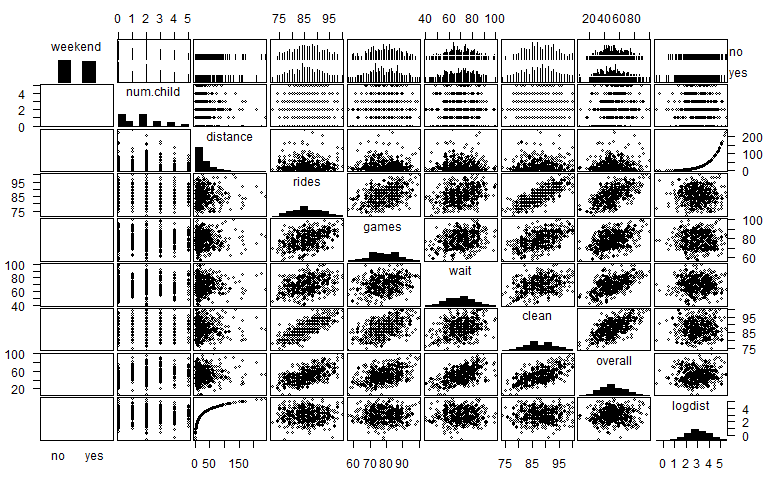
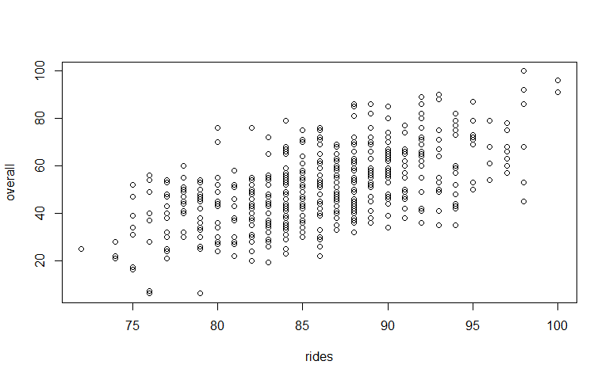
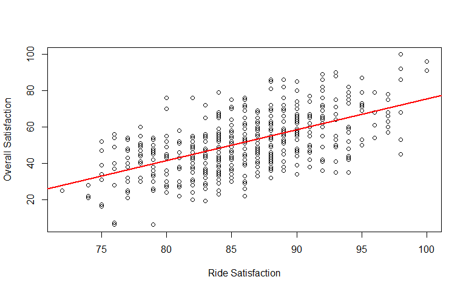
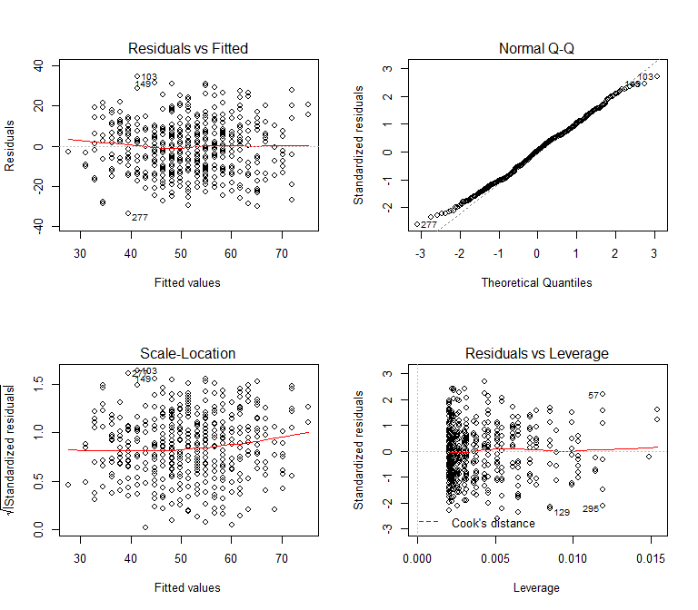
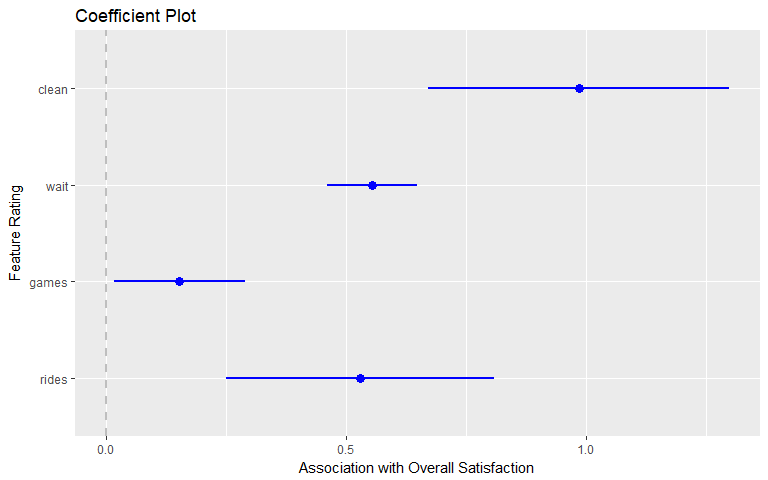
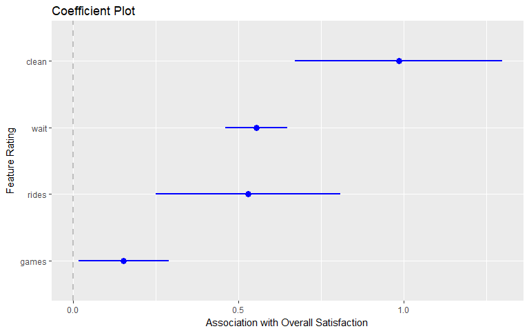
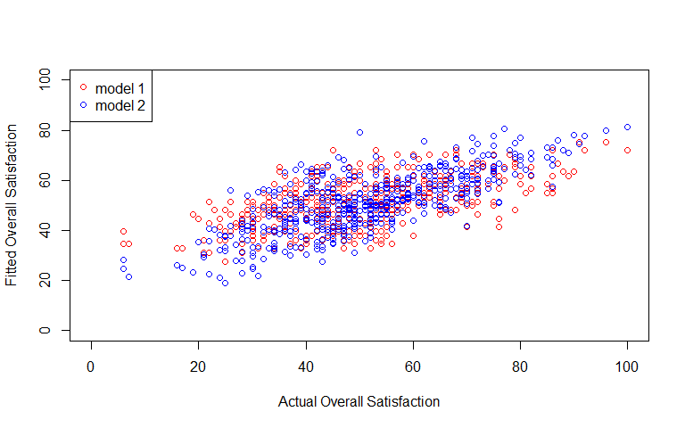

ch-7-linear-models
================
Sonya Hua
September 12, 2017

Linear Models: Identifying outcome drivers
------------------------------------------

\*\*Satisfaction drivers analysis\* : A common application in survey analysis whereby we model satisfaction with a product in relation to specific elements of the product.

**marketing mix modeling** Modeling how price and advertising are related to sales

Driver does not imply caucstion, but simply a linear assocation among variables. Linear models is a loose term for regression analysis or least-squares fitting.

### 7.1 Simulating Data: Amusement Park Satisfaction

Data comprises of 500 observations/responses:

-   `weekend`: whether the respondent visited on a weekend
-   `num.child`: number of hcildren brought
-   `distance` : distance traveled to the park
-   `overall` : overall satisfaction
-   `rides, games, wait, clean` : satisfaction with the rides, games, waiting times, and cleanliness respectively

``` r
set.seed(08226)
nresp <- 500
halo <- rnorm(n=nresp, mean=0, sd=5) # Satisfaction Halo effect with a random var per customer. Halo does not appear in the final data but is used to influence other ratings

# Assume data is on a 100-point scale. By adding halo to each response, we create naturally positive correlation between the responses
rides <- floor(halo + rnorm(n=nresp, mean=80, sd=3) +1)
games <- floor(halo + rnorm(n=nresp, mean=70, sd=7)+5)
wait <- floor(halo + rnorm(n=nresp, mean=65, sd=10) +9)
clean <- floor(halo + rnorm(n=nresp, mean=85, sd=2) +1)

# Verify correlation between vars that share the halo
cor(rides, games)
```

    ## [1] 0.4534134

``` r
# Sample a lognormal distribution for distance
distance <- rlnorm(n=nresp, meanlog=3, sdlog=1)

# Sample discrete distributions for weekend and num.child
num.child<- sample(x=0:5, size=nresp, replace=TRUE,
                   prob=c(0.3,0.15,0.25, 0.15, 0.1, 0.05))

weekend <- as.factor(sample(x=c("yes","no"), size=nresp, replace=TRUE,
                            prob=c(0.5,0.5)))

# Create overall satisfaction rating as function of ratings for the various aspects of vist
# Includes halo to capture latent satisfaction
# Adds the satis vars with weight for each one
# inlcudes weighted contributions for other influences
# random normal variation using rnorm()
# Uses floor() to produce an integer with a constant -51 to adjust the total to be >= 100 points

overall <- floor(halo + 0.5*rides +0.1*games +0.3*wait +0.2*clean +
                   0.3*distance +5*(num.child==0) + 0.3*wait*(num.child>0) +
                   rnorm(n=nresp, mean=0, sd=7) -51)

# Combine vars into a df and removed unneeded objects from workspace
sat.df <- data.frame(weekend, num.child, distance, rides, games, wait, clean, overall)

rm(nresp, weekend, distance, num.child, halo, rides, games, wait, clean, overall)
```

### 7.2 Fitting linear models with `lm()`

Inspect data first:

``` r
summary(sat.df)
```

    ##  weekend     num.child        distance            rides      
    ##  no :259   Min.   :0.000   Min.   :  0.5267   Min.   :67.00  
    ##  yes:241   1st Qu.:0.000   1st Qu.: 10.3181   1st Qu.:77.00  
    ##            Median :2.000   Median : 19.0191   Median :80.00  
    ##            Mean   :1.738   Mean   : 31.0475   Mean   :80.38  
    ##            3rd Qu.:3.000   3rd Qu.: 39.5821   3rd Qu.:84.00  
    ##            Max.   :5.000   Max.   :239.1921   Max.   :94.00  
    ##      games            wait            clean          overall      
    ##  Min.   :52.00   Min.   : 43.00   Min.   :72.00   Min.   :  9.00  
    ##  1st Qu.:68.00   1st Qu.: 65.75   1st Qu.:82.00   1st Qu.: 48.00  
    ##  Median :74.00   Median : 74.00   Median :85.00   Median : 60.00  
    ##  Mean   :74.14   Mean   : 73.42   Mean   :85.39   Mean   : 61.25  
    ##  3rd Qu.:80.00   3rd Qu.: 81.00   3rd Qu.:89.00   3rd Qu.: 73.00  
    ##  Max.   :96.00   Max.   :103.00   Max.   :98.00   Max.   :139.00

For some reason, I'm not able to replicate the data set in the book (notice there's points over 100) so I'm going to use the shortcut as our df

``` r
sat.df <- read.csv("http://goo.gl/HKnl74")
str(sat.df)
```

    ## 'data.frame':    500 obs. of  8 variables:
    ##  $ weekend  : Factor w/ 2 levels "no","yes": 2 2 1 2 1 1 2 1 1 2 ...
    ##  $ num.child: int  0 2 1 0 4 5 1 0 0 3 ...
    ##  $ distance : num  114.6 27 63.3 25.9 54.7 ...
    ##  $ rides    : int  87 87 85 88 84 81 77 82 90 88 ...
    ##  $ games    : int  73 78 80 72 87 79 73 70 88 86 ...
    ##  $ wait     : int  60 76 70 66 74 48 58 70 79 55 ...
    ##  $ clean    : int  89 87 88 89 87 79 85 83 95 88 ...
    ##  $ overall  : int  47 65 61 37 68 27 40 30 58 36 ...

``` r
summary(sat.df)
```

    ##  weekend     num.child        distance            rides       
    ##  no :259   Min.   :0.000   Min.   :  0.5267   Min.   : 72.00  
    ##  yes:241   1st Qu.:0.000   1st Qu.: 10.3181   1st Qu.: 82.00  
    ##            Median :2.000   Median : 19.0191   Median : 86.00  
    ##            Mean   :1.738   Mean   : 31.0475   Mean   : 85.85  
    ##            3rd Qu.:3.000   3rd Qu.: 39.5821   3rd Qu.: 90.00  
    ##            Max.   :5.000   Max.   :239.1921   Max.   :100.00  
    ##      games             wait           clean          overall      
    ##  Min.   : 57.00   Min.   : 40.0   Min.   : 74.0   Min.   :  6.00  
    ##  1st Qu.: 73.00   1st Qu.: 62.0   1st Qu.: 84.0   1st Qu.: 40.00  
    ##  Median : 78.00   Median : 70.0   Median : 88.0   Median : 50.00  
    ##  Mean   : 78.67   Mean   : 69.9   Mean   : 87.9   Mean   : 51.26  
    ##  3rd Qu.: 85.00   3rd Qu.: 77.0   3rd Qu.: 91.0   3rd Qu.: 62.00  
    ##  Max.   :100.00   Max.   :100.0   Max.   :100.0   Max.   :100.00

#### 7.2.1 Prelim Data Inspection

Before modeling, check that each variable has a reasonably normal distribution and that joint relationships among the vars are approrpriate for modeling.

``` r
library(gpairs)
gpairs(sat.df)
```

    ## Loading required package: grid

    ## Loading required package: lattice

 *Observe* Most vars are normal with the exception of distance which is left-skewed. We can do a log transformation on distance to see if it helps normalize the distribution

``` r
sat.df$logdist <- log(sat.df$distance)
```

``` r
gpairs(sat.df)
```

 *Observe* \* logdist is more normally distributed \* The pairwise scatterplots of our continuous vars are generally elliptical in shape- a good indication they are appropriate for linear modeling. Howeever, the vars in the lower right are positive correlated; there's multicollinearity. When vars are strongly related in this way, it's difficult to assess their individual effects with stat models. The effect can be so severe that the relationships become uninterpretable without taking some action to handle the high correlations

*Recs*:

-   Given the positive assocations, investigate the correlation structure further

``` r
library(corrplot)

# Select columns 2, 4:9 to exlucde the categorical vars and the raw var distance since we transformed it in logdist
corrplot.mixed(cor(sat.df[,c(2,4:9)]), upper="ellipse") # Add upper=ellipse to mixed command for easier corr spotting
```


*Observe*

-   The satisfaction items are moderately to strongly associated with one another.
-   None of the vars appear to be nearly identical, as would be indicated by correlations exceeding r &gt; 0.9
-   rides and clean are highly related (r=0.79) but not so strongly that remediation is strictly required
-   It appears to be acceptable to proceeed with modeling hte relationships among these vars

#### Linear Model with 1 Predictor

##### To what extent is satisfaction with the rides related to overall experience? Is the relationship strong or weak?

Plot these two vars

``` r
plot(overall~rides, data=sat.df)
```

 *Observe*

-   There's a tendency for people with higher satisfaction with rides to have higher overall satisfaction

`lm(formula,data)` where data is a df, for linear modeling

``` r
(m1 <-lm(overall~rides, data=sat.df))
```

    ## 
    ## Call:
    ## lm(formula = overall ~ rides, data = sat.df)
    ## 
    ## Coefficients:
    ## (Intercept)        rides  
    ##     -94.962        1.703

*Observe* This provides the intercept and slope of a fitted line which we can use to calculate predicted values based on a rating from rides, or used to plot a fitted line among the data. abline() recognizes lm objects as a line

``` r
# The expected overall rating for someone who gives a rating of 95 for ride satisfaction
-94.962 + 1.703 * 95
```

    ## [1] 66.823

``` r
# plot
plot(overall~ rides, data=sat.df,
     xlab="Ride Satisfaction", ylab="Overall Satisfaction")
abline(m1, col="red", lwd=2)  #lwd = line width
```



``` r
# contains everything lm() knows about the model
str(m1)
```

    ## List of 12
    ##  $ coefficients : Named num [1:2] -95 1.7
    ##   ..- attr(*, "names")= chr [1:2] "(Intercept)" "rides"
    ##  $ residuals    : Named num [1:500] -6.22 11.78 11.18 -17.93 19.89 ...
    ##   ..- attr(*, "names")= chr [1:500] "1" "2" "3" "4" ...
    ##  $ effects      : Named num [1:500] -1146.2 -207.9 11.5 -17.9 20.3 ...
    ##   ..- attr(*, "names")= chr [1:500] "(Intercept)" "rides" "" "" ...
    ##  $ rank         : int 2
    ##  $ fitted.values: Named num [1:500] 53.2 53.2 49.8 54.9 48.1 ...
    ##   ..- attr(*, "names")= chr [1:500] "1" "2" "3" "4" ...
    ##  $ assign       : int [1:2] 0 1
    ##  $ qr           :List of 5
    ##   ..$ qr   : num [1:500, 1:2] -22.3607 0.0447 0.0447 0.0447 0.0447 ...
    ##   .. ..- attr(*, "dimnames")=List of 2
    ##   .. .. ..$ : chr [1:500] "1" "2" "3" "4" ...
    ##   .. .. ..$ : chr [1:2] "(Intercept)" "rides"
    ##   .. ..- attr(*, "assign")= int [1:2] 0 1
    ##   ..$ qraux: num [1:2] 1.04 1.01
    ##   ..$ pivot: int [1:2] 1 2
    ##   ..$ tol  : num 1e-07
    ##   ..$ rank : int 2
    ##   ..- attr(*, "class")= chr "qr"
    ##  $ df.residual  : int 498
    ##  $ xlevels      : Named list()
    ##  $ call         : language lm(formula = overall ~ rides, data = sat.df)
    ##  $ terms        :Classes 'terms', 'formula'  language overall ~ rides
    ##   .. ..- attr(*, "variables")= language list(overall, rides)
    ##   .. ..- attr(*, "factors")= int [1:2, 1] 0 1
    ##   .. .. ..- attr(*, "dimnames")=List of 2
    ##   .. .. .. ..$ : chr [1:2] "overall" "rides"
    ##   .. .. .. ..$ : chr "rides"
    ##   .. ..- attr(*, "term.labels")= chr "rides"
    ##   .. ..- attr(*, "order")= int 1
    ##   .. ..- attr(*, "intercept")= int 1
    ##   .. ..- attr(*, "response")= int 1
    ##   .. ..- attr(*, ".Environment")=<environment: R_GlobalEnv> 
    ##   .. ..- attr(*, "predvars")= language list(overall, rides)
    ##   .. ..- attr(*, "dataClasses")= Named chr [1:2] "numeric" "numeric"
    ##   .. .. ..- attr(*, "names")= chr [1:2] "overall" "rides"
    ##  $ model        :'data.frame':   500 obs. of  2 variables:
    ##   ..$ overall: int [1:500] 47 65 61 37 68 27 40 30 58 36 ...
    ##   ..$ rides  : int [1:500] 87 87 85 88 84 81 77 82 90 88 ...
    ##   ..- attr(*, "terms")=Classes 'terms', 'formula'  language overall ~ rides
    ##   .. .. ..- attr(*, "variables")= language list(overall, rides)
    ##   .. .. ..- attr(*, "factors")= int [1:2, 1] 0 1
    ##   .. .. .. ..- attr(*, "dimnames")=List of 2
    ##   .. .. .. .. ..$ : chr [1:2] "overall" "rides"
    ##   .. .. .. .. ..$ : chr "rides"
    ##   .. .. ..- attr(*, "term.labels")= chr "rides"
    ##   .. .. ..- attr(*, "order")= int 1
    ##   .. .. ..- attr(*, "intercept")= int 1
    ##   .. .. ..- attr(*, "response")= int 1
    ##   .. .. ..- attr(*, ".Environment")=<environment: R_GlobalEnv> 
    ##   .. .. ..- attr(*, "predvars")= language list(overall, rides)
    ##   .. .. ..- attr(*, "dataClasses")= Named chr [1:2] "numeric" "numeric"
    ##   .. .. .. ..- attr(*, "names")= chr [1:2] "overall" "rides"
    ##  - attr(*, "class")= chr "lm"

``` r
# Hand calculated CI 
1.7033 + 1.96 * 0.1055
```

    ## [1] 1.91008

``` r
1.7033 - 1.96 * 0.1055
```

    ## [1] 1.49652

``` r
# equivalent: confint()
confint(m1) # default level is 95%
```

    ##                   2.5 %     97.5 %
    ## (Intercept) -112.800120 -77.124371
    ## rides          1.495915   1.910656

``` r
confint(m1, level=.99) # 99% CI
```

    ##                   0.5 %    99.5 %
    ## (Intercept) -118.438170 -71.48632
    ## rides          1.430371   1.97620

To get summarized features of the fitted model, use `summary()`

Interpretation of output:

-   The Residuals quartile section tells us how closely or not the data follows the best fit line. A *residual* is the difference between the model-predicted value vs. observed value.

-   Standard error indicates uncertainty in the coefficient estimate, assuming the data are a random sample of a larger population.

-   The t-value, p-value, and signiciance codes indicate a *Wald Test*, which asseses whether the coefficient is significantly different from 0. A traditional estimate of a 95% CI for the coefficient estimate is it will fall within +/- 1.96 x Standard Error. Always report our CI's along with the point estimate.

-   Residual standard error is an estimate of the avg error of the residuals. It's a measure of how close the data points are to the estimate line.

-   R-squared is a measure of how much *variation in y *is captured by the model

-   F-statistic provides a stat test with null hypothesis that a model without predictors perform as well as the model. It tests whether the model predicts the data better than simply taking the average of the y var and using htat as the prediction or all obs.

``` r
summary(m1)
```

    ## 
    ## Call:
    ## lm(formula = overall ~ rides, data = sat.df)
    ## 
    ## Residuals:
    ##     Min      1Q  Median      3Q     Max 
    ## -33.597 -10.048   0.425   8.694  34.699 
    ## 
    ## Coefficients:
    ##             Estimate Std. Error t value Pr(>|t|)    
    ## (Intercept) -94.9622     9.0790  -10.46   <2e-16 ***
    ## rides         1.7033     0.1055   16.14   <2e-16 ***
    ## ---
    ## Signif. codes:  0 '***' 0.001 '**' 0.01 '*' 0.05 '.' 0.1 ' ' 1
    ## 
    ## Residual standard error: 12.88 on 498 degrees of freedom
    ## Multiple R-squared:  0.3434, Adjusted R-squared:  0.3421 
    ## F-statistic: 260.4 on 1 and 498 DF,  p-value: < 2.2e-16

*Observe*:

-   The rides coefficient 1.70 means: each additional rides rating point results in an increase of 1.7 points in overall rating
-   Residuals are quite wide ranging from -34 to 35, suggesting our predictions can be quite a bit off for any given data point ( &gt; 30points on the rating scale). The quartiles of the residuals suggest they're fairly symmetric around 0. That's a good sign this model although imprecise, is unbiased.
-   On average, points deviate 12.8 points away from the fitted function.
-   According to R^2 = 0.34, about 34% of the variation in overall satisfaction is explained by the model
-   According to the F-test, we reject the null hypothesis that a model without predictors performs as well as our model. In other words, this model performs better than a straight up average of overall satisfaction

#### 7.2.5 Checking Model Fits and Diagnostics

There's 5 key assumptions in a linear model that we must check for before finalizing results:

-   Linear relationship - prediction errors are normally distributed and look like random noise with no pattern
-   Multivariate normality - does not deviate significantly from normal distribution
-   No or little multicollinearity
-   No auto-correlation.
-   Homoscedasticity - homogeneous band of errors across observed values

`plot()` the regression model for the diagnostic plots:

1.  Fitted Values vs. Residuals - There should be no obvious pattern and residuals should resemble random error

2.  Fitted Values vs. Square Root of the standardized residuals - Checks for homscedasticity. There should be no clear pattern. Observations with ihgh residuals are flagged as potential outliers which we should inspect later. A common pattern in residual plots is a cone or funnel where errors get progressively larger for larger or smaller fitted values, which suggests *heteroskedasticity*. When values in one part of the range have a much larger spread than those in another area, they will have biased influence on the estimation of hte line. Sometimes a transformation on the predictor or outcome var will resolve this

3.  Normal QQ Plot -Checks for normality. It compares the values that residuals would be expected to take if they are normally distributed vs. observed values.

4.  Leverage vs. standardized residuals - *Leverage* of each point is the measure of the point's influence on the estimated model coefficients. The leverage is based on *Cook's distance*, an estimate of how much predicted values (y) would change if the model were re-estimated without the point in the data. If there's obs with high Cook's distance, this chart would show dotted red lines for the distances. Any pot'l outliers will have their obs number called out.

Best practice is to inspect pot'l outliers for any problems within the data. We generally do not omit outliers except when they're obvious errors in the data.

``` r
par(mfrow=c(2,2))
plot(m1)
```

 *Observe*:

-   1st Plot: There's no obvious pattern between fitted values for overall satisfaction and the residuals. Residuals resemble random error.
-   2nd Plot (Scale-Location): There's no clear pattern and suggests homoskedasticity
-   3rd Plot (Normal QQ): The data fits normality
-   4th Plot: There are no extreme outliers but there are some pot'l outliers 57, 129, and 295

Let's inspect the pot'l outliers for any data errors

``` r
sat.df[c(57, 129, 295),]
```

    ##     weekend num.child distance rides games wait clean overall  logdist
    ## 57      yes         2 63.29248    98    87   89   100     100 4.147767
    ## 129     yes         0 11.89550    76    77   51    77       6 2.476161
    ## 295      no         0 11.74474    98    83   63    92      45 2.463406

*Observe* \* Row 129 might be inaccurate, but we don't know

We'll keep all of the observations presently. Overall, the model relating overall satisfaction to satisfaction with rides seems reasonable.

### 7.3 Linear Models with Multiple Predictors

Interpretation of the coefficients changes: each coefficient represents the strength of the relationship between x and y, based on the values of the other predictors (have not changed)

##### Which features of the park most closely related to overall satisfactions?

``` r
(m2 <- lm(overall ~ rides + games + wait + clean, data=sat.df))
```

    ## 
    ## Call:
    ## lm(formula = overall ~ rides + games + wait + clean, data = sat.df)
    ## 
    ## Coefficients:
    ## (Intercept)        rides        games         wait        clean  
    ##   -131.4092       0.5291       0.1533       0.5533       0.9842

``` r
summary(m2)
```

    ## 
    ## Call:
    ## lm(formula = overall ~ rides + games + wait + clean, data = sat.df)
    ## 
    ## Residuals:
    ##     Min      1Q  Median      3Q     Max 
    ## -29.944  -6.841   1.072   7.167  28.618 
    ## 
    ## Coefficients:
    ##               Estimate Std. Error t value Pr(>|t|)    
    ## (Intercept) -131.40919    8.33377 -15.768  < 2e-16 ***
    ## rides          0.52908    0.14207   3.724 0.000219 ***
    ## games          0.15334    0.06908   2.220 0.026903 *  
    ## wait           0.55333    0.04781  11.573  < 2e-16 ***
    ## clean          0.98421    0.15987   6.156 1.54e-09 ***
    ## ---
    ## Signif. codes:  0 '***' 0.001 '**' 0.01 '*' 0.05 '.' 0.1 ' ' 1
    ## 
    ## Residual standard error: 10.59 on 495 degrees of freedom
    ## Multiple R-squared:  0.5586, Adjusted R-squared:  0.5551 
    ## F-statistic: 156.6 on 4 and 495 DF,  p-value: < 2.2e-16

*Observe*:

-   The R-Squared increased from 0.34 to 0.56. Our prediction has improved by including all satisfaction features in our model. About half of the variation in overall ratings is explained by the ratings for specific features.
-   The residual SE is now 10.59, decreased from 12.88. The predications are more accurate.
-   Residuals appear to be symmetric according to the Residual Quartiles.
-   All 4 features are identified as being statistically significant (p &lt; 0.05).
-   The coefficients for rides changed from m1 to m2 (1.70 to 0.529). This is because rides correlated with all other vars. Customers who are more satisfied with rides tend to be more satisfaied with the wait and games. Coefficients genreally change unless the vars are entirely uncorrelated We can plot the coefficients along with the CI's by calling `coefplot()` of the `coefplot` package, adding `intercept=FALSE` to plot just the var coefficients.

``` r
#install.packages("coefplot")
#install.packages("dplyr")
#install.packages("plyr")
library(coefplot)
```

    ## Loading required package: ggplot2

``` r
coefplot(m2, intercept=F, 
         outerCI = 1.96, # for 95% CI
         lwdOuter=1,
         ylab="Feature Rating",
         xlab="Association with Overall Satisfaction")
```

    ## Warning: Ignoring unknown aesthetics: xmin, xmax

 *Observe*: \* Cleanliness is estamed to be the most important feature associated with overall satisfaction, followed by wait and rides. Satisfaction with games is estimated to be relatively less important.

Sorting the coefficient plot may be easier to see the priority of coefficients by calling `sort = "magnitude"`. A coef plot is often a key output of a satisfaction drivers analysis.

``` r
coefplot(m2, intercept=F, 
         outerCI = 1.96, # for 95% CI
         lwdOuter=1,
         ylab="Feature Rating",
         xlab="Association with Overall Satisfaction",
         sort = "magnitude")
```

    ## Warning: Ignoring unknown aesthetics: xmin, xmax



#### 7.4.1 Comparing Linear Models

##### Which model is better in fit? m1 or m2?

We can compare adj. r-squared values of each model to see which model has a larger adj. r-squared

``` r
# Use adjusted-R-squared values which control for number of predictors in m2
summary(m1)$adj.r.squared
```

    ## [1] 0.3420614

``` r
summary(m2)$adj.r.squared
```

    ## [1] 0.5550543

*Observe* The adj. r-squared suggested m2 explains more of the variation in overall satisfaction

It's best practice to also compare the predictions of the models visually by plotting the fitted vs. actual values for each model. If the model fits the data perfectly, the points will fall on a diagonal line. By comparing models, we can see which model fits the data better by forming a tighter diagonal.

``` r
plot(sat.df$overall, fitted(m1), col='red',
     xlim=c(0,100), ylim=c(0,100),
     xlab="Actual Overall Satisfaction",
     ylab="Fitted Overall Satisfaction")

# Now plot m2 points
points(sat.df$overall, fitted(m2), col="blue")

# Add a legend
legend("topleft", legend=c("model 1", "model 2"),
       col=c("red","blue"), pch=1)
```

 *Observe* Model 2 (blue points) is more tightly clusterd along a diag line, showing m2 explains more variation in the data than m1.

For a more formal test, which is possible since the models are nested, we can use ANOVA to determine whether m2 explains more variation:

``` r
anova(m1, m2)
```

    ## Analysis of Variance Table
    ## 
    ## Model 1: overall ~ rides
    ## Model 2: overall ~ rides + games + wait + clean
    ##   Res.Df   RSS Df Sum of Sq      F    Pr(>F)    
    ## 1    498 82612                                  
    ## 2    495 55532  3     27080 80.463 < 2.2e-16 ***
    ## ---
    ## Signif. codes:  0 '***' 0.001 '**' 0.01 '*' 0.05 '.' 0.1 ' ' 1

*Observe*: p-value is significant, so we can reject the null hypothesis of no difference in the 2nd model
