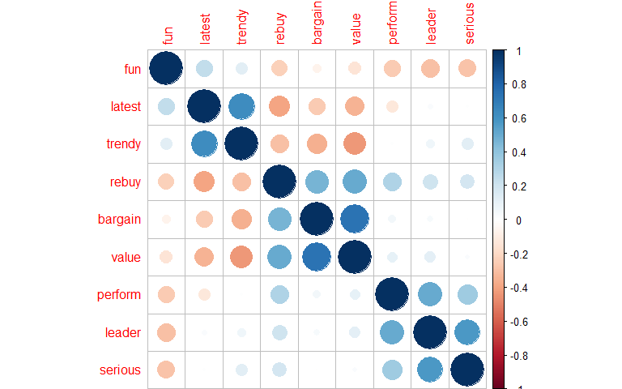
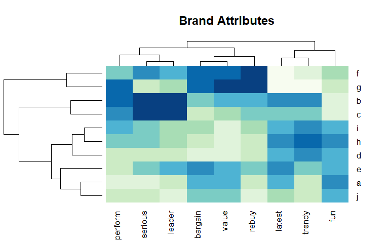
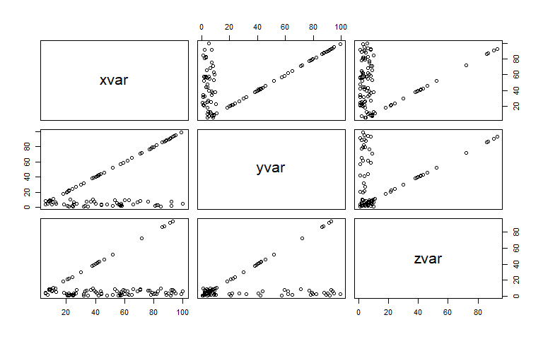
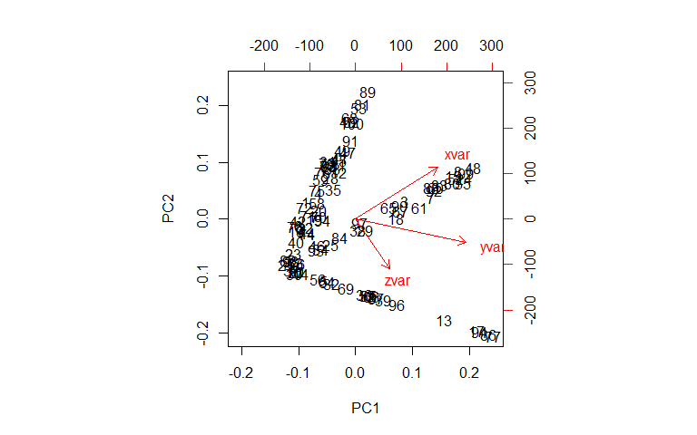
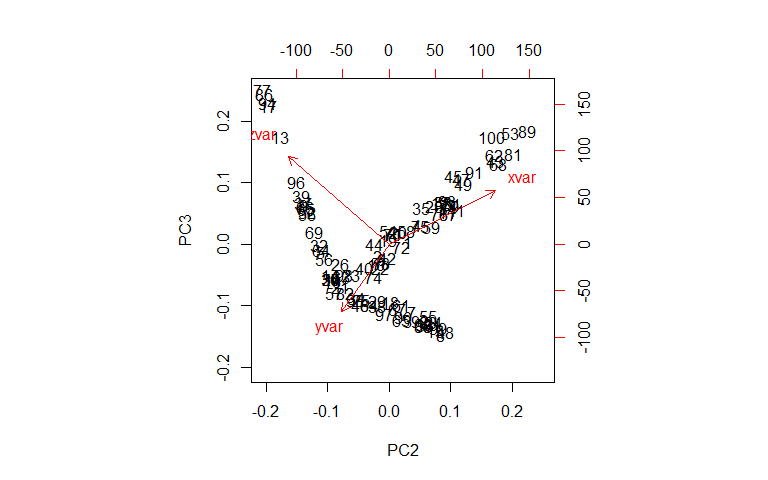
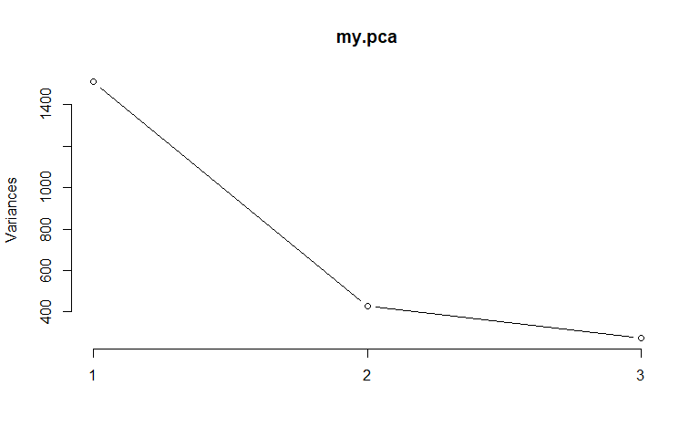
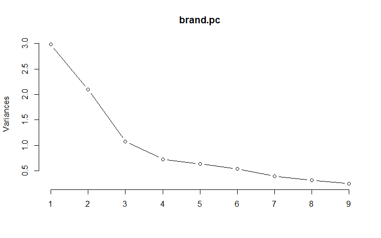
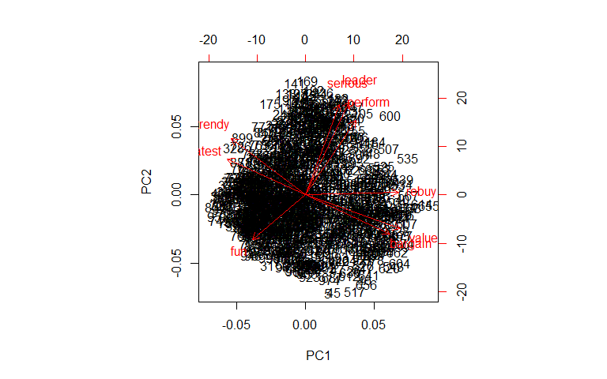
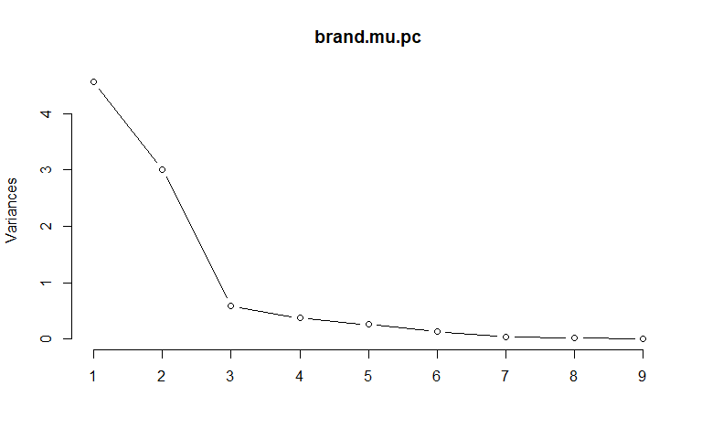

ch-8-reducing-data-complexity
================
Sonya Hua
September 14, 2017

Reducing Data Complexity
========================

Marketing data sets often have many variables or *dimensions* and it's beneficial to reduce these to smaller sets of vars to consider. I.e. in a consumery survey, there may be a smaller number of underlying concepts out of the survey questions. If we can reduce the data to its underlying concepts, we can more clearly idenfity relationships among concepts. There's 3 main methods:

1.  Principal Component Analysis (PCA) - finds uncorrelated linear dimensions (principle components) that capture maximum variance in the data. Often associated with *perceptual maps* that visualizes the associations among the dimensions

2.  Exploratory Factor Analysis (EFA) - captures variance with a small number of interpretable dimensions (principle components) in terms of the original variables

3.  Multidimensional Scaling (MDS) - maps similarities among observations in terms of a low-dimension space such as a 2D plot. it works with metric and non-metric data such as categorical or ordinal

### 8.1 About the Data: Brand Perception Survey

Data reflects consumer ratings of 10 brands (A through J) with regard to 9 *perceptual adjectives* for 100 respondents (1000 rows). I.e:

1.  On a scale from 1 t0 10, how trendy is Blue Bottle Coffee?

2.  On a scale from 1 to 10, how much of a category leader is Dunkin Donuts?

For this data set:

-   perform: Brand has strong performance
-   leader: Brand is a leader in the field
-   latest: Brand has the latest products
-   fun: Brand is fun
-   serious: Brand is serious
-   bargain: Brand products are a bargain
-   value: Brand products are a good value
-   trendy: Brand is trendy
-   rebuy: i would buy the brand again

Such ratings are collected for all combinations of adjectives and brands of interest. Let's load the data and check it:

``` r
brand.ratings <- read.csv("http://goo.gl/IQl8nc")
head(brand.ratings)
```

    ##   perform leader latest fun serious bargain value trendy rebuy brand
    ## 1       2      4      8   8       2       9     7      4     6     a
    ## 2       1      1      4   7       1       1     1      2     2     a
    ## 3       2      3      5   9       2       9     5      1     6     a
    ## 4       1      6     10   8       3       4     5      2     1     a
    ## 5       1      1      5   8       1       9     9      1     1     a
    ## 6       2      8      9   5       3       8     7      1     2     a

``` r
tail(brand.ratings)
```

    ##      perform leader latest fun serious bargain value trendy rebuy brand
    ## 995        4      2      8   7       1       3     3      5     2     j
    ## 996        2      2      3   6       4       8     5      1     2     j
    ## 997        3      2      6   7       1       3     3      2     1     j
    ## 998        1      1     10  10       1       6     5      5     2     j
    ## 999        1      1      7   5       1       1     2      5     1     j
    ## 1000       7      4      7   8       4       1     2      5     1     j

*Obs*: Each of the 100 respondents has obs for each of the 10 brands so (10 brands x 100 respondents = 1000 rows). The scale is from 1 to 10

``` r
summary(brand.ratings)
```

    ##     perform           leader           latest            fun        
    ##  Min.   : 1.000   Min.   : 1.000   Min.   : 1.000   Min.   : 1.000  
    ##  1st Qu.: 1.000   1st Qu.: 2.000   1st Qu.: 4.000   1st Qu.: 4.000  
    ##  Median : 4.000   Median : 4.000   Median : 7.000   Median : 6.000  
    ##  Mean   : 4.488   Mean   : 4.417   Mean   : 6.195   Mean   : 6.068  
    ##  3rd Qu.: 7.000   3rd Qu.: 6.000   3rd Qu.: 9.000   3rd Qu.: 8.000  
    ##  Max.   :10.000   Max.   :10.000   Max.   :10.000   Max.   :10.000  
    ##                                                                     
    ##     serious          bargain           value            trendy     
    ##  Min.   : 1.000   Min.   : 1.000   Min.   : 1.000   Min.   : 1.00  
    ##  1st Qu.: 2.000   1st Qu.: 2.000   1st Qu.: 2.000   1st Qu.: 3.00  
    ##  Median : 4.000   Median : 4.000   Median : 4.000   Median : 5.00  
    ##  Mean   : 4.323   Mean   : 4.259   Mean   : 4.337   Mean   : 5.22  
    ##  3rd Qu.: 6.000   3rd Qu.: 6.000   3rd Qu.: 6.000   3rd Qu.: 7.00  
    ##  Max.   :10.000   Max.   :10.000   Max.   :10.000   Max.   :10.00  
    ##                                                                    
    ##      rebuy            brand    
    ##  Min.   : 1.000   a      :100  
    ##  1st Qu.: 1.000   b      :100  
    ##  Median : 3.000   c      :100  
    ##  Mean   : 3.727   d      :100  
    ##  3rd Qu.: 5.000   e      :100  
    ##  Max.   :10.000   f      :100  
    ##                   (Other):400

``` r
str(brand.ratings)
```

    ## 'data.frame':    1000 obs. of  10 variables:
    ##  $ perform: int  2 1 2 1 1 2 1 2 2 3 ...
    ##  $ leader : int  4 1 3 6 1 8 1 1 1 1 ...
    ##  $ latest : int  8 4 5 10 5 9 5 7 8 9 ...
    ##  $ fun    : int  8 7 9 8 8 5 7 5 10 8 ...
    ##  $ serious: int  2 1 2 3 1 3 1 2 1 1 ...
    ##  $ bargain: int  9 1 9 4 9 8 5 8 7 3 ...
    ##  $ value  : int  7 1 5 5 9 7 1 7 7 3 ...
    ##  $ trendy : int  4 2 1 2 1 1 1 7 5 4 ...
    ##  $ rebuy  : int  6 2 6 1 1 2 1 1 1 1 ...
    ##  $ brand  : Factor w/ 10 levels "a","b","c","d",..: 1 1 1 1 1 1 1 1 1 1 ...

*Obs*: All the perceptual adjectives are defined as numeric while the brand is a factor var. There are 9 perceptual adjectives.

#### 8.1.1 Rescaling the Data

It's best practice to rescale new data then save the scaled data into a new data frame. This makes data more comparable across individuals and samples. A common prodedure is to center each var by subtracting each obs by its mean, then rescale those *centered values* by standard deviation (aka *standardizing, normalizing, z-scoring*)

``` r
brand.sc <- brand.ratings
brand.sc[,1:9] <- scale(brand.sc[,1:9])  # we only scale numeric columns 1-9 and leave the brand column alone 
summary(brand.sc)
```

    ##     perform            leader            latest             fun          
    ##  Min.   :-1.0888   Min.   :-1.3100   Min.   :-1.6878   Min.   :-1.84677  
    ##  1st Qu.:-1.0888   1st Qu.:-0.9266   1st Qu.:-0.7131   1st Qu.:-0.75358  
    ##  Median :-0.1523   Median :-0.1599   Median : 0.2615   Median :-0.02478  
    ##  Mean   : 0.0000   Mean   : 0.0000   Mean   : 0.0000   Mean   : 0.00000  
    ##  3rd Qu.: 0.7842   3rd Qu.: 0.6069   3rd Qu.: 0.9113   3rd Qu.: 0.70402  
    ##  Max.   : 1.7206   Max.   : 2.1404   Max.   : 1.2362   Max.   : 1.43281  
    ##                                                                          
    ##     serious           bargain             value             trendy        
    ##  Min.   :-1.1961   Min.   :-1.22196   Min.   :-1.3912   Min.   :-1.53897  
    ##  1st Qu.:-0.8362   1st Qu.:-0.84701   1st Qu.:-0.9743   1st Qu.:-0.80960  
    ##  Median :-0.1163   Median :-0.09711   Median :-0.1405   Median :-0.08023  
    ##  Mean   : 0.0000   Mean   : 0.00000   Mean   : 0.0000   Mean   : 0.00000  
    ##  3rd Qu.: 0.6036   3rd Qu.: 0.65279   3rd Qu.: 0.6933   3rd Qu.: 0.64914  
    ##  Max.   : 2.0434   Max.   : 2.15258   Max.   : 2.3610   Max.   : 1.74319  
    ##                                                                           
    ##      rebuy             brand    
    ##  Min.   :-1.0717   a      :100  
    ##  1st Qu.:-1.0717   b      :100  
    ##  Median :-0.2857   c      :100  
    ##  Mean   : 0.0000   d      :100  
    ##  3rd Qu.: 0.5003   e      :100  
    ##  Max.   : 2.4652   f      :100  
    ##                    (Other):400

*Obs*:

-   All mean values are 0 since the data is resaled.
-   Observations on the adjectives have a spread of roughly 2.4 standard deviations. The distribution is *platykurtic* or flatter than a standard normal distribution which has a range of more than 4 standard deviations. This is a common characteristic of survey data, due to *floor and ceiling effects*

Let's produce a correlation plot for initial inspection of bivariate relationships among the vars. To reorder rows and columns according to var's similarity in a *hierarchical cluster solution*, use `order="hclust"` option:

``` r
cor(brand.sc[,1:9])  # correlation matrix
```

    ##              perform      leader       latest        fun      serious
    ## perform  1.000000000  0.50020206 -0.122445813 -0.2563323  0.359172206
    ## leader   0.500202058  1.00000000  0.026890447 -0.2903576  0.571215126
    ## latest  -0.122445813  0.02689045  1.000000000  0.2451545  0.009951527
    ## fun     -0.256332316 -0.29035764  0.245154457  1.0000000 -0.281097443
    ## serious  0.359172206  0.57121513  0.009951527 -0.2810974  1.000000000
    ## bargain  0.057129372  0.03309405 -0.254419016 -0.0665528 -0.002655590
    ## value    0.101946104  0.11831017 -0.342713717 -0.1452185  0.023756556
    ## trendy   0.008733494  0.06651244  0.627627667  0.1279736  0.121009377
    ## rebuy    0.306658801  0.20870036 -0.397180225 -0.2371607  0.180702720
    ##             bargain       value       trendy      rebuy
    ## perform  0.05712937  0.10194610  0.008733494  0.3066588
    ## leader   0.03309405  0.11831017  0.066512436  0.2087004
    ## latest  -0.25441902 -0.34271372  0.627627667 -0.3971802
    ## fun     -0.06655280 -0.14521849  0.127973639 -0.2371607
    ## serious -0.00265559  0.02375656  0.121009377  0.1807027
    ## bargain  1.00000000  0.73962672 -0.350533746  0.4673811
    ## value    0.73962672  1.00000000 -0.434534536  0.5059617
    ## trendy  -0.35053375 -0.43453454  1.000000000 -0.2982462
    ## rebuy    0.46738109  0.50596166 -0.298246195  1.0000000

``` r
library(corrplot)
corrplot(cor(brand.sc[,1:9]),order="hclust") # corrplot operates on corr matrix 
```



``` r
# hclust, results are sorted by a hierarchical cluster solution 
```

*Obs*:

-   The ratings seem to group into 3 clusters of similar vars, a hypothesis we'll examine later
-   The 3 genreal clusters may comprise of *fun/latest/trendy*, *rebuy, bargain, value*, and *perform, leader, serious*

##### What's the average position of each brand per adjective?

We use `aggregate()` to find the average of each var per brand.

``` r
(brand.mean<- aggregate(.~brand,  data=brand.sc, FUN=mean))
```

    ##    brand     perform     leader     latest        fun     serious
    ## 1      a -0.88591874 -0.5279035  0.4109732  0.6566458 -0.91894067
    ## 2      b  0.93087022  1.0707584  0.7261069 -0.9722147  1.18314061
    ## 3      c  0.64992347  1.1627677 -0.1023372 -0.8446753  1.22273461
    ## 4      d -0.67989112 -0.5930767  0.3524948  0.1865719 -0.69217505
    ## 5      e -0.56439079  0.1928362  0.4564564  0.2958914  0.04211361
    ## 6      f -0.05868665  0.2695106 -1.2621589 -0.2179102  0.58923066
    ## 7      g  0.91838369 -0.1675336 -1.2849005 -0.5167168 -0.53379906
    ## 8      h -0.01498383 -0.2978802  0.5019396  0.7149495 -0.14145855
    ## 9      i  0.33463879 -0.3208825  0.3557436  0.4124989 -0.14865746
    ## 10     j -0.62994504 -0.7885965 -0.1543180  0.2849595 -0.60218870
    ##        bargain       value      trendy       rebuy
    ## 1   0.21409609  0.18469264 -0.52514473 -0.59616642
    ## 2   0.04161938  0.15133957  0.74030819  0.23697320
    ## 3  -0.60704302 -0.44067747  0.02552787 -0.13243776
    ## 4  -0.88075605 -0.93263529  0.73666135 -0.49398892
    ## 5   0.55155051  0.41816415  0.13857986  0.03654811
    ## 6   0.87400696  1.02268859 -0.81324496  1.35699580
    ## 7   0.89650392  1.25616009 -1.27639344  1.36092571
    ## 8  -0.73827529 -0.78254646  0.86430070 -0.60402622
    ## 9  -0.25459062 -0.80339213  0.59078782 -0.20317603
    ## 10 -0.09711188 -0.07379367 -0.48138267 -0.96164748

Let's name the rows pf `brand.mean` with the brand labels that `aggregate()` put into the `brand` column then remove the brand column

``` r
rownames(brand.mean) <- brand.mean[,1]
brand.mean
```

    ##   brand     perform     leader     latest        fun     serious
    ## a     a -0.88591874 -0.5279035  0.4109732  0.6566458 -0.91894067
    ## b     b  0.93087022  1.0707584  0.7261069 -0.9722147  1.18314061
    ## c     c  0.64992347  1.1627677 -0.1023372 -0.8446753  1.22273461
    ## d     d -0.67989112 -0.5930767  0.3524948  0.1865719 -0.69217505
    ## e     e -0.56439079  0.1928362  0.4564564  0.2958914  0.04211361
    ## f     f -0.05868665  0.2695106 -1.2621589 -0.2179102  0.58923066
    ## g     g  0.91838369 -0.1675336 -1.2849005 -0.5167168 -0.53379906
    ## h     h -0.01498383 -0.2978802  0.5019396  0.7149495 -0.14145855
    ## i     i  0.33463879 -0.3208825  0.3557436  0.4124989 -0.14865746
    ## j     j -0.62994504 -0.7885965 -0.1543180  0.2849595 -0.60218870
    ##       bargain       value      trendy       rebuy
    ## a  0.21409609  0.18469264 -0.52514473 -0.59616642
    ## b  0.04161938  0.15133957  0.74030819  0.23697320
    ## c -0.60704302 -0.44067747  0.02552787 -0.13243776
    ## d -0.88075605 -0.93263529  0.73666135 -0.49398892
    ## e  0.55155051  0.41816415  0.13857986  0.03654811
    ## f  0.87400696  1.02268859 -0.81324496  1.35699580
    ## g  0.89650392  1.25616009 -1.27639344  1.36092571
    ## h -0.73827529 -0.78254646  0.86430070 -0.60402622
    ## i -0.25459062 -0.80339213  0.59078782 -0.20317603
    ## j -0.09711188 -0.07379367 -0.48138267 -0.96164748

``` r
brand.mean <- brand.mean[,-1]
```

``` r
brand.mean
```

    ##       perform     leader     latest        fun     serious     bargain
    ## a -0.88591874 -0.5279035  0.4109732  0.6566458 -0.91894067  0.21409609
    ## b  0.93087022  1.0707584  0.7261069 -0.9722147  1.18314061  0.04161938
    ## c  0.64992347  1.1627677 -0.1023372 -0.8446753  1.22273461 -0.60704302
    ## d -0.67989112 -0.5930767  0.3524948  0.1865719 -0.69217505 -0.88075605
    ## e -0.56439079  0.1928362  0.4564564  0.2958914  0.04211361  0.55155051
    ## f -0.05868665  0.2695106 -1.2621589 -0.2179102  0.58923066  0.87400696
    ## g  0.91838369 -0.1675336 -1.2849005 -0.5167168 -0.53379906  0.89650392
    ## h -0.01498383 -0.2978802  0.5019396  0.7149495 -0.14145855 -0.73827529
    ## i  0.33463879 -0.3208825  0.3557436  0.4124989 -0.14865746 -0.25459062
    ## j -0.62994504 -0.7885965 -0.1543180  0.2849595 -0.60218870 -0.09711188
    ##         value      trendy       rebuy
    ## a  0.18469264 -0.52514473 -0.59616642
    ## b  0.15133957  0.74030819  0.23697320
    ## c -0.44067747  0.02552787 -0.13243776
    ## d -0.93263529  0.73666135 -0.49398892
    ## e  0.41816415  0.13857986  0.03654811
    ## f  1.02268859 -0.81324496  1.35699580
    ## g  1.25616009 -1.27639344  1.36092571
    ## h -0.78254646  0.86430070 -0.60402622
    ## i -0.80339213  0.59078782 -0.20317603
    ## j -0.07379367 -0.48138267 -0.96164748

*obs* The final matrix is now nicely formatted. However, it's difficult to tell how each brand is doing due to numbers overload. Let's create a heatmap out of these numbers

A heatmap is a useful way to visualize such results.

`heatmap.2()` from gplots package creates enhanced heatmaps with a dendrogram added to the left side or top. We'll use colors from the `RColorBrewer` package in the `col=` argument.

1)First we need to coerce `brand.mean` into a matrix using `as.matrix()` 2) then chooose a color palette and 3) turn off a few options that'd clutter the heatmap such as `trace,key,dendrogram`. 4) We'll improve title alignment by addning blank lines before the title text

``` r
library(gplots)
```

    ## 
    ## Attaching package: 'gplots'

    ## The following object is masked from 'package:stats':
    ## 
    ##     lowess

``` r
library(RColorBrewer)
heatmap.2(as.matrix(brand.mean), # brand.mean in matrix form
          col=brewer.pal(9, "GnBu"), # selecting 9 colors from GnBu palette using brewer.pal
          trace="none", # options include row, column, or both for a trace line
          key=F,
          dend="both",
           main="Brand Attributes")
```



### 8.2 PCA and Perceptual Maps

PCA recomputes a set of vars in terms of linear functions known as *principal components* or linear combinations of vars in the data set, that captures linear associations in the data.

PC1 captures as much of the variance as possible from all vars as a linear function. PC2 captures as much variance as possible that remains after PC1. Vice versa... Total number of PC's = \# of vars

#### 8.2.1 PCA Example

Let's create highly correlated data by copying a rnadom vector `xvar` to a new vector `yvar` while replacing half of its points. `zvar` is a copy of `yvar` while replcaing half of its points.

`yvar` will be correlated with `xvar` because 50 of the obs are identical while 50 are newly sampled random vals. `zcar` will be correlated with `yvar` more than `xvar`. We can check this correlation by plotting bivariate plots along with the correlation matrix using `jitter()` since there may be overlapping values due to our sampling.

``` r
# Create data
xvar <- sample(1:100, size=100, replace=T) # for sampling with replacement
yvar <- xvar
yvar[sample(1:length(yvar), 50)] <- sample(1:10, 50, replace=T) # replace 50 values in yvar with a sample from 1 to 10 with replacement
zvar <- yvar
zvar[sample(1:length(zvar),50)] <- sample(1:10,50,replace=T)

# combine the vectors to form a table
(my.vars <- cbind(xvar, yvar, zvar))
```

    ##        xvar yvar zvar
    ##   [1,]   35    1    1
    ##   [2,]   25    4    4
    ##   [3,]   65   65    2
    ##   [4,]   44    4    4
    ##   [5,]   21   21   21
    ##   [6,]   24    2    2
    ##   [7,]   77   77    7
    ##   [8,]   92   92    1
    ##   [9,]   42   42   42
    ##  [10,]   21    2    2
    ##  [11,]   60    9    3
    ##  [12,]   60    9    7
    ##  [13,]   72   72   72
    ##  [14,]   11   11   11
    ##  [15,]   89   89    2
    ##  [16,]    8    8    8
    ##  [17,]   86   86   86
    ##  [18,]   59   59    8
    ##  [19,]   34    7    7
    ##  [20,]   39    7    7
    ##  [21,]    6    4    4
    ##  [22,]   25    7    2
    ##  [23,]   13    5    5
    ##  [24,]   94   94    6
    ##  [25,]   27   27    4
    ##  [26,]   13    6   10
    ##  [27,]    9    9    9
    ##  [28,]   55    6    6
    ##  [29,]   44   44    6
    ##  [30,]    8    8    9
    ##  [31,]   58    2    2
    ##  [32,]   24   24   24
    ##  [33,]   82   82    3
    ##  [34,]   22   22    4
    ##  [35,]   53    9    9
    ##  [36,]   38   38   38
    ##  [37,]   43   43   43
    ##  [38,]   41   41    4
    ##  [39,]   46   46   46
    ##  [40,]   18    4    4
    ##  [41,]   63    9    2
    ##  [42,]   25    1    1
    ##  [43,]   81    2    4
    ##  [44,]   27    5    8
    ##  [45,]   66    4    9
    ##  [46,]   21   21    1
    ##  [47,]   71    8    8
    ##  [48,]   99   99    3
    ##  [49,]   69    6    6
    ##  [50,]    9    9    9
    ##  [51,]   90   90    4
    ##  [52,]   39   39   39
    ##  [53,]   92    2    8
    ##  [54,]   38   10   10
    ##  [55,]   93   93    8
    ##  [56,]   18   18   18
    ##  [57,]    6    8    5
    ##  [58,]   40    5    5
    ##  [59,]   48    4    1
    ##  [60,]   80   80    3
    ##  [61,]   71   71    9
    ##  [62,]   83    3    6
    ##  [63,]   11    7    7
    ##  [64,]   22   22   22
    ##  [65,]   57   57    1
    ##  [66,]   41   41   41
    ##  [67,]   62   62    6
    ##  [68,]   82    3    3
    ##  [69,]   30   30   30
    ##  [70,]   37    8    8
    ##  [71,]   33    2    6
    ##  [72,]   32    1    1
    ##  [73,]   57    3    3
    ##  [74,]   23   10    2
    ##  [75,]   44    3    3
    ##  [76,]   52    2    2
    ##  [77,]   93   93   93
    ##  [78,]   22    1    1
    ##  [79,]   57    2    2
    ##  [80,]   88   88    5
    ##  [81,]   92    7    4
    ##  [82,]    7    5    2
    ##  [83,]   58    5    5
    ##  [84,]   32   32    3
    ##  [85,]   40   40   40
    ##  [86,]   91   91   91
    ##  [87,]   56    4    1
    ##  [88,]   78   78    2
    ##  [89,]  100    5    6
    ##  [90,]   62   62    3
    ##  [91,]   76    7    7
    ##  [92,]   79   79    4
    ##  [93,]   58    3    4
    ##  [94,]   87   87   87
    ##  [95,]   20   20    3
    ##  [96,]   52   52   52
    ##  [97,]   42   42    1
    ##  [98,]   10    4    6
    ##  [99,]   95   95    4
    ## [100,]   85    1   10

``` r
pairs(jitter(my.vars))
```



``` r
cor(my.vars)
```

    ##           xvar      yvar      zvar
    ## xvar 1.0000000 0.5907892 0.1840062
    ## yvar 0.5907892 1.0000000 0.4040855
    ## zvar 0.1840062 0.4040855 1.0000000

*Obs* The correlation matrix shows high correlation between yvar~zvar, xvar~yvar, and weaker correlation between xvar~zvar. Using intuition, we would expect a PC that picks up correlation of all 3 vars. After that, we expect a PC that shows xvar and zvar are more differentiated from each other than yvar. We expect a 3rd PC that picks up yvar's unique position in the data set as the only variable to correlate highly with both vars.

Let's perform PCA using `prcomp()`:

``` r
(my.pca <- prcomp(my.vars))
```

    ## Standard deviations (1, .., p=3):
    ## [1] 38.85181 20.68031 16.50906
    ## 
    ## Rotation (n x k) = (3 x 3):
    ##            PC1        PC2        PC3
    ## xvar 0.5794997  0.6884901  0.4360751
    ## yvar 0.7783859 -0.3090613 -0.5464398
    ## zvar 0.2414445 -0.6560965  0.7150119

*Obs*: Rotation Matrix:

-   Interpreting PCA rotation loadings (the coefficients per PC function) is difficult due to the multivariate nature -factor analysis a better method for interpretation.
-   PC1: All 3 vars has shared variance (the negative direction is not important; the key is that they are all in the same direction - negative). The signs of the columns of the rotation matrix are arbitrary, and so may differ between different programs for PCA, and even between different builds of R. Pay more attention to the direction and degree of loadings instead.
-   PC2: `xvar` and `zvar` are different from one another with loadings in opposite directions.
-   PC3: residual variance of the other 2 vars is different from yvar - yvar is unique from the other 2 vars

``` r
summary(my.pca)
```

    ## Importance of components%s:
    ##                            PC1     PC2     PC3
    ## Standard deviation     38.8518 20.6803 16.5091
    ## Proportion of Variance  0.6831  0.1935  0.1233
    ## Cumulative Proportion   0.6831  0.8767  1.0000

*Obs*:

-   PC1 explains 65% of variance in the data, PC2 24%, and PC3 10%

In addition to the loading & rotation matrix, PCA computes scores for each PC that express the underlying data in terms of its loadings per component. This can be accessed by `$x` matrix where the columns may be used to obtain values of the *components per observation*. *`$x` is a numeric or complex matrix (or data frame) which provides the data for the principal components analysis.*We can use a small number of these columns instead of the original data to obtain a set of obs that captures much of the variation in the data.

``` r
head(my.pca$x)
```

    ##            PC1        PC2         PC3
    ## [1,] -33.40030   6.284126   0.6395856
    ## [2,] -36.13581  -3.496247  -3.2154493
    ## [3,]  34.04283   6.502810 -20.5352988
    ## [4,] -25.12531   9.585064   5.0699777
    ## [5,] -21.11669 -22.657889  -2.0940247
    ## [6,] -38.75497  -2.254422  -3.9886685

Recall PC's are uncorrelated with one another. We see this by running a correlation matrix on the PCA scores.

``` r
cor(my.pca$x)
```

    ##               PC1           PC2           PC3
    ## PC1  1.000000e+00 -2.544805e-16 -6.354187e-17
    ## PC2 -2.544805e-16  1.000000e+00 -3.390057e-16
    ## PC3 -6.354187e-17 -3.390057e-16  1.000000e+00

*Obs* The correlations between PC's are almost 0.

#### 8.2.2 Visualize PCA (Biplots, Perceptual Maps)

Map the first few components (PC1, PC2..) using *biplots*, a 2D plot of data points with respect ot the first 2 PC's, overlaid with a projection of the vars on the components.

The arrows show the best fit of each of the vars on the PC's - a projection of the vars onto 2D space. These are useful to inspect because the *direction & angle* of the arrows reflect the relationship of the vars. A *closer angle* indicates higher positive association, while the *relative direction* indicates positive or negative linear assocation of the vars.

``` r
biplot(my.pca)
```

 *Obs*

-   PC1: `yvar, xvar, and zvar` are closely algiend with PC1. `yvar` and `zvar` are more closely aligned with the first PC.
-   PC2: `xvar` and `zvar` are very different from each other

If we have several components beyond 2 that account for substantial variance, we can plot PC's using `choices` argument to biplot().

``` r
biplot(my.pca, choices=2:3) # PC2 vs. PC3
```

 *Obs*: PC3 shows uniqueness of xvar vs. yvar and zvar

Plot a scree plot using `plot(pca, type="l")` for line. *Scree plots* show the sequential proportion of additional variance that each PC adds.

``` r
plot(my.pca, type="l")
```



#### 8.2.3 PCA for Brand Ratings

``` r
(brand.pc <- prcomp(brand.sc[,1:9])) # PC on the numeric vars
```

    ## Standard deviations (1, .., p=9):
    ## [1] 1.7260636 1.4479474 1.0388719 0.8527667 0.7984647 0.7313298 0.6245834
    ## [8] 0.5586112 0.4930993
    ## 
    ## Rotation (n x k) = (9 x 9):
    ##                PC1         PC2         PC3         PC4         PC5
    ## perform  0.2374679  0.41991179  0.03854006 -0.52630873  0.46793435
    ## leader   0.2058257  0.52381901 -0.09512739 -0.08923461 -0.29452974
    ## latest  -0.3703806  0.20145317 -0.53273054  0.21410754  0.10586676
    ## fun     -0.2510601 -0.25037973 -0.41781346 -0.75063952 -0.33149429
    ## serious  0.1597402  0.51047254 -0.04067075  0.09893394 -0.55515540
    ## bargain  0.3991731 -0.21849698 -0.48989756  0.16734345 -0.01257429
    ## value    0.4474562 -0.18980822 -0.36924507  0.15118500 -0.06327757
    ## trendy  -0.3510292  0.31849032 -0.37090530  0.16764432  0.36649697
    ## rebuy    0.4390184  0.01509832 -0.12461593 -0.13031231  0.35568769
    ##                PC6          PC7         PC8         PC9
    ## perform -0.3370676  0.364179109 -0.14444718  0.05223384
    ## leader  -0.2968860 -0.613674301  0.28766118 -0.17889453
    ## latest  -0.1742059 -0.185480310 -0.64290436  0.05750244
    ## fun      0.1405367 -0.007114761  0.07461259  0.03153306
    ## serious  0.3924874  0.445302862 -0.18354764  0.09072231
    ## bargain -0.1393966  0.288264900  0.05789194 -0.64720849
    ## value   -0.2195327  0.017163011  0.14829295  0.72806108
    ## trendy   0.2658186  0.153572108  0.61450289  0.05907022
    ## rebuy    0.6751400 -0.388656160 -0.20210688 -0.01720236

``` r
summary(brand.pc)
```

    ## Importance of components%s:
    ##                          PC1    PC2    PC3    PC4     PC5     PC6     PC7
    ## Standard deviation     1.726 1.4479 1.0389 0.8528 0.79846 0.73133 0.62458
    ## Proportion of Variance 0.331 0.2329 0.1199 0.0808 0.07084 0.05943 0.04334
    ## Cumulative Proportion  0.331 0.5640 0.6839 0.7647 0.83554 0.89497 0.93831
    ##                            PC8     PC9
    ## Standard deviation     0.55861 0.49310
    ## Proportion of Variance 0.03467 0.02702
    ## Cumulative Proportion  0.97298 1.00000

``` r
plot(brand.pc, type="l")
```

 *Obs*: Based on the scree plot, we should retain 3 PC's (before a natural break in the variance) before any unnecessary complexity.

``` r
biplot(brand.pc)
```

 *Obs*: There's 4 distinctive regions/adjective groupings:

-   category leadership(perform, leader, serious)
-   value(rebuy, value, bargain)
-   trendiness(trendy,latest)
-   fun on its own

-   The biplot would be more useful if the data was first aggregated by brand
-   The biplot of individual respondent's ratings are too dense and doesn't tell us much about the brand positions. We can perform PCA using aggregated ratings per brand using `aggregate()`

``` r
brand.mean
```

    ##       perform     leader     latest        fun     serious     bargain
    ## a -0.88591874 -0.5279035  0.4109732  0.6566458 -0.91894067  0.21409609
    ## b  0.93087022  1.0707584  0.7261069 -0.9722147  1.18314061  0.04161938
    ## c  0.64992347  1.1627677 -0.1023372 -0.8446753  1.22273461 -0.60704302
    ## d -0.67989112 -0.5930767  0.3524948  0.1865719 -0.69217505 -0.88075605
    ## e -0.56439079  0.1928362  0.4564564  0.2958914  0.04211361  0.55155051
    ## f -0.05868665  0.2695106 -1.2621589 -0.2179102  0.58923066  0.87400696
    ## g  0.91838369 -0.1675336 -1.2849005 -0.5167168 -0.53379906  0.89650392
    ## h -0.01498383 -0.2978802  0.5019396  0.7149495 -0.14145855 -0.73827529
    ## i  0.33463879 -0.3208825  0.3557436  0.4124989 -0.14865746 -0.25459062
    ## j -0.62994504 -0.7885965 -0.1543180  0.2849595 -0.60218870 -0.09711188
    ##         value      trendy       rebuy
    ## a  0.18469264 -0.52514473 -0.59616642
    ## b  0.15133957  0.74030819  0.23697320
    ## c -0.44067747  0.02552787 -0.13243776
    ## d -0.93263529  0.73666135 -0.49398892
    ## e  0.41816415  0.13857986  0.03654811
    ## f  1.02268859 -0.81324496  1.35699580
    ## g  1.25616009 -1.27639344  1.36092571
    ## h -0.78254646  0.86430070 -0.60402622
    ## i -0.80339213  0.59078782 -0.20317603
    ## j -0.07379367 -0.48138267 -0.96164748

We should rescale the data using `scale=T` in `prcomp()`even though the raw data was already rescaled since the aggregated means have a somewhat different scale than the standardized data itself:

``` r
(brand.mu.pc <- prcomp(brand.mean, scale=T)) 
```

    ## Standard deviations (1, .., p=9):
    ## [1] 2.13452052 1.73494730 0.76898915 0.61498280 0.50982614 0.36661576
    ## [7] 0.21506243 0.14588236 0.04866747
    ## 
    ## Rotation (n x k) = (9 x 9):
    ##                PC1         PC2         PC3         PC4         PC5
    ## perform  0.2852486 -0.33729698 -0.48121446  0.46995620  0.39623804
    ## leader   0.2473668 -0.45654557  0.31711577 -0.19084693 -0.06130157
    ## latest  -0.3562989 -0.25056983  0.49589600  0.27477470  0.46061874
    ## fun     -0.3355152  0.33455495  0.15167546  0.32394053 -0.38757837
    ## serious  0.2121240 -0.47463096  0.24371327 -0.21229430 -0.39428137
    ## bargain  0.3613409  0.27776101  0.45940272  0.29120398  0.11248446
    ## value    0.4010778  0.24062869  0.33576144  0.05052374  0.20581208
    ## trendy  -0.3114405 -0.37521575  0.08724910  0.48392969 -0.27261916
    ## rebuy    0.4295359  0.04438337 -0.09031492  0.44234693 -0.43824713
    ##                 PC6         PC7          PC8          PC9
    ## perform -0.43471514  0.02784431 -0.074243080  0.012984626
    ## leader  -0.11868317 -0.60997229 -0.021119910  0.450594077
    ## latest   0.08173299 -0.19587019  0.119316063 -0.466262266
    ## fun     -0.63609709 -0.24602385 -0.179248006 -0.008094488
    ## serious -0.33437227  0.43881277 -0.005157446 -0.406716076
    ## bargain -0.12716342  0.31905166  0.512721569  0.320827507
    ## value    0.08329187  0.08325891 -0.778125659 -0.065102236
    ## trendy   0.33925412  0.32150758 -0.243224760  0.410460300
    ## rebuy    0.36828116 -0.35159046  0.141872872 -0.371841553

``` r
summary(brand.mu.pc)
```

    ## Importance of components%s:
    ##                           PC1    PC2    PC3     PC4     PC5     PC6
    ## Standard deviation     2.1345 1.7349 0.7690 0.61498 0.50983 0.36662
    ## Proportion of Variance 0.5062 0.3345 0.0657 0.04202 0.02888 0.01493
    ## Cumulative Proportion  0.5062 0.8407 0.9064 0.94842 0.97730 0.99223
    ##                            PC7     PC8     PC9
    ## Standard deviation     0.21506 0.14588 0.04867
    ## Proportion of Variance 0.00514 0.00236 0.00026
    ## Cumulative Proportion  0.99737 0.99974 1.00000

*Obs* Results show tht the first 2 PC's account for 84% of the *variance in the mean ratings*, so we focus on interpreting results with regard to them.

``` r
plot(brand.mu.pc, type="l")
```

 *Obs* Retain 2 PC's

#### 8.2.4 Brand Perceptual Maps

A biplot of the PCA solutiono for the mean ratings gives an interpretable *perceptual map*, showing where the brands are placed with respect to the first 2 PC's. We use `biplot()` on the PCA solution for the mean rating by brand. Recall we labelled our row names as the brands themselves so this will show up in the biplot as the brand letters insteawd of the row numbers

``` r
biplot(brand.mu.pc, main="Brand Positioning", cex=c(1.7,1)) # Add a title and increase font size by 50% of the row names
```

 *Obs*:

Before interpeting the map, check that using mean data didn't greatly alter the structure of the data. The perceptual map shows a different spatial rotation of hte adjectives vs. earlier biplot, but the spatial position is arbitrary and the new map has the same overall regions of adjectives ( serious/leader/perform, fun on its own, etc.) Thus the var positions on the components are consistent with PCA on the full set of bos. We can go ahead and interpret:

-   There 4 areas with well differentiated sets of adjectives and brands that are positioned closely.
-   Brands f and g are high on value and bargian
-   Brands c and b are high on performance/leadership/serious
-   Brands a and j are high on "fun" and opposite in direction from leadership adjectives
-   Brands d, h, and i are opposite direction of bargain/value/rebuy, high on latest/trendy
-   Brand e appears to not be well-differentiated on any of the dimensions as it's in the middle.

*Actions*: Brand e's perception could be good or bad depnding on our strategic goals for brand e. If our goal is to be a safe brand, that appeals to many consumers, then an undifferentiated position like e is desirable. On the other hand, if we wish our brand to have a strong, differentiated perception, this finding would be unwanted but important to know. If we wish to increase differentiation, one possibility would be to take action to shift our brand in some direction on the map. Suppose we want to be more like brand c. We can look at the specific differences between brand c and e:

``` r
brand.mean[c("c","e"),]
```

    ##      perform    leader     latest        fun    serious    bargain
    ## c  0.6499235 1.1627677 -0.1023372 -0.8446753 1.22273461 -0.6070430
    ## e -0.5643908 0.1928362  0.4564564  0.2958914 0.04211361  0.5515505
    ##        value     trendy       rebuy
    ## c -0.4406775 0.02552787 -0.13243776
    ## e  0.4181641 0.13857986  0.03654811

``` r
# Differences: 

brand.mean["e",] - brand.mean["c",]
```

    ##     perform     leader    latest      fun   serious  bargain     value
    ## e -1.214314 -0.9699315 0.5587936 1.140567 -1.180621 1.158594 0.8588416
    ##     trendy     rebuy
    ## e 0.113052 0.1689859

*Obs* We are lacking in performance, leader, seriousness. We are ample in bargain, value, and fun.

*Actions*:

-   We can dial down messaging or other attributes that reinforce these perceptions. Performance and seriousness could be aspects of the product or message for brand e to strengthen

-   If our strategic goal would be to not follow another brand, but to aim for differentiated space where no brand is positioned, there is a large gap between group b/c vs. group f/g. This area might be described as the "value leader" Let's assume that the gap reflects approximately the avg. of b/c/f/g. We can find that avg. using `colMeans()` on the brands' rows then take the difference of e from that avg:

``` r
 brand.mean["e",] - colMeans(brand.mean[c("b","c","f","g"),])
```

    ##     perform     leader    latest       fun    serious   bargain
    ## e -1.174513 -0.3910396 0.9372789 0.9337707 -0.5732131 0.2502787
    ##         value    trendy      rebuy
    ## e -0.07921355 0.4695304 -0.6690661

*Obs*: We can target the gap by increasing emphasis on performance, leadership, seriousness, and rebuy while decresaing emphasis on fun/latest/trendy

PCA is a useful tool for understanding differences in the market.

#### 8.2.5 Best Practices with Perceptual Maps

There are 3 important caveats in interpreting perceptual maps:

##### 1) We must choose the level and type of aggregation functions carefully depending on the data and objective.

It might be suitable to use median (for ordinal, discrete skewed data) or mode (for categorical data). Always Check that the dimensions are similar for hte full data and aggegated summary data before interpreting aggregate maps. Do this by examining the var positions and relationships in biplots of both aggregated data and row data to see they do not deviate significantly from associations.

##### 2) Relationships should be interpreted in the context of the the product category and the brands and adjectives that are tested

In a different product category, adjectives like "fun" and "leader" could have a very different relationship such as hospitality. Also, sometimes adding/dropping a brand can change the map and positions entirely. We also need to be confident that all the key perceptions have been assess for outliers, skews, and sensitivities. One way to assess sensitivity is to run PCA and biplot on a few different sapmles from our data, such as 80% of obs, and dropping a var each time. If the maps are similar across those samples, we may feel more confident in the stability of the anlaysis

##### 3) The strength of a brand on a single adjective cannot be read directly from the chart. THe positioning is RELATIVE to all other brands in the map

Positions of brands depend on their relative positioning within the principal components, which are constructs of composited dimensions. We should be looking at the largest-magnitude similarities, which may obscure smaller differences that do not show up strongly in the first one or 2 dimensions. We can't read adjective positions directly from a biplot as they are not absolute positions, but are relative. Similar to how we interpret simpler perceptual maps such as the one below:


-   It might appear that brands b/c are weaker than d/h/i on "latest" be are similar to one another.
-   Actually, b is the single strongest brand on latest, while c is weak on "latest".
-   Brands b and c are quite similar to one another in terms of hteir scores on the two components that aggregate all of the adjectives, but they're not necessarily similar on any single var.

Explain positions with language such as *"Compared to its position on other adjectives, brand c is relatively differentiated by perceptions of strength on perform/leader/seriousness"*

``` r
biplot(brand.mu.pc, main="Brand Positioning", cex=c(1.7,1)) # Add a title and increase font size by 50% of the row names
```


